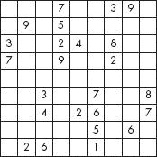

# 第五章：游戏和学习工具


每个人都知道游戏很有趣——游戏产业是**巨大的**。这一章将向您展示如何设计用于娱乐、学习和游戏的脚本。我发现编写生成游戏的脚本比编写解析防火墙日志的脚本有趣得多。但嘿，那只是我个人的看法。读一读这些，看看你有什么想法。第一个脚本是一个数独求解器，虽然不是一个游戏脚本，但它保证能找到每个数独谜题的解决方案！

# 数独求解器

## 数独求解器

### sudoku.rb

在您当地的报纸上，有一些事情您一直可以依赖。其中之一是填字游戏，另一个是单词拼图——也就是说，直到数独热潮来临。我发现自己偶尔会尝试解决这些谜题，但大多数时候，我会卡住或出错。如果我不能解决这个谜题，我就不得不等到第二天报纸出来，这很令人沮丧，因为那时候我通常已经忘记了谜题。为了缓解我的沮丧，我写了这个脚本。算法来自由 Edmund von der Burg 编写的 Perl 脚本([`www.ecclestoad.co.uk/`](http://www.ecclestoad.co.uk/))。

## 代码

` class SudokuSolver      def initialize(puzzle)          @@p = puzzle.split(//)      end             def solver        h=Hash.new       81.times do |j|          next if $p[j].to_i!=0           80.times do |k|             if k/9==j/9 || k%9==j%9 || k/27==j/27 && k%9/3==j%9/3              temp = $p[k]            else              temp = 0            end            h[temp] =1          end           1.upto(9) do |v|            next if h.has_key?(v.to_s)            $p[j]=v.to_s            solver          end          return $p[j]=0        end             puts "\n\nThe solution is:\n"        print "+-----------------------------+\n|"        1.upto(81) do |x|          print " #{$p[x-1]} "          if x%3==0 and x%9 !=0            print "|"          end          if x%9==0 and x%81 !=0            print"|\n|-----------------------------|\n|"          end          if x%81==0            puts "|"          end                end        puts "+-----------------------------+"        return      end    end   unless ARGV[0].length==81      puts "Your input was invalid.  Please try again."      puts "USAGE: ruby sudoku.rb <Sudoku puzzle on one line/no spaces with 0's  being the blanks>"      puts "Example:ruby sudoku.rb 000201600.....09605000"      exit  end   answer = SudokuSolver.new(ARGV[0])   puts "\n\n\nSolving puzzle, wait one moment..."  answer.solver`

## 运行代码

为了解决数独谜题，你必须将原始谜题配置作为命令行参数的一部分输入。对于每个空白，用零替换。如果谜题看起来像这样：



你的输入将是：

``**`ruby sudoku.rb 000700390090500000300240800700900200000000000003007008004026007000005060026001000`**``

## 结果

`解决方案是：+-----------------------------+ | 5  4  2 | 7  6  8 | 3  9  1 | |-----------------------------| | 6  9  8 | 5  1  3 | 7  2  4 | |-----------------------------| | 3  7  1 | 2  4  9 | 8  5  6 | |-----------------------------| | 7  6  5 | 9  8  4 | 2  1  3 | |-----------------------------| | 4  8  9 | 1  3  2 | 6  7  5 | |-----------------------------| | 2  1  3 | 6  5  7 | 9  4  8 | |-----------------------------| | 9  5  4 | 3  2  6 | 1  8  7 | |-----------------------------| | 1  3  7 | 8  9  5 | 4  6  2 | |-----------------------------| | 8  2  6 | 4  7  1 | 5  3  9 | +-----------------------------+`

## 工作原理

这个脚本与书中迄今为止讨论的每一个脚本都完全不同，所以请务必注意。主要区别在于使用了类及其内部的方法，而不是线性脚本执行。为了解决数独谜题，脚本需要递归地调用一个方法。*递归*是指一个方法作为子程序调用自身。要使用递归，首先需要有一个可以调用的方法。为了开始分析这个脚本，我们将从底部开始，然后跳回顶部。

如上所述，在运行脚本时，你必须将数独谜题作为命令行参数提供。如果你不提供一个 81 个字符的谜题，脚本会大声抱怨并退出 。解决谜题的第一步是初始化一个名为`answer`的`SudokuSolver`对象 。谜题作为初始化参数传递，然后通过`split`方法分解。`split`方法使我们能够将 81 个字符的字符串分解成小块，以便进一步操作。结果数组存储在类变量`@@p`中。对象初始化后，调用`solver`来解决谜题。

将脚本移动到顶部，你会看到定义了`solver` 。首先，创建一个哈希表来跟踪哪些值已被使用。接下来，我们进入一个循环，循环 81 次，因为数独谜题中有 81 个方块 。根据需要，分析数组`@@p`的每个索引以进行进一步计算。如果数组元素已经有一个不等于零的值，那么脚本将不会浪费时间解决那个数字——它已经提供了。如果数组元素包含一个零，那么脚本开始一个 80 次的第二个循环（数独谜题中所有方块的总数减去我们要解决的元素） 。在复杂的`if`语句  之后，脚本将保留零值不变或设置一个等于一的哈希表。这个`if`语句非常重要；它就是大多数魔法发生的地方。基于模运算和比较，脚本能够确定需要分析哪一行。

解决数独谜题可用的唯一数字是 1 到 9，因此为了不违反数独规则，哈希表会跟踪哪些数字已被使用 。如果一个数字在 1 到 9 的范围内已被使用，那么下一个数字就会被调用。

一旦找到一个尚未使用的数字，脚本开始它的递归；你可以看到`solver`方法在调用自己 。在所有循环都终止后，最后一步是输出解决方案。简单的方法是输出数组中每个元素的长字符串，但坦白说，那很丑。我发现输入原始谜题就足够具有挑战性了。

再次使用模运算符来确定何时开始新的行和列，脚本输出一个完美的数独谜题 。

# Flash Cards

## Flash Cards

### flashCards.rb

闪卡曾经是许多临时抱佛脚学生的救星。它们可以用来记忆历史日期、词汇、外语以及几乎所有值得记住的东西。如果你以前从未遇到过闪卡，我会给你一个简要的介绍。传统上，闪卡是使用三乘五的索引卡的两面制作的。你在索引卡的正面写一个问题，在背面写那个问题的答案。然后你可以测试自己，以通过你正在学习的任何内容。这个脚本可以调整为一个游戏（想想*Jeopardy!*）或学习工具，但我们将关注后者。脚本将提示你一个问题，你必须提供正确的答案，否则……

## 代码

` unless ARGV[0]      puts "\n\n 用法是 flashCards.rb <文件>\n\n"      exit  end    flash = []   card = Struct.new(:question, :answer)   File.open(ARGV[0], "rb").each do |line|      if line =~ /(.*)\s{3,10}(.*)/        flash << card.new($1.strip, $2.strip)      end  end   flash.replace(flash.sort_by { rand })   until flash.empty?      drill = flash.pop        print "#{drill.question}? "      guess = $stdin.gets.chomp       if guess.downcase == drill.answer.downcase             puts "\n\n 正确 -- 答案是: #{drill.answer}\n\n\n"      else             puts "\n\n 错误 -- 答案是: #{drill.answer}\n\n\n"      end  end`

## 运行代码

这个脚本需要一个基于以下格式的闪卡文件，问题和答案之间有五个空格：

``*`问题     答案`*``

要运行脚本，请提供闪卡文件作为参数。

```**``ruby flashCards.rb *`flash.file`*``**```

## 结果

脚本开始提示用户回答随机选择的问题。在这个例子中，我使用了一个英语到西班牙语的闪卡文件。输出如下：

`train? El traino 错误 - 答案是: el tren  orange? La naranja 正确 - 答案是: la naranja`

## 工作原理

脚本读取闪卡文件并为其打开读取权限 。在此之前，我们一直在使用已经定义好的数据结构，例如数组和哈希。有时你可能需要自定义自己的数据结构。我使用了 `Struct` 命令来创建自己的数据结构，称为 `card` 。

* * *

### 注意

*当你存储一个人的名字时，你应该将名字保存在一个字符串变量中。这些常见的数据结构是预定义的，以节省程序员的时间，但你也可以定义自己的数据结构，就像我使用`Struct`所做的那样。*

* * *

`card` 包含两个元素——`question` 和 `answer`。为了制作和收集所有闪卡，闪卡文件 `infile` 是逐行分解的。每个闪卡都被添加到一个名为 `flash` 的数组中 。一旦到达文件末尾，`flash` 数组就包含了带有问题和答案的完整卡片集合。我非常喜欢它！

所有的闪卡都已经创建好了——所以我们几乎准备好开始折磨用户进行测验了。我们需要确保问题之间有一定的随机性，所以`rand`函数出现了。结合`sort`和`replace`方法，`rand`使得提问变得稍微混乱和不可预测 。数组中的卡片数量将决定问题的数量 。随机选择一张卡片，`drill`，然后将`question`变量展示给用户 。用户输入从控制台的标准输入读取，并与`answer`进行比较。

如果用户的猜测是正确的，脚本会恭喜用户并询问另一个问题 。然而，如果需要更多的学习，并且用户回答错误，他将会看到一个大的 *错误* 标签，后面跟着正确的答案 。你可以想出一种不同的方式来表示错误的猜测——可能是一种对自尊心稍微温和一些的方式——但这种方法似乎已经传达了重点。

## 脚本破解

你可以对这个脚本进行很多调整。以下是一些启发你思考的想法：将询问的问题数量设为变量或者继续提问直到达到 100%的准确率。最后，脚本可以保持一个计分板，让用户在所有问题都问过之后知道他或她的表现如何。闪卡很棒，所以不妨试试。谁知道呢，也许你开始学习另一种语言了！

# 数字猜谜游戏

## 数字猜谜游戏

### guessingGame.rb

当你还是一个小孩的时候，这个数字猜谜游戏看起来足够简单：有人选择一个数字，你尝试猜出来。在这个脚本中，计算机进行的是伪随机数生成，这比你的朋友选择他最喜欢的数字要不可预测得多。当我写这段文字的时候，我开始想，“这听起来非常像成年人玩的游戏——彩票。”这有多疯狂？那个曾经让你作为小孩感到娱乐的游戏，现在作为成年人仍然很有趣。尽管彩票的回报要好得多，但几率要差得多。总的来说，这个游戏完全是关于机会的。

## 代码

` puts "\n 欢迎来到数字猜谜游戏！\n\n\n\n"  print "你希望选择哪个难度级别（低、中或高）："  level = gets.chomp  puts "输入 'q' 退出。\n\n\n\n\n"  min = 1   max = case level      when "medium" then 100      when "hard" then 1000      else               10  end   puts "神秘数字在 #{min} 和 #{max} 之间。\n\n"  magic_number = rand(max)+1   print "你的猜测是多少？ "  guess = gets.chomp   while guess =~ /\d/         case guess.to_i          when 0...magic_number              puts "太低了，再试一次。\n\n"          when magic_number              puts "\n 你猜对了！！！神秘数字是 #{magic_number}。\n\n\n"              print "按 'enter' 键继续。"              gets              exit          else              puts "太高了，再试一次。\n\n"          end      print "你的猜测是多少？ "      guess = gets.chomp  end   puts "无效输入，你输了。"`

## 运行代码

游戏开始不需要任何参数。输入以下内容：

``**`ruby guessingGame.rb`**``

## 结果

`欢迎来到数字猜谜游戏！  你希望选择哪个难度级别（低、中或高）：low 输入 'q' 退出。  神秘数字在 1 和 10 之间。你的猜测是多少？ 7 太低了，再试一次。 你的猜测是多少？ 9  你猜对了！！！神秘数字是 9。  按 'enter' 键继续。`

## 游戏玩法

整个脚本围绕三个变量展开：`min`、`max` 和 `guess`。为了开始游戏，脚本会要求设置难度级别。难度级别对应于计算机将从中选择的数字范围。难度级别如下：

> 低 = 1-10 中 = 1-100 高 = 1-1000

在脚本请求用户输入难度级别后，响应将通过一个 `case` 语句处理 。`case` 语句就像是一堆增强版的 `if` 语句。根据响应，脚本将设置 `max` 的值。注意，`min` 总是设置为 1。

只要用户继续提供有效的猜测，游戏将继续响应猜测是比秘密数字高还是低 。另一个 `case` 语句使得返回适当的响应变得非常容易 。如果猜测在 0 和 `magic_number` 之间，那么猜测就太低了。同样，如果猜测在 `magic_number` 和 `max` 之间，那么猜测就太高了。如果猜对了 `magic_number`，那么用户就赢了。不幸的是，玩这个脚本你不会赢得任何钱。

# 石头、剪刀、布

## 石头、剪刀、布

### rps.rb

我仍然在涉及另一个人且需要无偏见的意见的重大决策时使用剪刀石头布。我想我可以抛硬币，但剪刀石头布更有悬念。说真的，这个游戏在某些圈子中很受欢迎。如果你不知道，还有俱乐部和锦标赛来支持这个游戏。此脚本将成为你的练习伙伴，直到你进入高级别。

## 代码

` puts "\n\n 欢迎来到剪刀石头布！"  puts "这是一个机会游戏；电脑随机选择三种选择之一。"  puts "\n 石头胜剪刀，但被布打败。"  puts "剪刀胜布，但被石头打败。"  puts "布胜石头，但被剪刀打败。"   puts "r 代表石头"  puts "s 代表剪刀"  puts "p 代表布\n"  print "\n 请输入上述选项之一进行游戏： "   computer = "rsp"[rand(3)].chr  player = $stdin.gets.chomp.downcase   case [player, computer]        when ['p','r'], ['s','p'], ['r','s']      puts "\n\n 你赢了！"        when ['r','r'], ['p','p'], ['s','s']      puts "\n\n 你平局了！"  else      puts "\n\n 你输了！"  end   puts "电脑选择了：#{computer}"   puts "按<Enter>键继续。"  $stdin.gets`

## 运行代码

运行此脚本不需要命令行参数——只需全神贯注。只需输入：

``**`ruby rps.rb`**``

## 结果

我赢得了这场比赛，但我运气好。电脑似乎总是打败我。我可能不会在锦标赛上表现得那么好。获胜的游戏看起来是这样的：

`欢迎来到剪刀石头布！这是一个机会游戏；电脑随机选择三种选择之一。石头胜剪刀，但被布打败。剪刀胜布，但被石头打败。布胜石头，但被剪刀打败。r 代表石头 s 代表剪刀 p 代表布  输入上述选项之一进行游戏：r  你赢了！电脑选择了：s 按 Enter 键继续。`

## 它是如何工作的

任何游戏的第一步是输出规则和目标，这样用户就有公平的获胜机会！。之后，获胜完全取决于用户。此脚本输出正在使用的符号，并提醒用户剪刀石头布是一个机会游戏。字母 `r`、`p` 和 `s` 用作玩石头、剪刀或布的快捷方式。脚本的一个有趣之处在于找出如何为电脑生成随机选择，然后确定什么构成了胜利。

为了处理电脑的随机选择，我使用了 `rand` 方法，并将 `3` 作为参数传递，让该方法知道我只想要三种选项中的一个！。为了处理获胜条件，我需要用户输入，因此使用 `player` 存储用户的玩法！。请注意，用户实际上是在电脑已经选择之后做出选择的。

如果你考虑这个游戏，只有三种结果：赢、输或平局。同样，只有三种获胜方式和三种失败方式。与其为每种结果分别编写一个单独的`if`语句，我尝试将条件抽象化并将它们合并成一个简短的`case`语句 。如果玩家出石头，电脑出剪刀，那么玩家获胜。如果玩家出布，电脑出石头，那么玩家获胜。如果玩家出剪刀，电脑出布，那么玩家获胜 。如果玩家和电脑选择相同，则游戏视为平局 。如果有任何其他组合，则玩家失败。这个概述并不复杂；你只需要仔细思考一下。

最后，为了确保用户游戏没有被操纵，输出电脑的选择。使用语句`按<Enter>键继续`允许用户处理游戏的结论 。

## 脚本破解

如果满足平局条件，你可以通过添加重试选项来破解这个脚本。此外，进行三局或五局最佳，并记录分数，可能会很有趣。我对我的一个胜利感到满意，所以我会坚持这样做。如果你对剪刀石头布的选择不满意，你可以添加像斯波克和蜥蜴（见[`www.samkass.com/theories/RPSSL.html/`](http://www.samkass.com/theories/RPSSL.html/)）这样的东西。

# 单词拼图

## 单词拼图

### wordScramble.rb

正如我在 Sudoku Solver 上的"#29 数独求解器"中提到的，单词拼图是一款经典游戏。一个能够同时锻炼你的词汇量和吸引你注意力的游戏是非常迷人的。这款经典游戏可以在报纸、杂志甚至仅限于单词拼图的书籍中找到。但当你能定制自己的游戏时，谁还需要那些呢？

## 代码

` unless ARGV[0] and File.exists?(ARGV[0])      puts "\n\n 用法是 wordScramble.rb <word.file>\n\n"      exit  end  ` tries = 10   words = File.readlines(ARGV[0])  mystery_word = words[rand(words.size)].chomp  scramble_word = mystery_word.split(//).sort_by{rand}.join  scramble_word.downcase!   puts "\n\n\n 打乱的单词是:  #{scramble_word}"   puts "猜猜这个单词..."   puts "你还有 #{tries} 次猜测机会。"  guess = $stdin.gets.chomp.downcase  while guess =~ /[^Qq]/      if tries == 0          puts "\n\n 好尝试，但单词是: #{mystery_word}."          exit      elsif guess != mystery_word.downcase          puts "\n 你的猜测不正确。  #{tries -= 1} 剩余..."          puts "\n 打乱的单词是:  #{scramble_word}。"          guess = $stdin.gets.chomp.downcase      else          puts "\n\n\n 你猜对了，干得好!\n\n"          puts "按<Enter>键继续。"          $stdin.gets          exit      end  end`

## 运行代码

你需要一个单词列表，从中可以选择一个单词来打乱。字典单词列表是一个完美的例子：每行一个单词，字符数量不限。只需记住，单词越长，难度越高。要玩这个游戏，请输入：

```**``ruby wordScramble.rb *`word.file`*``**```

## 结果

```The scrambled word is:  yrbu Guess the word... You have 10 guesses left. **``*`yubr`*``**  Your guess was incorrect.  9 left...  The scrambled word is:  yrbu **``*`ruby`*``**  You got it, great job!  Press <Enter> to continue.```

## 工作原理

这个脚本是一个基本的单词打乱游戏。没有任何技巧：唯一的目标是猜测打乱的单词。猜测的次数是有限的。在这个脚本中，用户有 10 次机会猜测打乱的单词 。为了得到一个随机单词来打乱，脚本读取作为命令行参数传递的文件，并将内容保存到`words`中。然后选择一个随机单词并存储在`mystery_word`中。所有这些都在一行中完成 。我将为你分解这一行。首先，使用`rand`函数从 0 到`words.size`中选择一个随机数。然后，随机选择的`words.array`中的元素就是脚本将要打乱的单词。单词使用`chomp`方法进行清理，最后保存到`mystery_word`中。

现在已经随机选择了一个单词，我们可以开始混乱的游戏了。这个脚本的有趣之处在于如何足够地打乱`mystery_word`，使用户感到挑战。我选择打乱单词的方式是依赖于`split`、`rand`、`sort_by`和`join`方法 。`split`方法将单词拆分，然后`rand`和`sort_by`打乱单词，最后`join`将碎片重新组合。脚本的最后部分是处理用户的猜测 。只要用户没有输入 Q 来退出，游戏就会继续。显然，如果猜对了正确的单词，脚本将祝贺用户并退出。如果猜测不正确，只要`tries`大于零，用户就会得到另一次机会。

# 挂字游戏

## 挂字游戏

### hangman.rb

挂字游戏是另一种有趣的单词游戏！大多数人知道如何玩挂字游戏。如果用户不知道如何玩，规则很简单解释。随机选择一个单词，只知道字符的数量——有点像*幸运轮盘*。用户有六次机会猜出单词，否则人就会被绞死，游戏结束。

## 代码

` unless ARGV[0] and File.exists?(ARGV[0])      puts "\n\n 用法是 hangman.rb <word.file>\n\n"      exit  end   words = File.readlines(ARGV[0])  mystery_word = words[rand(words.size)].chomp  solution = Array.new(mystery_word.length, "-")  guessed = []  steps = 6   while steps > 0         puts <<EOM      \n\n\n 你还有 #{steps} 次猜测机会。      已猜出的字母：#{guessed}      Word:  #{solution}  EOM      print "输入一个字母或猜出单词: "      guess = $stdin.gets.downcase.chomp          if guess == mystery_word.to_s          puts "你被赦免了！"          exit      end             if guessed.include?(guess)          puts "你已经猜过那个字母了。再试一次..."          next        elsif mystery_word.include?(guess)          puts "那个字母被找到了。"          mystery_word.each_index do |x|              if mystery_word[x] == guess                      solution[x] = guess              end          end        else          puts "对不起，那个字母不正确。"      end      guessed << guess      steps -= 1  end   puts "\n\n\n 哎呀！  你被吊死了！"  puts "单词是：#{mystery_word}。"`

## 运行代码

挂人游戏脚本需要一个参数来指定选择单词的文件。

```**``ruby hangman.rb *`word.file`*``**```

## 结果

`你还有 6 次猜测机会。已猜出的字母：Word:  ---- 输入一个字母或猜出单词：r 字母被找到了。  你还有 5 次猜测机会。已猜出的字母：r Word:  r--- 输入一个字母或猜出单词：s 对不起，那个字母不正确。  你还有 4 次猜测机会。已猜出的字母：rs Word:  r--- 输入一个字母或猜出单词：t 对不起，那个字母不正确。  你还有 3 次猜测机会。已猜出的字母：rst Word:  r--- 输入一个字母或猜出单词：b 字母被找到了。  你还有 2 次猜测机会。已猜出的字母：rstb Word:  r-b- 输入一个字母或猜出单词：y 字母被找到了。  你还有 1 次猜测机会。已猜出的字母：rstby Word:  r-by 输入一个字母或猜出单词：e 对不起，那个字母不正确。  哎呀！  你被吊死了！单词是：ruby。`

## 如何工作

游戏开始的方式类似于 Word Scramble 中的"#33 Word Scramble"：脚本从单词文件中随机选择一个单词（作为命令行参数传递）。`guessed`用于跟踪已猜出的字母，并创建一个`solution`数组。

一个 while 循环控制着程序的流程 。用户有六次猜测的机会来猜出`mystery_word`。 (这六个步骤代表了用户的头部、身体、两个手臂和两条腿，以防你有所疑问。) 游戏开始时，会向用户展示已经猜出的字母和解决方案中的空格，并提示用户输入一个字母 。

如果用户输入了 `mystery_word`，则游戏获胜；这是对输入进行的第一次检查 。如果用户只输入了一个字母，则脚本会检查该字母是否包含在 `mystery_word` 中 。如果字母在 `mystery_word` 中未找到，脚本会告诉用户猜测另一个字母 。如果找到字母，则脚本开始施展其魔法。这是我找到的最有趣的脚本部分 。

`each_index` 方法用于遍历每个字母。我选择 `each_index` 而不是 `each` 的原因是 `each` 会返回每个索引处的字母。我只想使用每个字母的索引并比较字母。当你继续阅读时，你会明白原因。索引用于比较猜测的字母和 `mystery_word` 的当前字母。如果找到字母，则将解决方案中的相应索引设置为该字母 。这会在打印解决方案时揭示正确猜测的字母。此方法还会捕获重复的字母。

字母猜测的过程会一直持续，直到猜对正确的单词或者用户用完了机会。总体来说，脚本很短，但玩起来非常有趣。

# Pig

## Pig

### pig.rb

Pig 是我们这个时代不太为人所知的游戏之一，但无论如何，它是一个很有趣的游戏。它只需要一个六面的骰子。游戏的目标是通过添加投掷的总和来达到 100 分。在你的回合中，你可以想投多少次就投多少次，但如果投出 1 点，你将失去那个回合获得的所有分数，然后你的对手有机会积累分数。Pig 是一个简单的游戏，但它赢得胜利却出奇地困难。

## 代码

` puts "\n\n\n\n\n\n\n 欢迎来到游戏 PIG！"  puts "\n----说明----"  puts "游戏的目标是达到 100 分。"  puts "*** 注意，如果你掷出 1 点，你将失去 ***"  puts "*** 你的回合和你可能获得的任何分数。 ***"  puts "\n 祝你好运！"   puts "\n\n 按<Enter>键继续..."  gets   player1 = 0  player2 = 0  turn_total = 0  turn = true  d1 = rand(6)+1   puts "\n\n\n\n---玩家 1 掷骰子---"  puts "按<Enter>键再次掷骰子或按'h'键保持。"  input = gets.chomp.downcase   while input != 'q'        unless input == 'h'          if turn              puts "\n\n\n\n---玩家 1 掷骰子---"              puts "玩家 1 的总分是: #{player1}\n\n"          else              puts "\n\n\n\n---玩家 2 掷骰子---"              puts "玩家 2 的总分是: #{player2}\n\n"          end          d1 = rand(6)+1          puts "你掷出了: #{d1}\n\n"                       if d1 == 1                 puts "****很抱歉，你没有得分并且失去了你的回合。***"              puts "按<Enter>键继续..."              gets               turn_total = 0               input = 'h'               next           end                       turn_total = turn_total+d1           puts "你这一轮的总分是: #{turn_total}"             if turn_total >= 100               puts "你赢了！"               exit           end                    puts "按<Enter>键再次掷骰子或按'h'键保持。"           input = gets.chomp.downcase       else           if turn               player1 = player1+turn_total               puts "\n\n 玩家 1 的总分是 #{player1}\n\n"                 if player1 >= 100                   puts "\n\n 玩家 1 赢了！\n\n\n"                   exit               end               turn = false           else               player2 = player2+turn_total               puts "\n\n 玩家 2 的总分是 #{player2}"                  if player2 >= 100                   puts "\n\n 玩家 2 赢了！\n\n\n"                   exit              end              turn = true          end          turn_total = 0          input = 'other'      end  end`

## 运行代码

脚本无需任何参数即可自动运行。游戏在一台终端上由两个人轮流进行，试图提高自己的得分。执行后，阅读说明并成为第一个获胜的人：

``**`ruby pig.rb`**``

## 结果

`欢迎来到游戏 PIG！  ----说明---- 游戏的目标是达到 100 分。*** 注意，如果你掷出 1，你将失去你的 *** *** 轮次和你可能获得的任何分数。*** 祝你好运！按<Enter>键继续...  ---玩家 1 掷骰子--- 按下<Enter>键再次掷骰子或按'h'键保持。   ---玩家 1 掷骰子--- 玩家 1 的总分是：0  你掷出了：6  你本轮的总分是：6 按下<Enter>键再次掷骰子或按'h'键保持。   ---玩家 1 掷骰子--- 玩家 1 的总分是：0 你掷出了：6  你本轮的总分是：12 按下<Enter>键再次掷骰子或按'h'键保持。   ---玩家 1 掷骰子--- 玩家 1 的总分是：0 你掷出了：4  你本轮的总分是：16 按下<Enter>键再次掷骰子或按'h'键保持。   ---玩家 1 掷骰子--- 玩家 1 的总分是：0 你掷出了：4  你本轮的总分是：20 按下<Enter>键再次掷骰子或按'h'键保持。h   玩家 1 的总分是 20   ---玩家 2 掷骰子--- 玩家 2 的总分是：0  你掷出了：4  你本轮的总分是：4 按下<Enter>键再次掷骰子或按'h'键保持。   ---玩家 2 掷骰子--- 玩家 2 的总分是：0  你掷出了：1  ****非常抱歉，你得不到任何分数，并且将失去你的轮次。*** 按下<Enter>键继续...   玩家 2 的总分是 4   -----省略----- (在游戏中稍后回到玩家 1)    ---玩家 1 掷骰子--- 玩家 1 的总分是：53  你掷出了：3  你本轮的总分是：42 按下<Enter>键再次掷骰子或按'h'键保持。   ---玩家 1 掷骰子--- 玩家 1 的总分是：53  你掷出了：5  你本轮的总分是：47 按下<Enter>键再次掷骰子或按'h'键保持。   玩家 1 的总分是 100   玩家 1 获胜！`

## 工作原理

与大多数游戏一样，游戏中涉及运气。每当涉及运气时，通常在代码中可以找到一个`rand`语句。你可能想知道如何在 Ruby 中创建一个骰子。实际上非常简单。以下代码片段将创建一个六面骰子的响应：`rand(6)+1`。

脚本从为不熟悉 Pig 游戏的用户提供的说明开始 。接下来，初始化变量 。`player1`和`player2`将分别存储每个掷骰子结束后的玩家总分。`turn_total`将用于存储单个轮次的总分。`turn`将用于确定轮到哪位玩家掷骰子；`player1`为 true，`player2`为 false。最后一个变量`d1`是我们将在整个游戏中使用的骰子。

只要没有输入 Q，游戏就会继续进行，根据掷出 1 还是保持来改变轮次。如果玩家按下除'h'（保持）以外的任何键，骰子将被掷出 。如果玩家掷出 1，那么本轮的所有分数都将丢失，以及玩家的轮次 。如果掷出的不是 1，则骰子的总分将加到轮次总分上 。当玩家想保持时，轮次总分将加到玩家的总分上。

如果玩家的总分大于或等于 100 分，他或她将赢得游戏 。我还添加了一个不切实际的情况，即玩家在一次投掷中超过 100 分——非常不可能，但有可能 。

## 修改脚本

你可以修改这个脚本以使用两个骰子。只需添加一个`d2`变量，并在每次将其加到投掷总数时，将`d2`加到`d1`上。现在你已知如何创建骰子，能否重新创建更复杂的骰子游戏，比如克朗普斯？
