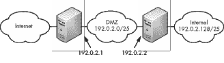

## 第十一章. TCP/IP 概述

*IPv6:*

*版本 4 的所有痛苦，*

*再加上全新的问题！*

 保护计算机很简单：将其从所有网络断开，移除所有输入和输出，并将其锁在地下掩体中。哦，等等——你想要系统*做*些什么吗？那么你可能想要将你的系统连接到互联网。

许多系统管理员对网络的基本知识有模糊的了解，但要成为一个真正合格的系统管理员，你需要真正理解一切是如何相互关联的。你不需要知道何时使用快速生成树，如何选择 BGP 和 OSPF 之间的区别，甚至这些缩写代表什么。但你必须知道 IP 地址是什么，子网掩码是如何工作的，端口号与协议号有何不同，以及为什么不能使用`telnet(1)`来测试 UDP 连接性。没有这些基本知识，你会感到迷茫。阅读本章并理解它，你将更容易说服你的网络管理员给你你需要的东西。

尽管本章提供了 TCP/IP 的概述，但它并没有涵盖协议中存在的无数细节、警告、烦恼、小缺点和明显的冒犯。如果你发现自己需要深入研究 TCP/IP 的细微之处，可以挑选一本关于这个主题的大厚书。查尔斯·M·科齐罗克的《TCP/IP 指南》（No Starch Press，2005 年）是一个很好的起点。

本章涵盖了 TCP/IP 版本 4（过去 30 多年广泛使用的互联网协议）和协议的新版本，TCP/IP 版本 6。尽管版本号不同，但这两个协议的相似之处更多。

我们将从网络层开始，然后深入探讨协议是如何工作的。

## 网络层

网络协议被分为几个层次。每一层处理特定的任务，并且只与直接位于其上方和下方的层交互。一开始，你可能会嘲笑这种层模型简化了网络过程的想法，但事实确实如此。现在要记住的重要事情是，每一层只与直接位于其上方的层和直接位于其下方的层（理论上是这样）进行通信。

经典的开放式系统互联（OSI）网络协议栈将网络表示为七层。这是一个详尽的完整模型，涵盖了几乎任何使用任何网络协议和任何应用程序的情况。因为互联网是一种非常特定的网络类型，而且这本书不是关于网络或网络应用的通用书籍，所以我将把 TCP/IP 的讨论限制在网络的四个特定层次：物理层、数据链路层、网络层和传输层。不用担心——这四层涵盖了互联网和（几乎）所有企业网络。

### 物理层

不论是铜线还是光纤电缆，甚至是无线电波，物理线缆都是网络的一部分。如果没有某种物理媒体来运行，网络就无法工作。从插入你桌面的 CAT5 电缆到连接你到亚洲的光纤电缆，所有这些都属于物理层。如果可以被绊倒、被挖掘或受到干扰，那么它就是物理层的一部分。为了简化起见，我将物理层称为*线缆*，尽管它可以有无数的形式。

这是最容易理解的一层。如果你的线缆符合物理协议的要求，那么你的网络就可以正常工作。如果不满足，你的网络将无法工作。互联网路由器的一项功能是将一种物理层连接到另一种物理层——例如，将本地以太网转换为 OC3 光纤连接。

物理层本身没有决策能力；所有在其上运行的内容都由数据链路层决定。

### 数据链路层

数据链路层是在物理线路上运行的协议。它将信息转换成实际信号，这些信号通过物理层发送，使用适合该物理媒体的适当编码，如下所示：

+   以太网和交换式多兆比特数据服务（SMDS）都使用媒体访问控制（MAC）地址和地址解析协议（ARP）。

+   以太网上的 IPv6 使用邻居发现（ND）。

+   拨号和广域网（WANs）使用点对点协议（PPP）或高级数据链路控制（HDLC）。

OpenBSD 支持其他常见的链路层协议，如以太网上的 PPP（PPPoE）。如果你有特殊的网络需求，请检查 OpenBSD 网站、邮件列表或 man 页面，看看这些需求是否得到支持。

一些数据链路层已经在许多不同的物理层上实现。例如，以太网已经在双绞线、同轴电缆、CAT3、CAT5、CAT6、CAT7、光纤和无线电波上实现。为了实现真正的设备独立性，我们已经看到 TCP/IP 与一个生物传输层一起实现：信鸽。^([27)]

通过对设备驱动程序进行少量修改，数据链路层可以处理任何类型的物理层。这是层简化网络的一种方式。

第十二章详细讨论了以太网，因为它是 OpenBSD 系统中最常见的网络类型。一旦你了解了以太网的工作原理，你将不会在需要时添加新的数据链路协议时遇到困难。

数据链路层与物理层和网络层交换信息。

### 网络层

网络层是映射网络节点之间连接的部分，回答诸如“其他主机在哪里？”和“我能从这里到达那里吗？”等问题。这种逻辑协议为在网络中运行的程序提供了一个一致的接口，无论物理和链路层看起来如何。

互联网上使用的网络层协议是互联网协议，或 IP。版本 4（IPv4）和版本 6（IPv6）为每个主机提供一个或多个唯一的 *IP 地址*，以便网络上的任何其他主机都可以找到它。好吧，IPv4 网络地址转换破坏了“唯一地址”规则，但你的网络仍然在某处有一个唯一的 IP 地址。

网络层与其下方的链路层和上方的传输层进行通信。

### 传输层

传输层是实际数据流动的地方。最常用的三种传输层协议是互联网控制消息协议（ICMP）、传输控制协议（TCP）和用户数据报协议（UDP）。

ICMP 在具有 IP 地址的主机之间传递基本的连通性消息。如果 IP 提供道路和地址，ICMP 则提供交通灯和高速公路出口标志。大多数时候，ICMP 在后台默默运行。

UDP 和 TCP 是携带主机之间实际数据的协议，它们如此普遍，以至于整个互联网协议套件通常被称为 TCP/IP。UDP 是一个基本的传输协议，提供在网络上传输数据所需的最少服务。它的简约性意味着，如果你想精确地定制应用程序中数据的流动方式，你可以使用有效的 UDP 构建它。TCP 提供了更复杂的功能，如完整性检查和拥塞控制，但许多设置都是硬编码的。

除了这三个之外，还有许多其他协议在传输层运行。文件 */etc/protocols* 包含了一个相当全面的传输协议列表，这些协议建立在 IP 之上。虽然它列出了你实际上在野外可能遇到的许多更多协议，但它不包括 IPX/SPX 或数字设备公司的 DECnet 这样的非 IP 协议。

例如，让我们看看 */etc/protocols* 文件中的第一个条目：

```
ip      0       IP HOPOPT       # internet protocol, pseudo protocol number
```

每个 */etc/protocols* 条目有三个关键字段：官方名称、协议号和任何别名。IP 协议，协议号 0，被称为 IP，(*非常偶尔*)也称为 HOPOPT。每个协议还有一个注释，提供一些上下文。尽管 */etc/protocols* 中的一些协议已经消失，但一些古老的设备可能仍在使用它们。

注意，当在 IPv4 与 IPv6 上运行时，ICMP、TCP 和 UDP 略有不同。每个协议在 IP 数据包头部都有明确定义的字段，为校验和、目标地址等留出特定的位数。你不能在不兼容的网络协议上运行传输协议——TCPv6 在 IPv4 上根本无法工作。

传输层与下方的网络层和上方的应用层进行通信。

### 应用程序

应用程序无疑是网络的一部分。应用程序请求网络连接，通过网络发送数据，从网络接收数据，并处理这些数据。网页浏览器、电子邮件客户端、JavaServer Pages (JSP) 服务器等都是网络感知应用程序的例子。应用程序只需要与传输协议和用户进行通信。OSI 网络模型的顶层三层都在应用程序内部。

用户层的问题超出了本书的范围，但我发现许多这些问题可以通过正确应用大型链锯来解决。

## 网络请求的生命周期

那么在现实世界中，所有这些层是如何结合在一起的？让我们看看一个假设的网络请求，并逐步了解数据是如何穿越各层和网络。

### 注意

这部分讨论的一些内容涉及本章后面将要讨论的主题，因此您在完成本章后可能需要重新阅读本节。纯粹主义者会注意到我跳过了许多过程的部分，但我试图传达 TCP/IP 在实际中是如何工作的基本原理，而不是详细描述真实网络事务的每一个痛苦细节。

假设一个连接到您网络的用户想查看一个非常重要的与工作相关的网站，例如 Scott Meyer 的 Basic Instructions (*[`www.basicinstructions.net/`](http://www.basicinstructions.net/)*)。用户打开浏览器，输入 URL，然后按回车键。浏览器应用程序将用户的请求转换成正确的格式，并请求传输层与特定 IP 地址的 80 端口建立 TCP 连接。

您计算机内的传输层会检查浏览器的请求，并为它分配适当的资源。请求被分解成可消化的数据块，称为*段*，然后传递给网络层。

网络层并不关心请求的内容；它只关心数据去向何方。网络层将 TCP 数据附加适当的寻址信息。由此产生的数据块称为*数据包*。网络层检查数据包的目的地，选择离该目的地最近的接口，并将数据包下放到数据链路层。

数据链路层并不关心数据包的内容，当然也不关心 IP 地址或路由。它被赋予了一块零和一的数据，其任务是将这些零和一传输到另一个网络节点。数据链路层向数据包添加适当的头部和/或尾部信息，创建适合物理层的*帧*。帧的头部和尾部包含物理层的寻址信息。在大多数网络中，数据链路层为本地以太网准备帧，然后将帧传递给物理层进行传输。

物理层完全没有智能（想想信鸽）。数据链路层将一个帧交给物理层，物理层将这个帧传输到另一个物理设备。对于 Web 浏览客户端来说，这通常是本地以太网的默认路由器。物理层不关心上层协议。它的唯一任务是确保帧无错误地到达目的地。

当客户端计算机的路由器接收到帧时，它将其发送到数据链路层。数据链路层移除帧信息，并将得到的包交给网络层。路由器的网络层检查包，查看其路由表，并决定通过哪个接口发送。这可能是一个以太网接口、T1、DS3、OC3 或路由器用于上行连接的任何其他接口。一旦路由器选择了一个接口，它就将包交给该接口的数据链路层。

本地路由器的上行连接可能要通过一系列路由器。每个路由器根据其路由表决定将请求发送到哪里。请求在传输过程中可能穿越各种数据链路层。多亏了分层和抽象，你或你的计算机不需要了解任何关于它们的信息。

当请求到达目的地时，交易另一端的计算机接受该帧并将其发送回整个协议栈的上层。该帧被分解成数据包，数据包再分解成段，然后重新组装成数据流。随后，数据流被交给应用程序（在这种情况下，是一个 Web 服务器）。应用程序处理请求并返回一个答案，该答案沿着协议栈向下传递并通过网络传输，在必要时在各个数据链路层上下弹跳。

这个例子说明了层模型的重要性：每一层只知道它绝对必须了解的上下层的信息，这使得在必要时可以更换层。当创建一个新的数据链路协议时，其他层不需要改变。网络层只需将包交给数据链路层，并让数据链路层完成其工作。当你安装一个新的网络卡时，你只需要一个与数据链路层和物理层接口的驱动程序；你不需要更改网络栈中的任何更高层。

## 网络栈

网络栈是允许主机与网络通信的软件。主机可以运行 IPv4-only 网络栈、IPv6-only 网络栈或双栈配置。

你已经熟悉了 IPv4-only 栈——这是过去 30 年中大多数主机运行的方式。IPv4-only 栈只能在 IPv4 上通信。今天，IPv4-only 栈可以让你访问整个互联网，但有少数故意排除的例外。这将在几年后不再成立。

同样，仅 IPv6 栈可以与仅 IPv6 主机通信。由于大多数互联网站点尚未支持 IPv6，目前运行仅 IPv6 栈并不实用。然而，这是一个测试你的 IPv6 基础设施和连接性的绝佳方式。

目前最常见的配置是双栈设置。客户端主机尝试同时使用 IPv4 和 IPv6，优先选择其中一个。我建议配置双栈主机，优先选择连接性更好的栈。（如果你通过隧道获得 IPv6 连接，它不如你的 IPv4 连接快。）如果你有相等的 IPv4 和 IPv6 连接，使用你喜欢的任意一个。IPv6 工作得足够好，以至于我经常在分析我的流量之前都没有意识到我在使用它。

在 OpenBSD 上启用 IPv6 不需要做任何特殊的事情——一个 IPv6 地址，一个默认路由器和一个 DNS 服务器，然后就可以使用了。

## IPv4 地址和子网

*IP 地址* 是分配给特定网络节点的唯一 32 位数字。一些 IP 地址更永久一些，例如分配给关键服务器；其他则根据需要更改，例如桌面客户端使用的地址。共享网络上的单个机器使用分配给该网络的地址范围内的 IP 地址。

与将 32 位地址表示为单个数字相比，IP 地址被分为四个 8 位数字，通常以十进制表示。虽然 192.0.2.1 和 11000000.00000000.00000010.00000001 代表相同的地址，但第一种选项更容易让我们这些脆弱的小脑理解。

互联网服务提供商（ISP）以块的形式发行 IP 地址。这些块是它们可以给你提供的最小分配——比如 16 或 32 个地址。如果你的系统在服务器农场，你可能只能从 256 个地址的块中获得几个 IP 地址。

*子网掩码* 表示分配给本地网络的 IP 地址块的大小。你的 IP 块的大小决定了你的子网掩码——或者，你的子网掩码决定了网络有多少个 IP 地址。

ISP 通过前缀长度发行 IP 地址，通常称为 *斜线*。你会看到 IP 地址块以如下形式描述：192.0.2.128/26。每个与网络工作过的人都已经见过子网掩码 255.255.255.0，大多数人知道它与 256 个 IP 地址的块相关联。这个子网掩码也称为 /24。斜线后面的数字是子网掩码中固定位的数量。记住，IPv4 地址是一个 32 位数字；在一个 /24 网络上，24 个这些位永远不会改变。

这不是一本二进制数学教科书，所以我不打算就转换进行测验，但请将 IP 地址视为一串 32 个二进制位。在你的网络上，你可以更改最右边的位，但不能更改最左边的位。但左右分界的线在哪里呢？

子网掩码传统上是在 8 位边界上分割的，但并没有硬性规定它们必须这样。/25 网络有 25 个固定位——比过去所说的 C 类网络多一个固定位——剩下 7 位可以操作。子网掩码的固定位设置为 1，而你的网络位设置为 0，如下面的/25 子网掩码示例所示：

```
11111111.11111111.11111111.10000000
```

前三个块设置为二进制的 11111111，即十进制的 255。最后一个块设置为 1000000，即 128。将这些数字组合起来，你得到的子网掩码是 255.255.255.128。

如果你将子网掩码转换为二进制，它们就很容易理解。虽然你不必每天都处理这个问题，但如果你不理解其背后的概念，十进制转换看起来就像是一堆乱码。稍微练习一下，你就会识别出某些十进制字符串是合法的子网掩码。

所以现在你知道了子网掩码是如何工作的，这一切在现实世界中究竟意味着什么呢？

IP 地址以 2 的倍数发放。如果你有 4 位可以操作，你就有 16 个地址（2⁴=16）。如果你有 8 位可以操作，你就有 256 个地址（2⁸=256）。如果有人说你正好有 17 个 IP 地址，那么你要么与其他人共享网络，要么他们错了。

通常可以看到主机 IP 地址后面附有子网掩码，例如 192.0.2.130/26。这为你提供了将主机连接到本地网络所需的一切。（查找默认网关是另一个问题，但通常它是该块中的顶部或底部地址。）

### 计算十进制 IPv4 子网掩码

从二进制到十进制再到二进制的转换容易出错且有些烦人。以下是如何在十进制领域计算你的子网掩码的方法。

查找你的网络上有多少 IP 地址。这将是 2 的倍数，几乎肯定小于 256。从 256 中减去你拥有的 IP 地址数量。这是你的子网掩码的最后一位数。然而，你仍然需要识别合法的网络大小。如果你的 IP 地址是 192.0.2.251/26，你需要知道/26 是 26 个固定位，或 64 个 IP 地址。你的子网掩码是 255.255.255.192（256–64=192）。

我还应该提到，子网掩码偶尔也会以十六进制形式出现。

在你带着这本书来我家反复殴打我之前，表 11-1 显示了/24 和更小网络的子网掩码、IP 信息和相关信息。

表 11-1. 表 11-1：IPv4 子网掩码和 IP 地址转换

| 前缀 | 二进制掩码结束 | 十进制掩码 | 十六进制掩码 | 可用 IP 地址 |
| --- | --- | --- | --- | --- |
| /24 | 00000000 | 255.255.255.0 | 0xffffff00 | 256 |
| /25 | 10000000 | 255.255.255.128 | 0xffffff80 | 128 |
| /26 | 11000000 | 255.255.255.192 | 0xffffffc0 | 64 |
| /27 | 11100000 | 255.255.255.224 | 0xffffffe0 | 32 |
| /28 | 11110000 | 255.255.255.240 | 0xfffffff0 | 16 |
| /29 | 11111000 | 255.255.255.248 | 0xfffffff8 | 8 |
| /30 | 11111100 | 255.255.255.252 | 0xfffffffc | 4 |
| /31 | 11111110 | 255.255.255.254 | 0xfffffffe | 2 |

当您不想做数学题时，可以参考表 11-1 或安装`ipcalc`包进行快速子网掩码计算。不要说我从未同情过我的读者.^([28])

### 查看 IPv4 地址

使用`ifconfig(8)`显示 IP 地址。如果您不带任何参数运行`ifconfig`，它将显示机器上的所有接口。

```
$ **ifconfig fxp0**
…
        inet 192.0.2.226 netmask 0xfffffff0 broadcast 192.0.2.239
        inet 192.0.2.231 netmask 0xffffffff
…
```

以`inet`开头的行是 IPv6 地址。此接口的主要 IPv4 地址为 192.0.2.226，次要的或*别名*地址为 192.0.2.231。您还可以看到这些地址的子网掩码和子网的广播地址。

### 不可用的 IPv4 地址

每个 IPv4 地址块都为网络预留了第一个和最后一个 IP 地址用于使用：

+   块中的第一个 IP 地址是*网络地址*，用于分隔网络（以及在原始 BSD 系统中，广播地址）。在/24 网络中，这将是一个以.0 结尾的地址。

+   块中的最后一个 IP 地址是*广播地址*。在/24 网络中，广播地址以.255 结尾。

### 注意

根据 IP 规范，网络上的每台机器都应该对广播地址的请求做出响应。不幸的是，在 20 世纪 90 年代末，这一特性被用作攻击技术：您只需在任何给定网络上 ping 广播地址，就会得到当前所有正在使用的 IP 地址列表。因此，现在大多数操作系统和网络设备默认禁用了这一功能。

在网络中，您不能将第一个或最后一个 IP 地址分配给设备而不冒网络问题的风险。一些系统会优雅地失败，其他系统会痛苦地失败，而极少数系统能够正常工作。尽管 OpenBSD 不会反对您使用顶部和底部的网络地址，但第一次插入通用打印机或其他嵌入式设备时，请做好混乱的准备。只需一个不灵活的设备就能毁掉您一整天。

### 特殊 IPv4 地址

许多 IPv4 地址块被预留用于特定目的。尽管您不需要了解所有这些，但您会经常看到两组。要获取为特殊目的预留的 IPv4 子网的完整列表，请阅读 RFC 5735 和 RFC 6598。

#### 本地主机

地址范围 127.0.0.1/8 被预留用于*本地主机*，即机器自己的地址。每个类 Unix 系统——以及大多数其他操作系统——都将 127.0.0.1/8 附加到回环接口。所有设备都知道 localhost 地址是特定机器的本地地址。发往或来自 127.0.0.0/8 的数据包永远不应该跨越网络；同样，仅绑定到 127.0.0.1 的守护进程只能在本地机器上访问。

#### 私有网络

互联网标准 RFC 1918 为私有网络和位于网络地址转换（NAT）设备之后设置了三个网络：10.0.0.0/8、172.16.0.0/12 和 192.168.0.0/16。虽然公共 IP 地址必须由 ISP 颁发，但只要这些主机不直接暴露在公共互联网上，任何人都可以使用这三个块内的地址。如果你有一个主机无法访问互联网的网络，或者如果你通过代理服务器或 NAT 提供互联网接入，你可以使用 RFC 1918 网络。

### IPv4 地址分配的陷阱

众所周知，网络中的每台计算机都会为其每个网络接口分配一个单独的 IP 地址。一台计算机，一块网卡，一个 IP 地址——简单，对吧？

并非总是如此。一些专用接口（例如那些用于数据包嗅探的接口）在没有 IP 地址的情况下也能按预期工作，许多操作系统也允许你通过一个称为*别名*的过程为单个网络接口分配多个 IP 地址。你还可以将多个物理网卡绑定成一个单一的网络接口，为计算机提供一个大的虚拟接口。虽然你可能不会每天处理这些配置，但在故障排除时请记住这些。

## IPv6 地址和子网

IPv4 存在一个基本问题：它只提供了 42.9 亿个地址，这远远不够。没有子网划分，这意味着每个人不到一个地址。最终，每个人至少会有一台 IP 设备。

虽然 IPv4 地址尚未耗尽，但它们正变得越来越稀缺。早期过于慷慨的分配，以及为特殊目的预留的大量地址空间，加速了地址的耗尽。世界正缓慢地走向 IPv4 的替代品：IPv6。

世界上的某些地区已经广泛使用 IPv6。即使你的网络今天不使用 IPv6，总有一天你会需要它——可能毫无预兆。现在做好准备，否则你可能会发现你在一周前就需要它了。

### IPv6 基础知识

与 IPv4 一样，IPv6 是一个网络层协议。IPv4 使用 32 位地址，通常表示为四组从 0 到 255 的十进制数字（例如，192.0.2.13）。IPv6 使用 128 位地址，表示为六组由冒号分隔的四位十六进制字符（例如，2001:db8:0:bad:c0de:cafe）。128 位的地址空间为地球上的每个原子提供了超过 10 个 IPv6 地址。TCP、UDP、ICMP 和其他协议在其之上运行。IPv6 有自己的第二层协议，即邻居发现协议，它取代了如以太网的 ARP 协议。

好消息是，你不需要重新学习网络的基础知识。主机仍然需要一个 IP 地址和一个默认网关，路由器仍然使用路由表，你几乎可以——*几乎可以*——用 IPv6 地址替换 IPv4 地址并观察一切正常工作。Web 服务器不在乎它绑定到 192.0.2.13 上的 80 端口还是绑定到 2001:db8:a12a:bad:c0de:café 上的 80 端口。服务器只是接受发送给它的请求并相应地做出响应。话虽如此，软件确实需要稍作改变，因为我们的 Web 服务器必须能够记录来自 IPv4 和 IPv6 地址的连接。这些变化具有深远的影响，我们将在接下来的十年里解决边缘情况。但总的来说，一旦你了解了 IPv6 的新规则，你的所有网络知识都适用。

### 理解 IPv6 地址

正如所述，IPv6 地址是 128 位，表示为六个由冒号分隔的四位十六进制字符组。与十进制 IPv4 地址一样，你不需要在每个组中显示前导零。地址 2001:db8:0:bad:c0de:cafe 也可以写成 2001:db8:0000:0bad:c0de:cafe，但就像我们不会写 192.000.002.013 一样，我们在 IPv6 地址中省略了前导零。29]

IPv6 地址通常包含一长串零。这与子网划分有关，我将在本节后面描述。截至本文撰写时，Sprint 网站的 IPv6 地址是 2600:0:0:0:0:aaaa。当连续的组只包含零时，如这个地址，它们将被两个冒号（`::`）替换。这个 IP 地址通常显示为 2600::aaaa。但是，每个地址只能这样做一次。例如，你不能有地址 2600::1::1，因为这会导致歧义。2600::1::1 代表 2600:0:0:1:0:1 还是代表 2600:0:1:0:0:1？我不知道，你的服务器也不知道。

你可能见过在 IPv4 地址中添加端口号，例如 192.0.2.13:80。使用冒号将端口号粘接到 IPv6 地址上可能会造成混淆。IPv6 地址 2001:db8::bad:c0de:cafe:80 并没有歧义，但如果你快速阅读，可能会错过双冒号并认为这是一个以 80 结尾的 IP 地址。如果你要向 IPv6 地址添加端口号，请将地址用方括号括起来，例如 [2001:db8::bad:c0de:cafe]:80。

### 查看 IPv6 地址

使用 `ifconfig(8)` 查看你机器上分配的所有 IPv6 地址。在这里，我给 `ifconfig` 赋予了我的网卡名称，`fxp0`。

```
$ **ifconfig fxp0**
…
       inet 192.0.2.13 netmask 0xfffffff0 broadcast 198.0.2.255
       inet6 fe80::bad:c0de:cafe%fxp0 prefixlen 64 scopeid 0x2
       inet6 2001:db8::bad:c0de:cafe prefixlen 64 autoconf pltime 604399 vltime 2591599
…
```

以 `inet6` 开头的行是我的 IPv6 地址。此接口已分配了两个 IPv6 地址：`fe80::bad:c0de:cafe%fxp0` 和 `2001:db8::bad:c0de:cafe`。（等等……那个 `%fxp0` 是从哪里来的？你将在链路本地地址中找到答案。现在，只需点头微笑，继续阅读。）

### IPv6 子网

与 IPv4 不同，IPv4 可以在任何位进行子网划分，IPv6 通常在冒号边界进行子网划分。冒号每 16 位出现一次，所以自然的 IPv6 子网是/16、/32、/48 和/64。尽管 IPv6 标准建议使用/64 作为可能的最小网络，但许多运营商为了特殊目的使用/80、/96 和/112 网络。 (我也见过一些人使用不在 16 位边界划分的子网。我不会涉及这些，但当你遇到/51 子网时，不要让你的大脑崩溃。) IPv6 子网总是以斜杠表示，也称为*前缀长度*，所以你不会看到类似于 IPv4 中的 ffff:ffff:ffff:ffff::的子网掩码。

互联网服务提供商通常被分配/32 或/48 子网，并预期向最终用户网络（如典型的家庭网络）分配/64 网络。如果互联网服务提供商向用户分配/64 子网，最终用户网络将提供 2⁶⁴ 个 IP 地址，即 18,446,744,073,709,551,616 个 IP 地址。（这足以满足任何数量的电视、电话、冰箱、水龙头、吸尘器和网络化的玉米卷饼。）

当你在 16 位边界进行子网划分时，每个网络都有 65,536 个子网，其大小比下一个更小的子网小。一个/32 包含 65,536 个/48 网络，一个/48 包含 65,536 个/64 网络。

### 特殊 IPv6 地址

与其前身类似，IPv6 为特殊目的预留了几个地址块。你不需要记住所有这些预留地址，但其中一些会在日常使用中出现。

#### 本地主机

IPv6 的本地地址::1/128 在 IPv4 中工作方式与 127.0.0.1 类似：它始终指向本地机器。在 OpenBSD 中，::1/128 始终分配给`lo0`接口。

#### 链路本地地址

以 fe8*x*:开头的地址（其中*x*是可变的）仅限于其接口。每个链路都有这样的*链路本地*地址，这些地址仅在特定的本地网络上有效。即使 IPv6 网络没有路由器，本地直接连接网络上的主机也可以使用这些本地地址找到彼此并进行通信。这些网络总是/64 子网。你会在其他接口和与你的网络完全断开的网络上看到相同的 IPv6 子网。这是可以的。这些地址仅限于链路。例如，这是一个 OpenBSD 机器上的链路本地地址：

```
inet6 fe80::bad:c0de:cafe**%fxp0** prefixlen 64 scopeid 0x2
```

此接口的链路本地地址是`fe80::bad:code:cafe`。尾部的`%fxp0`表示此地址仅限于接口`fxp0`，并且不能在机器上的任何其他接口上使用。如果你的机器有一个`fxp1`接口，并且该网络上的主机尝试访问地址 fe80::bad:code:cafe，这台机器将不会响应。这个特定的地址仅对连接到接口`fxp0`的网络有效。

你可能会注意到，链路本地地址与该网络上的公共 IPv6 地址有一个共同的区域。这是因为自动配置的 IPv6 地址通常是从接口的物理地址计算出来的；无论这个自动配置的地址是公共地址还是链路本地地址，这都不重要。

### 分配 IPv6 地址

IPv6 客户端通常可以通过*路由器发现*使用自动配置，这是一个 IPv6 协议，其中路由器向客户端宣布其在网络上的存在和合法地址。不幸的是，IPv6 自动配置不支持常见的动态主机配置协议（DHCP）选项，例如分配域名系统（DNS）服务器，更不用说用于无盘配置的选项了。如果你已经配置了 DNS 服务器——即使是在双栈主机上可访问的 IPv4 服务器——自动配置也能正常工作。如果你运行一个仅 IPv6 的网络，你必须要么设置一个 IPv6 DHCP 服务器向客户端提供 DNS 服务器信息，要么手动配置 DNS 服务器。

服务器不应使用 IPv6 自动配置。服务器通常需要一个静态 IP 地址，即使在 IPv6 中也是如此。同样，路由器也不能使用自动配置。如果一个主机可以转发数据包，它需要一个静态的 IPv6 地址。

你可以通过使用别名将多个 IPv6 地址分配给单个接口，就像在 IPv4 中一样。

在 IPv6 中，/64 网络上的客户端可以使用自动配置。

IPv6 自动配置类似于简化的 DHCP 服务。路由器广播子网和网关信息，主机配置自己使用它。小于/64 的网络上的主机必须手动配置。

## 补救性 TCP/IP

现在你已经对 IP 系统的工作原理有了简化的概述，让我们深入探讨一个真实的网络协议。互联网上占主导地位的传输协议是互联网协议上的传输控制协议，或 TCP/IP。尽管 TCP 是一种传输协议，IP 是一种网络协议，但这两个协议紧密交织在一起，通常被统称为一个实体。

我们将从 ICMP 开始，然后继续到 UDP 和 TCP。

### ICMP

ICMP 用于在网络中传输路由和可用性消息。工具如`ping(8)`和`traceroute(8)`使用 ICMP。ICMP 包括各种不同的协议和工具。

虽然有些人声称出于安全目的需要阻止 ICMP，但这些人并不理解 ICMP 与更为人熟知的传输协议 TCP 和 UDP 一样多样化。适当的 IPv4 网络性能需要大量的 ICMPv4。如果你必须出于安全原因阻止 ICMPv4，请选择性地进行。例如，阻止源抑制消息会破坏路径最大传输单元（MTU）发现，这会让你直接进入一个痛苦的世界。如果你不理解最后一句话，请不要阻止 ICMPv4。

没有 ICMPv6，IPv6 就无法工作，因为 IPv6 不支持数据包分片，所以永远不要阻止 ICMPv6。如果你不知道数据包分片是什么，就相信我吧.^([30])

### UDP

UDP 是在 IP 上运行的最为基础的传输协议。它不提供错误处理，最小化完整性验证，并且对数据丢失没有任何防御措施。传输协议认为 UDP 的每个数据包都是完全自包含的；在协议层没有数据一致性检查。尽管存在这些缺点，UDP 对于某些类型的数据传输来说仍然是一个不错的选择，许多重要的互联网服务都依赖于它。

### 注意

本讨论涵盖了 UDPv4 和 UDPv6。尽管每个都只运行在相应的网络协议上，但在其他方面它们的行为是相同的。

UDP 也是一个数据报协议，这意味着每次网络传输都是完整且自包含的，并且作为一个单一的整体接收。尽管应用程序可能不会将单个 UDP 数据包视为一个完整请求，但网络会。

当一个主机通过 UDP 传输数据时，它无法知道数据是否到达了目的地。接收 UDP 数据的程序只是监听网络并接受任何到达的数据。当程序通过 UDP 接收数据时，它无法验证数据的来源。尽管每个 UDP 数据包都包括一个源地址，但这个地址很容易被伪造。每个 UDP 数据包都包括一个数据包校验和，但没有对整个数据流的完整性检查。这就是为什么 UDP 被称为*无连接的*或*无状态的*。

没有完整性检查，没有防止数据丢失的防御措施，伪造数据包的可能性——所有这些都听起来非常不可靠。那么为什么还要使用 UDP 呢？

基于 UDP 的应用程序通常有自己的错误纠正方法，或者与更可靠协议（如 TCP）不兼容。例如，简单的客户端 DNS 查询必须在几秒钟内超时，否则用户会无法控制地抱怨。TCP 连接只有在两分钟后才会超时。DNS 需要快速失败，并且每个事务只有一个数据包，这使得 UDP 比 TCP 更适合简单的 DNS 查询。实时流媒体服务，如视频会议应用程序，也使用 UDP。（毕竟，如果在视频会议中丢失了一些像素，你不想一分钟后还看到这些像素。）大多数其他基于 UDP 的应用程序出于类似的原因使用 UDP。

由于 UDP 协议本身在连接到端口时不会返回任何内容，因此没有可靠的方法来远程测试 UDP 端口是否可达（尽管像`nmap`这样的工具试图这样做）。

如果你需要一个在网络层做出响应的协议，请查看 TCP。

### TCP

TCP 包括一些巧妙的功能，如错误纠正和恢复。接收方必须确认它收到的每个数据包；否则，发送方会重新传输任何未确认的数据包。与 UDP 不同，使用 TCP 的应用程序可以期待可靠的数据传输。这使得 TCP 成为一个*连接的*或*有状态的*协议。

### 注意

本讨论涵盖了 TCPv6 和 TCPv4。尽管它们因为其底层传输协议的不同而有所区别，但它们的行为方式是相同的。

TCP 也是一个*流协议*，这意味着单个请求可以被分割成几个网络数据包。虽然发送者可能会连续发送几个数据块，但这些数据可能会乱序到达或碎片化。接收者必须跟踪这些数据块并正确组装它们以完成网络事务。

为了主机之间交换 TCP 数据，它们必须为数据流建立一个通道。一个主机请求建立连接，另一个主机响应请求，然后第一个主机开始传输。这个过程被称为*三次握手*。同样，一旦传输完成，系统必须进行一定的工作来断开连接。

要测试 TCP 端口是否开放，你可以使用`telnet(1)`或`nc(1)`连接到该端口。在这里，我看看我是否可以连接到`caddis`主机的端口 22。

```
  $ **telnet caddis 22**
  Trying 192.0.2.35…
  Connected to caddis.
  Escape character is '^]'.
  SSH-2.0-OpenSSH_6.0
**1** **^]**
**2** telnet> **c**
  Connection closed.
```

我连接到远程端口并查看端口显示的信息，使用 telnet 的转义字符**`^]`**（CTRL-]）断开连接**1**，并输入**`c`** **2**关闭 telnet。

TCP 通常被适用于其相当通用的超时和传输特性的应用程序使用，例如电子邮件程序、FTP 客户端和网页浏览器。

### 协议如何协同工作

你可以将网络堆栈比作在假日晚餐时与家人一起坐下。数据链路层（在以太网的情况下是 ARP）让你看到桌子上的每个人。IP 为桌子上的每个人提供他们自己的独特椅子（除了使用钢琴凳 NAT 的双胞胎）。ICMP 提供基本、低层信息，例如“到达烤红薯最快的方式是让迈克叔叔递给你”？^([31]) 或者“丽兹阿姨抬不起火腿盘。”TCP 是你递给别人黄油，而另一个人必须说“谢谢”你才能放手的地方。UDP 就像向露卡斯奶奶扔一个面包卷；她可能接住它，或者它可能弹回她的额头。

### 传输协议端口

传输协议端口允许一个服务器通过单个传输协议提供多种不同的服务，在机器之间多路复用连接。当网络服务器启动时，它会附加到，或*绑定*到一个或多个逻辑端口。逻辑端口只是一个从 0 到 65536 的任意数字，尽管没有东西使用端口 0。例如，互联网邮件服务器通常绑定到端口 25。

每个到达系统的 TCP 或 UDP 数据包都携带一个字段，包含其期望的目标端口号。如果传入的数据包请求端口 25，它将连接到运行在该端口的邮件服务器。这意味着其他程序可以运行在其他端口上，客户端可以与这些不同的端口通信，除了你之外没有人会感到困惑。

注意，端口分配并不是某种物理常数，而是相互协商的结果。除了每个人都同意电子邮件服务应该运行在端口 25 的原因之外，没有理由让电子邮件服务运行在端口 25。如果有人试图给你发送电子邮件，他们的邮件服务器会自动连接到你的服务器上的端口 25。如果你在端口 80 上运行电子邮件并在端口 25 上有一个 Web 服务器，你将永远收不到你的电子邮件，你的 Web 服务器也不会获得太多流量。

文件 */etc/services* 包含了一组端口号及其相关服务。该文件具有非常简单的五列格式，如下两行示例所示：

```
www             80/tcp          http    # WorldWideWeb
www             80/udp                  # HyperText Transfer Protocol
```

第一列是分配给此端口的服务的名称。此条目是为服务 `www`。端口 80 被分配给 `www`，既支持 TCP 也支持 UDP。然后是分配给此端口的任何其他名称。端口 80 也被称为 `http`。最后，有一个注释，提供了更多关于服务的详细信息。

网络上使用的 HTTP 协议运行在 TCP 上，那么为什么 UDP 端口 80 也被保留用于 HTTP 呢？答案相当简单：计算机人士很容易感到困惑。让两个服务共享相同的端口号但运行在不同的协议上会让人困惑——例如，`syslog` 服务通过 UDP 在端口 514 上运行，而 `lpr` 打印机协议通过 TCP 在端口 514 上运行.^([32])

一些服务器程序在启动时读取 */etc/services* 来了解应该绑定到哪个端口，而许多客户端程序也读取 */etc/services* 来了解它们应该尝试连接到哪个端口。如果你在非标准端口上运行服务器，你可能需要编辑此文件，以便这些程序在需要的地方附加。

与所有标准一样，有时你会想要打破规则。SSH 守护进程 `sshd` 通常绑定到端口 22/TCP，但我已经将它运行在端口 23 (`telnet`)、80 (`www`)、443 (`https`) 等其他端口上，以规避简单的数据包过滤防火墙。你会发现你自己的理由去打破标准。这是可以的，只要你理解你在做什么以及它如何影响他人。

### 保留端口

在 TCP 和 UDP 中低于 1024 的端口只能由 root 用户打开。这些端口分配（主要是）给核心互联网基础设施协议，如 DNS、SSH、HTTP、LDAP 等等——只有网络中少数选定的主机应该提供的服务。只有具有 root 级别权限的程序才能绑定到保留端口。例如，如果系统策略允许，用户可以在高编号端口上运行游戏服务器，但这与设置一个面向全世界的网页不同，该网页声称机器的官方目的是游戏服务器。这些核心协议的端口分配通常是永久的，如果你想要与其他站点互操作，你不会改变它们。

OpenBSD 软件通常以 root 身份绑定到保留端口，然后降低权限，作为无权限用户执行其余功能。这些无权限用户，在第六章（ch06.html "第六章。用户管理"）中讨论，比普通用户账户的权限还要少。

如果你必须运行绑定到保留端口的程序，并且它只能以 root 身份运行，请仔细考虑你是否真的需要它。尝试找到一个可以进行权限分离的替代服务器。如果你找不到，至少将此服务安装在专用机器上，以减少其对网络中其他服务构成的威胁。

### 哪些端口是开放的？

因此，网络服务通过 TCP 或 UDP 端口提供。程序绑定到端口以提供网络服务。这提出了两个明显的问题：

+   哪些端口是开放的？

+   哪些程序在监听每个端口？

你可以用 `netstat(1)` 和 `fstat(1)` 来回答这些问题。

#### 使用 netstat

`netstat(1)` 程序提供了对网络堆栈的一般可见性。使用 `netstat` 检查你的路由表，检查打开的套接字，查看有多少数据包正在穿越你的接口，等等。（我本可以写一本关于 `netstat` 的整本书，但没有人会买。相反，我将在本书中穿插一些 `netstat` 的魔法。）

在查看网络信息时，我建议使用 `-n` 标志关闭 DNS 查找。你总是可以在 DNS 打开的情况下重新运行检查，但将 DNS 查询添加到网络套接字有时会扭曲你看到的信息，并且几乎总是会减慢命令的执行速度。

`-f` 参数允许你选择要显示的协议族。使用 `-f inet` 只显示 IPv4 套接字，或使用 `-f inet6` 只显示 IPv6 套接字。阅读 `netstat(1)` 获取完整的协议列表。

最后，`-a` 告诉 `netstat` 显示由任何进程打开的所有套接字，而不仅仅是用户拥有的套接字。

让我们把所有这些选项放在一起，看看输出结果。在这里，我展示了系统上的公开 IPv4 套接字：

```
 $ **netstat -na -f inet**
 Active Internet connections (including servers)
 Proto   Recv-Q Send-Q    ?Local Address        Foreign Address     (state)
**1**tcp        **2**0      0  **3**192.0.2.135.22      **4**192.0.2.8.49997    **5**ESTABLISHED
 tcp          0      0    127.0.0.1.587       **6***.*                **7**LISTEN
 tcp          0      0    127.0.0.1.25         *.*                 LISTEN
 tcp          0      0  **8***.22                 *.*                 LISTEN
 Active Internet connections (including servers)
 Proto   Recv-Q Send-Q    Local Address        Foreign Address     (state)
**9**udp          0      0    127.0.0.1.512        *.*
 udp          0      0    *.514                *.*
```

列表以开放的 TCP 端口 **1** 开始。`Recv-Q` 和 `Send-Q` 列 **2** 显示了系统正在接收或尝试发送的字节数。

`Local Address` 列显示了此套接字正在监听的本地机器上的 IP 地址。一个服务绑定到机器上的单个地址的端口是可能的——甚至很常见。如果端口是实际连接的一部分，如第一个示例 **3** 所示，IP 地址后面跟着端口号。这个特定的 TCP 连接连接到地址 192.0.2.135 的端口 22。端口 22 是为 SSH 保留的，所以这很可能是 SSH 连接。

如果本地地址是一个星号后跟端口号 **8**，这是一个通配符绑定。一个程序已绑定到该端口，并请求内核确定 IP 地址。这可能是（但不一定是）一个监听套接字。

`外部地址`列**4**显示了参与连接的远程主机的 IP 地址和端口号。如果有显示外部地址，它总是包括端口号。如果此列显示两个星号**6**，则表示服务正在本地端口上等待连接。

`(状态)`列仅适用于 TCP 连接。一个活跃且正在工作的 TCP 连接处于`ESTABLISHED`状态**5**。其他状态（`SYN_RCVD`、`ACK`和`SYN+ACK`）都是连接创建的正常部分，而`LAST_ACK`、`FIN_WAIT_1`和`FIN_WAIT_2`表示连接正在关闭。`LISTEN`状态**7**表示此套接字正在等待传入连接。

UDP 端口号被分配到自己的部分**9**。你可能会在 UDP 部分看到远程主机，特别是对于像 NFS 和 NTP 这样的长时间运行的协议，但请记住 UDP 是无状态的，所以在 UDP 连接上你永远不会看到状态。

如果你只对 TCP 或 UDP 套接字感兴趣，可以使用`-p`标志来仅显示特定协议。在这里，我查看 TCP 套接字：

```
$ **netstat -na -p tcp**
Active Internet connections (including servers)
Proto   Recv-Q Send-Q  Local Address          Foreign Address      (state)
tcp          0     52  192.0.2.135.22         192.0.2.8.49997      ESTABLISHED
tcp6         0      0  ::1.587                *.*                  LISTEN
tcp          0      0  127.0.0.1.587          *.*                  LISTEN
tcp6         0      0  ::1.25                 *.*                  LISTEN
tcp          0      0  127.0.0.1.25           *.*                  LISTEN
tcp          0      0  *.22                   *.*                  LISTEN
tcp6         0      0  *.22                   *.*                  LISTEN
```

虽然这看起来与第一个输出示例相似，但请注意，我们看到了 IPv4 和 IPv6 的 TCP 连接和服务。TCP 可以在 IPv4 和 IPv6 上运行，所以选择它显示了两个地址族。完全有可能有一个服务在一个地址族上运行，而在另一个地址族上不运行。我的许多系统只监听 IPv6 上的传入 SSH 连接；这样做可以让我从端口扫描器和蠕虫中隐藏起来（至少目前是这样）。

而不是列出每个等待传入连接的服务，你可以通过省略`-a`标志来仅显示活动连接：

```
$ **netstat -np tcp**
Active Internet connections
Proto   Recv-Q Send-Q  Local Address       Foreign Address    (state)
tcp          0     52  192.0.2.135.22      192.0.2.8.49997    ESTABLISHED
```

#### 使用 fstat

现在你已经知道了哪些 TCP 和 UDP 端口是开放的，你如何知道哪些程序正在监听它们？OpenBSD 包括`fstat(1)`程序，该程序显示系统上所有打开的文件和套接字。网络连接是打开的套接字。在空闲系统上运行`fstat`可以生成数百行输出——每个进程打开的每个文件都有一个条目。虽然这是教育性和有用的，但并不是我们想要的。具体来说，我们想看到哪些程序正在保持网络套接字打开。字符串`internet`表示网络套接字。

```
$ **fstat | grep internet**
mwlucas  sshd       21403    3* internet stream tcp 0xd5365994 192.0.2.235:22 <-- 192.0.2.8:49997
root     sendmail   19063    4* internet stream tcp 0xd537e330 127.0.0.1:25
root     sendmail   19063    5* internet6 stream tcp 0xd537e4c8 [::1]:25
root     sendmail   19063    6* internet stream tcp 0xd537e660 127.0.0.1:587
root     sendmail   19063    7* internet6 stream tcp 0xd537e7f8 [::1]:587
root     sshd       29561    3* internet6 stream tcp 0xd537e000 *:22
root     sshd       29561    4* internet stream tcp 0xd537e198 *:22
_syslogd syslogd    12885    4* internet dgram udp *:514
```

首先，你看到由用户`mwlucas`拥有的`sshd`进程。这是一个无特权的进程，与特定的 SSH 会话相关联。在列表的下方，你看到由 root 拥有的 SSH 守护进程正在监听网络。当一个连接请求到达时，root 拥有的 SSH 守护进程会将它转交给一个无特权的子进程。你还可以看到我们有一些`sendmail`进程正在监听网络。

这个系统运行了预期的 SSH 和电子邮件服务器，并且没有人将任何内容绑定到奇数端口。我那令人讨厌的偏执怀疑是没有根据的（至少这次是这样）。

在`netstat`和`fstat`之间，你应该能够了解在任何给定时间你的系统在网络上的行为。

## IP 路由

大多数系统管理员不需要深入了解 IP 路由，因为大多数服务器只有一个网络接口和一个默认网关。网络管理员会给你一个 IPv4 地址和一个默认路由，你只需将它们放入适当的配置文件中，就可以进行路由。对于大多数 IPv6 主机来说，甚至不需要这样做，因为自动配置可以使一切神奇地工作。服务器将需要一个静态 IPv6 地址和一个手动默认路由。

一些服务器有多个接口，例如一个连接到默认网关，另一个连接到一组相关的应用程序或备份服务器。然而，OpenBSD 系统通常位于网络基础设施中，或者位于需要做出路由决策的隔离区（DMZ）。如果你想在这样的环境中使用 OpenBSD，或者作为防火墙，你必须了解路由的基本知识。

*路由*简单地说就是决定将数据包发送到何处。如果你的系统连接到网络，它不需要做出任何决定；它只需将数据包发送到该网络。你的 192.0.2.0/24 系统已经知道如何到达以 192.0.2 开头的任何 IP 地址——它只需将所有内容发送到本地以太网。它将这些数据包发送到何处？

大多数计算机使用*默认路由*，这是本地网络中的一个 IP 地址，它们将所有目标非本地 IP 地址的数据包发送到该地址。这在只有一个路由器或防火墙提供所有网络访问的地方非常常见。这个设备可能还有一个指向你的 ISP 的默认路由，为你做出所有复杂的路由决策。

在其他情况下，你可能在网络中运行动态路由协议。如果你使用的是开放最短路径优先（OSPF）、边界网关协议（BGP）或路由信息协议（RIP），OpenBSD 有专门用于集成这些协议的守护进程。然而，在完全动态路由和简单默认路由之间有一个中间地带，在尝试完全动态路由之前，你应该了解它。

我们在这里将使用一个 IPv4 示例来介绍一个简单的情况。（IPv6 路由与 IPv4 路由完全相同，但包含更多的冒号。）

### IPv4 路由网络示例

如果一个网络有多个网关通向不同的网络，网络上的主机必须做出路由决策。假设你的网络连接了多个路由器，每个路由器都连接到不同的网络。你的网络上的计算机决定将数据包发送到何处。以下是一个常见的双防火墙情况的示例：



在这种网络设计中，主机必须穿越 DMZ 才能进入互联网或内部网络。（其他设计也存在，例如中心辐射模型，但我特意选择了一个需要路由的设计。）

外部防火墙提供了一层保护。它只允许被认为必要的特定流量（我们将在第二十一章 Chapter 21 中介绍默认拒绝策略）。然而，它确实允许连接到你的 DMZ 主机。

DMZ 中的主机在一定程度上是脆弱的。它们不足以信任它们在内部网络中。你的入侵检测系统或你的 Web 服务器可能在这里。

内部防火墙，就像外部防火墙一样，只允许被认为对组织目的必要的流量。然而，它可能不允许来自外部世界的任何连接，并且它不信任 DMZ 上的主机。

只有高度信任的主机才被允许在内部网络上。这是组织保存其最宝贵数据的地方，例如财务记录、客户数据库和电影收藏。

这个网络中的许多主机只需要做出非常简单的路由决策。内部网络上的任何事物都只有一种方式可以到达任何事物，而互联网上的任何主机也只有一个方式可以到达内部或 DMZ 网络。

外部防火墙直接连接到 DMZ 网络，因此它可以向这些主机发送数据包。它需要一个指向互联网的默认路由，以便它可以到达世界上的其他地方。要到达内部网络上的主机，它必须将数据包发送到内部防火墙的外部接口。如果你在外部防火墙上没有配置这一点，数据将永远不会到达内部防火墙。因为外部防火墙负责内部网络的互联网访问，丢失此路由将使内部网络与互联网断开连接；内部系统可以发送数据包，但永远不会收到任何数据。外部防火墙需要路由。

类似地，你可以在 DMZ 内部每个主机上配置路由。在这种情况下，来自防火墙的 ICMP 重定向将为这些主机提供路由，但在易受攻击的网络中信任 ICMP 重定向是不明智且混乱的，因为它假设 DMZ 上的每个主机和每个防火墙都接受并发送 ICMP 重定向。如果你使用 OpenBSD，你希望你的服务器是安全的，因此请在你的 DMZ 系统上配置路由。

在这个例子中，我配置了外部防火墙的路由。为 DMZ 主机配置路由几乎与这个例子相同。

### 使用 route(8)管理路由

`route(8)`命令管理所有系统路由。像`netstat`一样，`route`有几个子功能，允许你查看、编辑和监控系统路由表。虽然`route(8)`手册页有完整的详细信息，但查看、添加和删除路由的能力应该足以让你开始。

#### 查看路由

OpenBSD，就像任何其他网络设备一样，将路由保存在路由表中。要查看 IPv4 和 IPv6 路由，请输入**`route show`**。添加**`-n`**以删除 IP 地址到名称的转换。

这是 IPv4 路由表：

```
  $ **route -n show**
  Routing tables
  Internet:
  Destination        Gateway            Flags   Refs      Use   Mtu  Prio Iface
**1** default            192.0.2.1          UGS        4     6414     -     8 vic0
**2** 127/8              127.0.0.1          UGRS       0        0 33196     8 lo0
**3** 127.0.0.1          127.0.0.1          UH         1      170 33196     4 lo0
**4** 192.0.2.32/24      link#1             UC         1        0     -     4 vic0
**5** 192.0.2.1          00:0c:42:20:7f:42  UHLc       1        0     -     4 vic0
**6** 224/4              127.0.0.1          URS        0        0 33196     8 lo0
```

表格显示了以下信息：

+   `目标`字段列出了此路由应用的 IP 地址范围——目标地址。`默认`条目表示默认网关，即系统发送所有没有特定路由的数据包的地方。

+   `网关`字段说明了此路由的数据包应该发送到何处。网关可以是主机名、IP 地址或网络接口。

+   `标志`字段包含指示此路由类型及其行为的标记。下一节将介绍各种路由标志。

+   `引用`字段显示了内核中对该路由的引用次数（也称为*引用计数器*）。如果引用计数器降至零，则删除路由。这对于系统管理来说没有实际用途，因为一个引用就足以保持路由在路由表中；额外的引用不会改变任何事情。

+   `使用`计数器每次数据包使用该路由时都会增加。

+   `Mtu`是 MTU——可以通过此路由传输的最大帧大小。如果字段包含连字符（`-`），OpenBSD 将使用底层物理接口的 MTU。回环接口`lo0`不是一个物理接口，因此 OpenBSD 明确地将 MTU 设置得非常高。您可能会看到具有较低 MTU 的路由，如果路径 MTU 发现已启动。

+   `优先级`字段给出了路由的优先级。OpenBSD 支持到单个目的地的多个路由。一些路由比其他路由更受欢迎，OpenBSD 将使用优先级编号最低的路由。由动态路由协议（如 BGP 或 OSPF）提供的路由比静态路由具有更高的优先级编号。

+   `接口`字段显示了此路由使用的接口。

### 注意

OpenBSD 还包括动态路由守护进程，如`ospfd(8)`和`bgpd(8)`。这里不涉及它们，因为这个主题本身就可以写一本书。

让我们看看这个示例中路由中有什么有趣的。第一个条目**1**是系统默认路由。如果没有更具体的路由，数据包将被发送到 IP 地址 192.0.2.1。

要到达**2**处的网络 127.0.0.0/8，数据包应发送到 IP 地址 127.0.0.1。127.0.0.0/8 是为回环地址保留的地址范围，127.0.0.1 始终是本地机器。注意高 MTU；这是一个软件接口，因此通过它的帧大小没有物理限制。

要到达**3**处的 IP 地址 127.0.0.1，请将数据包发送到 IP 地址 127.0.0.1。这听起来可能有点繁琐，但这是一个有效的路由，需要包含在表中。请记住，127.0.0.1 始终是本地机器的回环地址。

要访问 IP 地址 192.0.2.0/24 的**4**，请使用`link#1`作为网关。这是一个本地物理接口——在这种情况下，我们的以太网接口。名为`link#1`的接口实际上是索引`#1`的接口，实际上在系统管理员的其他地方并没有真正暴露。这些地址是本地的，你必须通过机器上的 IP 地址来确定这个接口。机器本地的地址实际上不需要在路由表中，但没有人费心移除这个历史性的小错误。

要访问本地网络上的特定 IP 地址**5**，你会得到一个包含 IP 地址和物理媒体地址的路由。因为此主机通过以太网连接，网关是一个 MAC 地址。系统需要查找的每个本地地址都会得到一个路由条目，你应该几乎总是显示默认网关的特定路由。

**6**处的最后一个路由是为多播地址范围 224/8 设计的。如果你没有使用多播，它应该指向本地主机。

### 注意

多播是一个超出本书范围（再次）的复杂主题。但如果你感兴趣，OpenBSD 支持多播没有问题。

#### 路由标志

路由表的`Flags`列指示路由是如何生成或使用的。`netstat(1)`包含完整的路由标志列表。表 11-2 列出了常见的标志。

表 11-2。表 11-2：常见路由标志

| 标志 | 描述 |
| --- | --- |
| `C` | 此路由已被克隆。 |
| `c` | 这是一个特定协议的路由（例如，到以太网 MAC 地址）。 |
| `D` | 此路由是动态的。 |
| `G` | 此路由通过网关转发。 |
| `H` | 此路由是为特定主机设计的。 |
| `L` | 此路由是用于本地链路层的。 |
| `M` | 此路由已被修改。 |
| `R` | 这是一个拒绝路由。数据包被丢弃，并发送错误。 |
| `B` | 这是一个黑洞路由。数据包被静默丢弃。 |

这些标志告诉你路由的来源以及如何使用它。

#### 添加路由

使用`route add`命令添加路由。你必须知道目标网络、其子网掩码和网关。

```
# **route add** *address-block*/*netmask netmask gateway*
```

在我们的示例网络中，外防火墙需要一个路由来访问私有网络，192.0.2.128/25。要将此网络路由到内防火墙 192.0.2.2，请运行以下命令：

```
# **route add -net 192.0.2.128/25 192.0.2.2**
add net 192.0.2.128: gateway 192.0.2.2
```

数据包将立即使用该路由。如果你运行`route show`，你会看到新路由。

要添加默认路由，请运行`route add default`，并指定默认网关的 IP 地址，如下所示：

```
# **route add default 192.0.2.1**
add net default: gateway 192.0.2.1
```

要在启动时自动添加路由，请将`route`语句放入指向目标网络的*/etc/hostname.if*文件中。这些路由在接口启动时出现，在*/etc/rc.securelevel*运行或任何本地守护进程启动之前。你将在下一章中看到使用*hostname.if*添加路由的示例。

要在启动时自动添加默认路由，请将默认网关 IP 地址放入*/etc/mygate*。

#### 删除路由

要删除路由表条目，请使用`route delete`命令，并指定网络地址和子网掩码。

```
# **route delete** *address-block* **-netmask** *netmask*
```

要删除之前示例中添加的路由，请运行此命令：

```
# **route delete -net 192.0.2.128 -netmask 255.255.255.128**
delete net 192.0.2.128
```

你现在应该对路由的工作方式有一个相当清晰的认识。

现在你已经知道了事物应该如何配合，让我们看看如何配置以太网网络。

* * *

^([27]) 你可能会笑，但本书的技术审稿人是第一个处理 RFC 1149 中规定的实际测试的 IP-over-carrier-pigeon 实施团队的一员。这就是我知道他花时间如此详细地审阅这本书的原因。（如果他就是这样度过他的时间，他不可能声称自己太忙，对吧？）

^([28]) 我从不真正同情我的读者；我只是不希望你真的*这么说*。

^([29]) 一些操作系统将数字以 0 开头的地址视为八进制。实际上不要使用像 192.000.002.013 这样的地址，否则你可能会得到一个基于 8 的惊喜。

^([30]) 或者你可以去查查。随便吧——你不相信我并不会伤害我的感情。

^([31]) 记录在案，迈克叔叔的安全策略阻止他传递烤甘薯。如果你想得到它们，你将不得不强行拿走。

^([32]) 我曾经计算过有多少人混淆了 514/tcp 和 514/udp，但这个数字太高了，以至于我感到沮丧，所以我停止了。
