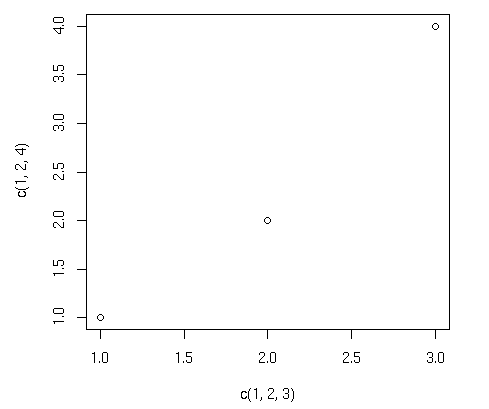
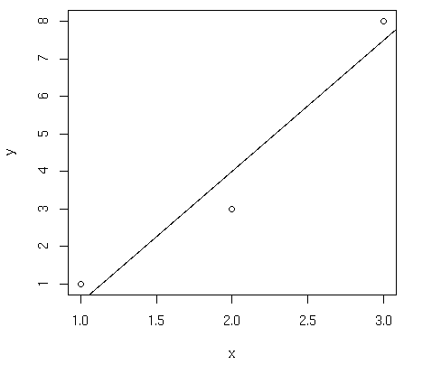
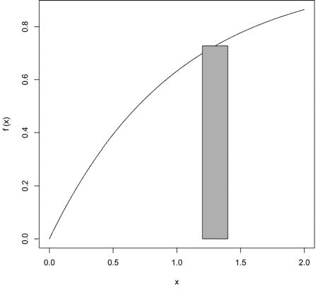
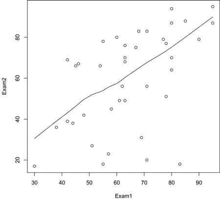

[1] 123 4 5 6

> scan("z2.txt")

读取 4 个项目

[1] 123.0 4.2 5.0 6.0

> scan("z3.txt")

错误在 scan(file, what, nmax, sep, dec, quote, skip, nlines, na.strings, )：scan()期望'a real'，但得到'abc'

> scan("z3.txt",what="")

**232**

第十章

[www.it-ebooks.info](http://www.it-ebooks.info/)

读取 4 个项目

[1] "abc" "de" "f" "g"

> scan("z4.txt",what="")

读取 4 个项目

[1] "abc" "123" "6" "y"

在第一次调用中，我们得到了一个包含四个整数的向量（尽管模式是数值）。第二次调用时，由于一个数字不是整数，其他数字也显示为浮点数。

在第三种情况下，我们得到了一个错误。scan()函数有一个名为 what 的可选参数，它指定了模式，默认为双精度模式。因此，文件*z3*的非数值内容产生了错误。但然后我们再次尝试，with what="".这分配了一个字符字符串给 what，表示我们想要字符模式。（我们也可以将 what 设置为任何字符字符串。）最后的调用以相同的方式工作。第一个项目是一个字符字符串，因此它将所有后续的项目也视为字符串。

当然，在典型用法中，我们会将 scan()的返回值赋给一个变量。以下是一个示例：

> v <- scan("z1.txt")

默认情况下，scan()假设向量的项由空白分隔，包括空格、回车/换行符和水平制表符。你可以使用可选的 sep 参数来处理其他情况。例如，我们可以将 sep 设置为换行符，以便将每一行作为字符串读取，如下所示：

> x1 <- scan("z3.txt",what="")

读取 4 个项目

> x2 <- scan("z3.txt",what="",sep="\n") 读取 3 个项目
> 
> x1

[1] "abc" "de" "f"

"g"

> x2

[1] "abc" "de f" "g"

> x1[2]

[1] "de"

> x2[2]

[1] "de f"

在第一种情况下，字符串"de"和"f"被分配给了 x1 的不同元素。但在第二种情况下，我们指定 x2 的元素由换行符分隔，而不是空格。由于"de"和"f"在同一行，它们被一起分配给了 x[2]。

本章后面将介绍更复杂的读取文件的方法，例如逐行读取文件的方法。但如果你想要一次性读取整个文件，scan()提供了一个快速解决方案。

输入/输出

**233**

[www.it-ebooks.info](http://www.it-ebooks.info/)

你可以使用 scan()从键盘读取，通过指定空字符串作为文件名：

> v <- scan("")

1: 12 5 13

4: 3 4 5

7: 8

8:

读取 7 个项目

> v

[1] 12 5 13 3 4 5 8

注意，我们会提示输入下一个项目的索引，并且通过空行来表示输入的结束。

如果你不想 scan()宣布它读取的项目数量，包括 quiet=TRUE 参数。

***10.1.2 使用 readline()函数***

如果你想要从键盘读取单行，readline()非常方便。

> w <- readline()

abc de f

> w

[1] "abc de f"

通常，readline()函数会带上可选的提示符，如下所示：

> inits <- readline("请输入您的首字母：")

请输入您的首字母：NM

> 初始化

[1] "NM"

***10.1.3 打印到屏幕***

在交互式模式的顶层，您可以通过简单地输入变量名或表达式来打印变量的值或表达式。如果您需要在函数体内部打印，则无法这样做。在这种情况下，您可以使用 print() 函数，如下所示：

> x <- 1:3
> 
> print(x²)

[1] 1 4 9

回想一下，print() 是一个 *通用* 函数，因此实际调用的函数将取决于打印的对象的类。例如，如果参数是 "table" 类，则将调用 print.table() 函数。

**234**

Chapter 10

[www.it-ebooks.info](http://www.it-ebooks.info/)

使用 cat() 而不是 print() 会更好一些，因为后者只能打印一个表达式，并且其输出是编号的，这可能会造成不便。

比较函数的结果：

> print("abc")

[1] "abc"

> cat("abc\n")

abc

注意，在调用 cat() 时，我们需要提供自己的换行符，"\n"。如果没有它，我们的下一个调用将继续写入同一行。

cat() 的参数将以空格分隔打印出来：

> x

[1] 1 2 3

> cat(x,"abc","de\n")

1 2 3 abc de

如果您不想有空间，将 sep 设置为空字符串 ""，如下所示：

> cat(x,"abc","de\n",sep="")

123abcde

可以使用任何字符串作为 sep。在这里，我们使用换行符：

> cat(x,"abc","de\n",sep="\n")

1

2

3

abc

de

您甚至可以将 sep 设置为字符串向量，如下所示：

> x <- c(5,12,13,8,88)
> 
> cat(x,sep=c(".",".",".","\n","\n")) 5.12.13.8

88

**10.2 读取和写入文件**

现在我们已经涵盖了 I/O 的基础知识，让我们来看看读取和写入文件的一些更实际的应用。以下各节讨论从文件中读取数据框或矩阵、处理文本文件、访问远程机器上的文件以及获取文件和目录信息。

输入/输出

**235**

[www.it-ebooks.info](http://www.it-ebooks.info/)

***10.2.1 从文件中读取数据框或矩阵***

在 5.1.2 节中，我们讨论了使用 read.table() 函数读取数据框的使用。作为一个快速回顾，假设文件 *z* 看起来像这样：name age

John 25

Mary 28

Jim 19

第一行包含一个可选的标题，指定列名。我们可以这样读取文件：

> z <- read.table("z",header=TRUE)
> 
> z

name age

1 John 25

2 Mary 28

3 Jim 19

注意，scan() 在这里不会工作，因为我们的文件包含数字和字符数据的混合（以及一个标题）。

从文件中直接读取矩阵似乎没有直接的方法，但可以使用其他工具轻松完成。一种简单快捷的方法是使用 scan() 逐行读取矩阵。您在 matrix() 函数中使用 byrow 选项来指示您正在按行定义矩阵的元素，而不是按列定义。

例如，假设文件 *x* 包含一个 5 行 3 列的矩阵，按行存储：1 0 1

1 1 1

1 1 0

1 1 0

0 0 1

我们可以这样将其读入矩阵：

> x <- matrix(scan("x"),nrow=5,byrow=TRUE)

这对于快速的一次性操作是可行的，但为了通用性，您可以使用 read.table()，它返回一个数据框，然后通过 as.matrix()进行转换。这里有一个通用方法：

read.matrix <- function(filename) {

as.matrix(read.table(filename))

}

**236**

第十章

[www.it-ebooks.info](http://www.it-ebooks.info/)

***10.2.2 读取文本文件***

在计算机文献中，经常将*文本文件*和*二进制文件*区分开来。这种区分有些误导——从本质上讲，每个文件都是由 0 和 1 组成的二进制文件。让我们将*文本文件*这个术语理解为主要由 ASCII 字符或其他人类语言（如中文的 GB 编码）编码组成的文件，并使用换行符来给人类提供行的感知。后一个方面将在这里变得至关重要。非文本文件，如 JPEG 图像或可执行程序文件，通常被称为*二进制文件*。

您可以使用 readLines()来读取文本文件，一次读取一行或一次性读取。例如，假设我们有一个名为*z1*的文件，其内容如下：

John 25

Mary 28

Jim 19

我们也可以一次性读取整个文件，如下所示：

> z1 <- readLines("z1")
> 
> z1

[1] "John 25" "Mary 28" "Jim 19"

由于每一行都被视为一个字符串，这里的返回值是一个字符串向量——即字符模式的向量。对于每读取一行，都有一个向量元素，因此这里有三个元素。

或者，我们可以逐行读取。为此，我们首先需要创建一个连接，如下所述。

***10.2.3 连接简介***

*连接*是 R 在各类输入/输出操作中使用的根本机制。在这里，它将被用于文件访问。

连接是通过调用 file()、url()或 R 的几个其他函数创建的。要查看这些函数的列表，请输入以下内容：

> ?连接

因此，我们现在可以按如下方式逐行读取上一节中介绍的*z1*文件：

> c <- file("z1","r")
> 
> readLines(c,n=1)

[1] "John 25"

> readLines(c,n=1)

[1] "Mary 28"

> readLines(c,n=1)

[1] "Jim 19"

输入/输出

**237**

[www.it-ebooks.info](http://www.it-ebooks.info/)

> readLines(c,n=1)

character(0)

我们打开了连接，将结果赋值给 c，然后按指定的 n=1 参数逐行读取文件。当 R 遇到文件末尾（EOF）时，它返回一个空结果。我们需要设置一个连接，以便 R 在读取文件时能够跟踪我们的位置。

我们可以在代码中检测到文件结束符（EOF）：

> c <- file("z","r")
> 
> while(TRUE) {

+

rl <- readLines(c,n=1)

+

if (length(rl) == 0) {

+

print("到达文件末尾")

+

break

+

} else print(rl)

+ }

[1] "John 25"

[1] "Mary 28"

[1] "Jim 19"

[1] "到达文件末尾"

如果我们希望“重置”——从文件开头重新开始，我们可以使用 seek()：

> c <- file("z1","r")
> 
> readLines(c,n=2)

[1] "John 25" "Mary 28"

> seek(con=c,where=0)

[1] 16

> readLines(c,n=1)

[1] "John 25"

我们对 seek()的调用中 where=0 的参数意味着我们希望将文件指针定位在文件开始处零个字符的位置——换句话说，直接在开头。

通话返回 16，表示文件指针位于位置 16

在我们打电话之前。这很有道理。第一行由"John 25"组成

*加上*行尾字符，总共八个字符，第二行也是如此。因此，在读取前两行之后，我们位于位置 16。

你可以通过调用——还能是什么？——close()来关闭连接。你会使用这个来让系统知道你一直在写入的文件现在已经完成，应该现在正式写入磁盘。作为另一个例子，在互联网上的客户端/服务器关系（见第 10.3.1 节），客户端会使用 close()来向服务器指示客户端正在注销。

**238**

第十章

[www.it-ebooks.info](http://www.it-ebooks.info/)

***10.2.4 扩展示例：读取 PUMS 人口普查文件***

美国人口普查局以公共使用微观数据样本（PUMS）的形式提供人口普查数据。这里的*微观数据*意味着我们处理的是原始数据，每条记录对应一个真实的人，而不是统计摘要。包括许多变量的数据。

数据按家庭组织。对于每个单位，首先有一个家庭记录，描述该家庭的各项特征，然后为家庭中的每个人提供一个个人记录。家庭记录中的第 106 位和第 107 位（从 1 开始编号）表示该家庭的个人记录数量。（这个数字可能非常大，因为一些机构被视为家庭。）为了增强数据的完整性，第 1 位字符包含 H 或 P 以确认这是一个家庭或个人记录。因此，如果你读取一个 H 记录，并且它告诉你家庭中有三个人，那么接下来的三个记录应该是 P 记录，然后是另一个 H 记录；如果不是，你遇到了错误。

作为我们的测试文件，我们将取 2000 年 1%样本的前 1000 条记录。前几条记录看起来像这样：

H000019510649

06010

99979997 70

631973

15758

59967658436650000012000000 0 0 0 0 0 0 0 0 0 0 0 0 0

0

0

0

0

0 0 0

0 0

0 0000 0

0

0 0 0

00000000000000000000000000000

00000000000000000000000000

P00001950100010923000420190010110000010147050600206011099999904200000 0040010000

00300280

28600 70

9997

9997202020202020220000040000000000000006000000

00000 00

0000

00000000000000000132241057904MS

476041-20311010310

07000049010000000000900100000100000100000100000010000001000139010000490000

H000040710649

06010

99979997 70

631973

15758

599676584365300800200000300106060503010101010102010 01200006000000100001

00600020 0

0 0

0 0000 0

0

0 0 0

02000102010102200000000010750

02321125100004000000040000

P00004070100005301000010380010110000010147030400100009005199901200000 0006010000

00100000

00000 00

0000

0000202020202020220000040000000000000001000060

06010 70

9997

99970101004900100000001018703221

770051-10111010500

40004000000000000000000000000000000000000000000000000000004000000040000349

P00004070200005303011010140010110000010147050000204004005199901200000 0006010000

00100000

00000 00

0000

00002020202002000000000000000000000050000

00000 00

0000

000000000000000000000000000000000000000000-00000000000

000

0

0

0

0

0

0

0

0

00000000349

H000061010649

06010

99979997 70

631973

15758

59967658436080119010000020020403050201010101010201000770004800064000001

1

0 030

0 0

0 0340 00660000000170 0

06010000000004410039601000000

00021100000004940000000000

记录非常宽，因此会换行。每一行都占据

页面上这里有四行。

输入/输出

**239**

[www.it-ebooks.info](http://www.it-ebooks.info/)

我们将创建一个名为 extractpums() 的函数，用于读取 PUMS 文件并从其 Person 记录中创建一个数据框。用户指定文件名、要提取的字段列表以及分配给这些字段的名称。

我们还希望保留家庭序列号。这很好，因为同一家庭中的人的数据可能相关，我们可能希望将这一方面添加到我们的统计模型中。此外，家庭数据可能提供重要的协变量。（在后一种情况下，我们还想保留协变量数据。）

在查看函数代码之前，让我们看看该函数的功能。

在这个数据集中，性别在第 23 列，年龄在第 25 和 26 列。在示例中，我们的文件名是 *pumsa*。下面的调用创建了一个包含这两个变量的数据框。

pumsdf <- extractpums("pumsa",list(Gender=c(23,23),Age=c(25,26))) Note that we are stating here the names we want the columns to have in the resulting data frame. We can use any names we want—say Sex and Ancientness.

这里是该数据框的第一部分：

> head(pumsdf)

serno Gender Age

2

195

2 19

3

407

1 38

4

407

1 14

5

610

2 65

6 1609

1 50

7 1609

2 49

以下是为 extractpums() 函数编写的代码。

1

# reads in PUMS file pf, extracting the Person records, returning a data 2

# frame; each row of the output will consist of the Household serial 3

# number and the fields specified in the list flds; the columns of

4

# the data frame will have the names of the indices in flds

5

6

extractpums <- function(pf,flds) {

7

dtf <- data.frame() # data frame to be built

8

con <- file(pf,"r") # connection

9

# 处理输入文件

10

repeat {

11

hrec <- readLines(con,1) # read Household record

12

if (length(hrec) == 0) break # end of file, leave loop

13

# 获取家庭序列号

14

serno <- intextract(hrec,c(2,8))

**240**

第十章

[www.it-ebooks.info](http://www.it-ebooks.info/)

15

# 有多少 Person 记录？

16

npr <- intextract(hrec,c(106,107))

17

if (npr > 0)

18

for (i in 1:npr) {

19

prec <- readLines(con,1) # get Person record

20

# 为这个人的数据框制作一行

21

person <- makerow(serno,prec,flds)

22

# add it to the data frame

23

dtf <- rbind(dtf,person)

24

}

25

}

26

return(dtf)

27

}

28

29

# 为此人的行设置数据框

30

makerow <- function(srn,pr,fl) {

31

l <- list()

32

l[["serno"]] <- srn

33

for (nm in names(fl)) {

34

l[[nm]] <- intextract(pr,fl[[nm]])

35

}

36

返回(l)

37

}

38

39

# 从字符串 s 中提取整数字段，在字符位置 40

# rng[1] through rng[2]

41

intextract <- function(s,rng) {

42

fld <- substr(s,rng[1],rng[2])

43

return(as.integer(fld))

44

}

让我们看看这是如何工作的。在 extractpums()的开始，我们创建一个空的数据框并设置读取 PUMS 文件的连接。

dtf <- data.frame() # 要构建的数据框

con <- file(pf,"r") # 连接

代码的主体部分由一个重复循环组成。

repeat {

hrec <- readLines(con,1) # 读取家庭记录

if (length(hrec) == 0) break # 文件结束，离开循环

# 获取家庭序列号

serno <- intextract(hrec,c(2,8))

# 有多少个人记录？

npr <- intextract(hrec,c(106,107))

输入/输出

**241**

[www.it-ebooks.info](http://www.it-ebooks.info/)

if (npr > 0)

for (i in 1:npr) {

...

}

}

这个循环会一直迭代到输入文件结束。后者条件将通过遇到零长度的家庭记录来感知，如前所述代码所示。

在重复循环中，我们交替读取家庭记录和相关的个人记录。当前家庭记录的个人记录数从该记录的第 106 和第 107 列提取，并将此数字存储在 npr 中。这种提取是通过调用我们的函数 intextract()完成的。

然后 for 循环逐个读取个人记录，在每种情况下形成输出数据框所需的行，然后通过 rbind()将其附加到后者：

for (i in 1:npr) {

prec <- readLines(con,1) # 获取个人记录

# 为此人的行创建数据框

person <- makerow(serno,prec,flds)

# 将它添加到数据框中

dtf <- rbind(dtf,person)

}

注意 makerow()如何创建要添加的给定人员的行。在这里，形式参数是 srn（家庭序列号），pr（给定的个人记录），fl（变量名称和列字段列表）。

makerow <- function(srn,pr,fl) {

l <- list()

l[["serno"]] <- srn

for (nm in names(fl)) {

l[[nm]] <- intextract(pr,fl[[nm]])

}

return(l)

}

例如，考虑我们的示例调用：

pumsdf <- extractpums("pumsa",list(Gender=c(23,23),Age=c(25,26))) 当 makerow()执行时，fl 将是一个包含两个元素的列表，分别命名为 Gender 和 Age。字符串 pr，当前的个人记录，Gender 位于第 23 列，Age 位于第 25 和第 26 列。我们调用 intextract()来提取所需的数字。

**242**

第十章

[www.it-ebooks.info](http://www.it-ebooks.info/)

intextract()函数本身是将字符转换为数字的简单转换，例如将字符串"12"转换为数字 12。

注意，如果没有家庭记录的存在，我们可以使用一个方便的内置 R 函数（read.fwf()）轻松地完成所有这些操作。这个函数的名称是“read fixed-width formatted”的缩写。

暗示每个变量都存储在记录的指定字符位置。本质上，这个函数减轻了编写类似 intextract() 函数的需求。

***10.2.5 通过 URL 访问远程机器上的文件***

某些 I/O 函数，如 read.table() 和 scan()，接受网络 URL 作为参数。（检查 R 的在线帮助功能，看看您喜欢的函数是否允许这样做。）

作为例子，我们将从加州大学读取一些数据。

nia, Irvine archive at *http://archive.ics.uci.edu/ml/datasets.html*，使用 Echocardiogram 数据集。在导航链接后，我们找到该文件的位置，然后从 R 中读取，如下所示：

> uci <- "http://archive.ics.uci.edu/ml/machine-learning-databases/"
> 
> uci <- paste(uci,"echocardiogram/echocardiogram.data",sep="")
> 
> ecc <- read.csv(uci)

（我们在这里分阶段构建 URL 以适应页面。）

让我们看看我们下载了什么：

> head(ecc)

X11 X0 X71 X0.1 X0.260

X9 X4.600 X14

X1 X1.1 name X1.2 X0.2

1 19 0 72

0 0.380

6 4.100

14 1.700 0.588 name

1

0

2 16 0 55

0 0.260

4 3.420

14

1

1 name

1

0

3 57 0 60

0 0.253 12.062 4.603

16 1.450 0.788 name

1

0

4 19 1 57

0 0.160

22 5.750

18 2.250 0.571 name

1

0

5 26 0 68

0 0.260

5 4.310

12

1 0.857 name

1

0

6 13 0 62

0 0.230

31 5.430 22.5 1.875 0.857 name

1

0

我们可以进行我们的分析。例如，第三列是年龄，因此我们可以找到它的平均值或对数据进行其他计算。请参阅 *http://archive.ics.uci.edu/ml/machine-learning-databases/echocardiogram/echocardiogram.names* 页面上的 echocardiogram.names 页面，了解所有变量的描述。

***10.2.6 写入文件***

考虑到 R 的统计基础，文件读取可能比写入更常见。但是，有时写入是必要的，本节将介绍写入文件的方法。

输入/输出

**243**

[www.it-ebooks.info](http://www.it-ebooks.info/)

函数 write.table() 与 read.table() 非常相似，除了它写入一个数据框而不是读取一个。例如，让我们从第五章开头的 Jack 和 Jill 小例子开始：

> kids <- c("Jack","Jill")
> 
> ages <- c(12,10)
> 
> d <- data.frame(kids,ages,stringsAsFactors=FALSE)
> 
> d

kids ages

1 Jack

12

2 Jill

10

> write.table(d,"kds")

文件 *kds* 现在将包含以下内容：

"kids" "ages"

"1" "Jack" 12

"2" "Jill" 10

在将矩阵写入文件的情况下，只需声明您不需要行或列名，如下所示：

> write.table(xc,"xcnew",row.names=FALSE,col.names=FALSE) 函数 cat() 也可以用来分部分写入文件。

这里是一个例子：

> cat("abc\n",file="u")
> 
> cat("de\n",file="u",append=TRUE)

第一次调用 cat() 创建了文件 *u*，包含一行内容 "abc"。第二次调用追加第二行。与使用 writeLines() 函数的情况不同（我们将在下一节讨论），文件在每次操作后都会自动保存。例如，在之前的调用之后，文件将看起来像这样：

abc

de

您也可以写入多个字段。所以：

> cat(file="v",1,2,"xyz\n")

将生成一个包含单行的文件 *v*：

1 2 xyz

**244**

第十章

[www.it-ebooks.info](http://www.it-ebooks.info/)

您还可以使用 writeLines()，它是 readLines() 的对应函数。如果您使用连接，必须指定 "w" 来表示您正在写入文件，而不是从文件中读取：

> c <- file("www","w")
> 
> writeLines(c("abc","de","f"),c)
> 
> close(c)

文件 *www* 将包含以下内容：

abc

de

f

注意需要主动关闭文件。

***10.2.7 获取文件和目录信息***

R 有各种用于获取目录和文件信息、设置文件访问权限等的函数。以下是一些示例：

•

file.info()：为每个在参数中的文件名（一个字符向量）提供文件大小、创建时间、目录与普通文件状态等信息。

•

dir()：返回一个字符向量，列出其第一个参数指定的目录中所有文件的名字。如果指定了可选参数 recursive=TRUE，则结果将显示以第一个参数为根的整个目录树。

•

file.exists()：返回一个布尔向量，指示第一个参数中的每个名字所指定的文件是否存在。

•

getwd() 和 setwd()：用于确定或更改当前工作目录。

要查看所有与文件和目录相关的函数，请输入以下内容：

> ?files

下一个示例中将演示一些这些选项。

***10.2.8 扩展示例：计算多个文件的内容总和***

在这里，我们将开发一个函数来查找目录树中所有文件内容的总和（假设为数值）。在我们的示例中，目录 *dir1*

输入/输出

**245**

[www.it-ebooks.info](http://www.it-ebooks.info/)

包含文件 *filea* 和 *fileb*，以及一个子目录 *dir2*，其中包含文件 *filec*。文件内容如下：

•

*filea*: 5, 12, 13

•

*fileb*: 3, 4, 5

•

*filec*: 24, 25, 7

如果 *dir1* 在我们的当前目录中，调用 sumtree("dir1") 将得到这九个数字的总和，98。否则，我们需要指定 *dir1* 的完整路径名，例如 sumtree("/home/nm/dir1")。以下是代码：1

sumtree <- function(drtr) {

2

tot <- 0

3

# 获取树中所有文件的名字

4

fls <- dir(drtr,recursive=TRUE)

5

for (f in fls) {

6

# f 是否是一个目录？

7

f <- file.path(drtr,f)

8

if (!file.info(f)$isdir) {

9

tot <- tot + sum(scan(f,quiet=TRUE))

10

}

11

}

12

return(tot)

13

}

注意，这个问题是递归的自然选择，我们在第 7.9 节中讨论了递归。但在这里，R 通过在 dir()中允许它作为选项来为我们执行递归。因此，在第 4 行，我们设置 recursive=TRUE，以便在整个目录树的不同级别中找到文件。

要调用 file.info()，我们需要考虑到当前文件名*f*相对于 drtr 是相对的，因此我们的文件*filea*将被引用为*dir1/filea*。

为了形成该路径名，我们需要连接 drtr、一个斜杠和 filea。我们可以使用 R 字符串连接函数 paste()来做这件事，但我们需要为 Windows 使用一个单独的情况，Windows 使用反斜杠而不是斜杠。但 file.path()为我们做了所有这些。

关于第 8 行的某些评论是必要的。函数

file.info()返回有关 f 的信息作为数据框，其中一个列是 isdir，每行对应一个文件，行名是文件名。该列由布尔值组成，指示每个文件是否是目录。因此，在第 8 行，我们可以检测当前文件*f*是否是目录。如果*f*是一个普通文件，我们就继续将其内容添加到我们的运行总和中。

**10.3 访问互联网**

R 的套接字功能为程序员提供了访问互联网的 TCP/IP 的接口。

协议。对于不熟悉此协议的读者，我们将从 TCP/IP 的概述开始。

**246**

第十章

[www.it-ebooks.info](http://www.it-ebooks.info/)

***10.3.1 TCP/IP 概述***

TCP/IP 相当复杂，所以这里的概述将是一种过度简化，但我们将涵盖足够的内容，以便您理解 R 的套接字函数正在做什么。

在我们这里的目的中，术语*网络*指的是一组本地连接在一起的计算机，而不通过互联网。这通常包括家庭中的所有计算机，较小企业中的所有计算机，等等。它们之间的物理介质通常是某种形式的以太网连接。

互联网，正如其名所暗示的，连接网络。互联网中的网络通过*路由器*连接到一个或多个其他网络，路由器是专门用于连接两个或更多网络的特殊用途计算机。

互联网上的每台计算机都有一个互联网协议（IP）地址。这是一个数字，但它可以用字符表示，例如*www.google.com*，然后由域名服务将其转换为数字地址。

然而，IP 地址是不够的。当 A 向 B 发送消息时，

B，可能有几个应用程序在计算机 B 上接收互联网消息，例如网页浏览、电子邮件服务等等。B 的操作系统如何知道将来自 A 的消息发送给这些中的哪一个？答案是 A 将指定一个*端口号*，除了 IP 地址。

端口号表示 B 上运行哪个程序作为接收者。A 也将有一个端口号，以便 B 的响应

达到 A 的正确应用程序。

当 A 想要向 B 发送某些内容时，它会向一个名为*socket*的软件实体写入，使用与写入文件的系统调用在语法上相似的调用。在调用中，A 指定了 B 的 IP 地址和 A 希望发送消息的端口号。B 也有一个 socket，它将响应写入到该 socket 中。我们说 A 和 B 通过这些 socket 之间存在*连接*，但这并不意味着任何物理上的东西——这只是 A 和 B 之间交换数据的协议。

应用程序遵循*客户端/服务器*模型。比如说，一个 Web 服务器在 B 处运行，在 Web 的标准端口 80 上。B 处的服务器正在端口 80 上*监听*。同样，这个术语不应被字面理解；它只是意味着服务器程序已经调用了一个通知操作系统服务器程序愿意在端口 80 上建立连接的功能。当网络节点 A 请求这样的连接时，服务器上的函数调用返回，连接就建立了。

如果你是一个非特权用户并且编写某种类型的服务器程序——

比如在 R 中！——你必须分配一个大于 1024 的端口号。

**注意**

*如果服务器程序被关闭或崩溃，在相同的端口再次可重用之前可能会有几秒钟的延迟。*

***10.3.2 R 中的套接字***

需要牢记的一个重要观点是，A 向 B 发送的所有字节

在它们之间存在的连接存在期间，被认为是*一个大的消息*。比如说，A 发送了一行 8 个字符的文本，然后输入/输出

**247**

[www.it-ebooks.info](http://www.it-ebooks.info/)

另一个 20 个字符。从 A 的角度来看，这是两行，但对 TCP/IP 来说，这只是尚未完成的消息的 28 个字符。将这个长消息拆分成行可能需要一些工作。R 为此提供了各种函数，包括以下：

•

readLines()和 writeLines()：这些允许你以 TCP/IP

我们正在逐行发送消息，尽管实际上并非如此。如果你的应用程序自然地以行为单位来考虑，这两个函数可能非常有用。

•

serialize()和 unserialize()：你可以使用这些函数发送 R 对象，例如矩阵或统计函数调用的复杂输出。发送方将对象转换为字符字符串形式，然后在接收方将其转换回原始对象形式。

•

readBin()和 writeBin()：这些用于以二进制形式发送数据。

（回想一下第 10.2.2 节开头关于术语的注释。）这些函数中的每一个都在 R 连接上操作，正如你将在下一个示例中看到的。

选择每个任务正确的函数很重要。例如，如果你有一个长向量，使用 serialize()和 unserialize()可能更方便，但耗时更多。这不仅是因为数字必须转换为它们的字符表示形式，然后又转换回，而且因为字符表示形式通常要长得多，这意味着传输时间更长。

这里是两个其他的 R 套接字函数：

•

socketConnection(): 通过套接字建立 R 连接。您在参数 port 中指定端口号，并说明是否需要建立一个

要创建服务器或客户端，通过将参数 server 设置为 TRUE

或 FALSE，分别。在客户端的情况下，你还必须在参数 host 中提供服务器的 IP 地址。

•

socketSelect(): 当服务器连接到多个客户端时很有用。其主要参数 socklist 是一个连接列表，其返回值是已准备好供服务器读取数据的连接子列表。

***10.3.3 扩展示例：实现并行 R***

一些统计分析的运行时间非常长，因此对“并行 R”产生了很大的兴趣，其中几个 R 进程合作完成给定任务。另一个“并行化”的可能原因是内存限制。如果一台机器没有足够的内存来处理当前任务，通过某种方式汇集几台机器的内存可能会有所帮助。第十六章

介绍这个重要主题。

套接字在许多并行 R 包中扮演着关键角色。合作的 R

进程可以在同一台机器上或不同的机器上。在后一种情况（甚至在前一种情况），实现并行化的自然方法是用 R 套接字。这是 snow 包中的选择之一**248**

第十章

[www.it-ebooks.info](http://www.it-ebooks.info/)

在我的 Rdsm 包中（两者都可在 CRAN，R 的代码存储库中找到；有关详细信息，请参阅本书附录），如下所示：

•

在 snow 中，服务器向客户端发送工作任务。客户端执行任务并将结果发送回服务器，服务器将它们组装成最终结果。通信是通过 serialize()和 unserialize()完成的，服务器使用 socketSelect()来确定哪些客户端结果已准备好。

•

Rdsm 实现了一个虚拟共享内存范式，服务器用于存储共享变量。客户端在需要读取或写入共享变量时联系服务器。为了优化速度，服务器和客户端之间的通信使用 readBin()和 writebin()，而不是 serialize()和 unserialize()。

让我们看看 Rdsm 的一些与套接字相关的细节。首先，这是设置与客户端连接的服务器代码，将它们存储在列表 cons 中（有 ncon 个客户端）：

1

# 与客户端建立套接字连接

2

#

3

cons <<- vector(mode="list",length=ncon) # 连接列表 4

# 防止在调试或长时间计算期间连接中断

5

设置选项("timeout"=10000)

6

for (i in 1:ncon) {

7

cons[[i]] <<-

8

socketConnection(port=port,server=TRUE,blocking=TRUE,open="a+b") 9

# 等待从客户端 i 接收消息

10

checkin <- unserialize(cons[[i]])

11

}

12

# 发送确认消息

13

for (i in 1:ncon) {

14

# 向客户端发送其 ID 号和组大小

15

serialize(c(i,ncon),cons[[i]])

16

}

由于客户端消息和服务器确认消息都很短，

sages, serialize()和 unserialize()在这里足够好。

服务器主循环的第一部分是找到一个就绪客户端并从中读取。

1

repeat {

2

# 是否还有客户端仍在？

3

if (remainingclients == 0) break

4

# 等待服务请求，然后读取它

5

# 查找所有挂起的客户端请求

6

rdy <- which(socketSelect(cons))

7

# 选择一个

8

j <- sample(1:length(rdy),1)

输入/输出

**249**

[www.it-ebooks.info](http://www.it-ebooks.info/)

9

con <- cons[[rdy[j]]]

10

# 读取客户端请求

11

req <- unserialize(con)

再次使用 serialize()和 unserialize()在这里足够好，用于读取客户端指示的操作类型——通常是读取共享变量或写入一个——的简短消息。但是，共享变量的读取和写入本身使用更快的 readBin()和 writeBin()函数。以下是写入部分：

# 将数据 dt，模式 md（整数或双精度浮点数），写入连接 cn

binwrite <- function(dt,md,cn) {

writeBin(dt,con=cn)

以下是读取部分：

# 从连接 cn 读取 sz 个元素的模式 md（整数或双精度浮点数）binread <- function(cn,md,sz) {

return(readBin(con=cn,what=md,n=sz))

在客户端，连接设置代码如下：

1

options("timeout"=10000)

2

# 连接到服务器

3

con <- socketConnection(host=host,port=port,blocking=TRUE,open="a+b") 4

serialize(list(req="checking in"),con)

5

# 从服务器接收此客户端的 ID 和客户端总数

6

myidandnclnt <- unserialize(con)

7

myinfo <<-

8

list(con=con,myid=myidandnclnt[1],nclnt=myidandnclnt[2])

从服务器读取和写入的代码与前面的服务器示例类似。

**250**

第十章

[www.it-ebooks.info](http://www.it-ebooks.info/)

**11**

**字符串操作**

尽管 R 是一种统计语言，具有

数字向量和矩阵扮演着

字符串在 R 程序中起着核心作用，字符字符串出人意料地重要。

在统计应用中也非常重要。从出生到

医学研究数据文件中存储的日期转换为文本格式

数据挖掘应用中，字符数据出现得相当频繁。

在 R 程序中频繁出现。相应地，R 提供了一些

字符串操作工具，其中许多将在

在本章中介绍。

**11.1 字符串操作函数概述**

在这里，我们将简要回顾 R 提供的许多字符串操作函数中的一些。请注意，在本介绍中显示的调用形式非常简单，通常省略了许多可选参数。我们将在本章后面的扩展示例中使用一些这些参数，但请检查 R 的在线帮助以获取更多详细信息。

[www.it-ebooks.info](http://www.it-ebooks.info/)

***11.1.1 grep()***

调用 grep(pattern,x)在字符串向量 x 中搜索指定的子串模式。如果 x 有*n*个元素——即它包含*n*个字符串——那么 grep(pattern,x)将返回一个长度最多为*n*的向量。此向量的每个元素将是 x 中找到模式作为子串的索引。

这里是使用 grep 的一个示例：

> grep("Pole",c("Equator","North Pole","South Pole"))

[1] 2 3

> grep("pole",c("Equator","North Pole","South Pole")) integer(0)

在第一种情况下，字符串 "Pole" 被发现在第二个参数的第二个和第三个元素中，因此输出为 (2,3)。在第二种情况下，字符串 "pole"

在任何地方都没有找到，因此返回了一个空向量。

***11.1.2 nchar()***

nchar(x) 函数的调用用于查找字符串 x 的长度。以下是一个示例：

> nchar("South Pole")

[1] 10

发现字符串 "South Pole" 有 10 个字符。C 程序员请注意：R 字符串没有 NULL 字符终止。

还要注意，如果 x 不在字符模式下，nchar() 的结果将不可预测。例如，nchar(NA) 的结果是 2，而 nchar(factor("abc")) 是 1。为了在非字符串对象上获得更一致的结果，请使用 CRAN 上的 Hadley Wickham 的 stringr 包。

***11.1.3 paste()***

paste(...) 函数的调用将多个字符串连接起来，并返回一个长字符串的结果。以下是一些示例：

> paste("North","Pole")

[1] "North Pole"

> paste("North","Pole",sep="")

[1] "NorthPole"

> paste("North","Pole",sep=".")

[1] "North.Pole"

> paste("North","and","South","Poles")

[1] "North and South Poles"

**252**

第十一章

[www.it-ebooks.info](http://www.it-ebooks.info/)

如您所见，可选参数 sep 可以用于在拼接在一起的片段之间放置除空格之外的内容。如果您指定 sep 为空字符串，则片段之间不会有任何字符。

***11.1.4 sprintf()***

sprintf(...) 函数的调用以格式化的方式组装字符串。

这里有一个简单的示例：

> i <- 8
> 
> s <- sprintf("the square of %d is %d",i,i²)
> 
> s

[1] "the square of 8 is 64"

函数的名称旨在唤起“字符串打印”的“打印”

将其打印到字符串 s 而不是屏幕上。在这里，我们正在将打印到字符串 s。

我们打印的是什么？函数指示首先打印“平方”

然后打印 i 的十进制值。（这里的“十进制”意味着十进制数系统，而不是结果中会有小数点。）结果是字符串 "the square of 8 is 64."

***11.1.5 substr()***

substr(x,start,stop) 函数的调用返回给定字符串 x 中给定字符位置范围 start:stop 的子字符串。以下是一个示例：

> substring("Equator",3,5)

[1] "uat"

***11.1.6 strsplit()***

strsplit(x,split) 函数的调用根据另一个字符串 split 在 x 中分割字符串，并将字符串 x 分割成 R 列表中的子字符串。以下是一个示例：

> strsplit("6-16-2011",split="-")

[[1]]

[1] "6"

"16"

"2011"

***11.1.7 regexpr()***

regexpr(pattern,text) 函数的调用用于在文本中找到模式的第一实例的字符位置，如下例所示：

> regexpr("uat","Equator")

[1] 3

字符串操作

**253**

[www.it-ebooks.info](http://www.it-ebooks.info/)

这报告了“uat”确实出现在“Equator”中，起始字符位置为 3。

***11.1.8 gregexpr()***

gregexpr(pattern,text) 函数的调用与 regexpr() 相同，但它找到模式的所有实例。以下是一个示例：

> gregexpr("iss","Mississippi")

[[1]]

[1] 2 5

这发现 "iss" 在 "Mississippi" 中出现两次，起始字符位置为 2 和 5。

**11.2 正则表达式**

在处理编程语言中的字符串操作函数时，有时会涉及到 *正则表达式* 的概念。在 R 中，使用字符串函数 grep()、grepl()、regexpr()、gregexpr()、sub()、gsub() 和 strsplit() 时，你必须注意这一点。

正则表达式是一种通配符。它是指定字符串广泛类别的简写。例如，表达式 "[au]" 指的是包含字母 *a* 或 *u* 的任意字符串。你可以这样使用它：

> grep("[au]",c("Equator","North Pole","South Pole"))

[1] 1 3

这报告说 ("Equator","North Pole","South Pole") 中的元素 1 和 3 —— 即 "Equator" 和 "South Pole" —— 包含 *a* 或 *u*。

一个点 (.) 代表任意单个字符。这里是一个使用它的例子：

使用它：

> grep("o.e",c("Equator","North Pole","South Pole"))

[1] 2 3

这将搜索由一个 *o* 后跟任何单个字符，然后是 *e* 的三个字符字符串。这里是一个使用两个点来表示任意字符对的示例：

> grep("N..t",c("Equator","North Pole","South Pole"))

[1] 2

这里，我们搜索由 *N* 后跟任意两个字符，然后是 *t* 组成的四个字符字符串。

点是一个 *元字符* 的例子，它不是一个字面意义上的字符。例如，如果点出现在 grep() 的第一个参数中，它实际上并不代表点；它代表任意字符。

**254**

第十一章

[www.it-ebooks.info](http://www.it-ebooks.info/)

但是，如果你想要使用 grep() 搜索点，这里有一个简单的方法：

> grep(".",c("abc","de","f.g"))

[1] 1 2 3

结果应该是 3，而不是 (1,2,3)。这次调用失败是因为点是一个元字符。你需要 *转义* 点的元字符性质，这通过反斜杠来完成：

> grep("\\.",c("abc","de","f.g"))

[1] 3

现在，我没有说 *一个* 反斜杠吗？那么为什么有两个？好吧，令人悲伤的真相是反斜杠本身必须被转义，这是通过它自己的反斜杠来完成的！这表明正则表达式可以多么神秘复杂。确实，已经有许多关于正则表达式（针对各种编程语言）的书籍被写出来。作为了解这个主题的起点，请参考 R 的在线帮助（输入 ?regex）。

***11.2.1 扩展示例：测试文件名是否具有给定后缀***

假设我们希望测试文件名中是否存在指定的后缀。例如，我们可能想要找到所有 HTML 文件（那些具有后缀 *.html*、*.htm* 等）。以下是相应的代码：

1

testsuffix <- function(fn,suff) {

2

parts <- strsplit(fn,".",fixed=TRUE)

3

nparts <- length(parts[[1]])

4

return(parts[[1]][nparts] == suff)

5

}

让我们来测试一下。

> testsuffix("x.abc","abc")

[1] TRUE

> testsuffix("x.abc","ac")

[1] FALSE

> testsuffix("x.y.abc","ac")

[1] FALSE

> testsuffix("x.y.abc","abc")

[1] TRUE

函数是如何工作的？首先注意，第 2 行对 strsplit() 的调用返回一个包含一个元素的列表（因为 fn 是一个元素向量）——一个字符串向量。例如，调用 testsuffix("x.y.abc","abc") 将导致 parts 是一个包含三个元素（x, y, 和 abc）的向量列表。然后我们选择最后一个元素并将其与 suff 进行比较。

字符串操作

**255**

[www.it-ebooks.info](http://www.it-ebooks.info/)

一个关键方面是参数 fixed=TRUE。没有它，分割参数 .（在 strsplit() 的形式参数列表中称为 split）将被视为一个正则表达式。如果不设置 fixed=TRUE，strsplit() 就只会将所有字母分开。

当然，我们也可以转义点号，如下所示：

1

testsuffix <- function(fn,suff) {

2

parts <- strsplit(fn,"\\.")

3

nparts <- length(parts[[1]])

4

return(parts[[1]][nparts] == suff)

5

}

让我们检查它是否仍然有效。

> testsuffix("x.y.abc","abc")

[1] TRUE

这里是另一种执行后缀测试代码的方法，它稍微复杂一些，但是一个很好的说明：

1

testsuffix <- function(fn,suff) {

2

ncf <- nchar(fn) # nchar() 获取字符串长度

3

# 确定如果 suff 是 fn 中的后缀，则点号将从哪里开始 4

dotpos <- ncf - nchar(suff) + 1

5

# 现在检查 suff 是否存在

6

return(substr(fn,dotpos,ncf)==suff)

7

}

让我们再次看看 substr() 的调用，这里 fn = "x.ac" 且 suff = "abc"。在这种情况下，dotpos 将是 1，这意味着如果存在 abc 后缀，fn 中的第一个字符应该有点号。然后 substr() 的调用变为 substr("x.ac",1,4)，它从 x.ac 中提取字符位置 1 到 4 的子字符串。这个子字符串将是 x.ac，它不是 abc，因此文件名的后缀没有被找到是后者。

***11.2.2 扩展示例：形成文件名***

假设我们想要创建五个文件，*q1.pdf* 到 *q5.pdf*，这些文件包含 100 个随机 N(0, *i* 2) 变量的直方图。我们可以执行以下代码：

1

for (i in 1:5) {

2

fname <- paste("q",i,".pdf")

3

pdf(fname)

4

hist(rnorm(100,sd=i))

5

dev.off()

6

}

**256**

第十一章

[www.it-ebooks.info](http://www.it-ebooks.info/)

本例中的主要点是用于创建文件名 fname 的字符串操作。有关本例中使用的图形操作的更多详细信息，请参阅第 12.3 节。

paste() 函数将字符串 "q" 与数字 i 的字符串形式连接起来。例如，当 i = 2 时，变量 fname 将是 q2.pdf。

然而，这并不是我们想要的。在 Linux 系统上，包含空格的文件名会带来麻烦，因此我们想要删除空格。一种解决方案是使用 sep 参数，指定一个空字符串作为分隔符，如下所示：

1

for (i in 1:5) {

2

fname <- paste("q",i,".pdf",sep="")

pdf(fname)

4

hist(rnorm(100,sd=i))

5

dev.off()

6

}

另一种方法是使用从 C 中借来的 sprintf() 函数：1

for (i in 1:5) {

2

fname <- sprintf("q%d.pdf",i)

3

pdf(fname)

4

hist(rnorm(100,sd=i))

5

dev.off()

6

}

对于浮点数，还要注意 %f 和 %g 格式之间的区别：

> sprintf("abc%fdef",1.5)

[1] "abc1.500000def"

> sprintf("abc%gdef",1.5)

[1] "abc1.5def"

%g 格式消除了多余的零。

**11.3 在 edtdbg 调试工具中使用字符串实用工具**

edtdbg 调试工具的内部代码，将在第 13.4 节中讨论，大量使用了字符串实用工具。此类使用的典型示例是 dgbsendeditcmd() 函数：

# 向编辑器发送命令

dbgsendeditcmd <- function(cmd) {

syscmd <- paste("vim --remote-send ",cmd," --servername ",vimserver,sep="") system(syscmd)

}

字符串操作

**257**

[www.it-ebooks.info](http://www.it-ebooks.info/)

这里发生了什么？主要点是 edtdbg 向 Vim 文本编辑器发送远程命令。例如，如果你使用服务器名为 168 运行 Vim，并且想要将 Vim 中的光标移动到第 12 行，你可以在终端（shell）窗口中输入以下内容：

vim --remote-send 12G --servername 168

这种效果与你在 Vim 窗口中实际输入 12G 是一样的。由于 12G 是 Vim 命令，用于将光标移动到第 12 行，因此会发生这种情况。考虑以下调用：

paste("vim --remote-send ",cmd," --servername ",vimserver,sep="") 这里，cmd 是字符串 "12G"，vimserver 是 168，paste() 连接所有指示的字符串。参数 sep="" 表示在此连接中使用空字符串作为分隔符——也就是说，没有分隔。因此，paste() 返回以下内容：

vim --remote-send 12G --servername 168

edtdbg 运作中的另一个核心元素是，程序通过调用 R 的 sink() 函数，安排将 R 调试器的大部分输出记录到名为 *dbgsink* 的文件中。（edtdbg 工具与该调试器协同工作。）这些信息包括你在使用 R 调试器逐步通过源文件时，你的位置所在的行号。 

调试器输出中的行位置信息如下所示：debug at cities.r#16: {

因此，在 edtdbg 中有代码来确定 *dbgsink* 中以“debug at.”开头的最新行。然后，将该行作为一个字符串放入名为 debugline 的变量中。接下来的代码然后提取行号（示例中的 16）和源文件名/Vim 缓冲区名（这里为 *cities.r*）：linenumstart <- regexpr("#",debugline) + 1

buffname <- substr(debugline,10,linenumstart-2)

colon <- regexpr(":",debugline)

linenum <- substr(debugline,linenumstart,colon-1)

regexpr() 的调用确定了 # 字符在 debugline 中的位置（本例中的第 18 个字符）。加 1 后给出行号在 debugline 中的位置。

**258**

第十一章

[www.it-ebooks.info](http://www.it-ebooks.info/)

要获取缓冲区名称，以先前的示例为指南，我们看到名称位于 debug 之后，并在 # 之前结束。由于“debug at”包含九个字符，缓冲区名称将从位置 10 开始——因此调用中的 10，

substr(debugline,10,linenumstart-2)

缓冲区名称字段的末尾位于 linenumstart-2，因为它位于 # 之前，而 # 位于行号开始之前。行号计算方式类似。

edtdbg 内部代码的另一个示例是它对 strsplit() 函数的使用。例如，在某个时刻，它向用户打印出一个提示：

kbdin <- readline(prompt="enter number(s) of fns you wish to toggle dbg: ") 如你所见，用户的响应存储在 kbdin 中。它将包含由空格分隔的一组数字，例如：

1 4 5

我们需要从字符串 1 4 5 中提取数字到一个整数向量中。这是首先通过 strsplit() 完成的，它产生了三个字符串："1"、"4" 和 "5"。然后我们调用 as.integer() 将字符转换为数字：tognums <- as.integer(strsplit(kbdin,split=" ")[[1]])

注意到 strsplit() 的输出是一个 R 列表，在这种情况下，它包含一个元素，该元素是一个向量 ("1","4","5")。这导致了示例中的 [[1]] 表达式。

字符串操作

**259**

[www.it-ebooks.info](http://www.it-ebooks.info/)

[www.it-ebooks.info](http://www.it-ebooks.info/)

**12**

**图形**

R 拥有一套非常丰富的图形功能。

R 的主页（ *http://www.r-project*

*.org/* ) 有一些色彩丰富的示例，但为了

真实地欣赏 R 的图形能力，浏览

R 图形画廊在 *http://addictedtor.free*

*.fr/graphiques*.

在本章中，我们介绍了使用 R 的基础或传统图形包的基本方法。这将为你提供足够的基礎，以便开始使用 R 进行图形操作。如果你对进一步学习 R 图形感兴趣，你可能需要参考该主题的优秀书籍。1

**12.1 创建图形**

首先，我们将查看创建图形的基础函数：plot()。

然后，我们将探讨如何构建图形，从添加线条和点到最后添加图例。

1 这些包括 Hadley Wickham 的 *ggplot2: 数据分析中的优雅图形*（纽约：Springer-Verlag，2009）；Dianne Cook 和 Deborah F. Swayne 的 *使用 R 和 GGobi 的交互式和动态数据图形分析*（纽约：Springer-Verlag，2007）；Deepayan Sarkar 的 *Lattice: 使用 R 的多元数据可视化*（纽约：Springer-Verlag，2008）；以及 Paul Murrell 的 *R Graphics*（博卡雷顿，FL：Chapman and Hall/CRC，2011）。

[www.it-ebooks.info](http://www.it-ebooks.info/)

***12.1.1 R 基础图形的引擎：plot() 函数***

`plot()`函数是 R 的基础绘图操作的基础，作为产生许多不同类型图表的工具。如第 9.1.1 节所述，`plot()`是一个泛型函数，或是一系列函数的占位符。实际调用的函数取决于被调用对象的类别。

让我们看看当我们用 X 向量和 Y 向量调用`plot()`时会发生什么

向量，这些在(*x*, *y*)平面上被解释为一组对。

> `plot(c(1,2,3), c(1,2,4))`

这将弹出一个窗口，绘制点(1,1)，(2,2)和(3,4)，如图 12-1 所示。正如你所看到的，这是一个非常简单的图表。

我们将在本章后面讨论添加一些花哨的功能。

*图 12-1：简单的点图*

**注意**

*图 12-1 中的点用空心圆表示。如果你想要* *使用不同的字符类型，请为名为 pch 的命名参数指定一个值（对于* 点字符 *）。*

`plot()`函数分阶段工作，这意味着你可以通过发出一系列命令逐步构建一个图表。例如，作为基础，我们可能首先绘制一个空图表，只包含坐标轴，如下所示：

> `plot(c(-3,3), c(-1,5), type = "n", xlab="x", ylab="y")` 这绘制了标记为*x*和*y*的坐标轴。水平轴（*x*）的范围从*−*3

到 3。垂直轴（*y*）的范围从*−*1 到 5。参数类型="n"表示图表本身没有任何内容。

**262**

第十二章

[www.it-ebooks.info](http://www.it-ebooks.info/)

***12.1.2 添加线条：`abline()`函数***

我们现在有一个空图表，准备进入下一阶段，即添加线条：

> `x <- c(1,2,3)`
> 
> `y <- c(1,3,8)`
> 
> `plot(x,y)`
> 
> `lmout <- lm(y ~ x)`
> 
> `abline(lmout)`

在调用`plot()`之后，图表将简单地显示三个点，以及带有刻度的*x*和*y*轴。然后`abline()`调用向当前图表添加一条线。现在，这条线是哪一条？

如你在第 1.5 节所学，线性回归函数`lm()`的调用结果是一个包含拟合线的斜率和截距以及各种其他不在此处关心的量的类实例。我们将该类实例赋值给`lmout`。斜率和截距现在将在`lmout$coefficients`中。

那么，当我们调用`abline()`时会发生什么？这个函数只是简单地绘制

一条直线，函数的参数被视为直线的截距和斜率。例如，调用`abline(c(2,1))`将在你构建的任何图表上绘制这条线：

*y* = 2 + 1 *· x*

但`abline()`被编写为在回归对象上调用时执行特殊操作（尽管令人惊讶，它不是一个泛型函数）。因此，它将从`lmout$coefficients`中获取所需的斜率和截距，并绘制这条线。它将这条线叠加到当前图表上，即绘制三个点的图表。换句话说，新的图表将显示点和线，如图 12-2 所示。

*图 12-2：使用 abline()*

图形

**263**

[www.it-ebooks.info](http://www.it-ebooks.info/)

你可以使用 lines() 函数添加更多线条。尽管有很多选项，但 lines() 的两个基本参数是 *x* 值的向量和一个 *y* 值的向量。这些被解释为 ( *x*, *y*) 对，表示要添加到当前图表中的点，并通过线条连接这些点。

例如，如果 X 和 Y 是向量 (1.5,2.5) 和 (3,3)，你可以使用以下调用将一条从 (1.5,3) 到 (2.5,3) 的线添加到当前图表中：

> lines(c(1.5,2.5),c(3,3))

如果你想要线条“连接点”，但又不想显示点本身，请在调用 lines() 或 plot() 时包含 type="l"，如下所示：

> plot(x,y,type="l")

你可以在 plot() 函数中使用 lty 参数来指定线的类型，例如实线或虚线。要查看可用的类型及其代码，请输入以下命令：

> help(par)

***12.1.3 在保留旧图的同时开始新图***

每次你调用 plot()，无论是直接还是间接，当前的图表窗口都会被新的一个替换。如果你不希望发生这种情况，请使用适用于你操作系统的命令：

•

在 Linux 系统上，调用 X11()。

•

在 Mac 上，调用 macintosh()。

•

在 Windows 上，调用 windows()。

例如，假设你希望绘制向量 X 的两个直方图

并在 Linux 系统上并排查看它们。你会输入以下内容：

> hist(x)
> 
> x11()
> 
> hist(y)

***12.1.4 扩展示例：同一图上的两个密度估计***

让我们绘制两个考试分数集合的非参数密度估计（这些基本上是平滑的直方图）在同一图上。我们使用 density() 函数生成估计。以下是我们要执行的命令：

> d1 = density(testscores$Exam1,from=0,to=100)
> 
> d2 = density(testscores$Exam2,from=0,to=100)

**264**

第十二章

[www.it-ebooks.info](http://www.it-ebooks.info/)

> plot(d1,main="",xlab="")
> 
> lines(d2)

首先，我们计算两个变量的非参数密度估计，并将它们保存在对象 d1 和 d2 中以供以后使用。然后我们调用 plot() 来绘制考试 1 的曲线，此时图表看起来像图 12-3。然后我们调用 lines() 来将考试 2 的曲线添加到图表中，生成图 12-4。

*图 12-3：第一个密度估计的图*

*图 12-4：第二个密度估计的添加*

图形

**265**

[www.it-ebooks.info](http://www.it-ebooks.info/)

注意，我们要求 R 使用空白标签为整个图和 *x* 轴设置标签。否则，R 会从 d1 获取这些标签，这些标签将特定于考试 1。

还要注意，我们首先绘制了考试 1 的图表。那里的分数多样性较低，因此密度估计较窄且较高。如果我们首先绘制了曲线较短的考试 2，那么考试 1 的曲线就会太高，无法在绘图窗口中显示。在这里，我们首先分别运行了两个图表，以查看哪个更高，但让我们考虑一个更普遍的情况。

假设我们希望编写一个广泛使用的函数，该函数可以在同一张图上绘制多个密度估计值。为此，我们需要自动化确定哪个密度估计值最高的过程。要做到这一点，我们可以使用这样一个事实：估计的密度值包含在调用 density()的返回值的 y 组件中。然后我们对每个密度估计值调用 max()，并使用 which.max()来确定哪个密度估计值是最高的。

The call to plot() both initiates the plot and draws the first curve. (Without specifying type="l", only the points would have been plotted.) The call to lines() then adds the second curve.

***12.1.5 扩展示例：多项式回归示例的更多内容***

在第 9.1.7 节中，我们定义了一个类 "polyreg"，它简化了拟合多项式回归模型的过程。我们那里的代码包括了一个通用 print()函数的实现。现在让我们为通用 plot()函数添加一个：1

# polyfit(x,maxdeg) 拟合所有最高到 maxdeg 度的多项式；y 是

2

# 响应变量的向量，x 为预测变量；创建一个包含 3 个对象的

# 类 "polyreg"，由各种回归的输出组成 4

# 模型，以及原始数据

5

polyfit <- function(y,x,maxdeg) {

6

pwrs <- powers(x,maxdeg) # 形成预测变量的幂

7

lmout <- list() # start to build class

8

class(lmout) <- "polyreg" # 创建一个新的类

9

for (i in 1:maxdeg) {

10

lmo <- lm(y ~ pwrs[,1:i])

11

# 在这里扩展 lm 类，包括交叉验证的预测

12

lmo$fitted.xvvalues <- lvoneout(y,pwrs[,1:i,drop=F])

13

lmout[[i]] <- lmo

14

}

15

lmout$x <- x

16

lmout$y <- y

17

return(lmout)

18

}

19

20

# 对类 "polyreg" 的对象 fits 的通用 print()：print 21

# 交叉验证均方预测误差

22

print.polyreg <- function(fits) {

23

maxdeg <- length(fits) - 2 # 仅计算 lm()的输出，不包括$x 和$y **266**

第十二章

[www.it-ebooks.info](http://www.it-ebooks.info/)

24

n <- length(fits$y)

25

tbl <- matrix(nrow=maxdeg,ncol=1)

26

cat("均方预测误差，按度数\n")

27

colnames(tbl) <- "MSPE"

28

for (i in 1:maxdeg) {

29

fi <- fits[[i]]

30

errs <- fits$y - fi$fitted.xvvalues

31

spe <- sum(errs²)

32

tbl[i,1] <- spe/n

33

}

34

print(tbl)

35

}

36

37

# 通用 plot()；绘制拟合值与原始数据

38

plot.polyreg <- function(fits) {

39

plot(fits$x,fits$y,xlab="X",ylab="Y") # 以背景形式绘制数据点 40

maxdg <- length(fits) - 2

41

cols <- c("red","green","blue")

42

dg <- curvecount <- 1

43

while (dg < maxdg) {

44

prompt <- paste("RETURN for XV fit for degree",dg,"or type degree", 45

"或 q 退出 ")

46

rl <- readline(prompt)

47

dg <- if (rl == "") dg else if (rl != "q") as.integer(rl) else break 48

lines(fits$x,fits[[dg]]$fitted.values,col=cols[curvecount%%3 + 1])

49

dg <- dg + 1

50

curvecount <- curvecount + 1

51

}

52

}

53

54

# forms matrix of powers of the vector x, through degree dg

55

powers <- function(x,dg) {

56

pw <- matrix(x,nrow=length(x))

57

prod <- x

58

for (i in 2:dg) {

59

prod <- prod * x

60

pw <- cbind(pw,prod)

61

}

62

return(pw)

63

}

64

65

# finds cross-validated predicted values; could be made much faster via 66

# matrix-update methods

67

lvoneout <- function(y,xmat) {

68

n <- length(y)

69

predy <- vector(length=n)

70

for (i in 1:n) {

Graphics

**267**

[www.it-ebooks.info](http://www.it-ebooks.info/)

71

# regress, leaving out ith observation

72

lmo <- lm(y[-i] ~ xmat[-i,])

73

betahat <- as.vector(lmo$coef)

74

# the 1 accommodates the constant term

75

predy[i] <- betahat %*% c(1,xmat[i,])

76

}

77

return(predy)

78

}

79

80

# polynomial function of x, coefficients cfs

81

poly <- function(x,cfs) {

82

val <- cfs[1]

83

prod <- 1

84

dg <- length(cfs) - 1

85

for (i in 1:dg) {

86

prod <- prod * x

87

val <- val + cfs[i+1] * prod

88

}

89

}

As noted, the only new code is plot.polyreg(). For convenience, the code is reproduced here:

# generic plot(); plots fits against raw data

plot.polyreg <- function(fits) {

plot(fits$x,fits$y,xlab="X",ylab="Y") # plot data points as background maxdg <- length(fits) - 2

cols <- c("red","green","blue")

dg <- curvecount <- 1

while (dg < maxdg) {

prompt <- paste("RETURN for XV fit for degree",dg,"or type degree",

"or q for quit ")

rl <- readline(prompt)

dg <- if (rl == "") dg else if (rl != "q") as.integer(rl) else break lines(fits$x,fits[[dg]]$fitted.values,col=cols[curvecount%%3 + 1])

dg <- dg + 1

curvecount <- curvecount + 1

}

}

As before, our implementation of the generic function takes the name of the class, which is plot.polyreg() here.

The while loop iterates through the various polynomial degrees. We

cycle through three colors, by setting the vector cols; note the expression curvecount %%3 for this purpose.

**268**

Chapter 12

[www.it-ebooks.info](http://www.it-ebooks.info/)

The user can choose either to plot the next sequential degree or select a different one. The query, both user prompt and reading of the user’s reply, is done in this line:

rl <- readline(prompt)

We use the R string function paste() to assemble a prompt, offering the user a choice of plotting the next fitted polynomial, plotting one of a different degree, or quitting. The prompt appears in the interactive R window in which we issued the plot() call. For instance, after taking the default choice twice, the command window looks like this:

> plot(lmo)

RETURN for XV fit for degree 1 or type degree or q for quit

RETURN for XV fit for degree 2 or type degree or q for quit

RETURN for XV fit for degree 3 or type degree or q for quit

The plot window looks like Figure 12-5.

*Figure 12-5: Plotting a polynomial fit*

***12.1.6 Adding Points: The points() Function***

The points() function adds a set of (*x*, *y*) points, with labels for each, to the currently displayed graph. For instance, in our first example, suppose we entered this command:

points(testscores$Exam1,testscores$Exam3,pch="+")

Graphics

**269**

[www.it-ebooks.info](http://www.it-ebooks.info/)

结果将是将示例中的考试成绩点叠加到当前图上，使用加号（+）标记它们。

与大多数其他图形函数一样，有许多选项，例如点颜色和背景颜色。例如，如果您想要黄色背景，请输入以下命令：

> par(bg="yellow")

现在，您的图表将具有黄色背景，直到您指定

otherwise.

与其他函数一样，为了探索众多选项，请输入以下内容：

> help(par)

***12.1.7 添加图例：legend() 函数***

毫不意外，legend() 函数用于向多曲线图添加图例。这可以告诉观众类似的信息，例如，“绿色曲线代表男性，红色曲线显示女性的数据。”输入以下内容以查看一些示例：

> example(legend)

***12.1.8 添加文本：text() 函数***

使用 text() 函数将文本放置在当前图的任何位置。

这里有一个示例：

text(2.5,4,"abc")

这将在图中的点 (2.5,4) 处写入文本“abc”。在这种情况下，字符串的中心，“b”，将位于该点。

为了看到一个更实际的示例，让我们向我们的考试成绩图中的曲线添加一些标签，如下所示：

> text(46.7,0.02,"Exam 1")
> 
> text(12.3,0.008,"Exam 2")

结果如图 12-6 所示。

为了将某个字符串放置在您想要的确切位置，您可能需要进行一些试错。或者，您可能会发现 locator() 函数是一个更快的方法，如下一节所述。

**270**

第十二章

[www.it-ebooks.info](http://www.it-ebooks.info/)

*图 12-6：放置文本*

***12.1.9 精确定位位置：locator() 函数***

将文本精确放置在您希望的位置可能很棘手。您可以通过反复尝试不同的 *x*-和 *y*-坐标直到找到一个好的位置，但 locator() 函数可以为您节省很多麻烦。您只需调用该函数，然后在图中的所需位置点击鼠标。该函数返回 *x*-

和 *y*-坐标的点击点。具体来说，输入以下内容将告诉 R 你将在图中的一个位置点击：

locator(1)

一旦点击，R 将告诉您您点击的点的确切坐标。调用 locator(2) 获取两个位置的位置，依此类推。（警告：请确保包含参数。）

这里有一个简单的示例：

> hist(c(12,5,13,25,16))
> 
> locator(1)

$x

[1] 6.239237

$y

[1] 1.221038

图形

**271**

[www.it-ebooks.info](http://www.it-ebooks.info/)

这将让 R 绘制直方图，然后使用参数 1 调用 locator()，表示我们将点击鼠标一次。点击后，函数返回一个包含 x 和 y 成分的列表，即我们点击点的 *x*-和 *y*-坐标。

要使用此信息放置文本，请将其与 text() 函数结合使用：

> text(locator(1),"nv=75")

在这里，text()期望一个*x*坐标和一个*y*坐标，指定绘制文本“nv=75.”的点。locator()的返回值提供了这些坐标。

***12.1.10 恢复图形***

R 没有“撤销”命令。然而，如果你在构建图形时怀疑你可能需要撤销下一步，你可以使用 recordPlot()保存它，然后稍后使用 replayPlot()恢复它。

不太正式但更方便的是，你可以将所有命令

你正在使用它来在文件中构建图形，然后使用 source()或使用鼠标剪切和粘贴来执行它们。如果你更改一个命令，你可以通过 source()或复制粘贴你的文件来重新绘制整个图形。

例如，对于我们的当前图形，我们可以创建一个名为

examplot.R 包含以下内容：

d1 = density(testscores$Exam1,from=0,to=100)

d2 = density(testscores$Exam2,from=0,to=100)

plot(d1,main="",xlab="")

lines(d2)

text(46.7,0.02,"Exam 1")

text(12.3,0.008,"Exam 2")

如果我们决定考试 1 的标签稍微偏右了一些，我们可以编辑文件，然后执行以下操作之一：

> source("examplot.R")

**12.2 自定义图形**

你已经看到了如何通过 plot()逐步构建简单图形，非常容易。

现在，你可以开始使用 R 的许多选项来增强这些图形。

提供。

***12.2.1 改变字符大小：cex 选项***

cex（代表*字符扩展*）函数允许你在图形内扩展或缩小字符，这非常有用。你可以将其用作各种绘图函数中的命名**272**

第十二章

[www.it-ebooks.info](http://www.it-ebooks.info/)

参数，以在文件中构建图形，然后使用 source()，或者使用鼠标剪切和粘贴来执行它们。如果你更改一个命令，你可以通过 source()或复制粘贴你的文件来重新绘制整个图形。

text(2.5,4,"abc",cex = 1.5)

这将打印出与早期示例相同的文本，但字符大小是正常大小的 1.5 倍。

***12.2.2 改变坐标轴范围：xlim 和 ylim 选项***

你可能希望你的图形的*x*轴和*y*轴的范围比默认范围更宽或更窄。如果你将在同一图形中显示多个曲线，这特别有用。

你可以通过在 plot()或 points()调用中指定 xlim 和/或 ylim 参数来调整坐标轴。例如，ylim=c(0,90000)指定*y*轴的范围为 0 到 90,000。

如果你有几个曲线，并且没有指定 xlim 和/或 ylim，你应该先绘制最高的曲线，以便为所有曲线留出空间。否则，R 将根据你首先绘制的曲线调整图形，然后在上部截断较高的曲线！

我们之前采取了这种方法，当时我们在同一图形上绘制了两个密度估计（图 12-3 和 12-4）。相反，我们首先可以找到两个密度估计的最高值。对于 d1，我们找到以下内容：

> d1

调用：

density.default(x = testscores$Exam1, from = 0, to = 100)

数据：testscores$Exam1（39 个观测值）；

带宽 'bw' = 6.967

x

y

最小值

: 0

最小值

:1.423e-07

第一四分位数：25

第一四分位数：1.629e-03

中位数：50

中位数：9.442e-03

平均值

: 50

平均值

:9.844e-03

第三四分位数：75

第三四分位数：1.756e-02

最大值.

:100

最大值

:2.156e-02

因此，最大的 y 值是 0.022。对于 d2，它只有 0.017。这意味着如果我们把 ylim 设置为 0.03，我们就有足够的空间。以下是我们在同一张图上绘制两个图形的方法：

> plot(c(0, 100), c(0, 0.03), type = "n", xlab="score", ylab="density")
> 
> lines(d2)
> 
> lines(d1)

图形

**273**

[www.it-ebooks.info](http://www.it-ebooks.info/)

我们首先绘制了裸骨图——仅坐标轴，没有内部结构，如图 12-7 所示。plot() 的前两个参数给出 xlim 和 ylim，因此 Y 轴的下限和上限将是 0 和 0.03。然后调用 lines() 两次填充图形，得到图 12-8 和 12-9。（两个 lines() 调用中的任何一个都可以先进行，因为我们留下了足够的空间。）

*图 12-7：仅坐标轴*

*图 12-8：d2 的加法*

**274**

第十二章

[www.it-ebooks.info](http://www.it-ebooks.info/)

*图 12-9：d1 的加法*

***12.2.3 添加多边形：polygon() 函数***

您可以使用 polygon() 绘制任意多边形对象。例如，以下代码绘制了函数 *f* ( *x*) = 1 *− e−x* 的图形，然后添加了一个近似曲线下从 *x* = 1.2 到 *x* = 1.4 区域的矩形。

> f <- function(x) return(1-exp(-x))
> 
> curve(f,0,2)
> 
> polygon(c(1.2,1.4,1.4,1.2),c(0,0,f(1.3),f(1.3)),col="gray") 结果显示在图 12-10 中。

在 polygon() 的调用中，第一个参数是矩形的 *x* 坐标集合，第二个参数指定 *y* 坐标。第三个参数指定在这种情况下矩形应以实灰色填充。

作为另一个例子，我们可以使用密度参数用条纹填充矩形。此调用指定每英寸 10 条线：

> polygon(c(1.2,1.4,1.4,1.2),c(0,0,f(1.3),f(1.3)),density=10)

图形

**275**

[www.it-ebooks.info](http://www.it-ebooks.info/)

*图 12-10：矩形区域条纹*

***12.2.4 平滑点：lowess() 和 loess() 函数***

仅绘制点云，无论是否连接，可能只会给你一个无信息性的混乱。在许多情况下，通过拟合非参数回归估计量（如 lowess()）来平滑数据会更好。

让我们为我们的考试成绩数据做这个。我们将绘制考试 2 的分数

与考试 1 的分数进行比较：

> plot(testscores)
> 
> lines(lowess(testscores))

结果显示在图 12-11 中。

lowess() 的一个较新的替代方法是 loess()。这两个函数相似，但默认值和其他选项不同。您需要一些高级的统计知识来欣赏它们之间的差异。使用您认为能提供更好平滑效果的函数。

***12.2.5 显式函数绘图***

假设你想绘制函数 *g*( *t*) = ( *t* 2 + 1)0 *.* 5 在 t 介于 0 和 5 之间的图形。

您可以使用以下 R 代码：

g <- function(t) { return (t²+1)⁰.5 } # 定义 g()

x <- seq(0,5,length=10000) # x = [0.0004, 0.0008, 0.0012,..., 5]

y <- g(x) # y = [g(0.0004), g(0.0008), g(0.0012), ..., g(5)]

绘制 x 和 y，类型为 "l"

**276**

第十二章

[www.it-ebooks.info](http://www.it-ebooks.info/)

*图 12-11：平滑考试成绩关系*

但您可以通过使用 curve() 函数来避免一些工作，该函数基本上使用相同的方法：

> 绘制曲线((x²+1)⁰.5,0,5)

如果您要将此曲线添加到现有图中，请使用 add 参数：

> curve((x²+1)⁰.5,0,5,add=T)

可选参数 n 的默认值为 101，这意味着函数将在 x 的指定范围内以 101 个等间距的点进行评估。

仅使用足够多的点以获得视觉平滑度。如果您发现 101 个点不够，请尝试更高的 n 值。

您也可以使用 plot()，如下所示：

> f <- function(x) return((x²+1)⁰.5)
> 
> 绘制 f,0,5 # 参数必须是函数名

在这里，调用 plot() 导致调用 plot.function()，这是函数类通用的 plot() 函数的实现。

再次，方法由您选择；使用您喜欢的任何一种。

***12.2.6 扩展示例：放大曲线的一部分***

在您使用 curve() 绘制函数图后，您可能希望“放大”曲线的一部分。您可以通过在 Graphics 上再次调用 curve() 来实现这一点。

**277**

[www.it-ebooks.info](http://www.it-ebooks.info/)

同样的函数，但具有限制的 *x* 范围。但假设您希望在同一张图中显示原始图和放大图。在这里，我们将开发一个函数，我们将其命名为 inset() 来完成此操作。

为了避免重复 curve() 在绘制原始图形时所做的所有工作，我们将稍微修改其代码以保存这项工作，通过返回值来实现。我们可以通过利用您可以轻松检查用 R 编写的 R 函数的代码（与用 C 编写的 R 的基本函数相反）来实现这一点，如下所示：

1

> curve

2

function (expr, from = NULL, to = NULL, n = 101, add = FALSE,

3

type = "l", ylab = NULL, log = NULL, xlim = NULL, ...)

4

{

5

sexpr <- substitute(expr)

6

if (is.name(sexpr)) {

7

# ...此处省略大量行...

8

x <- if (lg != "" && "x" %in% strsplit(lg, NULL)[[1]]) {

9

if (any(c(from, to) <= 0))

10

停止错误("'from' 和 'to' 必须大于 0，当 log=\"x\" 时") 11

exp(seq.int(log(from), log(to), length.out = n))

12

}

13

否则 seq.int(from, to, length.out = n)

14

y <- eval(expr, envir = list(x = x), enclos = parent.frame())

15

if (add)

16

lines(x, y, type = type, ...)

17

否则绘制 x 和 y，类型为 type，y 轴标签为 ylab，x 轴限制为 xlim，log 为 lg，... 18

}

代码形成向量 x 和 y，包含要绘制的曲线的 x 和 y 坐标，在 x 的范围内以 n 个等间距的点。由于我们将在 inset() 中使用这些，让我们修改此代码以返回 x 和 y。

这是修改后的版本，我们将其命名为 crv()：

1

> crv

2

function (expr, from = NULL, to = NULL, n = 101, add = FALSE,

3

type = "l", ylab = NULL, log = NULL, xlim = NULL, ...)

4

{

5

sexpr <- substitute(expr)

6

if (is.name(sexpr)) {

7

# ...此处省略大量行...

8

x <- if (lg != "" && "x" %in% strsplit(lg, NULL)[[1]]) {

9

if (any(c(from, to) <= 0))

10

stop("'from' and 'to' must be > 0 with log=\"x\"") 11

exp(seq.int(log(from), log(to), length.out = n))

12

}

13

else seq.int(from, to, length.out = n)

14

y <- eval(expr, envir = list(x = x), enclos = parent.frame())

15

if (add)

**278**

第十二章

[www.it-ebooks.info](http://www.it-ebooks.info/)

16

lines(x, y, type = type, ...)

17

else plot(x, y, type = type, ylab = ylab, xlim = xlim, log = lg, ...) 18

return(list(x=x,y=y)) # 这是唯一的修改

19

}

现在我们可以进入我们的 inset()函数。

1

# savexy: 由 crv()返回的 x 和 y 向量组成的列表

2

# x1,y1,x2,y2: 要放大的矩形区域的坐标

3

# x3,y3,x4,y4: 嵌入区域的坐标

4

inset <- function(savexy,x1,y1,x2,y2,x3,y3,x4,y4) {

5

rect(x1,y1,x2,y2) # 在要放大的区域周围绘制矩形

6

rect(x3,y3,x4,y4) # 在嵌入区域周围绘制矩形

7

# 获取先前绘制点的坐标向量

8

savex <- savexy$x

9

savey <- savexy$y

10

# 获取要放大的 xi 范围的子索引

11

n <- length(savex)

12

xvalsinrange <- which(savex >= x1 & savex <= x2)

13

yvalsforthosex <- savey[xvalsinrange]

14

# 检查我们的第一个框是否包含该 X 范围的整个曲线 15

if (any(yvalsforthosex < y1 | yvalsforthosex > y2)) {

16

print("Y value outside first box")

17

return()

18

}

19

# 记录一些差异

20

x2mnsx1 <- x2 - x1

21

x4mnsx3 <- x4 - x3

22

y2mnsy1 <- y2 - y1

23

y4mnsy3 <- y4 - y3

24

# 对于原始曲线的第 i 个点，函数 plotpt()将 25

# 计算此点在嵌入曲线中的位置

26

plotpt <- function(i) {

27

newx <- x3 + ((savex[i] - x1)/x2mnsx1) * x4mnsx3

28

newy <- y3 + ((savey[i] - y1)/y2mnsy1) * y4mnsy3

29

return(c(newx,newy))

30

}

31

newxy <- sapply(xvalsinrange,plotpt)

32

lines(newxy[1,],newxy[2,])

33

}

让我们试试。

xyout <- crv(exp(-x)*sin(1/(x-1.5)),0.1,4,n=5001)

inset(xyout,1.3,-0.3,1.47,0.3, 2.5,-0.3,4,-0.1)

生成的图表看起来像图 12-12。

图形

**279**

[www.it-ebooks.info](http://www.it-ebooks.info/)

*图 12-12：添加嵌入图表*

**12.3 将图表保存到文件**

R 图形显示可以由各种图形设备组成。默认设备是屏幕。如果您想将图表保存到文件，您必须设置另一个设备。

让我们首先了解 R 图形设备的基础，以介绍 R

图形设备概念，然后讨论第二种更直接、更方便的方法。

***12.3.1 R 图形设备***

让我们打开一个文件：

> pdf("d12.pdf")

这打开了文件*d12.pdf*。我们现在有两个设备打开，正如我们可以确认的那样：

> dev.list()

X11 pdf

2

3

**280**

第十二章

[www.it-ebooks.info](http://www.it-ebooks.info/)

当 R 在 Linux 上运行时，屏幕被命名为 X11。（在 Windows 系统上被命名为 windows。）在这里，它是设备号 2。我们的 PDF 文件是设备号 3。我们的活动设备是 PDF 文件：

> dev.cur()

pdf

3

所有图形输出现在将发送到这个文件而不是屏幕。但如果我们希望保存屏幕上已有的内容呢？

***12.3.2 保存显示的图形***

保存当前屏幕上显示的图形的一种方法是将屏幕重新设置为当前设备，然后将其复制到 PDF 设备，在我们的例子中是 3，如下所示：

> dev.set(2)

X11

2

> dev.copy(which=3)

pdf

3

但实际上，最好像前面所示设置一个 PDF 设备，然后重新运行导致当前屏幕的任何分析。这是因为复制操作可能会由于屏幕设备和文件设备之间的不匹配而产生扭曲。

***12.3.3 关闭 R 图形设备***

注意，我们创建的 PDF 文件在关闭之前是不可用的，我们按照以下方式关闭：

> dev.set(3)

pdf

3

> dev.off()

X11

2

如果你完成与 R 的工作，你也可以通过退出 R 来关闭设备。但在 R 的未来版本中，这种行为可能不存在，所以最好是主动关闭。

图形

**281**

[www.it-ebooks.info](http://www.it-ebooks.info/)

**12.4 创建三维图形**

R 提供了一些函数来绘制三维数据，如 persp()和 wireframe()，它们绘制表面，以及 cloud()，它绘制三维散点图。在这里，我们将查看一个使用 wireframe()的简单示例。

> library(lattice)
> 
> a <- 1:10
> 
> b <- 1:15
> 
> eg <- expand.grid(x=a,y=b)
> 
> eg$z <- eg$x² + eg$x * eg$y
> 
> wireframe(z ~ x+y, eg)

首先，我们加载了 lattice 库。然后，调用 expand.grid()创建了一个数据框，包含名为 x 和 y 的两列，包含两个输入值的所有可能组合。在这里，a 和 b 分别有 10 和 15 个值，所以结果数据框将有 150 行。（注意，输入 wireframe()的数据框不需要由 expand.grid()创建。）

我们然后添加了第三列，命名为 z，作为前两列的函数。我们的 wireframe()调用创建了图形。以回归模型形式给出的参数指定 z 要相对于 x 和 y 进行绘图。当然，z、x 和 y 指的是 eg 中的列名。结果如图 12-13 所示。

*图 12-13：使用 wireframe()的示例*

**282**

第十二章

[www.it-ebooks.info](http://www.it-ebooks.info/)

所有点都连接成一个表面（就像在二维中通过线连接点一样）。相比之下，使用 cloud()时，点则是孤立的。

对于 wireframe()，(*x*, *y*)对必须形成一个矩形网格，尽管不一定均匀分布。

三维绘图函数有许多不同的选项。

例如，对于 wireframe() 函数，一个不错的选项是 shade=T，这使得数据更容易看到。许多函数，一些具有详细选项，以及全新的图形包，在比 R 的基础图形包更高的（即“更方便、更强大”）抽象级别上工作。有关更多信息，请参阅本章开头脚注 1 中引用的书籍。

图形

**283**

[www.it-ebooks.info](http://www.it-ebooks.info/)

[www.it-ebooks.info](http://www.it-ebooks.info/)

**13**

**DEBUGGING**

程序员经常发现，他们花在调试程序上的时间

调试程序比

实际编写它。良好的调试技能

是无价的。在本章中，我们将讨论

R 中的调试。

**13.1 调试的基本原则**

谨防上述代码中的错误；我仅证明它是正确的，

尚未尝试。

——计算机科学先驱唐纳德·克努特

虽然调试是一种艺术而不是科学，但它涉及一些基本原理。在这里，我们将探讨一些调试的最佳实践。

***13.1.1 调试的本质：确认原则***

正如皮特·萨尔茨曼和我在我们关于调试的书中所说，*《调试的艺术：使用 GDB、DDD 和 Eclipse》*（No Starch Press，2008 年），确认原则是调试的本质。

[www.it-ebooks.info](http://www.it-ebooks.info/)

修复有缺陷的程序是一个逐一确认的过程，即确认你关于代码的许多你认为正确的事情实际上确实是正确的。当你发现你的某个假设不正确时，你就找到了关于错误位置（如果不是错误的本质）的线索。

一个错误。

这也可以说成，“惊喜是好的！”例如，假设你有以下代码：

x <- y² + 3*g(z,2)

w <- 28

if (w+q > 0) u <- 1 else v <- 10

你认为变量 x 被赋值后其值应该是 3 吗？

确认它！你认为第三行的 else 会执行，而不是 if 吗？确认它！

最终，你如此确信的这些断言中之一将证明是错误的。然后你将确定错误的可能位置，从而让你能够专注于错误的本质。

***13.1.2 从小开始***

至少在调试过程的开始阶段，坚持使用小而简单的测试用例。处理大型数据对象可能会使思考问题变得更难。

当然，你最终应该在大型、复杂的案例上测试你的代码，但要从小开始。

***13.1.3 以模块化、自顶向下的方式调试***

大多数优秀的软件开发者都认为代码应该以模块化的方式编写。你的第一级代码不应超过，比如说，十几行，其中大部分是函数调用。而且这些函数不应太长，如果需要，应该调用其他函数。这使得在编写阶段更容易组织代码，在代码需要扩展时也更容易被他人理解。

你也应该以自顶向下的方式进行调试。假设你已经设置了函数 f() 的调试状态（即，你已经调用了 debug(f)，稍后将会解释），并且 f() 包含以下这行代码：

y <- g(x,8)

你应该对 g() 采用“无罪推定”的方法。**不要**立即调用 debug(g)。执行该行并查看 g() 是否返回你期望的值。如果它确实返回了，那么你刚刚避免了单步调试 g() 的耗时过程。如果 g() 返回了错误的值，那么现在是调用 debug(g) 的时候了。

**286**

第十三章

[www.it-ebooks.info](http://www.it-ebooks.info/)

***13.1.4 抗错误调试***

你也可以采用一些“抗错误”策略。假设你有一段代码，其中变量 x 应该是正数。你可以插入以下这行代码：

stopifnot(x > 0)

如果代码中较早的地方有一个错误，使得 x 等于，比如说，*−* 12，那么 stopifnot() 的调用将立即停止，并显示如下错误信息：

错误：x > 0 不为真

（C 程序员可能会注意到这与 C 的 assert 语句的相似性。）

修复错误并测试新代码后，你可能想保留这段代码，以便稍后检查错误是否以某种方式再次出现。

**13.2 为什么使用调试工具？**

在过去，程序员会通过临时在代码中插入打印语句并重新运行程序来执行调试确认过程，以查看打印了什么。例如，为了确认我们之前代码中的 x = 3，我们会在代码中插入一个打印 x 值的语句，并对 if-else 做类似处理，如下所示：x <- y² + 3*g(z,2)

cat("x =",x,"\n")

w <- 28

if (w+q > 0) {

u <- 1

print("the 'if' was done")

} else {

v <- 10

print("the 'else' was done")

}

我们会重新运行程序并检查打印出的反馈。然后我们会移除打印语句并插入新的语句以追踪下一个错误。

这种手动过程对于一两个循环来说是可以的，但在长时间的调试会话中会变得非常繁琐。更糟糕的是，所有这些编辑工作都会分散你的注意力，使你更难集中精力寻找错误。

调试

**287**

[www.it-ebooks.info](http://www.it-ebooks.info/)

因此，通过在代码中插入打印语句进行调试是缓慢的、繁琐的，并且会分散注意力。如果你对任何特定的编程语言认真负责，你应该寻找该语言的优秀调试工具。

使用调试工具将使查询变量值、检查是否执行了 if 或 else 等操作变得容易得多。此外，如果你的错误导致执行错误，调试工具可以为你分析它，可能提供关于错误来源的重要线索。所有这些都将大大提高你的生产力。

**13.3 使用 R 调试工具**

R 的基础包包含了一些调试功能，还有更多功能性的调试包也可用。我们将讨论基础功能和其它包，我们的扩展示例将展示一个完整的调试会话。

***13.3.1 使用 debug() 和 browser() 函数进行单步执行***

R 的调试功能的核心是 *browser*。它允许你逐行单步执行你的代码，同时可以随时查看代码。

你可以通过调用 debug() 或 browser() 函数来调用浏览器。

R 的调试功能是针对单个函数的。如果你认为你的函数 f() 中存在错误，你可以通过调用 debug(f) 来设置函数 f() 的调试状态。这意味着从那时起，每次调用该函数时，你将自动进入函数的开始处的浏览器。调用 undebug(f) 将取消函数的调试状态，这样进入函数将不再调用浏览器。

另一方面，如果你在 f() 函数中的某行放置了对 browser() 的调用，浏览器只有在执行到达该行时才会被调用。然后你可以单步执行你的代码，直到退出函数。如果你认为错误的位置不在函数的开始附近，你可能不想从开始处单步执行，因此这种方法更为直接。

使用过 C 调试器（如 GDB，GNU 调试器）的读者

在这里你会找到相似之处，但也有一些方面可能会让你感到惊讶。例如，正如所注，debug() 是在函数级别上调用，而不是在整体程序级别上。如果你认为你的几个函数中存在错误，你需要对每个函数都调用 debug()。

当你只想为 f() 函数进行一次调试会话时，调用 debug(f) 然后 undebug(f) 可能会变得繁琐。从 R 2.10 版本开始，现在可以调用 debugonce()；调用 debugonce(f) 将 f() 函数置于调试状态，首次执行时，但该状态会在退出函数后立即反转。

**288**

第十三章

[www.it-ebooks.info](http://www.it-ebooks.info/)

***13.3.2 使用浏览器命令***

当你在浏览器中时，提示符会从 *>* 变为 Browse[d] *>* 。

(在此，d 表示调用链的深度。)你可以在该提示符下提交以下任何命令：

•

n（对于 *next*）：告诉 R 执行下一行，然后再次暂停。按回车键也会执行此操作。

•

c（对于 *continue*）：这与 n 类似，但可能在下一次暂停之前执行多行代码。如果你当前在一个循环中，此命令将导致循环的其余部分被执行，然后从循环退出时暂停。如果你在一个函数中但不在循环中，函数的其余部分将在下一次暂停之前被执行。

•

任何 R 命令：在浏览器中，您仍然处于 R 的交互模式，因此可以通过简单地输入 x 来查询变量的值。当然，如果您有一个与浏览器命令同名变量，您必须显式调用类似 print()的东西，例如 print(n)。

•

其中：这将打印一个*堆栈跟踪*。它显示了导致执行到达当前位置的函数调用序列。

•

Q: 这将退出浏览器，带您回到 R 的主交互模式。

***13.3.3 设置断点***

调用 debug(f)将在 f()的开始处放置一个 browser()调用。然而，在某些情况下，这可能是一个过于粗糙的工具。如果您怀疑错误在函数的中间，逐行遍历所有中间代码是浪费时间的。

解决方案是在代码的某些关键位置设置*断点*—

您想要执行暂停的地方。在 R 中如何做到这一点？

您可以直接调用 browser 或使用 setBreakpoint()函数（R 版本 2.10 及以后）。

**13.3.3.1 直接调用 browser()**

您可以通过在代码中感兴趣的地方插入 browser()调用来设置断点。这基本上具有设置断点的效果。

您可以将调用浏览器的条件设置为仅在指定情况下执行。使用 expr 参数来定义这些情况。例如，假设您怀疑您的错误仅在某个变量 s 大于 1 时出现。您可以使用以下代码：

browser(s > 1)

调试

**289**

[www.it-ebooks.info](http://www.it-ebooks.info/)

只有当 s 大于 1 时，浏览器才会被调用。以下会有相同的效果：

if (s > 1) browser()

直接调用 browser，而不是通过 debug()进入调试器，在您有一个许多迭代的循环并且错误仅在，比如说，第 50 次迭代后出现的情况下非常有用。如果循环索引是 i，那么您可以编写以下内容：

if (i > 49) browser()

这样，您就可以避免逐行执行前 49 次迭代的无聊。

迭代！

**13.3.3.2 使用 setBreakpoint()函数**

从 R 2.10 版本开始，您可以使用 setBreakpoint()格式

setBreakpoint( *filename,linenumber*)

这将在我们的源文件*filename*的第*linenumber*行调用 browser()。

这在您正在使用调试器，逐行单步执行代码时特别有用。比如说，您目前位于源文件*x.R*的第 12 行，并想在第 28 行设置一个断点。您不必退出调试器，在第 28 行添加对 browser()的调用，然后重新进入函数，您只需简单地输入以下内容：

> setBreakpoint("x.R",28)

然后，您可以在调试器中继续执行，例如通过发出 c 命令。

setBreakpoint() 函数通过调用下一节中讨论的 trace() 函数来工作。因此，要取消断点，您需要取消跟踪。例如，如果我们曾在函数 g() 的某一行调用 setBreakpoint()，我们可以通过输入以下内容来取消断点：

> untrace(g)

您可以在是否在调试器中时调用 setBreakpoint()。如果您当前没有运行调试器，并且执行受影响的函数并在执行过程中遇到断点，您将自动进入浏览器。这与 browser() 的情况类似，但使用这种方法，您可以省去通过文本编辑器更改代码的麻烦。

**290**

第十三章

[www.it-ebooks.info](http://www.it-ebooks.info/)

***13.3.4 使用 trace() 函数进行跟踪***

trace() 函数灵活且功能强大，尽管学习它需要一些初始努力。我们将在以下内容中讨论一些简单的用法形式，从以下内容开始：

> trace(f,t)

此调用指示 R 在每次进入函数 f() 时调用函数 t()。例如，如果我们希望在函数 gy() 的开始处设置断点，我们可以使用以下命令：

> trace(gy,browser)

这与在 gy() 的源代码中放置命令 browser() 有相同的效果，但它比插入这样的行、保存文件和重新运行 source() 来加载新版本的文件更快、更方便。调用 trace() 不会更改您的源文件，尽管它会更改 R 维护的临时文件版本。通过简单地运行 untrace，也可以更快、更方便地撤销操作。

> untrace(gy)

您可以通过调用 tracingState() 来全局开启或关闭跟踪，使用参数 TRUE 开启，FALSE 关闭。

***13.3.5 使用 traceback() 和...在崩溃后执行检查***

***调试器() 函数***

假设您的 R 代码在没有运行调试器的情况下崩溃。在事后，您仍然可以使用调试工具。您可以通过简单地调用 traceback() 来进行“尸检”。它将告诉您问题发生在哪个函数中，以及导致该函数的调用链。

如果您设置 R 在崩溃时转储框架，您可以获得更多信息：

> options(error=dump.frames)

如果您已经这样做，那么在崩溃后，运行以下命令：

> debugger()

您将看到可以选择查看函数调用级别的选项。对于您选择的每个级别，您都可以查看那里的变量值。浏览完一个级别后，您可以通过按 N 键返回到 debugger() 主菜单。

调试

**291**

[www.it-ebooks.info](http://www.it-ebooks.info/)

您可以通过编写以下代码来安排自动进入调试器：

> options(error=recover)

注意，尽管如此，如果您选择这条自动路径，它将带您进入调试器，即使您只是有一个语法错误（这不是进入调试器的好时机）。

要关闭任何这种行为，请输入以下内容：

> options(error=NULL)

你将在下一节中看到这种方法的演示。

***13.3.6 扩展示例：两个完整的调试会话***

现在我们已经了解了 R 的调试工具，让我们尝试使用它们来查找和修复代码问题。我们将从一个简单的例子开始，然后过渡到一个更复杂的例子。

**13.3.6.1 调试：寻找连续 1 的序列**

首先，回忆一下我们在第二章中扩展的寻找连续 1 的序列的例子。以下是代码的一个有缺陷版本：

1

findruns <- function(x,k) {

2

n <- length(x)

3

runs <- NULL

4

for (i in 1:(n-k)) {

5

if (all(x[i:i+k-1]==1)) runs <- c(runs,i)

6

}

7

return(runs)

8

}

让我们在一个小测试用例上试一试：

> source("findruns.R")
> 
> findruns(c(1,0,0,1,1,0,1,1,1),2)

[1] 3 4 6 7

函数本应报告索引为 4、7 和 8 的序列，但它找到了一些不应该找到的索引，也遗漏了一些。有些地方出错了。让我们进入调试器并四处看看。

> debug(findruns)
> 
> findruns(c(1,0,0,1,1,0,1,1,1),2)

debugging in: findruns(c(1, 0, 0, 1, 1, 0, 1, 1, 1), 2)

debug at findruns.R#1: {

**292**

第十三章

[www.it-ebooks.info](http://www.it-ebooks.info/)

n <- length(x)

runs <- NULL

for (i in 1:(n - k)) {

if (all(x[i:i+k-1]==1))

runs <- c(runs, i)

}

return(runs)

}

attr(,"srcfile")

findruns.R

根据确认原则，我们首先确保我们的测试向量被正确接收：

Browse[2]> x

[1] 1 0 0 1 1 0 1 1 1

到目前为止，一切顺利。让我们逐步执行代码，我们点击了几次 n 来单步执行代码。

Browse[2]> n

debug at findruns.R#2: n <- length(x)

Browse[2]> n

debug at findruns.R#3: runs <- NULL

Browse[2]> print(n)

[1] 9

注意，在每次单步执行后，R 都会告诉我们下一个将要执行的语句。换句话说，当我们执行 print(n)时，我们还没有执行将 NULL 赋值给 runs 的操作。

注意，尽管通常你可以通过简单地输入变量的名称来打印变量的值，但我们不能在这里打印变量 n 的值，因为 n 也是调试器下一个命令的缩写。因此，我们需要使用 print()。

无论如何，我们发现我们的测试向量的长度是 9，这证实了我们所知道的情况。现在，让我们继续单步执行，进入循环。

Browse[2]> n

debug at findruns.R#4: for (i in 1:(n - k + 1)) {

if (all(x[i:i + k - 1] == 1))

runs <- c(runs, i)

}

Browse[2]> n

debug at findruns.R#4: i

Browse[2]> n

debug at findruns.R#5: if (all(x[i:i + k - 1] == 1)) runs <- c(runs, i) 调试

**293**

[www.it-ebooks.info](http://www.it-ebooks.info/)

由于 k 是 2——也就是说，我们正在检查长度为 2 的序列——if()语句应该检查 x 的前两个元素，即(1,0)。

让我们确认一下：

Browse[2]> x[i:i + k - 1]

[1] 0

所以，它并没有确认。让我们检查我们是否有正确的子索引范围，应该是 1:2。是吗？

Browse[2]> i:i + k - 1

[1] 2

仍然不对。嗯，关于 i 和 k，它们应该是 1 和 2，对吗？

浏览[2]> i

[1] 1

浏览[2]> k

[1] 2

嗯，这些确实确认了。因此，我们的问题一定出在表达式 i:i + k - 1 上。经过一番思考，我们意识到这里存在一个运算符优先级问题，并将其更正为 i:(i + k - 1)。

现在可以了吗？

> source("findruns.R")
> 
> findruns(c(1,0,0,1,1,0,1,1,1),2)

[1] 4 7

不，正如提到的，应该是 (4,7,8)。

让我们在循环内部设置一个断点并仔细查看。

> setBreakpoint("findruns.R",5)

/home/nm/findruns.R#5:

findruns step 4,4,2 in <环境: R_GlobalEnv>

> findruns(c(1,0,0,1,1,0,1,1,1),2)

findruns.R#5

调用来自: eval(expr, envir, enclos)

浏览[1]> x[i:(i+k-1)]

[1] 1 0

好的，我们现在正在处理向量的前两个元素，所以我们的错误修复到目前为止是有效的。让我们看看循环的第二次迭代。

浏览[1]> c

findruns.R#5

调用来自: eval(expr, envir, enclos)

**294**

第十三章

[www.it-ebooks.info](http://www.it-ebooks.info/)

浏览[1]> i

[1] 2

浏览[1]> x[i:(i+k-1)]

[1] 0 0
