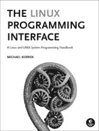

没错，还可以再迭代一次，但相反，让我们看看最后一次迭代，这是循环中经常出现错误的地方。所以，让我们添加一个条件断点，如下所示：

findruns <- function(x,k) {

n <- length(x)

runs <- NULL

for (i in 1:(n-k)) {

if (all(x[i:(i+k-1)]==1)) runs <- c(runs,i)

if (i == n-k) browser() # 在循环的最后一次迭代中中断

}

return(runs)

}

现在再次运行它。

> source("findruns.R")
> 
> findruns(c(1,0,0,1,1,0,1,1,1),2)

Called from: findruns(c(1, 0, 0, 1, 1, 0, 1, 1, 1), 2)

Browse[1]> i

[1] 7

这表明最后一次迭代是 i = 7。但向量有九个元素长，k = 2，所以我们的最后一次迭代应该是 i = 8。经过一些思考后，我们发现循环中的范围应该写成如下：for (i in 1:(n-k+1)) {

顺便说一下，请注意，我们现在已经替换了旧的 findruns 对象版本，因此我们使用 setBreakpoint() 设置的断点不再有效。

后续测试（此处未显示）表明代码现在可以正常工作。

让我们继续到一个更复杂的例子。

**13.3.6.2 调试寻找城市对**

回想一下我们在 3.4.2 节中的代码，该代码找到了距离最近的城市对。以下是该代码的一个有问题的版本：

1

返回 d[i,j] 的最小值，i != j，以及达到 2 的行/列

对于平方对称矩阵 d 的最小值，没有特殊策略

3

ties;

4

由距离矩阵激发

调试

**295**

[www.it-ebooks.info](http://www.it-ebooks.info/)

5

mind <- function(d) {

6

n <- nrow(d)

7

为 apply() 添加一个列以标识行号

8

dd <- cbind(d,1:n)

9

wmins <- apply(dd[-n,],1,imin)

10

wmins 将是 2xn，第一行是索引，第二行是值

11

i <- which.min(wmins[1,])

12

j <- wmins[2,i]

13

return(c(d[i,j],i,j))

14

}

15

16

在行 x 中找到最小值的定位和值

17

imin <- function(x) {

18

n <- length(x)

19

i <- x[n]

20

j <- which.min(x[(i+1):(n-1)])

21

return(c(j,x[j]))

22

}

让我们使用 R 的调试工具来查找和修复问题。

我们首先在一个小测试用例上运行它：

> source("cities.R")
> 
> m <- rbind(c(0,12,5),c(12,0,8),c(5,8,0))
> 
> m

[,1] [,2] [,3]

[1,]

0

12

5

[2,]

12

0

8

[3,]

5

8

0

> mind(m)

Error in mind(m) : subscript out of bounds

并不是一个吉祥的开始！不幸的是，错误信息没有告诉我们代码在哪里崩溃。但调试器会给我们这个信息：

> options(error=recover)
> 
> mind(m)

Error in mind(m) : subscript out of bounds

输入一个帧号，或 0 退出

1: mind(m)

Selection: 1

Called from: eval(expr, envir, enclos)

Browse[1]> where

**296**

第十三章

[www.it-ebooks.info](http://www.it-ebooks.info/)

其中 1: eval(expr, envir, enclos)

where 2: eval(quote(browser()), envir = sys.frame(which))

where 3 at cities.R#13: function ()

{

if (.isMethodsDispatchOn()) {

tState <- tracingState(FALSE)

...

好吧，问题发生在 mind() 而不是 imin() 中，特别是在第 13 行。这仍然可能是 imin() 的错误，但暂时我们先处理前者。

**注意**

*我们还有另一种方法可以确定崩溃发生在第 13 行。*

*我们像以前一样进入调试器，但检查局部变量。我们可以推理* *如果下标界限错误发生在第 9 行，那么变量 wmins 就不会被设置，所以查询它将给我们一个像这样的错误消息* 错误：对象

'wmins' not found. *另一方面，如果崩溃发生在第 13 行，即使 j* *也会被设置。*

由于错误发生在 d[i,j]，让我们看看这些变量：Browse[1]> d

[,1] [,2] [,3]

[1,]

0

12

5

[2,]

12

0

8

[3,]

5

8

0

Browse[1]> i

[1] 2

Browse[1]> j

[1] 12

这确实是一个问题——d 只有三列，而 j 是一个列

下标，是 12。

让我们看看我们从中获得 j 的变量 wmins：

Browse[1]> wmins

[,1] [,2]

[1,]

2

1

[2,]

12

12

如果你记得代码是如何设计的，wmins 的列 k 应该包含关于 d 的第 k 行最小值的信息。所以在这里，wmins 表示在 d 的第一行（k = 1）中，(0,12,5)的最小值是 12，发生在索引 2。但应该是索引 3 的 5。所以，这一行出了问题：

wmins <- apply(dd[-n, ], 1, imin)

Debugging

**297**

[www.it-ebooks.info](http://www.it-ebooks.info/)

这里有几个可能性。但由于最终 imin()被调用，我们可以在该函数内部检查它们。所以，让我们设置 imin()的调试状态，退出调试器，并重新运行代码。

Browse[1]> Q

> debug(imin)
> 
> mind(m)

在：FUN(newX[, i], ...)

debug at cities.R#17: {

n <- length(x)

i <- x[n]

j <- which.min(x[(i + 1):(n - 1)])

return(c(j, x[j]))

}

...

所以，我们在 imin()中。让我们看看它是否正确接收了 dd 的第一行，它应该是(0,12,5,1)。

Browse[4]> x

[1] 0 12 5 1

已确认。这似乎表明 apply()的第一个两个参数是正确的，问题实际上出在 imin()中，尽管这一点还需要进一步确认。

让我们单步执行，偶尔输入确认查询：Browse[2]> n

debug at cities.r#17: n <- length(x)

Browse[2]> n

debug at cities.r#18: i <- x[n]

Browse[2]> n

debug at cities.r#19: j <- which.min(x[(i + 1):(n - 1)])

Browse[2]> n

debug at cities.r#20: return(c(j, x[j]))

Browse[2]> print(n)

[1] 4

Browse[2]> i

[1] 1

Browse[2]> j

[1] 2

回想一下，我们设计调用 which.min(x[(i + 1):(n - 1)])时只查看这一行的上三角部分。这是因为矩阵是对称的，而且我们不希望考虑一个城市与自身的距离。

**298**

第十三章

[www.it-ebooks.info](http://www.it-ebooks.info/)

但 j = 2 的值没有得到确认。在(0,12,5)中的最小值是 5，发生在该向量的索引 3，而不是索引 2。因此，问题就在这一行：

j <- which.min(x[(i + 1):(n - 1)])

可能出了什么问题？

休息一下后，我们意识到，尽管(0,12,5)的最小值出现在该向量的索引 3 处，但这**并不是**我们要求 which.min()为我们找到的内容。相反，那个 i + 1 项意味着我们要求的是(12,5)中的最小值的索引，即 2。

我们确实要求 which.min()提供正确的信息，但我们未能正确使用它，因为我们确实想要(0,12,5)中最小值的索引。我们需要相应地调整 which.min()的输出，如下所示：

j <- which.min(x[(i+1):(n-1)])

k <- i + j

return(c(k,x[k]))

我们进行修复并再次尝试。

> mind(m)

Error in mind(m) : subscript out of bounds

输入一个帧号，或 0 退出

1: mind(m)

选择：

哦不，**另一个**越界错误！为了看到这次爆炸发生的位置，我们像以前一样发出 where 命令，我们发现它是在第 13 行。

再次。现在 i 和 j 是什么？

Browse[1]> i

[1] 1

Browse[1]> j

[1] 5

j 的值仍然不正确；它不能大于 3，因为在这个矩阵中我们只有三列。另一方面，i 是正确的。在 dd 中的整体最小值是 5，出现在第 1 行第 3 列。

因此，让我们再次检查 j 的来源，即矩阵 wmins：

Browse[1]> wmins

[,1] [,2]

[1,]

3

3

[2,]

5

8

调试

**299**

[www.it-ebooks.info](http://www.it-ebooks.info/)

好吧，列 1 中的 3 和 5 正如预期的那样。

记住，这里的列 1 包含 d 中第 1 行的信息，所以 wmins 表示第 1 行的最小值是 5，出现在该行的索引 3 处，这是正确的。

然而，休息一下后，我们意识到，虽然 wmins 是正确的，但我们的**使用**是不正确的。我们混淆了那个矩阵的行和列。

这段代码：

i <- which.min(wmins[1,])

j <- wmins[2,i]

应该是这样的：

i <- which.min(wmins[2,])

j <- wmins[1,i]

在进行更改并重新加载文件后，我们再次尝试。

> mind(m)

[1] 5 1 3

这是正确的，并且后续对更大矩阵的测试也成功了。

**13.4 在世界上攀升：更方便的调试**

**工具**

正如所见，R 的调试工具是有效的。然而，它们并不非常方便。幸运的是，有一些工具可以使这个过程更容易。按照开发的大致时间顺序，它们如下所示：

•

马克·布拉文顿的 debug 包

•

我的 edtdbg 包，它与 Vim 和 Emacs 文本编辑器一起工作

•

维塔利·斯皮努的 ess-tracebug，它在 Emacs 下运行（与 edtdbg 有相同的目标，但具有更多 Emacs 特定功能）

•

REvolution Analytics 的集成开发环境（IDE）

**注意**

*截至本文撰写时（2011 年 7 月），开发 StatET 和 RStudio IDE 的团队正在进行添加调试工具的工作。*

所有这些工具都是跨平台的，可以在 Linux、Windows 和 Mac 系统上运行，但 REvolution Analytics 产品除外。该 IDE 仅适用于带有 Microsoft Visual Studio 的 Windows 系统。所有这些工具都是开源的或免费的，但 REvolution Analytics 产品除外。

那么，这些包有什么可以提供的呢？对我来说，R 内置调试工具的最大问题之一是缺少一个显示整体情况的窗口——一个显示您的 R 代码并带有移动光标的窗口——**300**

第十三章

[www.it-ebooks.info](http://www.it-ebooks.info/)

当您单步执行代码时，代码会显示出来。例如，考虑以下我们之前浏览器输出的摘录：

浏览[2] > n

在 cities.r#17: n <- length(x)

浏览[2] > n

在 cities.r#18: i <- x[n]

这很好，但这些行在我们的代码中的位置在哪里？其他语言的多数 GUI 调试器都有一个显示用户源代码的窗口，其中有一个符号指示下一个要执行的行。本节开头列出的所有 R 工具都弥补了 R 核心中的这一不足。Bravington 调试包创建了一个专门用于此目的的单独窗口。其他工具让您的文本编辑器充当那个窗口，从而与使用 debug 相比节省了屏幕空间。

此外，这些工具还允许您设置断点并处理其他调试操作，而无需将屏幕光标从编辑器窗口移到 R 执行窗口。这既方便又节省了输入，大大提高了您专注于手头真正任务的效率：找到您的错误。

让我们再次考虑城市示例。我在 GVim 文本编辑器中打开了我的源文件，并配合 edtdbg 使用，为 edtdbg 进行了一些启动操作，然后按了两次[（左括号）键来单步通过代码。

结果的 GVim 窗口如图 13-1 所示。

*图 13-1：edtdbg 中的源代码窗口*

调试

**301**

[www.it-ebooks.info](http://www.it-ebooks.info/)

**注意**

*edtdbg 在 Emacs 中的操作与这里显示的相同，只是用于命令的快捷键不同。例如，F8 用于单步执行而不是[。*

首先，请注意编辑器的光标现在在这一行：

wmins <- apply(dd[-n, ], 1, imin)

这显示了下一个要执行的行。

每当我想要单步执行一行时，我只需在编辑器窗口中按[键。然后编辑器会告诉浏览器执行其 n 命令，而无需我将鼠标移到 R 执行窗口，然后编辑器将光标移到下一行。我也可以按]来执行浏览器的 c 命令。每次我以这种方式执行一行或几行，编辑器的光标就会相应移动。

每当我对我的源代码进行更改时，输入,src（逗号

（这是命令的一部分）输入到 GVim 窗口中会告诉 R 调用 source()。每次我想重新运行我的代码时，我都会按,dt。我很少，如果有的话，需要将鼠标从编辑器窗口移到 R 窗口然后再回来。

从本质上讲，编辑器已经成为了我的调试器，除了提供其编辑操作外。

**13.5 确保调试模拟代码的一致性**

如果您在进行任何与随机数相关的工作，您将需要能够在调试会话中每次运行程序时重现相同的数字流。如果没有这一点，您的错误可能无法重现，这使得它们更难修复。

`set.seed()` 函数通过重新初始化随机数序列到给定值来控制这一点。

考虑这个例子：

[1] 0.8811480 0.2853269 0.5864738

> `runif(3)`

[1] 0.5775979 0.4588383 0.8354707

> `runif(3)`

[1] 0.4155105 0.4852900 0.6591892

> `runif(3)`
> 
> `set.seed(8888)`
> 
> `runif(3)`

[1] 0.5775979 0.4588383 0.8354707

> `set.seed(8888)`
> 
> `runif(3)`

[1] 0.5775979 0.4588383 0.8354707

`runif(3)` 调用生成三个从区间 (0,1) 的均匀分布的随机数。

每次我们调用这个函数时，我们都会得到一组不同的三个数字。但通过 `set.seed()`，我们可以从头开始并得到相同的数字序列。

**302**

第十三章

[www.it-ebooks.info](http://www.it-ebooks.info/)

**13.6 语法和运行时错误**

最常见的语法错误将是缺少匹配的括号、方括号、花括号或引号。当您遇到语法

错误，这是您应该首先检查并再次检查的第一件事。我强烈建议您使用具有括号匹配和 R 语法高亮的文本编辑器，如 Vim 或 Emacs。

注意，当您收到一条消息说某一行存在语法错误时，错误实际上可能在一个远早的行中。

这在任何语言中都可能发生，但 R 似乎特别容易发生这种情况。

如果您不清楚语法错误在哪里，我建议您有选择地注释掉一些代码，这样您就能更好地定位语法问题的位置。通常，遵循二分搜索方法是有帮助的：注释掉一半的代码（注意保持语法完整性）并查看是否出现相同的错误。如果出现了，那么错误就在剩下的部分；否则，错误就在您删除的那一半。然后，将那一半再分成两半，依此类推。

您可能会收到如下消息：

有 50 或更多的警告（使用 `warnings()` 查看前 50 个）。这些应该被注意——按照建议运行 `warnings()`。问题

可能从算法的非收敛性到函数矩阵参数的误指定，再到函数。在许多情况下，程序输出可能无效，尽管它可能很好，比如这个消息：

在 `glm` 中数值概率为 0 或 1 的情况发生了：

在某些情况下，您可能会发现发出此命令很有用：

> `options(warn=2)`

这指示 R 将警告转换为实际错误，并使警告的位置更容易找到。

**13.7 在 R 上运行 GDB**

即使您不是在尝试修复 R 中的错误，这一节也可能对您有所帮助。例如，您可能编写了一些 C 代码来与 R 接口（在第十五章中介绍），并发现它存在错误。为了在 GDB 上运行那个 C 函数，您必须首先通过 GDB 运行 R 本身。

或者，你可能对 R 的内部结构感兴趣，比如确定如何编写高效的 R 代码，并希望通过调试工具（如 GDB）逐步遍历 R 源代码来探索内部结构。

调试

**303**

[www.it-ebooks.info](http://www.it-ebooks.info/)

虽然你可以从 shell 命令行调用 R（见第 15.1.4 节），但在这里，我建议使用单独的窗口来运行 R 和 GDB。以下是步骤：

1.

按照惯例，在一个窗口中启动 R。

2.

在另一个窗口中，确定你的 R 进程的 ID 号。在

UNIX 系统家族，例如，可以通过类似 ps -a 的命令获得。

3.

在那个第二个窗口中，提交 GDB 的 attach 命令与 R 进程一起。

进程号。

4.

向 GDB 提交继续命令。

你可以在继续之前或在 GDB 中使用 CTRL-C 中断后设置 R 源代码中的断点。有关从 R 调用的 C 代码调试的详细信息，请参阅第 15.1.4 节。另一方面，如果你希望使用 GDB

探索 R 源代码时，请注意以下事项。

R 的源代码主要由 S 表达式指针（SEXPs）组成，

这些是指向包含 R 变量值、类型等信息的 C 结构的指针。你可以使用 R 内部函数 Rf_PrintValue(s) 来检查 SEXP

值。例如，如果 SEXP 被命名为 s，那么在 GDB 中，输入以下内容：call Rf_PrintValue(s)

这将打印值。

**304**

第十三章

[www.it-ebooks.info](http://www.it-ebooks.info/)

**14**

**性能提升：**

**速度和内存**

在计算机科学课程中，一个常见的

主题是时间和

空间。为了有一个快速运行的程序，

程序，可能需要使用更多的内存空间。

另一方面，为了节省内存空间，

你可能需要满足于较慢的代码。在 R 语言中，

语言，这种权衡对以下方面尤其感兴趣：

以下原因：

•

R 是一种解释型语言。许多命令是用 C

因此确实以快速机器代码运行。但其他命令，以及你的

自己的 R 代码，是纯 R 并因此是解释型的。因此，你的 R 应用程序可能运行得比你希望的慢。

•

R 会话中的所有对象都存储在内存中。更确切地说，所有对象都存储在 R 的内存地址空间中。R 对任何对象的大小限制为 231 *−* 1 字节，即使在 64 位机器上，即使你有大量的 RAM。然而，一些应用程序确实会遇到

较大的对象。

[www.it-ebooks.info](http://www.it-ebooks.info/)

本章将提出你可以提高 R 代码性能的方法，考虑到时间/空间权衡。

**14.1 编写高效的 R 代码**

如何使 R 代码更快？以下是你可用的主要工具：

•

通过向量化、使用字节码编译和其他方法优化你的 R 代码。

•

将代码的关键、CPU 密集部分用编译语言（如 C/C++）编写。

•

将你的代码以某种形式的并行 R 编写。

第一种方法将在本章中介绍，其他方法将在第十五章和第十六章中介绍。

为了优化你的 R 代码，你需要理解 R 的函数编程特性。

gramming nature and the way R uses memory.

**14.2 可怕的 for 循环**

R 的 r-help 讨论列表经常有人询问如何在不使用循环的情况下完成各种任务。似乎有一种感觉，程序员应该不惜一切代价避免这些循环。1 提出问题的人通常的目标是加快他们的代码。

重要的是要理解，仅仅重写代码以避免循环并不一定会使代码更快。然而，在某些情况下，可以通过向量化获得显著的加速。

***14.2.1 向量化以加速***

有时候，你可以使用向量化而不是循环。例如，如果 x 和 y 是长度相等的向量，你可以这样写：

z <- x + y

这不仅更紧凑，更重要的是，它比使用这个循环更快：

for (i in 1:length(x)) z[i] <- x[i] + y[i]

让我们做一个快速的计时比较：

> x <- runif(1000000)
> 
> y <- runif(1000000)

1 与此相反，while 循环提出了更大的挑战，因为它们难以有效地向量化。

**306**

第十四章

[www.it-ebooks.info](http://www.it-ebooks.info/)

> z <- vector(length=1000000)
> 
> system.time(z <- x + y)

user system elapsed

0.052

0.016

0.068

> system.time(for (i in 1:length(x)) z[i] <- x[i] + y[i])

user system elapsed

8.088

0.044

8.175

差异多么大啊！没有循环的版本在运行时间上快了超过 120 倍。虽然运行时间可能因运行而异（循环版本的第二次运行运行时间为 22.958），在某些情况下，

“去循环”R 代码确实可以带来好处。

值得讨论一下循环版本中减慢速度的一些原因。对于从其他语言转向 R 的程序员来说可能不明显的是，前述代码的循环版本中涉及了大量的函数调用：

•

虽然从语法上看循环看起来无害，但实际上 for() 是一个函数。

•

冒号 : 看起来更无害，但实际上也是一个函数。例如，1:10 实际上是 : 函数在 1

and 10:

> ":"(1,10)

[1] 1 2 3 4 5 6 7 8 9 10

•

每个向量索引操作代表一个函数调用，包括对 [

对于两次读取和写入的情况。

函数调用可能会消耗时间，因为它们涉及到设置栈帧等。在循环的每次迭代中承受这种时间惩罚会导致速度大幅下降。

相比之下，如果我们用 C 语言来写这个，就不会有函数调用了。实际上，这正是我们第一个代码片段中发生的事情。那里也有函数调用，即对 + 和对 - *>* 的调用，但每个只调用了一次，而不是像循环版本那样调用 1,000,000 次。因此，代码的第一个版本要快得多。

向量化的一种类型是*向量过滤*。例如，让我们重写第 1.3 节中的 oddcount()函数：

oddcount <- function(x) return(sum(x%%2==1))

这里没有显式循环，尽管 R 会内部遍历数组，但这将在本地机器码中完成。再次强调，预期的加速确实发生了。

> x <- sample(1:1000000,100000,replace=T)
> 
> system.time(oddcount(x))

用户 系统 运行时间

性能提升：速度和内存

**307**

[www.it-ebooks.info](http://www.it-ebooks.info/)

0.012

0.000

0.015

> system.time(

+

{

+

c <- 0

+

for (i in 1:length(x))

+

if (x[i] %% 2 == 1) c <- c+1

+

return(c)

+

}

+ )

用户 系统 运行时间

0.308

0.000

0.310

你可能会想知道在这种情况下这是否有关系，因为即使循环版本的代码运行时间也少于 1 秒。但如果这段代码是包含在嵌套循环中的，并且有很多迭代，那么差异确实可能很重要。

可能加快你代码速度的其他向量化函数示例

这些是 ifelse(), which(), where(), any(), all(), cumsum(), 和 cumprod()。在矩阵情况下，你可以使用 rowSums(), colSums()等等。在“所有可能的组合”类型的设置中，combin(), outer(), lower.tri(), upper.tri(), 或 expand.grid()可能正是你所需要的。

虽然 apply()消除了显式循环，但实际上它在 R 中而不是在 C 中实现，因此通常不会加快你的代码速度。然而，其他 apply 函数，如 lapply()，可以在加快你的代码速度方面非常有帮助。

***14.2.2 扩展示例：在蒙特卡洛中实现更好的速度***

***模拟***

在某些应用中，模拟代码可能需要运行数小时、数天，甚至数月，因此加速方法是高度感兴趣的。在这里，我们将查看两个模拟示例。

首先，让我们考虑第 8.6 节中的以下代码：

sum <- 0

nreps <- 100000

for (i in 1:nreps) {

xy <- rnorm(2) # 生成 2 个 N(0,1)的随机数

sum <- sum + max(xy)

}

print(sum/nreps)

这里是一个修订版（希望更快）：

nreps <- 100000

xymat <- matrix(rnorm(2*nreps),ncol=2)

**308**

第十四章

[www.it-ebooks.info](http://www.it-ebooks.info/)

maxs <- pmax(xymat[,1],xymat[,2])

print(mean(maxs))

在此代码中，我们一次性生成所有随机变量，并将它们存储在矩阵 xymat 中，每行一个(X,Y)对：

xymat <- matrix(rnorm(2*nreps),ncol=2)

接下来，我们找到所有 max(X,Y)的值，将这些值存储在 maxs 中，然后简单地调用 mean()。

这更容易编程，我们相信它将更快。让我们检查一下。

我在文件*MaxNorm.R*中有原始代码，在*MaxNorm2.R*中有改进版本。

> system.time(source("MaxNorm.R"))

[1] 0.5667599

用户 系统 运行时间

1.700

0.004

1.722

> system.time(source("MaxNorm2.R"))

[1] 0.5649281

用户 系统 运行时间

0.132

0.008

0.143

速度提升再次非常显著。

**注意**

*我们通过将随机数保存在数组中而不是一次生成和丢弃它们来提高速度，但代价是使用更多的内存。如前所述，时间/空间权衡在计算领域以及 R 世界的特定领域是常见的。*

在这个例子中，我们取得了非常好的加速效果，但这是误导性的简单。让我们看看一个稍微复杂一点的例子。

我们接下来的例子是初等概率中的一个经典练习

抽屉 1 中有十个蓝色弹珠和八个黄色弹珠。在抽屉 2 中，混合物是六个蓝色和六个黄色。我们随机从抽屉 1 中抽取一个弹珠，将其转移到抽屉 2，然后从抽屉 2 中随机抽取一个弹珠。

第二个弹珠是蓝色的概率是多少？这可以通过解析方法轻松找到，但我们将使用模拟。以下是直接的方法：1

# 进行 nreps 次弹珠实验，以估计

2

# P(从抽屉 2 中抽取蓝色)

3

sim1 <- function(nreps) {

4

nb1 <- 10 # 抽屉 1 中有 10 个蓝色弹珠

5

n1 <- 18 # 第一次抽取时抽屉 1 中的弹珠数量

6

n2 <- 13 # 第二次抽取时抽屉 2 中的弹珠数量

7

count <- 0 # 从抽屉 2 中获得蓝色的重复次数

8

for (i in 1:nreps) {

9

nb2 <- 6 # 抽屉 2 中原本有 6 个蓝色弹珠

性能提升：速度和内存

**309**

[www.it-ebooks.info](http://www.it-ebooks.info/)

10

# 从抽屉 1 中抽取并放入抽屉 2；它是蓝色的吗？

11

if (runif(1) < nb1/n1) nb2 <- nb2 + 1

12

# 从抽屉 2 中抽取；它是蓝色的吗？

13

if (runif(1) < nb2/n2) count <- count + 1

14

}

15

return(count/nreps) # 估计 P(从抽屉 2 中抽取蓝色)

16

}

这里是如何在不使用循环的情况下使用 apply() 来完成它的：

1

sim2 <- function(nreps) {

2

nb1 <- 10

3

nb2 <- 6

4

n1 <- 18

5

n2 <- 13

6

# 预先生成所有随机数，每重复一次一行

7

u <- matrix(c(runif(2*nreps)),nrow=nreps,ncol=2)

8

# 为 apply() 定义 simfun；模拟一次重复

9

simfun <- function(rw) {

10

# rw ("行") 是一对随机数

11

# 从抽屉 1 中选择

12

if (rw[1] < nb1/n1) nb2 <- nb2 + 1

13

# 从抽屉 2 中选择，并返回选择蓝色时的布尔值

14

return (rw[2] < nb2/n2)

15

}

16

z <- apply(u,1,simfun)

17

# z 是一个布尔向量，但它们可以被视为 1s 和 0s

18

return(mean(z))

19

}

在这里，我们设置一个矩阵 u，包含两列 U(0,1) 随机变量。

第一列用于我们对抽屉 1 的模拟，第二列用于从抽屉 2 中抽取。这样，我们一次生成所有随机数，这可能节省一点时间，但主要目的是为使用 apply() 准备。为了达到这个目标，我们的 simfun() 函数在一个实验重复中工作——即 u 的一行。我们设置 apply() 的调用以遍历所有的 nreps 重复。

注意，由于 simfun()函数是在 sim2()内部声明的，所以 sim2()的局部变量 n1、n2、nb1 和 nb2 可以作为 simfun()的全局变量使用。此外，由于布尔向量将被 R 自动转换为 1s 和 0s，我们可以通过简单地调用 mean()来找到向量中 TRUE 值的比例。

现在，让我们比较性能。

> system.time(print(sim1(100000)))

[1] 0.5086

user system elapsed

2.465

0.028

2.586

> system.time(print(sim2(10000)))

**310**

第十四章

[www.it-ebooks.info](http://www.it-ebooks.info/)

[1] 0.5031

user system elapsed

2.936

0.004

3.027

尽管函数式编程有许多好处，但使用 apply()的方法并没有帮助。相反，情况变得更糟。这可能是由于随机抽样变异的简单原因，所以我再次运行了代码，结果相似。

因此，让我们看看如何将这个模拟向量化。

1

sim3 <- function(nreps) {

2

nb1 <- 10

3

nb2 <- 6

4

n1 <- 18

5

n2 <- 13

6

u <- matrix(c(runif(2*nreps)),nrow=nreps,ncol=2)

7

# 设置条件向量

8

cndtn <- u[,1] <= nb1/n1 & u[,2] <= (nb2+1)/n2 |

9

u[,1] > nb1/n1 & u[,2] <= nb2/n2

10

返回 cndtn 的平均值

11

}

主要工作在这条语句中完成：

cndtn <- u[,1] <= nb1/n1 & u[,2] <= (nb2+1)/n2 |

u[,1] > nb1/n1 & u[,2] <= nb2/n2

为了得到这个结果，我们推理出哪些条件会导致在第二次选择时选择蓝色弹珠，将它们编码，然后将它们分配给 cndtn。

记住，*<* = 和 & 是函数；实际上，它们是向量函数，所以它们应该很快。确实，这带来了相当大的改进：

> system.time(print(sim3(10000)))

[1] 0.4987

user system elapsed

0.060

0.016

0.076

在原则上，我们用来加速代码的方法可以应用于许多其他蒙特卡洛模拟。然而，很明显，计算 cndtn 的语句的类似物会迅速变得相当复杂，即使对于看似简单的应用也是如此。

此外，这种方法在“无限阶段”情况下不会起作用，这意味着无限的时间步数。在这里，我们将弹珠示例视为两阶段，矩阵 u 有两列。

性能提升：速度和内存

**311**

[www.it-ebooks.info](http://www.it-ebooks.info/)

***14.2.3 扩展示例：生成幂矩阵***

回想第 9.1.7 节，我们需要生成预测变量的幂矩阵。我们使用了以下代码：

1

# 通过度 dg 形成向量 x 的幂矩阵

2

powers1 <- function(x,dg) {

3

pw <- matrix(x,nrow=length(x))

4

prod <- x # 当前乘积

5

for (i in 2:dg) {

6

prod <- prod * x

7

pw <- cbind(pw,prod)

8

}

9

return(pw)

10

}

一个明显的问题是，cbind()被用来按列构建输出矩阵。这在内存分配时间上代价很高。最好一开始就分配整个矩阵，即使它是空的，因为这将意味着只需承担一次内存分配操作的代价。

1

# 通过度 dg 形成向量 x 的幂矩阵

2

powers2 <- function(x,dg) {

3

pw <- matrix(nrow=length(x),ncol=dg)

4

prod <- x # 当前乘积

5

pw[,1] <- prod

6

for (i in 2:dg) {

7

prod <- prod * x

8

pw[,i] <- prod

9

}

10

return(pw)

11

}

事实上，powers2() 要快得多。

> x <- runif(1000000)
> 
> system.time(powers1(x,8))

用户 系统 运行时间

0.776

0.356

1.334

> system.time(powers2(x,8))

用户 系统 运行时间

0.388

0.204

0.593

**312**

第十四章

[www.it-ebooks.info](http://www.it-ebooks.info/)

然而，powers2() 仍然包含一个循环。我们能做得更好吗？这似乎是 outer() 的调用形式完美的设置，其调用形式为

outer(X,Y,FUN)

这个调用将函数 FUN() 应用到 X 的所有可能元素对上

并且 Y 的元素。FUN 的默认值是乘法。

在这里，我们可以写出以下内容：

powers3 <- function(x,dg) return(outer(x,1:dg,"^"))

对于 x 的每个元素和 1:dg 的每个元素的组合（总共产生 length(x) *×* dg 个组合），outer() 调用指数函数

^ 在那个组合上，将结果放入一个 length(x) *×* dg 矩阵中。这正是我们需要的，而且作为额外的好处，代码相当紧凑。但代码更快吗？

> system.time(powers3(x,8))

用户 系统 运行时间

1.336

0.204

1.747

多么令人失望啊！在这里，我们使用了一个花哨的 R 函数，代码非常紧凑，但三个函数中性能最差。

而且情况变得更糟。如果我们尝试使用 cumprod()，会发生什么：

> powers4

function(x,dg) {

repx <- matrix(rep(x,dg),nrow=length(x))

return(t(apply(repx,1,cumprod)))

}

> system.time(powers4(x,8))

用户 系统 运行时间

28.106

1.120 83.255

在这个例子中，我们创建了多个 x 的副本，因为一个数字 n 的幂仅仅是 cumprod(c(1,n,n,n...)) 的累积乘积。但尽管我们尽职尽责地使用了两个 C 级别的 R 函数，性能仍然非常糟糕。

这个故事的意义在于性能问题可能是不可预测的。

你能做的就是掌握基本问题、向量化以及接下来解释的内存方面的理解，然后尝试各种方法。

性能提升：速度和内存

**313**

[www.it-ebooks.info](http://www.it-ebooks.info/)

**14.3 函数式编程和内存问题**

大多数 R 对象都是 *不可变的*，或者说不可更改的。因此，R 操作是通过将给定对象重新赋值的函数实现的，这种特性可能会对性能产生影响。

***14.3.1 向量赋值问题***

作为可能出现的一些问题的例子，考虑这个看起来简单的声明：

z[3] <- 8

如第七章所述，这个赋值比看起来要复杂。实际上，它是通过这个调用和赋值通过替换函数 "[<-" 实现的：

z <- "[<-"(z,3,value=8)

对 z 的一个内部副本进行了操作，将副本中的第 3 个元素更改为 8，然后将得到的向量重新赋值给 z。记住，后者仅仅意味着 z 指向了副本。

换句话说，即使我们表面上只改变向量的一个元素，语义上讲，*整个向量都会被重新计算*。对于长向量，这会显著减慢程序的运行速度。如果是在我们的代码循环中赋值给短向量，情况也会相同。

在某些情况下，R 确实采取了一些措施来减轻这种影响，但在追求快速代码时，这是一个需要考虑的关键点。当与向量（包括数组）一起工作时，你应该注意这一点。如果你的代码似乎运行得异常缓慢，向量的赋值应该是一个首要的怀疑对象。

***14.3.2 更改时复制问题***

相关问题是，R（通常）遵循*更改时复制*策略。例如，如果我们执行以下操作：

> y <- z

初始时，y 与 z 共享相同的内存区域。但如果有任何一个发生变化，那么就会在内存的不同区域创建一个副本，并且变化后的变量将占用新的内存区域。然而，只有*第一次*变化受到影响，因为移动变量的重新定位意味着不再有任何共享问题。tracemem()函数将报告此类内存重新定位。

**314**

第十四章

[www.it-ebooks.info](http://www.it-ebooks.info/)

尽管 R 通常遵循更改时复制的语义，但也有一些例外。例如，R 在以下设置中不会显示位置变化的行为：

> z <- runif(10)
> 
> tracemem(z)

[1] "<0x88c3258>"

> z[3] <- 8
> 
> tracemem(z)

[1] "<0x88c3258>"

z 的位置没有变化；它在内存地址 0x88c3258

在执行对 z[3]的赋值操作之前和之后。因此，尽管你应该警惕位置变化，但你也不能假设它会发生变化。

让我们看看涉及的时间。

> z <- 1:10000000
> 
> system.time(z[3] <- 8)

用户 系统 运行时间

0.180

0.084

0.265

> system.time(z[33] <- 88)

用户 系统 运行时间

0

0

0

无论如何，如果进行了复制，那么工具是 R 的内部函数 duplicate()。（在 R 的较新版本中，该函数被称为 duplicate1()。）如果你熟悉 GDB 调试工具，并且你的 R 构建包含调试信息，你可以探索执行复制的环境。

按照第 15.1.4 节中的指南，使用 GDB 启动 R，通过 GDB 逐步执行 R，并在 duplicate1()函数处设置断点。每次在该函数处中断时，提交以下 GDB 命令：

call Rf_PrintValue(s)

这将打印 s（或任何感兴趣的变量）的值。

***14.3.3 扩展示例：避免内存复制***

这个例子，尽管是人为的，将演示上一节中讨论的内存复制问题。

假设我们有许多无关的向量，并且我们希望将每个向量的第三个元素设置为 8。我们可以将向量存储在一个矩阵中，每行一个向量。但由于它们是无关的，甚至可能长度不同，我们可能考虑将它们存储在一个列表中。

性能提升：速度和内存

**315**

[www.it-ebooks.info](http://www.it-ebooks.info/)

但是，当涉及到 R 的性能问题时，事情可能会变得非常微妙，所以让我们试试看。

> m <- 5000
> 
> n <- 1000
> 
> z <- list()
> 
> for (i in 1:m) z[[i]] <- sample(1:10,n,replace=T)
> 
> system.time(for (i in 1:m) z[[i]][3] <- 8)

用户系统已用时间

0.288

0.024

0.321

> z <- matrix(sample(1:10,m*n,replace=T),nrow=m)
> 
> system.time(z[,3] <- 8)

user system elapsed

0.008

0.044

0.052

除了系统时间（再次），矩阵公式表现得更好。

其中一个原因是，在列表版本中，我们在循环的每次迭代中都会遇到内存复制问题。但在矩阵版本中，我们只遇到一次。当然，矩阵版本是向量化的。

但使用 lapply()在列表版本上又如何呢？

> set3 <- function(lv) {

+

lv[3] <- 8

+

return(lv)

+ }

> z <- list()
> 
> for (i in 1:m) z[[i]] <- sample(1:10,n,replace=T)
> 
> system.time(lapply(z,set3))

用户系统已用时间

0.100

0.012

0.112

向量化代码很难被超越。

**14.4 使用 Rprof()查找代码中的慢速区域**

如果你认为你的 R 代码运行得过于缓慢，一个方便的工具是 Rprof()，它可以给你一个报告，显示你的代码在它调用的每个函数中花费了大约多少时间。这很重要，因为优化程序中的每个部分可能并不明智。

优化可能会以编码时间和代码清晰度为代价，因此了解优化真正能帮助的地方是有价值的。

***14.4.1 使用 Rprof()进行监控***

让我们通过使用 Rprof()来演示如何使用我们前面扩展示例中的三个版本的代码来找到一个幂矩阵。我们将调用 Rprof()来启动监控，运行我们的代码，然后使用 NULL 调用 Rprof()。

**316**

第十四章

[www.it-ebooks.info](http://www.it-ebooks.info/)

停止监控的参数。最后，我们将调用 summaryRprof()来查看结果。

> x <- runif(1000000)
> 
> Rprof()
> 
> invisible(powers1(x,8))
> 
> Rprof(NULL)
> 
> summaryRprof()

$by.self

self.time self.pct total.time total.pct

"cbind"

0.74

86.0

0.74

86.0

"*"

0.10

11.6

0.10

11.6

"matrix"

0.02

2.3

0.02

2.3

"powers1"

0.00

0.0

0.86

100.0

$by.total

total.time total.pct self.time self.pct

"powers1"

0.86

100.0

0.00

0.0

"cbind"

0.74

86.0

0.74

86.0

"*"

0.10

11.6

0.10

11.6

"matrix"

0.02

2.3

0.02

2.3

$sampling.time

[1] 0.86

我们立即看到，我们的代码运行时间主要受 cbind()调用的支配，正如我们在扩展示例中提到的，这确实会减慢速度。

顺便说一下，这个例子中调用 invisible()是为了抑制输出。我们当然不希望看到 powers1()返回的 1,000,000 行矩阵！

对 powers2()进行性能分析没有显示出任何明显的瓶颈。

> Rprof()
> 
> invisible(powers2(x,8))
> 
> Rprof(NULL)
> 
> summaryRprof()

$by.self

self.time self.pct total.time total.pct

"powers2"

0.38

67.9

0.56

100.0

"matrix"

0.14

25.0

0.14

25.0

"*"

0.04

7.1

0.04

7.1

$by.total

total.time total.pct self.time self.pct

"powers2"

0.56

100.0

0.38

67.9

"matrix"

0.14

25.0

0.14

25.0

"*"

0.04

7.1

0.04

7.1

性能提升：速度和内存

**317**

[www.it-ebooks.info](http://www.it-ebooks.info/)

$sampling.time

[1] 0.56

那么 powers3() 呢？这是一个有希望但最终没有成功的方案？

> Rprof()
> 
> invisible(powers3(x,8))
> 
> Rprof(NULL)
> 
> summaryRprof()

$by.self

self.time self.pct total.time total.pct

"FUN"

0.94

56.6

0.94

56.6

"outer"

0.72

43.4

1.66

100.0

"powers3"

0.00

0.0

1.66

100.0

$by.total

total.time total.pct self.time self.pct

"outer"

1.66

100.0

0.72

43.4

"powers3"

1.66

100.0

0.00

0.0

"FUN"

0.94

56.6

0.94

56.6

$sampling.time

[1] 1.66

记录耗时最多的函数是 FUN()，正如我们在扩展示例中所提到的，它仅仅是乘法。对于这里 x 的每一对元素，其中一个元素会被另一个元素相乘；也就是说，找到了两个标量的乘积。换句话说，没有使用向量化！难怪它运行得慢。

***14.4.2 Rprof() 的工作原理***

让我们更详细地探讨一下 Rprof() 的作用。每 0.02 秒（默认值），R 会检查调用栈以确定当时哪些函数调用正在生效。它将每次检查的结果写入一个文件，默认为 *Rprof.out*。以下是 powers3() 运行时该文件的摘录：

...

"outer" "powers3"

"outer" "powers3"

"outer" "powers3"

"FUN" "outer" "powers3"

"FUN" "outer" "powers3"

"FUN" "outer" "powers3"

"FUN" "outer" "powers3"

...

**318**

第十四章

[www.it-ebooks.info](http://www.it-ebooks.info/)

因此，Rprof() 经常发现，在检查时，powers3() 调用了 outer()，后者又调用了 FUN()，后者是当前正在执行的功能。summaryRprof() 函数方便地总结了文件中的所有这些行，但你可能会发现，在某些情况下，查看文件本身可以揭示更多见解。

注意，Rprof() 并非万能。如果你正在分析的代码产生了许多函数调用（包括间接调用，当你的代码调用某个函数时，该函数又调用了另一个 R 函数），那么分析输出可能难以解读。对于 powers4() 的输出来说，这可能是真的：

$by.self

self.time self.pct total.time total.pct

"apply"

19.46

67.5

27.56

95.6

"lapply"

4.02

13.9

5.68

19.7

"FUN"

2.56

8.9

2.56

8.9

"as.vector"

0.82

2.8

0.82

2.8

"t.default"

0.54

1.9

0.54

1.9

"unlist"

0.40

1.4

6.08

21.1

"!"

0.34

1.2

0.34

1.2

"is.null"

0.32

1.1

0.32

1.1

"aperm"

0.22

0.8

0.22

0.8

"matrix"

0.14

0.5

0.74

2.6

"!="

0.02

0.1

0.02

0.1

"powers4"

0.00

0.0

28.84

100.0

"t"

0.00

0.0

28.10

97.4

"array"

0.00

0.0

0.22

0.8

$by.total

total.time total.pct self.time self.pct

"powers4"

28.84

100.0

0.00

0.0

"t"

28.10

97.4

0.00

0.0

"apply"

27.56

95.6

19.46

67.5

"unlist"

6.08

21.1

0.40

1.4

"lapply"

5.68

19.7

4.02

13.9

"FUN"

2.56

8.9

2.56

8.9

"as.vector"

0.82

2.8

0.82

2.8

"matrix"

0.74

2.6

0.14

0.5

"t.default"

0.54

1.9

0.54

1.9

"!"

0.34

1.2

0.34

1.2

"is.null"

0.32

1.1

0.32

1.1

"aperm"

0.22

0.8

0.22

0.8

"array"

0.22

0.8

0.00

0.0

"!="

0.02

0.1

0.02

0.1

$sampling.time

[1] 28.84

性能提升：速度和内存

**319**

[www.it-ebooks.info](http://www.it-ebooks.info/)

**14.5 字节码编译**

从版本 2.13 开始，R 已经包含了一个*字节码编译器*，你可以用它来尝试加速你的代码。考虑我们第 14.2.1 节中的例子。

作为一个非常简单的例子，我们展示了

z <- x + y

比以下代码快得多

for (i in 1:length(x)) z[i] <- x[i] + y[i]

再次，这是显而易见的，但为了了解字节码编译是如何工作的，让我们试一试：

> library(compiler)
> 
> f <- function() for (i in 1:length(x)) z[i] <<- x[i] + y[i]
> 
> cf <- cmpfun(f)
> 
> system.time(cf())

用户系统耗时

0.845

0.003

0.848

我们从原始的 f()函数创建了一个新的函数 cf()。新代码的运行时间为 0.848 秒，比非编译版本的 8.175 秒快得多。诚然，它仍然没有像直接向量化的代码那样快，但很明显，字节码编译有潜力。当你需要更快的代码时，你应该尝试它。

**14.6 哎呀，数据放不进内存！**

如前所述，R 会话中的所有对象都存储在内存中。R

对任何对象的大小设置限制为 231 *−* 1 字节，无论字长（32 位与 64 位）以及机器中的 RAM 量。然而，你真的不应该把它看作是一个障碍。只要稍微多加小心，具有大量内存需求的应用程序确实可以在 R 中得到很好的处理。一些常见的方法是分块和使用 R 包进行内存管理。

***14.6.1 分块***

一个不涉及任何额外 R 包的选项是从磁盘文件一次读取一个数据块。例如，假设我们的目标是找到一些变量的均值或比例。我们可以使用 read.table()中的 skip 参数。

假设我们的数据集有 1,000,000 条记录，我们将它们分成 10

块（或更多—— whatever is needed to cut the data down to a size so it fits in memory）。然后我们在第一次读取时设置 skip = 0，第二次设置 skip = 100000

第二次读取时，以此类推。每次读取一个块时，我们计算**320**

第十四章

[www.it-ebooks.info](http://www.it-ebooks.info/)

记录该块的数量或总和，并将它们记录下来。在读取所有块之后，我们将所有数量或总和加起来，以便计算我们的总体均值或比例。

作为另一个例子，假设我们正在进行一个统计操作，比如计算主成分，其中我们有一大批行——也就是说，有大量观测值——但变量的数量是可管理的。再次强调，分块可能是解决方案。我们将统计操作应用于每个块，然后对所有块的结果进行平均。我的数学研究显示，这些结果估计量在广泛的统计方法中在统计上是有效的。

***14.6.2 使用 R 包进行内存管理***

再次考虑更复杂的例子，有一些替代方案可以用来适应大内存需求，形式是一些专门的 R

packages.

其中一个包是 RMySQL，它是 SQL 数据库的 R 接口。使用它需要一些数据库专业知识，但这个包提供了处理大型数据集的更高效和更方便的方法。想法是在数据库端让 SQL 为你执行变量/情况选择操作，然后读取由 SQL 产生的所选数据。

由于后者通常比整体数据集小得多，你可能会绕过 R 的内存限制。

另一个有用的包是 biglm，它对非常大的数据集进行回归和广义线性模型分析。它也使用分块，但方式不同：每个块用于更新回归分析所需的运行总和，然后被丢弃。

最后，一些包自己进行存储管理独立于

独立于 R，因此可以处理非常大的数据集。目前最常用的两个是 ff 和 bigmemory。前者通过在磁盘上而不是内存中存储数据来规避内存限制，对程序员来说几乎是透明的。功能极其丰富的 bigmemory 包做同样的事情，但它不仅可以存储在磁盘上，还可以存储在机器的主内存中，这对于多核机器来说非常理想。

性能提升：速度和内存

**321**

[www.it-ebooks.info](http://www.it-ebooks.info/)

[www.it-ebooks.info](http://www.it-ebooks.info/)

**15**

**将 R 连接到其他**

**语言**

R 是一种伟大的语言，但它不能做每一件事

事情处理得很好。因此，有时是可取的

从其他语言中调用代码

R。相反，当在其他伟大的语言中工作时

语言，你可能会遇到一些任务，这些任务可能更适合

在 R 中完成。

已经为许多其他语言开发了 R 接口，

从无处不在的语言如 C 到晦涩难懂的语言如 Yacas 计算机代数系统。本章将介绍两个接口：一个是从 R 调用 C/C++的接口，另一个是从 Python 调用 R 的接口。

**15.1 编写从 R 调用的 C/C++函数**

你可能希望编写自己的 C/C++函数，以便从 R 中调用。通常，目标是性能提升，因为 C/C++代码可能比 R 运行得更快，即使你使用向量化和其他 R 优化技术来加速。

降低到 C/C++级别的另一个可能目标是专门的 I/O。例如，R 在标准互联网通信系统的第 3 层使用 TCP 协议，但在某些设置中 UDP 可能更快。

[www.it-ebooks.info](http://www.it-ebooks.info/)

在使用 UDP 时，你需要 C/C++，这些语言需要与 R 的接口。

R 实际上通过函数 .C() 和

.Call(). 后者更灵活，但需要了解 R 的内部结构，所以我们在这里坚持使用 .C()。

***15.1.1 一些 R 到 C/C++的初步知识***

在 C 中，二维数组以行主序存储，这与 R 的列主序相反。例如，如果您有一个 3x4 的数组，当线性查看时，第二行第二列的元素是数组的第 5 个元素，因为第一列有三个元素，这是第二列的第二元素。还要记住，C 的索引从 0 开始，而不是像 R 那样从 1 开始。

所有从 R 传递到 C 的参数都以指针的形式接收。

注意，C 函数本身必须返回 void。您通常返回的值必须通过函数的参数传递，例如以下示例中的 result。

***15.1.2 示例：从方阵中提取子对角线***

在这里，我们将编写 C 代码以从方阵中提取子对角线。

(感谢我的前研究生助理，黄敏宇，他编写了这个函数的早期版本。) 这是文件 *sd.c* 的代码：

#include <R.h> // 必需

// 参数：

//

m: 一个方阵

//

n: m 的行/列数

//

k: 子对角线索引--主对角线为 0，第一个子对角线为 1

//

子对角线，第二个子对角线为 2，等等。

//

result: 请求的子对角线空间，此处返回

void subdiag(double *m, int *n, int *k, double *result)

{

int nval = *n, kval = *k;

int stride = nval + 1;

for (int i = 0, j = kval; i < nval-kval; ++i, j+= stride)

result[i] = m[j];

}

变量 stride 暗示了并行处理社区中的一个概念。比如说我们有一个 1,000 列的矩阵，我们的 C 代码正在遍历给定列中的所有元素，从上到下。再次强调，由于 C 使用行主序，如果将矩阵视为一个长向量，则连续元素之间相隔 1,000 个元素。

elements apart from each other if the matrix is viewed as one long vector.

**324**

第十五章

[www.it-ebooks.info](http://www.it-ebooks.info/)

这里，我们会说我们以 1,000 的步长遍历这个长向量--也就是说，访问每千个元素。

***15.1.3 编译和运行代码***

您可以使用 R 编译您的代码。例如，在 Linux 终端窗口中，我们可以像这样编译我们的文件：

% R CMD SHLIB sd.c

gcc -std=gnu99 -I/usr/share/R/include

-fpic -g -O2 -c sd.c -o sd.o

gcc -std=gnu99 -shared -o sd.so sd.o

-L/usr/lib/R/lib -lR

这将生成动态共享库文件 *sd.so*。

注意到 R 在示例输出中报告了如何调用 GCC。如果您有特殊要求，例如需要链接的特殊库，您也可以手动运行这些命令。另外，请注意 *include* 和 *lib* 目录的位置可能取决于系统。

**注意**

*GCC 对于 Linux 系统很容易下载。对于 Windows，它包含在 *Cygwin* 中，这是一个可以从 *http://www.cygwin.com/* 获取的开源软件包。*

然后，我们可以将我们的库加载到 R 中，并像这样调用我们的 C 函数：

> dyn.load("sd.so")
> 
> m <- rbind(1:5, 6:10, 11:15, 16:20, 21:25)
> 
> k <- 2
> 
> .C("subdiag", as.double(m), as.integer(dim(m)[1]), as.integer(k), result=double(dim(m)[1]-k))

[[1]]

[1] 1 6 11 16 21 2 7 12 17 22 3 8 13 18 23 4 9 14 19 24 5 10 15 20 25

[[2]]

[1] 5

[[3]]

[1] 2

$result

[1] 11 17 23

为了方便起见，我们给形式参数（在 C 代码中）和实际参数（在 R 代码中）都命名为 result。请注意，我们需要在我们的 R 代码中为 result 分配空间。

如示例所示，返回值采用由 R 调用中的参数组成的列表形式。在这种情况下，调用有四个参数（除了函数名之外），因此返回的列表有四个部分。通常，一些参数在 C 代码执行过程中会发生变化，就像这里的 result 一样。

将 R 与其他语言接口

**325**

[www.it-ebooks.info](http://www.it-ebooks.info/)

***15.1.4 R/C 代码调试***

第十三章讨论了调试 R 代码的许多工具和方法。

然而，R/C 接口提出了额外的挑战。在这里使用像 GDB 这样的调试工具的问题是你必须首先将其应用于 R

本身。

以下是用 GDB 进行 R/C 调试步骤的概述

以我们之前的 *sd.c* 代码为例。

$ R -d gdb

GNU gdb 6.8-debian

...

(gdb) run

开始程序：/usr/lib/R/bin/exec/R

...

> dyn.load("sd.so")

# 在这里按 Ctrl-C

程序收到信号 SIGINT，中断。

0xb7ffa430 in __kernel_vsyscall ()

(gdb) b subdiag

断点 1 在 0xb77683f3：文件 sd.c，行 3。

(gdb) continue

继续执行。

断点 1，subdiag (m=0x92b9480, n=0x9482328, k=0x9482348, result=0x9817148) 在 sd.c:3

3

int nval = *n, kval = *k;

(gdb)

那么，这次调试过程中发生了什么？

1.

我们从命令行窗口启动了调试器 GDB，其中包含了加载了 R 的 GDB：

在终端窗口的命令行中：

R -d gdb

2.

我们告诉 GDB 运行 R：

(gdb) run

3.

我们像往常一样将编译好的 C 代码加载到 R 中：

> dyn.load("sd.so")

4.

我们按下了 CTRL-C 中断键对来暂停 R 并回到 GDB 提示符。

5.

我们在 subdiag() 的入口处设置了断点：

(gdb) b subdiag

**326**

第十五章

[www.it-ebooks.info](http://www.it-ebooks.info/)

6.

我们告诉 GDB 继续执行 R（我们需要再次按回车键以获得 R 提示符）：

(gdb) continue

我们然后执行我们的 C 代码：

> m <- rbind(1:5, 6:10, 11:15, 16:20, 21:25)
> 
> k <- 2
> 
> .C("subdiag", as.double(m), as.integer(dim(m)[1]), as.integer(k),

+ result=double(dim(m)[1]-k))

断点 1，subdiag (m=0x942f270, n=0x96c3328, k=0x96c3348, result=0x9a58148) 在 subdiag.c:46

46 if (*n < 1) error("n < 1\n");

在这个阶段，我们可以像往常一样使用 GDB 进行调试。如果你不熟悉 GDB，你可能想尝试网上众多的快速教程之一。

表 15-1 列出了一些最有用的命令。

**表 15-1：常见的 GDB 命令**

**命令**

**描述**

l

列出代码行

b

设置断点

r

运行/重新运行

n

跳到下一个语句

s

进入函数调用

p

打印变量或表达式

c

继续

h

帮助

q

退出

***15.1.5 扩展示例：离散值时间序列的预测***

回想我们在 2.5.2 节中的例子，我们观察了 0 和 1 值的数据，每个时间周期一个值，并尝试使用多数规则从之前的 k 个值中预测任何周期的值。我们为此开发了两个竞争性的函数，preda() 和 predb()，如下所示：

# prediction in discrete time series; 0s and 1s; use k consecutive

# observations to predict the next, using majority rule; calculate the

# error rate

preda <- function(x,k) {

n <- length(x)

k2 <- k/2

# the vector pred will contain our predicted values

pred <- vector(length=n-k)

Interfacing R to Other Languages

**327**

[www.it-ebooks.info](http://www.it-ebooks.info/)

for (i in 1:(n-k)) {

if (sum(x[i:(i+(k-1))]) >= k2) pred[i] <- 1 else pred[i] <- 0

}

return(mean(abs(pred-x[(k+1):n])))

}

predb <- function(x,k) {

n <- length(x)

k2 <- k/2

pred <- vector(length=n-k)

sm <- sum(x[1:k])

if (sm >= k2) pred[1] <- 1 else pred[1] <- 0

if (n-k >= 2) {

for (i in 2:(n-k)) {

sm <- sm + x[i+k-1] - x[i-1]

if (sm >= k2) pred[i] <- 1 else pred[i] <- 0

}

}

return(mean(abs(pred-x[(k+1):n])))

}

由于后者避免了重复计算，我们推测它可能会更快。现在是检查这个的时候了。

> y <- sample(0:1,100000,replace=T)
> 
> system.time(preda(y,1000))

user system elapsed

3.816

0.016

3.873

> system.time(predb(y,1000))

user system elapsed

1.392

0.008

1.427

嘿，不错！这相当是一个改进。

然而，你应该始终询问 R 是否已经有一个经过微调的函数可以满足你的需求。因为我们基本上是在计算移动平均，我们可能会尝试使用 filter() 函数，使用一个常数系数向量，如下所示：

predc <- function(x,k) {

n <- length(x)

f <- filter(x,rep(1,k),sides=1)[k:(n-1)]

k2 <- k/2

pred <- as.integer(f >= k2)

return(mean(abs(pred-x[(k+1):n])))

}

**328**

Chapter 15

[www.it-ebooks.info](http://www.it-ebooks.info/)

这甚至比我们的第一个版本更加紧凑。但它很难阅读，并且由于我们将很快探讨的原因，它可能不会那么快。让我们检查一下。

> system.time(predc(y,1000))

user system elapsed

3.872

0.016

3.945

嗯，我们的第二个版本至今仍然是冠军。这实际上是可以预料的，因为查看源代码就可以看到。输入以下内容显示了该函数的源代码：

> filter

这揭示了（此处未显示）filter1() 被调用的信息。后者是用 C 编写的，这应该会给我们带来一些速度提升，但它仍然存在重复计算的问题——因此速度较慢。

因此，让我们编写自己的 C 代码。

#include <R.h>

void predd(int *x, int *n, int *k, double *errrate)

{

int nval = *n, kval = *k, nk = nval - kval, i;

int sm = 0; // 移动总和

int errs = 0; // 错误计数

int pred; // 预测值

double k2 = kval/2.0;

// 通过计算初始窗口进行初始化

for (i = 0; i < kval; i++) sm += x[i];

if (sm >= k2) pred = 1; else pred = 0;

errs = abs(pred-x[kval]);

for (i = 1; i < nk; i++) {

sm = sm + x[i+kval-1] - x[i-1];

if (sm >= k2) pred = 1; else pred = 0;

errs += abs(pred-x[i+kval]);

}

*errrate = (double) errs / nk;

}

这基本上是将之前的 predb() “手动翻译”成 C 语言。让我们看看它是否能超越 predb()。

> system.time(.C("predd",as.integer(y),as.integer(length(y)),as.integer(1000),

+

errrate=double(1)))

user system elapsed

0.004

0.000

0.003

R 与其他语言的接口

**329**

[www.it-ebooks.info](http://www.it-ebooks.info/)

加速效果令人惊叹。

你可以看到，用 C 语言编写某些函数是值得努力的。

这对于涉及迭代的函数尤其如此，因为 R 的迭代构造，如 for()，速度较慢。

**15.2 从 Python 使用 R**

Python 是一种优雅且强大的语言，但它缺乏内置的统计和数据操作功能，这两个领域是 R 的强项。本节演示了如何使用 RPy（两种语言之间最受欢迎的接口之一）从 Python 调用 R。

***15.2.1 安装 RPy***

RPy 是一个 Python 模块，允许从 Python 访问 R。为了提高效率，它可以与 NumPy 一起使用。

你可以从 *http://rpy* 获取源代码构建模块。

*.sourceforge.net*，或者下载一个预构建版本。如果你正在运行 Ubuntu，只需输入以下命令：

sudo apt-get install python-rpy

要从 Python 加载 RPy（无论是 Python 交互模式还是从代码中），请执行以下命令：

from rpy import *

这将加载一个变量 r，它是一个 Python 类实例。

***15.2.2 RPy 语法***

从 Python 运行 R 在原则上非常简单。以下是从 *>>>* Python 提示符可能运行的命令示例：

>>> r.hist(r.rnorm(100))

这将调用 R 函数 rnorm() 来生成 100 个标准正态变量，然后将这些值输入到 R 的直方图函数 hist() 中。

如你所见，R 名称以 r. 为前缀，反映了 R 函数的 Python 包装器是 r 类实例的成员。

如果不进行优化，前面的代码将产生丑陋的输出，你的（可能大量的！）数据将出现在图表标题和 *x* 轴标签中。

你可以通过提供标题和标签来避免这种情况，如下例所示：

>>> r.hist(r.rnorm(100),main='',xlab='')

RPy 语法有时比这些示例所表明的要复杂。问题是 R 和 Python 语法可能冲突。例如，**330**

第十五章

[www.it-ebooks.info](http://www.it-ebooks.info/)

考虑调用 R 线性模型函数 lm()。在我们的例子中，我们将从 a 预测 b。

>>> a = [5,12,13]

>>> b = [10,28,30]

>>> lmout = r.lm('v2 ~ v1',data=r.data_frame(v1=a,v2=b))

这比直接在 R 中做要复杂一些。这里有什么问题？

首先，由于 Python 语法不包含波浪线字符，我们需要通过字符串指定模型公式。由于这已经在 R 中完成，因此这不是一个重大的改变。

其次，我们需要一个数据框来包含我们的数据。我们创建了一个

使用 R 的 data.frame()函数。为了在 R 函数名称中形成点，我们需要在 Python 端使用下划线。因此我们调用了 r.data_frame()。请注意，在这个调用中，我们命名了数据框的列 v1 和 v2，然后在我们模型公式中使用这些列。

输出对象是一个 Python 字典（类似于 R 的列表类型），正如你在这里可以看到的（部分）：

>>> lmout

{'qr': {'pivot': [1, 2], 'qr': array([[ -1.73205081, -17.32050808],

[ 0.57735027, -6.164414 ],

[ 0.57735027,

0.78355007]]), 'qraux':

你应该能够识别 lm()对象的各个属性。例如，拟合回归线的系数，如果这在 R 中完成，将包含在 lmout$coefficients 中，在这里 Python 中作为 lmout['coefficients']。因此，你可以相应地访问这些系数，例如像这样：

>>> lmout['coefficients']

{'v1': 2.5263157894736841, '(Intercept)': -2.5964912280701729}

>>> lmout['coefficients']['v1']

2.5263157894736841

你也可以使用 r()函数将 R 命令提交给 R 的命名空间中的变量进行工作，这在存在许多语法冲突时非常方便。

这里是如何在 RPy 中运行第 12.4 节中 wireframe()示例的：

>>> r.library('lattice')

>>> r.assign('a',a)

>>> r.assign('b',b)

>>> r('g <- expand.grid(a,b)')

>>> r('g$Var3 <- g$Var1² + g$Var1 * g$Var2')

>>> r('wireframe(Var3 ~ Var1+Var2,g)')

>>> r('plot(wireframe(Var3 ~ Var1+Var2,g))')

将 R 与其他语言接口

**331**

[www.it-ebooks.info](http://www.it-ebooks.info/)

首先，我们使用 r.assign()将变量从 Python 的命名空间复制到 R 的命名空间中。然后我们运行 expand.grid()（在名称中使用点而不是下划线，因为我们是在 R 的命名空间中运行），将结果赋值给 g。同样，后者也在 R 的命名空间中。请注意，wireframe()的调用并没有自动显示图形，因此我们需要调用 plot()。

RPy 的官方文档在 *http://rpy.sourceforge.net/rpy/doc/*。

*rpy.pdf*. 此外，你还可以在 *http://www.daimi.au.dk/~besen/TBiB2007/lecture-notes/rpy.html* 找到一个有用的演示，“RPy—从 Python 使用 R”。

**332**

第十五章

[www.it-ebooks.info](http://www.it-ebooks.info/)

**16**

**并行 R**

由于许多 R 用户有非常大的计算需求，

计算需求，为某些类型的工具设计了各种工具。

已经为 R 的并行操作设计了各种工具。

本章专门介绍并行 R。

许多并行处理的新手满怀期待地编写了一些应用的并行代码，却发现并行版本实际上比串行版本运行得更慢。由于本章将要讨论的原因，这个问题在 R 中尤其严重。

因此，理解并行处理硬件和软件的本质对于在并行世界中取得成功至关重要。这些问题将在并行 R 的常见平台背景下进行讨论。

我们将从一个代码示例开始，然后转向一般性能问题。

**16.1 互链问题**

考虑某种类型的网络图，例如网页链接或社交网络中的链接。设 A 为图的**邻接矩阵**，这意味着，例如，A[3,8]

的值为 1 或 0，取决于是否存在从节点 3 到节点 8 的链接。

对于任何两个顶点，例如任何两个网站，我们可能对互链感兴趣——即两个网站共有的出链。假设我们想找到互链的平均数量，平均

[www.it-ebooks.info](http://www.it-ebooks.info/)

在我们的数据集中所有网站对之间。这个平均值可以使用以下概述找到，对于一个 *n* 行 *n* 列的矩阵：

1

sum = 0

2

for i = 0...n-1

3

for j = i+1...n-1

4

for k = 0...n-1 sum = sum + a[i][k]*a[j][k]

5

mean = sum / (n*(n-1)/2)

考虑到我们的图可能包含成千上万的——甚至数百万个——网页-

网站，我们的任务可能涉及相当大的计算量。处理此问题的常见方法是将计算分成更小的块，然后同时处理每个块，例如在单独的计算机上。

假设我们有两台可用的计算机。我们可能让一台计算机处理第 2 行 for i 循环中的所有奇数 i 值，而让第二台计算机处理偶数值。或者，由于双核计算机现在相当普遍，我们可以在单台计算机上采取相同的方法。这听起来可能很简单，但正如你将在本章中学到的那样，可能会出现许多重大问题。

**16.2 介绍 snow 包**

Luke Tierney 的 snow（简单工作站网络）包，可以从 CRAN R 代码仓库获得，可以说是最简单、最容易使用的并行 R 包之一，也是最受欢迎的。

**注意**

*并行 R 的 CRAN 任务视图页面，* http://cran.r-project.org/web/views/

高性能计算.html *，列出了可用的并行 R 包的最新列表。*

要了解 snow 是如何工作的，以下是对互链问题的代码示例

在上一节中描述的：

1

# snow 版本的互链问题

2

3

mtl <- function(ichunk,m) {

4

n <- ncol(m)

5

matches <- 0

6

for (i in ichunk) {

7

if (i < n) {

8

rowi <- m[i,]

9

matches <- matches +

10

sum(m[(i+1):n,] %*% rowi)

11

}

12

}

13

matches

14

}

**334**

第十六章

[www.it-ebooks.info](http://www.it-ebooks.info/)

15

16

mutlinks <- function(cls,m) {

17

n <- nrow(m)

18

nc <- length(cls)

19

# 确定哪个工作器获得哪个 i 块的块

20

options(warn=-1)

21

ichunks <- split(1:n,1:nc)

22

options(warn=0)

23

counts <- clusterApply(cls,ichunks,mtl,m)

24

do.call(sum,counts) / (n*(n-1)/2)

25

}

假设我们在这段代码文件 *SnowMutLinks.R* 中。让我们首先讨论如何运行它。

***16.2.1 运行 snow 代码***

运行上述 snow 代码涉及以下步骤：

1\.

加载代码。

2\.

加载 snow 库。

3.

形成 snow 集群。

4\.

设置感兴趣的邻接矩阵。

5\.

在你形成的集群上运行你的代码。

假设我们在双核机器上运行，我们向 R 发出以下命令：

> source("SnowMutLinks.R")
> 
> library(snow)
> 
> cl <- makeCluster(type="SOCK",c("localhost","localhost"))
> 
> testm <- matrix(sample(0:1,16,replace=T),nrow=4)
> 
> mutlinks(cl,testm)

[1] 0.6666667

在这里，我们指示 snow 在我们的机器上启动两个新的 R 进程

machine（localhost 是本地机器的标准网络名称），在这里我将称之为*工作者*。我将原始 R 进程（我们输入前面命令的那个进程）称为*管理者*。因此，在这个时候，机器上将运行三个 R 实例（如果你在 Linux 环境中，可以通过运行 ps 命令看到它们）。

工作者在 snow 术语中形成一个*集群*，我们将其命名为 cl。

snow 包使用并行处理世界中众所周知的一种*分散/聚合*范式，其工作方式如下：

1\.

管理者将数据分割成块，并将它们分发给工作者（分散阶段）。

并行 R

**335**

[www.it-ebooks.info](http://www.it-ebooks.info/)

2.

工作者处理他们的数据块。

3\.

管理者从工作者那里收集结果（聚合阶段），并根据应用需求将它们组合起来。

我们指定了管理者和工作者之间的通信

与网络套接字（在第十章中介绍）进行通信。

这里是一个测试矩阵，用于检查代码：

> testm

[,1] [,2] [,3] [,4]

[1,]

1

0

0

1

[2,]

0

0

0

0

[3,]

1

0

1

1

[4,]

0

1

0

1

第 1 行与第 2 行没有共同的外部链接，与第 2 行有两个共同的外部链接，

第 3 行与第 4 行有一个共同的外部链接，而第 2 行与其它行没有共同的外部链接，但第 3 行与第 4 行有一个共同的外部链接。这样，总共有 4 个共同的外部链接，占 4 *×* 3 */* 2 = 6 对中的 4/6，即 0.6666667，正如你之前看到的。

你可以创建任何大小的集群，只要你有机器。

例如，在我所在的部门，我有机器的网络名称是 pc28、pc29 和 pc30。每台机器都是双核的，因此我可以创建一个包含六个工作者的集群，如下所示：

> cl6 <- makeCluster(type="SOCK",c("pc28","pc28","pc29","pc29","pc30","pc30"))

***16.2.2 分析 snow 代码***

现在我们来看看 mutlinks()函数是如何工作的。首先，我们在第 17 行中检测矩阵 m 的行数，在第 18 行中检测我们集群中的工作者数量。

接下来，我们需要确定哪个工作者将处理我们之前在第 16.1 节中展示的轮廓代码中的 for i 循环中的哪个 i 值。R 的 split()函数非常适合这个任务。例如，在一个 4 行矩阵和 2 个工作者集群的情况下，该调用会产生以下结果：

> split(1:4,1:2)

$`1`

[1] 1 3

$`2`

[1] 2 4

返回一个 R 列表，其第一个元素是向量(1,3)，第二个元素是(2,4)。这将设置一个 R 进程处理 i 的奇数值，另一个进程处理偶数值，正如我们之前讨论的那样。我们避免了**336**

第十六章

[www.it-ebooks.info](http://www.it-ebooks.info/)

通过调用 options()来避免 split()可能会给出的警告（“数据长度不是分割变量的倍数”）。

真正的工作是在第 23 行完成的，在那里我们调用 snow 函数

clusterApply(). 这个函数初始化对相同指定函数（这里的 mtl()）的调用，其中包含一些针对每个工作者的特定参数和一些对所有工作者都可选的参数。所以，这里第 23 行的调用是这样的：1.

工作者 1 将被指示使用 ichunks[[1]]和 m 作为参数调用函数 mtl()。

2.

工作者 2 将使用 ichunks[[2]]和 m 调用 mtl()，对所有工作者也是如此。

3.

每个工作者将执行其分配的任务，然后将结果返回给管理者。

4.

管理者将收集所有这些结果到一个 R 列表中，我们在这里将其分配给 counts。

在这一点上，我们只需要对 counts 中的所有元素进行求和。好吧，我不应该说“仅仅”，因为在第 24 行有一些小问题需要解决。

R 的 sum()函数可以对多个向量参数进行操作，如下所示：

> sum(1:2,c(4,10))

[1] 17

但在这里，counts 是一个 R 列表，而不是（数值）向量。因此，我们依赖于 do.call()从 counts 中提取向量，然后对它们调用 sum()。

注意第 9 行和第 10 行。正如你所知，在 R 中，我们尽可能地尝试将计算向量化以提高性能。通过将事物表示为矩阵-向量乘积的形式，我们将第 16.1 节概述中的 for j 和 for k 循环替换为一个基于向量的单一表达式。

**16.2.3 可以获得多少加速？**

我在一个 1000x1000 的矩阵 m1000 上尝试了这段代码。我首先在一个 4 个工作者的集群上运行它，然后在一个 12 个工作者的集群上运行。原则上，我应该有 4 和 12 的加速比。但实际上，经过的时间是 6.2 秒和 5.0 秒。将这些数字与 16.9 秒的非并行运行时间进行比较。（后者是 mtl(1:1000,m1000)的调用。）因此，我获得了大约 2.7 的加速比，而不是 4.0 的理论值，对于 4 个工作者的集群，以及在 12 节点系统上的 3.4 而不是 12.0。请注意，运行之间的时间会有所变化。）出了什么问题？

在几乎任何并行处理应用程序中，你都会遇到*开销*，或者

“浪费”在非计算活动上的时间。在我们的例子中，存在从管理者到工作者的矩阵传输所需的时间开销。我们还在将函数 mtl()本身发送到工作者时遇到了一点开销。当工作者完成他们的任务后，将结果返回给管理者也会造成一些开销。我们将在第 16.4.1 节中详细讨论这一点。

**337**

[www.it-ebooks.info](http://www.it-ebooks.info/)

当我们讨论一般性能考虑时。

**16.2.4 扩展示例：K-Means 聚类**

要了解更多关于 snow 功能的能力，我们将查看另一个示例，这个示例涉及 k-means 聚类（KMC）。

KMC 是一种用于数据探索的技术。在查看数据的散点图时，你可能会有这样的感觉，即观测值倾向于聚集成组，KMC 是一种寻找此类组的方法。输出结果包括组的质心。

The following is an outline of the algorithm:

1

for iter = 1,2,...,niters

2

set vector and count totals to 0

3

for i = 1,...,nrow(m)

4

set j = index of the closest group center to m[i,]

5

add m[i,] to the vector total for group j, v[j]

6

add 1 to the count total for group j, c[j]

7

for j = 1,...,ngrps

8

set new center of group j = v[j] / c[j]

Here, we specify niters iterations, with initcenters as our initial guesses for the centers of the groups. Our data is in the matrix m, and there are ngrps groups.

The following is the snow code to compute KMC in parallel:

1

# snow version of k-means clustering problem

2

3

library(snow)

4

5

# returns distances from x to each vector in y;

6

# here x is a single vector and y is a bunch of them;

7

# define distance between 2 points to be the sum of the absolute values 8

# 两个点之间距离的定义是它们分量差的绝对值之和；例如，点(5,4.2)和 9 之间的距离

# (3,5.6) is 2 + 1.4 = 3.4

10

dst <- function(x,y) {

11

tmpmat <- matrix(abs(x-y),byrow=T,ncol=length(x)) # note recycling 12

rowSums(tmpmat)

13

}

14

15

# will check this worker's mchunk matrix against currctrs, the current 16

# centers of the groups, returning a matrix; row j of the matrix will 17

# consist of the vector sum of the points in mchunk closest to jth

18

# 当前中心，以及此类点的计数

19

findnewgrps <- function(currctrs) {

20

ngrps <- nrow(currctrs)

21

spacedim <- ncol(currctrs) # what dimension space are we in?

**338**

第十六章

[www.it-ebooks.info](http://www.it-ebooks.info/)

22

# set up the return matrix

23

sumcounts <- matrix(rep(0,ngrps*(spacedim+1)),nrow=ngrps)

24

for (i in 1:nrow(mchunk)) {

25

dsts <- dst(mchunk[i,],t(currctrs))

26

j <- which.min(dsts)

27

sumcounts[j,] <- sumcounts[j,] + c(mchunk[i,],1)

28

}

29

sumcounts

30

}

31

32

parkm <- function(cls,m,niters,initcenters) {

33

n <- nrow(m)

34

spacedim <- ncol(m) # what dimension space are we in?

35

# determine which worker gets which chunk of rows of m

36

options(warn=-1)

37

ichunks <- split(1:n,1:length(cls))

38

options(warn=0)

39

# form row chunks

40

mchunks <- lapply(ichunks,function(ichunk) m[ichunk,])

41

mcf <- function(mchunk) mchunk <<- mchunk

42

# send row chunks to workers; each chunk will be a global variable at 43

# the worker, named mchunk

44

invisible(clusterApply(cls,mchunks,mcf))

45

# send dst() to workers

46

clusterExport(cls,"dst")

47

# start iterations

48

centers <- initcenters

49

for (i in 1:niters) {

50

sumcounts <- clusterCall(cls,findnewgrps,centers)

51

tmp <- Reduce("+",sumcounts)

52

centers <- tmp[,1:spacedim] / tmp[,spacedim+1]

53

# if a group is empty, let's set its center to 0s

54

centers[is.nan(centers)] <- 0

55

}

56

centers

57

}

The code here is largely similar to our earlier mutual outlinks example.

然而，这里有几个新的 snow 调用和一个旧调用的不同用法。

让我们从第 39 行到第 44 行开始。由于我们的矩阵 m 在每次迭代中都不会改变，我们绝对不希望反复将其发送到工作者，这会加剧开销问题。因此，首先我们需要将 m 的分配块发送给每个工作者，只发送一次。这是在第 44 行完成的。

通过我们之前使用但现在需要发挥创造性的 snow 的 clusterApply() 函数，我们在第 41 行定义了函数 mcf()，该函数将在并行 R 中运行。

**339**

[www.it-ebooks.info](http://www.it-ebooks.info/)

在工作者上，接受管理者的数据块并将其作为全局变量 mchunk 保留在工作者上。

第 46 行使用了新的 snow 函数，clusterExport()，其任务是复制管理员的全局变量到工作者。这里的变量实际上是一个函数，dst()。我们需要单独发送它的原因如下：第 50 行的调用会将函数 findnewgrps() 发送到工作者，尽管该函数调用了 dst()，但 snow 不会知道也要发送后者。因此，我们自行发送。

第 50 行本身使用了另一个新的 snow 调用，clusterCall()。这指示每个工作者调用 findnewgrps()，其中 centers 作为参数。

回想一下，每个工作者都有一个不同的矩阵块，因此这个调用将针对每个工作者的不同数据进行操作。这再次引发了关于全局变量使用的争议，这在第 7.8.4 节中讨论过。

一些软件开发者可能会对 findnewgrps() 中使用隐藏参数感到困扰。另一方面，如前所述，使用 mchunk 作为参数意味着需要反复将其发送到工作者，这会损害性能。

最后，看看第 51 行。snow 函数 clusterApply() 总是返回一个 R 列表。在这种情况下，返回值在 sumcounts 中，每个元素都是一个矩阵。我们需要对矩阵进行求和，生成一个总计矩阵。

使用 R 的 sum() 函数是不行的，因为它会将矩阵的所有元素加起来变成一个单一的数字。我们需要的是矩阵加法。

调用 R 的 Reduce() 函数可以进行矩阵加法。回想一下，R 中的任何算术运算都是以函数的形式实现的；在这种情况下，它是以 "+" 函数的形式实现的。然后对 Reduce() 的调用会依次将 "+" 应用到 sumcounts 列表的元素上。当然，我们也可以直接写一个循环来完成这个操作，但使用 Reduce() 可能会给我们带来一点性能提升。

**16.3 转向 C**

正如你所看到的，使用并行 R 可以大大加快你的 R 代码的执行速度。这允许你保留 R 的便利性和表达力，同时仍然可以改善大型应用程序中的长时间运行。如果并行化的 R 给你足够好的性能，那么一切就都很好了。

尽管如此，并行 R 仍然是 R，因此仍然受到第十四章中讨论的性能问题的影响。回想一下，在第十四章中提供的一个解决方案是将代码的关键部分用 C 语言编写，然后从主 R 程序中调用该代码。（这里的 C 指的是 C 或 C++。）我们将从并行处理的角度来探讨这个问题。在这里，我们不是编写并行 R 代码，而是编写调用并行 C 的普通 R 代码。（我假设您了解 C 语言。）

***16.3.1 使用多核机器***

这里涵盖的 C 代码仅在多核系统上运行，因此我们必须讨论这类系统的本质。

**340**

第十六章

[www.it-ebooks.info](http://www.it-ebooks.info/)

您可能熟悉双核机器。任何计算机都包含一个 CPU，这是实际运行您程序的部分。本质上，双核机器有两个 CPU，四核系统有四个，依此类推。

多核处理器允许进行并行计算！

这种并行计算是通过 *线程* 来实现的，它们类似于雪的工人。在计算密集型应用中，通常设置的线程数与核心数相同，例如在双核机器上设置两个线程。理想情况下，这些线程可以同时运行，尽管会出现开销问题，这将在我们查看第 16.4.1 节中的通用性能问题时进行解释。

如果您的机器具有多个核心，它将结构化为一个 *共享内存* 系统。所有核心都访问相同的 RAM。内存的共享特性使得核心之间的通信易于编程。如果一个线程写入内存位置，该变化对其他线程可见，而无需程序员插入代码来实现这一点。

***16.3.2 扩展示例：OpenMP 中的互链问题***

OpenMP 是一个在多核机器上编程的非常流行的包。

为了了解它是如何工作的，这里再次展示互链示例，这次是在可由 R 调用的 OpenMP 代码中：

1

#include <omp.h>

2

#include <R.h>

3

4

int tot; // 所有线程的匹配总计数

5

6

// 处理行对 (i,i+1)，(i,i+2)，...

7

int procpairs(int i, int *m, int n)

8

{ int j,k,sum=0;

9

for (j = i+1; j < n; j++) {

10

for (k = 0; k < n; k++)

11

// find m[i][k]*m[j][k] but remember R uses col-major order

12

sum += m[n*k+i] * m[n*k+j];

13

}

14

return sum;

15

}

16

17

void mutlinks(int *m, int *n, double *mlmean)

18

{ int nval = *n;

19

tot = 0;

20

#pragma omp parallel

21

{ int i,mysum=0,

22

me = omp_get_thread_num(),

23

nth = omp_get_num_threads();

24

// 在检查所有 (i,j) 对时，根据 i 分配工作；

25

// 此线程 me 将处理所有等于 me mod nth 的 i

26

for (i = me; i < nval; i += nth) {

并行 R

**341**

[www.it-ebooks.info](http://www.it-ebooks.info/)

27

mysum += procpairs(i,m,nval);

28

}

29

#pragma omp atomic

30

tot += mysum;

31

}

32

int divisor = nval * (nval-1) / 2;

33

*mlmean = ((float) tot)/divisor;

34

}

***16.3.3 运行 OpenMP 代码***

再次，编译遵循第十五章中的配方。不过，我们确实需要通过使用-fopenmp 和-lgomp 选项来链接 OpenMP 库。假设我们的源文件是*romp.c*。然后我们使用以下命令来运行代码：

gcc -std=gnu99 -fopenmp -I/usr/share/R/include -fpic -g -O2 -c romp.c -o romp.o gcc -std=gnu99 -shared -o romp.so romp.o -L/usr/lib/R/lib -lR -lgomp 这里是一个 R 测试：

> dyn.load("romp.so")
> 
> Sys.setenv(OMP_NUM_THREADS=4)
> 
> n <- 1000
> 
> m <- matrix(sample(0:1,n²,replace=T),nrow=n)
> 
> system.time(z <- .C("mutlinks",as.integer(m),as.integer(n),result=double(1))) user system elapsed

0.830

0.000

0.218

> z$result

[1] 249.9471

在 OpenMP 中指定线程数量的典型方式是通过操作系统环境变量，OMP_NUM_THREADS。R 能够通过 Sys.setenv()函数设置操作系统环境变量。在这里，我将线程数设置为 4，因为我正在一个四核机器上运行。

注意运行时间——只有 0.2 秒！这比之前 5.0 秒的

我们之前看到的 12 节点雪系统的时间。这可能会让一些读者感到惊讶，因为我们的代码在雪版本中已经相当程度地进行了向量化，如前所述。向量化是好的，但同样，R 有很多隐藏的开销来源，所以 C 可能做得更好。

**注意**

*我尝试了 R 的新字节编译函数 cmpfun()，但 mtl()实际上变慢了*。

因此，如果你愿意用并行 C 编写你代码的一部分，可能会实现显著的加速。

**342**

第十六章

[www.it-ebooks.info](http://www.it-ebooks.info/)

***16.3.4 OpenMP 代码分析***

OpenMP 代码是 C，增加了*pragmas*，这些 pragma 指示编译器插入一些库代码以执行 OpenMP 操作。例如，看看第 20 行。当执行到达这个点时，线程将被激活。然后每个线程将并行执行随后的块——第 21 行到第 31 行。

一个关键点是变量作用域。从第 21 行开始的块内的所有变量都是它们特定线程的局部变量。例如，我们之所以在第 21 行将总变量命名为 mysum，是因为每个线程将维护自己的总和。

相比之下，第 4 行的全局变量 tot 被所有线程共享。每个线程在第 30 行对那个总和做出贡献。

但是，即使在第 18 行的变量 nval 也是与所有线程共享的（在 mutlinks()执行期间），因为它是在第 21 行开始的块外部声明的。所以，尽管它从 C 的作用域角度来看是一个局部变量，但对于所有线程来说它是全局的。实际上，我们也可以在第 21 行声明 tot。它需要被所有线程共享，但由于它不在 mutlinks()外部使用，它可以在第 18 行声明。

第 29 行包含另一个 pragma，atomic。这个 pragma 只适用于它后面的单行——在这个例子中是第 30 行——而不是整个块。

原子预处理语句的目的是避免并行处理领域所说的“竞争条件”。这个术语描述了两个线程同时更新一个变量的情况，这可能会导致错误的结果。原子预处理语句确保一次只有一个线程执行第 30 行。注意，这暗示了在这个代码段中，我们的并行程序暂时变成了串行，这可能是减慢速度的一个潜在原因。

在所有这些中，管理者的角色在哪里？实际上，管理者是原始线程，它执行第 18 和 19 行，以及 .C()，这是调用 mutlinks() 的 R 函数。当工作线程在第 21 行被激活时，管理者进入休眠状态。工作线程一旦完成第 31 行，就会进入休眠状态。在那个时刻，管理者恢复执行。由于管理者在工作线程执行期间处于休眠状态，我们希望有尽可能多的工作线程，就像机器的核数一样。

函数 procpairs() 很简单，但请注意访问矩阵 m 的方式。回想一下第十五章关于 R 与 C 接口讨论中的内容，两种语言存储矩阵的方式不同：R 中是按列存储，C 中是按行存储。我们需要注意这个差异。此外，我们将矩阵 m 作为一维数组处理，这在并行 C 代码中很常见。换句话说，如果 n 是，比如说，4，那么我们将 m 视为一个包含 16 个元素的向量。由于 R 的列主序特性

矩阵存储，向量将首先包含第 1 列的四个元素，然后是第 2 列的四个元素，依此类推。为了进一步复杂化问题，我们必须记住，C 中的数组索引从 0 开始，而不是像 R 中的那样从 1 开始。

将所有这些放在一起，就得到了第 12 行的乘法。这里的因子是 C 代码中 m 版本的 (k,i) 和 (k,j) 元素，在 R 代码中对应的是 (i+1,k+1) 和 (j+1,k+1) 元素。

并行 R

**343**

[www.it-ebooks.info](http://www.it-ebooks.info/)

***16.3.5 其他 OpenMP 预处理器***

OpenMP 包含了各种各样的可能操作——多得无法在此一一列举。本节提供了我对一些特别有用的 OpenMP 预处理器的概述。

**16.3.5.1 omp barrier 预处理语句**

并行处理术语 *屏障* 指的是线程会合的代码行。omp barrier 预处理语句的语法很简单：

`#pragma omp barrier`

当一个线程达到屏障时，它的执行会暂停，直到所有其他线程都到达那条线。这对于迭代算法非常有用；线程在每个迭代的末尾都在屏障处等待。

注意，除了这个显式的屏障调用之外，一些其他的预处理语句在其块之后放置了一个隐式的屏障。这些包括单线程和并行。例如，在前面的列表中，第 31 行之后立即有一个隐式的屏障，这就是为什么管理器保持休眠状态直到所有工作线程完成。

**16.3.5.2 omp critical Pragma**

此 pragma 之后的部分是一个*临界区*，意味着一次只允许一个线程执行。omp critical pragma 基本上与前面讨论的 atomic pragma 具有相同的目的，只不过后者仅限于单个语句。

**注意**

*OpenMP 的设计者定义了一个特殊的 pragma 来处理这种单语句情况，希望编译器可以将它转换为一个特别快速的机器指令。*

这是 omp critical 语法的示例：

1

#pragma omp critical

2

{

3

// 在此处放置一个或多个语句

4

}

**16.3.5.3 omp single Pragma**

此 pragma 之后的部分将由只有一个线程执行。以下是 omp single pragma 的语法：

1

#pragma omp single

2

{

3

// 在此处放置一个或多个语句

4

}

**344**

第十六章

[www.it-ebooks.info](http://www.it-ebooks.info/)

这对于初始化由线程共享的求和变量很有用。如前所述，在块之后放置了一个自动屏障。

这应该对你来说是有意义的。如果一个线程正在初始化求和，你不会希望使用这个变量的其他线程在求和被正确设置之前继续执行。

你可以在我的开源教科书上了解更多关于 OpenMP 的信息，关于并行编程的——

allel 处理在*http://heather.cs.ucdavis.edu/parprocbook*。

***16.3.6 GPU 编程***

另一种共享内存并行硬件类型是图形处理单元（GPU）。如果你机器中有用于游戏的复杂显卡，你可能不会意识到它也是一个非常强大的计算设备——强大到经常用“桌面上的超级计算机！”这个口号来指代配备了高端 GPU 的 PC。

与 OpenMP 一样，这里的想法是，你不需要编写并行 R 代码，而是编写与并行 C 接口的 R 代码。（与 OpenMP 的情况类似，*C*

这里指的是 C 语言的略微增强版本。）技术细节变得相当复杂，所以我不展示任何代码示例，但对该平台的概述是值得的。

如前所述，GPU 遵循共享内存/线程模型，

但规模要大得多。它们有数十个，甚至数百个

核心（取决于你如何定义*核心*）。一个主要区别是，可以在一个块中同时运行多个线程，这可以产生一定的效率。

访问 GPU 的程序从你机器的 CPU 开始运行，

被称为*主机*。然后它们在 GPU 上启动代码，或*设备*。

这意味着你的数据必须从主机传输到设备，设备完成计算后，结果必须传输回主机。

在撰写本文时，GPU 尚未在 R 用户中变得普遍。

最常见的使用方式可能是通过 CRAN 包 gputools，它包含一些可以从 R 调用的矩阵代数和统计例程。例如，考虑矩阵求逆。R 提供了 solve()函数来完成这个任务，但在 gputools 中有一个名为 gpuSolve()的并行替代方案。

关于 GPU 编程的更多信息，请再次参阅我关于并行编程的书籍。

在 *http://heather.cs.ucdavis.edu/parprocbook* 处处理。

**16.4 一般性能考虑**

本节讨论了一些在并行化 R 应用时可能普遍有用的问题。我将介绍关于主要负载来源的一些材料，然后讨论几个算法问题。

并行 R

**345**

[www.it-ebooks.info](http://www.it-ebooks.info/)

***16.4.1 负载来源***

了解开销的物理原因对于成功的并行编程至关重要。让我们从共享内存和网络计算机这两个主要平台的角度来看看这些问题。

**16.4.1.1 共享内存机器**

如前所述，多核机器中的内存共享使得编程更容易。然而，共享也会产生开销，因为如果两个核心同时尝试访问内存，它们会相互冲突。这意味着其中一个需要等待，从而产生开销。这种开销通常在数百纳秒（秒的十亿分之一）的范围内。这听起来真的很小，但请记住，CPU 以亚纳秒的速度工作，所以内存访问经常成为瓶颈。

每个核心也可能有一个*缓存*，其中它保留了一些共享内存的本地副本。它的目的是减少核心之间的内存竞争，但它会产生自己的开销，包括保持缓存之间一致性的时间开销。

回想一下，GPU 是特殊的多核机器。因此，它们会遭受我描述的问题，以及更多。首先，*延迟*，即从内存读取请求后，第一个比特到达 GPU 的时间延迟，在 GPU 中相当长。

在主机和设备之间传输数据时，也会产生开销。这里的延迟在微秒（百万分之一秒）的量级，与 CPU 和 GPU 的纳秒尺度相比，这是一个永恒的时间。

GPU 对于某些类别的应用具有巨大的性能潜力，但开销可能是一个主要问题。gputools 的作者指出，他们的矩阵运算只有在矩阵大小达到 1000 时才开始实现加速。

通过 1000 个例子。我编写了我们共同链接应用的 GPU 版本，其运行时间为 3.0 秒——大约是雪版的一半，但仍然比 OpenMP 实现慢得多。

再次，有方法可以缓解这些问题，但它们需要非常仔细、有创造性的编程和深入了解物理 GPU 结构。

**16.4.1.2 计算机网络系统**

如您之前所见，实现并行计算的另一种方式是通过计算机网络系统。您仍然有多个 CPU，但在这个案例中，它们位于完全独立的计算机中，每个计算机都有自己的内存。

如前所述，网络数据传输会产生开销。其延迟再次在微秒级别。因此，即使通过网络访问少量数据也会产生很大的延迟。

还要注意，雪有额外的开销，因为它会改变数值

在发送之前将对象如向量和矩阵转换为字符形式，比如说从管理者到工作者。这不仅涉及到转换的时间（无论是从数值形式转换为字符形式还是**346**）

第十六章

[www.it-ebooks.info](http://www.it-ebooks.info/)

在接收端重新计算数值时)，但字符形式往往会导致消息更长，从而增加网络传输时间。

共享内存系统可以联网，实际上，我们在前面的例子中就是这样做的。我们有一个混合情况，即从几个联网的双核计算机中形成了雪簇。

***16.4.2 令人尴尬的并行应用和那些不是的应用***

贫穷并不丢人，但也不算是什么荣耀。

——Tevye，《屋顶上的提琴手》

人类是唯一会脸红，或者需要脸红的动物。

——马克·吐温

在关于并行 R 的讨论中，经常听到“令人尴尬的并行”这个术语。

（以及在并行处理领域）。单词“尴尬”暗示了这样一个事实，即问题如此容易并行化，以至于其中不涉及任何智力挑战；它们是尴尬地容易。

我们在这里查看的两个示例应用都会是

被认为是令人尴尬的并行。在 16.1 节中，对互连出链问题的 for i 循环进行并行化是非常明显的。在 16.2.4 节中，KMC 示例中的工作划分也是自然且容易的。

相比之下，大多数并行排序算法需要大量的交互。例如，考虑归并排序，这是一种常见的排序数字的方法。它将待排序的向量分成两个（或更多）独立的部分，比如左半部分和右半部分，然后由两个进程并行排序。到目前为止，这是令人尴尬的并行，至少在向量被分成一半之后。但是，然后必须将两个已排序的半部分合并以产生原始向量的排序版本，而这个过程**不是**令人尴尬的并行。它可以并行化，但方式更为复杂。

当然，用 Tevye 的话来说，有一个令人尴尬的并行问题并不丢人！这也许并不完全是一种荣誉，但它是值得庆祝的，因为它容易编程。更重要的是，令人尴尬的并行问题通常具有低通信开销，正如前面讨论的那样，这对于性能至关重要。事实上，当大多数人提到令人尴尬的并行应用时，他们心中想的正是这种低开销。

但对于非令人尴尬的并行应用呢？不幸的是，由于 R 的函数式编程特性，并行 R 代码对于许多这样的应用来说并不适合，这是一个非常基本的原因：如第 14.3 节所述，一个像这样的语句：

x[3] <- 8

是表面上很简单，因为它可能导致整个向量 x 被重写。这实际上加剧了通信流量问题。因此，如果你的应用不是令人尴尬的并行，你的最佳策略可能是将代码的计算密集部分用 C 编写，例如使用 OpenMP 或 GPU 编程。

并行 R

**347**

[www.it-ebooks.info](http://www.it-ebooks.info/)

此外，请注意，即使是令人尴尬的并行化也不一定使算法高效。某些这样的算法仍然可能存在大量的通信流量，从而影响性能。

考虑在雪地中运行的 KMC 问题。假设我们要设置

增加足够多的工人，以便每个工人有相对较少的工作要做。在这种情况下，每次迭代后与经理的通信将变成运行时间的一个很大部分。在这种情况下，我们会说粒度太细，然后可能切换到使用更少的工人。这样，每个工人的任务就会更大，因此粒度会更**粗**。

***16.4.3 静态与动态任务分配***

再次查看我们的 OpenMP 示例的第 26 行开始的循环，

以下内容为方便查阅而复制：

for (i = me; i < nval; i += nth) {

mysum += procpairs(i,m,nval);

}

这里的变量 me 是线程号，因此这段代码的效果是各个线程将工作在 i 的值的非重叠集合上。我们确实希望这些值是非重叠的，以避免重复工作和总链接数的错误计数，所以代码是好的。但现在的问题是，我们实际上是在预先分配每个线程要处理的任务。这被称为**静态**分配。

另一种方法是修改 for 循环，使其看起来像这样：

int nexti = 0; // 全局变量

...

for ( ; myi < n; ) { // 修改后的"for"循环

#pragma omp critical

{

nexti += 1;

myi = nexti;

}

if (myi < n) {

mysum += procpairs(myi,m,nval);

...

}

}

...

这是一种**动态**的任务分配，其中在执行之前并没有确定哪些线程处理哪些 i 的值。任务分配是在执行过程中完成的。乍一看，动态分配似乎有更好的性能潜力。例如，假设在静态分配中**348**

第十六章

[www.it-ebooks.info](http://www.it-ebooks.info/)

设置时，一个线程提前完成了其最后一个 i 的值，而另一个线程还有两个 i 的值未完成。这意味着我们的程序可能会比预期晚一些完成。在并行处理术语中，我们会遇到一个*负载平衡*问题。使用动态分配，当还剩下两个 i 的值要处理时，完成工作的线程可以自己承担其中一个值。这样我们会获得更好的平衡，并且理论上整体运行时间会更短。

但不要急于下结论。像往常一样，我们还有开销问题要考虑。回想一下，上面代码的动态版本中使用的临界 pragma 会暂时将程序变为串行而不是并行，从而造成速度减慢。此外，由于这里讨论的技术原因过于复杂，这些 pragma 可能会引起相当大的缓存活动开销。因此，最终，动态代码实际上可能比静态版本慢得多。

已经开发出各种解决这个问题的方法，例如一个

OpenMP 中名为 guided 的构造。但我不想介绍这些，我想说的是，它们是不必要的。在大多数情况下，静态分配就足够好了。为什么是这样呢？

你可能还记得，独立同分布随机变量的总和的标准差，除以该总和的均值，当项数趋于无穷大时趋近于零。换句话说，总和是近似恒定的。这对我们的负载平衡问题有直接影响：由于静态分配中线程的总工作时间是其各个任务时间的总和，因此总工作时间将近似恒定；线程之间的差异将非常小。因此，它们将几乎同时完成，我们不需要担心负载不平衡。动态调度将不是必要的。

这种推理依赖于一个统计假设，但在实践中，这个假设通常能够很好地满足结果：在总工作时间的均匀性方面，静态调度与动态调度相当。而且由于静态调度没有动态调度那样的开销问题，在大多数情况下，静态方法将提供更好的性能。

有一个关于这个问题的更多方面需要讨论。为了说明问题，再次考虑互链示例。让我们回顾一下算法的大纲：

1

sum = 0

2

for i = 0...n-1

3

for j = i+1...n-1

4

for k = 0...n-1 sum = sum + a[i][k]*a[j][k]

5

mean = sum / (n*(n-1)/2)

假设 n 是 10000，我们有四个线程，考虑如何划分 for i 循环。一开始，我们可能决定让线程 0 处理 i 值 0 到 2499，线程 1 处理 2500 到 4999，依此类推。

然而，这会导致严重的负载不平衡，因为并行 R

**349**

[www.it-ebooks.info](http://www.it-ebooks.info/)

处理 i 的给定值时，所做的工量与 n-i 成比例。事实上，这就是我们实际代码中交错 i 值的原因：线程 0 处理 i 值 0、4、8...，线程 1 处理 1、5、9...，以此类推，从而实现良好的负载平衡。

因此，静态分配可能需要更多的计划。一种一般的方法是将任务（在我们的例子中是 i 值）随机分配给线程（仍然在开始工作之前这样做）。

通过这样的事先考虑，静态分配在大多数应用中应该工作得很好。

***16.4.4 软件炼金术：将一般问题转化为令人尴尬的***

***并行问题***

如前所述，从非令人尴尬的并行算法中获得良好性能很困难。幸运的是，对于统计应用，有一种方法可以将非令人尴尬的并行问题转化为令人尴尬的并行问题。关键是利用一些统计特性。

为了演示这种方法，让我们再次转向我们的共同输出-

链接问题。使用 w 个工人在链接矩阵 m 上应用的方法包括以下内容：

1.

将 m 行的行分成 w 个块。

2.

让每个工人找到其块中顶点对相互输出链接的平均数。

3.

平均工人返回的结果。

可以从数学上证明，对于大型问题（你无论如何都需要并行计算的问题），这种块方法给出了与无块方法相同的统计精度估计。但与此同时，我们将一个非并行问题变成了不仅是一个并行问题，而且是一个令人尴尬的并行问题！前面概述中的工人完全独立于彼此计算。

这种方法不应与通常基于块的

并行处理方法。在这些方法中，例如在第 347 页讨论的归并排序示例，块处理是令人尴尬的并行，但结果的合并不是。相比之下，这里结果的合并由简单的平均组成，这得益于数学理论。

我在一个 4 个工作者的雪集群上尝试了这种方法来解决相互输出链接问题。这减少了运行时间到 1.5 秒。这远远优于大约 16 秒的串行时间，是 GPU 获得的加速速度的两倍。

并接近 OpenMP 时间。同时，证实了两种方法给出相同统计准确性的理论。块方法发现相互输出链接的平均数为 249.2881，与原始估计器的 249.2993 相比。

**350**

第十六章

[www.it-ebooks.info](http://www.it-ebooks.info/)

**16.5 调试并行 R 代码**

并行 R 包，如 Rmpi、snow、foreach 等，不会为每个进程设置终端窗口，因此无法在工人上使用 R 的调试器。（我的 Rdsm 包，它为 R 添加了线程功能，是这一点的例外。）

那么，您可以为这些包进行哪些调试操作？让我们以 snow 为一个具体的例子来考虑。

首先，您应该调试底层单工作进程函数，例如 16.2 节中的 mtl()。在这里，我们会设置一些参数的人工值，然后使用 R 的常规调试功能。

调试底层函数可能就足够了。然而，错误可能存在于参数本身或我们设置参数的方式中。然后事情就变得更加困难。

甚至打印出跟踪信息（如变量的值）都很困难，因为 print() 在工作进程中将不起作用。message() 函数可能适用于某些这些包；如果不适用，您可能需要求助于使用 cat() 将内容写入文件。

并行 R

**351**

[www.it-ebooks.info](http://www.it-ebooks.info/)

[www.it-ebooks.info](http://www.it-ebooks.info/)

**A**

**安装 R**

本附录涵盖了安装 R 的方法

在您的系统上安装 R。您可以轻松地下载和安装预编译的

ily download and install the precompiled

binaries，使用 UNIX-包管理器

based system，或者如果您愿意，甚至可以从源代码安装。

**A.1 从 CRAN 下载 R**

R，无论是其基本形式还是用户编写的包，都可以在 R 主页的 Comprehensive R Archive Network (CRAN) 上找到，*http://www*

*.r-project.org/*. 点击 CRAN 并选择您附近的站点以下载适合您操作系统的适当基础包。

对于大多数用户来说，无论平台如何，安装 R 都相当简单。

您可以在 CRAN 上找到 Windows、Linux 和 Mac OS X 的预编译二进制文件。您应该能够简单地下载适当的文件并安装 R。

**A.2 从 Linux 包管理器安装**

如果您正在运行具有集中式软件仓库的 Linux 发行版，例如 Fedora 或 Ubuntu，而不是使用预编译的二进制文件，您

[www.it-ebooks.info](http://www.it-ebooks.info/)

可以使用您的操作系统包管理器安装 R。例如，如果您正在运行 Fedora，您可以在命令行中键入以下内容来安装 R：$ yum install R

对于基于 Debian 的系统，例如 Ubuntu，命令如下

like this:

$ sudo apt-get install r-base

查阅您发行版的文档以获取有关安装和删除包的更多详细信息。

**A.3 从源代码安装**

在 Linux 或其他基于 UNIX 的机器（可能包括 Mac OS X）上，您也可以自己编译 R 的源代码。只需解压源代码存档，然后遵循经典的三个命令安装程序：$ configure

$ make

$ make install

注意，您可能需要以 root 用户身份运行 make install，这取决于您的写入权限和您安装 R 的位置。如果您想安装到非标准目录，例如 */a/b/c*，您可以使用 --prefix 参数运行 configure，如下所示：

$ configure --prefix=/a/b/c

如果您正在使用共享机器并且没有写入标准安装目录（如 */usr*）的权限，这可能很有帮助。

**354**

附录 A

[www.it-ebooks.info](http://www.it-ebooks.info/)

**B**

**安装和使用包**

R 的一个主要优势是

数千个用户编写的包

在综合 R 存档

网络（CRAN）在 R 主页上，*http://*

*www.r-project.org/*. R 包的安装在大多数情况下都很简单

的情况下，但需要注意一些细微差别

这些专业包。

本附录首先介绍一些包的基本知识，然后解释如何从你的硬盘驱动器和网络加载 R 包。

**B.1 包的基本知识**

R 使用包来存储相关软件的组。包含在 R 发行版中的包作为你的 R 安装树中 *library* 目录的子目录可见，例如 */usr/lib/R/library*。

**注意**

*在 R 社区中，术语* library *通常用来代替* package *.*

一些包在启动 R 时会自动加载，例如 *base* 子目录。然而，为了节省内存和时间，R 不会自动加载所有可用的包。

[www.it-ebooks.info](http://www.it-ebooks.info/)

你可以通过输入以下内容来检查当前加载了哪些包：

> .path.package()

**B.2 从你的硬盘驱动器加载包**

如果你需要一个在 R 安装中但尚未加载到内存中的包，你可以使用 library() 函数来加载它。例如，假设你希望生成多元正态随机向量。MASS 包中的 mvrnorm() 函数可以做到这一点。所以，按照以下方式加载包：

> library(MASS)

mvrnorm() 函数现在可以使用了。它的文档也可以使用（在你加载 MASS 之前，输入 help(mvrnorm) 会生成一个错误信息）。

**B.3 从网络下载包**

你想要的包可能不在你的 R 安装中。开源软件的一个主要优势是人们喜欢分享。世界各地的人们都编写了自己的专用 R 包，并将它们放置在 CRAN 仓库和其他地方。

**注意**

*用户对 CRAN 的贡献会经过审查过程，通常质量很高。然而，它们并没有像 R 本身那样经过彻底的测试。*

***B.3.1 自动安装包***

安装包的一种方法是使用 install_packages() 函数。例如，假设你希望使用 mvtnorm 包，该包计算多元正态累积分布函数和其他量。

首先，选择一个你希望安装包（以及未来可能的其他包）的目录，比如 */a/b/c*。然后在 R 提示符下，输入以下内容：

> install.packages("mvtnorm","/a/b/c/")

这将导致 R 自动前往 CRAN，下载包，编译它，并将其加载到新的目录中：*/a/b/c/mvtnorm*。

你需要告诉 R 在哪里可以找到已安装的包，这可以通过 .libPaths() 函数来完成：

> .libPaths("/a/b/c/")

这会将新目录添加到 R 已经使用的目录中。如果你经常使用该目录，你可能希望将此调用添加到你的家目录中的 *.Rprofile* 启动文件中。

**356**

附录 B

[www.it-ebooks.info](http://www.it-ebooks.info/)

不带参数的 .libPaths() 调用将显示 R 在请求加载包时当前会查找的所有位置。

***B.3.2 手动安装包***

有时候，你需要手动安装以进行必要的修改，使特定的 R 包能在你的系统上运行。以下示例展示了我在一个特定情况下是如何做到这一点的，这将成为一个关于处理常规方法不起作用的情形的案例研究。

**注意**

*需要手动安装包的情况通常与操作系统相关，并且需要比本书中通常假设的更多计算机专业知识。*

*对于非常具体的情况的帮助，r-help 邮件列表非常有价值。要访问它，请访问 R 主页 (* http://www.r-project.org/ *)，点击 FAQs 链接，然后点击 R*

*FAQ 链接，并滚动到第 2.9 节，“存在哪些 R 的邮件列表？”*

我想在我们的系的教学机器上目录 */home/matloff/R* 中安装 Rmpi 包。我首先尝试使用 install.packages()，但发现自动过程无法在我们的机器上找到 MPI 库。问题在于 R 正在寻找这些文件的位置

*/usr/local/lam*，而我知道它们在 */usr/local/LAM* 中。由于这些是公共机器，不是我的，我没有权限更改名称。因此，我下载了打包形式的 Rmpi 文件 *Rmpi_0.5-3*

*.tar.gz*. 我在我的目录 *~/tmp* 中解压了该文件，生成了一个名为 *~/tmp/Rmpi* 的目录。

如果我没有遇到这个问题，在这个时候，我只需在 *~/tmp* 目录下的终端窗口中键入以下命令即可：R CMD INSTALL -l /home/matloff/R Rmpi

该命令将安装 *~/tmp/Rmpi* 中包含的包，并将其放置在 */home/matloff/R* 中。这将是一个调用 install.packages() 的替代方案。

但正如所注，我必须处理一个问题。在 *~/tmp/Rmpi* 目录中，有一个 *configure* 文件，因此我在 Linux 命令行上运行了这个命令：

configure --help

它告诉我我可以指定配置时 MPI 文件的位置，如下所示：

configure --with-mpi=/usr/local/LAM

这适用于你直接运行 configure 的情况，但我通过 R 运行的：

R CMD INSTALL -l /home/matloff/R Rmpi --configure-args=--with-mpi=/usr/local/LAM

安装和使用包

**357**

[www.it-ebooks.info](http://www.it-ebooks.info/)

嗯，这似乎是可行的，从 R 安装了包这个意义上来说，但 R 也指出，它在我们的机器上的线程库存在问题。确实如此，当我尝试加载 Rmpi 时，我得到了一个运行时错误，说某个线程函数不存在。

我知道我们的线程库是好的，所以我进入了配置文件并注释了两行：

# if test $ac_cv_lib_pthread_main = yes; then

MPI_LIBS="$MPI_LIBS -lpthread"

# fi

换句话说，我强迫它使用我知道（或相当肯定）会工作的方法。然后我重新运行 R CMD INSTALL，并且包加载没有任何问题。

**B.4 列出包中的函数**

您可以通过调用带有帮助参数的 `library()` 来获取包中的函数列表。例如，要获取 `mvtnorm` 包的帮助，键入以下之一：

•

> `library(help=mvtnorm)`

•

> `help(package=mvtnorm)`

**358**

附录 B

[www.it-ebooks.info](http://www.it-ebooks.info/)

**索引**

**特殊字符**

使用 `abline()` 函数绘制线条，263–264

列表元素，88–90

:（冒号运算符），32–33

矩阵行和列，73–78

== 操作符，54–55

`points()` 函数指向图形，246–250

> 运算符，40

实现，269–270

`.libpaths()` 函数，356–357

使用 `text()` 函数将文本添加到图形中，

*.Rdata* 文件，20

270–271

*.Rhistory* 文件，20

`addmargins()` 函数，131

*.Rprofile* 文件，19

邻接矩阵，333

<<-（超级赋值运算符），9

`aggregate()` 函数，136

简化代码，174

`all()` 函数，35–39

使用 `print()` 函数写入非局部变量，161–162

类似操作，调整大小

+ 运算符，31

矩阵，74

"%mut%"() 函数，218

匿名函数，99，187–188

反调试，287

**A**

`any()` 函数，35–39

应用特定函数，165

贻贝数据集

`apply()` 函数

重新编码，51–54

将函数应用于矩阵行

使用 `lapply()` 函数，99

以及列，70–72

`abline()` 图形函数，150

矩阵类似操作，107

`abs()` 数学函数，189

获取变量的边际

访问

值，131

数据框，102–104

参数。*另见特定参数*

通过远程机器上的文件

*按名称*

URL，243

实际，9

互联网，246–250

默认，9–10

实现并行 R 检查

默认值，146–147

请，248–250

正式，9

套接字，247–248

算术运算，30–31，145–146

TCP/IP，247

`array()` 函数，134

键盘和显示器，232–235

数组

使用 `print()` 函数，234–235

高维数组，82–83

使用 `readline()` 函数，234

作为向量，28

使用 `scan()` 函数，232–234

`as.matrix()` 函数，81

列表组件和值，93–95

`aspell()` 函数，211

实际参数，9

`assign()` 函数

添加

变量，109

使用 `legend()` 函数为图形添加图例

使用 `print()` 函数，163

函数，270

[www.it-ebooks.info](http://www.it-ebooks.info/)

原子祈使，343

字符串，251–259

原子向量，85–86

定义，11

`attr()` 函数，212

正则表达式，254–257

构建文件名示例，

**B**

256–257

测试文件名是否具有给定后缀

批量模式，1

示例，255–256

帮助功能，24

字符串操作函数，

在其中运行 R，3

251–254

伯努利序列，204

`gregexpr()`，254

`biglm` 包，321

`grep()`，252

`bigmemory` 包，321

`nchar()`，252

二进制文件，237

`paste()`，252–253

二叉搜索树，177–182

`regexpr()`，253–254

`body()` 函数，149，151

`sprintf()`，253

布尔运算符，145–146

strsplit()，253

大括号，144

substr()，253

括号，87–88

在 edtdbg 调试中使用字符串实用工具

Bravington, Mark，300

生成工具，257–259

设置断点，289–290

二叉搜索树的孩子节点，177

直接调用 browser() 函数，

中国方言，学习辅助工具，

289–290

115–120

使用 setbreakpoint() 函数，290

卡方分布，193–194

breaks 组件，hist() 函数，14

chol() 线性代数函数，197

break 语句，141

choose() 集合操作，202

browser 命令，289

分块内存，320–321

browser() 函数

class() 函数，212

设置断点，289–290

清洁的代码，172

单步执行代码，288

客户/服务器模型，247

by() 函数，126–127

闭包，151，174–175

byrow 参数，matrix() 函数，

cloud() 函数，282–283

61，236

cluster，snow 包，335

字节码编译，320

clusterApply() 函数，snow 包，

72, 337, 339–340

**C**

代码文件，3

代码安全性，41

c %in% y 集合操作，202

col() 函数，69–70

缓存，346

冒号运算符 (:), 32–33

微积分，192–193

彩色图像，63

分类型变量，121

矩阵存储的列主序，

cbind() 函数，12，74–75，106–107

59, 61

c browser 命令，289

组合模拟，205–206

cdf (累积分布

combn() 函数，203

函数)，193

comdat$countabsamecomm 组件，206

ceiling() 数学函数，190

comdat$numabchosen 组件，206

单元计数，转换为

comdat$whosleft 组件，206

比例，130

逗号分隔值 (CSV) 文件，103

cex 选项，改变图形字符

注释，3

与其大小，272–273

complete.cases() 函数，105–106

c() 函数，56–57

综合 R 存档网络

Chambers, John，226

(CRAN)，24，193，353

**360**

索引

[www.it-ebooks.info](http://www.it-ebooks.info/)

计算平均值，保存到变量中，5

应用逻辑回归

向量连接，4

模型示例，113–115

连接，237–238

在 lapply() 和 sapply() 上使用

构造函数，217

数据框，112–113

列联表，128，229

矩阵类似操作，104–109

控制语句，139–144

apply() 函数，107

if-else 函数，143–144

提取子数据框，

遍历非向量集合，143

104–105

循环，140–142

NA 值，105–106

改变复制策略，314–315

rbind() 和 cbind() 函数，

cos() 数学函数，190

106–107

counter() 函数，175

工资研究示例，108–109

计数组件

合并，109–112

hist() 函数，14

员工数据库示例，

mapsound() 函数，116

111–112

协方差矩阵，生成，69–70

从文件中读取，236

CRAN (综合 R 存档网络

考试成绩的回归分析

工作)，24，193，353

示例，103–104

临界区，OpenMP，344

数据结构，10–16

crossprod() 函数，196

字符串，11

交叉验证，219，222

类，15–16

C 样式循环，140

数据框，14–15

CSV (逗号分隔值) 文件，103

列表，12–14

ct.dat 文件，128

矩阵，11–12

cumprod() 数学函数，190，191

向量，10

cumsum() 数学函数，39，190–191

debug() 函数，288

累积分布函数

debugger() 函数，执行检查

(cdf)，193

与崩溃后的，291–292

累积和与乘积，191

调试，285–304

curve() 函数，277–278

确保调试一致性

定制图形，272–280

模拟代码，302

使用 polygon() 函数添加多边形

设施，288–300

用，275–276

browser 命令，289

使用 cex 改变字符大小

debug() 和 browser()

选项，272–273

函数，288

使用 xlim 改变坐标轴范围

调试会话，292–300

和 ylim 选项，273–275

设置断点，289–290

绘制显式函数，276–277

traceback() 和 debugger()

放大曲线的部分

函数，291–292

示例，277–280

trace() 函数，291

使用 lowess() 和平滑点

全局变量和，173

loess() 函数，276

并行 R，351

cut() 函数，136–137

原则，285–287

防虫，287

**D**

确认，285–286

模块化，自顶向下的方式，286

data 参数，array() 函数，134

从小开始，286

数据框，14–15，101–102

在 R 上运行 GDB，303–304

访问，102–104

语法和运行时错误，303

应用函数，112–120

工具，287–288，300–302

学习汉语方言的辅助工具

debug 软件包，300–301

示例，115–120

声明，28–29

索引

**361**

[www.it-ebooks.info](http://www.it-ebooks.info/)

默认参数，9–10

员工数据库示例，111–112

删除

封装，207

列表元素，88–90

文件结束 (EOF)，238

矩阵行和列，73–78

envir 参数

二叉搜索树中的一个节点，181

get() 函数，159

密度估计，同一图形，264–266

ls() 函数，155

DES (离散事件模拟),

环境和范围，151–159

编写，164–171

函数（几乎）没有副作用

det() 线性代数函数，197

影响，156–157

dev.off() 函数，3

显示调用内容的功能

df 参数，mapsound() 函数，116

frame 示例，157–159

dgbsendeditcmd() 函数，257–258

ls() 函数，155–156

diag() 线性代数函数，197–198

范围层次，152–155

diff() 函数，50–51

最高级环境，152

dim 参数，array() 函数，134

EOF (文件结束)，238

dim 属性，矩阵类，79

ess-tracebug 软件包，300

dimcode 参数，apply() 函数，70

事件列表，DES，164

维度降低，避免，80–81

事件导向范式，164

dim() 函数，79

example() 函数，21–22

dimnames 参数，array() 函数，134

exists() 函数，230

dimnames() 函数，131

expandut() 函数，218

dir() 函数，245

显式函数，绘图，276–277

离散事件模拟 (DES),

exp() 数学函数，189

编写，164–171

提取

离散值时间序列，预测，

子数据框，104–105

37–39

子表，131–134

do.call() 函数，133

dosim() 函数，165

**F**

双括号，87–88

drop 参数，68，81

factorial() 数学函数，190

dtdbg 调试工具，使用字符串利用-

因子，121

中的绑定，257–259

函数，123，136

双核机器，341

aggregate()，136

duplicate() 函数，315

by()，126–127

动态任务分配，348–350

cut()，136–137

split()，124–126

**E**

tapply()，123–124

层级和，121–122

每个 参数，rep() 函数，34

方言，115

edit() 函数，150，186–187

fargs 参数，apply() 函数，70

edtdbg 包，300–302

f 参数，apply() 函数，70

eigen() 函数，197，201

在 Fedora 上安装 R，353–354

特征值，201

file.exists() 函数，245

特征向量，201

file.info() 函数，245，246

元素

文件类型标准，Google，24

列表，添加和删除，88–90

filter() 函数，328

向量

过滤，45–48

添加和删除，26

定义，25

命名，56

生成过滤索引，45–47

显式并行应用

矩阵，66–69

定义，347–348

使用 subset() 函数，47

将一般问题转化为，350

使用 which() 选择函数，47–48

**362**

索引

[www.it-ebooks.info](http://www.it-ebooks.info/)

findud() 函数，50

**G**

findwords() 函数，90–91

一等对象，149

GCC，325

floor() 数学函数，190

GDB（GNU 调试器），288，327

for 循环，306–313

通用编辑器，186

在 Monte 中实现更好的速度

生成

卡罗尔模拟示例，

协方差矩阵，69–70

308–311

过滤索引，45–47

生成幂矩阵示例，

力矩阵，312–313

312–313

通用函数，xxi

向量化以加速，306–308

类，15

形参

在 S4 类中实现，225–226

mapsound() 函数，116

getAnywhere() 函数，211

oddcount() 函数，9

get() 函数，159

formals() 函数，149，151

遍历非向量集合，142

构建文件名，256–257

getnextevnt() 函数，165

四元素向量，添加

getwd() 函数，245

元素到，26

全局变量，9，171–174

fromcol 参数，mapsound()

GNU 调试器（GDB），288，327

函数，116

GNU S 语言，xix

函数式编程，xxi–xxii,

GPU 编程，171，345

314–316

GPU（图形处理单元），345

避免内存复制示例，

gputools 包，345–346

315–316

粒度，348

基于更改复制的问题，314–315

图形用户界面（GUIs），xx

向量赋值问题，314

图形处理单元（GPUs），345

函数，7–10\. *另见* 数学函数；

图表，261–283

字符串操作函数

自定义，272–280

匿名，187–188

使用 legend() 添加图例

应用到数据框，112–120

函数，270

学习汉语方言的辅助工具

使用 abline() 添加线条

示例，115–120

函数，263–264

应用逻辑回归

使用 points() 添加点

模型示例，113–115

函数，269–270

使用 lapply() 和 sapply()

使用 polygon() 添加多边形

函数，112–113

函数，275–276

应用到列表，95–99

使用 text() 函数添加文本，

abalone 数据示例，99

270–271

lapply() 和 sapply() 函数，95

使用 cex 改变字符大小

文本一致性示例，95–98

选项，272–273

应用到矩阵行和列，

使用 xlim 改变坐标轴范围

70–73

和 ylim 选项，273–275

apply() 函数，70–72

绘制显式函数的图表，

寻找异常值示例，72–73

276–277

默认参数，9–10

放大曲线的部分

在包中列出，358

示例，277–280

作为对象，149–151

使用 lowess() 平滑点

替换，182–186

和 loess() 函数，276

对于统计分布，193–194

使用 locator() 函数定位位置

超越，40

函数，271–272

变量作用域，9

plot() 函数，262

向量，35–39，311

索引

**363**

[www.it-ebooks.info](http://www.it-ebooks.info/)

图表（*继续*）

矩阵，62–63

图表

向量，31–32

恢复，272

索引，过滤，45–47

三维，282–283

继承

多项式回归示例，

定义，207

266–269

S3 类，214

保存到文件，280–281

initglbls() 函数，165

在保持新图表的同时开始

输入/输出 (I/O)。*见* I/O

旧的，264

安装包。*见* 包

同一图上的两个密度估计

安装 R，353–354

示例，264–266

从下载基本包，

灰度图像，63

CRAN，353

gregexpr() 函数，254

来自 Linux 软件包管理器，

grep() 函数，109，252

353–354

图形用户界面 (GUIs)，xx

从源代码，354

install_packages() 函数，356

**H**

集成开发环境

(IDEs)，xx，186

硬盘，从硬盘加载包，356

强度，像素，63–64

帮助功能，20–24

交互模式，2–3

其他主题，23–24

将 R 与其他语言接口，323–332

批处理模式，24

从 Python 使用 R，330–332

example() 函数，21–22

将 C/C++ 函数编写为可调用的

help() 函数，20–21

从 R，323–330

help.search() 函数，22–23

编译和运行代码，325

在线，24

调试 R/C 代码，326–327

help() 函数，20–21

从子对角线中提取

help.search() 函数，22–23

方阵示例，324–325

高维数组，82–83

预测离散值时间

hist() 函数，3，13–14

序列示例，327–330

主机，345

内部数据集，5

黄，明宇，324

内部存储，矩阵，59，61

访问 Internet，246–250

**I**

实现并行 R 示例，

248–250

identical() 函数，55

套接字，247–248

IDEs (集成开发环境

TCP/IP，247

语句），xx，186

Internet 协议 (IP) 地址，247

ifelse() 函数，48–49

intersect() 集合操作，202

评估两个统计关系的统计关系，

intextract() 函数，243

变量示例，49–51

I/O (输入/输出)，231–250

控制语句，143–144

访问 Internet，246–250

重编码鲍鱼数据集示例，

实现并行 R 示例，

51–54

248–250

嵌套 if 语句，141–142

R 中的套接字，247–248

图像处理，63–66

TCP/IP，247

图像组件，mapsound()

访问键盘和监视器，

函数，116

232–235

不可变对象，314

使用 print() 函数，234–235

索引

使用 readline() 函数，234

列表，87–88

使用 scan() 函数，232–234

**364**

索引

[www.it-ebooks.info](http://www.it-ebooks.info/)

阅读文件，235

lines() 函数，264

访问远程文件

Linux 软件包管理器，安装 R

通过 URL 访问机器，243

从，353–354

连接，237–238

列表，12–14，85–100

从中读取数据框或矩阵

访问组件和值

文件，236

93–95

读取 PUMS 人口普查文件

应用函数，95–99

示例，239–243

鲍鱼数据示例，99

读取文本文件，237

lapply() 和 sapply() 函数，95

写入文件

文本一致性示例，95–98

获取文件和目录

一般操作，87–93

信息，245

添加和删除列表元素

合并多个文件的文件内容

88–90

示例，245–246

获取列表大小，90

写入文件，243–245

列表索引，87–88

IP（互联网协议）地址，247

文本一致性示例，90–93

递归列表，99–100

**J**

lm() 函数，15，208–210

负载均衡，349–350

连接操作，109

locator() 函数

确定相关行和列

**K**

umns，64–65

使用 pinpointing locations with，271–272

通过键盘访问，232–235

loess() 函数，276

打印到屏幕，234–235

log10() 数学函数，189

使用 readline() 函数，234

逻辑运算，30–31

使用 scan() 函数，232–234

应用逻辑回归模型

KMC（k-均值聚类），338–340

113–115

log() 数学函数，189

**L**

长期状态分布，马尔可夫

模型，200

向量滞后操作，50–51

循环，控制语句，140–142

lapply() 函数

lowess() 函数，276

将函数应用于列表，95

ls() 函数

列表，50

环境和作用域，155–156

遍历非向量集合，142

使用 exists() 函数列出对象，226–227

在数据框中使用，112–113

延迟，346

惰性评估原则，52，147

**M**

留一法，219，222

放大曲线的部分，277–280

legend() 函数，270

makerow() 函数，241–242

length() 函数

管理员，snow 包，335

获取向量长度，27

管理对象，226–230

向量索引，32

确定对象结构

层级，因子和，121–122

228–230

.libPaths() 函数，356–357

exists() 函数，230

库函数，165

使用 ls() 函数列出对象

线性代数操作，在向量上

226–227

和矩阵，61，196–201

使用 rm() 删除特定对象

寻找平稳分布

函数，227–228

马尔可夫链示例，199–201

使用 save() 函数保存对象集合

向量叉积示例，198–199

save() 函数，228

索引

**365**

[www.it-ebooks.info](http://www.it-ebooks.info/)

mapsound() 函数，115–116

内存

边际值，变量，131

分块，320–321

m 参数，apply() 函数，70

函数式编程，314–316

马尔可夫链，199–201

避免内存拷贝示例

MASS 包，23，356

315–316

数学函数，189–193

处理拷贝更改问题，314–315

计算概率示例

向量赋值问题，314

190–191

使用 R 包进行内存管理

微积分，192–193

管理，321

累加和乘积，191

merge() 函数，109–110

极小值和极大值，191–192

归并排序方法，数值

矩阵，11–12，59–83

排序，347

添加和删除行和列

合并数据框，109–112

umns，73–78

员工数据库示例，

在其中寻找最近的顶点对

111–112

图形示例，75–78

元字符，254

调整矩阵大小，73–75

methods() 函数，210

将函数应用于行和列

微数据，239

列，70–73

最小值函数，191–192

apply() 函数，70–72

min() 数学函数，190，191

寻找异常值示例，72–73

M/M/1 队列，165，168

避免意外的维度

模式

减少，80–81

批量，1，3，24

在其上执行线性代数操作，196–201

定义，26

命名行和列，81–82

交互式，2–3

操作，61–70

模运算符，44

过滤，66–69

监视器，访问，232–235

生成协方差矩阵

使用 print() 函数，234–235

示例，69–70

使用 readline() 函数，234

图像处理示例，

使用 scan() 函数，232–234

63–66

Monte Carlo 模拟，实现 bet-

线性代数操作，61

在其中的速度，308–311

矩阵索引，62–63

多核机器，340–341

从文件读取，236

mutlinks() 函数，336

向量/矩阵的区别，78–79

互链，333–334，341–342

作为向量，28

mvrnorm() 函数，MASS 包，23，356

类似矩阵/数组的操作，130–131

矩阵类，79

**N**

matrix() 函数，60

矩阵逆更新方法，222

命名参数，146–147

类似矩阵的操作，104–109

names() 函数，56

apply() 函数，107

命名

提取子数据框，104–105

矩阵的行和列，81–82

NA 值，105–106

向量元素，56

rbind() 和 cbind() 函数，

NA 值

106–107

类似矩阵的操作，105–106

工资研究示例，108–109

向量，43

矩阵乘法运算符，12

n 浏览器命令，289

最大值函数，191–192

nchar() 函数，252

max() 数学函数，190，192

ncol() 函数，79

mean() 函数，38

**366**

索引

[www.it-ebooks.info](http://www.it-ebooks.info/)

负下标，32，63

矩阵，61–70

网络，定义，247

过滤，66–69

牛顿-拉夫森方法，192

生成协方差矩阵

下一个语句，141

示例，69–70

尼罗数据集，5

图像处理示例，

向图像中添加噪声，65–66

63–66

名义变量，121

索引，62–63

非局部变量

线性代数操作，61

使用 superassignment 写入

矩阵/数组类似，130–131

运算符，161–162

向量，30–34

使用 assign() 函数写入，163

算术和逻辑操作，

非向量集合，循环控制状态

30–31

在其上执行操作，143

冒号运算符 (:), 32–33

不可见函数，211

使用 generateVectorSequences() 生成向量序列

nreps 值，205

seq() 函数，33–34

nrow() 函数，79

使用 repeatVectorConstants() 重复向量常数

NULL 值，44

rep() 函数，34

输入向量，输出矩阵，42–43

**O**

输入向量，输出向量，40–42

向量索引，31–32

面向对象编程。*另见* OOP

运算符优先级，33

对象。*另见*管理对象

order() 函数，97，194–195

首类，149

异常值，49

不可变，314

oddcount() 函数，7，140

**P**

omp barrier 指令，OpenMP，344

omp critical 指令，OpenMP，344

包，355–358

omp single 指令，OpenMP，344–345

安装

OOP（面向对象编程），

自动，356–357

xxi，207–230

手动，357–358

管理对象。*见* 管理

在其中列出函数，358

对象

从硬盘加载，356

S3 类。*见* S3 类

并行 R，333–351

S4 类，222–226

调试，351

实现泛型函数

显式并行应用程序，

在，225–226

347–348

与 S3 类，226

将一般问题转化为，350

写作，223–225

实现，248–250

OpenMP，344–345

互链，333–334

代码分析，343

诉诸 C，340–345

omp barrier 禁言，344

GPU 编程，345

omp critical 禁言，344

多核机器，340–341

omp single 禁言，344–345

互链，341–342

操作

OpenMP 代码分析，343

列表，87–93

OpenMP 禁言，344–345

添加和删除列表元素，

运行 OpenMP 代码，342

88–90

snow 包，334–340

获取列表大小，90

分析雪代码，336–337

列表索引，87–88

k-means 聚类（KMC），338–340

文本一致性示例，90–93

运行 snow 代码，335–336

加速，337–338

索引

**367**

[www.it-ebooks.info](http://www.it-ebooks.info/)

snow 包（*继续*）

多项式回归，219–222，266–269

资源开销来源，346–347

端口，247

计算机网络系统，

生成幂矩阵，312–313

346–347

禁言，OpenMP，343–345

共享内存机器，346

preda() 函数，38

静态与动态任务分配，

确认原则，调试，

348–350

285–286

parent.frame() 函数，156

print() 函数，18，234–235

paste() 函数，252–253，257，269

print.ut() 函数，218

PDF 设备，保存显示

prntrslts() 函数，165

图，281

概率，计算，190–191

pdf() 函数，3

概率质量函数 (pmf)，193

Pearson 积矩

procpairs() 函数，343

相关性，49

prod() 数学函数，190

性能提升，305–321

编程结构。*见* R 程序-

字节码编译，320

构建结构

块处理，320–321

公共使用微观数据样本 (PUMS)

函数式编程，314–316

人口普查文件，读取，239

避免内存复制示例，

Python，从 Python 使用 R，330–332

315–316

复制更改问题，314–315

**Q**

向量赋值问题，314

for 循环，306–313

Q 浏览器命令，289

在蒙特

qr() 线性代数函数，197

卡罗尔模拟示例，

快速排序实现，176–177

308–311

生成幂矩阵考试，

**R**

示例，312–313

向量化以加速，306–308

竞态条件，343

使用 R 包进行内存

随机变量生成器，204–205

rank()

管理，321

函数，195–196

rbind()

使用 Rprof() 函数查找慢

函数，12，106–107

代码中的点，316–319

排序事件，171

编写快速 R 代码，306

调整矩阵大小，74–75

rbinom()

Perron-Frobenius 定理，201

函数，204

persp() 函数，22，282

R 控制台，2

像素强度，63–64

*.Rdata* 文件，20

plot()

Rdsm

函数，xxi，16，262

包，实现

图表

并行 R，249

reactevnt()

恢复，272

函数，165

readBin()

三维，282–283

函数，248

plyr

read.csv()

软件包，136

函数，108

pmax() 数学函数，190，192

读取文件，235

概率质量函数 (pmf)，193

访问远程机器上的文件

pmin() 数学函数，190，191

通过 URL，243

指针，159–161

连接，237–238

points() 函数，269–270

从中读取数据框或矩阵，

polygon() 函数，275–276

文件，236

多态

读取 PUMS 人口普查文件示例，

定义，xxi，207

239–243

泛型函数，208

读取文本文件，237

**368**

索引

[www.it-ebooks.info](http://www.it-ebooks.info/)

readline() 函数，234

R 编程结构，139

readLines() 函数，248

匿名函数，187–188

重新分配矩阵，73–74

算术和布尔运算符

递归，176–182

和值，145–146

二叉搜索树示例，177–182

控制语句，139–144

快速排序实现，176–177

if-else 函数，143–144

递归参数，连接

遍历非向量集合，143

函数，100

循环，140–142

递归向量，86

参数的默认值，146–147

回收

环境和作用域问题，

定义，25

151–159

向量，29–30

显示调用内容的函数

参考类，160

框架示例，157–159

regexpr() 函数，253–254

ls() 函数，155–156

考试成绩的回归分析，

作用域层次结构，152–155

16–19，103–104

副作用，156–157

正则表达式，字符字符串

顶级环境，152

操作，254–257

函数作为对象，149–151

访问远程机器上的文件

指针，缺乏，159–161

在，243

递归，176–182

repeat 循环，241–242

二叉搜索树示例，

repeat 语句，141

177–182

rep() 函数，重复向量连接

快速排序实现，

与，34

176–177

替换函数，182–186

替换函数，182–186

定义，183–184

返回值，147–149

自我记账向量类

决定是否显式调用

示例，184–186

return() 函数，148

reshape 软件包，136

返回复杂对象，

调整矩阵大小，73–75

148–149

返回语句，8

编写函数代码的工具，

返回值，147–149

186–187

决定是否显式调用

edit() 函数，186–187

return() 函数，148

文本编辑器和 IDE，186

返回复杂对象，148–149

写入，161–175

REvolution Analytics，300

二进制运算，187

rexp() 函数，204

闭包，174–175

Rf_PrintValue(s) 函数，304

在离散事件模拟 (DES) 中

rgamma() 函数，204

R 示例，164–171

*.Rhistory* 文件，20

当何时使用全局变量，

rm() 函数，227–228

171–174

rnorm() 函数，3，204

使用 assign() 写入非局部变量

round() 函数，40–41，190

函数，163

路由器，247

使用 super- 写入非局部变量

row() 函数，69–70

赋值运算符，161–162

rownames() 函数，82

RPy 模块

R 软件包，用于内存

安装，330

管理，321

语法，330–332

rpois() 函数，204

runif() 函数，204

Rprof() 函数，316–319

运行

*.Rprofile* 文件，19

R 上的 GDB，303–304

OpenMP 代码，342

索引

**369**

[www.it-ebooks.info](http://www.it-ebooks.info/)

运行（*继续*）

setdiff() 集合操作，202

R，1–2

setequal() 集合操作，202

批量模式，3

setMethod() 函数，225

第一节课，4–7

集合操作，202–203

交互模式，2–3

set.seed() 函数，302

snow 代码，335–336

设置断点，289–290

找到连续的 1 的运行，35–37

直接调用 browser() 函数，

运行时错误，303

289–290

使用 setbreakpoint() 函数，290

**S**

setwd() 函数，245

S 表达式指针 (SEXPs)，304

S（编程语言），xix

共享内存系统，341，346–347

S3 类，208–222

共享内存/线程模型，

存储上三角矩阵的类

GPU，345

矩阵示例，214–219

Sherman-Morrison-Woodbury

找到泛型函数的实现

公式，222

方法，210–212

快捷方式

泛型函数，208

help() 函数，20

在 lm() 函数示例中的面向对象编程，

help.search() 函数，23

208–210

showframe() 函数，158

多项式回归的步骤

sim 全局变量，172–173

示例，219–222

简化代码，172

与 S4 类的比较，226

R 中的模拟编程，204–206

使用继承，214

内置随机变量生成器，

写作，212–213

204–205

S4 类，222–226

组合模拟，205–206

在上实现泛型函数，

获取相同的随机流在

225–226

重复的运行，205

与 S3 类的比较，226

单括号，87–88

写作，223–225

单服务器排队系统，168

工资研究，108–109

sink() 函数，258

Salzman，Pete，285

sin() 数学函数，190

sapply() 函数，42

插槽，S4 类，224

将函数应用于列表，95

snow 包，334–335

在数据框上使用，112–113

实现并行 R，248–249

save() 函数，保存集合，

k-means 聚类 (KMC)，338–340

拥有对象的，228

snow 代码

将图形保存到文件，280–281

分析，336–337

标量，10

运行，335–336

布尔运算符，145

加速，337–338

向量，26

socketConnection() 函数，248

scan() 函数，142，232–234

套接字，247–248

散列/聚集范例，335–336

socketSelect() 函数，248

schedevnt() 函数，165，171

solve() 函数，197

范围层次，152–155\. *另见* 环境

排序，数值，194–196

环境 和 范围

sos 包，24

sepsoundtone() 函数，119

从源安装 R，354

seq() 函数，21，33–34

sourceval 参数，mapsound()

serialize() 函数，248

函数，116

setbreakpoint() 函数，290

斯皮尔曼等级相关，49

setClass() 函数，223

**370**

索引

[www.it-ebooks.info](http://www.it-ebooks.info/)

速度

summary() 函数，15，18

字节码编译，320

summaryRprof() 函数，319

在代码中找到慢点，316–319

对多个文件内容求和，245–246

for 循环，306–313

超赋值运算符 (<<-), 9

在蒙特卡洛模拟中实现更好的速度

简化代码，174

蒙特卡洛模拟示例，

使用它向非局部写入，161–162

308–311

sweep() 线性代数函数，197–198

生成幂矩阵

对称矩阵，77

示例，312–313

语法错误，303

向量化以加速，

306–308

**T**

编写快速 R 代码，306

Spinu, Vitalie，300

tabdom() 函数，134

split() 函数，124–126，336

表格，127–130

S-Plus (编程语言)，xix

提取子表示例，

sprintf() 函数，253

131–134

sqrt() 函数，42，189

在其中查找最大的单元格，134

栈跟踪，289

函数，136–137

启动和关闭，19–20

aggregate()，136

静态任务分配，348–350

cut()，136–137

稳态分布，马尔可夫链，

矩阵/数组类似操作，

199–201

130–131

统计分布，函数，用于

标签，86

193–194

tapply() 函数

str() 函数，14

与 by() 函数比较，126–127

字符串操作函数，11，

因子，123–124

251–254

与 split() 函数比较，124

gregexpr()，254

tbl 参数，subtable() 函数，132

grep()，252

tblarray 数组，133

nchar()，252

TCP/IP，247

paste()，252–253

终止条件，177

regexpr()，253–254

测试向量相等，54–55

sprintf()，253

文本，使用 text() 函数添加到图形中

strsplit()，253

270–271

substr()，253

文本一致性，90–93，95–98

stringsAsFactors 参数，data.frame()

文本编辑器，186

函数，102

文本文件，读取，237

字符串实用工具，在 edtdbg 调试工具中，

text() 函数，向图形中添加文本

257–259

with，270–271

strsplit() 函数，253

t() 函数，71，119，197

子行列式，199

线程代码，171

子矩阵，赋值，62–63

线程，341

subnames 参数，subtable()

三维表格，129–130

函数，132

Tierney, Luke，334

下标操作，183

tocol 参数，mapsound()

subset() 函数，47，105

函数，116

向量子集，4–5

工具

substr() 函数，253

用于编写函数代码，

subtable() 函数，132

186–187

后缀，测试给定文件名，255–256

edit() 函数，186–187

sum() 函数，190，337

文本编辑器和 IDE，186

调试，287–288，300–302

索引

**371**

[www.it-ebooks.info](http://www.it-ebooks.info/)

顶级环境，152

向量，10，25–57

traceback() 函数，291–292

all() 和 any() 函数，35–39

trace() 函数，291

寻找连续的 1 的序列

tracemem() 函数，314–315

示例，35–37

训练集，37

预测离散值时间

超越函数，40

系列示例，37–39

转移概率，200

c() 函数，56–57

树状数据结构，177

常用操作，30–34

算术和逻辑运算，

**U**

30–31

冒号运算符(:)，32–33

在 Ubuntu 上安装 R，353–354

使用生成向量序列，

unclass() 函数，229

seq() 函数，33–34

union() 集合操作，202

重复向量常数，

unlist() 函数，93

rep() 函数，34

unname() 函数，94

向量索引，31–32

unserialize() 函数，248

计算两个的内积，196

upn 参数，showframe() 函数，158

声明，28–29

上三角矩阵，用于存储

定义，4

214–219

元素

URLs，通过访问远程文件

添加和删除，26

通过访问，243

命名，56

u 变量，162

过滤，45–48

为其生成索引，45–47

**V**

使用 subset() 函数，47

使用 which() 函数，47–48

值

ifelse() 函数，48–54

赋值到子矩阵，62–63

评估两个统计关系

布尔，145–146

变量示例，49–51

列表，访问，93–95

重编码鲍鱼数据集

NA，43，105–106

example, 51–54

NULL，44

线性代数运算，

返回，147–149

196–201

vanilla 选项，启动/关闭，20

矩阵和数组作为，28

变量

NA 值，43

评估两个统计关系，

NULL 值，44

49–51

获取长度，27

分类，121

回收，29–30

全局，9，171–174

标量，26

名义，121

测试向量相等，54–55

变量作用域，9

向量化操作，39–43

向量赋值问题，314

向量输入，矩阵输出，42–43

向量叉积，198–199

向量输入，向量输出，40–42

向量过滤，307

顶点，图，查找，75–78

向量过滤能力，176

向量函数，311

**W**

向量化

定义，25

Web，从 Web 下载包，

为了加速，306–308

356–358

向量化操作，40

自动安装，356–357

向量/矩阵区别，78–79

手动安装，357–358

**372**

INDEX

[www.it-ebooks.info](http://www.it-ebooks.info/)

在浏览器命令中，289

which.max() 函数，73，190

which.min() 函数，190

which() 函数，47–48

空白字符，233

Wickham，Hadley，136

wireframe() 函数，282–283

wmins 矩阵，77

workers，snow 包，335

工作目录，19–20

writeBin() 函数，248

writeLines() 函数，248

write.table() 函数，244

编写，161

二进制运算，187

从 R 调用的 C/C++ 函数，

323–324

编译和运行代码，325

调试 R/C 代码，326–327

从中提取子对角线

方阵示例，324–325

离散值时间预测

系列示例，327–330

闭包，174–175

R 中的离散事件模拟

example，164–171

获取文件和目录

信息，245

到非局部变量

使用 assign() 函数，163

使用超级赋值运算符，

161–162

S3 类，212–213

S4 类，223–225

求多个文件内容之和

example, 245–246

何时使用全局变量，171–174

**X**

xlim 选项，273–275

x 变量，162

**Y**

ylim 选项，273–275

**Z**

z 变量，162

INDEX

**373**

[www.it-ebooks.info](http://www.it-ebooks.info/)

电子前沿基金会 (EFF) 是领先的捍卫数字世界公民自由的组织。我们捍卫互联网上的言论自由，反对非法监控，促进创新者开发新的数字技术，并努力确保我们享有的权利和自由得到增强——

而不是被侵蚀——随着我们使用技术的增长。

PRIVACY EFF 已起诉电信巨头 AT&T，因其允许 NSA 无限制地访问数百万客户的私人通信。eff.org/nsa

FREE SPEECH EFF 的 Coders’ Rights Project 正在捍卫程序员和安全研究人员在无法律挑战恐惧的情况下发布其发现的权利。

eff.org/freespeech

创新 EFF 的专利破坏项目挑战过于宽泛的专利，这些专利威胁到技术创新。eff.org/patent

FAIR USE EFF 正在抵制那些会剥夺你以任何方式接收和使用空中电视广播权利的禁止性标准。eff.org/IP/fairuse 透明度 EFF 开发了瑞士网络测试工具，为个人提供测试隐蔽流量过滤的工具。eff.org/transparency

国际 EFF 正在努力确保国际条约不会限制我们的言论自由、隐私或数字消费者权利。eff.org/global

EFF 是一个会员支持的组织。立即加入！www.eff.org/support

[www.it-ebooks.info](http://www.it-ebooks.info/)

更新

访问 *http://www.nostarch.com/artofr.htm* 获取更新、勘误和其他信息。

*更多无废话的书籍来自*

诺斯塔奇出版社

脚本编程 101

学习 Haskell

优雅的 JavaScript

以示例驱动的构建指南

为了伟大的善

现代编程导论

使用 Bing、Yahoo! 和 Google Maps 的交互式地图

入门指南

*by* 马里恩·哈弗贝克

和 Google Maps

2011 年 1 月，224 页，$29.95

*by* 米兰·利波瓦亚

ISBN 978-1-59327-282-1

*by* 亚当·杜万德

2011 年 4 月，400 页，$44.95

2010 年 8 月，376 页，$34.95

ISBN 978-1-59327-283-8

ISBN 978-1-59327-271-5

TCP/IP 指南

THE MANGA GUIDE™ TO

THE LINUX 编程

综合图解互联网

统计学

界面

协议参考

*by* 斋藤隆治 *和* TREND-PRO

Linux 和 UNIX® 系统

*by* 查尔斯·M·科齐奥罗克

株式会社

编程手册

2005 年 10 月，1616 页，$99.95，*精装*

2008 年 11 月，232 页，$19.95

*by* 迈克尔·凯里斯科

ISBN 978-1-59327-047-6

ISBN 978-1-59327-189-3

2010 年 10 月，1552 页，$99.95，*精装*

ISBN 978-1-59327-220-3

**电话：**

**电子邮件：**

800.420.7240 或

SALES@NOSTARCH.COM

415.863.9900

**WEB：**

周一至周五，

上午 9 点至下午 5 点（太平洋标准时间）

WWW.NOSTARCH.COM

[www.it-ebooks.info](http://www.it-ebooks.info/)

《R 编程艺术》使用的字体是 New Baskerville、Futura、The Sans Mono Condensed 和 Dogma。本书使用 LATEX 2 *ε* 排版。

包含诺斯塔奇出版社的 Boris Veytsman *(2008/06/06 v1.3 为 No* *Starch Press) 装订的书籍。*

本书由密歇根州安阿伯的 Malloy Incorporated 印刷和装订。纸张是 Glatfelter Spring Forge 60# Smooth，由可持续林业倡议（SFI）认证。本书采用 RepKover 胶装，使其打开时可以平铺。

[www.it-ebooks.info](http://www.it-ebooks.info/)

[www.it-ebooks.info](http://www.it-ebooks.info/)

**管理你的数据**

**T**

**T H E**

**HE A**

**A R T O F R**

R 是世界上最受欢迎的语言，用于开发

• 使用 C/C++ 和 Python 将 R 与界面连接，以增加

**R**

统计软件：考古学家用它来追踪

速度或功能

**T O**

**PROGR A MMING**

古代文明的传播，制药公司使用它

• 为文本分析、图像处理

以发现哪些药物是安全有效的，

的功能和数千种其他

和精算师使用它来评估财务风险并保持

**A T O U R O F S T A T I S T I C A L S O F T W A R E D E S I G N**

**F R P**

市场运行顺畅。

• 使用高级调试技术消除烦人的错误

技术

*R 编程的艺术* 带您进行软件开发的导游之旅

，从基本类型

无论您是在设计飞机、预测天气

和数据结构到高级主题如闭包，

天气，或者您只需要驯服您的数据，*R 编程的艺术*

**N O R M A N M A T L O F F**

递归和匿名函数。无需统计

*R 编程* 是您利用其功能和函数

**R**

知识要求，以及您的编程技能

统计计算。

可以从爱好者到专业水平不等。

**O**

**A B O U T T H E A U T H O R**

在旅途中，您将了解函数和面向对象

**G**

Norman Matloff 是加州大学戴维斯分校的计算机科学

运行数学模拟、

（以及前统计学教授）在

**R**

或整理复杂数据以使其更简单、更有用

的研究兴趣包括

格式。您还将学习如何：

**A**

并行处理和统计回归，以及

• 创建艺术性的图表来可视化复杂的数据集

他编写了几个广泛使用的网络教程

**M**

的指南

为软件开发撰写文章。他曾在

的 *纽约时报*，*华盛顿邮报*，*福布斯* **M**

• 使用并行 R 和

*杂志*，以及 *洛杉矶时报*，他是

向量化

**I**

《调试的艺术》（No Starch Press）的合著者。

**NG**

***TH E FI N EST I N G E E K E NTE RTAI N M E NT™***

www.nostarch.com

**MAT**

**L**

**O**

***“我喜欢平坦。”***

**$39.95 *($41.95 CDN)***

**F**

**S C S**

*这本书使用 RepKover —一种耐用的装订，不会突然合上。*

**T O H**

**A**

**F**

**M E**

**T**

**LV**

**I P**

**ST U E**

**I T I**

**C E N**

**A R :**

**L S**

**SO /M**

**F A**

**T T**

**W H**

**A EM**

**RE ATICAL &**

[www.it-ebooks.info](http://www.it-ebooks.info/)

# 文档大纲

+   版权

+   简要内容

+   详细内容

+   致谢

+   介绍

    +   为什么使用 R 进行您的统计工作？

    +   这本书适合谁？

    +   我的背景

+   1: 入门

    +   1.1 如何运行 R

    +   1.2 第一次 R 会话

    +   1.3 函数介绍

    +   1.4 一些重要 R 数据结构的预览

    +   1.5 扩展示例：考试成绩回归分析

    +   1.6 启动和关闭

    +   1.7 获取帮助

+   2: 向量

    +   2.1 标量、向量、数组和矩阵

    +   2.2 声明

    +   2.3 回收

    +   2.4 常见向量操作

    +   2.5 使用 all()和 any()

    +   2.6 向量化操作

    +   2.7 NA 和 NULL 值

    +   2.8 过滤

    +   2.9 向量化 if-then-else：ifelse()函数

    +   2.10 测试向量等价性

    +   2.11 向量元素名称

    +   2.12 关于 c()的更多内容

+   3: 矩阵和数组

    +   3.1 创建矩阵

    +   3.2 矩阵通用操作

    +   3.3 将函数应用于矩阵行和列

    +   3.4 添加和删除矩阵行和列

    +   3.5 关于向量/矩阵区别的更多内容

    +   3.6 避免意外的维度缩减

    +   3.7 命名矩阵行和列

    +   3.8 高维数组

+   4: 列表

    +   4.1 创建列表

    +   4.2 列表通用操作

    +   4.3 访问列表组件和值

    +   4.4 将函数应用于列表

    +   4.5 递归列表

+   5: 数据框

    +   5.1 创建数据框

    +   5.2 其他矩阵类操作

    +   5.3 合并数据框

    +   5.4 将函数应用于数据框

+   6: 因子和表格

    +   6.1 因子和水平

    +   6.2 因子常用函数

    +   6.3 与表格一起工作

    +   6.4 其他因子和表格相关函数

+   7: R 编程结构

    +   7.1 控制语句

    +   7.2 算术和布尔运算符及值

    +   7.3 参数的默认值

    +   7.4 返回值

    +   7.5 函数是对象

    +   7.6 环境和作用域问题

    +   7.7 R 中没有指针

    +   7.8 向上写入

    +   7.9 递归

    +   7.10 替换函数

    +   7.11 编写函数代码的工具

    +   7.12 编写自己的二进制操作

    +   7.13 匿名函数

+   8: 在 R 中进行数学和模拟

    +   8.1 数学函数

    +   8.2 统计分布函数

    +   8.3 排序

    +   8.4 向量和矩阵的线性代数运算

    +   8.5 集合运算

    +   8.6 R 中的模拟编程

+   9: 面向对象编程

    +   9.1 S3 类

    +   9.2 S4 类

    +   9.3 S3 与 S4 的比较

    +   9.4 管理你的对象

+   10: 输入/输出

    +   10.1 访问键盘和监视器

    +   10.2 读取和写入文件

    +   10.3 访问互联网

+   11: 字符串操作

    +   11.1 字符串操作函数概述

    +   11.2 正则表达式

    +   11.3 edtdbg 调试工具中的字符串实用工具的使用

+   12: 图形

    +   12.1 创建图表

    +   12.2 自定义图表

    +   12.3 将图表保存到文件

    +   12.4 创建三维图表

+   13: 调试

    +   13.1 调试的基本原则

    +   13.2 为什么使用调试工具？

    +   13.3 使用 R 调试设施

    +   13.4 向上走：更方便的调试工具

    +   13.5 确保调试模拟代码的一致性

    +   13.6 语法和运行时错误

    +   13.7 在 R 本身上运行 GDB

+   14: 性能提升：速度和内存

    +   14.1 编写快速的 R 代码

    +   14.2 可怕的 for 循环

    +   14.3 函数式编程与内存问题

    +   14.4 使用 Rprof() 查找代码中的慢点

    +   14.5 字节码编译

    +   14.6 哎呀，数据放不进内存！

+   15: 将 R 与其他语言接口

    +   15.1 将 C/C++ 函数编写为 R 可调用的函数

    +   15.2 从 Python 使用 R

+   16: 并行 R

    +   16.1 互链问题

    +   16.2 介绍 snow 包

    +   16.3 转向 C 语言

    +   16.4 一般性能考虑

    +   16.5 调试并行 R 代码

+   附录 A：安装 R

    +   A.1 从 CRAN 下载 R

    +   从 Linux 软件包管理器安装

    +   A.3 从源代码安装

+   附录 B：安装和使用软件包

    +   B.1 软件包基础

    +   B.2 从您的硬盘加载软件包

    +   从 Web 下载软件包

    +   B.4 列出软件包中的函数

+   索引

+   更新
