# 第二章：摄影效果

作为位图图像编辑器，GIMP 喜欢玩弄颜色点，无论是单独的还是成组的选择、块和斑点。这使得该程序非常适合处理照片。您的数码相机和 GIMP 都使用像素，因此不需要数据转换。扫描照片的日子已成为过去。

现在您的图像已经是数字格式，您可以进行无限的魔法。从普通照片到工作室质量的制作只需要掌握一些任何人都可以学会使用的技术。许多技术基于简单的颜色校正，如曲线、水平和颜色平衡工具提供的校正。

此外，您还可以使用各种 GIMP 过滤器来增强照片。例如，Retinex 工具（颜色▸Retinex）可以调整颜色以增强焦点。最初由 NASA 的兰利研究中心生产，用于增强通过烟雾和雾霾拍摄的照片，这个过滤器在肖像增强方面具有有趣的潜力。

*设置陡峭的曲线可以增加颜色对比度，而改变颜色平衡则可以保持颜色对比度。*

*这个直方图水平显示最暗的像素并不是完全黑色。将左右滑块向中间移动会产生这里显示的戏剧性光照变化。*

以下教程描述了摄影师会发现有用的技术。在这个过程中，您将创建剪影效果，添加焦点模糊，调整颜色，插入灯光，模拟景深和运动，并使用克隆方法清理受损的照片。与之前的教程不同，这些教程不会从默认尺寸的空白画布开始，逐步引导您通过可重复的过程。相反，我将从一些基本图像开始，并应用标准流程，您可以用这些流程处理自己的图像。

*Retinex 过滤器产生的图像比未饱和的原始图像（左上角）更清晰。应用着色工具和过滤器包过滤器会产生更多变化。*

我们并非都是专业摄影师或图形艺术家。您可能没有价值 5000 美元的数码相机或豪华的工作室，但您确实可以访问许多专业摄影师使用的数字效果：选择、模糊、蒙版和图层模式。单独来看，这些似乎并不像强大的工具。但当你把它们应用到自己的摄影杰作上时，它们就成为了新图形艺术家的工具——您的工具。

# 2.1 软焦

柔焦技术长期以来一直被用来软化阴影和光线之间的硬边缘，使前景图像淡入背景。这在工作室人像摄影中尤其如此，因为背景通常是画布。如果做得正确，前景和背景的混合可以将视线引向前景。

在摄影中，柔焦效果最初是由于相机镜头的缺陷而产生的。后来，随着镜头滤镜的使用，这种效果常常被融入魅力图像中，因为它可以平滑皮肤皱纹。在数字时代，柔焦是一种实用的技巧，可以在去除瑕疵的同时为任何图像增添魅力。

幸运的是，对于数字摄影师来说，柔焦是一种现在基于像素的程序（如 GIMP）提供的常见过程，如模糊。但它也是一种很容易过度使用的效果。

本教程将向您展示如何柔化工作室人像的焦点。这种技术只需要对选择、颜色工具和高斯模糊滤镜有适度的了解。

*柔焦（右）比原始图像（左）更能吸引观众的注意力*。

## 开始

实现这种效果最简单的方法是使用*高通滤波器*。高通滤波器允许高频通过，同时阻止低频。在图像中，高通滤波器将增强对比度最大的区域。你可以利用这一知识来查找瑕疵，将其模糊化，并与原始图像混合。

虽然 GIMP 的官方发行版没有提供高通滤波器，但 GIMP 插件注册处提供了一个。幸运的是，只需要几个图层和一些颜色调整就可以非常容易地模拟高通滤波器，因此无需从注册处下载和安装过滤器。

从人像开始。我选择的这张人像本身看起来就很好，但它可以更好——更柔和、更梦幻。它的最佳特点是男孩的眼睛以及焦点（脸部）与背景和服装之间的强烈对比。务必找到具有类似对比度的图像进行自己的实验。

*原始图像已经执行得很好，但你可以通过柔化焦点来改进它*。

1.  打开图像并复制背景图层。

1.  将副本图层命名为*高通*。

1.  将高通图层复制一次。

    

    *需要两份原始图层的副本来创建高通滤波器。第二份在应用额外的颜色调整之前被模糊并合并到第一份中*。

## 准备高通滤波器

高通滤波器首先模糊顶层，并改变其不透明度，使其与下一层混合。

1.  如果它尚未选中，请点击图层对话框中的顶层使其变为活动状态。

1.  打开高斯模糊过滤器（**滤镜**▸**模糊**▸**高斯模糊**）。

1.  将模糊半径，水平和垂直方向，设置为**30 像素**。保持模糊方法设置为**RLE**。

1.  点击**确定**以应用模糊到图层。

1.  在图层对话框中，将不透明度滑块设置为**50%**。

    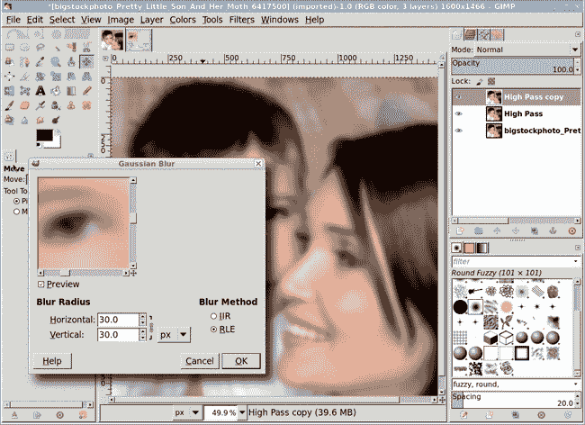

    *这个过程将软化高对比度区域，为与原始图像混合做准备。高斯模糊的模糊半径可以根据需要增加或减少。更高的模糊会增加最终图像的柔和度。但是，要注意，过多的模糊只会导致混乱。*

## 合并图层

模糊和透明度只是模拟高通过滤的第一部分。下一步是将模糊层反转并与第二层（原始图像的副本）混合。

1.  在图层对话框中，应仍然选择顶层。如果不是，请选择它。

1.  反转此图层的颜色（**颜色**▸**反转**）。

1.  将顶层与底层合并（**图层**▸**向下合并**）。

    

    *请注意，合并层保留了底层名称，在本例中为高通过滤器。当顶层颜色反转并向下合并时，结果是大部分为灰色且在感兴趣区域（例如眼睛和嘴巴）具有高细节的层。在下一步中，你会通过夸张高对比度区域来增强效果。*

## 调整高通过滤器层中的光和阴影

高通过滤器层现在可以用于颜色或亮度校正。为此，将使用曲线对话框，然后是亮度-对比度对话框。

1.  在图层对话框中，高通过滤器层应仍然处于活动状态。

1.  打开曲线对话框（**颜色**▸**曲线**）。

1.  调整对角线，使其形状类似于此处所示。

1.  点击**确定**以将更改应用到图层。

1.  打开亮度-对比度对话框（**颜色**▸**亮度-对比度**）。

    

    *S 曲线中间部分越陡，原始图像的亮度提升越少。*

1.  将亮度滑块设置为**-95**。将对比度滑块保持在**0**。

1.  点击**确定**以将更改应用到图层。

    

    *这一步的结果类似于对图像应用边缘检测过滤器。但 GIMP 中的任何边缘检测过滤器都无法提供这种细节。*

## 混合图层

现在可以将高通过滤器层与原始图像合并。

1.  反转高通过滤器层的颜色。

1.  将图层模式设置为**柔光**。

    

    *结果显示原始图像反射更多光线，就像电影工作室围绕衰老的电影明星添加的光晕效果。*

## 微调

但是，柔焦效果已经移除了一些肖像的重要特征，即眼睛和嘴巴。为了恢复这些特征，添加了一个图层蒙版，并在高反差层不应应用的位置填充了黑色。

1.  在图层对话框中，高反差层应该是激活的。如果不是，请选择它。

1.  在图像窗口中输入**D**以将前景色重置为黑色。

1.  为这个图层添加一个白色图层蒙版（**图层**▸**蒙版**▸**添加图层蒙版**）。

1.  从工具箱中选择喷枪工具。

1.  选择一个软边缘画笔，例如圆形模糊。

1.  在工具选项对话框中，调整画笔的大小以适应要遮罩的区域，例如眼睛或嘴唇。

1.  在图像窗口中，用画笔在男孩的眼睛和嘴唇上刷过。

使用喷枪在遮罩中不需要非常精确。在图像窗口中不会立即明显地发生很多事情。继续绘画，直到模糊消失，眼睛和嘴唇变得清晰。根据不同的眼睛和嘴唇调整画笔的大小，然后重复。

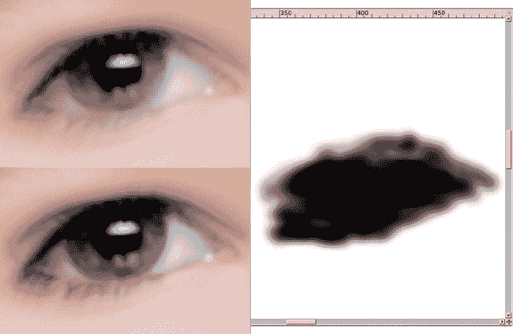

*遮罩高反差过滤器后，虹膜的颜色更加鲜艳，睫毛也更加明显。*

## 进一步探索

本教程中的高反差层（以及创建它的步骤）模糊了背景，这也模拟了景深减小。你将在 2.5 改变景深中了解更多如何模拟这种效果。这种边缘检测方法也用于选择性锐化。

# 2.2 照片到素描

接下来的技术是针对我们中间的所有有志艺术家。你用钢笔和铅笔做不到的事情，现在你可以用相机和 GIMP 做到了。虽然纹理纸上喷墨打印并不完全等同于精细的手绘素描，但对于数字爱好者来说已经足够接近了。

将照片转换为素描基本上意味着检测图像中的边缘并应用一条略微不规则的线条，看起来像是手工绘制的。这个过程并不精确——你可能需要替换不同的边缘检测过滤器或使用曲线或色阶工具调整去饱和层，然后再应用过滤器。但这些基本步骤将帮助你入门。

*是钢笔还是铅笔？实际上，这只是小小的 GIMP 魔法。*

## 入门

你为这种效果选择的原始图像不应该太复杂。柔和的线条很有用，但像藤蔓这样的复杂图案会有问题。尽管我选择了静物图像作为这个例子，但这种技巧也很好地适用于正式肖像和其他人物照片。

*这张图片的主题是一个有很多线条和形状但很少奇特的图案的房间。*

## 将图像转换为素描

1.  首先，对图像进行去饱和处理（**颜色**▸**去饱和**）。

1.  将图层复制两次（**图层**▸**复制图层**）。将第一个副本命名为*Burn*，第二个副本命名为*Hard Light*。

1.  通过在图层对话框中点击每个图层的眼睛图标来关闭两个副本图层的可见性。然后再次选择背景图层。

    ### 注意

    *背景图层在下一步之前也可以再复制一次。这将允许通过保留去饱和图层的副本进行进一步的实验。如果您这样做，请确保关闭背景图层的可见性，并将下一步应用到这个最后的副本图层。*

    

    *副本图层的名称暗示了稍后要使用的图层模式。在这里，背景图层已被重命名为 Original Image，以便在图层堆栈中易于识别。*

1.  打开 Sobel 滤波器（**滤镜**▸**边缘检测**▸**Sobel**）。Sobel 滤波器是一种边缘检测滤波器，它在图层中寻找几乎水平或垂直的线条，并在结果图像中保留这些线条。

1.  保持默认设置并点击**确定**将它们应用到原始图像图层。与 GIMP 中可用的其他边缘检测滤波器相比，此滤波器的默认设置将最适合此图像，因为它们会产生更坚固、更清晰的线条，看起来像是手绘的。然而，如果您在应用 Sobel 滤波器后图像看起来不合适，使用另一个边缘检测滤波器可能会得到更好的结果。

1.  白色线条可能需要增强。使用色阶对话框（**颜色**▸**色阶**）并将白色点滑块向左移动。

1.  将此图层的颜色反转（**颜色**▸**反转**），以在白色背景上产生黑色线条。

    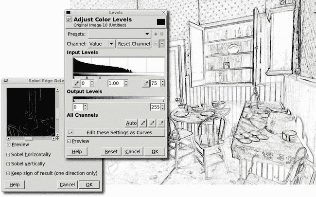

    *Sobel 滤波器为图像的重要形状创建了漂亮的轮廓。其他边缘检测滤波器可能更适合您的图像，因此您应该进行实验。*

## 为素描添加深度

1.  在图层对话框中点击**Burn**图层使其处于活动状态，并再次点击其眼睛图标使其可见。

1.  再次，打开高斯模糊滤镜（**滤镜**▸**模糊**▸**高斯模糊**）。

1.  将水平和垂直模糊半径设置为**10 像素**，并将此滤镜应用到图层。

1.  将图层模式设置为**Burn**。这会使背景中的暗区变得更暗，因此手绘的外观看起来就像是用深色铅笔完成的。

1.  在图层对话框中，点击**Hard Light**图层使其处于活动状态，然后点击其眼睛图标使其可见。

1.  再次，打开高斯模糊滤镜（**滤镜**▸**模糊**▸**高斯模糊**）。

1.  这次，将水平和垂直模糊半径设置为**15 像素**。点击**确定**将这组设置应用到图层。

1.  将图层模式设置为**Hard Light**。这将模拟在纸上摩擦铅笔标记时得到的模糊炭笔外观。

    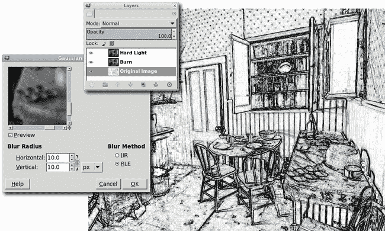

    *使用烧灼模式与模糊的原始图像混合可以使边缘检测滤镜创建的轮廓变暗。*

    

    *应用硬光模式会给图像带来模糊的炭笔外观，就像你用手指涂抹铅笔标记时一样。*

## 添加完成效果

1.  让我们进一步探讨这张特定的图像。首先，复制原始图像图层（**图层**▸**复制**）。

1.  将此副本图层的图层模式设置为**正片叠底**。

1.  将不透明度设置为**50%**。这可以使图像的线条更加突出，而不会使绘图看起来不自然。

    

    *添加这个最后的图层是可选的，但它有助于强调这张特定图像的线条。*

## 进一步探索

这种简单技术有许多变化，包括使用模糊工具手动涂抹炭笔图层，并使用着色工具手动着色笔触以模拟彩色铅笔绘图。你还可以使用油画滤镜（滤镜▸艺术效果▸油画滤镜）来制作印象派图像，或者你可以使用曲线、色阶或海报化工具来制作看起来更像线画的图像。在创建原始图像图层的副本时，为每种边缘检测滤镜创建多个副本，并尝试不同的滤镜设置。较大的模糊可以使铅笔笔触变得柔和。

# 2.3 使用棕褐色调进行复古处理

古董照片有两种风味：黑白或着色。使用 GIMP 着色黑白照片很容易：你只需选择一种颜色，选择一个图层模式，然后应用桶填充。这很简单。棘手的部分是让它看起来正确——适当地调整灰度图像的对比度，然后选择正确的图层模式。

大多数人将着色图片而不是黑白图片与古董照片联系在一起。这可能是因为更多的棕褐色调老照片幸存下来。棕褐色调印刷的加工化学过程将黑白印刷中形成图像的银金属转化为硫化银。硫化银比银金属更稳定。因此，将银转化为硫化银使照片的保质期大大延长。

棕褐色调印刷的名字来源于开发过程中产生的棕色色调范围，这与乌贼墨水（拉丁语中的**sepia**）相似。因此，在数字上重现真正的棕褐色调限制了我们只能使用一小套深棕色颜色，其中一些带有轻微的红色调。可以使用其他颜色（而不是棕色色调）应用类似的过程，尽管产生的图像不会模仿真正的棕褐色调印刷。

在这个教程中，你将尝试使用不同颜色、对比度和图层模式的组合来制作棕褐色调的图像时的一些可能变化。

## 入门

本教程的原始图片来自在线图片档案（可在 BigStockPhoto.com 获取）并已使用通道混合器（**颜色**▸**组件**▸**通道混合器**）去饱和。使用通道混合器对话框的替代方法包括使用去饱和对话框或将图片转换为灰度（**图像**▸**模式**▸**灰度**）然后再转换回 RGB（**图像**▸**模式**▸**RGB**）。这两种后者的主要区别在于去饱和对话框仅适用于当前图层。如果你的图片有多个图层，去饱和对话框不会一次性转换所有这些图层。对于多个图层，将图片转换为灰度然后再转换回 RGB 可能更合适。

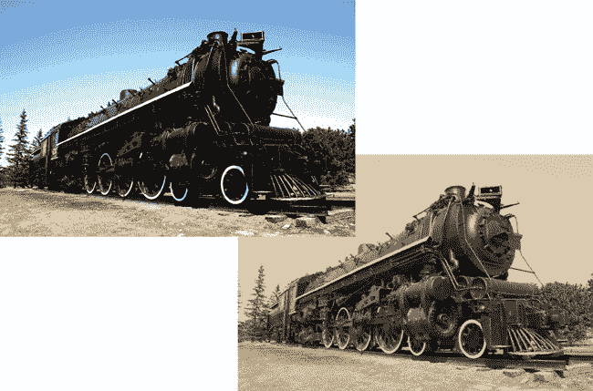

*将图片从全彩转换为棕褐色是一个相对简单的过程。*

但对于本教程来说，通道混合器是最佳选择。旧照片的外观往往归因于使用了*正色*胶片。正色乳剂会使蓝色调看起来更亮，红色调更暗。通道混合器在从彩色转换为单色图像时提供了更高的控制度来设置这些通道。

1.  打开原始图片。

1.  打开通道混合器对话框（**颜色**▸**组件**▸**通道混合器**）。对于这张图片，将红色通道设置为**47**，绿色设置为**0**，蓝色设置为**73**，并点击**单色**选项将图片转换为黑白。

    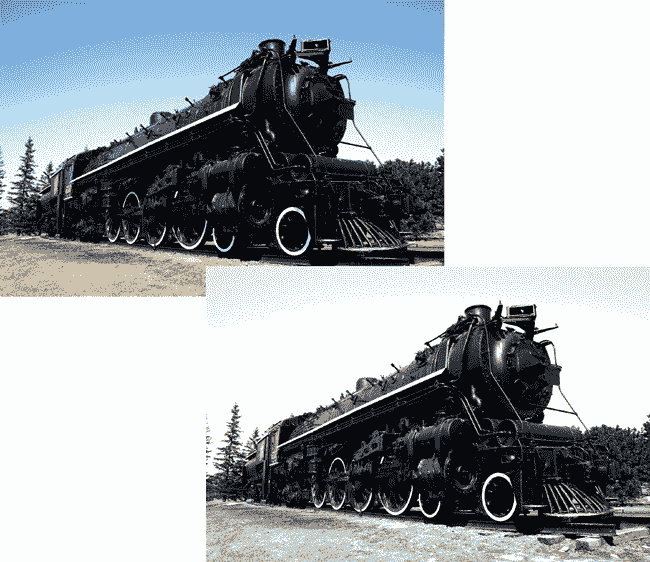

    *使用颜色混合器对原始图片进行去饱和。*

由于原始图片非常清晰，而大多数旧照片则不是，接下来将应用轻微的模糊。

1.  打开高斯模糊滤镜（**滤镜**▸**模糊**▸**高斯模糊**）。

1.  将水平和垂直模糊半径设置为**2.0 像素**。只需要少量的模糊，足以去除机车外壳上的明亮反光。

1.  将此设置应用于去饱和的图片。

    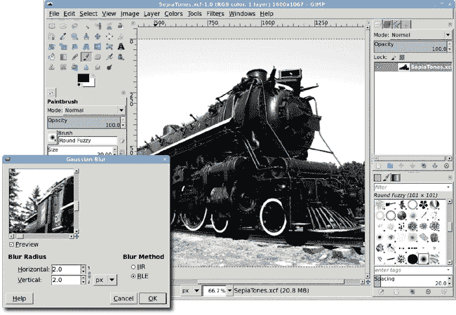

    *轻微的模糊有助于去除现代照片上的清晰反光。*

## 增加中间灰度

棕褐色调主要通过着色去饱和图片的灰色区域来实现。较暗的像素相对不受影响，较亮的像素只会稍微变亮。图片中的机车非常暗，因此我们将使用亮度工具将其变亮，以最大化棕褐色调的效果。

1.  将更多灰色引入图片的第一步是调整亮度直方图（**颜色**▸**亮度**）。有线性和对数两种类型的直方图可用（见重置通道按钮右侧的小图标）。对数直方图显示更多暗（左侧）和亮（右侧）像素，以及相对较少的灰色（中间）像素。

1.  要增加图片中的灰色量，我们将中间（灰色）滑块在直方图下向左滑动，以使较暗的像素变亮。

1.  通过在级别对话框中单击**确定**按钮应用此更改到图像。

1.  再次查看级别直方图时，可以看到在暗侧的图表上有间隙，在亮侧有峰值。中心区域也有小峰值。这从视觉上显示了较暗的像素如何被改变为较亮的像素。

    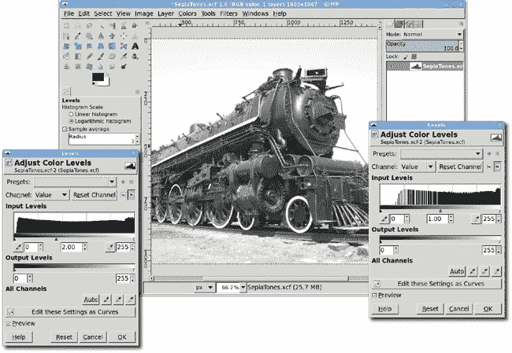

    *此图像具有广泛的色调范围。轻微的级别调整（左）使其成为应用棕褐色色调的绝佳候选者。应用此更改的结果在再次检查级别直方图时明显可见。*

1.  作为额外的措施，您还可以通过调整图像的对比度（**颜色**▸**亮度-对比度**）来降低对比度。降低对比度可以模拟岁月给旧照片带来的褪色效果。

    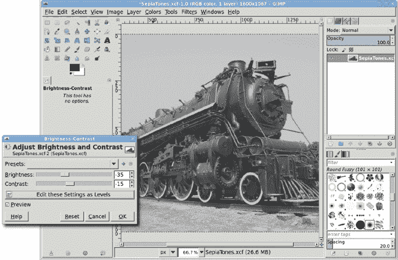

    *降低对比度和亮度将在应用棕褐色色调时使图像看起来更老。*

## 添加棕褐色色调

图像现在已准备好添加棕褐色色调。棕褐色是一种带有轻微红色调的棕色，从浅到深色调不等。您可以使用多个 RGB 值集来达到棕褐色色调，网络搜索将帮助您找到它们。对于这张图像，您将在两个单独的图层上应用 135/96/40。每个着色图层将使用不同的图层模式进行混合。

1.  复制原始图层（**图层**▸**复制图层**）并将复制的图层命名为*Sepia Screen*。

1.  用适当的棕褐色填充新图层。为此，首先单击前景色框以打开更改前景色对话框。在适当的字段中输入您的 RGB 值，然后单击**确定**。（在这个例子中，我使用了 RGB 值为 135/96/40 的棕褐色。）

1.  选择**桶填充**工具，并在工具选项对话框中设置模式为**乘法**和受影响区域为**填充整个选择**。在复制的图层上单击，用棕褐色色调着色图层。

1.  要将此新图层与原始图层结合，将此彩色图层的模式设置为**屏幕**。

1.  复制 Sepia Screen 图层。将复制的图层命名为*Sepia Overlay*。将图层模式更改为**Overlay**。

    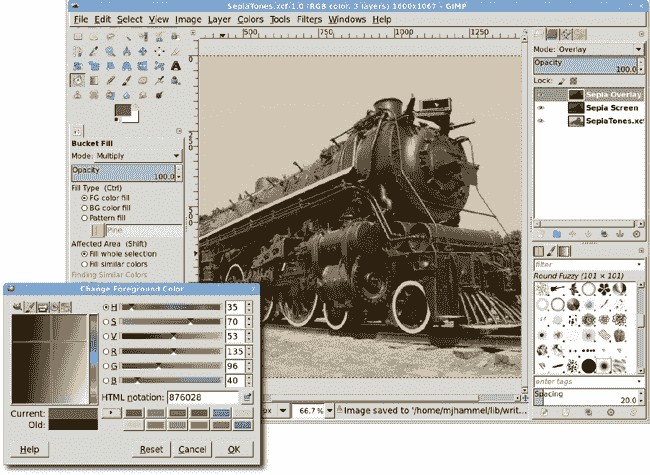

    *屏幕图层通过添加颜色使图像变亮，而叠加图层则通过添加颜色仅使暗部变暗。*

## 进一步探索

通过在机车远端添加选择性模糊，可以进一步老化图像，添加老照片中常见的景深。整个图像的进一步模糊也可以帮助模仿褪色、老化的照片。

棕褐色调色过程非常适合实验。使用具有不同色调和图层模式的多个图层，然后使用图层对话框中的眼睛图标在它们之间快速切换，以比较结果。

记住，图层模式和工具选项混合模式可以产生不同的结果。使用图层对话框中的图层模式将单色图层与下面的图层混合。然后关闭单色图层的可见性，并使用桶填充工具将下层的颜色着色，其工具选项对话框中的混合模式设置为相同的模式。比较两种技术的结果，并注意差异。使用图层模式可以更容易地更改棕褐色调，而不会改变原始图像，结果可能更接近旧照片中褪色的颜色。

# 2.4 颜色交换

照片摄影师经常被要求更改图像中一个或多个元素的颜色。这个过程有多容易完全取决于隔离需要更新的对象有多容易。

本教程探讨了两种颜色交换的示例。第一个示例是一个不需要困难选择的图像。第二个图像需要更精细的手法。

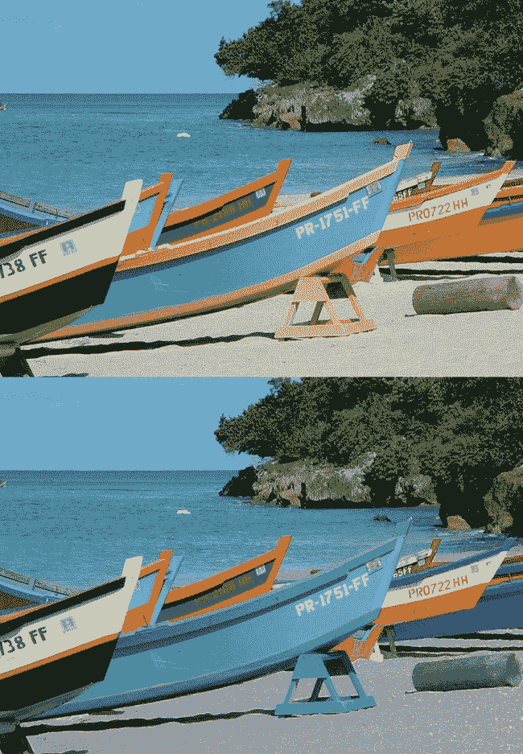

*成功的颜色交换全在于良好的选择。这张图片相对容易处理，因为我们想要更改的物品很容易隔离。*

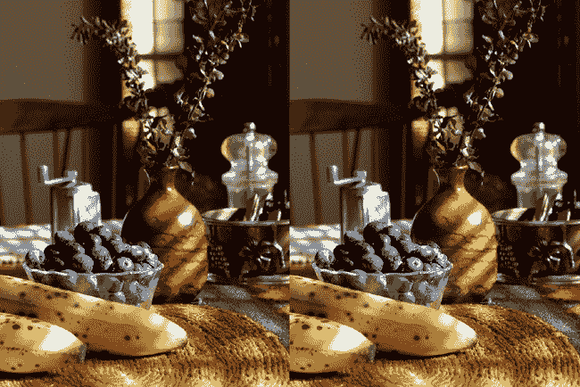

*当您想要更改的对象难以选择时，颜色交换会更复杂。本项目使用快速蒙版来更改花瓶的颜色。*

## 简单的颜色交换

第一个示例是一组海滩上的船只。这里有很多颜色。让我们将这些船只的黄色装饰条改为浅蓝色。

### 隔离对象

要更改图像中仅某些对象的颜色，您需要将这些对象从图像中其他类似颜色的对象中隔离出来。显然，一些船只的颜色是黄色。黄色在背景中的岩石和树木中并不明显，但那里也有很多。

1.  要隔离船只，使用**矩形选择**工具创建一个简单的选择，包括大多数船只。

1.  添加较小的矩形选择，以在不选择周围岩石的情况下挤进最高的船头。在这里，未选择区域被调暗，以便您更容易看到所选内容。

    

    *您不需要从其直接环境中隔离黄色元素；您只需要隔离图像的下半部分（在此处使用快速蒙版启用）。如果您包括图像的上半部分，当您交换颜色时，树木和岩石中的黄色也会变成蓝色。*

### 选择目标颜色

1.  打开色调-饱和度对话框（**颜色**▸**色调-饱和度**）。您可以使用此对话框编辑多个通道，包括熟悉的红、绿、蓝通道以及数字印刷世界中的对应色：青色、品红色和黄色。

1.  选择黄色通道，并调整**色调**、**亮度**和**饱和度**滑块，直到柔和的蓝色取代了黄色。

这个过程之所以有效，是因为要替换的颜色——黄色——不是包含在选择中的其他颜色的主要部分。不需要精确的选择来交换黄色和蓝色。可能有问题的地方是海滩上的木材和沙子。棕色包含一些黄色，所以当应用色调-饱和度更改后，木材和沙子会呈现蓝色色调。这可以通过使用任何选择工具（包括快速蒙版）从选择中移除木材来轻松解决。图片中间附近海滩上的马凳也含有大量黄色内容，需要以类似的方式处理（除非你想要将其也涂成蓝色）。将沙子排除在选择之外需要一个更复杂的过程，如以下教程中所示。

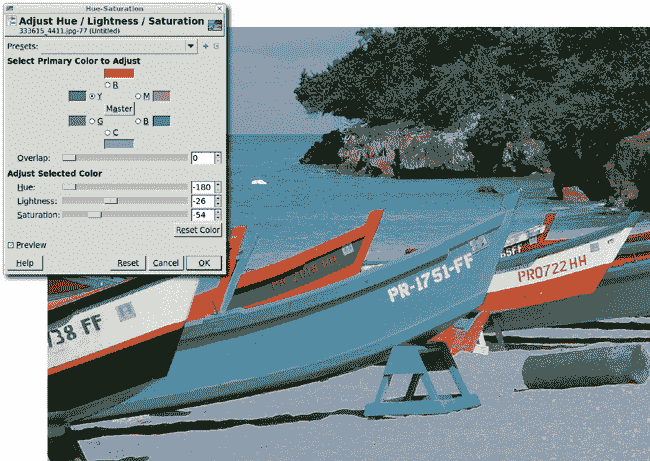

*使用色调-饱和度工具将黄色与蓝色交换。*

## 更复杂的颜色交换

在下一张图片上，同样的技巧不起作用。假设你想要将花瓶的颜色改为一种黄色。问题是，尽管花瓶的赭色包含很多红色，红色也出现在图像的其余部分。事实上，如果你像对船图像的黄色通道所做的改变一样，对这张图像的红色通道进行相同的改变，你会改变背景椅子的颜色、浆果和桌子的颜色。

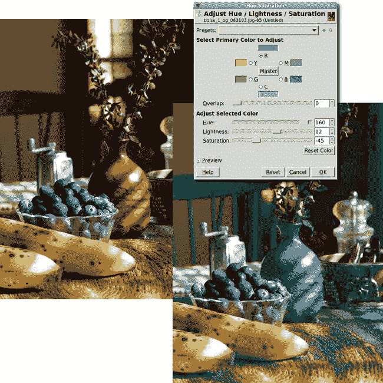

*之前的技巧在这里不起作用，因为你想改变的颜色出现在整个图像中。*

### 创建复杂选择

1.  这张图片需要一个复杂的选择。首先，使用**模糊选择**工具，将阈值设置为**40**。点击花瓶中间右边的部分创建一个初始选择。

1.  要完成选择，使用**快速蒙版**和一些软边刷。在这种情况下使用默认快速蒙版的问题在于它使用红色色调来突出显示未选择的部分，但我们正在尝试选择包含大量红色的对象。这使得使用模糊选择工具创建的选择在转换为快速蒙版时难以看到。

    

    *默认的快速蒙版是红色，这使得红色选择难以看到。*

### 更改快速蒙版颜色

1.  这个问题很容易解决。在画布窗口左下角右键单击**快速蒙版**按钮。一个菜单打开。

1.  按住鼠标右键，将光标拖到菜单底部以选择**配置颜色和透明度**。

1.  在快速蒙版属性对话框中，单击预览窗口（它显示蒙版的颜色和透明度）以打开编辑快速蒙版颜色对话框。

1.  在这里，你可以更改用于快速遮罩的 RGB 值以及遮罩的透明度（通过调整 B 滑块下方的 A 滑块）。为快速遮罩选择一种与要选择的对象中的颜色形成对比的颜色。较高的透明度值使得查看已选择的部分更容易，但也使得查看需要选择的部分更困难。在这里，我选择了一个 70%透明度的青色遮罩，而不是默认的 50%。结果是，花瓶中被选择的部分更容易看到，而需要选择的花瓶部分仍然可见。

    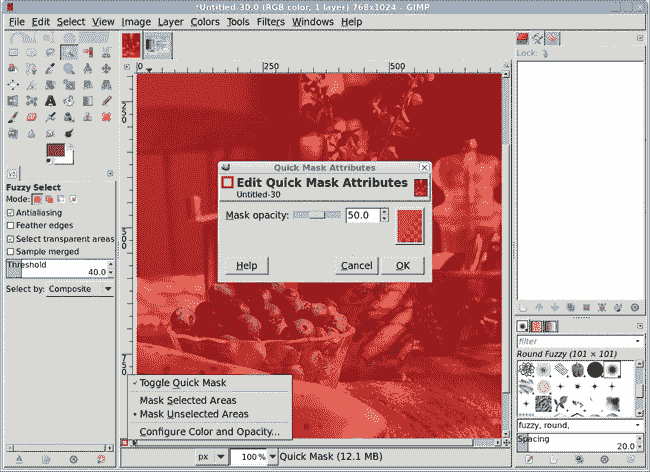

    *在快速遮罩属性窗口中更改快速遮罩颜色。*

1.  当你对遮罩颜色满意时，在对话框中点击**OK**来关闭它们。

    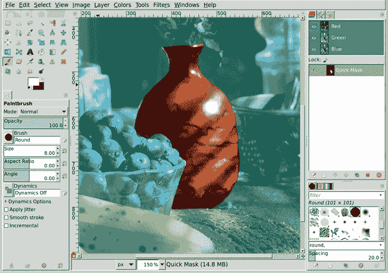

    *青色是这张图片的高对比度颜色，这使得使用快速遮罩变得容易得多。*

### 绘制选择

你在 1.4 选择中学习了使用快速遮罩是选择形状不规则对象最有效的方法。现在有机会尝试一下。

1.  通过按**+**键来放大花瓶。

1.  使用**画笔**工具的小型、硬边画笔在快速遮罩中绘制直线，方法是点击线的起点，按住 SHIFT 键，然后点击线的终点。在用快速遮罩绘画（或绘制）时，你必须用黑色或白色绘画。将前景色设置为白色来覆盖应包含在选择中的内容，将前景色设置为黑色来覆盖不应包含在选择中的内容。完成绘画后，再次点击**快速遮罩**按钮将遮罩转换为选择。

    

    *通过在快速遮罩中仔细绘制来选择花瓶。记住，你在遮罩中用白色绘制的内容将在将快速遮罩转换为选择时被包含在内。*

1.  通过**1 像素**（**选择**▸**扩大**）扩大选择，然后通过**2 像素**（**选择**▸**羽化**）进行羽化。将选择保存到一个通道（**选择**▸**保存到通道**）中，以防你以后决定撤销颜色更改并再次编辑选择。

### 在副本图层上工作

在副本图层上工作可以避免在原始图层上犯错误带来的烦恼。如果你不喜欢副本图层上的更改，只需再次尝试即可。

1.  保存你的选择后，在图层对话框中点击原始图层使其再次变为活动状态。

1.  复制选择并将其粘贴为新的图层（**图层**▸**转到新图层**）。将此图层命名为*花瓶*并确保它是活动的。

1.  在这个阶段，你可以使用着色工具（**颜色**▸**着色**）来改变花瓶的颜色，但花瓶中红色和黄色的色调各不相同，着色工具会完全消除这些变化。相反，再次使用色调-饱和度工具。打开色调-饱和度对话框（**颜色**▸**色调-饱和度**）。

1.  选择红色通道，并将色调滑块向右移动以将花瓶的红色内容改变为更黄色的颜色。然后点击黄色通道并做同样的事情。在点击**确定**之前，确保做出这两个更改。如果你首先调整红色通道，然后点击**确定**，重新打开对话框，然后调整黄色通道，结果将绿色得多。

1.  当所有颜色变化完成后，取消全部选择（**选择**▸**无**）。

    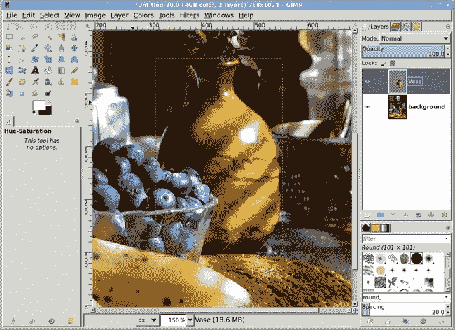

    *一旦使用快速蒙版选择将颜色隔离出来，就可以使用色调-饱和度工具改变花瓶的颜色。*

## 进一步探索

在库存照片中交换物体的颜色是一种非常常见的做法。颜色与图像其余部分不匹配的物体最容易改变，就像我们在海滩上的船只图片中看到的那样。改变花瓶、衬衫或其他形状奇特的物体的颜色需要使用模糊选择工具、快速蒙版和其他 GIMP 选择工具创建的复杂选择。这些选择更困难，但并非不可能。

快速蒙版工具的熟练掌握将在下一个教程中有所帮助，在那个教程中，你将使用一系列复杂的选择来为照片添加深度。

# 2.5 改变景深

查看任何你的个人照片。如果你使用的是消费级相机，你会注意到照片有一个深的景深。也就是说，如果你的主题距离超过几码，照片的大部分都是清晰的。改变景深可以改变图像传达的感觉。如果你的主题不在画框中心或不是完全明显，改变景深可以吸引对主题的注意并揭示照片的真实含义。

使景深变浅也可以使正常场景看起来像是一个微型场景，正如你将在 2.11 缩小场景中看到的那样。

实际上，计算机辅助的景深技巧不过是选择性的模糊。你可能见过这种技巧在汽车广告中使用，汽车是清晰的，但背景模糊到无法辨认。在这个教程中，你将使用适度的景深变化将建筑物拉到照片的前景。

*改变照片的景深是一个简单的选择和模糊的过程。在摄影中，通常的技巧是做出一个好的选择。*

## 入门

本教程从一个具有相对平坦景深且完全清晰的图像开始。固蓝色的天空将允许你轻松地创建建筑物的选区。你仍然需要做一些手动选择，但固蓝色的天空将节省一些时间。

### 注意

*本教程中使用的图像属于公共领域，并可从 PDPhoto.org 获取。*

*一片固蓝色的天空使得初始选择变得容易。*

## 分离前景

原始图像是清晰的，并且有一个明显的背景物体——厕所。首先创建一个包括厕所和其前方一些草地的选区。在这里，未选中的区域被着色为红色，以更好地显示选区。

1.  从工具箱中选择**模糊选择工具**。点击蓝色天空以创建初始选区。如果一次点击不能选择整个天空，则在未选中的区域中按住 SHIFT 键的同时点击。

    ### 注意

    *在按住左鼠标按钮的同时将鼠标向右移动也会扩大选区，尽管这种方法有时可能有点难以使用。*

    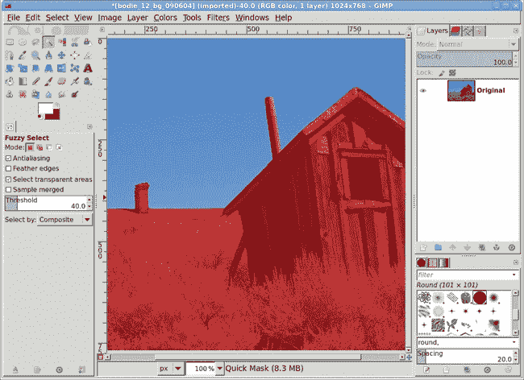

    *因为天空是单一颜色，并且与地面形成如此鲜明的对比，你应该能够最多点击三次就使用模糊选择工具选择天空。在这里，使用快速蒙版显示了天空选择。*

1.  反转选区（**选择**▸**反转**），然后点击**快速蒙版**按钮。正如你所见，当使用默认的快速蒙版属性时，未选中的区域会被着色为红色（2.4 颜色交换展示了如何更改默认颜色）。

1.  选择**画笔工具**，在图像窗口中按**D**键重置默认的前景色和背景色，使前景为黑色。

1.  在左侧的房子、一些背景草地以及右侧的岩石山丘上涂色。使用较小的画笔，直到快速蒙版看起来与所示相似。你涂过的所有内容都将被排除在选区之外。

1.  再次点击**快速蒙版**按钮将蒙版转换回选区。

1.  将选区保存到通道中（**选择**▸**保存到通道**）。然后点击**通道**对话框中的通道名称，将其更改为*厕所选区*。将选区保存到通道中允许你在决定原始选区不足以满足项目需求时轻松地回忆并进一步编辑它们。在本教程的后面部分，你将检索保存的选区并将它们反转，以用于原始选区之外的区域。

1.  在图层对话框中选择原始图层（**窗口**▸**可停靠对话框**▸**图层**）。通过**10 像素**（**选择**▸**羽化**）羽化选区，然后复制（**编辑**▸**复制**）选区并将其粘贴（**编辑**▸**粘贴**）为一个新的图层（**图层**▸**转到新图层**）。

    ### 注意

    *或者，使用**编辑**▸**粘贴为**▸**新图层**将粘贴与新的图层创建结合起来。*

1.  点击新的图层名称，将其更改为*Outhouse*。

1.  在通道对话框（**窗口**▸**可停靠对话框**▸**通道**）中，点击**Outhouse Selection**通道，然后点击**通道到选择**按钮。

    

    *使用快速蒙版将茅房和前景草地隔离出来。*

    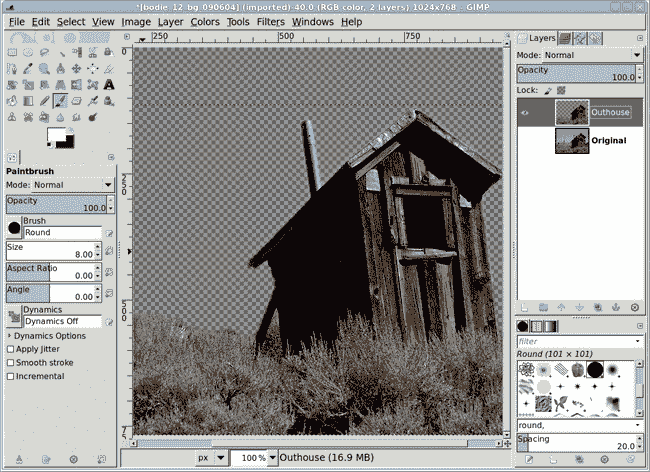

    *将茅房和前景草地复制到它们自己的图层中，这样你稍后执行的模糊操作就不会影响它们。*

1.  在图层对话框中选择**背景**图层以使其成为活动图层。反转选择以选择除原始茅房和前景景观之外的所有内容。

1.  在工具箱中点击**按颜色选择**。根据需要调整工具选项对话框中的**阈值**级别（我为此图像设置为 50）。

1.  按住 CTRL 键并在蓝色天空中点击，以从选择中移除天空，只留下背景草地、房屋和山丘。使用**快速蒙版**从选择中移除房屋和山丘，留下部分草地。再次点击**快速蒙版**按钮，将蒙版转换为选择。将选择保存到名为*Grasses Selection*（**选择**▸**保存到通道**）的通道中。

    

    *在此步骤中，选择前景茅房和背景屋顶之间的草地。这允许你以不同程度模糊中间（草地）和背景（屋顶）主题，夸张景深。*

1.  再次选择**背景**图层以使其重新成为活动图层。通过**10 像素**（**选择**▸**羽化**）羽化选择，然后复制并粘贴选择作为新图层。将此图层命名为*Grasses*并将其移动到图层对话框中的茅房图层下方。图层顺序应为，从上到下：Outhouse, Grasses, Background。

1.  此过程创建了一个次要的焦点，它不在前景，但也不完全在背景中。

## 添加景深

1.  现在让我们增加景深。选择**背景**图层。

1.  打开高斯模糊滤镜（**滤镜**▸**模糊**▸**高斯模糊**）。将**背景**图层应用**20 像素**的模糊。然后选择**草地**图层并应用**5 到 10 像素**的模糊。

1.  调整**Grasses**和**Background**图层的级别（**颜色**▸**级别**）以略微加深它们并增加照片的深度感。

    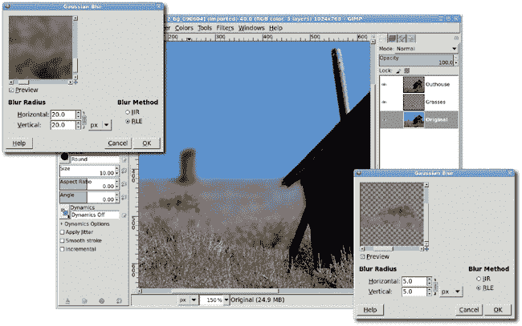

    *茅房后面的草地略微模糊，而那些草地后面的屋顶则更加模糊。*

## 进一步探索

这个过程在这张图片上效果很好，因为初始选择很容易：天空与厕所和草地的对比非常强烈。这个过程通常应用于户外肖像，这些项目的工作方式就像这样，尽管选择前景物体（例如婚礼照片中的新娘）会更困难。再次强调，快速蒙版将非常有帮助。您还可以尝试前景选择工具，该工具旨在使选择不规则形状的物体更加容易。

# 2.6 玻璃上的反射

在玻璃表面上模拟物体的反射实际上相当简单。在这个例子中，我将使用一朵黄色玫瑰。玫瑰的垂直方向——从茎到花——会使反射更容易看到。

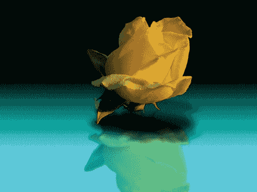

*GIMP 使这种玫瑰色的反射变得简单。*

## 开始

在原始图像中，一朵黄色玫瑰被设置在花园背景上。这张图像在边缘处提供了高对比度。当使用此类图像创建反射时，最好移除较暗的边缘，并保留物体的较亮颜色。这允许您将选择放置在几乎任何背景上。

### 注意

*本教程中使用的图像可在 PDPhoto.org 找到。*

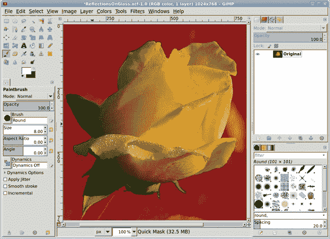

*使用模糊选择工具和快速蒙版是准确选择玫瑰的最快方式。*

## 准备图像

1.  结合使用**模糊选择**工具和**快速蒙版**，在玫瑰周围进行选择。

1.  通过**3 像素**对选择进行羽化（**选择**▸**羽化**）。复制选择，将其粘贴到自己的图层，并命名为*玫瑰*。删除原始图层（**图层**▸**删除图层**）。

1.  添加一个黑色背景的新图层（**图层**▸**新建图层**），并将其命名为*黑色背景*。将其移动到玫瑰图层下方。

1.  玫瑰在画布上没有留下足够的空间来创建完整的反射，因此需要缩小。选择**玫瑰**图层使其变为活动状态。从工具箱中选择**缩放**工具，在工具选项对话框中选择**保持纵横比**选项，然后点击画布。在画布上拖动以将玫瑰缩放到大约原始大小的一半。

1.  使用**移动**工具，将玫瑰图层放置在窗口的上半部分。

    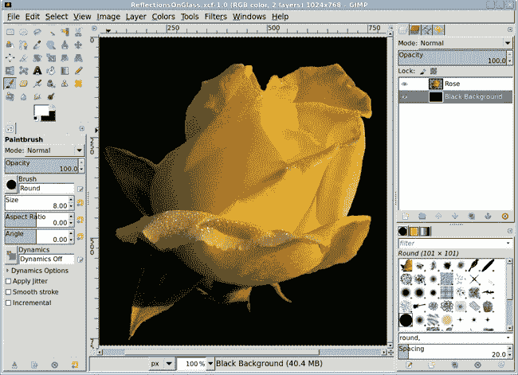

    *玫瑰被选中并复制到自己的图层。黑色背景图层替换了原始图像图层。*

    

    *将玫瑰缩小到画布大小的一半左右，为它的反射腾出空间。*

## 创建反射

1.  复制玫瑰图层（**图层**▸**复制图层**），并将复制的图层命名为*玫瑰反射*。

1.  通过**图层**▸**图层边界大小**将图层边界扩大**20%**——从当前高度字段旁边的下拉菜单中选择**百分比**——并在图层边界大小对话框中点击**中心**按钮。

1.  确保玫瑰反射层的**锁定透明通道**框未勾选（锁定透明通道框位于图层对话框中的透明度滑块下方）。

1.  打开高斯模糊滤镜（**滤镜**▸**模糊**▸**高斯模糊**），并将玫瑰反射层模糊**8 到 10 像素**。

    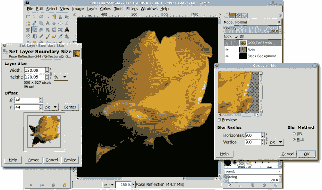

    *增加玫瑰反射层的图层边界大小给我们提供了额外的模糊空间。如果我们不调整大小，模糊可能会触及原始玫瑰的边缘。*

## 为反射添加表面

1.  接下来，让我们添加一个可见的表面。添加一个新的透明层（**图层**▸**新建图层**），并将其命名为*Surface Gradient*。

1.  在工具箱中按**D**键然后按**X**键以将背景设置为黑色。

1.  双击前景色框以打开更改前景色对话框。对于这里显示的青色，在 HTML 表示字段中输入*cyan*，然后点击**确定**。这种颜色具有美学价值，并且与玫瑰的颜色形成对比。使用高对比度的颜色来强调表面反射效果。

1.  要创建显示的渐变效果，从工具箱中选择**混合**工具。在工具选项对话框中，将渐变设置为**前景到透明**，并选择**反转**选项。然后在图像窗口中从花的中部拖动到三分之四的位置以将青色渐变应用到表面渐变层。将表面渐变层移动到玫瑰层下方，正好在黑色背景层上方。

    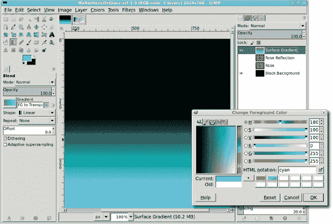

    *玫瑰将在由青色渐变创建的表面上反射。*

## 将反射放置在表面上

1.  在图层对话框中点击**玫瑰反射**层以使其处于活动状态。

1.  从工具箱中选择**翻转**工具。在工具选项对话框中，选择**垂直**作为翻转类型，然后点击画布以翻转此层。

1.  使用**移动**工具将反射定位在画布上玫瑰下方。在移动过程中按住 CTRL 键以垂直移动（或任何 45 度角）。

1.  将玫瑰反射层的透明度降低到**50%**，并将此层放在玫瑰层和表面渐变层之间。

    

    *反射效果几乎完成，但真实的反射会包括反射物体投射的阴影。*

## 添加阴影

因为玫瑰会阻挡任何直接从上方照射的光线，所以必须在表面上添加阴影。并且因为光线会在玫瑰上方多个方向上照射，所以会投射出多个阴影。接下来，你将创建这些阴影。

1.  添加一个名为*阴影 1*的透明图层。

1.  从工具箱中选择**椭圆选择**工具，并在玫瑰下方创建一个椭圆选择区域。

    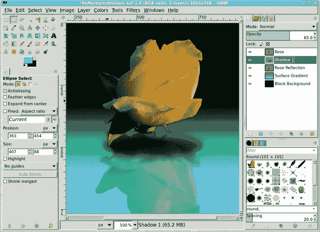

    *模糊并降低简单黑色椭圆的不透明度，可以创建初始阴影。*

1.  通过**10 像素**（**选择**▸**羽化**）羽化选择区域，并用黑色填充。取消椭圆的选择（**选择**▸**无**）。

1.  打开高斯模糊滤镜（**滤镜**▸**模糊**▸**高斯模糊**），并将**45 像素**的模糊效果应用于阴影 1 图层，然后将图层的透明度设置为**65%**。将此图层移至玫瑰反射图层上方。

1.  复制玫瑰图层，将副本图层命名为*阴影 2*，并将图层边界大小增加**10%**（**图层**▸**图层边界大小**）。

1.  创建玫瑰的选择（**图层**▸**透明度**▸**alpha 到选择**），然后通过**选择**▸**增长**将选择区域扩大**2 像素**。

1.  在画布中按**D**键将前景色重置为黑色。然后通过将前景色框从工具箱拖动到选择区域来填充选择区域。取消所有选择（CTRL-SHIFT-A）。

1.  打开**高斯模糊**滤镜，并将**45 像素**的模糊效果应用于阴影 2 图层。

1.  使用**翻转**工具垂直翻转图层，然后使用**缩放**工具将图层高度减半。

1.  将阴影 2 图层移至玫瑰图层下方（**图层**▸**堆栈**▸**降低图层**），然后使用**移动**工具定位，使阴影出现在黄色玫瑰下方。

1.  将阴影 2 图层的透明度降低到**35%**。

    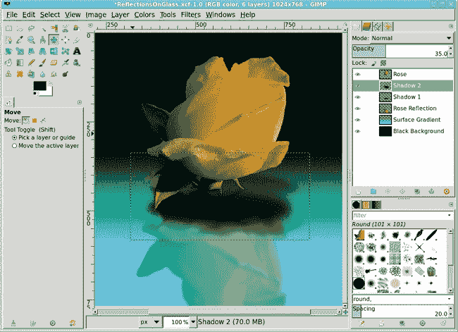

    *形状阴影与椭圆阴影融合，使得玫瑰正下方的区域最暗，同时也允许阴影模仿玫瑰的形状。*

## 进一步探索

这种在光滑表面上创建反射的技术可以扩展到不太平坦或反光的表面。您还可以向表面添加纹理，以扭曲反射形状或改变方向、颜色和光照，使反射不那么明显。在下一教程中，我将向您展示如何向反射的表面添加波浪，以创建湖面效果。

# 2.7 湖面反射

之前的教程向您展示了如何在玻璃上创建反射，但通过扩展该技术可以做得更多。那个部分的教程只对反射的对象（一朵玫瑰）进行了轻微的修改。但关于在反射表面添加纹理怎么办？我们如何在一个表面——比如水面——上创建一个不完美的平面反射？

添加表面纹理的一个简单方法是从另一张图片中获取。展示湖面或海洋表面的照片对于本教程来说效果很好。一旦采样图像被去饱和并与反射混合，它就能将光滑的表面变成逼真的反射。

*湖泊看起来很真实，但它已经使用 GIMP 数字添加。*

本教程将草坪变成起伏的湖泊。在现实世界中，创建你想要的精确图像通常需要应用多个效果，所以让我们先增强原始照片中的颜色。

## 开始

本教程中使用的图像非常适合这类项目。建筑物是一个戏剧性的焦点，前面的草地区域足够大，可以为湖泊提供空间。然而，砖块的色彩可以更加鲜艳，所以在反射建筑物的图像之前，你将增加色彩饱和度。如果你选择的图像需要类似的调整，最好现在就处理它们。

1.  首先，自动调整色阶直方图。打开色阶对话框（**颜色**▸**色阶**），然后点击**自动**按钮，接着点击**确定**关闭对话框。

1.  接下来，打开色调-饱和度对话框（**颜色**▸**色调-饱和度**）。点击对话框顶部红色框下方的**R**按钮，这样我们只调整图像中的红色。然后将饱和度增加到**75**，以突出建筑物的细节。

1.  最后，打开亮度-对比度对话框（**颜色**▸**亮度-对比度**），将亮度设置为**30**，对比度设置为**25**。

    

    *调整图像的饱和度和亮度，使建筑物的颜色更加鲜艳。*

## 创建初始反射

1.  在主题周围制作一个方形选择——在本例中是建筑物。同时，包括建筑物前面的部分草地区域。选择从图像顶部延伸到草地与建筑物相交位置下方。复制选择并将其粘贴到新图层中。点击图层名称并将其更改为*反射*。

1.  从工具箱中选择**翻转**工具。在工具选项对话框中设置翻转类型为**垂直**，然后点击画布以翻转图层。

1.  使用**移动**工具将反射图层拖动到画布上。如果反射图层没有覆盖画布的宽度，选择**缩放**工具，然后点击画布以手动缩放图层。

    

    *一个简单的矩形选择包括建筑物和部分草地区域。这个选择被复制并粘贴到一个新图层中，然后该图层被垂直翻转。最后，将新图层拖动到画布上，直到定位如所示的位置。*

## 添加波纹

1.  为了看起来更真实，反射的图像应该比原始图像更模糊、饱和度更低。打开色调-饱和度对话框（**颜色**▸**色调-饱和度**），然后点击**主**按钮。将此图像的饱和度级别降低到**-45**（你的项目可能需要不同的设置）。

1.  打开涟漪滤镜（**滤镜**▸**扭曲**▸**涟漪**）。将方向设置为**垂直**，边缘设置为**涂抹**，周期设置为**60**，振幅设置为**2**，然后将此滤镜应用到反射层。再次使用涟漪滤镜，这次将方向设置为**水平**，周期设置为**7**，振幅设置为**5**。使用涟漪滤镜两次应用涟漪，就像水中的波纹会产生干涉图案一样。

    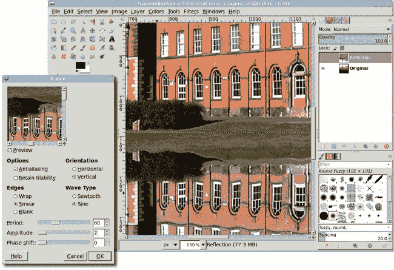

    *涟漪滤镜给反射添加了起伏的效果，尽管我们很快就会改进这一点。*

1.  打开高斯模糊滤镜（**滤镜**▸**模糊**▸**高斯模糊**）。将水平和垂直模糊半径都设置为**10 像素**，并将模糊应用到反射层。

1.  复制图层（**图层**▸**复制图层**）。将图层命名为*Color*。

1.  点击前景色框打开更改前景色对话框。对于这里显示的深蓝色，将 RGB 值设置为**5/24/83**，然后点击**确定**。然后将前景色拖动到图层中。最后，将图层移到原始反射层下方，并将反射层的透明度降低到**80%**。

    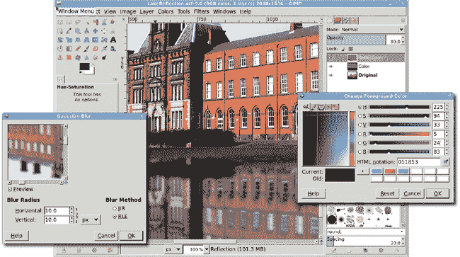

    *在反射层下方添加一个蓝色图层可以使反射看起来更像湖泊。*

## 添加波浪

涟漪滤镜使湖泊表面看起来更加逼真，但添加波浪会使纹理更加完美。要添加波浪，可以从另一张照片中抓取选择区域。

1.  在真实水波的图片中选择一个区域，然后将其复制并粘贴到原始项目图像中名为*Water*的新图层中。使用**缩放**工具根据需要缩放图层。

1.  对水层进行去饱和（**颜色**▸**去饱和**）。

1.  打开亮度-对比度对话框（**颜色**▸**亮度-对比度**）并将两个滑块都设置为**70**。这将增强波浪，用作凹凸贴图。在图层对话框中关闭水层的可见性。

1.  在图层对话框中点击反射层以使其处于活动状态。

1.  打开凹凸贴图滤镜（**滤镜**▸**贴图**▸**凹凸贴图**）。将**凹凸贴图**设置为水层，方位角设置为**145**，高度设置为**20**，深度设置为**3**。点击**确定**将此应用到反射层。

    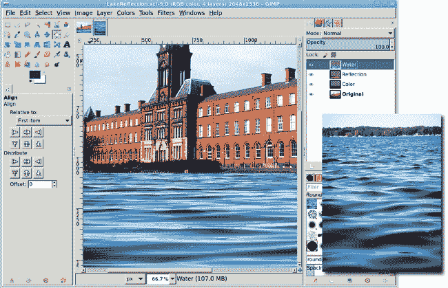

    *将波浪复制并粘贴到项目图像中，使湖泊看起来更加逼真。*

    

    *凹凸贴图使用源图像（水层）来扭曲活动图层（反射层）。调整源图像的亮度和饱和度以及各种凹凸贴图设置可以显著影响最终结果。*

## 进一步探索

这张特定的图像非常适合进一步增强。建筑与天空之间的高对比度允许你改变天气，甚至可能将晴朗的一天变成星光璀璨的夜晚。尝试将这张图片转换为夜景。模糊选择工具可以用来捕捉大部分天空，而遗漏的部分可以使用快速蒙版轻松拾取。但请注意：湖面的倒影也需要改变！

# 2.8 照片修复

照片修复和润色——这是保存和增强因误用或因老化而开裂和褪色的旧照片的艺术，是一种常被忽视的数字图像处理形式。正如你将在本教程中看到的那样，GIMP 的工具使你能够实现高质量的图片修复。

可以使用多种技巧来修复损坏的照片，但最常见的技术涉及克隆相似区域以替换损坏区域。GIMP 的克隆工具允许你在复制和粘贴的区域使用任何形状的笔触。然而，这种方法仅适用于轻微的清理工作，如去除灰尘点或隐藏细短划痕。克隆也是破坏性的，因为它发生在存在损坏的图层中。如果修补区域不符合你的要求，你可能无法轻易地撤销它们。

修正较大瑕疵的更好策略是先做一个选择，然后将选择的内容复制并粘贴为一个修补图层，接着使用图层蒙版中的喷枪工具将这个图层与原始图层混合。这种方法的优势在于允许以后通过修改图层蒙版或完全替换修补图层来进行额外的更改。当然，无论你选择哪种方法，你都会希望保留原始损坏的艺术品以供实验。在本教程中，我们将探讨修复严重损坏图像的复制和粘贴方法。我们还将讨论何时使用大选择来修补大面积，何时将瑕疵分割成几部分并单独修补。

## 入门

这张图片是从一张 60 年前的照片扫描而来，这张照片被折叠了几次，其中一次折叠实际上在主题的中部留下了一道轻微的撕裂。这里有几个问题需要修复：校正褪色图像中的黑白点，去除折痕，并清理背景。

*曾经陈旧的东西又焕然一新了*。

你选择的修复对象可能存在许多相同的问题，但它们可能出现在图像的不同区域，带来不同的挑战。以高分辨率，如 250 dpi 扫描原始图像，将允许你在图像修复后创建高质量的打印品。

## 增强扫描图像

1.  让我们从一些基本的图像增强开始。要校正黑白点，在“级别”对话框中点击**自动**按钮（**颜色**▸**级别**）。这会自动将左滑块（黑色）移动到直方图那一端的第一个条目，并将右滑块（白色）移动到那一端的第一个条目。这增加了图像的对比度，使最暗的像素变为黑色，最亮的像素变为白色，使整体图像更清晰。

1.  随着时间的推移，图片也出现了一种棕色色调。通过去饱和度修复这个问题（**颜色**▸**去饱和度**）。

1.  与大多数扫描图像一样，需要一些锐化（**滤镜**▸**增强**▸**锐化**）。也可以使用“非锐化遮罩”滤镜（**滤镜**▸**增强**▸**非锐化遮罩**），但鉴于图像中几乎没有直线，它不是最适合这个图像的。

    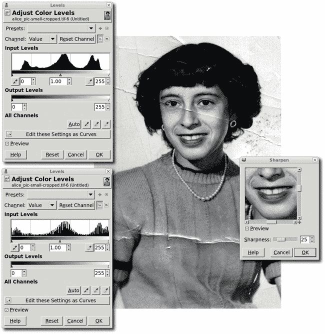

    *在开始修补瑕疵之前，对扫描图像进行锐化并调整级别。如果在补丁就位后进行这些更改，补丁的边缘可能会可见。*

## 单一补丁修复

女人毛衣上那道大划痕是你可以用简单的复制粘贴修复方法修复的损伤的例子，这种方法只包含一个补丁。照片中足够多的未损坏毛衣部分使我们能够使用这种技术。

1.  选择**自由选择工具**，围绕划痕穿过女人腰部的一部分绘制轮廓，然后按回车键将其转换为选择。这将给出必须修补的区域大小。从工具箱中选择**移动工具**。在工具选项对话框中，点击**移动设置**下的**选择**选项。

1.  在选择区域内点击并拖动鼠标，将选择移动到划痕附近的未损坏区域。

1.  通过**10 像素**对选择进行羽化（**选择**▸**羽化**）。

1.  复制选择并将其粘贴到新图层中（**图层**▸**转到新图层**），然后将新图层定位在划痕上方。在这种情况下，毛衣的褶皱帮助我们对齐补丁，但你的图像可能也会提供类似的引导。（为了显示补丁的应用位置，原始图像被着色为红色。）

    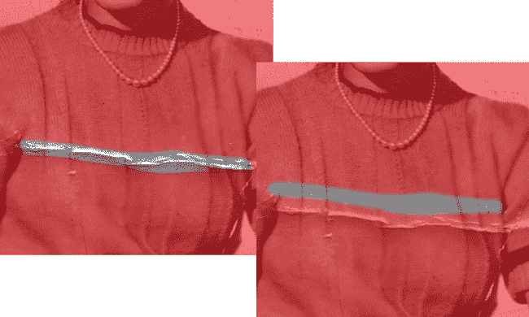

    *首先使用“自由选择工具”，然后将选择移动到附近的未损坏区域以创建补丁。*

    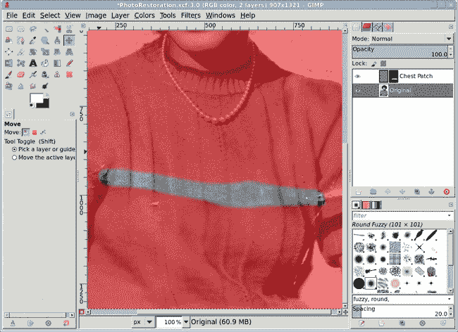

    *这个补丁很好地覆盖了瑕疵，因为它是从图像的附近部分取的。离瑕疵越远，补丁越不可能干净地贴合。*

1.  在这个例子中，折痕没有完全对齐，但可以通过使用缩放工具或 IWarp 滤镜（**滤镜**▸**扭曲**▸**IWarp**）进行细微调整来修复。如果修补区域与原始图层的边缘不对齐，添加图层蒙版（**图层**▸**添加图层蒙版**）并使用**喷枪**工具在修补区域的边缘喷黑。

1.  如果修补区域的色调与损坏区域不匹配，您可以使用曲线工具（**颜色**▸**曲线**）。确保修补图层（而不是其蒙版）处于活动状态，通过在图层对话框中点击图层预览来实现。为了查看修补线是否与原始图像很好地对齐，快速切换修补图层的可见性（使用图层对话框中的眼睛图标）。在此过程中，应该看起来折痕（或其它引导线）已经就位，只有划痕被移除了。

    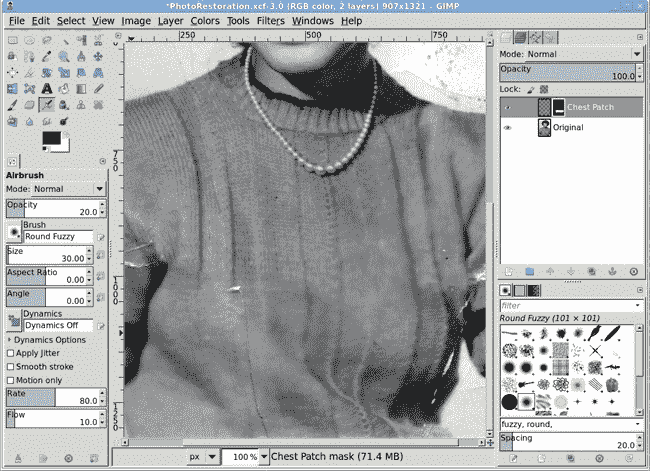

    *快速切换修补图层的可见性，以查看修补是否合适。*

## 使用多个修补区域进行纠正

女士双袖上的划痕构成了一个更困难的问题。没有足够大的无瑕疵区域可以覆盖这些划痕，因此需要使用几个较小的修补区域。使用多个小修补区域修复左袖上的划痕，就像创建之前的大修补区域一样创建每个小修补区域。

1.  使用工具箱中的**自由选择**工具选择划痕的一部分，将选择移动到附近的未受损区域，将选择作为新图层复制并粘贴（CTRL-C，CTRL-V，CTRL-SHIFT-N），并将该图层移动到划痕上。如果需要，在修补区域上使用图层蒙版（**图层**▸**蒙版**▸**添加图层蒙版**）以与周围区域混合。

1.  在这张照片中，女士袖子和中部之间的暗区有一个非常复杂的图案。修补区域需要使用曲线工具（**颜色**▸**曲线**），因为修补区域是从具有不同色调质量的区域取的。简单的使用图层蒙版混合不足以将修补区域与划痕融合。曲线调整修改了色调质量，使得修补区域与蒙版结合时无缝融合。

1.  在所有袖子修补区域创建并混合后，将它们逐个合并（**图层**▸**合并向下**）成一个单独的修补区域。

    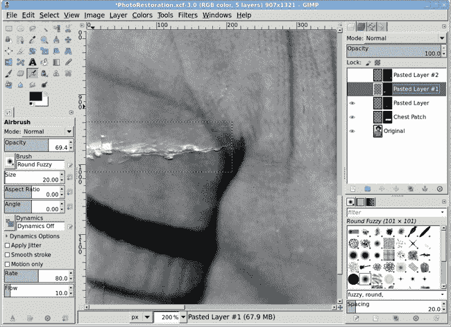

    *对于像这样的小型不连续瑕疵，尤其是在高对比度区域，使用一系列小修补区域。*

## 纠正面部瑕疵

主体脸上的划痕比衣物上的划痕更难修复。与修补区域和周围面部之间的差异相比，与毛衣及其修补区域之间的差异更容易被发现。即便如此，面部划痕最好通过使用我们迄今为止所使用的自由选择工具来处理。主要区别在于你必须做出更小的选择，这些选择由高对比度线条界定。面部和发际线之间或鼻梁和鼻影侧面的区域特别有效。女性的眼睛提出了一个特别的挑战，因为图像的这一部分非常复杂。

1.  选择眼睛区域，并将其复制粘贴到一个新图层作为修补区域（**图层**▸**转到新图层**）。

1.  使用**克隆**工具手动绘制划痕。在这种情况下，使用克隆工具是安全的，因为我们正在处理原始有瑕疵主题的副本。

1.  要使用克隆工具，首先通过按住 CTRL 键并点击图像来指定克隆源位置。点击点表示将要复制的区域，所以请确保它与你要修补的区域相匹配。然后，一旦克隆源确定，选择克隆目的地。点击并拖动鼠标到划痕上。当你拖动时，源被复制到目的地。

    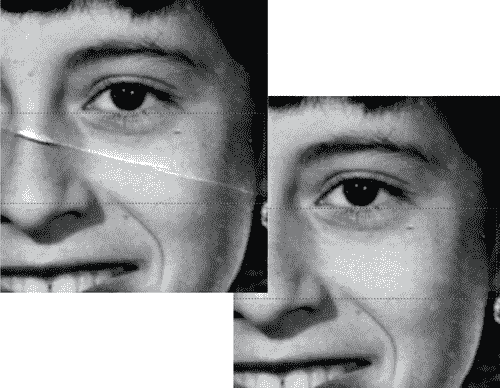

    *在面部修复瑕疵比在衣物上修复更困难。过程是相同的，但需要仔细调整曲线，并使用图层蒙版混合你的修补区域。*

当你使用克隆工具时，克隆源和初始克隆目的地（开始克隆图像时第一次点击的位置）之间的线条长度和方向始终保持一致。当你将线条拖过划痕时，相同的线条被克隆，并定位在克隆源位置。这意味着如果你从初始克隆目的地拖动足够远，你可能会使克隆源落在另一个瑕疵上。技巧是保持你的画笔笔触小，并频繁重置克隆源点。

*这个划痕是通过多次克隆操作修复的，因此使用了多个克隆源。实际上，每个克隆源都用于划痕的非常小的一部分。这使得克隆区域能够无缝地融入图像的其余部分。*

还可以从另一个图层进行克隆。在工具选项对话框中，勾选样本合并选项。使用此选项，你可以从任何用于显示合成图像的图层进行克隆。

## 清理背景

清理背景是一件轻而易举的事情。

1.  使用**快速蒙版**和合适的画笔进行选区。在背景显示的地方画在头发束上。当你点击画布窗口左下角的**快速蒙版到选区**按钮时，画过的区域（不再着红色）将成为选区。

1.  通过**15 像素**或更多来羽化选区（**选择**▸**羽化**）。在之前的教程中，羽化值仅为 1 或 2 像素，但当你处理的照片分辨率更高时，应该使用更高的羽化值，就像在恢复照片时一样。

1.  使用**颜色选择器**工具从选区内的现有背景中选择一种颜色。将前景色拖动到选区中，用此颜色填充它。这解决了所有背景问题。

    

    *背景是通过快速蒙版而不是模糊选择工具选择的，因为背景变化太多，已经褪色到部分与头发的外部边缘相匹配的程度。*

所有其他的大瑕疵都可以用与毛衣和脸部相同的过程来修复。在这种情况下，最终结果非常显著。当原始图像以高分辨率扫描时，使用 GIMP 工具恢复的图像应该能够打印出高质量的图片。结果并不总是如此显著，但通过练习，有些人能够通过这种工作谋生。

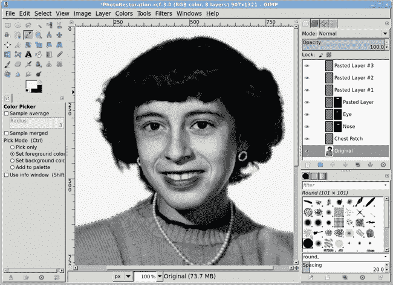

*从背景中选择一个像素并用于填充选区。*

## 进一步探索

专业图像修复依赖于正确使用选区和图层蒙版，但它也严重依赖于 GIMP 工具箱中的其他工具，包括 IWarp 过滤器、羽化命令、曲线工具和克隆工具。作为一个过程，图像修复不适合自动化，因此理解如何充分利用这些技术的设计师将始终需求旺盛。

恢复旧照片是一个耗时但有益的过程。在下一节中，我们将讨论一种耗时较少但同样有益的技术。

# 2.9 通过窗户投射光线

向照片添加光源可以增加照片的戏剧性影响——尤其是当光线透过窗格窗户时。但设置像这里展示的镜头可能很耗时，通常需要特定的地点。如果能使用软件向任何图像添加光源会更容易。

幸运的是，GIMP 允许我们将多个镜头合并以实现这种效果。从任何库存照片开始，并使用窗户图像作为阴影的模板。这个过程非常简单，你可能会发现寻找合适的库存图片比在 GIMP 中产生效果更困难。

*设置这样的镜头可能会有点困难，但 GIMP 使得合并两张库存照片并实现戏剧性效果变得容易*。

## 入门

这张照片是由两张库存照片合成的。第一张照片显示一个模特对着墙摆姿势。我们可以称这个层为*源图像*。第二张照片显示光线透过一个形状奇特的窗户。我们可以称这个层为*阴影蒙版*。你当然可以创建任何形状的蒙版，但如果你能找到一个合适的库存照片，你会节省时间。

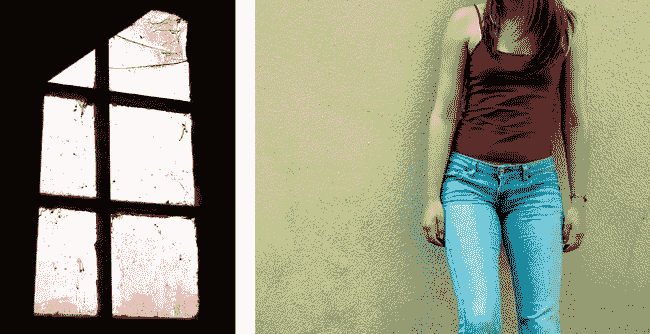

*在这个项目中使用了两个源图像。窗户为投射到模特身上的光线提供了阴影蒙版*。

## 设置阴影蒙版

首先打开一个源图像和一个用作阴影蒙版的图像，这两个图像都来自各自的库存图像文件。如果只打算用阴影蒙版图像的一部分覆盖源图像，请在该部分阴影蒙版图像周围进行选择，并将其粘贴到源图像中作为新图层。这个例子不需要选择，因为我们想使用整个阴影蒙版图像，所以我们只需将其复制并粘贴到源图像的新图层中。

1.  复制阴影蒙版图像（**编辑**▸**复制**）并将其粘贴（**编辑**▸**粘贴**）到源图像中作为新图层（**图层**▸**转到新图层**），如图所示。

1.  将阴影蒙版层的透明度降低到**65%**，然后使用**移动**工具将窗户定位在主题上方。使用**缩放**工具将阴影蒙版层调整得更高更宽，以便窗口中只显示一个十字准星。

    

    *将阴影蒙版复制并粘贴到源图像层中*。

1.  要让窗户看起来更像阴影，你需要对其进行去饱和和模糊处理。去饱和阴影蒙版层（**颜色**▸**去饱和**），然后打开高斯模糊滤镜（**滤镜**▸**模糊**▸**高斯模糊**）。模糊半径应根据图像大小设置。在这个例子中，源图像宽度为 2794 像素，因此模糊半径设置为 90 像素。这大约是 32:1 的比例，尽管你可能发现对于较小的图像，较小的比例更合适。

    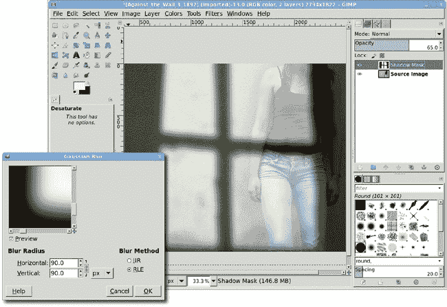

    *模糊使阴影蒙版的光亮区域变柔和，使其看起来像是光线透过带格子的窗户投射出来*。

1.  将阴影蒙版层扩展以适应整个图像（**图层**▸**图层到图像大小**）。确保在图层对话框中未设置**锁定透明通道**框。

1.  使用**模糊选择**工具，点击窗户图像左右两侧的透明区域。这可能需要按住 SHIFT 键进行多次点击。

1.  将选择区域扩大**20**到**50 像素**。

1.  在选择画布后，按**D**键重置前景和背景颜色。然后将前景颜色（黑色）拖动到选择区域以扩展设置在窗户中的墙壁投射的阴影。如果选择区域的边缘仍可见任何较浅的颜色线条，撤销拖动（CTRL-Z）并进一步扩大选择区域，然后再次从前景颜色拖动。

    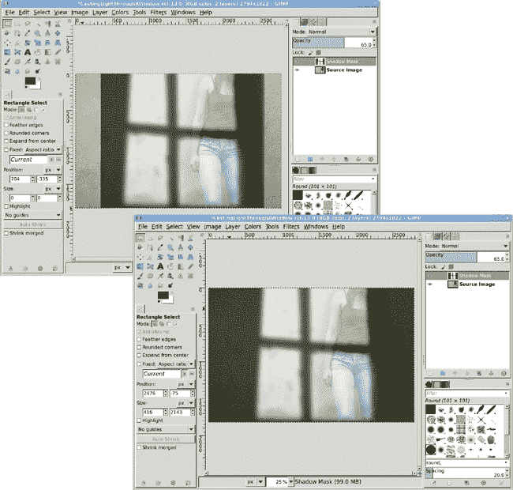

    *将阴影遮罩图层调整大小以适应画布后，将透明区域填充为黑色。这在这里有效，因为窗户周围的区域是黑色的。对于其他图像，你可能需要首先对阴影遮罩图层进行一些级别调整。*

1.  取消所有选择（**选择**▸**无**）。

1.  将阴影遮罩图层模式设置为**乘法**。在本例中，效果不错，但增加更多对比度会有帮助。使用**模糊选择**工具并在阴影遮罩的较暗区域单击。通过（**选择**▸**反转**）反转此选择以仅选择窗格。稍微缩小（**选择**▸**缩小**）选择区域。

    

    *选择阴影遮罩的窗格，如上图所示，已启用快速蒙版以便更容易看到选择区域。*

## 增加光线

1.  创建一个新的透明图层（**图层**▸**新建图层**）并将其命名为*光线*。

1.  将背景颜色（白色）拖动到选择区域中。

1.  取消所有选择（**选择**▸**无**）。

1.  打开高斯模糊滤镜（**滤镜**▸**模糊**▸**高斯模糊**）并将模糊半径设置为**90 像素**。

1.  将光线图层模式设置为**叠加**以完成效果。向光线图层添加图层蒙版（**图层**▸**蒙版**▸**添加图层蒙版**）并使用**混合**工具应用黑色到白色的渐变以软化下边缘。可能还需要将阴影遮罩图层设置为乘法模式，并应用黑色到白色的渐变。

    

    *在新图层中将选择区域填充为白色。*

    

    *增加的光线图层增加了墙壁和模型上阴影和照亮区域之间的对比度。*

## 进一步探索

为了进一步学习本教程，你可能需要添加由窗户外的物体投射的阴影。例如，想象一棵树。它的影子也会通过窗户投射到源图像上。添加树的阴影的过程将与之前类似，只是树会远一些，投射出更浅、更模糊的影子。

# 2.10 光线条纹

灯光可以改变图像的氛围。到目前为止，你已经通过通过一个看不见的窗户投射光线来向项目中添加了灯光。现在，你将结合这个想法和人工效果。这个项目将为股票照片添加流动的光线条纹。这些条纹只需做少量工作就能显著改变氛围。

这个过程没有太多技巧；获得最佳结果主要是试错的问题。这个过程从对如何创建和描边路径的初步理解开始。路径与图像图层不同。这允许路径在不影响合成图像的情况下进行编辑，并且可以多次应用于任意数量的图像图层。

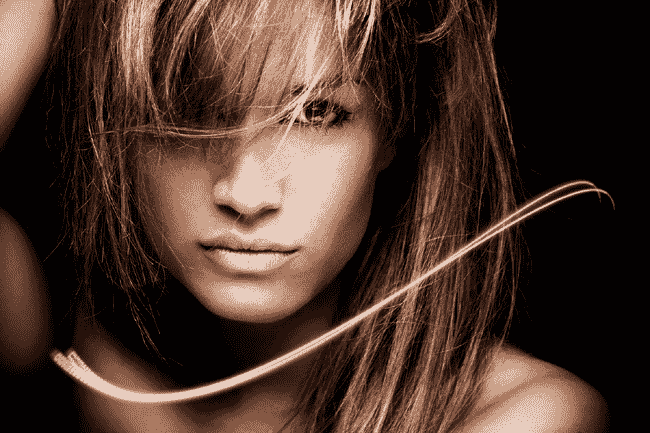

*光迹是基于对库存图像应用多个描边路径的结果*。

### 注意

*本教程需要一些使用路径工具和路径对话框的知识。如果您对其中任何一个都不太熟悉，请查看 1.5 路径以获取基本介绍*。

## 开始

该过程从一张足够暗的库存照片开始，这样一道光线就会是一个明显的改变。创建初始光迹是一个简单的流程，只需要对单一路径进行少量编辑。

1.  打开库存图像。添加一个透明图层（**图层**▸**新建图层**）并将其命名为*Streak 1*。

1.  从工具箱中选择**路径**工具。

1.  点击图像的左下角以放置一个锚点。点击中间的右侧面以放置路径的相反端。点击每个锚点附近的路径并拖动以弯曲线条并从锚点拉出句柄。拖动句柄以形成一个斜的 S 形。

    

    *这是要描边的初始路径。将从中创建多个路径并稍作修改以创建初始光迹*。

1.  在路径对话框中，点击未命名的路径并将其名称更改为*Streak 1*。

1.  从工具箱中选择**画笔**工具。在工具选项对话框中，选择**书法笔刷**。将大小设置为**20**，启用**基本动态**，将动态选项的渐变长度设置为**100**，并将渐变设置为**前景到透明**。启用**质量 20**和**重量 50**的平滑描边。

1.  在图像窗口中输入**D**，然后输入**X**以设置前景色为白色。

1.  要描边路径，请在路径对话框底部点击**沿路径绘制**图标（从右数第二个）。将打开描边路径对话框。选择**使用绘图工具描边**选项。确保选择了画笔，并勾选了**模拟画笔动态**复选框。然后点击描边按钮。

    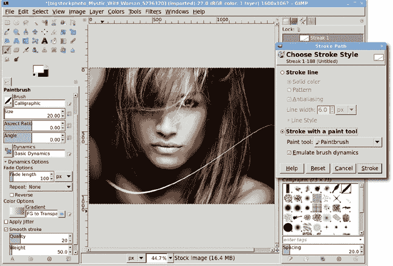

    *描边路径对话框也位于编辑菜单下（编辑*▸*描边路径）。描边路径允许您将画笔描边应用于特定形状——在本例中是一个波浪线*。

### 注意

*画笔的大小取决于库存图像的大小，在本教程中为 1600 × 1067 像素。调整画笔大小，使其产生适度的细描边。后续步骤中的额外描边将使光迹变粗*。

## 添加外部发光

初始条纹是一个很好的细节，但它需要有点发光，反射一些库存图像的颜色。发光来自复制、模糊然后应用到条纹上的颜色。

GIMP 没有外部发光滤镜，因此必须手动执行此过程。幸运的是，外部发光是一个非常简单的效果。

1.  复制条纹 1 层。将副本层命名为**外部发光**。

1.  打开高斯模糊滤镜（**滤镜**▸**模糊**▸**高斯模糊**）。将水平和垂直半径设置为**20.0 像素**，并应用于外部发光层。

1.  复制此层。将副本合并到外部发光层（**图层**▸**向下合并**）。

1.  从工具箱中选择**颜色选择器**工具。在工具选项对话框中启用**合并采样**选项。点击模型的脸部以选择要应用到发光上的色调。

1.  从工具箱中选择**桶填充**工具。在工具选项对话框中，将模式设置为**乘法**，填充类型设置为**前景色填充**，并将受影响区域设置为**填充整个选区**。

1.  点击图像窗口以将颜色应用到外部发光层。将外部发光层移动到图层对话框中的条纹 1 层下方。

    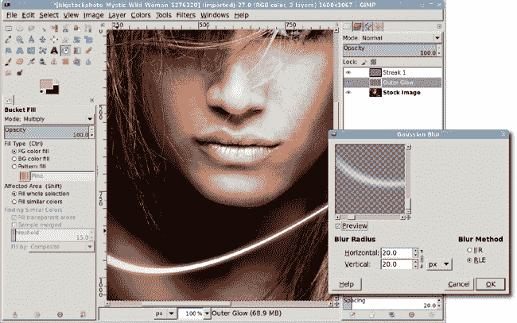

    在模糊外部发光层之后，将其副本合并是一种快速增加该层强度的方法，通过将两组模糊合并为一个。在合并之前，也可以将副本层模式更改为**加法**，以进一步增强强度。

## 添加内部发光

GIMP 也没有内部发光滤镜，尽管插件注册表中为那些对使用现成解决方案感兴趣的人提供了几个选项。然而，与外部发光一样，内部发光也非常容易通过几个简单的步骤手动产生。

1.  复制条纹层，并将副本层命名为**内部发光**。

1.  从工具箱中选择**模糊选择**工具。在工具选项对话框中，启用**选择透明区域**选项。在图像中除条纹外的任何地方点击以创建选区。反转选区（**选择**▸**反转**）以仅选择条纹。

1.  将前景色从工具箱拖动到选区中。

1.  通过**3 像素**缩小选区（**选择**▸**缩小**）。剪切选区（**编辑**▸**剪切**）。这将移除选定的区域，只留下内部发光层中一条细的轮廓。清除选区（**选择**▸**无**）。

1.  再次打开**高斯模糊**滤镜。对此层应用**5 像素**半径的模糊。

    

    **内部发光基本上是原始条纹的模糊轮廓，它改变了条纹的强度**。

选择然后反转透明区域允许选择整个条纹。如果使用模糊选择工具选择条纹本身，则可能无法选择半透明区域。

## 增强初始条纹

可以通过向其中添加类似的条纹来改进这条单独的条纹。创建原始条纹的过程被重复，只是使用的路径将是原始路径的编辑副本。

1.  打开**路径**对话框。通过单击左下角的第四个按钮来复制条纹 1 路径，并将其命名为*条纹 1B*。在路径对话框中单击眼睛图标，使眼睛可见。这将使路径在图像窗口中可见，但不会显示锚点或句柄。

1.  从工具箱中选择**路径**工具。在图像窗口中单击路径以显示锚点和句柄。单击锚点可以稍微移动它们。单击句柄可以稍微弯曲曲线。对条纹 1B 路径的更改不应过于剧烈。

1.  在图像上添加一个透明图层，并将其命名为*条纹 1B*。

1.  重复从第一条纹中复制来的笔触、外发光和内发光步骤。

    

    *通过编辑原始路径的副本，可以改变条纹的长度和曲线*。

## 进一步探索

可以通过在条纹图层上使用图层蒙版来调整每条条纹的末端。通过更改图层混合模式可以产生条纹的照明变化。通过改变绘制路径时画笔的大小，可以应用更戏剧性的条纹。

在本教程中使用了模糊来模拟条纹周围的发光。在下一教程中，您将看到如何使用模糊将成人世界变成孩子的玩具。

# 2.11 场景微缩化

GIMP 的一个常被低估的功能是模糊滤镜。少量模糊可以用来软化照片的焦点，正如在 2.1 软焦点中所示。在 2.5 改变景深中演示了如何使用不同数量的模糊将背景从前景中移开。长模糊可以给图像添加条纹，模拟高速飞行。

本教程将使用模糊将非常大的事物看起来非常小。更好的是，这个过程非常简单。这是另一种给照片带来浅景深的特效。传统摄影师可以通过一种称为*倾斜移位*的技术来实现这种效果。我们将不使用复杂设备就能得到类似的结果。

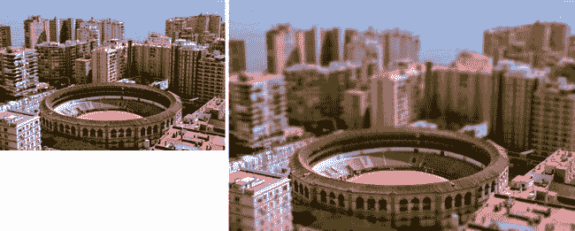

*从现实世界到小世界，只需一抹模糊即可*。

## 开始

这种效果最好的图像是城市的鸟瞰图。这张特定的图像非常完美，因为效果的中心点居中且易于隔离。此外，微缩模型通常由手工上光漆绘制，颜色饱和度很高。这个过程将增加库存照片的饱和度，然后隔离图像焦点外的区域。

1.  打开库存图片。打开色调-饱和度对话框（**颜色**▸**色调-饱和度**）并增加饱和度。对于这张图片，饱和度被增加到最大设置 100%。将此设置应用到图片上。

1.  在图像窗口的左下角点击**快速蒙版**按钮。这将把图像中当前没有选择的部分染成红色。

1.  在画布中输入**D**以重置前景和背景颜色。

1.  从工具箱中选择**混合**工具。在工具选项对话框中设置形状为**双线性**，渐变设置为**前景到背景（RGB）**，并保留其他选项为默认设置。如果需要重置默认设置，请使用对话框底部的重置按钮。

1.  在图像窗口中，点击体育场地板并向上拖动到体育场顶部上方。再次点击**快速蒙版**按钮，将此转换为图像的上部和下部的选择区域。

1.  将选择内容复制并粘贴为新图层。将新图层命名为*背景和前景*。

### 注意

*这张图片是 1600 × 1067 像素。根据不同大小的图片相应调整模糊半径。*

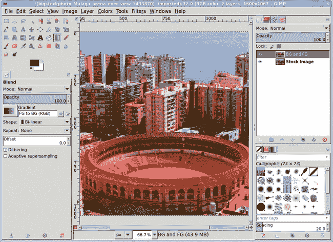

*在快速蒙版中使用双线性渐变，从黑色到白色，就可以选择前景和背景。*

## 模糊以缩小

使用原始图层的副本可以进行模糊过程的实验，而不会影响原始图像。如果你弄错了副本，只需再次选择原始图像图层，然后复制并粘贴另一个新图层以继续实验。

1.  打开高斯模糊滤镜（**滤镜**▸**模糊**▸**高斯模糊**）。将新图层应用**20**-**像素**的模糊。

1.  如果第一次选择没有选择到很多前景，使用**快速蒙版**和**混合**工具再次进行选择，这次使用**线性渐变**。从体育场地板直接拖动到底层窗户的底部。将**快速蒙版**转换为选择区域，然后复制并粘贴为新图层并再次模糊。为此新图层添加图层蒙版，并在体育场和前面的一些绿色植物失焦的地方喷漆黑色。

    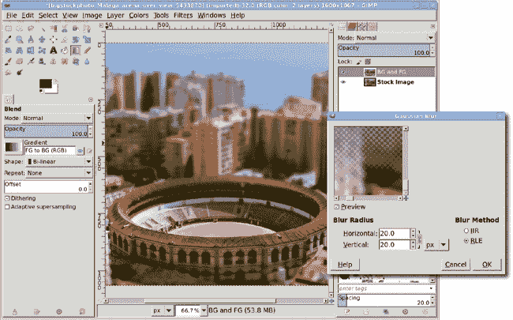

    *一次模糊可以使前景和背景失焦，看起来像是你在放大一个微缩模型的城市。*

    

    *图形设计工作就是一系列这样的小调整，比如这种前景模糊。*

## 进一步探索

这张库存照片提供了一个完美的缩小效果的例子。其他图片可能不太适合。在这种情况下，选择可能需要替代方法。尝试使用混合工具的径向渐变，或者使用带有大量羽化的矩形或椭圆选择工具。

# 摄影效果技巧

现在你已经练习了在 GIMP 中处理照片的基本技巧，你可能急于开始自己的照片项目。当你这样做的时候，请记住以下建议。

## 自动级别选项

你可以使用“级别”工具（颜色▸级别）自动调整所有扫描和数字图像的级别。这会平坦颜色直方图并自动将最暗的像素变为黑色，最亮的像素变为白色。但这并不是每次都绝对必要的。如果你不喜欢结果，只需使用 CTRL-Z 撤销即可。

## 锐化扫描

几乎所有扫描的照片都能从轻微锐化中受益。数字照片通常不需要锐化，但扫描的照片通常需要。不锐化蒙版滤镜（滤镜▸增强▸不锐化蒙版）对于照片来说效果最好，尽管你也可以使用锐化滤镜（滤镜▸增强▸锐化）获得良好的效果。

## 选择，选择，选择

学习去爱它们（并且像在 1.4 选择中描述的那样有效地制作它们）。当你处理照片时，没有它们你几乎无法做什么。

## 添加更多对比度

复制图像图层并将新图层设置为软光。调整不透明度以修改原始图层中的对比度。

## 软光和叠加模式

为你的照片添加情绪。用色彩轮上的任何颜色填充图层，并使用软光或叠加图层模式进行混合。

## 褐色调意味着棕色

褐色调是棕色的色调，它们可以为你的图像增添一种复古质感。尝试将 RGB 值集如 124/81/61、140/89/51 或 181/145/124 应用到你的照片上。

## 开尔文颜色

你在室内拍摄时使用的是普通的卤素灯吗？照明颜色以开尔文度数来衡量，日出时的太阳大约是 2,500 度，正午时的太阳大约是 5,000 度（明亮白色）。典型的卤素灯可能大约是 3,000 度，使其光线略带黄色。许多摄影师会添加一个颜色校正凝胶——可以从各种在线来源订购——以改变卤素灯的颜色。

如果你无法通过适当的照明来修复镜头，你可以尝试使用色彩平衡工具（颜色▸色彩平衡）或色调饱和度工具（颜色▸色调饱和度）从你的照片中数字去除黄色色调。

## 实验

使用工具箱中的工具对整个图像进行颜色调整可能需要很长时间。首先进行实验，选择图像的一部分并预览该选择上的颜色调整。当你决定最佳值后，撤销操作并调整整个图像。或者，尝试复制图像，将其缩小，然后在较小的图像上进行颜色调整实验。
