# 第三章 网页设计

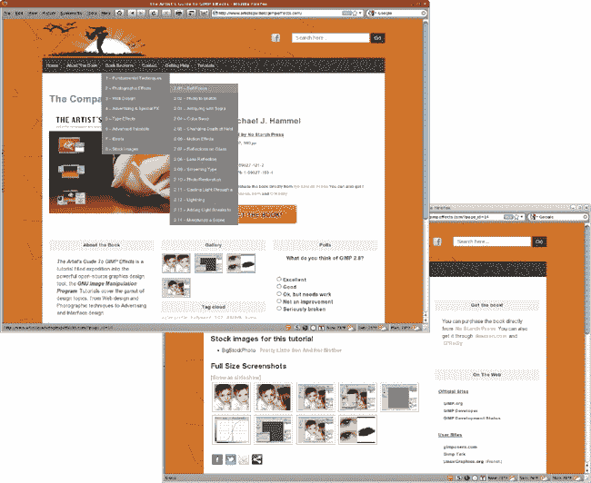

图形设计师将网络视为展示他们作品的另一个媒介。消费者将其视为购买音乐和出售二手相机和割草机的场所。大型企业将其视为开发新类型应用的平台。

无论从哪个角度看，网络已经改变了图形设计的世界。在互联网的早期，内容为王，简单的 HTML 就能完成任务，网站设计充其量是一种黑客行为。如今，最好的网站设计利用了*层叠样式表（CSS）*。CSS 是一种成熟的样式表语言，它将布局与内容分离。这种分离允许设计师在其他人努力创造引人入胜的内容的同时创建视觉一致性。CSS 设计还有效地使用了图形，这正是 GIMP 发挥作用的地方。它为设计师提供了网络所需的栅格图像。

### 注意

*CSS 禅意花园* ([`www.csszengarden.com/`](http://www.csszengarden.com/)) 有一些 CSS 应用的优秀示例，并展示了相同的内容在几种不同的设计中可能看起来如何。

网络的一个传统限制，至少从设计师的角度来看，是其静态性质。动画 GIF 图像是一种早期的黑客行为，但它并没有提供真正的交互性。今天，Adobe Flash 与栅格图像配合得很好，但它也为网络设计师提供了丰富的矢量支持。GIMP 不是矢量工作的最佳工具，但如果你的网页设计使用栅格图像，Flash 和 GIMP 可以组成一个很好的团队。

### 注意

*如果你对矢量设计感兴趣，可以尝试 Inkscape* ([`www.inkscape.org/`](http://www.inkscape.org/))*，另一个开源图形工具*。

# 在原生媒介中工作

一些之前的教程是从默认画布大小 640 × 400 像素开始的。这使得快速重新创建教程图像变得容易，但你需要处理更大的画布大小，以便使这些图像适合印刷或其他媒体格式。

好吧，现在一切都变了。在本章的整个过程中，您桌面的图像分辨率（对于大多数 CRT 显示器为 72 ppi，对于 LCD 显示器为 98 ppi）也将是媒介的图像分辨率。这意味着本章创建的图像不需要重新创建成更大的尺寸。实际上，一些可能需要缩小（或以更小的规模重新创建）才能在网络上使用。

这些教程的重点将是创建简单的网络图形，特别是导航辅助工具、背景、广告和标志。要找到可以将它们融入 Flash 或复杂 CSS 设计中的更高级摄影效果技术，请参阅第二章和第四章。

# GIMP 网页设计工具

在网页工作中，你会发现自己在使用 GIMP 的各种工具和滤镜。你几乎在每一个项目中都会用到的两个工具是文本工具和混合工具。

大多数网页都是由文本和图像组成的。文本通常在 WordPad、OpenOffice.org Writer 或 vi 中编写，而网页开发者假设读者的浏览器将能够访问显示文本所需的字体。网页设计师可以请求特定的字体，但如果浏览器没有，浏览器将选择使用其他字体。由于各种桌面平台（Windows、Mac 和 UNIX/Linux）并不都有相同的字体，你不能保证读者会以与你相同的方式看到你的网页。简而言之，因为网络仍然不支持跨平台的字体管理，你永远不能 100%确定你请求的字体会在运行浏览器的系统上可用。

### 注意

*与排版相关的网络标准对大多数网页设计师来说仍然太新，不能依赖。*

解决这个问题的方法之一是使用矢量化的文本来处理某些文本元素。使用 GIMP 将文本渲染成图像可以保证看到图像的每个人都会以你的方式看到它。然而，这个小小的技巧只适用于标题和小标题。将整个段落渲染成图像是没有意义的，因为图像文件比文本文件大得多，而编辑文本则需要使用不太适合文本编辑的图形程序。尽管如此，将标题、按钮和标题栏的文本渲染成图像以确保这些元素看起来像设计师想要的那样是很常见的。

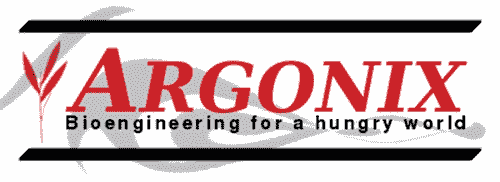

*在 GIMP 中创建文本标志可以确保无论使用哪种浏览器，所有网站访客都能看到相同的标志。*

混合工具和桶填充工具使得给图像和剪贴画上色变得容易。有时给客户普通的图像添加一点色彩是赋予其独特身份的最佳方式。

*渐变很容易创建，但使用时要小心：它们在 GIF 图像中效果不佳！如果你使用它们，请将图像导出为 JPEG 或 PNG 格式。*

你所有的网页设计项目都将使用多个图层。除了熟悉的图层对话框和图层菜单外，颜色菜单也将扮演重要角色。

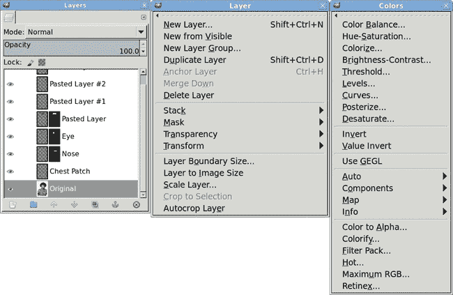

*如果你一直跟随着，到这个阶段你应该对图层已经很熟悉了，但我会继续在适当的地方引导你通过菜单选择。*

最后，在设计网页界面元素，如导航辅助工具时，有效使用选择是至关重要的（如果需要复习，请参阅 1.4 选择）。

# 3.1 凝胶按钮

网站按钮有各种形状、大小和颜色。并非每个按钮都适合每种设计。矩形按钮很受欢迎，因为它们可以很容易地更改，而不用担心它们如何与背景页面融合。另一方面，凝胶按钮通常需要大量的页面空间。它们非矩形的形状还需要抗锯齿背景颜色，并且难以随意切换背景。尽管有这些缺点，许多客户还是希望网站上有凝胶按钮。

如果您决定在网页设计中使用凝胶按钮，那么您很幸运。它们使用 GIMP 很容易创建。正如大多数 3D 效果一样，技巧是玩弄明暗区域以模拟深度和反射。

本教程将指导您创建一个简单的凝胶按钮。该技术对于任何类型的凝胶效果都是基本相同的。第 5.2 胶状类型中的教程展示了类似效果应用于文本的情况。在这里，您将看到一个更通用的过程，但可能性是无限的。例如，将此效果扩展到牙膏的流淌管并不困难。只需通过波浪过滤器循环结果即可。

*一个简单的凝胶按钮*

## 入门指南

1.  首先打开一个新的白色画布窗口，设置为默认的宽度和高度（640 × 400 像素）。

    ### 注意事项

    *如果默认图像窗口大小不是 640* × *400，请在首选项对话框中设置它，然后重新启动 GIMP。本书在创建新图像窗口时，许多教程使用 640* × *400 的默认图像大小。*

1.  通过选择**图层**▸**新建图层**并设置图层填充类型为**透明**，在画布中创建一个新的透明图层。将新图层命名为*Light Pill*。

1.  在**10%**和**90%**处添加垂直参考线（**图像**▸**参考线**▸**新建参考线（按百分比）**）。在**35%**和**65%**处添加水平参考线。

1.  选择**矩形选择**工具，并使用它在这组参考线围成的中心矩形中创建一个选择区域。在工具选项对话框中，勾选**圆角**复选框，并将半径设置为**90%**，以在选择的末端提供高弧度。 (指定的半径实际上是选择宽度或高度的一半的百分比，取较小者。)

1.  删除所有参考线（**图像**▸**参考线**▸**删除所有参考线**）。

    

    *在创建此带圆角的矩形选择时，半径值大于 90 对曲线末端的影响很小。*

## 添加彩色图层

1.  选择画布后，按**D**键重置前景和背景颜色。

1.  点击前景颜色图标打开更改前景颜色对话框。将 RGB 值设置为**17/95/239**以显示此处所示的亮蓝色，然后点击**确定**关闭对话框。

1.  将工具箱中的前景色图标拖动到选择中，用此颜色填充它。

    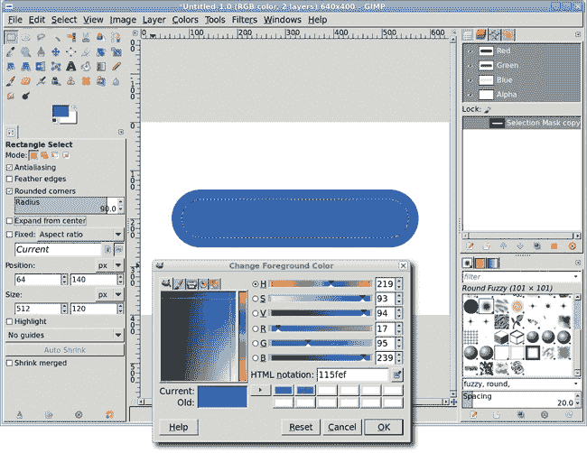

    *你可以为选择命名任何你喜欢的名字。你甚至不需要更改默认名称，因为这是本教程中唯一保存的选择。*

1.  通过**选择**▸**缩小**缩小选择**20 像素**，并将其保存到通道中（**选择**▸**保存到通道**）。你可以保留默认的通道名称，*选择蒙版副本*。

1.  返回图层对话框，点击**亮色药丸**图层使其变为活动状态。

1.  清除选择（CTRL-SHIFT-A）。

1.  复制亮色药丸图层（**图层**▸**复制图层**）。将新图层命名为*暗色药丸*。

1.  在图层对话框中，勾选**锁定 alpha 通道**框（“锁定:”行中的小灰色棋盘格框）。点击前景色图标打开更改前景色对话框。将 RGB 值设置为**11/0/97**以显示此处所示深蓝色，然后点击**确定**。

    

    *稍后使用图层蒙版以允许较亮的图层透过较暗的图层显示出来。*

1.  将工具箱中的前景色图标拖动到暗色药丸图层中。因为选择了保留透明度选项，所以只有药丸会被填充成新的颜色。

### 注意

*本教程中选择的颜色可以更改为你选择的任何颜色。互联网上有各种颜色混合工具，允许你为你的设计选择匹配的颜色。*

## 添加下划高亮

1.  通过选择**图层**▸**新建图层**并设置图层填充类型为**透明度**来创建一个新的透明图层。将新图层命名为*下划高亮*。

1.  在通道对话框中，点击**选择蒙版副本**通道，然后点击**通道到选择**按钮（红色带有虚线轮廓的正方形）。

1.  返回图层对话框并选择**下划高亮**图层以使其变为活动状态。

1.  通过**20 像素**（**选择**▸**羽化**）羽化选择。

1.  选择画布，按**D**键然后按**X**键将前景色设置为白色，然后将前景色图标拖动到选择中。清除选择（CTRL-SHIFT-A）。

    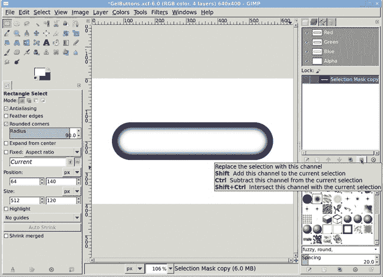

    *高亮是从通道对话框中保存的选择制作的。*

1.  打开高斯模糊滤镜（**滤镜**▸**模糊**▸**高斯模糊**）并将下划高亮图层应用**50 像素**的模糊效果。

1.  选择画布，按**M**键激活移动工具，然后拖动下划高亮图层向下，使其下方的白色边缘刚好接触到暗色药丸图层的下边缘。将下划高亮图层的图层模式设置为**颗粒合并**。

1.  点击**暗色药丸**图层。选择不透明区域（**图层**▸**透明度**▸**alpha 到选择**），然后反转选择（**选择**▸**反转**）。

1.  点击**底部高光**图层使其变为活动状态。按 CTRL-X 剪切掉可能超出按钮边界的高光部分。

    我们开始看到 3D 效果，但仍然需要从深色药丸图层透过的浅色药丸图层中提取高光。通过在深色药丸图层上使用图层蒙版来完成这个操作。结果，药丸的前面会有更多的光反射，而侧面则反射较少。

1.  在通道对话框中，点击**选区蒙版副本**通道，然后点击**通道到选区**按钮。

1.  在图层对话框中点击**深色药丸**图层。添加一个白色图层蒙版（**图层**▸**蒙版**▸**添加图层蒙版**），然后通过**50 像素**（**选择**▸**羽化**）对选区进行羽化。

    

    *当添加柔和的光照（底部高光图层）时，按钮开始呈现出深度感。*

1.  按**D**键重置前景和背景颜色。

1.  将前景色框拖动到画布中以黑色填充选区。

    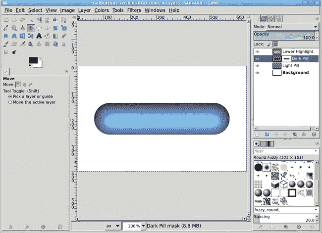

    *图层蒙版允许浅蓝色图层透过深蓝色图层，并与模糊的底部高光图层混合。*

## 添加顶部高光

1.  通过选择**图层**▸**新建图层**并设置填充类型为**透明度**来添加一个新透明图层。将新图层命名为*顶部高光*。如果它不在图层堆栈的顶部，通过在图层对话框中点击并拖动它向上移动到顶部。

1.  在选区仍然活动且画布被选中的情况下，按**M**键激活移动工具。在工具选项对话框中，点击**选区**按钮（“移动:”行中的红色方块带虚线轮廓）。在画布中，将选区向上拖动，直到其上边缘与药丸的上边缘对齐。完成时，确保在工具选项对话框中将移动设置重置为**图层**，以避免下次使用移动工具时产生混淆。

1.  在画布窗口中，按**L**键从工具箱中选择混合工具。在工具选项对话框中，选择**前景到透明**渐变。

1.  在画布窗口中按**D**键然后按**X**键将前景色设置为白色。从选区的顶部拖动一条直线到底部。

    

    *这次高光来自渐变，因此它更容易与底部高光和背景图层混合。*

## 拉伸顶部高光

类似形状的光反射并不总是均匀的。为了使这个设计更逼真，您需要拉伸上部的光高，使其底部略微变宽。您可以使用视角工具来完成此操作。此工具在保持矩形区域两侧直线的同时改变两侧之间的角度。对于椭圆形选择，想象选择被绑定在包围选择的盒子两侧。当边界框被拉伸时，椭圆形选择也会拉伸以保持与边界框两侧成比例的距离。在这种情况下，您将转换图层本身，而不是选择，但您将使用选择来创建用于执行转换的边界框。

1.  选择**视角**工具。在工具选项对话框中，选择**变换**选项到**图层**。

1.  点击画布。水平拖动底部手柄，直到高光接触到画布窗口的左右两侧。在尝试此操作之前，您可能需要先缩小视图，以便可以拖动手柄越过画布边缘。您还可能想在视角工具选项对话框中将引导线数量减少到 1，以便更容易看到预览的更改。

1.  点击**变换**按钮。固定图层（**图层**▸**固定图层**）。

    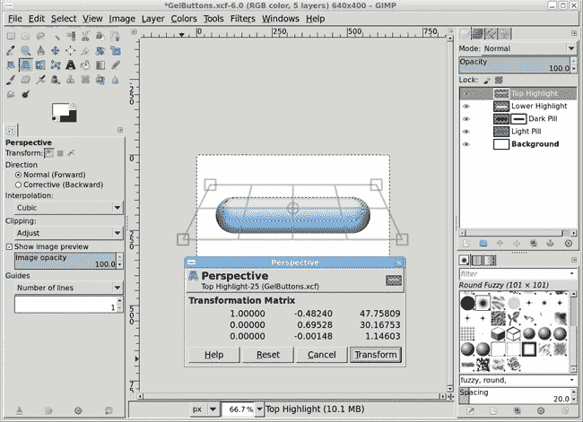

    *视角工具用于拉伸图层的底部*。

1.  点击**光点**图层。选择不透明区域（**图层**▸**透明度**▸**Alpha 到选择**），然后反转选择（**选择**▸**反转**）。

1.  点击**顶部高光**图层使其变为活动状态。按 CTRL-X 剪切掉任何超出按钮边界的部分高光。

## 在按钮上添加文本

现在向按钮添加一些文本。确保选择易读的字体。我使用了 Utopia 字体，设置为 65 像素，颜色为黑色。如果前景不是黑色，请在画布上输入 D 以重置它。（如果您的网站将有多达多个凝胶按钮，调整字体大小，以便最长按钮文本可以舒适地显示。）

1.  清除选择（**选择**▸**无**）。

1.  点击画布并输入*推我*。

1.  使用**移动**或**对齐**工具将文本居中对齐在药丸上。确保在图层对话框中激活**推我**图层。

1.  添加阴影效果（**滤镜**▸**光与阴影**▸**阴影效果**）。在阴影效果对话框中，将偏移 X 和偏移 Y 字段设置为**2 像素**，模糊半径设置为**3 像素**，透明度设置为**80%**。勾选**允许调整大小**复选框。

    

    *添加文本图层，以便按钮可以用于导航网站。小的偏移和半径使阴影效果非常微妙*。

## 进一步探索

请记住，即使物体形状完美，反射光也很少在整个物体上均匀分布。这就是刷漆金属的外观，也是凝胶按钮看起来不像金属管的原因。为了达到更逼真的效果，尝试添加几乎透明的阴影层，以增加高光层的效果。

# 3.2 金属按钮

凝胶按钮技术容易掌握，但生成金属按钮更容易。这种技术非常通用且易于复制，唯一的差异来自于您在最后一步如何着色按钮。

在本教程中，您将创建填充 640 × 400 像素画布的按钮。在实际应用中，您可能会缩小本教程中的步骤以创建更小的按钮。或者，如果创建如此小的按钮有困难，您可以在默认画布大小下创建它们，然后将其缩小以适应您的网站。如果您选择缩小按钮，请确保应用一点锐化以突出反射细节。

*可以使用一个简单的流程来制作多种颜色的金属按钮。*

## 入门

1.  以默认大小（640 × 400 像素）打开一个新的画布。

1.  通过选择**图层**▸**新建图层**并设置图层填充类型为**透明度**来添加一个新的透明图层。将新图层命名为*按钮*。

1.  从工具箱中选择**椭圆选择**工具。在工具选项对话框中，勾选**固定**复选框，并在旁边的菜单中选择**宽高比**选项。确保下面的文本字段显示 1:1，这应该是默认值。从左上角拖动到底右角，直到您的圆形选择与画布窗口一样高。确保选择完全在画布边界内。或者，在工具选项对话框中设置选择的尺寸为 394 × 394，位置为 123 × 3。

    

    *如果圆形选择没有完全居中在画布上，您可以通过点击选择内部并拖动选择到画布中心来将其居中。如果选择不是完全圆形，请首先在工具选项中点击重置按钮，然后设置固定选项并再次尝试。*

1.  在选择画布后，按**D**然后**X**将前景色设置为白色。

1.  按**L**从工具箱中选择混合工具。在工具选项对话框中，将渐变设置为**前景到背景（RGB**）并将形状设置为**径向**。

1.  在选择内部，大约从选择左侧的四分之一宽度处点击，并拖动到选择的宽度。这创建了基本的反射高光，但反射有点过于完美。（回想一下 3.1 凝胶按钮，大多数表面的光线反射是不均匀的。）下一步是给这个完美反射的球体添加一些变化。

    

    *当你点击圆的中心左侧并使用径向渐变拖动到选择的远端时，很容易实现这种 3D 效果。*

## 添加更多反射

1.  通过选择**图层**▸**新建图层**并设置图层填充类型为**透明度**来添加一个新的透明图层。将新图层命名为*Darken*。

1.  在选择画布时，按**X**将前景色设置为黑色。

1.  在**混合**工具仍然激活的状态下，在工具选项对话框中设置渐变到**前景到透明**，形状为**线性**。在画布上，点击选择的顶部并拖动到其中点。

1.  通过选择**图层**▸**新建图层**并设置图层填充类型为**透明度**来添加一个新的透明图层。将新图层命名为*Top Reflection*。

1.  在选择画布时，按**X**将前景色设置为白色。

1.  选择应该仍然处于活动状态，因此通过**选择**▸**缩小**将其缩小**10 像素**。

    

    *在按钮上方添加阴影区域可以增加按钮的闪亮外观。*

1.  **混合**工具也应该仍然处于激活状态。点击选择的顶部并拖动到其中点。取消选择所有内容（CTRL-SHIFT-A）。

1.  在图层对话框中，将顶层反射图的透明度设置为**75%**。现在光线在球体周围反射不同，提供了视觉纹理，并给人一种光滑、玻璃般表面的外观。

    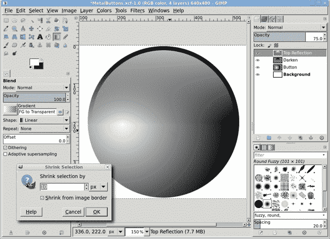

    *顶层反射层位于 Darken 层之上。*

1.  复制顶层反射图层（**图层**▸**复制图层**）并将新图层命名为*Bottom Reflection*。

1.  使用**翻转**工具垂直翻转此图层。

1.  使用**移动**工具，在工具选项对话框中将工具切换设置为**移动活动图层**，将此图层拖动，使其底部白色边缘刚好位于按钮底部边缘上方。

1.  打开高斯模糊滤镜（**滤镜**▸**模糊**▸**高斯模糊**）。将模糊半径设置为**5 像素**。点击**确定**应用模糊。将透明度设置为**60%**。

    

    *顶层和底层的反射层可以进一步模糊，以获得更戏剧性的效果。如果模糊超过几个像素，请务必使用蒙版来裁剪掉可能重叠在按钮层球体边缘的任何模糊区域。*

1.  单击**顶部反射**图层以使其成为活动图层。

1.  选择画布后，按 SHIFT-T 以激活缩放工具。在缩放信息对话框中，从测量单位下拉菜单中选择**% (百分比)**。将宽度和高度更改为**85%**，然后单击**缩放**按钮。

1.  使用**移动**工具重新定位图层，使其左上角刚好位于按钮的左上角内。

1.  打开高斯模糊滤镜（**滤镜**▸**模糊**▸**高斯模糊**）并将模糊半径设置为**5 像素**。将此模糊应用于顶部反射图层。

    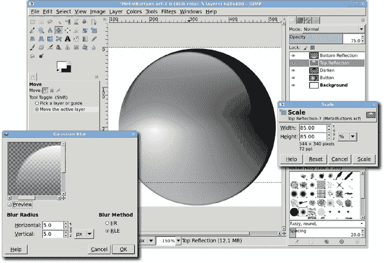

    *尽管我们在这个教程中没有这样做，但复制底部反射图层可以增加明暗区域的对比度，并在按钮底部创建平铺的外观。*

## 添加颜色

1.  在图层对话框中单击**按钮**图层以使其成为活动图层。

1.  打开着色对话框（**颜色**▸**着色**）。

1.  将色调设置为**35**，将饱和度设置为**90**。您可以通过修改此层的色调和饱和度设置来创建无数种基本按钮的变体。

### 注意

*在本教程中，您使用的是着色对话框，但可以通过多种方式添加颜色。您可以在新图层中填充颜色并将其图层模式设置为柔光或颜色。您还可以在按钮图层上使用桶填充工具并选择这些相同的模式。*

*使用着色对话框为金属按钮添加最终修饰。*

## 进一步探索

创建一个彩色球体可能看起来是一个简单的项目，但它很重要，并且可以成为许多更复杂设计的基石。实际上，它作为本书中另一个项目的基石。请确保将此项目保存为 XCF 文件（GIMP 的原生文件格式），以便以后再次使用。

# 3.3 选项卡

凝胶和金属按钮可以使网页生动起来，但实际考虑往往更具说服力的设计标准。例如，圆形按钮可能会占用宝贵的屏幕空间。更紧凑的设计可能包括使用笔记本选项卡。幸运的是，使用 GIMP 创建选项卡甚至比创建按钮更容易。

这是本书中最直接的教程之一。从开始到结束只需几分钟，效果也容易复制。您还将学习如何创建多个选项卡并以帮助访客导航网站的方式着色它们。

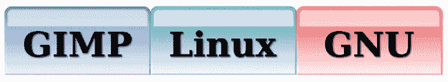

*选项卡是小型图像，但它们可以以很大的方式影响您的网页设计。*

## 入门

1.  在默认大小（640 × 400 像素）下打开一个新的空白画布。

1.  通过选择**图像**▸**参考线**▸**新建参考线（按百分比）**，在每个方向上添加**10%**和**90%**的垂直和水平参考线。

1.  从工具箱中选择**矩形选择**工具。在工具选项对话框中选择**圆角**选项并将半径设置为**25%**。在这些参考线围成的中心矩形中创建一个选区。

    

    *使用参考线可以更容易地居中选区。*

1.  移除参考线（**图像**▸**参考线**▸**移除所有参考线**）。

1.  选择**图像**▸**参考线**▸**新建参考线（按百分比）**，在**70%**的位置添加一条新的水平参考线，正好位于角落开始变圆的地方上方。

1.  在仍然选择矩形选择工具的情况下，在工具选项对话框中将模式设置为**减去**（“模式:”从左数第三个）。在工具选项对话框中禁用**圆角**选项。拖动一个矩形选区，使其通过现有选区，并且顶部由参考线包围，然后按**ENTER**键接受更新的选区。我们现在有了基本的标签形状。

    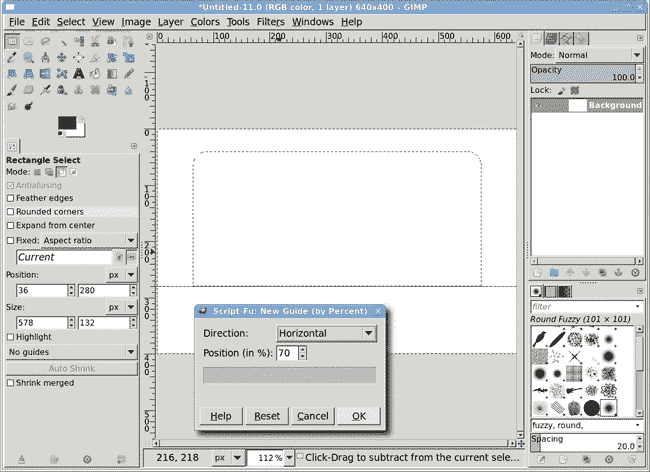

    *矩形选择工具的减去模式允许你拖动以创建一个第二选区，然后从现有选区中减去。*

## 添加渐变

1.  通过选择**图层**▸**新建图层**并设置图层填充类型为**透明度**来添加一个新的透明图层。将此图层命名为*Tab*。

1.  在画布中，按**D**键将前景色和背景色分别重置为黑色和白色。

1.  选择**图像**▸**参考线**▸**新建参考线（按百分比）**，在**50%**的位置添加一条新的垂直参考线。

1.  在画布中，按**L**键激活混合工具。在工具选项对话框中，将混合工具的不透明度设置为**70%**。确保工具选项对话框中的渐变设置为**前景到背景（RGB）**。

1.  在选区顶部附近和中心垂直参考线上点击画布，并沿着垂直参考线向下拖动到选区底部以应用渐变。

    ### 注意

    *或者，按住 CTRL 键同时拖动以保持渐变直线。*

1.  通过选择**选择**▸**存储到通道**将选区保存到通道。将保存的通道命名为*Selection Mask copy*。在此教程中无需更改名称。

1.  取消选择所有内容（CTRL-SHIFT-A）并移除所有参考线（**图像**▸**参考线**▸**移除所有参考线**）。

    

    *渐变填充了选区。*

## 给 Tab 添加一些深度

1.  在图层对话框中，点击**Tab**图层使其处于活动状态。复制 Tab 图层（**图层**▸**复制图层**），然后再次点击图层对话框中的原始**Tab**图层以使其再次处于活动状态。

1.  打开高斯模糊滤镜（**滤镜**▸**模糊**▸**高斯模糊**）。将水平和垂直模糊半径设置为**7 像素**，然后将此模糊应用到原始 Tab 图层。

1.  在图层对话框中点击**Tab copy**图层以使其处于活动状态。

1.  打开凹凸贴图滤镜（**滤镜**▸**映射**▸**凹凸贴图**）。

1.  将方位角设置为**180 度**，将仰角设置为**60**，将深度设置为**30**。务必从对话框顶部的凹凸贴图下拉菜单中选择原始的**标签**图层。

1.  单击**确定**以应用凹凸贴图滤镜并将标签副本图层重命名为*凹凸贴图*。

    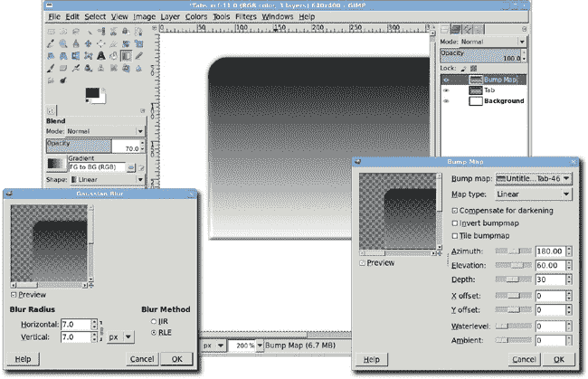

    *使用模糊的原始标签是为了给复制层增加深度。*

## 添加颜色和突出显示

1.  复制凹凸贴图层（**图层**▸**复制图层**）。将此图层命名为*着色*。

1.  打开**着色**对话框（**颜色**▸**着色**）。将色调设置为**180**，饱和度设置为**90**，亮度设置为**70**。这将产生一种朦胧的青色效果。

1.  通过在通道对话框中单击**选择遮罩复制**并单击该对话框按钮栏中从右数第二个的**通道到选择**按钮来检索保存的选择。在**30%**处添加水平参考线。

1.  选择**矩形选择**工具，将工具选项模式设置为**减去**，并拖动一个矩形，使其上边沿沿着水平参考线，以裁剪现有选择的底部。（完成时，务必将矩形选择工具的模式改回**替换**。）然后通过**选择**▸**缩小**将选择缩小**10 像素**。

    

    *将选择保存到通道是一种在形状改变很长时间后重新创建形状的简单方法。*

1.  通过选择**图层**▸**新建图层**并设置图层填充类型为**透明度**来添加一个新的透明图层。将新图层命名为*高光*。在图层对话框中单击新图层，然后设置图层的不透明度为**70%**。

1.  将背景色（白色）拖入选择区域以填充选择。

1.  取消选择所有（CTRL-SHIFT-A）。

1.  打开高斯模糊滤镜（**滤镜**▸**模糊**▸**高斯模糊**）并将高光层应用**5 像素**的模糊以柔化反射的高光。

    

    *在模糊高光层之前，请取消选择（CTRL-SHIFT-A）。*

## 添加文本

基本标签现在已完成。现在只需添加一些文本。

1.  删除所有参考线（**图像**▸**参考线**▸**删除所有参考线**）。

1.  从工具箱中选择**文本**工具。选择合适的字体（本教程使用的是设置为 120 像素的粗体黑体）。当你为按钮文本选择字体大小时，这里的字体大小应该允许最长的标签文本适应。记住，如果你打算缩小标签的大小，无衬线字体可能更合适。

1.  单击画布以打开文本编辑器。输入一些文本。

1.  使用**移动**工具将文本定位在标签的中心。

1.  如果喜欢，可以添加一个阴影效果（**滤镜**▸**光与阴影**▸**阴影**）。将偏移 X 和偏移 Y 值设置为**3 像素**，模糊半径设置为**8 像素**，不透明度设置为**80%**。

    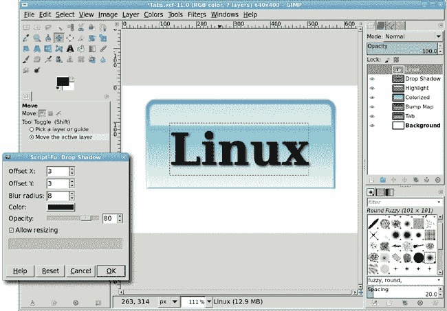

    *在添加阴影后，文字看起来像是放在半透明的标签上。*

## 创建更多标签页

在现实世界中，网页通常有多个标签页。彩色标签可以表示正在查看的页面，而灰色标签表示网站访客可用的其他页面。

1.  要创建一系列标签页，首先关闭背景、阴影和文字层的可见性。然后合并可见图层（**图像**▸**合并可见图层**），根据需要扩展。

1.  复制合并的图层，并将新图层命名为*新标签*。

1.  使用**移动**工具将此标签移动到您创建的第一个标签的左侧。

1.  调整画布大小（**图像**▸**调整画布大小以适应图层**），然后调整画布窗口（CTRL-SHIFT-J）。

1.  将**新标签**层移动到与原始标签层的左下边缘对齐。可以使用**对齐**工具对齐两个层的顶部边缘。然后放大，在工具箱中选择**移动**工具，并使用键盘上的箭头键进行左右微调。

1.  如果新标签层应该有不同的颜色，请对它进行去饱和（**颜色**▸**去饱和**），然后使用着色对话框（**颜色**▸**着色**）着色。

1.  根据需要添加额外的文本，然后恢复原始按钮的文字和阴影层的可见性。

### 注意

*如果你的背景层没有填满整个画布，你可以删除它（图层▸删除）并添加一个新的白色图层（图层▸新建），然后将它拖到图层对话框堆栈的底部。*

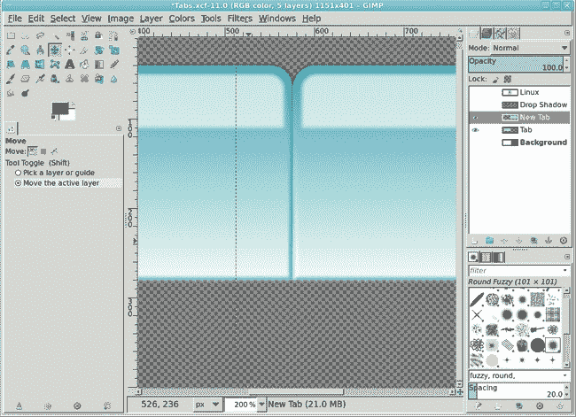

*通过放大并使用移动工具的箭头键，可以对位置进行精细调整。*

## 进一步探索

标签可以垂直放置在网站上而不是水平放置。合并所有可见图层，然后将图像逆时针旋转 90 度（见图像▸变换）。创建垂直阅读的文字（字母是垂直的，但单词是从上到下而不是从左到右阅读）更困难，因为 GIMP 的文字对齐功能有限，但您可以在每个字符后使用换行符。

# 3.4 网站横幅

如果你在一个像 CafePress.com 或 Shopify.com 这样的许多在线社区之一经营小生意，或者在一个 WordPress.com 下的博客或企业，那么你可能需要看起来专业的横幅和产品图片来配合你的网站。幸运的是，GIMP 只需几个简单的步骤就能解决这个问题。

横幅和产品图片的主要要求是图片的大小。大多数网站托管服务提供可配置的主题，用户可以自定义他们的网络存在。所选的主题定义了图片的规格。这包括页面顶部的横幅、幻灯片显示图片以及页面特定部分背景或图片等额外内容。技巧是使用主题规格来创建视觉上吸引人的产品展示和专业的外观，使你的网站与竞争对手区分开来。

这个教程将专注于创建具有艺术和技术重点的网站专业横幅所涉及的任务。这里概述的过程也可以应用于滚动幻灯片和静态产品图片中使用的图片。

与摄影效果教程一样，制作横幅的大部分工作都是从库存图片开始的。

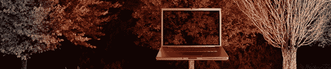

*一个网站的专业外观从高质量的横幅开始。*

## 开始

首先要做的是查找你将在网站上使用的主题的横幅尺寸信息。所有横幅尺寸都是以像素为单位的。Etsy.com，一个手工制品购物中心，建议横幅尺寸为 760 × 100 像素。Cafepress.com，一个可以在各种产品上创建定制打印的网站，建议最大尺寸为 500 × 200 像素。WordPress，一个用于博客和内容管理的开源软件包，提供了一个支持最大尺寸为 940 × 198 像素的默认主题。由于无法知道访问者的显示分辨率大小，通常最好将宽度保持在 1024 像素以下。横幅的高度通常受限于网站主题的设计限制。

### 注意

*本书付印时，各种网站的横幅尺寸都是最新的。*

在这个教程中，你将使用 WordPress 横幅的尺寸，因为 WordPress 在桌面上的安装很简单，这使得在不访问远程商店的情况下测试设计变得容易。

## 裁剪背景图形

1.  打开至少 1024 像素宽的库存图片。这张图片来自 BigStockPhoto.com，它是一个相当大且细节丰富的图片，尺寸为 2536 × 2302 像素。如果需要，可以通过（**视图**▸**缩小**）来缩小视图，以便看到整个图片。

1.  从工具箱中选择**裁剪**工具。在画布上拖动一个初始的边界框，然后在工具选项对话框中设置大小为**940 × 198 像素**。

1.  图片太大，无法在裁剪边界内放入任何有意义的内容。为了解决这个问题，通过**50%**的比例**缩放图片**（**图像**▸**缩放图片**）。如果需要，可以通过（**+**或使用单窗口模式时按 CTRL-SHIFT-J）放大图片。在画布中，点击边界框的中间，并拖动框直到它覆盖感兴趣的区域。

1.  按下 ENTER 键接受裁剪。图片将被裁剪到所选区域。

1.  打开**锐化蒙版**滤镜（**滤镜**▸**增强**▸**锐化蒙版**）。将半径设置为**3.5**，数量设置为**0.35**。

    

    **缩放图像不会改变裁剪边界框的缩放比例**。

## 增强光晕

图像颜色暗淡。我们需要调整图像以增强其颜色。

1.  复制背景层（**图层**▸**复制图层**）。将此图层命名为*Desaturated BG*。对复制的图层进行去饱和（**颜色**▸**去饱和**）。添加一个白色图层蒙版（**图层**▸**蒙版**▸**添加图层蒙版**）。

1.  在**图像**▸**参考线**▸**新建参考线（按百分比）**中添加一个**50%**的水平参考线。在画布窗口中输入**D**以将前景色重置为黑色。

1.  从工具箱中选择**混合**工具。在工具选项对话框中设置模式为**正常**，形状为**双线性**，渐变为**前景到背景（RGB）**。从图像中间拖动到接近右侧边缘的水平参考线。然后在工具选项中将模式切换到**乘法**，然后重复拖动两次。

    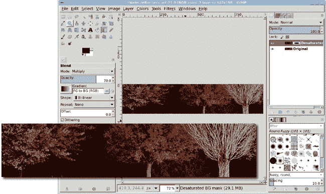

    允许彩色树木透过黑白层，在一棵树上（此处以特写形式展示以更好地看到效果）周围创建出模拟的光晕。

## **添加前景图形**

前景图形是一个打开的笔记本电脑。背景将通过显示器显示出来。

1.  打开至少 500 像素宽的笔记本电脑库存图像。这个图像来自 BigStockPhoto.com，因为它在背景和电脑边缘之间有很高的对比度，所以被选中。这将使笔记本电脑更容易分离。将图像缩放到**247 × 185 像素**（**图像**▸**缩放图像**），以保持宽高比。

1.  在工具选项对话框中选择**模糊选择**工具，将阈值设置为**12**。点击电脑外的白色区域，然后（选择**▸**选择**▸**反转）选择。这将选择笔记本电脑，可能包括一些背景。使用快速蒙版来清理选择。复制此选择（**编辑**▸**复制**）。

1.  在图层对话框中，点击图像图标上的**Desaturated 图层**，使图像图层变为活动状态（而不是图层蒙版）。

    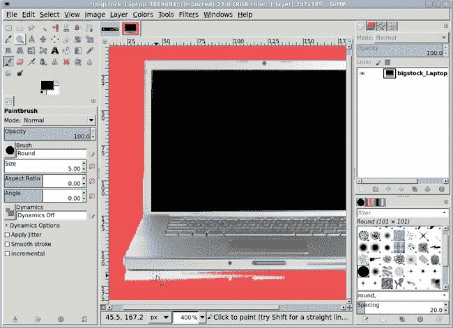

    **模糊选择**并不完美，因为背景和对象（笔记本电脑）之间的对比度不足，因此需要使用快速蒙版（此处以红色显示）进行清理。

1.  将复制的副本粘贴到发光的树木图像中作为新图层（**图层**▸**转到新图层**），命名为*Laptop*。使用**移动**工具将新图层定位在树木发光的彩色部分上方。

1.  关闭原始笔记本电脑图像，以免影响教程的其他部分。

## **着色笔记本电脑**

1.  将笔记本电脑图层去饱和。在工具箱中单击前景色框，并将 RGB 值设置为**122/0/31**。或者，使用拾色器工具从背景图层中选择一种颜色。

1.  从工具箱中选择**桶填充**工具。在工具选项对话框中，将不透明度设置为**100%**，填充类型设置为**前景色填充**，受影响区域设置为**填充整个选择**，模式设置为**柔光**。在笔记本电脑上单击画布窗口两次。

1.  将模式更改为**叠加**并将不透明度设置为**50%**。在画布窗口中单击一次。

1.  通过在画布窗口中按**D**键重置颜色，然后再次在画布窗口中单击一次。

    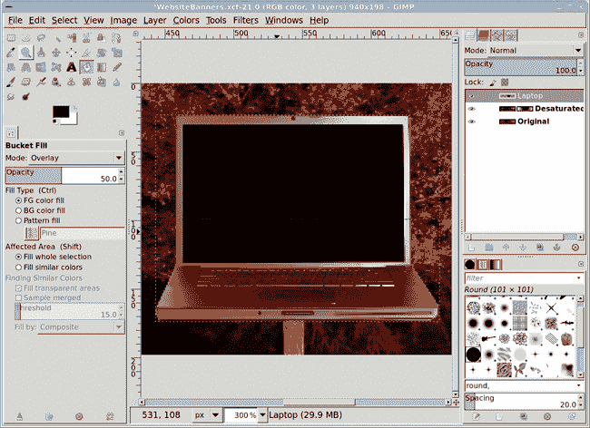

    *如果笔记本电脑的颜色不理想，请使用撤销选项（CTRL-Z）返回到去饱和的笔记本电脑，并尝试使用不同的颜色和/或不同的图层模式再次尝试。*

## 在树木上打开窗口

下一步是允许树木在笔记本电脑显示器上显示。

1.  将白色图层蒙版添加到笔记本电脑图层。

1.  使用**矩形选择**工具（确保在工具选项对话框中将模式设置为**替换**）在笔记本电脑显示器上绘制选择轮廓。轮廓应略小于显示器，在选择和笔记本电脑显示器框架之间留下一个小黑空间。通过**2 像素**对选择进行羽化（**选择**▸**羽化**）。

1.  将前景色更改为深灰色，通过设置 RGB 值为**94**/**94**/**94**。将前景色框从工具箱拖动到选择中。

    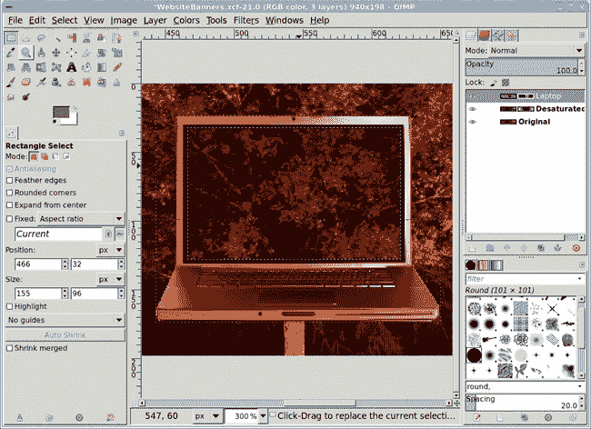

    *树木通过蒙版显示，看起来好像在笔记本电脑显示器上显示。*

## 导出和保存

在将文件导出为用于网站的 JPEG 格式之前，将其保存为 XCF 文件。XCF 是 GIMP 的本地文件格式，将横幅保存为 XCF 图像允许您稍后编辑它。保存为 XCF 文件后，将图像（**文件**▸**导出**）导出为 JPEG 格式。

## 进一步探索

横幅大小因网站而异，并在页面上以不同的位置呈现。Etsy 横幅比 WordPress 横幅小，并且显示在中心偏下。选择引人注目的横幅组件将吸引网站访客关注您的内 容，而不是托管网站的周边图像。

由于网页上的字体处理仍然不一致，因此向横幅中添加文本可能很有用。通过在横幅中渲染文本，您可以确保它在每个平台上的每个浏览器中都能以相同的方式显示。HTML 的将来进步将有助于解决这个问题，但就目前可预见的未来而言，向横幅中添加文本仍然是一种有用的做法。

# 3.5 简单徽标

标志设计是图形设计中最令人愉快的分支之一。对于较小的或较新的公司，标志需要图形化地表达公司的主要产品或目的。对于更成熟的企业，标志可能是一个独特的符号，它已经与该公司和其产品联系起来。想想耐克的飞人标志或 AT&T 的地球标志。

由于它们很小，标志也是最难创建的设计之一。在如此小的空间中表达企业身份永远不容易。幸运的是，通过少量工作，标志可以传达很多信息。

*使用 GIMP 创建自定义标志非常简单*。

在网上，小型简单的标志效果最佳。在约 72–98 ppi 的分辨率下，这种媒体为复杂设计留下的空间不多。标志通常很小（但不必如此），因为它们出现在网站的所有页面上。当你缩小一个大型复杂设计时，细节可能会丢失，因此最好保持简单。

GIMP 提供了创建各种类型标志的工具。对于有适度身份需求的小公司（网页、可能还有文具和名片），这些工具通常足够。对于将使用标志进行横幅广告的大公司，GIMP 最好仅作为原型工具使用。你希望稍后将设计转移到矢量艺术中，以便可以轻松地将其缩放到大型印刷尺寸。

本教程将为一家名为 Argonix 的小型虚构生物技术公司设计一个简单的标志。设计标准是标志不能超过两种颜色，必须强调公司名称，并且必须包含一个代表公司与生物工程植物关联的标语和图标。该标志将用于公司的网站上，并且必须适应 400 × 145 像素的空间。本教程中的图像已放大，以便在印刷品中更容易看到。

## 开始

1.  在画布上输入**D**以重置前景和背景颜色。从一个新的**400 × 145 像素**大小的白色画布开始。

1.  从工具箱中选择**文本**工具。在工具选项对话框中，点击右下角的**重置**按钮，然后选择一种衬线字体。在这个例子中，我使用衬线粗体斜体。（无衬线字体更容易用矢量工具追踪，如果这个设计需要转换为矢量格式，但我更喜欢衬线字体的外观。）字体的选择也应反映客户的要求。例如，粗犷的文字可能适合游戏公司，但可能不适合家居用品连锁店。

## 创建文本

1.  在画布上点击并拖动以创建文本的边界框。框的初始大小无关紧要。它将根据需要增长以适应文本。

1.  在边界框中，输入单词*ARGONIX*（大写），然后换行。输入短语*为饥饿的世界生物工程*。不用担心颜色或文字大小。这些将在稍后更改。

1.  在您输入文本后，工具选项中的框设置可能已更改为固定。如果是这样，请确保将框类型设置为**动态**。

1.  双击单词*ARGONIX*以在边界框内选择它。在样式编辑器中，在字体大小字段中输入**55**并按回车键。点击样式编辑器中的**颜色**按钮将此单词的颜色更改为 RGB 值为 **207/0/0**。

    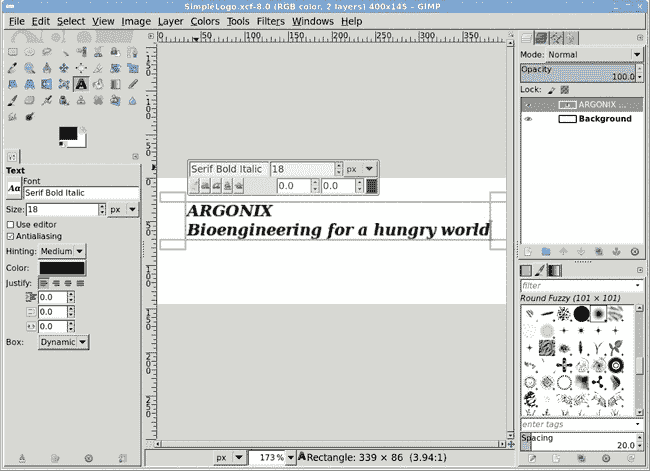

    *此项目的所有文本都放入单个图层中。GIMP 的早期版本需要多个文本图层。*

    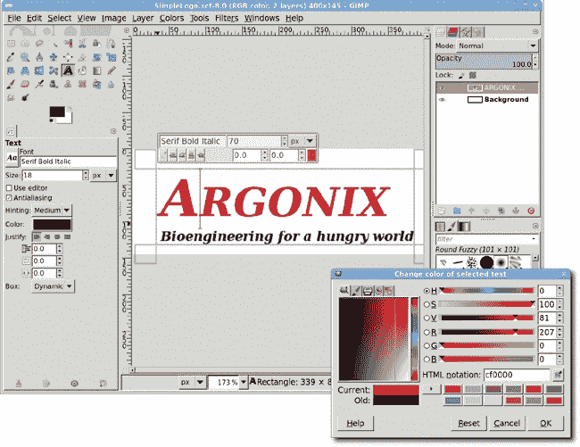

    *样式编辑器允许对单个字符、单词或短语进行更改。*

1.  仅选择*ARGONIX*中的字母*A*。使用样式编辑器将字体大小更改为**70 像素**。

    ### 注意

    *请记住，样式编辑器是显示在画布上文本直接上方的矩形编辑选项框。此编辑器是 GIMP 2.8 中新引入的，并且与可以从工具选项中打开的工具选项和编辑器对话框是分开的。有关 GIMP 文本功能的介绍，请参阅 1.8 使用文本。*

1.  快速连续三次点击文本的第二行以选择该行的所有内容。使用样式编辑器将字体更改为**Nimbus Sans L Bold**或类似的细线字体。在样式编辑器中，通过输入字体名称的几个字母来辅助字体选择。样式编辑器将显示一个过滤后的字体列表，从中选择。

1.  使用样式编辑器将所选文本的字体大小更改为**15 像素**。

    

    *更改字体和大小将更改边界框内文本的对齐方式。这将在下一步中固定。*

1.  第二行的字母字间距需要调整。行仍然被选中，因此将字间距字段设置为**2.5**并按回车键。字母会略微分散，几乎（但不完全）与第一行的左右两端对齐。

1.  仅选择第二行的第一个字母。将字间距值更改为**–5**并按回车键。现在第二行的两端应该与第一行对齐。

1.  可选地，通过在工具选项对话框中将行间距设置为**–20**来调整此文本层的行间距。请注意，工具选项中此字段的更改将应用于文本层的所有行，而不仅仅是所选行。

    

    *字间距调整的量直接与您选择的字体和字体大小相关。您的项目可能需要不同的字间距设置。*

## 添加边框和剪贴画

1.  通过选择**图层**▸**新建图层**并将图层填充类型设置为**透明度**来添加一个新的透明图层。将新图层命名为*边框*。

1.  通过选择**图像**▸**参考线**▸**新建参考线（按百分比）**，添加两个新的水平参考线在**15%**和**85%**。然后添加两个垂直参考线在**5%**和**95%**。

1.  点击**画笔**工具，并在**画笔**对话框中选择**书法**。在工具选项中设置大小为**10**。在新参考线的左上角单击一次。按住 SHIFT 键，在右上角单击以在两个交点之间绘制一条直线。重复此过程，使用左下角和右下角的交点。我们稍后会调整文本图层的位置。

    

    使用参考线和一个小画笔在单独的图层上绘制水平边框。

1.  删除所有参考线（**图像**▸**参考线**▸**删除所有参考线**）。

1.  对于出现在标志文字后面的叶子图标，你将使用剪贴画。打开任何合适的剪贴画文件（互联网上有许多免费提供的，但请确保检查其版权许可，以用于你的项目）。确保剪贴画是黑白图像。

1.  将剪贴画复制到标志项目画布作为一个新图层。确保在图层对话框中勾选**锁定透明通道**框。可能需要缩小艺术作品以适应可用空间。在这个例子中，两个边框之间的空间舒适地适合一个 90 像素高的剪贴画图像。

1.  对该图层进行去饱和度处理（**颜色**▸**去饱和度**）。

1.  选择**桶填充**工具，并在工具选项对话框中设置模式为**屏幕**，不透明度为**100%**，填充类型为**前景色填充**，以及受影响区域为**填充整个选择**。

1.  再次打开更改前景色对话框，确保 RGB 值设置为**207/0/0**以匹配用于文本的红颜色，然后关闭对话框。

1.  点击图层以着色剪贴画。

1.  假设原始剪贴画为黑白样式，设置图层模式为**乘法**。否则，可以选择更合适的图层模式来遮罩背景，或者通过颜色选择背景，添加图层蒙版，并在蒙版中选择区域填充黑色以遮罩剪贴画的背景。

1.  使用**移动**工具手动将剪贴画图层对齐到标志图像左侧的上下边框之间。

    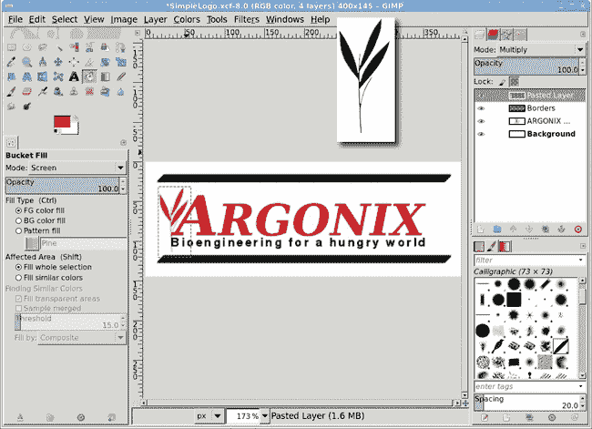

    将剪贴画缩小以适应标志的边框。

### 注意

如果你在互联网上找不到合适的剪贴画，可以尝试在当地书店寻找剪贴画书籍。例如，Dover 系列提供了许多可以用相机拍摄并使用 GIMP 轻松清理的图片。

## 添加水印

1.  在图层对话框中单击**背景**图层以使其处于活动状态。

1.  通过选择**图层**▸**新建图层**并设置图层填充类型为**透明度**来添加一个透明图层。将新图层命名为*水印*。

1.  通过此层的中间创建一个矩形选择。矩形的大小无关紧要。

1.  在更改前景色对话框中，将 RGB 值设置为**142/142/142**以获得中性灰色，然后关闭窗口。

1.  将前景色拖动到选择中，然后取消选择所有内容（CTRL-SHIFT-A）。

    

    *水印最初是一个灰色选择，位于背景层之上但所有其他层之下的图层中。*

1.  要将新的灰色背景转换为水印，打开波浪滤镜（**滤镜**▸**扭曲**▸**波浪**）。将振幅设置为**85 像素**，波长设置为**50 像素**。点击**确定**将此滤镜应用于水印层。

1.  打开曲线弯曲滤镜（**滤镜**▸**扭曲**▸**曲线弯曲**）。调整上曲线和下曲线，使它们形成一个侧面的 8 字形，然后点击**确定**将其应用于图层。

1.  打开高斯模糊（**滤镜**▸**模糊**▸**高斯模糊**）并将图层模糊设置为**1.5 像素**。将图层不透明度设置为**50%**。

1.  如有必要，使用**缩放**工具将图层拉伸更大或更小。然后调整图层以适应图像（**图层**▸**图层到图像大小**）。

    

    *一些简单的扭曲将实心灰色矩形变成了波纹水印。*

## 文本居中

1.  在图层对话框中点击**文本**层。

1.  从工具箱中选择**移动**工具。在工具选项对话框中，确保选中**移动活动图层**选项。在画布上点击并拖动以移动文本层，使其在顶部和底部边框线之间视觉居中。您可能会发现关闭图层边界（**视图**▸**显示图层边界**）更容易做到这一点。

## 进一步探索

您可能会认为这个项目的另一种设计选择可能是公司名称的第一个字母跨越两行文本。为此，第一行（不带其第一个字母）的基线将调整以向上移动，第二行的字距和基线将调整以适应此位置但位于*Argonix*中的*A*的右侧。然而，基线调整不会允许第二行重叠第一行。相反，工具选项对话框中的行距调整允许第二行重叠第一行。

以这种方式创建原型设计使得在需要将设计放大用于更大印刷媒体时，在矢量程序中追踪图像变得容易。

这只是创建小型企业标志的一个示例。最好的部分是，有很多标志设计工作。为个人使用或小型企业、律师、医生和其他专业人士设计这样的简单标志可以让任何图形设计师忙碌。

# 3.6 图标

按钮和标签以及标志并不是网络上唯一的图形。就像桌面一样，网络大量使用图标。图标有助于识别在可导航页面中的当前位置，并为常用网站提供易于识别的参考。图标可用于品牌识别或产品标签。

图标可以创建得比其显示尺寸大，通过让浏览器或 JavaScript 为您调整图像大小。这种自动缩放不推荐用于大图像，但与小图标——尤其是在一次只使用几个图标页面上——它允许图标设计师使用更大的图像。这使得创建图标更容易，因为 GIMP 用户可以在更大的画布上工作。

*如果您想加快网页的加载速度，将画布缩放至将在浏览器中显示的图标相同大小。*

在这个教程中，我将带您进入图标的世界，并指导您设计适合在网络上使用的图标。只需要基本的 GIMP 知识，例如使用图层和理解工具箱的默认布局。不需要使用外部库存图像。然而，与之前的 projekts 不同，这个项目将需要同时处理多个 GIMP 画布。

## 开始

1.  通过在图像窗口中输入**D**来重置前景和背景颜色。打开一个新的，640 × 400 像素的图像窗口（**文件**▸**新建**）。在工具箱中点击背景颜色样本以打开更改背景颜色对话框。将 RGB 值设置为**121/121/121**并关闭对话框。黑色和灰色将被用作图标背景的渐变。

1.  添加一个透明图层（**图层**▸**新建图层**）并将其命名为*图标背景*。从工具箱中选择**矩形选择**工具。在工具选项对话框中，将**圆角**选项设置为半径**25**。在图像窗口中绘制一个初始选择——此时其位置和大小不重要。在工具选项对话框中，将大小设置为**274 × 240 像素**，位置设置为**183 × 80 像素**。这将作为图标大小，并有一些透明填充。这个大小是基于实验计算得出的，所以您可以自由地调整这个选择以创建更大的图标。

    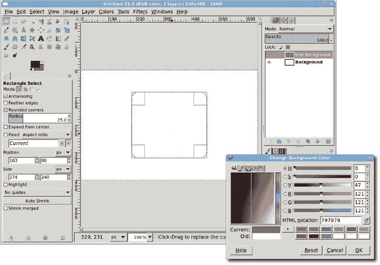

    *矩形选择工具的工具选项允许进行精确的位置和大小设置。选择圆角选项将显示半径设置。*

## 添加渐变填充

1.  在**50**百分比处添加一个垂直参考线（**图像**▸**参考线**▸**新建参考线（按百分比）**）。

1.  从工具箱中选择**混合**工具。在工具选项对话框中，将模式设置为**正常**，不透明度设置为**100**%，渐变设置为**前景到背景（RGB**），并勾选**反转**选项，形状设置为**线性**。在图像窗口中从选择区域的顶部拖动到底部，遵循参考线。

1.  清除选择（**选择**▸**无**）。添加一个偏移**3 像素**并模糊**5 像素**的阴影效果（**滤镜**▸**光与阴影**▸**阴影效果**）。

    

    *使用灰色到黑色的渐变可以使图标背景作为应用程序特定图标显示的墙壁*。

## 创建一个棋盘图案

1.  打开一个**16 × 16 像素**的新图像窗口。在打开的图像窗口中，按+键 10 次以放大。

    ### 备注

    *您也可以通过使用图像窗口底部的状态栏中的缩放控件来放大图像*。

1.  添加一个**4 像素**间距的网格（**图像**▸**配置网格**），这将窗口分为 12 个方块。启用吸附到网格（**视图**▸**吸附到网格**）。

1.  将前景色 RGB 设置为**103/103/103**。使用**矩形选择**工具（确保未设置圆角）来勾勒并填充以下行/列位置的方块：1/1，1/3，2/2，2/4，3/1，3/3，4/2，和 4/4，使用前景色填充。按住 SHIFT 键以在选择每个方块时添加到选择中。

1.  将前景色 RGB 更改为**67**/**67**/**67**，然后选择并填充以下行/列位置的方块：1/2，1/4，2/3，3/2，3/4，和 4/1。如果你一次性选择了所有之前的方块，那么反转选择以填充这些方块。

1.  将前景色 RGB 更改为**141**/**141**/**141**，并填充**2/1**和**4/3**的方块。

    

    *可以通过使用视图*▸*显示网格*来使网格可见，但设置了吸附到网格选项后实际上并不必要，因为图像非常小且已放大*。

1.  将此文件导出为*IcondBG.pat*到你的 GIMP 图案目录，并给出**描述**为*Web Icon BG*。打开图案对话框（**窗口**▸**可停靠对话框**▸**图案**），点击**刷新**按钮将新图案添加到图案列表中。关闭*IcondBG.pat*窗口。

## 添加图案

1.  返回到图标图像窗口，添加一个透明图层并命名为*Pattern*。

1.  在图层对话框中点击**背景**图层，并创建图标的选择（**图层**▸**透明度**▸**alpha 到选择**）。

1.  在图层对话框中点击**图案**图层以使其处于活动状态。在图案对话框（**窗口**▸**可停靠对话框**▸**图案**）中，将 Web Icon BG 图案拖入图像窗口以填充选择的新图案。

1.  为图案图层添加一个白色图层蒙版（**图层**▸**蒙版**▸**添加图层蒙版**）。

1.  在图像窗口中输入**D**以重置前景和背景颜色。从工具箱中选择**混合**工具。在工具选项对话框中设置不透明度为**75%**，形状为**径向**。从图标的顶部拖动到图像窗口的大约中部。在工具选项对话框中，将形状切换为**线性**，模式切换为**乘法**。从图标的中间拖动到底部边缘。再次从顶部拖动到图标的中间。

1.  应用图层蒙版（**图层**▸**蒙版**▸**应用图层蒙版**）。

1.  清除选择。移除所有辅助线（**图像**▸**辅助线**▸**移除所有辅助线**）。

    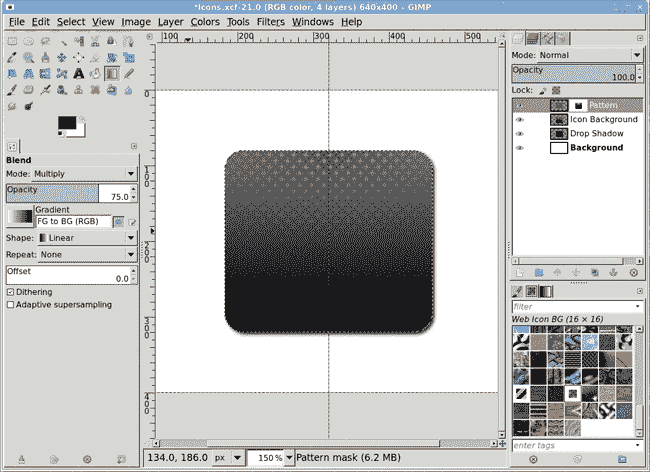

    *棋盘图案使图标具有纹理外观*。

## 对图标底部进行蒙版处理

1.  将白色图层蒙版添加到图案图层。

1.  在 183 和 457 处添加垂直辅助线，在 80 和 200 处添加水平辅助线。

1.  使用工具箱中的**路径**工具，从辅助线的左下角交叉点开始，在每个角落放置锚点，并在第一个锚点右侧再放置一个额外的锚点。这将创建五个锚点。

1.  在工具选项对话框中，将编辑模式更改为**编辑**。点击最后一个锚点并向左拖动，将第一个控制柄移出路径。再次点击并拖动控制柄到图标的上中部。这将使路径弯曲。点击倒数第二个锚点并向右拖动，将第一个控制柄移出路径。再次点击该锚点并拖动到图标的底部中部。在工具选项对话框中点击**从路径选择**。反转选择（**选择**▸**反转**）。用黑色填充选择区域。

    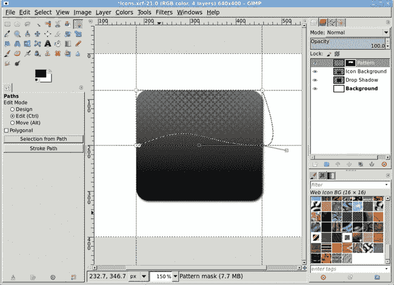

    *点击并拖动连接两个锚点的线也会使控制柄出现*。

## 创建应用程序球体

图标背景已准备就绪。现在，是时候添加特定于应用程序的标识符了。这可以多次进行，以创建一系列使用相同背景的应用程序。

1.  在 220 和 420 处添加垂直辅助线，在 100 和 300 处添加水平辅助线。这会形成一个完美的正方形，以包围球体。

1.  添加一个透明图层并命名为*Sphere*。确保此图层在图层对话框的堆栈顶部。从工具箱中选择**椭圆选择**工具。点击左上角的辅助线交叉点并拖动到右下角。

1.  通过在图像窗口中输入**D**来重置前景和背景颜色。打开更改前景颜色对话框。将 RGB 值设置为**74/164/75**。在工具箱中点击背景颜色样本以切换到更改背景颜色对话框。将 RGB 值设置为**28/130/29**。关闭颜色对话框。绿色色调将被用作应用球体的渐变。

1.  从工具箱中选择 **混合** 工具。在工具选项对话框中设置形状为 **径向**，渐变设置为 **前景到背景（RGB）**，并确保模式设置为 **正常**，不透明度为 **100 百分比**。从选择的中心拖动到选择的外边缘。

    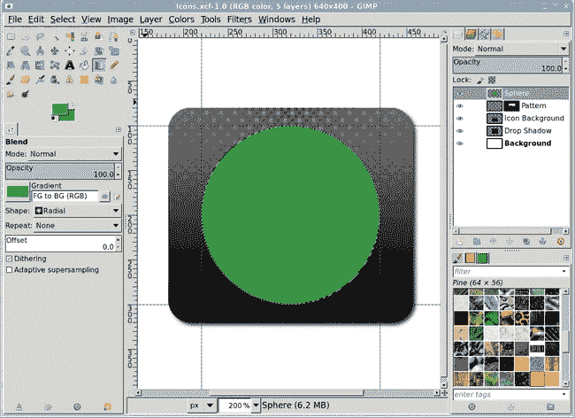

    *与其他教程中的形状不同，这个球体目前还没有光泽*。

## 添加高亮

1.  添加一个透明图层并将其命名为 *Lower Highlight*。确保这个图层在图层对话框的堆栈顶部。通过 **2 像素** 缩小选择（**选择**▸**缩小**）。重置并反转前景和背景颜色（在图像窗口中输入 **D** 然后输入 **X**），这样前景现在就是白色。

1.  从工具箱中选择 **混合** 工具。在工具选项对话框中设置形状为 **径向**，渐变设置为 **前景到透明**，并设置 **反转** 按钮为开启，然后从选择的中心拖动到选择的外边缘。

1.  向 Lower Highlight 图层添加一个白色图层蒙版。在工具箱中重置前景和背景颜色。从工具选项对话框中选择 **混合** 工具，并将形状设置为 **线性**，渐变设置为 **前景到透明**（关闭 **反转** 按钮），然后在图像窗口中从图标顶部拖动到底部。

1.  将 Lower Highlight 图层的模式更改为 **叠加**。

1.  添加一个透明图层并将其命名为 *Upper Highlight*。确保这个图层在图层对话框的堆栈顶部。再缩小选择 **2 像素**。

1.  从工具箱中选择 **椭圆选择** 工具。在画布上的选择中点击以激活它。在工具选项对话框中，设置大小为 **134 × 80**，位置为 **254 × 107**。这将在绿色球体的顶部创建一个小扁平的椭圆形选择。点击选择以完成编辑。

1.  重置并反转工具箱中的颜色样本，使前景颜色为白色。使用具有 **线性** 形状和 **前景到透明（无反转）** 渐变的 **混合** 工具，然后从选择的顶部拖动到选择的中间。

1.  清除选择。

    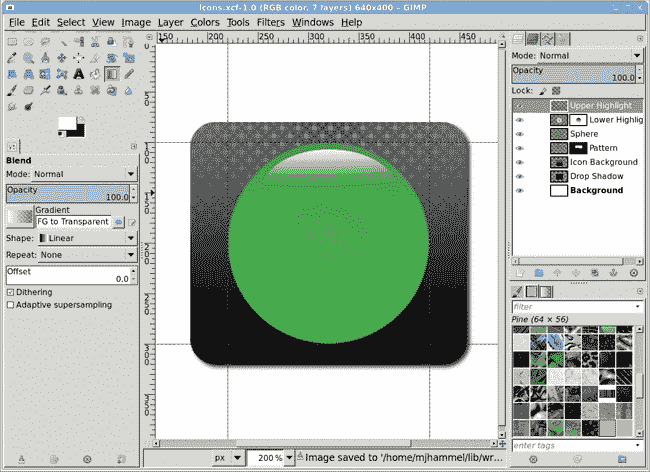

    *这个设计的变体可能包括将 Upper Highlight 向左或向右旋转 45 度*。

## 添加应用程序 ID

1.  从工具箱中选择 **文本** 工具。选择任何字体——这里使用的是 Nimbus Roman No.9 L Bold（在 Linux 系统上通常可用）。在工具选项对话框中设置字体大小为 **160**，颜色为 **白色**。字体大小可能因所选字体而异。

1.  点击球体的中心并输入大写 **G**（代表 GIMP），使用 **移动** 工具将其居中在球体上。

    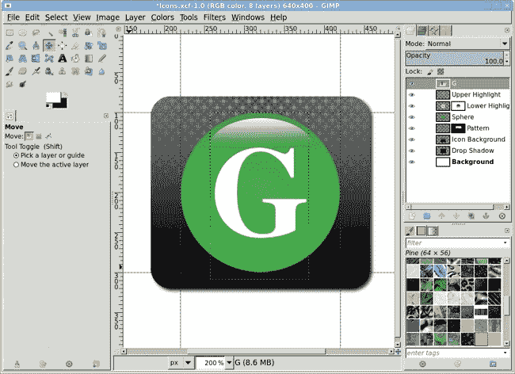

    *图标通常相当小。虽然你当然可以在图标中放置多个字母，但应避免写完整的单词或短语，因为如果图标缩小，它们只会显得杂乱无章。*

## 进一步探索

要保存图标本身，删除白色背景层，并使用裁剪工具裁剪图像，在图标周围留下少量透明空间。将图像导出为*GIMPIcon.png*或*GIMPIcon.jpg*。在将图标放置在网站上之前，根据需要将其缩小。

背景和球体可以用来为你的图标创建一个共同的主题。要重复使用背景和球体，请关闭文本和背景层的可见性，然后合并可见层。将生成的层拖到工具箱中，以打开一个只包含合并内容的新图像。将其导出为*IconBG.png*。不要保存为 JPEG 格式，因为该格式不支持透明度！

之后，你可以重新打开图像，添加文本层，并作为新的图标导出。

# 网页设计技巧

GIMP 是一个能够为任何设计项目制作高质量图像的工具——无论媒介如何——并且其对 RGB 和索引图像的核心支持使其非常适合网页设计。当你开始使用 GIMP 为你的网站创建图像时，请记住以下提示。

## 使用 GIMP 处理图像，使用 CSS 进行设计

GIMP 为你提供了创建网站图像的工具，但你还需要更复杂的东西来提供布局规则并组织你的创作以实现连贯的用户体验。CSS 就是它。网页设计现在与布局一样重要，与图形一样重要。好的网页设计包括 CSS 和 GIMP。

## 正确的单位

网页设计需要用于视频显示的图像。如今，大多数显示器，包括智能手机，都使用 LCD 或 LED 技术，因此大多数图像应缩放到 72 ppi 或 98 ppi。在进行网页设计工作之前，请确保将你的分辨率首选项（编辑▸首选项▸默认图像）设置为 72 像素或 98 像素，而不是英寸或毫米等打印单位。

## 在需要的地方添加对比度

如果你在一个用于网络的图像上放置文本，并覆盖背景，请确保文本边缘和背景之间有足够的对比度。低对比度的图像可能在设计师的高端显示器上看起来不错，但你不能保证所有访问网站的用户都会以相同的方式看到图像。添加阴影或轮廓可以帮助将文本与背景分开。文本屏幕是另一个选项。有关筛选文本的更详细讨论，请参阅 2.7 湖面倒影。

## 避免使用繁忙的背景

背景应该被看到，而不是被听到。嘈杂的背景是一个糟糕的设计选择。如果你的视线被背景吸引，那么很可能是背景在分散访问者的注意力。为了让你的文字突出，首先减少背景图像的对比度。然后使用带有其模式设置为颜色或颗粒合并的桶填充工具，将图像去饱和并填充浅色。你可能需要将不透明度设置为低值。

## 聪明选择文件格式

这么多不同的图像文件格式被开发出来，是有原因的：并不是每种格式都适合所有情况。如果你有一张没有渐变的纯文本图像，使用 GIF 格式。因为 GIF 格式只使用每个像素 8 位来表示颜色信息，所以它非常适合只有几种颜色（256 种或更少）和强烈对比度（如白色背景上的黑色文字）的图像。GIF 格式还提供*无损压缩*，这意味着它尽可能地压缩图像，而不牺牲图像质量。但是，如果你要显示照片，就跳过 GIF 格式。

它们更适合使用 JPEG 格式处理，该格式是根据人类眼睛感知颜色的方式专门为照片设计的。使用 24 位（三个 8 位 RGB 通道）来表示每个像素，JPEG 格式可以轻松处理高达 1600 万种颜色。与 GIF 格式不同，JPEG 格式的压缩被称为*有损压缩*，这意味着（至少在理论上）使用它你会丢弃数据。然而，实际的数据损失通常微不足道，你可以根据你愿意接受的图像质量损失程度来指定压缩图像的程度。对于一些 GIMP 艺术家来说，一个更大的缺点可能是 JPEG 格式不处理透明信息。GIF 格式可以处理，但它只能将透明度解释为任何给定像素的开或关，导致图像的非矩形区域出现“阶梯状”。

另一方面，PNG 格式可以处理各种级别的透明度和数百万种颜色。它还提供*无损压缩*，所以没有数据被牺牲。尽管如此，并非所有浏览器都完全支持 PNG 格式，但现代浏览器，如 Windows Vista、Mac OS X 和任何最近的 Linux 发行版提供的浏览器，应该没有问题。例如，一些较旧的 Internet Explorer 版本如果包含透明信息，就无法显示 PNG 图像。如果所有网站访客都使用 Firefox 就好了！

另一个选项是强制访客使用外部程序来查看你的图像。Firefox 的 MIME 类型编辑器扩展允许访客配置外部程序来处理各种文件类型。提供样本高分辨率副本的设计师或摄影师在私人网络画廊中可能会选择这个选项。在这种情况下，全彩色的 TIFF 图像可能是合适的，尽管缩略图预览仍然需要是 GIF、JPEG 或 PNG 文件，因为它们将由浏览器显示。

聪明地选择文件格式。每个项目都使用 JPEG 图像并不是一个好的解决方案。如果你认为在这些选项中进行选择很烦人，那么就等着网络（以及所有那些浏览器）最终支持矢量图像吧。万岁，SVG！

## 网页扫描

如果你在互联网或书中找不到合适的剪贴画，你总是可以扫描现实世界中的物体，将生成的图像去饱和，然后使用“色阶”、“曲线”或“海报化”工具减少图像的色彩范围。Windows 和 Mac 用户有内置的系统扫描支持。Linux 的扫描支持来自 SANE 项目，网址为*[`www.sane-project.org/`](http://www.sane-project.org/)*。XSane 插件是直接从 GIMP 扫描所必需的，可在*[`www.xsane.org/`](http://www.xsane.org/)*找到。SANE 和 XSane 包含在大多数最新的 Linux 发行版中（如 Fedora 和 SuSE），尽管它们仍然需要手动配置。阅读 man 手册或检查项目网站以获取有关配置扫描仪的更多信息。

## 微妙的渐变

渐变在背景图像中的应用通常被访客忽视，但它可能意味着普通网站与专业设计的区别。3.1 凝胶按钮, 3.2 金属按钮, 和 3.3 标签 在网站按钮中使用了渐变。考虑在背景图像中使用极其微妙、未饱和的渐变，并添加少量未饱和的噪点以增加纹理效果。

## 网页设计的透明度

使用 PNG 格式的透明图像可以与背景无缝融合。CSS 和 JavaScript 允许根据条件（如一天中的时间）对图像的背景进行样式化。将精心构建的透明 PNG 图像与基于时间的背景混合，可以使同一图像用于不同的效果。

## 选择正确的颜色

网页设计还包括适当色彩搭配的使用。为网站选择配色方案与展示的图片一样重要。选择合适的色彩搭配与色彩如何影响人的思维过程有很大关系。红色可以刺激并引发攻击性行为，或者促使观众采取行动，而蓝色则可能引发敏感的反应。

在为网页选择配色方案时，研究色彩对行为的影响的心理。在互联网上搜索在线色彩混合工具。以下是我最喜欢的几个：

+   **色彩混合器** *[`www.colormixers.com/mixers/cmr/`](http://www.colormixers.com/mixers/cmr/)*

+   **EasyRGB** *[`www.easyrgb.com/`](http://www.easyrgb.com/)*

## 安全导出

GIMP 2.8 修改了文件▸保存的设置，使其不再保存为除了 GIMP 的本地 XCF 文件格式以外的任何格式。若要保存为其他文件格式，请使用文件▸导出。如果你将在网页设计中使用你的图像，请导出为适当的文件格式：JPEG、GIF 或 PNG。当你将分层图像导出为适合网页的图像文件格式时，GIMP 会自动合并所有可见图层。这不会给你带来任何努力上的负担，也不会改变你现有的分层画布。但别忘了也将分层版本保存为 XCF 文件，以防你以后需要编辑图层。
