# 第四章 广告和特效

广告的目的是以尽可能低的成本，尽可能有效地向目标受众传达信息。GIMP 不能帮助你控制媒体成本或确定你的目标受众，但它可以帮助你展示一个引人注目的产品信息。本章中的教程利用了你在本书中已经遇到的 GIMP 工具，建立在你的技能之上，并教你如何将这些技能应用到常见的广告任务中。

# 印刷与网络

广告的目的决定了其设计。了解目标媒体的要求和限制是广告设计过程中的重要部分。创建网络广告不需要像创建印刷广告那样多的时间、精力和计算机内存，但网络的性质在许多方面限制了广告。

网络广告是为了在计算机显示器上查看而设计的，因此图像通常较小，并且以监视器的分辨率测量，通常是 72 或 98 ppi。网络广告也以创建图像时使用的相同 RGB 格式显示。因此，它们比印刷广告更容易创建，但由于监视器分辨率和屏幕空间有限，网络广告无法展示太多细节。

相比之下，印刷广告通常更大，分辨率更高（150 dpi 到 300 dpi），这需要更多的计算机内存来制作。此外，在 RGB 中创建的印刷广告通常必须转换为打印机所需的 CMYK 格式。由于 GIMP 目前不支持直接操作 CMYK 图像，你的广告将使用 RGB 创建，转换过程将由打印机或第三方服务局处理。

### 注意

*如果你不害怕命令行，你也可以尝试使用 ImageMagick 命令行工具套件来处理图像颜色转换。如果 RGB 图像是用 Little CMS (LCMS)库构建的，转换工具可以使用国际色彩联盟（ICC）配置文件将它们转换为 CMYK。你的个人打印机可能包含 ICC 配置文件，即使 GIMP 不能直接处理 CMYK 颜色，它也支持它们的使用。*

# 库存图片

大多数网络和印刷广告工作都是从库存图片开始的。幸运的是，互联网已经将库存图片收藏向大众开放，并在这一过程中降低了这些图片的成本。这些图片非常适合用于网络广告，因为它们价格低廉，质量合理，并且有多种尺寸可供选择。大多数库存图片收藏提供 GIMP 支持的格式，如 TIFF 和 JPEG，而在像 BigStockPhoto.com、iStockphoto.com 和 CanStockPhoto.com 这样的低成本库存图片网站上，每张图片的价格从 1 美元到 5 美元不等。

您可以使用低成本库存图片进行一些印刷广告，但对于像海报和横幅这样的项目，最好使用来自专业库存图片收藏的图片。专业库存图片服务通常提供更大的图片，足够大，可以满足大规模印刷项目。除了按文件下载外，专业库存图片服务还可能销售完整的 CD 收藏或提供月度订阅。然而，价格差异很大。一张图片可能价值 80 到 200 美元，而 CD 收藏可能价值约 500 美元。像 ThinkStockPhotos.com 和 GettyImages.com 这样的网站每月订阅费约为 199 美元，年订阅费约为 1,200 美元。

在线库存图片收藏通常提供每个图片的几种不同尺寸。这些图片尺寸通常以像素为单位给出，您会想购买您能负担得起的最大版本。这将允许您将图片缩放到适合您项目的尺寸。记住，印刷广告的每英寸点数（dpi）值（150 dpi 到 300 dpi）与网络广告的每英寸像素数（ppi）不同（72 ppi 或 98 ppi）。当以 300 dpi 打印在杂志上时，宽度为 1,200 像素的图片是 4 英寸宽（300 dpi × 4 英寸 = 1,200 像素），但在以 72 dpi 打印到网络上时，宽度超过 16½英寸！

### 注意

*实际上，dpi 和 ppi 之间没有区别；两者都是每英寸颜色点的参考。dpi 通常用于印刷，而 ppi 用于显示器。*

在使用库存图片时，还需要考虑的一个问题是许可。许多低成本库存图片收藏为广泛的用途许可所有图片，但一些允许摄影师指定自己的许可参数。专业库存图片服务有非常具体的许可政策。您需要仔细阅读许可协议，以确定您是否可以按您希望的方式使用图片。

模特释放声明的问题也很棘手。*模特释放声明*是使用个人、地点或识别标记（如标志）的书面许可，这些标记可能在其他情况下使用权利有限。模特释放声明最常用于与人物照片相关联，如果个人的面部可识别，则必须提供。

大多数库存图片网站要求提交人物照片的人也提供一份模特释放声明，允许在其他项目中使用其形象。模特释放声明允许设计师为广泛的用途使用库存图片，但同时也保护模特的形象不被滥用。

### 注意

*有关模特释放声明的非常详细的指南可在[`www.danheller.com/model-release.html`](http://www.danheller.com/model-release.html)找到。*

*大多数广告项目都使用库存照片。*

# 颜色、对比度和灰度

翻阅任何一本光鲜亮丽的行业杂志，你都会看到在印刷广告中如何有效地使用颜色和对比度。GIMP 提供了几个增强现有颜色的工具，其中包括曲线、级别和色调-饱和度工具。这些工具中的每一个都可以用来为图像增添活力或改变图像的氛围。亮度-对比度工具通常与其他工具结合使用，以进行整体环境光的变化。

当颜色吸引观众的注意力时，你可以选择“颜色”▸“去饱和”来从图像中移除颜色，仅留下对比鲜明的黑白灰，以达到更微妙的效果。灰度图像中的对比度水平设定了氛围：高对比度的灰度图像传达出能量，而柔和模糊的灰度图像唤起平静的感觉，并为主题增添风格和气质。GIMP 提供了许多工具来控制灰度图像的对比度，包括众多图层和工具混合模式。

*使用曲线工具增加对比度，以实现更戏剧性的照明效果。*

### 注意

*在此上下文中，*灰度*与“灰度模式”（图像▸模式▸灰度）不同。在灰度模式下，图像没有色彩内容，因为它只有一个灰色通道。在去饱和的 RGB 图像的情况下，色彩内容已被移除，但由于图像仍然处于 RGB 模式，因此可以添加颜色。

*在广告中，无论图像是彩色还是灰度，照明都扮演着重要的角色。*

考虑使用 GIMP 去饱和图像的另一个原因是：你可以在任何时候添加任何你选择的颜色。为去饱和的图像上色是设定广告氛围的另一种方式。一系列蓝色可能显得冷峻，而丰富的红色和黄色则显得温暖和充满活力。

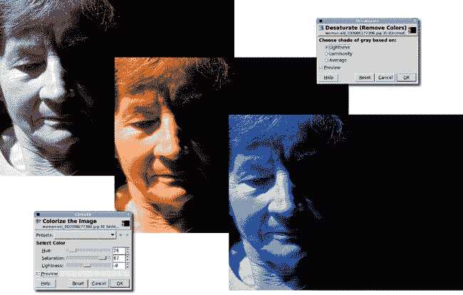

*去饱和的图像（如左侧所示）是饱和度设置为 0 的 RGB 图像。色调和亮度可以设置为任何值。彩色图像（中间和右侧）是通过改变所有三个设置得到的。*

# 由你决定

GIMP 为图形设计师提供了许多创造引人注目广告的方法。本章中的教程与其说是学习新技术，不如说是练习你已经学到的内容。本书其他部分的教程展示了如何创建 3D 图像和反射或增强色彩和照明。尝试将这些技术应用到库存照片上，你很快会发现，在富有创意的设计师手中，可能性是无限的。

# 4.1 创意文字设计

*有了 GIMP 的帮助，平凡变得不平凡。*

GIMP 首先是一个处理位图图像的工具。大多数桌面用户在处理他们的数码照片时会更倾向于使用 GIMP，但在处理文字时可能会选择其他工具，如 Inkscape 或 Scribus。然而，GIMP 在文字效果方面做得很好，这是人们可能认为只能通过那些矢量应用程序来完成的事情。

在这个教程中，我将向您展示我在一本设计杂志上偶然发现的一个小文字技巧。这个项目的目标是把图像映射到文字上，但保持原始图像的可识别性。在原始杂志文章中，这个过程是通过 Adobe InDesign，一个矢量布局工具来处理的。它使用框来对齐和布局中的对象进行巧妙处理。幸运的是，这个特定的效果用 GIMP 制作起来甚至比用 InDesign 还要简单。

这样的项目除了文字之外，还有重要的外围组成部分。这个设计需要一个具有足够色彩和对比度的源图像。没有色彩和对比度，图像中的形状通过文字将无法识别。

项目还需要一个合适的字体。字体应该是粗体且没有衬线的。衬线字体会使最终图像杂乱，在大多数情况下，即使使用衬线字体的粗体版本，也不会显示源图像的太多细节。衬线字体也可能使图像中的文字难以识别。

GIMP 的文字功能使得在几分钟内进行实际设计成为可能，只需一系列有限的步骤。在深入之前，先看看那些外围问题。

## 选择库存图片

要开始这个项目，从互联网上众多库存图片网站中选择一个合适的肖像。这个教程中的图片来自 BigStockPhoto.com。理想的图片应包括两个重要特征。第一个是纯色背景。多色或杂乱的背景在应用文字效果时会使图像的主题难以分离。

第二个重要的特征是色彩对比。全黑的照片虽然可行，但最终只会是充满阴影的文字。对于这个项目，我选择了一位穿着黑色连衣裙的女性，她有足够的肤色来提供一些色彩对比。稍后你将使用柔和的晕影来增强这种对比。

## 选择字体

这种效果最适合使用粗体、边缘直的字体（手写体字体即使加粗也无法很好地显示图片）。在这个教程中，我使用的是 ErgoeExtrabold Thin 字体，但任何无衬线粗体字体，如 Tahoma Bold，都足够使用。

1.  选择**文字**工具并打开工具选项对话框（**对话框**▸**工具选项**）。在对话框的底部附近有三个选项：缩进、行间距和字母间距。你不会使用缩进选项，但会使用其他两个。

1.  行间距设置行与行之间的空间。你想要减小这个值（到负值），以便文本行尽可能地靠近，而不重叠。

1.  字母间距仅设置字母之间的区域。这与字距调整类似，但并不完全相同。再次强调，这里的技术解释并不重要。你只想降低这个设置（也可以是负数），以减少字母之间的空间，越接近越好。

    

    *所有三个样本都设置为 51 像素。在 Windows 系统上，**Tahoma Bold**字体通常可用，在 Linux 系统下可以从 Wine 字体集合或互联网上的免费字体档案中获取。*

## 添加渐晕

现在你可以开始教程了。首先，添加一个柔和的渐晕。这会使最终图像更加多彩，同时保持女性的形状可识别。

1.  在主图层上方添加一个透明图层（**图层**▸**新建图层**），并将这个新图层命名为“渐晕”。

1.  从工具箱中选择**椭圆选择**工具，在画布上围绕女孩绘制一个椭圆形选择。然后通过**100 像素**对选择进行羽化（**选择**▸**羽化**）。

1.  从工具箱中点击前景色框打开的“更改前景色”对话框中选择一个暖色调，例如这里使用的**231**/**127**/**35**。

1.  从工具箱中选择**渐变**工具。在工具选项对话框中，将渐变设置为**前景到透明**，形状设置为**径向**。从选择的中心点击并拖动到选择顶部稍后位置。将渐晕图层的模式设置为**乘法**。

    

    *渐晕将为最终图像添加一抹颜色。尝试不同的颜色选择，看看它如何影响设计。*

1.  可以在这里添加一些噪点以产生艺术效果，但这一步是可选的。打开 HSV 噪点过滤器（**滤镜**▸**噪点**▸**HSV 噪点**），将保持度设置为**2**，饱和度设置为**255**，亮度设置为**255**。色调的默认设置应保持为**3**。通过点击**确定**应用此设置到渐晕图层。噪点将在选择区域内应用，并且仅应用于彩色像素，不透明像素不受影响。

1.  清除选择（**选择**▸**无**）并合并渐晕和背景图层（**图像**▸**合并图像**）。

    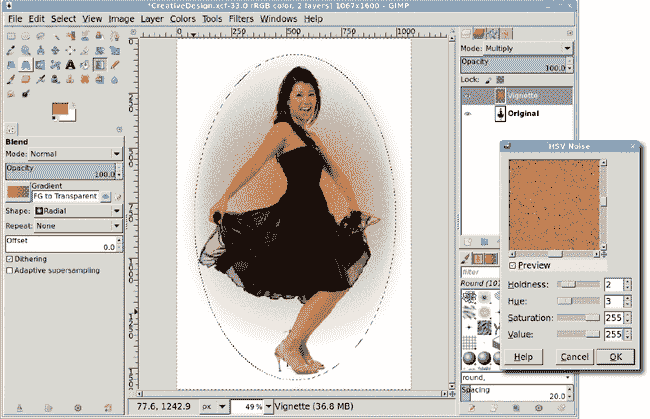

    *渐晕将为最终图像添加一些额外的颜色。添加噪点是可选的，并且可能不可见，这取决于字体的粗细。*

## 添加文本图层

本教程使用的文本可以来自任何来源。由于大部分文本将不可见，使用你期望阅读的文本没有帮助，尽管许多字母仍然可辨认。这里的文本是从 Lorem Ipsum Generator 生成的 1,500 个单词，格式化时没有换行，然后加载到文本编辑器窗口中。如果这还不够长，可以在第一块文本下方复制并粘贴它。

1.  在工具箱中通过在画布上输入**D**来重置默认颜色。从工具箱中选择**文本**工具，然后在图像中单击并拖动。这将在画布上显示编辑框，您可以在其中输入文本。拖动编辑框中的手柄，使其覆盖女孩和渐晕。在编辑框内单击并粘贴从浏览器复制的 Lorem Ipsum 文本。

1.  在工具选项对话框中，设置字体（这里使用 Ergoe Extrabold Thin），大小、行间距和字间距，如前所述。（在更改间距之前设置字体和大小。）您还希望文本为黑色，以便在画布上看到它。将行间距设置为**-12**，字间距设置为**-3**。这对于将字母在水平和垂直方向上推近彼此而不重叠是足够的，至少对于这个特定的字体和大小来说是这样。

    

    *最初文本可能与图像的其余部分不对齐，但可以使用对齐工具来修复这个问题。*

1.  拖动文本框手柄，使文本覆盖整个图像，使边界框大于画布。

1.  使用**对齐**工具将文本层与图像窗口的顶部和左侧对齐。

1.  使文本层适应图像窗口的大小（**图层**▸**图层到图像大小**）。

    

    *当画布缩小到一定程度时，文本层在视觉上比背景层大。这将为您找到合适的蒙版尺寸提供一些灵活性。*

## 创建蒙版层

现在您已经准备好创建蒙版了。与其他项目不同，您不会使用 GIMP 的图层蒙版功能。相反，这个蒙版只是一个覆盖在文本层上的白色图层。您将要做的就是粘贴一个带有文本的白色图层覆盖原始图像。在文本被戳出的地方，原始图像会显示出来。

1.  向图像添加一个白色图层（**图层**▸**图层新建**）并命名为*白色*。将此图层拖动到图层对话框中，位于带有穿黑色连衣裙的背景图层下方。也将文本层拖动到背景图层下方。

1.  在图层对话框中单击文本层以使其处于活动状态。创建文本的选择（**图层**▸**透明度**▸**Alpha 到透明度**）。反转选择（**选择**▸**反转**）。

1.  在图层对话框中单击**白色**图层以使其处于活动状态。复制选择（**编辑**▸**复制**）。粘贴副本（**编辑**▸**粘贴**）。这将在图层对话框中创建一个浮动选择。将其转换为新的图层（**图层**▸**转到新图层**）。

1.  通过单击图层缩略图左侧的“眼睛”图标来关闭文本层的可见性。

1.  在图层对话框中单击包含女性的原始图层以使其处于活动状态。从工具箱中选择**移动**工具。按住 SHIFT 键，在画布上单击并拖动以在蒙版下移动女性和渐晕。如果需要，放大以更仔细地查看结果。

    

    *这是最终图像，除了您可能想要调整蒙版在背景图像上的位置。*

## 进一步探索

在蒙版下移动源图像可能不足以获得高质量的成果。您可能需要调整文本层的字体大小或行间距或字母间距。您甚至可能需要尝试不同的字体。如果任何这些变得必要，首先关闭蒙版层的可见性，然后复制文本层。在文本层副本中调整字体设置。然后重复选择、反转、复制和粘贴过程以创建新的蒙版。保留多个文本层和蒙版版本让您可以比较蒙版并返回看起来最好的版本，而无需稍后重新创建它。

# 4.2 3-D 包装设计

*使用透视工具创建三维物体非常简单。*

有时候，广告需要包含一个您没有可用于拍照的 3-D 对象，例如产品包装。有许多方法可以使用 GIMP 来模拟三维效果。最常见的方法是使用投影来模拟光源并增加深度感。但是投影只将一个平面放置在另一个平面之上。它们不能为图像本身增加深度。

幸运的是，光和阴影并不是 GIMP 用户可用的唯一技巧。您还可以玩转透视。GIMP 工具箱中的透视工具提供了一个简单的界面，允许您改变观察对象的方向；例如，您可以选择正面观察图像或旋转它以从角度观察。如果您需要在设计中使用 3-D 包装，最好熟悉透视工具。

在本教程中，您将为一家虚构的手机制造商创建一个 3-D 产品包装。您将一组图像排列成盒子的前面和侧面，对齐侧面，然后将盒子角度调整到远离观众的位置。通常情况下，如果您明智地选择库存图像，您将节省大量时间。实际的布局和透视变化相对简单，这些技巧可以使库存图像栩栩如生。

此项目是为网络使用而缩放的，网络通常使用 98 ppi 的图像。为了在印刷项目中产生相同的效果，请将原始画布保持为 300 dpi，并相应地放大处理过程。

## 准备盒子的前面

1.  通过在工具箱中选择**文件**▸**新建**来打开一个新的画布窗口。在弹出的创建新图像对话框中，选择**US Letter**模板。选择此选项将更改高级选项部分中的设置。对于这个面向网络的工程，将分辨率更改为**98 ppi**。

1.  在画布中心添加一个垂直参考线（**图像**▸**参考线**▸**新建参考线（按百分比）**）。这将作为一个视觉提示，帮助将库存照片放置在画布的两侧。

1.  打开您的两张库存图片，并将每张图片的宽度缩放到大约 5 英寸——略大于新画布宽度的一半（**图像**▸**缩放图像**）。在这个例子中，我使用了一款老款手机的图片和某人使用手机的图片。

    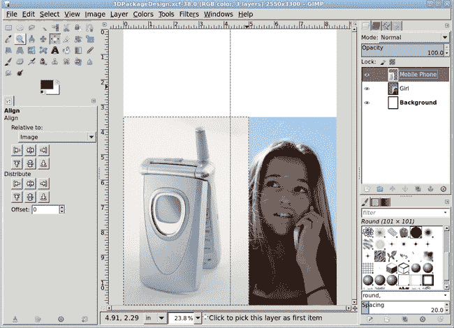

    *您可以在复制粘贴之前缩放库存图片，或者复制粘贴后再通过选择**图层**▸**缩放图层**来缩放新图层。使用您觉得更方便的方法，因为结果将是一样的。*

1.  在粘贴每张库存图片后，通过选择**图层**▸**新建图层**将每张库存图片作为新图层粘贴到画布上。将一个图层命名为*手机*，另一个图层命名为*女孩*。

1.  使用工具箱中的**对齐工具**将手机图层左对齐，并将女孩图层右对齐，都沿画布底部边缘对齐。要使用此工具，首先选择工具，然后在画布中单击图层。使用工具选项对话框中的箭头按钮，将图层相对于图像在正确的画布边缘对齐。

1.  在图层对话框中调整图层堆叠顺序，使手机图层位于顶部。如有必要，使用**移动工具**手动调整手机图层，使手机大致居中在画布的左半部分。

1.  在图层对话框中单击**手机**图层。

1.  添加一个白色图层蒙版（**图层**▸**蒙版**▸**添加图层蒙版**）。

1.  使用**矩形选择工具**创建一个选择，该选择位于参考线右侧，并包围女孩图层。

    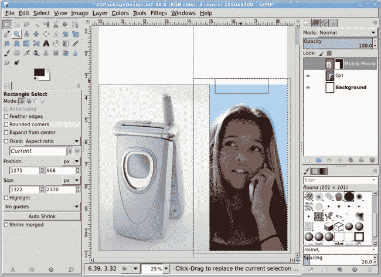

    *手机图层上的图层蒙版用于屏蔽掉与画布右半部分重叠的任何图层部分。*

1.  选择画布后，按**D**键将前景色和背景色分别重置为黑色和白色。

1.  通过单击蒙版并从工具箱中将前景色（黑色）拖入选择，确保移动手机图层的图层蒙版仍然处于活动状态。这将屏蔽掉与女孩图层重叠的部分。

1.  清除选择（**选择**▸**无**）。

1.  确保女孩图层现在可见，并根据需要将女孩的图像居中在画布的右半部分。

    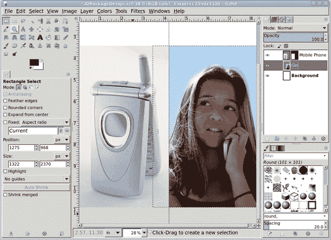

    *当女孩图层在图层对话框中处于活动状态时，该图层的左侧边缘被手机图层隐藏。没有必要修剪女孩图层的这部分，因为它永远不会被看到。*

### 注意

*检查图层边界在画布中是否为绿色而不是黄色，这是测试图层蒙版是否激活的另一种方法。*

## 创建修补

在这个阶段，我们需要移除女孩衬衫上的白色带子，因为它会分散注意力。（即使你为这个项目使用的图像不需要类似的修复，你可以在需要移除一些分散注意力的元素时使用这种技术。）虽然给带子上色是一个选择，但一个更简单的解决方案是克隆一些女孩的头发，并用它来覆盖带子。

### 注意

*有关更多克隆练习，请参阅 2.8 照片修复。*

1.  在修补女孩图层时，在图层对话框中关闭手机图层的可见性。点击**女孩**图层使其变为活动状态。

1.  放大图像，并使用**自由选择工具**在白色带子上绘制选择区域。使用**移动工具**，在工具选项对话框中切换到**选择**，将选择区域拖动到仅覆盖女孩头发。

1.  通过**3 像素**（**选择**▸**羽化**）羽化选择区域，然后将其复制并粘贴为新图层（**图层**▸**新建图层**）。

1.  在图层对话框中，将新图层向下移动到女孩图层上方，然后使用**移动工具**，在工具选项对话框中切换回**图层**，以定位新图层使其覆盖白色带子。

1.  添加一个白色图层蒙版，然后使用**喷枪工具**在修补区域上涂黑，并将新图层与原始图像混合。

1.  将修补图层与原始女孩图层合并（**图层**▸**向下合并**）。

1.  再次打开手机图层的可见性。

    

    *修补区域与女孩图层混合得如此之好，以至于很难被发现。*

## 在盒子前面添加文字

现在图像已经清理干净，你可以创建包装的上半部分，即包含产品文字的部分。

1.  点击**背景**图层使其变为活动状态。

1.  点击前景色框以打开更改前景色对话框。将 RGB 值设置为**6/6/155**以显示此处所示的蓝色，然后点击**确定**以应用更改。

1.  将前景色拖动到背景图层中，以添加一条贯穿盒子顶部的蓝色条。

    

    *产品名称将被放置在贯穿盒子顶部的蓝色条内。*

1.  从工具箱中选择 **文本** 工具。选择画布后，按 **D** 键然后按 **X** 键重置并交换前景色和背景色。为产品名称和描述选择合适的字体和大小——我使用了 90 像素的 Nimbus Roman No9 L Italic 字体。

1.  点击画布以打开文本编辑器窗口。输入虚构的制造商名称和型号编号，例如 *Nekioba VXS-1756*。

1.  使用 **移动** 工具手动居中文本层，然后添加另一个包含较小字体描述性文本的文本层。

1.  将此图像保存为 *front.xcf*，然后合并图像（**图像**▸**合并图像**）。将图像缩放到当前大小的 **80 百分比**。

    

    *使用较大的字体来显示制造商名称和型号编号。标语填充在下面的空白空间中。*

## 创建包装侧面

1.  打开一个新的图像，再次使用设置为 **98 ppi** 的 **US Letter** 模板。将此画布宽度缩小到 **3 英寸**，但高度保持为 11 英寸。

1.  点击前景色框并从预设中选择之前使用的蓝色，或设置 RGB 值为 **6/6/155**。关闭更改前景色对话框，然后将前景色拖放到新画布上。如果您喜欢，还可以在画布底部添加另一张库存照片。

    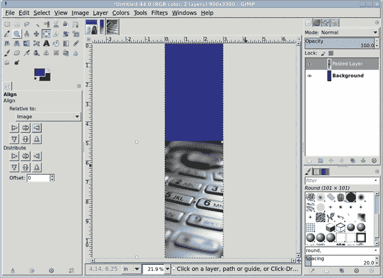

    *如果您添加了库存照片，将其缩放到新图像高度的一半略多，并使其底部边缘与图像窗口对齐。使用 Layer*▸*Layer to Image Size* 来裁剪库存照片层到图像窗口的大小。*

1.  选择画布后，按 **D** 键然后按 **X** 键将前景色重置为白色。

1.  从工具箱中选择 **文本** 工具。选择合适的字体和大小——我使用了 40 像素的 Nimbus Roman No9 L Italic 字体。重新输入包装正面出现的文本，或者如果您愿意，可以修改它。

1.  将文本层逆时针旋转 90 度（**图层**▸**变换**▸**旋转 90 度逆时针**），然后使用 **移动** 工具手动将文本定位在包装侧面的蓝色区域。

1.  将此图像保存为 *side.xcf*。

1.  合并图像（**图像**▸**合并图像**），然后将图像缩小到原始大小的 **80 百分比**。

    

    *首先创建包装侧面的文本，然后旋转文本。如果文本与空间不匹配，请按 CTRL-Z 撤销旋转，从工具箱中选择文本工具，点击文本层，在工具选项对话框中调整文本，然后再次旋转文本。*

## 合并前板和侧板

1.  选择工具箱后，按 **D** 键将背景色重置为白色。使用设置为 **98 ppi** 的 **US Letter** 模板创建一个新的白色画布。

1.  将前面和侧面图像复制并粘贴到画布上作为新图层（**图层**▸**转到新图层**）。分别将新图层命名为*前面*和*侧面*。

1.  从左侧边缘**3 英寸**（3 × 98 = 294 像素）处添加一个垂直参考线，然后从顶部**1 英寸**处添加一个水平参考线。

1.  点击**前面**图层，并使用**移动**工具将图层的左上边与参考线的交点对齐。点击**侧面**图层，并拖动以将图层的右上边与参考线的交点对齐。两个图像将垂直地适合在画布上。如果边缘溢出画布边缘，不要担心。只需按减号键缩小视图，以便更容易在画布上工作。

    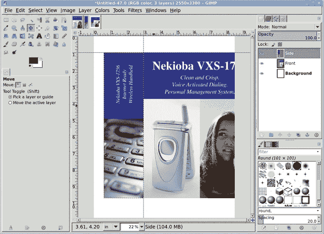

    *您也可以从标尺拖动参考线，但默认情况下标尺以像素为单位。您可以通过选择画布窗口左下角的下拉菜单来更改度量单位。*

1.  在**8 英寸**处添加另一个垂直参考线。这标志着盒子前右边缘将结束的位置。

1.  在“图层”对话框中点击**前面**图层使其变为活动状态。

1.  从工具箱中选择**透视**工具，然后点击画布。将前面图层右侧的顶部和底部控制点拖动到画布的水平中心，直到它们与 8 英寸处的垂直参考线对齐，并稍微向图像的垂直中心移动。在透视变换对话框中点击**变换**按钮以应用更改。

    

    *透视变换使得盒子的前面看起来在左侧更近，在右侧更远，就像盒子从观察者角度倾斜开去一样。*

1.  从画布的左侧边缘**1.5 英寸**处添加一个垂直参考线，以标记盒子左侧边缘将结束的位置。

1.  在“图层”对话框中点击**侧边**图层使其变为活动状态。

1.  从工具箱中选择**透视**工具，然后点击画布。将图像左侧的顶部和底部控制点拖动到画布的水平中心，直到它们与 1.5 英寸处的垂直参考线对齐，并稍微向图像的垂直中心移动。

    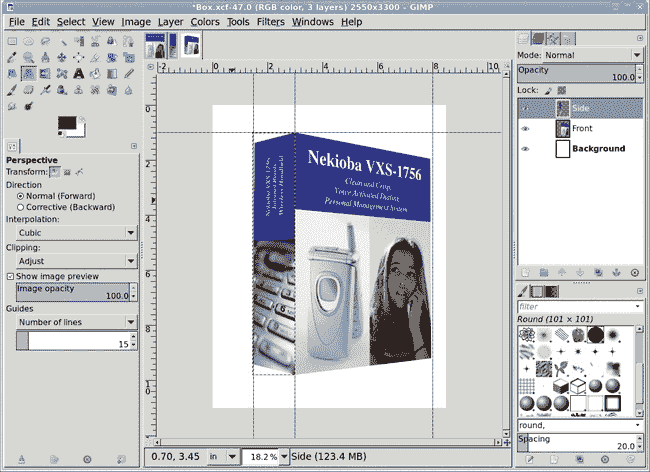

    *给侧面面板添加透视将平面图像转换为逼真的盒子。但我们还没有完成这个项目。*

## 清理边缘

1.  删除所有参考线（**图像**▸**参考线**▸**删除所有参考线**）。

1.  通过首先在“图层”对话框中点击较高的图层来合并**前面**和**侧面**图层（**图层**▸**合并向下**）。这将把前面和侧面面板合并为单个图层，并将合并后的图层与背景分开。

1.  添加阴影（**滤镜**▸**光与阴影**▸**阴影**），将偏移 X 值设置为**0 像素**，将偏移 Y 值设置为**12 像素**，以投射一个模拟光源直接在盒子前方和上方产生的阴影。不透明度应设置为**80%**，以便背景可以略微透过它。模糊半径取决于图像的大小。对于这个面向网络的图像，**15 像素**的模糊产生了一个非常柔和边缘的阴影。

    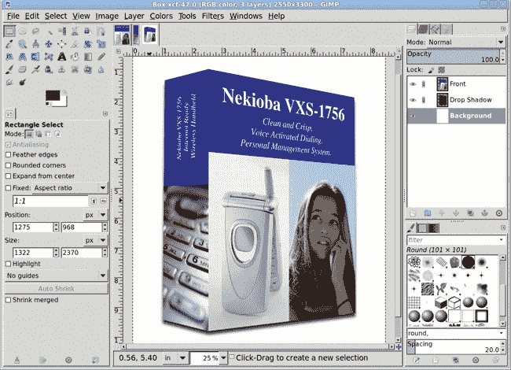

    *阴影可以使盒子看起来更加立体。*

## 进一步探索

在本书的第一版中，这个教程在透视变换后增加了清理锯齿边缘的额外步骤。GIMP 的最新版本不再有这个问题，这使得这个教程变得更加简单。

为了增强效果，考虑改变阴影的位置或添加额外的阴影，使光线看起来来自不同的方向。使用透视工具修改的矩形选择，填充黑色，然后将其放置在盒子后面，底部边缘紧密对齐，可以产生光源直接照射在盒子前面的外观，以及盒子放置在表面上的效果。调整侧面板的亮度是你在本项目中可以玩弄光线的另一个技巧。

# 4.3 反射玻璃

广告是一场名称游戏，注意力持续时间正在缩短。如果你想传达你的信息，你需要快速建立*谁*和*什么*。标志是公司身份的核心，它可以大大提高知名度。虽然标志设计本身通常很简单，但它们可以放置在其他物体附近或内部以增强效果。玻璃可以在很大程度上反映公司的身份。

玻璃效果实际上只是对光线和阴影的技巧。在之前的教程中，你使用了光线来模拟图像中的深度。阴影同样通过暗示主要主题后面或下面的另一个表面来提供深度感。反射也可以用来为表面增添纹理。在本教程中，你将学习如何使用反射来模拟一个圆润、光滑的表面。

这种技术很容易学习，但你可能需要实验以获得恰到好处的反射。技巧是从现有选择中创建剪影。注意本教程中路径的使用——当路径转换为选择时，路径的两个端点将连接起来，在本教程中，你希望这两点之间的线位于现有选择之外。

## 入门

为了确保正在使用默认颜色，在画布区域按**D**键重置前景色和背景色。从 640 × 480 像素的白色画布开始。本教程中使用的技术足够容易扩展，因此可以从小尺寸和 98 ppi 的画布开始工作，直到你得到正确的结果。

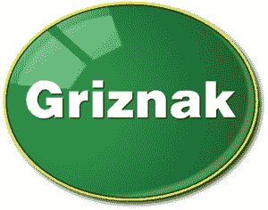

*反射表面可以为你的标志增添无可置疑的光泽。*

## 添加边框

1.  打开**新建辅助线**对话框（**图像**▸**辅助线**▸**新建辅助线**）。从方向下拉菜单中选择**垂直**，并将位置设置为**40 像素**。点击**确定**以添加辅助线。

1.  重复此过程，在**600 像素**处添加另一个垂直辅助线。然后从方向下拉菜单中选择**水平**，并添加**20 像素**和**460 像素**的辅助线。

1.  从工具箱中选择**椭圆选区**工具。从辅助线的左上角拖动到右下角，使选区接触每条辅助线。（选区应吸附到辅助线上。如果不行，请检查**视图**▸**吸附到辅助线**是否已设置。）

    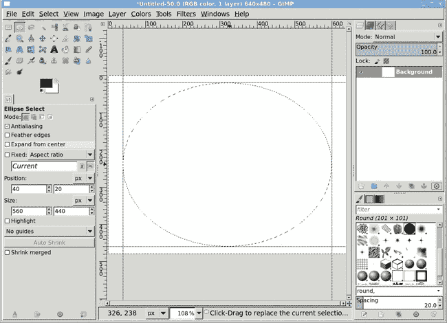

    *辅助线形成椭圆选择的边界框。由于辅助线位置精确，因此很容易将椭圆居中于画布上。*

1.  通过**选择**▸**羽化**将椭圆选区羽化**3 像素**。

1.  通过选择**图层**▸**新建图层**并将图层填充类型设置为**透明度**来添加一个新的透明图层。将新图层命名为*边框*。

1.  点击工具箱中的前景色框以打开更改前景色对话框。将 RGB 值设置为**243/217/1**以获得明亮的黄色。点击**确定**以设置前景色，然后从工具箱中将前景色拖动到选区。

1.  你不再需要辅助线，因此可以删除它们（**图像**▸**辅助线**▸**删除所有辅助线**）。

1.  通过选择**图层**▸**新建图层**并将图层填充类型设置为**透明度**来添加一个新的透明图层。将这个新图层命名为*边缘*。

1.  通过**选择**▸**缩小**将选区缩小**5 像素**。

1.  在选择画布时，按**D**键将前景色重置为黑色。将前景色拖动到选区中。

    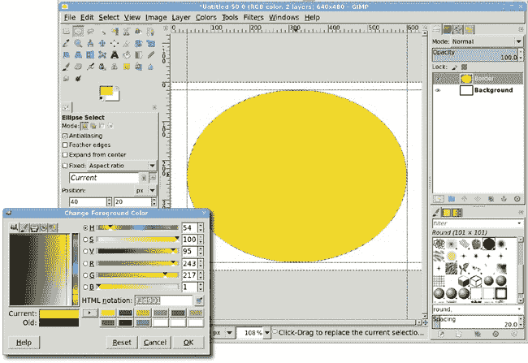

    *当你将前景色从工具箱拖动到选区时，你选择的黄色将填充新透明层中的选区。*

    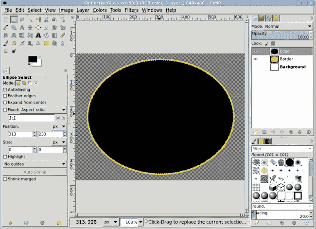

    *添加一个填充黑色的新图层不会改变黄色椭圆（此处以透明背景显示，以便更容易看到）。这允许你在完成本教程中的其余步骤后，通过修改黑色图层来对边框宽度进行细微调整。*

## 创建玻璃表面

现在您有一个边框，使用径向渐变在内部创建一个玻璃表面。

1.  通过选择**图层**▸**新建图层**并设置图层填充类型为**透明度**来添加一个新的透明图层。将这个新图层命名为*绿玻璃*，并确保它在图层对话框的图层堆栈顶部。

1.  通过**缩小 2 像素**（**选择**▸**缩小**）选择以在黄色边框和绿色玻璃之间留下细黑边。

1.  点击工具箱中的前景色框以再次打开更改前景色对话框。这次，将 RGB 值设置为**17/157/43**以设置渐变的亮绿色端，然后点击**确定**以应用更改。

1.  点击工具箱中的背景色框以打开更改背景色对话框。将 RGB 值设置为**0/85/16**以设置渐变的深绿色端，然后点击**确定**以应用更改。

    

    *两种绿色的色调非常相似，但背景色略暗。高对比度的颜色会产生一种表面，看起来更反光，或者看起来更接近一束强烈、紧密的光线。*

1.  选择**混合**工具。在工具选项对话框中，将渐变设置为**前景到背景（RGB**）并将形状设置为**径向**。

1.  从椭圆的左焦点（中心稍左）拖动到椭圆的右边缘。

    

    *稍微缩小选择并使用径向渐变填充它，可以模拟一个边缘看起来像在凸起的黄色边框阴影中的曲面。*

## 在右侧添加反射高光

渐变已经模拟了徽章表面的光照变化，但添加高光将使这种效果更加夸张。

1.  将选择保存到通道（**选择**▸**保存到通道**）。

1.  点击图层对话框中的**绿玻璃**图层以使其处于活动状态。

1.  添加一个名为*高光右侧*的新透明图层。

1.  按下**D**键重置前景和背景颜色，此时画布被选中。

1.  从工具箱中选择**椭圆选择**工具。在工具选项对话框中，点击从左数第三个按钮以选择**减去**模式。

1.  拖动覆盖现有选择以创建一个新的椭圆，覆盖除选择右下角和右侧边缘之外的所有部分。可能需要一点实验才能做到这一点。如果第一次尝试失败，请按 CTRL-Z 撤销更改并再次尝试。

    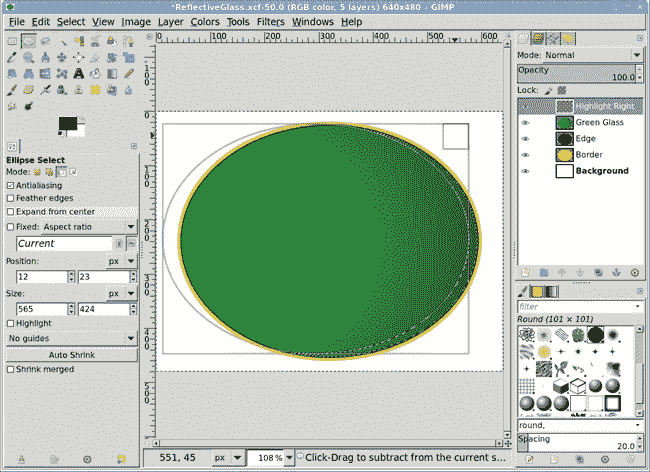

    *可能需要尝试几次才能从选择中制作出接近图中所示的选择。注意，在按回车键接受更改之前，可以交互式地编辑这个新选择。*

1.  一旦你将选择剪裁得恰到好处，将背景色框（应该是白色）从工具箱拖入选区。取消选择所有（CTRL-SHIFT-A）。

1.  打开高斯模糊滤镜（**滤镜**▸**模糊**▸**高斯模糊**）。将模糊半径设置为水平和垂直方向均为**10 像素**，然后点击**确定**应用模糊。

1.  将高光右图层的不透明度降低到**20%**。

1.  将椭圆选择工具的模式重置为**替换**。

    

    *白色区域被模糊化，然后降低该图层的不透明度。这立即使圆滑的表面看起来更像玻璃。*

## 在左侧添加反射高光

1.  添加一个新的透明图层，并将其命名为*高光左*。

1.  打开通道对话框（**窗口**▸**可停靠对话框**▸**通道**）。点击列表中的保存通道，它是最后一个项目。通过点击对话框右下角第二行的**通道到选区**按钮，将此通道转换为选区。

1.  返回图层对话框，并点击**高光左**图层使其变为活动状态。

1.  从工具箱中选择**路径**工具。在选区外点击，然后绘制一个类似于这里显示的路径。确保路径的第一个和最后一个锚点形成一条直线，位于现有选区之外。在按住 CTRL 和 SHIFT 键的同时，在工具选项对话框中点击**从路径选择**按钮。

    ### **注意**

    *如果你在处理路径时遇到困难，请查看 1.5 路径。*

    

    *按住 CTRL 和 SHIFT 键允许你使用路径工具创建与现有椭圆选区相交的多个选择。这些将成为圆滑表面上的额外反射。*

1.  在选择画布后，按**X**键交换前景色和背景色，并将前景色设置为白色。

1.  从工具箱中选择**混合**工具。在工具选项对话框中，将渐变设置为**前景色到透明**，并将形状设置为**线性**。从选择的左上角拖动到右下角。取消选择所有（CTRL-SHIFT-A）。

1.  打开高斯模糊滤镜（**滤镜**▸**模糊**▸**高斯模糊**）。应用**3 像素**的模糊，并将此图层的不透明度降低到**50%**。

1.  添加一个新的透明图层，并将其命名为*高光左 2*。

1.  如前所述，通过从保存的通道转换来检索选择，然后通过**20 像素**（**选择**▸**缩小**）来缩小选择。

    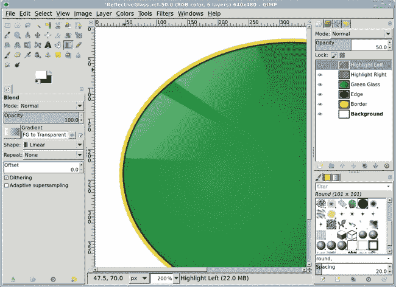

    *在你应用高斯模糊并降低高光左图层的不透明度后，物体的表面看起来像是在反射一个面板窗口。*

1.  点击**高光左 2**图层使其再次变为活动状态。

1.  如果前景色不是白色，请按**D**键然后按**X**键，然后将前景色框拖入选择区域以填充该颜色。取消全选（CTRL-SHIFT-A）。

1.  再次打开高斯模糊滤镜（**滤镜**▸**模糊**▸**高斯模糊**）并将模糊设置为**5 像素**。

1.  添加一个白色图层蒙版（**图层**▸**蒙版**▸**添加图层蒙版**）。

1.  打开路径对话框（**窗口**▸**可停靠对话框**▸**路径**）。应该存在一个未命名的路径，这是在教程早期使用路径工具时创建的。点击对话框底部的**将路径转换为选区**按钮（从左数第五个）。

1.  反转选择（**选择**▸**反转**）。

1.  点击**高光左 2**图层的图层蒙版以使其变为活动状态，然后使用黑色填充选择区域。取消全选（CTRL-SHIFT-A）。

1.  打开高斯模糊滤镜（**滤镜**▸**模糊**▸**高斯模糊**）并将模糊设置为**5 像素**。

    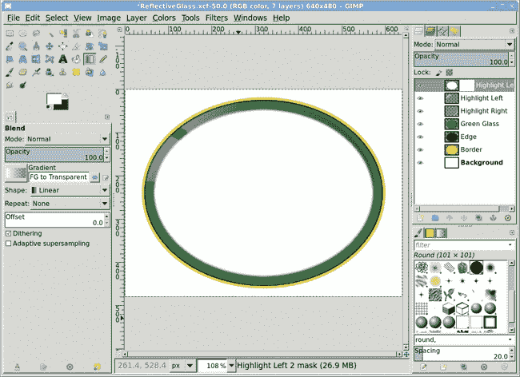

    *在下一步中，包含白色椭圆的图层将与高光左图层合并。*

1.  在图层对话框中，将图层模式设置为**颗粒合并**，并将不透明度设置为**50%**，然后将**高光左 2**图层拖到**高光左**图层下方。

    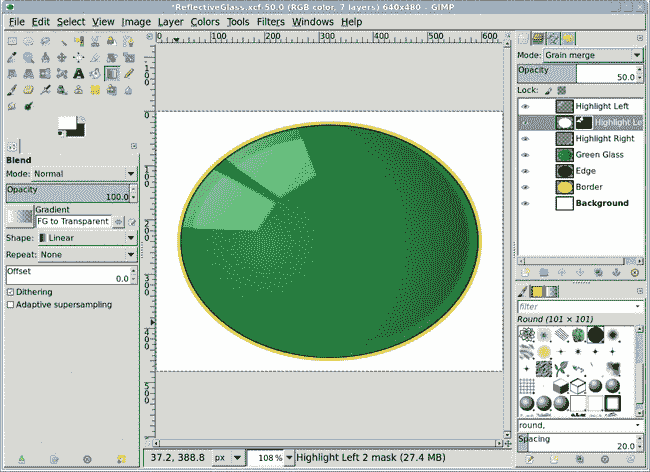

    *创建图层蒙版后，椭圆形高光剩下的只是与窗户形状高光重叠的区域。*

## 添加文本和投影

1.  在画布选择状态下，按**D**键然后按**X**键将前景色设置为白色。

1.  从工具箱中选择**文本**工具。在工具选项对话框中，选择合适的字体和大小。点击画布并输入***Griznak***。确保文本图层在图层对话框中位于顶部。

1.  使用**对齐**工具将文本在画布上居中。

1.  添加一个投影（**滤镜**▸**光照与阴影**▸**投影**）。将偏移 X 和偏移 Y 值设置为**2 像素**，并将模糊半径设置为**2 像素**。确保未勾选允许调整大小复选框。然后通过点击**确定**应用投影。

1.  在图层对话框中，将文本图层和投影图层移动到两个高光左图层下方。

    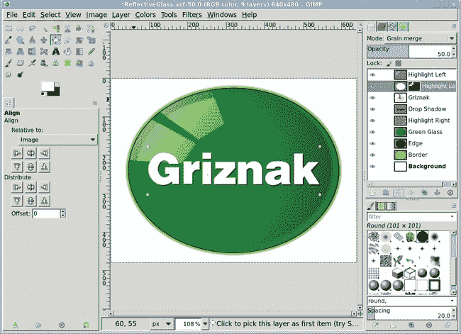

    *文本图层位于高光左图层下方，以便高光可以影响投影，从而产生文本位于玻璃下的外观。*

## 进一步探索

此效果与这种椭圆形徽章效果很好，尽管它同样适用于矩形徽章。关键是柔软的白色图层，这些图层模拟了光线的反射。这些可能是通过窗户进入的光线反射，也可能是附近表面的反射。

徽标也可以反映另一个物体，如 2.6 玻璃上的反射 和 2.7 湖面反射 中所示。想象这是一个汽车经销商的徽标，一条汽车在道路上飞驰的反射映照在其中。

# 4.4 弹出图像

*弹出* 是用来描述用白色填充图像背景的一部分，使图像的主题看起来像是从显示器或打印页面上弹出。广告广泛使用这种技术。它的工作原理与丝网印刷相似，只不过在弹出的情况下，屏幕是单色，并且其图层实际上位于图像主题和背景之间。

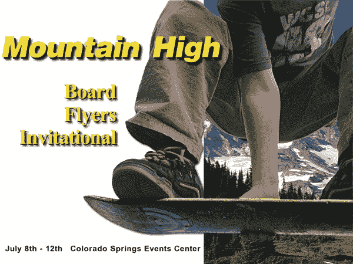

*这个极端教程将把你的 GIMP 技能提升到新的水平。革命性的！*

## 入门

在这个教程中，大部分工作涉及使用模糊选择工具来制作主题的剪影——在这个例子中，是一个没有轮子的滑板运动员。这个过程相对简单，因为背景和前景之间的对比度很高。按住 SHIFT 键，点击几次，你将能够快速选择背景。这可能不适用于你为这个项目决定使用的库存图像，但基本过程将保持不变。

## 隔离边界

从一张背景为蓝天的空中滑板运动员的图像开始。这张图像将被用来在科罗拉多州落基山脉地区宣传滑板邀请赛。原始图像中缺少的是关于活动将在哪里举行的指示。除了从图像中弹出边界外，我们还需要用山景替换蓝色天空。

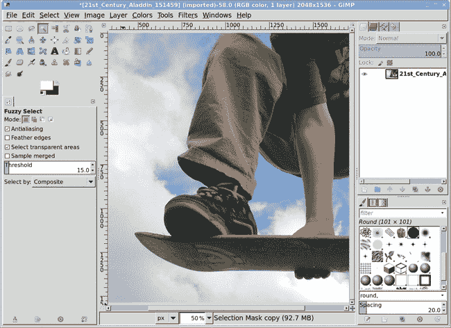

*背景中的蓝天使照片看起来很美，但在这个项目中需要被替换。*

1.  在 GIMP 中打开边界图像，并从工具箱中选择 **模糊选择**工具。按住 SHIFT 键，在边界左侧和下方点击，直到创建一个几乎实心的选择区域。使用 **快速蒙版**来微调选择。

1.  当整个边界左侧和下方的区域被选中后，关闭快速蒙版并反转选择（**选择**▸**反转**）。

1.  通过**1 像素**（**选择**▸**缩小**）缩小选择区域，并通过**2 像素**（**选择**▸**羽化**）进行羽化处理。

1.  将选择复制粘贴为新图层（**图层**▸**新建图层**）并命名为 *Boundary*。

1.  打开 Unsharp Mask 滤镜（**滤镜**▸**增强**▸**Unsharp Mask**）。将半径设置为 **5 像素**，数量设置为 **0.50**。点击 **确定** 应用更改。

    

    *在选择并复制粘贴到新图层后，Unsharp Mask 将增强 Border 图层的细节。*

## 增强画板细节

画板下的高光需要均匀分布，这样画板看起来就不会那么褪色。

1.  使用**模糊选择**和**快速蒙版**工具对画板的底部进行粗略选择。

1.  通过**1 像素**（**选择**▸**扩展**）扩展选择，重复此过程，直到画板下的大部分区域都被选中。

1.  通过**3 像素**（**选择**▸**羽化**）来羽化选择。

1.  使用**色阶**工具（**颜色**▸**色阶**）通过将直方图下最右侧的滑块稍微向左拖动，将最左侧的滑块向右拖动，并确保中间的滑块保持在中心位置来调整画板的白平衡。以这种方式调整黑白平衡将使画板的较暗区域变亮，并使画板下模糊的底部看起来更清晰。点击**确定**。

1.  取消全选（CTRL-SHIFT-A）。

    

    *由于照明问题，画板的底部看起来有些模糊。通过选择画板并移动色阶直方图中的左右滑块来修复这个问题。*

## 移除背景

我们已经隔离了画板边缘，但画板边缘和画板边缘两侧仍然有一些天空和云朵。这些区域需要被移除，以便我们可以替换落基山脉的背景。

1.  使用**模糊选择**工具选择画板边缘两侧的天空以及他右臂和每条腿之间的空间。

1.  通过**3 像素**（**选择**▸**羽化**）来羽化选择。

1.  添加一个白色图层蒙版（**图层**▸**蒙版**▸**添加图层蒙版**）并用黑色填充选择区域。取消全选（CTRL-SHIFT-A）。应用图层蒙版（**图层**▸**蒙版**▸**应用图层蒙版**）。

    

    *当我们隔离画板边缘时，我们在身体周围留下了一些天空和云朵的区域。使用模糊选择工具来隔离这些区域。*

1.  添加一个新的透明图层，并将其命名为*白色背景*。

1.  从左侧标尺拉出一个垂直参考线，直到它刚好位于画板边缘的右脚右侧。与其他教程不同，这个参考线的位置没有精确的像素位置。从工具箱中选择**矩形选择**工具——确保在工具选项对话框中设置了**替换**模式。使用参考线作为选择覆盖图层左侧的右边缘。用白色填充选择区域。

1.  将**白色背景**图层向下移动，使其在图层对话框中位于**画板边缘**图层下方。

1.  取消全选（CTRL-SHIFT-A），然后隐藏参考线（**视图**▸**显示参考线**）。

    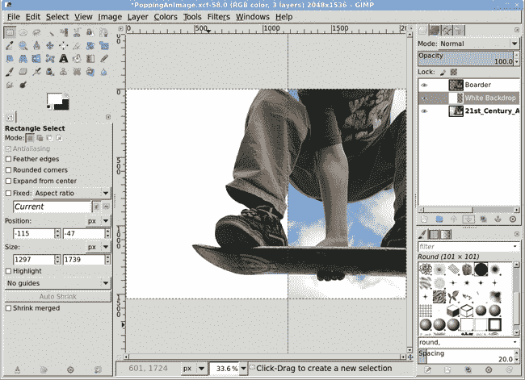

    *白色背景图层放置在画板边缘图层下方。这个细节使得画板边缘看起来像是从落基山脉场景中跳出来，进入白色海报区域。*

## 添加阴影

阴影增加了突出效果。

1.  在图层对话框中，点击**板边**图层使其变为活动状态。

1.  添加阴影（**滤镜**▸**光与阴影**▸**阴影**）。将偏移 X 和 Y 值设置为**5 像素**，将模糊半径设置为**15 像素**。将不透明度设置为**80%**并取消选中**允许调整大小**复选框。点击**确定**应用这些设置并创建阴影图层。

1.  在图层对话框中点击**阴影**图层。添加一个白色图层蒙版（**图层**▸**蒙版**▸**添加图层蒙版**）。

1.  在图层对话框中点击**白色背景**图层使其变为活动状态。通过选择**图层**▸**透明度**▸**Alpha 到选择**，然后选择**选择**▸**反转**来创建透明区域的选区。

1.  点击**阴影**图层蒙版使其变为活动状态。将工具箱中的前景色（应该是黑色）拖动到选择区域。这将隐藏除白色背景之外的所有阴影。

1.  取消全部选择（CTRL-SHIFT-A）。

    

    *阴影使得看起来板边和白色背景之间有一些距离。*

## 替换背景

我们希望广告中清楚地表明活动是在科罗拉多州的落基山脉地区举行的。让我们添加山脉作为背景图层。

1.  点击**板边**图层使其变为活动状态。

1.  打开一个合适的背景图像，例如这张落基山脉的图像。将图像复制并粘贴到一个新图层（**图层**▸**转到新图层**）并命名为*Mountain*。

1.  使用**缩放**工具调整图层大小，使其与画布大小一致，然后在图层对话框中将**Mountain**图层移动到**白色背景**图层下方。根据需要调整**Mountain**图层的位置。

1.  打开运动模糊滤镜（**滤镜**▸**模糊**▸**运动模糊**）。将模糊类型设置为**线性**，将长度设置为**5 像素**，将角度设置为**180 度**。点击**确定**将这些建议应用到 Mountain 图层。

    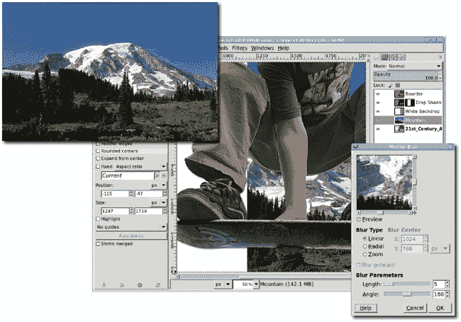

    *在移除天空背景后，用更适合项目的图像替换它。轻微的运动模糊为新的背景增加了深度，并确保山脉不会分散对板边的注意力。*

## 添加文字

是时候进行最后的润色了。让我们给海报添加文字。使用**文字**工具，用任何字体输入黑色文字。复制文字并将顶部版本的颜色设置为黄色。通过偏移几个像素来模拟深度。确保你的文字层位于图层堆栈的顶部，这样你就可以在图层蒙版和背景图像上看到它们。

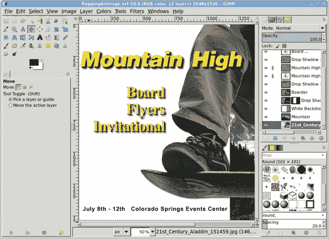

*如果你选择的字体和颜色使得文字难以阅读，你可能在板边的腿上添加一个阴影。*

## 进一步探索

这样的项目有时是最有趣的，因为它们并不特别困难。正如本书中描述的许多技术一样，难点在于创建好的选择，以隔离你想要的主题。对于具有许多曲线和边缘的对象，如这个画板的腿，快速蒙版工具是你的最佳选择。如果你试图隔离的对象边缘较直，且背景是单一颜色，你可以尝试使用剪刀工具。

# 4.5 闪亮徽章

无论你是在设计 T 恤、网站还是公司办公室的信头纸，你可能会使用某种识别符号。虽然印刷符号在纯色中通常更容易（且更便宜）创建，但为网络设计则提供了一定的灵活性。在网络中，颜色是王道，由于高分辨率、16M 色域的显示器已成为标准，三维效果也普遍存在。

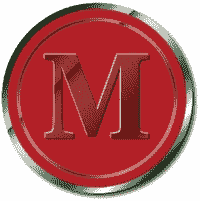

*即使是单个字母也能从反射技术中受益。*

符号在设计中扮演着重要的角色，它们可以成就或毁掉一个产品或公司的形象——在图形艺术行业中更广为人知的术语是*品牌标识*。符号本身可能是平面的和实心的，平面的和有纹理的，或者是三维的，带有光影效果。视觉标识是我们所知道的公司的象征——只需想想麦当劳的金拱门、Linux 的红帽或 IBM 的大蓝。

标志通常包括以特定字体设置的文本，通常伴随着代表公司、团体或个人的形状。作为整体品牌推广活动的一部分，标志有时会被嵌入到其他形状中，以创建徽章。

最容易创建的徽章之一是一个圆形、反光的标志，类似于玻璃。玻璃标志使用柔和的渐变，几乎看不到颗粒。许多白色椭圆形（或部分椭圆形）被分层放置在标志上，以模拟反射。有时这些圆形反射甚至带有明显的边缘，以模拟一个放置标志的框架。

创建金属标志甚至更容易。这种技术基于金属反射不像玻璃反射那么宽，并且在光与影之间有更多的高对比度区域。在金属标志的情况下，金属可能是焦点——就像腰带扣或胸针一样——或者你可能只是使用金属边缘来强调非金属设计，这正是本教程要做的。

## 入门

当你设计这些徽章时，检查现实世界中的物体，如玻璃按钮或银质勺子，会有所帮助。注意光和颜色的反射。一个技巧是稍微模糊你的眼睛——尝试在不专注于物体形状的情况下看到反射。然后尝试用 GIMP 重现这种效果。

添加反射性和颜色不仅为您的设计增添了风格，而且使用 GIMP 做起来也非常简单。在本教程中，您将在一个小的画布上工作，以展示该技术的简便性。请记住，位图图像——就像您在 GIMP 中创建的图像——不太容易放大到更大的尺寸，所以从更大的画布开始，如果需要更大的徽章，请放大*技术*。

## 创建金属边框

1.  在工具箱中选择时，按**D**键将前景色和背景色分别重置为黑色和白色。

1.  选择**文件**▸**新建**。在创建新图像对话框中，将尺寸设置为**500** × **500 像素**以创建一个正方形画布。点击**确定**以打开新的画布窗口。

    

    *正方形画布将更容易将圆形徽章居中。*

1.  创建一个新的透明图层（**图层**▸**新建图层**）并将其命名为*边框*。

1.  从工具箱中选择**椭圆选择**工具，并确保模式设置为**替换**。在画布上点击并拖动以创建一个圆形选择。在工具选项对话框中，将大小设置为**490** × **490**并将位置设置为**5** × **5**。在选择内部点击以接受这些设置。

1.  从工具箱中选择**混合**工具。在工具选项对话框中，选择**Crown Molding**渐变。从选择的左上角拖动到右下角。

1.  通过选择**图层**▸**新建图层**并设置图层填充类型为**透明度**来添加另一个新的透明图层。将新图层命名为*环颜色*。

1.  点击前景色框以更改前景色。在更改前景色对话框中，将 RGB 值设置为**0/159/0**以显示绿色，然后点击**确定**关闭对话框。圆形选择应该仍然处于活动状态，所以只需将前景色拖入选择即可。

1.  在图层对话框中，将模式设置为**柔光**并将不透明度设置为**50%**。

    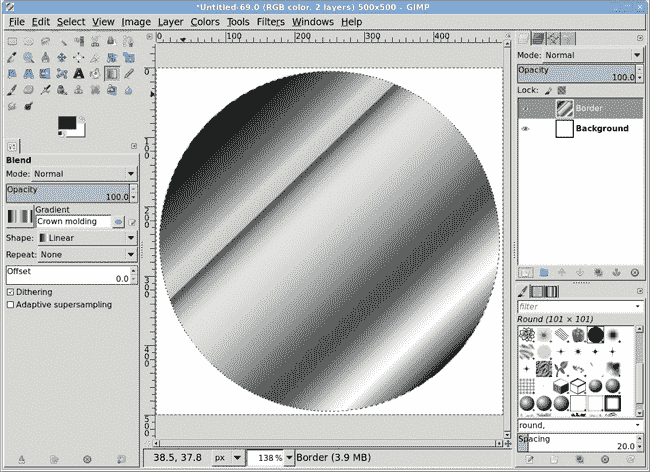

    *将 Crown Molding 渐变应用于其自己的图层中的选择。这提供了一个可以稍后添加投影的图层。*

    

    *使用柔光图层模式将彩色图层与填充了渐变的圆形选择混合。因为您使用了一个单独的颜色图层，所以只需更改该图层中的颜色即可更改图像的颜色。*

## 创建徽章

1.  通过选择**图层**▸**新建图层**并将图层填充类型设置为**透明度**来添加另一个新的透明图层。将这个新图层命名为*徽章颜色*。

1.  通过**选择**▸**缩小**将选择缩小**15 像素**，然后通过**选择**▸**羽化**将选择羽化**4 像素**。

1.  再次打开更改前景色对话框，将 RGB 值设置为**169/7/7**以显示红色，然后关闭对话框。将前景色拖动到选择中。

    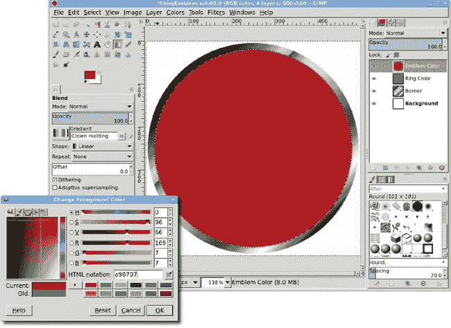

    *一个红色选择覆盖了背景图层中大部分的 Crown Molding 渐变。在渐变显示的地方，红色选择看起来有一个金属边框*。

## 添加内边框

到目前为止，你已经有了基本的金属标志。本教程的其余部分将展示如何使用这个基本形状进行创意设计。首先，添加轻微的刷金属效果。

1.  添加一个透明图层并将其命名为*刷金属*。

1.  打开 Hurl 滤镜（**滤镜**▸**噪声**▸**Hurl**）。将随机种子设置为**10**，随机化设置为**35%**，重复设置为**3 次**。点击**确定**将此应用到新图层。

1.  在图层对话框中设置模式为**屏幕**，不透明度为**50%**。

1.  打开高斯模糊滤镜（**滤镜**▸**模糊**▸**高斯模糊**）。水平和垂直方向都应用**2 像素**的模糊。

1.  打开运动模糊滤镜（**滤镜**▸**模糊**▸**运动模糊**）。将长度设置为**20 像素**，角度设置为**45 度**，然后点击**确定**应用模糊。

    

    *你将在 5.1 铬和金属文字中模拟刷金属效果，使用与这里相同的技巧*。

1.  添加一个透明图层并将其命名为*内环*。

1.  通过**选择**▸**缩小**将选择缩小**25 像素**。

1.  使用工具箱选择，按**D**键重置背景和前景颜色。通过将前景色拖动到选择中来填充选择为黑色。

1.  将选择缩小**4 像素**。

1.  按**CTRL-X**从内环图层中剪切选择，留下一个细小的黑色环。

1.  清除选择。

    

    *与外环不同，内环是通过从黑色圆圈中裁剪选择创建的*。

1.  打开高斯模糊滤镜（**滤镜**▸**模糊**▸**高斯模糊**）。将模糊半径设置为**5 像素**，然后将其应用于内环图层。

1.  通过选择**图层**▸**透明度**▸**alpha 到选择**从该图层创建一个选择。

1.  通过选择**图层**▸**蒙版**▸**添加图层蒙版**为标志颜色图层添加一个图层蒙版。在添加图层蒙版对话框中，点击**选择**单选按钮并勾选**反转蒙版**复选框。这将自动创建一个黑色环形状的蒙版。

    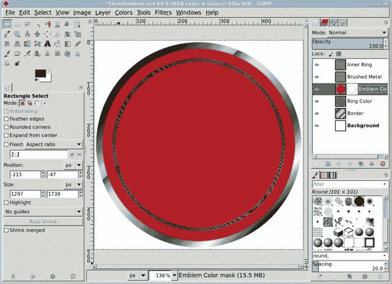

    *黑色环用作图层蒙版，并将其应用于标志图层*。

## 添加凸起文字

1.  点击**内环**图层并反转其颜色（**颜色**▸**反转**）。

1.  将其图层模式设置为**纹理提取**。清除选择。

1.  从工具箱中选择**文本**工具。在工具选项对话框中，选择一个大的粗体字体。本例使用了 Utopia Bold，大小为 310 像素。

1.  点击画布并输入一个大写字母*M*。使用**对齐**工具将文本图层在图像窗口中居中。

1.  复制文本图层（**图层**▸**复制图层**），然后通过选择**颜色**▸**反转**将其颜色反转成白色。将复制的图层命名为*白色轮廓*。

1.  选择**图层**▸**变换**▸**偏移**，并将偏移 X 和偏移 Y 值设置为**-2 像素**。

    

    *凸起的字母最初是徽章中心的一个实心黑色* M *。

1.  再次复制原始文本图层，将复制的图层命名为*黑色轮廓*。

1.  再次选择**图层**▸**变换**▸**偏移**，但将偏移 X 和偏移 Y 值设置为**2 像素**。

1.  在图层对话框中，将原始文本图层移动到白色轮廓和黑色轮廓图层之间。

1.  点击**白色轮廓**图层以使其变为活动状态。

1.  打开高斯模糊滤镜（**滤镜**▸**模糊**▸**高斯模糊**）并将**5 像素**的模糊效果应用于白色轮廓图层。

1.  将白色轮廓图层的大小设置为与图像大小匹配（**图层**▸**图层到图像大小**）。

1.  点击原始文本图层，通过选择**图层**▸**透明度**▸**alpha 到选区**来创建一个选区。

1.  再次点击**白色轮廓**图层以使其变为活动状态。

    

    *白色字母成为黑色字母的高光，使其看起来像字母是凸起的*。

1.  按下 CTRL-X 从白色轮廓图层剪切选区。

1.  点击**黑色轮廓**图层以使其变为活动状态，然后从该图层中剪切选区。

1.  将原始文本图层的模式设置为**叠加**，并将其不透明度设置为**66.7%**。

1.  将前景色的 RGB 值设置为**172/172/172**，以显示这里的红色。

1.  点击**徽章颜色**图层蒙版以使其变为活动状态。

1.  将前景色从工具箱拖动到选区中，然后取消全选（CTRL-SHIFT-A）。

    

    *通过从模糊和偏移的白色轮廓图层中剪切原始字母来创建一个白色边框*。

    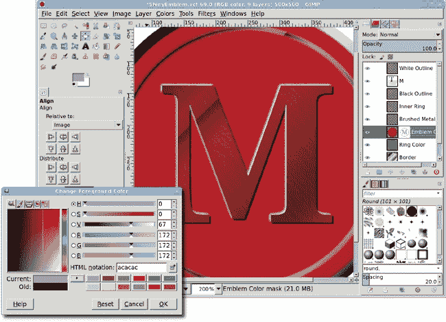

    *偏移的黑色阴影与白色高光一起工作，以完成凸起字母效果*。

## 进一步探索

一个曲线与徽章曲线相匹配的字母可能比这个有些普通的*M*看起来更令人印象深刻。您还可以将路径转换为选区以创建自己的曲线字母。如果您这样做，请记住保存选区，以便在创建白色高光和黑色阴影图层时可以召回它们。

# 4.6 葡萄酒瓶

到现在为止，你们都已经熟悉了如何使用 GIMP 来操作库存照片。但照片编辑只是故事的一半，就像没有酒的酒杯。要获得完整的故事，你需要酒瓶：使用 GIMP 的矢量工具从头开始创建的图形。

本教程展示了如何仅使用辅助线、网格和路径来绘制。辅助线是直线，允许你精确放置点、选择边界或简单地使用绘图工具进行追踪。路径是图像的矢量组件，可以随时编辑，使用控制点和拖动句柄来改变它们的形状。路径编辑不会立即影响图像窗口；你必须重新绘制路径或将它们转换为选择以在图像中使用。

路径对于绘图来说，就像图层对于照片编辑一样。你在单个路径图层中创建多个路径，然后创建多个路径图层来创建一个绘图。由于路径是可编辑的曲线，而不仅仅是直线，因此它们非常适合绘制漫画或其他类型的卡通。但路径不仅仅是卡通。你将使用它们作为 3-D 形状的基础。

*我们已经完成了表面反射。本教程使用该技术结合颜色来模拟通过瓶子的反射。*

本教程适用于新用户和有经验的 GIMP 用户，他们尚未涉足从头开始绘制的世界。你需要了解 GIMP 的窗口——工具箱、图像窗口和对话框——尽管我会在需要时提供菜单位置。你应该熟悉创建新图层并命名它们。

你将获得对如何完美对齐设计元素、如何最初不需要用彩色绘制图纸以及如何通过模拟光照实现 3-D 效果等内容的全面理解。

## 绘制瓶子形状

瓶子轮廓是通过使用路径绘制左半部分，然后复制并翻转以创建右半部分来创建的。辅助线用于精确对齐路径控制点。这部分绘制需要四个垂直和五个水平辅助线。

1.  从一个新的**800** × **600**图像窗口（**文件**▸**新建**）开始。配置网格（**图像**▸**配置网格**）为**10** × **10 像素**的间距和**交点（点）**的线型。然后启用“吸附到网格”功能（**视图**▸**吸附到网格**）。在编辑曲线时，网格也应可见（**视图**▸**显示网格**）。

1.  添加一个偏移量为 400 像素的垂直辅助线（**图像**▸**辅助线**▸**新建辅助线...**），这是画布宽度的一半。额外的垂直辅助线应定位在 320、340 和 370 像素处。水平辅助线应定位在 40、200、280、520 和 560 像素处。这些位置都是像素偏移。

    

    *辅助线将对瓶子的轮廓进行对齐，而网格则为你提供了精确放置路径控制点的能力。*

1.  从工具箱中选择 **路径** 工具。在工具选项对话框中，将编辑模式设置为 **设计**。在图像窗口中，点击以下引导交叉点（首先列出垂直引导）以放置路径控制点：400/40，370/40，370/200，320/280，320/520，340/560，400/560。这给出了一条直边轮廓，需要将其圆滑。

1.  在工具选项对话框中，将编辑模式设置为 **编辑**。点击并拖动控制点在 370/200 网格交叉点的两个网格点向上直行。这是指向此控制点的 *进入曲线* 的手柄，但您不需要它，所以只需将其移开。再次点击控制点，并向下拖动 *退出曲线* 的手柄 3 个网格点，并向左 1 个网格点。使用指定的拖动量重复以下网格交叉点的控制点：

    +   320/280: 进入处理向上 4 个网格点

    +   320/520: 出口处理向下 3 个网格点

    +   340/560: 进入处理向上 1 个和向左 2 个网格点

    

    *手柄按照以下顺序从控制点拖动：第一个手柄是来自前一个控制点的进入控制点的线，第二个手柄是离开控制点的线。您可能需要将第一个手柄拖出路径，才能编辑感兴趣的手柄*。

1.  在路径对话框中，点击路径名称将其重命名为 *左侧边框*。在工具选项对话框中，点击 **从路径选择**。

1.  在图层对话框中，添加一个透明图层（**图层**▸**新建图层**）并将其命名为 *瓶形*。在画布中输入 **D** 以重置前景色，然后使用黑色填充选区。

1.  复制选区（**编辑**▸**复制**）并将其粘贴（**编辑**▸**粘贴**）为新的图层（**图层**▸**新建图层**）。使用工具箱中的 **翻转** 工具翻转此复制的图层。使用 **移动** 工具，在图像窗口中点击并拖动以移动图层，使此图层中瓶子的左侧边缘与瓶形图层中瓶子的右侧边缘对齐。将复制的图层与瓶形图层合并（**图层**▸**合并向下**）。

    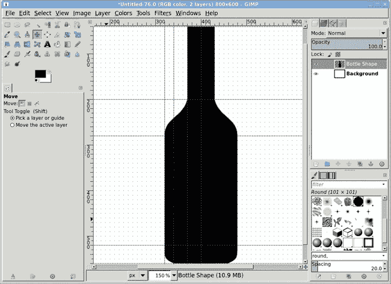

    *您还可以使用图层▸变换▸偏移指定 X 偏移量为 80 像素来精确放置复制的翻转图层*。

## 添加高光

通过添加一些以彩色填充和模糊的形式的照明效果，将瓶子渲染成 3D。高光需要六个选区：两个在瓶子的左侧和喉咙处将作为反射的白色光线，四个在右侧将模拟光线穿过瓶子及其内容。

1.  创建一个透明图层并命名为 *高光-左侧瓶子*。将其设置为图层对话框中的顶层。

1.  从工具箱中选择**矩形选择**工具。在图像窗口中拖动选择，从 340/280 的指南交叉点开始，拖动到 400/520 的指南交叉点。在工具选项对话框中，更改大小为**40** × **240**，位置为**350** × **280**。选择**圆角**选项，并将半径设置为**70%**。

1.  用白色填充矩形。移除选择（**选择**▸**无**）。应用**30 像素**的高斯模糊（**滤镜**▸**模糊**▸**高斯模糊**），在 X 和 Y 方向上都是**30 像素**。将此图层的透明度降低到**40%**。

1.  创建一个名为*高光-右侧瓶子*的透明图层。将其设置为图层堆栈的顶部。

1.  创建一个与之前相同的选择，但将位置设置为**420** × **280**。在工具箱中单击前景色框，并将 RGB 值分别设置为**198/31/31**。填充选择区域，然后移除它，但不要模糊。将图层透明度设置为**40%**。

1.  从工具箱中选择**椭圆选择**工具。从 340/200 的指南交叉点到 400/280 创建一个椭圆形选择。在工具选项对话框中，设置位置为**400** × **210**。

1.  从工具箱中选择**旋转**工具。在工具选项对话框中，将变换选项设置为**选择**。在图像窗口中单击，并在打开的旋转对话框中，将角度设置为**-40 度**，然后单击**旋转**按钮以旋转选择区域。

1.  将选择区域缩小（**选择**▸**缩小**）**10 像素**，并使用**5 像素**进行羽化（**选择**▸**羽化**）。用与上一个选择相同颜色的颜色填充选择区域，然后移除选择。最后，对图层应用**30 像素**的高斯模糊。

1.  添加一个名为*高光-喉咙*的透明图层。从 320/40 的指南交叉点向下拖动矩形选择到 340/200。在工具选项对话框中，更改选择的大小为**20** × **120**，位置为**380** × **60**。将选择圆角化，使用**5 像素**进行羽化，并用白色填充。移除选择。

1.  在同一图层上重复此选择，但将位置设置为**408** × **60**，大小设置为**15** × **90**。再次羽化并使用之前创建的右侧选择中的红色填充。移除选择。

1.  最后，通过**20 像素**模糊整个图层，并将透明度设置为**40%**。

    

    *白色和红色选择不完全相同，模拟瓶子玻璃形状和厚度的变化。*

## 制作带有金色镶边的白色标签

没有标签的酒瓶会是什么样子？至少是无聊的。这个瓶子的标签将再次使用参考线勾勒，但将使用一些新工具创建：渐变和 **Colorize** 对话框。标签将用多片金色装饰边缘。这些装饰的技巧将是创建多个不连续的选择，并一次性应用装饰填充和着色。

1.  创建一个名为 *White Label* 的透明图层并将其放置在图层堆栈顶部。在 200、480 和 600 像素偏移量处添加垂直参考线。在 340 和 410 处添加水平参考线。从工具箱中选择 **Rectangle Select** 工具，确保在工具选项对话框中禁用圆角选项，并从 320/280 的参考线交点拖动选择到 480/410。

1.  通过在画布上输入 **D** 重置前景和背景颜色。从工具箱中选择 **Gradient** 工具。在工具选项对话框中，将形状设置为 **Bi-linear**。将渐变设置为 **FG to BG (RGB**) 并点击 **Reverse** 按钮。在图像窗口中，从 370/340 左侧的参考线交点拖动到 200/340 的交点。清除选择。

    

    *从偏离中心的垂直参考线拖动，可以将标签上的光照移动以匹配之前创建的高光。*

1.  在图层堆栈顶部创建一个名为 *Gold Trim* 的透明图层。在 415、445、450 和 515 处添加水平参考线。使用 **Rectangle Select** 工具创建一个从 320/410 交点开始并向右拖动到 480/415 交点的选择。在工具选项对话框中，将模式设置为 **Add**（从左数第二个图标）。现在创建从 320/445 到 480/450 和 320/515 到 480/520 的选择。这创建了三个独立的选择。

1.  使用与 White Label 相同设置的 **Gradient** 工具，从 370 左侧的水平参考线拖动到 200 的参考线。打开 **Colorize** 对话框（**Colors**▸**Colorize**），将色调设置为 **50**，饱和度设置为 **86**，亮度设置为 **0** 并应用这些设置。最后，通过将输入级别中点值设置为 **0.25** 应用一个级别调整（**Colors**▸**Levels**）。清除选择。

    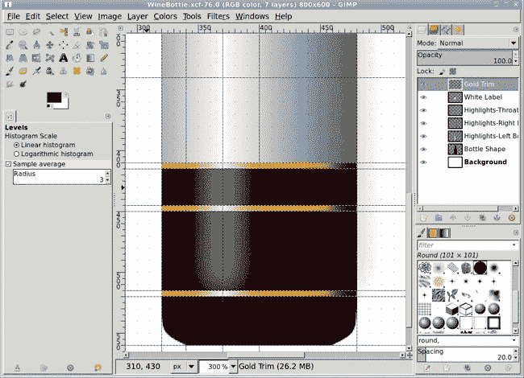

    *尝试创建一个更复杂的渐变，包含多个灰度级别，以使金色装饰看起来更精致。*

## 制作蓝色条纹和金色包装

标签上的一条粗蓝色条纹将增加颜色，同样，瓶颈周围的金色包装也会。这些将像白色标签和金色边缘一样制作。

1.  在图层堆栈顶部开始创建一个名为 *Blue Stripe* 的透明图层。使用 **Rectangular Select** 工具创建一个矩形选择区域（在工具选项对话框中设置模式为 **Replace**），从 320/450 的交点开始，向下并向右拖动到 480/515 的交点。

1.  从工具箱中选择**渐变工具**。选择**前景到背景（RGB）渐变**并确保**反转**按钮已设置。确保形状设置为**双线性**。从垂直引导线 370 开始，向左拖动到垂直引导线 200，在任意水平引导线上进行拖动。

1.  最后，使用**着色**对话框将标签涂成深蓝色。将色调设置为**200**，饱和度设置为**77**，亮度设置为**-30**。在**色阶**对话框中调整中点滑块至**0.25**。清除选择。

1.  在图层堆栈顶部创建一个名为*金包装*的透明图层。在 140 处添加一个水平引导线，在 390 和 430 处添加垂直引导线。创建一个选择，从 370/40 的交点开始，拖动到 430/140。使用与蓝色条纹相同的设置创建渐变，但这次从左到右拖动，从垂直引导线 390 到垂直引导线 480。使用**着色**，将色调、饱和度和亮度分别设置为**50**、**86**和**0**。通过调整此选择上的色阶来完成本教程的这一部分，将黑点设置为**175**，中点设置为**0.15**。

    

    *从引导线开始应用渐变可以使包装反射与瓶子颈部的反射对齐。*

## 进一步探索

这就是基本的瓶子。本教程的溅射图像通过添加瓶盖、文本和创意图形到标签上进一步扩展了这一点。瓶盖是通过更多的引导线以及与标签相同的选取和渐变过程创建的。图形是从库存图标书籍和库存照片中裁剪出来的，去饱和后与瓶子和标签混合。所有这些过程都是之前教程中已经学到的技术的扩展。只需尝试一下即可！

# 4.7 齿轮

使用 GIMP 的工作方式与使用木材的工作方式并不相似。如果你要制作一把椅子，你当然不会只用一块木头制作。你需要切割和塑造部件，然后逐个将它们组合在一起，直到得到最终产品。

复杂的 GIMP 项目也是以同样的方式创建的：通过将组件部分组合成一个统一的整体。你首先通过手工或从库存照片中制作图像片段，然后将它们作为图层组合到最终草稿中。在坐下来或更确切地说，将最终草稿挂在墙上之前，给草稿涂上一层清漆或其他“色彩校正”。也许使用 GIMP 并不完全像木工，但你应该明白了这个意思。

例如，如果你想在 GIMP 中创建一个手工机械时钟，你可能会从一个单独的齿轮开始，就像在本教程中将要创建的那样。这个齿轮可以被复制和重新排列，也可以在全新的项目中重复使用。

这个项目不需要任何外部库存照片或专业图形知识。无论你是 GIMP 大师还是刚开始使用 GIMP，都应该能够跟上。

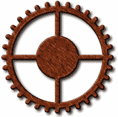

*这样的原始图形是通过简单的旋转和精确尺寸和位置的选择得到的。*

## 制作齿轮 cogs

齿轮边缘的小齿被称为*cogs*。你将从这个项目开始，围绕一个圆圈创建 32 个均匀分布的 cogs。稍后，你将用金属环连接这些 cogs，然后通过添加深度来使整个齿轮呈现出 3-D 效果。

cog 的制作过程非常简单，我会在你开始之前就解释它。你在一个单独的图层中创建一个正方形画布窗口顶部的单个 cog。然后复制图层并将其旋转 90 度。然后将副本与原始图层合并。重复一次，以在 12、3、6 和 9 点钟位置定位 cogs。然后重复此过程，但将旋转量减半。每次连续重复都将旋转量再减半。现在你可以看到这个过程是如何进行的。

1.  打开一个新的图像，并将宽度设置为**480 像素**，高度设置为**480 像素**。背景色应为白色，以便更容易看到你的操作。选择**图像**▸**参考线**▸**新建参考线（按百分比）**。添加一个水平参考线在**50%**和垂直参考线在**50%**。然后使用**图像**▸**参考线**▸**新建参考线**添加水平参考线在**10 像素**和**470 像素**。然后添加相同偏移量的垂直参考线。

1.  创建一个透明图层。将此图层命名为*Cogs*。从工具箱中选择**矩形选择**工具。在图像窗口中拖动一个矩形选择到任何位置。此时选择的大小和位置不重要；你将手动更改这些设置。

1.  在工具选项对话框中，将选择的大小设置为**20 像素**宽和**40 像素**高，位置设置为**230 像素**和**10 像素**。这将把 20 × 40 像素的选择放置在图像窗口的顶部中央。通过在工具选项对话框中点击**圆角**选项来为齿轮圆角。这将显示一个滑块来设置圆角半径。将滑块完全向右移动，将半径设置为**100.0**。

    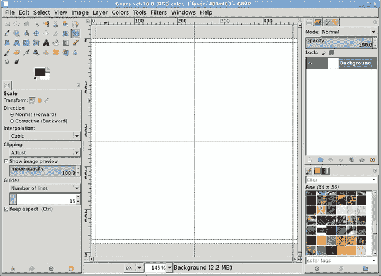

    *一个正方形的图像窗口将使旋转齿轮图层变得更容易。*

1.  点击工具箱中的前景色框，通过在 HTML 表示框中输入*808080*将前景色更改为灰色。点击**确定**，关闭对话框，然后将工具箱中的前景色框拖动到选择上。

1.  复制选择并将其粘贴到图像窗口中。将浮动选择转换为新的图层（**图层**▸**转换为新图层**）。将图层调整为与图像大小匹配（**图层**▸**图层到图像大小**）。

1.  将图层旋转 180 度（**图层**▸**变换**▸**旋转 180 度**）。注意，如果你没有将图层扩展到与图像大小匹配，旋转将会围绕齿轮的中心进行。相反，由于图层边界已扩展以匹配正方形图像窗口，你已将图层围绕图像窗口的中心旋转。结果是，复制的齿轮现在位于 6 点钟位置。

1.  将新图层与下面的图层合并（**图层**▸**向下合并**）。新图层将继承原始齿轮图层名称*Cogs*。

    

    *第一个齿轮位于 12 点钟位置，并水平对齐在图像窗口的中心。这种对齐将允许你在构建齿轮时精确地定位其余的齿轮。*

    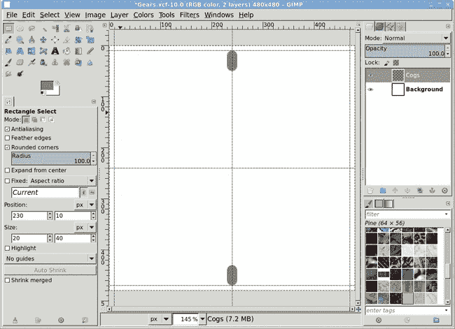

    *当合并两个图层时，新的合并图层将始终继承较低级别（如图层对话框所示）的图层名称。*

    创建了两个齿轮后，你只需通过复制现有的齿轮图层，旋转复制件适当的角度，然后再次合并两个齿轮图层，就可以简单地制作出其余的齿轮。

1.  复制齿轮图层。将此图层旋转 90 度（**图层**▸**变换**▸**顺时针旋转 90 度**）以添加 3 点钟和 9 点钟位置的齿轮。（对于这一步，你顺时针旋转还是逆时针旋转无关紧要。）将此图层与上一个图层合并。

    

    *每次旋转图层时，旋转量是前一次旋转量的一半。*

    如果你没有注意到，上一次 90 度的旋转是第一次旋转的一半。这种每次迭代减少旋转量一半的模式将一直持续到你拥有所有想要的齿轮。

1.  在放置了 4 个齿轮后，你通过复制图层，旋转 90/2 = 45 度，并合并图层来移动到 8 个齿轮。这里的技巧是，你不再有一个简单的菜单选项来选择“旋转 45 度”。相反，你选择**图层**▸**变换**▸**任意旋转**。打开的对话框中有一个标记为“角度”的输入字段。与使用滑块相比，直接输入数量（*45*）并点击**旋转**按钮更容易。别忘了合并图层。

1.  剩下两个旋转，它们遵循与上一步相同的流程。对于 16 个齿轮：复制图层，旋转 45/2 = **22.5 度**，然后合并图层。对于 32 个齿轮：复制图层，旋转 22.5/2 = **11.25 度**，然后合并图层。这就足够为这个齿轮提供足够的齿轮了。

1.  旋转对最终图层有副作用：其图层边界比图像窗口大。为了修复这个问题，再次选择**图层**▸**图层到图像大小**。

    

    *在 90 度旋转之后，你需要使用任意旋转对话框来设置旋转角度。最终的 32 个齿轮（左下角）应该均匀地分布在图像周围。*

## 创建外环

你齿轮设计的下一步是连接所有这些齿轮齿。通过创建一个实心圆盘并从中切割出一个内圆盘来创建一个环，在它自己的图层中。然后你可以将环和齿轮齿层合并。首先添加一个透明图层。将此图层命名为*外环*。

1.  从工具箱中选择**椭圆选择**工具。使用辅助线创建一个完美的椭圆形，使其正确地与齿轮的外边缘对齐。在图像窗口中，点击顶部和左侧辅助线的左上角交点，然后拖动到底部和右侧辅助线的右下角交点。由此创建的圆形选择完全覆盖了齿轮，因此减小选择区域的大小。齿轮的高度为 40 像素，所以减小选择区域的一半应该就足够了。选择**选择**▸**缩小**并设置大小为**20**。然后点击**确定**以缩小选择区域。

    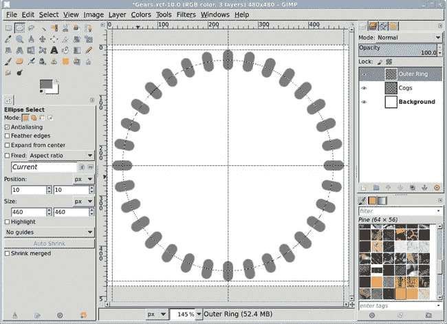

    *外环是连接齿轮齿的金属部分。齿轮当然不需要有外环和内圆盘。齿轮也可以是一个完整的金属块。*

1.  前景色应该仍然是你为齿轮使用的颜色，所以继续将其拖入选择区域。现在你想要从这个选择区域中切割出一个圆盘。记住齿轮的高度是 40 像素，所以外环至少需要 20 像素（20 + 我们第一次在选择区域中缩小的 20 像素 = 齿轮的内边缘）。给自己留一点额外的空间，将选择区域缩小**25 像素**。完成外环的最后一步是从现有的灰色圆盘中切割选择区域。到这一点，你可以将齿轮层与外环层合并。

    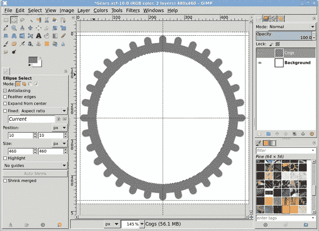

    *齿轮齿和外环已经完成，但这样的齿轮需要在一个东西上旋转，所以你将在设计中添加一个内圆盘。*

    接下来，你将在齿轮中添加一个内圆盘。记住，除了齿轮齿之外，齿轮的形状（内环和装饰）完全是艺术选择。为了磨练你的技能，你可以尝试复制一个真实的齿轮，直到最小的细节。或者，你可以在外环内创建不均匀的圆盘和杆形状。然而，对于你的第一个齿轮，保持简单，使用易于创建和复制的形状。

1.  你的齿轮的内盘从另一个椭圆选择开始。创建这个选择最简单的方法是选择齿轮图层外环内的透明区域。齿轮图层是活动的，所以首先从工具箱中选择**模糊选择**工具。在图像窗口内环内的区域中单击。这创建了一个跟随该环内部边缘的选择。添加一个透明图层，在其中创建内盘，并将图层命名为*内盘*。然而，你想要的盘比这个选择小得多。现在是时候做一点数学计算了。

1.  记住图像窗口是一个每边 480 像素的正方形。此外，你创建了一个高 40 像素的齿轮，垂直向下放置 10 像素（垂直）。这意味着齿轮的底部边缘距离图像窗口顶部 50 像素。图像窗口的垂直中心在 480/2 = 240 像素处。这意味着当前选择具有半径 240 - 50 = 190 像素（不包括创建外环时添加的 5 像素额外空间）。让我们将其减半到 95 像素，将选择缩小 **95 像素**，并用灰色填充它。清除选择。

    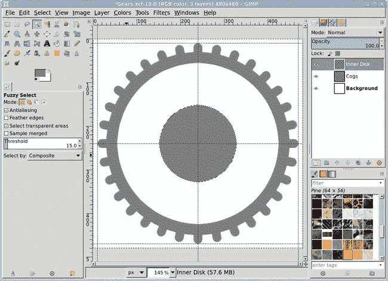

    *像这样的项目，使用方形图像窗口和旋转定位图形元素，通常需要一点数学知识。*

## 连接盘和环

1.  在合并内盘之前，你将在内盘和外环之间添加一些连接杆。你可以使用与创建原始齿轮类似的技术，手动调整选择的大小和位置以创建第一个杆，然后复制图层并旋转每个副本图层。

1.  从工具箱中选择**矩形选择**工具，并在画布上绘制一个初始选择。在工具选项对话框中，将大小设置为**20 像素**宽和**115 像素**高，并将位置设置为**230 像素**和**45 像素**。这将使选择位于外环和内盘之间的中央垂直引导线上。这次你可以禁用**圆角**选项（点击它以移除勾选标记）。添加一个名为*杆*的透明图层，然后从前景色填充选择。

    

    *连接杆是用与创建齿轮相同的过程创建的，尽管你只需要四个连接杆。*

1.  选择仍然有效，所以像处理原始 cog 一样复制并粘贴它。将浮动的选择（在粘贴时创建）转换为一个新的图层。将图层边界设置为图像大小。现在将粘贴的图层垂直翻转（**图层**▸**变换**▸**垂直翻转**）。合并两个杆图层。再次复制合并后的图层。将图层旋转 **90 度**。再次合并两个杆图层。最后，将杆图层与内盘图层合并，然后将内盘图层与齿轮图层合并。

这就是你的齿轮模板。现在你可以给它添加深度和纹理。

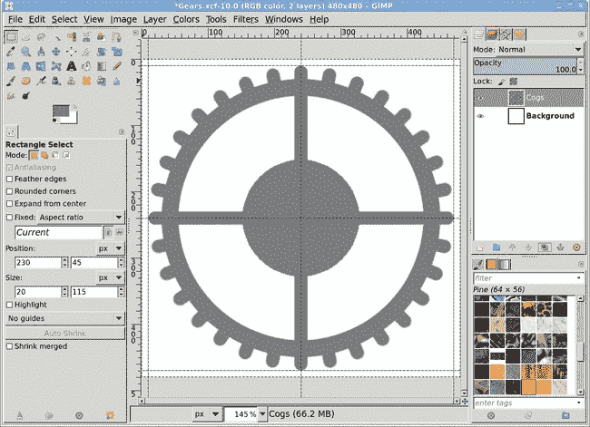

*基本齿轮形状足够简单。当你添加纹理和深度时，乐趣就开始了。*

## 添加深度和纹理

1.  复制齿轮层并将其命名为 *齿轮模糊*。

1.  水平垂直应用 **5 像素** 的 RLE 高斯模糊。在图层对话框中关闭模糊图层的可见性。

1.  选择 **齿轮** 图层。打开凹凸贴图滤镜（**滤镜**▸**映射**▸**凹凸贴图**）。将凹凸贴图选项设置为 **齿轮模糊** 图层。将方位角设置为 **135**，仰角设置为 **45**，深度设置为 **30**。点击 **确定** 应用这些设置。这将给齿轮图层一些深度。

    

    *三维效果很简单。只需模糊一下物品的副本，然后使用模糊版本作为凹凸贴图。*

1.  当 *齿轮* 层处于活动状态时，选择整个齿轮（**图层**▸**透明度**▸**alpha 到选择**）。创建一个透明图层并将其命名为 *噪声*。使用 RGB 噪声滤镜（**滤镜**▸**噪声**▸**RGB 噪声**）将噪声填充到选择区域。禁用 **独立噪声** 按钮，并将所有滑块移动到最左侧（将它们的值设置为 **0**），除了 Alpha 滑块，它应该被移动到最右侧。

1.  将运动模糊（**滤镜**▸**模糊**▸**运动模糊**）应用到噪声图层。将长度设置为 **10**，角度设置为 **45**。将此应用到 **噪声** 图层。将噪声图层与齿轮图层合并。打开着色对话框并选择一个合适的颜色为齿轮。清除选择（**选择**▸**无**）。

    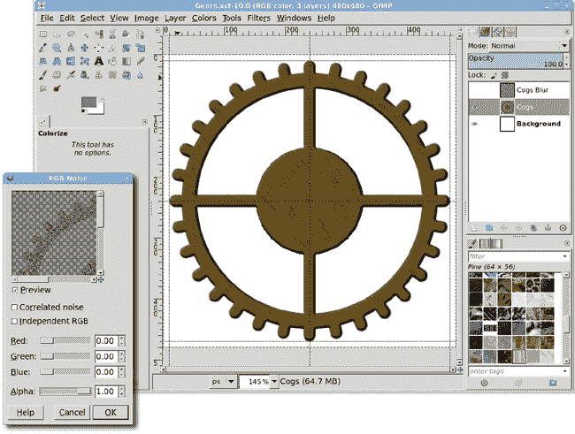

    *你可以尝试其他类型的纹理，如锈迹或闪亮的金属。这些只是对这里显示的刷金属效果的变体。*

## 进一步探索

你可以用这个教程尝试很多变体。尝试创建正方形齿轮并将它们放得更近一些（提示：你需要创建更多的齿轮）。你可以尝试的其他形状包括锯齿形，或者如果你真的很喜欢冒险，你可以尝试曲线齿轮。你还可以在连接齿轮的方式上发挥创意。与其使用环形和圆盘，你可能会尝试将齿轮连接到一个使用漩涡形状的环形，在这个教程中圆盘和杆子被使用。

对于齿轮设计的想法，尝试在互联网上搜索齿轮、时钟和手表。此外，剪贴画书籍有很多不寻常的形状可以用来替换连接杆和内部圆盘。

# 4.8 立方城市

如果上一个教程对你项目的需求来说有点过于艺术化，你可以转向库存图像，以获得更易识别的、如果说是二维的城市景观。或者你可以放弃高雅艺术，玩得更有趣一些。也许你需要一点卡通风格的东西。也许你需要的是立方城市。

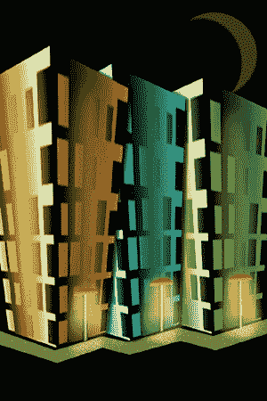

*使用 GIMP 实现卡通建筑是一个简单效果。*

在本教程中，您将从简单的 3-D 立方体创建三个建筑，然后稍微弯曲建筑以给设计增添卡通效果。整个图像只需几分钟就可以组合完成——一旦您熟悉了行业技巧。

该过程从生成一个单一的 3-D 立方体开始，该立方体被复制并拉伸以创建三个建筑中的每一个。尽管 GIMP 明显倾向于 2-D 艺术品，但创建立方体比看起来要容易得多。此设计以 250 ppi 创建，以产生 4 × 6 英寸的打印品。如果您想要更大的打印品，您需要创建一个更大的立方体。您可以将原始立方体缩小以制作较小的打印品，但这样做的话，建筑中的窗户将难以看清，因此最好从较小的立方体版本开始制作较小的打印品。

## 入门

打开一个新的透明画布（**文件**▸**新建**）**2 × 2 英寸**，**250 ppi**。此图像将用于创建主要项目中的 3-D 立方体。为了比较，请注意，如果您计划创建一个 420 × 300 像素的立方体城市，以 72 ppi 开始，您将从一个 60 × 60 像素的图层开始。

## 创建建筑的立面

1.  从工具箱中选择**混合**工具。在工具选项对话框中，将渐变设置为**前景到背景（RGB**）并将形状设置为**线性**。其余选项应设置为默认值。

1.  选择画布后，按**D**键重置默认的前景和背景颜色，然后从左到右在画布上水平拖动。

1.  通过设置宽度为**0.4 英寸**和高度为**0.33 英寸**创建一个 6 × 5 的网格（**图像**▸**配置网格**）。确保开启网格的可见性（**视图**▸**显示网格**）并启用对齐网格（**视图**▸**对齐到网格**）。如有必要，按 SHIFT-+键放大以更好地查看渐变层。点击**确定**。

    

    *建筑从渐变和网格开始，有助于勾勒窗户的轮廓。*

1.  通过选择**图层**▸**新建图层**并设置图层填充类型为**透明度**来添加一个新的透明图层。您将立即将其与背景合并，因此不要命名它。

1.  从工具箱中选择**矩形选择**工具。使用网格交叉点作为选择的角落，拖动以创建一个方形选择，该选择位于由网格创建的矩形内部，但不覆盖整个网格矩形。选择之间的额外空间是相邻窗户之间的墙壁。

1.  对这个立方体层内的大多数网格框重复此过程，留出一些空白。渐变右侧的选择在最终图像中会更明显，所以不要留空。在拖动或设置工具选项对话框中的模式为 **添加** 时按住 SHIFT 键。这将向现有选择中添加新的选择。这些选择不需要都是相同的大小。毕竟，这是一个卡通设计。

1.  在创建完所有选择后，再次点击 **混合** 工具使其激活。从右向左拖动层宽度以填充选择。取消全部选择（CTRL-SHIFT-A）。

1.  打开高斯模糊过滤器（**滤镜**▸**模糊**▸**高斯模糊**），将模糊半径设置为 **3 像素**，然后点击 **确定** 将模糊应用到窗户上。

1.  在图层对话框中，将图层模式设置为 **硬光** 并将此图层与背景图层合并（**图层**▸**向下合并**）。

1.  隐藏网格（**视图**▸**显示网格**）并禁用对齐到网格（**视图**▸**对齐到网格**）。

    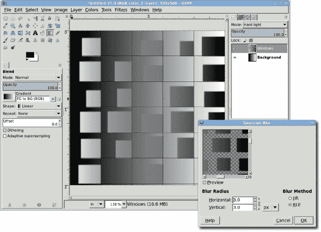

    *留出一些空白区域（没有窗户）会给卡通建筑的纹理增添一些变化。*

## 将脸部制作成立方体

1.  打开地图对象过滤器（**滤镜**▸**地图**▸**地图对象**）。从地图下拉菜单中选择 **盒子** 并勾选 **透明背景** 复选框。确保也勾选了 **启用抗锯齿** 复选框。

1.  在 **方向** 选项卡中，将 Y 旋转设置为 **45 度**。如果预览没有显示你的矩形转换成如这里所示的漂亮立方体，请检查 **盒子** 选项卡并确保每个侧面的下拉菜单中选对了正确的图层（立方体）。

1.  在 **盒子** 选项卡中，将 Y 滑块设置为 **0.75**，然后点击 **确定** 应用地图对象过滤器。

1.  选择整个画布（**选择**▸**全部**) 并按 CTRL-C 复制立方体。如果你愿意，然后可以关闭此图像以节省内存。

### 注意

*在继续之前，你应该将此图像（文件*▸*另存为）保存为 XCF 文件，这样你总是会有源立方体的副本用于未来的立方体城市项目。保存此类项目的子组件是常见的做法，随着时间的推移，这将帮助你建立一个适用于多个项目的组件库。*

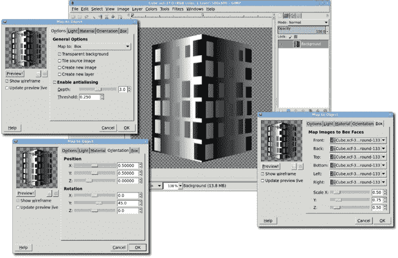

*地图对象过滤器简化了这个项目，因为它将单个建筑面转换成立方体，几乎瞬间就能得到一个建筑。*

## 乘以建筑

1.  打开一个新的画布，大小为 **4 × 6 英寸**，分辨率为 **250 ppi**。

1.  在选择工具箱后，按 **D** 重置前景和背景颜色，然后将前景颜色拖到画布上以填充画布为黑色。

1.  通过按 CTRL-V 并选择 **层**▸**转到新层**，将复制的立方体粘贴到黑色画布上作为新图层。

1.  从工具箱中选择**缩放**工具。点击立方体图层，向上拖动一点以使建筑变高。在缩放信息对话框中点击**缩放**按钮以应用更改。

1.  通过选择**图层**▸**复制**两次来复制此图层两次。将三个图层命名为*左侧*、*中间*和*右侧*。

1.  点击**左侧**图层使其变为活动状态，然后使用**移动**工具将其拖动到画布的左侧中心（如有必要，请按住 SHIFT 键）。然后点击**右侧**图层并将其移动到右侧中心。调整图层，使**左侧**图层与**中间**图层重叠，**中间**图层与**右侧**图层重叠。

    

    *从左侧的黑色到右侧的白色渐变，很好地模拟了每座建筑侧面的阴影区域。*

1.  从工具箱中选择**透视**工具。在图层对话框中，点击**左侧**图层使其变为活动状态。然后点击画布以显示图层周围的拖动点。将图层左上角和右上角的点向外拖动，使其远离图层中心。在透视变换信息对话框中，点击**变换**按钮以应用更改。

1.  对**右侧**和**中间**图层重复此过程。

1.  当所有三座建筑都完成时，使用**移动**工具调整图层，使建筑的底部边缘对齐。

    

    *改变建筑的透视可以使城市景观具有卡通效果。因为每座建筑的透视改变量不同，所以建筑并不完全相同。*

## 添加颜色

建筑应该有不同的颜色，但你不想颜色冲突。

1.  对于每个图层，打开**着色**对话框（**颜色**▸**着色**）。

1.  对于左侧图层，将色调设置为**33**，饱和度设置为**66**，亮度设置为**-15**。对于中间图层，将色调设置为**180**，饱和度设置为**60**，亮度设置为**-15**。对于右侧图层，将色调设置为**100**，饱和度设置为**50**，亮度设置为**-15**。

1.  在此阶段，你可以使用**锐化**滤镜或**USM 锐化**滤镜（**滤镜**▸**增强**）来减少在修改透视时引入的任何模糊。

    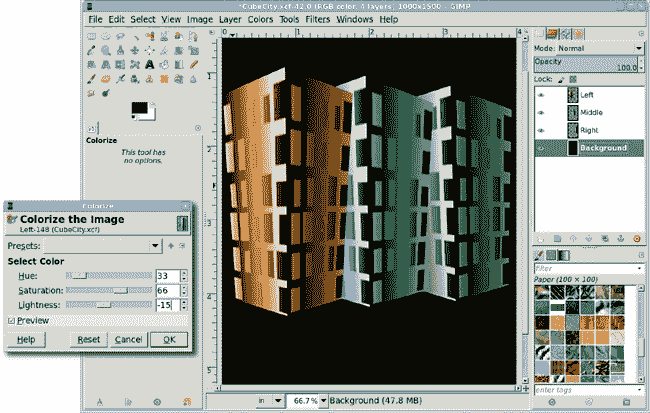

    *使用着色工具是给建筑添加颜色的最简单方法，尽管你也可以使用带有颜色或颗粒合并模式的桶填充工具。*

## 添加高光

1.  通过选择**滤镜**▸**光照与阴影**▸**阴影**，为左侧和中间图层添加阴影。将偏移 X 值设置为**15 像素**，偏移 Y 值设置为**3 像素**，并将模糊半径设置为**15 像素**。点击**确定**以应用阴影。

1.  点击前景色框以打开更改前景色对话框。将 RGB 值设置为**252/255/0**以显示此处所示的黄色，然后点击**确定**。

1.  点击**左侧**图层使其变为活动状态，复制图层（**图层**▸**复制图层**），并将新图层命名为*左侧黄色椭圆*。按 CTRL-A 然后按 CTRL-X 以清除图层内容。

1.  在图层对话框中，取消勾选如图所示的**锁定 Alpha 通道**框。

    

    *添加一个阴影可以使图像的深度更加明显*。

1.  从工具箱中选择**椭圆选择**工具，并使用它来在建筑的左侧创建一个椭圆形选择。

1.  通过**30 像素**（**选择**▸**羽化**）羽化选择，然后将前景色框拖入选择中，用黄色填充它。

1.  使用**移动**工具将选择拖动到建筑的右侧。将前景色框拖入新的选择中。取消选择所有（CTRL-SHIFT-A）。

1.  打开高斯模糊滤镜（**滤镜**▸**模糊**▸**高斯模糊**）并应用**60 像素**的模糊。

1.  将图层模式设置为**颗粒合并**，并将不透明度降低到**35%**。

1.  复制左侧黄色椭圆图层（**图层**▸**复制图层**）。将复制的图层命名为*中间黄色椭圆*。

1.  使用**移动**工具将**中间黄色椭圆**图层移动到中间建筑上，然后在图层对话框中将**中间黄色椭圆**图层移动到中间图层之上。对**右侧**图层重复此过程，将最后一个复制的图层命名为*右侧黄色椭圆*。

1.  调整黄色椭圆图层的**不透明度**和**图层模式**，如果需要，调整它们的大小以适应建筑。

    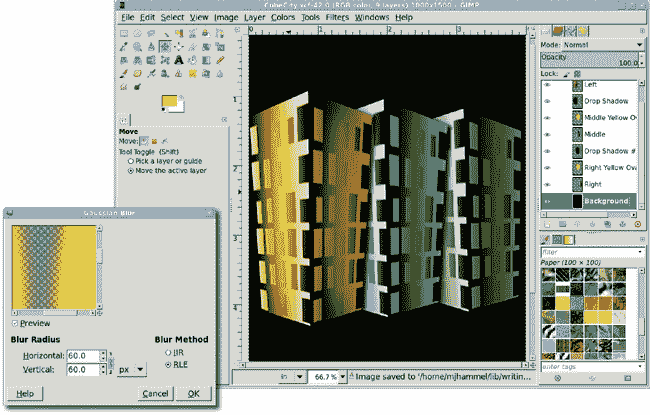

    *黄色高光增加了光感，尽管图像中没有路灯。毕竟，这是一个卡通*。

## 进一步探索

在 GIMP 中创建 3D 对象非常容易。正如你所看到的，这只是一个使用渐变和阴影与彩色高光混合的问题。

并且很容易将这个项目提升到下一个层次。本节的第一张图像显示了已经添加到城市景观中的人行道和一些街灯。可以从图标集中添加更多元素，粘贴到图像中，并着色。

# 4.9 水下

我们已经讨论了在广告中设置情绪对于传达你的信息是多么关键。在 4.6 瓶装酒中，你看到了光线如何从瓶子内外反射。

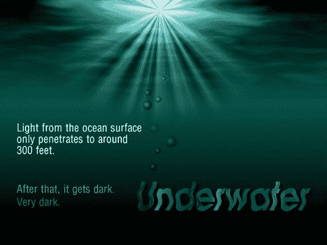

*这条广告的威胁信息通过一种模糊、水一样的效果得到了增强*。

我们可以前往的一个地方来设置一种神秘的氛围是水下。海底氛围是光减弱、视觉扭曲和表面颠倒的复杂混合。然而，在 GIMP 的世界里，水下领域却很容易创建。

在本节中，你将创建一个用于印刷广告的水下图像。产生这种效果并不特别困难，但要得到逼真的效果需要一些耐心和实验。如果你第一次尝试没有成功，请对实体噪声滤镜的设置进行细微调整，然后再次尝试。

## 开始

1.  打开一个大小为**1024 × 768 像素**的新画布。

1.  按**D**键然后按**X**键以重置并交换默认的前景和背景颜色。在工具箱中，单击前景颜色框以打开更改前景颜色对话框。将 RGB 值设置为**23/137/125**以显示此处的水绿色，然后单击**确定**。

1.  从工具箱中选择**混合**工具。在工具选项对话框中，将渐变设置为**前景到背景（RGB**），将形状设置为**线性**，并从重复下拉菜单中选择**无**。从画布窗口的顶部垂直拖动到底部。

1.  在图层对话框中，暂时关闭**背景**层的可见性。你将在创建去饱和波浪后再次打开它。

    

    *最浅的颜色在画布顶部，这样你添加到上方的波浪就会可见。*

## 创建波浪

你将首先使用实体噪声滤镜来生成波浪。在此滤镜中增加细节设置将增加图像某些部分的对比度，并将效果水平拉伸将有助于模拟水而不是云。

1.  通过选择**图层**▸**新建图层**并设置图层填充类型为**透明度**来添加一个新透明图层。将新图层命名为*表面*。

1.  打开实体噪声滤镜（**滤镜**▸**渲染**▸**云彩**▸**实体噪声**）。勾选**随机化**复选框，将细节设置为**5**，将 X 大小设置为**5**，将 Y 大小设置为**10**。单击**确定**以应用滤镜。

1.  重复此过程四次，创建四个新层，并确保在每个层上取消勾选并勾选**随机化**框，以便新的随机值改变每个渲染的形状。除了原始表面层外，将每个层的模式设置为**差异**。

    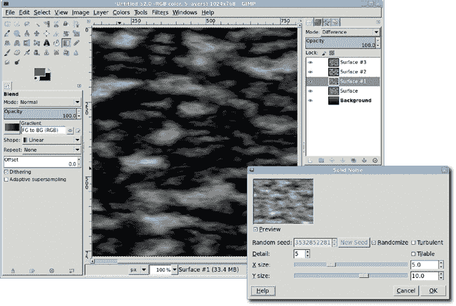

    *由于在实体噪声滤镜的对话框中勾选了随机化框，你的波浪可能不会完全像这样。你可能发现只需要一个噪声层就足够了，或者你可能需要 10 个噪声层。如果你没有得到你想要的外观，尝试选择不同的随机种子。*

1.  将可见图层合并为单个图层（**图像**▸**合并可见图层**）。将合并图层的模式设置为**颗粒合并**。

1.  打开**背景**层的可见性。

1.  如果需要，调整表面层的亮度和对比度以锐化或软化波浪的波峰和波谷之间的边缘（**颜色**▸**亮度-对比度**）。当鼠标在画布窗口中时，按减号（–）键以缩小视图。

1.  从工具箱中选择**透视**工具。点击画布以显示表面层四个角上的拖动点。向上拉动左下角和右下角，使其大约是画布高度的三分之一到一半。

1.  按照所示，将左上角点向左拖动，将右上角点向右拖动。在透视变换信息对话框中，点击**变换**按钮将这些建议应用到图层上。

1.  如果波浪看起来太小或太拥挤，使用**缩放**工具拉伸图层。完成此操作后，按 SHIFT-+键放大视图。

1.  在此阶段，你可以使用高斯模糊滤镜（**滤镜**▸**模糊**▸**高斯模糊**）应用**2 到 5 像素**的模糊。你也可以使用波纹滤镜（**滤镜**▸**扭曲**▸**波纹**）来添加扭曲。这些步骤都不是必需的——根据自己的判断来获得最佳效果。

1.  添加一个白色图层蒙版（**图层**▸**蒙版**▸**添加图层蒙版**）。

1.  按下**D**键然后按**X**键，在画布被选中时重置并交换默认的前景色和背景色。

1.  从工具箱中选择**混合**工具。在工具选项对话框中，使用你之前使用的相同设置。垂直拖动，从图层顶部和中间开始，直到接近图层底部。这将使表面层淡入背景，使其看起来像表面正在消失到远处。

1.  关闭图层边界（**视图**▸**图层边界**），以便更清楚地看到水下效果。这也是保存项目副本以供将来使用的好时机（**文件**▸**另存为**）。

    

    *使用透视工具拖动超过画布边缘不会对你造成任何损失，除非你保存为 XCF 格式。当你将文件导出为 TIFF、JPEG 或其他图像格式时，多余的部分不会被保存。*

    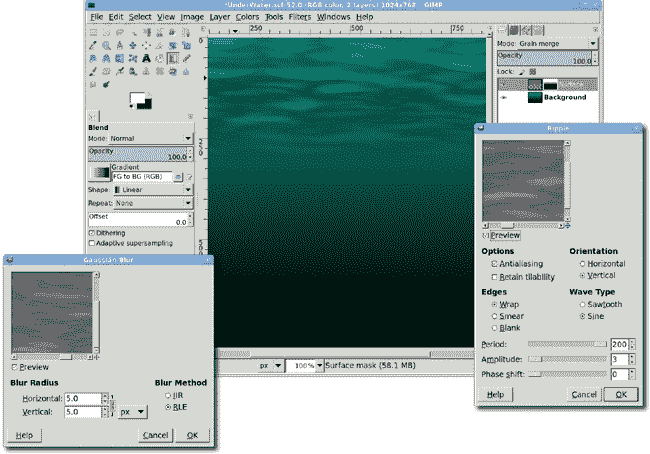

    *透视变化改变了表面层的尺寸。但没有蒙版，距离有一个明显的边缘。*

## 添加漫射光

现在是时候添加一个出现在水面之上的光源了。

1.  通过选择**图层**▸**新建图层**并设置图层填充类型为**透明度**来添加一个新图层。将图层命名为*光源*。

1.  再次从工具箱中选择**混合**工具。将渐变设置为**前景到背景（RGB**），将形状设置为**径向**，并从重复下拉菜单中选择**无**。点击画布中间附近的上部，并向下拖动至画布大约一半的位置。

    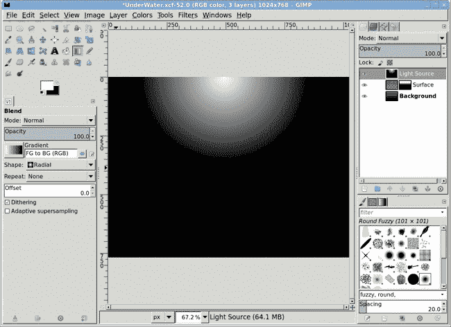

    *选择从白色到黑色的径向形状是创建球体的一种简单方法。在这种情况下，你正在创建一个辐射光源。*

1.  向此图层添加一个白色图层蒙版（**图层**▸**蒙版**▸**添加图层蒙版**）。

1.  在**Blend**工具仍然激活的状态下，在工具选项对话框中将形状设置为**Linear**。然后从画布顶部垂直拖动到中间。

1.  将此层的模式设置为**Grain Merge**。图层中的黑色会使波浪变暗一些，但白色也会使其中一些波浪变亮——整体呈现出夜间水下场景的效果。

    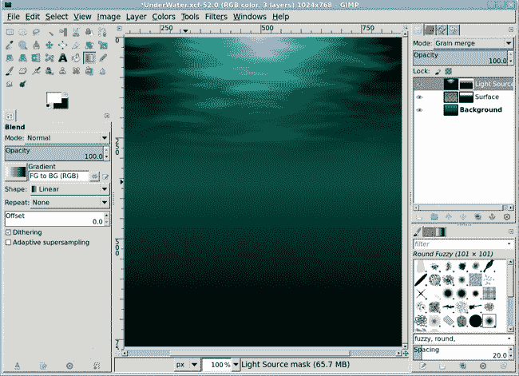

    *图层蒙版可以防止光线超出一定深度。*

## 添加光线

现在你可以真正让这个场景发光了。

1.  点击**Background**图层使其变为活动图层。

1.  从工具箱中选择**Rectangle Select**工具。通过画布的上半部分拖动以创建一个方形选择。选择应覆盖整个光源。

1.  复制并粘贴选择的内容，然后选择**Layer**▸**To New Layer**以将粘贴的选择制作成新图层。将其命名为*Light Rays*。你不会使用复制的图层内容，但这是一种创建适当大小图层的简单方法。确保图层边界是可见的（**View**▸**Layer Boundary**）。

1.  再次选择**Blend**工具。这次将渐变设置为**Flare Rays Size 1**，将形状设置为**Bi-linear**，并从重复下拉菜单中选择**Sawtooth wave**。从新图层的中间三分之一处水平从左向右拖动。

    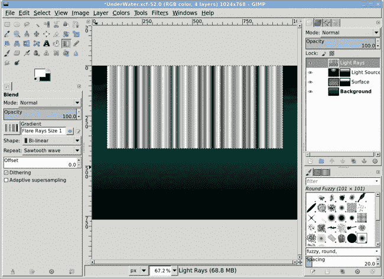

    *Flare Rays 渐变与 Crown Molding 渐变类似，不过 Flare Rays 渐变中光暗的垂直色调更接近。*

1.  打开极坐标滤镜（**Filters**▸**Distorts**▸**Polar Coordinates**）。将圆的深度设置为**0**%，并调整**Offset angle**，以便原始图层边缘的最明显线条（如果有）位于预览的底部。应勾选**To polar**和**Map from top**复选框，但**Map backwards**复选框应保持未勾选。点击**OK**以应用滤镜。

1.  从工具箱中选择**Scale**工具。点击画布以显示图层角落的拖动点。在图层底部附近点击并向下拖动，直到中心拖动点与原始图层的底部对齐，如图所示。将两侧向外拖动，直到达到画布边缘。在此阶段，缩放不需要非常精确。点击中心拖动点并将其向上移动到画布顶部中央附近。在对话框中点击**Scale**以应用缩放更改。

    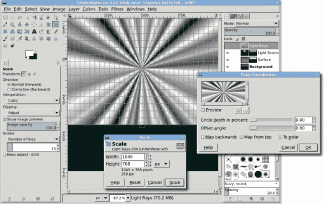

    *这些放射线的中心点应移动到画布的顶部中央。这确保了线条看起来是从你之前创建的光源辐射出来的。*

1.  添加一个白色图层蒙版（**Layer**▸**Mask**▸**Add Layer Mask**）。然后按**D**键然后按**X**键以重置并交换默认的前景色和背景色。

1.  从工具箱中选择**混合**工具。在工具选项对话框中，将渐变设置为**前景到背景（RGB）**，将形状设置为**径向**，并从重复下拉菜单中选择**无**。从画布顶部拖动到中间，将光束与背景混合。

1.  通过将光束层模式设置为**颗粒合并**，将此层与背景层混合。

    

    *将光束层模式设置为颗粒合并，将光区与背景层混合。图层蒙版导致光线随着距离光源的增大而变淡*。

## 增强光线

1.  通过选择**图层**▸**新建图层**并设置图层填充类型为**透明**来添加一个新透明层。将此新图层命名为*日光*。

1.  **混合**工具应仍然处于活动状态。在工具选项对话框中，将渐变更改为**前景到透明**，但保留其他设置不变。点击画布的顶部中心，向下拖动至画布的四分之一到三分之一处。将图层模式设置为**颗粒合并**。

1.  如果光源仍然太暗，则复制此层（**图层**▸**复制**）。如果使用这两个层的颗粒合并设置无法产生您想要的效果，尝试将图层模式更改为柔光或叠加。

    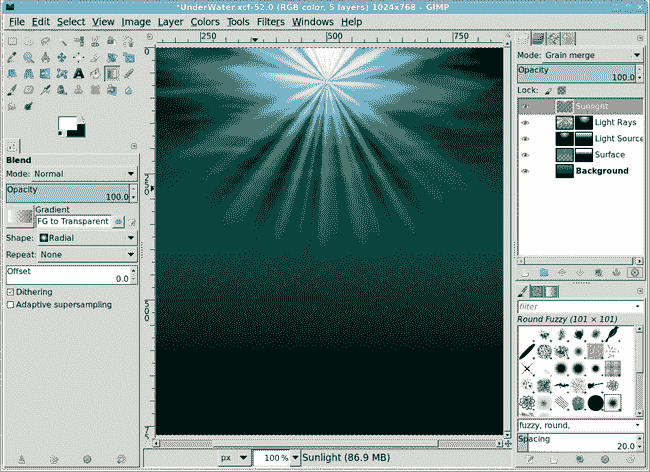

    *由于图层模式设置为颗粒合并，额外的光源与光束和背景层合并。不要害怕尝试不同的图层模式，以找到最适合您项目效果的模式*。

## 进一步探索

通过改变水的颜色或其上方光源的位置，可以实现此效果的多种变化，但真正让您的海洋生动起来的还是您在水面以下添加的内容。如果您愿意，可以通过在光束层上应用高斯模糊滤镜（**滤镜**▸**模糊**▸**高斯模糊**）和涟漪滤镜（**滤镜**▸**扭曲**▸**涟漪**）来对最终图像进行实验。这两个滤镜都将有助于柔化光束。您甚至可以添加一个文字层，如本节第一张图片所示，或者剪切并粘贴一些海洋生物到场景中，以完成项目。为了特别的效果，寻找包含气泡的库存画笔、图像或字体！

# 4.10 色彩照明

不论是在肖像工作室还是在 GIMP 中工作，色彩照明效果可以设定氛围。不同的颜色可以唤起不同的感觉——蓝色是凉爽的，红色是温暖的，黄色为晴朗的一天营造舞台，绿色让人想到春天。

色彩照明可以应用于光线指向主体而不是背景。但为了达到最戏剧性的效果，色彩照明应该是环境照明。它应该应用于房间、背景，甚至是主体周围的露天空间。

数字彩色光照效果是通过径向渐变和各种图层模式创建的。最合适的库存图像具有明显的左右两侧。这允许你在两侧模拟光源，而不会重叠。

在这个教程中，你将在不使原始图像褪色的前提下，为工作室人像添加彩色光照。你添加的彩色光照将与模特的原始肤色混合。

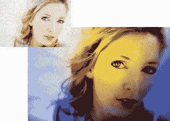

*黄色和蓝色色调可以增强模型的肤色、发色和眼色。*

## 入门

1.  在 GIMP 中打开原始图像文件。在这个例子中，图像非常明亮，添加彩色光照只会使其更亮。

1.  首先，使用**颜色**▸**层级**对话框来降低亮度。将黑色点移动到大约三分之一的右侧，将灰色点移动到更右侧，然后点击**确定**应用层级更改。并非所有图像都需要这种调整，对于一些图像，使用曲线或亮度-对比度工具可能会得到更好的效果。

    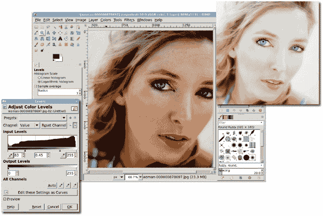

    *降低层级直方图的中点将使图像变暗，同时保持对比度较高。*

## 添加冷光

你可能想通过添加冷光和暖光来增强这张图片，先从冷光开始。

1.  通过选择**图层**▸**新建图层**并设置图层填充类型为**透明**来添加一个新的透明图层。将新图层命名为*左侧 - 冷色调*。

1.  点击工具箱中的前景色以打开更改前景色对话框。将 RGB 值设置为**25/59/225**，用于本例中的蓝色，然后点击**确定**。

1.  从工具箱中选择**混合**工具。在工具选项对话框中，将渐变设置为**前景到透明**，形状设置为**线性**。

1.  我们想在新的图层中添加一个从蓝色到透明的渐变，但渐变应该朝哪个方向流动？想象一条从模特右耳（图像的左侧）开始，沿着模特下巴边缘延伸的直线。从画布的左下角开始，拖动一条穿过并垂直于这条想象中的线的线。这将应用渐变到左侧 - 冷色调图层。

1.  将图层模式设置为**颜色**，以将渐变图层中的颜色与原始图层中的颜色混合。

1.  这种光照只照亮图像的左侧。你需要在右侧添加类似的光照效果。通过选择**图层**▸**新建图层**并设置图层填充类型为**透明**来添加另一个新的透明图层。将新图层命名为*右侧 - 冷色调*。

1.  这次，想象一条沿着模特左侧脸颊（图像的右侧）的线。从画布的右下角开始，拖动一条穿过并垂直于这条想象中的线的线。将此图层的模式设置为**颜色**。

1.  这一侧的色彩应该比另一侧稍暗，因此复制此图层一次（**图层**▸**复制图层**）。

    

    *在更改图层模式为颜色之前，显示的渐变从画布的左下角延伸到右上角，并与模特的下颌线垂直。*

    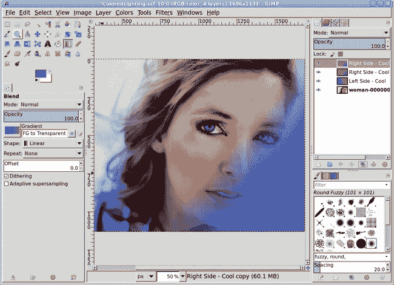

    *另一个渐变从画布的右下角向上延伸到模特的左眼。*

## 添加暖色调照明

现在添加暖色调照明。

1.  添加另一个新的透明图层，并将其命名为*暖色调照明*。再次打开更改前景色对话框，并将 RGB 值设置为**255/222/3**，以显示此处所示的暖黄色。

1.  在继续之前，Blend 工具应该已经处于活动状态，但您应该在工具选项对话框中将其形状更改为**径向**。

1.  要应用暖色调照明，点击模特的右侧太阳穴，并向下拖动到她颈部的中间。在更改图层模式之前，显示在较小窗口中的径向渐变应用结果如下。将此图层的模式更改为**柔光**。

1.  为了进一步增强光线，复制图层一次（**图层**▸**复制图层**）。

    

    *暖色调应用于模特右侧的额头上方，这样最亮的部分就不会压倒她的眼睛颜色。*

## 添加高光

需要再添加一个高光。使用混合工具来添加它。

1.  添加另一个新的透明图层，并将其命名为*暖色调*。

1.  通过在画布中按**D**键然后按**X**键将前景色重置为白色。

1.  Blend 工具仍然应该处于活动状态，但如果它没有，请从工具箱中选择它。确保在工具选项对话框中，渐变设置为**前景色到透明**，形状设置为**径向**。点击模特右侧眉毛的外侧尖端，并拖动到该眼睛的内角。

1.  将此图层的模式设置为**柔光**，以在额头和眉毛区域产生更亮的黄色，就像光线是朝这个方向最强烈地照射过来一样。

    

    *使用混合工具应用白色径向渐变来增强暖色调的强度。*

## 软化图像

为了添加最后的修饰，软化模特的脸部。

1.  复制原始图层（**图层**▸**复制图层**）。

1.  打开高斯模糊滤镜（**滤镜**▸**模糊**▸**高斯模糊**）。应用大约**8 像素**的模糊。如果您对结果不满意，按 CTRL-Z 撤销，然后尝试使用不同的模糊半径值再次尝试。模糊使模特的脸部变柔和，但她的眼睛、嘴巴和部分头发应该保持清晰。

1.  添加一个白色图层蒙版（**图层**▸**蒙版**▸**添加图层蒙版**）。

1.  通过在画布中按**D**键将前景色重置为黑色。

1.  从工具箱中选择**喷枪**工具。选择一个软边刷，并用它用黑色在蒙版上绘画。在眼睛、嘴巴和头发上绘画，直到这三个部分都更加清晰，但周围的面部特征保持模糊。

    

    *高斯模糊滤镜用于复制图层以柔化模特的脸部。还使用图层蒙版，以便原始图层中的细节可以通过模糊图层显示出来。*

## 进一步探索

光线在像这样的图像中设定了氛围。尝试使用不同颜色的光照图层，看看你是否能创造出传达困惑或愤怒情绪的图像，尽管模特的面部表情可能不是这样的。

# 4.11 iPod

由于我节俭的本性，我很少给自己买奢侈品。幸运的是，我有一个了不起的女儿，她决定我需要一件真正漂亮的礼物：一个 iPod Nano。

iPod 现在是流行文化的王者。这个头衔在很大程度上归功于简单而有效的广告活动，广告中描绘了轮廓鲜明的跳舞潮人，他们手持高对比度的 iPod，耳机线跳动。对于 GIMP 用户来说，所有这些有趣的地方在于设计的纯粹简单。iPod 广告作品只需要适度的 GIMP 专业知识，只要你（你早就知道了）从好的库存图像开始。

在这个教程中，我将展示如何将你的跳舞傻瓜变成 iPodicize 广告中的“nerdvana”。这个教程你需要的是一点直接的选择和图层经验。

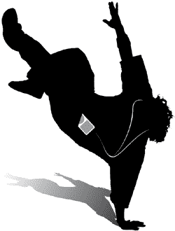

*在这个项目中，轮廓中不失细节的库存图像是一个重要的起点。*

## 入门

在 BigStockPhoto.com 或 iStockphoto.com 等网站上找到充满活力的音乐爱好者的照片没问题。这个流派很受欢迎，照片很多。iPod 广告中的舞者都有一个共同点：他们的手和脚在轮廓中通常是可以辨认的。在网上搜索图像存档时要记住这一点。在这个项目中寻找库存图像时，另一个重要的特征是单色背景，最好是白色。

1.  从工具箱中选择**模糊选择**工具，点击白色背景以创建初始选择。对于这张图片，点击应靠近下手的阴影处。按住 SHIFT 键进行额外的点击以扩展选择。使用**快速蒙版**清理背景选择，并通过**选择**▸**扩展**将选择扩大**1 像素**。

    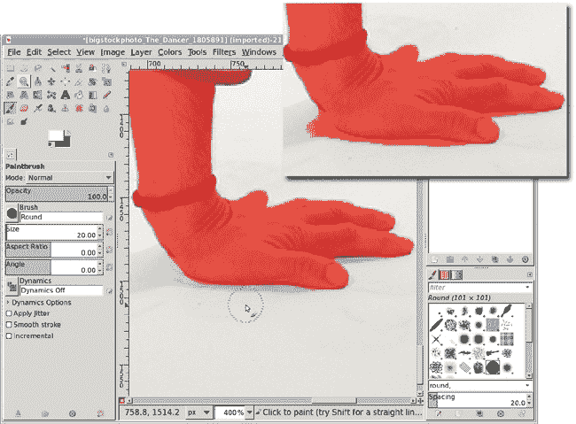

    *这个项目不需要精确的选择，但轮廓将受益于手部、夹克臂末端的白色空间、运动鞋和袖带周围的调整。*

1.  创建的选择是背景，因此将其反转（**选择**▸**反转**）以创建舞者的选择。

1.  复制（CTRL-C）并将选择内容粘贴到新图层（**图层**▸**新建图层**）。将图层命名为*轮廓*。

1.  为新图层启用**锁定透明度**选项，然后使用黑色填充图层。

1.  记住，最好不要修改原始图像，以便以后如果需要可以再次使用，因此添加一个新的白色图层并将其移动到轮廓图层下方。

    

    在轮廓图层下方添加一个名为*白色背景*的图层，可以移除原始图像中的阴影。稍后我们将重新添加阴影，但这次将更符合 iPod 广告的风格。

舞者轮廓需要一点清理。注意在原始图片中围巾和夹克从身体上脱落的位置。在轮廓中，这些不是有用的特征。

1.  使用**自由选择**工具拖动选择大部分这些区域，然后切换到**快速蒙版**模式，使用硬边刷详细选择区域。

1.  切换回选择模式并剪切选择。不要用白色填充选择！轮廓位于一个单独的图层上，周围有透明度。在这里的编辑应该用透明度替换轮廓的所选部分。

    

    *通常使用软边刷将边缘与背景融合，但 iPod 风格使用硬边且不融合的边缘*。

## 添加 iPod

创建轮廓很简单，实际上创建 iPod 也很简单。由于设备上没有太多细节，它可以在单独的图像窗口中创建，然后复制到舞者窗口中，并调整大小和旋转以适应。调整大小和旋转将模糊设备的细节，但由于它非常小且缺乏细节，这不会对项目造成问题。

1.  将轮廓图像暂时移开，但不要关闭它。打开一个新的图像窗口（**文件**▸**新建**），宽度为**380**，高度为**420**。对于这个任务，背景颜色不重要。现在，在图层对话框中关闭背景图层的可见性。

1.  将透明图层（**图层**▸**新建图层**）添加到图像窗口。从工具箱中选择**矩形选择**工具。在工具选项对话框中，启用**圆角**选项，然后将半径设置为**20**。

1.  在图像窗口中拖动以创建具有圆角的选区。确切的尺寸不重要，尽管宽度应该小于高度。通过在画布窗口中键入**D**重置前景色和背景色，然后将工具箱中的背景色（白色）拖动到选区中。

1.  此时选择仍然处于编辑模式，这意味着可以使用选择手柄来调整选择的大小。将选择的四个边向内拖动，形成一个位于原始白色填充矩形上半部分的更小的矩形。

    

    *如果选择不再处于编辑模式但仍然处于活动状态，请点击选择内部以返回编辑模式。*

1.  在工具箱中单击前景色框，将颜色更改为中等灰色，RGB 设置为**160**。关闭对话框，将前景色从工具箱拖动到图像窗口选择中。这样就创建了 iPod 显示屏窗口。记住，这种风格非常简单，因此不需要添加额外的细节，例如在显示屏周围添加深度。即使添加了深度，在 iPod 在舞者的图像中缩放和旋转后也不会被看到。

1.  使用**椭圆选择**工具在显示屏下方拖动一个圆形选择。即使不是圆形，选择也应跨越显示屏的宽度。将选择拖动到定位在 iPod 外壳下半部分的中心。再次使用前景色填充选择。清除选择（**选择**▸**无**）。从工具箱中使用**缩放**工具挤压 iPod，直到旋钮呈圆形。

    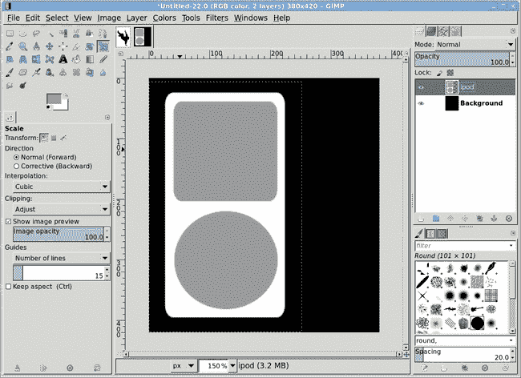

    *iPod 是在单个图层上创建的（在黑色背景上显示以显示缩放量），因此将其挤压成圆形旋钮是一个简单的操作，只需凭目测即可完成。*

## 将 iPod 放入口袋

1.  复制**iPod**图层并将其粘贴到轮廓图像中。使用**缩放**工具缩小粘贴的图层以适应，然后旋转它以与一个假想的裤子口袋对齐。在缩放时按住 CTRL 键以保持设备的宽高比。使用**旋转**工具旋转 iPod，然后使用**移动**工具将其定位在裤子口袋附近。

1.  在 iPod 图层上添加一个白色图层蒙版。使用**画笔**工具和硬边笔将 iPod 底部的部分区域涂黑，只留下一点旋钮可见。这模拟了 iPod 放在口袋里的效果（尽管不会像这个人跳舞那样久）。

    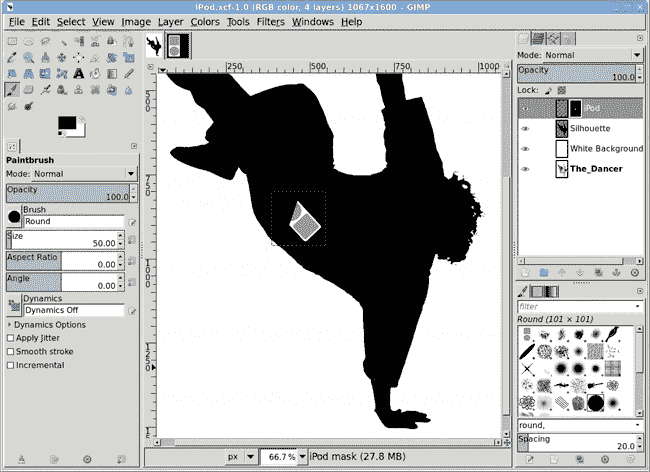

    *口袋的位置由艺术家决定。其他选项包括将 iPod 固定在手臂上或放入衬衫口袋中。*

## 绘制耳机

1.  添加一个透明图层并将其命名为“耳机”。在绘制路径之前，选择一个用于绘制导线的画笔。如果按比例调整得当，硬边画笔，如书法画笔，适用于此大小图像。所选画笔将用于描边路径。选择**画笔**工具，并在工具选项对话框中启用**基本动态**。此外，在工具箱中将前景色设置为白色，在图像窗口中输入**D**后跟**X**。

1.  从工具箱中选择**路径**工具，并在舞者左侧耳朵附近（或耳朵应该所在的位置）单击。在画布上拖动到导线应该与 iPod 相交的位置。单击你刚才创建的线条以调整导线的形状。

    

    *导线可能比这个项目中其他任何部分都需要更多的微调，因为它们和 iPod 是最容易识别的特征。*

1.  在路径对话框底部单击**描边路径**按钮。这将打开描边路径对话框。选择使用**画笔**描边，这将利用之前选择的画笔。为了增加效果，单击**启用画笔动态**选项。这会导致画笔在路径两端淡入淡出。最后，单击**描边**按钮以沿路径应用画笔描边。为从右侧耳朵发出的导线并连接到胸部的第一根导线重复此过程。

## 放置最终阴影

此设计的最后一个主要组件是在舞者下方的阴影。与轮廓一样，iPod 广告中的阴影边缘很硬。实际上，这使得创建阴影相当容易。

1.  在“图层”对话框中，复制“轮廓”图层并将其副本重命名为“阴影”。将此图层移动到“轮廓”图层下方在“图层”对话框中。从工具箱中选择**透视**工具，并在画布上单击以显示拖动句柄。将左上角句柄直接向下拖动，将右上角句柄向下并向左拖动，然后按**回车**键接受更改。

    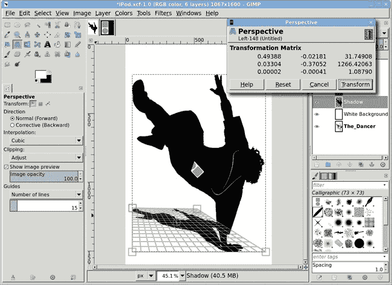

    *在应用透视后，阴影图层可能需要稍微移动一下，以便与舞者的手对齐。*

1.  在阴影图层上添加一个白色图层蒙版。在画布上输入**D**以将前景色重置为黑色。从工具箱中选择**渐变**工具，并在工具选项对话框中确保**渐变反转**按钮设置为从白色渐变到黑色。从舞者的手拖动到阴影图层右上角附近以应用阴影的渐隐效果。最后，将阴影图层的透明度降低到**80%**。

## 进一步探索

当你点击图像窗口时，透视工具将打开一个对话框，但这个对话框对大多数用户来说价值不大。它显示一个变换矩阵，如果你对数学感兴趣，这很酷，但对于这种设计工作帮助不大。忽略对话框，只需在图像窗口中拖动手柄。然后按回车键接受更改。

此外，拖动手柄不受图像可视尺寸的限制。在图像窗口中缩小视图，将手柄拖到画布的可见边缘之外。这将允许透视层流向图像边缘甚至更远。当然，超出画布可见边缘的内容不会包含在最终图像中，但这是一种设计选择。

在这个项目中，阴影没有流向图像边界，但也没有理由不能这样做。实际上，调整阴影为设计提供了非常具体的感觉，因为它让观看者知道光线是从哪个方向照射过来的。

你可以通过在白色背景上添加颜色来为这个效果添加一点色彩。最终，iPod 风格的简洁性使得它既容易识别，对于 GIMP 用户来说，也容易复制。

# 广告和特效的技巧

在应用 GIMP 工具和技术进行网页和印刷广告设计时，请记住以下建议。

## 创建 3-D 效果

光线和阴影是 3-D 效果的关键组成部分。如果你想给你的作品增加一个额外的维度，首先确定光线的方向。然后使用 GIMP 工具增加面向光线的表面的光线，并减少可能处于阴影中的表面的光线。

## 添加纹理

没有任何表面是完全无纹理的，即使是玻璃。木纹、刷过的金属和划痕都可以通过使用噪声滤镜与运动模糊滤镜的组合来创建。

## 使用层模式

层模式可以用来合并白色反射与纹理。尝试使用叠加模式来加深图像，或者使用柔光和颗粒合并模式来加亮和混合。

## 使用渐变进行反射

一个盒子中的渐变看起来并不起眼。但是，将渐变应用于圆形或矩形等形状内部，可以看起来像反射。玩转混合工具的渐变——其中许多可以产生反射效果。

## 简单地浮雕

浮雕滤镜（滤镜▸扭曲▸浮雕）和凹凸贴图滤镜（滤镜▸贴图▸凹凸贴图）都工作得相当好，但是文本浮雕效果非常容易实现，你不妨手动操作。只需复制、偏移、模糊和剪切。为了使事情更加简单，模糊和剪切步骤是可选的。

## 消除锯齿

GIMP 在执行旋转或剪切等变换后不再留下许多“锯齿”，但如果您发现任何，可以应用轻微的模糊到图层边缘以清除这些锯齿。缩小视图以查看图层边缘超出画布区域的部分。在正面和侧面图像交汇处的包装边缘的几个锯齿可能并不是那么糟糕——它们可以提供对比度，显示在常见颜色混合处的实际边缘。模糊锯齿边缘可能会给您带来更好的对比度。

## 不要担心水平对齐

在创建包装项目的正面和侧面图像时，不要在应用透视变换之前尝试对齐水平元素。对任何一侧应用透视变化很可能会扭曲那些水平元素，使它们变得不对齐。相反，避免添加或使用需要在包装的正面和侧面对齐的水平线条。

## 注意画布大小

较大的画布占用更多内存。设置为打印在法律纸张大小的纯白画布仅静置就占用 20 到 30MB。然而，用于网络的图像通常是在 98 ppi 下创建的，这大大减少了项目的文件大小。
