# 第五章. 字体效果

第一章介绍了在 GIMP 中使用文本的一些基础知识。在第五章中，你将看到如何利用光照、阴影、颜色、纹理、形状和透视来充分利用字体。

GIMP 并非设计为字体编辑器；它是一个图形设计工具。但你在 GIMP 中可以做的文本处理远比字体编辑器有趣。GIMP 为你提供了改变字体显示环境的能力。无论你使用哪种可用的字体，你都可以改变文本字符串的深度、颜色和纹理。这以更有意义的方式拓宽了你的图形设计可能性。

# GIMP 的文本工具

工具箱中有一个用于处理文本的单个工具：文本工具。当你选择此工具时，GIMP 会打开工具选项对话框，在其中你可以选择字体和大小，并调整其他文本格式，如颜色和对齐方式。文本可以直接在画布窗口中输入，以进行短语的所见即所得编辑，或者你可以使用文本编辑器对话框来处理更大的文本块。在任一窗口中输入的文本将立即出现在当前图层中，并采用文本工具的当前设置。

*文本工具的工具选项对话框（左）和可选的文本编辑器对话框。短短语可以直接在画布中输入。较长的文本块更容易加载到文本编辑器中。*

你将在第五章中的所有教程中使用文本工具、其工具选项对话框和文本编辑器，但文本本身只是起点。每次你处理文本时，你的目标都是传达特定的信息，而你选择的词语只是第一步。像 GIMP 这样的图像编辑器真的允许你在位图效果中发挥文本的创造力。

*文本在输入时直接渲染到图层中。*

# 预定义文本效果

GIMP 提供了一系列预定义的文本效果，从粉笔到铬色到霜冻到纹理。如果你需要达到某种效果但没有时间尝试，这些预定义效果就是你的选择。所有预定义效果都可以通过选择任何画布菜单中的文件▸创建▸标志来访问。点击此菜单中的任何选项将打开一个对话框，你可以选择字体和颜色，并设置各种其他选项。然而，事实是，这些现成工具有其局限性，在接下来的教程中你不会依赖它们。要实现真正独特的效果，你需要自己动手。

*通过访问文件▸创建▸标志菜单来创建现成的标志。*

*所有文本标志滤镜，如这里显示的铬滤镜，允许你调整一些设置，但结果通常相当可预测*。

# 创建您自己的文字效果

现在是时候在创建自己的效果（如阴影和侵蚀）的同时探索 GIMP 的文本工具了。以下教程将教会你如何将普通的字符转换成令人惊叹的图形信息。

# 5.1 铬和金属文字

金属效果通常应用于文本，但你也可以在用户界面设计中利用这些通用纹理。金属效果是通过曲线对话框创建的。调整渐变或平滑纹理的曲线会导致色调的逐渐变化变得更加明显，并产生闪亮的金属外观。本套教程将向您展示如何创建三种不同的金属效果。

*高对比度，通过曲线对话框生成，给这些示例带来了金属的外观*。

## 刷过金属

刷过金属效果是两个基本过程的产物。首先，你应用运动模糊滤镜，这使得表面看起来像是覆盖着微小的划痕。将噪声应用于图层会给原本平坦的图像添加纹理。然后，你在曲线对话框中调整图像的灰度色调。对于具有非线性变化的图像（即层中灰色随机分布的图像），调整值曲线会加速从黑色到白色的变化，并模仿反射金属。最终效果通过将字母拉伸到三维空间得到增强。

*字母* S *被制作成看起来像刷过金属的效果*。

### 创建文本

首先使用默认的 640 × 400 模板打开一个新的画布。白色背景是不错的选择，或者如果你选择的话，也可以尝试其他颜色。关闭背景层的可见性。

1.  从工具箱中选择 **文本** 工具。在工具选项对话框中，选择合适的字体。在这个例子中，我使用了名为 Gilde Broad Thin 的字体，大小为 500 像素。在这个大小下，字体足够粗，可以清楚地显示刷过金属的纹理；在字符较细的字体中，细微的效果可能会丢失。在工具选项对话框中将文字颜色设置为 **白色**。

1.  点击画布图层并输入字母 *S*。

1.  使用 **对齐** 工具对齐文本层。在工具选项对话框中，将相对选项设置为 **图像** 并点击图层。然后点击菜单下方仅有的 **居中对齐** 和 **垂直居中对齐** 按钮。

1.  将文本层与画布大小匹配（**图层**▸**图层到图像大小**）。

    

    *使用对齐工具将文本放置在画布的中心位置*。

### 使用凹凸贴图滤镜拉伸文本

1.  复制文本图层（**图层**▸**复制图层**）。将此图层命名为*模糊*。

1.  打开高斯模糊滤镜（**滤镜**▸**模糊**▸**高斯模糊**）并将模糊设置为**10 像素**应用于复制的图层。

1.  在图层对话框中点击原始文本图层以使其处于活动状态。

1.  打开凹凸贴图滤镜（**滤镜**▸**映射**▸**凹凸贴图**）。从映射类型下拉菜单中选择**正弦波**，然后从凹凸贴图下拉菜单中选择模糊图层。将方位角设置为**132 度**，将仰角设置为**30 度**，将深度设置为**7**。点击**确定**应用滤镜。

    正弦波映射产生了一个更真实的三维效果，其边缘比线性选项和球形选项产生的边缘更不圆润。方位角滑块设置光照方向在 360 度内。仰角滑块改变边缘的圆润度，深度滑块设置阴影侧面的柔和度。为了充分利用这个教程，我选择了强调深度的值。

    

    *使用轻微的模糊和凹凸贴图滤镜将字母* S *拉伸到三维空间*。

1.  打开**曲线**对话框（**颜色**▸**曲线**），调整值通道的曲线以尽可能接近这里显示的曲线。实际的设置将根据图层中灰度色调的变化而变化。点击**确定**。这将是你看到的第一个看起来有点金属质感的可见变化。

1.  再次打开高斯模糊滤镜（**滤镜**▸**模糊**▸**高斯模糊**）并应用**10 像素**的模糊。这稍微柔和了阴影边缘，使侧面看起来更加圆润，而不会模糊到透明区域。

1.  复制原始图层（**图层**▸**复制图层**）。在复制的图层处于活动状态时，通过选择**图层**▸**透明度**▸**alpha 到选择**来选择文本。

1.  按**D**键重置默认的前景色和背景颜色。

1.  从工具箱中选择**混合**工具。在工具选项对话框中，将模式设置为**颗粒合并**，将渐变设置为**前景到透明**。从画布的左上角拖动到右下角。然后从画布底部拖动到顶部。

1.  在图层对话框中，将模式设置为**柔光**。

1.  按下 CTRL-SHIFT-A 来取消选择所有内容。

    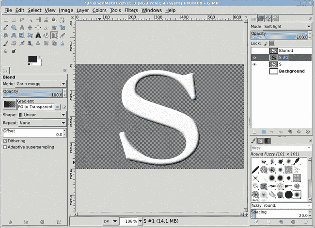

    *混合增强了三维效果。这不是实现刷金属外观所必需的，但它为你提供了一个有趣的标志*。

### 添加金属质感

1.  合并渐变图层和原始的 S 图层（**图层**▸**合并向下**）。

1.  打开**颜色**▸**曲线**，调整值通道的曲线以尽可能接近这里显示的曲线。实际的设置将根据图层中灰度色调的变化而变化。点击**确定**。这将是你看到的第一个看起来有点金属质感的可见变化。

1.  复制图层（**图层**▸**复制图层**）。

1.  通过选择**图层**▸**透明度**▸**alpha 到选择**来选择此复制的图层中的字母。

1.  使用**RGB 噪声**滤镜填充选择区域以产生噪声（**滤镜**▸**噪声**▸**RGB 噪声**）。取消选择**相关噪声**和**独立 RGB**复选框。将所有三个颜色通道滑块设置为**0.44**，并将 Alpha 滑块设置为**0**。点击**确定**应用此滤镜。对这一层进行去饱和处理（**颜色**▸**去饱和**）。

    **RGB 噪声**滤镜在选择的区域填充随机点——在这种情况下，点是有色的，并且必须去饱和。将颜色通道滑块设置为 0.44 会增加噪声。（更高的值意味着更多的噪声，而较低的值意味着较少的噪声。）在这里不使用 Alpha 通道。

1.  打开**高斯模糊**滤镜（**滤镜**▸**模糊**▸**高斯模糊**）并应用**2 像素**的模糊。

1.  仍然选择文本，使用**运动模糊**滤镜进一步模糊图层（**滤镜**▸**模糊**▸**运动模糊**）。将角度设置为**45 度**，并将长度设置为**20 像素**。

    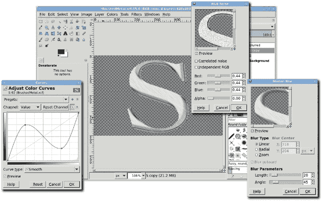

    *给文本添加噪声，并使用曲线对话框增加暗部和亮部噪声的分离。*

1.  最后一步是添加给金属带来闪亮外观的蓝色色调。添加一个新图层（**图层**▸**新建图层**）。将其命名为*Tint*。

1.  点击前景色框以启动**更改前景色**对话框，并将 RGB 值设置为**16/59/130**。点击**确定**关闭对话框。将前景色拖动到新图层中的选择区域以填充该颜色。（步骤 4 中选择的字母应该仍然被选中。）

    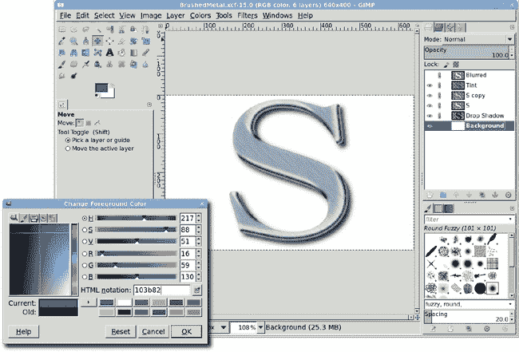

    *添加蓝色色调完成效果*。

1.  取消选择所有内容（CTRL-SHIFT-A），然后将图层模式设置为**柔光**，并将不透明度降低到**52**%。

1.  在图层对话框中设置下一层的模式为**Grain Extract**，并将其不透明度设置为**60**%。使用**高斯模糊**滤镜将**2 像素**的模糊应用到原始文本层。就这样！只需这几步就能产生你在这里看到的结果。

1.  再次打开背景层的可见性。然后添加一个阴影以更好地看到效果。

## 重金属

重金属效果与刷金属效果类似，但它使用**纯色噪声**滤镜产生云状纹理，并依赖于更戏剧性的曲线调整以达到光滑、反光的外观。

*重金属看起来比刷金属更光滑*。

### 创建文本

如前一个教程所述，首先使用默认的 640 × 400 模板打开一个新的画布。

1.  通过在图层对话框中关闭其可见性来隐藏背景层。

1.  按**D**键重置默认的前景色和背景色，然后按**X**键交换它们。

1.  从工具箱中选择**文本**工具并选择合适的字体。将文本颜色更改为白色。对于这个教程，我选择了 GraverplateExtrabold Thin，这是一种使用大写字母表示小写字母的字体（称为*小写字母大写*）。这种字体的宽表面使重金属效果更容易看到。我将字体大小设置为 182 像素，并减少了字母间距，直到*E*和*T*紧挨在一起。

    ### 注意

    *在尝试达到这种效果时，始终选择一个坚实的字体（而不是轮廓字体）并且字符较粗。如果你想使用特定的字体但字符看起来太细，该字体的粗体版本可能有效。*

1.  在画布上单击并输入*金属*。

1.  使用**对齐**工具将文本层在画布中居中。

1.  调整文本层的大小以匹配图像大小（**图层**▸**图层到图像大小**）。

    

    *使用粗体字体会使最终效果更容易看到。*

### 添加深度

1.  清除任何选择（CTRL-SHIFT-A）。

1.  正如你在刷金属效果中所做的那样，你现在将拉伸文本。请注意，在这个教程中，拉伸不是可选的。沿着文本边缘创建的深度会在重金属效果中产生反射变化。首先，复制文本层（**图层**▸**复制图层**）。将复制的层命名为*模糊*。

1.  使用**高斯模糊**滤镜将**10 像素**的模糊应用于复制层。

1.  单击原始文本层使其变为活动层。

1.  打开**凹凸贴图**滤镜（**滤镜**▸**映射**▸**凹凸贴图**）。将凹凸贴图选项设置为模糊层。将映射类型设置为**线性**并勾选**补偿变暗**复选框。将方位角设置为**130 度**，仰角设置为**30 度**，深度设置为**7**。单击**确定**将此滤镜应用于图层。

    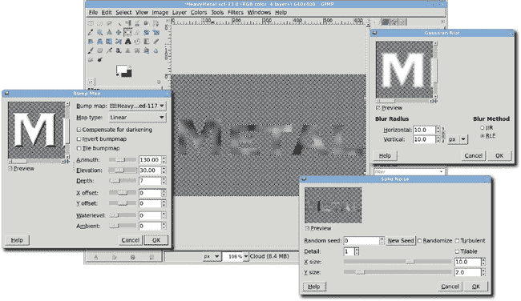

    *“凹凸贴图”滤镜使原始文本看起来具有三维效果。*

1.  在此阶段，您可以删除复制的层。通过在图层对话框中关闭其可见性来隐藏模糊层。

1.  复制原始文本层。将新层命名为*云*。

1.  通过选择**图层**▸**透明度**▸**alpha 到选择**选择文本。

1.  使用从**滤镜**▸**渲染**▸**云彩**▸**纯色噪声**渲染的云填充选择区域，如 1.10 基本教程中所述。将随机种子设置为**0**。将 X 大小设置为**10**，Y 大小设置为**2**。

1.  随机种子值用于改变云的形状，所以请随意尝试不同的值进行实验。当设置为 0 时，这里使用的随机种子值，你应该会得到与我相同的云结构。然而，因为云仅在选择区域内渲染，所以你实际上看不到它。你只会看到选择区域内的各种灰色阴影。

1.  在选择仍然激活的状态下，打开**Motion Blur filter**（**Filters**▸**Blur**▸**Motion Blur**）。将角度滑块设置为**95 degrees**，长度滑块设置为**20**，然后应用滤镜到图层。取消选择所有（CTRL-SHIFT-A）。运动模糊滤镜将云变成更像是光线的反射。

1.  将此层的模式设置为**Grain Merge**以提亮云层并使其看起来像高反射金属。

1.  将此层与最初应用 Bump Map 滤镜的层合并（**Layer**▸**Merge Down**）。

    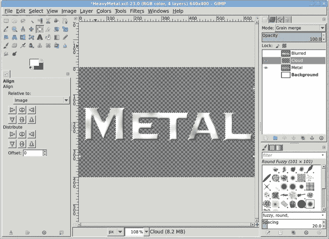

    使用**Solid Noise filter**在文本上渲染云，然后应用**Motion Blur filter**。

### 添加金属光泽

通过增加明暗区域的对比度可以进一步提高此效果。

1.  打开曲线对话框（**Colors**▸**Curves**）并应用如图所示的曲线。这为你提供了基本的金属效果，但你还可以进一步增强它。

1.  添加阴影（**Filters**▸**Light and Shadow**▸**Drop Shadow**）。将偏移 X 和偏移 Y 值设置为**–2 pixels**以将阴影向上和向左移动，并将模糊半径设置为**10 pixels**。将此应用到图像上。

1.  也许文本的边缘太柔和，需要更鲜明的视觉效果。你可以通过灰色轮廓描边来锐化文本边缘，以获得鲜明的视觉效果。通过选择**Layer**▸**Transparency**▸**Alpha to Selection**选择此层中的文本。将选择扩大**2 pixels**（**Select**▸**Grow**）。

1.  通过选择**Layer**▸**New Layer**添加一个新透明层，并将图层填充类型设置为**Transparency**。将新图层命名为*Outline*。

    

    曲线调整可以突出金属外观，而阴影则会让效果在页面上更加突出。

1.  在工具箱中点击前景色图标，并在更改前景色对话框的 HTML 表示字段中输入*a4a4a4*来设置前景色为灰色。点击**OK**并关闭对话框。

1.  打开描边选择对话框（**Edit**▸**Stroke Selection**）并将线宽设置为**2 pixels**。点击**Stroke**按钮来描边选择。

1.  取消选择所有（CTRL-SHIFT-A）。

1.  将轮廓层的模式更改为**Multiply**。

1.  像铬这样的闪亮金属有蓝色调，因此你应该添加这种色调以增加真实感。添加一个新图层（**Layer**▸**New Layer**）命名为*Color*，并用蓝色填充它，设置 RGB 值为**16/59/130**。将工具箱中的前景色拖动到画布上。

1.  将此蓝色层的模式设置为**Soft Light**并将不透明度降低到**53 percent**。打开背景层的可见性以查看劳动成果。

    

    *用灰色勾勒原始文本的轮廓，并使用柔光模式混合颜色，使文本看起来更有立体感。*

## 液体金属

使用曲线对话框在重金属教程中对金属效果进行了重大改进。但你可以从这里去哪里——你还能用金属文本做什么？将这个过程再进一步：向图像中添加非文本组件。

*在这里，你模拟液体金属。当然，GIMP 提供热量。*

### 创建文本

1.  选择工具箱后，按 **D** 键重置，然后交换默认的前景色和背景色。然后以默认大小打开一个新的画布窗口。关闭背景图层可见性。

1.  从工具箱中选择 **文本** 工具。选择一个粗大的字体——我使用了 220 像素的 Arial Black 字体。正如在重金属教程中一样，粗体字体使得效果更容易看到。在这种情况下，你还需要一个带有小写字母和像 *i* 和 *j* 这样的字母上的点的字体。这些元素将增强熔化效果。一旦选择了合适的字体，将字体颜色设置为白色。

1.  点击画布并输入单词 *液体*。完成输入后，点击 **确定** 关闭文本编辑器。

1.  使用 **对齐** 工具将文本层居中。

1.  将图层边界扩展到图像大小（**图层**▸**图层到图像大小**）。

    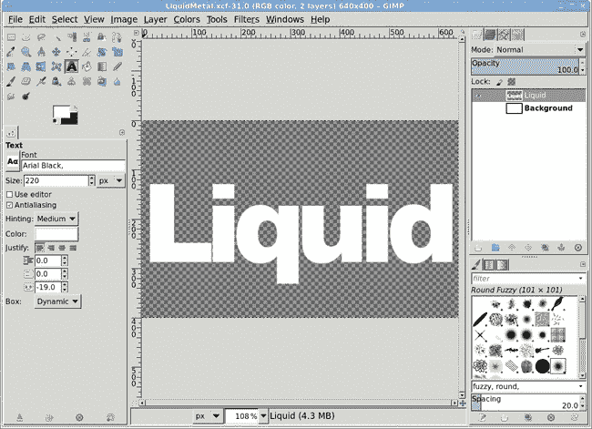

    *粗体字体对于这个效果至关重要。对于细体字体，金属的反射性质更难区分。*

### 液化字母

1.  使用 **自由选择** 工具在第一个字母下方绘制一个圆形选择。按住 SHIFT 键在文本下方绘制更多选择。使用 SHIFT 键（或在工具选项对话框中的添加模式）允许你将新选择添加到现有选择中，即使新选择在物理上没有接触到现有选择。确保选择重叠在每个字母的部分。

1.  画了几次选择后，通过 **1 像素** （**选择**▸**扩大**）来增长它们，以软化手绘选择的边缘。

1.  通过从工具箱中将前景色框拖动到图像中，用白色填充选择区域。

1.  取消所有选择（CTRL-SHIFT-A）。

    

    *将手绘选择添加到文本层并填充为白色。*

1.  打开 **波浪** 滤镜（**滤镜**▸**扭曲**▸**波浪**）。将振幅设置为 **6**，相位设置为 **107**，波长设置为 **29**。点击 **确定** 应用此滤镜。

    下面的文本和 Blob 将以波浪形式扭曲——效果将取决于你为这个教程选择的字体。如果你选择了不同的字体，你可能需要尝试波浪滤镜的不同设置。

1.  将此图层命名为 *Blob* 并复制它（**图层**▸**复制图层**）。

1.  打开高斯模糊滤镜（**滤镜**▸**模糊**▸**高斯**）并应用**10 像素**的模糊。将这个模糊层命名为*模糊*。点击 Blob 层使其再次变为活动状态。

    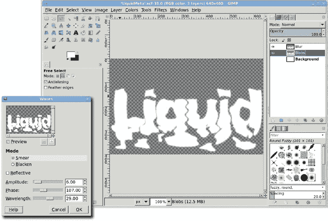

    *在这个教程中，波浪滤镜真正做了工作。模糊层为你设置了舞台，以便使用凹凸图滤镜添加深度。*

### 添加深度和光泽

1.  打开凹凸图滤镜（**滤镜**▸**映射**▸**凹凸图**）并使用模糊层将滤镜应用于 Blob 层。将映射类型设置为**线性**，并勾选**补偿变暗**复选框。将方位角设置为**130 度**，仰角设置为**30 度**，深度设置为**7**。点击**确定**应用此滤镜。

1.  关闭模糊层的可见性。

1.  复制 Blob 层（**图层**▸**复制图层**）。在这个副本层中选择凹凸图的选区，方法是选择**图层**▸**透明度**▸**Alpha 到选区**。

1.  用纯噪声填充副本层（**滤镜**▸**渲染**▸**云彩**▸**纯噪声**）。

1.  打开运动模糊滤镜（**滤镜**▸**模糊**▸**运动模糊**）。将长度设置为**20**，角度设置为**95 度**。点击**确定**应用此滤镜。

1.  将副本层的模式设置为**颗粒合并**，然后将其与原始 Blob 层合并（**图层**▸**合并向下**）。

    

    *正如在重金属教程中，使用噪声和模糊来模拟反射。*

1.  取消全部选择（CTRL-SHIFT-A）。

1.  打开**曲线**对话框，并按图所示调整**值**曲线。

1.  添加一个新图层（**图层**▸**新建图层**），像之前一样用蓝色填充，并将新图层的模式设置为**柔光**。

    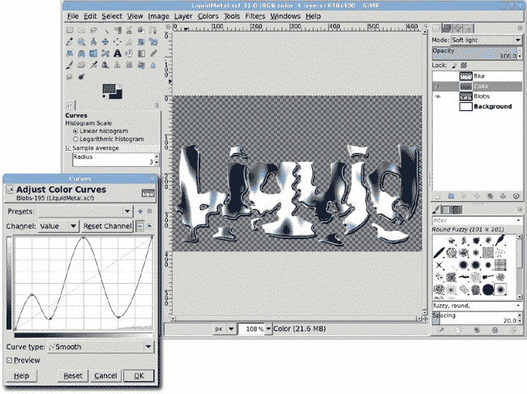

    *添加一个颜色层，使其看起来像物体在金属表面上反射。*

## 进一步探索

通过更仔细地控制文本的扭曲，这个最终版本可以改进。例如，你可以使用 IWarp 滤镜而不是波浪滤镜来做这件事。还可以添加额外的颜色。尝试添加红色和黄色的图层，并使用纯噪声图层蒙版，使其看起来像字母很热——金属是液体的原因肯定是有一些的，对吧？

# 5.2 果冻类型

这里展示的果冻效果不过是柔和的阴影、光滑的表面和白色的反射。想象一下玻璃管中的水看起来是什么样子，你就明白了。果冻效果在网页设计中特别受欢迎，但你也会在许多不同的环境中看到它们。Mac OS X 用户界面采用了苹果公司称之为*Aqua*的风格，该风格使用蓝色调的果冻效果。

*看起来像果冻，不是吗？*

本教程中描述的过程可以应用于文本、边框和按钮——几乎任何表面。根据您为曲线对话框、光照效果滤镜和 Bump Map 滤镜设置的参数，您得到的结果可能与我的不同。您应该从这一过程中吸取的是如何使用 Bump Map、光照效果和图层模式。

## 创建文本

通过在图像窗口中按**D**键重置前景色和背景色。然后使用默认大小（640 × 400 像素）的画布开始。

1.  点击前景色框以打开更改前景色对话框并选择一种漂亮的蓝色。我已将 RGB 值设置为 0/51/222 以获得这种色调。

1.  从工具箱中选择**文本**工具。在工具选项对话框中，选择一种衬线字体。本教程使用 Bookplate Thin，字体大小设置为 280 像素。衬线字体在这里效果最好，因为它们的字符容易在后续过程中被圆滑处理。点击画布并输入*Gel*。

1.  使用**对齐**工具将新图层在画布中居中。

1.  选择**图层**▸**图层到图像大小**以将文本图层扩展到图像边界。

    

    *使用文本工具时，您还可以通过在工具选项对话框中点击颜色块来更改文本颜色。*

## 文本表面的圆滑处理

1.  通过选择**图层**▸**透明度**▸**alpha 到选择**来围绕文本创建选择区域。

1.  将选择缩小**2 个像素**（**选择**▸**缩小**）并使用**2 个像素**进行羽化（**选择**▸**羽化**）。

    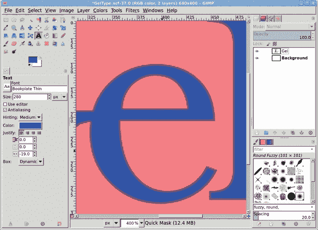

    *创建文本的选择，然后缩小并羽化。在此选择快速蒙版视图中的字母的暗边显示，选择区域小于字母。*

1.  点击前景色框以打开更改前景色对话框，并将 RGB 值设置为**31/82/255**以获得略亮的蓝色。

1.  通过选择**图层**▸**新建图层**或点击图层对话框中的**新建图层**按钮来创建一个新图层。将新图层命名为*Bump Map*。

1.  在图层对话框中点击**Bump Map**图层使其变为活动状态，然后通过从工具箱拖动到选择区域来使用前景色填充选择区域。

1.  取消所有选择（**选择**▸**无**）。

1.  复制图层（**图层**▸**复制图层**）。将复制的图层命名为*Blur*。

1.  打开高斯模糊滤镜（**滤镜**▸**模糊**▸**高斯模糊**）并将模糊应用于**10 像素**的 Blur 图层。

1.  点击**Bump Map**图层使其变为活动状态。

1.  打开 Bump Map 滤镜（**滤镜**▸**映射**▸**Bump Map**）。将方位角设置为**105 度**，仰角设置为**5.75 度**，深度设置为**10**。将映射类型设置为**线性**，勾选**补偿变暗**复选框，并从 Bump Map 下拉菜单中选择**Blur**图层。点击**确定**将滤镜应用于 Bump Map 图层。

    

    *复制图层的模糊边缘被用作 Bump Map 滤镜的输入以模拟深度。使用 Bump Map 滤镜添加深度。*

1.  将 Bump Map 图层的模式设置为**添加**。

1.  您需要调整 Bump Map 图层的颜色，以便使文字看起来更像凝胶状。打开曲线对话框（**颜色**▸**曲线**）并设置曲线如图所示。当模糊图层的可见性关闭时，您可以看到 Bump Map 图层变得更亮。

    

    *调整 Bump Map 图层的曲线对话框使文字呈现出凝胶状外观，但请确保在图层对话框中关闭模糊图层的可见性以查看更改。*

### 注意

*我们不会在项目后期再次使用模糊图层，所以现在关闭其可见性，以便更容易看到您其余的工作。*

## 添加照明效果

现在您将对 Bump Map 图层应用另一个滤镜。

1.  打开照明效果滤镜（**滤镜**▸**光与阴影**▸**照明效果**）。在**选项**选项卡中，点击并拖动蓝色点到预览窗口的左上角。蓝色点代表您的光源。调整蓝色点的位置，使凝胶文字突出显示到您满意的程度。这有点棘手！如果您丢失了这个点，请禁用此光源（通过在光选项卡中将类型更改为无，然后从光设置菜单中选择不同的光源）并创建一个新的光源。

    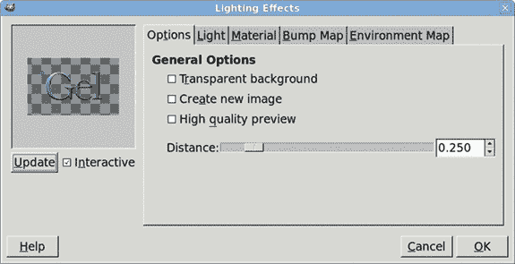

    *在预览中定位光源可能很困难。不要害怕点击取消并再次尝试。*

1.  在**光**选项卡中，从下拉菜单中选择**方向**。您的蓝色点现在与表示光源方向的线条相关联。您选择的强度设置对整体效果有很大影响，就像您在曲线对话框中进行的更改一样。我将强度设置为 1.15。如果您对凝胶效果不满意，请通过调整此值或添加额外的光源进行实验。点击**确定**应用照明效果滤镜。

    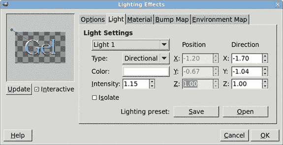

    *在所有照明效果滤镜的设置中，强度设置的影响最大。*

1.  应用照明效果滤镜后，将 Bump Map 图层偏移**–2/–2 像素**（**图层**▸**变换**▸**偏移**）。

1.  打开高斯模糊滤镜（**滤镜**▸**模糊**▸**高斯模糊**）并将该图层应用**5 像素**的模糊。

    

    *柔和的模糊使边缘平滑，使文字看起来更像真实的凝胶状。*

## 调亮文字并添加阴影

要突出凝胶的曲面，你可以增加文本的对比度并添加背景阴影。如果你关闭了模糊层的可见性，请将其重新打开以继续此项目。

1.  确保在图层对话框中**模糊**层是激活的。通过选择**图层**▸**复制图层**（默认情况下，副本层将被命名为 *Blur copy*）来复制此层。

1.  将模糊副本层偏移**2/2 像素**（**图层**▸**变换**▸**偏移**）。

1.  点击原始的**模糊**层使其变为活动状态，然后将其偏移**–2/–2 像素**（**图层**▸**变换**▸**偏移**）。

1.  将模糊层的混合模式设置为**添加**，并将模糊副本层的混合模式设置为**屏幕**。

    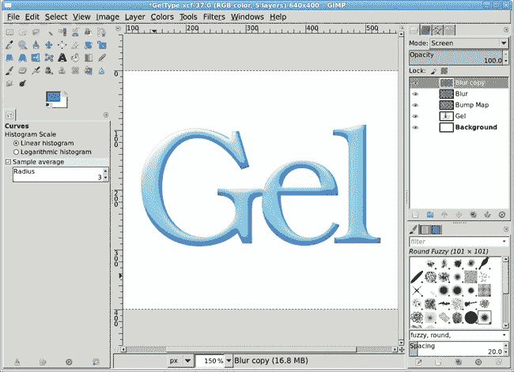

    *重新访问模糊层，并使用它进一步淡化凝胶颜色。*

1.  点击**凝胶**文本层使其变为活动状态。添加一个偏移量为**4 像素**、模糊度为**6 像素**的阴影（**滤镜**▸**光与阴影**▸**阴影**）。

    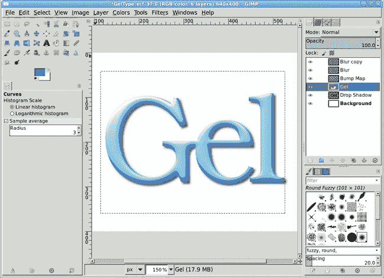

    *现在文本如此之淡，它融入了白色背景。添加阴影有助于效果突出。*

## 进一步探索

创建凝胶效果的基本过程无论修改哪种表面都是相同的。为了增加多样性，尝试使用不同的凝胶颜色，或者使用波浪或 IWarp 滤镜添加扭曲。

# 5.3 受损文本

在室内设计中，受损效果用于给家具赋予陈旧和风化的外观。在图形设计中，它起到类似的作用——它给干净利落的物体，如文本，增加了视觉兴趣。虽然可以围绕这种效果设计完整的字体集，但预制效果总是限制艺术家的设计选择。如果你的文本中的每个 *F* 都看起来完全相同，那么添加个人风格就变得困难了。

*受损文本示例*

## 创建文本

1.  在工具箱中选择，按**D**键将前景色设置为黑色。

1.  打开一个设置为默认大小（640 × 400 像素）的白色画布。

1.  点击**文本**工具使其变为活动状态，然后在工具选项对话框中选择合适的字体。本例使用 SoutaneBlack Thin，其粗体字符使受损效果更容易看到，字体大小设置为 80 像素。

1.  在画布上单击并输入 *BRoKEN SPARRoWS*，字母 *o* 使用小写，只是为了增加一点活力。按**ENTER**键在单词之间添加换行符，然后在单词 *SPARRoWS* 前插入几个空格。

1.  使用**对齐**工具将文本居中对齐在画布上。

1.  选择**图层**▸**图层到图像大小**将文本层扩展到图像边界。

1.  通过选择**图层**▸**新建图层**添加一个透明的新图层。将其命名为 *Distressed* 并将图层填充类型设置为**透明**。

    

    *如果您从粗体字体开始，破损文本效果更容易看到。*

## 创建破损图层

下一个部分是最难的。您将添加一系列不同宽度的垂直线条，用作破损效果的基线。这里的难点在于将线条随机放置在字母上。

1.  打开图像网格（**视图**▸**显示网格**）并将 GIMP 设置为吸附到网格（**视图**▸**吸附到网格**）。您将使用网格来使绘制完美垂直（因此平行）的线条更容易。

1.  从工具箱中选择 **铅笔** 工具，并在工具选项对话框中选择 **圆形** 笔刷，大小设置为 **1.00**。绘制一条从画布顶部延伸到底部的单线。为此，在画布顶部靠近网格点处点击，按住 SHIFT 键，然后在画布底部相同垂直线上靠近原始点的网格点处点击。这将绘制一条宽度为 1 像素的直线。

    

    *借助图像网格和网格吸附选项，您可以轻松地绘制直线。*

    ### 注意

    *您也可以通过按 CTRL-SHIFT 来绘制没有网格的直线。这种方法将使线条的角度以 15 度的增量进行约束。*

1.  隐藏图像网格（**视图**▸**显示网格**）并关闭网格吸附（**视图**▸**吸附到网格**）。在此阶段，您可能还想关闭文本层的可见性，但这不是必需的。

1.  从工具箱中选择 **模糊选择** 工具，并使用它来点击您刚刚用铅笔工具绘制的线条。您可能需要放大线条以便更容易点击。

1.  选中线条后，按 CTRL-C 复制它，按 CTRL-SHIFT-A 取消选择所有内容，然后按 CTRL-V 将重复的线条粘贴为浮动选择。

1.  使用 **移动** 工具将重复的线条向右或向左移动，然后点击浮动选择之外的区域以将其锚定到原始图层。这样做几次，将线条随机放置在画布的宽度上。完成时，您应该有一个包含许多线条的图层。复制此图层（**图层**▸**复制图层**）。

1.  在偏移 X 字段中输入 **1 像素** 来偏移重复图层（**图层**▸**变换**▸**偏移**）。

1.  通过选择 **图层**▸**向下合并** 将活动图层与下面的图层合并。这实际上将线条的宽度在单个图层中加倍。您也可以从一开始就使用宽度为 2 像素的画笔，但了解如何通过复制和偏移图层来增强效果是一项有用的技能。

    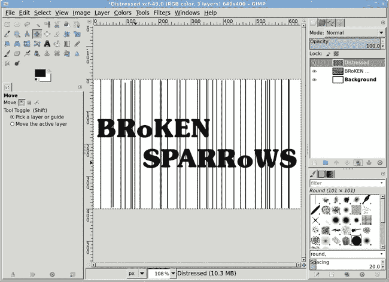

    *这些随机放置的线条将被用来遮盖原始文本的部分。*

1.  在**破损**图层处于活动状态时，再次选择**铅笔**工具，在工具选项对话框中将画笔大小设置为**3.00**，重复上述过程，这次绘制较粗的线条，覆盖你已定位的线条。避免均匀间隔这些较粗的线条，并确保它们在这里和那里与文本相交。别忘了使用网格绘制第一条线！

    

    *使几条线比其他线粗一些，可以使图案更具随机性，但确保线条与文本相交，否则你将无法在最终效果中看到差异*。

1.  打开**Hurl**滤镜（**滤镜**▸**杂色**▸**Hurl**）。将随机种子设置为**150**，随机化设置为**10%**，重复设置为**1 次**。Hurl 滤镜在当前图层中散布点，必要时覆盖像素。随机化值指定了图层中应填充多少点。较高的重复值表示滤镜应重复应用，从而增加应用的总点数。点击**确定**将 Hurl 滤镜应用于破损图层。

1.  打开**拾取**滤镜（**滤镜**▸**杂色**▸**拾取**）。将随机种子设置为**10**，随机化设置为**20%**，重复设置为**3 次**。点击**确定**将此滤镜应用于破损图层。拾取滤镜与 Hurl 滤镜类似，但它以稍微不同的方式选择像素及其颜色。在这种情况下，使用拾取滤镜使点分布更加随机，并在图案中引入一些较大的点。应用 Hurl 和拾取滤镜后，你将得到一组破损线条。

    

    *使用 Hurl 和拾取滤镜创建随机噪声，使线条看起来破损*。

## 将**破损效果**应用于文本

现在是时候将破损线条与文本混合了。

1.  在**破损**图层中反转颜色（**颜色**▸**反转**）。

1.  Hurl 和拾取滤镜在破损图层中散布彩色点，但你追求的是黑白效果，所以继续去饱和度图层（**颜色**▸**去饱和度**）。确保重新打开文本图层的可见性。将图层模式更改为**叠加**。

1.  使用**移动**工具将图层定位到所需的位置以获得最佳效果。

    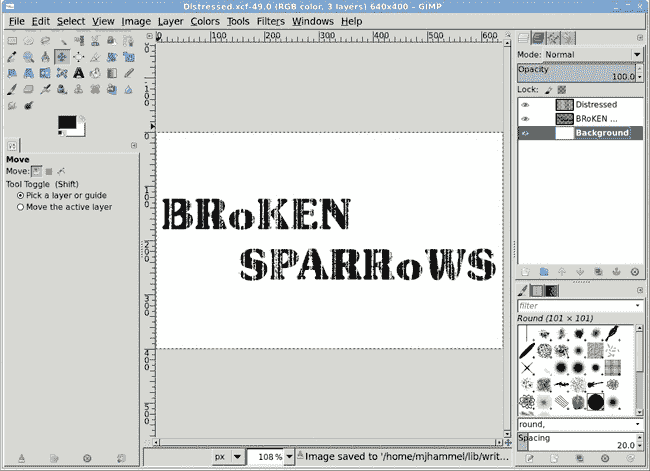

    *因为背景是白色的，所以当线条不与文本相交时，白色线条就会消失。如果你的背景是另一种颜色，复制破损图层，将其粘贴到你在文本图层上创建的图层蒙版中（图层*▸*蒙版*▸*添加图层蒙版），然后关闭破损图层的可见性*。

## 进一步探索

有许多其他方法可以使用**破损图层**来增强原始文本。尝试将其用作文本图层的图层蒙版或用作位于文本之上的彩色或纹理图层的图层蒙版。你还可以使用凹凸贴图滤镜来挤压破损文本，产生类似侵蚀的效果。

# 5.4 霜冻

标准的 GIMP 安装提供了几个特殊滤镜，包括**闪光**滤镜（**滤镜**▸**光与阴影**▸**闪光**），它将图像中的白色颗粒拉伸成光束。你可以使用闪光滤镜来产生霜冻、雪和冰柱效果，但结果并不总是理想的，因为光束相当均匀。本教程探讨了实现霜冻效果的其他方法。

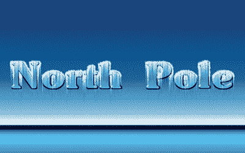

*享受这个酷炫的教程吧*。

在这个教程中，你将使用**拾取和滑动**滤镜来随机化选择区域的边缘，然后应用**风**滤镜来生成冰柱。你已经在 5.3 破损文本中使用了**拾取**滤镜，所以你应该熟悉它是如何工作的。滑动滤镜是一个相当标准的噪声滤镜；它通过用附近像素的颜色替换随机选择的像素的颜色来工作。

这里的教训是，你很少能找到一个能完全满足你所需效果的单一滤镜。你必须学会组合使用滤镜，并且按照正确的顺序使用。

## 创建背景和文本

打开一个新的白色画布，设置为默认大小（640 × 400 像素）。

1.  从工具箱中选择**混合**工具。在工具选项对话框中，点击**重置**按钮，然后从渐变菜单中选择**地平线 2**。这个渐变将背景填充成类似地平线的样子。从画布窗口的顶部向下拖动，直到底部。当你拖动超过画布窗口时，你实际上是在拉伸渐变。结果是模拟的地平线接近画布的底部边缘。地平线的位置并不重要，因为你只是使用这个蓝色背景来增加设计的霜冻感。

    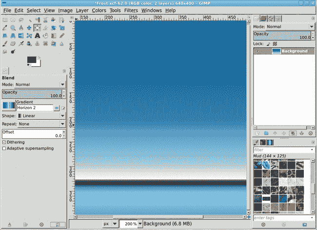

    *使用工具选项对话框中的渐变菜单选择**地平线 2**渐变。

1.  复制背景图层（**图层**▸**复制图层**）。你将很快将复制的背景图层与浮雕文字图层合并。

1.  选择**文本**工具。将字体颜色设置为黑色并选择粗体字体。我选择了 SoutaneBlack Thin，设置为 100 像素。点击画布并输入*北极*。

1.  使用**对齐**工具将文本居中于画布上。

1.  通过选择**图层**▸**透明度**▸**alpha 到选择**来创建文本的选择。将选择保存到通道（**选择**▸**保存到通道**）。点击通道名称并将其更改为*轮廓*。

1.  取消全选（CTRL-SHIFT-A）。

    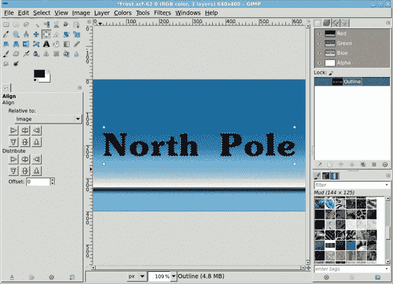

    *将文本轮廓保存到通道中。*

## 将文本向前移动

1.  在图层对话框中点击文本层，通过选择**图层**▸**向下合并**将其与副本背景层合并。点击图层名称，将其更改为*文本层*。

    

    *将文本层与背景层的副本合并，为浮雕效果做准备。*

1.  将文本层的模式设置为**颗粒合并**。一旦文本被浮雕处理，颗粒合并模式将允许文本边缘与原始背景层融合。

1.  现在你可以对文本层进行浮雕效果处理（**滤镜**▸**扭曲**▸**浮雕**）。使用**浮雕**功能，然后将方位角设置为**313 度**，仰角设置为**39 度**，深度设置为**19**。根据你使用的字体，你可能需要更改这些设置，但如果你使用粗体字体，类似的设置应该对你很适用。点击**确定**应用此滤镜。

1.  在通道对话框中右键点击保存的**轮廓**通道，并选择**通道到选择**。记住这个过程；你很快将需要重新创建这个选择。

1.  将选择区域扩展**2 像素**（**选择**▸**扩展**）。

1.  将选择区域羽化**1.6 像素**（**选择**▸**羽化**），然后反转它（**选择**▸**反转**）。这将选择除了字母之外的所有内容。

1.  在图层对话框中点击**文本层**使其变为活动状态。从文本层剪切此选择（CTRL-X）。这将留下带有彩色背景的浮雕文本。

    

    *浮雕滤镜有两个功能选项：凹凸贴图和浮雕。对于本教程，请使用浮雕选项。注意，文本的最内部区域呈现出背景层的外观。*

    

    *通过移除文本层的周围部分，由于文本层的颗粒合并模式，你将得到更深的背景和更亮的文本。*

1.  当前选择仍然会显示，但你应该替换它。再次检索**轮廓**通道的选择。将此选择扩展**2 像素**（**选择**▸**扩展**），并将其保存到另一个通道。将此通道命名为*描边*。

1.  将前景色设置为白色。在新创建的描边通道中，使用**3 像素**的线宽（**编辑**▸**描边选择**）描边选择区域，然后取消选择所有内容（CTRL-SHIFT-A）。暂时打开此通道的可见性，以便在接下来的几个步骤中查看操作。

    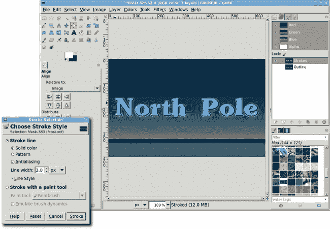

    *这种技术与之前教程中使用的技术不同。在这里，描边操作是在通道中而不是在图层中进行的。*

1.  打开“拾取”滤镜（**滤镜**▸**噪声**▸**拾取**）。将随机种子设置为**10**，随机化滑块设置为**30%**，重复滑块设置为**2 次**。点击**确定**将这组设置应用到描边通道。在通道中而不是在图层中工作，可以让你轻松创建一个可以稍后转换为选择并填充为白色的形状。并非所有滤镜都在通道中工作。幸运的是，噪声滤镜是一个例外，效果非常好。

    

    *使用“拾取”滤镜为保存的选择通道添加噪声。*

1.  打开“涂抹”滤镜（**滤镜**▸**噪声**▸**涂抹**）。将随机种子设置为**100**，随机化滑块设置为**30%**，重复滑块设置为**3 次**。点击**确定**将这组设置应用到描边通道。

1.  “拾取”和“涂抹”滤镜向图层或选择区域添加一些随机扰动。噪声滤镜可能在通道顶部产生伪影。如果发生这种情况，在通道顶部创建一个选择区域并将其填充为黑色。

## 添加雪

1.  在“图层”对话框中，添加一个透明图层并将其命名为*雪*。

1.  将**描边**通道作为选择区域检索（从“通道”对话框）。

1.  使用**矩形选择**工具将选择区域裁剪到最高字母高度的一半。在工具选项对话框中，将模式设置为**减去**。裁剪选择区域的下半部分后，按回车键接受对选择区域的变化。

    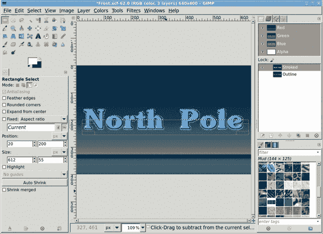

    *使用矩形选择工具裁剪描边选择。*

1.  从当前选择中减去轮廓通道。为此，在“通道”对话框中选择**轮廓**通道，然后按住 CTRL 键，点击该对话框底部的**通道到选择**按钮。

1.  通过**3 像素**对结果选择区域进行羽化（**选择**▸**羽化**）。

1.  在“图层”对话框中点击**雪**图层，然后填充选择区域为白色。

1.  取消所有选择（CTRL-SHIFT-A）。

    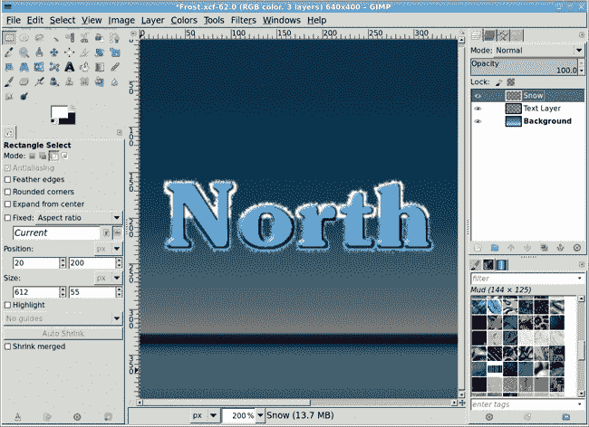

    *从裁剪的描边选择中减去轮廓通道，留下一个位于文本顶部的选择区域。当这个选择区域被填充为白色时，它变成了字母顶部的落雪。*

## 创建下落雪

你在你的文本上堆了一个可爱的雪堆，但你还可以做更多来增强这个设计的冰冻感。

1.  将图像顺时针旋转 90 度（**图像**▸**变换**▸**顺时针旋转 90 度**）。

1.  按 CTRL-J 将窗口调整到图像大小。

1.  打开**风**滤镜（**滤镜**▸**扭曲**▸**风**）。将样式设置为**爆炸**以获得更粗的条纹，将方向设置为**右**以指示风的方向，将边缘影响设置为**前导**以指示条纹应随风从冲击点流动。将阈值滑块设置为**20**，强度滑块设置为**5**。点击**确定**将此滤镜应用到雪层。

1.  重新应用**风**滤镜，这次将样式设置为**风**，方向设置为**右**，边缘影响设置为**前导**。将阈值滑块设置为**20**，强度滑块设置为**20**。第二次应用会添加更多条纹，但会软化整体效果。

    

    *旋转图片并应用风滤镜可以将雪堆变成下落的雪花和冰柱。*

1.  为了添加最后的修饰，首先将图片逆时针旋转 90 度（**图像**▸**变换**▸**旋转 90 度逆时针**）。

1.  再次调整画布大小以适应窗口。

1.  再次打开“Slur”滤镜（**滤镜**▸**噪声**▸**Slur**）。将随机种子设置为**100**，随机化滑块设置为**20%**，重复滑块设置为**2 次**。点击**确定**将此滤镜应用到雪层。这将向雪条中添加冰粒子。

1.  将雪层的模式设置为**颗粒合并**。

1.  复制雪层（**图层**▸**复制图层**），然后将复制图层的模式设置为**叠加**。

1.  如果还没有关闭，请关闭“描边通道”的可见性。

    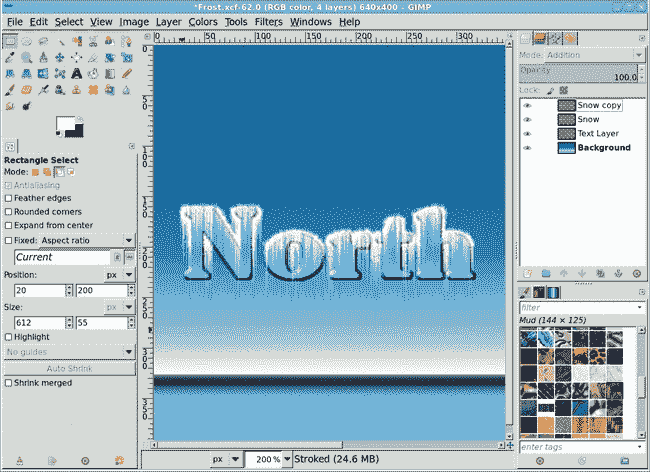

    *当复制雪层与原始雪层结合时，整体雪量会增加。将图层模式设置为叠加。*

## 进一步探索

在这个教程中，你为文本应用了霜冻效果，但这种效果几乎可以应用到任何表面，无论是直的还是弯曲的。你甚至可以将其应用到照片上。使用相同的技巧处理房屋屋顶线的照片，你可以在一天之内将场景从夏天变成冬天！

# 5.5 霓虹灯牌

在数字艺术家的技巧包中最有趣的效果之一是发光的霓虹灯牌。这是 GIMP 用户最早可以使用的技巧之一，至今仍然是掌握起来最容易的。霓虹是一种气体，当通电时会发出红橙色的光。真正的霓虹灯是通过填充发出紫外线的气体（通常是氩气）来发光，以产生不同颜色的光。管内壁涂有荧光物质，当暴露于这些气体产生的紫外线时，荧光物质会发光。

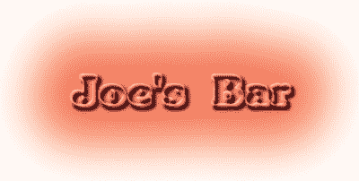

*现在是时候对主题本身进行一些解释了——霓虹灯。*

虽然科学可以解释真实霓虹灯的工作原理，但使用 GIMP 生成的彩色光来模拟发光霓虹灯需要一点魔法。有许多方法可以执行这种魔法，但大多数方法都涉及使用浮雕滤镜将普通线条转换为 3D 管道，并且所有方法都使用一定程度的模糊。

## 尝试内置霓虹效果

在深入研究之前，看看 GIMP 内置的标志生成器。文件▸创建▸标志菜单提供了一系列现成的标志设计。这里展示了自动生成简单霓虹效果的标志滤镜，尽管如你所见，其默认设置产生的效果并不像你将要尝试的效果那样有趣。虽然这些现成的标志适合小型项目，但如果你自己构建效果，你可以创建一个更有深度和特色的图像。

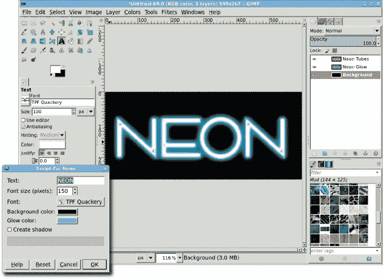

*霓虹标志效果适合小型、快速的项目。*

## 创建背景

首先创建一个背景，霓虹灯光将在默认大小的白色画布（640 × 400 像素）上闪耀。

1.  打开“图案”对话框（**对话框**▸**图案**），找到**砖块**图案，然后将该图案拖动到画布上。这将用所选图案填充画布。

1.  将此图层去饱和（**颜色**▸**去饱和**）。

1.  点击前景色框以启动“更改前景色”对话框，并将 RGB 值设置为**244/0/0**以显示此处所示的深红色。点击**确定**关闭对话框。

    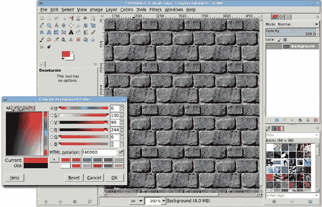

    *为 Joe 的酒吧设定氛围：外墙由砖块构成。*

1.  从工具箱中选择**桶填充**工具。在工具选项对话框中，将模式设置为**柔光**并将受影响区域设置为**填充整个选择**。

1.  在画布内部点击以将砖块染成红色。

## 准备霓虹灯管

现在你可以开始处理标志本身了。

1.  从工具箱中选择**文本**工具，然后选择适合你项目的字体。本例使用 SoutaneBlack Thin，大小为 110 像素，字母间距设置为 5.0。这种粗体字体效果很好，尤其是在你还在学习如何掌握这项技术时，但霓虹灯可以有多种形状，所以请随意实验。

1.  文本颜色应设置为当前前景色，但如果不是，请将 RGB 值设置为**244/0/0**以匹配背景中的红色。

1.  点击画布并输入*Joe’s Bar*。使用**对齐**工具将文本定位在画布中心。

1.  扩展文本图层边界以匹配图像大小（**图层**▸**图层到图像大小**）。这允许你添加原本会被原始图层边界裁剪掉的内容。

    

    *在定位文本后，别忘了通过选择“图层”▸“图层到图像大小”来调整图层大小。*

1.  通过选择**图层**▸**透明度**▸**alpha 到选择**来创建文本轮廓的选择。将此选择保存到通道（**选择**▸**保存到通道**），然后双击通道名称并将其更改为*轮廓*。你稍后会再次使用此通道。

1.  通过**选择**▸**扩大**将选择扩大**3 像素**。

1.  创建一个新的图层（**图层**▸**新建图层**）并将其命名为*描边*。返回图层对话框以查看新图层。

1.  通过选择**编辑**▸**描边选择**并将线宽设置为**5 像素**来描边选择。

1.  删除原始文本图层然后取消选择所有内容（CTRL-SHIFT-A）。你现在有了创建霓虹管的轮廓。

    

    *描边轮廓可能难以看清。添加一个临时的白色图层可能会有所帮助。此外，尝试使用更宽的描边，但请注意：在创建描边选择之前，你可能需要调整文本的字母间距！*

1.  复制描边图层并将副本图层命名为*浮雕*。

1.  打开高斯模糊滤镜（**滤镜**▸**模糊**▸**高斯模糊**）并将此图层模糊**6 像素**。

1.  打开浮雕滤镜（**滤镜**▸**扭曲**▸**浮雕**）。将功能设置为**浮雕**，将方位角滑块设置为**43**，将仰角滑块设置为**30**，将深度滑块设置为**43**。这些设置使浮雕图层具有切割外观。点击**确定**将此滤镜应用于图层。

1.  在图层对话框中选择**图层**▸**堆叠**▸**降低图层**一次，将浮雕图层降低。

1.  将浮雕图层的模式设置为**叠加**。

1.  打开高斯模糊滤镜（**滤镜**▸**模糊**▸**高斯模糊**）并将原始描边图层模糊**6 像素**。将模式设置为**颗粒合并**。

    

    *将浮雕图层移至原始文本下方。将图层模式设置为叠加会将此图层添加到背景图层并使浮雕区域变亮。*

1.  将此图层添加阴影效果（**滤镜**▸**光与阴影**▸**阴影**）。通过设置偏移 X 和偏移 Y 值为**8 像素**来偏移阴影。将模糊半径设置为**6 像素**，将不透明度滑块设置为**100%**，并取消选中**允许调整大小**复选框。如果你选择选中**允许调整大小**复选框，它将调整画布大小并在边缘放置透明区域。这不是本教程所期望的。应用此阴影效果。

1.  描边图层应该仍然处于活动状态，如果不是，请点击图层对话框中的**描边**图层使其再次变为活动状态。

1.  添加第二个阴影。这次，将偏移 X 和偏移 Y 值设置为**9 像素**，模糊半径设置为**15 像素**，并将不透明度滑块设置为**100%**。同样，取消选中**允许调整大小**复选框。应用这些阴影效果会使霓虹管高于背景墙。

1.  将**浮雕**图层移动到**投影**图层之上但**描边**图层之下。

    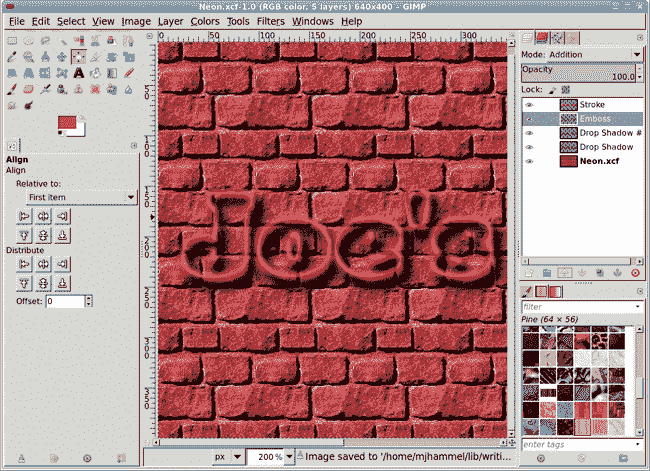

    *在投影滤镜中，正的偏移 X 值表示向右移动，正的偏移 Y 值表示向下移动。注意，两个投影都是应用在浮雕图层之上的。*

## 添加发光效果

1.  通过选择**图层**▸**新建图层**并设置图层填充类型为**透明度**来添加一个透明图层。将新图层命名为*发光*。

1.  通过在通道对话框中点击该通道然后点击**通道到选区**按钮来从通道对话框中检索**轮廓**通道选择。

1.  通过**选择**▸**扩大**扩大选择**25 像素**。注意，扩大选择会使边缘圆润。

1.  通过**15 像素**（**选择**▸**羽化**）羽化选择。

1.  在图层对话框中点击**发光**图层使其变为活动状态。将工具箱中的前景色拖入选择中，用该颜色填充选择，然后取消选择所有内容（CTRL-SHIFT-A）。

1.  打开高斯模糊滤镜（**滤镜**▸**模糊**▸**高斯模糊**）并将模糊度设置为**20 像素**应用于**模糊**图层。通过按两次 CTRL-F 应用相同的模糊两次。模糊的程度由你决定。如果你想使发光效果更加柔和，可以多应用几次模糊。

    

    *霓虹发光效果最初是一个边缘柔和、颜色填充的选择。*

1.  在图层对话框中，将**发光**图层降低到仅高于**背景**图层。

1.  将发光图层的模式设置为**屏幕**。

    

    *如果你喜欢，可以对发光图层应用多次模糊。*

## 添加玻璃边缘反射

1.  添加一个新图层（**图层**▸**新建图层**）。将其移动到图层对话框中的顶部并命名为*高光*。

1.  再次检索**轮廓**通道选择。通过**选择**▸**扩大**扩大这个选择**2 像素**。

1.  将前景色设置为白色，然后在图层对话框中点击**高光**图层使其再次变为活动状态。

1.  通过选择**编辑**▸**描边**并设置线宽为**4 像素**来描边选择，然后取消选择所有内容（CTRL-SHIFT-A）。

1.  通过选择**图层**▸**变换**▸**偏移**来偏移这个图层，并将偏移 X 和偏移 Y 值设置为**-2 像素**。

1.  打开高斯模糊滤镜（**滤镜**▸**模糊**▸**高斯模糊**）并应用**2 像素**的模糊。

1.  在图层对话框中，将**高光**图层移动到最低**投影**图层之下。

1.  将高光图层的模式设置为**硬光**。

    这最后一步真正让霓虹灯管看起来逼真。通过添加光，使灯管看起来更加圆润。

    

    *当白色描边图层的混合模式设置为硬光时，它会拾取颜色。*

## 进一步探索

这种技术有成千上万的变化，适用于文本和图形设计。尝试使用剪贴画而不是文本。使用模糊选择工具选择剪贴画的不连续部分。结果将是你的剪贴画的霓虹轮廓！

# 5.6 喷漆

在 1.2 图层和模式中，你学习了使用图层模式的基本知识，它提供了一种独特的方式将一个图层与另一个图层合并。虽然模式可用于所有 GIMP 绘图工具，但基于工具的模式直接在图层内混合并实际更改图层像素。如果你制作了一系列的笔触，例如，并且想要稍后回溯，这可能会成为一个问题。如果你在首选项对话框中没有指定足够的撤销级别，你可能无法撤销其中的一些笔触。

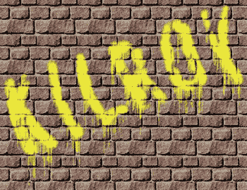

*这不是你常见的涂鸦，但效果很容易实现。*

另一方面，图层模式不会改变任何底层像素。混合仅在合成期间进行，这意味着它发生在 GIMP 将所有图层组合以在画布上生成显示时。这种混合是非破坏性的，并为实验提供了更大的灵活性。

喷漆效果利用图层模式将绘制的图层与纹理图层混合。在上一个教程中，您使用了图层模式将霓虹灯投射的光与后面的砖墙合并。同样的过程也适用于喷漆纹理表面。首先创建表面，然后在第一层之上添加喷漆图层，最后使用图层模式将两者混合在一起。

## 创建背景

就像上一个教程中做的那样开始，创建一个砖墙。打开一个新的画布窗口，使用默认大小。从图案对话框中点击并拖动**砖块**图案到画布上。在画布区域输入**D**和**X**以设置前景色为白色。

## 添加文本轮廓

1.  从工具箱中选择**文本**工具，并在工具选项对话框中选择字体和字体大小。本例使用 XBAND Rough 字体大小为 210 像素。

1.  点击画布并输入*Kilroy*。使用**对齐**工具将文本居中对齐画布。

1.  创建文本的选择（**图层**▸**透明度**▸**Alpha to Selection**）并将该选择保存到通道（**选择**▸**保存到通道**）。

1.  双击通道名称在通道对话框中，并将其更改为*Outline*。

1.  取消选择所有内容（**选择**▸**无**）。

    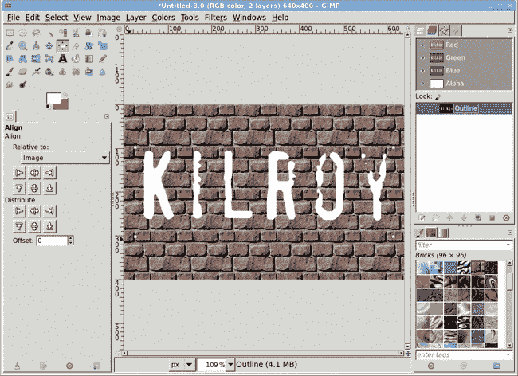

    *文本颜色目前不重要。你只需要在这个阶段有一个轮廓。*

## 将文本转换为喷漆

1.  返回图层对话框并删除文本图层。

1.  通过选择**图层**▸**新建图层**并将图层填充类型设置为**透明度**来添加一个新的透明图层。将新图层命名为*Paint*。

1.  从通道对话框中检索**轮廓**通道选择区域，然后通过**选择**▸**增长**将选择区域扩大**2 像素**，并通过**选择**▸**羽化**将其羽化**10 像素**。这些步骤将软化选择区域的边缘，增强喷漆效果。

1.  点击图层对话框中的**油漆**图层以使其再次变为活动图层。

1.  从画布菜单中选择**Windows**▸**可停靠对话框**▸**画笔**以打开画笔对话框，然后选择**圆形**画笔。

    

    *通过快速蒙版显示的文本选择区域增长和羽化，以指示其软边缘*。

1.  从工具箱中选择**喷枪**工具。在工具选项对话框中，将大小设置为**20**。

1.  点击工具箱中的前景色框以打开更改前景色对话框，在 HTML 字段中输入*黄色*，按回车键，然后关闭对话框。

1.  用快速、不均匀的笔触在选区内部上色，但不要完全填充选区。如果文字看起来还不是喷漆的效果，不用担心。取消所有选择（**选择**▸**无**）。

1.  从工具箱中选择**旋转**工具，并使用它将油漆图层旋转**-20 度**。

1.  打开 IWarp 滤镜（**滤镜**▸**扭曲**▸**IWarp**）。将变形半径设置为**40 像素**，然后通过字母拖动鼠标以轻微扭曲它。这一步使喷漆看起来更加随机。

    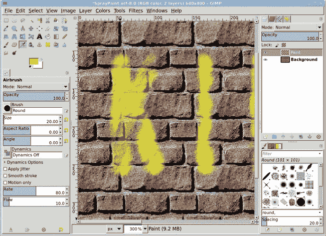

    *选择区域充当你画笔笔触的边界区域*。

    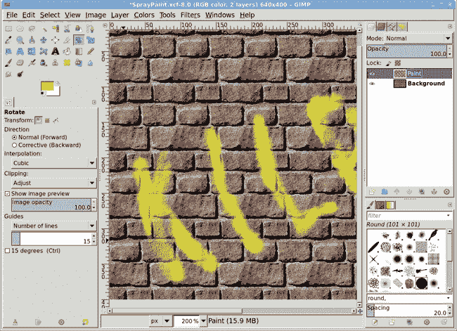

    *旋转和扭曲文字可以使其看起来更像是喷上去的*。

1.  复制油漆图层（**图层**▸**复制图层**）。将原始油漆图层的模式设置为**颜色**，然后将副本图层的模式设置为**颗粒混合**。这些图层模式允许砖块的阴影和裂缝透过你的喷漆显示出来。

    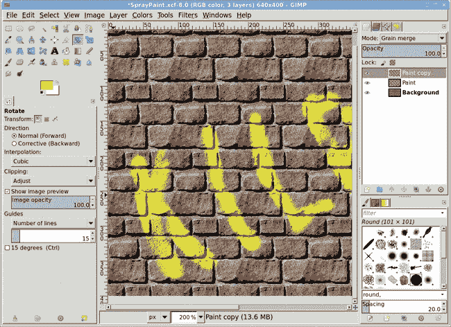

    *更改图层模式会将文字与其下方的墙面混合在一起*。

1.  再次复制原始油漆图层（**图层**▸**复制**），并将此图层命名为*滴落*。

1.  你将重复使用在 5.4 冰霜中创建霜冻冰锥的技术，这次用来创建油漆滴。首先将滴落图层顺时针旋转 90 度（**图层**▸**变换**▸**旋转 90 度顺时针**）。

1.  打开风滤镜（**滤镜**▸**扭曲**▸**风**）。将样式设置为**爆炸**，方向设置为**右**，受影响的边缘设置为**两者**。然后设置阈值到**3**，强度到**20**。点击**确定**将此滤镜应用到滴落图层。

1.  将滴落图层逆时针旋转 90 度（**图层**▸**变换**▸**旋转 90 度逆时针**）。

1.  将滴落层的模式设置为**屏幕**。为了增强滴落效果，可以复制滴落层一次或多次。

    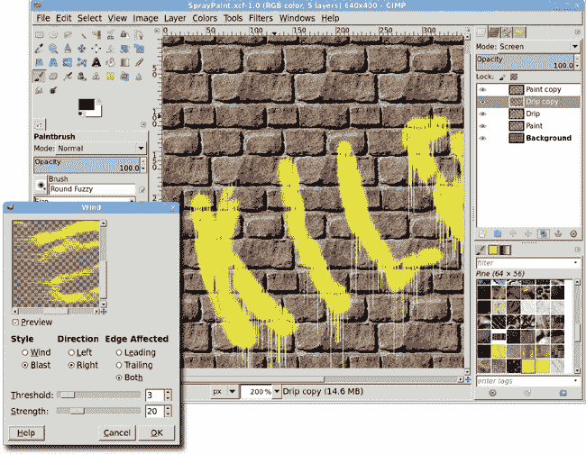

    *旋转的滴落层被风力过滤器击中*。

## 进一步探索

你能从这个教程中学到什么？你已经了解到像风力过滤器这样的简单工具可以服务于广泛的用途，并帮助你实现令人惊讶的多种效果。你已经使用风力过滤器创建了霜冻的冰柱和滴落的油漆。你接下来会创造什么？

# 字体效果技巧

广告、网页设计和许多其他类型的项目涉及将文本与图像结合。当你开始在 GIMP 项目中处理字体时，请考虑这一点。

## 使对齐更简单

在这些教程中，你是否发现自己反复创建文本层，然后将其居中对齐到另一个层上？使用对齐工具可以使这个过程变得轻松。请记住，在画布上点击一个层，在工具选项对话框中设置相对位置选项，然后点击适当的对齐按钮。

## 寻找好字体

一个好的字体可以将你的信息传达得更远。但是，有好字体，也有不那么好的字体。虽然免费字体通常足以用于家庭、教堂、俱乐部和学校项目，但它们可能不会提供与知名字库创建的字体相同的质量或功能。高质量的字体包括适当的字距调整、连字符、完整的字符集、多种字体粗细、甚至小写字母和旧式数字，所有这些都可以为你的字体设计增添更多的影响力。如果你试图将其用于印刷，你将需要支付一些高质量字体的费用。一些商业字库包括以下内容：

+   **Linotype** [`www.linotype.com/`](http://www.linotype.com/)

+   **International Typeface Corporation** [`www.itcfonts.com/`](http://www.itcfonts.com/)

+   **Bitstream** [`www.bitstream.com/fonts/index.html`](http://www.bitstream.com/fonts/index.html)

## 只使用你需要的字体

如果你不是专业出版你的作品，免费字体档案可能提供你所需要的一切。即使在那种情况下，你也需要决定安装哪些字体。拥有 1000 种字体给你提供了很多选择，但 GIMP 使用简单的列表进行字体选择，所以你可能需要滚动几天才能找到它们。删除无用的字体，例如那些包含你不需要的特殊符号和非字母特征。

## 为印刷项目使用大号字体和高分辨率

如果你在一个最终将以 300 dpi 打印的项目中使用 72 dpi 的 12 磅字体，你可能需要显微镜才能阅读它。或者更糟糕的是，打印机的光栅化器可能会放大文本，使其像素化且难以辨认。如果你的项目是用于印刷的，从一开始就将分辨率设置为 300 dpi。记住，缩小很容易优雅地处理，但放大而不给自己带来问题则很困难。

## 记住所有 GIMP 文本都会被转换为位图

你可以在 GIMP 中创建文本，然后将其缩放到更大的尺寸，但前提是文本必须保持在文本图层中。文本图层是矢量图层，这意味着它们可以轻松地缩放或编辑而不会损失质量。它们还包含有关文本实际内容的详细信息。但是一旦该图层被转换为位图，缩放图层或图像应尽量保持最小。

转换为位图的图层只包含彩色像素，可能还有一定程度的透明度。所以即使一个位图图层看起来像文本，也没有关于该文本的信息，缩放它就像缩放任何其他照片一样：你放大得越多，图像就越糟糕。

以类似的方式，当你将图像保存为 JPEG、PNG 或其他任何位图图像格式时，所有图层和文本信息都会丢失。因此，编辑文件将会变得非常困难（甚至不可能）。为了保留图层和文本信息，你必须将文件保存为 XCF 格式，这是 GIMP 的本地文件格式。

## 手动练习排版

在 2.8 版本中，GIMP 增加了边界框，也称为编辑框，用于编辑文本。要将段落映射到特定空间，选择文本工具，并在工具选项对话框中将框选项设置为固定。在画布上单击并拖动编辑框到所需的大小和位置。

如果你有很多文本，将编辑框塑造成所需的大小，然后使用编辑器对话框（从文本工具的工具选项对话框中可用）将文件中的附加文本读取到框中。在塑形框之前插入没有换行符的文本可以创建一个非常宽的边界框，需要你大幅度缩小以找到框的右侧边缘。确保在从文件中读取文本到框中之前塑形框。

## 聪明地编辑文本图层

你可以在创建文本图层后任何时候编辑它，只要没有应用位图效果。例如，应用模糊、曲线或级别更改将图层转换为标准图层。一旦发生这种情况，文本就无法再使用文本工具进行编辑。如果意外发生这种情况，请尝试使用 CTRL-Z 撤消更改，直到图层返回到文本图层。

当你需要编辑文本图层时，在图层对话框中单击它以使其处于活动状态，从工具箱中选择文本工具，然后在画布上单击该图层中的任何字母。

## 提前规划

就像任何项目一样，一个平面设计项目需要一个高效的流程。你的项目几乎总是有两个目标：它注定要用于印刷或网络，并且旨在宣传或提供信息。为了达到这些目标，你必须是有组织的。在实际上在 GIMP 中开始工作之前，知道你的文本应该说什么以及它应该看起来如何，可以减少你以后需要做出更改的可能性，那时它们将导致过度的工作。规划你的文本只是开始，然而。提前考虑图像、颜色、主题和信息。这些都是设计师工作流程的一部分。

## 创建字体映射

字体映射是一个包含一个或多个字体示例的图像。GIMP 可以为你自动完成这项工作，尽管这个功能有点隐藏的宝石。在工具选项对话框中点击字体预览以打开菜单。菜单底部是一个按钮栏。使用最右边的按钮打开字体选择对话框。

右键点击任何条目并选择渲染字体映射以打开一个对话框来选择要渲染的字体。使用过滤器字段来限制要渲染的字体集合。例如，你可以在过滤器字段中输入`^as`来为每个以字母`as`开头的字体创建一个。
