# 第六章 创意灵感

在《GIMP 艺术家指南》的第二版中，我想鼓励读者超越简单的桌面艺术，使用 GIMP 进行创作。Photoshop 可以实现的大多数艺术效果用 GIMP 也能轻松实现，原因很简单：它们的根源都在于对像素的调整。它们的菜单和用户界面不同，但底层过程却惊人地相似。

我经常将从 Photoshop 转到 GIMP 的过程比作从一个城市搬到另一个城市。当你搬到一座新城市时，需要时间来找到杂货店或剧院的路线。但一旦你学会了如何到达那里，杂货店和剧院可能和你离开的那里的非常相似。所以 GIMP 也是如此。需要耐心来找到执行特定任务的工具或过滤器，但最终的结果将对你来说同样可识别和熟悉。

没有理由认为，一旦你熟悉了 GIMP，你就不能创作出自己的艺术作品。GIMP 不必仅仅是一个美化了的图标编辑器或照片修饰工具。它远不止于此：它是表达自我的工具。

*我喜欢使用库存图片，并反复扭曲它们，直到创造出我自己的小世界。*

现在，诚然，艺术是非常个人化的事情。一个人的艺术可能是另一个人的鱼包装纸。但这并不改变这样一个事实：你仍然可以用 GIMP 创作出你愿意装裱并挂在自家墙上的艺术作品。另一方面，你的配偶、重要他人或室友可能会有不同的想法。

话虽如此，我想通过一些高级教程来展示如何仅仅为了创意而创意。这些教程建立在之前教程中学到的技巧之上，并为你自己的艺术作品打下基础：初步设计、外部图像的整合、上色以及高光和阴影。通过这些来逐渐展现你内心的梵高。

这些教程将假设你对 GIMP 的工具、菜单、对话框和过滤器有更深入的理解。但别担心……我不会让你完全无助！所以大胆地深入探索你的创意面！

# 6.1 火女

这个效果创造了一个被火焰环绕的幽灵般的形象——一个恶魔、一个天使、一个鬼魂，或者一个精灵，这取决于你的视角。我简单地称她为火女。创建这个效果的过程可以简化为以下基本步骤：

1.  将女孩从背景中分离出来。

1.  在多个图层上检测女孩的边缘。

1.  添加并混合装饰性元素。

1.  混合以去除多余的细节。

1.  添加火焰和色彩。

1.  添加背景标志。

在整个项目中，您会发现火焰不仅仅是图像的组成部分，还被用来上色。使用火焰给图层上色的简单方法是首先去饱和图层，然后在上面添加一个火焰图层，并将火焰图层的混合模式设置为“看起来合适”的模式。然而，如果您在火焰图层下方放置一个图像，火焰周围的黑色区域可能会根据火焰图层的混合模式阻止下层可见。为了避免这种情况，您将在火焰图层上使用图层蒙版，或者简单地复制和粘贴火焰，注意从源图像中省略黑色背景。

注意，即使您完全按照这个教程操作，您也不会得到相同的图像。步骤允许太多的变化，尤其是在创建火焰王冠时。如果您的第一次尝试不够理想，请不要气馁。我在确定这个流程之前经历了七个不同的设计。而且，为了对自己宽容，前四或五个设计我永远不会在公共场合展示。我甚至不会把它们给我的妻子看。

本教程的过程从一个大画布（2350 × 2033）开始，以制作一个打印就绪的设计。为了减少内存和 CPU 需求，您可以在开始之前将库存图片缩小 50%。

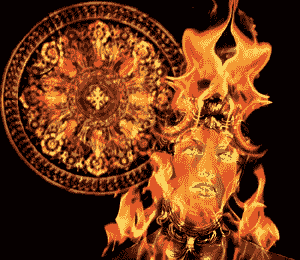

*在这个项目中使用了几个库存图片，但最终结果与那些原始图片相差甚远。*

## 将女孩从背景中分离

本项目的第一步是将女孩从她的背景中分离出来。这主要是因为女孩的源图像中的背景对于项目来说不是必需的，并且其颜色可能与其他图层混合时引起问题。将女孩分离出来还将允许在背后添加背景元素。

1.  将源图像去饱和（**颜色**▸**去饱和**）并选择**亮度**选项。当从原始颜色空间（在从库存图片网站下载时提供的图像中）转换为 GIMP 中的颜色管理显示时，源图像会有一种黄色调。当在去饱和对话框中选择亮度选项时，黄色调会转换为明亮的白色。如果您不使用颜色管理显示，那么在去饱和对话框中选择哪个设置可能无关紧要。

1.  使用**按颜色选择**。在工具选项对话框中，将阈值设置为**50**并点击白色背景。这将选择所有背景，一些头发，以及一些脸部和颈部。

1.  切换到**快速蒙版**模式，并使用黑色前景色和大型画笔在女孩身上涂抹出白色区域。关闭快速蒙版模式并反转选择。

    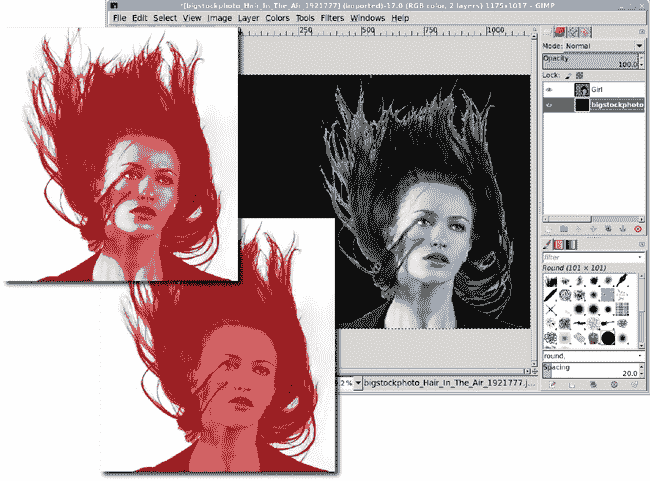

    *在快速蒙版颜色中使用黑色绘制将面部和颈部的白色区域着色，有效地将这些区域从选择中去除。头发周围的糟糕选择无关紧要——你将在下一步去除毛发。*

1.  将选择复制并粘贴到一个新图层，并将其命名为*女孩*。使用**图层**▸**图层到图像大小**将新图层调整到画布大小，以便对女孩所做的任何修改都不会受到图层大小的限制。

1.  在原始图层（默认标题为“背景”）中，使用 CTRL-A 选择整个图层，然后将黑色前景色拖入画布以填充该图层。

1.  现在是时候使用图层蒙版去除毛发。向“女孩”图层添加一个白色图层蒙版。从大画笔开始，切换到小画笔，在图层蒙版中用黑色绘制，直到大多数毛发被去除。留下少量毛发，以便在使用边缘检测滤镜时提供额外的视觉特征。关闭“女孩”图层的可见性，以免干扰下一步。应用图层蒙版（**图层**▸**蒙版**▸**应用图层蒙版**）。

    

    *脸部毛发将在稍后清理。只留下头顶周围的一点点毛发。*

## 使用边缘检测创建多个图层

本项目的下一步是使用边缘检测滤镜创建女孩的详细轮廓。将使用两个这样的滤镜：**滤镜**▸**边缘检测**▸**边缘**和**滤镜**▸**边缘检测**▸**霓虹**。这些滤镜会产生类似的结果，将使用图层模式进行组合。

1.  复制“女孩”图层，在图层对话框中使复制图层可见，并将其命名为*边缘检测*。打开**边缘检测**滤镜并选择**Prewitt 罗盘**算法。算法的选择基于预览。选择显示最多细节的算法。将滤镜应用于图层并将图层模式设置为**屏幕**。

1.  复制“女孩”图层，并再次打开复制图层的可见性，这次将新图层命名为*霓虹检测*。将此图层移动到图层堆栈的顶部。

1.  在此图层中反转颜色（**颜色**▸**反转**），然后应用**霓虹**边缘检测滤镜。将图层模式设置为**屏幕**。复制此图层，在“女孩”图层上方创建三个边缘检测图层。

    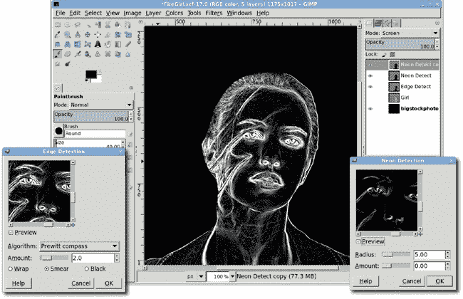

    *可能需要多个设置为屏幕或加法的边缘检测图层副本来突出项目中的细节。在这个项目中，只需要一个额外的图层。*

放大查看，你可能会发现一些之前在“女孩”图层上应用蒙版时遗漏的毛发。这些可以保留，或者可以使用橡皮擦去除。如果使用橡皮擦，可能需要在三个边缘检测图层的相同区域上应用。

## 添加装饰元素

现在是时候装饰女孩了。找到这些类型设计最好的地方是在装饰性的画框和建筑结构上。这个项目只使用了画框，因为我找不到任何真正好的维多利亚式建筑的照片。

设计中添加了两个装饰件：一个在额头，一个在颈部周围。前者来自一个主要呈矩形的框架，而后者来自一个椭圆形的框架。

1.  从一个矩形框架的图像开始，并对其进行去饱和处理。（选择一个易于隔离的框架，比如这个有纯色背景的框架。）

1.  使用**模糊选择**工具，阈值设置为**50**。在框架外部单击一次，然后按住 SHIFT 键在内部单击以创建背景的完整选择。将选择区域扩大**1 像素**（我几乎总是这样做以避免选中对象边缘的光色像素），然后反转选择。

1.  将框架复制并粘贴到工作画布上，作为图层堆栈顶部的新的图层。将其命名为*装饰：额头*。图层模式应设置为**正常**。

1.  缩放、旋转并定位**装饰：额头**图层在女孩的脸部上方。使用图层蒙版去除框架不需要的侧面和边缘。复制图层并将复制图层的模式设置为** dodge**。在去饱和的正常模式原始图上使用复制图层可以增强对比度（在这种情况下，它使我们的女孩看起来更闪亮）。

    

    *缩放、旋转和定位的过程需要实验。如果将工具选项预览设置为网格而不是图像，旋转和缩放会更简单。*

颈部周围的装饰以相同的方式创建，尽管开始时使用的是不同的框架。旋转、大小和位置将与额头版本不同，更不用说蒙版方式也不同。在这个例子中，保留了框架的底部边缘，其余部分被蒙版遮盖。

1.  将另一个框架选择复制并粘贴为新的图层。这个复制的图层名称为*装饰：颈部*。适当地旋转、调整大小、定位和蒙版。最后，添加蒙版以仅保留（现在）框架的底部部分。

1.  复制颈部图层并将图层模式更改为**dodge**。

注意，在这个例子中，实际的帧图像比主图像窗口小，但比女孩大。这需要缩小帧的大小。如果它们太小，可以放大它们。这很少做，因为放大的图像很快就会变得像素化。然而，在这种情况下，由于弱识别形状（华丽的结构没有可识别的对象——它只是波浪线），像素化几乎不明显。此外，使用多个帧层和混合层模式可以隐藏一些像素化，后来用火焰着色可以隐藏更多。这个图像的巨大尺寸在工作时也隐藏了一些像素化。然而，大型印刷品可能会显示出像素化。因此，当层放大时，任何这种尺寸图像的打印品都不应大于杂志或书页的大小。

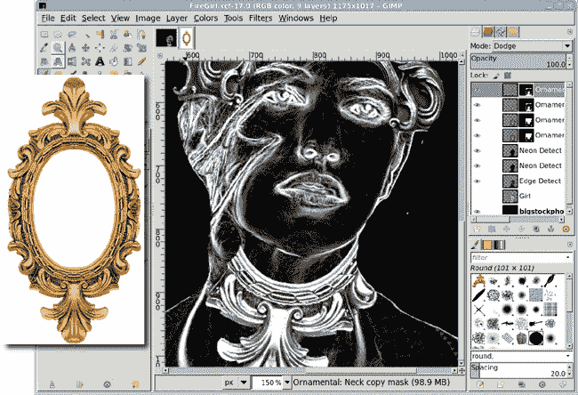

*稍后您可能会发现，用火焰着色会使装饰层显得相当单调。如果发生这种情况，请尝试返回这些步骤并使用未去饱和的框架。*

## 混合以去除多余细节

装饰品可能无法像期望的那样隐藏很多头发或面部瑕疵。要从女孩的脸上移除这些，使用橡皮擦和模糊工具以及绘图板。如果您没有绘图板，只需使用较小的画笔并手动调整不透明度。

### 注意

*绘图板是平面输入设备，一些带有内置显示屏，使用触控笔。用触控笔在绘图板上绘图会将光标移动到显示器上，就像移动鼠标一样。这些板通常通过串行或 USB 端口连接到计算机。许多艺术家发现使用绘图板进行设计工作比使用标准鼠标更容易。流行的绘图板制造商包括 Wacom、Genius、Adesso 和 Aiptek。*

在边缘检测层中可以进行模糊处理（白色和黑色，当模糊时，会给出灰色阴影），但最好保留一些脸部线条细节。为了实现这一点，使用带有粗糙刷子的橡皮擦，并将画笔动态设置为在用绘图板（或手动用不同的笔触）施加压力时增加不透明度、硬度和大小。

1.  将橡皮擦应用于每个边缘检测层，从这三个层中最上面的开始。在移动到下一个层之前，每个层只做一小部分，然后旋转回顶部并重复。目标是尽量保留尽可能多的细节，同时去除女孩脸上的明显瑕疵。

    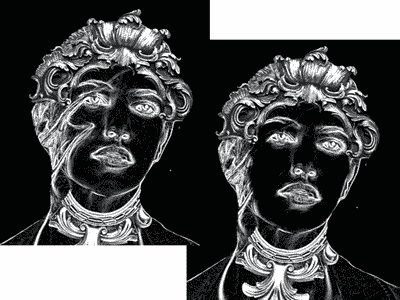

    *请注意，耳朵上的头发没有被触及。这只会增强后来添加的火焰的随机性。*

1.  关闭三个边缘检测层的可见性，并打开**女孩**层的可见性。为女孩层启用**锁定 Alpha 通道**选项。

1.  选择**涂抹**工具，使用任何合适的画笔将此图层中的头发混合掉。尝试通过首先在较亮区域（脸颊）点击并拖动到较暗区域（头发）来保持脸颊的照明平滑。同时涂抹颈部和衣服。

1.  当图层**锁定**启用时，你不必小心不要将涂抹超出女孩的范围。

1.  完成后，打开边缘检测图层的可见性。

    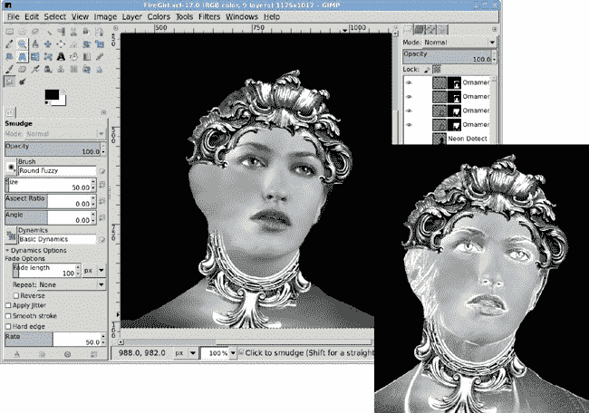

    *边缘检测图层（右下角）在原始女孩图层被涂抹后，给女孩图层带来了一种更玻璃般的外观。为了增加效果，考虑完全删除女孩图层，以显著改变最终图像。*

## 添加火焰着色

1.  从图层对话框中选择**女孩**图层。打开着色对话框，并将色调、饱和度和亮度分别设置为**30**、**90**和**-30**。

1.  在图层堆栈顶部打开并复制一个熊熊燃烧的火焰图像（火焰和黑色背景）作为新图层。调整图层大小，使火焰完全覆盖女孩，然后裁剪图层以适应图像（**图层**▸**图层到图像大小**）。将图层模式设置为**硬光**。这使火焰中的红色更加突出。

1.  图层可能不会跨越图像的宽度。在这种情况下，你可能会得到一个白色带填充额外空间。如果发生这种情况，使用**模糊选择**工具，扩大**1**倍，并用黑色填充选择区域。

1.  在这个阶段，火焰遮住了女孩的脸。你有几个选择：让它保持原样（因为你认为这样看起来很酷），使用涂抹工具，或者为火焰层添加一个图层蒙版，以便让脸和饰品透出来。

    

    *使用大号、边缘清晰的画笔（圆形 101，大小为 150 像素）和喷枪轻轻去除女孩脸上的火焰。*

## 创建火焰王冠

创建王冠的过程很简单，但你可能需要尝试几次才能做到正确。

1.  从这里显示的火焰图像开始——一个火焰，而不是熊熊燃烧的火焰。仅将火焰（不是黑色背景）复制到工作画布上。将新图层命名为*火焰帽子*。调整此图层的大小，使其从女孩的额头到图像顶部。

1.  复制此图层，水平翻转，并将副本放置在原始火焰帽子图层附近。

1.  在火焰帽子复制图层上使用蒙版，根据需要混合火焰。然后通过选择两个图层中的顶层并选择**图层**▸**合并向下**来合并这两个图层。

1.  将合并的图层移动到图像窗口的中间，并将图层大小调整到图像大小。现在你有了基本的火焰帽子框架，周围有空间来创建火焰漩涡。

    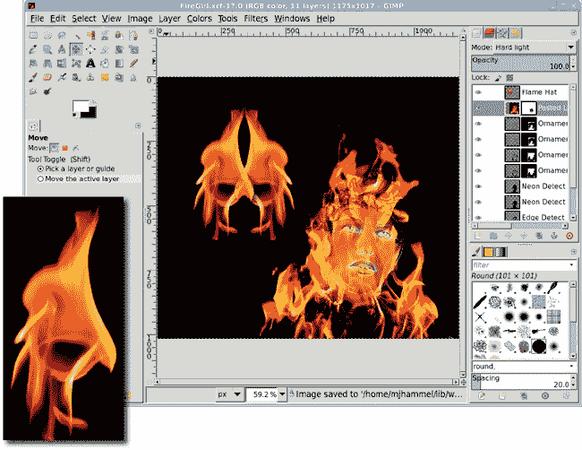

    *库存火焰图像本身就是一个很好的帽子，但我发现其向下指向的高光有点令人沮丧。所以接下来我会应用一点扭曲魔法。*

1.  使用 IWarp 滤镜（**滤镜**▸**扭曲**▸**IWarp**）来创建火焰漩涡。使用 **Swirl CW** 模式旋转帽子的左侧，使用 **Swirl CCW** 模式旋转帽子的右侧。在每个侧面选择一个或多个可以形成良好漩涡的位置。在不同的预览位置点击（而不是拖动）以创建几乎均匀外观的漩涡。点击并保持也可以，但保持的时间不要太长，否则漩涡会变得太大。

1.  尝试调整 **变形半径** 和 **变形量**，以及在哪里点击预览。如果预览变得混乱或者你不喜欢它，请按重置并再次尝试。记住：这一步需要大量的实验！

1.  在将 IWarp 设置应用于 **火焰帽子** 图层后，将帽子定位并旋转到女孩的头上。将图层模式设置为 **屏幕**。从上面的着色步骤中添加另一个咆哮的火焰副本，将其缩放以使整个火焰适合在帽子里。将咆哮火焰图层的图层模式设置为 **屏幕**。使用图层蒙版将其融合到帽子里。

## 进一步探索

为了给这个项目增添一种玛雅风格，从 GIMP Paint Shop 收集中选择曼荼罗画笔（或任何合适的椭圆形图标转换为画笔）。使用画笔工具并增加画笔的缩放，直到单次点击大约是图像窗口大小的 3/4。在背景图层之上添加一个透明图层，将前景色设置为白色，并在新图层中点击一次。

### 注意

*GIMP Paint Shop 是一个包含画笔、图案、调色板和工具预设的附加包，允许用户模拟特定的绘画和绘画工具和技术，例如水彩、蓝色墨水笔和炭笔。GIMP Paint Shop 可在以下网址获取* [`code.google.com/p/gps-gimp-paint-studio/`](http://code.google.com/p/gps-gimp-paint-studio/)。

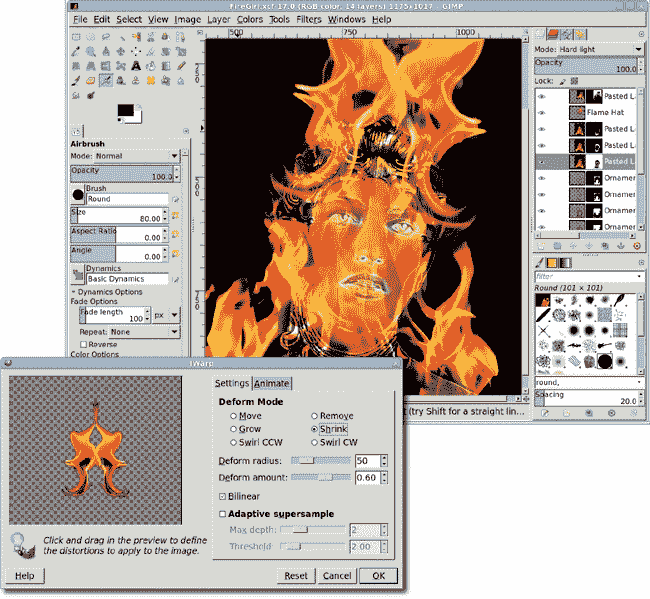

*复制火焰图层，遮罩不同的部分，然后设置不同的图层模式也可以影响你艺术作品的最终版本。不要害怕实验——只是确保定期保存你的作品！*

在曼荼罗印记层之上，添加一个新的图层，并在其中放置咆哮的火焰图像。将火焰图像缩放以覆盖大部分印记，并将图层模式设置为乘法模式。

为了增强火焰帽子，添加一个火焰徽章。徽章可以是库存图像或手工制作的图像，复制、粘贴、缩放、旋转并定位在帽子上。与 IWarp 漩涡相比，这简直是小菜一碟，对吧？

# 6.2 星空

创建一个奇幻的科幻星系的流程实际上非常简单。你只需创建一个随机星系，它通过星团和星空来反映真实的夜空；在其上方叠加元素，如附近的螺旋和礼帽形状的星系、太空尘埃和星云、前景中的大星星；然后为结果上色。对于那些想要更多亮点的人来说，你还可以添加一个附近的行星或宇宙飞船。

最后一步是最难的，尽管 GIMP 的球体设计器过滤器使创建行星变得相当容易。除了最后一步之外，你可能大部分时间都会花在调整星星簇上。

*这可能是迪士尼的《黑洞》中的一幕，或者是《大爆炸理论》的开场场景。* *无论如何，这不仅仅是一个普通的星系。*

### 注意

*这个教程是基于 Greg Martin 在 Photoshop 教程中描述的过程* ([`www.gallery.artofgregmartin.com/tuts_arts/making_a_star_field.html`](http://www.gallery.artofgregmartin.com/tuts_arts/making_a_star_field.html))。*我已经将其翻译成 GIMP 特定的方法，但我的基本流程受到了他的启发。*

## 从小开始

这个流程的核心是使用噪声过滤器，它们在黑色背景上提供随机点。然而，这些点对于典型的项目来说太小了，尤其是那些打算用于印刷的项目。为了解决这个问题，从星星的小规模版本开始，然后将图像放大。通常，我不会推荐放大这样的光栅图像。使用噪声创建光点是这一规则的少数例外之一。这个项目的第一层将产生远处的背景星星集合。

1.  从一个设置为 640 **×** 480 像素，背景为白色的新图像开始。在图像窗口中输入**D**以重置前景和背景颜色到它们的默认设置，即黑色和白色。将前景颜色从工具箱拖动到图像窗口中，以用黑色填充背景层。

1.  向图像窗口添加一个新层（**图层**▸**新建图层**），并将该层命名为*小星星*。将图层颜色设置为前景颜色。打开 HSV 噪声过滤器（**滤镜**▸**噪声**▸**HSV 噪声**）。将色调保持为**3**，色调为**20**，饱和度为**90**，亮度为**100**。通过点击**确定**将此应用于图层。

1.  HSV 噪声以彩色渲染噪声，因此该层需要去饱和。打开去饱和对话框（**颜色**▸**去饱和**）并使用**亮度**设置。点击**确定**以应用于图层。

1.  渲染的噪声分布是随机的，但有点过于密集。打开亮度-对比度对话框（**颜色**▸**亮度-对比度**）。将亮度设置为**45**，对比度设置为**65**，然后点击**确定**。结果将会有更少的星星，其中一些会稍微亮一些。

1.  这些设置是可变的，这意味着改变它们可以对图像的最终外观产生重要影响。将两者都增加以进一步减少小星星的数量。但要注意不要使星星太亮。记住，这些只是背景和远处的星星。更亮、更明显的星星和星团即将到来。

这个项目处理的是非常小的光点，在显示器上可能很难看到，在打印时更难看到。为了更容易看到发生的情况，通过**300%**放大图像窗口。当图像对比度在打印中更容易看到时，再缩小图像。

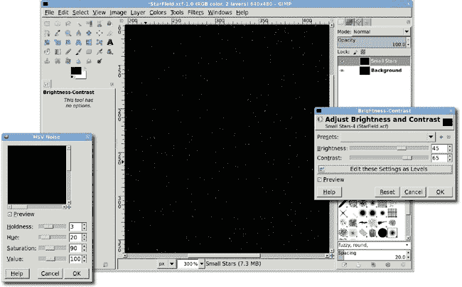

*截图中的缩放比例（300%）可以在图像窗口的状态栏中看到。在去饱和度对话框中选择的亮度设置是因为它比其他选项更能增加点的亮度。*

## 放大星星

背景星星就足够了。接下来是一些更大、更远的星星。

1.  复制“小星星”图层（**图层**▸**复制**），并将新图层命名为“大星星”。在亮度-对比度对话框中稍微减少星星的亮度，亮度设置为**50**，对比度设置为**110**。

1.  下一步需要将这些星星放大很多。将图层放大到**200%**（**图层**▸**缩放图层**）。选择百分比选项。使用百分比将更容易知道稍后缩放此图层时的缩放量。使用默认设置进行质量插值选项。

1.  在不放大图像的情况下放大图层，使得图层比图像大小还要大。现在这并不重要；下一步仍将对整个图层进行操作，稍后调整大小将使图层重新适应图像大小。

    

    *这里显示的过度图层，图层边界扩展到可见的黑色图层之外，不会引起问题。即使部分不可见，更改仍将应用于整个图层。*

将图层放大 200%有助于使大星星更明显，但它们仍然很难看。是时候解决这个问题了。

1.  反转“大星星”图层的颜色（**颜色**▸**反转**）。此时大星星将会相当暗。接下来的这一步将改善这种情况。

1.  打开“色阶”对话框（**颜色**▸**色阶**）。将黑色点设置为**230**，中点（也称为伽玛）设置为**1.00**，白色点设置为**250**。色阶调整将使大星星变暗并更加清晰。反转颜色使选择正确的色阶调整设置更容易。如果这些设置没有改善星星，尝试提高黑色和白色点的值。

    

    *当你在电脑上处理这一步时，你会看到反转后的版本非常清晰，这使得选择层级设置变得更容易。*

1.  再次反转颜色。现在可以缩小图层的大小，但不是完全缩小。要将它缩小到原始大小，你需要将图层缩放至 50%（或当前大小的一半）。这是你项目中的另一个可变点。相反，将图层缩放至当前大小的**60%**。这样，星星就会比它们的小星星表亲略大。如果这还不够大，可以增加百分比。但不要让这些星星太大。后续的聚类过程将突出显示更亮、更大的星星群。缩放后，使用**图层**▸**图层到图像大小**菜单选项调整图层以适应图像，实际上就是裁剪多余的图层。

    

    *大星星只比小星星略大，后续的聚类过程将改善两者的外观。*

## 在更大规模上工作

现在是时候放大整个项目了。放大将产生一个更适合打印或网络的更漂亮的星星场。这也使得其他步骤更容易看到。记住，由于 HSV 噪声滤镜产生的噪声大小，开始时使用较小的图像大小是必要的。

1.  将图像（**图像**▸**缩放图像**）缩放至**250%**。宽度和高度右侧的链接图标应该是完整的。这将保持宽高比，使星星保持基本上是圆形的。

1.  将大型星星层的模式设置为**屏幕**。现在，整个遥远的小星星和较近的大星星都应该可见。新的图像大小应该是 1600 × 1200 像素。

1.  在这一点上，你会更好地了解你在上一步中进行的层级调整效果如何。如果大星星太亮，应用另一个层级调整或更改亮度-对比度以稍微变暗。

    

    *在将大星星与背景小星星缩放和混合后，很明显大星星太亮了，所以使用了亮度-对比度对话框来降低它们的亮度。*

## 添加空间空洞

这是一个很棒的星星场，但还有很多可以改进的地方。首先是要在空间中创建一些空洞，即星星稀少的地方。这个步骤一开始可能看起来有些笨拙。没有特定的配方来决定哪些区域需要擦除。

这里的目标是创建一些空白的空间区域。在执行聚类过程时，这些区域可能会再次被星星填满。现在，清理掉大块区域。在大型星星层上也不要害羞。相信我：当你到达聚类步骤时，不需要留下很多大星星。

1.  为 **大型恒星** 和 **小型恒星** 层添加白色图层蒙版（**图层**▸**蒙版**▸**添加图层蒙版**）。从工具箱中选择 **画笔** 工具，并选择一个相当大的画笔。在工具选项对话框中，将画笔的初始不透明度设置为 **50%**。在图像窗口中输入 **D** 以确保前景色重置为黑色。现在逐层绘画，擦除大量星星。

1.  无论你选择哪种画笔，都要将其大小增加到用于大型恒星层。尝试不同的画笔，并在使用过程中调整它们的透明度。

1.  避免在空白区域中形成任何明显的图案，并移除在将亮度-对比度和级别调整应用于原始 HSV 噪声时创建的任何图案。使用短画笔笔触，交替垂直和水平笔触方向。

1.  当空白区域众多且明显时，首先以 XCF 格式保存项目，这样如果剩余步骤没有产生你梦想中的星场，你可以再次尝试而无需从头开始。最后，将图像（**图像**▸**合并**）合并为单个图层。

    

    *这些放大视图显示，许多大星星的亮度降低，甚至完全消失。背景星星现在也以簇状分布，这对于下一步的簇状排列将很有用。*

## 簇状

这个项目的真正艺术方面在于星星的簇状排列。要创建星系和其他簇，请从工具箱中使用克隆工具。同样，这里可能需要各种画笔，这取决于你个人的品味。硬边画笔似乎能产生最好的效果，但不要害怕尝试几乎任何画笔。

1.  要使用克隆工具，请按住 CTRL 键并在画布上的任何位置单击。这是源位置。释放 CTRL 并开始在画布上的任何位置绘画。在工具选项对话框中，使用 **正常** 模式进行克隆，只是简单地用源位置的像素替换光标下的当前像素。源位置相对于画笔移动，始终保持在当前位置精确的距离和方向。

1.  要获得非常漂亮的簇，在克隆工具的工具选项对话框中交替使用 **正常**、**屏幕** 和 **叠加** 模式。在创建簇时，使用有星星的区域作为源位置。在尝试将簇与其他区域分离时，使用空白区域作为源位置。

1.  尝试创建一些旋转的簇或从正上方或边缘看到的螺旋星系。尝试几次克隆操作，看看你得到了什么，然后使用 CTRL-Z 撤销这些更改并再次尝试。一旦你开始看到簇是如何形成的，你就不需要撤销更改了。在实验过程中，经常保存你的工作，并使用不同的文件，这样你就可以在实验失控时回到之前的变体。

1.  下一步将为星系添加柔和的光晕。复制背景图层（在此阶段，在之前合并图像后应该只有一个图层）并将新图层命名为*星光*。打开高斯模糊滤镜（**滤镜**▸**模糊**▸**高斯模糊**）。将水平和垂直模糊半径设置为 5 到 40 之间的某个值。实际数量取决于您星系群的密度。选择预览窗口中具有最明显白色点的星系。根据该预览调整模糊半径。模糊的结果应该是星光图层呈现出某种云状外观。

    

    *这是一个正常大小的视图（级别略有调整以确保在印刷中显示），在克隆工具的大量工作中完成。看看一组暗淡的背景星星与几颗较大、较近的星星混合，如何变成星系团！*

1.  将星光图层模式设置为** dodge**（用于微妙增强）或** screen**（用于生动增强）。通过一些着色增强了光泽。打开着色对话框（**颜色**▸**着色**）并将色调、饱和度和亮度分别设置为**215**、**90**和**0**。

    

    *星光图层用于突出星系中的细节，同时基本上不改变背景星星。*

## 着色

接下来添加一点颜色。这个过程不会添加颜色爆炸，只是为选定的点添加一点颜色提示。

1.  复制背景图层并将其命名为*红星*。将此图层移动到图层堆栈的顶部。使用**级别**对话框减少可见星星的数量。将黑色点设置为**90**，中点设置为**1.00**，白色点设置为**160**。与其他应用级别对话框的情况一样，这些值可以根据需要调整。

1.  再次打开着色对话框，并将色调、饱和度和亮度滑块分别设置为**0**、**80**和**-10**。将红星图层的图层模式设置为** dodge**。这次不要使用** screen**，因为它会冲淡此过程为图像添加的光色。

1.  重复此过程，根据需要使用级别和着色设置的变体。您还可以使用图层蒙版为复制图层中的不同星星集合着色。

    

    *第一层红色只是将一些蓝色光变成了紫色。创建方式与第一层相同，但着色设置不同，添加并使用图层蒙版混合，以突出强烈的红色阴影。*

## 使用镜头和渐变光晕进行高光

星际背景中明亮的光点需要变得柔和和宽阔。这可以通过使用镜头光晕和渐变光晕滤镜轻松实现。

1.  创建一个新图层，大小为**250** × **250 像素**。将填充类型设置为**前景色**（假设这里的前景色仍然是黑色；如果不是，在画布中输入**D**以重置它）。将新图层命名为*镜头光晕*。将此新图层移动到图层堆栈的顶部。

1.  打开镜头光晕滤镜（**滤镜**▸**光与阴影**▸**镜头光晕**）。不需要更改滤镜选项，因此点击**确定**以在镜头光晕图层中渲染光晕。光晕是有颜色的，你可能不想这样（但嘿，也可以尝试彩色光晕的实验！）因此去饱和它（**颜色**▸**去饱和**）。将图层模式设置为** dodge**，然后使用**移动**工具将图层拖动到一些星团上。

1.  将此图层复制几次，每次稍微放大或缩小，并将副本放置在各个星团上。将光晕中心放置在空间空洞上，以使用光晕的外边缘突出区域。将光晕中心直接放置在星星上，使其更加明亮。这里有趣的是拖动这些小图层，看看它们如何拉出之前未看到的细节。

1.  创建另一个大小为**250** × **250 像素**的黑色图层。将图层模式设置为** dodge**，并将新图层命名为*渐变光晕*。打开渐变光晕滤镜（**滤镜**▸**光与阴影**▸**渐变光晕**）。在选择标签中，选择**Hidden_Planet**、**Bright_Star**或**Distant_Sun**预设。将其渲染到新图层中。去饱和并定位，然后根据需要重复复制和定位。

    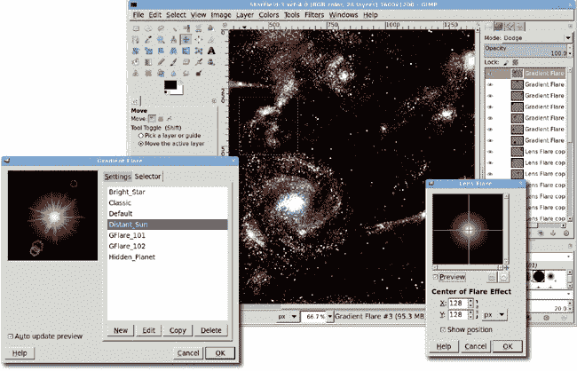

    *在这个项目阶段，实验至关重要。尝试不同的渐变光晕预设，去饱和和着色。你可能，也可能会有很多光晕图层。*

## 添加太空尘埃

到目前为止，星系基本上已经完成。下一步，添加太空尘埃，只是为项目增添更多活力。

1.  添加一个透明图层，命名为*太空尘埃*，并将其移动到图层堆栈的顶部。将图层模式设置为**屏幕**，并将不透明度设置为**20 百分比**。

1.  选择一个新的前景色，如 RGB 值为**57/99/176**的柔和蓝色。从工具箱中选择**画笔**工具。在工具选项对话框中，将不透明度设置为**20 百分比**，并确保**增量**复选框被勾选。选择各种软边缘画笔，并在绘画时经常更改。

1.  在太空尘埃图层上用长划线绘画，刷子水平、垂直和斜向。比所需的尘埃多填充图层，然后使用**橡皮擦**工具清除多余的部分。

    

    *太空尘埃基本上与星光层具有相同的作用：软化明亮的星团。它还向空间空洞添加颜色。*

## 进一步探索

星空已经完成，但为了增加趣味性，它应该有一个前景物体：一个行星。球体设计器滤镜使得创建行星非常简单。创建一个透明、600 × 600 像素的图层，命名为*Planet*。打开滤镜（滤镜▸渲染▸球体设计器）。注意有三个默认图层。每个图层都可以编辑以更改其属性和变换。新的和重复的图层被添加到列表的底部。保持光图层在底部。图层顺序不能更改，因此复制光图层将它们移动到列表底部，然后编辑原始光图层将它们更改为纹理或凹凸贴图。

# 6.3 奶油色爱情

本教程基于对爱情符号的个人看法：太阳、光束、奶油色的天空和草地。这将是最容易的进阶教程之一。这里不需要特殊才能。但你需要找到一些额外的画笔添加到 GIMP 的库存中。我会告诉你在哪里可以找到这些画笔以及如何使用它们。还需要一张库存照片。我会指出我这里使用的是哪一张。在这个过程中，你将完成一些一段时间没有涉及的基础任务：自定义渐变和前景选择。

*在 GIMP-land 中，每一天都是阳光明媚的一天！*

## 创建自定义渐变

项目从背景上的一抹颜色开始，应用渐变效果。这样做的一个简单方法是设置前景和背景颜色，并使用工具箱中的混合工具，从画布顶部拖动到底部。相反，让我们回顾一下如何创建自定义渐变。

1.  在画布中输入**D**以重置前景和背景颜色为默认的黑色和白色。打开一个新的图像（**文件**▸**新建**），其分辨率为**1600** × **1200 像素**。大尺寸使得图像适合在 250 dpi 下打印明信片大小的打印品。但如果是为了网页，完成时请缩小图像尺寸。

1.  在渐变对话框的底部（**窗口**▸**可停靠对话框**▸**渐变**）有一些用于管理渐变的图标。点击从左数第二个图标以创建一个新的渐变。这会打开渐变编辑器对话框。最初显示的渐变使用左侧的前景色和右侧的背景色。在渐变上点击并按住右键鼠标按钮以打开菜单。选择左侧端点的颜色。在打开的对话框中，将 RGB 值设置为**219/122/2**。点击**确定**以设置左侧端点的颜色。

1.  创建自定义渐变主要是使用该菜单添加新的段，设置段两端的颜色，并调整段的大小。虽然可以创建更复杂的渐变，但本项目只需要这些。

1.  在渐变编辑器中，将名称从“未命名”更改为*RetroLove*。然后点击对话框中的**保存**图标。关闭渐变编辑器对话框。

1.  从工具箱中选择**混合**工具。在工具选项对话框中，点击**渐变**按钮并选择**RetroLove**渐变。在画布中，从窗口顶部拖动到底部。

    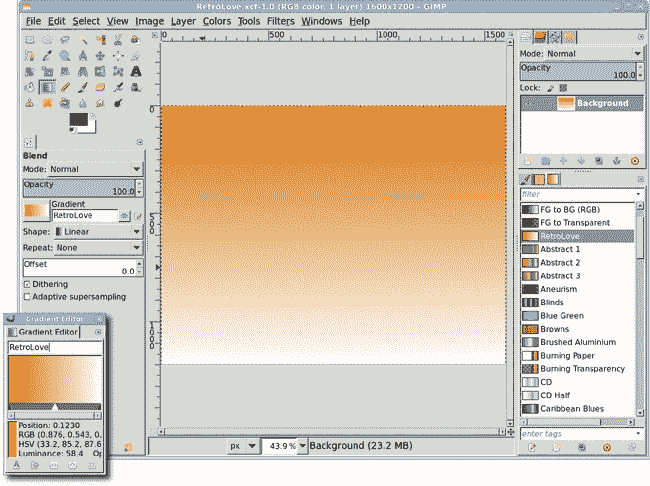

    **渐变易于创建，可用于提供背景颜色主题、创建纹理图案或模拟 3-D 效果**。

## 创建临时草地山丘

下一步与渐变一样简单。将创建两个小山丘，并涂上不同深浅的绿色。然而，着色是临时的，并且仅提供微小的视觉提示，表明它们位于单独的图层上。稍后，当在它们上应用草地时，山丘将得到轮廓处理。

1.  使用椭圆选择在单独的图层中创建两座山。缩小图像视图（**视图**▸**缩放**▸**缩小**)。创建一个透明图层并命名为**前景山**。从工具箱中选择**椭圆选择**工具，将一个宽椭圆形拖动到画布底部。点击工具箱中的前景色框并更改 RGB 值为**60/138/60**。将前景色框拖入选择中。清除选择（**选择**▸**无**）。

1.  第二座山以相同的方式创建，新图层命名为**背景山**。只需将选择稍微向右移动，在应用颜色后，使用亮度-对比度对话框（**颜色**▸**亮度-对比度**)将山丘稍微变暗。这使第二座山在项目进行过程中更加明显。

1.  在图层对话框中将此图层移至**前景山**图层下方。清除选择。放大视图（**视图**▸**缩放**▸**放大**)，以便图层适合图像窗口。

    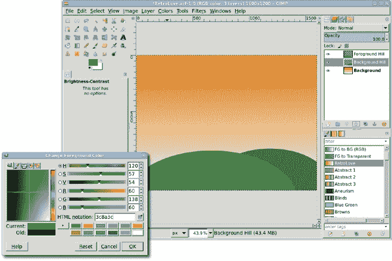

    **有两个山丘的原因是草地不会平坦或具有均匀的曲线。这将给最终图像增添变化**。

## 添加背景太阳

接下来是太阳。这将是两个图层，一个是有实色太阳的图层，另一个是带有柔和模糊效果的图层，使太阳看起来有点模糊。

1.  添加一个透明图层并命名为**太阳**。在图层对话框中将此图层移至背景山图层下方。再次从工具箱中选择**椭圆选择**工具。在工具选项对话框中，点击**固定**复选框并确保设置为**宽高比**。在画布中拖动一个椭圆形选择并将其定位以跨越两座山。

1.  您可以通过移动鼠标围绕圆圈边界的方块来改变选择的大小和位置。中间的方块用于在画布上移动选择。顶部、左侧、右侧和底部的方块改变选择的高度或宽度。角落同时改变宽度和高度。选择将保持可编辑状态，直到按下回车键或选择另一个工具。

    

    **简单的日落**

1.  点击工具箱中的前景色框以编辑颜色。将 RGB 值设置为**248/236/166**。点击**确定**关闭对话框。将前景色框拖动到画布上。清除选择。

1.  如果太阳太大，缩小图层的大小。如果太阳在天空中的位置太高，使用移动工具将图层向下移动。如果移动图层，使用**图层**▸**图层到图像大小**来适应背景图层。

1.  复制阳光图层（**图层**▸**复制图层**）并将复制的图层命名为*阳光晕*。打开高斯模糊滤镜（**滤镜**▸**模糊**▸**高斯模糊**）。调整预览，使太阳的边缘可见。将模糊半径设置为**150**，水平和垂直方向都适用。模糊方法应设置为**RLE**。点击**确定**将模糊应用到阳光晕图层。将该图层的图层模式设置为**叠加**。这样就会得到一个明亮的白色太阳，边缘只有一点黄色。

    

    *为了使太阳更黄，在原始阳光图层上使用较暗的颜色，然后降低阳光晕图层的透明度。*

## 赋予复古感：阳光

下一步将添加从太阳发出的光线。这个过程涉及创建一个初始光线，然后复制、旋转、缩放和定位副本。如果再次缩小视图，创建这些光线会更容易。从一个从太阳延伸到左侧边缘的水平光线开始。

1.  添加一个名为*阳光光线*的透明图层，并将其移动到图层对话框中的顶部。

1.  点击画布左边的标尺，并将指南拖动到太阳的大致中心。点击画布顶部的标尺，并将其拖动到相同的位置。从工具箱中选择**路径**工具。

1.  在画布上，点击指南交叉点的上方和下方。然后点击图层左边缘的外侧，以及前两个点的上方和下方。在工具选项对话框中点击**从路径选择**。用白色填充选择区域。

    

    *尽管模糊和透明度可以帮助调整，但尽量避免使初始光线太宽。*

1.  现在可以添加其余的光线。这与在 4.8 立方城市中制作齿轮齿的方法类似，使用复制、粘贴和旋转操作。选择区域应该仍然处于活动状态。复制（CTRL-C）并粘贴（CTRL-V）选择区域作为新图层（**图层**▸**新建图层**）。使用工具箱中的**翻转**工具水平翻转，然后使用**移动**工具定位图层，使其左边缘与指南的交叉点对齐。

1.  复制此图层并将其逆时针旋转 90 度（**图层**▸**变换**▸**旋转 90 度逆时针**）。定位此图层，使其底部边缘与辅助线的交点对齐。

1.  复制此图层并将其旋转**45 度**（**图层**▸**变换**▸**任意旋转**）。旋转后，此图层的左下角可以与辅助线的交点对齐。复制图层并将其水平翻转，然后适当地定位新图层。

1.  可以通过复制垂直或水平光线并旋转任意角度来创建额外的光线。在某些情况下，光线可能不会延伸到图像的边缘。使用**缩放工具**调整图层大小，使其延伸到边缘。

    

    *这些图层提供了一个轮廓，在其中将应用径向渐变。*

1.  合并光线图层。最简单的方法是在图层对话框中关闭除光线图层之外所有图层的可见性，然后合并剩余可见图层（**图像**▸**合并可见图层**）。从此创建选择（**图层**▸**透明度**▸**alpha 到选择**）。添加一个透明图层并将其命名为*Sun Beam Gradient*。在画布上输入**D**然后**X**以设置前景色为白色。

1.  从工具箱中选择**混合工具**。在工具选项对话框中，将渐变设置为**前景到透明**，形状设置为**径向**。在画布上点击辅助线的交点并拖动到左上角。在图层对话框中关闭太阳光图层可见性，并打开其余图层的可见性。将太阳光渐变图层移动到图层对话框中的太阳图层下方。

1.  清除选择。打开高斯模糊对话框并将模糊半径设置为**20**。点击**确定**将应用效果到太阳光渐变图层。

    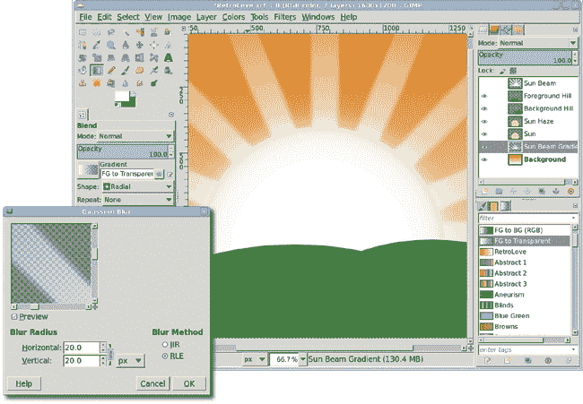

    *如果光线太暗，可以复制图层并调整模式和不透明度以适应口味。*

## 添加爱人的剪影

本项目的下一个元素是用于创建情侣剪影的库存照片。在搜索此类项目照片时，寻找具有纯色背景的照片。这有助于仅选择情侣。此外，如果情侣相互接触但足够分开以区分个体，则此项目将受益。如果他们靠得太近，生成的剪影将难以识别。这张特定的照片非常适合与前景选择工具一起使用。

1.  当**前景选择**工具处于活动状态时，在夫妇周围绘制自由手选择。这会产生类似于快速蒙版的粗糙选择。接下来，从画笔对话框中选择一个画笔（**窗口**▸**可停靠对话框**▸**画笔**）。当鼠标悬停在画布上时，画笔应该显示出来。在这张照片中，画笔的大小不应超过女人最细的手臂。使用工具选项对话框中从小画笔到大画笔的滑块调整画笔大小。

1.  在男人和女人身上涂色，确保覆盖衬衫和裤子相交的地方以及衣服过渡到皮肤的地方。基本上，覆盖任何你想包含在选择中的高对比度变化的地方。你不必非常精确，当然也不需要完全覆盖夫妇。

1.  要完成选择，按**ENTER**键。这会将快速蒙版风格的着色转换为选择。如果需要，可以使用快速蒙版功能进行进一步改进。将选择复制并粘贴到原始画布作为新图层，并命名为*夫妇*。根据需要缩放和/或水平翻转图层。

1.  创建一对夫妇的选择（**图层**▸**透明度**▸**alpha 到选择**）。通过**10 像素**增加图层边界（**图层**▸**图层边界大小**），宽度和高度都一样。点击**中心**选项以将图像居中于新的图层边界。点击**调整大小**以应用更改到图层边界。然后通过**选择**▸**增长**将选择增加**1 像素**。增长选择将在创建轮廓之前平滑选择中的任何粗糙边缘。

1.  在图像中输入**D**以重置工具箱中的颜色，然后将前景色拖动到图层中。清除选择（**选择**▸**无**）。

    

    *通过使用一个小而硬边的画笔和一次通过夫妇，改善了粗糙的选择（左）并使其更完美（右）。选择并不完美（注意男人的脚和裤子），但不需要完美就能创建轮廓。*

    

    *缩放和翻转可能是将轮廓适当地定位在山丘上，在太阳前面的必要步骤。*

## 完成草地山丘的绘制

项目几乎完成，最后一步是将山丘转换为草地轮廓。这种转换将产生副作用，隐藏男人的脚底，完成后看起来很自然。此外，此时不再需要指南。你可以隐藏它们（**视图**▸**显示指南**）或删除它们（**图像**▸**指南**▸**删除所有指南**）。

1.  首先，将山丘从绿色变为黑色。一次选择一次，在图层对话框中选择每个图层并设置**锁定 alpha 通道**。从工具箱中获取前景色并将其拖动到图层中，就像对夫妇图层所做的那样。

1.  在山丘上添加草地需要合适的画刷。GIMP 没有为这个项目提供适合的植物画刷，但互联网上有许多植物画刷集合可供下载。要将新画刷添加到 GIMP 中，只需在任何文件夹中解压缩集合。打开首选项对话框（**编辑**▸**首选项**）并选择左侧列表底部的**画刷**条目。将显示一组选项。选择**画刷**选项。首选项对话框的右侧将显示当前扫描画刷的文件夹集合。要添加新文件夹，点击**新建文件夹**图标以启用文本输入字段。输入文件夹名称并按回车键或使用文本字段右侧的文件夹选择按钮选择它。如果文件夹存在，红色圆圈图标将变为绿色。

1.  一旦文件夹被添加到文件夹列表中，点击文件夹名称左侧的方框以允许将画刷保存到其中。要使用新画刷，您必须刷新画刷对话框或重启 GIMP。

    ### 注意

    *许多免费提供的画刷集合是专门为 Photoshop 创建的，它们是具有* .abr *文件扩展名的单个文件。这些文件包含多个画刷。GIMP 可以很好地读取这些文件，所以不要害怕尝试 Photoshop 画刷。*

    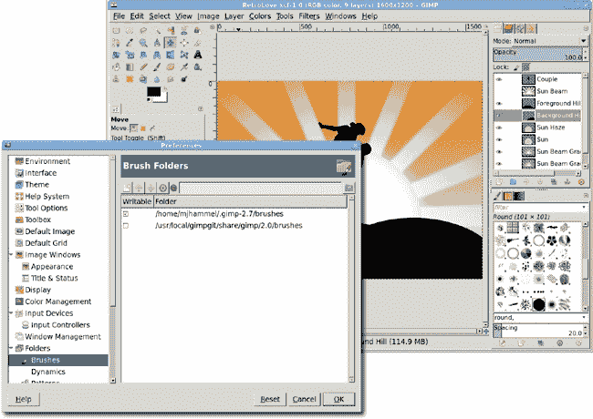

    *在项目进行中添加画刷是一种相当常见的做法。这也是经常保存项目文件的一个很好的理由。*

1.  添加一个透明图层并命名为*Grass*。将其移动到图层对话框中前景山图层之上。打开**画刷**对话框并选择一个合适的画刷。在对话框底部，将间距设置为 50 到 150（如果图像尺寸小于本项目使用的原始 1600 × 1200，则应选择更小的值）。从工具箱中选择**画笔**工具。在工具选项对话框中，设置**缩放**选项，使画刷轮廓（鼠标悬停在画布上可看到）为适当的大小。沿着山丘边缘多次绘画。切换到另一个草地画刷并重复。重复此过程，直到山丘足够有草。

    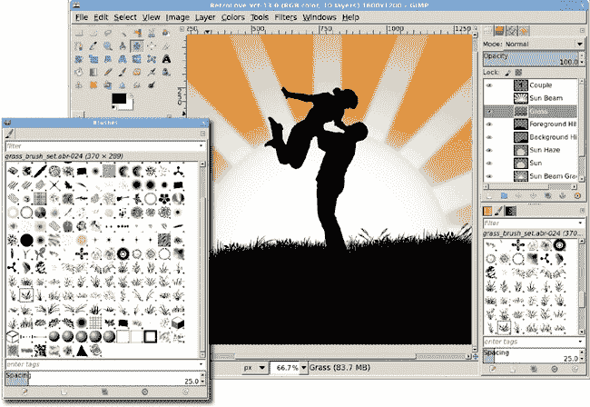

    *这个草地是通过使用草地画刷集合中的多个画刷创建的。注意，绿色的小山现在也变成了草地。*

## 进一步探索

最后一步是可选的，但会给项目增添活力：飞翔的鸟儿。同样，技巧是找到互联网上免费提供的鸟画刷。添加一个透明图层，选择一个鸟画刷，适当地调整其大小（对于更远的鸟儿，应选择更小的尺寸），然后在天空周围画几个小圆点。如果鸟儿不是剪影，创建鸟儿的选区并用黑色填充。

# 6.4 Mobsterville

喜欢的漫画书好莱坞大片，如*黑暗骑士*和*守望者*，都非常受欢迎。这些对经典超级英雄视觉的更新都带有阴暗的色调。*罪恶之城*为这种新的黑暗漫画书故事风格铺平了道路，将 20 世纪 90 年代最粗犷的原创漫画在 2005 年搬上了银幕。幸运的是，对于 GIMP 爱好者来说，重新创建*罪恶之城*效果相当简单。

下一个教程将使用库存照片展示一个粗犷的英雄在雨夜中巡逻城市。这张照片是风格化的黑白，仅有一抹色彩。

*黑白图像可以传达强大的信息，尤其是在仅添加少量色彩的情况下*。

## 建立基础图像

基础图像展示了我们的主要角色，一个手持枪支的硬汉，背景是坚实的浅色。这幅图像的分辨率为 1600 × 1067 像素。

1.  将原始图像（在本项目中命名为*Man*）去饱和（**颜色**▸**去饱和**）。选择此图像的**亮度**选项，这将允许他的脸和背景之间的对比度保持较高。

1.  打开“级别”对话框（**颜色**▸**级别**）。通过点击白色点吸管（位于级别直方图右侧下方），然后点击图像右上角的背景来设置白色点。这使得背景完全变白，白色点滑块移动到直方图的中心稍左的位置。将黑色点滑块向右移动，直到它非常接近白色点。结果将是一个几乎完全黑白图像。

    

    *本项目的风格需要调整原始库存图像的对比度*。

## 制作雨景

1.  添加一个透明图层（**图层**▸**新建图层**）。将此图层命名为*Rain 1*。打开“Hurl”滤镜（**滤镜**▸**噪声**▸**Hurl**）。这里默认设置就足够了：随机种子=10，随机化%=50，重复=1。点击**确定**在图层中渲染噪声。噪声将着色，因此需要去饱和。虽然这里选择了亮度选项，但任何去饱和选项都可以工作。

1.  打开“运动模糊”滤镜（**滤镜**▸**模糊**▸**运动模糊**）。将模糊类型设置为**线性**，长度设置为**120 像素**，角度设置为**90 度**。点击**确定**将模糊应用于图层的噪声。请注意，这种模糊在“运动模糊”对话框的预览中可能难以看到，但这不会影响这一步骤。

1.  将图层（**图层**▸**缩放图层**）缩放至 140%。这是通过在“缩放图层”对话框中将缩放单位菜单更改为**百分比**，并将宽度设置为**140**来完成的。当按下**缩放**按钮时，高度字段将自动调整以保持宽度与高度的比率。

1.  放大以查看 Rain 1 图层的图层边界。从工具箱中选择**剪切**变换工具。点击图像并拖动，直到剪切预览的边缘触及图像窗口的左右边缘。在对话框中点击**剪切**按钮以应用变换。

1.  打开**色阶**对话框，并将黑点调整到大约**107**，白点调整到大约**116**。实际的设置将根据个人对下落雨滴外观的喜好而有所不同。将图层重置以适应图像大小（**图层**▸**图层到图像大小**）。

1.  使用与第一层雨相同的过程添加第二层雨，但应用较少的剪切，以便雨滴垂直下落。色阶调整也可能略有不同，再次根据个人喜好。稍后，由于添加背景元素引起的对比度变化，两个雨层的效果和透明度可能需要调整。将第二层雨命名为*Rain 2*并确保它在 Rain 1 图层之上。

    

    *运动模糊噪声是伪造雨滴的快速方法。*

1.  为了添加背景，需要对基础图像进行蒙版处理。在图层对话框中点击基础图像图层以使其处于活动状态。向其添加一个 alpha 通道（**图层**▸**透明度**▸**添加 alpha 通道**）。向基础图像图层添加一个白色图层蒙版（**图层**▸**蒙版**▸**添加图层蒙版**）。

1.  再次打开原始图像。你可以使用此图像的颜色特性来创建一个良好的蒙版。在工具箱中选择**模糊选择**工具。将阈值设置为 70 到 90 之间的任何值，然后点击男人头部右侧的蓝色区域中心。然后按住 SHIFT 键并点击男人头部左侧的蓝色区域。重复此过程，对枪的触发区域内的蓝色区域进行操作。复制（CTRL-C）然后粘贴（CTRL-V，随后**图层**▸**锚定图层**）此选择到基础图像图层的蒙版中。使用**色阶**对话框将黑点设置为**254**。代表图像中透明区域的棋盘图案将在原始图像中蓝色区域的位置显示出来。

    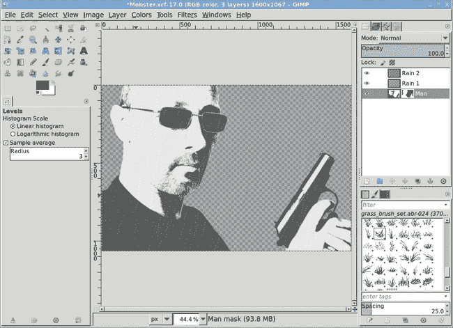

    *蒙版背景将允许更合适的背景显示出来。*

## 添加背景建筑和路灯

1.  打开背景建筑图像。将其缩放以适应基础图像图层的大小（**图像**▸**图像属性**）。

1.  在图层对话框中点击**Rain 2**图层。这是必要的，因为你不能在之前步骤中有一个活动蒙版的情况下粘贴新图层。

1.  将其复制并粘贴到基础图像中，然后将新图层拖动到图层堆栈的底部。将建筑图层命名为*Building*。关闭所有其他图层的可见性（点击缩略图左侧的图层可见性图标），以便使以下步骤更容易进行。

1.  调整图层的不饱和度。打开**色阶**对话框。点击白色点吸管并点击天空最暗的部分。将黑色点滑块拖向白色点滑块，直到建筑墙壁几乎完全变黑。如果背景中仍有云朵，将白色滑块向左稍微拖动一些。点击**确定**，然后打开所有其他图层的可见性。

    

    *我们之前已经使用过这张图片——通过一些裁剪和一些新的照明，2.7 湖面倒影中的建筑现在变成了一座阴郁的公寓楼。在库中保存库存图片是节省设计项目的好方法。*

1.  在添加路灯柱之前，需要将建筑的前门向左移动。打开缩放对话框（**图层**▸**缩放图层**）。点击宽度和高度字段之间的链形链接以断开它，以便更改图层的纵横比。将 Building 图层宽度调整为**165%**，高度调整为**140%**。应用此设置。

1.  使用**移动**工具将图层向左拖动，直到烟囱和倒 V 形屋顶位于枪的左侧。确保不要拖动得太远，以免建筑物的右边缘位于图像窗口的右边缘左侧。将图层大小重置以匹配图像大小（**图层**▸**图层到图像大小**）。

1.  添加一个透明图层并命名为*Guideline*。将此图层移动到 Building 图层之上。将前景色设置为中等灰色（HTML 表示法设置为**cbcbcb**）。使用**铅笔**工具在建筑顶层高度左右绘制一条从左到右的细线。这条指南线将用于绘制路灯柱。稍后，此图层将被移除。

    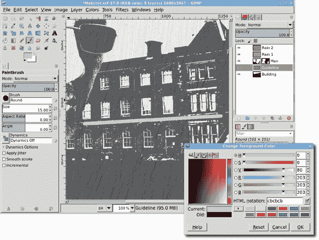

    *指南线是临时的，仅用于辅助创建路灯柱。它不会在最终图像中可见。*

1.  在 Guideline 图层之上添加一个透明图层，将新图层命名为*Lamp Posts*。从工具箱中选择**画笔**工具。选择一个合适的画笔，大小刚好足以作为远处的路灯柱可见。在建筑前门左侧绘制一条直线，从指南线下到建筑的大致底部。对入口的右侧重复此过程。复制此图层，并在 X 方向上偏移 3 个或更多像素（偏移量取决于绘制柱子使用的画笔大小）。使用**亮度-对比度**对话框（**颜色**▸**亮度-对比度**）并将亮度降低到**-127**。

1.  雨层降低了图像的对比度。在图层对话框中，将每个雨层的透明度降低到大约 30%到 50%。点击**Rain 2**图层。将其与**Rain 1**图层合并（**图层**▸**向下合并**）。使用亮度-对比度对话框（**颜色**▸**亮度-对比度**）调整合并图层的对比度。设置取决于雨层的内容，但亮度应小于-100，对比度应提高到接近 127。

    

    *使用临时图层进行对齐是一种新技巧，但您会经常使用它来进行非严格垂直或水平对齐。*

## 添加灯具和灯光

1.  在“灯具副本”图层上方添加一个透明图层，命名为*Lamps*。在画布上靠近灯具的位置创建一个椭圆形选区。使用**矩形选择**工具剪切选区的下半部分。如果需要，使用缩放工具适当调整灯具上方灯具的大小。使用**移动**工具将选区定位在左侧灯具上方。使用**旋转**工具将选区的直线边缘与引导线对齐。选择**混合**工具，并从选区的曲线顶部开始，将线性渐变从黑色拖动到灰色，直到选区的直线边缘。

1.  使用**移动**工具将选区拖动到另一个灯具上方。重复使用**混合**工具应用渐变。清除选区（**选择**▸**无**）。

    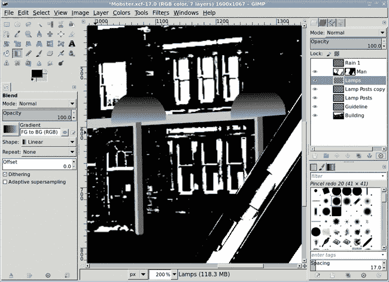

    *灯具顶部是一个简单的半圆形，这里通过关闭 Rain 1 图层的可见性来显示，以便更容易看到渐变。灰色水平引导图层在灯具之间可见。*

1.  创建一个透明图层，命名为*Lights*。在图层对话框中将它移动到*Lamps*图层下方。使用**路径**工具在左侧灯具下方绘制一个矩形。矩形顶部应较薄，底部较宽，底部呈圆形。在工具选项对话框中，将路径转换为选区。从工具箱中选择**混合**工具，并配置它使用从白色到透明的线性渐变。在图像窗口中选区的顶部附近点击，并拖动到底部。沿着灯具柱的线条对齐渐变。

1.  使用**移动**工具将选区移动到第二个灯具下方。如果需要，使用**缩放**工具调整选区大小，然后应用另一个线性白色渐变。清除选区。

1.  打开高斯模糊滤镜（**滤镜**▸**模糊**▸**高斯模糊**），并将图层在 X 和 Y 方向上应用**10 像素**的模糊。将图层不透明度设置为 35%到 60%之间。此时，您可以删除引导图层，或者在图层对话框中关闭其可见性。

    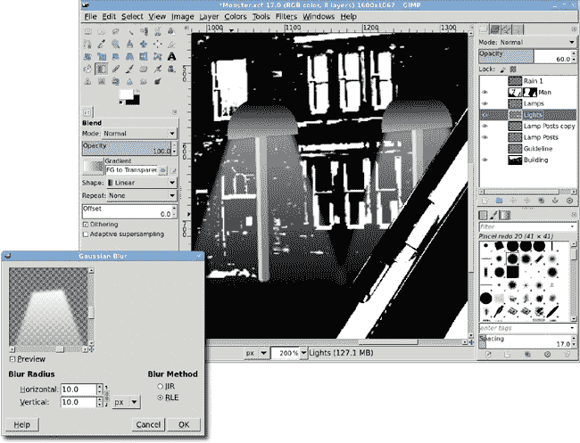

    *灯具并非必需，但它们为影片增添了一种酷炫的赛博朋克风格*。

## 检索红色领带

1.  打开一张有红色领带的匪徒图片。从工具箱中选择**模糊选择**工具，并将阈值设置为**95**。点击红色领带上的任何位置。高色彩对比度应该允许通过单次点击完全选择大部分领带。如果选择区域内有未选择的领带斑点，通过增加一个像素来扩展选择以选中它们。如果领带外部有一点区域被选中无关紧要。复制选择。

1.  将选择粘贴到基础图像中，并使其成为一个新图层。将图层命名为*红色领带*。使用工具箱中的**翻转**工具水平翻转领带。去色该图层。从工具箱中的前景色中选择红色。在图层对话框中勾选**锁定 Alpha 通道**框。从工具箱中选择**桶填充**工具。在工具选项对话框中，将模式设置为**颗粒合并**，并将受影响区域设置为**填充整个选择**。在**红色领带**图层中点击以重新着色图像。这个过程专门用于去除打印中超出色域的颜色。如果你在首选项对话框中配置了颜色管理（编辑▸首选项），可能需要进一步调整。使用**移动**工具将领带定位在男子胸部的正确位置。将领带图层设置为图像大小。

1.  将红色领带图层移动到 Rain 1 图层下方。

    

    *一点色彩可以吸引对匪徒的注意。内嵌图像显示了启用快速蒙版且蒙版颜色设置为绿色的选择区域*。

## 进一步探索

最后一步是将背景变暗，使主题成为图像的焦点。为此，在建筑图层之上添加一个透明图层。用黑色填充这个图层。为它添加一个图层蒙版。从工具箱中选择混合工具，并配置一个从黑色到中等灰度的径向形状。点击男子脸部的中间，然后拖动到枪的食指上以绘制径向的、从黑色到灰色的蒙版。

为了给图像增加深度，你可以使用两层雨。将 Rain 1 图层放在男子和建筑图层之间，并在图层堆栈顶部创建一个新的 Rain 2 图层。
