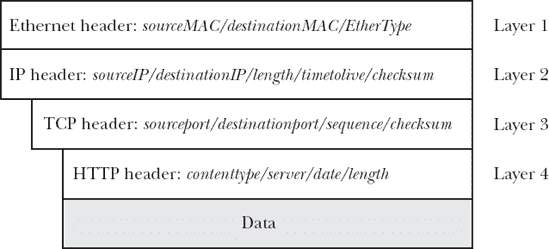

## 第三十章. WORDPRESS 2.3.3

#### [`WORDPRESS.ORG`](http://WORDPRESS.ORG)

### 30.1. 摘要

WordPress 是一个开源的个人发布系统，也被称为博客平台。像许多其他动态网络应用一样，WordPress 使用 PHP 编写，并将内容存储在 MySQL 数据库中。

主要功能包括支持 trackback/pingback、第三方插件能力、符合万维网联盟（W3C）设定的网络标准、主题支持、静态页面管理以及 RSS（真正简单的聚合）源支持。

随着 WordPress 等工具的出现，博客越来越受欢迎。作家和研究生贾斯汀·霍尔被认为是 1994 年最早创建个人博客的人之一。另一位知名人物大卫·温纳创建了 ping 服务器，这些服务器记录了从博客应用接收到的更新。ping 服务器允许博客读者快速检查博客是否有更新内容；[technorati.com](http://technorati.com) 是这一概念的流行例子。温纳还创建了 RSS 规范，使用户能够通过 RSS 客户端查看博客上的新内容。

WordPress 是 b2/cafelog 内容管理系统的继承者，其开发始于 2001 年。马修·穆伦韦格和迈克·利特尔是 WordPress 项目的原始创始人。穆伦韦格于 2005 年 8 月成立了 Automattic, Inc.，以容纳各种开源项目，包括 WordPress。WordPress 的开发由穆伦韦格和 Automattic, Inc. 的瑞安·博伦领导。

### 30.2. 资源

WordPress 文档

[`wordpress.org/docs`](http://wordpress.org/docs)

### 30.3. 必需的

 FreeBSD 7.0-RELEASE（见 "FreeBSD 7.0"）

 更新后的端口集合（见 "FreeBSD 端口集合"）

 Apache HTTP 服务器（见 "Apache HTTP 服务器 2.2.8"）

 PHP 5（见 "PHP 5.2.5"）

 MySQL 5（见 "MySQL 服务器 5.0.51"）

 互联网连接

 已注册域名

### 30.4. 准备

1.  成为超级用户。

1.  在 MySQL 中创建一个名为 wordpress 的数据库。接下来，创建一个名为 wordpress 的用户并赋予此用户完全权限：

    ```
    # mysql -u root -p
    mysql> create database wordpress;
    mysql> grant all on wordpress.* to
        -> wordpress@localhost identified by 'password';
    mysql> quit
    ```

    将 `*密码*` 替换为您选择的密码（需要单引号）。您稍后需要这个密码。

### 30.5. 安装

输入以下命令开始 WordPress 的安装：

```
# cd /usr/ports/www/wordpress
```

```
# make config ; make install clean
```

### 30.6. 配置

安装完成后，是时候为您的系统配置 WordPress 了。

1.  将 wp-config-sample.php 文件复制到 wp-config.php。以下命令将执行复制、设置文件权限并打开 wp-config.php 以进行修改：

    ```
    # cd /usr/local/www/data/wordpress
    # cp wp-config-sample.php wp-config.php
    # chmod 640 wp-config.php
    # ee wp-config.php
    ```

1.  修改`DB_NAME`、`DB_USER`和`DB_PASSWORD`声明（约 3 处）以匹配您的 MySQL 设置。这些行应如下所示（使用您之前分配的密码）：

    ```
    define('DB_NAME', '*wordpress*');     // The name of the database
    define('DB_USER', '*wordpress*');     // Your MySQL username
    define('DB_PASSWORD', '*password*');  // ...and password
    ```

    保存并退出。

1.  创建一个针对 WordPress 的特定 Apache 配置文件。此文件将 Apache 指向 WordPress 文件的正确位置，并通过将 WordPress 特定的选项与主 httpd.conf 文件分开来简化管理。默认情况下，Apache 在/usr/local/etc/apache22/Includes 目录中搜索配置文件。以下是创建 WordPress 配置文件的方法：

    ```
    # ee /usr/local/etc/apache22/Includes/wordpress.conf
    ```

    添加以下行：

    ```
    Alias /*wordpress* "/usr/local/www/data/wordpress/"

    <Directory "/usr/local/www/data/wordpress/">
    Options Indexes FollowSymLinks
    AllowOverride All
    Order allow,deny
    Allow from all
    </Directory>
    ```

    * * *

    ***注意：*** 默认情况下，WordPress 被设置为您的网络服务器根站点的子目录。这意味着您需要在网络浏览器中输入 [`host.example.com/wordpress`](http://host.example.com/wordpress)。要更改此默认目录，将上面的斜体中的`wordpress`替换为不同的名称。

    * * *

    保存并退出。重新启动 Apache 以提交更改：

    ```
    # /usr/local/etc/rc.d/apache22 restart
    ```

1.  在您喜欢的网络浏览器中打开 [`host.example.com/wordpress/wp-admin/install.php`](http://host.example.com/wordpress/wp-admin/install.php)，替换您的主机名和目录（如果您已修改），然后按照说明完成安装。

1.  登录后，通过点击用户标签更改您的管理密码。点击名为您的个人资料的子标签，输入新密码（右下角），然后点击更新个人资料按钮。

### 30.7\. 管理

使用此 URL 来管理您的 WordPress 安装（替换您的服务器主机名）：[`host.example.com/wordpress/wp-admin`](http://host.example.com/wordpress/wp-admin)。

### 30.8\. 配置文件

usr/local/www/data/wordpress/wp-config.php

存储 WordPress 的用户名、密码和数据库信息

### 30.9\. 备注

您可能想在您的博客中使用永久链接。以下是永久链接和标准链接的示例：

永久链接

[`host.example.com/wordpress/blog-article`](http://host.example.com/wordpress/blog-article)

标准链接

[`host.example.com/wordpress/?p=123`](http://host.example.com/wordpress/?p=123)

上述链接都会带您访问同一个假设的博客条目，但永久链接提供了一个有意义的 URL，这使得其他网站更容易引用您博客中的帖子。

要启用永久链接，请通过将您的网络浏览器指向 [`host.example.com/wordpress/wp-admin`](http://host.example.com/wordpress/wp-admin) 来打开 WordPress 网络管理界面。

通过转到选项标签中的永久链接标签来启用永久链接。点击一个预定义的结构，或创建自己的结构，然后点击更新永久链接结构。

通过点击页面顶部的“查看网站 >>”来查看网站。点击“Hello, world!”帖子并确认浏览器地址栏中的 URL 字段与您设置的永久链接结构相匹配。

## 附录 A. 命令

本附录包含适用于基本 FreeBSD 系统管理的常用命令，旨在为不熟悉 Unix 命令的用户提供简明参考。它按以下类别组织：一般、存档文件和网络。命令按相对使用频率从高到低排列。有关任何命令的完整文档，请参阅其 man 页面。有关 man 页面的详细信息，请参阅“手册页面”。

### A.1\. 一般

#### A.1.1\. ls

此命令将列出当前目录中的文件。

命令

`ls`

语法

`ls -``*options file*`

选项

```
-a
```

包含所有以点（.）开头的文件（隐藏文件）。

```
-l
```

以长格式列出文件（权限、日期、时间、所有者和组）。

```
-d
```

将目录作为普通文件列出（不递归搜索）。

```
-h
```

使用单位后缀，例如`K`代表千字节，`M`代表兆字节等（必须与`-l`选项一起使用）。

```
-F
```

在每个文件或目录类型后附加符号（`/`附加到目录，`*`附加到可执行文件，`@`附加到符号链接）。`-F`选项对于快速识别文件类型和目录非常有用，无需进行长列表（`-l`选项）。

下面是使用`ls -l`进行长格式目录列表的输出：

代码视图：

```
-rw-rw-r--    2 root   wheel      45463 Sep  26 03:20 example.doc
drwxr-xr-x    1 john   user         512 May  20 18:06 Maildir
  ^|_||_||_|    ^   ^    |____|     |___| |_____| |___| |________|
  | |  |  |     |   |      |          |      |      |      |
  | |  |  |     | owner  group       size   date  time    name
  | |  |  |     # of links to file or directory
  | |  |  world permissions
  | |  group permissions
  | owner permissions [r = read] [w = write] [x = execute] [- no permission]
  type of file [- = normal file] [d = directory] [l = symbolic link]

```

示例

要列出当前目录中所有文件，包括以点（.）开头且使用长格式的文件，请输入：

```
# ls -al
```

要列出以 u 开头的根目录中的文件和目录名称，请使用`*`通配符输入：

```
# ls -d /u*
```

要列出所有文件和目录名称，包括以点（.）开头和以.txt 结尾的文件，请输入：

```
# ls -ald *.txt
```

默认 FreeBSD shell 配置文件中包含的两个有用的快捷键是命令`ll`和`l`（小写 L）。输入`ll`等同于输入`ls -alFo`，并显示您需要了解的当前目录的几乎所有信息。命令`l`等同于`ls -l`。

注意事项

要获取有关此命令的更多详细信息和其他选项，请在命令提示符下输入`man ls`。请记住，FreeBSD 是一个区分大小写的操作系统。命令`ls -l file`与命令`ls -l File`完全不同。星号（`*`）可以用作通配符，允许您指定过滤搜索。将其视为一种简短的说法“任何东西”。例如，如果您想搜索当前目录中以`b`开头的所有文件，请输入`ls -d b*`，这相当于“列出以小写 b 开头后跟任何内容的文件”。`-d`告诉系统列出以`b`开头的目录名称，而不是递归地搜索目录内的文件。

#### A.1.2\. cd

此命令将工作目录更改为指定的目录。

命令

`cd`

语法

`cd` `*directoryname*`

示例

要将当前工作目录中的目录更改为名为 test 的目录，请输入：

```
# cd test
```

要切换到根目录，请输入：

```
# cd /
```

要将当前工作目录更改为 /usr/local/www，请输入：

```
# cd /usr/local/www
```

注意

在此示例中，www 是 /usr/local 的子目录，因为 local 是 /usr 的子目录。如果您的当前工作目录是 /usr/local/www，并且您想导航到 /usr/local，您可以输入 `cd /usr/local` 或 `cd ..`（`..` 是导航到当前目录父目录的另一种方式）。另一个快捷键可以使用波浪号（`~`）键执行。输入 `cd ~` 将您放置在当前用户的家目录中。此位置可能不同，但最可能是 /usr/home/username，其中 username 是当前用户的登录 ID。

如果您需要切换到包含空格的目录，您需要使用引号将路径括起来。输入 `cd "/usr/local/www/webserver"` 将是正确的语法。

#### A.1.3\. pwd

此命令将显示当前工作目录。

命令

`pwd`

语法

`pwd`

示例

在命令提示符下输入 `pwd`。如果您刚刚登录，您可能会看到类似 `/usr/home/user` 的内容，其中 `user` 是您的登录名。这意味着您在名为 user 的目录中，它是 home 的子目录。home 的父目录是 usr。

#### A.1.4\. cp

此命令用于将文件从一个位置复制到另一个位置。

命令

`cp`

语法

`cp -``*options sourcefile targetfile*`

选项

```
-i
```

强制 `cp` 在覆盖具有相同文件名的文件之前提示用户。

```
-R
```

如果源文件是目录，则整个子树将被复制。

```
-p
```

如果权限允许，保留源文件（s）的原始属性（修改和访问时间、文件标志、文件模式、用户和组 ID）。

示例

要将名为 example.doc 的文件复制到名为 newexample.doc 的新文件中，请输入：

```
# cp example.doc newexample.doc
```

要将 example.doc 文件复制到 /usr/local/www 目录，请输入：

```
# cp example.doc /usr/local/www
```

要在保留文件属性的同时将名为 logs 的目录树复制到名为 archive 的新目录中，请输入：

```
# cp -R -p logs archive
```

注意

如果您将文件复制到具有相同文件名的位置，如果未使用 `-i` 选项且权限允许，`cp` 将会覆盖文件。

可以使用通配符来复制多个文件。命令 `cp *.doc /usr/home/user` 将将当前目录中所有具有 .doc 扩展名的文件复制到 /usr/home/user 目录。

#### A.1.5\. mkdir

此命令创建指定名称的目录。

命令

`mkdir`

语法

`mkdir` `*directoryname*`

示例

要在当前工作目录中创建名为 documents 的目录，请输入：

```
# mkdir documents
```

要在 /usr 目录内创建名为 home 的子目录，请输入：

```
# mkdir /usr/home
```

#### A.1.6\. rm

此命令删除文件和目录。

命令

`rm`

语法

`rm -``*options file*`

选项

```
-i
```

在删除每个文件之前，让 `rm` 提示用户确认。

```
-r
```

递归删除指定路径中包含的所有文件和目录。

示例

要删除目录 tmp 及其包含的所有文件和目录，请输入：

```
# rm -r tmp
```

如果您想从当前目录删除名为 example.doc 的单个文件，请输入：

```
# rm example.doc
```

如果您想删除/usr/local/www 目录中的所有.doc 文件，并对每个文件进行确认，请输入：

```
# rm -i /usr/local/www/*.doc
```

注意

如果目录为空，也可以使用`rmdir`命令删除目录。命令`rmdir test`只会删除包含没有文件的 test 目录。

#### A.1.7\. mv

此命令用于将文件从一个位置移动到另一个位置。

命令

`mv`

语法

`mv -``*options source target*`

选项

```
-i
```

在移动会覆盖现有文件或目录的文件或目录之前，`mv`命令会提示用户。

示例

要将目录/usr/local/www 中的名为 example.doc 的文件移动到当前用户的家目录，并启用覆盖确认，请输入：

```
# mv -i /usr/local/www/example.doc ~
```

要将文件 foobar.conf 重命名为 apache.conf，请输入：

```
# mv foobar.conf apache.conf
```

要将名为 www 的目录重命名为 cgi-bin，请输入：

```
# mv www cgi-bin
```

#### A.1.8\. ee

Easy Editor 是一个简单的文本编辑程序。

命令

`ee`

语法

`ee` `*filename*`

要启动 ee，请在命令提示符中输入`**ee**`。

按下[esc]键进入主菜单。在顶部，您将看到可用的命令及其快捷键。插入符号（`^`）表示先按住[ctrl]键，然后按与命令相关的字母。屏幕底部，您可能会看到执行不同命令时的消息和提示。

您可以通过输入 ee 来打开文本文件。

```
# ee filename
```

将`*filename*`替换为文件的实际名称。

#### A.1.9\. find

此命令是查找特定目录中嵌套文件的一种便捷方式。您可以指定要搜索的确切名称，或使用通配符搜索特定文件集。

命令

`find`

语法

`find` `*startpath*` `-``*options searchstring*`

选项

```
-name
```

xxx

搜索字符串`*xxx*`；要使用通配符（如`?`或`*`）搜索，请将字符串用双引号括起来。

```
-user
```

xxx

列出匹配用户名 xxx 的文件。

```
-group
```

xxx

列出匹配组名 xxx 的文件。

示例

要查找/usr 目录中所有的.doc 文件，请输入：

```
# find /usr -name "*.doc"
```

要搜索所有挂载的文件系统中的文件 example.doc，请输入：

```
# find / -name example.doc
```

要在当前目录及其子目录中搜索文件 example.doc，请输入：

```
# find . -name example.doc
```

要查找/usr 目录中属于用户 john 的所有文件，使用以下命令：

```
# find /usr -user john
```

#### A.1.10\. file

此命令将检查文件与已知文件类型的预编译列表，如果找到匹配项，则返回文件类型描述。

命令

`file`

语法

`file` `*filename*`

示例

要确定名为 example.mov 的文件类型，请输入：

```
# file example.mov
```

要显示当前工作目录中所有文件的文件类型，请输入：

```
# file *
```

#### A.1.11\. less

此程序可用于显示文本文件，以及滚动显示不适合一屏的其他命令的输出。

命令

`less`

语法

`less -``*options file*`

选项

```
-N
```

在每行的开头显示行号。

```
-M
```

在提示符中显示已查看文件的百分比和当前屏幕上的行号范围。

示例

要显示文本文件 example.txt 的内容，请输入：

```
# less example.txt
```

如果你选择的文件比屏幕长，请使用箭头键上下滚动文档。快速查找单词或字母的方法是按?，然后输入要查找的单词或字母并按[enter]。所有单词或字母的实例都将被突出显示。在任何时候按 Q 将退出到命令提示符。

要显示包含行号和百分比的文本文件/etc/services 的内容到可见文件，使用以下命令：

```
# less -NM /etc/services
1 #
2 # Network services, Internet style
3 #
4 # Note that it is presently the policy of IANA to assign a single...
5 # port number for both TCP and UDP; hence, most entries here have...
6 # even if the protocol doesn't support UDP operations.
7 #
8 # The latest IANA port assignments can be gotten from
9 #
10 #       http://www.iana.org/assignments/port-numbers
/etc/services lines 1-10/2114 0%
```

`less`也可以用来检查来自其他命令的输出，如`ls`。通过使用管道符号（`|`），你可以将`ls`的输出重定向到`less`的输入，以便滚动输出。例如，要使用滚动显示目录/usr/lib（以长格式）的内容，请输入：

```
# ls -l /usr/lib | less
```

#### A.1.12\. grep

此程序用于在文件或其他命令的输出中查找文本字符串。如果`grep`找到指定的字符串，它将返回匹配发生的整个行。

命令

`grep`

语法

`grep` `*模式 文件*`

示例

要在名为 apache.conf 的文本文件中搜索单词 server，请输入：

```
# grep server apache.conf
```

通过使用管道符号（`|`），你可以使用`grep`分析来自其他命令的输出，例如`ls`。要搜索根目录长列表的输出中的单词 usr，请输入：

```
# ls -l / | grep usr
```

你也可以在类似这样的文件中搜索短语：

```
# cat /COPYRIGHT | grep "All rights reserved"
```

#### A.1.13\. su

此实用程序用于切换用户身份。如果没有提供用户名，则默认为 root。只有属于 wheel 组的用户才能切换到 root 登录，除非使用`sudo`命令以 root 身份运行`su`。

命令

`su`

语法

`su` `*用户名*`

示例

要从 wheel 组成员切换到 root 账户，请输入：

```
# su
```

#### A.1.14\. chown

更改指定文件或目录的所有者和/或组。要查看文件或目录关联的当前所有者和组，使用长格式`ls -l`列出目录。

命令

`chown`

语法

`chown -``*选项 所有者:组 文件*`

选项

`**-R**` 当应用于目录时，递归地应用所有者/组更改。

示例

要将名为 example.doc 的文件的所有者更改为 john，请输入以下命令：

```
# chown john example.doc
```

要将名为 Maildir 的目录的组所有权更改为 user，请输入：

```
# chown :user Maildir
```

要将名为 apache.conf 的文件的所有者和组分别更改为 root 和 wheel，请输入：

```
# chown root:wheel apache.conf
```

要将名为 www 的目录的所有者更改为 john，包括所有子目录及其文件，请输入：

```
# chown -R john www
```

注意

只有你创建或拥有的文件才能使用此命令进行修改，除非你是超级用户。

#### A.1.15\. chmod

此命令更改文件或目录的读取、写入和执行权限。对于文件，读取权限意味着读取文件内容的能力。对于目录，读取权限意味着列出其内容（文件或其他目录）的能力。对于文件和目录，写入权限意味着更改或删除其内容的能力。对于文件，执行权限意味着加载和运行作为程序的能力。对于目录，执行权限意味着可以使用 `cd` 命令进行导航。与 `chown` 命令类似，您需要是超级用户或要修改的文件的所有者，以便此命令成功。

命令

`chmod`

语法

`chmod -``*options mode file*`

选项

`**-R**` 当应用于目录时，递归地应用权限更改。

示例

以下是确定用于 `chmod` 的三位数文件模式的图解。

```
-rwxr-xr--    2 root   wheel      45463 Sep  26 03:20 example.doc
 |_||_||_|
  |  |  |
  |  |  r-- [r=4] = 4 = third digit (world/anybody permission)
  |  r-x [r=4]+[x=1] = 5 = second digit (group permission)
  rwx [r=4]+[w=2]+[x=1] = 7 = first digit (owner permission)
```

example.doc 有一个三位数的模式 754，因为每个数字是该用户 `r`（即读取）、`w`（写入）和 `x`（执行）权限值的总和，其中 `r`（即读取）是 4，`w`（写入）是 2，`x`（执行）是 1。

要更改名为 example.doc 的文件的权限，以便所有者、组和世界具有完全的读取、写入和执行权限，请输入：

```
# chmod 777 example.doc
```

要更改名为 www 的目录的权限，以便所有者具有读取、写入和执行权限，组具有读取权限，世界用户没有权限，请输入：

```
# chmod 740 www
```

#### A.1.16\. df

此实用程序显示所有挂载文件系统的可用磁盘空间量。

命令

`df`

语法

`df -``*options*`

选项

`**-h**` 以兆字节、吉字节等后缀生成“人类可读”的输出。

`**-c**` 在输出的底部显示总行。

示例

要以“人类可读”的格式显示所有挂载文件系统的可用磁盘空间，请输入：

```
# df -h
```

#### A.1.17\. du

此实用程序显示文件或目录使用的磁盘空间量。

命令

`du`

语法

`du -``*options filename*`

选项

```
-d
```

x

列出所有文件和目录，深度为 x。

```
-c
```

显示列出文件和目录的总计。

```
-h
```

使用单位后缀，如 `K` 表示千字节，`M` 表示兆字节。

```
-a
```

显示所有文件，包括隐藏文件。

示例

要使用单位后缀显示 `/usr` 目录中每个文件和目录的磁盘空间使用情况，请使用以下命令：

```
# du -d 1 -h /usr
```

要显示当前目录（包括子目录）中所有文件的磁盘空间使用情况以及总计，请输入：

```
# du -ca
```

注意事项

此实用程序的输出可能跨越几页；当处理长文件列表时，使用文本显示实用程序如 `less` 可能很有用。

#### A.1.18\. mount

`mount` 命令用于使磁盘驱动器可用于计算机的文件系统。

命令

`mount`

语法

`mount -``*options device node*`

选项

```
-t
```

声明要挂载的设备的文件系统类型；常见的类型包括 `msdos`、`ufs`（默认）、`cd9660`、`ntfs`（有限）、`udf` 和 `nfs`。

* * *

***注意：*** 挂载的 NTFS 卷写权限有限。文件必须是非驻留的，不能包含任何空格，也不能包含多字节字符。压缩文件也不受支持。

* * *

示例

要将数据 CD (/dev/acd0) 挂载到 /mnt 目录，请输入：

```
# mount -t cd9660 /dev/acd0 /mnt
```

要将硬盘 ad0 的第 1 片的第 a 分区（ad0s1a）挂载到 /mnt 节点，请输入：

```
# mount /dev/ad0s1a /mnt
```

#### A.1.19\. umount

`umount` 命令用于将磁盘驱动器从计算机的文件系统中解除关联。在卸载之前移除可移动驱动器可能会导致数据损坏或丢失。

命令

`umount`

语法

`umount` `*节点*`

示例

要卸载挂载在节点 /mnt 上的文件系统，请输入：

```
# umount /mnt
```

注意事项

确保当前工作目录不是要卸载的文件系统内的目录；如果是，`umount` 命令将返回设备忙错误。

## 附录 A. 命令

本附录包含适用于基本 FreeBSD 系统管理的常用命令，旨在为不熟悉 Unix 命令的用户提供简明参考。它按以下类别组织：一般、存档文件和网络。命令按相对使用频率从高到低排列。有关任何命令的完整文档，请参阅其 man 页。有关 man 页的详细信息，请参阅“手册页”。

### A.1\. 一般

#### A.1.1\. ls

此命令将列出当前目录中的文件。

命令

`ls`

语法

`ls -``*选项 文件*`

选项

```
-a
```

包含所有以点（.）开头的文件（隐藏文件）。

```
-l
```

以长格式列出文件（权限、日期、时间、所有者和组）。

```
-d
```

将目录作为普通文件列出（不递归搜索）。

```
-h
```

使用单位后缀，例如 `K` 表示千字节，`M` 表示兆字节，等等（必须与 `-l` 选项一起使用）。

```
-F
```

在每个文件或目录类型后附加符号（`/` 附加到目录，`*` 附加到可执行文件，`@` 附加到符号链接）。`-F` 选项对于快速识别文件类型和目录非常有用，而无需进行长列表（`-l` 选项）。

下面是使用 `ls -l` 以长格式列出目录输出的示例：

代码视图：

```
-rw-rw-r--    2 root   wheel      45463 Sep  26 03:20 example.doc
drwxr-xr-x    1 john   user         512 May  20 18:06 Maildir
  ^|_||_||_|    ^   ^    |____|     |___| |_____| |___| |________|
  | |  |  |     |   |      |          |      |      |      |
  | |  |  |     | owner  group       size   date  time    name
  | |  |  |     # of links to file or directory
  | |  |  world permissions
  | |  group permissions
  | owner permissions [r = read] [w = write] [x = execute] [- no permission]
  type of file [- = normal file] [d = directory] [l = symbolic link]

```

示例

要列出当前目录中的所有文件，包括以点（.）开头的文件，并使用长格式，请输入：

```
# ls -al
```

要列出以 u 开头的根目录中的所有文件和目录名称，请使用 `*` 通配符，输入：

```
# ls -d /u*
```

要以长格式列出所有文件和目录名称，包括以点（.）开头且以 .txt 结尾的文件，请输入：

```
# ls -ald *.txt
```

默认 FreeBSD shell 配置文件中包含的两个有用的快捷键是命令 `ll` 和 `l`（小写 L）。输入 `ll` 与输入 `ls -alFo` 相同，并显示有关当前目录所需了解的大部分信息。命令 `l` 等同于 `ls -l`。

注意事项

要获取有关此命令的更多详细信息和其他选项，请在命令提示符下输入`man ls`。请记住，FreeBSD 是一个区分大小写的操作系统。命令`ls -l file`与命令`ls -l File`完全不同。星号（`*`）可以用作通配符，允许你指定过滤搜索。把它想作是“任何东西”的简写。例如，如果你想搜索当前目录中所有以`b`开头的文件，请输入`ls -d b*`，这相当于“列出以小写 b 开头后跟任何内容的文件”。`-d`告诉系统列出以`b`开头的目录名，而不是递归地搜索目录内的文件。

#### A.1.2\. cd

此命令将工作目录更改为你指定的目录。

命令

`cd`

语法

`cd` `*directoryname*`

示例

要将当前工作目录更改为当前工作目录中的名为 test 的目录，请输入：

```
# cd test
```

要切换到根目录，请输入：

```
# cd /
```

要将当前工作目录更改为/usr/local/www，请输入：

```
# cd /usr/local/www
```

备注

在此示例中，www 是/usr/local 的子目录，因为 local 是/usr 的子目录。如果你的工作目录是/usr/local/www，并且你想导航到/usr/local，你可以输入`cd /usr/local`或`cd ..`（`..`是导航到当前目录父目录的另一种方式）。还可以使用波浪号（`~`）键执行另一个快捷操作。输入`cd ~`将把你带到当前用户的家目录。此位置可能不同，但最可能是/usr/home/username，其中 username 是当前用户的登录 ID。

如果你需要切换到包含空格的目录，你需要使用引号将路径括起来。输入`cd "/usr/local/www/webserver"`将是正确的语法。

#### A.1.3\. pwd

此命令将显示当前工作目录。

命令

`pwd`

语法

`pwd`

示例

在命令提示符下输入`pwd`。如果你刚刚登录，你可能会看到类似`/usr/home/user`的内容，其中`user`是你的登录名。这意味着你位于名为 user 的目录中，它是 home 的子目录。home 的父目录是 usr。

#### A.1.4\. cp

此命令用于将文件从一个位置复制到另一个位置。

命令

`cp`

语法

`cp -``*options sourcefile targetfile*`

选项

```
-i
```

强制`cp`在覆盖具有相同文件名的文件之前提示用户。

```
-R
```

如果源文件是目录，则导致整个子树被复制。

```
-p
```

如果权限允许，保留源文件（夹）的原始属性（修改和访问时间、文件标志、文件模式、用户和组 ID）。

示例

要将名为 example.doc 的文件复制到名为 newexample.doc 的新文件，请输入：

```
# cp example.doc newexample.doc
```

要将 example.doc 文件复制到/usr/local/www 目录，请输入：

```
# cp example.doc /usr/local/www
```

要将名为 logs 的目录树复制到名为 archive 的新目录，同时保留文件属性，请输入：

```
# cp -R -p logs archive
```

备注

如果你将文件复制到具有相同文件名的位置，如果未使用`-i`选项且权限允许，`cp`将覆盖文件。

可以使用通配符来复制多个文件。命令 `cp *.doc /usr/home/user` 将从当前目录复制所有具有 .doc 扩展名的文件到 /usr/home/user 目录。

#### A.1.5\. mkdir

此命令使用您指定的名称创建目录。

命令

`mkdir`

语法

`mkdir` `*directoryname*`

示例

要在当前工作目录中创建名为 documents 的目录，请输入：

```
# mkdir documents
```

要在 /usr 目录内创建名为 home 的子目录，请输入：

```
# mkdir /usr/home
```

#### A.1.6\. rm

此命令删除文件和目录。

命令

`rm`

语法

`rm -``*options file*`

选项

```
-i
```

在删除每个文件之前，提示用户使用 `rm` 进行确认。

```
-r
```

递归地删除指定路径中包含的所有文件和目录。

示例

要删除目录 tmp 及其包含的所有文件和目录，请输入：

```
# rm -r tmp
```

如果您想从当前目录删除名为 example.doc 的单个文件，请输入：

```
# rm example.doc
```

如果您想从 /usr/local/www 目录删除所有 .doc 文件，并对每个文件进行确认，请输入：

```
# rm -i /usr/local/www/*.doc
```

注意

目录也可以使用 `rmdir` 命令删除，前提是它为空。命令 `rmdir test` 仅在 test 目录不包含任何文件时才会删除该目录。

#### A.1.7\. mv

此命令用于将文件从一个位置移动到另一个位置。

命令

`mv`

语法

`mv -``*options source target*`

选项

```
-i
```

在移动会覆盖现有文件或目录的文件或目录之前，提示用户使用 `mv`。

示例

要将名为 example.doc 的文件从 /usr/local/www 目录移动到当前用户的家目录，并启用覆盖确认，请输入：

```
# mv -i /usr/local/www/example.doc ~
```

要将文件 foobar.conf 重命名为 apache.conf，请输入：

```
# mv foobar.conf apache.conf
```

要将名为 www 的目录重命名为 cgi-bin，请输入：

```
# mv www cgi-bin
```

#### A.1.8\. ee

Easy Editor 是一个简单的文本编辑程序。

命令

`ee`

语法

`ee` `*filename*`

要启动 ee，请在命令提示符下输入 `**ee**`。

按下 [esc] 键进入主菜单。在顶部，您将看到可用的命令及其快捷键。上箭头符号 (`^`) 表示按住 [ctrl] 键后跟与命令关联的字母。屏幕底部，您可能会看到执行不同命令时的消息和提示。

您可以通过在命令提示符下输入 ee 来打开文本文件。

```
# ee filename
```

将 `*filename*` 替换为文件的实际名称。

#### A.1.9\. find

此命令是查找特定目录中嵌套的文件的有用方式。您可以指定要搜索的确切名称，或使用通配符搜索特定文件集。

命令

`find`

语法

`find` `*startpath*` `-``*options searchstring*`

选项

```
-name
```

xxx

搜索字符串 `*xxx*`；要使用通配符（如 `?` 或 `*`）进行搜索，请将字符串用双引号括起来。

```
-user
```

xxx

列出与用户名 xxx 匹配的文件。

```
-group
```

xxx

列出与组名 xxx 匹配的文件。

示例

要在 /usr 目录中查找所有 .doc 文件，请输入：

```
# find /usr -name "*.doc"
```

要在所有挂载的文件系统中搜索名为 example.doc 的文件，请输入：

```
# find / -name example.doc
```

要在当前目录及其子目录中搜索名为 example.doc 的文件，请输入：

```
# find . -name example.doc
```

要查找属于用户 john 的位于/usr 目录中的所有文件，请使用以下命令：

```
# find /usr -user john
```

#### A.1.10\. 文件

此命令将检查文件与预编译的已知文件类型列表进行匹配，并在找到匹配项时返回文件类型描述。

命令

`file`

语法

`file` `*filename*`

示例

要确定名为 example.mov 的文件类型，请输入：

```
# file example.mov
```

要显示当前工作目录中所有文件的类型，请输入：

```
# file *
```

#### A.1.11\. less

此程序可用于显示文本文件，以及滚动不适合一屏的其他命令的输出。

命令

`less`

语法

`less -``*options file*`

选项

```
-N
```

在每行的开头显示行号。

```
-M
```

在提示符中显示已查看的文件百分比和当前屏幕上的行号范围。

示例

要显示文本文件 example.txt 的内容，请输入：

```
# less example.txt
```

如果您要显示的文件比屏幕长，请使用箭头键在文档中上下滚动。快速查找单词或字母的方法是按?，然后输入要查找的单词或字母并按[enter]。所有单词或字母的实例都将被突出显示。在任何时候按 Q 将退出到命令提示符。

要显示包含行号和百分比的文本文件/etc/services 的内容，请使用以下命令：

```
# less -NM /etc/services
1 #
2 # Network services, Internet style
3 #
4 # Note that it is presently the policy of IANA to assign a single...
5 # port number for both TCP and UDP; hence, most entries here have...
6 # even if the protocol doesn't support UDP operations.
7 #
8 # The latest IANA port assignments can be gotten from
9 #
10 #       http://www.iana.org/assignments/port-numbers
/etc/services lines 1-10/2114 0%
```

`less`也可以用于检查来自其他命令的输出，如`ls`。通过使用管道符号（`|`），您可以将`ls`的输出定向到`less`的输入，以便滚动输出。例如，要显示以滚动方式显示目录/usr/lib（以长格式）的内容，请输入：

```
# ls -l /usr/lib | less
```

#### A.1.12\. grep

此程序用于在文件或其他命令的输出中查找文本字符串。如果`grep`找到指定的字符串，它将返回匹配发生的整个行。

命令

`grep`

语法

`grep` `*pattern file*`

示例

要在名为 apache.conf 的文本文件中搜索单词 server，请输入：

```
# grep server apache.conf
```

通过使用管道符号（`|`），您可以使用`grep`分析来自其他命令的输出，例如`ls`。要在根目录的长列表中搜索单词 usr，请输入：

```
# ls -l / | grep usr
```

您还可以像这样在文件中搜索短语：

```
# cat /COPYRIGHT | grep "All rights reserved"
```

#### A.1.13\. su

此实用程序用于切换用户身份。如果没有提供用户名，则假定 root。只有属于 wheel 组的用户才能切换到 root 登录，除非使用`sudo`命令以 root 身份运行`su`。

命令

`su`

语法

`su` `*username*`

示例

要从 wheel 组的成员切换到 root 账户，请输入：

```
# su
```

#### A.1.14\. chown

更改指定文件或目录的所有者和/或组。要查看与文件或目录关联的当前所有者和组，请使用长格式`ls -l`列出目录。

命令

`chown`

语法

`chown -``*options owner:group file*`

选项

`**-R**` 当应用于目录时，递归地应用所有者/组更改。

示例

要将名为 example.doc 的文件的所有者更改为 john，请输入以下命令：

```
# chown john example.doc
```

要将名为 Maildir 的目录的组所有权更改为用户，请输入：

```
# chown :user Maildir
```

要将名为 apache.conf 的文件的所有者和组分别更改为 root 和 wheel，请输入：

```
# chown root:wheel apache.conf
```

要将名为 www 的目录的所有者更改为 john，包括所有子目录及其文件，请输入：

```
# chown -R john www
```

备注

只有您创建或拥有的文件可以使用此命令修改，除非您是超级用户。

#### A.1.15\. chmod

此命令更改文件或目录的读取、写入和执行权限。对于文件，读取权限意味着读取文件内容的能力。对于目录，读取权限意味着列出其内容（文件或其他目录）的能力。对于文件和目录，写入权限意味着更改或删除其内容的能力。对于文件，执行权限意味着加载和作为程序运行的能力。对于目录，执行权限意味着可以使用`cd`命令导航。与`chown`命令类似，您需要是超级用户或要修改的文件的所有者，以便此命令成功。

命令

`chmod`

语法

`chmod -``*options mode file*`

选项

`**-R**` 将权限更改递归地应用于目录时应用。

示例

下面是确定用于`chmod`的 3 位文件模式的图示。

```
-rwxr-xr--    2 root   wheel      45463 Sep  26 03:20 example.doc
 |_||_||_|
  |  |  |
  |  |  r-- [r=4] = 4 = third digit (world/anybody permission)
  |  r-x [r=4]+[x=1] = 5 = second digit (group permission)
  rwx [r=4]+[w=2]+[x=1] = 7 = first digit (owner permission)
```

example.doc 具有 3 位数的模式 754，因为每个数字是该用户`r`（即读取）、`w`（写入）和`x`（执行）权限值的总和，其中`r`（即读取）是 4，`w`（写入）是 2，`x`（执行）是 1。

要将名为 example.doc 的文件的权限更改为所有者、组和世界具有完全的读取、写入和执行权限，请输入：

```
# chmod 777 example.doc
```

要将名为 www 的目录的权限更改为所有者具有读取、写入和执行权限，组具有读取权限，世界用户没有权限，请输入：

```
# chmod 740 www
```

#### A.1.16\. df

此实用程序显示所有挂载文件系统的可用磁盘空间量。

命令

`df`

语法

`df -``*options*`

选项

`**-h**` 以兆字节、千兆字节等后缀的“人类可读”格式输出。

`**-c**` 在输出底部显示总行。

示例

要以“人类可读”格式显示所有挂载文件系统的可用磁盘空间，请输入：

```
# df -h
```

#### A.1.17\. du

此实用程序显示文件或目录使用的磁盘空间量。

命令

`du`

语法

`du -``*options filename*`

选项

```
-d
```

x

列出 x 目录深的所有文件和目录。

```
-c
```

显示列出文件和目录的总计。

```
-h
```

使用单位后缀，如`K`表示千字节，`M`表示兆字节。

```
-a
```

显示所有文件，包括隐藏文件。

示例

要使用单位后缀显示/usr 目录中每个文件和目录使用的磁盘空间量，请使用以下命令：

```
# du -d 1 -h /usr
```

要显示当前目录中所有文件（包括子目录）使用的磁盘空间以及总计，请输入：

```
# du -ca
```

备注

此实用程序的输出可能跨越多个页面；在处理长文件列表时，使用文本显示实用程序如`less`可能很有用。

#### A.1.18\. mount

`mount`命令用于使磁盘驱动器可用于与计算机的文件系统一起使用。

命令

`mount`

语法

`mount -``*options device node*`

选项

```
-t
```

声明要挂载的设备上的文件系统类型；常见类型包括`msdos`、`ufs`（默认）、`cd9660`、`ntfs`（有限）、`udf`和`nfs`。

* * *

***注意：***已挂载的 NTFS 卷写权限有限。文件必须是非驻留的，不能包含任何空格，也不能包含多字节字符。压缩文件也不受支持。

* * *

示例

要将数据光盘（/dev/acd0）挂载到/mnt 目录，请输入：

```
# mount -t cd9660 /dev/acd0 /mnt
```

要将硬盘 ad0 的第 1 个分区的分区 a（ad0s1a）挂载到/mnt 节点，请输入：

```
# mount /dev/ad0s1a /mnt
```

#### A.1.19\. umount

`umount`命令用于将磁盘驱动器从计算机的文件系统中解除关联。在卸载之前移除可移动驱动器可能会导致数据损坏或丢失。

命令

`umount`

语法

`umount` `*node*`

示例

要卸载挂载在节点/mnt 上的文件系统，请输入：

```
# umount /mnt
```

注意事项

确保当前工作目录不是要卸载的文件系统中的目录；如果是，`umount`命令将返回设备忙碌错误。

### A.2\. 文件存档

#### A.2.1\. dump

此命令具有备份 FreeBSD 文件系统的能力。

命令

`dump`

语法

`dump -``*options filesystem*`

选项

```
-0
```

（零）指定零级备份，或完整备份。

```
-a
```

自动调整输出大小，直到媒体返回媒体结束指示。

```
-L
```

告诉`dump`正在备份的文件系统是“活动”的（正在使用中），并拍摄文件系统的快照以保持一致性。除非系统处于单用户模式，否则始终包含此开关。

```
-f
```

告诉`dump`将输出写入文件而不是默认的磁带驱动器。

示例

要将/usr 分区备份到当前工作目录外的新文件 usr.dump 中，请输入：

```
# dump -0 -a -L -f usr.dump /usr
```

要将根（/）分区备份到当前工作目录中的新文件 root.dump 中，请输入：

```
# dump -0 -a -L -f root.dump /
```

注意事项

最好定期进行备份，并在可能的情况下，将备份文件存储在不同的物理驱动器或媒体上，以防硬件故障。我无法强调这一点的重要性：始终要有备份！请记住备份在初始 FreeBSD 安装期间创建的每个分区。如果您使用了默认设置，它们是/usr、/var、/和/tmp。如果您将备份文件存储在不同的物理驱动器上，请注意存储备份文件的文件系统的名称，并将其与 FreeBSD 启动 CD 一起保存。如果您的主驱动器发生故障，在需要恢复时需要此分区名称来访问备份文件（您可以使用`df`命令查看分区名称）。有关备份和恢复程序的详细信息，请参阅附录 B。

#### A.2.2\. tar

此实用程序用于操作存档文件。存档文件可能包含单个文件或整个目录树。Tar 存档通常用于在互联网上传输文件或目录的完整层次结构，就像在其他平台上使用 Zip 文件一样。

命令

`tar`

语法

`tar -``*options archive files*`

选项

```
-c
```

创建一个新的存档。

```
-x
```

从存档中提取到磁盘。

```
-t
```

列出存档的内容。

```
-z
```

使用 gzip 压缩存档。

```
-r
```

将文件追加到现有存档中（必须未压缩）。

```
-f
```

指定一个文件以保存存档，而不是传统的磁带驱动器。

示例

要创建一个包含 /usr 目录中所有文件和目录的压缩存档名为 usr.tgz，请输入：

```
# tar -c -z -f usr.tgz /usr
```

要将名为 usr.tgz 的 gzip 存档提取到当前目录，请输入：

```
# tar -x -z -f usr.tgz
```

要将文件 example.xxx 追加到名为 archive.tar 的现有未压缩存档中，请输入：

```
# tar -r -f archive.tar example.xxx
```

#### A.2.3\. restore

`restore` 命令可以从转储备份中恢复特定文件或整个文件系统。

命令

`restore`

语法

`restore -``*options source*`

选项

```
-i
```

将 `restore` 放入交互模式；用于恢复特定文件而不是整个文件系统。

```
-r
```

重建文件系统；在恢复整个文件系统时使用。（参见附录 B。）

```
-f
```

从文件而不是磁带驱动器读取输入。

示例

要从名为 usr.dump 的转储文件中交互式地恢复特定文件，请输入：

```
# restore -i -f usr.dump
```

将会显示一个提示符；你可以像操作一个实时文件系统一样在卷中导航。要显示可用选项的列表，请输入 ?。

当你找到要恢复的文件时，通过输入将其添加到提取队列中：

```
restore > add filename
```

其中 `*filename*` 是你希望提取的文件名。你也可以在这里使用通配符。

当你完成将文件添加到队列后，输入命令 `**extract**` 以开始恢复。`restore` 将显示一条消息，说明你尚未读取任何磁带，并询问从哪里开始；按 1 然后按 [enter]，当它要求你设置所有者/模式时按 Y。输入 `**quit**` 以退出。你选择的文件将嵌套在当前工作目录中的原始层次结构中。

### A.3\. 网络

#### A.3.1\. sockstat

`sockstat` 命令列出打开的互联网端口或套接字。此实用程序用于列出活动守护进程及其相关端口。在此处使用 `grep` 命令可以帮助从 `sockstat` 的输出中提取信息。

命令

`sockstat`

语法

`sockstat -``*options*`

选项

```
-l
```

显示监听套接字。

```
-c
```

显示连接的套接字。

```
-4
```

显示 IPv4 套接字。

```
-6
```

显示 IPv6 套接字。

示例

要列出监听服务请求的所有端口，请输入：

```
# sockstat -l
```

要列出当前监听 TCP 端口 443 的所有端口，请输入：

```
# sockstat | grep httpd
```

要列出当前监听 TCP 端口 443 的所有进程，请输入：

```
# sockstat | grep 443
```

#### A.3.2\. ifconfig

此实用程序可用于检查或修改特定网络接口的配置。通常此命令在启动时从 /etc 中的 rc.conf 文件执行。在没有参数的情况下运行 `ifconfig` 将列出所有网络接口及其配置。

命令

`ifconfig`

语法

`ifconfig` `*接口选项*`

选项

```
inet
```

将系统的 IP 地址设置为指定的值。

```
netmask
```

将系统的子网掩码设置为指定的值。

示例

要将名为 xl0 的接口的 IP 地址更改为 192.168.0.12，子网掩码为 255.255.255.0，请使用以下命令：

```
# ifconfig xl0 inet 192.168.0.12 netmask 255.255.255.0
```

备注

此实用程序有数十种选项可用；它们超出了本指南的范围。请通过输入 `**man ifconfig**` 查看手册页以获取更多详细信息。

#### A.3.3. ping

`ping` 工具向指定的主机发送 ICMP 数据包并监听返回的数据包。这有助于确定主机是否在网络中可达。

命令

`ping`

语法

`ping -``*选项 主机*`

选项

```
-c
```

指定在终止前发送的包数或数量；默认情况下，`ping` 在被 [ctrl-C] 中断之前运行。

示例

要使用五个数据包 ping 名为 [example.com](http://example.com) 的主机，请使用以下命令：

```
# ping -c5 example.com
```

#### A.3.4. netstat

此命令显示有关网络拓扑的各种信息。

命令

`netstat`

语法

`netstat -``*选项*`

选项

```
-f
```

指定协议族（inet 或 unix）。

```
-r
```

显示所有路由表的内容。

```
-rs
```

显示路由统计信息。

示例

要显示路由表的内容，请使用以下命令：

```
# netstat -r
```

要显示所有活动 Internet 连接的状态，请使用以下命令：

```
# netstat -f inet
```

#### A.3.5. dig

`dig`，即域名信息探索器，是一个用于查询 DNS 名称服务器的工具。此工具对于解决 DNS 问题非常有用。

命令

`dig`

语法

`dig @``*服务器名称 类型*`

示例

要查询 DNS 服务器 [ns2.foo.com](http://ns2.foo.com) 关于域名 [example.com](http://example.com) 的信息，请使用以下命令：

```
# dig @ns2.foo.com example.com
```

要查询具有 IP 地址 69.72.158.226 的 DNS 服务器关于域名 [example.com](http://example.com) 的邮件交换器（MX）记录，请使用以下命令：

```
# dig @69.72.158.226 example.com mx
```

#### A.3.6. 跟踪路由

此实用程序显示从本地系统到指定远程主机传输的数据所采取的路由。`traceroute` 实用程序对于诊断与路由相关的网络问题非常有用。

命令

`traceroute`

语法

`traceroute -``*选项 主机*`

选项

```
-n
```

显示 IP 地址而不是主机名。

示例

要跟踪到主机 [www.example.com](http://www.example.com) 的路由，请使用以下命令：

```
# traceroute www.example.com
```

### A.4. 手册页

手册页（或 man 页）构成了 Unix 系统的在线文档。FreeBSD 的 man 页系统分为以下九个类别：

1.  通用命令

1.  系统调用和错误号

1.  C 库

1.  设备和设备驱动程序

1.  文件格式

1.  游戏

1.  其他信息

1.  系统维护命令

1.  内核系统接口

可能存在不同类别中具有相同名称的 man 页面。我们将以主题“tar”为例。Tar 是磁带归档的缩写。它也是一种文件格式，以及用于操作 tar 归档的实用程序（程序）的名称。如果你想要有关 tar 的文件格式信息，你可以查看上面的类别，并看到该信息位于第五部分。要显示 tar 的文件格式 man 页面，请输入 `**man 5 tar**`。要了解更多关于 tar 实用程序的信息，它是一个通用命令，因此位于第一部分，请输入 `**man 1 tar**`。

如果你输入 `man` 后跟一个主题而没有章节号，系统将显示它找到的第一个与你的查询匹配的 man 页面（从第一部分开始）。查看该 man 页面后，你将返回到命令提示符。要显示所有与你的查询匹配的章节的 man 页面，请使用 `-a` 标志，例如：`**man -a tar**`。

在查看 man 页面时快速搜索一个单词，请输入 `**/**` 后跟单词并 [按回车键]。第一个匹配项将在屏幕顶部高亮显示；要找到单词的下一个实例，请按 N。

有时候，你可能不知道为某个任务使用哪个命令。在这种情况下，`apropos` 和 `whatis` 命令非常有用。`apropos` 命令会在命令数据库中搜索指定的字符串。例如，要搜索包含字符串 `ftp` 的所有 man 页面，请输入 `**apropos ftp**`。`whatis` 命令会在相同的命令数据库中搜索，但只返回完整的单词匹配。例如，要搜索包含单词 `ftp` 的所有 man 页面，请输入 `**whatis ftp**`。

下面是 `whatis` 命令的输出示例：

```
# whatis ftp

ftp(1)        - Internet file transfer program
ftp-proxy(8)  - Internet File Transfer Protocol proxy server
smbclient(1)  - ftp-like client to access SMB/CIFS resources on servers
Net::Cmd(3)   - Network Command class (as used by FTP, SMTP etc)
Net::FTP(3)   - FTP Client class
```

第一列包含条目的名称及其数值类别，第二列是一个简要描述。要获取第一项的更多信息，请输入 `**man 1 ftp**`。要显示第二项的 man 页面，请输入 `**man 8 ftp-proxy**`。

## 附录 B. 备份和恢复

定期备份系统非常重要。不小心删除或误配置关键文件很容易导致系统“损坏”。在安装任何软件之前备份系统也是明智的，以防安装不按计划进行而造成挫败感。本节提供了使用 `dump` 和 `restore` 命令进行完整系统备份以进行灾难恢复的基本指南。

* * *

***注意：*** 在将服务器“上线”之前，进行几次实验性的备份和恢复。对于新用户来说，熟悉这个过程比在时间和数据至关重要的时刻摸索这些程序更重要。建议将备份文件存储在不同的物理介质上（例如，辅助硬盘），以防主硬盘故障。有关详细信息，请参阅“添加第二个硬盘”。

* * *

### B.1. 备份

使用`dump`实用程序进行备份是一个相当直接的过程。有关`dump`命令的更多详细信息，请参阅“存档文件”。在本例中，我们将假设安装了两个物理硬盘。第二个硬盘已挂载到系统上的/backup。如果您系统上没有第二个硬盘，您应该考虑添加一个。备份硬盘是非常值得投资的选择；有关说明，请参阅“添加第二个硬盘”。

在开始备份之前，我们将检查我们希望备份的每个分区的文件系统名称。通常，如果您在设置 FreeBSD 时选择自动分区驱动器，则应该备份根（/）、/var 和/usr 分区。

1.  要查看挂载的文件系统列表，请输入：

    ```
    # df
    Filesystem  1K-blocks    Used    Avail Capacity  Mounted on
    /dev/ad0s1a    253678  119942   113442    51%    /
    devfs               1       1        0   100%    /dev
    /dev/ad0s1e   2026030      12  1863936     0%    /tmp
    /dev/ad0s1f  24767644 1572648 21213586     7%    /usr
    /dev/ad0s1d   1012974   60350   871588     6%    /var
    /dev/ad1s1d  37846636 1914068 32904838     5%    /backup
    ```

    `df`命令的输出显示，根分区（/）与文件系统名称 ad0s1a 相关联，/var 与 ad0s1d 相关联，/usr 与 ad0s1f 相关联。还请注意备份分区的文件系统；在这种情况下，它是 ad1s1d。

1.  要将根、/var 和/usr 文件系统备份到辅助硬盘，请输入以下命令：

    ```
    # dump -0 -a -L -f /backup/root.ad0s1a.dump /
    # dump -0 -a -L -f /backup/var.ad0s1d.dump /var
    # dump -0 -a -L -f /backup/usr.ad0s1f.dump /usr
    ```

    注意，文件名包括分区和文件系统名称。如果在恢复过程中需要，这将非常有帮助。前两个命令应该相对较快完成。第三个命令将根据您的/usr 目录树的大小而显著更长。当所有三个命令都完成后，您应该有一个能够恢复关键文件系统相同副本的备份集。

## 附录 B. 备份和恢复

定期备份您的系统非常重要。不小心删除或误配置关键文件很容易导致系统“损坏”。在安装任何软件之前备份系统也是明智之举，以防安装不按计划进行而造成挫败感。本节提供了使用`dump`和`restore`命令进行完整系统备份以备灾难恢复的基本指南。

* * *

***注意：*** 在将服务器“上线”之前，先进行几次实验性的备份和恢复。对于新用户来说，熟悉这个过程比在时间和数据至关重要的时刻摸索这些程序更重要。建议将备份文件存储在不同的物理介质上（例如，一个辅助硬盘），以防主硬盘故障。有关详细信息，请参阅“添加第二个硬盘”。

* * *

### B.1\. 备份

使用 `dump` 工具进行备份是一个相当直接的过程。有关 `dump` 命令的更多详细信息，请参阅 "存档文件"。在此示例中，我们将假设安装了两个物理硬盘驱动器。第二个硬盘驱动器已挂载到系统上作为 /backup。如果您系统上没有第二个硬盘驱动器，您应该考虑添加一个。备份硬盘驱动器是非常值得的投资；请参阅 "添加第二个硬盘驱动器" 以获取说明。

在开始备份之前，我们将检查要备份的每个分区的文件系统名称。通常，如果您在设置 FreeBSD 时选择自动分区驱动器，则应该备份根（/）、/var 和 /usr 分区。

1.  要查看挂载的文件系统列表，请输入：

    ```
    # df
    Filesystem  1K-blocks    Used    Avail Capacity  Mounted on
    /dev/ad0s1a    253678  119942   113442    51%    /
    devfs               1       1        0   100%    /dev
    /dev/ad0s1e   2026030      12  1863936     0%    /tmp
    /dev/ad0s1f  24767644 1572648 21213586     7%    /usr
    /dev/ad0s1d   1012974   60350   871588     6%    /var
    /dev/ad1s1d  37846636 1914068 32904838     5%    /backup
    ```

    `df` 命令的输出显示，根分区（/）与文件系统名称 ad0s1a 相关联，/var 与 ad0s1d 相关联，/usr 与 ad0s1f 相关联。同时，务必注意备份分区的文件系统；在这种情况下，它是 ad1s1d。

1.  要将根、/var 和 /usr 文件系统备份到辅助硬盘驱动器，请输入以下命令：

    ```
    # dump -0 -a -L -f /backup/root.ad0s1a.dump /
    # dump -0 -a -L -f /backup/var.ad0s1d.dump /var
    # dump -0 -a -L -f /backup/usr.ad0s1f.dump /usr
    ```

    注意，文件名既包括分区名称也包括文件系统名称。如果在恢复过程中需要，这将非常有帮助。前两个命令应该会相对快速完成。第三个命令将根据您 /usr 目录树的大小而显著更长。当所有三个命令都完成后，您应该有一个能够恢复关键文件系统相同副本的备份集。

### B.2. 恢复

我们将假设您已按照“备份”部分中的说明将系统备份到单独的驱动器。我们将替换主驱动器的内容，因此仅在灾难恢复情况或测试系统上继续操作。您可以考虑将包含备份的驱动器移动到备用计算机上，并在那里练习恢复过程。

1.  将 FreeBSD 分发 CD 的副本插入 CD-ROM 驱动器并重新启动。从 FreeBSD CD 启动后，您将看到 Sysinstall 主菜单。使用箭头键向下滚动以配置，并按[enter]。接下来，向下滚动到 Fdisk 并按[enter]。

1.  将会弹出一个菜单，要求您选择一个驱动器。您将恢复主驱动器，因此滚动到它（可能是 ad0 或 da0）并按[enter]。

1.  您现在处于 FDISK 分区编辑器中，因此按 A 自动创建一个分区，使用向下箭头直到新创建的分区被突出显示（可能命名为 ad0s1），然后按 S 将其设置为可引导。按 Q 退出 FDISK。

1.  将会弹出一个对话框询问您是否想要安装引导管理器。选择标准并按[enter]。您可能会被返回到选择驱动器菜单；如果是这样，按[esc]取消。您将返回到 FreeBSD 配置菜单。

1.  向下滚动，选择标签，并按[Enter]键。将出现 FreeBSD 磁盘标签编辑器。按 A 键自动创建默认分区，然后按 W 键写入更改（如果您愿意，也可以手动进行）。将出现一个对话框询问“您绝对确定现在要这样做吗？”请确认显示在上左角的正确磁盘（如果您正在恢复主 IDE 驱动器，它应该是 ad0，或者对于 SCSI 是 da0）。如果您准备好了，使用箭头键选择是并按[Enter]键。操作完成后，您将返回到 FreeBSD 磁盘标签编辑器。按 Q 键退出回到配置菜单。向上滚动退出并按[Enter]键。

1.  滚动到 fixit 并按[Enter]键。将出现一个对话框，要求您选择 fixit 选项。选择 CDROM/DVD 并按[Enter]键。您将被带到命令提示符。首先，您需要挂载包含您的转储文件的分区。然后您将切换到适当的目录并从转储文件中恢复每个文件系统。

1.  要开始恢复文件，请输入以下命令（将斜体中的文件系统名称替换为您包含转储文件的文件系统名称）：

    ```
    # mount /dev/ad1s1d /tmp
    # cd /mnt
    # restore -r -f /tmp/backup/root.ad0s1a.dump
    # cd /mnt/var
    # restore -r -f /tmp/backup/var.ad0s1d.dump
    # cd /mnt/usr
    # restore -r -f /tmp/backup/usr.ad0s1f.dump
    ```

    * * *

    ***注意：*** 忽略任何关于“文件存在”的消息。如果您已安装 MySQL，您可能需要在恢复后重置/tmp 目录的权限。有关更多详细信息，请参阅“MySQL 服务器 5.0.51”。

    * * *

1.  完成恢复后，输入`**exit**`。这将带您回到 sysinstall。您将处于 fixit 菜单；选择退出并按[Enter]键，然后选择退出安装并按[Enter]键。您将被询问是否确定。选择是并按[Enter]键。从 CD-ROM 驱动器中取出 FreeBSD CD。系统现在已恢复。

### B.3\. 添加第二个硬盘

本指南假设您已将并行或串行 ATA 硬盘添加到系统中。如果您将使用 USB 或 SCSI 硬盘，您可以将所有关于 ad 的引用替换为 da，并正常进行。我们假设硬件安装正确且完整，并且您不打算保留新硬盘上可能存在的任何数据。在安装新硬盘后启动，以超级用户身份登录。

1.  要开始配置新硬盘，请在命令提示符下输入`**sysinstall**`。您将被带到主菜单。向下滚动到配置并按[Enter]键。

1.  选择 Fdisk 并按[Enter]键。将出现一个对话框，要求您选择驱动器。选择适当的驱动器并按[Enter]键（新驱动器可能是列表中的第二个，名称类似于 ad1 或 ad2）。可能会出现一个警告消息，解释您的驱动器几何形状不正确。FreeBSD 将自动调整此设置，因此按[Enter]键继续。

1.  您现在处于 FDISK 分区编辑器。按 A 键自动分区，然后按 W 键写入更改。将出现一个对话框，表示这应该在现有安装上执行，并询问您是否确定现在要这样做。通过检查左上角显示的磁盘名称来确认您正在修改正确的物理驱动器。如果准备好擦除驱动器，选择“是”并按 [enter] 键。将出现一个对话框，询问您是否想要安装引导管理器。选择“无”并按 [enter] 键。下一个对话框将表示操作成功。按 [enter] 键。输入 Q 退出 FDISK。

1.  您将返回到“选择驱动器”菜单。选择“取消”返回到配置菜单。按 X 键并按 [enter] 键退出。您将处于 sysinstall 主菜单；再次按 X 键退出（您需要退出 sysinstall 以使更改生效）。

1.  此时您将处于命令提示符。通过输入 `**sysinstall**` 来重启 sysinstall。选择“配置”并按 [enter] 键。选择“标签”并按 [enter] 键。将出现一个对话框，提示您选择驱动器。选择适当的驱动器并按 [enter] 键（这将与步骤 2 中选择的驱动器相同）。现在将出现磁盘标签编辑器。按 C 键创建分区。将出现一个对话框，要求您指定分区大小。要使用整个驱动器，按 [enter] 键。下一个菜单将询问您要创建什么类型的分区。选择 fs 并按 [enter] 键。下一个提示将询问您挂载点（目录名称）。输入您选择的名称（例如 /backup；不要使用已存在的目录名称，因为 sysinstall 将在它上面挂载新的分区）并按 [enter] 键。要最终确定更改，按 W 键。将出现与 FDISK 中相同的对话框。如果准备好了，选择“是”并按 [enter] 键。

1.  记录分区名称和相应的挂载名称；您将在以下步骤中需要这些信息。准备好继续时，按 Q 键退出标签编辑器。您将返回到选择驱动器菜单。选择“取消”返回到配置菜单。向上滚动退出并按 [enter] 键。选择“退出安装”并按 [enter] 键。您新配置的驱动器现在应该已经挂载并准备好使用。

1.  /etc/fstab 文件需要修改，以便您的新的硬盘在系统启动时能够挂载。打开 /etc/fstab：

    ```
    # ee /etc/fstab
    ```

    添加一行新内容，并插入您在步骤 6 中记录的分区名称。您需要在分区名称前加上 /dev/。您还需要在挂载点列下插入步骤 6 中使用的挂载名称。其余列可以设置为以下所示值：

    ```
    # Device        Mountpoint    FStype  Options      Dump    Pass#
    /dev/ad0s1b     none          swap    sw           0       0
    /dev/ad0s1a     /             ufs     rw           1       1
    /dev/ad0s1e     /tmp          ufs     rw           2       2
    /dev/ad0s1f     /usr          ufs     rw           2       2
    /dev/ad0s1d     /var          ufs     rw           2       2
    /dev/acd0       /cdrom        cd9660  ro,noauto    0       0
    /dev/ad1s1d     /backup       ufs     rw           2       2
    ```

    保存并退出。新的驱动器现在应该在启动时自动挂载。

## 附录 C. 管理用户账户

本节旨在让新管理员简要了解使用 FreeBSD 添加、删除和修改用户。更多信息，请参阅 FreeBSD 手册，[`www.freebsd.org/doc/en_US.ISO8859-1/books/handbook/users.html`](http://www.freebsd.org/doc/en_US.ISO8859-1/books/handbook/users.html)。

### C.1. 添加用户

FreeBSD 包含 `adduser` 命令，它调用一个交互式脚本，使得添加用户变得相当容易。我们将创建一个名为 John Doe 的理论用户，并给他提供 shell 或命令行访问权限。

1.  在命令行中输入 `**adduser**` 后，你将被提示输入用户名。这是登录名；你可以使用任何你喜欢的约定，但在这个例子中我们只是使用名字。请注意，用户名是大小写敏感的，这意味着 john 和 John 是不同的。

    ```
    # adduser
    Username: john
    ```

1.  全名提示将出现。输入用户的全名。这仅是密码数据库中的描述字段，因此允许空格，用户不需要担心大小写敏感。

    ```
    Full name: John Doe
    ```

1.  第三个提示将询问 Uid。只需按 [enter] 键接受默认的用户识别号。

    ```
    Uid (Leave empty for default):
    ```

1.  下一个提示将询问登录组；默认情况下将是用户名。按 [enter] 键接受默认值。

    ```
    Login group [john]:
    ```

1.  你将被询问是否想要邀请用户加入另一个组。如果这个用户需要能够使用 `su` 命令成为超级用户，请输入 `**wheel**`。否则留空并按 [enter] 键。

    ```
    Login group is john. Invite john into other groups? []:
    ```

1.  下一个提示将询问登录类。按 [enter] 键继续。

    ```
    Login class [default]:
    ```

1.  下一个提示将询问你选择用户的 shell。你可以按 [enter] 键接受默认的 sh shell。如果用户计划广泛使用命令行，考虑将 shell 更改为 tcsh，这将向用户提供命令行历史记录和自动补全功能。如果你不想给用户 shell（命令行）访问权限，可以在此处输入 `nologin`。

    ```
    Shell (sh csh tcsh nologin) [sh]:
    ```

1.  下一个提示将允许你指定家目录的位置。按 [enter] 键接受默认值。实际路径将以 /usr 开头，所以在这种情况下将是 /usr/home/john。

    ```
    Home directory [/home/john]:
    ```

1.  你将被询问是否想要使用密码认证。按 [enter] 键接受默认的“是”。

    ```
    Use password-based authentication? [yes]:
    ```

1.  下一个提示将询问你是否想要使用空密码。按 [enter] 键接受默认的“否”。

    ```
    Use an empty password? (yes/no) [no]:
    ```

1.  随后的提示将询问你是否想要使用随机密码。按 [enter] 键输入你自己的密码。

    ```
    Use a random password? (yes/no) [no]:
    ```

1.  下两个提示将要求你输入密码。在输入密码时，屏幕上不会显示任何内容，所以请非常小心。

    ```
    Enter password:
    Enter password again:
    ```

1.  脚本将询问在创建账户后是否想要锁定账户。按 [enter] 键接受默认的“否”。

    ```
    Lock out the account after creation? [no]:
    ```

1.  你将看到你输入的信息摘要。如果你对结果满意，请输入 `**y**` 并按 [enter] 键。如果你想添加另一个用户，对“添加另一个用户？”提示回答“是”。

    ```
    Username   : john
    Password   : *****
    Full Name  : John Doe
    Uid        : 1002
    Class      :
    Groups     : john
    Home       : /home/john
    Shell      : /bin/sh
    Locked     : no
    OK? (yes/no): yes
    ```

## 附录 C. 管理用户账户

本节旨在让新管理员简要了解使用 FreeBSD 添加、删除和修改用户。有关更多信息，请参阅 FreeBSD 手册，[`www.freebsd.org/doc/en_US.ISO8859-1/books/handbook/users.html`](http://www.freebsd.org/doc/en_US.ISO8859-1/books/handbook/users.html)。

### C.1\. 添加用户

FreeBSD 包括`adduser`命令，它调用一个交互式脚本，使得添加用户变得相当简单。我们将创建一个名为 John Doe 的理论用户，并给他 shell 或命令行访问权限。

1.  在命令行中输入`**adduser**`后，您将被提示输入用户名。这是登录名；您可以使用任何您喜欢的约定，但在这个例子中我们只是使用名字。请注意，用户名是大小写敏感的，这意味着 john 与 John 不同。

    ```
    # adduser
    Username: john
    ```

1.  接下来将出现全名提示。输入用户的首名和姓氏。这仅是密码数据库中的描述字段，因此允许空格，用户不必担心大小写敏感。

    ```
    Full name: John Doe
    ```

1.  第三个提示将要求输入 Uid。只需按[Enter]键接受默认的用户识别号。

    ```
    Uid (Leave empty for default):
    ```

1.  下一个提示将要求输入登录组；默认情况下将是用户名。按[Enter]键接受默认设置。

    ```
    Login group [john]:
    ```

1.  您将被询问是否要邀请用户加入另一个组。如果此用户需要能够使用`su`命令成为超级用户，请输入`**wheel**`。否则留空并按[Enter]键。

    ```
    Login group is john. Invite john into other groups? []:
    ```

1.  下一个提示将要求输入登录类别。按[Enter]键继续。

    ```
    Login class [default]:
    ```

1.  下一个提示将要求您选择用户的 shell。您可以按[Enter]键接受默认的 sh shell。如果用户计划广泛使用命令行，请考虑将 shell 更改为 tcsh，这将向用户提供命令行历史记录和自动补全功能。如果您不想给用户 shell（命令行）访问权限，可以在此处输入`nologin`。

    ```
    Shell (sh csh tcsh nologin) [sh]:
    ```

1.  以下提示将允许您指定主目录位置。按[Enter]键接受默认设置。实际路径将以 /usr 开头，因此在这种情况下将是 /usr/home/john。

    ```
    Home directory [/home/john]:
    ```

1.  您将被询问是否要使用密码认证。按[Enter]键接受默认的“是”。

    ```
    Use password-based authentication? [yes]:
    ```

1.  下一个提示将询问您是否要使用空密码。按[Enter]键接受默认的“否”。

    ```
    Use an empty password? (yes/no) [no]:
    ```

1.  随后的提示将询问您是否要使用随机密码。按[Enter]键输入您自己的密码。

    ```
    Use a random password? (yes/no) [no]:
    ```

1.  下两个提示将要求您输入密码。在您输入密码时，屏幕上不会显示任何内容，因此请务必小心。

    ```
    Enter password:
    Enter password again:
    ```

1.  脚本将询问您是否希望在创建后锁定账户。按[Enter]键接受默认的“否”。

    ```
    Lock out the account after creation? [no]:
    ```

1.  您将看到您输入的信息摘要。如果您对结果满意，请输入`**y**`并按[Enter]键。如果您想添加另一个用户，对“添加另一个用户？”提示回答“是”。

    ```
    Username   : john
    Password   : *****
    Full Name  : John Doe
    Uid        : 1002
    Class      :
    Groups     : john
    Home       : /home/john
    Shell      : /bin/sh
    Locked     : no
    OK? (yes/no): yes
    ```

### C.2\. 修改用户

使用`chpass`命令可以修改用户的外壳、个人信息、密码规则、主目录等。`chpass`命令将使用当前用户环境变量中设置的默认编辑器。root 账户默认使用 tcsh 外壳，并将这些变量存储在/root/.cshrc 中。默认情况下，其他用户使用 sh 外壳，并将他们的环境变量存储在/usr/home/username/.profile 中。默认编辑器通常是 vi。如果你不熟悉 vi，很容易迷路，所以我们将更改默认编辑器。要确定当前外壳，请输入：

```
# ps | grep sh
```

你可以通过检查输出第一行来识别你的外壳。要设置使用 csh 或 tcsh 外壳时的默认编辑器为 ee，请输入：

```
# setenv EDITOR ee
```

如果你使用的是 sh 外壳，请输入：

```
# EDITOR=ee ; export EDITOR
```

* * *

***注意：*** 此更改将仅在您的登录会话期间生效。下次您登录时，您的默认编辑器将恢复到您的 shell 环境变量文件中设置的值。要使更改永久生效，请将上述行添加到适当的 shell 配置文件中（/root/.cshrc 或/usr/home/username/.profile）。

* * *

以下示例说明了作为名为 john 的用户账户的超级用户（root）运行`chpass`时可能会看到的内容。

```
# chpass john

#Changing user information for john.
Login: john
Password: $1$/q2SQ1Aa$vxTRAUvI0yvdhPryn7r/L/
Uid [#]: 1002
Gid [# or name]: 1002
Change [month day year]:
Expire [month day year]:
Class:
Home directory: /home/john
Shell: /bin/sh
Full Name: John Doe
Office Location:
Office Phone:
Home Phone:
Other information:
```

你可以更改除密码字段外的任何字段。密码是经过散列的，在此处不可编辑。如果你希望禁用账户，你可以在行的开头添加一个井号（`#`）来注释密码字段。更改字段用于强制用户在指定的日期更改密码。过期字段将在指定的日期禁用账户（用户的家目录将保持完整）。

* * *

***注意：*** 如果不是 root 用户执行`*chpass*`命令，她将只能看到更小的可编辑字段集，并且只能修改她自己的信息。

* * *

### C.3\. 修改密码

使用`passwd`命令可以更改用户的密码。以下示例将更改名为 john 的用户的密码。你需要成为超级用户才能执行此命令。

```
# passwd john

Changing local password for john
New Password:
Retype New Password:
```

用户可以通过使用`passwd`命令（不指定用户名）来更改自己的密码。

### C.4\. 删除用户

使用`rmuser`命令可以从 FreeBSD 中删除用户。以下命令将删除名为 john 的用户（将`*john*`替换为你想要删除的用户名）：

```
# rmuser john

Matching password entry:

john:*:1002:1002::0:0:John Doe User:/home/john:/bin/sh

Is this the entry you wish to remove?
```

系统将显示有关账户的一些详细信息。如果你确定要删除用户，请输入`**y**`然后按[回车]。

```
Remove john's home directory (/home/john)? y
Removing user (john): mailspool home passwd.
```

最终提示将询问你是否想要删除用户的主目录。如果你想要删除此目录，请输入`**y**`然后按[回车]。

### C.5\. 主目录点文件

当用户被添加到系统中时，一组点文件（隐藏配置文件）会被复制到新用户的家目录中。这组点文件包含用户 shell 设置的默认值，以及其他内容。你可以更改位于 /usr/share/skel 中的默认点文件以适应你的偏好。例如，让我们更改这些点文件中的一个，即 dot.profile 文件。我们将默认文本编辑器从 vi 更改为 ee，因为它更容易学习。使用 Easy Editor 打开 dot.profile 文件：

```
# ee /usr/share/skel/dot.profile
```

将 vi 替换为 ee (~18):

```
EDITOR=ee;      export EDITOR
```

保存并退出。在此修改之后添加的用户账户将使用 Easy Editor 作为默认文本编辑器，前提是你将它们分配默认的 sh shell。

## 附录 D. 协议

本附录旨在提供有关常见互联网协议和网络服务器相关概念的一些基本信息。对网络拓扑的清晰理解，在出现故障时可以节省大量时间和挫折。要更全面地了解互联网协议，请查阅 Charles M. Kozierok 编著的《TCP/IP 指南》（No Starch Press，2005 年）。

本附录采用国防部网络模型组织，也称为 TCP/IP 套件。在 70 年代初，当 DARPA 开始进行互联网项目工作时，采用了四层模型，这是我们所知道的互联网的开始。层可以映射到其关联的协议，如下所示：

```
TCP/IP LAYER            PROTOCOLS
 (4) Application Layer       DHCP, DNS, FTP, HTTP, IMAP, POP3, SMTP
 (3) Host-to-Host Layer      TCP, UDP
 (2) Internetwork Layer      ARP, IP, ICMP
 (1) Network Access Layer    ETHERNET, WIFI
```

数据以线性方式通过每一层。例如，来自发送系统应用层的 HTTP 数据被转发到主机到主机层，在那里 TCP 协议附加一个包含源端口、目标端口和校验和（用于错误检查）的报头。这个数据包被交给互联网层，在那里 IP 协议附加另一个包含源地址、目标地址、生存时间和报头大小的报头。然后，数据包被转移到网络访问层，在该层添加另一个报头；该层由网络硬件读取，以便正确地将数据包转发到其目标地址。

下图显示了典型 HTTP 数据包中各种报头包含的一些信息。



下面将更详细地查看每一层以及构成 TCP/IP 套件的协议。

### D.1. 应用层

这一层包括负责将数据传递到用户级应用程序（程序）的协议。这些应用层协议指定客户端与服务器交互时必须使用的语法。例如，从网络浏览器到网络服务器的 HTTP 请求可能看起来像 `GET /index.html`。以下是应用层中最常用的协议。

DHCP [UDP 端口 67, 68] 动态主机配置协议负责自动化将设备（例如，计算机和打印机）连接到网络的过程。DHCP 服务器为每个客户端提供一个 IP 地址、默认网关和 DNS 服务器地址。

当客户端设备首次连接到网络时，它会广播一个 DHCP 发现消息。DHCP 服务器持续监听这些类型的广播，并响应一个包含各种配置参数的 DHCP 提供消息。客户端设备接受这些参数，并通过另一个广播消息通知服务器。服务器响应一个最终的确认消息并存储配置。DHCP 客户端将配置应用到其网络接口，从而使其能够访问网络资源。整个过程对用户来说是透明的，并且只需几秒钟即可完成。

DHCP 通过租约策略动态分配客户端 IP 地址。这允许服务器在客户端离开网络或未能续订其 IP 租约时重用不再使用的 IP 地址。在 DHCP 协商期间发送初始配置参数时，DHCP 服务器将指定一个过期时间。客户端设备通常在过期时间过半时续订其租约。

DNS [UDP 端口 53] 域名系统负责将 DNS 数据从服务器分发到客户端，用于主机名到 IP 地址的解析。它是一个信息分布式系统，存储诸如[google.com](http://google.com)之类的域名及其关联的 IP 地址。网络感知应用程序（如网页浏览器等）在请求服务时使用 IP 地址作为接触点。DNS 允许使用易于记忆的名称，如[unorthodocs.net](http://unorthodocs.net)，而不是像 69.227.55.189 这样的繁琐 IP 地址。

FTP [TCP 端口 21, 20（如果处于主动模式）] 文件传输协议负责在 TCP/IP 网络上从服务器传输文件到客户端。一旦建立 FTP 连接，用户（客户端）还可以交互式地操作服务器上的文件。

FTP 与其他流行的互联网协议（如 HTTP）不同，因为它使用多个 TCP/IP 连接。初始连接，或控制通道，发生在端口 21 上。此通道用于向 FTP 服务器发送命令。次要连接，或数据通道，用于传输数据。数据通道可以在主动或被动模式下建立。在主动模式下，服务器告诉客户端在 1023 以上的随机端口上监听传入连接。服务器连接到客户端以建立数据通道。如果客户端位于防火墙后面，这可能会成为一个问题，因为大多数防火墙都阻止传入流量。以下是主动模式下建立初始 FTP 连接的方法：

```
FTP Server (port 21) <----control----- FTP Client (port 21)
FTP Server (port 20) ------data------> FTP Client (random port >1023)
```

在被动模式下，初始数据连接方向被反转。服务器给客户端一个服务器监听的随机端口。然后客户端启动到服务器的出站连接以建立数据通道。如果使用防火墙，服务器管理员可以打开适当的端口以允许入站连接。以下是被动模式下初始 FTP 连接的建立方式：

```
FTP Server (port 21) <----control----- FTP Client (port 21)
FTP Server (random port >1023) <--data-- FTP Client (random port >1023)
```

FTP 在明文形式下传输用户名和密码信息。这可能会带来安全风险，因为潜在的攻击者可以很容易地使用网络分析器捕获这些数据。考虑到这一点，当没有其他选择时，FTP 仅应在受信任的网络中使用。FTP 的替代方案包括 SFTP（OpenSSH 的一部分）或使用安全的隧道协议来封装 FTP 数据包（例如，OpenVPN）。

HTTP 和 HTTPS [TCP 端口 80，443 分别] 超文本传输协议负责在万维网上传输数据，这是一个基于链接的系统，用于浏览互联网站点。HTTP 是一种请求/响应协议，其中客户端向 HTTP 服务器发送特定请求以获取信息。传输的数据编码在类似于 MIME（多用途互联网邮件扩展）的格式中，该格式用于电子邮件。与 MIME 编码的电子邮件一样，HTTP 数据包包括指定传输数据内容的头信息。Web 资源使用 URL（统一资源定位符）进行寻址，例如[`www.nostarch.com`](http://www.nostarch.com)。

HTTP 可以被加密以防止服务器和客户端之间传输的数据被窃听。URL 方案`https:`告诉网络浏览器在安全的 HTTP 端口 443 上使用 SSL（安全套接字层）连接。这在需要保持财务信息私密的电子商务网站上常用。

IMAP 和 IMAPS [TCP 端口 143，993 分别] 互联网消息访问协议负责在邮件服务器和客户端应用程序（如 Outlook、Thunderbird 或 Eudora）之间传输、操作和同步电子邮件消息。IMAP 是一种请求/响应协议，需要身份验证以将用户与其各自的邮箱匹配。IMAP 不支持发送电子邮件消息；它旨在仅检索消息。SMTP 用于独立于 IMAP 发送电子邮件。

IMAP 与另一种互联网电子邮件检索标准 POP3（邮局协议版本 3）不同，因为 IMAP 支持持久连接。这意味着 IMAP 连接在电子邮件客户端程序打开期间保持打开状态，允许在服务器和客户端之间不断更新电子邮件消息。使用 POP3，客户端必须重新连接到服务器以检查消息。IMAP 将电子邮件消息存储在服务器上，这提供了一个中央位置来访问消息。POP3 将所有消息下载到电子邮件客户端，并随后删除服务器副本。这意味着消息只能在下载它的计算机上查看。IMAP 还支持对同一邮箱的并发连接；POP3 不支持。并发连接允许多个客户端与同一邮箱保持同步。

IMAP 可以被加密以防止在服务器和客户端之间传输的数据被窃听。端口 993 是 SSL 加密 IMAP 会话的标准端口。

POP3 和 POP3S [TCP 端口 110 和 995 分别] 邮局协议版本 3（POP3）负责在邮件服务器和客户端应用程序（如 Outlook、Thunderbird 或 Eudora）之间检索电子邮件消息。POP3 是一种请求/响应协议，需要认证以将用户与其各自的邮箱匹配。

POP3 可能是最广泛使用的用于检索互联网电子邮件的协议。这是因为几乎所有的互联网服务提供商都支持它用于客户电子邮件账户。一个 POP3 连接开始于电子邮件客户端通过 POP3 服务器进行认证。认证后，所有用户的邮件都传输到邮件应用程序，并从服务器上删除。然后连接终止。与 IMAP（它将消息保留在服务器上）相比，POP3 在客户端检索消息后删除消息，从而减少了存储需求，因此 POP3 在互联网提供商中保持了流行。

POP3 协议可以被加密以防止在服务器和客户端之间传输的数据被窃听。端口 995 是 SSL 加密 POP3 会话的标准端口。

SMTP [TCP 端口 25] 简单邮件传输协议（SMTP）负责在 SMTP 服务器之间传递电子邮件。SMTP 是一个基于 ASCII（美国信息交换标准代码）的协议，这意味着它通过仅使用文本字符来传输数据。MIME 是为了解决使用 SMTP 邮件传输二进制数据的问题而开发的，以便允许附件。

MIME 标准定义了将二进制数据转换为 ASCII（文本）字符的规则，这些字符可以使用仅文本的 SMTP 协议发送。接收方的电子邮件客户端将 MIME 编码的文本解码回二进制数据。

一封电子邮件消息是由 Outlook、Thunderbird 或 Eudora 等电子邮件客户端构建的，然后发送到指定的 SMTP 服务器。SMTP 服务器读取 SMTP 数据包中编码的目的信息，并使用 DNS 服务器解析负责该目的域的邮件服务器的 IP 地址。然后，服务器连接到目的 SMTP 服务器以投递消息。SMTP 被设计用于从源到目的地的邮件中继；预期客户端将使用 POP3 或 IMAP 从 SMTP 服务器检索消息。

SMTP 通常以明文形式传输数据，不包含对传输数据的监听保护。SMTP 服务器可以配置为使用 SSL/TLS 提供加密服务。这允许电子邮件客户端安全地将消息传输到 SMTP 服务器。然而，在此之后，无法保证安全性，因为消息以未加密的形式存储在服务器上，并且可能通过不使用加密的其他 SMTP 服务器。

## 附录 D. 协议

本附录旨在提供有关网络服务器相关的一些基本互联网协议和概念信息。对网络拓扑的清晰理解，在出现故障时可以节省大量时间和挫败感。若想更全面地了解互联网协议，请查阅查尔斯·M·科齐罗克的《TCP/IP 指南》（No Starch Press，2005 年）。

本附录采用国防部网络模型组织，也称为 TCP/IP 套件。在 20 世纪 70 年代初，当 DARPA 开始进行互联网项目工作时，采用了四层模型，这是我们所知道的互联网的开始。层可以映射到其关联的协议，如下所示：

```
TCP/IP LAYER            PROTOCOLS
 (4) Application Layer       DHCP, DNS, FTP, HTTP, IMAP, POP3, SMTP
 (3) Host-to-Host Layer      TCP, UDP
 (2) Internetwork Layer      ARP, IP, ICMP
 (1) Network Access Layer    ETHERNET, WIFI
```

数据以线性方式通过每一层。例如，来自发送系统应用层的 HTTP 数据被转发到主机到主机层，在那里 TCP 协议附加一个包含源端口、目的端口和校验和（用于错误检查）的头部。然后将此数据包交给互联网层，IP 协议附加另一个包含源地址、目的地址、生存时间和头部大小的头部。然后，数据包被转移到网络访问层，该层添加另一个头部；网络硬件读取此层以正确地将数据包转发到其预期目的地。

下图展示了典型 HTTP 数据包中各种头部包含的一些信息。


下面将更详细地查看每一层和构成 TCP/IP 套件的协议。

### D.1. 应用层

这一层包括负责将数据传输到用户级应用程序（程序）的协议。这些应用层协议指定了客户端必须使用的语法以与服务器交互。例如，从网络浏览器到网络服务器的 HTTP 请求可能看起来像`GET /index.html`。以下是一些最常用的应用层协议。

DHCP [UDP 端口 67, 68] 动态主机配置协议负责自动化将设备（例如，计算机和打印机）连接到网络的过程。DHCP 服务器为每个客户端提供一个 IP 地址、默认网关和 DNS 服务器地址。

当客户端设备首次连接到网络时，它会广播一个 DHCP 发现消息。DHCP 服务器持续监听这些类型的广播，并响应一个包含各种配置参数的 DHCP 提供消息。客户端设备接受这些参数，并通过另一个广播消息通知服务器。服务器响应一个最终的确认消息并存储配置。DHCP 客户端将配置应用到其网络接口，从而使其能够访问网络资源。整个过程对用户来说是透明的，并且只需几秒钟即可完成。

DHCP 使用租约策略动态分配客户端 IP 地址。这允许服务器重用当客户端离开网络或未能续订其 IP 租约时可能不再使用的 IP 地址。在 DHCP 协商期间发送初始配置参数时，DHCP 服务器将指定一个过期时间。客户端设备通常在过期时间过半时续订其租约。

DNS [UDP 端口 53] 域名系统负责将 DNS 数据从服务器分发到客户端，用于主机名到 IP 地址的解析。它是一个信息分布式系统，存储着像[google.com](http://google.com)这样的域名及其相关的 IP 地址。网络感知应用程序（如网络浏览器等）在请求服务时使用 IP 地址作为接触点。DNS 允许使用易于记忆的名称，如[unorthodocs.net](http://unorthodocs.net)，而不是像 69.227.55.189 这样的繁琐 IP 地址。

FTP [TCP 端口 21, 20（如果处于主动模式）] 文件传输协议负责在 TCP/IP 网络上从服务器传输文件到客户端。一旦建立了 FTP 连接，用户（客户端）还可以交互式地操作服务器上的文件。

FTP 与其他流行的互联网协议（如 HTTP）不同，它使用多个 TCP/IP 连接。初始连接，或称控制通道，通过端口 21 进行。此通道用于向 FTP 服务器发送命令。次要连接，或数据通道，用于传输数据。数据通道可以以主动或被动模式建立。在主动模式下，服务器告诉客户端监听一个随机端口（大于 1023）上的传入连接。服务器连接到客户端以建立数据通道。如果客户端位于防火墙后面，这可能会成为一个问题，因为大多数防火墙都会阻止传入流量。以下是主动模式下建立初始 FTP 连接的步骤：

```
FTP Server (port 21) <----control----- FTP Client (port 21)
FTP Server (port 20) ------data------> FTP Client (random port >1023)
```

在被动模式下，初始数据连接方向相反。服务器给客户端一个服务器监听的随机端口。然后客户端发起一个出站连接到服务器以建立数据通道。如果使用防火墙，服务器管理员可以打开适当的端口以允许传入连接。以下是被动模式下建立初始 FTP 连接的步骤：

```
FTP Server (port 21) <----control----- FTP Client (port 21)
FTP Server (random port >1023) <--data-- FTP Client (random port >1023)
```

FTP 在明文方式下传输用户名和密码信息。这可能会带来安全风险，因为潜在的攻击者可以很容易地使用网络分析器捕获这些数据。考虑到这一点，当没有其他选择时，FTP 只能在受信任的网络中使用。FTP 的替代方案包括 SFTP（OpenSSH 的一部分）或使用安全的隧道协议来封装 FTP 数据包（例如，OpenVPN）。

HTTP 和 HTTPS [TCP 端口 80，443 分别] 超文本传输协议负责在万维网上传输数据，这是一个基于链接的浏览互联网站点的系统。HTTP 是一种请求/响应协议，客户端向 HTTP 服务器发送特定请求以获取信息。传输的数据以类似于 MIME（多用途互联网邮件扩展）的格式编码，MIME 用于电子邮件。与 MIME 编码的电子邮件类似，HTTP 数据包包括头部信息，指定正在传输的数据内容。网络资源使用 URL（统一资源定位符）进行寻址，例如[`www.nostarch.com`](http://www.nostarch.com)。

HTTP 可以通过加密来防止服务器和客户端之间传输的数据被窃听。URL 方案`https:`告诉网络浏览器在安全的 HTTP 端口 443 上使用 SSL（安全套接字层）连接。这在进行电子商务的网站上常用，其中需要保持财务信息私密。

IMAP 和 IMAPS [TCP 端口 143，993 分别] 互联网消息访问协议负责在邮件服务器和客户端应用程序（如 Outlook、Thunderbird 或 Eudora）之间传输、操作和同步电子邮件消息。IMAP 是一种请求/响应协议，需要身份验证以将用户与其各自的邮箱匹配。IMAP 不支持发送电子邮件消息；它仅设计用于检索消息。SMTP 用于在 IMAP 独立发送电子邮件。

IMAP 与其他互联网电子邮件检索标准 POP3（邮局协议第 3 版）不同，因为 IMAP 支持持久连接。这意味着 IMAP 连接在电子邮件客户端程序打开期间保持打开状态，允许服务器和客户端之间持续更新电子邮件消息。使用 POP3，客户端必须重新连接到服务器以检查消息。IMAP 在服务器上存储电子邮件消息，这提供了一个中央位置来访问消息。POP3 将所有消息下载到电子邮件客户端，并随后删除服务器副本。这意味着消息只能在下载它的计算机上查看。IMAP 还支持对同一邮箱的并发连接；POP3 不支持。并发连接允许多个客户端与同一邮箱保持同步。

IMAP 可以加密以防止服务器和客户端之间传输的数据被窃听。端口 993 是 SSL 加密 IMAP 会话的标准端口。

POP3 和 POP3S [TCP 端口 110，995 分别] 邮局协议第 3 版负责在邮件服务器和客户端应用程序（如 Outlook、Thunderbird 或 Eudora）之间检索电子邮件消息。POP3 是一种请求/响应协议，需要身份验证以将用户与其各自的邮箱匹配。

POP3 可能是用于检索互联网电子邮件最广泛使用的协议。这是因为几乎所有的互联网服务提供商都支持它用于客户电子邮件账户。当电子邮件客户端程序通过 POP3 服务器进行身份验证时，开始建立 POP3 连接。身份验证后，所有用户的邮件都传输到邮件应用程序，并从服务器上删除。然后终止连接。与 IMAP 不同，IMAP 在服务器上保留消息，而 POP3 在客户端检索消息后删除消息，这使得 POP3 在互联网提供商中保持了流行，因为删除消息减少了存储需求。

POP3 协议可以加密以防止服务器和客户端之间传输的数据被窃听。端口 995 是 SSL 加密 POP3 会话的标准端口。

SMTP [TCP 端口 25] 简单邮件传输协议负责在 SMTP 服务器之间中继电子邮件。SMTP 是基于 ASCII（美国信息交换标准代码）的协议，这意味着它通过仅使用文本字符来传输数据。MIME 的开发是为了解决使用 SMTP 邮件传输二进制数据的问题，以便允许附件。

MIME 标准定义了将二进制数据转换为 ASCII（文本）字符的规则，这些字符可以使用仅文本的 SMTP 协议发送。接收方的电子邮件客户端将 MIME 编码的文本解码回二进制数据。

电子邮件消息是通过 Outlook、Thunderbird 或 Eudora 等电子邮件客户端构建的，然后发送到指定的 SMTP 服务器。SMTP 服务器读取 SMTP 数据包中编码的目标信息，并使用 DNS 服务器解析负责该目标域的邮件服务器的 IP 地址。然后，服务器连接到目标 SMTP 服务器以发送消息。SMTP 被设计为从源到目的地中继邮件；预期客户端将使用 POP3 或 IMAP 从 SMTP 服务器检索消息。

SMTP 通常以明文形式传输数据，并且不包含对传输数据的监听保护。SMTP 服务器可以配置为使用 SSL/TLS 提供加密服务。这允许电子邮件客户端安全地将消息发送到 SMTP 服务器。然而，在此之后，无法保证安全性，因为消息以未加密的形式存储在服务器上，并且可能通过不使用加密的其他 SMTP 服务器。

### D.2. 主机-主机层

此层包括 TCP 协议，该协议负责在保持错误纠正的完整性情况下打开、维护和关闭连接。该层还包括 UDP 协议，它不提供 TCP 的错误纠正和持久连接，但因其效率而有用。应用层协议专门设计为使用 TCP 或 UDP。例如，HTTP 使用 TCP，而 DHCP 使用 UDP。

PGP（非常好隐私），一个客户端程序，或 S/MIME（安全多用途互联网邮件扩展），一个基于公钥基础设施的标准，可以在需要安全时用于加密电子邮件。

为了更好地说明 TCP 的概念，可以将数据文件想象成一个完成的好拼图。为了将这个完成的拼图通过网络传输，TCP 将其拆分，依次标记每一块，将每一块放入信封（头部），发送到邮局（IP），并为每一块购买跟踪和保险。如果任何一块丢失，它们将简单地重新发送。当拼图的碎片开始到达目标系统时，目标系统上的 TCP 协议将仔细地将所有碎片按顺序放在一起，重建拼图。

UDP 用户数据报协议用于将应用层协议准备的数据传输到计算机网络。UDP 负责从应用程序传递的数据流中提取，并在将其快速传递给底层的互联网协议之前添加最少量的头部信息，该协议负责从源到目的地的数据包路由。与 TCP 不同，UDP 不提供任何排序或可靠性措施。缺乏错误纠正使得 UDP 在 TCP 的开销不太理想的应用程序中更快、更高效，例如 VoIP 和多媒体流。

TCP/UDP 端口 在创建头部信息时，TCP 和 UDP 使用所谓的端口来将数据地址指定给特定的应用程序。想象一下一条长走廊，两旁排列着数百扇编号的门，就像酒店一样。每一扇门代表一个端口。由于 Apache 网络服务器使用 TCP 端口 80 上的 HTTP，发送到网络服务器的数据会沿着这条走廊走到 80 号房间，穿过敞开的门（端口），然后能够与网络服务器通信。

IANA（互联网分配数字权威机构），现在由 ICANN（互联网名称与数字地址分配机构）运营，负责为协议和应用程序分配端口号。将端口号与特定协议配对允许网络感知应用程序通过单个物理连接与各种服务进行通信。FreeBSD 的服务名称数据库位于 /etc/services。此文件包含协议名称及其 IANA 分配的端口号的完整列表。请访问 http://www.iana.org/assignments/port-numbers 获取最新的 IANA 端口号分配。

### D.3. 网络层

此层包括互联网协议（IP），它负责将数据包从源路由到目的地。IP 被设计用来携带由 TCP 和 UDP 等高级协议准备的数据包。

ARP 地址解析协议负责在以太网网络上将 IP 地址解析为 MAC（媒体访问控制）地址。MAC 地址是在制造过程中分配给以太网网络设备的硬编码（永久）标识符。一个 MAC 地址的例子是 00:0d:93:8e:b0:34；在 Unix 系统上，使用 `ifconfig` 命令可以查看 MAC 地址信息。

与互联网层使用的 IP 地址相比，以太网使用网络设备的 MAC 地址。例如，假设计算机 A 试图向计算机 B 发送一个 IP 数据包。如果它们位于同一个子网中，计算机 A 将传输一个包含计算机 B IP 地址的 ARP 广播。计算机 B 会回复其 MAC 地址，计算机 A 将存储这个地址以供将来通信使用。一旦这个过程（称为 ARP 解析）完成，实际的数据传输就可以通过以太网进行。如果计算机 A 和 B 位于不同的子网中，那么路由器的工作就是在两个子网之间中继数据包。以太网交换机存储 ARP 表，以便将流量路由到其他交换机或路由器。

ARP 被视为互联网层和网络访问层之间的中介。

IP 协议是负责在互联网上路由流量的网络层协议。IP 头部包含诸如 TTL（生存时间）、源 IP 地址和目标 IP 地址等信息，这些信息被路由网络硬件读取，并根据配置的规则或策略处理或转发数据包。

将互联网协议想象成网络的“邮局”是一种简单的方法。该协议规定了数据包的寻址格式和大小，就像传统邮局对邮件的处理方式一样。将路由器想象成邮件分类员，它使用寻址信息来确定每个数据包的处理方式，以便将其发送到最终目的地。

IPv4，即互联网协议的第 4 版本，在公共互联网上被广泛使用。IPv4 使用一个由四个八位字节组成的 32 位地址系统，每个字节代表 8 位。使用这个 32 位地址系统，有 4,294,967,296 个可能的唯一地址。其中一些地址被保留用于私有网络和其他管理用途。例如，192.168.x.x 和 10.x.x.x 被保留用于私有网络。127.x.x.x 被称为本地主机地址。随着唯一 IP 地址数量的逐渐减少，IPv6 的开发工作已经开始。在一定程度上，NAT 路由器的普及缓解了对 IP 地址短缺的担忧。NAT 技术将多台计算机聚集在一起，使用单个 IP 地址，而不是为每台计算机分配唯一的 IP 地址。

IP 地址：互联网协议地址是一串由点分隔的数字，代表计算机在网络上的虚拟地址。一个 IP 地址的例子是 17.254.0.91。静态 IP 地址是设置为在网络上可访问时由特定计算机使用的 IP 地址。动态 IP 地址是由 DHCP 服务器分配的租用 IP 地址。当租约到期或计算机在网络上不可达时，IP 地址可能会发生变化。

ICMP 互联网控制消息协议旨在提供有关 IP 网络上数据包传输问题的反馈。ICMP 数据包是带有错误类型和代码的头部信息的 IP 数据包。

例如，假设我们正在通过互联网在两台计算机之间传输数据。计算机 A 连接在高速光纤网络上，而计算机 B 连接在拨号调制解调器上。当计算机 A 向计算机 B 发送数据时，它发送的速度比计算机 B 的连接能够接受的速度要快。当计算机 A 开始超载计算机 B 的路由器时，会向计算机 A 发送一个 ICMP 源抑制消息，请求它降低传输速率以避免数据包丢失。

常见的网络工具 ping，利用 ICMP 回显消息来提供关于网络可达性的信息。另一个网络工具 traceroute，则使用 ICMP 超时消息来尝试追踪主机之间数据包的路径。

更多关于 ICMP 的信息，请参阅 RFC 792：[`tools.ietf.org/html/rfc792`](http://tools.ietf.org/html/rfc792)。

### D.4. 网络访问层

此层的协议和技术负责将数据包从一台网络设备的物理拓扑结构传输到另一台。此层会给数据包添加一个数据包头部，通常称为帧，以帮助数据包在网络之间传输。每当数据包进入一个中间路由器时，都会移除额外的头部信息；路由器在将数据包传输到下一个网络时会创建一个新的帧。这个过程会一直持续到数据包到达最终目的地。

10BASE-T 10BASE-T 是一种以太网网络拓扑标准，用于使用 8 芯双绞线（UTP）电缆和 RJ-45 型连接器物理连接设备。10BASE-T 中的 10 代表传输速度为 10 Mbps。BASE 代表基带，意味着每对双绞线只有一个以太网信号。T 代表双绞线，这是一种使用绕组来最小化电磁干扰的布线方式。100BASE-T 和 1000BASE-T 是更新的标准，分别具有 100 和 1,000 Mbps 的传输速度。

电缆/DSL 调制解调器 这些设备用于将电缆和电话服务提供商传输的数据信号调制（改变）成计算机可用的信号。使用这些设备，宽带互联网接入成为可能。典型的下行速度为 1.5 到 6 Mbps，上行速度平均为 350 Kbps。

以太网 这种基于帧的联网技术是最广泛使用的局域网标准。以太网被认为是一种对等网络，最初实现了 CSMA/CD（载波侦听多路访问与碰撞检测）协议来传输数据。这也被称为半双工以太网，包括一组所有以太网设备都必须遵守的规则：

1.  如果线路空闲，开始传输。

1.  如果检测到冲突（两个设备同时说话），则在指定时间后停止传输，以确保其他发射器也能检测到冲突。

1.  在重新传输数据之前等待随机的时间。

1.  数据被重新传输。

1.  如果数据发送成功，设备将退出传输模式。

第二种操作模式，称为全双工以太网，通过允许以太网设备同时发送和接收数据来绕过 CSMA/CD 协议。由于发送和接收路径是分开的，这消除了冲突问题。为了以全双工模式运行，主机必须位于交换网络中，并且具有支持全双工操作的网络接口适配器。以太网集线器仅支持半双工模式。

以太网是一种广播网络技术。每个以太网网络接口卡（NIC）都拥有一个全球唯一的 48 位标识符，称为 MAC 地址。网络设备以包含源和目标 MAC 地址的头部的小数据块（帧）形式传输数据。默认情况下，每个网络设备会持续“监听”网络，并忽略所有不包含与其自身 MAC 地址匹配的“帧”。

以太网适配器 也称为网络接口卡（NIC）或网络适配器，该组件允许计算机与以太网上的其他设备通信。大多数新型计算机系统都内置了以太网适配器。FreeBSD 原生支持大多数品牌和型号。

集线器 集线器，也称为集中器，是一种将多个设备连接在一起的设备。集线器从任何连接的设备接收传入的信号，并将信号重新广播到其他连接的设备。

以太网广播可以比作在人群中大声呼喊一个人的名字。每个人都听到公告，但只有被叫到名字的人会听随后的消息。当有大量流量时，这种持续的呼喊会导致大量无关的流量，而一个称为交换机的不同设备试图减轻这种流量。

以太网交换机 交换机，也称为智能集线器，是一种将多个网络设备连接在一起的设备。交换机被称为智能集线器，因为它使用 MAC 地址表来存储连接到它的设备的标识。当数据进入交换机时，它会检查其目标信息。然后，交换机将检查 MAC 地址表以确定目标设备的位置，并通过适当的端口转发数据，而不是向所有人广播。这减少了整体网络流量并提高了效率。

想象一下，老板在电话簿中找到员工的分机号；员工可以直接通过电话被直接联系，而不是在迷宫般的隔间中大声呼喊他的名字。

路由器这种设备将不同的网络连接在一起，就像交汇点连接不同的高速公路一样。路由器使用路由表智能地将数据包发送到它们的目的地。路由器还可以在需要时相互通信，以更新这些路由表。

将其想象成一个负责将国际电话路由到适当的国家网络的电话公司运营商。大多数销售给消费者的路由器将路由器和交换机结合成一个设备，以连接本地网络并将流量路由到互联网。这些组合设备也被称为 NAT 路由器。

NAT（网络地址转换）是将本地私有 IP 地址转换为单个公共 IP 地址的过程。大多数家庭网络路由器执行 NAT，以便多个用户可以访问互联网，而无需支付另一个 IP 地址的费用。这个过程的一个可能缺点是，从互联网到 NAT 设备后面的计算机的个体可访问性不足；例如，每台计算机不能运行自己的公开可访问的 Web 服务器。NAT 设备后面的设备可以发起到互联网上其他主机的连接，但不能接受来自 NAT 设备外部的未经请求的请求。NAT 可以被视为一个单向阀门。作为副作用，NAT 也是一个很好的安全措施，因为它可以阻止攻击和不受欢迎的流量。大多数家庭 NAT 路由器都具备端口转发功能，允许从互联网将流量转发到私有网络中的特定计算机。

Wi-Fi（无线保真度），或 801.11x，是一组 IEEE（电气和电子工程师协会）标准，用于定义无线局域网。Wi-Fi 使用 2.4 GHz 频段的短距离无线电收发器来传输数据。数据传输和碰撞的规则与半双工有线以太网（CSMA/CD）相同。

Wi-Fi 配置通常包括一个中心接入点或无线集线器，它通过类似于以太网集线器的广播与客户端通信。标准接入点会广播其标识或 SSID（服务集标识符）“信标”，以通知潜在客户端其存在。接入点可以配置为验证所有连接，或根据客户端的 MAC 地址强制执行访问规则。

802.11b 标准是 802.11 标准中最广泛部署的。它指定最大吞吐量为 11 Mbps。根据是否使用 TCP 或 UDP，802.11b 客户端可以期望的实际吞吐量为 700 到 900 KB/s。较新的 802.11g 标准指定最大吞吐量为 54 Mbps。实际吞吐量通常在 3,000 KB/s 范围内。

使用 Wi-Fi 传输数据的安全性由两种机制之一提供。第一种称为 WEP（有线等效隐私）；第二种是 WPA（Wi-Fi 保护接入）。这两种机制加密客户端和接入点之间的数据。WEP 机制中的安全漏洞被发现，这促使 WPA 的开发。使用强大的共享密钥，WPA 为连接的客户端提供相对较好的安全性，但不是一些旧设备所支持的。

## 更新

访问 [`www.nostarch.com/freebsdserver.htm`](http://www.nostarch.com/freebsdserver.htm) 获取更新、勘误和其他信息。

版权信息

在《使用 FreeBSD 7 构建服务器》中使用的字体是 New Baskerville、Futura 和 Dogma。

本书由密歇根州安阿伯的 Malloy Incorporated 印刷和装订。纸张是 Glatfelter Thor 60# Antique，由 15% 的回收内容制成。本书采用 RepKover 胶装，使其打开时可以平铺。

## 索引

[符号] [A] [B] [C] [D] [E] [F] [G] [H] [I] [J] [K] [L] [M] [N] [O] [P] [R] [S] [T] [U] [V] [W] [X] [Y] [Z]

## 索引

[符号] [A] [B] [C] [D] [E] [F] [G] [H] [I] [J] [K] [L] [M] [N] [O] [P] [R] [S] [T] [U] [V] [W] [X] [Y] [Z]

.banner

.cshrc

.lynxrc

.message

.profile

/cups/access_log

/cups/error_log

/cups/page_log

10BASE-T

386/BSD

4.4BSD-Lite

## 索引

[符号] [A] [B] [C] [D] [E] [F] [G] [H] [I] [J] [K] [L] [M] [N] [O] [P] [R] [S] [T] [U] [V] [W] [X] [Y] [Z]

Abela, John

Active Directory

地址解析协议 (ARP)

`添加用户`

Adobe Systems

别名

Apache HTTP 服务器

历史

安装

要求

测试

apache22

ARP (地址解析协议)

AT&T

Atkinson, James

auth.log, OpenSSH 服务器

authdaemonrc 文件

Axmark, David

## 索引

[符号] [A] [B] [C] [D] [E] [F] [G] [H] [I] [J] [K] [L] [M] [N] [O] [P] [R] [S] [T] [U] [V] [W] [X] [Y] [Z]

备份

贝叶斯过滤 第 2 版

伯格，斯蒂芬·R·范登

伯克利软件设计公司 (BSDI)

伯克利软件发行版 (BSD)

博客 第 2 版

Boren, Ryan

BSD (伯克利软件发行版)

BSD 许可证

BSDI (伯克利软件设计公司)

公告板系统

Burry, Paul

Buytaert, Dries

## 索引

[符号] [A] [B] [C] [D] [E] [F] [G] [H] [I] [J] [K] [L] [M] [N] [O] [P] [R] [S] [T] [U] [V] [W] [X] [Y] [Z]

电缆调制解调器

卡内基梅隆大学

cd

chmod

chown

丘，霍华德

CIFS (通用互联网文件系统)

CMS (内容管理系统) 第 2 版

Codding, Nathan

通用互联网文件系统 (CIFS)

config.inc.php

config.php

phpBB

phpLDAPadmin

配置脚本

内容管理系统（CMS） 2nd

Courier-authlib

安装

要求

测试

Courier-IMAP 服务器

历史

安装

要求

测试

`cp`

Crispin, Mark

Crocker, Lee Daniel

CUPS（通用 Unix 打印系统）

和 Gutenprint

和 HPLIP 驱动程序

配置打印客户端

历史

安装

要求

测试

cupsd.conf

Cyrus SASL

历史

安装

要求

测试

## 索引

[符号] [A] [B] [C] [D] [E] [F] [G] [H] [I] [J] [K] [L] [M] [N] [O] [P] [R] [S] [T] [U] [V] [W] [X] [Y] [Z]

DARPA（国防高级研究计划局） 2nd

DCC（分布式校验和清除所）

ddclient

支持的动态 DNS 提供商

安装

要求

测试

ddclient.cache

ddclient.conf

de Raadt, Theo

debug.log

OpenLDAP

Pure-FTPd 服务器

DEC（数字设备公司） 2nd

国防高级研究计划局（DARPA） 2nd

Denis, Frank

`df`

动态主机配置协议 (DHCP)

dhcpd.conf

dhcpd.leases

dig (`dig`)

数字设备公司 (DEC) 2nd

分布式校验和清除所 (DCC)

域名系统 (DNS)

国防部 (DOD)

漂移文件

Drupal

历史

安装

要求

DSL 调制解调器

磁盘使用情况 (`du`)

转储 (`dump`) 2nd

动态 DNS 2nd 3rd

动态主机配置协议 (DHCP)

## 索引

[符号] [A] [B] [C] [D] [E] [F] [G] [H] [I] [J] [K] [L] [M] [N] [O] [P] [R] [S] [T] [U] [V] [W] [X] [Y] [Z]

Easy Software Products

ee (`ee`)

ee (Easy Editor)

埃雷斯曼，卢克

埃雷斯曼，内森

电子邮件分类器

恩格斯查尔，拉尔夫

以太网

适配器

集线器

交换机

## 索引

[符号] [A] [B] [C] [D] [E] [F] [G] [H] [I] [J] [K] [L] [M] [N] [O] [P] [R] [S] [T] [U] [V] [W] [X] [Y] [Z]

法布里，罗伯特

费根鲍姆，巴里

文件 (`file`)

文件传输协议 (FTP) 2nd

查找 (`find`)

正向查找区域文件示例

FreeBSD

添加用户

以及静态 IP

更改密码

默认搜索路径设置

历史

安装

移除用户

要求

resolv.conf

更新

FTP (文件传输协议) 第 2 版

## 索引

[符号] [A] [B] [C] [D] [E] [F] [G] [H] [I] [J] [K] [L] [M] [N] [O] [P] [R] [S] [T] [U] [V] [W] [X] [Y] [Z]

通用公共许可证 (GNU GPL)

通用垃圾邮件测试 (GTUBE) 第 2 版

乔治，迪恩

Gimp-Print

GNU 通用公共许可证 (GPL)

`grep`

格罗布，迈克尔

GTUBE (通用垃圾邮件测试) 第 2 版

古恩特，菲利普

古兰布森，阿恩特

Gutenprint

古特曼斯，安迪

## 索引

[符号] [A] [B] [C] [D] [E] [F] [G] [H] [I] [J] [K] [L] [M] [N] [O] [P] [R] [S] [T] [U] [V] [W] [X] [Y] [Z]

哈利，查克

添加硬盘

赫尔辛基科技大学

惠普

主目录中的点文件

hosts 文件 第 2 版

豪斯，蒂姆

HP Linux 图像打印 (HPLIP) 驱动

HTTP (超文本传输协议) 第 2 版

httpd-access.log

httpd-error.log

httpd-ssl.conf

httpd-ssl_request.log

httpd.conf

通过加密的超文本传输协议 (HTTPS) 第 2 版

霍华德，乔丹

蒂姆·J·哈德森

超文本传输协议 (HTTP) 第 2 版

通过加密的超文本传输协议 (HTTPS) 第 2 版

## 索引

[符号] [A] [B] [C] [D] [E] [F] [G] [H] [I] [J] [K] [L] [M] [N] [O] [P] [R] [S] [T] [U] [V] [W] [X] [Y] [Z]

IBM 安全邮件发送器

互联网控制消息协议 (ICMP)

`ifconfig`

IIS (互联网信息服务)

互联网消息访问协议 (IMAP) 第 2 版

imapd 文件

imapd-ssl 文件

加密的互联网消息访问协议 (IMAPS) 第 2 版

互联网控制消息协议 (ICMP)

互联网信息服务 (IIS)

互联网消息访问协议 (IMAP) 第 2 版

加密的互联网消息访问协议 (IMAPS) 第 2 版

互联网系统协会 (ISC)

互联网协议 (IP)

IP 地址

ipp.txt

ISC (互联网系统协会)

ISC BIND DNS 服务器

历史

安装

要求

示例区域文件

测试

ISC DHCP 服务器

历史

安装

要求

测试

## 索引

[符号] [A] [B] [C] [D] [E] [F] [G] [H] [I] [J] [K] [L] [M] [N] [O] [P] [R] [S] [T] [U] [V] [W] [X] [Y] [Z]

Jeftovic, Mark

Jolitz, Bill and Lynne

Joy, Bill

垃圾文件夹

## 索引

[符号] [A] [B] [C] [D] [E] [F] [G] [H] [I] [J] [K] [L] [M] [N] [O] [P] [R] [S] [T] [U] [V] [W] [X] [Y] [Z]

内核

Kille, Steve

## 索引

[符号] [A] [B] [C] [D] [E] [F] [G] [H] [I] [J] [K] [L] [M] [N] [O] [P] [R] [S] [T] [U] [V] [W] [X] [Y] [Z]

L2TP/IPSec (Layer 2 Tunneling Protocol with Internet Protocol Security)

Laurie, Ben

LDAP (轻量级目录访问协议) 2nd

管理

LDIF (LDAP 数据交换格式)

Lerdorf, Rasmus

`less`

行打印守护进程 (LPD)

Linux 2nd 3rd

Little, Mike

local.cf

LocalSettings.php

LPD (行打印守护进程)

`ls`

Lynx

历史

安装

要求

`lynx`

lynx.cfg

## 索引

[符号] [A] [B] [C] [D] [E] [F] [G] [H] [I] [J] [K] [L] [M] [N] [O] [P] [R] [S] [T] [U] [V] [W] [X] [Y] [Z]

MAC (媒体访问控制) 地址

Macintosh OS X 第 2 版

邮件投递代理 (MDA) 第 2 版

Maildir 第 2 版

maildirmake

邮件日志文件

Courier-authlib

Courier-IMAP

Postfix SMTP 服务器

Procmail

SpamAssassin

SquirrelMail

main.cf

Makefiles

曼斯克，马格纳斯

手册页

马斯拉蒂，皮埃尔安杰洛

梅森，贾斯汀

master.cf

麦克科尔，罗布

MD5 (消息摘要算法 5)

MDA (邮件投递代理) 第 2 版

媒体访问控制 (MAC) 地址

MediaWiki

历史

安装

需求

消息摘要算法 5 (MD5)

消息文件

ddclient

ISC BIND DNS 服务器

ISC DHCP 服务器

NTP 服务器

OpenVPN 服务器

Pure-FTPd 服务器

Microsoft 第 2 版 第 3 版 第 4 版 第 5 版 第 6 版 第 7 版

Microsoft Access

米尔斯，大卫

mkdir

蒙图利，路易

mount

Mozilla Thunderbird

Mullenweg, Matthew

Müller, Olivier

`mv`

my.cnf

Myers, John

MySQL 管理

MySQL 服务器

基本命令

历史

安装

需求

## 索引

[符号] [A] [B] [C] [D] [E] [F] [G] [H] [I] [J] [K] [L] [M] [N] [O] [P] [R] [S] [T] [U] [V] [W] [X] [Y] [Z]

named.conf

网络地址转换 (NAT)

NCSA (国家超级计算应用中心)

Netscape

`netstat`

网络地址转换 (NAT)

NTP (网络时间协议) 服务器

历史

安装

需求

测试

ntp.conf

ntp.log

## 索引

[符号] [A] [B] [C] [D] [E] [F] [G] [H] [I] [J] [K] [L] [M] [N] [O] [P] [R] [S] [T] [U] [V] [W] [X] [Y] [Z]

开源，GNU GPL

OpenBSD

OpenLDAP 服务器

历史

安装

需求

测试

OpenSSH 服务器

历史

安装

需求

测试

OpenSSL

创建自签名 SSL 证书

生成 SSL 证书请求

历史

安装

需求

openssl.cnf

OpenVPN 服务器

配置客户端

历史

安装

需求

测试

openvpn-status.log

openvpn.conf

Oracle

## 索引

[符号] [A] [B] [C] [D] [E] [F] [G] [H] [I] [J] [K] [L] [M] [N] [O] [P] [R] [S] [T] [U] [V] [W] [X] [Y] [Z]

`pdbedit`

PDP-11

Perl

`php`

PHP (PHP: Hypertext Preprocessor)

历史

安装

需求

测试

php.ini

phpBB

历史

安装

需求

phpLDAPadmin

安装

需求

phpMyAdmin

历史

安装

需求

`ping` 2nd

`pkg_delete`

`pkg_info`

波尔曼，弗兰克

点对点隧道协议 (PPTP)

POP3 (Post Office Protocol version 3)

pop3d 文件

pop3d-ssl 文件

POP3S (Post Office Protocol version 3 secured with encryption) 2nd

端口转发

portaudit

portmaster

端口集合

使用 portaudit 检查

安装

使用 cvsup 更新

使用 portmaster 更新

第三版邮局协议 (POP3)

加密的第三版邮局协议 (POP3S) 2 次

`postfix`

Postfix SMTP 服务器

历史

安装

消息大小限制

需求

使用 SSL 的 SASL

测试

PostgreSQL

`postqueue`

点对点隧道协议 (PPTP)

proc.log

Procmail

安装

需求

测试

procmailrc 文件

Pure-FTPd 服务器

添加用户

历史

安装

需求

测试

pure-ftpd.conf

`pure-ftpwho`

`pure-pw`

pureftpd.passwd

`pwd`

## 索引

[符号] [A] [B] [C] [D] [E] [F] [G] [H] [I] [J] [K] [L] [M] [N] [O] [P] [R] [S] [T] [U] [V] [W] [X] [Y] [Z]

Raadt, Theo de

Ratschiller, Tobias

rc.conf 2 次

rc.d

简单聚合内容 (RSS)

关系数据库

resolv.conf 2 次

`恢复`

恢复 2 次

`恢复`

反向查找区域文件示例

Rezac, Charles

Ritchie, Dennis

`rm`

`rmuser`

rndc

rndc.key

路由器 2 次

RSS (Really Simple Syndication)

## 索引

[符号] [A] [B] [C] [D] [E] [F] [G] [H] [I] [J] [K] [L] [M] [N] [O] [P] [R] [S] [T] [U] [V] [W] [X] [Y] [Z]

sa-learn

sa-update

Samba

配置共享

历史

安装

要求

共享权限

SWAT

测试

samba 文件

Samba Web 管理工具 (SWAT)

SASL (简单身份验证和安全层) 2 次

scp

安全套接字层 (SSL) 2 次

Sendmail

森夫特，安德鲁

服务器消息块 (SMB)

服务器端脚本

settings.php, Drupal

sftp

shell

简单身份验证和安全层 (SASL) 2 次

slapd.conf

SMB (服务器消息块)

smb.conf

smbpasswd 文件

smbpasswd 实用工具

史密斯，大卫

SMTP (简单邮件传输协议) 2 次

检查端口 25 的阻塞

smtpd.conf

sockstat

垃圾邮件

SpamAssassin

历史

安装

要求

测试

SQL Server 2nd

SquirrelMail

历史记录

安装

要求

测试

`ssh`

ssh 配置文件

sshd 配置文件

SSL (安全套接字层) 2nd

`su`

Sun Microsystems

Suraski, Zeev

SWAT (Samba Web Administration Tool)

Sweet, Michael

系统要求

## 索引

[符号] [A] [B] [C] [D] [E] [F] [G] [H] [I] [J] [K] [L] [M] [N] [O] [P] [R] [S] [T] [U] [V] [W] [X] [Y] [Z]

`tar`

TCP (传输控制协议)

端口

TCP/IP

应用层

主机到主机层

互联网层

网络访问层

Telnet

Thompson, Ken

Mozilla Thunderbird

`traceroute` 2nd

Tridgell, Andrew

## 索引

[符号] [A] [B] [C] [D] [E] [F] [G] [H] [I] [J] [K] [L] [M] [N] [O] [P] [R] [S] [T] [U] [V] [W] [X] [Y] [Z]

UDP (用户数据报协议)

端口

`umount`

安特卫普大学

加州大学伯克利分校

科隆大学

特拉华大学

堪萨斯大学

密歇根大学

## 索引

[符号] [A] [B] [C] [D] [E] [F] [G] [H] [I] [J] [K] [L] [M] [N] [O] [P] [R] [S] [T] [U] [V] [W] [X] [Y] [Z]

van den Berg, Stephen R.

Varshavchik, Sam

Venema, Wietse

vi 编辑器

Vibber, Brion

Vixie, Paul

VPN（虚拟专用网络）

## 索引

[符号] [A] [B] [C] [D] [E] [F] [G] [H] [I] [J] [K] [L] [M] [N] [O] [P] [R] [S] [T] [U] [V] [W] [X] [Y] [Z]

网络邮件

Wi-Fi（无线保真）

Widenius, Michael

wiki

维基百科

Windows

Windows 服务器

Windows XP

Samba 延迟

Winer, David

无线保真（Wi-Fi）

WordPress

历史

安装

需求

wp-config.php

## 索引

[符号] [A] [B] [C] [D] [E] [F] [G] [H] [I] [J] [K] [L] [M] [N] [O] [P] [R] [S] [T] [U] [V] [W] [X] [Y] [Z]

xferlog 文件

## 索引

[符号] [A] [B] [C] [D] [E] [F] [G] [H] [I] [J] [K] [L] [M] [N] [O] [P] [R] [S] [T] [U] [V] [W] [X] [Y] [Z]

Yeong, Wengyik

Ylönen, Tatu

Yonan, James

Young, Eric A.

## 索引

[符号] [A] [B] [C] [D] [E] [F] [G] [H] [I] [J] [K] [L] [M] [N] [O] [P] [R] [S] [T] [U] [V] [W] [X] [Y] [Z]

Zeilenga, Kurt

Zend 引擎
