# 第一章. 从头到尾的勇气

让我们启动 Audacity 并录制一段。我们将从快速入门教程开始，制作一个简单的录音来演示基本用法。然后我们将从开始到结束详细介绍 Audacity 的基本功能：录音、执行常见编辑任务、保存您的作品以及导出到各种音频文件格式和质量级别。

我们将在稍后处理复杂的音频硬件；目前，您只需要任何带有普通声卡的 Linux 或 Windows 计算机，以及一个带有 1/8 英寸迷你插头的麦克风或 USB 麦克风或耳机。任何麦克风都可以用于这个初始测试，即使是廉价的电脑麦克风也可以。我推荐使用外置麦克风，因为内置电脑麦克风听起来相当糟糕，而且位置不方便。当然，如果您有更好的设备并且知道如何连接，请务必使用它。

在您打开 Audacity 之前需要插入 USB 设备。如果您在 Audacity 打开时更改 USB 设备，您必须关闭并重新打开 Audacity 才能检测到更改。

# Audacity 快速入门

好吧，别再摆弄了（除非你要拉小提琴）！让我们快速录制一下，因为这样比坐着读关于它的内容更有趣。图 1-1 显示了在 Windows PC 上录制前的 Audacity 新窗口。

图 1-1. Windows PC 上的一个新、空的 Audacity 窗口

图 1-2 显示了 Ubuntu Linux PC 上的一个新 Audacity 窗口。正如您所看到的，Audacity 在两个平台上几乎相同。唯一的显著差异是录音和播放设备选择器。Linux 和 Windows 上的音频子系统非常不同，因此设备选择器提供了不同的选项。

选择**编辑** > **首选项** > **设备**来设置您的默认录音和播放设备。这些可以从主 Audacity 窗口使用设备工具栏轻松覆盖。图 1-3 显示了在 Windows PC 上选中的 Plantronics USB 耳机。(第十五章详细介绍了配置和定制 Audacity。)

USB 设备总是通过名称宣布自己，因此您不必猜测。例如，在 Linux 和 Windows 上，录音设备选择器将显示“Plantronics 耳机”。如果您将麦克风直接连接到内置声卡，您需要知道声卡驱动程序的名字。在 Windows 系统上，不要选择 MME，这是过时的、通用的 Windows 音频接口。您想要选择现代的 Windows 音频子系统，在**编辑** > **首选项** > **设备**对话框中，在主机行上显示为“Windows DirectSound”。图 1-4 显示了在带有集成 SoundMAX 音频芯片组的手提电脑上选择应看起来是什么样子。

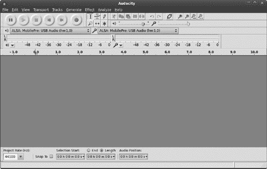

图 1-2. 在 Ubuntu Linux PC 上的一个新、空的 Audacity 窗口

图 1-3. 选择编辑 > 首选项 > 设备来设置您的默认录音和播放设备。

在 Linux 上，您将有更多的选择。“ALSA:default”在设备行上适用于内置声卡（除非您已更改 Linux 系统的默认声卡；参见第十三章了解有关 Linux 音频的所有信息）。选择 USB 设备的设备名称。完成操作后，点击**确定**关闭首选项对话框。

图 1-4. 在 Windows Vista 上选择默认录音和播放设备。

### 注意

在 PC 上进行数字音频制作意味着您必须深入了解您的声卡驱动程序，并配置您的 PC 以获得良好的质量和性能。访问第十三章和第十四章了解如何调整系统以进行音频制作以及如何管理各种操作系统的小怪癖以控制音量级别、平衡和输入输出设备。

在开始录音之前，通过选择**文件** > **另存为**保存并命名您的新 Audacity 项目。对于每次新的录音来说，这是一个好习惯。

在下一节中，我们将学习所有工具按钮的相关知识。现在，将您的光标悬停在工具栏和按钮上，以了解它们的名称。

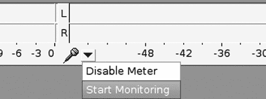

图 1-5. 输入电平表

现在我们来测试录音电平，在我们实际开始录音之前。转到图 1-5 中显示的输入电平表。点击**开始监控**并开始制造噪音。与模拟录音不同，使用数字音频，你不需要将录音电平推到红线。尝试将录音电平记录到-6 或-9 dB 的峰值。

你可以使用混音工具栏来控制录音和播放音量，某种程度上。它实际上不是一个混音器，而是一个录音和播放音量控制。这是带有扬声器和麦克风图标以及每个音量滑块的这个小工具栏。它不能控制所有内部声卡的音量，因为一些低端声卡没有支持音量控制的驱动程序。它也可能无法控制 USB 设备的音量水平，这取决于它们的驱动程序支持什么。如果情况如此，在 Windows 中，转到控制面板中的声音模块来控制音量水平。Linux 用户应使用 alsamixer。（记住，第十三章和第十四章将有助于这些。）或者，你也可以只是制造更响或更轻的噪音。

输入电平表使用两种不同深度的红色：明亮的红色条用于显示平均音量，深红色条用于显示峰值音量水平。细小的垂直蓝色线条标记了在会话期间达到的最高音量水平，而细小的垂直红色线条标记了最后三秒的峰值音量水平。在录音监控器的右边缘是削波指示器，当你的录音电平太大时，它们会变成红色。它们相当小，在录音电平下降后仍然亮着，这限制了它们的有用性。然而，你确实需要注意削波，这是当输入电平过高时发生的。任何超过 0 dB 的值都会产生削波，削波会导致失真。

现在让我们来录制一些声音。点击红色的**记录**按钮，并继续制造噪音。你会看到类似图 1-6 的东西。当你完成时，点击**停止**或**暂停**按钮。使用停止按钮，下一次点击**记录**时，会开始一个新的轨道；暂停按钮让你可以在同一轨道上继续之前的位置。如果你本想暂停却停止了，不要担心——你可以通过按住 shift 键并点击**记录**来追加到一个现有的轨道。

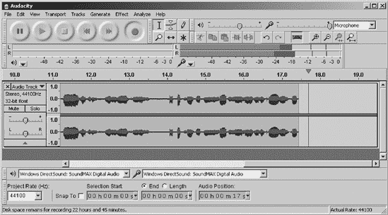

图 1-6. 终于，录音开始了！当你看到蓝色波形时，你就知道它在工作了。

自然地，当你完成录音后，你将想听听你刚刚录制的声音，Audacity 提供了即时满足。点击**播放**按钮。如果你什么也听不到，那是因为你选择了错误的播放设备，或者音量控制设置得太低。在更改播放设备之前停止播放。当你将光标悬停在时间刻度上时，光标会变成一个小手，你可以点击时间刻度上的任何一点来再次开始播放。

在数字音频中，将录音录制到低峰值（如 -24 dB）是一种常见做法。数字音频分贝刻度以负数测量，直到零。我们能够感知到的最小变化大约是 1 dB，对于大多数人来说，-60 dB 几乎等同于静音，因此实际使用的范围是 -60 到 0 dB。+3 dB 的变化将音量翻倍，而 -3 dB 则将音量减半。

当你录制具有不可预测水平的某些内容时，如现场表演，超级低峰值（如 -24 dB）非常有用。在其他更受控制的情境中，良好的峰值水平在 -12 dB 和 -6 dB 之间。任何超过 0 dB 的声音水平都会导致削波，从而产生失真。在数字音频录制中避免失真非常重要。信噪比极高，因此你不需要将录音电平推到最大，只是为了保持噪声在可接受的水平。

低峰值意味着你的录音不会非常响亮，但这没有问题。你可以轻松地修复这个问题。通过点击音轨标签（图 1-7）来选择整个音轨。然后打开**效果** > **规范化**。在规范化对话框中勾选两个框，并将最大振幅设置为 0 (图 1-18）。

图 1-7. 如何选择整个音轨

图 1-8. 规范化统一提升（或降低）你的音轨音量。

最后一步是将你的新录音导出为可播放的音频文件。Audacity 使用其专有的特殊文件格式，该格式只能在 Audacity 中使用，因此你必须导出为在播放设备上可用的音频文件格式。选择**文件** > **导出**，将项目导出为 WAV 文件，这应该是默认选择（图 1-9）。你可以将导出文件命名为任何你想要的名称，也许是一些有创意的名称，比如 *test.wav*。WAV 格式几乎是通用的，几乎可以在任何数字播放设备或计算机软件媒体播放器上播放。

现在，您可以在计算机上播放您的*test.wav*文件，并听到它的全部魅力。Windows 用户可以使用默认安装的 Windows Media Player，或者从众多第三方程序中选择。Linux 用户也有许多媒体播放器可供选择：Amarok、Rhythmbox、VLC、Mplayer 以及更多。

最好将 WAV 格式作为默认的导出格式，因为它是一种无损、未压缩的格式，可以提供最高质量的录音。WAV 文件可以承受大量的编辑而不会降低质量，而损失格式（如 MP3 和 Ogg Vorbis）在每次编辑中都会丢失信息。您始终可以从 WAV 导出为低质量、损失格式的文件，但不能从低质量转换为高质量。

图 1-9. 将您的音频文件保存为 WAV 格式

好了，这就是简短的故事。继续阅读以获取完整版本。

# Audacity 的详细说明

请记住，Audacity 支持几乎无限的撤销，因此可以安全地实验。撤销即使在保存后也有效；只有当您关闭项目文件时，您才会丢失撤销历史。

当您在一个项目上工作时，Audacity 不会直接操作您的音频文件。相反，它会将它们复制到一个临时文件中，将它们切成很多小块，并将这些小块转换为只有 Audacity 可以播放的*.au*扩展名的文件。您可以通过在任何文件管理器中查看您的项目目录来看到这一点。每个项目都有一个单独的*.aup*文件；这个文件包含 Audacity 需要用正确设置将这些小块文件重新组合在一起的所有元数据。当您从文件管理器打开 Audacity 项目时，选择*.aup*文件。

假设您有一段出色的表演录音，您表现得非常出色，让所有人都流下了喜悦的泪水（不是痛苦），而这个录音是 WAV 格式的。当您将这个 WAV 文件导入 Audacity 时，它会复制并转换为 Audacity 的内部*.au*格式。您的原始 WAV 文件安全无恙，并且不会改变，只要您不通过将项目导出回相同的 WAV 文件来覆盖它。

转换和分割您的文件可能听起来像是一件奇怪的事情要做，但操作许多小块文件比操作几个大文件要快得多。音频文件可以消耗许多兆字节，甚至吉字节。Audacity 有一个自动恢复机制，您只有在发生严重问题时才会看到它；当您重新打开 Audacity 时，它将显示一个恢复消息。未保存的数据保存在一个临时文件中，因此 Audacity 通常可以恢复它们。选择**编辑** > **首选项**来设置自动保存间隔；我的设置为两分钟。而且，就像我们在计算机上做的所有事情一样，良好的备份是必不可少的。如今硬盘空间很便宜，所以不要在存储上节省一分钱。

让我们从查看 Audacity 的工具栏开始我们的详细浏览。所有的工具栏在其左侧都有把手，因此您可以将其拖动到任何您想要的位置，甚至可以拖出 Audacity 窗口。将光标悬停在工具栏把手上时，工具栏名称会弹出。将光标悬停在按钮上以查看它们的名称。

选择**视图** > **工具栏**来控制哪些工具栏可见。

图 1-10 显示了控制工具栏，其中包含暂停、播放、停止、跳转到开始、跳转到结束和录音按钮。

现在让我们来认识一下工具栏上的按钮：选择、信封、绘图、缩放、时间移动和多工具(图 1-11). 这些按钮影响光标的功能。

图 1-10. 控制工具栏

图 1-11. 工具栏

在工具栏旁边是编辑工具栏(图 1-12)，其中包含剪切、复制、粘贴、修剪、静音、重做、撤销、链接轨道、缩放、适应选择和适应项目按钮。

图 1-12. 编辑工具栏

表 1-1 列出了工具和编辑工具栏上所有按钮及其功能的描述。

表 1-1. 工具和编辑工具栏按钮

| 按钮 | 名称 | 描述 |
| --- | --- | --- |
|  | 选择 | 点击以标记播放起点。点击并拖动以选择轨道的一部分。双击以选择整个轨道。在时间标尺上点击任何位置以开始播放（它变为小手形状）。 |
|  | 包络线 | 用于对轨道上的振幅（音量级别）进行精细控制，以及创建淡入和淡出效果。点击以创建控制节点，然后点击并拖动节点以增加或减少振幅。控制节点可以垂直和水平拖动。将节点拖过轨道边界以删除它们。 |
|  | 绘图 | 点击放大按钮直到可以看到单个音频样本，然后使用绘图工具来操作它们。用于非常精细的点击和爆裂声的平滑处理。 |
|  | 缩放 | 左键点击以放大，右键点击以缩小。记住缩放按钮！你可能经常会用到它们：使用放大来精确编辑，使用缩小来使长轨道易于管理。查看视图菜单以获取更多缩放命令和快捷键。 |
|  | 时间移动 | 通过沿时间轴前后拖动音轨来同步音轨。你也可以将音轨或剪辑拖入另一个音轨，只要那里有足够的空间容纳它即可。 |
|  | 多工具 | 这是一个包含五个工具的工具，根据鼠标位置激活。通过垂直移动光标获取选择和包络工具，通过在音轨的开始或结束处的音轨处理程序上悬停获取时间移动工具，通过将光标向左移动到分贝刻度获取缩放工具；缩放视图将围绕你悬停的分贝数字居中。当你足够放大以看到单个样本时，绘图工具会出现。 |
|  | 剪切 | 这将移除选择并将其放在剪贴板上。 |
|  | 复制 | 这将复制选择而不移除它，并将其放在剪贴板上。 |
|  | 粘贴 | 这将在光标位置插入剪贴板内容或替换选择的内容。 |
|  | 剪裁 | 这将删除除了选择之外的所有内容。 |
|  | 静音 | 这将用静音替换选择的内容。 |
|  | 重做 | Audacity 支持几乎无限的撤销和重做，即使在保存项目之后也是如此，因此可以安全地实验。重做按钮会按顺序反转撤销操作或一系列撤销操作。你不能跳回到选定的操作；你必须按顺序重做所有操作。 |
|  | 撤销 | 这将撤销你的最后一个操作，或按顺序撤销之前的一系列操作，即使在保存项目之后也是如此。你不能跳回到选定的操作；你必须按顺序撤销所有操作。 |
|  | 链接音轨 | 这个工具的名称有些误导性。你可能认为它是用来选择多个音轨的，但它的功能实际上是“链接音频和标签音轨”，这与预期完全不同。当你开始一个新项目时，链接音轨默认启用，并在你修改音轨时保持音频和标签音轨同步。如果你没有标签音轨，它将不起作用。当你进行影响音轨长度的更改时使用它，例如删除音轨的一部分、插入静音或更改速度。在复制和粘贴整个音轨时关闭链接音轨，因为它会搞乱你的粘贴。链接音轨出现在 Audacity 1.3.9 版本中，在 2.0 系列中将不活跃，并计划在 2.1 系列中再次出现。 |
|  | 放大 | 放大。您可以将放大到足够远，以看到单个样本。点击选择工具光标在您想要放大的点上，放大将集中在该位置。 |
|  | 缩小 | 缩小。您可以将缩小到足够远，一次看到整个轨道。与放大类似，缩小将集中在您使用选择工具点击的点。 |
|  | 适应选择 | 您可以放大选择以适应窗口水平方向。当您需要选择长轨道的一小部分进行工作时，这个工具可以节省大量时间。 |
|  | 适应项目 | 此工具将整个项目调整大小以适应 Audacity 窗口的水平方向。选择**视图** > **垂直适应**以将整个项目适应到窗口中。 |

图 1-13 展示了仪表工具栏，它显示录音和播放电平。当它被压缩时，仪表工具栏可能不会在其刻度上显示较小的值。在这种情况下，您可以抓住它左侧的把手，将其移动到有更多空间的地方，然后抓住它右侧的调整大小把手，最后将其拉伸到可以看到整个分贝刻度。 |

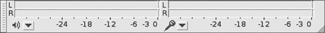 |

图 1-13. 仪表工具栏

图 1-14 展示了混音工具栏，它实际上不是一个混音器。相反，它应该用于控制内部声卡的输入和输出音量级别。然而，这些功能只有在您的声卡驱动程序支持的情况下才会工作，所以如果它们不起作用，请责怪您的声卡制造商。（有关操作系统音频控制的信息，请参阅第十三章配置 Linux 以获得最佳音频质量和第十四章配置 Windows 以获得最佳音频质量。） |

 |

图 1-14. 混音工具栏 |

 |

图 1-15. 转录工具栏 |

转录工具栏（图 1-15 展示了设备工具栏，在这里你可以选择你的录音和播放设备，而无需选择 **编辑** > **首选项**。如果你插入或移除一个 USB 设备，你需要重新启动 Audacity，否则它将看不到变化。

图 1-16. 设备工具栏

最后，如图 图 1-17 所示的选择工具栏，提供了多种不同的比例，用于精确的音频轨道部分定时和选择，以及设置视频音轨和 CD 音频的正确帧率。

图 1-17. 选择工具栏

# 管理 Audacity 项目

在新的 Audacity 项目中，你的第一步始终应该是使用 **文件** > **另存为** 来命名它。然后你可以定期按 ctrl-S 保存更改或使用 **文件** > **保存**。除了项目的主元数据文件 *.aup* 之外，Audacity 还会创建一个包含相关音频文件的目录。你可以在文件管理器中查看这些文件；将会有许多包含 *.au* 扩展名的子目录。

## 添加音频文件：导入与打开

选择 **文件** > **打开** 将现有音频文件添加到新的、空的项目中。之后，选择 **文件** > **导入** 添加更多文件。在非空项目中选择 **文件** > **打开** 将文件在新窗口中打开。

## 保存你的工作

Audacity 项目优化用于快速工作空间，不适合归档存储。没有快照机制来保存不同阶段的工作，用户报告说项目损坏时丢失了数据。我采用了一种“双保险”的方法：我为 Audacity 项目文件做备份，同时也制作了 WAV 格式的录音室母带文件，因为每种方法都有其优点和缺点。首先，我们将探讨在不同阶段保存 Audacity 项目的方法，然后我们将探讨如何制作 WAV 格式的录音室母带。

你可以通过从原始项目创建多个 Audacity 项目来创建类似项目快照的东西。首先，创建一个目录来保存相关项目，这样它们就不会混淆或丢失。然后选择**文件** > **另存为项目**，并为项目命名以帮助你记住里面的内容，例如 Summer-Festival-1，Summer-Festival-2，或者更描述性的名称，如 Summer-Festival-No-Banjos 或 Summer-Festival-Mondo-Banjos。当你这样做时，你会看到一个类似于图 1-18 的对话框。这里的关键问题是“将以下文件中的音频复制到你的项目中以使其自包含？”通过点击**复制所有音频到项目（更安全）**按钮来回答“是”。这会复制项目文件并使用更多的磁盘空间，但这是最安全的选项。在多个项目之间共享文件可以节省磁盘空间，但带来的麻烦不值得，因为一个项目中的更改会影响所有项目。更糟糕的是，你失去了冗余，这是你防止任何一个项目损坏和无法使用的一种保险。

图 1-18. 在新项目名称下保存你的项目副本

你可以在**编辑** > **首选项** > **项目**对话框中控制这种行为：当保存依赖于其他音频文件的项目时。这提供了三个选择：“始终将所有音频复制到项目中”，“不复制任何音频”，或“询问用户”。

要制作一个高质量的录音室母带 WAV 文件，通过选择**文件** > **导出**来导出你的项目。你可以在项目工作的任何时间这样做，创建多个母带来保存你在不同阶段的成果（或者直到你的磁盘空间用完为止！）。然后你可以随时导入 WAV 母带进行进一步编辑，并且可以从你的 WAV 母带导出任何其他音频格式。这也为你提供了将 WAV 母带导入另一个音频编辑程序的选择，这是你不能用 Audacity 的项目文件做到的。

WAV 的默认导出质量设置为 16 位整数，这不是最高的质量。Audacity 的默认录音质量设置（选择**编辑** > **首选项** > **质量**）是采样率为 44.1 kHz，位深度为 32 位浮点。（Audacity 术语将位深度称为*样本格式*，但*位深度*是正确的术语。）你可以通过导出为 32 位浮点 WAV 来创建一个高质量的录音室母带。按照以下步骤操作：

1.  选择**文件** > **导出**。

1.  选择**保存类型**：其他未压缩文件。

1.  点击**选项**，然后选择**头信息**：WAV（微软）和**编码**：32 位浮点。

你将看到一个类似于图 1-19 所示的窗口。

图 1-19. 将项目导出为 32 位浮点 WAV 文件

生成的文件不是一个可播放的 WAV 文件，除非在 Audacity 和其他使用 32 位浮点进行编辑的音频编辑器和数字音频工作站中。然而，这对于录音室母带来说非常棒，因为你可以以非常小的质量损失导入和编辑 32 位浮点 WAV 文件，并将它们导出为其他音频格式：16 位和 24 位 WAV、Ogg Vorbis、MP3、FLAC 等等。WAV 文件支持单个文件中最多 32 个音轨。

然而，这也存在其缺点。当你只有少量音轨需要管理时——我的极限是四个——这还可以正常工作，因为 Audacity 不会保存音轨名称，而是将所有音轨重命名为 WAV 文件名。假设你有一个四轨录音，音轨分别命名为*vocal*、*piano*、*violin*和*vocal2*。将此项目导出为单个 WAV 文件，并将其命名为*testwav.wav*。当你将*testwav.wav*导入 Audacity 时，所有四个音轨都会被重命名为*testwav 1.wav*、*testwav 2.wav*等等。这也使得 1 号和 2 号音轨变成了左右声道，即使它们原本是单声道音轨。图 1-20 展示了前后对比。

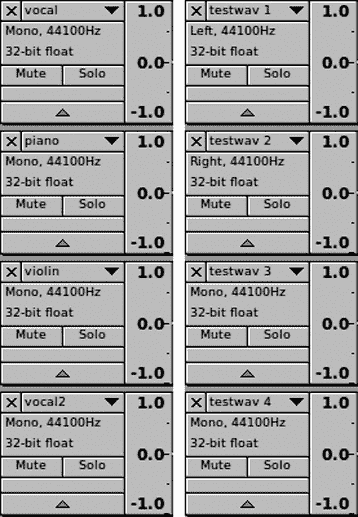

图 1-20. 将项目导出为 WAV 格式（左侧是导出为 WAV 格式之前的原始项目，右侧展示了将 WAV 文件导入 Audacity 后发生的情况）

你仍然拥有所有单独的音轨，但会丢失音轨名称。在多轨项目中，我非常依赖音轨名称来保持组织有序，所以将它们全部合并成一个 WAV 文件对我来说不起作用。

对于包含超过四个音轨的项目，我更喜欢将每个音轨保存为单独的 WAV 文件。为此，选择你想要导出的音轨，然后选择**文件** > **导出多个**。（我们将在下一节讨论如何选择音轨。）每个音轨都将保存为单独的文件，音轨名称将成为相应文件的文件名。当我这样做时，我会将它们放在它们自己的项目目录中，这样就不会与其他项目混淆。

# 选择音轨和音轨片段

现在我们来学习如何选择轨道和轨道的部分。Audacity 支持计算机用户熟悉的常规编辑功能——复制粘贴、删除、选择等，但如果你不学习如何用 Audacity 的方式来做这些操作，它可能会让你感到疯狂。Audacity 的一个不错的特点是它支持几乎所有功能的键盘快捷键，因此你可以使用鼠标或键盘。

首先，通过选择**文件** > **导入**来创建一个新的录音或导入现有的音频文件，这样你就有一些轨道可以进行实验。确保选择工具是激活的。如果你使用的是多工具，将其上下移动直到它变成选择工具，它看起来像一个小 I 形光标。

轨道焦点和轨道选择是两回事。黄色的轨道边框显示哪个轨道有焦点，但如果轨道面板是浅色，则表示该轨道未被选中。有焦点意味着该轨道已准备好接受键盘命令；光标行在该轨道中是活跃的，你可以使用箭头键移动它。

图 1-21 显示了两个轨道：下面的轨道有焦点，由黄色边框表示，而上面的一个被选中，由阴影轨道面板表示。光标行延伸到两个轨道中，但在下面的轨道中是活跃的。有一个被选中的但没有焦点的轨道和一个有焦点的未被选中的轨道并没有太大用处。你可以在有焦点的轨道中选择播放的起始点，并使用箭头键移动它，但这基本上就是全部了。

图 1-21。最上面的轨道被选中但没有焦点，而下面的轨道有焦点，由黄色边框表示，但未被选中。

当选择一个轨道时，它将成为你执行的所有编辑操作的目标，例如复制、剪切或应用效果。即使它没有焦点，这些操作也会应用于整个轨道。选择整个轨道有两种方法：你可以在波形上任何地方双击，或者你可以点击轨道面板中的轨道标签（见图 1-17）。

大多数时候你不需要注意焦点和选择，因为在正常的编辑过程中，它们会处于你想要的位置。但有时事情会表现得古怪，了解这种区别应该有助于你理解当 Audacity 似乎神秘地响应时发生了什么。

您还可以选择轨道的一部分。图 1-22 显示了一个只选择部分而不是整个轨道的轨道。注意所选部分与未选择部分之间的阴影差异。

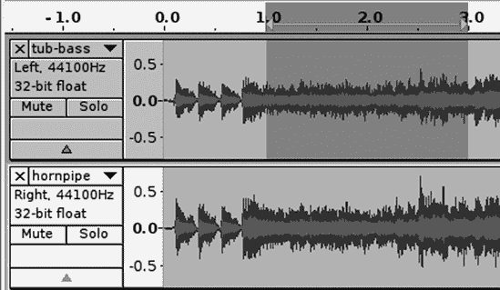

图 1-22. 顶部轨道的一部分被选择。一些笔记本电脑屏幕不够亮，使得在轨道面板中难以清楚地看到阴影，因此也要查看时间轴。

ctrl-A 选择所有轨道，而 shift-ctrl-A 取消选择所有轨道。在轨道内部双击以仅选择该轨道，或在轨道标签上左键单击。shift-单击轨道标签可以逐个选择和取消选择多个轨道，以及非相邻轨道。在 图 1-23 中，第一和第三条轨道是通过 shift-单击选择的。

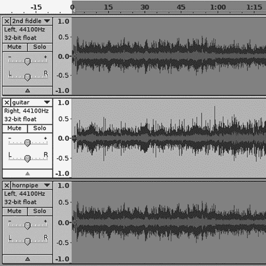

图 1-23. 通过按住 shift 键并点击轨道标签来选择非相邻轨道

要选择轨道的一部分，请使用选择工具单击并拖动。要调整选择的大小，将光标移至选择的任一边界，光标将变成水平箭头，然后单击并拖动该边界（图 1-24）。

您可以使用键盘的箭头键在轨道之间导航并调整选择。按住 shift 键并按下左箭头或右箭头键可以放大选择；按住 ctrl-shift 键并按下左箭头或右箭头键可以使选择缩小。要选择多个相邻轨道，可以先在顶部或底部轨道上做出选择，然后按上箭头或下箭头键以在其他轨道上重复选择。

图 1-24. 通过单击和拖动边界来调整选择的大小

在您的控制工具栏中的“跳转到开始”和“跳转到结束”按钮可以将光标移动到音轨的开始或结束位置。在点击“跳转到开始”按钮的同时按住 shift 键，将从光标位置选择到音轨的开始，而在点击“跳转到结束”按钮的同时按住 shift 键，将从光标位置选择到音轨的结束。

您还可以使用选择工具栏根据各种音轨参数（如时间、样本以及各种音频和视频帧率）进行精确选择。您可以通过点击工具栏上任意三个字段中的下拉菜单来查看这些参数（图 1-25）。

图 1-25. 选择工具栏支持基于多个有用的音轨参数的选择

假设您想选择从音轨开始 48 秒处的 12 秒片段。有多种方法可以到达 48 秒的标记——使用选择工具点击，使用箭头键导航，或使用选择工具栏。设置选择开始：秒并输入 48。选择“结束”单选按钮，并在中间框中输入 60。这就是您的 12 秒片段（图 1-26）。

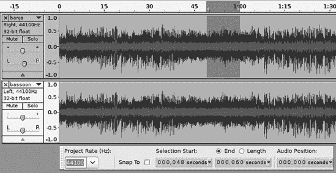

图 1-26. 使用选择工具栏选择音频音轨的精确部分

上箭头和下箭头键也可以更改数字，而右箭头键和左箭头键可以前后导航。

# 音轨面板

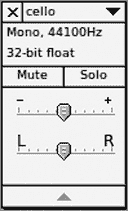

图 1-27. 便捷的音轨面板

音轨面板将许多有用的快捷方式放在您的指尖上（图 1-27）。左上角的*X*可以删除音轨。底部的箭头可以折叠和展开音轨。您还可以使用鼠标拖动音轨边框来改变它们的宽度。增益滑块可以放大或减小音轨音量，而不会永久更改它，这在混音多个音轨时是必不可少的。平衡滑块控制左右平衡。

默认情况下，当您点击播放按钮时，Audacity 会播放项目中的所有音轨。使用独奏按钮选择一个音轨进行播放，或使用静音按钮静音您不想听到的音轨。这仅影响 Audacity 中的播放，并不会更改您的项目文件。

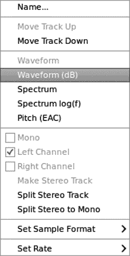

图 1-28. 音轨菜单功能

轨迹菜单包含一个有趣的杂货袋功能（图 1-28）。您可以使用它来创建音轨名称——当您处理大量音轨时，您肯定希望给它们命名。它还提供不同的波形视图；允许您拆分或合并立体声音轨；允许您设置单声道、右声道或左声道；允许您移动音轨上下；并且允许您更改位深度（Audacity 称为*采样格式*）和采样率。

立体声音轨可以通过拆分立体声音轨或拆分立体声到单声道来拆分为两个单独的单声道音轨。使用拆分立体声音轨时，一个将是右声道，另一个将是左声道。使用拆分立体声到单声道时，将创建两个单声道音轨。要创建立体声音轨，请将两个单声道音轨并排放置，然后在上方音轨的轨迹菜单中点击**制作立体声音轨**。通过点击并拖动音轨标签或通过在轨迹菜单中选择**移动音轨上下**来移动音轨。

轨迹面板右侧的垂直刻度是您了解音轨音量的指南。默认显示为波形，您可以通过轨迹菜单将其更改为波形（dB）、频谱或音高（EAC）。波形是一种常用的视觉刻度，用于显示音轨的*幅度*（信号的强度或音量）。波形垂直标尺具有+1.0 到-1.0 的*线性*刻度；任何超出这些值的都表示削波，这意味着您正在获得一些失真。线性意味着所有频率在刻度上都被赋予相同的权重。分贝是对数而不是线性的，所以这不是真正的表示，但它很容易阅读。

波形（dB）显示幅度使用对数分贝刻度。不深入数学细节，对数意味着每个 3 dB 的增加代表响度加倍——因此，测量为 6 dB 的声音比测量为 3 dB 的声音响亮一倍，9 dB 的声音比 6 dB 的声音响亮一倍。人类能感知的最小变化增量约为 1 dB。（在词汇表中了解更多关于音频术语的信息。）

数字音频有一个特殊的分贝刻度，即零分贝全量程。这表示数字音频音量范围，用负数表示，最大值为 0。在 Audacity 中，您可以在**编辑** > **首选项** > **界面**对话框中控制波形（dB）视图和仪表工具栏上显示的分贝范围。最小刻度是-36 dB 到 0，最大刻度是-145 dB 到 0。这仅影响显示，对音频音轨没有任何影响。

你可以使用波形显示来监控你的录音电平；我认为默认的波形显示最容易阅读。你会注意到显示使用了两种蓝色的阴影，一种较浅，一种较深。浅蓝色代表均方根（RMS），或称*均方根*，用普通英语来说就是随时间变化的平均音量。深蓝色代表峰值，即瞬间的极端值。

### 注意

均方根和峰值评级在音频设备的营销中被（错误地）使用，让你觉得你得到了比实际更多的东西。例如，一套扬声器被评定为 50 瓦 RMS/150 瓦峰值。忽略峰值值——RMS 告诉你扬声器可以连续承受多少。峰值值表示扬声器在非常短的时间（秒的分数）内可以承受多少。

频谱视图用颜色表示不同频率的能量水平（振幅）。红色是“热”的，或振幅较高，蓝色是“冷”的，或振幅较低。如果你的波形主要是蓝色，那么它不是很响亮，如果它更多是红色，那么它更响亮。你可以通过选择一个轨道或轨道的一部分，选择**效果** > **放大**，并给它一个负放大值-30 dB 来轻松测试这一点。这应该使它主要是蓝色。给它一个接近零的值，使其更红。

音高（EAC）使用增强自相关（EAC）算法显示你的音频音高的轮廓。EAC 算法对音高检测很有趣；如果你对此感兴趣并想了解更多，*增强自相关*和*音高检测*是一些好的互联网搜索词。Audacity 的这种实现相当基础，所以如果你对此感兴趣，你可能想找到更复杂的工具。

# 删除不需要的部分

你可以轻松地删除你不需要的轨道部分。只需选择一个部分，然后按下键盘上的删除键。如果你想只保留轨道的一小部分并删除其余部分，请选择**编辑** > **裁剪**或点击编辑工具栏上的**裁剪**按钮。这将保存你选择的轨道部分，并删除其外的所有内容。

有时候你可能需要在保持轨道完整的同时，使轨道的较大部分静音。在这种情况下，选择你想要转换为静音的部分，然后点击**静音**按钮或选择**编辑** > **静音音频**。

# 渐入和渐出

当你删除轨道的一部分时，你可能想用优雅的渐变来平滑切割。渐变是音频编辑的重要组成部分，Audacity 有两种创建渐变的方式。最简单的方法是选择轨道的一部分，然后选择**效果** > **渐入**或**渐出**。你控制渐变的长度，Audacity 完成其余的工作。

包络工具可以微调幅度级别；它适用于控制淡入淡出，以及在音频轨道的任何地方进行幅度微调，包括相对较长的段落。图 1-29 显示了这看起来是什么样子。点击不同的位置来创建控制节点。要删除节点，将其拖出音轨边界。

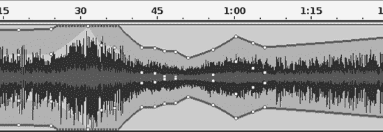

图 1-29. 包络工具创建优雅的淡入淡出，并为您提供对幅度的高精度控制。

每个节点有四个手柄。节点手柄可以沿任何方向移动。外对手柄的行为略不同于内对手柄——使用外对手柄创建更优雅、更平缓的曲线。

30 秒标记两侧的虚线显示了包络的边界超出音轨显示的地方。

### 注意

除了编辑工具栏中的 Zoom 按钮外，视图菜单还有一些很好的选项来操作和导航您的音轨，例如“Fit In Window”和“Zoom to Selection”，并且它显示了有用的快捷键，如 ctrl-2 用于正常缩放和 shift-ctrl-F 用于垂直缩放。

# 使安静录音更响亮

假设您的录音太安静，您想提高音量。没问题！选择您想要放大的部分，然后选择**效果** > **放大**。Audacity 会自动计算可以应用的最大放大倍数，即不超过 0 dB（图 1-30）。除非您非常确定要这样做，否则不要勾选“允许剪辑”框。

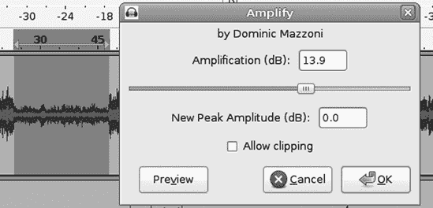

图 1-30. 使用效果 > 放大来提升或降低所选内容的音量

另一种放大太安静录音的方法是选择**效果** > **归一化**。勾选“移除任何直流偏移”，勾选“归一化最大幅度到”，并将最大级别设置为 0。*直流偏移*指的是平均幅度；如果这不是零，则归一化将不会正确应用，因为幅度级别将不平衡，可能会产生一些失真。

当应用到多个音轨时，放大和归一化的区别变得明显。放大将所有音轨的音量按相同比例改变。如果您将音量放大+9 dB，峰值在-20 dB 的音轨将被提升到-11 dB，而峰值在-9 dB 的音轨将被提升到 0 dB。另一方面，归一化会调整所有音轨到相同的最大音量级别，因此某些音轨可能比其他音轨改变得更多。

两者默认的最大设置都是零。将这个值降低到-12 dB 左右在你的工作室母带中很有用，这样可以留出一些空间进行更多的调整，而不会冒剪辑的风险。例如，当你将多个轨道下混到单个轨道时，后者将具有所有这些轨道的振幅总和，并且会变得更响，可能非常响。经验将告诉你你需要多少空间。在你制作最终导出之前，不要将归一化设置为零。

放大和归一化也可以用来降低振幅。在放大对话框中，输入一个负值，例如-6。归一化对话框只使用负值，并且不允许高于零的任何值。

# 定时录音和声音激活录音

无论是定时录音还是声音激活录音，都在传输菜单中。要使用声音激活录音，选择**传输** > **声音激活水平**并设置你想要触发录音的分贝水平。可能需要一些尝试和错误才能找到一个既能捕捉到你想要的，又不会捕捉到太多不想要的噪音的水平。然后打开录音监视器（仪表工具栏）并点击**播放**按钮。当检测到足够大的声音时，Audacity 将自动创建一个新的轨道，并使用该轨道直到你停止定时录音。任何时候点击**停止**按钮都可以停止声音激活录音。

定时录音同样简单——只需设置录音的开始和停止时间。你可以将此与声音激活录音一起使用，设置一个开始和停止范围，这样你就可以离开并让 Audacity 运行，而不用担心它会填满你的硬盘。

# 混音板

混音板是 Audacity 1.3.8 版本中首次出现的新功能（图 1-31）。

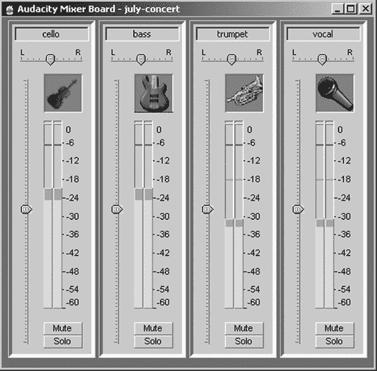

图 1-31. 混音板将平衡和增益控制置于前端和中心。

这是一个小巧的混音板，每个轨道都有音量单位（VU）表，还有平衡和增益滑块。它将你的基本混音控制置于容易触及的位置，而无需使你的轨道变得过宽，以便可以访问轨道面板上的滑块。

要使用混音板，在 Audacity 中播放你的轨道，并使用位于 VU 表左侧的增益滑块调整轨道的相对音量，以及使用平衡滑块调整每个轨道的左右平衡。然后进行导出。平衡和增益滑块不会改变你的项目文件——它们只影响 Audacity 中的播放以及导出文件的声音。参见第九章了解更多关于多轨混音的信息。

# 跟踪元数据

您可以使用元数据编辑器在 Audacity 项目中保留有用的数据，例如歌曲标题、日期、艺术家名称和流派。在最终导出之前，选择**文件** > **打开元数据编辑器**。您将看到一个类似于图 1-32 中的窗口。填写任何艺术家名称、专辑标题、年份、流派和注释字段，这些信息将被应用到每首歌曲轨道上。Audacity 将自动填写轨道标题和轨道编号字段。

图 1-32. 使用文件 > 打开元数据编辑器以在 Audacity 项目中存储有用信息

如果您选择**编辑** > **首选项** > **导入/导出**，有一个“在导出步骤之前显示元数据编辑器”选项。如果您勾选此选项，则在导出每个轨道之前，元数据编辑器将打开，以便您可以审查或编辑元数据。

# 最终混音

通常您的目标是将您记录的任意数量的轨道混音到一个立体声轨道上。然而，Audacity 也支持多声道环绕声，这在第九章中有详细说明。在导出之前，选择**编辑** > **首选项** > **导入/导出**并选择“使用自定义混音”单选按钮。在导出时，将出现一个高级混音选项窗口，它是一个简单的通道映射器。将您的轨道映射到您想要的任何通道。您的轨道可以映射到左通道、右通道，甚至多个通道。当有两个轨道时，通道 1 始终是左通道。（参见图 1-33 中的简单双轨道示例。）当您使用此工具时，您会为给您的轨道命名而感到高兴。第九章更详细地介绍了多轨混音和通道映射。

图 1-33. 使用 Audacity 的混音器将您的轨道映射到正确的通道

# 音频文件格式和质量设置

有许多不同的音频文件格式，Audacity 支持其中很多。让我们看看 WAV、MP3、FLAC 和 Ogg Vorbis。这些广泛支持的流行格式服务于不同的目的。

## 理解文件格式

WAV 文件是不压缩的高质量脉冲编码调制（PCM）文件。它们很大。一张 CD 质量的立体声 WAV 录音大约消耗 10MB 的磁盘空间。WAV 是支持最好的格式，并且是其他格式衡量质量的标准。

MP3（MPEG-1 音频层 3，不是 MPEG-3）是一种流行的压缩、有损编码格式；一个 MP3 文件可以小到与类似 WAV 文件十分之一的大小，同时听起来仍然相当不错。这意味着你可以将更多的音乐塞进便携式播放器，并实现更快的下载和更好的在线流媒体。代价是质量有所损失。参见第十三章和第十四章了解如何在 Audacity 中启用 MP3 支持。

虽然 MP3 非常流行，但它却受到混乱的专利问题的困扰。不同国家的多家公司声称拥有 MP3 的专利，根据你所在的地方，如果你想要分发编码为 MP3 的音乐，可能需要支付许可费用。最后的专利将在 2017 年到期。然而，专利情况并不明确，因为许多独立音乐家在他们的祖国之外的国家分发 MP3 格式的音乐而不支付专利版税，并且专利并不适用于所有非原产国的国家。

无损音频编解码器（FLAC）是一个优秀的开放和免费格式。这种无损、压缩的格式在质量上与 WAV 相当，但文件大小可以小三分之一到一半。FLAC 是一个非常适合 PC 媒体服务器的格式，因为你可以得到高质量的音乐，而不会占用太多的硬盘空间。在线音乐服务以 FLAC 格式提供他们最高质量的下载。如果你需要节省存储空间，甚至可以使用 FLAC 作为你的录音室母带。尽管 FLAC 格式不支持 32 位浮点，但 24 位 FLAC 文件仍然非常高质量。

Ogg Vorbis 被创建为一个高质量、免费和开放的 MP3 替代品。Ogg 文件的尺寸从与 MP3 相当到大约大 25%。尽管 Ogg Vorbis 不像 MP3 和 WAV 那样广泛支持，但其受欢迎程度正在增加。Linux、Windows 和 Mac 都有许多支持播放独立 Ogg 文件和流式传输 Ogg 的软件音乐播放器。iPod 和 Zune 不支持 Ogg（这并不令人惊讶，因为它们来自两个锁定技术的巨头），但越来越多的其他播放设备支持 Ogg。

第七章详细介绍了 Ogg Vorbis 和 MP3 的不同质量级别，第六章讨论了 WAV 和 FLAC。

下一节将解释一些数字音频的重要基本概念和术语，你会在很多地方遇到它们，所以请泡一杯茶，放松一下，继续阅读。

## 理解比特深度和采样率

数字音频制作可以总结为将模拟信号转换为数字，然后再转换回模拟。换句话说，您从模拟麦克风或电子乐器中捕获声音，通过模拟到数字转换器（ADC）处理，并将数字化的比特记录到硬盘或固态存储器中。ADC 可以是声卡、预放大器/ADC、独立的 ADC 或其他组合设备。在某个时候，这些数字数据将被检索并转换为模拟形式以进行播放。

您的计算机声卡在播放时执行数字到模拟转换，普通的 CD 或 MP3 播放器也是如此。

您的目标是以尽可能忠实的方式转换这些模拟信号。一旦它们以数字形式存在，您就有了一个全世界的工具来以各种创造性的方式操纵它们，并且您有大量的播放格式和媒体选项。

## 16/44.1，24/96，32 位浮点

两种常见的数字音频规格被称为 16/44.1 和 24/96。有时 16/44.1 被简称为 16/44。这些标识指定 *位深度* 和 *采样率*。位深度影响动态范围、信噪比和保真度。采样率决定频率范围。

CD 音质音频定义为 44.1 kHz、16 位、双通道 WAV，而 24/96 是高于 CD 音质音频，如数字音频磁带（DAT）、DVD 音频和录音室母带录音。所以，我们应该只选择最高的数字以获得最佳质量，对吧？嗯，不——还有许多因素需要考虑。

图 1-34. Audacity 波形，放大以便可见样本点

*采样* 由模拟到数字转换器执行；它在模拟音频信号中的电电压以一定间隔进行采样，并将测量值转换为数字形式。每秒进行的次数越多，信号的数字表示就越准确。因此，44.1kHz 的采样率意味着每通道每秒 44,100 个样本。这是 Audacity 的默认设置。您可以通过放大任何 Audacity 波形的一部分来查看这个图像。这看起来像 图 1-34，其中每个点代表一个单独的音频样本。

每个音频样本都表示为一个数值——在计算机中，一切都是数字。在 CD 音质音频中，每个样本可能的值范围是 16 位，16 位 = 65,536。这是 *位深度*。每个样本的大小不是 65,536 位，而是给定一个等于或小于 65,535（0 到 65,535）的单一 16 位值。

对于 24/96 录音，这在专业录音中经常使用，24 位可以提供 16,777,216 种可能值。更大的位深意味着更宽的动态范围和更细腻的音色变化——同时也意味着文件大小显著增加。立体声录音一分钟大约是 10MB（每个声道 5MB）在 16/44.1 的采样率下，而在 24/96 的采样率下大约是 34MB。

理论上，16 位数字音频的动态范围是 96 分贝，范围从-96 到 0。对于 24 位音频，动态范围是 144 分贝，对于 32 位音频，动态范围是 192 分贝。在现实世界中，由于电子硬件的限制，实际的动态范围会更低：16 位音频大约是 90 分贝，24 位和 32 位音频大约是 115 分贝。

广阔动态范围的价值不在于你可以用突然的极端音量变化来震惊听众，而在于拥有非常高的信噪比，这也被称为“低噪声地板”。信号越多，噪声越少，效果越好。

就调整动态范围以考虑听众而言，录音中的 50 分贝到 60 分贝的范围是大多数听众能够容忍的最大值，而且在理想条件下，在一个安静的环境中，使用一个好的系统。一个挑剔的音响爱好者，拥有良好的设备和安静的听音空间，会欣赏到使用 60 分贝动态范围的交响乐。一场现场交响音乐会可能涵盖 80 分贝的范围。

在一个嘈杂的环境中或使用低质量音频设备听音乐的人可能会更适应 20 分贝或更窄的动态范围。Audacity 允许你根据需要调整录音的动态范围。（参见第六章，第八章，和第十一章了解更多关于动态范围压缩的信息。）

在音频领域有一个著名的定理，称为奈奎斯特-香农定理。它很长且详细——这里重要的部分指出，当采样率至少是信号中最高频率的两倍时，可以实现模拟音频信号的完美数字表示。人类最好的听力可以达到 20 kHz 到 24 kHz，因此 40 kHz 到 48 kHz 的采样率（理论上）可以重现人类听力的整个范围。

Audacity 的默认录音比特深度是 32 位浮点。许多数字音频工作站，包括 Audacity，在内部以 32 位浮点运行。重要的是要理解这是 32 位浮点，而不是 32 位整数。相比之下，16 位和 24 位深度代表整数值。通常，数学是复杂的，如果他们愿意，音频专家会把你讲得泪流满面，所以这里有一个简化的故事：整数是整数，而*浮点*意味着浮点小数点。这个 32 位浮点数是一个 24 位的尾数加上一个 8 位的指数。这在音频制作方面很重要——它给你大约 1500 dB 的动态范围，这意味着几乎没有噪声或削波，你可以在整个模拟到数字转换范围内获得更平滑、更准确的响应曲线。（相比之下，32 位整数的动态范围是 196 dB。）

即使使用 16 位录音接口，在 32 位浮点下录音和编辑也是有利的。如果你将峰值设置为-24 dB，这是一个非常低且安全，可以避免削波的水平，你的可用动态范围仍然会超过任何硬件支持的动态范围，你将有足够的额外位可以丢弃而不损害质量。这意味着你可以随心所欲地编辑和操作你的音频文件，并且仍然能够制作高质量的 16 位和 24 位导出。你对录音应用的处理越多，你就越需要所有那些额外的空间。

你总是会导出到较低的比特深度，因为没有 32 位浮点播放设备。可播放的格式必须是整数数据，所以你的导出总是到 8 位、16 位或 24 位整数。（经常使用*线性*这个词代替整数；它们指的是同一件事。）

在实践中，许多因素会影响你选择的比特深度和采样率：你的听力有多好，你的设备有多好，最终格式和播放介质将是什么？你的录音技术有多好？你正在制作什么样的录音——是细微的乐器和声乐还是震撼的重金属摇滚？你的电脑是否足够强大以处理更大的音频文件，并且你有足够的存储空间吗？

由于“越大越好”的心态，你可以以优惠的价格购买 16/44.1 录音机和 ADC。另一方面，拥有额外的带宽也无妨——你总是可以降低质量和大小，但（尽管电视犯罪节目中会展示给你）你无法恢复最初没有的内容。当你进行实验时，我的建议是先增加比特深度，然后再增加采样率。如果你的听力和音频设备很好，你应该能够听到 16 位和 24 位录音之间的差异，尽管我怀疑需要并排比较才能使差异明显。我以 32 位浮点/48 kHz WAV 格式录音并保存我的工作室母文件，主要导出为 CD 质量的 16/44.1。提高采样率对我来说没有听到任何差异，而且它会消耗硬盘空间。

Audacity 支持以 16 位整数、24 位整数和 32 位浮点进行录音。相比之下，专业人士在 24 位、32 位甚至 64 位深度进行录音和编辑。

### 注意

如我们之前讨论的，将文件导出为 32 位浮点 WAV 是一个值得考虑的好选项，用于创建和存档工作室母文件。然后你可以将你的 32 位浮点 WAV 文件导入 Audacity（或任何使用 32 位浮点的其他音频编辑器），处理它，然后无损地导出为 16 位或 24 位。

## 比特率、比特深度和文件大小

*比特深度*是一个具有特定含义的术语，我们刚刚学习了。另一个常见的术语是*比特率*。这两个术语意味着不同的事情，并且经常被混淆。比特率是传输音频文件每秒所需的数据量，通常以 Kbps 或 Mbps 表示；16/44.1 立体声大约是 1.4Mbps，而 24/96 大约是 4.6Mbps。你可以很容易地自己计算出这个数值：

> 比特深度 × 采样率 × 通道数 = 比特率（比特/秒）
> 
> 16 × 44,100 × 2 = 1,411,200 比特/秒
> 
> 24 × 96,000 × 2 = 4,608,000 比特/秒

MP3（以及其他有损格式）是用比特率而不是比特深度/采样率来描述的。MPEG-1 层 3 标准指定了从 32Kbps 到 320Kbps 的比特率范围。相当低音质，128Kbps 是早期较慢的互联网下载速度和存储容量较小的播放器中常见的 MP3 比特率。现在 192Kbps 相当普遍，一个听力好且 MP3 播放器不错的用户会听到差异。

总文件大小是录音发烧友的一个重要数字。数字音频文件很大，在繁忙的录音过程中，大量的录音会很快消耗掉大量的硬盘空间。

你可以用这个公式计算大约的文件大小：

> 比特深度 × 采样率 × 通道数 ×（60 秒）/ 8 = 文件
> 
> 1 分钟录音的字节数

24/48 kHz 的立体声 1 分钟大约是 17.3MB：

> 24 × 48,000 × 2 × 60 / 8 = 17,280,000 字节

你必须除以 8 来得到字节，因为每字节有 8 位。

# 现在怎么办？

到目前为止，你应该已经很好地掌握了 Audacity 的基础知识。Audacity 易于学习；难点在于学习音频概念和术语。在这本书的剩余部分，我会大量讨论这些内容，将它们转化为实际术语，并展示如何在 Audacity 中实现它们。
