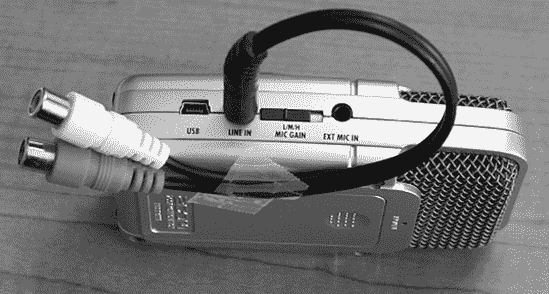
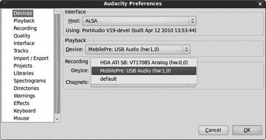
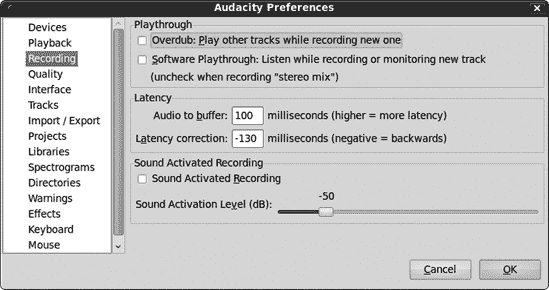
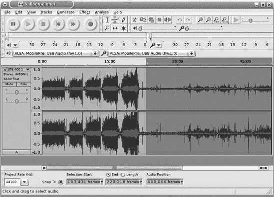
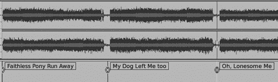
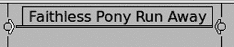

# 第四章。为 CD 创建和编辑现场曲目

CD 非常适合存储和分发你自己的录音，你可以使用 Audacity 来准备你的曲目以便复制到 CD。

假设你在录音室或现场表演中录制了一些长曲目。你可能想将它们分成单独的歌曲，或者在歌曲之间剪掉材料并将它们缝合在一起，听起来像一条长而连续的现场录音。也许你正在剪切和粘贴几个不同录音会话中的最佳部分。也许你有需要将多声道录音下混为双声道立体声以用于 CD 的多声道录音。你想要清理一切，使其尽可能好。

实时录音具有挑战性。我将讨论几种不同的方法来完成这项工作，从经济且简单到更昂贵且对最终混音有完全控制。然后我们将继续使用 Audacity 来准备你的录音以便刻录成 CD。

### 注意

如果你需要回顾如何使用 Audacity，请查阅第一章。

工作流程是这样的：

1.  录制东西。

1.  在 Audacity 中应用清理和修复。

1.  为单个歌曲创建歌曲标题和元数据。

1.  导出为双声道 16/44.1 WAV。

1.  复制到 CD 并享受！

最耗时的部分是修复和清理。如果你不需要做很多修复，那么这个过程会很快。

# 制作好的现场录音

在第二章中，我们学习了如何组装录音室以及如何将你的电脑变成数字音频工作站。制作好的现场录音比制作好的录音室录音更难，因为有很多事情是你无法控制的。然而，这没关系，因为你不一定追求某种技术上的完美，而是捕捉到兴奋和能量。

获取好的双声道立体声录音相当容易，因为几乎所有音频设备都支持双声道立体声。如果你想录制现场的多声道录音（以获得更多混音控制），那么你需要更昂贵的设备。

最大的潜在障碍之一是关于谁控制现场的声音系统。如果你控制，那么你可以做任何你想做的事情。如果表演者或场地有自己的系统和技术人员，那么你需要他们的合作。

记得录一些观众噪音，以防你需要添加更多现场风味。你还应该录制几分钟的各种背景和观众噪音，以便稍后用于噪声消除。你想要的是不与音乐混合的噪声样本，或者你想要保留的任何东西，以便进行最佳的噪声消除。

## 便携式数字录音机

图 4-1。Zoom H2 放在麦克风支架上。

一款小巧的便携式数字录音机可能会让你惊讶于它捕捉现场表演的能力有多好。Zoom H2，这是我最喜欢的紧凑型数字录音机，内置了四个麦克风。你可以使用前对、后对或同时使用所有四个，以创建空间感的三维声音。Zoom 附带一个小支架，可以放在任何平坦的表面上，还有一个可以插入麦克风支架的把手，这样你可以轻松地将它放置在任何位置（图 4-1)。它不引人注目，甚至看起来像一台老式的麦克风。

Zoom 拥有一个 1/8 英寸立体声线路输入，这意味着你可以直接将其连接到调音台。通常在现场演出中，所有乐器和歌手都会连接到单个音响控制台，即使是预算最低的控制台也应该有一对立体声 RCA 录音输出。Zoom 使用一个双 RCA 到 1/8 英寸立体声 TRS 适配器，如图图 4-2 所示。

图 4-2. Zoom H2 配备双 RCA 到 1/8 英寸立体声适配器，用于连接到调音台

无论你通过连接到音响板监控端口的耳机听到什么，你的录音就会是这个样子，因此理想情况下，应该有一个人在音响板上保持所有通道平衡且声音良好。因为所有内容都已经混合成两个通道，你的编辑选项有限，所以需要在录音时确保正确。

Zoom 还配备了一个 USB 1.1 端口，可以连接到你的电脑，因此如果你更喜欢的话，可以直接将录音保存到电脑上，而不是保存到 Zoom 的 SD 存储卡中。

你不必因为喜欢 Zoom H2 就一定要使用它——有数十种不同的优秀便携式数字录音机可供选择，具有各种功能集。

## 配有 Audacity 的笔记本电脑

配置一台装有 Audacity 和不错的录音界面的笔记本电脑，将其插入现场演出的音响控制台，你就可以现场编辑和制作 CD。将原始轨道复制到 USB 闪存驱动器，供希望自行编辑的表演者使用。如果你的笔记本电脑内置声卡不适合你，尝试使用一个像图 4-3 中所示的那样好的外部 USB 录音界面，它展示了一台准备好的 ThinkPad 和 M-Audio MobilePre USB，可以用于现场演出。

另一个选择是使用高端的 PCMCIA 声卡，如 Digigram VXpocket v2。Digigram 的价格大约为 500 美元。它适用于 Linux、Windows 和 Mac；提供全双工的双通道；并支持 S/PDIF 和 XLR 连接器。

图 4-3. ThinkPad 和 M-Audio MobilePre

## 多轨现场表演录音

假设你想要更多的编辑和混音控制，并且你想要制作多通道现场录音。你该如何做？这需要正确的知识和足够的预算来支持所有必要的设备。Audacity 从版本 1.3.9 开始可以一次记录与你的录音接口支持的那么多轨道。较老的 Audacity 版本最多支持 16 个轨道。（参见第九章了解如何使用 Audacity 制作优质的多轨录音。）

如果你真的不知道自己在做什么，不要尝试这样做，因为错误地连接设备会导致声音质量差，甚至损坏设备。如果你没有控制现场音响系统的权限，那么你需要现场音响工程师的合作和帮助。这里有四种不同的方法来制作现场多轨录音。

一个选择是自备麦克风，并从现场音响系统独立地分别对每位表演者和乐器进行录音。虽然这意味着到处都是很多麦克风和电缆，但这让你能够独立于主音响板使用自己的录音设备。

更常见的一个选择是使用麦克风和乐器电缆分路器，让每个麦克风和乐器电缆都能双重使用。这就是许多专业人士录制现场音乐会的方式；他们通过分路器共享麦克风，每个团队控制自己的录音控制台。有时这些控制台被藏在后台，有时它们有长长的电缆线延伸到移动录音车。这种设置具有很大的灵活性，你可以根据自己的需要添加自己的麦克风。例如，似乎有一个规则，即没有人能就麦克风鼓的正确方式达成一致，所以他们都会设置自己的鼓麦克风。

你需要分路器、变压器，可能还需要一些电阻和接插件面板，以及电缆，并且你需要知道如何连接所有这些设备。你需要了解处理幻象电源的来龙去脉以及谁提供它，正确顺序地连接和断开，与其他舞台和音响团队相处融洽，以及更多。

另一个选择是直接连接到一个支持多通道输出的调音台。（一个需要了解的词是*busses*——调音台拥有的 busses 越多，其信号路由选项就越灵活。）这样你就不需要多余的麦克风或分路器以及长长的电缆线。寻找*直接输出*、*辅助发送*或*子组输出*。一些输出发送的信号会受到调音台控制的影响，因此它们会有淡入淡出和特殊效果，这些由控制台技术人员应用。如果你想要一个未经处理的直接信号，这取决于音响控制台的功能以及音响技术人员能让你使用什么。

如果您是音响工程师并且可以使用自己的设备，考虑购买一个多通道数字混音器，如 PreSonus StudioLive 16-Channel FireWire 数字混音器。这样您就不需要单独的 ADC/DAC，也不必费解如何让为现场表演设计的模拟控制台也做出好的数字录音。遗憾的是，StudioLive 在 Linux 上不受支持，但它为 Mac 和 Windows 提供了优秀的软件包。这是一款非常棒的新一代混音器，旨在支持多通道录音，无论是在录音室还是在表演厅。它的价格大约是 2,000 美元，此外您还需要一个放大器来为现场表演供电。

## 对音响团队友好

对场馆的音响工程师和团队友好。他们是技艺高超的专业人士，必须结合科学和艺术，他们会让您的录音成功或失败。不要表现得好像您什么都知道，因为他们不会被愚弄。根据我的经验，现场表演的音响团队都是好人，只要您仔细倾听，乐于助人，不挡他们的道，他们会慷慨地分享他们的专业知识。

# Audacity 录音设置

让我们浏览一下“编辑”>“首选项”中的适当录音设置。（请访问第十三章和第十四章，了解如何调整您的 PC 以进行音频录制和管理您的声音设备。）

首先，打开一个新的 Audacity 项目，使用“文件”>“另存为”保存并命名您的新项目。当 Audacity 正在录音时，您无法保存更改，因此您可能可以利用短暂的休息时间停止录音，按 Ctrl-S 或使用“文件”>“保存项目”，然后使用 shift-Record 从您离开的地方继续。

在“编辑”>“首选项”>“设备”选项卡上设置您的录音和回放设备，并设置您要录制的声道数。Audacity 将仅显示您的录音接口支持的声道数。Windows 用户，始终选择“Windows DirectSound”而不是 MME 作为主机，因为 MME 是过时的通用 Windows 声音接口。如果您只有一张声卡，可以选择“主声卡”作为您的录音和回放设备。如果您有多张，则从下拉的“录音设备”菜单中选择特定的录音接口（图 4-4

图 4-4. 在 Windows 的“编辑”>“首选项”>“设备”对话框中设置正确的录音和回放设备

图 4-5 显示了它在 Linux PC 上的样子：

图 4-5。在 Linux 的“编辑”>“首选项”>“设备”对话框中设置正确的录音和播放设备

你可能想在演出中的休息时间检查你的录音，所以将你的播放设备设置为输出到耳机的设备。

在“录音”选项卡上，取消选中“叠加”，“软件播放”和“声音激活录音”。除非你遇到断开连接，否则不要更改你的延迟设置。断开连接意味着你的 CPU 跟不上，所以增加音频到缓冲区值，直到断开连接停止(图 4-6)。

“质量”选项卡上的设置(图 4-7)取决于你的模拟-数字转换器支持什么。假设你有一个连接到高端声卡的模拟混音器，该声卡支持高达 24/96(24 位深度，96 kHz 采样率)；如果你有足够的硬盘空间，你可以以 32 位深度和 96,000 Hz 采样率进行录音以达到最高质量。(*位深度*在这个菜单中称为*样本格式*。位深度是正确的术语。)

图 4-6。在“录音”选项卡中设置设置

图 4-7。质量选项卡上的设置由你的录音接口支持的以及你的偏好决定。

我的 MobilePre 最大支持 16/48，所以我将 Audacity 设置为 32 位浮点/48 进行录音。设置比你的录音接口支持的采样率更高的采样率（上采样）是没有用的，因为没有魔法般的质量提升。这会浪费磁盘空间，并拖慢你的 CPU，而且上采样会损害音频质量。但在 16 位声卡上录制 32 位浮点也有好处，这在第一章中有解释。(在 16/44.1, 24/96, 32 位浮点中了解更多关于质量设置的信息。)

如果你从数字混音器或具有自身数字输出的混音器录制，那么这将决定你的最大比特深度/采样率。例如，Behringer Xenyx X2442USB 24 通道混音器是一款具有内置 ADC 的模拟混音器，通过 USB 提供 16/48 数字信号。它可以直接插入你的电脑，因此你不需要声卡。所以你可以将 Audacity 设置为以 32 位浮点/48kHz 的格式进行录制以获得最大质量。如果 16/48kHz 不够好，你可以连接一个支持更高比特深度和采样率的外置 ADC 到 Xenyx 的 RCA 模拟录制输出。

在完成之前不要切换你的质量设置！

在整个录制和编辑过程中，最好保持相同的质量设置，直到最终导出。改变比特深度和重新采样对音频质量不利，因此，录音重新采样或导出为较低比特深度的次数越少，越好。我以 32 位浮点/48kHz 的格式进行录制和编辑，然后根据需要导出不同质量级别的文件，例如，为了最高质量，导出 24 位 WAV 和 FLAC 格式，或者导出较低质量的 Ogg Theora 或 MP3 格式。如果你更喜欢在较低质量级别进行录制和编辑，例如 16/44.1（这是 CD 质量），同样适用：从录制到最终编辑都使用 16/44.1，然后如果你需要更低的质量级别，在导出时根据需要选择。

44.1kHz 采样率和 48kHz 之间没有太大的区别。采样率决定了你的频率范围，大约是采样率的一半。44.1kHz 覆盖了人类听觉的范围。有时我可以在 48kHz 录制的录音和 44.1kHz 录制的录音之间听到细微的差异，但必须在一个好的音响系统上仔细聆听。16 位和 24 位录音之间的差异更为明显。从高质量的录音开始，然后你可以根据需要导出任意数量的较低质量格式。

## 设置录音音量级别

在开始之前，通过点击**输入音量表**（图 4-8

图 4-8. 在开始录音之前，打开录音监控器以设置峰值录音电平。

## 开始、停止和暂停录音

当你准备好开始录音时，只需点击红色的**录音**按钮。点击**暂停**以停止，然后点击**录音**以在同一轨道上继续。点击**停止**然后**录音**会开始新的轨道，所以如果你在打算暂停时停止了，可以通过按 shift-Record 在同一个轨道上重新开始。

## 监听现场录音

监听录音的最佳方式是通过将耳机插入监听端口。例如，MobilePre 有一个零延迟监听端口，混音器上通常都有监听端口。更好的录音接口都有零延迟监听端口，这是你在购物时应该寻找的好东西。

# 编辑现场录音

嗯，那很有趣！你听到了一场精彩的演出，或者有一个美妙的录音室会议，并且一切录音都成功了。现在你如何将所有这些美好的东西放到 CD 上？

如果你使用的是数字录音机，你需要将文件从录音机复制到你的 Audacity 电脑上。我更喜欢使用单独的存储卡读卡器，而不是将录音机连接到电脑，因为这通常工作得更好，速度更快，尤其是在非 Windows PC 上。任何 SD 或 Compact Flash 卡都应该被你的 PC 视为通用的 USB 存储设备，但制造商喜欢用奇怪的仅限 Windows 的文件传输管理器来侵扰使用它们的设备。这对我来说没有意义，因为 Windows 有一个非常好的内置 USB 存储设备管理器。其中许多还喜欢使用 USB 1.1，而不是全速 12Mbps，而是令人痛苦的慢速 1.5Mbps 版本，当你填满一个多吉字节 SD 卡时，这会非常有趣。

无论你如何操作，一旦你的录音转移到 Audacity PC 上，打开 Audacity 并使用**文件** > **打开**将你的录音导入 Audacity。然后使用**文件** > **另存项目为**保存这个新的 Audacity 项目，并给它一个不同于音频文件名的名字。Audacity 会警告你“项目依赖于其他音频文件”(图 4-9)，并询问你是否想将所有音频复制到项目中。点击**将所有音频复制到项目中（更安全）**。现在你有了原始录音和副本，你在 Audacity 项目中进行的任何操作都不会触及原始文件。（参见保存你的工作以了解更多信息。）

图 4-9. 制作原始录音的副本以保存它

如果你的录音有多个文件，为每个文件创建一个单独的 Audacity 项目。我喜欢使用相关的项目名称，比如 Fiddle-Festival-1、Fiddle-Festival-2 等等。

如果你最初在 Audacity 中进行了录音，你可以从原始项目文件开始工作，这将改变它，或者你可以复制一份并从那份副本开始工作。要复制，请点击**文件** > **另存为**以不同的名称保存。

## 编辑和下混音多轨录音

如果你正在使用双声道立体声录音工作，可以跳过这一节。

本节是对多声道下混音的简要回顾，因此请访问第九章以详细了解多轨录音和混音。

如果你制作了多轨录音，即三个或更多音轨，你将比使用双声道立体声混音有更多的优秀编辑选项。每个音轨对应一个歌手或乐器，这为你提供了终极控制，即使由于混音器的限制你不得不满足于子组，这仍然是一个灵活性的盛宴。

从 Audacity 版本 1.3.8 开始，你可以通过选择**视图** > **混音板**来使用时尚的新混音板调整每个音轨的平衡和增益。在 Audacity 中的播放效果与你的混音听起来完全一样，因此你可以获得准确的预览。

当然，如果你愿意，你仍然可以使用每个音轨的音轨面板上的平衡和增益控件。

不论你是否有立体声混音还是多轨录音，编辑和修复你的音轨都是一样的，我们将在以下章节中介绍。多轨录音有一些特殊的风险。一个是保持它们同步。在删除和添加时要小心，因为这会改变音轨的长度。另一个是将下混音到双声道立体声，这会将音轨合并，使它们变得更响，可能会产生削波。第三个是“链接音轨”按钮，它首次出现在 Audacity 1.3.9 版本中。这会将标签音轨与音频音轨同步。在项目顶部有一个标签音轨对于做笔记很有用，并且它不会链接到其下方的音轨。但是，位于你的音频音轨之下的标签音轨，即当你创建新的标签音轨时新标签音轨总是出现的地方，创建了一个包括其上方所有音频音轨的音轨组。默认情况下启用“链接音轨”，所以如果它妨碍了你，只需点击**链接音轨**按钮即可关闭它。较新的 Audacity 版本会在你进行任何选择或时间移动音轨时显示链链接，这表明“链接音轨”是激活的（图 4-10）。

图 4-10。当链接音轨按钮激活时出现链链接。

下混有两种方法。第一种方法是点击**轨道** > **混音和渲染**，这在 Audacity 项目中创建一个新的立体声轨道。然后你可以在导出之前进行进一步的调整，例如创建标签、修复和其他编辑。它听起来就像 Audacity 中的播放一样，所以当它在 Audacity 中听起来正确时，它就准备好了。首先在轨道菜单中设置你的左、右和单声道通道分配。左是通道 1，右是通道 2，单声道轨道混合到两个声道中。

当你点击**轨道** > **混音和渲染**时，你的轨道将被一个新的立体声轨道替换。如果你希望 Audacity 创建一个不替换原始轨道的新立体声轨道，请使用键盘组合 ctrl-shift-M。我更喜欢第二种方法，因为我想要保存我的原始轨道。然后我将新的立体声轨道复制到一个新项目中，完成编辑，然后导出。

下混会合并轨道，因此它们会变得更响。确保**视图** > **削波**被激活，这样你可以快速找到削波段落。你可以在下混之前使用**效果** > **放大**将所有轨道的振幅减少到-9 或-12，然后在下混后应用**效果** > **归一化**将音量恢复到你想要的位置。

第二种下混方法在导出时打开一个自定义混音器，这实际上是一个通道映射器。打开**编辑** > **首选项** > **导入/导出**，然后选择“使用自定义混音”。然后选择**文件** > **导出**，你将得到一个简单的混音器（图 4-11

图 4-11. 将多声道录音下混为两个立体声轨道

这与**文件** > **导出多个**不兼容，所以如果你想将下混的轨道分割成单独的歌曲，你将不得不将其重新导入到 Audacity 中。

## Audacity 中的特殊 CD 设置

接下来你需要做的是转到选择工具栏，并将时间更改为 CD 帧，每秒 75 帧（fps）。这确保你做的任何剪辑都将开始和结束在一个 CD 帧上。任何落在这些帧之外的音频将会丢失，并可能产生点击声。显示了这看起来是什么样子。你可以选择 hh:mm:ss + CDDA 帧（75 fps）或 CDDA 帧（75 fps）。前者显示时间加上 CD 帧，后者仅显示 CD 帧。勾选“吸附到”框以确保停止和开始总是在 CD 帧边界上。

图 4-12。在选择工具栏中设置 CD 音频的正确帧率

当你在选择工具栏上时，将项目速率设置为 44,100 Hz。CD 音频文件必须是 16/44.1 WAV 文件。（位深度将在导出时选择。）

## 剪辑

现在是时候对你的录音进行一些清理了。记住你有许多不同的视图可供选择，例如**视图**>**窗口适应**，**视图>垂直适应**，以及缩放工具。按 ctrl-2 返回正常视图。**视图**>**缩放到选择**是一个节省时间的妙招，它将你的选择扩展到窗口的宽度。记住，Audacity 几乎有无限的撤销功能，甚至超过保存。直到你关闭项目，你不会丢失撤销历史。

一个好的起点是修剪掉任何多余的部分。当你选择要删除的不想要的片段时，留下一点多余的部分。你总是可以修剪更多，但放回原处会更难。图 4-13 中阴影区域是一群人在演讲，这不是我想保存的内容，所以它一次性被删除了。目前似乎没有在歌曲开始或中间需要修剪的内容，所以我将留到以后再处理。

另一种大量修剪多余内容的方法是选择要保留的部分，然后点击**修剪**按钮。这会保留你的选择并删除其余部分。

## 分离立体声轨道以进行手术修复

有时，双声道立体声轨道中只有一个声道会出现缺陷。如果你将其分成两个轨道，那么你就可以只修复这个声道，然后重新连接轨道。这样做有几个优点：第二个轨道有助于掩盖不太完美的修复，而你应用于故障部分的修复可能不会改善另一个声道的声音，甚至可能损害音质。

图 4-13。使用视图>窗口适应来对整个轨道进行粗略剪辑

要分割立体声轨道，转到轨道菜单并点击**分割立体声轨道**。要重新连接轨道，使用顶部轨道的轨道菜单并点击**制作立体声轨道**。两个轨道必须相邻。

## 修复削波和过响的段落

查找任何削波和过响的段落并修复它们。这些会破坏整个轨道的音量水平并震惊听众，因此修复它们总是一个好主意。

通过选择**查看** > **显示削波**快速找到任何削波。这会用红色条标记任何削波段落。放大削波部分，直到你可以精确选择声音过大的部分，然后使用**效果** > **放大**中的负值，例如-3 dB，来降低音量。重新录制削波部分更好，但鉴于你可能不会在现场表演中有这样的机会，使它们不那么明显是次优选择。点击**预览**按钮查看是否听起来合适，如果不合适，更改放大值直到它合适。然后点击**确定**使其成为永久更改。

### 注意

在**编辑** > **首选项** > **播放**中调整预览长度。默认为三秒。

寻找任何未削波的极端峰值，这可能是一个鼓点、突然的观众噪声、掉落的东西、麦克风碰撞——无论是什么，检查一下并决定是否需要降低音量。

如果有任何削波或过于响亮的段落让你想要完全删除，选中它并选择**编辑** > **静音**（或 ctrl-L）使其完全静音。你可能不想删除它，因为这会缩短音轨，在多轨项目中可能会造成问题。如果它太长，静音会太明显，尝试用其他地方的剪辑修补令人讨厌的部分。为此，首先使用**编辑** > **分割剪切**删除有问题的部分。这会在删除部分的位置留下一个空隙。然后，将从音轨的另一部分或甚至从不同的音轨中复制的相同长度的片段仔细粘贴到空隙中；只要听起来合适，你可以使用任何东西。这可能是一项棘手的工作，所以记得放大以便可以看到你在做什么。包络工具适用于平滑过渡和谨慎的淡入淡出，或者尝试绘图工具来应用一些谨慎的插值。

## 噪声消除

Audacity 的噪声消除工具相当不错，尽管可能需要尝试几次才能正确使用，因为噪声消除总是与其副作用——消除噪声也会影响到你想要保留的声音——的一种妥协。如果你想要保留的声音与噪声具有相似的音量和频率，你可能不会得到很好的结果。当噪声与你想要保留的内容明显不同时，噪声消除效果最佳。

首先，您需要创建不想要的噪声的配置文件。这就是为什么您在现场表演中录制了各种观众和背景噪声样本，这样您就有好的样本来创建配置文件。通过选择 5 到 30 秒的噪声片段来创建噪声配置文件，然后转到**效果** > **噪声消除**并点击**获取噪声配置文件**。（如果您的样本不够长，可以通过复制和粘贴到同一轨道上将其加倍。）然后选择您想要从轨道中移除噪声的部分，返回**效果** > **噪声消除**，并点击**预览**按钮来听其声音（图 4-14）。

噪声消除效果有三个可调节的设置：噪声减少、频率平滑和攻击/衰减时间。噪声减少控制噪声音量的减少程度，因此-10 的值将其降低 10 分贝，而-50 的值将使其变为静音。对于频率平滑和攻击/衰减时间，将滑块向左移动更为激进，而向右移动则进行更温和的改变。频率平滑的值越大，其改变频率的范围就越广。记住：攻击指的是音符敲击的力度，衰减是指音符消失所需的时间。较小的值更为突然，而较大的值则更为渐进。

当预览听起来不错时，点击**确定**。如果您按下确定后不喜欢它，请按 ctrl-Z 撤销，或使用**编辑** > **撤销**，再次尝试。

图 4-14. 使用噪声消除效果降低不想要的背景噪声

您可以使用来自 Freesound Project（[`www.freesound.org/`](http://www.freesound.org/)）的噪声样本来构建您的噪声配置文件。这是一个 Creative Commons 许可的协作数据库，包含各种声音。在这里，您可以找到几乎所有东西，包括白色、粉色和棕色噪声的样本；不良 TRS 插头连接的嗡嗡声；台球厅噪声；等等。您也可以向该项目贡献自己的样本。

## 压缩动态范围

在音频编辑中，明智地使用动态范围压缩是一项重要的技能。例如，在有多个人说话的播客中，确保说话者的音量水平都相同是对听众的一种善意。压缩也用于改变声音的特性。例如，鼓主要是快速峰值声音，因此使用一点压缩可以使其听起来更饱满、更丰富。压缩可以使歌手或乐器“突出”于混音中，使其听起来更生动。压缩还可以帮助平衡表现不稳定的表演者，如麦克风技术不佳的歌手或音量控制不佳但音量时大时小的乐器演奏者。

你可以用压缩实现的效果将受到你的录音的限制。如果你有每名表演者和乐器都在自己音轨上的多轨录音，或者是有用的小组划分，那么你将拥有各种编辑灵活性。如果你的录音是双轨立体声，那么你无法进行非常精细的编辑，但你可以对整个录音应用压缩，使其在嘈杂的环境中听起来更好，例如在车辆和工作场所。自己控制它意味着你可以测量出恰到好处的量。

在音频链中，有几个地方可以应用压缩。在录音过程中使用了压缩器吗？如果是的话，请注意不要应用更多，因为这可能会使你的音轨听起来不自然或奇怪。

在使用压缩方面，我比较保守。如果某物需要更响亮或更安静，我更喜欢使用包络工具或放大效果进行调整。在磁带录音的古老日子里，像杜比降噪这样的压缩技术被用来最小化磁带嘶嘶声。音乐在录音时被压缩，然后在播放时扩展以降低噪声阈值。数字音频的信号与噪声比非常高，这并不必要。

现在让我们学习如何使用 Audacity 的压缩效果（图 4-15）。

图 4-15. Audacity 的压缩效果应用于动态范围压缩

选择你想要应用压缩的部分，是音轨的一部分还是整个音轨，然后点击**效果** > **压缩**以打开压缩效果。你可以通过拖动角落使压缩器窗口更大并扩展分贝刻度。

阈值设置确定音频信号增益降低的起始点，以分贝为单位。-60 dB 的阈值意味着所有幅度为-60 dB 及以上的内容都将降低增益，这在大多数情况下是过多的，因为那将是一切。-10 dB 的阈值意味着你音轨中最响亮的部分 10 dB 的增益将被降低。

噪声阈值设置通过在信号回到阈值水平之前保持增益恒定，防止在暂停期间放大背景噪声；它不允许在低于噪声阈值分贝设置的安静段落中增加增益。如果你的音频中没有安静暂停，那么这个设置帮助不大，你应该将滑块完全移动到左侧，-80 dB，以使其没有效果。

比率设置控制了对高于你的阈值设置的音量应用多少压缩或增益降低。较高的比率，如 4:1，意味着更多的压缩。一个比阈值高 4 dB 的输入信号将被降低到比阈值高 1 dB，因此它应用了 3 dB 的降低。首先尝试更温和的比率，从 2:1 开始，然后听预览。如果不够，尝试更高的比率。Audacity 的压缩器的最大比率为 10:1，这是一个很大的比率。其他压缩器的比率可以高达 60:1。

攻击时间决定了压缩应用的快慢，而衰减时间决定了压缩逐渐消失所需的时间。攻击时间过短可能会导致一些可听见的失真，而衰减时间过长可能会错过一些短峰值。预览按钮可以帮助你快速尝试不同的设置。

压缩会使你的音频变得更安静，因此你可能需要在应用压缩后放大或归一化它。压缩效果有一个“压缩后为 0 dB 增加增益”的复选框，这另一种说法是应用归一化到 0 dB。我不使用它，因为我更喜欢单独控制归一化，而且我并不总是将归一化到 0 dB，但如果你需要，它在那里。

也有一个“基于峰值压缩”的复选框。当此框未被勾选时，这是默认设置，压缩器会使用均方根值来降低高于阈值水平的音量的增益。“基于峰值压缩”则提高高于阈值水平的较安静音量的增益。

在使用压缩时要小心，因为它很容易过度使用。在许多现代流行音乐中，几乎没有任何动态范围；所有内容都被压缩到相同的狭窄 5 dB 或更小的范围内，没有任何安静的部分，没有对比，只有一个大的喊叫块，所有内容都被提升到最大，有时甚至达到失真。任何情感冲击和艺术性都被破坏。你试图使它在不同的听音环境中更加舒适，或者改善歌手或乐器的声音，而不是完全杀死录音。

访问压缩动态范围以了解更多关于动态范围压缩以及如何使用出色的克里斯动态压缩器，请参阅改变速度。

## 将单个长音轨切割成单独的歌曲音轨

当你在 Audacity 项目中有一个单个立体声音轨并且已经完成了所有的其他清理和修复工作时，请执行此操作。Audacity 项目中的一个单个立体声音轨可以包含多个歌曲，但对 Audacity 来说，它是一个长而连续的音轨；它不知道歌曲的分割点在哪里，所以你必须自己标记。你可以采取两种不同的方法。一种是通常的带有几秒静音分隔的单独歌曲集合。另一种是标记歌曲分割点，这样你可以随意跳过，但它们之间没有分割，就像现场音乐会专辑一样。

无论你更喜欢哪种方式，只需按照图 4-16 中的说明操作：确定每个歌曲的分割点；然后按 ctrl-B 标记位置并创建一个*标签*。这是你输入歌曲名称的地方。标签位于歌曲的开头，所以当你开始时，首先按键盘上的**Home**键确保你处于最开头。

图 4-16. 使用标签轨道创建歌曲标题并将长轨道拆分为单独的歌曲

如果你需要移动一个标签，通过其移动手柄（即小圆点）抓住它(图 4-17).

角度手柄用于扩展标签以标记你的轨道部分。这些被称为*区域标签*(图 4-18). 在创建和管理标签中了解有关标签和标签轨道的所有信息。

图 4-17. 标签手柄中的小圆点用于移动标签。

图 4-18. 拖动角度手柄使用标签标记轨道部分。

在 Audacity 版本 1.3.9 及更高版本中，请注意链接轨道按钮。这会保持音频和标签轨道同步，并在你不想对齐轨道时造成干扰。如果链接轨道妨碍了你，请将其关闭，尽管这对单个立体声轨道来说不太可能成为问题。链接轨道可能不会出现在第一个 2.*x* Audacity 版本中，但可能在解决了一些问题后出现。在链接轨道和轨道组中了解更多关于链接轨道的信息。

## 在歌曲之间创建优雅的分割

图 4-19. 使用包络工具创建淡入和淡出

在 Audacity 中创建歌曲之间的静音，并带有优雅的渐入和渐出，非常简单。这里有几个工具可供选择。首先，让我们尝试使用包络工具。图 4-19 展示了它的实际应用，创建了一个大约 2.5 秒的渐弱到静音，然后又渐入。那些小，白色的方块是**节点控制点**。通过点击音轨创建这些节点，然后你可以移动它们进行调整。每个节点有四个控制点——一对内控制点和一对外控制点。控制点可以在水平和垂直方向上移动。要删除一个节点，抓住一个控制点并将其拖出音轨的边界。

包络工具在大多数音频编辑应用中都是标准的。掌握它们需要一点练习，但一旦你弄懂了，你就能对渐变和振幅获得高度的控制。

你也可以尝试选择**效果** > **渐弱**和**效果** > **渐强**，这既快又简单。你所能控制的就是渐变的长度。首先选择你想要渐变的片段，然后应用效果。图 4-20 展示了如何创建一个 10 秒的渐弱效果。

图 4-20. 首先选择 10 秒的片段，然后应用效果 > 渐弱。

假设你希望在歌曲之间有两秒的静音，但它们之间没有那么多空间——没问题，你可以通过选择**生成** > **静音**来插入你想要的任何静音。使用选择工具标记你想要静音开始的位置，选择**生成** > **静音**，将其设置为两秒，然后点击**确定**。

### 注意

警惕那些在歌曲之间自动插入两秒间隔的 CD 刻录应用。这应该是一个可配置的行为。

## 归一化

执行的最后一步之一是将归一化应用于提升你的音轨音量。选择整个音轨，然后选择**效果** > **归一化**。检查“移除任何 CD 偏移”和“归一化最大振幅到”两个选项。最大振幅的最高值是零，这对于双声道立体声音轨来说是一个很好的值。

# 可选音轨元数据

你可以选择使用**文件** > **打开元数据编辑器**对话框来写入音轨元数据。在导出之前，填写所有音轨的共同信息：艺术家名称、专辑标题、流派、日期和注释。Audacity 将自动从标签或音轨名称中填写音轨名称，并自动为每个音轨编号。如果你在导出之前打开**编辑** > **首选项** > **导入/导出**对话框并勾选“在导出步骤之前显示元数据编辑器”，你可以为每个音轨查看预览。取消勾选此选项以跳过每个音轨的预览。

WAV 格式不支持 CD 文本或元数据。（其他音频文件格式支持，例如 Ogg、FLAC 和 MP3。）这不同于 CD 文本。CD 文本是对 Red Book CD 音频格式的非标准扩展，可以在支持它的 CD 播放器上显示歌曲标题。大多数软件 CD 播放器支持 CD 文本，新的家用和车载 CD 播放器也是如此。大多数 CD 刻录软件支持 CD 文本，因此当你在制作 CD 时可以输入单个歌曲标题。一些 CD 刻录程序（如同时运行在 Linux 和 Windows 上的 Nero）会从文件名中提取歌曲标题，这是一个节省时间的妙招。

元数据始终保存在你的 Audacity 项目中。

# 最终导出

这是一次伟大的旅程，从录音到编辑，现在你只需再走两步就能制作出你出色录音的 CD。倒数第二步是将你的录音导出为 CD 的正确格式，即 16/44.1 双声道 WAV 格式。这也是将你的音轨分割成单个歌曲文件的一步。（如果你的项目有超过两个音轨，请参阅编辑和混音多轨录音，在编辑和混音多轨录音中。）

如果你还没有将项目的采样率设置为 44.1，请现在设置。在选择工具栏上将项目速率设置更改为 44,100 Hz。然后选择**音轨** > **重采样**，设置速率为 44,100，并点击**确定**。对于较长的音轨，这可能需要几分钟。

现在点击**文件** > **导出多个**。输入你想要保存音频文件的目录，并选择“根据：标签”拆分文件和“使用：音轨/标签名称”命名文件。

点击**选项**按钮设置正确的导出格式。选择标题：WAV（微软）和编码：有符号 16 位 PCM（图 4-21）。

图 4-21. CD 的正确导出格式设置

你的音轨将以单个 WAV 文件的形式导出，每个标签一个。

# 将你的歌曲刻录到 CD 上

现在你有一批漂亮的单独 WAV 文件，每个文件对应一首歌曲。使用你喜欢的 CD 刻录程序将你的曲目刻录到 CD 上。务必创建一个音频项目而不是数据项目，因为 CD 必须以 Red Book 音频格式才能在所有 CD 播放器中播放。将刻录速度设置为最大速度的一半，作为防滑垫的保险。一些 CD 刻录程序，如 Nero，会自动从你的 WAV 文件名中获取歌曲标题，这是一个节省时间的功能。大多数 CD 刻录程序会在歌曲之间创建默认的两秒间隔，所以要注意这一点。你可以通过消除这些间隔来制作听起来像一条长而连续的轨道的现场专辑，同时仍然有单独的歌曲轨道，这样你可以随意跳过。

## 标记你的光盘

不要在光盘上使用粘性纸标签，因为这些标签会随着时间的推移而损坏光盘。有更好的方法来制作看起来很漂亮的标签。你可以购买特殊的空白光盘，这些光盘是为了使用支持打印在光盘上的喷墨打印机而制作的。这些打印机与普通打印机不同，因为它们有一个特殊的托盘来固定光盘。

另一种可打印光盘需要特殊的热敏打印机。这些打印机并不昂贵，通常价格在 100 美元左右。

第三种是*LightScribe*光盘，它需要一个特殊的 CD 刻录机和空白光盘。这些成本与普通 CD/DVD 刻录机大致相同，大约 50 美元。

有许多软件程序可以设计你的光盘标签，并使它们看起来既美观又专业。

## 大量光盘复制

你可能想要制作光盘进行分发，而且你可以不花大量金钱就做到这一点。有许多激光光盘复制器，就像你的计算机 CD 刻录机一样，只是更快，并且有多个托盘。这些复制器的价格从约 400 美元的简单复制器（手动喂入）到数千美元的自动喂入和本地数据存储不等。

此外，还有提供不同级别服务的商业复制服务，例如封面艺术和设计。这些服务既经济又省时省力。最好的光盘是压制而不是刻录。使用压制机而不是激光复制机的复制服务成本更高，通常需要更大的批量。但你的光盘将更耐用。

“我需要购买特殊的音频 CD 吗？”这是一个常见的问题。不，你不需要。所有光盘都是完全相同的类型，但坚持使用像 Taiyo Yuden（我最喜欢的品牌）这样的好品牌是值得的。Verbatim、Ridata 和 MAM-A 也是可靠的品牌。始终购买 CD-R；除非是实验，否则不要麻烦使用 CD-RW。有关更多信息，请参阅没有特殊的音频 CD，见音频 CD。

# 从不同录音会话中组合歌曲、修复和特殊效果

有几种不同的方法可以将不同录音会话中的歌曲组合到 CD 上。请参阅第五章了解如何做到这一点。

第十一章 讲述了特殊效果，而 第十二章 则提供了更多关于修复和清理的细节。
