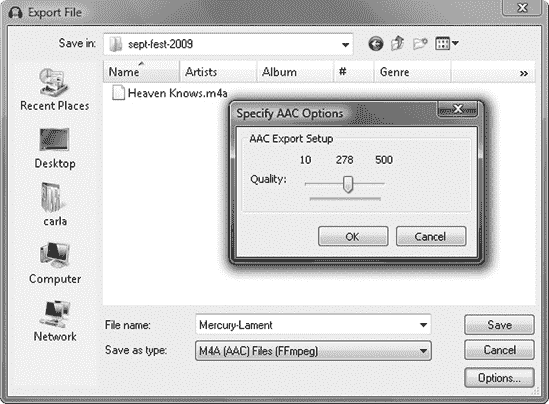
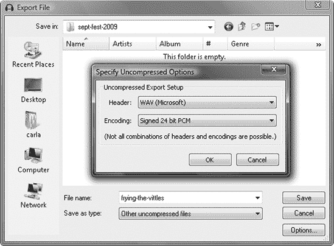

# 第八章。成为网络明星

您想分发自己的录音，甚至可能通过销售它们来赚钱。在这个美好的互联网时代，在线分发既容易又便宜。在在线音乐分发中取得成功需要两种不同的技能：在多种格式下创建优质录音的技术能力，以及理解作为专业艺术家的业务，这很复杂，包括客户服务、合同和版权问题。在本章的第一部分，我们将学习创建不同音频文件格式，用于各种目的，如低质量的促销 MP3、流媒体音频和高质量下载。在第二部分，我们将探讨作为录音艺术家的业务，这比成为一名优秀的音乐家和录音专家更具挑战性。

# 文件格式和音频质量

使用 Audacity，您可以轻松地将音频文件导出为任何您想要的格式。让我们看看您的选项。常见的可下载格式包括 AAC、MP3、Ogg Vorbis、WAV 和 FLAC。

### 注意

如果您需要复习如何导出不同的音频文件格式，请查看第一章，并查看第十三章和第十四章了解如何设置和调整系统以进行音频制作。

AAC 越来越受欢迎，因为这是苹果 iTunes Store 使用的格式。Audacity 的 1.3.6 版本引入了对通过 FFmpeg 导入、导出和转换非 DRM AAC 文件的支持。这些文件具有 M4A（*A*代表音频）文件扩展名。M4P 文件是受 DRM 保护的。（不，它不是*P*代表糟糕，而是受保护。）

在 Audacity 中创建 AAC 格式的文件很简单：选择**文件** > **导出** > **保存类型**：M4A (AAC) 文件（FFmpeg）并点击**选项**按钮。在选项对话框中，您有一系列从 10 到 500 的质量设置，其中 500 是最高质量。这个范围代表公平、不错、好、更好和最佳。256 设置适合更复杂的录音。非常简单的录音，如单声道的口语作品，在 50（图 8-1）时听起来还不错。

图 8-1。导出到 AAC 格式（默认 iTunes 格式）会创建一个以.m4a 扩展名的文件。

Audacity 支持许多不同的 MP3 选项，你可以在第七章中了解所有这些选项。让我们回顾一下最实用的那些。MP3 支持恒定比特率和可变比特率。可变比特率提供更好的音质。你的在线分发网站将会有特定的要求，而使用 Audacity，你可以轻松调整你的音乐以满足这些要求。

128Kbps 的恒定比特率 MP3 在美国是最基本的共同标准。这将在每个数字音频播放器上播放，并且一些分发商要求使用恒定比特率的 MP3 进行流媒体播放。在 Audacity 中，点击**文件** > **导出** > **MP3 文件** > **选项** > **恒定** > **128Kbits/sec**。选项对话框为你提供了从 8Kbps 到 320Kbps 的广泛恒定比特率。尽管 320Kbps 经常被吹捧为 CD 音质，但实际上并非如此。你自己的耳朵可能会告诉你不同，但我在 192Kbps 以上没有听到任何改进。

### 注意

一些低带宽运营商可能需要低至 32Kbps 的比特率来流式传输互联网音频。虽然这听起来可能并不美妙，但它扩大了你的潜在受众。美国一半的互联网用户仍在使用拨号上网，许多其他国家仍然主要依赖低带宽互联网服务。

对于可变比特率 MP3，你最佳的 Audacity 选项是在**文件** > **导出** > **MP3 文件** > **选项** > **可变**对话框中。选择你希望的质量设置，设置变量速度：标准，通道模式：立体声(图 8-2).此菜单中有 10 个比特率选项，从 45Kbps 到 85Kbps 到 220Kbps 到 260Kbps。我喜欢 170Kbps 到 210Kbps 作为音乐的合适水平，我喜欢 110Kbps 到 150Kbps 用于简单的口语作品。变量速度选项将可变比特率限制在一定的范围内，这样你可以获得更好的音质和一定的可预测性。

图 8-2。在 Audacity 中使用 MP3 的可变比特率设置

如果你的发行商支持，你还应该为不介意 MP3 的用户提供 Ogg Vorbis 文件。他们可能更喜欢 Ogg 的高质量，或者他们可能更喜欢使用开源、不受专利限制的格式。Ogg Vorbis 可以像 MP3 一样进行流媒体播放或下载。它以低比特率提供高质量，并支持多声道环绕，而 MP3 只支持一到两个声道。MP3 是一个封闭的、专有的标准，充满了混乱、令人困惑的专利冲突。我还没有听说过任何专利持有者起诉使用开源编码器（如 LAME）的人，LAME 是 Audacity 使用的首选 MP3 编码器，而且我也没有听说过任何小规模用户因为以 MP3 格式分发他们的作品而遇到麻烦。只是要注意，这可能是你一些粉丝的问题，而且有可能变成你的问题。

Audacity 支持 Ogg Vorbis，并且很容易选择你的质量级别。转到 **文件** > **导出** > **Ogg Vorbis 文件** > **选项**。你将看到一个带有小滑块的菜单，让你从 0 到 10 的 11 个质量设置中进行选择。3 的值大约相当于 128Kbps 的 MP3。5 的值对于音乐来说相当不错，但有一个可能的缺点：Ogg Vorbis 在 5 级别及以下使用通道耦合。这意味着两个立体声通道之间的冗余被组合起来以节省带宽，因此你可能会注意到立体声图像的损失。6 级别及以上不使用通道耦合。我并没有感觉到超过 7 级别有任何增益，尽管你的耳朵可能会告诉你不同。Ogg Vorbis 的支持正在快速增长，许多播放设备都支持它（图 8-3）。

图 8-3. 导出为 Ogg Vorbis 格式

FLAC 是一种出色的无损压缩格式，它以较小的文件大小提供 WAV 音质。FLAC 文件通常比 WAV 文件小三分之一。对于在电脑上播放音乐或拥有基于电脑的音乐服务器的粉丝来说，FLAC 是非常好的选择，而且越来越多的家用和便携式音乐播放器支持 FLAC。FLAC 不能进行流媒体播放，但必须下载后才能播放。

图 8-4. FLAC 支持双声道和立体声。

FLAC 支持 16 位和 24 位深度，并提供 9 个压缩级别，从 0 到 8 (图 8-4)。默认值为 5，这是一个很好的选择，尽管没有人会因为尝试其他选项而责怪你。不同的设置代表不同的压缩级别，其中 0 为最小压缩，8 为最大压缩。FLAC 是无损压缩，因此质量上没有区别，只是文件压缩的大小不同。8 的值编码时间比 5 长几倍，但额外的好处并不多。对最大压缩的 FLAC 文件进行解码所需的时间并不比轻度压缩的文件长，因此压缩程度不会影响播放。

WAV 是高质量未压缩音频的标准。文件大小很大，不能流式传输，但对于想要将文件轻松转换为其他格式（如 CD 和低质量便携式格式）的粉丝来说非常棒。当然，也可以单独欣赏。转到**文件** > **导出** > **其他未压缩文件** > **选项**。在未压缩导出设置对话框(图 8-5)中，选择标题：WAV（微软），然后选择你的编码。选择已签名的 16 位 PCM 或已签名的 24 位 PCM。16 位是 CD 质量，24 位是 DVD 和录音室母带质量。仅当你的原始录音是 24 位或更高时才选择 24 位。

图 8-5. WAV 设置应该是已签名的 16 位或 24 位。

*已签名*表示正整数，这是我们第一章中学到的。你想要 16 位或 24 位的已签名整数，因为那些是 Audacity 之外可播放的格式。32 位浮点数是 Audacity 和其他音频编辑器内部使用的中间编辑格式。

# 录音艺术家的业务

你开始认真考虑分发自己的录音。你听说过艺术家被娱乐行业欺骗的恐怖故事，并且记住了柯特妮·洛夫（Courtney Love）在 2000 年 5 月 16 日数字好莱坞在线娱乐会议上的精彩演讲，“柯特妮·洛夫的数学”（[`salon.com/technology/feature/2000/06/14/love/`](http://salon.com/technology/feature/2000/06/14/love/))：

> 今天我想谈谈盗版和音乐。什么是盗版？盗版是指未经支付意图窃取艺术家作品的行为。我说的不是 Napster 类型的软件。
> 
> 我说的是大型唱片公司的录音合同。

弗兰克·扎帕（Frank Zappa）和简尼斯·伊恩（Janis Ian）也写过或发表过类似的作品，你应该能在网上找到。

或者，你可能并不担心与大型唱片公司签约可能带来的不愉快体验，但你希望保留对自己命运和作品的掌控权。你希望发布符合你规格的录音，并针对不同的用途进行定制，而不是将一切简化为最低的共同点。你希望在你想工作的时间和地点工作，而不是让别人告诉你该做什么。当有人真的想购买你的作品时，你希望尽可能简化这个过程，并保留这笔钱。那么，你该怎么做呢？

我无法帮助你获得名声、荣耀和粉丝团。引起注意仍然是最难的部分。但我可以为你指明在线分发资源的途径，并告诉你如何为不同的用途打包你的录音，例如高品质的音响爱好者、低音质的促销 MP3、流媒体音频和 CD。

# 建立在线存在感

分发和推广曾经是录音艺术家面临的大障碍，这也是他们为什么需要与唱片公司达成协议的原因。现在，由于互联网，分发变得容易。互联网分发策略有两个部分：你自己的个人网站和尽可能多的音乐分发和广播网站。始终拥有自己的个人网站，上面有照片、联系方式以及粉丝可以听和购买你音乐的链接。这增加了你的搜索引擎存在感，并使粉丝更容易找到你。请务必抵制制作一个典型的过度制作的网站，里面充满了特殊效果和动画，以及深色、几乎无法阅读的色彩方案；这保证你会赶走你的访客。让它保持干净、简单、易读，并且易于导航，因为没有人关心你的网页设计师有多自恋。他们想了解你和你如何听你的音乐，他们不希望为了到达那里而跳过任何障碍。

你应该有一个一致的在线身份。建立你的在线身份的第一步是注册你自己的域名。不要使用推广他人业务的电子邮件地址或域名，比如 carlarockstar@gmail.com 或 guitarcarla@hotmail.com。免费电子邮件地址本身就非常不酷。域名很便宜，大约每年 15 美元。如果你更换网络托管商和电子邮件服务提供商，你的域名将始终与你同行。假设你有一个乐队——比如说你是 The Bandits——你的域名是 [`thebandits.com/`](http://thebandits.com/)。现在你可以用域名做各种创意事情。你乐队的每个人都可以有自己的电子邮件地址，比如 drummer@thebandits.com、diva@thebandits.com 或 rockgod@thebandits.com。无论你尝试什么音乐发行商、托管服务或社交网站，[`thebandits.com/`](http://thebandits.com/) 总会为你的粉丝提供一个找到你的地方。

有各种各样的域名注册商，如 Dotster、GoDaddy、Register.com、Tucows 等等。大多数网络托管服务也包括域名注册，但我建议将两者分开。网络托管是一个充满短期行为的残酷行业，这些公司来来去去，一个糟糕的注册商可能会让你难以转移到另一个注册商，甚至可能失去你的域名。互联网名称与数字地址分配机构（ICANN）负责域名，并维护一个认证注册商的名单（[`www.icann.org/en/registrars/accredited-list.html`](http://www.icann.org/en/registrars/accredited-list.html)）。这并不保证他们的客户服务或价格有多好，只是说明他们是合法的注册商。WebHostingTalk ([`www.webhostingtalk.com/`](http://www.webhostingtalk.com/)) 是关于托管服务和注册商的实战信息的好来源。

仔细考虑你想要在网站上放置哪种联系方式，因为得益于互联网的神奇力量，沟通可能会变成一个深度的耗时陷阱。如果你不想花大量时间回复电子邮件、推文、论坛帖子等等，那么就限制人们如何联系你。一个由验证码保护的网页表单是允许粉丝与你交流而不被垃圾邮件淹没的好方法。使用简单的算术问题或多项选择题（“如果你是人类，点击小狗的图片。”）的验证码既简单又有效。那些模糊文本的验证码令人烦恼，对除了垃圾邮件发送者之外的所有人来说都很难。

哪种网站设计师是好的？是那种愿意倾听你意见的人；能够用通俗易懂的语言（或你选择的任何语言）解释他们所做的工作；并且更倾向于简洁、快速、易于导航的网站设计，而不是那些追逐粉丝的华丽展示。始终在拨号连接和智能手机上测试你的网站。宽带并非无处不在，移动互联网的使用正在爆炸式增长，所以你需要关注你的网站在慢速连接和微小屏幕上的外观和性能。

### 备注

记得也要考虑到视力受损粉丝的易用性。美国人口老龄化，所以欢迎所有粉丝是好的商业行为，易用设计对所有访客都是好的设计。如果你的网站设计师不愿意让网站对所有访客友好，那就找另一位设计师吧。

考虑租用一个蜗牛邮箱。它是可靠的，可以过滤掉那些随意的意识流 Twitter/电子邮件通讯，并确保任何真正想和你交谈的人都能这样做。

那么，MySpace 和 Facebook 呢？去尝试吧；它们是免费的，你可能会对在那里找到你的人感到惊喜。留出一些时间来保持它们最新。你不必每天登录就能与粉丝进行深入、有意义的对话，但一定要确保所有关于你的录音和表演的链接和信息都是最新的。建立追随者需要时间，所以要有耐心，阅读所有告诉你如何从 MySpace 和 Facebook 中获得最大利益的实用信息。没有快速、神奇的解决方案，你不应该相信那些试图向你推销的人。

千万不要发送垃圾邮件。不要相信那些声称他们出售真实可靠的自愿订阅邮件列表的“营销人员”，这些人声称列表里都是愿意收到你消息的人。这是谎言。你应该仔细构建自己的邮件列表。正确的方式是进行确认订阅，这意味着当有人注册时，他们必须回复一封发送以确认他们注册的电子邮件。让退订比注册更容易；营销人员和垃圾邮件发送者不愿学习的一个教训是，你不能强迫人们喜欢你。

一定要小心——网上没有隐私。你说的每一句话都是公开表演，永远被记录下来。

你必须衡量自己对发短信、Twitter 以及任何其他新潮通讯工具的容忍度。它们可能强大而有效，也可能让你发疯。

# 在线音乐发行商

与一个处理销售、给你公平分成且不试图侵犯你版权的独立在线音乐商店合作，这不再是幻想，你有很多选择。以下是一些采用不同方法分发音乐和补偿艺术家的网站的样本。

Magnatune 的([`www.magnatune.com/`](http://www.magnatune.com/))座右铭是“我们不是邪恶的”。他们还有另一个我更喜欢座右铭：“你得到优秀的音乐，音乐家得到 50%。”这是销售收入的 50%，而不是利润。Magnatune 以几种无 DRM 格式分发音乐：仅流媒体播放，类似于收听广播，各种格式的下载，CD，以及商业用途的许可证。所有音乐都是先试后买，客户可以选择他们想要听的歌曲和专辑，或者收听各种流媒体。Magnatune 客户还可以每月支付 15 美元获得流媒体会员资格，这可以购买无广告的无限制收听和下载。

Magnatune 支持 MP3、WAV、FLAC、AAC 和 Ogg Vorbis 格式。WAV 和 FLAC 是最高质量，WAV 可以写入 CD。128Kbps 的 MP3 是最低质量，并受 Creative Commons“署名-非商业性使用-相同方式共享”许可协议的约束。这为非商业用途提供了宽松的权利：分享、混音、采样和翻唱。任何商业用途都预期需要付费。Magnatune 网站上有很多信息，并且他们有真人可以交谈。

您对自己的作品保留所有版权，并且可以与其他发行商达成协议。只要艺术家们每六个月至少赚取 100 美元，Magnatune 就会支付他们报酬。

CD Baby ([`www.cdbaby.com/`](http://www.cdbaby.com/))销售无 DRM 的 CD 和 MP3 下载，并与 iTunes 和 Amazon 等众多在线商店合作。它还提供大量 CD 复制和艺术作品制作。CD Baby 每张专辑收取 35 美元的设置费；这包括 CD 数字化、将曲目转换为各种格式、扫描封面艺术，以及进行其他家务杂事。您自行设定 CD 定价。CD Baby 每张光盘收取 4 美元，并保留下载销售的 25%。艺术家们每周获得报酬。您的 CD 将通过众多商店如 Borders 和 Amazon 提供。

CD Baby 为现场演出提供一项优质服务——其信用卡刷卡计划。这是一个您可以将它带到现场并在您的商品桌上设置的信用卡/借记卡终端。CD Baby 从中抽取 12.8%的提成。这听起来很多，但拥有自己的商户信用卡账户是昂贵的。无论您是否卖出任何东西，您都需要支付每月费用，以及每笔销售的百分比，通常每笔刷卡交易约为 2.5%到 3%。如果您在商品桌上销售 CD，CD Baby 将收取 12.8%的提成，而不是通常的 4 美元。

CD Baby 为艺术家提供多项其他服务，如 Host Baby（网站托管）、贴纸和卡片，以及预订服务。

eMusic ([`www.emusic.com/`](http://www.emusic.com/)) 是一家备受推崇的无 DRM MP3 在线音乐商店，拥有众多优秀的独立乐队和主流流行音乐。然而，他们并不接受任何人；他们与已建立的音乐厂牌合作，因此您需要已经与某人签约。eMusic 完全是企业化和法律化的，充满了官僚主义。尽管如此，它可能对音乐爱好者来说比不知名的音乐家更有利，尽管探索一下也无妨。

TuneCore ([`www.tunecore.com/`](http://www.tunecore.com/)) 采用统一费率制度。每首歌收费 9.99 美元，外加 9.99 美元的年度维护费，或者第一年每张专辑收费 49.99 美元，之后每年 19.98 美元，再加上 19.98 美元的年度维护费。这使您能够进入包括 Amazon MP3、eMusic、Rhapsody 和 Spotify 在内的 19 家在线商店。他们还提供 Amazon: Disc On Demand 选项，用于销售 CD。大多数商店的销售报告有两个月的时间滞后，而 TuneCore 每月报告两次。之后，您可以随时提取您的资金。（需要 PayPal 账户。）

iTunes ([`www.apple.com/itunes/content-providers/faq.html`](http://www.apple.com/itunes/content-providers/faq.html)) 是一个大型的平台。需要跳过许多繁琐的程序，但无风险则无收获。CD Baby、TuneCore 和 SongCast 都与 iTunes 合作，这比直接申请 iTunes 要容易。

独立在线发行联盟（The Independent Online Distribution Alliance，简称 IODA）([`www.iodalliance.com/`](http://www.iodalliance.com/)) 作为集体代理商和聚合器，利用集体谈判的力量，为独立艺术家提供一个更强的商业声音。作为回报，它从艺术家版税中提取一定比例，处理费率谈判、报告、作品分发、版税分发以及其他一些必要但繁琐的商业事务。

独立在线发行是一个不断增长的业务，您可以找到许多更多的发行网站。推广工作由您自己负责，尽管每个网站都提供有用的工具和建议来帮助您。不要成为典型的无知的艺术家，放弃您的生活或者与一些欺诈艺术家勾结。研究发行商就像坐在您的电脑前做一些网络搜索一样简单。不要忘记复杂的税务问题和仔细阅读细则。您何时会收到付款？您如何验证销售和付款记录？版权、DRM、关闭账户、进行更改、从真人那里获得帮助以及争议解决都是需要考虑的重要事项。

考虑按流派而不是按流行度选择发行商。当然，iTunes 和 Amazon 是大型企业，但如果您的领域是复杂的爵士乐、舞曲、世界音乐或其他类似类型，寻找专注于您这种音乐类型的发行商。

保持专业、商业化的态度是好的，并记住一些琐碎的细节，比如遵守诺言；联系方式；正确的拼写、语法和标点符号；可读的字体；以及美观的图形。没有人关心你在艺术上付出了多少努力。

# 自托管

另一个选择是自托管，这意味着运行你自己的服务器。这些现代时代与古老的公告板服务（BBS）时代不同，那时数千人从他们的卧室中的个人电脑上运行自己的 BBS 服务器。维护网站、托管自己的下载和提供你工作的流都是 DIY 爱好者的可行选择，但这对胆小鬼或技术恐惧者来说不是一件容易的事情。带宽是最大的问题：如果你想在你的家中托管服务器，首先找出你是否能以合理的价格获得足够的带宽，以及你的互联网服务提供商是否甚至允许你运行服务器。然后你将负责自己的安全、软件、硬件和系统及网络管理。成为自己服务器的老板是令人满意的，但这确实需要很多技能。

一个更好的选择是使用一个提供所有所需工具并给你带宽优惠的良好托管服务。在带宽成本上很难击败一个好的托管服务，因为它们批量购买并分摊给许多客户。然后托管服务处理硬件问题、互联网连接、安全和备用电源。计划从免费的基本低流量网站到价格合理的共享托管（这意味着一个服务器有限的互联网带宽为许多客户服务）到支付你自己的专用、不共享的服务器。你可以以低成本开始，随着你的成功逐渐升级。

### 注意

记住 WebHosting Talk（[`www.webhostingtalk.com/`](http://www.webhostingtalk.com/)），以了解哪些托管商是好的，哪些应该避免。

免费开源软件世界有你需要运行自己的网站的一切。使用 Linux 操作系统，因为它强大且安全。然后有大量的优秀服务器可供选择：

+   Drupal、Joomla、Mambo 和 Plone 都是优秀的开源内容管理系统（CMS）的例子。这些是你要放在你网站上的内容的框架，这样你可以轻松组织和发布文章、照片、日历、新闻、论坛和链接。

+   Icecast 和 Campcaster 是优秀的开源流媒体 Ogg Vorbis 和 MP3 服务器，你可以将它们嵌入到你的网站上。

+   Shoutcast 是一个封闭的、专有的流媒体服务器，Shoutcast Radio 是一个快速免费的互联网广播服务，用于托管你的流。你还可以在其他网站上嵌入 Shoutcast 流。

许多网络托管服务提供 Icecast 和 Shoutcast 流媒体服务，当然还有许多其他流媒体服务器。任何托管服务都提供大量服务器软件和用于所有内容的精美图形控制面板。如果他们没有特定的软件，询问他们是否会安装它，如果软件是免费的开源软件，他们可能会安装。大多数托管服务都严重依赖开源软件，因为它免费或价格低廉，而且质量好。

## 在线销售商品

在线销售商品可能只需要一个网站和一个用于接受支付的 PayPal 账户，或者一个用于接收支票和汇票的邮寄地址。支票和汇票欺诈猖獗到可能不值得接受任何一种程度。PayPal 简单且受欢迎；只是确保你了解其费用结构，以免在它以无数方式蚕食你的钱时感到惊讶。Google Checkout 的费率比 PayPal 低，并且没有 PayPal 在争议解决不一致、不公平方面的声誉。你可以使用两者，这将吸引更多客户，因为许多客户在已经拥有另一个账户的情况下不会想要注册一个。

处理在线信用卡支付需要复杂的基础设施。你不想成为那些当某个青少年黑入你的客户数据库并窃取所有信息时成为头条新闻的商店之一。考虑使用已经具备所有支付处理功能的预制店面。从 Amazon.com 开始（[`www.amazonservices.com/content/sell-on-amazon.htm`](http://www.amazonservices.com/content/sell-on-amazon.htm)）；它信誉良好，可靠，并公布其所有价格和政策，因此是研究和比较的好起点。亚马逊不直接销售独立音乐，但与 CD Baby 和 TuneCore 等音乐发行商合作。拥有一个亚马逊店面可能是一个很好的销售乐队周边产品的场所，并获得更多曝光度以及生成 CD 订单的另一种方式。

你可以通过只在个人网站上托管免费下载和流媒体，然后链接到 CD Baby、Songcast 或你合作的任何发行商，来避免支付问题。

几乎每个人都忘记的一件事是客户服务。当客户有问题或需要帮助时，他们如何联系你，电话？电子邮件？谁会回应，你能否指望他们快速回应并以保持客户满意的方式回应？如果你销售像 CD、DVD、T 恤和其他品牌商品这样的实体物品，谁会打包和发货，以及速度如何？客户服务是至关重要的。无论你的艺术天才多么伟大，获取新客户的花费至少是保持现有客户满意的十倍。

# 是否使用数字版权管理（DRM）？

*数字版权管理（DRM）*，或者有些人更喜欢称之为数字限制管理，意味着复制保护，以及各种旨在防止非法复制的科技。这个概念听起来不错，因为人们免费复制你的音乐听起来就像是一种欺诈。但在实践中，它是一场噩梦。它甚至无法减缓那些复制和销售数千张电影和音乐 CD 的大规模盗版者。它无法阻止那些想要免费东西的聪明孩子。它主要阻碍了合法付费的客户。

这给在线分发增加了无法容忍的额外负担，因为这需要始终可用的认证服务器。就在几年后，这已经开始崩溃。沃尔玛在 2008 年 9 月宣布将关闭其 DRM 认证服务器，这意味着如果客户试图将他们购买的 DRM“受保护”的音乐转移到另一台机器或从系统故障中恢复，他们将无法播放这些音乐。沃尔玛的补救措施是让客户将他们的 DRM“受保护”曲目复制到 CD 上，这样就可以在任何地方播放。对此的强烈抗议导致他们改变了计划，并继续维护他们的 DRM 服务器。尽管他们已经转向无 DRM 的分发，但那些旧的 DRM 负担还将长期困扰他们。

苹果的 iTunes 商店在 2008 年 2 月去除了 DRM，现有的 DRM 保护文件可以以每首歌 30 美分或专辑价格的 30%转换为无 DRM 版本。（感谢你们给我两次付费的机会。）雅虎和 Rhapsody 也已经远离了 DRM。亚马逊和 EMI 通过从一开始就提供无 DRM 的曲目，占据了音乐市场的主导地位。

有许多愚蠢的数字版权管理（DRM）方案，这让我不禁想知道为什么有些人能因为想出这些点子而拿到薪水，而我们这些理智的人却要为了每天的面包而奔波。索尼 BMG 因为偷偷在“受保护”的音乐 CD 上安装隐蔽的 rootkits 而被曝光，不止一次，而是两次。这不仅是对个人电脑的侵犯，如果是一个孩子而不是全球公司，这将是刑事起诉的行为，而且它还打开了这些电脑中的大安全漏洞。其他像铅气球一样不受欢迎的 DRM 想法包括定时炸弹式的音乐曲目，在经过一定天数后变得无法播放，尝试计数和限制复制的数量，以及订阅过期后变得无法播放的下载。所有这些都依赖于某种形式的中央授权和控制，在我看来，这需要未经授权的侵犯我们的个人事务，并且需要很少的服务提供商能够维持的可靠性。我有的黑胶唱片比我年龄还大——你认为即使没有 DRM 的干扰，数字曲目能存活多久？我无法理解能想出这种敌对、自我毁灭的“老大哥”策略的思维方式。

另一方面，工作被盗用也同样不好。录音艺术家有权获得他们录音作品的报酬；我不太看好那些说“免费提供你的录音并从现场表演中赚钱”的人。显然，他们从未表演过或制作过好的录音。我除了建议你尽可能善待你的付费客户外，没有其他智慧可以提供。在现实生活中，而不是娱乐业巨头居住的奇异世界中，如果你公平对待他们并做正确的事，大多数人会公平对待你，因为这是正确的事，而不是因为他们被迫这么做。

# 版权和法律问题

目前，在美国以及一些其他国家，版权法处于一个非常奇怪的位置。版权所有者的权利不断被延长，而公平使用受到打击，轻微侵权被升级为重大犯罪。创作者被排挤出他们自己作品的版权持有者，尽管这是一个老问题。正如 Courtney Love 在“Courtney Love Does the Math”中所说：

> . . . 一位名叫 Mitch Glazier 的国会议员助手，在 RIAA 的支持下，向一个法案中增加了一个“技术修正案”，该法案将录音音乐定义为 1978 年版权法下的“雇佣作品”。
> 
> 他在所有关于该法案的听证会结束后这样做。当艺术家们发现这一变化时，已经太晚了。法案正在送往白宫，等待总统签署。
> 
> 版权法的微妙变化将在未来几年内为唱片公司的银行账户增加数十亿美元——这些数十亿美元本应支付给艺术家。现在，“雇佣作品”永久归唱片公司所有。
> 
> 根据 1978 年版权法，艺术家可以在 35 年后收回他们作品的版权。如果你创作并录制了“Everybody Hurts”，至少在 35 年后你可以将其作为家族遗产保留。但现在，因为这个腐败的小混蛋，“Everybody Hurts”永远不会回到你的家族手中，现在可以被卖给出价最高的人。
> 
> . . . 顺便问一下，你认为唱片业使用了哪个法案来通过这个修正案？. . . 1999 年的卫星家庭电视法案怎么样？

这个迷人的小条款在 2000 年的《为雇佣作品制作的工作和版权修正法案》中被废除。但你看清了你面临的是什么。自己动手解决问题的方法之一是在你的作品下发布 Creative Commons 许可。有几个这样的许可，你可以在[`www.creativecommons.org/`](http://www.creativecommons.org/)上了解所有关于它们的信息。这些许可允许你定义不同程度的重新使用和分发权限，从宽松到严格。当你寻找法律建议时，确保你找到一个对版权法的各个方面都了如指掌的律师，包括 Creative Commons。

注意，我说的是“当你寻找法律建议时”，而不是“如果你”。互联网上已经充满了非律师提供的法律建议，所以请自己找一位真正的律师来咨询。你可以在网上和图书馆找到各种信息，然后当你与律师会面时，你会准备得很充分。不幸的是，这是现代艺术家必须面对的一个必要部分。你可以靠豆子和米饭生活，你可以修补旧衣服，你也可以驾驶用线和胶带固定在一起的老车。但解决法律纠纷是困难的、昂贵的，而且往往不可能；预防要便宜得多，压力也小得多。

# 了解更多

请参阅第四章以了解如何在 CD 上放置现场表演的更多信息。第六章详细介绍了制作超高保真音频文件，而第九章则全部关于 Audacity 中的多轨录音和混音。
