# 第九章. 多轨录音

在数字领域编辑和混音多个轨道比在模拟世界中要容易得多。无需等待磁带倒带，无需物理剪切和粘贴磁带——所有这些都是点击和拖拽的位操作。尽管 Audacity 不是重型多轨录音和编辑最复杂的应用程序，但你可以用它制作出色的单声道和立体声录音，甚至 5.1 和 7.1 环绕声。这是真正的产品，具有离散的轨道。

### 注意事项

这里的意思是分开的，而不是指保密能力。在音频中，“离散”是一个重要的术语，因为它告诉你何时你得到的是真正的产品，而不是模拟的。例如，环绕声高保真系统可以从立体声录音中模拟出 5.1 声道声音，而立体声录音只有两个离散通道。真正的 5.1 声道有六个离散通道。

Audacity 缺少了什么？它没有每个轨道的录音电平表，而且你不能在播放轨道时进行编辑。当你使用多通道录音设备时，你不能控制哪个输入连接到哪个轨道。多通道环绕混音仍然相当基础：你可以导出 5.1 和 7.1 环绕声，但 Audacity 没有提供帮助映射通道。Audacity 的优势在于为单声道和立体声播放的录音、编辑和混音。对于想要执行重型录音室魔法、进行多通道环绕并拥有最大控制的 Linux 和 Mac 用户来说，Ardour 可能是一个更好的选择，当然，Windows 和 Mac 用户也有许多其他高端音频制作套件可供选择。

那么，Audacity 能做什么呢？它将记录与你的录音接口支持的通道数和你的电脑处理能力相匹配的通道数。一些多通道录音接口的例子包括 M-Audio Delta 1010 PCI 声卡（10×10）、Edirol FA-101 FireWire 音频接口（10×10）、RME Hammerfall 声卡和 M-Audio NRV10，它是一个有用的模拟混音器和 10 通道 FireWire DAC/ADC 的组合。

Audacity 对一个项目中轨道的总数没有硬性限制；你可以一直添加轨道，直到你的电脑崩溃。Audacity 支持所有基本的轨道编辑和混音功能：混合匹配剪辑，时间移动和同步，叠加多个相同轨道或剪辑的副本，进行修复和特殊效果处理，并将混音输出到 1 到 32 个通道（WAV、AIFF 和 Ogg Vorbis；其他文件格式支持的通道更少）。在现实生活中，单声道、立体声和 5.1 环绕声（6 通道）是你最可能的选择。

# 轨道、通道和剪辑

让我们花点时间确保我们的术语使用正确。在 Audacity 中，单个音轨由单个波形表示，就像图 9-1 中所示。我称之为单声道音轨，以明确指出它不是一个立体声音轨。然而，在音频和 Audacity 中，*音轨*的定义有些模糊，因为它将立体声音轨和单声道音轨以相同的方式处理——尽管有两个通道和两个不同的波形，Audacity 将立体声音轨视为一个音轨，你对它所做的任何操作都会同样应用于两个通道。音轨也是一个包含多个歌曲的 CD、LP 或磁带中的单个歌曲。

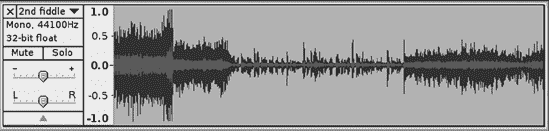

图 9-1. 这就是单个单声道音轨的样子——一个波形，无论在音轨上录制的声音或乐器有多少。

*通道*指的是音频的输入和输出。当你使用单个单声道话筒进行录音时，即使整个管弦乐队在演奏和合唱团在唱歌，这也是一个单独的输入通道。多通道录音接口允许你使用更多的麦克风和乐器插件，从而创建更多的音轨。

### 注意

在**编辑** > **首选项** > **设备**中设置的输入通道数量必须与你的物理输入通道数量相匹配。

通过为每个声音和乐器配备自己的麦克风，你可以获得最大的灵活性和控制。录音室录音与现场录音大不相同——有时每个表演者都可能在单独的隔音隔间中，或者在不同的时间和地点进行录音，因此乐队成员可能从未同时出现在同一个物理位置。在单个表演者身上使用多个麦克风，然后操纵产生的多个音轨以创造绝对完美精彩（或者说是过度制作的混乱，视情况而定）是一种常见的做法。

在你将麦克风和乐器插入的物理录音输入时要小心——有些是单声道的，有些将是立体声的，有些可能需要幻象电源，而其他则用于各种其他目的。确保你正确地插入了设备——仅仅因为它适合并不意味着它是正确的。

### 注意

培养一个好习惯就是永远不要随意热插拔任何设备，除非你确定这样做是安全的。在连接你的电容式话筒之前，不要开启幻象电源。在电源开启的情况下，不要将任何设备插入你的放大器、预放大器、调音台等，或者至少确保所有音量控制都调至零。在拔插设备之前，请先关闭电源。大多数音频设备都能承受一定程度的滥用。但热插拔产生的噼啪声会令人烦恼，并可能损坏你的设备。

如果你在一个单声道录音输入上使用立体声麦克风，只有一个通道会录音，你将得到一个只有一个通道为空的立体声轨道，就像图 9-2 中所示。

图 9-2. 这是你将立体声麦克风插入单声道录音输入时会发生的情况。

如果这种情况发生在你身上，不要担心；只需使用轨道菜单将立体声轨道分离成两个轨道，然后删除空的那个。有两种分割轨道选项：分割立体声轨道会创建一个左轨道和一个右轨道，而分割立体声到单声道会创建两个单声道轨道。（您可以使用相同的菜单将两个单独的轨道合并成一个立体声轨道。）在混音到立体声时分配轨道的左右或单声道非常重要：左轨道进入左声道，右轨道进入右声道，单声道则进入两个声道。（有关更多信息，请参阅混音到立体声。）

低端板载音频芯片因声称具有立体声麦克风输入而臭名昭著，但只有一个通道工作。如果你在这些芯片上尝试使用单声道麦克风，它可能根本不起作用，所以我忍不住要给出一个明显的警告：在使用之前测试它。

### 注意

请参阅第二章以复习设置音频硬件，并查阅您的产品文档。警惕那些想要“帮助”你的人！这是你的设备，你不想得到那些不知道自己在做什么的人的帮助，这些人中有很多自认为是专家（例如，一生都在舞台上表演的专业音乐家，他们依赖旧的“乱敲直到发生什么”的技术）。你的平静心情和设备比他们的自负更重要。

输出通道类似于输入通道。如果你创建一个 5.1 环绕混音，它有六个独立的通道——左声道、右声道、中心声道、环绕左声道、环绕右声道和低频效果（LFE），你可以将单个单声道轨道导出为 5.1 环绕，如图 9-3 所示。图 9-3 展示了这个过程。我不知道你为什么想这么做，但如果你这么做，它就在那里。Audacity 支持最多 32 个输出通道。如果你有一个支持 32 个通道的播放设备，你将会有一个非常有趣的体验。对于所有这些通道，一个更现实的选项是将它们导出到一个 32 位的 WAV 文件中，或者 32 个单独的 WAV 文件（使用**文件** > **导出多个**），然后导入到一个更复杂的混音应用程序中进行高级混音和录音室魔法。例如，一些用户喜欢在 Audacity 中录制和编辑，然后在不同的程序中进行最终混音，这些程序做的是 Audacity 做不到的事情，比如支持 MIDI，或者有更复杂的多轨混音。由于 Audacity 是免费的，尝试不同的工作流程只需要一些时间，而无需任何费用。

图 9-3. 使用 Audacity 自定义导出混音器从单轨创建 5.1 WAV 文件的有趣示例

*剪辑*是轨道的片段。你可以用剪辑玩很多有趣的事情，比如通过移动单词来改变采访中的人说的话，制作循环，或者从不同的录音中抓取剪辑并将它们以新的不同方式混合在一起。你可以在单个轨道中放置多个剪辑，或者将每个剪辑放在自己的轨道上。你甚至可以使用时间移动工具将剪辑从一个轨道拖动到另一个轨道上（图 9-4）。

图 9-4. 使用时间移动工具，剪辑可以独立地移动到任何地方，甚至可以移动到不同的轨道上。

# 如何制作多轨录音

有几种方法可以制作多轨录音。一种方法是通过多通道录音接口一次性录制所有轨道。另一种方法是在现有项目中在不同时间录制新轨道；这被称为*叠加录音*。管理多轨项目的另一种方法是运行多个录音会话，每个会话在自己的 Audacity 项目中，然后将这些轨道复制到一个单独的 Audacity 项目中。

对于一次录制大量轨道，我有一个 Focusrite Saffire Pro 26，这是一个出色的多通道 FireWire 录音接口。它具有八个麦克风前级放大器，幻象电源，两个 ADAT 银行（16 个通道），S/PDIF，24/192 数字 I/O，以及许多其他功能。图 9-5 显示了在 Audacity 中使用 Saffire 进行的四通道录音会话。正如你所见，它看起来并不特别：它只是同时录制了四个通道。Saffire 理论上可以一次处理 26 个录音输入，Audacity 可以毫无问题地处理；唯一的限制是我电脑的处理能力。（Audacity 版本在 1.3.8 之前的版本一次限制为 16 个输入。）

图 9-5. 使用 Focusrite Saffire Pro 同时录制四个轨道

我的小型 M-Audio MobilePre USB 可以一次录制四个输入。然而，它实际上是一个仅具有两个离散输入和输出通道的立体声录音接口。因此，录制四个输入意味着每个通道上都有两个输入组合在一起，而不是可以单独操作的四个轨道，只有两个。这再次说明了在广阔的音频世界中，有许多做事的方法。

许多高端声卡和录音接口被设计成可以组合使用，然后它们在 Audacity 中表现为一个单一接口。Audacity 没有能力组合多个录音接口；它必须看到一个具有多个通道的单个设备。Windows 和 Mac 用户可以获得特殊的驱动程序和管理软件来完成这项工作。幸运的话，你也可以组合低端声卡。然而，根据我的经验，在任何一个平台上组合廉价声卡都是痛苦且不可靠的，所以我将假装这样的选项不存在。

### 注意

记住，Audacity 支持几乎无限的撤销和重做，因此你可以安全地实验。使用 ctrl-Z 或**编辑** > **撤销**来撤销更改，使用 ctrl-shift-Z 或**编辑** > **重做**来重做。

当你想将如 WAV 或 FLAC 等音频文件添加到你的项目中时，请使用**文件** > **导入** > **音频**将它们导入到 Audacity 项目中。**文件** > **打开**将启动一个新的 Audacity 会话，而**文件** > **导入** > **音频**则将音频文件打开到当前项目中。你不能将一个 Audacity 项目导入到另一个 Audacity 项目中，但你可以在两个或更多项目之间复制轨道。

图 9-6. 轨道菜单

熟悉轨道菜单(图 9-6)，因为你将经常使用它。

这里有一些需要注意的事项。你可以使用轨道菜单来分割立体声轨道；点击**分割立体声轨道/分割立体声为单声道**。然后，为了自己的精神健康，给每个轨道起一个描述性的名字。

你可以将两个单声道轨道合并成一个立体声轨道。它们必须相邻，并且你需要在最上面的轨道的轨道菜单中选择**制作立体声轨道**。然后 Audacity 会自动将其与下面的下一个轨道合并。如果轨道没有在一起，从轨道菜单中选择**移动轨道上下**，或者用鼠标拖动一个轨道，通过在轨道标签上抓住它来实现。（如果你不记得 Audacity 的所有部分都叫什么，请参阅第一章。）

# 播放技巧和窍门

如你从勤奋学习的第一章中回忆的那样，默认情况下，当你按下播放按钮时，Audacity 会同时播放所有轨道。按空格键也会开始播放。要听一个轨道，点击轨道菜单中的**独奏**。要听一些轨道但不是所有轨道，点击不想听的轨道上的**静音**按钮。ctrl-U 静音所有轨道，shift-ctrl-U 取消静音所有轨道。将光标放在时间标尺上的任何起始点上；当它变成一个小手时，点击即可从该点开始播放。你可以这样跳过整个轨道，而不使用停止/播放按钮。

图 9-7。在时间标尺上创建播放区域以播放选定区域。

你可以通过在时间标尺上点击并拖动来创建一个**播放区域**，快速播放轨道的选定部分。这将立即播放，然后播放区域消失。

你可以通过通常的方式选择轨道的一部分来创建一个持久的选定区域，即使用选择工具点击并拖动。然后点击**播放**按钮来仅播放该选定区域，或者点击 shift-Play 来循环播放选定区域。按 ctrl-B 为选定区域创建一个区域标签（有关区域标签的更多信息，请参阅创建和管理标签）。按**C**（代表剪切）来预听剪切选定部分后轨道将听起来像什么。默认的切入和切出长度为 1 秒；你可以在**编辑** > **首选项** > **播放**中更改此设置。

快速播放曲目的一部分，可以通过点击标记一个停止点，将光标定位在标记的左侧（不要点击，只需悬停）然后按**B**键。播放将从光标所在位置开始，并在你的标记处停止。你也可以反过来操作，将光标定位在标记的右侧，然后按**B**键，它将从所选内容播放到光标位置。

# 标签轨道

标签轨道对于跟踪项目中的曲目活动非常有用。你可能还记得第三章中提到的标签，它们被用来将复制自黑胶唱片的长时间曲目分割成单独的歌曲轨道。当你编辑多个轨道时，你也可以将它们用作书签和笔记，以及创建对齐标记。每个音频轨道都可以有自己的标签轨道（图 9-8）。通过选择**轨道** > **添加新** > **标签轨道**来创建新的标签轨道。通过用光标抓住轨道标签并拖动它们，或者使用轨道菜单的**移动轨道上下**选择来定位标签轨道。

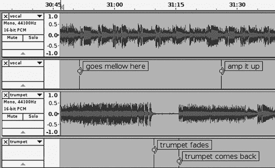

图 9-8。你可以使用任意数量的标签轨道。

如果你依赖于标签轨道，那么在备份 Audacity 项目时需要格外小心，因为它们仅存在于 Audacity 内部。标签轨道可以像音频轨道一样导出和导入，但遗憾的是（截至 Audacity 1.3.12），你不能导出多个标签轨道。如果你尝试导出多个标签轨道（**文件** > **导出标签**），它们将被合并成一个单独的文本文件，并且在导入时，你将得到一个包含所有轨道标签的单个标签轨道。

你可以将标签轨道放置在最上方，并像指挥家的乐谱一样使用它，为整个项目提供笔记和计时标记。

## 创建和管理标签

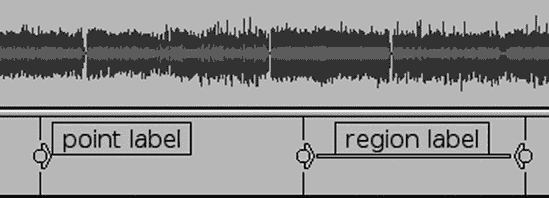

图 9-9。点标签标记轨道上的单个点，区域标签标记一个区域。

标签有两种类型：*点标签*和*区域标签*。在第三章、第四章和第五章中，我们使用点标签将长时间曲目分割成单独的歌曲。区域标签标记一个选择，如图图 9-9 所示。

点标签很容易创建。停止播放，使用选择工具在您的轨道上点击，您想要放置新标签的位置，然后按 ctrl-B。输入您的标签名称或您想要的任何文本，然后按回车键。您也可以选择**轨道** > **在所选位置添加标签**。要删除标签，按退格键直到标签文本消失。

播放时按 ctrl-M 键可以添加标签；这是 Audacity 中少数几个不需要先停止所有操作的功能之一。当您有多个标签轨道时，请记住首先选择您想要添加新标签的轨道。（点击其轨道标签以选择它。）

看看标签上的小手柄，角度和圆圈。抓住圆圈来移动标签。拖动角度手柄来创建或调整区域标签的大小。通过拖动角度手柄直到所有手柄合并，将区域标签更改为点标签。

您可以通过几种方式创建区域标签。一种方式是选择音频轨道的一部分，然后选择**轨道** > **在所选位置添加标签**（或直接按 ctrl-B）。另一种方式是通过拖动其角度手柄来拉伸点标签。小角度和圆圈会改变它们在相邻区域标签时的行为。小圆圈手柄创建并移动一个公共边界，公共边界用角度手柄分隔（图 9-10）。

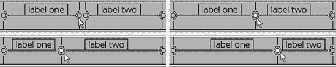

图 9-10. 圆圈手柄移动整个标签，角度手柄创建和调整区域标签的大小。您可以将区域标签的边界连接起来，然后使用圆圈手柄移动边界，您也可以使用角度手柄将它们分开。

按下制表键可以向前浏览您的书签，按住 Shift 键再按制表键可以向后浏览。选择**轨道** > **编辑标签**来快速编辑和重新排序它们。标签会编号以显示它们属于哪个标签轨道（图 9-11）。

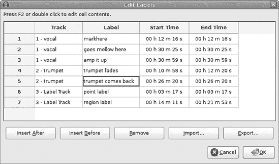

图 9-11. 选择轨道 > 编辑标签将所有标签放在一个地方，便于编辑和重新排序。注意标签是按照它们的标签轨道编号的，1、2 和 3。

## 使用标签编辑多个轨道

你可以使用标签在多个轨道上标记点或片段。假设你想要删除两个音频轨道上的 10 秒片段。用区域标签标记这一点，然后点击标签文本内(图 9-12).

图 9-12. 使用区域标签选择跨多个轨道的轨道片段

这会将标签文本字段变为白色，并在标签轨道以上的所有轨道中选择一个 10 秒的片段，包括其他标签轨道。如果这包括你不希望受影响的轨道，请取消选择额外轨道（shift-click 轨道标签）。按 ctrl-X 或选择**编辑** > **剪切**，选择将消失。你可以使用此功能跨多个轨道进行任何编辑操作。你可以通过更改区域标签来移动选择或更改其大小。

对于这些操作，不需要使用区域标签，因为你可以使用选择工具在多个轨道上做出选择。键盘也可以使用，使用上箭头和下箭头键移动光标，使用 shift 键和箭头键调整选择的大小。

# 校准和移动轨道

有许多方法可以在时间和轨道顺序中移动轨道。Audacity 有几个很好的工具可以移动和校准你的轨道。

移动轨道向前或向后的一种方法是使用时间移动工具(图 9-13)。时间移动工具可以将整个轨道向前或向后移动时间。

这非常简单：只需单击，按住鼠标按钮，并将波形向左或向右拖动。你甚至可以拖动到轨道的开始之前，并向前移动时间，这在轨道中的小箭头中有所指示。图 9-14。这是非破坏性的，你可以再次将其拖出来。

图 9-13. 选择时间移动工具

图 9-14. 当你将时间移动到轨道开始之前时，会出现两个小箭头。

当你正在移动轨道时间，并且它们与其他轨道完美对齐，或者正好从零开始对齐时，Audacity 会显示一条垂直的黄色线。Audacity 称这为*捕捉指南*。如果有多个边界并且它们太靠近，捕捉指南会变得混乱并且无法工作。放大以给它一些空间。

只要轨道是单一不间断的波形，时间移动工具就会移动整个波形。要将轨道分成独立的段，使用选择工具点击标记你想要分割的位置，然后选择**编辑** > **分割**（或按 ctrl-I）。选择线变为白色，现在你有两个可以独立时间移动的段。

### 注意

如果启用了链接轨道，带有标签轨道的轨道将不会分割。禁用链接轨道以更改此设置。

要重新连接分割的轨道，将段移动回一起。当它们接触时，黄色的捕捉指南线会出现。然后切换到选择工具，选择跨越连接的选择，然后选择**编辑** > **连接**或按 ctrl-J。如果有间隙，选择**编辑** > **连接**将用静音填充它。

在**轨道** > **对齐轨道**菜单中查看一系列有用的轨道对齐命令。假设你已经对多个轨道进行了时间移动，它们分布得四处都是，因此你想重置一切并重新开始。选择你想要对齐的轨道，选择**轨道** > **对齐轨道** > **对齐轨道一起**，然后选择**轨道** > **对齐轨道** > **对齐轨道与零**。嗖！一切都被重置为从零开始。

### 注意

不要包括标签轨道，因为它们总是从零开始，这将防止带有任何偏移的音频轨道对齐到零。通过在它们的轨道标签上按住 shift 点击来取消选择标签轨道。

使用光标对齐是一种快速将轨道移动精确数量的方法。以下是操作方法：假设你想要在轨道开头插入 10 秒的时间偏移。在 10 秒处点击以标记它，然后选择**轨道** > **对齐轨道** > **与光标对齐**，将轨道的开始移动到该点。将结束与光标对齐使轨道的末尾与光标对齐。

使用选择开始对齐和使用选择结束对齐与使用光标对齐类似，只是轨道是相对于选择移动的。例如，如果你有一个跨越 5 到 10 秒段的选择，使用选择结束对齐将轨道定位在 10 秒标记处。使用选择开始对齐则相反，使其从 5 秒标记处开始。

将结束与选择开始/结束对齐与对齐光标工作方式相同，只是它们相对于轨道的末尾。

使用标签的一个巧妙技巧是在需要时间移动多个轨道时创建一个对齐点。为此使用点标签：创建您的点标签，单击标签文本，然后从标签延伸到所有上方轨道的线条。使用时间移动工具，当轨道（或轨道）的开始或结束与您的点标签完美对齐时，黄色的捕捉引导线将出现。

图 9-15. 轨道 1、2 和 4 已被选中。

轨道对齐也可以在时间标尺上的任意任意点上不使用标签进行。使用选择工具，在单个轨道的任何位置单击以标记您的对齐点，然后通过选择其他轨道（在轨道标签上 shift-click）将光标向上或向下扩展到其他轨道。shift-click 也可以取消选择。您可以使用此方法选择任意轨道，如图 9-15 所示。然后使用时间移动工具将对齐到光标标记或选择**轨道** > **对齐轨道** > **与光标对齐**。

## 链接轨道和轨道组

Audacity 1.3.9 中出现的一个（有时可能令人困惑）的新功能是链接轨道按钮（编辑工具栏）。默认情况下应该激活（按下）此按钮；这可以通过时间变化、速度变化、剪切、粘贴和其他更改保持标签轨道与音频轨道对齐。当链接轨道妨碍您时，可以通过单击（抬起）**链接轨道**按钮或选择**轨道** > **链接音频和标签轨道**并取消选中复选框来关闭链接轨道。

标签轨道与音频轨道或其上方的轨道链接，直到出现另一个标签轨道；这些被称为*轨道组*。通过**轨道** > **添加新** > **标签轨道**创建一个新的标签轨道。它将出现在现有轨道的底部，您可以通过拖动轨道标签或从轨道菜单中选择**移动轨道上下**来移动它。您可以通过插入空白标签轨道来将轨道组与其他轨道分开。

当您在轨道组中使用时间移动工具时，组中的每个轨道作为一个单元移动。当您删除一个轨道的一部分时，组中的每个轨道都会删除相应的部分。当您将音频片段粘贴到一个轨道中时，其他轨道会接收到相应长度的静音。当您使用**效果** > **改变速度**和**改变速度**时，效果会应用于组中的所有轨道。标签会通过所有这些变化保持同步。

### 注意

在 Audacity 2.0.x 系列中可能无法启用链接轨道。它们首次出现在 Audacity 1.3.9 版本中，并应在 Audacity 2.1.x 测试版系列中回归。它们的行为可能会改变，因此请检查您的 Audacity 发布说明。

## 同时时间移动多个轨道

如果您想同时将多个轨道移动相同的时间，怎么办？shift-click 轨道标签来选择您想要时间移动的轨道，或者按 ctrl-A 选择所有轨道，然后使用时间移动工具移动它们(图 9-16).

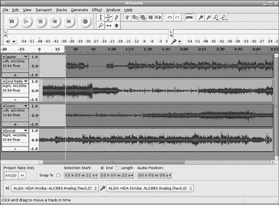

图 9-16. 调整多个选中轨道的时间。注意，选中的轨道（1 和 3）被变暗了。

如果您的 Audacity 版本包含链接轨道功能，请禁用它，否则时间移动将无法正常工作。

## 分割轨道

*分割*轨道是将长轨道分割成独立的剪辑，这样您就可以根据需要移动它们。有时您需要移动一段一秒或两秒来与其他轨道对齐或分离同时说话的两个人。有时您可能想要将一个轨道分割成许多短剪辑。要创建剪辑，将选择工具定位到您想要分割的位置，然后按**编辑** > **分割**。现在您有两个剪辑，可以使用时间移动工具来移动它们。

图 9-17. 选择**编辑** > **分割新建**创建一个包含剪切片段的新轨道。

选择**编辑** > **分割剪切**来剪切选中的轨道部分并留下一个间隙，这样轨道长度保持不变。被剪切的片段将被放置在剪贴板上，可以粘贴（ctrl-V 或**编辑** > **粘贴**）到另一个位置。

选择**编辑** > **分割删除**将删除选中的部分。

选择**编辑** > **分割新建**创建一个新轨道并将剪切的部分移动到它上面(图 9-17).

## 与剪辑一起工作

如果您正在处理短剪辑，而不是我们之前看到的长时间轨道，看起来就像图 9-4。您可以在同一轨道上拥有多个独立的剪辑。每个剪辑都可以独立进行时间移动，甚至可以使用时间移动工具拖动到其他轨道上。您可以对单个剪辑进行编辑，例如更改振幅、应用效果、删除或粘贴额外材料以及修复缺陷。唯一不能做的是在导出共享同一轨道的独立剪辑时控制通道映射，因为这是按轨道进行的，所以任何想要这样控制的剪辑都需要在它们自己的轨道上。

图 9-18. Audacity 的 Snap Guide 功能

当你想精确选择一个剪辑时，Audacity 的 Snap Guide 功能非常有用，因为当你正好位于其边界上时，你会看到黄色的线条出现(图 9-18).

选择多个剪辑有点棘手。按 ctrl-A 键选择所有轨道。要移动所选的一批剪辑，首先使用选择工具在时间轴上标记出跨越所有要移动的剪辑的片段。然后在轨道面板中使用 shift 键点击来选择轨道，然后使用时间移动工具来移动它们。这相当笨拙，你不能随意跳过并选择任意一批剪辑(图 9-19).

图 9-19. 你只能在时间轴上的公共区域选择剪辑。在这个例子中，前三个轨道中带有暗色区域的剪辑将一起进行时间移动。

## 轨道内的时间移动

时间移动工具非常适合将整个音频片段向前或向后移动，但如果你想在轨道中间插入一个中断或对轨道的一部分进行时间移动怎么办？Audacity 有几种不同的方法可以做到这一点。我最喜欢的创建中断或填充轨道的方法是选择**生成** > **静音**。这避免了分割轨道或删除任何内容；它所做的只是插入一段你想要的任意时长的绝对静音。将选择工具定位到你想要静音开始的位置，选择**生成** > **静音**，输入静音的时长，然后点击**确定**(图 9-20).

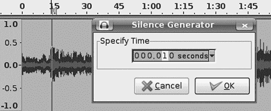

图 9-20. 生成静音

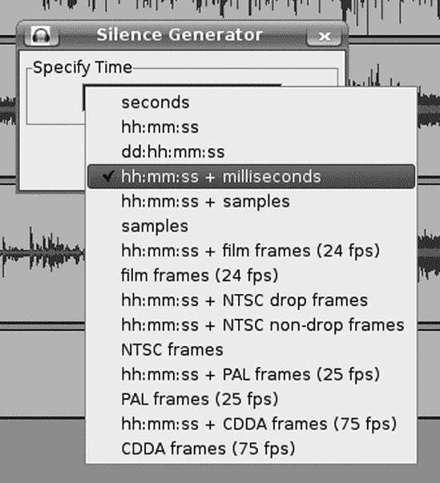

图 9-21. Audacity 为你提供了多种选择，用于设置静音的时长。

如图 9-21 所示，你可以选择多种方式来设置静音的时长：小时、秒、毫秒以及各种帧率，这些内容我将在下一节进行解释。

天数、小时、秒和毫秒都很直接，我钦佩那些用天数来衡量音频文件持续时间的人。*样本*显示根据您项目的采样率显示的音频样本数量；例如，当您的项目采样率为 44,100 Hz 时，一秒钟的音频是 44,100 个样本。

另一种方法是把轨道分成两个或更多部分，然后移动它们以创建所需持续时间的间隔。参见对齐和移动轨道以了解如何做到这一点。

# 节拍器轨道

对于由略微不同的速度引起的同步问题，最好的治疗方法是在您录制时让每个人都保持节奏。换句话说，关键是预防。你知道那些大型的、昂贵的录音室，有所有的隔音和昂贵的设备吗？他们不会像必须那样依赖编辑魔法来修复缺陷。这就是为什么他们要隔音并多次录制。这就是为什么他们使用节拍器来确保所有演奏者保持节奏。

节拍器并不昂贵，每个录音室都应该有一个。像许多其他电子小玩意儿一样，它们有各种各样的风格、功能和价格。只需选择一个既有静音闪烁又有可听见的点击节拍即可。如果它还包含调音器、正弦波发生器、接收天气预报和制作三明治，这些都是额外的优点。

Audacity 会为您生成节拍器轨道。最好使用独立的节拍器，因为它不使用任何 CPU 周期，但如果你需要它，它就在那里。如果你已经安装了 C*音频插件套件([`www.de/dsp/caps.html`](http://www.de/dsp/caps.html))，请在“生成”菜单中查找 C*点击节拍器。你会看到一个菜单，就像图 9-22 中那样，你可以设置每秒的节拍数、音量和持续时间。*阻尼*接受从 0.1 到 0.9 的值。阻尼使得在较高的阻尼值时节拍器听起来被抑制，在较低的值时听起来更谐振。

与节拍器轨道类似的是*点击轨道*。与节拍器轨道不同，它在每一小节的开始都有一个重音节拍。重音和非重音节拍的音高由 MIDI 音符数值控制。MIDI 音符编号从 0 开始，到 127 结束，跨越近 11 个八度。60 号是中 C，每个八度有 12 个音符（参见表 9-1 以获取 MIDI 音符编号速查表）。

图 9-22。在“生成”菜单中查找 C*点击节拍器插件。

表 9-1. 音高及其对应的 MIDI 音符编号值

| 音高 | MIDI 音符编号 |
| --- | --- |
| C | 60 |
| C# | 61 |
| D | 62 |
| D# | 63 |
| E | 64 |
| F | 65 |
| F# | 66 |
| G | 67 |
| G# | 68 |
| A | 69 |
| A# | 70 |
| B | 71 |

如果您想知道为什么没有使用降号符号，那是因为键盘上没有降号符号。

图 9-23 展示了“生成”>“点击音效”的配置面板。（在 Linux 上，它位于“生成”子菜单的更深层次，具体取决于安装了哪些插件。）首先通过选择“轨道”>“添加新轨道”>“音频轨道”创建一个新的空轨道，然后打开点击音效。

图 9-23. 配置点击音效

大多数选项应该是自解释的。小节数量决定了轨道的长度。噪声点击共振和单个点击持续时间影响音质；这两个值越高，点击音效越音乐化。

# 重复录音

重复录音是在听现有轨道或轨道的同时录制新轨道。重复录音是自行录制整个交响乐的一种方式，一次录制一个轨道。当然，它也适用于更简单的项目，例如录制自己演奏几种不同的乐器并唱歌，与自己进行相当和谐的合唱，或者当除了鼓手之外的人都到了，您将没有她（她可以稍后录制她的部分）。 

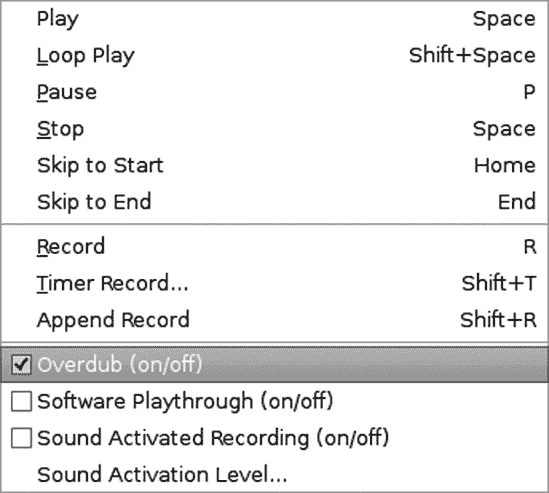

图 9-24. 启用重复录音以便在录制新轨道时可以听到的现有轨道。

让我们快速进行一次重复录音。首先打开一个现有的音频轨道或录制一个新的轨道。然后在传输菜单中，启用重复录音（图 9-24 展示了一个简单的重复录音会话。第一轨的播放被路由到耳机中，我们的隐形独奏者在第二轨上与它一起唱歌。

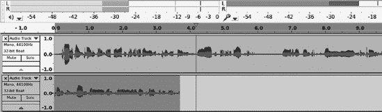

图 9-25. 在听第一个轨道的同时录制新轨道

## 测量和修复延迟

当你进行叠加录音时，延迟是一个常见问题，因为播放时总是存在一些延迟。通常，播放时的少量延迟并不重要，因为我们只是在听，声音不需要与其他任何东西同步。但是，当你进行叠加录音时，任何延迟都会导致新轨道与旧轨道不同步。演示这一点的一个简单方法是记录自己数到 10。然后叠加第二个轨道，再次数到 10，同时尝试匹配第一个轨道。播放它们，很可能会发现第二个轨道与第一个轨道不同步。

### 注意

总是确保**编辑** > **首选项** > **录音** > **软件回放**未勾选。使用软件回放可以让你监控你正在录制的声音，但这是最糟糕的方法，因为它会增加延迟并使用 CPU 周期。最好使用录音界面的监控端口。

Audacity 允许你在**编辑** > **首选项** > **录音** > **延迟**中补偿这种延迟。默认的延迟校正值是 130 毫秒，这对你系统来说可能并不正确。当你叠加录音时，你可以看到这种校正的效果，因为当你停止录音时，Audacity 会根据延迟校正值将新轨道进行时间移动。这种时间移动以通常的方式用一对箭头在波形图的左侧表示（图 9-26

图 9-26. 通过时间移动自动应用延迟校正由一对箭头表示。

获取正确延迟校正值的一种方法是通过试错。一种简单的方法是录制一个点击或节拍器轨道，然后在一个你尝试匹配节拍轨道的声乐轨道上叠加。当然，你可能会觉得对着麦克风说“滴答滴答滴答”或“ONE two three four”很傻，但这是有效的。确保选择工具栏上的“自动对齐”复选框未勾选，并不断调整延迟值，直到听起来正确。

一种更精确的方法是使用回环电缆来测量延迟。这听起来可能有些奇特，但你所做的一切只是将你的录音界面的播放输出连接回录音输入。如果是内置声卡，将线路输出连接到线路输入。如果是 USB 或 FireWire 接口，这取决于你的设备和它有什么样的连接器，但任务仍然是相同的——将播放输出连接到录音输入。

然后将延迟校正设置为 0。确保选择工具栏上的“Snap To”复选框未勾选。选择“Length”单选按钮，并将时间参数设置为 hh:mm:ss + 毫秒。

接下来，生成一个 30 秒长、每秒 180 拍子的节拍器或点击轨道。每秒的拍子数可以是任何值；我更喜欢较快的拍子，因为它更容易测量。

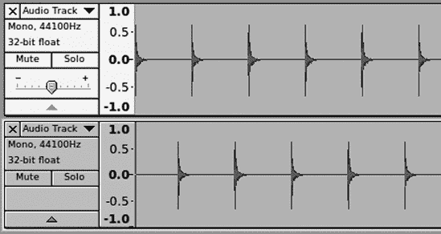

图 9-27. 由于延迟，叠加的轨道与第一轨不对齐。

打开叠加录制（**Transport** > **Overdub (on/off)**），在设备工具栏上选择播放和录音设备的录音接口，并按录音按钮。您应该会看到类似图 9-27 的东西。

当您完成录音后，放大直到您可以选择顶部轨道上的点击和底部轨道上相应点击之间的间隔。如果您不习惯使用鼠标，请使用 shift 键和箭头键来标记选择。（使用箭头键前后左右上下移动，并使用 shift 键和箭头键进行选择。）您将看到类似图 9-28 的东西。

图 9-28. 从第一轨的第一个节拍开始选择间隔，到第二轨的第一个节拍开始，以测量延迟

现在您在选择工具栏中有一个长度值。在我的例子中，那是 177 毫秒，相当多。如果您愿意，可以放大以获得最精确的测量。您可能永远无法达到零延迟，但可以非常接近。叠加的延迟校正总是取负值，因为新轨道总是落后于旧轨道。如果您更改录音接口，应重复回环测试，因为不同设备有不同的延迟。

当您阅读有关延迟的内容时，您会发现许多关于它的热烈讨论，以及许多关于英雄般的低延迟壮举的吹嘘，例如“我将我的延迟降低到三毫秒！”这是可以接受的，尽管有些可疑，但保持一点视角是好的。为了稳定性或避免因 CPU 跟不上的跳跃和卡顿而牺牲超低延迟是没有好处的。在配音过程中，延迟很重要，Audacity 通过其可配置的延迟校正功能帮助您。当您使用软件监控时，这也很重要，这就是为什么我更喜欢使用带有零延迟监控端口的录音接口。当您在音频链中添加额外的停止点时，例如外部的特殊效果处理器时，这也很重要。当您弹奏音符时，您希望声音发出，而不是延迟。

您可以通过使用高速多核处理器和优化计算机以及针对音频制作进行调优来降低您的音频制作计算机的延迟。第十三章和第十四章告诉您如何做到这一点。

## 改变节奏

尽管您尽了最大努力，但有时您的音轨节奏会偏离同步。如果您是朋克乐队的一员，那没关系，但否则您可能希望纠正这一点。选择**效果** > **改变节奏**，这将改变节奏而不改变音调。如果知道要使用哪些值，这很容易，但不幸的是，Audacity 没有节奏检测器。编写节奏检测插件的人将是一个大英雄。我使用秒表并在播放期间数出节拍。可能需要一些尝试和错误，但通常比重新录制要容易。

# NTSC、PAL 和 CDDA 帧

这是对帧的简化解释。如果您想制作电影音轨，那么这只是一个关键概念的介绍，您将需要了解更多。

*帧*值用于将分割点精确地放置在视频和音频帧的边界处。在“选择”工具栏中勾选“吸附到”复选框，将时间值设置为适当的帧类型，然后在您进行分割或剪切时，它们将正好匹配帧。任何在帧边界之外的音频都将丢失，并可能产生点击声。

国家电视系统委员会（NTSC）的帧率适用于北美、一些南美国家和少数其他国家的模拟广播电视。NTSC 的降帧率为每秒 29.97 帧（fps），而 NTSC 的非降帧率为每秒 30 帧。Audacity 支持这两种格式。为什么是两个？为什么是奇怪的 29.97 这个数字？这是一个从黑白电视时代就有的旧标准。黑白广播的帧率是真正的 30 帧每秒，但当彩色被添加到广播信号中时，由于各种技术原因，帧率被降低到 29.97 帧每秒。现在请特别注意，因为我将运用我所有的强大解释能力，以一种普通人、非视频工程师可以理解的方式解释降帧和非降帧 NTSC 帧率之间的差异。这在人类历史上从未做过；你在这里是第一个看到的。

NTSC 的降帧和非降帧帧率只有一个区别：它们使用不同的*时间码*来控制播放速度。节目的长度没有差异，只是在播放速度上有一点小小的差异。术语*降帧*是不幸的，因为它普遍被认为视频帧被丢弃了，但这并不是真的。视频时间是通过计算视频帧来衡量的。当你以真正的非降帧 30 帧每秒拍摄一小时的视频时，你的一个小时的工程将包含正好 108,000 帧。如果它没有先转换为降帧就播出，它将运行大约 1 小时 3.6 秒，因为以 29.97 帧每秒的速率，每小时有 107,892 帧。所以，在一小时结束时，会剩下 108 帧。

如果你愿意做数学计算，你会发现两者之间有 1%的差异。自然地，随着时间的推移，这会导致广播员的烦恼。这也给需要准确测量剪辑和场景长度的电影编辑带来了麻烦。

这种差异通过在降帧时间码中插入一点故意的健忘和自我欺骗来纠正。使用 NTSC 降帧，你的电影以 30 帧每秒播放，但它假装是 29.97 帧每秒，因为这是 NTSC 电视广播的要求。每个视频帧都被计算，直到 1%的差异累计到一个完整的帧。然后时间码假装那个帧不存在，不计算它，并继续在下一个帧上计数。所以尽管你的电影仍然有它的原始 108,000 帧，但健忘的时间码播放它认为只有 107,892 帧，但实际上是 108,000 帧。由于它欺骗自己没有看到那些其他的 108 帧，所以它们仍然被播放，电影按时结束，每个人都高兴。

这听起来很复杂和奇怪，但在视频工程的世界里，这是一个优雅的解决方案，它对遗留的广播基础设施的干扰最小。随着彩色的出现，另一种选择是彻底翻新整个电视广播系统以适应新的彩色标准。

所有 NTSC 电视广播商都要求提交给他们的母带使用 NTSC 降帧。如果你在 Audacity 中编辑电影音轨，你可以精确匹配正确的帧率。

相位交替线（PAL）是地球上大部分地区的彩色电视广播标准：澳大利亚、亚洲的大部分地区、南美洲、欧洲、格陵兰和一些非洲国家。它使用 25 fps 的帧率，Audacity 支持这一帧率。

传统电影电影是 24 fps。

如果你正在为 DVD 制作音频轨道，你可以使用 NTSC、PAL 或 24 fps。对于网络流媒体，你可以使用你想要的任何帧率。

光盘数字音频（CDDA）的 75 fps 帧率用于音频 CD。我们在第三章中学习了这一点，用于将旧模拟媒体转换为 CD。例如，当你将黑胶唱片复制到 Audacity 作为一个长轨道，然后分割轨道成单独的歌曲时，选择 CDDA 帧率确保所有分割都将与 CDDA 帧匹配，并且你不会因为音频与 CDDA 帧率不同步而产生点击声。

# 创建循环

有些人在循环上完全失去了控制。循环是反复播放的剪辑，例如，将几秒钟的鼓点变成长鼓点，从短剪辑中创建背景音乐轨道，或者催眠般地重复—— whatever pleases you。你可能见过使用循环将几分钟的音乐扩展为背景音轨的低成本纪录片。

创建简单循环很简单。从一个单个短剪辑开始。选择**效果** > **重复**。输入你想要重复的次数。Audacity 甚至为你做了算术(图 9-29)。

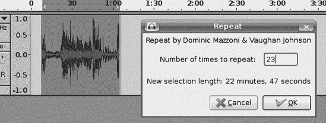

图 9-29。通过使用短剪辑并选择效果 > 重复创建简单循环

你可以循环一个剪辑、整个轨道或轨道中的选择。重复的部分将被附加到原始选择上，所以如果你的选择在轨道的中间，那么重复也将位于中间，从选择的右侧开始。

# 立体声混音

当你完成所有的编辑和清理工作，准备将你的轨道混音到立体声时，进入单个轨道的轨道菜单，并将它们分配到适当的左、右和单声道。左声道轨道在混音时进入左声道，右声道轨道进入右声道，单声道轨道映射到两个声道。在 Audacity 中，立体声轨道的顶部通道是左声道，底部通道是右声道。

### 注意

要了解更多关于清理轨道、修复问题和特殊效果的信息，请参阅 第三章，第四章，第十二章 和 第十一章。

图 9-30. 声像滑块调整单声道和立体声轨道的左右平衡。

你现在可以选择调整每个单声道或立体声轨道的声像，这意味着调整它们的左右平衡以增强立体声效果。你可以通过轨道面板上的声像滑块或首次出现在 Audacity 1.3.8 中的新式混音板上的声像滑块来完成此操作。声像滑块不会更改你的项目文件；它只影响 Audacity 中的播放和你的导出声音。在 Audacity 中调整播放时的音量，这样你可以确切地听到你的导出声音。这仅在单声道和立体声轨道上工作，不适用于左右声道。图 9-30 显示了它的外观。

声像滑块的旁边是增益滑块，用于调整轨道音量。就像声像一样，增益不会更改你的项目文件，但只控制你的导出声音。这也可以在播放时进行调整。

Audacity 有几种方法可以将你的轨道混音并渲染成立体声轨道。首先确保在 **编辑** > **首选项** > **导入/导出** 对话框中选择了“始终将所有轨道混音到立体声或单声道（s）通道”。

现在请选择 **轨道** > **混音和渲染**。这将用新的立体声轨道替换你的轨道。如果你不想用新的立体声轨道替换项目轨道，请不要选择 **轨道** > **混音和渲染**，但请记住那个巧妙的快捷键 Ctrl-Shift-M（Audacity 1.3.4 及更高版本）。这将混音并渲染一个新的立体声轨道，它将出现在你的单声道轨道下方（图 9-31）。

现在你已经有一个混合好的立体声轨道，准备进行更多编辑或导出到任何可播放的格式。如果你选择了使用 Ctrl-Shift-M 命令进行混音和渲染，你可以通过选择轨道（点击轨道标签）然后选择 **文件** > **导出选择** 来仅导出你的新立体声轨道。

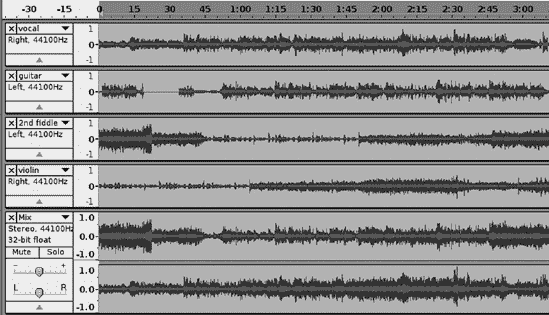

图 9-31。按下 ctrl-shift-M 进行混音和渲染会保留您的原始轨道并创建一个新的立体声轨道。

## 自定义混音板

这里有一个关于混音板的酷技巧：您可以通过使用某些关键词和缩写来使图标与您的轨道名称匹配（图 9-32

图 9-32。混音板图标与您的轨道名称匹配。

我通过在网上浏览[`www.audacity.cvs.sourceforge.net/audacity/audacity-src/`](http://www.audacity.cvs.sourceforge.net/audacity/audacity-src/)的源代码学习了这些名称。据我所知，这些名称尚未在其他地方进行记录。

+   乐器：声学，吉他，gtr

+   乐器：声学，钢琴，pno

+   后奏，人声，bg，vox

+   拍手

+   鼓，dr

+   电动，贝斯，吉他，bs，gtr

+   电动，吉他，gtr

+   电动，钢琴，pno，键

+   踢鼓

+   循环

+   管风琴，org

+   打击乐

+   萨克斯管

+   鼓

+   弦乐器，小提琴，大提琴

+   合成器

+   tambo

+   小号，horn

+   黑胶唱片机

+   钢片琴，vibes

+   人声，vox

## 响度过大！削波！

在这个阶段，确保**视图**>**显示削波**被勾选是很重要的。这将以红色条形突出显示您新立体声轨道中的任何削波部分。当多个轨道合并为单个轨道时，它们会变得更响，因此削波是常见的混音问题。如果您的新的混音轨道有削波，您需要返回，降低一些音量，然后再次混音和渲染。

图 9-33。双击“平衡”和“增益”滑块以打开一个小窗口，您可以在其中输入您的值。

在更改任何内容之前，首先检查您的“平衡”和“增益”滑块。即使您无意移动它们，这些滑块也很容易移动。仔细将光标定位在滑块按钮上，并单击而不移动它，它将弹出确切值。如果您移动滑块有困难，双击它以打开一个小窗口，您可以在其中输入您的平衡或增益值（图 9-33")). 您可以将音轨映射到多个通道。

图 9-34。将您的音轨映射到导出时的通道（注意底部的通道滑块）

## 多声道环绕

您可以使用 Audacity 导出为 3.1，5.1，或 7.1 环绕声，或您想要的任何多声道组合，使用自定义混合选项。您如何知道哪个通道对应什么？这个方便的列表显示了 WAV 的通道映射：

1.  前左

1.  前右

1.  前中心

1.  低频

1.  后左

1.  后右

1.  中心前左

1.  中心前右

1.  后中心

1.  侧左

1.  侧右

1.  顶部中心

1.  顶部前左

1.  顶部前中心

1.  顶部前右

1.  顶部后左

1.  顶部后中心

1.  顶部后右

为了让生活更有趣，其他文件格式支持不同的通道映射。表 9-2 展示了某些常见音频文件格式及其 5.1 通道映射：

表 9-2. 常见音频文件格式的通道映射

| 文件格式 | 通道映射 |
| --- | --- |
| WAV | 前左，前右，中心，LFE，后左，后右 |
| AC3 | 前左，中心，前右，后左，后右，LFE |
| DTS | 中心，前左，前右，后左，后右，LFE |
| AAC | 中心，前左，前右，后左，后右，低频效果声道（LFE） |
| AIFF | 前左，后左，中心，前右，后右，低频效果声道（LFE） |
| FLAC | 前左，前右，中心，低频效果声道（LFE），后左，后右 |
| WMA | 前左，前右，前中，低频效果声道（LFE），后左，后右 |

低频效果声道（LFE）通常被认为是低音炮声道。这并不完全正确，因为它与发送到低音炮端口的信号并不相同。它是一个用于携带 3 到 200 Hz 范围内声音的特殊声道，LFE 信号可以发送到任何能够处理它的扬声器。

对于 DVD 音频，使用 WAV 映射。（有关 DVD 音频的更多信息，请参阅第六章。）不必为 CD 设置环绕声，因为它们只支持双声道立体声。

在 Audacity 中创建多声道环绕音频时存在一些特殊问题。Audacity 在创建高质量立体声和单声道音轨方面非常出色，但其在管理多声道环绕方面的能力相当有限。您必须自己了解不同文件格式的正确通道映射，因为 Audacity 不会告诉您，并且当您将多声道音频文件导入 Audacity 时，即使文件是在 Audacity 中创建的，它也会丢失音轨名称和通道映射。

您可以在导出后通过在计算机上播放您的新音频文件来测试您的通道映射，如果您的计算机具有多声道环绕声卡，并且已经正确设置并正常工作。参见第十三章了解如何在 Linux 计算机上设置和测试环绕声播放。Windows 用户将在控制面板的“声音”模块中找到配置和测试工具，并且 Windows Media Player 支持环绕声。

测试您的新环绕声文件的另一种方法是将其烧录到 DVD 上，并在环绕高保真音响系统上播放。还有另一种方法是在为环绕高保真音响系统服务的数字音乐服务器上播放该文件。
