# 第十一章。Audacity 特殊效果插件


插件是附加的软件模块，为 Audacity 提供额外的功能：过滤器、分析、音调生成器和各种特殊效果。插件很棒，因为你不需要安装一个包含世界上所有功能的庞大程序，只是为了获得你真正想要的几个额外功能。

一些是随 Audacity 安装捆绑的，你可以在互联网上找到更多。或者你也可以自己编写。插件不是独立运行的；它们在*宿主*上运行，宿主是支持插件的程序（如 Audacity 和其他音频制作软件）。你将在生成、效果和分析菜单中找到 Audacity 的插件。

有三种类型的插件与 Audacity 一起工作：Linux Audio Developer’s Simple Plugin API (LADSPA)、Virtual Studio Technology (VST)和 Nyquist。LADSPA 主要用于 Linux，尽管有一些 LADSPA 插件适用于 Windows 和 Mac。VST 适用于 Windows 和 Mac，Nyquist 插件在所有三个平台上都适用。

插件在 Audacity 菜单中按字母顺序排序；没有方法可以按你的意愿排序或组织插件，例如你最常用的那些。找到关于它们的有用信息，比如它们的功能或各种设置的含义，通常是一个小小的挑战。Audacity 维基上有一些信息，各种插件项目的首页有不同程度的有用文档。尝试它们并亲自听听它们的功能很容易。在本章中，我们将详细介绍一些常用插件，并定义一些术语。本章末尾的简明音频术语表解释了你将遇到的关于插件和特殊效果的更多常见术语。

数字和音频信号的处理和分析是*信号处理*学科的一部分。我们不会在本书中深入探讨信号处理的数学和理论；要了解更多信息，请参阅参考文献部分。

让我们直接深入探索和尝试 Audacity 的一些特殊效果。你的 Audacity 菜单可能与你使用的示例不同，这取决于你使用的 Audacity 版本和安装的插件。如果你不知道如何查找和安装插件，请跳到本章关于在 Linux 和 Windows 上查找和安装插件的章节。

### 注意

当你找不到文档时，有时浏览源代码会给你带来有用的信息。你可以在[`audacity.cvs.sourceforge.net/viewvc/audacity/audacity-src/`](http://audacity.cvs.sourceforge.net/viewvc/audacity/audacity-src/)在线查看 Audacity 的所有源代码。使用“粘性标签”菜单选择正确的 Audacity 版本，然后查看*nyquist, plug-ins*和*src/effects*目录以查看 Audacity 插件的源代码。

# 混音

我们的第一个效果甚至不是真正的 Audacity 特殊效果：混音。混音是指一个轨道淡出，另一个轨道以某种重叠的方式淡入。我们在广播和电视上经常听到这种效果。Audacity 没有混音功能，但使用时间移动工具创建混音非常简单。

您需要两个轨道来完成这个操作。对一个轨道应用**效果** > **淡出**，对另一个轨道应用**效果** > **淡入**。然后使用时间移动工具移动轨道以创建所需的重叠程度(图 11-1).


图 11-1. 使用淡入/淡出效果和时间移动工具创建的简单混音

为了更精细地控制淡入淡出的程度和持续时间，请使用包络工具。

# 生成菜单

**生成**菜单包含创建新音调的插件。从一个新的、空白的 Audacity 会话开始。选择**生成**，然后选择您想要尝试的任何效果。这将打开一个对话框，显示特定音调的可用选项。如果选中了现有轨道中的所有音频，生成新音调将替换旧的一个。如果选中了现有音频的一部分，则该选择将被替换。如果没有选中现有轨道，则创建新音调也会创建一个新轨道。您还可以选择**轨道** > **添加新轨道** > **音频轨道**来创建额外的轨道。

## 正弦波示例

让我们创建一个正弦波来熟悉创建音调的过程。打开**生成** > **音调**对话框。选择正弦波形，将频率（Hz）设置为 3,999，将振幅设置为 0.8，并设置您想要的持续时间。默认为 30 秒(图 11-2).

您将看到类似图 11-2 的内容。放大查看经典的正弦波形(图 11-3).

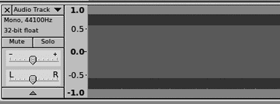

图 11-2. 3,999 Hz 正弦波可能的样子


图 11-3. 极端放大下的 3,999 Hz 正弦波

点击**播放**按钮来欣赏您的新正弦波音调。

## 生成音调的频率范围

你新生成的音调的可选频率范围理论上是你项目采样率的一半。例如，如果你的项目频率是 8,000 Hz，那么你的音调可选范围应该是 0 到 3,999 Hz。但你的可用范围略小。当你看到的是静音或脉冲波形而不是漂亮的稳定波形时，你就知道你处于范围的极限端。图 11-4 图 展示了使用 8,000 Hz、16,000 Hz 和 32,000 Hz 采样率（从上到下）创建的 3,999 Hz 正弦波。图 11-5 展示了当你放大查看时它们的外观以及它们在更高采样率下看起来更加平滑。

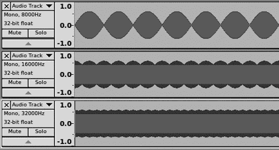

图 11-4. 在三个不同的项目采样率下，3,999 Hz 正弦波的外观


图 11-5. 这显示了在更高的采样率下波形如何平滑。

## DTMF 音调

使用 **生成** > **DTMF 音调** 效果很有趣，因为你可以用它来播放任何单词或文本字符串的 DTMF 音调。你可能会问，什么是 DTMF 音调？那些是由模拟按键电话发出的音调：*双音多频*。它被称为双音，因为每个按键发送的音调是两个音调的组合。这张方便的表格来自 图 11-6），从维基百科（经许可）中摘取，显示了按键电话的音调矩阵。

图 11-7 展示了 DTMF 音调发生器对话框。DTMF 序列是一个单词、短语或任何字母数字字符串。音调/静音比控制每个音调之间空间的持续时间。


图 11-6. 模拟电话音调是每个按键的两个音调组合。 (图片由维基百科提供，根据创意共享署名-相同方式共享许可。)


图 11-7. DTMF 音调发生器播放任何单词或短语。

图 11-8 显示了“carla”在 DTMF 中的样子。

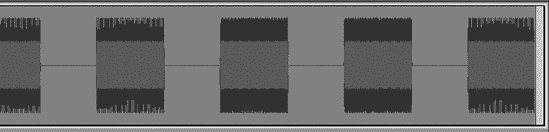

图 11-8. DTMF 波形拼写“carla”

## 振荡

**生成** > **振荡** 效果是另一个有趣的音调生成器。使用这个功能可以生成听起来像滑哨声的音调。选择一个低频和一个高频以及持续时间，音调将根据频率顺序上下滑动。你可以尝试不同的波形类型来听它们的声音：正弦波、方波（别名或无别名）、或锯齿波。插值设置提供线性或对数两种选项。线性为所有频率提供相等的时间，而对数则让低频播放更长时间(图 11-9).

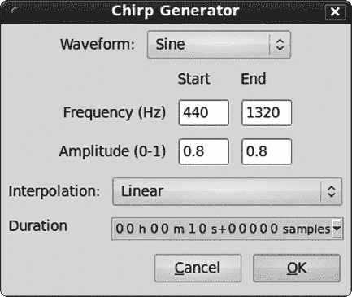

图 11-9. 振荡音听起来像滑哨声。

## 生成噪声

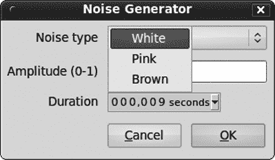

图 11-10. 生成 > 噪声有三个选项：噪声类型、幅度和持续时间。

**生成** > **噪声** 菜单项用于生成白色、粉红色或棕色噪声。你可能会问，为什么要这样做呢？我远远没有足够的知识去深入数学，而数学是声学的基础，如果你有兴趣学习，那是非常迷人的。我可以回答“为什么”：用于测试音频设备，配置音乐厅中的声音平衡，创建背景噪声以帮助睡眠或集中注意力，以及掩盖令人烦恼的声音。图 11-10 显示了 Audacity 的简单噪声生成器。

*白噪声*常用于电子音乐制作，因为它具有穿透其他噪声的有用特性。它被称为白噪声，因为它与白光类似，白光是所有光频率的等量组合。白噪声是所有可听音频频率的组合，所以可以这样理解：20,000 个音调同时以相同的幅度播放。然而，这并不完全准确，因为它通常是由随机噪声发生器生成的，其中所有频率都是等可能的，而不是同时播放。人耳对高频更敏感，所以尽管所有频率的幅度相同，但我们更注意高频。白噪声听起来像蒸汽嘶嘶声。

*粉红噪声*听起来与白噪声相似，但不同频率的振幅并不相同，随着频率的升高，它以每八度 3 分贝的速度下降，每个八度都有相同的振幅。因此，低频比高频有更多的能量，粉红噪声听起来更像咆哮而不是嘶嘶声。

*布朗噪声*也被称为红噪声。它被称为布朗噪声是因为布朗运动，而不是颜色，如果你对此感兴趣，我将把它留作你的家庭作业去发现原因。（更多数学。）随着频率的增加，布朗噪声的振幅以每八度 6 分贝的速度减小，因此它比粉红噪声有更多的低音强调。粉红噪声和布朗噪声在频率范围内感知振幅的方式比白噪声更接近人耳。

图 11-11 显示了在 Audacity 中白噪声、粉红噪声和布朗噪声的外观。底部三个轨道在频谱视图中，这为你提供了不同频率相对能量（振幅）的清晰图像。红色代表“更热”，即更高的振幅，蓝色代表“更冷”，即较低的振幅。这就像光谱一样，光谱的红色端更热，蓝色更冷。如果图像是彩色的，你会看到白噪声频谱是均匀的，粉红噪声频谱从红色到带有蓝色的红色，从红色到蓝色的范围在布朗噪声频谱图中更为明显。当然，你可以在 Audacity 中轻松创建这些并看到颜色。

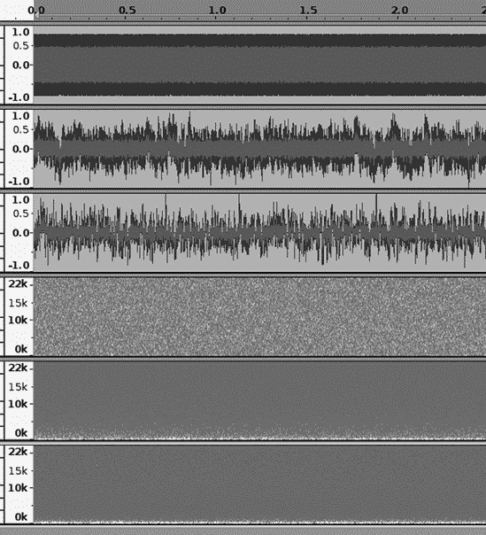

图 11-11。前三个轨道显示了线性波形中的白噪声、粉红噪声和布朗噪声。第二组三个轨道显示了它们的频谱视图。

Audacity 不支持几种其他类型的“噪声颜色”，除非你找到或编写一个插件。紫色噪声是布朗噪声的对立面，因为振幅随着频率的增加以每八度 6 分贝的速度增加。蓝色噪声是粉红噪声的对立面：振幅以每八度 3 分贝的速度增加。

我们在这本书中多次使用了**生成** > **静音**。它创建了一个完全静音的间隔，持续时间为你想要的任何长度。这对于对齐略微错位的轨道、平衡两位演讲者的播客间距，以及确保歌曲之间的间隔绝对安静非常有用。它还有助于测试你的播放系统实际上有多安静。

## 测试音调

选择**生成** > **音调**是一种测试你便宜（或好）声卡极限和给自己进行即兴听力测试的有趣方式。你可以使用*正弦*、*方形*、*锯齿波*或*方形，无混叠*波形来创建音调。放大到极致，以查看像在关于波形的书籍和文章中看到的那样查看波形（图 11-12）。


图 11-12. 正方形、锯齿波和正弦波

可以将正弦波视为没有谐波的单纯音调，所以当你想要一个纯净的音调时，你想要一个正弦波。正弦波平滑地从正值（高于中值，或零线）变为负值（低于中值线）然后再回到正值。更复杂的音调可以通过正弦波的组合来表示。正弦波无处不在：海浪、Slinky、交流电和光波只是几个例子。在音频中，正弦波代表*频率*，以*赫兹*（每秒周期数）衡量，*幅度*（响度或音量），和*相位*。图 11-13 显示了在 Audacity 中它们看起来是什么样子。

你可以将相位理解为 Audacity 的时间移动工具；当相位不为零时，这意味着波形在时间上被向前或向后移动。负值表示向后移动，正值表示向前移动。这被称为*线性相位*，因为所有频率都受到同等影响。有时我们不会注意到线性相位的变化，因为没有东西可以与之比较。一个例子是播放 CD——音乐在通过数字到音频转换器时会有轻微的延迟，但我们并不在意，因为我们没有注意到。另一方面，这对于叠加录音来说是一个真正的问题，因为新轨道将与旧轨道不同步，因此我们必须对此进行补偿。（参见第九章了解更多关于叠加录音和同步的信息。）

两个相对于彼此故意相位偏移的波形将创造出新的声音。一个常见的效果是通过复制音频轨道并稍微使两个轨道不同步来创建令人愉悦的回声。现在你知道了过度制作商业人声的秘密：他们使用了过多的相位偏移层。（如果你喜欢回声，尝试选择**效果** > **回声**。）


图 11-13. 顶部轨迹是 100 Hz 的正弦波，第二轨迹是 1,000 Hz，展示了不同频率的形状。两者具有相同的振幅。第三轨迹是顶部两个轨迹振幅的一半，第四轨迹是第三轨迹的一个轻微相位偏移的副本。

*相位偏移*也描述了两个或更多波形之间的同步。两个完全同相的波形会组合振幅，听起来更响亮。两个波形在相位上有所不同的组合会产生各种不同的声音。两个相对于彼此倒置 180 度的相同波形会相互抵消。降噪设备就是通过不同程度的这种方式来实现这一点的。

*方波*波形与数字电子有关。（方波有时也被称为 Rademacher 函数。）与漂亮的平滑曲线的模拟正弦波不同，方波表示数字电路的瞬间转换。就像所有数字一样，它完全是二进制的——一或零，开或关。与代表没有谐波的纯音的正弦波不同，方波充满了谐波。当你在 Audacity 中创建正弦波和方波并在它们之间进行比较时，你可以听到明显的区别。方波只包含奇数整数谐波，如第一、第三和第五谐波。

一个*方波，无混叠*波形是数字音频中混叠引起的失真的绝佳演示。将相同频率和持续时间的方波和（无混叠）方波并排放置并放大。你会看到类似图 11-14 的东西，当你听它们时，应该有一个可听见的差异，无混叠的波形听起来更平滑、更纯净。这也是体验不同采样率效果的好方法；你会注意到较低的采样率有更高的失真。


图 11-14. 顶部波形是混叠的，底部波形则不是。

*锯齿波*波形既有偶次谐波也有奇次谐波，因此它被用于合成复杂的音乐声音，如弦乐器。

## 点击轨迹

点击音轨效果是一个有用的插件，可能不会随 Audacity 默认安装一起提供（有关查找和安装更多插件的信息，请参阅本章末尾的 Linux 插件和 Windows 插件）。它适用于 Linux、Mac 和 Windows。点击音轨类似于节拍器音轨，有一个区别：每个小节的第一个节拍是强调的（图 11-15

图 11-15. 点击音轨效果在可配置的速度、持续时间和音调品质下创建节拍音轨。

不同的点击类型有 *ping*、*noise* 和 *tick*。噪声点击共振设置使它们听起来更清晰或更糊，数值越高越清晰。

点击音轨使用两种不同的默认音调：中音 C 以上的 C 音对于每个小节的第一个节拍，由 MIDI 数字 72 表示，以及中音 C 对于每个小节剩余的节拍，由 MIDI 数字 60 表示。例如，如果你选择华尔兹节奏，每个小节有三拍，你会听到“TICK tick tick TICK tick tick”。每个八度有 12 个音符，包括降调和升调。图 11-16 是一个方便的表格，列出了所有 MIDI 音符数字。


图 11-16. 选择点击音轨 MIDI 音高的便捷 MIDI 音符表

### 注

为了好玩，唱一下《音乐之声》中的“Do Re Mi”歌曲来刷新你对七个全音符的记忆——do、re、mi、fa、so、la、ti、do。（如果你忘记了，这涵盖了从 A 到 A 的一整个八度加上一个音符：A、B、C、D、E、F、G、A。）

## 拨弦

另一个有趣的附加插件是拨弦。它相当简单：选择你的 MIDI 音符，设置持续时间，并配置渐变或突然消失。96 这个高音符听起来像老式幻灯片放映中的滑动前进音调。（20 世纪 60 年代的学校，在上个千年之前……）低频音符听起来像科幻音效（图 11-17

图 11-17. 拨弦效应产生不同频率的音调，具有短或长渐变消失。

## Risset 鼓

Risset 鼓效果产生了一种很好的音调，在低频时听起来像深沉的低音鼓，或者任何有丰满音色的大型共鸣鼓，而在高频时听起来像牛铃或三角铁(图 11-18)。


图 11-18. Risset 鼓效果

Risset 鼓效果是以发明者 Jean-Claude Risset 命名的，Jean-Claude，他使用电子音频创造了许多惊人的效果。一个 Risset 模式创造出一种节奏倒置的错觉：当节奏实际上在减少时，它听起来像是在增加，反之亦然。Risset 节奏给人一种节奏始终在加速，即使它保持相同的错觉。

这是一个用于创建 2/4 或 4/4 打击乐节奏的好效果。我在图 11-18 中使用的设置在每秒两个节拍处创建了一个深沉、轰鸣的低音鼓点。衰减值设置节拍的长度，因此 0.5 表示每秒两个节拍。这只会产生一个节拍，所以你可以通过点击 shift-Play 预览一个稳定重复的节拍听起来会怎样。当你觉得足够时，点击**停止**按钮。当你准备好创建鼓点轨时，选择节拍然后点击**效果** > **重复**来创建循环。这会打开一个对话框，其中有一个选项：你想让它重复多少次。它甚至为你做算术，并告诉你它会运行多长时间(图 11-19)。

图 11-20 显示了你的新鼓轨将看起来是什么样子。


图 11-19. 使用重复效果循环 Risset 鼓点以创建鼓轨


图 11-20. 使用 Risset 鼓和重复效果创建的鼓轨

如果你创建的节奏不太准确怎么办？使用“改变节奏”效果很容易解决这个问题，它可以在不改变音高的情况下改变节奏。首先撤销重复效果，这样你就可以回到原始的单个鼓点。然后点击“效果”>“改变节奏”并输入你的新每分钟节拍值。在图 11-21 中，它从每分钟 120 个节拍变为 150 个。但当然它仍然只是一个节拍，所以回到“效果”>“重复”并再次创建一个循环，这就是你的新、更快的鼓点音轨。

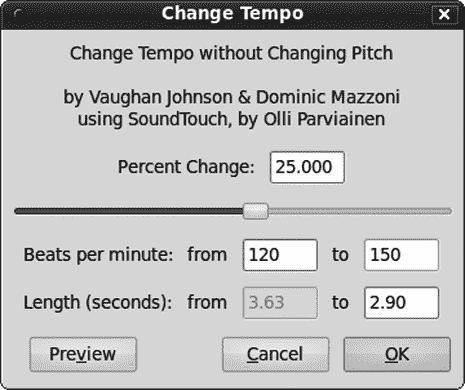

图 11-21。使用“改变节奏”效果在不改变音高的情况下改变节奏。

最好改变你原始的单个节拍的节奏，因为将“改变节奏”效果应用于整个循环音轨将改变每个节拍开始的位置，大多数节拍都会偏离节奏。尽管这可能会很有趣，但使用与否取决于你。

# 效果菜单

“效果”菜单中的效果不会创建新的音调，而是修改现有的音调。掌握“效果”菜单插件的一个好方法是将其应用于在“生成”菜单中创建的音调。正弦波非常适合进行效果实验，因为它是一个简单的音调，你可以清楚地听到效果的作用。另一个好的测试音调是你自己的说话或唱歌声音的简单录音。

### 注意

注意“效果”菜单顶部的“重复最后一个效果”（ctrl-R）命令。这是一个快速重新应用相同效果并保持相同设置的方法。

## 混响

在音频编辑中，最流行的效果可能是**混响**。你可能听过商业音乐录音，其中混响太浓，听起来像歌手被层层混响压垮，或者像录音是在一个空游泳池中制作的。一点混响就能走得很远。混响的通常目的是更好地模拟现场声音，但当然你可以做任何你喜欢的事情。混响可以听起来空灵而遥远，并能唤起半遗忘的事物。

Audacity 的 Gverb 插件是跨平台的，并有一个预览按钮，因此你可以轻松尝试不同的设置。你应该在监听扬声器上预览混响设置，而不是耳机，因为耳机中的通道分离会减弱混响效果。

### 注意

Audacity 的默认预览时间是三秒；你可以在“编辑”>“首选项”>“播放”对话框中更改此设置。

有几种方法可以将混响应用到你的音频轨道上。一种常见的技术是从一个副本湿轨道而不是原始未修改的干轨道开始工作。当你对混响调整满意后，将湿轨道与干轨道的副本混合。保留一个原始的 100%干轨道意味着你可以制作具有不同设置的多个混响轨道，并在混音中控制最终结果。

你也可以只编辑一个副本轨道，保留原始轨道以备不时之需。如果你大胆，可以无保护地工作在原始轨道上。Audacity 有几乎无限的撤销功能，所以这并不那么大胆，但坏事情可能会发生，然后你需要额外的工作。

首先选择音频的一部分或整个轨道。要从 Gverb 的中性状态开始，将所有滑块推到最左边（图 11-22

图 11-22. Gverb 所有设置在中性，或无混响

现在你可以尝试设置并听听它们的效果。最明显的变化来自早期反射级和干信号级设置。接下来尝试调整尾音级，保持其值与早期反射级相等或更小，然后尝试改变混响时间。以下是每个设置的作用：

**房间大小**

这应该模拟不同的房间大小（以平方米为单位），它主要作用于早期反射和尾音级。对我来说，它似乎没有做什么；你的体验可能会有所不同。其他混响插件和设备似乎做得更好。

**混响时间**

这控制着混响的持续时间（以秒为单位），较大的值表示更长的持续时间。

**阻尼**

阻尼值越高，混响的强度越低。这模拟了不同的房间大小和表面，如硬表面的小型房间产生明亮的声音，或具有吸音表面的大型房间产生柔和、昏暗的效果。

**输入带宽**

这是一个音调控制，较高的值强调高频，听起来更明亮。

**干信号电平**

这控制着原始信号被改变的程度；0 表示没有改变，-70 表示全部改变。然而，即使在零的情况下，你仍然会听到一些变化。整体音量随着干信号电平的降低而降低，因此你可能需要在应用混响后应用归一化。

**早期反射级**

这模拟了声音在墙壁和家具上的反射。早期反射总是比干信号延迟。

**尾音级**

这控制着混响的强度。如果你将这个值设置得比早期反射级值大，会得到一个有趣的空间感，就像你正在音乐厅外聆听一样。

Audacity 手册建议尝试一些预制设置（[`wiki.audacityteam.org/index.php?title=GVerb`](http://wiki.audacityteam.org/index.php?title=GVerb)），我已在此处复制：

+   **快速修复**

    房间大小：40 m²

    混响时间：4 s

    阻尼：0.9

    输入带宽：0.75

    干信号级别：0 dB

    早期反射级别：-22 dB

    尾部级别：-28 dB

+   **明亮，小大厅**

    房间大小：50 m²

    混响时间：1.5 s

    阻尼：0.1

    输入带宽：0.75

    干信号级别：-1.5 dB

    早期反射级别：-10 dB

    尾部级别：-20 dB

+   **漂亮的大厅效应**

    房间大小：40 m²

    混响时间：20 s

    阻尼：0.50

    输入带宽：0.75

    干信号级别：0 dB

    早期反射级别：-10 dB

    尾部级别：-30 dB

+   **在下水道唱歌**

    房间大小：6 ²

    混响时间：15 s

    阻尼：0.9

    输入带宽：0.1

    干信号级别：-10 dB

    早期反射级别：-10 dB

    尾部级别：-10 dB

+   **教堂的最后一排**

    房间大小：200 m²

    混响时间：9 s

    阻尼：0.7

    输入带宽：0.8

    干信号级别：-20 dB

    早期反射级别：-15 dB

    尾部级别：-8 dB

Freeverb 是一个较老的混响插件，使用起来更简单，而且在我听起来它听起来更好（图 11-23

图 11-23. Freeverb 是另一种混响效果。

如果 Freeverb 没有包含在你的 Audacity 安装中，请访问 SourceForge 上的 Freeverb3 主页以获取源代码和二进制文件（[`freeverb3.sourceforge.net/`](http://freeverb3.sourceforge.net/))）。

现在让我们看看内置的 Audacity 效果插件。

## 放大

我经常使用**效果** > **放大**效果来增加和减少振幅。除非你确实想要这样做，否则不要勾选“允许削波”或超过零，因为任何更大的值都会被削波和失真。增加 3 dB 是双倍，而 1 dB 是我们能感知的最小变化。输入一个负值，例如-3 dB，以降低振幅。放大可以应用于选择、整个轨道或一组轨道。

## 自动鸭

这是一种非常适合带有背景音乐音轨的录音效果，例如播客，因为它会在前景音轨切入时自动降低音量，并在前景音轨切出时提升音量。在图 11-24 中，我们看到设置：上层是立体声背景音乐音轨，下层单声道音轨是语音音轨。当语音开始时，我希望音乐音量降低，当语音停止时，音乐应恢复到原来的音量水平。它们必须按照这个顺序：背景音轨在上层，*控制音轨*在下层。

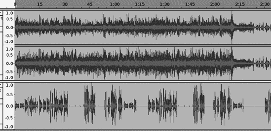

图 11-24. 使用 Auto Duck，背景音轨在上层，前景或控制音轨在下层

选择背景音轨，然后点击**效果** > **Auto Duck**。您将看到一个控制面板，类似于图 11-25 中的面板，它显示了我想使用的设置。这些设置创建了一个快速淡出和一个缓慢淡入。背景音轨快速地让位，并以优雅的方式慢慢滑回，与语音音轨只有一点重叠。

Duck 量是指你希望在背景音轨上减少的音量。

最大暂停时间决定了总的淡入和淡出所需的时间。外淡出长度和外淡入长度值的总和不能超过最大暂停时间值。

外淡出长度设置决定了在控制音轨上的语音恢复之前，背景音轨将如何快速淡出。图表中两条垂直线之外的内容发生在控制音轨低于你的阈值时。内淡出长度设置决定了与控制音轨的重叠程度。

外淡入长度设置控制当控制音轨上的语音停止时，背景音轨恢复的快慢，内淡入长度设置控制重叠。在语音上轻轻上升半秒的音乐并不多；我认为这使过渡变得很棒。图 11-26 显示了应用 Auto Duck 效果后这些音轨的外观。

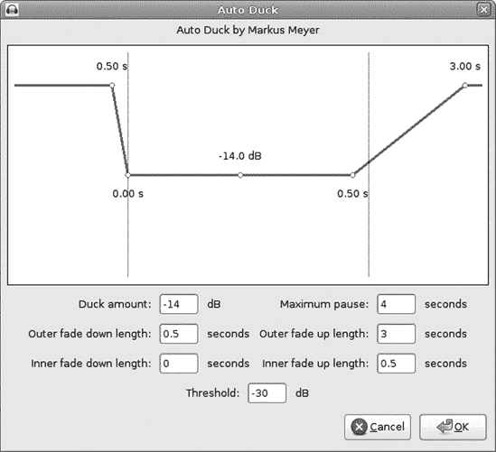

图 11-25. 快速淡出和缓慢淡入的 Auto Duck 设置示例

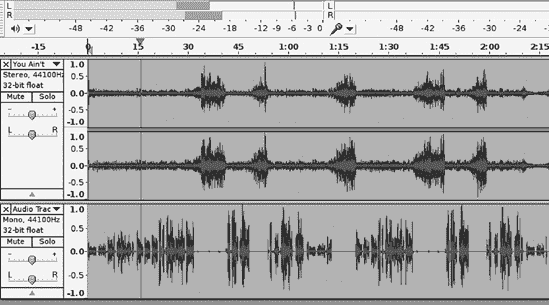

图 11-26. 已应用自动 duck；将其与图 11-24 进行比较。

阈值设置控制触发自动 duck 效果的声音电平。

## 变调

变调会改变音高而不改变节奏，因此您可以在不加快或减慢速度的情况下调整音频的音高。我曾在音调有点不准的音轨上使用过这个效果，它做得很好。变调效果会尽力检测您选择项的当前频率和音高，然后您可以从那里向上或向下调整（图 11-27

图 11-27.  变调效果提供了几种测量音高变化的方法。

## Phaser

使用**效果** > **Phaser**将信号分成两部分（一部分湿音和一部分干音），将您的设置应用于湿音轨道，然后将它们合并回一个。它的主要目的是创建振荡或颤音效果，多亏了现代电子技术的奇迹，您还可以将其应用于多种额外的效果。尝试在您自己的声音录音或纯正弦波上使用它，以了解它能做什么。*相位器*（相位移位器）是一种在所有类型的音乐中都广泛使用的流行效果：用于在电吉他上创建高飞效果，用于美化键盘，以及制造各种太空科幻噪音（图 11-28

图 11-28. 相位器效果创造出多种迷人而诡异的音效，从高飞的人声到外星人。

阶段设置决定了同时使用的过滤器数量，从 2 到 24 个。更高的值会创建一个更复杂、分层的音色，具有多个振荡。

干/湿平衡接受从 0 到 255 的值，其中 0 是完全干音，255 是完全湿音。

LFO 频率是一种*低频振荡*，它创造出脉冲节奏或颤音类型的效应。在相位器对话框中，可用的 LFO 频率范围是从 1 到 40 Hz，或者每秒 1 到 40 个脉冲。增加这个设置的值可以产生戏剧性的效果，这取决于其他设置以及它们之间的相互作用。例如，尝试将 LFO 频率和深度都设置为最大值，看看会发生什么。你知道游泳池中的涟漪是如何扩散开来，反弹到边缘，反弹回来，并相互碰撞的吗？声波也是这样做的，你无法总是预测结果。记住声波是三维的，所以它们无处不在，而不仅仅是像水波那样在一个相对平坦的平面上。


图 11-29. 相位变化是以圆的度数来衡量的。

LFO 起始相位决定了信号的相位变化，从 0 到 359 度。没错，就像一个圆圈。相位变化的程度最容易被通过查看图 11-29 来解释。正弦波在正电压和负电压之间平滑地交替；正电压位于中心线之上，负电压位于中心线之下。波形穿过中心线的位置是*零交叉点*，因为那是电压为零的点。正弦波的起始点是零电压上升到正电压；180 度是零交叉进入负电压。当它从负电压回到零电压时，那是一个完整的 360 度。

你可能还记得本章前面提到的这一点是如何影响你的音频信号的：两个波形在彼此相差 180 度相位时相互抵消，不同程度的相位变化组合起来创造出不同的声音，从简单的回声到奇怪的太空外星人噪音。

你也可以用 Slinky（弹簧圈）三维地展示这一点。没错，Slinky 不仅仅是一个玩具——Slinky 是一个物理教学工具。Slinky 是一个螺旋线，它代表三维空间中的音频相位。Slinky 在纵波中产生涟漪，就像声音一样，在横波中产生像乐器拉伸的弦一样的波形。Slinky 展示了谐波和振幅。Slinky 令人惊叹，研究“Slinky 的物理”将带你进入各种迷人的知识(图 11-30)）。

*深度*通常指的是音调弯曲的程度，从 0 到 255，数值越高，颤音效果越明显。然而，Audacity 的 Phaser 似乎弯曲的是振幅而不是音调，这使得信号快速淡入淡出。将这个值与 Stages 值一起调高，可以得到一些有趣的外星生物声音。

最后，Feedback 是熟悉的失真效果，它增加了沙沙声和质感。百分比越高，失真越明显。将 Dry/Wet 平衡和 Feedback 值调至最大，可以生成一些像老电影中使用的非常奇怪的科幻声音。


图 11-30. Slinky 展示了声波的多项属性。（图片来源：由 Wikipedia 用户 Roger McLassus 创建，发布于 GFDL 许可下。）

## Reverse

Reverse 是一个简单的效果，没有选项——它将你的音频倒放。在 20 世纪 70 年代，当那些不赞成翻唱黑胶唱片以寻找撒旦信息的人时，这会节省他们很多麻烦。无论如何，这都是浪费时间，因为带有恶魔信息的唱片正面播放。

## 滑动时间缩放/音调转换

这是一个有趣的新效果，可以改变节奏或音调，或者两者兼而有之。但不仅如此——它还具有滑动效果，所以你可以从慢到快，从低音到高音，同时进行，也可以反向。我知道，所有这些效果都在精彩的《洛 oney Tunes》和《Merrie Melodies》卡通中做过。但他们不得不通过昂贵设备艰难地完成。

选择动态瞬态锐化复选框似乎会导致动态范围更广，但失真略少。过度使用滑动时间缩放/音调转换将产生失真，而且它是一个耗能大户——在老式慢速电脑上会花费很长时间。

## WahWah

就像名字所说的一样，这会让你的信号发出“哇哇”的声音。也许我很容易被逗乐，但将夸张的 WahWah 效果应用到普通的音乐曲目上每次都能让我捧腹大笑。更严肃地说，WahWah 效果能让乐器听起来像人声。这个效果最著名的应用之一是在 Frampton Comes Alive 专辑中的歌曲“Do You Feel Like We Do。”（承认吧，你仍然拥有那套黑胶双碟，偶尔会拿出来听听。别害羞；这是一张伟大的专辑，Frampton 先生是一位出色的吉他手。）WahWah 的另一个突出应用是在 Steely Dan 的“Haitian Divorce”中，收录于*Royal Scam*专辑，它给主吉他增添了一种讽刺的声音。

WahWah 类似于相位移动。它使用 LFO 来设置每秒的振荡次数，从 0.1 到 4 Hz。没错，从 0.1 到 4，比 Phaser 效果慢得多。

LFO 起始相位和深度与 Phaser 效果的设置类似。


图 11-31。WahWah 效果使乐器“说话”，并在左右声道平衡上玩弄技巧。

共振增强高频；1 是最小效果，10 是最明显。

Wah 频率偏移在较低百分比设置时强调低频，在较高设置时强调高频。如果设置过高，会导致削波（图 11-31）。

WahWah 效果调整立体声轨道左右声道的相位，使轨道听起来像在扬声器之间来回移动。

现在让我们来看看如何在 Linux 和 Windows 中查找和管理 Audacity 插件。

# Linux 插件

在 Linux 中，Audacity 插件有两种类型：LADSPA 和 Nyquist。

## Linux LADSPA 插件

有几个专门针对多媒体制作的 Linux 发行版，例如 64 Studio、dyne:bolic、Planet CCRMA（这是为 Fedora 和 CentOS 提供的特殊软件包集合）和 Ubuntu Studio。安装 LADSPA 插件有两种方式。一种方式是使用您的 Linux 包管理器。64 Studio 包含超过 300 个插件的捆绑包。Debian 和 Ubuntu 将它们拆分为单独的包。以下是 Debian 和 Ubuntu 中的一些 LADSPA 插件包：

+   blepvco（LADSPA 抗混叠、基于 minBLEP、具有硬同步功能的振荡器插件）

+   blop（为 LADSPA 宿主提供的带限 wavetable 振荡器插件）

+   caps（C*音频插件套件）

+   cmt（计算机音乐工具包 LADSPA 插件集合）

+   ladspa-sdk（对用户和开发者有用的 LADPSA 工具）

+   swh-plugins（Steve Harris 的 LADSPA 插件）

+   tap-plugins（Tom 的音频处理 LADSPA 插件）

+   vamp-examples（音频分析插件）

在下载仓库的“声音”部分查找这些插件。通过您喜欢的图形包管理器安装它们，或者使用命令行工具，例如`aptitude`，例如`aptitude install blepvco`，或者您想要的任何包名。

下面是 Planet CCRMA 中的一些插件包：

+   ladspa-blop-plugins（为 LADSPA 宿主提供的带限 wavetable 振荡器插件）

+   ladspa-swh-plugins (Steve Harris 的 LADSPA 插件)

+   ladspa-cmt-plugins（计算机音乐工具包 LADSPA 插件集合）

+   ladspa-mcp-plugins（由 Fons Adriaensen 开发；目前包含一个移相器、一个合唱和一个 moog vcf（电压控制滤波器））

+   ladspa-fil-plugins（四频段参数均衡器）

+   ladspa-rev-plugins（基于 gverb 的混响，以及新功能）

+   ladspa-tap-plugins（Tom 的音频处理 LADSPA 插件）

+   ladspa-vco-plugins（抗混叠 Dirac 脉冲振荡器）

+   ladspa, ladspa-devel（对用户和开发者有用的 LADPSA 工具）

Fedora 有一个图形化软件包管理器，或者您可以从命令行运行 `yum`，例如 `yum install ladspa-blop-plugins`。

您也可以通过简单地将插件复制到 */usr/lib/ladspa/*，这样它们就可以被系统上的所有用户访问，或者复制到您个人的家目录中，例如 */home/carla/.ladspa*，这意味着它们只能由您自己使用。所有 LADSPA 插件都有 *.so* 扩展名，例如 *gong_1424.so*。

LADSPA 代表 Linux 音频开发者简单插件 API。这是一个为编写通用插件而设计的框架，这些插件可以在任何 Linux 音频应用程序中工作，因为它为应用程序开发者提供了一个通用、简单、文档良好的应用程序编程接口 (API)。因此，大量 Linux 音频应用程序支持 LADSPA 插件：Audacity、Ardour、ReZound、Rosegarden、GNU Sound 以及许多其他应用程序。

有几个流行的 LADSPA 插件项目：

+   史蒂夫·哈里斯的插件 ([`www.plugin.org.uk/ladspa-swh/docs/ladspa-swh.html`](http://www.plugin.org.uk/ladspa-swh/docs/ladspa-swh.html))

+   汤姆的音频处理插件 (TAP) ([`www.tap-plugins.sourceforge.net/`](http://www.tap-plugins.sourceforge.net/))

+   CAPS，C* 音频插件套件 ([`www.quitte.de/dsp/caps.html`](http://www.quitte.de/dsp/caps.html))

+   计算机音乐工具包 (CMT) ([`www.ladspa.org/cmt/`](http://www.ladspa.org/cmt/))

自然，这个列表只显示了其中的一小部分；还有更多。

LADSPA 版本 2 (LV2) 是 LADSPA 的继任者。它更易于扩展，更灵活。Audacity 的 Linux 版本从 1.3.6 版本开始支持 LV2。访问 [`www.lv2plug.in/`](http://www.lv2plug.in/) 获取关于 LV2 插件的最新信息，例如史蒂夫·哈里斯的 LV2 插件 ([`www.plugin.org.uk/lv2/`](http://www.plugin.org.uk/lv2/)) 以及其他活跃的 LV2 项目。

您可以通过安装 *ladspa-sdk* 软件包来获取关于各个 LADSPA 插件的详细信息。这是您需要学习的软件包，以编写自己的 LADSPA 插件，它还包括一些用于获取插件信息的实用命令。`listplugins` 会显示您安装的所有插件，如下面的片段所示：

```
$ listplugins

/usr/lib/ladspa/sine.so:
       Sine Oscillator (Freq:audio, Amp:audio) (1044/sine_faaa)
       Sine Oscillator (Freq:audio, Amp:control) (1045/sine_faac)
       Sine Oscillator (Freq:control, Amp:audio) (1046/sine_fcaa)
       Sine Oscillator (Freq:control, Amp:control) (1047/sine_fcac)
/usr/lib/ladspa/noise.so:
       White Noise Source (1050/noise_white)
/usr/lib/ladspa/triangle_1649.so:
       Bandlimited Variable Slope Triangle Oscillator (FASA) (1649/triangle_fasa_oa)
```

`analyseplugin` 提供了关于各个插件的详细信息，例如以下简化的示例：

```
$ analyseplugin gong_1424.so

Plugin Name: "Gong model"
Plugin Label: "gong"
Plugin Unique ID: 1424
Maker: "Steve Harris <steve@plugin.org.uk>"
Copyright: "GPL"
Must Run Real-Time: No
Has activate() Function: Yes
Has deativate() Function: No
Has run_adding() Function: Yes
Environment: Normal or Hard Real-Time
```

## Linux Nyquist 插件

Nyquist 插件也适用于 Linux，并且具有 *.ny* 扩展名。您可以从 Audacity 网站下载一些 ([`www.audacity.sourceforge.net/download/nyquistplugins`](http://www.audacity.sourceforge.net/download/nyquistplugins))，网络搜索还可以找到数百个。通过将它们复制到 */usr/share/audacity/plug-ins/* 以实现系统级使用，或者复制到 *$HOME/.audacity-files/plug-ins* 以保留它们供自己使用来安装这些插件。Nyquist 编程语言 ([`www.audacity.sourceforge.net/help/nyquist`](http://www.audacity.sourceforge.net/help/nyquist)) 是免费且开源的，因此您可以随心所欲地编写和分发自己的 Nyquist 插件。

# Windows 插件

三种插件类型在 Windows 上运行：VST、LADSPA 和 Nyquist。

Steinberg 的虚拟工作室技术(VST)是 Steinberg 为其 Cubase 系列 MIDI 和音频录制和生产软件发明的插件标准。Steinberg 将 VST 许可给第三方开发者，以便他们可以为任何宿主创建 VST 插件；因此，VST 是最广泛使用的插件标准。Audacity 附带了一些基本插件，如 Gverb、Tremolo 和 Vocal Remover。

VST 插件有*.dll*扩展名。Audacity 下载页面([`www.audacity.sourceforge.net/download/plugins`](http://www.audacity.sourceforge.net/download/plugins))提供了更多链接，以及一个已知与 Audacity 兼容的 VST 插件目录。安装这些插件意味着只需将它们复制到*\Program Files\Audacity\Plug-ins*。

你还可以在这个页面上找到在 Windows 上运行的 LADSPA 插件。Nyquist 插件也在 Windows 上运行；再次，只需将它们复制到*\Program Files\Audacity\Plug-ins*。

互联网上充满了音频插件，你可以使用其他音频生产软件附带的插件。

# 音频效果术语表

音频效果有自己的术语，让我们看看你将遇到的一些更常见的术语，与音频插件相关。

**全通滤波器**

一个对所有频率都平等通过并应用相移的滤波器。混响效果使用全通滤波器。

**衰减**

衰减控制声音消失的速度是快还是慢。

**延迟**

这控制着混响的程度和它的声音，是仅仅一个明亮活泼的触摸还是过度处理的泥泞混乱。在古代，这是通过磁带循环和改变录音和播放磁头之间的间距在磁带录音机上完成的。现在你只需要移动一个滑块或输入以秒或秒分数的数值。

**四个基本音频波形**

波形是声音的视觉表示，对音频来说，四个基本的波形是重要的：*正弦波*、*方波*、*锯齿波*和*三角波*。图 11-32 展示了它们并排，归功于维基媒体。它们的形状涉及到各种高级数学，这肯定超出了本书的范围以及我自己的微薄数学知识。这些波形不仅限于音频，还用于许多学科，如数学、物理、电子工程以及各种信号处理。

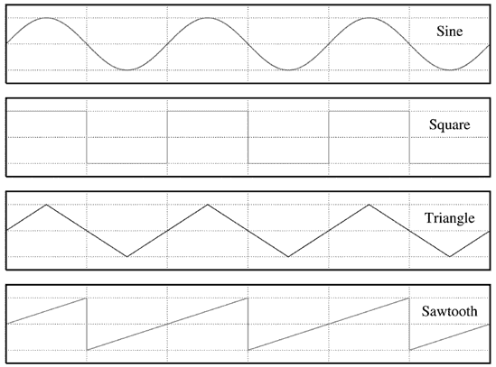

图 11-32. 四个基本波形

**谐波**

谐波可以被认为是泛音，尽管一些教科书说它们并不相同，然后使用大量的高级数学来展示为什么。我们将保持在这个训练轮级别：当你在一台乐器上弹奏一个音符时，这就是*基频*。这个音符可能还伴随着谐波，这些是基频的整数倍的其他音符。所以，100Hz 的基频可以有 200Hz、300Hz、400Hz 等谐波。这些按顺序编号：基频、2、3、4，等等。方波只包含奇数谐波，而锯齿波则包含偶数和奇数。

保留较宽的频率范围（由采样率控制）的一个原因是为了保留谐波，因为即使你听不到完整的频率范围，你也能听到谐波。缩小频率范围会损失你听到的范围内的某些谐波。

**高通滤波器**

这允许高频无改变地通过，同时衰减低于*截止点*的较低频率。所以，你可以使用这个来降低低沉的低音或不平衡的中频频率。

**低通滤波器**

这允许低频无改变地通过，并衰减高于你设置的*截止点*的高频。使用这个来降低录音中听起来太亮的高频或存在如磁带或唱针嘶嘶声等噪音。

低通滤波器也用于高保真电子设备中，将低频声音路由到低音炮或能够处理它们的任何扬声器。

**混响**

混响是最常用的效果之一；它试图模拟我们像在音乐厅或舞台表演中听到的现场声音。混响是回声，或声音反射，它们发生得太快，以至于无法单独感知。这就是给音乐作品带来“现场”感的原因：当我们参加现场表演时，音乐会从我们周围无数表面上反射。录音室通常是一个故意“死寂”的环境，因此没有自然混响。所以，混响被应用于录音以使其生动并使其听起来更真实。在现场表演中，它被用来创造更大的、更宽敞的声音。你无法控制你表演的地方的声学效果，但你可以通过你的电子设备做很多事情来克服不良声学效果，并调整你的声音以模拟不同的环境。

**刚度**

这试图复制不同刚度水平下物理物体的声音，例如木管乐器簧片、钹和锣。

**湿/干平衡**

一个*干*信号还没有应用任何特殊效果；应用效果后，音频信号变为*湿*。大多数插件和硬件特殊效果混音器只允许成比例的调整；如果你的湿平衡是 45%，那么你的干平衡是 55%。
