# 第十二章. 修复和清理


Audacity 有许多工具可以修复缺陷和清理录音。我一直在说，你最好的方法就是尽可能制作最干净的录音，因为这比修复它们要容易得多。没有电视犯罪节目中的魔法；你可以做的事情有限。

然而，你可以做很多事情来解决问题，所以我们将在这章中学习如何做到这一点。（如果你需要复习，第一章涵盖了 Audacity 的基本使用方法，第二章则深入介绍了如何建立一个简单的录音室。）

# 拆分立体声轨道

通常情况下，立体声轨道中只有一半会有缺陷。因此，你应该将轨道拆分（在轨道菜单中选择“拆分立体声轨道”），独立地对每个轨道进行修复，然后从轨道菜单中选择“制作立体声轨道”将它们重新连接。这样，好的那一半就能帮助掩盖不完美的修复。

# 重复上次效果

注意效果菜单顶部的“重复上次效果”（ctrl-R）命令。这是一个快速重复应用相同效果和设置的方法。效果菜单有点不方便，因为当你点击“确定”时，效果就会消失，所以当你需要重复使用相同的效果时，每次都要再次浏览整个菜单，这会变得有些繁琐。

# 噪音消除

没有像电视犯罪实验室技术人员使用的魔杖那样神奇的好莱坞魔法棒，他们从受损的低质量录音中清理出来，分离出所有不同的元素，并神奇地从背景中隔离出坏人的声音指纹……或者匹配逃跑车辆的引擎噪音的精确波形，识别出品牌和型号，从脚步声的声音中识别出罕见的定制鞋子，或者电视编剧想出的其他任何奇妙的事情。事实并非如此。试图在单个轨道上分离多个声音就像试图分解一杯混合饮料一样；一旦所有东西都混合在一起，实际上就没有实用的方法可以再次分离它们。噪音消除总是与其副作用妥协，这就是为什么录音室使用多轨录音机在隔音室中录音——因为获得干净的录音总是比试图清理脏录音要好。

然而，有时不想要的噪声会悄悄混入，你无法享受重新录制的机会。当噪声明显不同于你想要保留的内容，并且你有纯噪声样本来构建噪声配置文件时，Audacity 的降噪效果工作得相当好。一个常见的例子是黑胶唱片专辑的唱针嘶嘶声或转盘嗡嗡声。这些很容易清理：首先选择仅包含嘶嘶声或嗡嗡声的部分，然后点击**效果** > **降噪** > **获取配置文件**以创建噪声的配置文件。确保只选择噪声，并且尽可能长，最长可达 30 秒。即使是 5 到 10 秒的配置文件也可以工作，但较长的配置文件更准确。当 Audacity 完成构建配置文件后，降噪面板将消失。

下一步是选择你想要修复的音轨部分，选择**效果** > **降噪**，然后点击**确定**。最好尽可能精确地应用降噪，因为它会改变你的录音。除非你特意去听，否则差异可能不明显，但它确实会对你想要保留的部分产生可感知的变化。

如果你不喜欢结果，按 ctrl-Z 撤销，更改一些设置，然后再次尝试。默认的降噪级别是-24 dB，这意味着被识别为噪声的频率衰减了-24 dB。如果这移除了录音中的太多内容，请设置更高的分贝值，例如-20 dB，然后再次尝试。一个经常有效减少不良副作用的方法是回到你的噪声样本，降低其幅度几 dB，创建一个新的配置文件，然后再次尝试。你很可能无法完全消除噪声，因为这样做可能会消除你想要保留的内容，但你可以将噪声降低到不那么明显的地方。

频率平滑滑块在较小值时更为精确，并且当你将滑块向右移动以设置较大值时，它会影响更宽频率范围。先尝试较小的值，因为它们会影响你录音的较少部分。

攻击/衰减时间滑块决定了降噪效果对音频信号变化的响应速度。对于相对稳定的噪声，使用较大的值。如果噪声快速波动，则使用较小的值以获得更快的响应时间（图 12-1）。


图 12-1. 这显示了某些温和的降噪设置：被识别为噪声的频率降低了 19 dB，频率平滑较窄，攻击和衰减时间适中慢。

# 标准化

归一化效果(**效果** > **归一化**)是许多数字录音室的工作马，因为它通常会将录音的峰值设置为-12 dB 或更低，有时甚至低至-24 dB。归一化通常是导出前的最后一步，将你的录音提升到更高的峰值音量水平。数字音频具有如此广泛的动态范围，你可以保守地记录到峰值水平以避免失真，然后稍后归一化你的轨道，将峰值水平提升到舒适的播放水平。

归一化也被用来将多个轨道提升到相同的峰值音量水平。如果你想保留不同轨道的相对音量水平，不要使用归一化。例如，如果你有一个峰值在-6 dB 的轨道和另一个峰值在-12 dB 的轨道，并且你想保持 6 dB 的分布，不要使用归一化；使用放大。使用放大，你可以将它们提升或降低一定的量，例如+3 dB，这将使它们分别提升到-3 dB 和-9 dB。但如果你想将两个轨道都提升到-3 dB 的峰值，那么归一化就是这项工作的工具。

总是勾选“移除任何直流偏移”，因为直流偏移不是你想要保留的东西。如果有任何直流偏移，这表明你的平均幅度不是零。一点偏移没什么大不了的，但如果偏移很大，它会破坏你的动态范围，甚至可能造成一些失真(图 12-2)。

*直流偏移*是*从零开始的直流偏移*的简称。直流最初意味着直流电，但现在它适用于表示任何类型信号的任何波形。图 12-3 显示了前后对比：顶部的轨道是原始的、未归一化的轨道，带有一点直流偏移，底部的轨道是归一化且没有直流偏移。

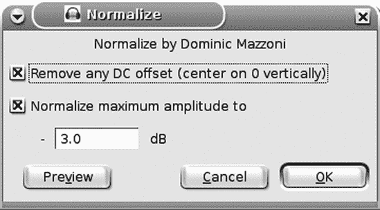

图 12-2. 总是检查“移除任何直流偏移”和“将最大幅度归一化到”并设置最大分贝值为零或更低。


图 12-3. 前后对比：顶部是未归一化的轨道上有一点直流偏移；底部是校正后的直流偏移和归一化

# 移除点击和划痕

Audacity 提供了几种快速清理黑胶唱片刮擦录音的方法。数字录音也可能从各种来源捕捉到点击声。其中之一是点击消除：它不如手动修复刮擦可靠，但速度快，效果相当不错。

## 点击消除

点击消除效果（图 12-4

图 12-4. 点击消除效果只需两个设置。

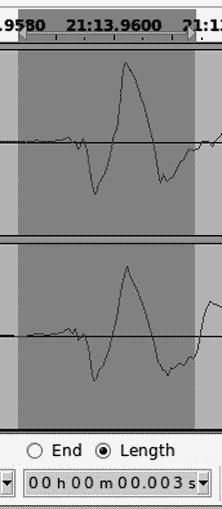

图 12-5. 这里是一个小于 3 毫秒的点击声。

要了解使用最大尖峰宽度值，首先将选择工具栏上的选择开始值设置为长度，并将时间参数设置为 hh:mm:ss + 毫秒。然后放大波形中的点击声并选择它，你将得到它的长度（毫秒）。最大尖峰宽度应该足够大，以便包括点击声两边的良好音频样本，这样它就会有足够的良好音频进行比较。图 12-5 显示了一个小于 3 毫秒的尖峰。我通常坚持使用默认的 20 毫秒，这通常能给出良好的结果。

响亮、明显的刮擦是最容易处理的。点击消除效果不太擅长处理轻微、沙沙的静电部分；噪声消除效果更适合这种情况。点击消除速度快，效果相当不错，但不是百分之百准确，它可能会将打击乐效果误认为是刮擦。

## 修复

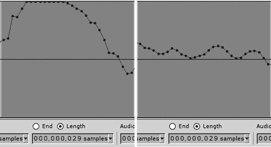

图 12-6. 使用修复效果平滑处理的一个简短的剪辑段

修复效果是我修复划痕的首选工具。它必须手动应用，一次修复一个划痕，但它做得很好。放大直到您可以精确选择不超过 128 个样本的区域，然后选择**效果** > **修复**。它将删除选择并使用插值来平滑填补空隙。这是一个适用于所有类型的外科修复工具：点击声、划痕、爆裂声和短剪辑段。显示了剪辑段修复前后的对比。

## 绘图工具

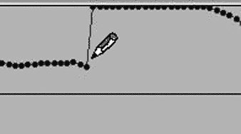

图 12-7. 使用绘图工具平滑点击声

绘图工具（工具栏）让您在样本级别上对修复拥有终极控制权。首先放大足够，以便看到单个音频样本。光标变为一个小铅笔，然后您可以使用它来平滑缺陷的轮廓，使其不那么明显。声音本身并没有改变，因为您只是让它变得更安静，正如图 12-7 所示。

# 截断静音

如果您有一段较长的录音，您想通过几分钟来修剪，而不丢失任何音频呢？也许您有一段有很多静音的录音，您想修剪。歌曲之间的停顿太长，您的深思被长时间的停顿所打断，或者您有一个带有大量静音的声激活录音。截断静音效果将自动找到并缩短这些静音间隔。

在您创建了淡入和淡出之后，不要使用截断静音效果，因为它会破坏它们。


图 12-8. 截断静音的这些设置寻找超过 800 毫秒的静音段落，然后将任何-40 dB 或更低的静音缩短到 800 毫秒。

**效果** > **截断静音**有四个设置：最小静音时长、最大静音时长、静音压缩和静音阈值。使用此效果最简单的方法是将最小和最大时长设置为相同的值，并调整您的阈值，以便它只捕捉到静音段落。在图 12-8,任何超过 800 毫秒长的静音段落（-40 dB 或更低）将被缩短到 800 毫秒。（1,000 毫秒等于 1 秒。）

不要将最大静音持续时间设置为零，因为它可能会崩溃或执行一些不可预测的行为。我发现最可靠的值是 5 毫秒，尽管有些人将其降低到 1 毫秒。如果你根本不想有静音，你将不得不手动删除它们，尽管对我来说，1 毫秒的效果和零一样好。

静音阈值告诉它使用什么阈值来标记静音段落开始的地方。当静音段落真正静音时，-35 dB 或-40 dB 的值效果很好；当它们像黑胶唱片那样嘈杂，歌曲之间有唱针噪音或转盘嗡嗡声时，你可能需要将其提高到-25 dB。

静音压缩设置配置了一个比率，而不是静音持续时间的固定长度，这样你的静音长度就会变化。你可能想使用它来保留说话声音的自然节奏，或者使现场表演听起来更真实。假设你的最小持续时间是 100 毫秒，最大持续时间是 5,000 毫秒。如果你将静音压缩设置为 4:1，那么 10 秒的静音将减少到 2 秒。结果将根据你的最大持续时间和最长静音之间的差异而变化。为了得到可预测的结果，你可以使用截断静音将最长静音缩短到你想要的任何最大值，然后再次使用静音压缩应用它。

# 改变节奏

改变节奏效果是一个很好的小修复工具，当你混合多个轨道且其中任何一个的节奏略有偏差时。它改变节奏而不改变音调。你可以将其应用于选择、整个轨道或多个轨道。有几种方法可以接近这个问题。一种是通过试错；只是调整百分比变化设置，直到听起来正确。有些人有很好的耳朵，可以快速做到这一点。你还可以设置每分钟节拍数（BPM）。如果你的其他轨道遵循已知的 BPM，则使用此设置。如果你不知道正确的 BPM，播放一分钟正确节奏的轨道并数节拍。我用秒表做这件事，当没有人打扰我并打断我的计数时，效果很好。

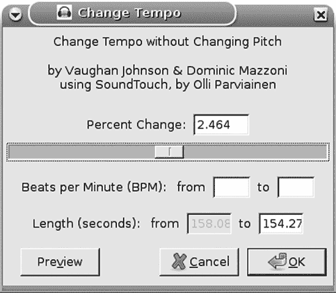

图 12-9. 改变节奏提供了三种校正节奏的方法，以及一个预览按钮。

最后，有一个以秒为单位的长度设置。如果你确切知道你的轨道或选择应该有多长，这是一个快速且简单的方法来正确设置它（图 12-9）。

# 改变音调

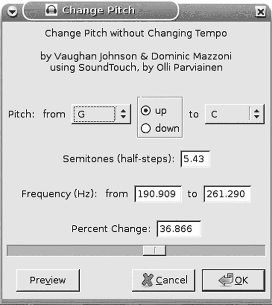

图 12-10. 改变音调会改变音调而不改变节奏。

这项功能在不改变节奏的情况下改变音调，因此当表演者走音时，它是一个很好的修复方法。你可以将其应用于选择、整个轨道或多个轨道。如图图 12-10 所示，它提供了几种不同的设置：你可以改变调性，例如从 A 调到 C 调，或者通过半音（半步）、精确频率或百分比。如果你有很好的耳朵，百分比变化滑块和预览按钮可能最快。

你如何精确测量音调？改变音调效果尽可能地接近，尽管使用电子调音器可以获得更高的精度。

# 改变速度

我相信改变速度效果有许多实际应用，但我似乎总是用它来娱乐，因为它会同时改变节奏和音调，就像玩转盘速度一样。所以，你可以加快音频的速度来播放得又快又高，就像过度摄入咖啡因的阿尔文和芯片鼠，或者像著名的男低音歌剧演员塞缪尔·拉梅伊在服用镇静剂时那样低沉缓慢。它支持标准的转盘速度 33 1/3、45 和 78 RPM，以及通过滑块或输入百分比值的任意速度范围（图 12-11）。

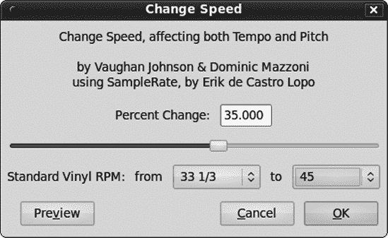

图 12-11. 改变速度同时改变音调和节奏。

# 压缩动态范围

这是一个动态范围压缩器，不要与文件压缩混淆。动态范围压缩通常被认为是“使响亮的部分更安静，使安静的部分更响亮。”大多数压缩器仅降低增益；通过衰减响亮的部分来缩小动态范围，从而减少柔和和响亮部分之间的范围。它在商业录音中被过度使用和滥用，这很遗憾，因为当它被谨慎且目的明确地使用时，它是一个有用的效果。我的偏好是尽可能少地使用压缩，因为我认为许多使用压缩完成的“修复”在录音过程中，使用放大或归一化效果，或者使用包络工具处理会更好。

你可以使用压缩来改善录音的平衡，通过减少应该处于背景且不吸引注意力的轨道的动态范围。对音量变化进行一些压缩以使其平稳，并可能降低它们的整体音量，从而使它们成为优秀的配角。你可以为不同的播放设备和环境定制录音。你可以对整个录音或单个轨道或轨道的部分应用压缩。

例如，如果你想在嘈杂的环境中播放背景音乐，压缩其动态范围会使它更容易听，因为你会有一个更一致的音量水平，而不是有意外的高峰和难以听到的段落穿插。一个由多人说话的播客将受益于仔细的音量控制和压缩，尤其是当你记录那些不习惯对着麦克风说话且说话音量不一致的人时。对于这种录音，手动调整幅度直到尽可能一致（包络工具对此非常适用）并然后对最终混音应用一些仔细的压缩以进行最后的润色会得到最佳结果。调整声音轨道可能需要相当多的技巧，因为有些声音即使不是很大听起来也会很响。你还应该考虑到你的听众可能如何收听你的录音——如果他们在工作或戴着耳机听，或者听一些旨在帮助他们入睡的东西，那么请友好地对待他们，不要用音量的突然峰值吓到他们。

压缩可以平滑由不熟练的表演者或当天状态不佳的表演者引起的音量不均匀。例如，你的贝斯手累了，有些音符弹得太重，有些又不够重。或者你的歌手麦克风技术不好，移动太多，所以她时隐时现。也许你有一个需要从混音中脱颖而出的歌手或其他独奏者，因此对他们的轨道应用一些仔细的压缩然后增加幅度会将他们推到前面。

大多数压缩器会使你的选择变得更安静，所以你可能需要在应用压缩后使用放大或归一化效果。

### 注意

保守地应用动态范围压缩，因为当它过度使用时，可能会产生风箱效应，音量以规律的速度上升和下降。另一个副作用是提高你的噪声水平，因为噪声在较安静的段落中相对更响。还有一个副作用是更强调背景声音，例如观众噪声。过多的压缩可能会引入失真。

## 动态范围是多少？

那么，当你对录音应用动态范围压缩时，应该追求什么样的动态范围呢？明确的答案是“这取决于。”首先让我们谈谈可能性和我们听到的，然后我们将看看各种情况下的示例。

人类的听觉可以感知大约 120 dB 的范围。数字音频中最大的实际动态范围大约是 115 dB。CD 的动态范围大约是 96 dB。黑胶 LP 可以提供高达 60 dB。一场现场交响乐可能涵盖 80 dB。大多数人的舒适听音范围可能比这窄，大约在 20 到 30 dB 之间，这仍然是一个相当宽的范围。对你来说，可能需要一些尝试和错误。我个人的经验法则是，在理想的听音条件下，在家中使用我的优质立体声高保真音响，没有干扰或有人与我交谈时，我感到 50 dB 的动态范围就足够了。而且那是在我想要听戏剧性的歌剧或交响乐或喧闹的现场摇滚表演的时候。大多数时候，我更喜欢稍微安静一些的东西。

有时候，当你缩小动态范围时，你会在熟悉的录音中听到新事物，因为这样“提升了”安静的部分。（这全都是相对的；降低较大频率的增益会使较安静的部分听起来更响。）你可能会听到脚步敲击钢琴或鼓踏板，表演者低声嘟囔，安静部分有更多的细微差别——除非你亲自尝试，否则你不会知道。

你可以在 Audacity 中轻松实验，通过录制一个简单的测试文件，然后使用**效果** > **放大**来设置不同的 dB 级别，以获得不同的动态范围感。图 12-12(Figure 12-12)展示了这样一个简单的录音，从-50 dB 开始，每个 10 秒的片段比前一个片段响 10 dB，直到达到最大值 0。


图 12-12. A simple dynamic range test: Starting at -50 dB, each 10-second segment is 10 dB louder.

现代流行音乐通常被压缩到一个 5 dB 或更小的范围，在峰值幅度或以上，这对好音乐来说是一件糟糕的事情。在许多现代录音和重新制作的老录音中，动态范围非常窄，就像把一切都推到红线一样。没有安静的部分，没有细微差别，也没有对比；它只是一片响亮。这破坏了细微差别和风味。这样做的原因是简单和愚蠢的完美结合——当我们听到不同音量的两段录音时，我们的第一印象倾向于认为更响亮的那段听起来更好。这也被用来在广播、电视或公共场所播放时使曲目脱颖而出。但这样做已经不再有效了，因为大家都这么做。

最终结果是压缩录音的生命力。它是听觉垃圾食品——当然，那块巧克力棒或薯片的第一次咬下去，或者你特别喜欢的任何美味，是非常好的。但你不能只靠垃圾食品生活，很快就会变得令人不满意。过度压缩也是如此；第一次印象可能是一“越响越好！”但听了几分钟后，大多数人会改变主意，更喜欢经过更好制作的录音。即使你没有意识到录音已经被压缩得毫无希望，你也可能会感到疲劳，厌倦听音乐。在网络上搜索*响度战争*会返回很多有趣的信息。

你可以通过从音乐 CD 中提取一首歌曲，将其导入 Audacity 中，并查看波形来看到这一点并听到这一点。图 12-13 展示了 Rickie Lee Jones 的《杂志》的选段；将其与任何 Top 40 当代 CD 进行比较。“杂志”是一部值得在优质音响系统上仔细聆听的杰作，你可以在波形中看到它没有被压缩成无用的极小动态范围，也没有所有级别都被推到最大。事实上，它离红线还差得远。我更喜欢那些假设我知道如何使用音量旋钮的录音。

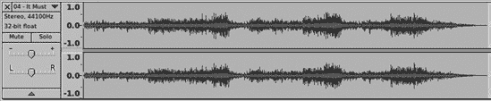

图 12-13. 《杂志》，由 Rickie Lee Jones 创作，具有一些实际的动态范围。注意峰值远非零，波形中最安静和最响亮的部分之间有相当大的分布。

我不会给出任何糟糕的例子，因为我太胆小而不想指责别人，但你可以通过快速的网络搜索找到很多，也许在你的音乐收藏中也能找到。这是那个老掉牙的底线竞争，是质量与艺术对抗迎合最低共同点的熟悉战斗。在这个现代时代，那就是在小型、低音质的便携式设备和电脑扬声器上播放的低音质 MP3，以及带有糟糕的功率低音单元的响亮系统，对音乐的影响就像辣椒酱对食物一样——一点可以增加标点符号和对比度；大量使用会杀死所有的风味和乐趣，将其变成一种攻击行为。

动态范围压缩滥用的一个更糟糕的例子是电视广告。据说它们不允许比节目更响亮，但它们通过完全没有动态范围，将所有内容推到最大值来规避这一点。（我认为它们也很响。）

## 压缩器设置


图 12-14. Audacity 的压缩器效果简单，只有几个设置。

关于世界现状的抱怨已经足够了。让我们打开**效果** > **压缩器**，了解不同的设置是如何工作的（图 12-14)。大多数时候，使用压缩分为两步：应用压缩器，然后将压缩段的音量级别提升到你想要的位置。

这是一个只有四个设置的简单压缩器。专业人士使用昂贵的硬件压缩器，而 Audacity 的压缩器在能力上并不完全匹配这些压缩器。但它的效果已经足够好，可以完成基本的压缩任务。

阈值设置决定了音频信号衰减的起始点，以分贝为单位。-50 dB 的阈值意味着所有幅度为-50 dB 及以上的信号部分都将被衰减。在大多数录音中，这将是所有内容。通常你不想压缩所有内容；轻触并针对特定目的进行调整可以获得更好的效果。

噪声门限设置将增益保持在噪声门限设置以下音频的恒定水平。如果你的音轨有很多安静的部分，这可以防止它们被放大。

比率设置决定了将应用多少压缩。4:1 的比率意味着比阈值高 4 dB 的输入信号将被降低到比阈值高 1 dB。无穷大的比率将所有内容降低到阈值水平。在 Audacity 的压缩器效果中，最大值为 10:1。其他压缩器可以达到 60:1，这在实践中等同于无穷大。压缩器中的图表为你提供了一个很好的视觉展示，显示低比率更为温和，而高比率会导致更大的增益降低。

我的做法仍然是“少即是多”。在 Audacity 中很容易进行实验，并聆听不同设置如何影响你的音频质量。我很少使用压缩，很少超过-20 dB 的阈值或 4:1 的比率。如果我觉得录音需要更多，我会停下来思考它真正需要什么——使用包络工具进行一些细致的调整？重新录音？

攻击时间决定了压缩器达到最大效果的速度，而衰减时间决定了压缩消失所需的时间。攻击时间设置得太短可能会导致一些可闻的失真，而衰减时间设置得太长可能会错过一些短峰。你可以通过不同的攻击时间获得不同的效果。例如，一个较长的攻击时间设置，如 0.5 秒，将不会捕捉并衰减尖锐的鼓点，因此这增加了冲击力。快速的攻击时间会抑制打击乐和其他尖锐峰值。你可能希望为歌手设置最快的攻击时间，即 0.1 秒，除非你试图获得一些不寻常的效果。

较慢的衰减时间可以创建一个长而几乎升腾的淡出效果。这是一种常见的用于延长吉他音符的技术。Audacity 的压缩器在这方面表现中等，可以达到 10 秒。如果你追求自然的声音，较快的衰减时间更好。尝试不同的设置，看看它对不同乐器和人声的影响。例如，一个具有快速攻击时间设置和慢速衰减时间设置的鼓轨听起来会很有趣，几乎像是倒退或回声，因为击打不被允许自然衰减，而是在较高的音量水平上保持更长时间。

压缩的常见副作用是*泵吸和呼吸声*。当你选择一个高的阈值设置并且音轨中有很多变化时，这种情况会发生。压缩器的波动会导致攻击/衰减变得可闻。有时故意这样做很有趣。

有时压缩器会将一些听起来奇怪的碎片附加到你的录音末尾。这是压缩的正常副产品，所以你可以通过在录音末尾填充一些可以删除的内容来处理这个问题，在应用压缩后将其删除。

“压缩后进行 0dB 的增益补偿”如果你本来就要归一化到零，这可以节省一个步骤。

有一个复选框用于“基于峰值压缩”。当此框未选中时，这是默认设置，压缩器会降低高于阈值水平的音量的增益。“基于峰值压缩”会提高高于阈值水平的较安静音量的增益。我认为这听起来不太好；对我来说，它听起来很刺耳，泵吸效果也很难避免。但最终，你得取悦自己的耳朵，而不是我的。

## 克里斯的动态压缩器

另有一个压缩器，克里斯的动态压缩器([`pdf23ds.net/software/dynamic-compressor/`](http://pdf23ds.net/software/dynamic-compressor/))，专门为以令人愉悦的方式压缩古典音乐而定制。我认为它对所有类型的音频都工作得很好，比 Audacity 的内置压缩器效果更好。

作者克里斯·卡佩尔（Chris Capel）写这个压缩器的灵感来自于他在嘈杂的环境中经常听古典音乐。在花费了大量时间调整音量控制，但效果并不理想之后，他决定对他录制的音乐应用一些动态范围压缩是解决问题的方法。但他尝试过的压缩器音质不够好，所以他为自己的 Audacity 编写了自己的 Nyquist 压缩器插件。由于它是一个 Nyquist 插件，它将在 Linux、Mac 和 Windows 上工作；只需下载并将其复制到插件目录中。它将出现在效果菜单中的“Compress dynamics”下。它本身就有很好的说明，如图 12-15 所示。

卡佩尔先生不断更新和改进他的插件，因此你可以通过访问他的网站来保持同步。图 12-15 显示了简单视图。还有一个高级视图，显示了所有选项，如图 12-16 所示。要获取高级视图，打开插件文件*compress.ny*并按照说明操作。这会暴露高级参数攻击和释放速度以及攻击和释放指数。这非常简单，因为你只需要移动几个分号。


图 12-15. 克里斯压缩器的默认简单视图

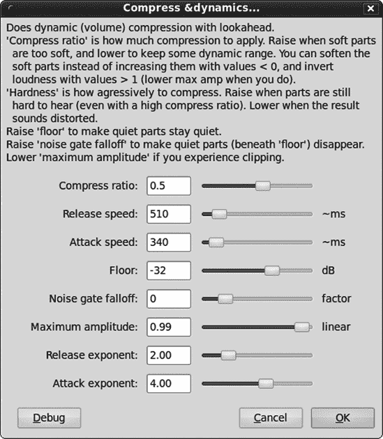

图 12-16. 克里斯压缩器的高级视图，显示所有选项

克里斯的压缩器与众不同的地方在于它能够预判接下来会发生什么，并据此调整增益。大多数压缩器并不这样做，而是对音量变化做出反应，因此总会有一定的延迟。有时这会导致突然降低的响亮峰值，或者更糟糕的是，一些失真。克里斯的压缩器运行更加平稳，能够优雅地处理打击乐和其他响亮瞬态事件。阅读他网页上的评论是值得的，他还包括了一些音频样本。源文件*compress.ny*是一个纯文本文件，包含有用的信息。

克里斯的压缩器是一件很好的作品，让我们来回顾一下它的选项。

压缩比与大多数其他压缩器的压缩比设置不同。它有两种工作方式：*动态压缩*和*动态扩展*。值范围从-0.50 到+1.25。负值使安静频率更安静，这被称为*动态扩展*。正值降低响亮频率的增益，这被称为*动态压缩*。

默认值 0.5 相当不错。它保留了大量的原始动态范围，听起来很自然。根据 Audacity 论坛的一些帖子，0.77 与 NPR 广播电台 KPCC Pasadena 相匹配。因此，如果您想模仿 KPCC Pasadena，现在您知道了如何做。

释放速度类似于 Audacity 压缩器中的衰减时间设置，控制压缩何时逐渐消失。取值以毫秒为单位，因此毫秒数越少，释放速度越快。

攻击速度类似于 Audacity 压缩器中的攻击时间设置，控制压缩何时开始应用，直到达到其峰值比率。如果您的录音有很多快速峰值，您可能希望使用更快的攻击速度来捕捉它们。然而，您可以通过较慢的攻击时间来增加鼓点的冲击力，例如，这样它们就不会被压缩得太多。一般来说，音乐的音量增加比减少要快，因此为了与音乐保持同步，攻击时间应该更快，释放时间应该更慢。

释放和攻击速度的影响比 Audacity 压缩器中的对应设置更为微妙，且不太可能引入典型的压缩失真。

压缩硬度控制压缩和释放的速度，硬度值越高，攻击和释放速度越慢；硬度值越低，攻击和释放速度越快，且更具侵略性。这一设置仅在简化视图中出现，类似于设置释放和攻击速度的快捷方式，但无法单独调整。

地板设置设置了一个地板，或称为*噪声门*；默认值为-32 dB，这意味着低于-32 dB 的内容不会发生变化。使用此设置来定义一个不会改变的低频范围。如果您有一些不希望放大的低级背景噪声，或者您只是不想改变较静音的频率，您可能需要这样做。

噪声门衰减的取值范围是-2 到 10。正值会降低低于地板设置的所有内容的增益，且值越高，降低的增益越大。负值则相反，会提升低于地板设置频率的增益。我通常将其设置为 0，这样就不会产生任何效果，尽管偶尔我也会用它来稍微提升低频。

最大振幅在压缩后提升振幅，因此您可以省略归一化步骤。它不是分贝刻度，因此可能需要一些尝试和错误才能调整正确。（我认为直接应用归一化更容易。）

攻击和释放指数的取值范围是 1 到 6，其中 1 表示不进行任何操作，6 表示进行最大操作。这些设置对您的录音有什么影响？它们与您的攻击速度和释放速度设置协同工作，以控制压缩器的响应速度。Capel 先生建议，默认值 2.00 和 4.00 通常能给出令人满意的结果。

克里斯的压缩器在您关闭 Audacity 后不会记住您的最后设置，而是恢复到*compress.ny*中的默认值。如果您找到了一些您更喜欢的新设置，您可以通过编辑*compress.ny*来使这些设置成为默认值。以下是一些在文件中出现的设置：

```
;control compress-ratio "Compress ratio" real "" .5 -.5 1.25
;control floor "Floor" real "dB" -32 -96 0
```

前面的数字是默认值，后面的数字集合是最小和最大值。所以如果您更喜欢将压缩比默认设置为 0.6，将地板设置默认为-25，您可以这样更改它们：

```
;control compress-ratio "Compress ratio" real "" .6 -.5 1.25
;control floor "Floor" real "dB" -25 -96 0
```

## 均衡器


图 12-17. 这里是在中等设置下的均衡器效果：中等程度的均衡，它减少了响亮的部分并放大了安静的部分，以及-20 dB 的噪声阈值，这非常保守。

均衡器效果是一种动态范围压缩器，它减少了响亮频率并放大了安静频率（图 12-17). 仔细手动调整振幅、压缩和归一化可以得到比使用均衡器效果更好的结果。均衡器简单快捷，但应用更高程度的均衡时也会引入明显的失真。为什么使用它？因为它快且简单。它在有声读物录音上听起来相当不错，在铃声上效果最佳。对于铃声，尝试中等程度的均衡和-40 dB 的噪声阈值设置。这将使整个波形变得平坦，因此在小型手机扬声器上听起来更丰富、更饱满。

# 均衡

均衡器让您可以根据频率控制振幅。与我们都习惯的普通低音-中音-高音控制不同，均衡器效果就像拥有几乎无限的音调控制。

### 注意

在较便宜的播放设备上的现代音调控制趋势是取消低音-中音-高音旋钮，并用预设如摇滚、古典、爵士和现场音乐来代替。我讨厌这些。我想要可以调节的旋钮，该死的，而不是有限功能的廉价微芯片，它们包含了一些人对好声音的有限理解。

均衡器效果有有用的预设选项和许多自定义调整选项。它为旧式黑胶和乙酸酯唱片预设了均衡器校正曲线，例如 1938 年和 1947 年的 RCA，哥伦比亚 LP 和 78，德卡，以及其他一些唱片。1955 年之前的录音没有遵循任何行业标准；只有那时，RIAA 均衡器曲线才被广泛使用，并最终成为行业标准。

均衡曲线的发明是为了克服黑胶和乙酸酯录音的物理限制，因为低频在唱片上占据更多的物理空间。如果不应用均衡曲线，录音将会非常短，唱片上大部分是低音纹路，高音几乎无法察觉。为了补偿，低频被衰减，高频被放大到未经校正的信号听起来很尖锐，几乎没有中音或低音。

### 注意

当你播放唱片时，你可以通过将耳朵靠近唱针来听到未经校正的信号。

你的唱机设备通过应用均衡校正来补偿这一点，这与原始均衡曲线正好相反：低频被放大，高频被衰减。这就是为什么唱机需要特殊的唱机前置放大器。行业范围内采用 RIAA 曲线意味着所有唱机设备都可以应用相同的均衡校正。

对于当代的 LP 和 45 转速唱片，你只需要一个标准的唱机前置放大器。这是你高保真放大器或计算机录音接口上的唱机插孔。对于老式唱片或对现代黑胶进行定制调整，你可以使用标准的非唱机前置放大器来获取未经校正的信号，然后使用均衡效果应用适当的均衡曲线。或者根据你的口味进行定制。一旦你调整出一个令你满意的定制曲线，就可以使用“另存为”按钮来保存它。

尝试一些均衡预设以获得不同的效果。例如，有些人喜欢那种古老的 AM 广播声音，现在你可以通过*amradio*曲线轻松地复制它。图 12-18 展示了它的样子，正如你所见，一定是怀旧情绪驱使人们对那种古老的 AM 广播声音情有独钟，因为它丢弃了 100 Hz 到 6,800 Hz 范围之外的所有内容。


图 12-18. 许多人都喜爱的 AM 广播声音是一个非常压缩的均衡曲线。

均衡化窗口默认打开较小，你可能想要将其拉长和加宽以扩展刻度并为自己留出一些工作空间。左侧的滑块允许你放大你想要工作的分贝范围。图 12-19 显示了绘制曲线视图，而图 12-20 显示了图形均衡器视图。绘制曲线为你提供了 120 dB 的动态范围来操作，而图形均衡器则限制在 20 dB。如果你搞砸了并想要重新开始，点击**平坦**按钮。


图 12-19. 均衡化效果的绘制曲线视图，左侧为分贝刻度，底部为频率刻度

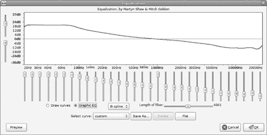

图 12-20. 带有类似硬件均衡器的滑块的图形均衡器视图

使用绘制曲线与使用包络工具类似。点击蓝色线条创建一个控制点，然后拖动控制点。将其拖出框架外以移除它。控制点可以在任何方向上移动。


图 12-21. 你可以使用键盘进行精确增量移动滑块，并将光标悬停在旋钮上显示确切值。

图形均衡器滑块可以通过几种不同的方式移动。你可以用鼠标抓住它们。你可以点击滑块旋钮的上方或下方，这将首先移动 8 dB，然后以 4 dB 的增量移动。使用箭头键每次移动 1 dB，而 shift-click 则移动 0.1 dB。将光标悬停在旋钮上会显示你的精确频率和 dB 值(图 12-21)。

当你在绘制曲线视图中时，线性频率刻度设置将刻度从默认的对数视图更改为线性视图。当你想要更详细地查看低频时使用对数视图，当你想要所有频率都均匀表示时使用线性视图。对数视图更接近我们实际感知声音的方式。

图表中有两条彩色线条：一条粗蓝线和一条细绿线。蓝线是您可以操作的线条，绿线显示实际的均衡曲线。如果它们分离，那是因为您试图使曲线过于陡峭。要么调整您的曲线，要么尝试更大的滤波器长度。这控制了 Audacity 一次操作多少个样本。默认值 4,001 在大多数情况下应该工作得很好。较小的值会产生更平滑的曲线，可能听起来更好，尽管您需要敏锐的耳朵和良好的设备才能听到差异。

您可以将音量超过 0，深入到+dB 范围，这是可以的，因为这与音轨波形中的刻度不同。它显示了您应用了多少分贝的增益（或衰减）。例如，RIAA 曲线对 20 到 40 Hz 范围应用了近 19 dB 的增益，没有不良影响。但您仍然必须小心不要通过过高而造成失真，只有通过试验和错误才能在特定录音中找到这一点。在您正在工作的音轨上点击**查看** > **显示削波**，可以快速查看是否过度了，因为这将用红色条标记任何削波。

# 修复时间和延迟错误

当您使用时间移动工具时，音轨很容易变得不同步。假设您的音轨都乱七八糟的，您想将它们全部重置为零开始。选择所有音轨，然后选择**音轨** > **对齐音轨** > **对齐音轨一起**。然后选择**音轨** > **对齐音轨** > **与零对齐**。您还可以选择**音轨** > **对齐音轨** > **与光标对齐**，以将它们对齐到任意任意点。

如果您启用了链接音轨，这会通过一个按下的链接音轨按钮来指示，这种方法将不起作用。链接音轨可能不在您的 Audacity 版本中；查看第一章中的工具按钮表以了解更多信息。

时间移动工具是一种快速便捷的方法，可以将音轨或剪辑在时间上向前或向后移动。只需在工具栏中点击时间移动按钮，光标就会变成一个双水平箭头；然后向右或向左拖动您的音轨或剪辑。您还可以将剪辑拖动到其他音轨上。

另一种移动音轨或剪辑精确数量的方法是在其前面添加静音。在您想要静音开始的位置点击，选择**生成** > **静音**；输入秒数、毫秒数、样本数或帧数；然后点击**确定**。这将使音轨向右移动，就像在时间上向后移动一样。

当您进行叠加录音时，延迟总是一个问题。Audacity 会自动对叠加的音轨进行时间移动以补偿延迟。默认的延迟校正值是-130 毫秒，这可能不适合您的系统。您可以在**编辑** > **首选项** > **录音** > **延迟校正**对话框中调整延迟校正值。

您如何知道正确的延迟校正值？一种方法是试错法。一种更精确的方法是使用回环电缆。您需要一个电缆将您的播放输出连接到您的录音输入。在内置声卡上，这很容易——线路输出到录音输入。对于其他录音接口，如 USB 或 FireWire，您必须找到正确的电缆类型，并整理您的输出和输入。

然后将延迟校正设置为 0。确保选择工具栏上的“对齐到”复选框未勾选。选择选择工具栏上的长度单选按钮，并将时间参数设置为 hh:mm:ss + 毫秒。

接下来，生成一个 60 秒长，每秒 180 拍子的节拍器轨道。

然后在传输菜单中，勾选“叠加”复选框，在设备工具栏上选择播放和录音设备，并按下**录音**按钮。你应该会看到类似图 12-22 的内容。

当您完成录音后，放大直到您可以选择顶部轨道上的点击和底部轨道上相应的延迟点击之间的间隙。如果您不习惯使用鼠标，请使用 shift 和箭头键标记选择。（使用箭头键前后左右上下移动，并使用 shift 和箭头键选择。）您将看到类似图 12-23 的内容。这显示延迟为 177 毫秒，这相当多。

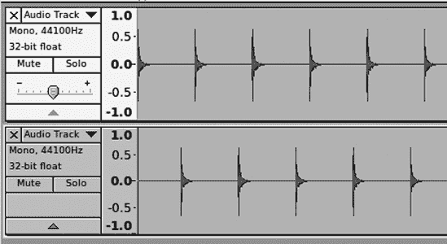

图 12-22. 生成回环叠加以进行良好的延迟校正测量


图 12-23. 测量点击轨道上两次点击之间的延迟

如果您更改了录音接口，您应该重复延迟测试，因为不同的设备有不同的延迟。

# 分析菜单

分析菜单包含分析您音频的工具。我将介绍其中两个我认为相当有用的工具，频谱图和静音查找器。

频谱图会生成一个漂亮的彩色图表，显示不同频率的振幅。它有各种各样的算法和函数可供选择。我忽略这些中的大多数，并使用汉宁窗口、频谱算法和 512 或 1024 大小。较小的 Size 值显示更多细节。对我来说有意义的选项是轴。轴提供了对数或线性视图的标准选择。当我使用频谱图时，我寻找明显的指标，而不是分子大小的差异。

Plot Spectrum 的一个实用用途是测量你的环境噪声。你可以在 Audacity 主窗口的输入电平表上获得你的环境噪声水平的大致概念，但 Plot Spectrum 提供了更多的信息。像往常一样设置你的麦克风，然后选择**传输** > **定时录音**来录制 20 秒的样本。Plot Spectrum 一次只分析 23.8 秒，所以你甚至可以将定时器设置为录制 23.8 秒。图 12-24 显示了环境噪声录音的图表；将光标悬停在任何点上会显示确切的频率、音符以及光标和最近的峰值处的分贝，这些显示在频率刻度下方。

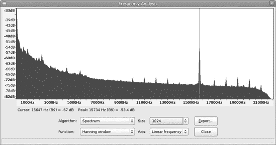

图 12-24. 环境噪声的频谱图显示了背景噪声覆盖了从 43 Hz 到 22,000 Hz 的广泛频率范围，从-32 dB 到-82 dB，最低频率的声音最响。

图 12-24 中的峰值表明存在某种规律性噪声，注意最响的部分都在最低频率。记住，这是按频率测量振幅，而不是时间，所以不要像读波形图那样读它。它显示的是哪些频率最响。由于最低频率的声音最响，我可以切换到对数视图来更详细地查看低频部分(图 12-25)。

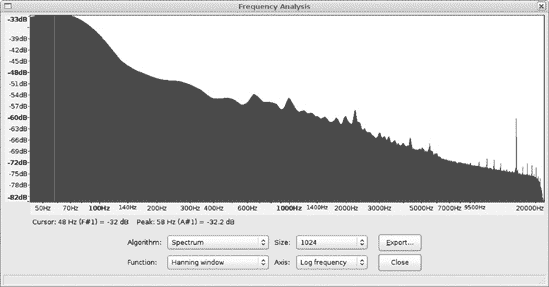

图 12-25. 对数视图显示了更低频率的更详细情况。

任何超过-40 dB 的声音在录音中都可能被察觉，现在我知道要寻找低频噪声的来源。结果发现是客厅音响的低音炮。一个相当好的目标是-50 dB，而-60 dB 则能确保你的录音中不会有背景噪声。

“绘制频谱”的另一个良好用途是更精确地了解您打算应用压缩的录音的动态范围。读取您最高峰值和最低谷值，然后您将有一些实际数字来帮助您确定要使用的阈值。一个好的起点是取平均值：如果您的最高峰值是-5 dB，最低值是-35 dB，那么尝试一个-20 dB 的阈值设置。您的耳朵会告诉您什么有效；这只是为了给您一个合理的起点。

生成不同频率的正弦波可能会有所帮助，以便熟悉阅读“绘制频谱”图表，并尝试不同的算法和窗口。图 12-26(图 12-26. 这个“纯净”的 8,000 Hz 正弦波实际上包括了 6,000 到 10,000 Hz 的频率，并且随着振幅的增加，频率范围变窄。)显示了 0.8 振幅的 8,000 Hz 正弦波的样子。

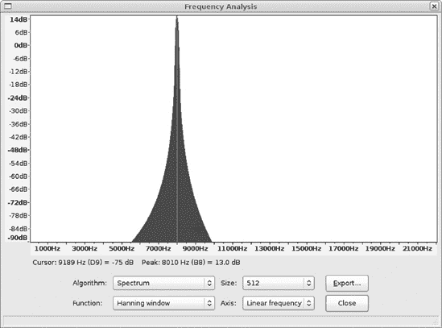

图 12-26. 这个“纯净”的 8,000 Hz 正弦波实际上包括了 6,000 到 10,000 Hz 的频率，并且随着振幅的增加，频率范围变窄。

如您所见，我们的“纯净”音波并不那么纯净，频率范围从 6,000 Hz 到 10,000 Hz。随着振幅的增加，频率范围变窄，从-48 dB 的 7,500 Hz 到 8,500 Hz，到 0 dB 的 7,800 Hz 到 8,100 Hz。

当您在单个音轨上有许多歌曲，并希望找到歌曲的静音部分并自动创建标签时，Silence Finder 可能很有用。然后您可以选择**导出** > **多个**来将音轨拆分为单个歌曲。如果您想使用歌曲名称作为标签，您仍然需要自己输入。如果静音不干净且定义不明确，则效果不佳。例如，当您将黑胶唱片转换为 CD 时，Silence Finder 将是一个节省时间的实用工具，但黑胶唱片在歌曲静音部分通常有足够的噪音，可能会使其混淆。

您可以使用“绘制频谱”来了解歌曲中的静音部分音量水平，然后通过更少的尝试和错误将低于此水平的音频设置为静音值。这里有一个有趣的小技巧：不要输入负号，因为这看起来是自动应用的（图 12-27）。


图 12-27. Silence Finder 的一些示例设置
