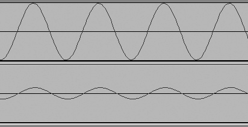

# 附录 B. 术语表

# A–E

**ADC/DAC**

模拟/数字转换器，数字/模拟转换器。模拟声音，如歌手或乐器的声音，被转换成数字形式以进行录音和编辑，然后转换回模拟形式进行播放。CD 播放器是一个 DAC。你的电脑声卡是一个 ADC/DAC。ADC 是一件关键设备。一个好的 ADC 可以进行良好的干净准确的转换，不会引入噪声。差的 ADC 声音奇怪，并增加噪声。有些设计是为了添加一些色彩，例如模仿某些经典的管状放大器或旧时的录音风格。

**振幅**

振幅，就声音而言，可以被视为*压力*；压力越大，声音越响。它也被描述为*强度*或*能量*。你可以在波形中看到振幅，例如图 B-1。更高的峰值意味着更大的振幅。这两条音轨都是使用**生成** > **音调**对话框创建的 1,000 Hz 正弦波。上面的音轨振幅为 1.0，下面的音轨振幅为 0.2。这两个音调除了振幅外完全相同。

图 B-1. 两个振幅不同的相同正弦波

这是一种物理压力，你可以在某些条件下体验到。例如，当低音炮音量足够大时，你可以看到其圆锥体跳动，当你把手放在它前面时，你可以感觉到空气的流动。（而且数英里外的人也可以“享受”听它。）比尔·奈伊《科学小子》有一个很酷的特技，他用自制的声波炮熄灭蜡烛。一声巨大的声音爆炸会使水面产生涟漪。

声波炮已经以多种创造性的方式进行了测试，例如被用作非致命的警察武器来驱散人群。理论上，足够强大的声音冲击波在正确的频率下会震破耳膜。在较低功率水平，并且正确的频率下，它将产生恶心和不适以及紧张的感觉。

**环境，环境声音**

来自你周围环境的任何声音。环境声音增加了色彩和能量，例如人群噪音、树木中的鸟鸣和风声，或者在特殊地点（如露天剧场或古老的教堂）录制的特殊音质。环境声音也可能是不愉快的，如交通噪音和狗吠声。

**模拟孔**

娱乐行业发明的一个可怕的恶魔，它展示了对于技术和客户服务的基本误解。数字媒体播放器必须将音频和视频转换为模拟形式，这样我们才能听到和看到它们；这就是从你的扬声器中出来的，就是你电视上看到的内容。如果我们能看到它，它就可以被拍照，如果我们能听到它，麦克风也可以。当然，以这种方式制作副本会导致质量较低的副本，但它表明没有通过技术手段防止复制的方法。该行业努力“关闭模拟孔”的努力导致了受损的家庭娱乐接收器，这些接收器向模拟输出发送故意降级的信号，或者禁用了模拟输出。这种损害不会区分你有权以任何方式使用的媒体，比如你的 DVD 上的家庭电影和自制的音乐 CD，以及他们试图“保护”的大规模生产的垃圾。

无论如何都是徒劳的，因为所有形式的复制保护最终都会被破解，然后你可以轻易地制作出完美的数字副本。

**比特深度**

控制动态范围、信噪比以及整体保真度和准确性。更宽的动态范围会导致更高的信噪比，这通常也被称为更低的*噪声地板*。换句话说，你得到更多你想要的声音，而你的设备引入的噪声更少。在过去的磁带录音时代，总是有磁带嘶嘶声和来自磁带机的某些噪声。在黑胶 LP 唱片上，有来自乙烯基缺陷和唱机嗡嗡声的噪声。在数字音频中，噪声来自你的电子设备；好的电子设备被描述为提供干净的声音，没有任何引入的噪声。

音频制作的常见比特深度是 16 位、24 位、32 位和 32 位浮点。更大的比特深度会导致更准确、更忠实的从模拟转换。

比特深度与*采样率*密切相关。你的模拟-数字转换器“采样”音频信号，每秒进行多次采样。例如，CD 质量是每秒 44,100 次的 16 位采样率。每个单独的样本被赋予一个 16 位的二进制值。转换为十进制，每个样本等于或小于 65,535（0–65,535）。

24 位深度有 0–16,777,216 个可能值，32 位有 0–4,294,967,295 个。请注意，这些是无符号整数值。例如，32 位浮点数是一个 24 位的尾数加上一个 8 位的指数。Audacity 和许多其他音频录制应用程序以及 DAW 内部使用 32 位浮点，因为浮点小数点允许非常高的精度，并创造了各种额外的空间，这样你就可以以各种方式操作你的音频文件，而不会降低它们的质量。

16 位深度的潜在动态范围为 96 分贝；24 位，144 分贝；32 位，192 分贝。音频硬件的硬限制约为 115 分贝。32 位浮点数的潜在动态范围约为 1,500 分贝，这意味着极低的噪声地板和极低的削波潜力。

在 Audacity 的一些配置对话框中，位深度被称为*采样格式*。位深度是正确的术语。

**通道**

任何信号的单一路径。例如，一个单声道麦克风插入单声道输入是一个输入通道。一个立体声信号路由到两个扬声器有两个播放通道。具有离散 5.1 环绕声的音乐系统有六个播放通道。如果你将 10 个表演者插入到一个混音器中，然后将该混音器插入到一个单声道通道中，尽管整个乐队都在其中录音，但这仍然是一个输入通道。

许多环绕声接收器可以从立体声录音中模拟多声道环绕声。这并不是离散多声道环绕声，而是简单的双声道立体声。

**削波**

当数字音频信号超过 0 dBFS 时，它将被截断到你所记录的位深度的最大值。这听起来可能相当糟糕，因此避免削波在数字音频中非常重要。

**交叉淡入淡出**

这是一个既好又常见的效果：淡出与淡入重叠。Audacity 没有交叉淡入淡出效果，但使用包络和时间移动工具很容易创建交叉淡入淡出。你需要两个轨道：手动在一个轨道上创建淡出，在另一个轨道上创建淡入，然后使用时间移动工具调整重叠程度。

**数字音频工作站（DAW**）

数字音频工作站，这是一种组合录音机和混音器的设备。这可以是一个独立的硬件设备，也可以是计算机上的软件应用程序或套件。

**dBFS（分贝相对于全量程**）

相对于全量程的分贝；参见分贝。

**分贝**

分贝用于衡量振幅，即声音的响度。1 分贝等于 1/10 贝尔，贝尔是以亚历山大·格拉汉姆·贝尔的名字命名的。分贝也用于测量电压和信号强度。

在音频中，分贝不是一个绝对测量值，而是我们正在测量的声音与任意参考水平之间的比率。我们能感知到的最小变化约为 1 分贝。3 分贝的提升大约是两倍响度，而 3 分贝的降低大约是半倍响度。声音的强度或振幅并不与我们对响度的感知成正比。响度是一种心理声学反应，声音强度增加约 10 倍才能使其听起来响度加倍。

在数字音频中，我们使用*相对于全量程的分贝*，缩写为 dBFS。0 是我们能到达而不削波的最大响度，数字音频的 dB 值以负数表示。

你可能会看到表格显示从人能听到的最微弱的耳语，即零分贝，到痛阈，通常表示为 120 分贝的各种声音的分贝水平。这些不是我们在数字音频中使用的 dBFS 刻度，而是 dBA 刻度，它通常用于测量环境和工业噪音。

**离散**

这里的“离散”是指分开的，而不是“细致”的意思，即能够闭上嘴巴。大多数立体声系统有两个离散的播放通道，而离散 5.1 环绕声意味着六个分开的播放通道。有时 5.1 环绕声是从立体声轨道模拟的，所以这并不是离散的 5.1 环绕声。

**下混音**

将多个音频轨道合并成更少的轨道，例如将六个轨道下混音成双声道立体声。

**下采样**

转换为较低的采样率。例如，CD 音频必须是 16 位/ 44,100 Hz 的采样率，所以 48 kHz 的音频文件必须下采样到 44.1 kHz。重采样可能会损害音频质量，所以你越少重采样音频文件越好。从主文件中重采样一次以导出不同的音频文件格式是可以的；如果你对重采样的文件再次进行重采样，你可能会听到差异。

**DRM**

数字版权管理，或数字限制管理，这取决于你的观点。DRM 是各种旨在防止非法复制受版权保护媒体的保护技术。

# F–J

**频率**

声音频率以赫兹（Hz）为单位测量，即每秒的周期数，或者一个完整的声波在一秒内通过一个给定点的时长。高频产生更高音调的音。赫兹的缩写为 Hz。千赫兹是 kHz，兆赫兹是 MHz，吉赫兹是 GHz。88 键钢琴上最高的音符是 C8，频率为 4,186 Hz，或 4.186 kHz。吉尼斯世界纪录保持者，人类声音产生最低音符的罗杰·梅尼斯，唱出了 0.393 Hz 的 F-sharp 音符。没错，不到 1 赫兹，远超过 88 键钢琴键盘上最低的 A0 音符，其频率为 27.5 Hz。

图 B-2 展示了两个振幅相同但频率不同的正弦波。顶部的波形是 100 赫兹，底部的是 1,000 赫兹。

图 B-2. 相同振幅但频率不同的两个正弦波。

### 注意

梅尼斯先生为赢得吉尼斯世界纪录而录制的官方录音是吉尼斯公司的“财产”，因此他不能使用他自己的声音的这段录音。

**基频**

几乎所有声音都是复杂的，具有多个频率。当你吹小号或弹吉他时，每个音符都有多个谐波频率，那么哪个是音符呢？它是最低频率；这就是我们所说的**音高**，这就是我们调整乐器的原因。音高是主观的而不是客观的；音高是我们感知到的音符。通常来说，很容易说，“那个音符是中 C”，或者 C 下面的 A，或者 F#，或者诸如此类。

但对于某些乐器来说，检测音高并不那么容易。例如，当你敲击钹或铜锣时，你能挑出一个明显的音符吗？对于大多数钹和铜锣，泛音和谐波非常复杂，以至于你无法分辨。

**谐波频率**

谐波频率是基频的倍数。例如，当基频为 100 Hz 时，第一谐波频率是 200 Hz，第二谐波频率是 300 Hz，以此类推。

**赫兹**

见频率。

**高 Z，低 Z**

见阻抗。

**热插拔**

在电源开启时插拔电子设备。通常这并不是一个好主意，因为它可能会发出很大的噼啪声，甚至造成损坏，因此养成一个良好的习惯是在连接或断开任何东西之前总是关闭设备的电源。

**阻抗**

阻抗是电气电阻。简而言之，无论你连接什么音频硬件，都要始终匹配你的阻抗。

你需要特别注意麦克风阻抗。低阻抗更好：600 欧姆或以下。中等阻抗是 600 到 10,000 欧姆，高阻抗是 10,000 欧姆以上。一些高端麦克风支持多个阻抗等级，并具有开关来选择你想要使用的阻抗。当你看到 High-Z 和 Low-Z 时，这是高阻抗和低阻抗的简称。但这些都是不精确的，因此最好知道你的确切阻抗值。

高阻抗麦克风通常是质量较低的麦克风，并且在较长的电缆传输中会损失信号强度。如果你不能精确匹配阻抗，请将麦克风连接到具有相同或更高阻抗的输入。如果你反其道而行之，你会损失信号强度。尽管如此，不匹配的麦克风和输入阻抗不会造成严重的问题，尽管你可能会经历信号强度下降和音频质量降低。

**线匹配变压器**是一种有用的设备，用于连接具有不匹配阻抗的设备并将它们转换为匹配。

**知识产权**

一个不精确、误用、无意义的宣传术语。相关的法律术语是**商标**、**版权**和**专利**。

# K–O

**延迟**

拖延，延迟。低延迟对于叠加录音和监控录音会话非常重要。许多因素会影响延迟：你电脑 CPU 的速度，你的操作系统有多简洁，声卡驱动程序，计算机总线（USB、PCI、FireWire），特殊效果处理器，以及其他外设音频设备。

**元数据**

关于数据的资料；一种在文件头中存储有关计算机文件信息的方法。Audacity 有一个元数据编辑器，用于编辑录音会话信息，如艺术家、标题、日期和流派。

**混音**

与*下混*相同。

**重叠录音**

每次制作多轨录音时，只录制几轨。这就是一个人可以一次录制一轨，最终自己录制完整交响乐的方法。许多商业录音都是分块录制的，表演者可能从未在同一录音会上出现，甚至使用的是不同的录音室。在 Audacity 中，您可以录制一个乐器轨，然后在录制第二轨的同时播放它。这种方式的重叠录音总会有一些延迟，因此 Audacity 提供了可定制的延迟校正功能。

# P–T

**峰值电平**

您录音中的最高音量级别。通常峰值是瞬态事件，比 RMS 水平更高、更突然。在 Audacity 波形中，峰值和 RMS 水平以两种不同的蓝色阴影表示。

**相位**

相位关乎时间，是波形相对于其开始位置的时间点。当波形的相位不为零时，它已经被向前或向后移动了时间。我们在 Audacity 中使用时间移动工具来完成这一操作。声波以各种复杂和有趣的方式相互作用，*相位偏移*常被用来创建音频特殊效果。例如，您可以通过复制音频轨，稍微偏移复制的相位，然后将复制和原始音频混合在一起，来创建令人愉悦的回声。

两个完全同相的波形会合并它们的振幅，听起来更响亮。随机混合的声音可能会创造出全新的声音。两个相对于彼此偏移 180 度的波形会相互抵消。噪声消除设备就是这样做的，尽管效果因声音的复杂性和不完全匹配而有所不同。当扬声器放置不正确时，您可能会听到歌曲的一部分消失，比如主唱的声音变得模糊，这是由于相位偏移造成的。

当您放置麦克风时，必须考虑相位，尤其是如果您使用多个麦克风。例如，在鼓组上使用多个麦克风是一种常见做法，一些放在地板上，一些放在上方。如果它们的位置不正确，它们将不同步，并产生一些延迟或相位偏移，导致部分抵消，使得鼓声听起来单薄而微弱。

**音高**

音高和频率通常被认为是同一件事，但它们并不是。频率可以客观测量，而音高通常是主观的。耳朵可能会被骗，正如法国作曲家让-克劳德·里斯特所展示的那样。里斯特先生因创造听觉错觉而闻名，如里斯特节奏，听起来好像它的节奏永远在加快，而实际上它保持着相同的节奏。人类耳朵会感知到高音随着音量的增加而变高，而低音听起来好像它的音高随着音量的增加而降低。你可以在 Audacity 中通过生成不同频率的正弦波并逐渐增加和减少音量来轻松尝试这一点。

在音乐中，我们认为音高是音乐音符，所以我们调整我们的乐器到一个中 C 音的音高，或者 C 音下的 G 音，或者任何音符/音高的音高。

**心理声学**

研究人类如何感知声音。我们的大部分感知都是相对的；例如，在嘈杂的商店工作一天后，走出交通噪音的事件并不像离开安静的图书馆那样戏剧性。一些声音会掩盖其他声音，所以我们可能会使用白噪音来掩盖其他噪音。

音频非常主观，录音可以根据心理声学进行调整以利用其优势。现代高科技助听器使用心理声学模型使噪音听起来更自然。心理声学模型用于使有损音频格式如 MP3 和 Ogg Vorbis 听起来更好。

**RMS**

均方根，或你录音随时间变化的平均音量。与峰值水平形成对比，峰值水平是最高音量水平。Audacity 使用两种不同深度的蓝色在波形中表示均方根和峰值水平。

**采样格式**

参见比特深度。

**采样率**

每秒钟模拟到数字转换器“采样”模拟信号的次数。采样率决定了你录音的频率范围。理论上，当采样率至少是信号中最高频率的两倍时，可以实现模拟音频信号的完美数字表示。人类最佳的听觉范围可达 20-24 kHz，因此采样率为 40-48 kHz 可以（理论上）重现人类听觉的全部范围。

**节奏**

音乐的速度，以每分钟的节拍数表示。你可能已经注意到，节奏和能量并不总是相关——有些节奏慢的歌曲能量很大，而有些节奏快的歌曲感觉拖沓。当你注意到这一点时，更仔细地听——这是表演者投射出的某种品质吗？节奏部分？这是否是因为歌曲在小调还是大调上？

**痛阈**

我们感到疼痛的声音压力水平（幅度）。这在不同的人之间略有差异，并且在不同频率上变化很小。

**音色**

*音色*，发音为 TAM-ber，是一个用来描述声音质量的通用术语，例如温暖、寒冷、柔和、脆弱、沙哑、丰满、丰富、单薄、呼吸感、粗壮等等。音色描述了区分不同乐器即使它们演奏相同的音符时的特性，例如大提琴、中提琴和小提琴；双簧管和低音大管；或者非常相似的乐器，如两把原声吉他。

尝试听一下任何老式的 Allman Brothers Band 录音，看看你是否能分辨出两位主吉他手杜安·艾尔曼和迪基·贝茨之间的区别。Tiptons 萨克斯四重奏由四位萨克斯风手和一位鼓手组成，因此他们的录音非常适合磨练你的听力技巧。当你听 B-52s 时，你能分辨出辛迪·威尔逊和凯特·皮尔森吗？

**轨道**

轨道，就像频道一样，是任何单个音频路径或单元。在 Audacity 中，单声道轨道就是一个单独的轨道。在 Audacity 中，立体声轨道也是一个单独的轨道，尽管它有两个独立的通道，因为 Audacity 将其视为一个单一单元，你对它所做的任何操作都会同样应用于两个通道。当你烧录音频 CD 时，你可以选择 TAO（一次性轨道），这意味着激光会连续烧录整个轨道，没有暂停。这个单独的 CD 轨道可以包含多首歌曲，而一首单独的歌曲也是一个轨道。

**瞬态响应**

由突然事件（如鼓点、用力弹拨的弦或被碰到的麦克风）引起的波形中的急剧高能量峰值。

# U–Z

**上采样**

转换为更高的采样率；例如，将 44.1 kHz 的音频文件重新采样到 48 kHz。上采样是没有意义的，因为它不会提高音频质量，实际上还可能引入一些缺陷。你应该只在必须满足某些特定任务的要求时才进行上采样，例如将 22,050 Hz 的文件上采样到 CD 音频，它必须是 44.1 kHz。

**VU 表**

VU 代表*音量单位*。你可能还记得从模拟磁带录音的老式 VU 表，我们用它来监控录音音量水平。VU 表通常有一个 20 到+3 的刻度，一个移动的指针，还有一个小红灯表示削波或峰值。尽管避免削波对于模拟录音来说不像数字录音那样关键，但 VU 表的响应时间相当慢。
