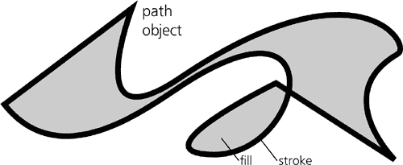

# 第一章. Inkscape 与世界

这可能是你第一次接触矢量图形。或者，你可能之前已经使用过矢量图形，现在正在检查它还能为你做什么。或者，你可能在使用了其他矢量编辑应用程序之后考虑 Inkscape，并想知道它有什么独特之处。无论你的情况如何，你可能发现一些背景信息很有用。什么是 SVG？什么是 Inkscape？它从何而来，又将走向何方？你可以用它做什么？Inkscape 在计算机图形世界中的位置是什么？本章的介绍试图回答这些问题以及其他问题。

# 1.1 矢量图形是什么以及为什么它很重要

Inkscape 是一个*矢量图形编辑器*。这意味着什么？

今天存储和计算机处理的大多数图像都是以*栅格*形式表示的，也称为*位图*。栅格图像是一种相当原始的表示——只是一个由称为*像素*的小矩形区域组成的网格。对于每个像素，栅格文件存储的唯一信息是其颜色，以及可能还有其透明度。

例如，如果你有一个黑色圆圈在白色背景上的位图图像（图 1-1

图 1-1. 一个作为位图的圆（左）和矢量图（右）

因此，在没有人类指导的情况下，计算机几乎无法对这类图像做任何事情。它可以把所有白色像素涂成蓝色，但它不能移动或变换圆圈，因为它没有把它看作一个单独的对象。这类任务甚至对人类来说可能都很难，就像使用过 GIMP 或 Photoshop 的人会证实的那样；你将不得不使用复杂且不可靠的工具来“选择”圆圈，而且如果你，例如，圆圈的边缘是*抗锯齿*的（因此边缘的一些像素在黑白之间有中间值），你几乎无法做到完美（如图 1-1 所示）。

与*矢量图形*（图 1-1**)，而 PDF 不支持；另一方面，PDF 支持渐变网格（**1.5.4 . . . 和 Inkscape**），这是一个 SVG 目前缺少的功能。这使得任何类型的矢量转换都变得不确定。在最好的情况下，你得到的是目标格式无法直接表示的源对象的近似（例如，对于将 SVG 导出为 PDF，你可能需要用嵌入的位图替换模糊对象）。在最坏的情况下，转换后你将得到一个损坏的图像。

    这也是 Inkscape 的矢量格式 SVG 那么重要的原因之一。它是一个公认的国际化标准，具有丰富且定义良好的功能，因此有可能成为矢量图形的通用语言（尽管 Adobe 的 PDF 在这个角色中仍然更为常见）。我们将在本章后面更详细地讨论 SVG。

那么，矢量绘图实际上存储了什么？除了前面提到的嵌入的位图对象外，最常见的矢量对象类型是路径。*路径*只是一系列命令，例如“绘制一条直线到某个点”和“通过某些点绘制一条平滑曲线”。一个序列中可以有任意数量的此类命令，这意味着路径可以用所需的任何精度近似任何几何图形或现实世界的形状。路径可以有*填充*（在路径包围的区域上涂色）和*描边*（沿着路径本身涂色），以及许多其他定义路径外观的属性（图 1-2）。

图 1-2. 路径对象可以表示任何形状。

有几种其他对象类型（如文本对象、克隆和组）以及许多其他对象属性（如字体大小、可见性和模糊）。许多属性可以应用于各种对象，而其他属性则特定于特定对象类型。一幅画只是各种类型对象的集合；这些对象可以在需要时放置，包括相互叠加，甚至可以部分或全部透明，以便下面的内容可以显示出来。彩色插页中的图 1 展示了一个复杂的 Inkscape 绘图示例，它大量使用了不透明度、渐变和模糊来实现逼真效果（如果您想全面查看，可以从 Inkscape 的 *examples* 目录中加载它）。

# 1.2 你可以用 Inkscape 做些什么？

很多。

图案、图表、图表。计划和草图。科学插图和数据图表。图标、符号、标志和徽章。纹章、旗帜、路标。漫画、卡通、动漫角色和场景。现实与虚构的土地地图。各种印刷字体。横幅、传单、海报。网络图形。（广告也是如此。）书籍封面、节日贺卡、标题和插图。孩子们的涂鸦和令人惊叹的摄影写实艺术。幻想艺术、粉丝艺术、游戏艺术以及各种风味和品种的艺术。

本书的一个目标是要证明矢量编辑工具适用于比通常所认为的更广泛的任务范围。实际上，与其试图列出 Inkscape 可能被使用的所有目的，不如描述其使用可能**不合适**的情况。让我们尝试定义 Inkscape 的边界：

+   许多涉及照片或其他**现有矢量图形**的任务，如色彩校正、修图以及格式或尺寸转换，在 GIMP 或 Photoshop 等位图编辑器中完成会更好。在矢量图像的所有限制中，这一点最为人熟知，因为它区分了两种常见的图形工具：矢量和位图。请注意，一些与位图相关的任务——如添加注释或标记、在位图背景上绘制形状、蒙版（**18.4 剪裁和蒙版**）或甚至简单的修图（**18.5 修图和修补**）——在 Inkscape 中仍然可以相当自然地完成。

+   使用 **自然媒体工具**（那些模仿油画、粉彩、水彩等）绘图最好在专门的矢量工具中进行，如 Krita、Corel Painter 或 ArtRage。更普遍地说，这适用于任何彩色表面的 *纹理* 至关重要的艺术。尽管如此，如果你更关心形状和颜色而不是纹理，或者如果你的艺术作品仅用纯色、渐变和模糊效果看起来很好，Inkscape 是“简单绘图”的最佳工具之一（第十四章）。

+   制作 **文本丰富的多页文档**，特别是具有脚注、索引或目录等复杂功能的文档，自然是页面布局软件（如 Scribus 或 Adobe InDesign）或批处理格式化工具（如 TEX 或 Apache FOP）的领域。然而，Inkscape 在处理图形丰富的单页文档（如海报或传单）方面非常出色，你甚至可以通过将每一页存储在单独的文档或图层中来使用它进行一些多页设计（它目前还不支持在一个文档内使用多个页面）。此外，截至本文撰写时，Inkscape 缺乏对 CMYK 的适当支持，这限制了它在印刷工作中的应用。

+   虽然 Inkscape 的 3D 盒子工具（**11.3 3D 盒子**）可以用于简单的 **三维草图和场景**，但它采用的是传统艺术家在 2D 绘图中描绘 3D 对象的方法，而不是 3D 艺术家创建 3D 世界的方法。换句话说，如果你只需要绘制一次简单的 3D 场景，可以使用 Inkscape 获得一个看起来不错且几何上正确的结果。然而，如果你需要从不同角度绘制同一复杂场景的多个版本或 3D 动画，请使用一些真正的 3D 软件（例如 Blender、Maya 或 SketchUp，仅举几个例子）。

+   你可以在 Inkscape 中做一些简单的 **CAD**（计算机辅助设计；这个术语通常适用于工程图纸）工作。Inkscape 提供了绘制和精确变换对象的方法，以及大量的捕捉、对齐和分布功能。然而，Inkscape 不支持参数化建模等特性，也没有任何必要的 CAD 元素库（如螺丝或管子），这对于专业 CAD 工作至关重要。虽然你可以在其他地方尝试借用这些元素，但在大多数情况下，使用 QCad 或 AutoCAD 等专业工具仍然更好。

+   Inkscape 有一个专门的连接器工具，你可以用它来绘制相当复杂的 **图表和流程图**，并且连接器会自动路由。然而，这个工具目前相当有限，Inkscape 中没有预定义的图表元素集合，你可以轻松地重复使用。因此，如果你需要创建许多标准化的图表，可以考虑使用 Visio 或 Dia 等专业工具。

+   有些人已经成功地将 Inkscape 用于**演示文稿**。凭借其操作对象的便捷性和众多吸引眼球的特效，Inkscape 在需要快速构建演示文稿时是一个非常吸引人的选择。你可以创建并重复使用带有标题和占位文本的页面模板（**3.2 文档模板**）。Inkscape 甚至包括一个独立的 SVG 查看器（Inkview），具有全屏模式和“显示下一页”命令的快捷键！，这对于显示保存为单独 SVG 文档的页面通常就足够了。尽管 PowerPoint 或 OpenOffice.org Impress 等办公演示文稿应用程序可能仍然有其优势，但一旦习惯了 Inkscape 的图形能力，这些程序往往会显得相当笨拙。有些人使用 Inkscape 绘制图形，并使用演示文稿应用程序添加文本和创建实际的演示文稿。此外，一个名为 JessyInk 的第三方扩展（*[`code.google.com/p/jessyink`](http://code.google.com/p/jessyink)*）可以将你的多图层 SVG 文档转换为可以在 Firefox 或其他 SVG 兼容浏览器中查看的多页演示文稿。

+   Inkscape 的扩展效果（**13.3 路径扩展**）可以渲染许多有趣的图形效果，如 Lindenmeyer 系统、随机树、螺旋曲线或条形码。新的效果也易于编程。然而，如果你需要的是一些复杂的**算法艺术**（如分形），你可能需要使用专门的软件，并将结果导入 Inkscape。

+   Inkscape 目前还不支持**动画**。因此，虽然你可以用它来绘制动画场景、角色甚至完整的帧，但你仍然需要一个不同的应用程序（如 Adobe Flash）来组合这些元素并管理动画的时间线。

虽然模糊（并且快速变化），但这些是目前矢量图形领域的边界。这些边界内的一切都是现代矢量编辑器（如 Inkscape）的合法领域。

诚然，这些限制中只有一些是矢量图形本身的固有属性。其他则是 Inkscape 当前的局限性，这些局限性很可能会随着时间的推移而克服。（它们在你阅读本文时可能已经过时了——请查看最新版本。）

奇怪的是，很多人在图形的外围领域游荡，但对矢量核心地带却一无所知。结果，他们经常因为试图用他们喜欢的专业工具来完成错误的通用任务而感到沮丧。常见的例子是，当需要制作任何类型的图片或布局时，Microsoft Office 用户会陷入 PowerPoint 的困境，或者在论坛上抱怨在 GIMP 中绘制简单的几何形状是多么困难。这些都是典型的急性矢量盲症状况；不要成为这种疾病的受害者！

矢量图形领域也是许多项目路线图开始的地方。无论我开始什么项目，最终会使用什么软件，我的第一步通常是打开 Inkscape 并开始制作快速草图。只有当我遇到上述限制中的一些时，我才会转向更专业的应用程序来完成我的项目。而且，我越来越发现，我实际上不需要离开 Inkscape 来完成我开始的任何事情。Inkscape 的宇宙在不断扩大。

# 1.3 Inkscape 艺术作品的来源

一个工具如果没有用户社区，那就只是一个死工具，而一个用户社区如果没有可以研究和重用的作品集，也是不存在的。如果你总是不得不从一个空白页面开始一个项目，或者没有人可以与你分享你的作品，Inkscape 就不会那么有趣了。

寻找 SVG 艺术作品的主要两个原因是**学习**和**重用**。重用很简单；这正是“剪贴画”整个概念的核心所在。你不必从头开始绘制一切，而是使用别人创建的元素，并将它们与你的东西结合起来（当然，前提是那些元素的许可证允许这样做）。

当重用他人的艺术作品时，只要 Inkscape 可以读取它，源格式就不是很重要（附录 B])也可以成为你设计中的矢量图像的来源。PostScript 和 EPS（封装 PostScript）得到一定程度的支持。CDR（CorelDRAW）文件也可以导入，并且未来的版本很可能还会支持 XAR（Xara Xtreme）格式。

此外，没有什么可以阻止你将位图文件导入 Inkscape，并在你的设计中“直接使用”，或者利用 Inkscape 多功能的位图追踪器（**18.8.2 跟踪位图对话框**）将其转换为矢量形状。

即使你不使用剪贴画，下载你找到的有趣图像的 SVG 源文件也是一个很好的学习理由。与位图不同，矢量图像包含了很多关于其创建方式的信息，在 Inkscape 中你可以详细地检查这些信息。可见区域与对象之间的对应关系，这些对象类型，它们的属性，分组和图层结构——所有这些方面对于学习 Inkscape 或 SVG 技术的人来说都是非常有益的。

与大多数其他矢量工具相比，Inkscape 的文件在网上很容易找到。考虑到它的原生格式 SVG 是可读的，并且自然适合网络（它被大多数最新浏览器直接支持），这并不令人惊讶。此外，作为开源软件，Inkscape 促进了包括其图形在内的分享文化。网络上已经有很多 SVG 内容（在 Google 上搜索 *filetype:svg*）——比 AI、CDR 或 XAR 文件多得多（但仍然远远落后于 Flash^([2])）。

除了在网络上搜索 SVG 内容外，你还可以尝试以下资源：

+   Open Clip Art Library (*[`www.openclipart.org`](http://www.openclipart.org)*) 是一个社区网站，拥有大量 SVG 格式的公共领域剪贴画。Inkscape 甚至可以直接从 OCAL 导入艺术作品，并直接导出到 OCAL。

+   Wikimedia Commons (*[`commons.wikimedia.org`](http://commons.wikimedia.org)*) 包含成千上万种 SVG 图像，其中大多数是在 Inkscape 中创建的。

+   InkscapeForum.com (*[`inkscapeforum.com`](http://inkscapeforum.com)*) 和 *[`inkscape.deviantart.com`](http://inkscape.deviantart.com)* 上的 Inkscape 小组是两个 Inkscape 艺术家分享和讨论他们作品的地方。

+   The Inkscape Wiki (*[`wiki.inkscape.org/wiki/index.php/Galleries`](http://wiki.inkscape.org/wiki/index.php/Galleries)*) 包含一系列在线画廊，供个人艺术家使用。

* * *

^([1]) 仅支持基于 PDF 的 AI 文件，这意味着使用 Adobe Illustrator 版本 9 或更高版本保存的 AI 文件。

^([2]) 具有讽刺意味的是，如今 Flash 更常用于视频，而不是其原始用途——动画矢量图形。

# 1.4 SVG 简史

Inkscape 使用 SVG 作为保存矢量文件的格式。什么是 SVG？

SVG（可缩放矢量图形）标准诞生于 1990 年代末 XML 革命的顶峰时期。在当时，简单却无限表达的 XML 的新鲜诱惑下，人们想要为 *一切* 创建 XML 词汇表。矢量图形自然成为了一个合适的候选人。1998 年，在 W3C 成立了一个新的工作组，W3C 是背后支持最常用网络标准的国际联盟，包括 HTML 和 XML。该小组包括（其他）Adobe、Microsoft 和 Macromedia 的代表。他们劳动的第一个成果，SVG 1.0，于 2001 年出现；最新的官方版本是 1.1，于 2003 年发布。下一个版本，1.2，正在开发中，其中一部分已经完成。

SVG 从矢量格式的漫长且常常复杂的历史中汲取灵感，从一开始就努力做到正确。它继承了来自 PostScript 和 PDF 的许多优点（**1.5.1.1 Adobe 的矢量格式**），但被设计成不受其限制。SVG 本地支持透明度、渐变、文本的 Unicode 以及 21 世纪中被视为理所当然的许多便利功能。它还添加了独特的滤镜效果（第十七章]) 关于例外情况，请参阅**15.2.2 流体文本**。

# 1.5 Inkscape 及其竞争者

当然，Inkscape 远非市场上唯一的选择。曾经存在并且现在仍然存在数十个矢量编辑器：商业的和开源的，适用于不同的平台，通用的和专门的，活跃的和已停产的。然而，其中只有少数值得在这里提及。目前，Inkscape 的所有严肃竞争对手都是商业应用（并且通常成本很高），通常限于 Windows 和 Mac 平台，这意味着 Inkscape 的零成本和跨平台可用性立即给它带来了竞争优势。

## 1.5.1 Adobe Illustrator

Adobe Illustrator 在这个列表中占据了无可争议的第一位。这是一个功能强大且功能丰富的应用程序，通常被认为是该领域的领导者，并且在矢量图形中是一个事实上的标准。即使你不使用 Illustrator，你也可能遇到其功能和版本的提及，与其他程序的比较，以及当然，各种格式（包括 SVG）中由 AI 创建的矢量文件。

毫无疑问，Illustrator 的大部分影响力来自于其更为著名的表亲，Adobe Photoshop。作为同一创意套件的一部分，Photoshop 和 Illustrator 共享许多 UI 特征，并针对协同工作进行了优化。然而，与 Photoshop 相比，Illustrator 在其领域的地位幸运地远非垄断。即使没有 Inkscape，它仍然面临着非常严肃的竞争，尽管近年来其知名度有所增长。

Illustrator 的历史可以追溯到 20 世纪 80 年代末，它并不是矢量图形领域的始终主导者。许多功能都是在竞争产品中首创的，有时甚至是在几年之后才在 AI 中重新实现。然而，到目前为止，它已经变得如此庞大——并且随着每个版本的发布而不断增长，尤其是如果你考虑 Adobe 的整个创意套件以及整个第三方 AI 插件行业——任何概括都是冒险的。Illustrator 对很多人来说意味着很多。

然而，我认为我可以冒险做出这样的概括：无论其功能如何，很少有人会声称 Illustrator 的 UI 是可用性的典范。批评者（诚然主要是使用竞争产品的用户）指出，界面杂乱无章，充斥着大量的浮动对话框，工具太多且功能过于狭窄，对象属性在画布上的可编辑性有限，以及上下文信息的稀缺。竞争编辑器也经常声称在速度上优于 AI。

### AI

*我不是试图为 AI 用户编写一份全面的迁移指南。然而，在整个书中，我将提供 Inkscape 一些功能的 AI 等价物和比较。*

### 1.5.1.1 Adobe 的矢量格式

与 Illustrator 以及 Adobe 整体相关的矢量格式在现代数字世界中扮演着至关重要的角色。即使你计划只使用 Inkscape 的 SVG，你也应该了解 PostScript 和 PDF 是什么，它们是如何相关的，以及它们能够做什么。

Adobe 在 1984 年首次成名，是所有矢量图形格式的鼻祖：**PostScript**。作为发送数据到打印机的标准，它正好赶上了 20 世纪 80 年代的“桌面出版革命”，这场革命由可访问的个人电脑和激光打印机推动。

PostScript 的独特之处在于它是一种完整的 **编程语言**，而不仅仅是一种数据格式。一个 PostScript 文件实际上是一个打印机或计算机必须运行的程序，以便获取图像。例如，一个 PostScript 文件可能包含打印一行文本的指令，比如“我必须不打扰课堂”，以及一个将重复此行一百次的循环。不幸的是，这也意味着，由于程序中的错误或某人的恶意意图，一个 PostScript 程序可能会无限期地运行，占用系统资源。

从积极的一面来看，PostScript 的解释器使用的内存很少，因此可以嵌入当时的硬件中。因此，它受到了打印机制造商的欢迎，很快成为了发送文件打印的既定标准。

它还被用作 Adobe Illustrator 第一版原生文件格式的基础，大约在同一时间出现。尽管 AI 文件格式随着应用程序的每个版本在许多方面都发生了变化，但它的基础长期保持不变：一个 AI 文件仅仅是遵循某些约定并使用 Adobe 的 PS 函数库的 PostScript。

对于 Illustrator 的用户来说，不幸的是，PostScript 作为一种打印语言的优先级是解决打印机制造商的问题，而不是成为通用的矢量图形语言。例如，PostScript 的第 2 级（1991 年）增加了设备无关的 CMYK 颜色，但直到第 3 级（1997 年）才直接支持渐变这样的基本功能。（直到 PS 3，希望创建 PostScript 渐变的应用程序必须通过叠加许多颜色逐渐变化的窄条来“伪造”渐变。）而且即使今天，PostScript 仍然不支持透明度。

这无疑是早期版本的 Illustrator 慢慢获得用户所需求的新功能（以及竞争对手矢量编辑器已经提供的功能）的原因之一。时至今日，Illustrator 的用户界面仍然带有当初以 PostScript 功能集为设计初衷的痕迹，其他所有功能都被视为次要考虑。

然而，PostScript 最大的问题并不是其功能限制。随着时间的推移，它作为一个编程语言的存在证明是一个更大的负担：曾经是 1980 年代末的一个巧妙技巧，现在被视为非常繁琐且危险。由于任何 PostScript 文件都是一个程序，你只能通过*运行*该程序来知道这个文件将显示什么。这意味着你需要一个完整的 PostScript 解释器来处理 PostScript 文件，而且你不能直接将两个 PostScript 文件合并成一个具有可预测结果的单一文档。

Adobe 试图通过在 PostScript 文件上施加各种限制来纠正这一点。其中一种限制是*封装 PostScript（EPS）*格式。EPS 文件实际上是一个可以可靠地插入到其他文档中的一页 PostScript 文档。然而，这显然是不够的。

因此，在 1993 年，Adobe 采取了一个更加激进的步骤：它引入了*便携式文档格式（PDF）*。这个格式，尽管基于 PostScript，但放弃了作为编程语言的想法。最初，PDF 只是以声明性方式重写的简化 PS，增加了压缩和一些高级文档管理功能。后来，Adobe 继续发展 PDF，远远超出了 PostScript 所能提供的；例如，透明度是在 PDF 1.4 版本（2001 年）中添加的。

虽然 PDF 的官方目标是互联网文档交换，但它变得流行，并最终开始在印刷和设计领域站稳脚跟。PDF 是一个开放格式，由 ISO 标准化，任何人都可以免费实现，这也帮助了它。到目前为止，PDF 在很大程度上已经取代了 PS 在大多数商业应用中的地位，包括印刷。

对于我们的讨论来说更重要的是，在 9.0 版（2000 年）中，Adobe Illustrator 将其原生 AI 文件格式从基于 PostScript 改为基于 PDF。这意味着任何在 Adobe Illustrator 的现代版本中保存的 AI 文件实际上都是 PDF，并且可以被任何支持 PDF 的软件查看和导入。例如，Inkscape 的 AI 导入器实际上与它的 PDF 导入器相同。

总结来说，如果你可以使用 PDF 而不是 PostScript 或 EPS，那么在这个时间点上使用 PostScript 或 EPS 真的没有意义。Inkscape 可以导入 PS 和 EPS，但只能通过先将它们转换为 PDF 来实现，这需要在你的系统上安装免费的跨平台 Ghostscript 包（**B.4 PostScript 和 EPS（导入、导出））。从 Inkscape 导出到 PDF 的结果比导出到 PostScript 更好。

## 1.5.2 CorelDRAW

目前，Illustrator 最大的竞争对手是 CorelDRAW。像 Illustrator 一样，它是一个大型、功能齐全的应用程序，是图形应用套件的一部分。然而，这里的相似之处到此为止。

CorelDRAW 始终将自己定位为“为我们其他人”设计的矢量编辑器。其价格低于 Illustrator 或 Freehand（在 20 世纪 90 年代初，它是 Illustrator 的主要竞争对手，现在已被 Adobe 收购并停止生产），CorelDRAW 一直强调易用性，并在 20 世纪 90 年代极大地扩大了矢量编辑工具的用户群体。在一些国家和社区中，它曾经并且现在仍然比 Illustrator 更受欢迎。

CorelDRAW 开创了一些有价值的用户界面概念，这些概念被传递给了包括 Inkscape 在内的其他许多应用程序。例如，能够执行所有类型的选择和变换的单个选择工具（移动和缩放，然后点击一次就可以旋转和倾斜）首次出现在 CorelDRAW 中；Illustrator 和 Freehand 有独立的“选择”、“缩放”和“旋转”工具。

它还引入了形状（如矩形或椭圆）作为独立的对象类型，路径编辑工具在形状上的作用与在普通路径上的作用不同。令人难以置信的是，Illustrator 仍然没有形状的概念；Illustrator 中的任何矩形都只是一个矩形路径，没有任何矩形特有的属性。

## 1.5.3 Xara

CorelDRAW 在易用性方面，过去和现在都是一个令人印象深刻的改进，然而，在这个领域还有更多可以做的事情，正如英国的小公司 Xara Ltd.所证明的那样。在 20 世纪 90 年代中期，Xara 将其矢量编辑器从鲜为人知的 Atari 平台移植到 Windows 上。结果是计算机图形领域中最令人印象深刻的处女作之一。

Xara 的矢量编辑器取得了许多重要的首次。它具有完整的屏幕抗锯齿，方便的控件在画布上编辑渐变，方便的透明度支持，以及一个与当前工具相关的上下文敏感的面板（尽管这个想法很明显，但 Illustrator 直到 CS2 版本才拥有这个功能）。除此之外，Xara 运行速度非常快，这在当时的硬件条件下尤为重要。

总体而言，Xara 遵循了 CorelDRAW 的用户界面范式（如此之多，以至于 Corel 一度将 Xara 以 CorelXARA 的名义分发，作为其 CorelDRAW 的一个小兄弟）。然而，Xara 在易用性方面相对于 CorelDRAW 的优势甚至超过了 CorelDRAW 相对于笨拙的 Illustrator 的优势。Xara 很快获得了一个庞大且非常忠诚的用户群体。Inkscape 从 Xara 那里借鉴了许多想法和方法，这并不奇怪。

然而，随着时间的推移，Xara 的新颖性有所减弱。Xara 发布了几个新版本，但其竞争对手也发布了新版本，发明了新功能并提高了易用性。到 2000 年代中期，大多数人认为 Xara 是一个“小巧的不错应用”——非常坚固和易用，但有些过时。

2005 年，Xara Ltd. 取得了一项前所未有的举措：它宣布计划将其旗舰产品矢量图形编辑器开源，并将其移植到 Linux，该产品的最新版本被称为 Xara Xtreme。Linux 版本将被命名为 Xara LX。这看起来像，但实际上并不是，“开源比废弃软件更好”的场景之一。Xara 仍然在营业，继续销售 Xara Xtreme 的 Windows 版本以及其他图形产品。

有趣的是，Xara Ltd. 提到的其中一个导致其下滑的原因是 Inkscape 的快速进步。尽管 Inkscape 比 Xara 年轻得多，但它已经拥有一些独特的功能。显然，Xara 希望利用开源人才库来重振其产品。另一方面，Inkscape 开发者一直将 Xara，以其一致的界面设计和出色的可用性，视为其榜样之一。因此，尽管这两个应用程序之前已经有所了解，但现在他们第一次作为竞争对手面对面相遇。

事实上，由于它在 Linux 上的存在以及 UI 的一般相似性，Xara 目前是 Inkscape 最直接的竞争对手。最初，这两个项目都宣布自己是开源的，愿意交换代码和想法，甚至有关于最终合并的讨论。然而，在最初的活跃期之后，Xara LX 没有吸引到开源开发者的显著关注，这主要是因为 Xara Ltd. 拒绝将其代码的一个关键部分开源——渲染器。目前处于 0.7 版本，Xara LX 基本可用，但其未来尚不明确。

## 1.5.4 ... 以及 Inkscape

与其商业竞争对手相比，Inkscape 在几个方面仍然得分较低。在缺失的功能中，可能最重要的是缺乏原生 CMYK 支持，这使得它几乎无法用于创建用于打印的文件（**8.2.2 CMYK**）。此外，Inkscape 没有渐变网格。这是 AI 和其他应用程序的一个功能，允许将不同的颜色分配给单个对象的不同点，颜色之间有平滑的过渡。渐变网格允许 AI 艺术家用最少的对象创建极其逼真的艺术作品。另一方面，Inkscape 已经拥有一些在该领域几乎独一无二的创新功能，例如克隆拼贴（**16.6 Tiling Clones**）、3D 盒子工具（**11.3 3D Boxes**）、路径效果（第十二章）和调整工具的部分（**8.7 调整颜色**）。

一些功能尚未在 Inkscape 中实现的最明显原因是 SVG 中缺少这些功能。特别是，对于渐变网格来说是这样的（尽管它们正在考虑纳入 SVG 标准的下一个版本）。同样，Inkscape 实现了 SVG 的线性渐变和椭圆渐变(**10.1 渐变工具**)，但缺乏其他渐变类型，如 Xara 支持的圆锥渐变。同样的原因也导致在 Inkscape 中无法创建多页文档。目前 SVG 标准中根本不提供这一功能。

幸运的是，SVG 的限制对 Inkscape 产生影响的唯一领域是基本对象类型的库。另一方面，在处理这些对象的方式以及将它们组合成更高级对象的方式上，Inkscape 完全可以自由创新。

在界面和可用性方面，Inkscape 通常被认为很容易学习和使用。Inkscape 的用户界面与 Xara 相当，事实上非常相似。在某些方面，一个程序比另一个程序更方便，但两者都提供了一个不引人注目、流程化的界面，拥有许多易于访问的功能。

作为一款真正的开源应用程序，Inkscape 主要由极客编写，而极客的兴趣和优先级有时与商业开发者截然不同。首先，极客讨厌简化后的界面，喜欢强大的控制和无限调整。他们尤其欣赏丰富的键盘控制，Inkscape 拥有史无前例的大量键盘快捷键，涵盖了其大多数模式、工具、命令和功能（附录 D）。

与功能和可用性一样重要的是应用程序的稳定性和速度。Inkscape 的发布版本偶尔可能会崩溃或冻结（经常保存！），但通常稳定性不是大多数用户关心的问题。然而，速度却是。Inkscape 的屏幕更新速度远非出色，尽管它随着每个新版本的发布而不断改进，但在处理复杂图形时，它可能成为一个问题。

具有讽刺意味的是，几年前当 Inkscape 在整体上比现在慢得多时，对其速度的投诉却很少；事实上，大多数用户认为它相当快。然而，现在，尽管屏幕更新更快，程序响应更迅速，但关于 Inkscape 慢速和内存消耗的投诉开始真正堆积起来.^([4]) 这种明显悖论的原因很简单：Inkscape 已经成长和成熟到足以承担一些真正复杂的任务，而使用它在复杂艺术品上的艺术家开始越来越频繁地遇到瓶颈。

* * *

^([4]) 随着每一次速度优化，通常都会带来一些令人兴奋的新功能，这又增加了性能需求。例如，在版本 0.45 中就是这样。这次发布引入了 *可中断显示*，这意味着你不需要等待它完成屏幕的重绘才能发出命令。这大大提高了程序的反应速度。然而，同一版本还增加了高斯模糊（**17.1 模糊**），尤其是在其原始实现中，其渲染速度比 Inkscape 中的任何其他功能都要慢得多。因此，0.45 版本比之前的任何版本都收到了更多关于速度慢的投诉。

# 1.6 开源应用程序的生命周期

如您从对 Inkscape 竞争的讨论中可以看出，一个严肃的矢量编辑器成为开源应用程序是非常不寻常的。是什么帮助 Inkscape 在其他开源尝试（而且数量相当多）失败的地方取得了成功？让我们简要回顾一下 Inkscape 的过去。

Inkscape 的故事几乎与 SVG 同时开始，只是那个最初的代码块还没有被称为 Inkscape。它被称为 *Gill*，是由一个人，Raph Levien，在 1999 年初为 W3C 正在讨论的新矢量格式开发的一个简单的查看器和编辑器。这是一个典型的单打独斗项目，并且它遭遇了许多单打独斗项目的命运：其作者很快对其失去了兴趣。

但是，Gill 代码是公开可用的，另一个人接手了开发工作。Lauris Kaplinski 将项目重命名为 *Sodipodi*，并为它设定了一个更加雄心勃勃的目标：开发一个真正的矢量编辑器，具有通常与这类软件相关的大部分功能和特性，其用户界面主要模仿 CorelDRAW，但也受到了知名开源位图编辑器 GIMP 的影响。

Sodipodi 的最初版本是由 Lauris 独自完成的，并且几乎没有引起注意。然而，到了 2002 年，越来越多的人开始发现 Sodipodi，其他开发者的补丁也开始涌入。但 Lauris 仍然是该应用的唯一维护者；他决定哪些补丁会被采纳，以及何时发布版本。除了他之外，很少有人有权限向项目的代码仓库提交代码。

Lauris 在 Sodipodi 上做了大量工作；时至今日，Inkscape 代码中相当大的一部分仍然属于他的版权。然而，随着时间的推移，他独断专行的项目管理方式变得越来越成为项目的障碍。长时间忽视补丁和关于开发方向的分歧并不健康。

2003 年 10 月，事情达到了高潮。一群不满的开发者在与 Lauris 未能达成协议后，宣布了分支。他们拿走了最新的 Sodipodi 代码库，添加了他们的补丁，并为这个新项目想出了一个酷炫的名字：Inkscape.^([5]) 在一段时间内，Inkscape 和 Sodipodi 是并行开发的，但后者很快进入了休眠状态，无法跟上年轻的竞争对手。

与其前身相比，Inkscape 项目非常开放。没有一个人对如何做事拥有最高的话语权。要获得完整的开发者权利，包括直接提交到代码库的权利，你只需要提交两个成功的补丁。特别是在 Inkscape 的早期，几乎没有讨论发生；如果有人对程序的某个方面表现出浓厚的兴趣，其他人就会假设那个人知道自己在做什么，不会干涉。

随着时间的推移，出现了一些指导原则，现在如果某个贡献与开发者对事物应该如何运作的想法相矛盾，被拒绝的情况并不少见。然而，仍然没有最高权威人物；一切决策都是通过讨论和共识来决定的。这意味着任何足够热情、能够说服他人并且能够高效编码的人仍然有很大机会影响项目的整体方向。

在项目的指导原则中，有一条简单的规则：*倾听用户的声音*。这听起来很平常，但令人惊讶的是，很少有软件项目，无论是商业的还是开源的，实际上遵循这一原则。在 Inkscape 中，许多开发者本身就是该程序活跃的用户，这真的很有帮助。此外，在 Inkscape 的早期，它必须赢得 Sodipodi 的用户才能生存下来；幸运的是，认真对待用户反馈的传统即使在 Sodipodi 不再是竞争对手之后也一直延续下来（而且 Inkscape 并不缺乏其他竞争对手）。

项目的一条规则是，*先打补丁，后讨论*。这意味着如果你有一个想法并且能够编写代码，不要试图说服别人实施它；自己动手做，并让其他人可以在程序中实时测试它。如果它很好，你的同事开发者会帮助你使其完美。（如果不好，你只需撤销它即可。）

“先打补丁”规则的一个后果是，开发构建必须始终是可工作的；任何回归问题都应尽早记录并修复。一群热情的用户每天下载最新的代码并进行测试，甚至在官方发布还遥遥无期的时候。开发者鼓励这种持续的测试，并通过每天为所有主要平台提供新的编译二进制文件来促进这一过程。

结果是项目快速而稳定地增长，现在它被广泛认可为最重要的开源项目之一，并在其软件领域内是一个强大的竞争对手。就数字而言，截至本文撰写时，Inkscape 拥有：

+   几乎 50 万行代码

+   超过 100 名开发者（尽管在任何给定时间，活跃的核心成员大约有 10 人）

+   仅从官方网站下载就超过 300 万次

+   翻译成超过 50 种语言的用户界面

* * *

^([5]) 如果你在想如何能够将某人的版权代码拿过来开始修改和重命名，请阅读随 Inkscape 副本一起提供的通用公共许可证副本（文件 *COPYING*）。
