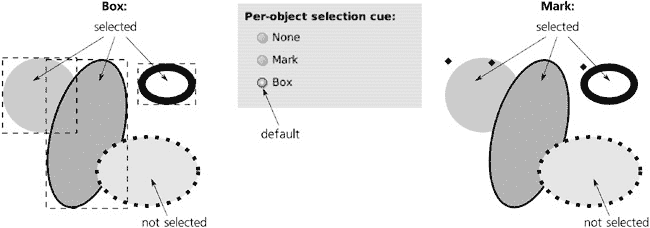
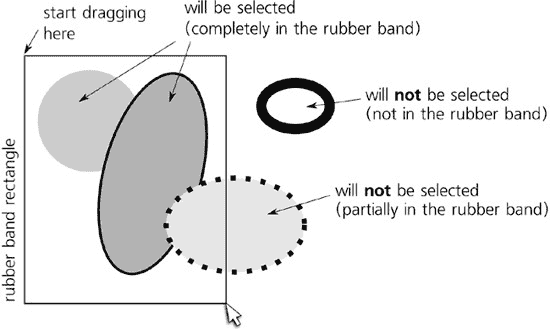

# 第五章.选择

在 Inkscape 中，如果不先选择某些对象，您能做的事情非常有限。在所有 Inkscape 操作中，选择具有最多的方法、工具、对话框和快捷键。您需要了解其中很大一部分才能高效工作，并且至少需要了解其中的一些才能在 Inkscape 中工作。

仅通过选择或取消选择对象本身不会以任何方式更改文档。因此，本章中描述的所有技术都不是可撤销的操作，也不需要保存文档。

# 5.1 选择提示

如您现在可能所知，Inkscape 的选择只是一个对象列表，可能包括任何东西——从没有对象（空选择，没有选择）到文档中的所有对象。选择是局部的；如果您打开一个包含相同文档的第二个窗口（**3.5 实例、文档、视图**），则该窗口将有自己的独立选择对象列表。选定的对象可以位于画布的任何位置，在任何层或组中；多个选定的对象不必是同一父级的子项。唯一不能做的事情是同时选择一个对象及其祖先（**5.10 组中选择**）。

### 注意

*即使隐藏或锁定的对象也可以包含在选择中。虽然大多数工具会拒绝直接选择隐藏或锁定的对象，但仍然可以通过例如使用 XML 编辑器（**4.7 XML 编辑器**）来实现*。

在画布上，每个选定的对象都由选择提示标记。默认情况下，此提示是围绕对象的虚线框架，显示该对象的边界框（**4.2 边界框**）。此框架使用对比颜色绘制在所有对象之上，因此在任何背景上都是可见的。

您可以选择不同的选择提示：每个对象边界框的左上角的一个小菱形标记，如图 图 5-1 所示（这与 Xara 矢量编辑器使用的类似）。要更改选择提示的类型或完全关闭它，请转到 **工具** ▸ **选择器** 子页的 **Inkscape 首选项** 对话框。

图 5-1.两种可能的选择提示

此外，你可以控制哪些工具显示选择提示，哪些不显示。为此，请在 **Inkscape 预设** 对话框中每个工具页面上寻找标记为 **显示选择提示** 的复选框。默认情况下，每个工具都显示选择提示，除了书法笔和油漆桶工具，它们更偏向艺术而非技术——在那里，提示并不很有用，可能还会分散注意力。（当然，无论提示是否显示，选择都在那里——无论你切换多少工具，它都保持不变。） 

# 5.2 选择和状态栏

当你选择或取消选择对象时，在整个程序中会发生很多事情。Inkscape 会立即将所有注意力转向新的选择：它会重新绘制选择提示，如果需要，滚动画布以显示选中的对象（**3.10 滚动**），并更新界面上的各种显示和指示器。

Inkscape 中最重要的提示来源之一，状态栏，会尽可能多地显示关于选中的信息。对于一个选中的对象，它会告诉你对象的类型，某些类型的一些附加属性（例如路径的节点数量、文本的字体家族和大小），以及该对象所在的图层，如图 图 5-2 所示。

图 5-2. 单个选中对象的工具栏描述

对于多个选择，Inkscape 会告诉你选中了多少个对象，如果选中的对象类型不超过三种，则会列出这些类型：

图 5-3. 多个选中对象的工具栏描述

如果对象类型太多无法列出，并且它们位于多个图层中，Inkscape 只会显示对象的数量、对象类型和图层数量：

图 5-4. 多个图层中多个类型选中对象的工具栏描述

在状态栏消息区域的左侧是当前图层指示器（**4.6.3 当前图层指示器**）。由于选中的对象可以位于多个图层中，因此此小部件并不直接与选择相关联。然而，当你通过点击选择一个对象时，Inkscape 假设你现在想要在该对象的图层中工作，因此它会将该图层设置为当前图层，指示器会反映这一点。

更左侧的是所选样式指示器，它始终反映当前选择的样式（如果选择了具有不同样式的多个对象，它显示它们的*平均*样式）。我们将在**8.1 样式基础**中详细讨论这个重要的控件。

# 5.3 子选择

一些工具允许更细粒度的选择类型，这样它们就可以处理所选对象的某个部分而不是整个对象。这个所选对象的某部分就称为*子选择*。

一个例子是文本工具。你可以选择整个文本对象，但然后你可以通过按  和箭头键或通过像在文本编辑器中一样拖动鼠标来选择该文本对象中的*片段*。所选的文本部分就是文本子选择。

另一个例子是渐变工具。渐变可以有许多停止点（**10.5 多级渐变**），并且该工具可以一次选择一个或多个这些停止点。自然地，渐变停止点仅在所选对象可见，所以如果你选择一个停止点，你就在常规对象选择中创建了一个子选择。

当你更改子选择时，Inkscape 中许多操作与更改选择时的操作相同。也许最重要的是，状态栏中的所选样式指示器（**8.1 样式基础**）显示子选择的样式——即所选文本片段的样式，而不是整个文本，或者所选渐变停止点的样式，而不是整个对象。此外，任何样式设置命令（例如在调色板上点击颜色，或通过按  来粘贴样式）如果存在，将应用于子选择。换句话说，子选择允许你几乎像处理独立对象一样处理对象的各个部分。

# 5.4 通过点击选择：选择器

很可能你已经知道工具栏中最上面的工具是选择器，并且使用该工具点击一个对象可以选择该对象。当然，选择器工具的功能远不止这些，但让我们更详细地看看这个简单的动作。

首先，请注意点击一个对象会*取消选择*任何之前的选中项。此外，观察使用选择器工具时，你不仅可以选择对象，还可以在任何方向上*拖动*所选对象。这两个功能的结合使得移动对象变得极其容易和自然，几乎不需要考虑“选择”本身：你看到一个对象，然后点击并拖动它到你想要的位置。点击会选中它，取消选择其他任何对象，拖动则会移动它。

有时，这可能会造成不便。特别是如果你使用的是带有笔而不是鼠标的平板电脑，你可能会发现，当你只是想通过点击来选择对象时，意外推动对象的情况太容易发生了。为了减少这个问题，请转到 **Inkscape 预设** 对话框的 **鼠标** 选项卡，并调整 **点击/拖动阈值** 的值。这设置了允许的屏幕像素“滑动”量，默认值为 4；如果你通过少于这个像素数的像素点击并拖动对象，你的操作仍然被视为点击，对象不会移动。如果你经常意外地移动对象而不是点击它们，请增加此值；相反，如果你发现对象在你真正想要移动它们时“粘性”太强，请减少此值。

在你点击任何东西之前，然而，你想要确保你点击的是正确的位置，这样你的点击就不会白费。在这里，Inkscape 非常有用：当你鼠标悬停在对象的可点击区域上时，它会改变鼠标光标，与光标在空白画布上时是一个箭头相反。悬停在对象上的光标形状在不同平台上是不同的；例如，在 Ubuntu Linux 上它看起来像一只手，而在 Windows 上它看起来像两端带有箭头的十字。

稍微玩一下这个光标改变功能。你会发现没有填充的对象不能通过在它们内部点击来选择，并且完全透明的对象根本不能通过点击来选择（尽管你可以用橡皮筋选择它们，如你将在下一节中看到的）。在轮廓模式（**3.11 渲染模式**）中，你只能通过点击对象的轮廓来选择任何对象。

如你所想，这种变化的鼠标光标在复杂的绘图中的帮助较小，因为整个画布通常被对象覆盖。然而，如果你将所有背景对象分离到一个图层并将该图层锁定（**4.6 图层**），那么这些现在不可选的背景对象将停止改变光标，并且你可以通过将鼠标移到它们上方再次感知前景对象。

此外，你还会注意到每个可点击对象在所有边上都有一个不可见的边距，宽度为几个像素。在这个边距上的点击仍然会选择该对象。这对于选择其他方式几乎不可能准确点击的小对象来说非常方便。然而，从另一方面来看，这也解释了为什么有时很难选择堆叠中的底部对象，即使那个底部对象从顶部对象下面略微突出。

如果你不喜欢这个可点击边距的大小，你可以在**Inkscape 首选项**对话框的**鼠标**选项卡中更改它：调整**抓取灵敏度**值，默认为 8 个屏幕像素。请注意，这个值和**点击/拖动阈值**都是以屏幕像素为单位的。这意味着它们不依赖于缩放，所以即使值保持不变，你会发现通过放大来执行小范围移动和选择小对象要容易得多。

# 5.5 通过点击选择：其他工具

Inkscape 用户界面最重要的原则之一是一致性：除非有其他原因，否则所有工具和模式必须表现相同。在选择时，这意味着许多工具，就像选择器一样，可以通过点击来选择对象。

可以通过点击来选择对象的工具有：节点（**12.5 节点工具**）、所有形状工具（第十一章**）和渐变（**10.1 渐变工具**）。（不能通过点击来选择工具的原因是不同的：在这些工具中，单次点击被保留用于每个工具的特定功能。）

与选择器不同，所有这些工具都直接选择单个对象，即使它们在组内（换句话说，在这些工具中，简单的点击等同于选择器中的-点击，见**5.10 组内选择**）。这很有道理：所有这些工具都针对各种类型的单个对象工作，所以在大多数情况下选择一个组并不是你真正想要做的。例如，如果你用节点工具选择一个组，你就无法对它做任何有用的事情——组没有路径节点可以编辑。这就是为什么这个工具总是直接选择你点击的**路径**，无论它是否与其他任何内容组合在一起。

此外，与选择器不同，其他工具不会改变可选择对象上的光标。唯一的例外是文本工具，当它悬停在可编辑文本对象上时，会切换到文本插入光标（**15.1 基本编辑**）。

# 5.6 向选择中添加

一个选择可以包含多个对象。有时，你可能已经花费了一些精力选择了几个对象，然后你还想选择其他几个对象。你能否在不重新开始选择的情况下做到这一点？

是的。要*添加*当前选择中的另一个对象，-点击它。然而，如果你-点击一个已经选中的对象，它将*从选择中移除*。换句话说，这个快捷键就像一个切换器，它会反转你点击的对象的选择状态。

# 5.7 使用橡皮筋选择

在选择器中，另一种选择多个对象的方法是通过拖动它们。想象一个围绕所有你想要选择的对象的矩形，并从该矩形的对角线一端拖动到另一端。（拖动的确切方向——例如从左上角到右下角与从右上角到左下角——并不重要。）这个在你拖动时可见的矩形（如图图 5-5 所示），被称为*橡皮筋*或*标记*。

图 5-5. 使用橡皮筋（鼠标拖动）选择多个对象

使用橡皮筋选择不是*切换*；一旦你开始一个新的橡皮筋，任何之前的选中都会取消选中。这就是为什么逻辑上，在空白空间（不是对象）上单击一次会取消选中任何东西——这只是一个零大小的橡皮筋，它会取消旧的选择但不会创建一个新的选择。

橡皮筋选择所有可见和未锁定层中的封闭对象——换句话说，在整个文档的 z 轴堆叠中，而不仅仅是当前层。（因此，使用橡皮筋选择不会改变当前层，即使它导致在不同于当前层的层中选中单个对象。）此外，橡皮筋允许你选择那些仅通过点击无法选择的对象——那些位于其他对象之下、没有填充和描边以及那些完全透明（不透明度为零）的对象。然而，隐藏或锁定（**4.1 对象属性**）的对象仍然无法被选中。

简而言之，如果对象的边界框完全位于橡皮筋矩形内，并且该对象是可选择的，它*将被选中*。

### AI

*在 Adobe Illustrator 中，橡皮筋的工作方式略有不同：它选择所有边界框位于其矩形内或与之相交的对象。Inkscape 的行为，只选择完全*在橡皮筋内的对象，与 CorelDRAW 和 Xara 矢量编辑器共享。Inkscape 可以通过*触摸选择*来更接近 AI-like 的行为，如下一节所述。*

你可能会认为，像点击一样，按住  键并拖动橡皮筋会给你切换行为。但这并不是事实。按住  并使用选择工具拖动与简单拖动完全一样，只有一个例外：它始终创建一个橡皮筋，即使你从一个对象而不是从空白画布开始。没有 ，从对象拖动将简单地选择并移动该对象，但按住  并拖动*强制*橡皮筋，从而使它在复杂绘图中非常有用，因为在复杂绘图中空白画布可能很难找到。

# 5.8 触摸选择

触摸选择是橡皮筋选择的近亲。使用选择工具时，如果你按住  键从空白画布拖动，而不是看到矩形，你会看到鼠标光标留下的红色轨迹——*触摸路径*。在你释放鼠标后，所有被这条路径*触摸*（但不包括在内）的对象都将被选中，如图图 5-6：在你释放鼠标后将被选中的对象用较深的灰色标记")所示。

图 5-6. 使用触摸选择 (-拖动)：在你释放鼠标后将被选中的对象用较深的灰色标记。

因此，你可以直接“绘制”覆盖你想要选择的对象，这在许多对象紧凑地排列但它们的边界框太大或与其他对象的边界框过于交织的情况下非常方便。

与常规橡皮筋选择不同，触摸选择不会选择完全透明的对象或被其他对象遮挡的对象——也就是说，那些你实际上无法“触摸”的对象。事实上，触摸选择的行为就像一系列沿着触摸路径的 -点击，其中每个被触摸的对象都会收到这样一个点击。

注意，如果有选择，！-拖动有不同的功能：它无论你拖动到何处都会移动选择（**6.1 选择器：移动**）。但如果你已经有一些选择，并想通过触摸选择来*添加*到它，请使用！-拖动：就像！即使从对象开始也会强制橡皮筋一样，触摸选择即使你有先前的选择也会强制触摸路径。然后，触摸到的对象将被*添加*到选择中。

如果你触摸对象以便随后删除它们，橡皮擦工具的删除模式会同时执行这两个功能：拖动鼠标覆盖对象，并在释放鼠标时将其删除。如果你想要将此功能作为一个独立的工具使用而不必按住！。

# 5.9 从下方选择对象

在复杂图形中选择对象时最常见的问题之一是某些对象遮挡了其他对象。即使顶部对象部分透明并且你可以看到下面的另一个对象，简单地点击它仍然会选择顶部对象。

如果底部对象的边界框比顶部对象的小，你可以！-拖动一个橡皮筋围绕小的底部对象，这将选择它而不选择顶部对象。然而，这并不总是可能的。

Inkscape 提供了一种方便的方法来选择不在 z 调序最顶层上的对象：！-点击*选择在*当前选定的对象下方。这意味着！-点击的结果取决于当前的选择；如果没有选择，或者如果你！-点击当前选择之外，结果与简单地点击相同。

然而，如果你点击一个选定的对象并且下面有其他对象，！-点击将取消选中选定的对象，并选择下面的对象。接下来的！-点击将选择更深层的对象，依此类推。当你点击到点击点的最底层对象时，接下来的！-点击再次选择最顶层的对象。

例如，假设你有三个堆叠的对象，从下到上编号为 1, 2, 3。在没有选择的情况下， -点击它们会选择最上面的一个，3。下一个  -点击会选择 2，然后是 1，然后又是 3，以此类推。

 -点击与  -点击的不同之处，与  -点击与简单点击的不同之处相同：它在不完全取消选择的情况下添加到选择中或从其中移除。因此，在我们的 1, 2, 3 对象堆栈中，第一次  -点击选择 3；再次  -点击后，将选择 2 和 3；最后，再次  -点击会将最底部的对象也添加到选择中——因此，经过三次  -点击后，将选择所有 1, 2 和 3。

# 5.10 在组中选择

当您需要将一组对象作为一个整体处理时，分组是一件美妙的事情。如果您使用选择工具简单地点击组中的任何对象，整个组都会被选择。然而，很多时候您想要选择并编辑组内的对象而不取消其分组。这可以通过  -点击组中的对象来实现。

 -点击完全忽略 *任何* 分组，无论其深度如何。例如，如果对象 A 是组 B 的成员，而组 B 又是顶级组 C 的成员，那么  -点击 A 将选择 A，直接穿过两个分组级别。无法通过  -点击选择组 B；它总是只选择最低级别的非分组对象。

选择组 B（它位于组 C 内部）的唯一方法是 *进入* 组 C（见 **4.6.1 层次**）。进入 C 使其成为一个临时层。一旦进入该层，您只需点击即可选择 B。

 -点击可以与  (选择下) 结合使用。从逻辑上讲， -点击与  -点击做同样的事情，只不过它忽略了任何分组，并在点击点浏览对象的 z-顺序堆栈，就像它们都没有分组一样。

同样，-点击可以与 结合使用，以将对象添加到选择中或从选择中移除。最后，你可以-点击，这意味着“将 z-order 堆栈中此点的最顶层未选中对象添加到选择中，忽略分组；如果此点所有对象都已选中，则取消选中最顶层的一个。”

使用各种修饰符点击进行选择的功能的唯一限制是：你不能同时选择一个对象和包含该对象的组。所以，例如，如果你在组内点击一个对象（）然后点击（没有 !）同一组的另一个对象，试图将组添加到选择中，那么组将被选中，但第一个选中的对象将被取消选中。同时选择一个组和组内对象的情况会导致各种逻辑上的困境，因此 Inkscape 尽力防止这种情况发生。

# 5.11 使用键盘快捷键选择

通常，选择是一个鼠标或笔的任务，因为在大多数情况下，它通过在屏幕上指示一些点或区域来完成。然而，也可以使用键盘快捷键进行两种非常常见的选择操作：选择*下一个*或*上一个对象*（ 或 ）以及选择*所有对象*（）。

*下一个*和*上一个*的概念实际上是指文档内对象的 z-order（见**4.3 Z-Order**）。当你按下 时，你选择 z-order 中当前选中对象立即*上方*的对象（或者如果选中了多个对象，则是上方最顶部的对象）。相应地， 选择（底部）选中对象的立即*下方*的对象。

如果没有选择任何对象， 选择当前图层中最底部的对象，而 选择最顶部的对象。由于对象通常被添加到当前图层的 z-order 顶部，因此如果没有先前的选择，按下 是选择最近添加（绘制、粘贴、导入等）对象的便捷快捷键。

这些三个快捷键的一些行为方面可以在**Inkscape 首选项**对话框的**选择**选项卡中更改：

图 5-7. Inkscape 首选项对话框的“选择”选项卡

+   默认情况下，这些键仅限于当前图层（这可能是一个您已进入的组，**4.6.1 图层层次结构**）。也就是说，一旦您通过按到达图层的最顶层对象，接下来您将回到同一图层的最底层对象，按将仅选择当前图层中的所有对象。在对话框中，这种行为被描述为**仅在选择当前图层内**。在另外两个选项中，**在选择当前图层和子图层中**与它的工作方式相同，除了它进入当前图层的子图层(**4.6.1 图层层次结构**)，而**在选择所有图层中**允许或跨越图层的界限，而将选择整个文档中的所有对象。

+   两个复选框，**忽略隐藏**和**包括锁定对象和图层**，可以取消选中以允许键盘快捷键选择那些隐藏或锁定的对象，或者如果您还选择了**在所有图层中选择**，则位于隐藏或锁定图层中(**4.6 图层**)。

# 5.12 查找对象

在复杂文档中搜索对象是您可能需要执行的操作——但是当您需要它时，您会为 Inkscape 能够做到这一点而感到高兴。本章节关于选择的内容是讨论对象搜索的最佳位置，因为它本质上又是选择对象的一种方式。

搜索的主要方式是使用**查找**对话框(图 5-8)，您可以通过按或选择**编辑** ▸ **查找**来调用它。

图 5-8. 查找对话框

您可以通过在以下字段中输入查询来搜索，具体描述如下。如果您为多个搜索字段指定了值，它们将使用逻辑“与”组合——也就是说，只有满足所有指定条件的对象才会被找到。

**文本**

+   此字段仅适用于文本对象(第十五章)，并在其文本内容中进行搜索。搜索区分大小写。如果有对象的文本与查询字符串完全对应，则仅选择那些对象；否则，Inkscape 会尝试找到*部分匹配*——即那些内容*包含*查询字符串的文本对象。

**ID**

+   这在所有对象的 `id` 属性中进行搜索（**A.9 链接**）。这仅在您的某些 ID 有意义时才有意义，也就是说，是由您设置的，而不是由 Inkscape 自动生成的。与文本一样，Inkscape 首先尝试找到精确匹配，如果失败，则查找部分匹配。

**样式**

+   此字段允许您在对象的样式中进行搜索。遗憾的是，由于这是一个简单的文本字段，要使用此功能，您至少需要了解一些 SVG 中样式是如何编写的（见 **A.8 样式**）。以下是一些示例：

**查找所有填充红色的对象**

+   这只适用于一种特定的红色，您必须知道如何将其转换为 RRGGBB 形式。例如，调色板中的“亮红色”在 RRGGBB 表示法中为 `ff0000`，在对象的样式字符串中，这由一个井号 (`#`) 和属性名 `fill` 分隔，后者由冒号分隔。因此，整个搜索字符串将是 `fill:#ff0000`。

**查找所有没有描边或填充的对象**

+   搜索 `stroke:none` 或 `fill:none`。

**查找所有完全透明的对象**

+   搜索 `opacity:0;`（注意末尾的分号分隔符；如果没有它，它也会找到所有 *部分* 透明的对象——例如，那些在它们的样式中有 `opacity:0.5;` 的对象）。

**属性**

+   此字段搜索在 SVG 中具有此 *名称* 属性的对象（无论其值如何）。例如，所有使用选择导出导出为位图的对象都获得属性 `inkscape:export-filename`，该属性存储位图导出文件的文件名。因此，搜索此属性将选择文档中所有曾经导出的对象（之后您可以，例如，再次将它们全部导出，见 **18.9 位图导出**）。

**类型**

+   这允许您搜索特定类型的对象。取消选中 **所有类型** 复选框将打开一个与各种对象类型对应的复选框列：

    

    图 5-9. 在查找对话框中选择对象类型

仅保留您想要查找的类型。您可以将其与其他上述搜索条件结合使用。

除了搜索字段外，对话框底部的四个复选框启用了各种搜索选项：

**在选区中搜索**

+   这允许您缩小当前选择，而不是搜索整个文档。

**在当前层搜索**

+   默认情况下，Inkscape 在所有层中进行搜索。勾选此选项将搜索限制在当前层。

**包括隐藏**和**包括锁定**

+   默认情况下，Inkscape 的搜索忽略隐藏和锁定对象，以及隐藏或锁定层中的对象。勾选这些选项以在隐藏和/或锁定对象中进行搜索。

# 5.13 跟踪链接

正如你将在以下章节中看到的那样，Inkscape 中的对象可以通过各种方式相互链接。你通常会想跟随这样的链接来找到与当前选中对象链接的对象。Inkscape 有一个通用的键盘快捷键来执行此操作，。根据选中的对象类型，按将选择：

+   如果选择了克隆副本（**16.4 链接克隆**）

+   选中文本路径对象所附加的路径（**15.2.3 文本路径**）

+   选中链接偏移对象所附加的路径（**12.4 偏移**）

记住，一些文档对象可能存储在`defs`中（见**A.4 Defs、视图和元数据**），在这种情况下，它们可以从文档中引用，但在画布上的任何地方都是不可见的。如果你的屏幕克隆、文本路径或链接偏移量引用了`defs`中的对象，将失败，并在状态栏中显示错误消息。

# 5.14 取消选择

在几乎任何工具、上下文或模式下，按将取消当前选择。如果你有一个子选择，通常按一次将取消子选择，第二次按将取消常规选择。

另一种取消选择的方法是单击空白画布（或没有任何东西在其下面的锁定对象）。然而，这仅在选择器和那些简单点击即可选择对象的工具中有效（**5.5 通过点击选择：其他工具**）。在复杂的绘图中，如果难以访问空白画布，是取消选择的最方便方式。

此外，Inkscape 默认情况下在切换当前图层时会取消选择（见**4.6 图层**）。这可以在**Inkscape 首选项**对话框的**选择**选项卡中禁用。

# 5.15 选择杂项

当你撤销一个操作时，有时（但不总是）当前选择会被取消选择。 (是否发生取决于你正在撤销的操作类型。) 这不是预期的行为；实际上这是一个错误，Inkscape 的未来版本可能会修复它。

另一个类似的问题是，在运行扩展（**13.3 路径扩展**）之后，选择通常会丢失。此外，如果扩展打开了一个配置对话框，并且在这个对话框中，你勾选了**实时预览**复选框，那么在对话框打开期间，你无法更改选择（或在画布上做其他任何事情）。

Inkscape 强大的命令行界面有一个用于选择对象的特殊参数，`--select`（**C.5 动词**）。要使用它，你需要知道你想要选择的对象的 ID。这使得能够编写完全自动化的 Inkscape 编辑会话脚本，其中单个命令可以加载文档、选择一些对象、对它们执行一些操作、保存文档，并退出——这一切都不需要任何用户交互。
