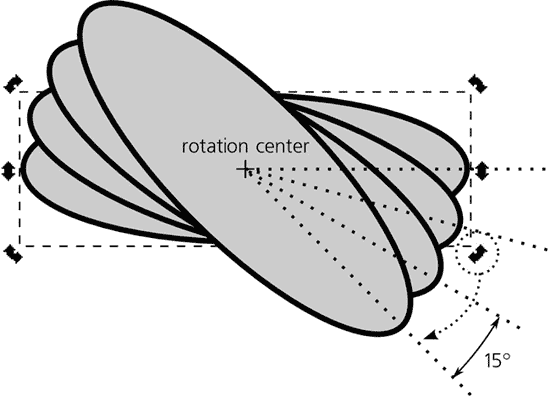
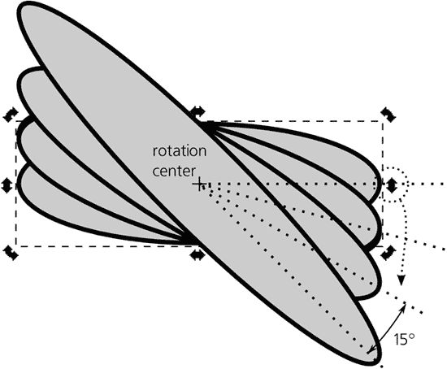
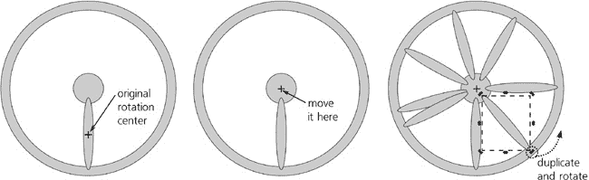
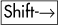
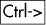
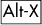
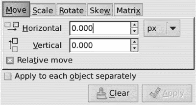
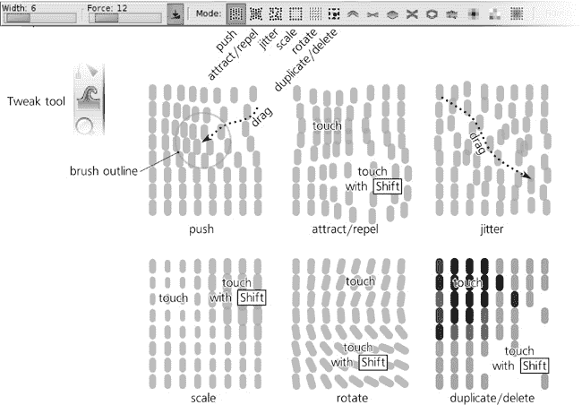
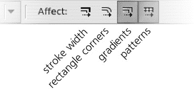

# 第六章. 变换

在 Inkscape 中，**变换**有一个相当狭窄的含义。尽管这个词可能意味着，但它并不指代**任何**对象的改变，而只是指影响整个对象四种简单操作：移动、缩放、旋转和倾斜。其他任何东西都不是变换。

比喻来说，变换对象就像在你家里移动家具，而不需要重新粉刷墙壁或打开任何柜子。

### SVG

应用到对象上的**变换**通常（但不总是）存储为 SVG 中的 `transform` 属性；有关何时写入以及相关的首选项设置，请参阅**A.7 变换**。

# 6.1 选择器：移动

在选择对象之后，变换它们是选择器工具的第二大重要功能。在所有变换类型中，移动是最简单的：只需抓住一个对象（如果它尚未被选中，点击会选中它；你只需处于对象的点击区域内即可实现这一功能）并拖动。

这种**自由拖动**既简单又富有启发性；你通常会在工作的早期阶段使用它，那时你需要移动很多东西以找到最佳的整体构图。（注意：与许多其他矢量编辑器不同，Inkscape 在实时中移动对象本身，而不仅仅是它的轮廓或框架。）

在你工作的后期阶段，你将更频繁地需要**约束拖动**。最常见的是水平或垂直拖动，同时按下 。当你按下并保持  拖动时，Inkscape 创建两条不可见的“轨道”，一条水平，一条垂直，它们在拖动开始的位置相交。然后选择可以沿着这些轨道移动，根据哪个更近跳到另一个：

图 6-1. 使用  的约束拖动

 在许多其他情况下也有约束动作的一般含义。在这方面，Inkscape 与通常使用  达到类似目的的 Adobe 应用程序不同。通过对齐，还有更多方式可以约束对象移动，我们将在下一章中讨论。

如您从上一章所知，有时仅选择所需的物体可能很困难；特别是，您可能必须使用-点击（选择下）和-点击（按组选择）来获取所需的物体。现在，如果您想拖动这些选定的物体，您可能会遇到问题：任何拖动都始于一个点击，而这个点击可能会非常容易地破坏您精心构建的选择，通过选择其他物体——比如位于您物体上面的物体，或者包含这些物体的组。

在许多情况下，解决这个问题最简单的办法是使用箭头键移动选择，而不是用鼠标拖动（**6.5 使用键盘快捷键进行变换**）。然而，如果您在开始拖动时按下键，您也可以使用鼠标拖动。这允许您从任何点拖动当前选择，不仅是从选择本身，也可以从空白画布或任何其他物体。

您可能会想知道这种-拖动如何与-点击兼容，后者*确实*通过“选择下”的方式改变选择。解决方案很简单：与常规的点击选择不同，“选择下”并不是在您点击鼠标按钮时发生，而是在点击后*释放*鼠标按钮时发生；如果在点击和释放之间，您没有移动鼠标超过点击/拖动阈值（**5.4 通过点击选择：选择工具**，默认为 4 屏幕像素），这被视为一个点击，并且执行“选择下”。否则，当前选择将被移动。

# 6.2 选择工具：缩放

现在我们来看一个更复杂的问题：*缩放*选择，或者将其放大或缩小。这不同于缩放；当您缩放时，您只是从更近或更远的距离查看您的绘图，而不会以任何方式改变它。缩放意味着实际调整对象的大小；这是一个不可撤销的操作。

为了缩放您的选择，选择工具会显示八个把手，四个位于选择框的角落，另外四个位于选择框的边缘。拖动边缘把手可以在一个方向上（水平或垂直）缩放选择；拖动角落把手可以在两个方向上缩放：

图 6-2. 使用选择工具进行缩放

默认情况下，角落把手可以在任何方向上自由移动。这意味着在一般情况下，所选对象的宽高比（也称为*宽高比*）将*不会*得到保留。你可以拉伸或挤压你的选择，甚至可以在单次拖动中使其变高*和*变窄，或者变低*和*变宽。侧把手也不会保留宽高比，因为它们只在单一维度上缩放。

锁定宽高比的最简单方法是按下。这会使角落和侧把手都按比例缩放。另一种实现方法是点击画布上方的选择器控制栏中的锁定切换按钮，位于可编辑的**W**和**H**字段之间：

图 6-3. 选择器控制栏中的宽高比锁定

当这个锁定处于开启状态（按下时），角落把手总是按比例缩放。然而，侧把手不受锁定影响，仍然只在单一维度上缩放。

通常，缩放工作方式是，选择的边界框的相对面（对于侧把手）或相对角（对于角落把手）保持固定。有时，你可能希望选择的中心保持固定，以便它从中心对称缩放。这正是所做到的。请注意，在任何缩放过程中，固定点总是通过一个十字标记来可视化：

图 6-4. 使用缩放选择中心

### 注意

*这里有一个有用的记忆法：在输入文本时，按下**会使字母变大（即，大写）；在缩放时，它也会使结果比没有时大两倍（因为它在中心点的两侧进行缩放）。

你可以像下面**6.4 旋转中心**中描述的那样，将缩放中心移动到任何位置。

剩余的修饰符在缩放过程中也扮演着角色。它允许你通过整数倍数缩放选择：增加到原始大小的 2 倍、3 倍、4 倍等，或者减少到原始大小的 1/2、1/3、1/4 等。可以与结合来锁定宽高比，或者与结合来围绕选择中心的中心点缩放。

# 6.3 选择器：旋转和倾斜

“我如何旋转对象？”这个问题在 Inkscape 用户论坛和邮件列表上非常常见。要旋转选择，您需要将选择工具切换到**旋转模式**，这里有一个关于如何进行切换的小秘密：通过选择上的**第二次点击**。（注意，这必须是一个明显的第二次点击，而不是快速的双击。）第三次点击将选择工具切换回缩放模式，第四次将其返回到旋转模式，依此类推：

图 6-5. 选择工具的缩放和旋转模式

### AI

*Inkscape 并非发明了这个功能；单独的选择模式是从 CorelDRAW 和 Xara 矢量编辑器中借用的。不出所料，大多数对这个约定有问题的用户都习惯了 Adobe Illustrator。*

第二次点击有一个问题：就像移动一样，有时可能无法在不选择其他内容的情况下点击选择（例如，如果选定的对象在组中或位于其他对象之下）。在这些情况下，只需按即可切换到旋转模式或返回。

一旦您处于旋转模式，旋转选择就像拖动角手柄一样简单。拖动侧面手柄会倾斜选择。

当旋转时， 将旋转角度限制为等距角度增量，默认每 15 度：

图 6-6. 受限制的旋转

这个限制角度可以在**Inkscape 首选项**对话框的**步骤**选项卡中更改（**旋转捕捉每**下拉菜单）。您可以从 0.5 度到 90 度之间的许多值中选择一个。

使用倾斜同样遵守相同的限制角度：

图 6-7. 受限制的倾斜

-旋转临时将旋转中心移动到被拖动的角手柄相对的边界框角。

# 6.4 旋转中心

当您将选择工具切换到旋转模式时，您将在选定对象或对象的中心看到一个十字标记。这是旋转中心。这个点对每个对象都是记忆的，并且是其永久属性之一；移动任何对象的中心是不可撤销的操作，并且当您保存文档时，所有对象的旋转中心都会与其一起保存。缩放、旋转或倾斜都是围绕这个点进行的，不仅是在选择工具中，而且在大多数其他地方也是如此（例如在**变换**对话框或通过键盘快捷键变换时）。

默认情况下，旋转中心位于对象的边界框的几何中心。使用选择工具，你可以自由地将其拖动到任何位置（在对象内部或外部）。在拖动过程中，中心会自动对齐到对象的边界框的边缘，到几何中心（其原始位置），以及通过几何中心的水平和垂直轴。这使得快速将旋转中心对齐回默认位置或边界框的角落变得容易。使用  拖动以抑制对齐；使用  拖动以限制其水平/垂直移动。

如果你通过任何方式移动对象（不仅仅是通过选择工具拖动），其旋转中心也会随之移动，因此它始终保持在对象相同的相对位置。不幸的是，目前还没有办法使用键盘移动对象的旋转中心——你只能通过鼠标拖动来操作它。

当选择了一个以上的对象时，整个选择也有一个旋转中心，那就是第一个被选择的对象的旋转中心（如果你是一个接一个地选择对象，通过使用 -点击）或者最接近 z 轴**底部**的对象（如果你是通过橡皮筋或通过  选择）。如果第一个或最底部的对象曾经将其旋转中心从默认位置移动开，整个选择将具有与该对象相同的旋转中心；否则，选择的旋转中心将位于默认位置——在选择的边界框的几何中心。

此外，如果你在选择了多个对象后拖动选择旋转中心，这将应用于**所有**选中的对象：每个对象都将拥有这个新的旋转中心位置。例如，如果你用多个辐条画一个轮子，你可以选择所有辐条，只需将旋转中心移动到轮子的中心一次。之后，即使你只选择一个辐条，它也会方便地围绕轮子的中心旋转。

此外，当你复制或克隆（**16.1 创建克隆**)对象时，旋转中心也会被继承。例如，你可以画一个单独的辐条，将其旋转中心移动到轮子的中心，然后复制（或克隆）那个辐条，并通过任何方法（通过使用选择工具拖动角手柄，通过键盘快捷键，或通过**变换**对话框）旋转副本。新的辐条将牢固地设置在轮子内部：

图 6-8. 使用旋转中心确保辐条属于轮子

# 6.5 使用键盘快捷键进行变换

通过拖动对象或其手柄在画布上变换对象是简单直观的，但不够精确（即使使用各种约束模式也是如此）并且有时可能会感觉相当笨拙。许多长期使用 Inkscape 的用户更喜欢使用键盘快捷键来完成大部分变换。

对象变换的键盘快捷键容易记忆，并且通常会使你的工作变得更加容易。学习这些键的另一个原因是，正如我们在本书的其余部分将看到的，它们在许多其他工具和上下文中被一致地使用来执行类似的功能——例如，使用节点工具变换节点，使用文本工具变换文本字符，或使用渐变工具变换渐变手柄。

### 注意

*从键盘上倾斜是不可能的，这是可以理解的，因为这种操作并不经常使用。*

## 6.5.1 移动

The , , , 和  方向键移动选择区域。移动的距离取决于修饰符。

+   没有修饰符时，箭头键每次移动 2 像素（2 SVG 像素单位，而不是屏幕像素，**A.6 坐标和单位**）。这是默认值；你可以在 **Inkscape 首选项** 对话框的 **步骤** 选项卡中更改它。

+   使用 ，箭头将选择区域移动 1 屏幕像素。这意味着实际距离取决于缩放级别，当你放大时可以进行更精细的移动，当你缩小视图时可以进行更粗糙的移动。这是最常见且最有用的快捷键之一，因为它具有精确性和适应性：使用它，你可以始终以当前缩放下仍然可察觉的最小距离移动选择区域。

+   使用 ，箭头的移动距离是没有使用  时的 10 倍。因此，简单的 -箭头默认移动 20 像素，而 -箭头在当前缩放级别下移动 10 屏幕像素。

键盘移动命令的简便性和可预测性使它们在许多不同情况下都很有用。例如，有时我需要处理被某个大型前景物体遮挡的对象。点击“选择下”可以工作，但通常太麻烦；将前景物体移动到新图层并隐藏该图层也是一个不错的选择，但更麻烦。在这种情况下，我通常会选中前景物体，并通过几个或按键将其移开（向右）。完成后，我会再次选中它，并通过相同数量的移动按键以相反方向精确地将其放回原位。（只需记住在这种情况下不要使用-箭头，因为当你移动对象回来时，可能处于不同的缩放级别，这会影响距离。）同样的“移开再回来”技巧在分析复杂构图时很有用，当我试图找出画布的哪些部分对应哪些对象时。

## 6.5.2 缩放

和按键（尖括号）分别用于缩小和放大选择区域。键盘缩放始终保持纵横比，并在对象的边界框的几何中心（而非可旋转的中心）进行缩放。同样，缩放量取决于修饰符。

+   没有修饰符的情况下，和按键以 2 像素（2 SVG 像素单位，而非屏幕像素）缩放。这个增量应用于两个维度中较大的那个；例如，如果对象比它高，其宽度增加 2 像素（边界框的左右边缘各移动 1 像素，方向相反），而其高度以成比例较小的量增加。默认值是 2 像素；您可以在**Inkscape 首选项**对话框的**步骤**选项卡中更改它。

+   使用时，和按键以 2 屏幕像素缩放，因此在大尺寸的边界框中，边缘各移动 1 屏幕像素。与-箭头一样，这意味着实际距离取决于缩放级别，当你放大时可以更精细地缩放，当你缩小时可以更粗糙地缩放。

+    对  和  键没有影响。这是因为在一些键盘上，你需要按下  才能输入这些字符。顺便说一句，（逗号）和 （点）分别作为  和  使用，因为在许多键盘上它们是物理上相同的键。

+   使用 ， 和  键以 2 倍的比例缩放——也就是说，它们使选择分别变为原来的一半和两倍。当你需要按大比例缩放时，这很方便；例如，先按  几次，以接近所需的大小，然后使用  或不带修饰符的相同键进行更精确的调整。

## 6.5.3 旋转和翻转

 和  键（方括号）分别逆时针和顺时针旋转选择。旋转是在 Selector 的旋转模式下可见的可移动旋转中心周围进行的；除非你移动了它，否则它是对象边界框的几何中心。再次强调，旋转的量取决于修饰符。

+   不带修饰符时， 和  键旋转 15 度。这是与使用  的鼠标旋转相同的角度约束值。它可以在**Inkscape 首选项**对话框中的**旋转捕捉每**下拉菜单中更改。

+   使用 ， 和  键旋转的角度使得选择的边界框角移动 1 个屏幕像素。这意味着实际的旋转角度取决于缩放级别，当你放大时可以旋转得更精细，当你缩小时可以旋转得更粗糙。

+   对和键没有影响，原因与它对和键没有影响相同。

+   使用，和键旋转 90 度（四分之一圆周）。

此外，四种常见的变换可以通过键盘快捷键和选择工具控制栏上的按钮来访问，如图图 6-9 所示：

+   可以通过逆时针和顺时针旋转 90 度来选择旋转，也可以通过和来访问。

+   水平和垂直翻转选择，也可以通过和来访问。

图 6-9. 选择工具的控制栏：变换按钮

### 注意

*翻转相当于在相应维度上按-100%的比例缩放。*

要使两个对象*交换位置*，可以使用双重翻转：首先，选择它们两个，并将它们作为一个整体翻转；然后，依次选择每个对象并单独翻转以恢复它。为了使交换二维化，您需要执行此操作两次，一次使用水平翻转()，然后使用垂直翻转()。

艺术家有时会使用翻转来检查他们的作品。当你画某物时，很容易因为长时间地看着它们而逐渐对错误视而不见。在这种情况下，将整个绘图水平或垂直翻转可以让你以全新的视角看待绘图，并使许多与形状、平衡或构图相关的问题痛苦地明显。

# 6.6 使用数字进行变换：X, Y, W, 和 H

有时，鼠标和键盘的变换方法都不太能满足需求，因为你确切地知道你想要移动对象多远（或到什么点），或者想要旋转它们的角度。Inkscape 允许你为变换选择指定确切的数值。

这可以在两个地方完成。一个是选择工具的控制栏：

图 6-10. 选择器工具的控制栏：X、Y、W 和 H 字段

在这里，**X**和**Y**值指定选择的位置，**W**和**H**指定其宽度和高度。这些值不仅会在您选择和取消选择对象或移动或缩放选择时自动更新，而且还可以让您输入任何值，以使选择相应地移动或缩放。

### 注意

***X**和**Y**值的坐标原点位于页面的左上角 (**3.4.3 页面大小**)。

在字段中输入一个值后，按  以激活它，或者按  以激活它并移动到下一个字段。要从键盘跳转到第一个字段，按 。

在可编辑字段右侧，有一个下拉菜单用于选择值的单位。Inkscape 支持多种单位，包括**in**（英寸）、**pt**（点，每个点为 1/72 英寸）、**mm**（毫米）和**cm**（厘米）。默认单位是**px**（SVG 像素，**A.6 坐标和单位**)。

最有用的单位之一是**%**（百分比）。它允许您将对象按相对于其当前大小的百分比进行缩放，而不是按绝对大小缩放。例如，要将选择缩放到其大小的 1.5 倍，将单位切换到**%**，并在**W**和**H**字段中输入`150`（如果您在它们之间点击锁定按钮，只设置其中一个字段为`200`就足够了）。

# 6.7 变换对话框

一个更强大的用于数值变换对象的工具是**变换**对话框 ()。它为之前讨论的四种变换类型（移动、缩放、旋转和倾斜）以及一个完整的变换矩阵选项卡分别提供了单独的选项卡。通常，您可以选择一个选项卡，输入您想要的值，然后点击**应用**。

让我们按顺序查看这些选项卡。

## 6.7.1 移动选项卡

与选择器控制栏中的**X**和**Y**值不同，它们始终显示选择的绝对坐标，在**移动**选项卡（如图 6-11 所示）中，您可以查看和指定绝对坐标和相对位移。默认情况下，**相对移动**复选框被选中，因此**水平**和**垂直**字段最初显示零，您输入的任何数字都会将选择移动**该距离**（例如，`3`和`0`的值将选择向右水平移动 3 个单位）。

图 6-11. 变换对话框的移动选项卡

现在，取消选中**相对移动**复选框；你会看到字段中的值已经改变。它们现在显示的是选择的当前坐标，与选择器控制栏中的**X**和**Y**字段相同。单位下拉菜单也以类似的方式工作。

### 6.7.1.1 通过调整间隔进行移动

如果选择了多个对象，并且同时选中了**分别应用于每个对象**和**相对移动**复选框，则每个对象都会移动，不是相对于它自己的先前位置，而是相对于其邻居——最近的左侧（对于 X）或下方（对于 Y）选中的对象。这使得“分散”或“紧密排列”对象集合变得容易。

例如，如果你需要分散一行对象，选择它们，并在两个复选框都选中时水平移动它们 5 px。最左侧的对象将向右移动 5 px，下一个对象将移动 10 px，以此类推，直到最右侧选中的对象被移动 5*n* px，其中*n*是所选对象的数量。结果，相邻对象之间的每个间隔将增加 5 px，整个行将被分散，就像字间距调整分散文本字符串（**15.3.4 字间距和行间距**）一样。将这些对象向左移动-5 px 将相反地使它们更紧密地排列在一起：最左侧的对象将向左移动 5 px，下一个对象将移动 10 px，以此类推。对于垂直移动，效果相同，只是它从最接近底部的对象（即具有最小 Y 坐标的对象）开始。

### 注意

*如果对象重叠，则对象移动的顺序可能不明显。规则是，对于水平移动，对象的边界框的左侧边缘或对于垂直移动的底部边缘将被排序以确定相对于哪个对象移动。选择对象的顺序或它们的 z 顺序没有区别。* 

## 6.7.2 缩放标签页

在这里，默认单位始终是**%**，这允许你通过给定的比例快速缩放选择（例如，200%将选择放大两倍或 50%将缩小到一半大小）。单位下拉菜单包含你可能需要的所有绝对单位（切换到它们将显示的值从 100%更改为所选单位中选择的宽度和高度），而**按比例缩放**复选框与选择器控制栏上的锁定按钮类似。

到目前为止，此选项卡能够执行的所有操作也可以通过选择工具的**W**和**H**控件来完成。然而，重要的**单独应用于每个对象**复选框是此对话框独有的：它将相同的缩放应用于每个选定的对象，围绕其自身的旋转中心进行缩放（**6.4 旋转中心**），而不是将选择作为一个整体围绕其中心进行缩放。对于**%**单位，这意味着以相同的比例缩放每个选定的对象；对于所有其他单位，这会导致所有选定的对象获得相同的指定宽度和高度。

与**移动**选项卡（以及选择控件）不同，当您通过其他方式（例如拖动手柄）变换选择时，**缩放**选项卡（如图 6-12 所示 Figure 6-12

Figure 6-12. Transform 对话框中的缩放选项卡

## 6.7.3 旋转选项卡

此选项卡（如图 6-13 所示 Figure 6-13**）旋转整个选择，而是围绕每个对象的自身旋转中心分别旋转。

Figure 6-13. Transform 对话框中的旋转选项卡

## 6.7.4 倾斜选项卡

此选项卡（如图 6-14 所示 Figure 6-14

图 6-14. 变换对话框的倾斜选项卡

单位下拉菜单包含绝对长度单位、百分比和角度单位（度数和弧度）。以下是它们的工作方式：

**绝对单位**

+   使用绝对单位时，**水平**值指定选择框顶部边缘向右（正值）或向左（负值）的绝对位移；**垂直**值指定左侧边缘向下（正值）或向上（负值）的位移。

**百分比**

+   使用%单位时，值指定方式与绝对单位相同，但位移量计算为边界框相邻垂直边的给定百分比值。换句话说，这个百分比等于倾斜角的**正切**。例如，将垂直方向上的矩形倾斜 100%会导致其原本水平的边以 45 度角倾斜。

**角度单位**

+   这允许您直接设置倾斜角度——即移动边的相邻边的角度。例如，将对象垂直倾斜 45 度与倾斜 100%或对象宽度的绝对值相同。

### 注意

将对象旋转 90 度是一种创建“无限”对象（当然，在现实中，它将在倾斜的方向上变得非常大，但不是无限的）的简单方法。

## 6.7.5 矩阵选项卡

此选项卡（如图 6-15 所示）允许您直接编辑对象存储在其`transform`属性中的**变换矩阵**（**A.7 变换**）。变换矩阵的代数解释超出了本书的范围；对于实际应用，只需知道最右侧的两个值（标记为**E**和**F**）代表对象的位移（它移动了多远），而其他四个值共同编码了其缩放、旋转和倾斜。

图 6-15. 变换对话框的矩阵选项卡

默认情况下，**编辑当前矩阵**复选框未选中，该选项卡显示一个**单位矩阵**，其中**A**和**D**的值为 1，其他所有值均为 0。如果您更改任何值并点击**应用**，此矩阵将被**后乘**到对象的当前矩阵上，即应用于所选对象当前变换之上。如果您选中**编辑当前矩阵**复选框，该选项卡将显示并允许您直接编辑所选对象的当前矩阵。（如果选择了多个对象，则将显示第一个或最底部的选中对象的矩阵。）

因此，**矩阵**选项卡提供了一种在不进入 XML 编辑器的情况下重置对象`transform`属性的方法：勾选**编辑当前矩阵**，然后点击**清除**（这将值重置为单位矩阵），并点击**应用**。

# 6.8 粘贴大小

一种在不使用任何对话框的情况下快速为对象指定特定大小的方法是将其大小**粘贴**到上面。为此，您必须首先复制（）一个您想要分配给其他对象大小的对象。之后，使用**编辑**菜单中的**粘贴大小**子菜单中的命令。

此子菜单中的六个命令实现了粘贴的各种组合。

+   可以粘贴宽度（高度保持不变）、高度（宽度保持不变）或大小（宽度和高度都改变）。

+   将大小粘贴到整个选择中或分别粘贴到每个选定的对象中（类似于**变换**对话框中的**分别应用于每个对象**复选框）。

例如，如果您已经导入了许多位图图像，并且想要从它们中创建一个缩略图画廊，您可以通过绘制一个所需缩略图大小的矩形，将其复制到剪贴板，然后选择所有图像并选择**编辑** ▸ **粘贴大小** ▸ **单独粘贴大小**来统一它们的大小。

# 6.9 使用 Tweak 工具进行变换

Tweak 工具（或）是一种多功能的工具，它不仅将相同的“软画笔”隐喻应用于变换对象，还应用于样式化（**8.7 颜色调整**)和编辑路径（**12.6 路径调整**）。此工具具有多个**模式**；在本章中，我们将介绍处理变换、复制和删除对象的模式。使用这些模式，可以轻松地将集合对象，如克隆镶嵌，扫入复杂和自然 istic 图像中——**用散射来绘制**。

Tweak 工具的所有模式都共享一些共同的功能。无论您处于哪种模式，您都使用一个圆形软边缘画笔（光标下的橙色圆圈），该画笔由控制栏上的**宽度**和**力量**参数控制，并受笔压（如果您有压感平板）的影响。您使用这个画笔在选定的对象上“绘画”以改变它们。

笔刷的*宽度*从 1 到 100 不等，但这些不是绝对单位；无论缩放如何，1 给你一个非常小的笔刷，而 100 给你一个大约与你的屏幕大小相当的笔刷。在这个工具中，你将始终看到以鼠标光标为中心的圆形笔刷轮廓，并显示当前笔刷的宽度。你可以通过使用工具栏上的**宽度**控件或（较窄）和（较宽）键来更改此值。笔刷是柔和的；其作用在中心最大，并随着向边缘的平滑减少，呈现钟形轮廓。

类似地，*力度*范围从 1（非常弱；你需要多次轻触对象才能产生可见效果）到 100（非常强；笔刷的第一笔就能在笔刷下施加最大效果）。要更改力度，请使用工具栏控件或按（较弱）和（较强）键。

要了解 Tweak 工具的工作方式，在测试绘制中创建多个小对象。最简单的方法是设置一个大约 10x10 的小克隆平铺（**16.6 平铺克隆**)，但你也可以从一个椭圆或路径开始，手动复制()或克隆()它几次，拖动复制。现在，选择你创建的所有对象，切换到 Tweak 工具，调整**宽度**使圆圈一次覆盖多个对象，将**力度**设置为 20 的适中值，通过其切换按钮启用一种模式，并开始拖动对象。显示了会发生什么。

图 6-16. 使用 Tweak 工具的模式转换半透明对象的散布

**移动模式**

+   将笔刷下选中的对象移动到你拖动笔刷的方向。此模式类似于简单地拖动对象，但不同之处在于，你不需要单独拖动每个对象，而是拖动一个笔刷，它柔和自然地“扫过”所有它碰到的对象。请注意，未选中的对象永远不会受到影响；实现这一点最简单的方法是将所有可调整的对象分组，然后简单地选择该组。

**吸引/排斥对象模式**

+   将画笔下的选定对象吸引到光标处（默认）或从光标处推开（按住 ）。这是一种“吸入”或“吹大”散布某些区域的方法。

**移动抖动模式**

+   将画笔下的选定对象随机移动到随机方向和距离。您按得越重，**力量**越高，抖动就越重。这是一种“摇动”您构图的方法，如果它变得过于坚固。

**缩放模式**

+   缩小画笔下的选定对象（默认）或放大（按住 ）。此模式允许您向散布引入缩放非均匀性——在图像的一些部分平滑地使对象变大，在其他部分变小。

**旋转模式**

+   将画笔下的选定对象顺时针旋转（默认）或逆时针旋转（按住 ）。这允许您向散布引入非均匀的旋转，例如将散布纹理“弯曲”以适应图像不同部分的占主导地位的方向。

**复制/删除模式**

+   在画笔下随机复制一些选定的对象（默认）或删除一些对象（按住 ）。与往常一样，对象被复制或删除的概率取决于力量和笔压。这通过提供一种在需要的地方加厚和变薄散布的方法，完成了“散布绘图”工具集。

    与常规的**复制**命令（**4.4 复制、剪切、粘贴和复制**）一样，使用调整工具进行复制会将副本直接放置在原始对象上方，因此复制后使用抖动模式将它们分开是个好主意。如果原始对象已被选中（例如，如果您正在调整一组对象，它们将在该组内被复制，并且不会单独选中），则工具创建的副本将自动添加到选中项中。

# 6.10 影响哪些变换

现在您可以通过无数的方法变换对象，是时候更仔细地看看当您这样做时，究竟是什么被变换了。实际上，Inkscape 可以可选地影响或不影响对象的某些特定部分。这由选择工具控制栏右端的**影响**切换按钮控制：

图 6-17. 选择工具的控制栏：影响按钮

有四个**影响**切换按钮，按以下顺序排列：

**笔触宽度**

+   此按钮仅适用于缩放，对移动、旋转或倾斜没有影响。当此按钮开启时，任何具有描边的缩放对象（**8.1.1 绘画**）的描边宽度将按相应比例缩放。例如，如果您将一个 2 像素宽的描边对象缩放到当前大小的两倍，并且此按钮开启，则结果对象将具有 4 像素宽的描边。如果此按钮关闭，它将保持 2 像素宽的不变描边宽度。

    如果您在不保持纵横比的情况下缩放对象，并且开启**影响描边宽度**按钮，描边将按垂直和水平缩放比率的乘积的平方根缩放。例如，如果您将对象水平缩放到两倍宽度但保持其高度不变，则描边宽度将增加 1.415 倍（2 的平方根）。

    保持描边宽度不变更为常见。例如，在计划或草图上，您通常希望所有对象都具有相同的固定描边宽度，不受缩放影响，因此您会关闭此按钮。只有当您将描边用作纯视觉元素（例如自由手绘中的刷状描边）时，才需要开启此按钮。

### 注意

*笔和铅笔工具创建的轮廓线（第十四章）在对象缩放时总是缩放其宽度。*

**圆角矩形**

+   此按钮仅适用于缩放，对移动、旋转或倾斜没有影响。它控制 Inkscape 是否缩放矩形的圆角（**11.2.2 圆角**）。当此按钮开启时，矩形整体缩放，就像将其转换为路径时的缩放一样；这可能会导致圆角变得更大、更小或不再圆润。当此按钮关闭时，Inkscape 将保留圆角的原样。这在例如流程图图表中很有用，您希望所有方框都具有相同的圆角，而与它们的尺寸无关。

**渐变**

+   此按钮控制是否将变换应用于对象填充或描边的渐变（**10.1 渐变工具**）。由于渐变（更准确地说，渐变停止点的位置）可以移动、旋转、倾斜以及缩放，因此此按钮适用于任何类型的变换。当此按钮开启时，渐变停止点将作为一个整体与带有渐变的对象一起变换。当此按钮关闭时，渐变将粘附在画布上（位置、方向或缩放不变），而对象被变换。

    例如，当这个按钮关闭时，可以将一个对象移动到它自己的梯度之外，或者将其放大以便更多的梯度变得可见。这在梯度位置与您绘图中的其他对象精确协调时很有用，而对象本身只是那个梯度的“窗口”，您想要移动或调整窗口的边缘而不触及梯度本身。

**图案**

+   这个按钮与**影响梯度**按钮完全类似，只是它应用于图案（**10.8 图案）而不是梯度。

### 注意

*在未来的版本中，可能会添加更多的**影响**按钮——例如，用于缩放或不缩放路径效果（[第十三章](ch13.html "第十三章。路径效果和扩展"））或滤镜效果（[第十七章](ch17.html "第十七章。滤镜"））。*

### 注意

*有一个令人烦恼但无害的 bug：无论**影响**按钮的当前位置如何，在选择工具中使用鼠标交互式变换对象时，始终会显示描边、圆角、渐变和图案在拖动鼠标时的变换效果。然而，一旦您释放鼠标，一切都会根据**影响**按钮的当前状态进行纠正。*
