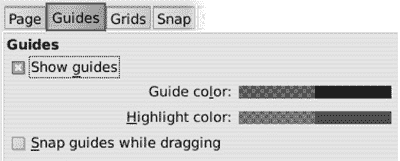
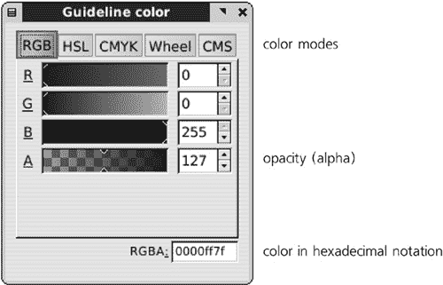
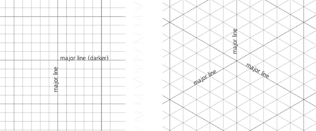
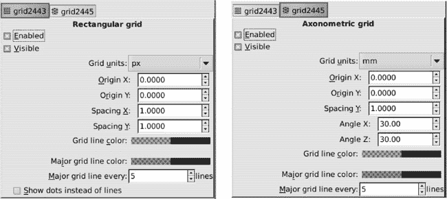
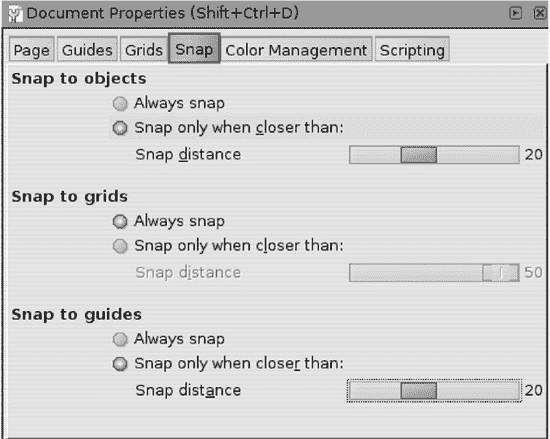
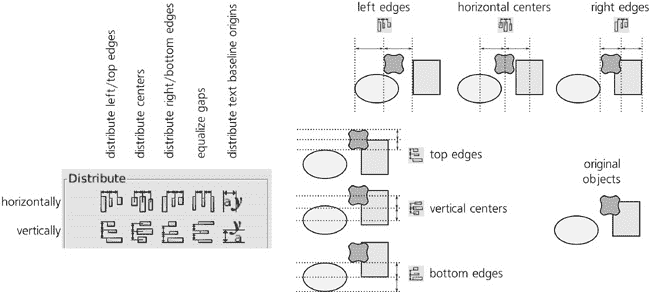
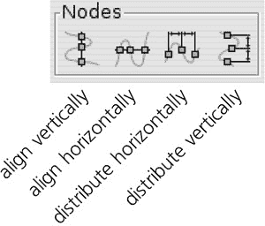
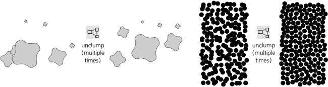

# 第七章. 捕获和排列

作为上一章的后续，我们将探讨更多高级变换主题。Inkscape 不仅允许你自由变换对象，而且可以快速、精确地进行变换，在一定程度上还可以自动进行。

*捕获*指的是使某些点、线或路径像磁铁一样工作，当你变换靠近这种磁吸引物的东西时，你正在变换的对象“捕获”到精确的期望位置。*排列*以规则的方式移动大量对象，使它们对齐、分布、散布或整齐排列成你想要的样子。

# 7.1 引导线

将对象捕获到对齐位置的最简单方法是通过创建一个引导线或引导。*引导线*是在画布上的可见、无限长的直线，但它们不是对象。它们不能被选择，它们不会打印，也不会出现在位图导出中。尽管它们会随文档保存，但它们不是 SVG 标准的一部分，因此在 Inkscape 以外的 SVG 查看器中是不可见的。它们只是 Inkscape 特定的辅助工具，用于组织你的艺术品。

例如，引导线可以分隔你的布局部分，帮助你可视化各个区域或单元格的边缘。引导线可以是一条中心线，帮助你围绕它对称地绘制。或者，你可以使用引导线快速检查几个对象是否真的对齐，或者只是看起来对齐。

要创建一个引导线，你必须使标尺可见。（如果你已经隐藏了标尺，可以通过显示它们。）在标尺上的任何位置点击，然后在不释放鼠标的情况下，将光标拖动到画布上。你会看到一个新标尺出现，你现在可以将其放下（通过释放鼠标）到你想要的位置。自然地，从水平标尺拖动创建*水平引导线*，从垂直标尺拖动创建*垂直引导线*；更有趣的是，从标尺的末端拖动创建*对角引导线*，默认情况下以 45 度倾斜。

图 7-1. 通过从标尺拖动创建引导线

移动引导线很容易：使用选择器或节点工具，只需抓住引导线并将其拖动到你想要的位置。（当你将鼠标悬停在引导线上时，它会从蓝色变为红色，这表示现在可以抓住它。）要删除引导线，只需将其拖回到标尺上并放下，或者点击它。

要隐藏文档中的所有指南，请按  键（这是竖线字符，通常与  键在同一键上，但需要按  键才能触发）。然而，这不会删除任何内容；如果您再次按  键（或尝试创建新的指南），所有隐藏的指南将再次显示。此键控制指南的可见性和吸附到指南（您不会吸附到不可见的指南）；如果您只想禁用吸附而不隐藏指南，请使用  键（全局吸附切换，**7.3 吸附**）。

## 7.1.1 指南对话框

在 Inkscape 中，虽然您可以通过拖动手动移动指南，但也可以通过数字精确指定指南的位置和角度。这通过 **指南** 对话框（图 7-2

图 7-2. 指南对话框

+   对于水平指南，**角度** 为 0，而 **Y** 确定指南的高度。

+   对于垂直指南，**角度** 为 90，而 **X** 确定指南的水平位置。

+   最后，对于斜线指南，**X** 和 **Y** 值共同确定指南通过的 *锚点*（最初，这是创建指南时释放鼠标的点）。在画布上，锚点显示为一个小的圆圈。**角度** 设置斜率（默认为 45 度）。

选择 **相对变化** 复选框会将对话框中的所有可编辑字段重置为零；现在您输入到其中的任何值都将 *添加* 到当前值，而不是替换它们。完成操作后，点击 **确定** 以使更改生效；**删除** 按钮删除指南。两个按钮都会关闭对话框。

此对话框是 *模态的*，这意味着在显示时它会锁定 Inkscape 的其余部分。

## 7.1.2 指南属性

一些影响所有指南的通用选项可以在 **文档属性** 对话框的 **指南** 选项卡中找到（），如图 7-3 所示。为什么不使用全局 **Inkscape 预设** 对话框呢？因为这些选项被认为是文档本地的，并且与文档一起保存。这意味着不同的文档可以有不同的指南设置。

图 7-3. 文档属性对话框中的指南设置

这里你可以看到全局参考线可见性复选框。默认情况下是开启的，允许你快速隐藏（但不能删除！）文档中的所有参考线。你可以通过按键来切换参考线可见性，甚至无需打开对话框。切换参考线可见性也会切换到参考线的自动对齐。

接下来，你可以更改参考线在正常状态（默认为半透明蓝色）和鼠标悬停时（默认为半透明红色）的颜色和透明度。点击颜色样本会打开一个小颜色选择对话框：

图 7-4. 颜色选择对话框

**A**滑块设置*alpha*（透明度）。你将在许多其他情况下也会看到此对话框（例如，在选择页面背景颜色时）。

最后，当你拖动参考线时，你可以让它们自动对齐。通常，添加参考线是为了让你可以将对象*对齐到*它们，但当你移动它们时，自动对齐参考线本身也是有用的。参考线只会自动对齐到对象的边界框，而不是其他参考线或网格。

## 7.1.3 从对象创建参考线

将对象转换为参考线是一种一次性创建多个参考线的方法。这是通过在**对象**菜单中选择**对象到参考线**命令来完成的。

### 注意

*默认情况下，此操作会销毁选定的对象，并用一串参考线替换它们。但是，你可以在**Inkscape 首选项**对话框的**工具**选项卡中勾选**转换参考线后保留对象**复选框以防止这种情况发生，或者简单地在使用转换之前按*  *键。*

图 7-5 展示了此命令对不同类型对象的操作方式：

+   对于路径或矩形，它将每个直线路径段或矩形边替换为重合的参考线。例如，如果你只是画一个矩形并将其转换为参考线，你将有一个由两条垂直线和两条水平线界定的矩形区域。或者，为了快速创建通过两个给定点的斜参考线，切换到钢笔工具（**14.1 钢笔工具**），点击一个点，双击另一个点（以完成直线路径），然后将此路径转换为参考线。

+   对于 3D 盒子（**11.3 3D 盒子**），盒子的所有 12 条边都被转换为参考线。

+   对于其他任何东西，对象的边界框的四个边被转换为两条垂直线和两条水平线参考线。

图 7-5. 将各种对象转换为参考线

# 7.2 网格

网格可以看作是辅助线思想的进一步发展。一个*网格*就是一个覆盖整个画布的规则辅助线图案。网格通常用于吸附、等间距分布对象、建模像素网格（见图 3-3)、轴测绘图（第二十三章)以及许多其他用途。

Inkscape 支持两种类型的网格：*矩形*和*轴测*。一个文档可以显示多个网格，类型和/或间距不同。要在你的文档中创建一个新的网格，请转到**文档属性**对话框的**网格**选项卡，在**创建**下选择所需的网格类型，然后点击**新建**。新网格将在文档中亮起：

图 7-6. 矩形和轴测网格

如图 7-6 所示，矩形网格由两组垂直的导线组成，而轴测网格有三组，一组垂直，另外两组成角度（默认为 30 度）。矩形网格是最常见的类型，而轴测网格主要用于绘制轴测场景（即没有消失点的伪 3D 绘图）。

如果你在一个带有网格的文档中放大和缩小，你会注意到 Inkscape 会尝试在一定的限制内保持网格线的视觉密度。当你缩小视图时，线条当然会彼此靠近，但到了某个点，Inkscape 会认为杂乱无章难以承受，于是清理网格，切换到只显示每第十条网格线。继续缩小视图，网格线的这种减少会反复发生，以便保持网格的可管理性。由于默认的矩形网格间距为 1 像素，在大多数缩放级别上——如果不是这种自适应隐藏的话——网格会如此密集地覆盖页面，以至于你无法工作。

相反，如果你放大视图，Inkscape 将逐渐显示越来越多的网格线，以便均匀地填充你的屏幕。只有当你达到一个所有线条都可见的缩放级别时，新线条才会停止出现：你现在可以看到整个网格，没有任何省略。

在近距离缩放时，你会注意到每第五条线（称为*主线*）比其余的线（*副线*）稍暗。这是 Inkscape 为了使在网格中导航更容易而采取的另一种措施，类似于有些标记比其他标记更大的尺子。

要隐藏文档中的所有网格，请按键。这不会删除任何内容；如果你再次按，所有隐藏的网格将再次显示。此键控制网格可见性和对齐网格（即，你不会对齐到不可见的网格）；如果你只想禁用对齐而不隐藏指南，请使用键（全局对齐切换，**7.3 对齐**）。

## 7.2.1 网格选项

可以在**文档属性**对话框中更改网格的许多方面。一旦创建了一个网格，你将在对话框底部看到一个网格属性面板：

图 7-7. 网格属性（左，用于矩形网格；右，用于轴测网格）

注意，你可以在同一文档中创建多个网格，并且默认情况下它们将同时可见（尽管你可以分别启用或禁用其中的任何一个）。在对话框中，每个网格都将有自己的选项卡。

让我们看看你可以为网格更改什么：

+   你可以在显示和隐藏网格之间切换，以及启用或禁用对齐到它。如果网格被隐藏，你无法对齐到它，因此取消选中**可见**复选框将禁用其余属性。

+   **原点**和**间距**值定义了网格中线条的位置和密度。（然而，请注意，如果你使网格过于密集，Inkscape 仍然不会显示所有线条，直到你足够接近地放大。）对于矩形网格，有两个间距值：**X**（水平）和**Y**（垂直）。对于轴测网格，只有一个间距值——斜线之间的 Y 轴距离；垂直辅助线之间的间隔完全由这个距离和轴测角度决定。所有这些值都像往常一样，与一个单位选择器（下拉列表）相关联。

+   **角度**仅适用于轴测网格。这两个值设置两组对角线的角度；默认情况下，两者都是 30 度，但它们可以是 1 到 89 度之间的任何值，且不必相等。

    ### 注意

    *如果你在你的文档中添加了轴测网格，将创建具有与网格相同角度的新对角辅助线（**7.1 辅助线**）。*

+   可以分别为主要和次要网格线设置不同的颜色。默认情况下，它们都是蓝色，但次要线条的透明度较低，因此不太明显。

+   可以调整主要线条的频率；默认情况下，每第五条网格线是主要的。

+   对于矩形网格，您可以选择复选框以显示点状网格而不是线状网格；点位于线状网格的交叉点处。主要线交叉处显示小圆圈而不是点。

如果您需要的是可快照的辅助线网格而不是真实对象的网格（即，其他 SVG 软件将像 Inkscape 一样显示的网格），您可以使用克隆平铺（**16.6 平铺克隆**)或**网格**扩展（**13.3 路径扩展**)。

# 7.3 快照

现在您已经了解了关于辅助线和网格的所有内容，是时候看看辅助线和网格最常用于什么了：快照。

快照的概念很简单：Inkscape 可以尝试将东西放置在您*想要*它们所在的位置，而不是您用不可避免的不精确鼠标或平板电脑笔移动实际移动它们的位置。一旦您将一个*可快照的*（可以快照的东西）移动到足够接近一个活动的*快照目标*，它就会跳到正确的位置。快照是一种基本的交互式操作；它可能只在你用鼠标拖动某物时发生（例如，当您使用键盘上的箭头键移动东西或使用**对齐和分布**对话框时不会发生）。

可快照的对象可以是整个对象，也可以是对象内部的不同类型的节点或点（路径节点、渐变句柄、中心点等）。除了辅助线和网格之外，快照目标还可以包括其他对象及其部分（即，如果允许，对象可以快接到对象上）。

快照是一个大主题，但并不深奥；一旦你掌握了基本概念，其余的只是记住众多的模式和切换。如果您不需要快照且不使用辅助线或网格，您可能永远不会被它打扰。无论如何，请记住有一个*主快照切换*——即！键——它可以在整个程序中启用或禁用所有类型的快照。（记住这个快捷键的一个记忆方法是看作%符号是即将快接到斜线辅助线上的两个对象。）与！（辅助线切换）和！（网格切换）不同，此键仅切换快照行为，但不会隐藏或显示任何内容。

## 7.3.1 快照控制栏

大多数快照控制都收集在*快照控制栏*中，默认情况下显示在命令栏和画布上方的工具控制栏之间。使用**视图** ▸ **显示/隐藏** ▸ **快照控制栏**来打开或关闭此工具栏。

图 7-8. 快照控制栏

控制栏最左边的按钮是主快照切换按钮；如果它处于关闭状态，则控制栏上的所有其他按钮都将被禁用。

除了网格和参考线之外，可以吸附并吸附到的东西可以分为两大类，对应于吸附控制栏上最大的两个部分：选择工具中的边界框（**4.2 边界框**）以及其余工具中的节点和句柄。虽然在某些情况下，一个组中的东西可以吸附到另一个组中的东西，但通常它们只在其自己的家族内部吸附。特别是，截至 Inkscape 0.47 版本，节点和句柄永远不会吸附到边界框上（尽管这可能在以后的版本中改变）。这两组选项的详细信息将在以下章节中详细说明。

最后，工具栏上最后三个按钮控制着适用于两组的主要吸附目标：页面的边缘（**2.3 接口概览**）、网格（**7.2 网格**）和参考线（**7.1 参考线**）。所有这些只影响吸附，但与  和  键不同，它们不会隐藏吸附辅助工具。

在吸附工具栏按钮的所有图标上，*蓝色*点表示*可吸附点*（即吸附的对象），而*绿色*线和圆圈对应*吸附目标*（即您要吸附到的对象）。一些按钮可以启用/禁用这两种角色中的一种元素。

## 7.3.2 边界框吸附

如果您只需要对整个对象进行对齐，而不关心节点或其他特殊点，请使用边界框吸附。

在边界框按钮组中，第一个按钮启用*边界框角*作为可吸附点。（与可以是点或线的吸附目标不同，可吸附点只能是点。）现在，当您使用选择工具拖动或变换任何东西时，选择的边界框将吸附到您启用的任何吸附目标。除非此按钮处于开启状态，否则本组中的所有其他按钮都将变灰。

接下来的两个按钮启用边界框的*边*和*角*作为吸附目标。这包括您绘图中的所有可见对象的框，无论它们是否被选中。（例如，如果您只想将角吸附到角上，请在此组中启用第一个和第三个按钮。）在这种情况下，当您同时有一个线和该线上的一个点作为吸附目标时，当您足够接近该点时，点（即边界框角）将接管，但如果您接近吸附线但远离角，您将吸附到线上的最近点，并轻松地沿着它滑动。

本组最后两个按钮将*边界框边的中心*和*整个框的中心*作为可吸附点和吸附目标。

图 7-9. 边界框吸附选项

## 7.3.3 节点和句柄吸附

此组控制不仅路径节点（**12.1 路径的解剖结构**)的捕捉，还包括渐变/图案句柄（**10.1 渐变工具**，**10.8 图案**），旋转中心（**6.4 旋转中心**），文本基线起点（**15.3.3 字距调整**），以及一些其他特殊点。

再次强调，此组中的第一个按钮作为该组的本地主开关；它激活节点和句柄作为可捕捉对象，没有它，此组中的所有其他按钮都将变为灰色。

下一个按钮启用对**路径**的捕捉：您可以在您的绘图中的任何路径上捕捉并滑动节点（它不必被选中），但这些路径上的交点、节点和中点对您正在拖动的节点没有特别的吸引力。这些捕捉目标由接下来的四个按钮打开：*路径交点*（**12.1.2 路径填充**），*尖点节点*，*平滑节点*（**12.5.5 节点类型**），以及路径中直线段的中点（图 7-10）。

最后两个按钮为节点添加了两个额外的捕捉目标：*几何对象中心*和*旋转中心*（最初与几何中心相同，但可以移动到任何位置）。

图 7-10. 节点捕捉选项

## 7.3.4 捕捉首选项

在**文档属性**对话框的**捕捉**选项卡中，您可以调整捕捉距离——您必须接近捕捉目标多近才能发生捕捉。此参数是针对文档的，并且可以分别设置用于捕捉对象（即，到边界框、路径、节点等）、网格和辅助线的捕捉。

对于网格，默认设置是**始终捕捉**，这意味着在任何距离都会发生捕捉（对于网格来说，无论如何，距离不能超过网格间距）。如果您缩小了视图，一些网格线被隐藏（**7.2 网格**），则只会对可见的网格线进行捕捉。

对于对象和辅助线，默认情况下，在 20 个屏幕像素或更近的距离处触发捕捉。使用屏幕像素单位确保捕捉力与缩放无关；如果您想将可捕捉对象移动到足够接近捕捉目标的位置但又避免捕捉，请使用更接近的缩放级别。

图 7-11. 文档属性中的捕捉选项

全局**Inkscape 首选项**对话框（**3.1.1 Inkscape 首选项**)也有一个**捕捉**选项卡（图 7-12）。

+   **捕捉指示器**（默认开启）是捕捉点处的 X 形标记和文本标签，直接显示在画布上，告诉您刚刚捕捉到了什么。标记和文本在捕捉发生时弹出，并在一秒后消失。捕捉指示器大大提高了可用性，但如果您喜欢，也可以将其关闭。

+   **捕捉延迟**是 Inkscape 在您的鼠标指针停止后等待的时间（以毫秒为单位），然后进行捕捉。增加此值会使捕捉更加“犹豫”，但如果您的文档复杂且启用了许多捕捉模式，这可能实际上是一件好事，因为这样所有东西都想要捕捉到所有东西。在这种情况下，增加延迟并减少捕捉距离将使您的工作更加容易。

+   **仅捕捉指针最近的节点**告诉 Inkscape 忽略您可能正在拖动的除鼠标光标最近的节点之外的所有节点。例如，如果您计划捕捉矩形的角落，只需在靠近这个角落的矩形上抓取进行拖动，其他所有角落都不会妨碍您。这是减少“寄生虫”捕捉并加快复杂文档工作速度的另一种方法。如果此选项开启，当您拖动时，Inkscape 将在捕捉启用的节点上显示一个黑色圆形标记。

+   **权重因子**是另一个控制 Inkscape 在多个拖动点进入捕捉距离时决定捕捉哪个点的参数。当设置为 0 时，Inkscape 会捕捉离目标最近的点，忽略鼠标光标的位置。将其设置为 1 类似于开启**仅捕捉指针最近的节点**选项；现在，在所有**想要**捕捉的节点中，捕捉将发生在离光标最近的节点（这可能与可以捕捉的最近节点相同或不同）。使用介于 0 和 1 之间的值允许您平衡这两种捕捉策略。

图 7-12. Inkscape 首选项中的捕捉选项

# 7.4 对齐

对齐与捕捉类似；主要区别在于，要捕捉某物，您需要设置一个捕捉目标并使用鼠标将选择项移动到足够接近该目标的位置，而对齐命令本身会根据需要移动选定的对象，以以某种方式排列它们。

对齐命令收集在强大的 **对齐和分布** 对话框中。通过按  或在 **对象** 菜单中选择一个命令来打开它。基本步骤是：你选择要对齐的对象，调用此对话框，然后点击一个按钮以执行对齐操作。

图 7-13 显示了对话框中的 **对齐** 部分，所有按钮都有注释。

图 7-13. 对齐对象

为了理解这些按钮的众多用途，请观察以下内容：

+   顶部行的按钮通过水平移动对齐事物；底部行的按钮通过垂直移动对齐。

+   所有对齐按钮都是相对于 *锚框* 移动物体的。确切地说，什么是锚框可以通过 **相对位置** 列表进行更改。默认情况下，这在大多数情况下都适用，是 **选择**，它指的是所有选中对象的联合边界框。然而，你也可以选择选中对象之一的边界框（第一个或最后一个被选中的，或者最大或最小的那个）以及整个页面或整个绘图的边界框。

    例如，如果你有一组小对象，并且想要将它们对齐到大型背景对象的顶部，选择所有内容，并在 **相对位置** 列表中选择 **最大对象**。

+   在左侧的 10 个按钮中，两行中间的按钮在水平方向和垂直方向上将选中对象的中心与锚框的中心对齐。中心对齐按钮立即左侧和右侧的两个按钮将对象压在锚框的边缘 *内部*。这六个按钮可能是整个对话框中最常用的。剩下的四个按钮也将对象对齐在锚框的边缘，但 *外部*。

+   右侧的两个按钮——那些上面有字母的按钮——仅适用于 *文本对象*。每个文本对象都有一个 *基线原点*，这些按钮通过这些点对选中的文本对象进行对齐。这有时是必要的，因为如果你通过边界框将文本对象作为常规对象对齐，带有和没有 *下划线*（例如 *y* 的底部笔画）和 *上划线*（例如 *d* 的茎）的字符将不会保持行：

    

    图 7-14. 对齐文本对象

# 7.5 分布

*分布* 选中对象意味着将它们移动，使得它们之间的间隔，以某种方式测量，变得相等。相同的 **对齐和分布** 对话框有八个对象分布按钮和两个文本分布按钮，它们在测量这些间隔的方式上有所不同。与对齐按钮一样，其中一半的按钮（顶部行）在水平方向上工作，另一半的按钮（底部行）在垂直方向上工作：

图 7-15. 分布对象

在**对齐**部分的中心按钮下方，**分布**部分有两个用于**分布中心**的按钮。按下其中一个按钮，所选对象会以这种方式移动，使得它们的中心（更准确地说，是它们边界框的中心）在水平或垂直方向上彼此等距。

在这两个按钮的立即右侧和左侧，还有四个按钮执行相同的等间距分布，用于边界框的右侧和左侧、底部和顶部。

更右侧的两个按钮，不是均等化边界框同名边的距离，而是使它们之间的**间隙**相等。这意味着，对于水平间隙均等化，一个对象的右边缘到下一个对象的左边缘的距离将是相同的。当对象宽度不同时，这通常比均匀分布它们的中心更有视觉意义。图 7-16 显示了分布中心和均等化间隙之间的差异。

图 7-16. 物体分布中心与它们之间间隙均等化

最后，最右侧的两个按钮用于分布所选文本对象的基线起点。

与对齐按钮不同，分布按钮始终使用选择边界框作为其锚点框（即，“相对于：”列表不影响对话框中的**分布**部分）。换句话说，分布始终保留选择的边界框，因为它从不移动最左和最右（对于水平）或最上和最下（对于垂直）的对象，而只移动介于它们之间的对象。（这一点的后果是，分布只对三个或更多选定的对象有意义。）

因此，如果在分布后你发现你的对象过于密集或过于稀疏，只需选择分布边缘的一个对象，并将其移向其他对象（以使其更密集）或远离其他对象（以使其更稀疏）。然后，再次选择所有对象并重新分布它们。

注意，所选对象可能在分布前后重叠。即使是在均等化间隙时，对象的边缘也可能重叠；在这种情况下，间隙被认为是负的，并且当你点击按钮时，它们仍然被均等化（换句话说，所有相邻对象被使重叠相同数量的量）。

当你使用节点工具（**12.5 节点工具**）时，**对齐和分布**对话框显示四个按钮，允许你水平和垂直地对所选路径节点进行对齐和分布：

图 7-17. 对路径节点进行对齐和分布（用于节点工具）

## 7.5.1 随机化、去簇和消除重叠

到目前为止，我们已经看到了基本的对齐和分布命令。它们都有一个共同点：每个命令都只在一个维度上工作，要么是水平方向，要么是垂直方向。然而，同一个对话框提供了许多更有趣的功能，这些功能涉及在两个维度上同时移动对象。

*随机化*简单地将每个选定的对象移动到选择框内的随机位置。每次点击按钮都会产生一个新的随机排列；你可以重复此操作，直到找到最满意的随机化：

图 7-18. 随机化对象位置

### 注意

*当你反复点击**随机化**按钮时，只有第一次点击会记住当前选择的边界框；所有随后的点击都将使用这个记住的边界框作为散布对象的区域，即使边界框因为随机化而改变。这防止了你在反复随机化时物体漂移。*

*去簇*是一个类似于等距间隙操作的操作（这就是为什么它的按钮位于等距间隙按钮下方），但它同时在两个维度上工作，试图平衡选择中所有相邻对象对之间的最近距离。它最适合大量对象：

图 7-19. 去簇对象

去簇是一个不精确的操作，你可能想不止使用一次，而是反复使用，直到你对结果满意。它不会完全替换你当前的排列，而是在小步骤中改进它，将每个对象推向与其直接邻居等距离的点。这种操作最显著的结果是减少了*簇*——物体过于密集的区域。

在大多数情况下，去簇过程会收敛——也就是说，物体分布的视觉不均匀性会减少，每次随后的去簇效果会越来越小。在彻底去簇后，进一步尝试去簇只会缓慢地使物体群在随机方向上扩散和迁移，而不会进一步改善其均匀性。

去簇对象会产生一种同时具有随机性和人工性的特征纹理。它非常类似于如果要求人类用随机点均匀填充空间时人类可能会产生的效果。此类纹理的传统例子包括圆点图案（**10.8.3 库存图案**）和点雕刻，其中阴影是通过平滑地改变散布点的密度来创建的。

### 注意

*去簇状化不考虑对象的实际形状，只考虑它们的边界框。因此，它最适合具有简单一致形状的多个对象，例如圆形或星星。我们将在克隆平铺器部分看到更多去簇状化的例子（**16.6 平铺克隆**）*。

与去簇状化不同，*移除重叠*是一个确定性操作：它尝试通过最小的距离移动每个所选对象，以便所有所选对象都能摆脱重叠——通常在第一次尝试就成功。它执行移动的量当然取决于对象的初始排列，但在大多数情况下，移除重叠后对象的布局仍然与原始布局相似，尽管不如去簇状化后那么相似。您可以设置要添加到对象边界框中的水平和垂直间距（以`px`为单位）：

图 7-20. 移除对象之间的重叠

注意，那些没有与其他任何所选对象重叠的对象没有移动。

最后，对话框底部的**连接网络布局**按钮仅适用于具有自动连接器的图表。

## 7.5.2 在表格中排列对象

作为对齐和分布命令的进一步发展，**行和列**对话框（从**对象**菜单访问）将所选对象排列成二维表格，具有多个间距和布局选项，如图图 7-21 所示。

图 7-21. 使用“行和列”对话框从现有对象创建表格

注意，使用此对话框仅适用于您已经拥有的**不同**对象——例如，您想从中创建缩略图画廊的导入位图。如果您只需要一个图案、表格或相同对象（或仅大小或样式不同的对象）的网格，请查看克隆平铺器（**16.6 平铺克隆**）。

您需要决定的第一件事是表格中的行数和列数。对话框会感应所选对象的数量，并且当您更改行数（或列数）时，它会重新计算列数（或行数），以确保表格的大小足以容纳所有对象。例如，如果您选择了 29 个对象，最初对话框会提供 1 行和 29 列；如果您通过向上滚动增加行数，行数和列数将变为 2 行和 15 列、3 行和 10 列、4 行和 8 列、5 行和 6 列、6 行和 5 列，依此类推。

在**行**和**列**字段下，两个复选框控制所有行和列是否在高度和宽度上相等。例如，当选择**等高**复选框时，整个表格中的所有行都将与所有对象中最高的对象一样高（加上间距，见下文）。如果未选中，则每行的高度将仅与该行中所有对象中最高的对象一样高（加上间距）。

在下方，一组单选按钮控制其行和列内对象的对齐方式；默认情况下，它们在两个维度上都是居中的。

对话框中剩余的控件定义了您的表格大小。**适应选择框**选项确保在您在此对话框中点击**排列**之前，表格的宽度和高度将与您的选择完全一致。换句话说，在创建表格后，Inkscape 将设置行和列之间的间距，以确保选择的总体尺寸不变；这可能会导致重叠（即负间距）。例如，如果您希望表格更稀疏，请撤销排列，将一个对象从其他对象拖开，重新选择所有对象，然后再次点击**排列**。或者，您可以通过选择**设置间距**并输入所需的值（以`px`为单位）来显式设置行和列的间距。
