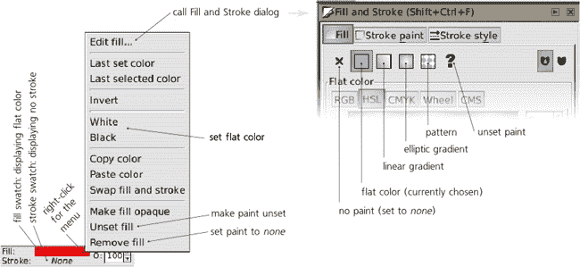
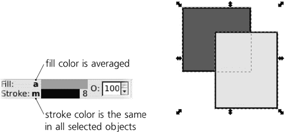
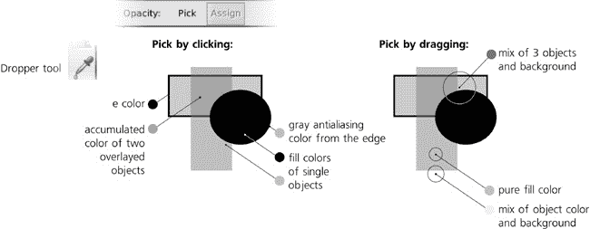

# 第八章 样式

现在我们已经了解了如何选择和变换对象，是时候开始一个新的主题了，这个主题将在接下来的几章中让我们感到愉快：样式。Inkscape 文档中对象的看起来如何由该对象的*样式*决定，该样式由单独的*属性*组成。如果不熟悉可用的样式属性和编辑它们的工具，掌握这个程序是不可能的。

在本章中，我们将查看最基本样式属性，包括常见的*填充*（填充和描边）和不透明度类型。这将由第九章介绍描边样式，第十章将详细探讨渐变和图案，第十五章将探索文本样式属性。模糊等滤镜效果也是对象样式的一部分；我们将在第十七章中讨论它们。

# 8.1 样式基础

Inkscape 有相当多的对话框、命令和工具，用于处理对象的样式。如果您使用 Inkscape 进行任何实际操作，您很可能已经使用了一些。我们不会逐个讨论这些 UI 元素，而是首先查看一般的样式概念和特定属性，在相关时检查相应的工具。

您应该一开始就了解的一个与样式相关的命令是**编辑** ▸ **粘贴样式** ()。它将您最后复制到剪贴板的对象样式应用到所有选定的对象上。当您想要某些对象在样式上大致相同但并非完全相同时，这是一个真正的救星；通常，首先将相同的样式粘贴到所有对象上，然后只更改需要不同的属性要容易得多。

### 注意

*SVG 文档源中对象样式的表达不仅由 SVG 标准定义；为此目的，SVG 重新使用了另一个称为*层叠样式表（CSS）*的标准。然而，SVG 只使用 CSS 属性和概念的一个子集；有关详细信息，请参阅 SVG 标准（*[`w3.org/TR/SVG11`](http://w3.org/TR/SVG11)*）以及附录 A。*

## 8.1.1 填充

如您可能已经知道，对象有*填充*和*描边*，统称为*填充*。可以说，一个对象被一种填充填充，被另一种填充描边。填充可以有多种不同类型，包括：

**无（无填充）**

+   将填充设置为`none`的对象只有描边，将描边设置为`none`的对象只有填充。如果填充和描边都设置为`none`，对象将完全不可见（并且不能通过点击选择，**5.4 通过点击选择：选择器**），就像设置为零不透明度时一样。

**纯色**

+   这是最常见的选项，用纯色填充或描边。在本章的后面部分，我们将探讨设置和更改填充和描边颜色的许多方法。

**渐变**或**图案**

+   填充和描边都可以有各种类型的平滑颜色渐变或由任何对象组成的重复图案。这些复杂的画笔类型是单独章节的主题(第十章)。

**未设置**

+   这意味着填充或描边*未指定*，因此可能从对象的原生祖先继承。这不同于`none`，它只是强制不可见。由于祖先通常是没有任何自己的描边或填充的层或组，具有未设置填充或描边的对象将获得 SVG 默认值：不可见的描边和纯黑色填充。取消设置对于克隆(第十六章)很有用，因为它允许创建与原始对象画笔不同的克隆。

编辑对象样式的主体工具，即**填充和描边**对话框()，在其**填充**和**描边画笔**标签页上有多个按钮，对应不同的画笔类型。按下的按钮表示所选对象的当前画笔类型；如果选择了具有不同画笔类型的多个对象，则没有按钮被按下，对话框显示*多种样式*。

此外，学习使用状态栏中的**所选样式指示器**(**2.8 样式**)来快速确定所选对象的画笔类型，以及通过此控件右键菜单更改它（请注意，要访问此菜单，您需要右键单击*顶部*的填充色块以更改*填充*画笔，以及右键单击*底部*的描边色块以更改*描边*画笔）。



图 8-1. 所选描边指示器中的画笔类型（左）和填充和描边对话框（右）

### 注意

*路径不需要闭合即可填充；未闭合的路径(**12.1.1 子路径**)仍然可以填充，就像它们的端点通过一条未描边的直线段连接一样。*

一个重要的属性，与其它画笔属性不同，它适用于填充但不适用于描边，是**填充规则**。它可能有两个值之一。`evenodd`的值表示*任何*自相交或内部子路径(**12.1.1 子路径**)在路径或描边的填充中创建孔洞。`nonzero`的值表示大多数孔洞被填充覆盖（更精确地说，如果内部子路径的方向与外部子路径相同，孔洞将被填充；否则它仍然是一个可见的孔洞）。要更改此属性，请使用**填充和描边**对话框中的两个切换按钮：


图 8-2. 在填充和描边对话框中更改填充规则

### 注意

*即使使用* `nonzero` *填充规则，一些内部子路径仍然可以产生孔洞。这取决于子路径的方向（**12.1.1 子路径），然后可以对其应用描边。

**组**

+   将填充或描边分配给组本身几乎没有意义，因为组内的对象通常有自己的绘画并忽略其父组上设置的任何内容。实际上，如果你尝试在 Inkscape 中对组设置填充或描边，除了在组上设置外，它还会假设你打算递归地对所有组成员分配填充或描边。只有明确 *未设置* 的组成员填充或描边才会保持不变；然而，它们仍然会从它们的祖先那里继承新的填充或描边。

**克隆**

+   如果你尝试在克隆对象（第十六章）。


图 8-3. 填充不透明度、描边不透明度和主不透明度

此外，与填充或描边不透明度不同，主不透明度适用于不能有自己的填充或描边的对象，例如位图和大多数克隆。

### 注意

*不透明度和透明度之间有什么区别*？它们只是从相反的角度看待同一件事：当一个物体的不透明度为零时，它是完全透明的；相反，当其透明度为零时，它是完全不透明的。你可能会遇到的另一个与不透明度同义的词是*alpha*。

# 8.2 颜色模型

样式最基本且最重要的构建块是*颜色*。关于在计算机上表示颜色的讨论可以轻易填满一本书；虽然 Inkscape 还不是处理颜色最强大的程序，但它在这个领域仍然非常丰富和复杂。

你将面临的第一选择是在*颜色模型*之间。不同的颜色模型可以以不同的方式表示相同的颜色。

## 8.2.1 RGB

你可能已经知道最常见的颜色模型，*RGB*，在这种模型中，任何颜色都由红色、绿色和蓝色成分的混合，或者说是*通道*来表示。这种模型几乎被所有计算机显示器实现（这些显示器通常由这三种颜色的微小光源组成），也是 SVG 以及大多数其他计算机图形格式中使用的首选颜色模型。

根据你使用的软件，RGB 颜色中每个通道的值可以是 0 到 1 之间的分数数（例如 0.5）或 0 到 255 之间的整数（例如 127）。这两个系统是等效的；例如，R = 0，G = 0.5，B = 1.0 的颜色与 R = 0，G = 127，B = 255 的颜色相同。Inkscape 通常使用 0 到 255 的整数格式，本书中我们也将偏好这种格式。（然而，在 Inkscape UI 的一些部分，你会看到选择使用整数或分数格式的一个选项。）

在 RGB 中，通道的值越高，颜色越浅，值越低，颜色越深。因此，RGB 0/0/0 是黑色，RGB 255/255/255 是白色。所有通道值都相等的任何 RGB 颜色都是灰色；使通道值不等增加了颜色的饱和度，不等越大，饱和度越大。因此，纯色如红色（RGB 255/0/0）或黄色（RGB 255/255/0）具有最大可能的饱和度。

**填充和描边**对话框允许您使用数字输入字段（带有滚动按钮）或滑动条来编辑 RGB 颜色，滑动条在渐变色槽中移动（参见颜色插页上的图 2）。请注意，随着您移动滑动条，槽的颜色会发生变化；每个槽都显示您在槽内移动滑动条时将得到的颜色，如果其他滑动条保持原位。底部第四个滑动条，标记为**A**（alpha），代表填充或描边的透明度（因此，严格来说，它不是颜色的一部分）。

RGB 颜色通常表示为`RRGGBB`形式的字符串，其中每个组件由一个两位十六进制数（以 16 为基数，而不是传统的 10 为基数）给出。十六进制数可以使用数字`0`到`9`和字母`A`到`F`。通道的最大整数值——十进制的`255`——在十六进制中表示为`FF`。例如，`000000`是黑色，`FFFFFF`是白色，`660000`是深红色。这种表示颜色的形式用于 Inkscape 文档的 SVG 源，以及许多其他软件和语言（如 HTML）。当您从所选样式指示器中填充或描边样本的右键菜单中选择**复制颜色**时（图 8-1)，颜色的`RRGGBB`表示将复制到剪贴板。此外，还可以在**填充和描边**对话框中的**RGBA**字段中查看和编辑带有两个附加数字的`RRGGBBAA`表示（表示填充/描边透明度）。

如果选择了多个对象，并且它们有不同的填充或描边颜色，**填充和描边**对话框和所选样式指示器都会显示**平均颜色**。如果您更改该平均颜色，它将被分配给所有选定的对象，实际上消除了这些对象可能具有的颜色差异。



图 8-4. 所选样式指示器中的平均颜色

### 注意

*这种平均是在 RGB 中完成的——也就是说，平均颜色的 R、G 和 B 通道是输入颜色中相应通道的算术平均值。根据 SVG 规则，相同的平均公式用于渐变，以在停止颜色之间进行插值（**10.2 渐变定义**)。*

## 8.2.2 CMYK

与 RGB 类似，在*CMYK*模型中，颜色是通过混合颜色通道获得的。然而，CMYK 有四个通道，而不是三个：*青色*、*品红色*、*黄色*和*黑色*（见彩页上的图 3）。这种颜色模型最适合打印输出，因为许多专业打印机和印刷机使用 CMYK。由于 Inkscape（以及 SVG 本身）还不非常适合生产打印输出，因此在 Inkscape 中对这种颜色模型的支持相对较浅。最重要的是，即使您指定了 CMYK 颜色，写入 SVG 的也是其 RGB 近似值，并且从 CMYK 到 RGB 以及反向转换通常会引入失真，因为并非所有 CMYK 颜色都可以在 RGB 中精确表示，反之亦然。

### 注意

*传统上，CMYK 通道的数值范围是 0 到 100，而不是像 RGB 那样从 0 到 255。*

**CMS**（颜色管理系统）选项卡位于**填充和描边**对话框中，允许您在一个*校准空间*中编辑颜色，这可能包括真正的校准 CMYK（不是**CMYK**选项卡中的近似值）或 Adobe RGB。这目前是一个实验性功能；它需要在**Inkscape 首选项**中正确设置颜色管理（**3.1.1 Inkscape 首选项**）。

## 8.2.3 HSL

RGB 和 CMYK 都不是非常直观；它们代表计算机和打印机处理颜色的方式，而不是艺术家使用的方式。因此，Inkscape 通常更倾向于另一种颜色模型：*HSL（色调，饱和度，亮度）*。与 RGB 和 CMYK 不同，HSL 的通道不是混合在一起的单个颜色；相反，它们是定义颜色的属性，这些属性共同明确地定义了颜色。

*色调*通道是最大饱和度颜色的彩虹，从红色开始，经过黄色、绿色、蓝色，然后回到红色。*饱和度*在从最大色彩丰富度，通过单调乏味和暗淡，到相同亮度级别的纯灰色之间变化。最后，*亮度*通道从黑色到给定的颜色，然后到白色。（这意味着任何具有最大亮度的颜色都是白色，任何具有零亮度的颜色都是黑色，无论色调和饱和度如何。）

你可能在其他程序中看到过类似的颜色模型，即*HSV（色调，饱和度，值）*，有时也称为*HSB（色调，饱和度，亮度）*。它与 HSL 最明显的区别在于，在 HSV 中，值组件只从黑色变化到给定的颜色（例如，红色）。在 HSL 中，亮度组件的范围从黑色通过给定的颜色到白色（即，它在亮度和暗度方面是对称的）。

一旦习惯了 HSL 颜色模型，它就非常自然。当您认为某些颜色不太对时，例如，您可能会建议将其“变亮”或“减少饱和度”，而不是“添加更多绿色”。因此，Inkscape 中大多数与颜色相关的工具都使用 HSL 来选择和更改颜色。

在**填充和描边**对话框中，有两个不同的选项卡，允许您在 HSL 模型中编辑颜色（见颜色插入图中的图 4）。第一个（标题为**HSL**）使用传统的线性滑块，而另一个（标题为**轮盘**）有一个圆形环作为 H 通道（由于如果拉直，它将比适合窗口的线性滑块更长，因此具有更好的分辨率）和一个三角形，该三角形编码饱和度和亮度通道。旋转色调环上的标记也会旋转三角形，使其最大饱和度尖端始终指向环上的当前色调。

# 8.3 调色板

将颜色分配给所选对象的填充或描边最简单的方法是点击编辑窗口底部、状态栏上方（见颜色插入图中的图 5）的调色板中的某个样本。简单点击将填充颜色分配给所选对象；点击将描边颜色分配。调色板最左侧的按钮*移除*填充或（使用）描边。

除了点击之外，您还可以将颜色从调色板拖放到对象上。这是在不选择对象的情况下更改对象非常少的方法之一；如果您将颜色拖放到某个对象上，该对象将改变，即使它没有被选中，即使有其他对象被选中。拖放也可以用于更改描边颜色，您需要将颜色样本精确地拖放到路径或形状的轮廓上。

Inkscape 目前还不允许您通过用户界面编辑颜色样本或向调色板添加新的样本。然而，您可以选择 Inkscape 内置的许多不同调色板之一。在调色板的右侧，有一个带有三角形标记的按钮；点击它将打开一个菜单，列出可用的调色板，例如网页安全调色板、Ubuntu 和 Windows 用于其用户界面的调色板，以及各种单色调色板（绿色、金色等）。Inkscape 将记住您选择的调色板。

在相同的菜单中，您可以选择样本的标准*尺寸*，它们的*宽度*（窄样本更难点击，但可能通过将整个调色板适应屏幕宽度来消除调色板的滚动条），以及启用调色板*环绕*（这会使它更高，但也消除了滚动条）。

除了停靠的水平调色板外，Inkscape 还有 **样本** 对话框（）。它可以显示所有相同的调色板，并具有所有相同的大小选项，除了它还有一个额外的 **列表** 选项，其中列出了所有颜色及其名称。您可能更喜欢它，因为作为一个对话框，它可以放置在右侧的停靠处，并挤压成一个狭窄的垂直条。


图 8-5. 以列表格式显示颜色及其名称的调色板菜单（左）和样本对话框（右）

您可以编辑您的 Inkscape 调色板，以及添加新的调色板。每个调色板都是一个可以手动编辑的文本文件。在 Unix 系统上，Inkscape 伴随的调色板位于 Inkscape 安装前缀的相对路径下，在 *palettes* 目录中（通常是 */usr/share/inkscape/palettes*，或者如果您自己编译了 Inkscape，则是 */usr/local/share/inkscape/palettes*）。自定义调色板可以放置在 *~/.config/inkscape/palettes*；如果该目录不存在，您需要创建它。在 Windows 上，调色板位于 Inkscape 安装目录内的 *share\palettes* 中（通常位于 *Program Files\Inkscape* 下）。

Inkscape 从其调色板文件格式借鉴了 GIMP 位图编辑器的格式，因此您可以将任何来自 GIMP 分发的调色板拖放到该目录中，以便在 Inkscape 中使用。以下是默认调色板文件 *inkscape.gpl* 的开头；颜色成分（R、G、B）以 0..255 格式表示：

```
GIMP Palette
Name: Inkscape default
Columns: 3
# generated by PaletteGen.py
  0   0   0  Black
 26  26  26  90% Gray
 51  51  51  80% Gray
 77  77  77  70% Gray
...
```

# 8.4 所选样式指示器：绘画命令

除了设置各种绘画样式的命令外，所选样式指示器的右键菜单（见 图 8-1**）和书法笔（**14.3 书法笔工具**）工具进行绘图并希望结果使用相同的颜色时，此命令可能很有用，尽管铅笔创建带有描边但没有填充的路径，而书法笔创建带有填充但没有描边的路径。

**取消填充/描边**

+   将填充或描边设置为*未设置*（**8.1.1 涂料**）。请注意，这与移除它不同。

**移除填充/描边**

+   将填充或描边设置为`none`（**8.1.1 涂料**）。此命令有一个方便的快捷键：在填充或描边样本上中间点击以将相应的涂料设置为`none`。如果涂料已经被移除，中间点击将创建默认的填充或描边（通常是黑色）。除了调色板上的“无涂料”样本外，在选定的样式指示器上中间点击是移除所选对象描边最快的方法。

**使填充/描边不透明**

+   从涂料中移除任何填充不透明度或描边不透明度（**8.1.2 透明度**）。调色板右侧的**O**控制显示的不透明度保持不变。

# 8.5 选定样式指示器：颜色手势

除了右键菜单命令外，选定的样式指示器有一个方便的方法来快速调整颜色：*颜色手势*（见颜色插入页的图 6）。

要使用颜色手势，抓住填充或描边色卡并按照以下描述拖动。请注意，这仅在色卡显示**纯色**时才有效；对于显示**无**（即没有涂料）、**N/A**（即未选择任何内容）或显示渐变的色卡则不适用（尽管你可以在渐变工具中选择一个或多个渐变停止点并通过颜色手势调整它们，就像调整对象一样）。

颜色手势在 HSL 颜色空间中工作。不使用任何键盘修饰符拖动会调整色调通道，使用拖动会调整饱和度，使用拖动会调整亮度。

调整是通过“旋转”色卡远离原始方向来完成的，原始方向假设为东北方向 45 度，即从色卡对角线拖入文档窗口。一旦你点击并拖动色卡，想象一条从你点击的东北方向出发的对角线，穿过整个 Inkscape 窗口。通过将色卡拖动到该线**下方**或**右侧**，你会**降低**相应的颜色通道，直到窗口下方的最小值；通过将色卡拖动到该线**上方**或**左侧**，你会**增加**它，直到窗口左侧的最大值。如果你将鼠标悬停在 45 度线上，变化将为零。

当你进行颜色手势操作时，鼠标光标会发生变化，反映了当前正在调整的通道，并指示增加和减少值的方向。同时，注意状态栏，它会在你拖动时显示你正在调整的通道、该通道的原始值、新值和差异。

这种调整的角性质意味着你可以轻松地改变变化的精度。如果你将鼠标拖动到足够接近色卡的位置，任何微小的移动都会导致颜色的巨大变化。如果你需要更精细的调整，只需将鼠标拖动到色卡更远的位置，朝向 Inkscape 窗口的中心甚至其右上角，在那里相同的移动会产生非常小的颜色变化。

你可以在拖动时切换通道——也就是说，如果你想调整所有三个通道，不需要一次次从色卡拖动。你可以通过按住并释放和作为必要的操作来完成。请注意，当你改变拖动过程中的键盘修饰符时，零变化线会临时旋转以穿过当前鼠标位置；这样做是为了确保在切换修饰符远离原始 45 度线时，颜色不会发生突然变化。

修饰符是特殊的。按表示“不执行任何操作”；这允许您在不释放鼠标的情况下将鼠标移动到更方便的位置，以便在释放后继续调整颜色。与其他修饰符一样，释放暂时重新定义零变化轴，使其通过释放的点。例如，想象您通过拖动向窗口底部边缘使颜色变暗，现在您需要降低其饱和度。然而，您不能拖动它更低，因为没有足够的空间。在这种情况下，在不释放鼠标的情况下，将其向上拖动到方便的位置，然后根据需要向下拖动。此外，您可以在按住的同时从色块开始拖动，以避免颜色发生变化，直到您将其调整到更方便的位置。

例如，您可以选中一个绿色矩形，首先通过从填充色块拖动并稍微高于 45 度线来将其变为蓝绿色；然后，在不释放鼠标的情况下，按并稍微向右拖动以加深颜色；然后按，释放，并调整饱和度。您可以在单次拖动过程中按或释放和任意次；当您最终对颜色满意时，释放鼠标以提交更改。

除了精确调整外，您还可以使用颜色手势来非常快速地执行一些常见的颜色转换：

+   -将色块向右并向下拖动以将所有选定的对象涂成黑色。

+   -将色块向上并向左拖动以将所有选定的对象涂成白色。

+   -将色块向右并向下拖动以降低选定对象的颜色饱和度（将它们变为灰色）。

+   -将色块向上并向左拖动以最大化选定对象颜色的饱和度。

注意，当选择多个不同颜色的对象或渐变停止点时，所选样式指示器显示它们的*平均*颜色。如果您通过手势调整该颜色，则更改后的颜色将分配给所有选定的对象或停止点，从而消除它们之间的任何差异。如果您想调整许多不同颜色的对象并保持它们之间的相对差异，请使用调整工具的颜色模式（**8.7 颜色调整**）、颜色调整扩展（**8.8 颜色扩展和过滤器**）或颜色过滤器（**17.3 预设过滤器**）。

# 8.6 吸管工具

吸管工具允许您直接从绘图的任何点或区域选择颜色（以及可选的不透明度），并将其分配给选定的对象（或选定的渐变句柄，**10.4.2 绘画**）。使用此工具，您可以将自己的绘图作为调色板，轻松地重复使用您为其他事物创建的颜色。当您需要将矢量对象与导入的位图结合和混合时，它也是必不可少的。

关于此工具的重要之处在于，在拾取颜色时，它不会关注您点击的是哪个*对象*；相反，它只是简单地从渲染的屏幕图像中获取点击的*像素*的颜色。这意味着您可以从位图、半透明对象的堆栈、模糊边缘（**17.1 模糊**）或渐变中间轻松地拾取颜色。这也意味着，如果一个对象太小而无法在当前缩放级别下渲染，您就无法拾取其颜色；如果您在白色背景上点击黑色对象的边缘，您很可能会拾取该点抗锯齿像素的中等灰色颜色（参见图 1-1"))。

## 8.6.1 采样

当您切换到吸管工具（ 或 ）时，状态栏开始报告位于光标直接下方的颜色。因此，如果您想了解某个区域的颜色，您甚至不需要点击：只需将鼠标悬停在该区域上，并读取状态栏。此外，您可以在任何时候按  将光标下的颜色复制到剪贴板（以`RRGGBBAA`十六进制字符串的形式）；从那里您可以将它粘贴到 Inkscape 中的任何文本对象或外部程序中。

## 8.6.2 分配

可以通过点击或拖动将颜色分配给选定的对象或渐变句柄。通过点击，你只是取屏幕像素的颜色，这个颜色恰好位于你的鼠标光标下。通过拖动，你创建一个以你开始拖动点为中心的圆形区域，当你释放鼠标时，工具将*平均*这个圆内所有像素的颜色。



图 8-6. 使用滴管工具

使用平均值选择对于从位图中采样颜色特别有用。例如，如果你需要创建一个与照片中人脸脸颊颜色相同的矢量对象，从脸颊中单独选择像素不太可能得到你需要的；由于照片的非均匀性，选择的颜色可能会太亮或太暗。然而，如果你平均覆盖大部分脸颊的圆形区域的颜色，结果将更有说服力。

默认情况下，滴管将颜色分配给所选对象的填充。当你右键单击或拖动时，它将改变它们的描边。

## 8.6.3 不透明度

使用滴管工具控制栏上的两个切换按钮，你可以更改它处理透明度的方式。**不透明度：拾取**按钮控制是否拾取光标下点的透明度，而**分配**按钮控制是否将拾取的不透明度值分配给选定的对象。（当**拾取**关闭时，**分配**按钮被禁用。）

### 注意

*工具拾取的不透明度是点击点所有对象的累积不透明度。例如，如果你点击一个 50%不透明度的单个对象，拾取的值是 50%。如果有两个这样的对象重叠，拾取的值是 75%。滴管工具忽略页面背景的透明度（如**文档属性**中设置**3.4.2 背景**)。*

让我们看看一个简单的例子。假设你有一个 50%不透明度的亮红色（`FF0000`）对象，使其看起来是浅红色。现在，你选择另一个对象并尝试从红色对象中拾取颜色。会发生什么？

**不透明度：拾取按钮关闭**

+   工具将拾取浅红色颜色（`FF8080`）和没有透明度。换句话说，透明度已经“乘入”了颜色。状态栏将报告*光标下的 FF8080*，这就是所选对象将得到的颜色——而所选对象的透明度（如果有），将不会改变。只有在这种情况下，页面背景的可见颜色才会混合。

**不透明度：拾取按钮开启**

+   工具将拾取实际的亮红色颜色（`FF0000`）和 50%的不透明度*分别*。状态栏将显示*光标下的 FF0000 alpha 0.5*。现在，当你点击时会发生什么取决于另一个按钮，**分配**：

    +   如果**分配**打开，颜色（`FF0000`）和不透明度（50%）都将分配给所选对象的填充或（使用![http://atomoreilly.com/source/no_starch_images/1735338.png.jpg]）描边。请注意，不透明度将成为所选对象的填充或描边的不透明度，而不是它们的总不透明度（**8.1.2 不透明度**）。

    +   如果**分配**关闭，明亮的红色颜色（`FF0000`）将被分配给所选对象的填充或描边，而拾取的不透明度将被简单地丢弃，并分配 100%的不透明度。例如，如果您选择一个半透明对象，并使用**拾取**打开且**分配**关闭时点击该对象本身，该对象将失去其不透明度但保留其颜色。

# 8.7 颜色调整

我们已经在变换章节中看到了调整工具的一些功能（**6.9 使用调整工具变换**）。让我们看看其两种改变对象颜色的模式，*颜色油漆*和*颜色抖动*。这两种模式都适用于纯色油漆以及渐变（**10.7 渐变技巧和示例**）。参考**6.9 使用调整工具变换**来回顾工具的**宽度**和**力量**参数是如何工作的。

### 注意

*在未来版本中，这些模式可能被拆分为单独的工具。*

## 8.7.1 颜色油漆

颜色油漆模式用于在刷子下应用颜色到所选对象。正在使用的颜色——更确切地说，是*样式*，因为它包括填充和描边——可以在工具控制栏的右端（在画布上方）的样式色块中看到。要更改此应用样式，只需在此模式下的调整工具中点击颜色调色板或使用任何其他样式编辑命令（如**填充和描边**对话框）即可。

### 注意

*与其他所有工具不同，在颜色油漆模式的调整工具中，您不能直接将样式分配给所选对象；任何样式设置命令都会“拦截”以更改工具的样式。*

工具样式的填充应用于被涂对象的填充，而描边应用于描边。如果工具样式没有填充或没有描边，则不会影响填充或描边，相应地。例如，如果您想将对象的填充涂成蓝色但保留其描边不变，请将蓝色填充分配给工具样式（只需在调色板上点击蓝色）但将其描边设置为`none`（在状态栏中**描边**色块上中击）。

此模式实际上是在对象上绘画，*逐渐*将它们的颜色向目标颜色转变。例如，如果您在蓝色填充的对象上持续使用黄色填充进行绘画，该对象将首先变成蓝绿色，然后变成绿色，然后变成黄绿色，最终变成您正在使用的黄色。

使用  画图会反转你应用的颜色（例如，用黄色画图时， 会逐渐应用蓝色）。


图 8-7. 使用调整工具的颜色画图模式

这种逐渐过渡的速度取决于**力度**值，如果你有一个压力感应平板，则还取决于笔的压力。此外，由于画笔是“软”的，因此被画笔边缘接触到的对象比被画笔中心击中的对象受影响较小。

## 8.7.2 颜色抖动

颜色抖动模式不应用任何颜色，而是对它接触到的对象的颜色进行*抖动*（随机化）。动作的力度决定了随机化的强度——也就是说，颜色偏离原始值有多远：


图 8-8. 使用调整工具的颜色抖动模式

## 8.7.3 通道

在调整工具的控制栏上，**模式**按钮的右侧有四个**通道**切换按钮：**H**、**S**、**L**和**O**。它们允许你分别开启和关闭工具在对象色调、饱和度、亮度和不透明度上的作用。

例如，如果你想在不改变色调的情况下提高画图中某些部分的饱和度，选择一些最大饱和度的颜色（如纯红）并关闭除**S**以外的所有**通道**按钮。同样，你可以替换色调而不影响饱和度或亮度（仅开启**H**），或者调整所有颜色而不改变它们的色调和饱和度（仅开启**L**）。开启**O**会将工具样式的全局不透明度应用到对象的全局不透明度上（但不是填充或描边的不透明度）。

## 8.7.4 使用说明

颜色画图在位图编辑器（如 GIMP 或 Photoshop）中与软画笔非常相似。然而，尽管工具本身作为画笔工作，它仍然将颜色应用到矢量对象上，这些对象的行为就像矢量对象一样。例如，如果你想改变画图中脸部的颜色，如果画中的手是脸部路径对象的一部分，那么这只手也会改变其色调，即使它位于你画图点的远处。尽管如此，即使有这种限制，颜色画图仍然允许你快速直观地进行调整，这在传统的矢量工具中会显得笨拙且缓慢。

包含图案或小独立对象散布的绘图特别适合使用调整工具进行颜色画图。以下是一些例子：

+   使用书法笔进行自由手绘，由许多单独的笔触组成。

+   从 Adobe Illustrator 的 AI 文件导入的渐变网格（**B.6 AI (导入)")**），Inkscape 将其渲染为小多边形的网格。虽然 Inkscape 目前还没有对渐变网格的直接支持，但在这样的网格上进行色彩上色几乎和直接上色一样好。

+   文本转换为路径，其中每个字母都是一个独立的路径（**15.7 将文本转换为路径**）。

+   使用克隆拼贴器制作的图案（**16.6 拼贴克隆**）。请注意，您需要取消原始对象上的填充和/或描边，并使用**创建拼贴克隆**对话框的**颜色**选项卡为克隆分配一些初始颜色——这将使它们可以在不取消链接的情况下用调整工具上色。

尽管如此，对色彩进行调整对于只有少数对象或单个对象的构图来说仍然很有用。与其他所有色彩选择方法不同，使用调整工具进行上色实现了**色彩混合**的隐喻，这对于艺术家来说比 RGB 滑块甚至 HSL 色彩轮更自然。例如，从一个纯蓝色的矩形开始；然后，使用色彩画笔选择不同的颜色，并使用最小的力量和笔压轻轻上色：加一点绿色，一点棕色，一点黄色，等等，直到你得到所需的混合色调。同样，通过添加白色或黑色，你可以使任何色调变白或变黑。

你还可以使用色彩调整来为整个绘图添加色调、变暗、变亮、饱和、去饱和或色彩抖动。只需选择所有图层中的所有内容（**5.11 使用键盘快捷键选择**），缩小视图，选择一个宽大的画笔宽度，使其覆盖整个绘图，并应用一点色彩调整（使用最小的**力量**），这样就会影响所有可见对象。

# 8.8 颜色扩展和过滤器

到目前为止，我们已经看到了 Inkscape 中相当多的样式设置命令和工具，每个都有自己的方法和能力。然而，每个都有一些缺点。特别是，**填充和描边**对话框和选定的样式指示器不能在不统一的情况下编辑许多不同的颜色。另一方面，调整工具可以同时调整多种颜色，但它要求你实际上在画布上绘画，因此对于某些任务来说可能既慢又不精确。

作为一种解决方案，**扩展**菜单中**颜色**子菜单的一组扩展允许您同时调整选择的所有颜色。这些命令影响填充和描边颜色，包括渐变停止的颜色，但不包括位图或图案。它们包括：

+   一套完整的**HSL 调整**（增加或减少色调、饱和度或亮度 5%）

+   **更亮**和**更暗**（亮度上下调整 10%）

+   **去饱和扩展**（将 HSL 饱和度设置为零）

+   **灰度**（均衡三个 RGB 通道；结果与去饱和度类似但有所不同）

+   **负片**（例如，将黑色转换为白色，黄色转换为蓝色等）

+   用于移除或交换**红色**、**绿色**和**蓝色**通道的命令

+   一个**自定义**命令，允许你设置自己的公式来修改颜色通道，如果需要，可以使用其他通道的值

另一种改变对象颜色的方法是使用 SVG 滤镜效果（[第十七章](ch17.html "第十七章。滤镜"）），特别是**滤镜** ▸ **颜色**子菜单中的预设滤镜，或者使用**颜色矩阵**原语的其他任何滤镜。与扩展相比，SVG 滤镜的优点在于它们是非破坏性的（对象的原始外观和颜色被保留，并且可以通过简单地移除效果来恢复）并且适用于所有内容，包括位图和图案。然而，滤镜会减慢渲染速度，并且创建自定义滤镜可能比较麻烦。
