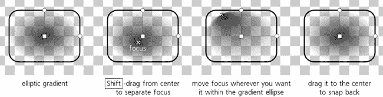
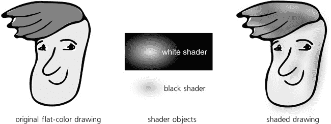
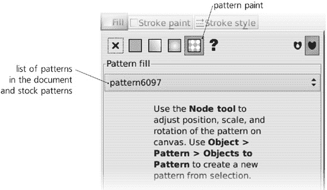

# 第十章. 梯度和模式

使用梯度是摆脱单调的纯色填充的平淡外观的最简单方法，因此，梯度是矢量图形最重要的功能之一。设计师可以使用精心安排的梯度来创建令人惊叹的复杂和逼真的艺术作品。尽管梯度具有多功能性，但创建和编辑梯度相对简单，渲染速度快，并且在 SVG 软件中几乎得到普遍支持——例如，对于模糊等 SVG 滤镜来说，这并不完全正确（**17.1 模糊**）。

基本上，梯度是两种或多种颜色之间的平滑过渡。*颜色*还包括不透明度级别；这意味着您可以将不透明的红色渐变到透明的红色，中间有半透明的红色色调。SVG 支持两种类型的梯度：*线性*（沿直线）和*椭圆形*，或*径向*（从中心向外，可能具有不等长的*轴*和非中心*焦点点*）。

# 10.1 梯度工具

梯度工具( 或 )是您在对象上创建新梯度的位置。它也是编辑现有梯度的最佳环境——尽管一旦创建，选定的对象上的梯度可以通过拖动句柄和分配颜色来编辑，不仅可以在梯度工具中，还可以在节点工具(**12.5 节点工具**)、所有形状工具(第十一章)和滴管工具(**8.6 滴管工具**)中进行编辑。尽管如此，梯度工具仍提供了一些针对梯度的编辑便利。

*创建*一个新梯度非常简单：确保您已经选定了必要的对象或对象，并在画布上拖动。您将看到随着拖动鼠标，实际梯度会出现在并跟随鼠标，您还会看到一个由线条连接的*句柄*（画布上的小控件）系统。

您不需要拖动选定的对象——梯度句柄可以完全位于它们应用的对象之外。您可以选中任意数量的对象，并通过单次拖动将它们全部用相同的梯度（更精确地说，是多个但重合的梯度）着色。另一种快速创建跨越整个对象的梯度的方法是使用梯度工具双击该对象。

要使用最常用的对象选择快捷键，您不需要切换到选择工具；点击以选择，-点击以选择下方，以及-点击以将所有对象添加到选择中，这些操作在梯度工具中同样适用。

渐变可以应用于对象的**填充**、它们的**描边**，或者两者都应用（**8.1.1 绘画**）。在 Inkscape 中，描边渐变使用绿色连接线连接手柄，而填充渐变使用蓝色线条：

图 10-1. 对象填充和描边的不同渐变

如果你正在为一个之前使用纯色油漆的对象创建渐变，渐变将从你开始拖动的对象的完全不透明到完全透明的颜色版本。例如，如果你有一个选中的黄色矩形，并从该矩形开始拖动，你将用从不透明黄色到透明黄色的渐变填充对象。然而，如果你有一个蓝色填充的对象并从它开始拖动，你也可以用不透明蓝色到透明蓝色的渐变填充它。换句话说，你创建的渐变应用于选定的对象，但使用的颜色可能来自任何对象，无论是否选中，只要是从该对象开始拖动。（如果你不希望这样，不要担心——创建渐变后更改渐变颜色非常容易。）

类似地，如果你开始拖动的地方的对象已经有一些渐变，工具将只为选定的对象重新绘制它，保留该渐变的颜色（即保留**渐变定义**，**10.2 渐变定义**）。如果你从一个空空间开始拖动而不是从任何对象开始，新的渐变将使用**最顶部的选中对象**的颜色或渐变。

在许多从对象中移除渐变的方法中，可能最简单的是确保没有选择任何渐变手柄（所有都是白色，不是蓝色），然后点击调色板上的任何颜色。对象将被纯色填充，替换掉它之前拥有的任何渐变。

### 注意

**渐变和任何其他油漆（**8.1.1 绘画**）都不能应用于位图对象（第十八章）；如果你想要将透明度渐变应用于位图，请使用蒙版（**18.4 剪裁和蒙版**）。对于克隆（第十六章）也是如此，除非克隆原始的油漆未**设置**。

让我们现在更详细地看看 Inkscape 可以创建的两种渐变类型：线性渐变和椭圆渐变。

## 10.1.1 线性渐变

线性渐变沿着一条直线进行，其中两端（以及可能的一些中间点）被分配了特定的颜色和不透明度。物体上颜色区域之间的过渡总是垂直于渐变线。这是渐变工具创建的默认渐变类型；工具的线性渐变模式由工具控制栏中的第一个切换按钮设置，如图所示：

图 10-2. 通过拖动和双击创建线性渐变

### 注意

*在所选样式指示器中，线性渐变用字母* L *表示，后面跟着渐变样本。*

线性渐变有两个可以自由拖动的句柄：一个位于渐变线起点的正方形句柄和一个位于渐变线末尾的圆形句柄。通过拖动它们，您可以改变渐变的方向和长度（注意，当您拖动句柄时，渐变会实时重新绘制）。

按下  后，绘制新的渐变或拖动现有渐变的句柄会使渐变线自动对齐到角度增量，默认为每 15 度（此值可以在**Inkscape 首选项**对话框的**步骤**选项卡中更改，比较**6.3 选择器：旋转和倾斜**）。在线性渐变模式下双击对象将创建一个通过对象边界框中心的水平线性渐变。

## 10.1.2 椭圆渐变

要将渐变工具切换到创建**椭圆渐变**而不是线性渐变，请按工具控制栏中的第二个切换按钮（在画布上方）。现在，如果您在画布上拖动并选择了一些对象，将为它们创建一个椭圆渐变：

图 10-3. 通过拖动和双击创建椭圆渐变

### 注意

*在所选样式指示器中，椭圆渐变用字母* R *(代表*径向*)表示，后面跟着渐变样本。*

椭圆渐变至少有三个可拖动的句柄——*中心*（正方形句柄）和两个垂直的*半径*（圆形句柄）。这使得可以移动、拉伸、挤压或旋转此类渐变；您可以将它变成从圆形到狭窄的椭圆，旋转任何角度。移动中心句柄将整个渐变（即所有句柄）移动；移动半径将渐变拉伸和旋转，而不会移动中心。两个半径始终保持垂直。与线性渐变模式一样，按下  时拖动半径会自动对齐到 15 度角度增量。

当您开始拖动以创建新的渐变时，您正在拖动其中一个半径；另一个半径将被创建，其长度等于所选对象高度的一半。这意味着如果您从对象的中心开始拖动，水平拖动到其边界框的右边缘，椭圆将整齐地内嵌在边界框内。通过双击对象也可以简单地达到相同的效果。

### 注意

*如果您需要一个对称的“双线性”渐变，其轮廓像山一样，最简单的方法是通过一个椭圆渐变，其中一个半径被拉得很长，拖动到对象边界之外。然后，拉伸椭圆的中心部分几乎无法与一对方向相反的线性渐变区分开来。*

椭圆渐变还有一个第四个，通常隐藏的，控制柄——*焦点*。这是具有渐变中心停止点颜色和透明度的点。通常，它与中心控制柄合并并一起移动，产生一个完美的对称渐变。然而，你可以通过将焦点——用一个 X 形控制柄表示——从中心拖离中心控制柄来分离它。这会创建一个非对称的椭圆渐变，如图图 10-4 所示。要将焦点合并回去，只需将其拖动到中心控制柄足够近的位置，它就会自动对齐。

图 10-4. 通过移动焦点创建非对称椭圆渐变

# 10.2 渐变定义

每个渐变都有一组*停止点*，每个都有自己的颜色和透明度值。最少的停止点数是两个*端点停止点*，在这种情况下，它们应用于渐变线的两端（线性）或椭圆的中心和边缘（椭圆）。然而，渐变也可以有任意数量的*中间停止点*，每个中间停止点除了自己的颜色和透明度外，还有一个位于端点停止点之间的位置（例如，中间停止点可能在渐变的 0.5 处——即在端点停止点之间正好居中）。对于每个渐变，其所有停止点及其颜色、透明度和位置的完整集合被称为*渐变定义*。

渐变定义是文档范围内的资源。这意味着您创建或编辑的任何渐变都会将其定义添加到文档中所有渐变定义的列表中。之后，您不仅可以将该定义分配给原始渐变，还可以将其分配给文档中的任何其他渐变。渐变工具控制栏中的下拉列表显示文档中所有渐变定义的色卡：

图 10-5. 选择渐变定义

**填充和描边**对话框中可用相同的梯度样本列表。当您选中一个或多个具有梯度的对象时，从列表中选择一个定义将分配给所有选定的梯度。这不会改变端点手柄的位置，但会替换颜色，并可能添加或删除中间停止点。

### 注意

*截至本文撰写时，尚无方法在*文档*之间*保存和重用梯度定义*，但这是未来版本计划的功能之一。此外，无法通过 XML 编辑器之外的方式重命名梯度从其默认的数字名称。*

您可以通过按来*反转*所选对象梯度的颜色定义。例如，如果您有一个中心为不透明蓝色、边缘为透明黄色的椭圆形梯度，在按下之后，您将得到中心为透明黄色、边缘为不透明蓝色的梯度。（对于线性梯度，这相当于将梯度线旋转 180 度，但椭圆形梯度不能通过移动其手柄简单地反转，这使得特别有用。）

顺便说一下，如果您想以相同的方式更改梯度中所有停止点的透明度，您不需要分别调整每个停止点的透明度。相反，只需调整使用梯度的对象的**主透明度**（**8.1.2 透明度**）。

## 10.2.1 分享梯度定义

当复制粘贴或复制具有梯度的对象时，对象的副本会自动获得**原始梯度的副本**，因此修改它不会影响源对象的梯度定义。此行为由**Inkscape 首选项**对话框**杂项**选项卡上的**防止共享梯度定义**复选框控制。默认情况下是勾选的；如果您取消勾选它，则复制粘贴、复制、粘贴样式以及通过梯度工具控件将现有梯度定义显式分配给对象将导致**共享**的梯度定义。当两个对象共享一个梯度定义时，改变一个对象上梯度（但不变动端点手柄坐标）的颜色或中间停止点位置会影响使用相同定义的所有其他对象。

**文件**菜单中的**Vacuum Defs**命令会移除文档中可能残留的任何未使用的梯度定义，包括其他一些内容。这是一个整理文档和稍微减小文档大小的不错方法。

# 10.3 梯度重复

正如我们所见，渐变处理器不需要与它们应用的对象边缘相一致；它们可以放置在画布上的任何位置，对象将仅显示其范围内发生的渐变部分。然而，这却引出了一个问题：将使用什么来绘制那些未被渐变覆盖的对象部分——那些超出线性渐变末端或椭圆边缘之外的部分？

默认情况下，这些区域将由第一个或最后一个渐变结束点的纯色和不透明度来绘制。例如，如果您有一个带有半径处半透明白色的小椭圆渐变，那么渐变之外的对象其余部分也将是半透明白色。然而，这并非唯一可能性。

选择一个带有渐变的对象（但请确保没有处理器被选中），然后在**填充和描边**对话框的**重复**列表中，选择**反射**或**直接**而不是默认的**无**。这些选项强制渐变无限期地重复，要么不变（直接），要么每第二个副本进行反转（反射）。这是在对象上创建各种条纹图案的简单方法，如图 10-6 所示。

图 10-6. 使用渐变重复选项

# 10.4 处理器

处理器是画布上与渐变停止点相对应的控制。在渐变工具中，它们不仅可以自由拖动，还可以*选择*和*绘制*，与选择的对象绘制方式相似。

## 10.4.1 选择

被选中的处理器是蓝色，而未被选中的处理器是白色。选择处理器最简单的方法是点击它；您还可以使用-点击来添加处理器到选择或从选择中移除它，或者使用-拖动多个节点以橡皮筋方式选择它们（比较**5.7 使用橡皮筋选择**）。通过拖动创建新的渐变后，您所拖动的处理器将保持选中状态。

与选择工具类似，在渐变工具中，您也可以使用键盘选择处理器：和选择*下一个*和*上一个*处理器（或如果没有选择之前，选择第一个和最后一个），选择所选对象中的*所有*处理器，而取消选择任何处理器（但保留对象选择；第二个取消选择对象）。

### 注意

**注意状态栏（**2.6 选择**）：它始终显示有关所选渐变控制柄（s）以及它们所属的对象（s）和渐变类型的有用信息。**

## 10.4.2 绘画

你可以使用所有用于更改对象样式的相同方法为选定的渐变控制柄或控制柄分配任何颜色或透明度级别（**8.1 样式基础**）。当选择一个控制柄时，调色板、**填充和描边**对话框、所选样式指示器中的颜色手势和命令（**8.1.1 绘画**）、**粘贴样式**命令，甚至滴管工具都在选定的控制柄上工作，而不是在选定的对象上。图 10-7 显示了示例。

与对象不同，渐变停止点没有填充或描边（尽管渐变本身可以应用于填充或描边）。因此，当你选择一个或多个停止点时，状态栏中的样式指示器会显示停止点在**填充**和描边样本中的颜色；这可能不是完全合乎逻辑的，但很方便。渐变停止点的不透明度通过主不透明度控制（在状态栏中标为**O:**）反映出来。然而，显示的描边**宽度**始终是对象的宽度（如果有描边），而不是停止点的宽度，因为停止点不能有任何描边。

图 10-7. 为选定的渐变控制柄分配颜色

如果你希望渐变的一端平滑地融合到其他对象中，使用滴管工具特别方便；确保选择相应的控制柄，切换到滴管，然后点击你希望它融合的区域。（注意，切换到滴管工具时，你离开了渐变工具，但这不是问题；像许多其他工具一样，滴管显示渐变控制柄，甚至保留控制柄选择。在滴管中你不能选择对象，但你可以切换渐变控制柄的选择。）

当选择多个渐变控制柄时，选中的样式指示器显示所选停止点的**平均**颜色和不透明度（这与选择多个对象时的行为相同，**8.2.1 RGB**）。

当至少有一个手柄被选中时，**复制**命令（）会将单个选中手柄的样式（颜色和透明度）或多个选中手柄的平均样式复制到剪贴板。这意味着您可以在渐变停止之间复制和粘贴样式——选择一个手柄，复制，选择其他一些手柄，然后粘贴样式（）。如果您选择多个手柄，这允许您通过复制和粘贴它们的样式快速平均它们的实际颜色和透明度。

## 10.4.3 移动、合并和吸附

您可以通过直接用鼠标拖动或使用箭头键（ 用于标准 2 像素位移的十倍， 用于像素大小位移， 用于 10 像素位移）来移动选定的渐变手柄。自然地，端点手柄（线性渐变的端点，椭圆渐变的半径）可以任意移动，而中间手柄只能沿着渐变线移动。（不要将 *中间* 手柄与椭圆渐变的 *中心* 手柄混淆；后者尽管位于椭圆的中心，但它代表渐变定义的 *端点*。）

如果您选择了多个对象，所有具有渐变的对象都将显示其手柄（无论它们是线性还是椭圆，是在填充还是在描边上），并允许您同时编辑其中的任何一个。这开辟了有趣的可能性。例如，您可以选择所有线性渐变的端点并将它们平行移动。或者，您可以按  选择所有渐变中的所有停止点，并使用箭头键将整个渐变集作为一个整体移动。

此外，任何数量的端点手柄（但不是中间停止）都可以**合并**。只需将一个手柄移动到另一个手柄足够近的位置，它就会吸附并合并。（状态栏将报告此类手柄的合并状态，例如 *手柄合并 2 个停止点*。）现在，当您拖动此类合并手柄时，它将同时影响它所属的所有渐变。要分离合并的手柄，使用  从合并手柄拖动。

例如，您可以合并两个对象的椭圆渐变中心，合并一个椭圆手柄与另一个对象的线性手柄，合并多个对象的三个椭圆手柄，或者合并同一对象填充和描边的渐变：

图 10-8. 合并渐变手柄

当您拖动以创建一个新渐变，并且已选择多个对象时，您得到的是一个看起来和表现像一个应用于多个对象的单一渐变，但实际上是许多渐变，它们的句柄被合并在一起。

如果两个句柄有不同的颜色或不透明度，合并后它们将保持不同。然而，如果您为合并的句柄分配颜色或不透明度，它将应用于所有共享此合并句柄的渐变停止点，使它们的样式相等。如果您想在未取消合并的情况下更改合并句柄的样式，如果合并的句柄属于不同的对象，则可以进行此操作：简单地将所有内容（包括句柄和对象）取消选择，然后仅选择您想要重新着色的对象。

当鼠标拖动对象时，该对象的渐变句柄会自动捕捉到对象的边界框边缘、其中心轴及其延续部分（除了捕捉到常规捕捉目标，如参考线或网格之外，**7.3 捕捉**）。这使得将渐变句柄放置在对象中心变得非常容易。此外，当拖动句柄或创建渐变时，按  可以将渐变角度捕捉到水平、垂直和介于两者之间的 15 度增量：

图 10-9. 捕获渐变句柄

# 10.5 多阶段渐变

至少在两个端点之间有一个中间停止点的渐变被称为 *多阶段* 渐变，因为它包含多个颜色过渡。在这种渐变中，每个中间停止点都有自己的颜色和透明度，但其位置限制在端点之间的中间位置。在 Inkscape 中，中间停止点由一个菱形句柄表示，如图 7 页上的颜色插入图所示。

## 10.5.1 创建中间停止点

要在渐变中添加一个中间停止点，请双击或点击  渐变线上的任何位置。新停止点将自动获取点击点的颜色和透明度，这样渐变的外观就不会改变。

此外，您还可以 *拖放* 从调色板中的颜色到渐变线。将颜色放在现有手柄上会改变该停止点的颜色；将其放在渐变线上的其他任何地方会 *创建* 一个具有该颜色的新停止点。另外，当两个或更多相邻手柄被选中时，按下  会在所有选中停止点间隔的中间添加新停止点（这与节点工具中的节点操作非常相似，**12.5.3 删除和创建节点**）。通过  添加的新手柄包含在手柄选择中，因此重复按下  会添加越来越多的手柄；如果您开始时选中了两个手柄并按下  *n* 次，您最终将得到总共 2*^n* 个手柄。

要删除所有选定的停止点，只需按下 。单个停止点（无论是否选中）也可以通过  -点击它们来删除。

删除不仅限于中间停止点；您还可以删除端点，这样最近的中间停止点就变成了渐变的新端点。如果您在线性渐变中删除端点或在椭圆渐变中删除半径手柄，剩余的手柄不会移动，因此渐变跨度会变短。如果您删除椭圆的中心手柄，其最近的手柄会移动以成为新的中心。最后，如果您在两停止点渐变中删除端点，渐变会消失，对象会使用最后一个剩余停止点的平面颜色和不透明度进行着色。

在选中一些中间停止点时按下  会 *简化* 选中部分的渐变，移除那些不会在渐变外观上引起明显变化的停止点（比较 **12.3 简化**）。特别是，通过双击或按下  创建的新停止点最初不会改变渐变的外观，简化会删除自创建以来未移动或重新着色的所有冗余停止点。（您可能需要重复按下  以删除所有不必要的停止点。）

## 10.5.2 移动中间停止点

自然地，中间停止点的手柄只能沿着渐变线使用箭头键拖动或移动，距离其相邻手柄不超过。使用  拖动手柄会使它精确到可用范围的 1/10 分数——也就是说，它会精确到 1/10、2/10、3/10 等等，这是其相邻之间的跨度。

两个或多个中间停止点可能 *重合*。如果它们有不同的颜色，该点的渐变将会有一个尖锐的颜色边界。例如，添加两个中间停止点，一个涂成绿色，另一个涂成蓝色，然后将绿色的一端拖动到蓝色的一端，以在渐变中创建一个尖锐的绿-蓝边界。

按住  并拖动多个选定的手柄会使每个手柄移动一段距离，这个距离取决于该手柄与被拖动手柄的接近程度。你抓住并拖动的手柄会移动整个距离，但所有其他选定的手柄都会落后，距离拖动手柄越远，落后得越厉害（这些距离使用平滑的钟形曲线计算，类似于节点雕刻功能中的节点雕刻，**12.5.7.2 节点雕刻**）。

这有什么用？Inkscape（以及 SVG 通常）缺少的一个渐变功能是 *轮廓*，这意味着你不能使颜色之间的过渡加速或减速（即，偏向两个相邻停止点之一）而不是线性。然而，通过  拖动中间停止点可以轻松地 *近似* 这样的非线性轮廓。例如，如果你有一个两停止渐变，你想根据曲线轮廓来塑造它，选择渐变的两个端点，按  几次以添加多个中间手柄，然后通过  拖动中间的一个手柄来平滑地重塑渐变：

图 10-10。通过拖动中间停止点来近似轮廓渐变 

# 10.6 使用渐变变换对象

通常，当你变换（即移动、缩放、旋转或倾斜，见第六章)使用渐变填充或描边的对象时，渐变手柄会与对象一起变换，因此渐变会牢固地保持在原地。然而，选择工具栏上的第三个 **影响** 按钮可以改变这一点（**6.10 哪些变换会影响**）。

如果你取消选中此按钮（默认选中），渐变将相对于画布保持固定，无论你如何变换使用渐变的对象。这可能在例如你想将对象放大或缩小以匹配它使用的椭圆渐变大小时非常有用。

# 10.7 渐变技巧和示例

如果你想要“渐隐”或“柔化”对象的边缘，你不必（实际上，通常你*不能*）向其应用颜色到透明的渐变。解决这一需求的一种方法是通过使用蒙版（**18.4 剪辑和蒙版**）；然而，在许多情况下，如果对象下面的背景是纯色，一个与背景颜色相同的叠加对象——一个*着色器*——具有不透明到透明的渐变将更容易创建和维护。这种方法对于需要作为一个组柔化的多个对象、对于需要柔化多个侧面、对于已经具有不同渐变填充的对象或位图或图案填充的对象同样有效。

在这个例子中，四个渐变着色器被放置在位图的边缘上，以在白色背景上柔化边缘：

图 10-11. 使用线性渐变着色器柔化矩形对象的边缘

当使用着色器时，通常你不需要移动渐变手柄来将渐变放置到你需要的位置。相反，只需使用该渐变变换整个着色器对象。在 图 10-12 中，渐变工具只使用了两次：在两个椭圆上创建不透明到透明的椭圆渐变，一个白色，一个黑色。然后，总共使用了 29 个这些着色椭圆的克隆（链接副本），它们以不同的比例和旋转方式缩放，所有这些都有不同的降低主不透明度级别，用于为卡通面部添加深度。

图 10-12. 使用椭圆渐变着色器为卡通添加深度

黑色（或任何其他深色）着色器的一个问题是它们在边缘处通常看起来过于生硬，过于明确，尤其是如果你使它们足够不透明的话。这是由于默认的渐变配置文件是线性的，因此可以通过添加中间停止点并通过 -拖动（**10.5.2 移动中间停止点**）来“配置”它们来修复。另一种有用的方法是稍微模糊着色器，使其边缘不那么明显（**17.1 模糊**）。

然而，也许这个问题的最简单解决方案是绘制一个渐变，而不是从不透明黑色到透明黑色（这是默认设置），而是从不透明黑色到透明*白色*（或者，如果你将在某些其他浅色上使用着色器，则到该浅色的透明版本）。这会极大地改变感知到的渐变配置文件，使其边缘更加平滑和自然。缺点是，这可能会使椭圆形渐变的中心过于尖锐，这通常可以通过稍微放大着色器对象来简单地修复。

图 10-13. 通过在暗着色器边缘使用完全透明的光颜色来更改渐变配置文件

在设计中使用渐变通常涉及使用半透明渐变*叠加*多个对象。颜色插页中的图 8 展示了一个彩色水滴或玻璃按钮，实际上是一组六个具有各种椭圆形渐变的对象。

调整工具的颜色模式（**8.7 颜色调整**)不仅可以绘制或随机化纯色填充或描边的颜色，还可以在渐变中绘制或随机化颜色。对于渐变，该工具不仅考虑具有渐变的对象的位置，还考虑每个渐变停止点相对于画笔的位置。

例如，你可以仅通过用足够小的画笔覆盖带有蓝红渐变的物体的蓝色端来重新着色该物体的蓝色端，这样就不会触及红色。颜色调整不会在之前使用纯色填充的对象上*创建*渐变，也不会添加停止点，而只是绘制绘图中原有渐变的停止点。

作为示例，让我们以一个简单的不透明黑色到透明黑色的渐变为例，通过反复按  添加许多中间停止点，并使用 Jitter Colors 模式中的调整笔刷在物体上绘制以随机化停止点的亮度，仅启用 L 通道。然后，对另外两个平滑的原始渐变副本重复相同的操作，并将它们全部旋转后叠加在一起。得到的纹理是一个相当逼真的雾中海景：

图 10-14. 使用调整工具随机化渐变

# 10.8 图案

*图案* 是一种绘画类型（**8.1.1 绘画**），其中对象的填充或描边由重复的 *瓦片* 组成。瓦片可以是任何东西：单个对象（例如，位图）或一组对象，使用任何样式属性或 Inkscape 技术。在这方面，图案是一个非常丰富和灵活的功能。然而，在另一方面，SVG 中的图案相当有限：它们只能使用没有旋转或反射的简单矩形网格瓦片（例如，与实现 17 种不同对称类型的克隆瓦片器相比，**16.6 瓦片克隆**）。

您不能在对象上同时使用渐变和图案；它们是两种不同的绘画类型。如果您想在具有图案的对象上使用透明渐变，请阅读有关着色器的 **10.7 渐变技巧和示例** 或有关蒙版的 **18.4 剪辑和蒙版**。

## 10.8.1 创建图案

与梯度不同，Inkscape 中没有专门用于创建图案的工具。相反，只需选择您想要转换为瓦片的对象，然后从 **对象** 菜单中选择 **图案** ▸ **对象到图案** ()。

选定的对象不会消失，看起来也没有变化；然而，很容易看出，现在您选择的是一个单独的 *矩形*。这个矩形被您的对象组成的图案填充，并且它具有它们的边界框的确切大小和位置，这意味着图案正好可以放入矩形中。如果您现在拖动矩形大小手柄（使用矩形或节点工具），您将看到其他瓦片：

图 10-15. 从对象创建图案

现在，您可以通过选择此矩形（如果您不再需要，可以将其删除）或从 **填充和描边** 对话框中的图案列表中选择它，轻松地将新图案分配给任何对象，如图 图 10-16 所示。

SVG 允许您在图案中的瓦片周围设置边距以使它们分开。不幸的是，Inkscape 目前还不支持通过 UI 来实现这一点。虽然如果您知道如何操作，可以在 XML 编辑器中这样做，但一个更简单的方法是向创建图案的对象添加一个超出其他对象边缘的透明矩形，从而在图案的瓦片之间增加间隔。

图 10-16. 填充和描边对话框中的图案绘制

如果您想从图案中提取图块对象以便编辑，请选择具有该图案的对象，并使用**对象** ▸ **图案** ▸ **图案到对象**命令。

## 10.8.2 编辑图案

当您处于节点工具或形状工具时，具有图案填充的每个对象都显示三个编辑手柄，允许您在对象内移动、缩放和旋转图案。与渐变一样，这些手柄可以位于画布的任何位置，而不一定在对象本身上。然而，与渐变不同的是，这些手柄不是通过线条连接的，不能通过键盘选择或移动，只能通过鼠标拖动。

此外，与渐变工具不同，目前只能显示单个选中对象的图案手柄。虽然正确渲染，但图案上的线条目前还不能通过手柄进行编辑。

**X 形手柄**

+   位于其中一个图块（“原始”图块）的左上角。拖动此手柄可以在任何方向上*移动*图案。

**方形手柄**

+   位于原始图块的中央。拖动此手柄可以*缩放*图案。为了使缩放均匀（即，保持图块的宽高比），请使用拖动。

**圆形手柄**

+   位于原始图块顶部中间。拖动此手柄可以*旋转*图案，以 X 形手柄为轴。使用拖动以将旋转角度固定在 15 度步进。

从美学角度来看，图案的主要问题与它们的主要优势相同：*重复性*。虽然在技术插图中有必要或至少可以接受，但过于重复的矩形图案很少能改善艺术绘画（尽管有时可以使用一些更复杂的图案类型产生很好的效果）。两个经常有帮助的简单方法是尽可能*放大图案*（这样图案的副本就少一些，可以放入对象中），以及*旋转它*，使其不再是水平/垂直的，因此看起来不那么规律。

## 10.8.3 股票图案

**对象到图案**命令并不是添加图案到您的文档的唯一方法。Inkscape 附带了一些简单的*股票图案*，您可以在文档中重复使用。

选择一些对象，并通过点击**填充和描边**对话框中相应选项卡中的**图案**按钮将其切换到图案绘制。您将看到一个下拉列表（[图 10-16](ch10s08.html#pattern_paint_in_the_fill_and_stroke_dia "图 10-16. 填充和描边对话框中的图案绘制"）），其中包含您的文档中的图案（如果有），在顶部，以及一组股票图案，在分隔符之后。要使用其中一个图案，只需从列表中选择即可。

+   在这里有一系列不同条纹宽度和间隙宽度的比例的普通**条纹**，范围从 4:1 到 1:64。例如，**条纹 1:2**图案的间隙宽度是条纹的两倍。所有条纹图案都存在两种版本：带有黑色条纹和带有白色条纹（间隙始终透明）的版本。

+   有两种黑白奇数方块的**棋盘**图案（偶数方块是透明的）。

+   **密集圆圈**选项是一种密集的黑色圆圈六边形图案，间隙透明。

+   **圆点**是一种看似随机但均匀分布的点状图案，旨在掩盖重复图案的规律性。此图案有三种尺寸变体（小、中、大圆点）和两种颜色变体（黑色和白色圆点）。

+   **波浪**是一种由透明间隙分隔的波浪线图案。

+   **迷彩**是一种绿色调的保护图案，如军事上使用的图案。

+   **貂皮**是传统的纹章图案，起源于对黑尾貂皮风格的表示。

+   三种位图图案，**沙子**、**布料**和**旧油漆**，基于无缝摄影瓷砖，并允许您在绘图上添加一些自然纹理。所有这些都是灰度图，因此您可以使用这些纹理使对象半透明，并将它们叠加在其他彩色对象上以“纹理化”它们。

库存图案存储在 Inkscape 的*share*目录下的*patterns/patterns.svg*文件中（在 Linux 上通常是*/usr/share/inkscape*，在 Windows 上是*<inkscape-dir>\share*）。您可以向此文件添加自己的图案或用包含所需库存图案的任何其他 SVG 文件替换它。
