# 第十二章. 路径编辑

在大多数矢量图形中，路径构成了所有对象中的绝大多数。这就是为什么熟悉路径非常重要——没有它，你真的不能说你知道如何在矢量编辑器中工作。

Inkscape 提供了一系列灵活的工具、命令和效果，用于处理路径。我们将从 SVG 路径和传统路径工具的基础开始，这些工具的类似物你可能已经在其他软件中见过。然后，在本章的后半部分和下一章中，我们将探讨 Inkscape 的高级路径编辑技术，这些技术通常更高效——而且几乎总是更有趣。例如，你可能发现 Tweak 工具（**12.6 路径调整**)非常简单自然，以至于你很少想回到更技术性和低级的节点工具（**12.5 节点工具**)。然而，了解路径的构成并在必要时直接操作路径节点是很重要的，因为这是任何类型矢量图形的基础之一。

# 12.1 路径的解剖结构

路径是由直线或曲线段连接的节点（点）序列（图 12-1）。每个节点可能有一个相邻段（如果它是端点节点）或两个（如果它是中间节点）；SVG 不允许你在同一节点处连接超过两个段的分支路径。

图 12-1. 路径 = 节点 + 段

路径的长度不受限制；它可能包含从两个到数千个节点（尽管过于复杂的路径渲染速度较慢，因此应该避免）。

### 注意

*拥有一个或甚至零个节点的路径是合法的，但这样的路径是不可见的。*

使用路径，你至少可以近似（在许多情况下，可以精确再现）任何可想象到的形状、形式或图形。根据所需的形状和精度，在最坏的情况下，你可能需要使用许多密集定位的节点。

图 12-2. 同一个图形可以用少数节点粗略地近似，也可以用更多节点更精确地再现。

## 12.1.1 子路径

在路径中，相邻的两个节点可能没有通过段连接。这会在路径中产生一个间隙，每个这样的间隙都将路径分割成不相连的部分，称为*子路径*，如图图 12-3 所示。

没有间隙的路径被称为由单个子路径组成。任何子路径，就像一根绳子一样，可以是*开放的*（有两个松散的端点，称为*端节点*）或*封闭的*（打成一个环，使其端节点是同一个节点）。

在许多方面，子路径看起来和表现就像独立的路径。你可以通过使用**路径**菜单中的**拆分**命令将路径的子路径转换为独立的路径对象。相反的命令，**合并**，将多个选定的路径转换为单个路径的子路径。

图 12-3. 子路径是路径内连接节点的集合。

当将不同样式的路径组合在一起时，除了最顶层的（在 z 轴顺序中）选定的路径之外，你将失去所有其他路径的样式——因为无论有多少个子路径，单个路径只能有一种样式。然而，路径数据不会丢失或增加：如果你组合并然后拆分任意数量的路径，它们的节点将和之前完全相同。

每个子路径都有一个*方向*——也就是说，其节点总是从起点到终点的顺序排列。在封闭子路径中，起点节点和终点节点是同一个节点；在开放子路径中，起点和终点节点是不同的。通常，子路径的方向并不重要，但它决定了起点和终点标记（**9.5 标记**)和路径上的文本（**15.2.3 路径上的文本**)的位置。方向也可能通过 winding 规则（**12.1.2 填充路径**）影响路径的填充。使用**路径** ▸ **反转** ()来翻转所选路径或路径的方向。

## 12.1.2 填充路径

无论你使用什么来填充你的路径——纯色、渐变还是图案（**8.1.1 涂色**)——都有几个重要的事项需要注意。

填充总是停止在路径本身上——也就是说，如果路径有描边的话，是在路径描边的中心线上。不与自身或其他子路径相交的封闭子路径将简单地填充在内侧。开放子路径将填充，就像子路径的端节点之间存在一条直线段：

图 12-4. 填充开放和封闭的子路径

### 注意

*请记住，这条直线不是路径的一部分；它不会被描边，你不能用节点工具来弯曲它。如果你在编辑一个开放的未描边路径时，遇到一条直线段，它拒绝按照你的预期进行编辑，那么它很可能不是一个段，而只是填充的边缘。关闭子路径（**12.5.4 连接和断开**)以无限制地编辑它。*

当路径相交或当某个子路径完全位于另一个子路径内部时，决定是否填充某个区域取决于两个因素：该区域周围子路径的*方向*和路径的*填充规则*。填充规则是一个样式属性，可以取两个值之一，即`nonzero`或`evenodd`，这由**填充和描边**对话框中的两个切换按钮之一设置（参见图 8-2)：

+   使用`evenodd`填充规则值时，那些被填充的环和洞通常是不可见的，除非路径被描边。通常它们不会成问题，但有时你可能想去除它们。最简单的方法是选择那个路径并使用**路径** ▸ **联合**命令 ()。与自身联合的路径会移除所有不影响其填充的子路径。

+   `nonzero`的填充规则值意味着一个环或洞只有在它的边界相对于外部路径是反方向时才会被填充，如果它们朝同一方向，则它们是空的。

使用`evenodd`填充规则值时，因此被填充的环和洞通常是不可见的，除非路径被描边。通常它们不会成问题，但有时你可能想去除它们。最简单的方法是选择那个路径并使用**路径** ▸ **联合**命令 ()。与自身联合的路径会移除所有不影响其填充的子路径。

在路径内部无法反转单个子路径的方向。如果你需要这样做，你必须**拆分**路径（**12.1.1 子路径**），反转其中一个生成的路径，然后**合并**它们回到一个单独的路径。

## 12.1.3 描边路径

路径的*描边*是沿着路径本身的油漆带，因此路径标记了描边的*中心线*。如果有的话，描边会画在填充之上。有许多样式属性会影响描边的样子；它们在第九章中有详细的介绍。

**路径** ▸ **将描边转换为路径** 命令 () 将所选路径的描边转换为填充。换句话说，它用一个新的路径替换它，这个新路径的 *填充* 看起来与原始路径的 *描边* 完全相同，保留了该描边的所有连接、端点、斜接和虚线属性。原始路径的描边油漆成为新路径的填充油漆，而原始路径的填充被丢弃。如果原始路径有标记 (**9.5 标记**)，则结果将是一个组，其中将描边转换为路径的部分与现在是独立对象的标记组合在一起。

图 12-5. 将描边转换为路径

## 12.1.4 Bézier 曲线

如前所述，路径之间的段——节点之间的路径部分——可以是直线或曲线。现在，让我们更仔细地看看那些曲线段，这些曲线段被称为 *Bézier 曲线*，以纪念皮埃尔·贝塞尔（1910-1999），一位法国工程师，他是第一个在设计中使用它们的人。

Bézier 曲线完全由四个点的位置确定，其中两个是 *节点*，两个是 *手柄* 或控制点。曲线本身始终完全位于这四个点形成的四边形内。在节点工具 (**12.5 节点工具**）中，每个手柄都通过一条直线与其节点相连。这些 *手柄线* 总是与曲线在相应的节点处相切：

图 12-6. Bézier 曲线

注意，在路径中，如果一个节点位于两个 Bézier 曲线段之间，它将有两个手柄连接到它，每个相邻段一个。

Bézier 曲线对移动其手柄的反应很难用言语表达，但一旦你稍微实验一下，你很快就会对它有感觉。Bézier 曲线可能几乎无法与圆弧区分开来，但它也可能有尖锐的弯曲，几乎像尖角；当手柄完全缩回时（即，与它们的节点重合），它可能自相交或完全笔直。

当然，尽管它具有多功能性，但使用 *单个* Bézier 曲线可能无法创建许多形状。当构建路径来近似某物时（例如，当手动跟踪位图时，**18.8.2 跟踪位图对话框**），经验将告诉你下一个 Bézier 曲线可以达到多远以及放置下一个节点的最佳位置。使路径更紧密地近似某些现实生活中的形状通常涉及通过添加节点并调整它们的手柄来细分其 Béziers。相比之下，简化路径，无论是手动还是使用 **简化** 命令 (**12.3 简化**），通常减少节点的数量，并导致更长的 Bézier 曲线。

# 12.2 布尔运算

英国数学家乔治·布尔（1815–1864）并未专攻几何学。他发明了**布尔代数**来处理“真”和“假”的逻辑值。然而，后来发现这些相同的概念对于各种其他数学对象——例如集合或任意几何形状——也完全适用。

所有布尔运算都列在**路径**菜单中；它们也可以通过从相应数学运算的符号派生的键盘快捷键访问。其中一些需要恰好选择两个对象；其他将适用于任意数量的选中形状。所有这些都将接受路径、文本对象和形状（除 3D 盒子外），并自动将它们转换为路径。如果布尔运算失败（例如，由于选定的操作数数量或类型错误），它将在状态栏中解释其失败的原因。

**合并 ()**

+   两个或多个路径的**合并**创建了一个路径，其填充覆盖了任何原始路径所覆盖的所有点。因此，它将任意数量的路径合并为单个路径，并赋予它最底层选中对象的样式：

    

    图 12-7. 路径合并

    如果路径完全不重叠，结果将与**路径** ▸ **合并**（12.1.1 子路径)**

+   两个路径的**差集**创建了一个路径，其填充覆盖了底层（按 z 顺序）路径所覆盖的所有点，但不包括顶层路径——换句话说，它从底层中**减去**了顶层。结果具有底层对象的样式：

    

    图 12-8. 从另一个路径中减去路径

    如果路径不重叠，**路径** ▸ **差集**将简单地删除顶层路径；如果顶层路径完全覆盖底层路径，结果将是空的（对象被删除且无物被选中）。这是创建孔和擦除不需要的路径部分的主要工具。

    ### 注意

    *书法笔(**14.3 书法笔工具**)在您使用 *绘制时将创建的新路径与所选路径合并，在您使用 *绘制时则从它中减去。*

**交集 ()**

+   两个或更多路径的*交集*创建一个路径，其填充仅覆盖所有原始路径都覆盖的点。它使用最底部的选定对象的样式来创建其结果路径：

    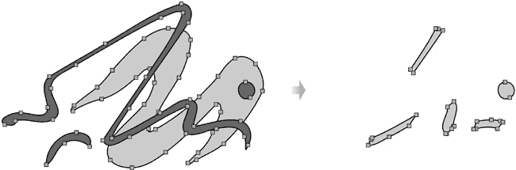

    图 12-9。交集路径

    如果所选路径中至少有两条不重叠（即，它们的交集为空），**路径** ▸ **交集**将删除所有路径而不创建任何内容。此命令与设置剪切路径（**18.4 剪切和蒙版**）类似，但剪切路径是非破坏性的，并且适用于任何对象，而不仅仅是路径。另一方面，**交集**允许您同时交集任意数量的路径。

**排除 ()**

+   两个重叠路径的排除创建一个路径，其填充仅覆盖原始路径中*仅一个*覆盖的点。它使用底部对象的样式来创建其结果路径：

    

    图 12-10。从另一条路径中排除路径

    当两条路径不重叠时，**路径** ▸ **排除**的结果与**路径** ▸ **合并**的结果完全相同。当它们重叠时，结果*看起来*与**合并**完全一样，但实际上路径是不同的：它在原始路径轮廓相交的点处有新的节点，而**合并**则不会创建新的节点。

**分割 ()**

+   两条路径的*分割*通过顶部路径的边缘将底部路径切割成单独的部分，删除顶部路径：

    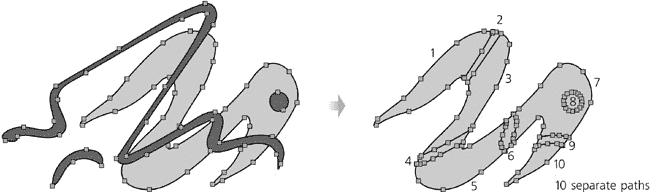

    图 12-11。通过另一条路径分割路径

    ### AI

    *这是 Inkscape 中与 Adobe Illustrator 中的刀片工具最接近的工具：使用钢笔或铅笔工具(第十四章)来绘制要切割的路径，*  *点击该路径，然后选择**路径** ▸ **分割**来切割它。*

**切割路径 ()**

+   这个操作类似于**除法**。主要区别在于**切割路径**不会在切割线上创建任何新的节点或段，因此留下的结果路径是不封闭的。它还会移除正在切割的路径上的任何填充。对于切片填充路径，自然使用**除法**，而对于切割无填充的路径，使用**切割路径**：

    

    图 12-12. 切割路径类似于除法。

# 12.3 简化

在路径上的一个非常重要的操作是*简化*。当你简化一个路径（**路径** ▸ **简化** 或 ![httpatomoreillycomsourcenostarchimages1735764.png.jpg]），Inkscape 会尝试使用更少的节点重新绘制该路径，消除较小的细节但保留大规模特征和整体形状。如果这个描述听起来有点模糊，那是因为这个操作本身并不是完全确定的；通常，在真正尝试之前很难准确预测简化的结果。即使节点数量的减少也不是保证的，尽管这是常见的。

尽管如此，它是一个非常常见的操作，对于某些艺术风格的绘图来说，它是一个真正的救星。另一方面，在技术绘图中，它很少有用，仅仅因为它将路径中的任何尖锐角视为“缺陷”，应该被平滑掉。

你几乎可以肯定的一个效果是，如果你的路径上有可以删除而不改变路径形状的节点，它们*将会*在简化过程中被删除。这包括你使用节点工具（**12.5.3 删除和创建节点**）或**添加节点**扩展（**13.3 路径扩展**）添加的任何节点，但从未从初始位置移动过。

路径简化与渐变工具中的渐变简化类似，也可以通过![httpatomoreillycomsourcenostarchimages1735764.png.jpg]（**10.5.1 创建中间停止点**）访问。渐变简化也是如此，它会移除你添加但尚未从初始位置移动的任何渐变停止点。

任何简化操作都使用一定的*力量*。弱简化只会稍微改变路径，仅删除最明显冗余的节点。更强的简化将会改变路径更多，并平滑掉其中的较大凸起。

当你按一次  时使用的默认力量可以在**Inkscape 首选项**对话框的**杂项**选项卡上的**简化阈值**值中设置。默认值为 0.002；任何大于 0.01 的值可能对大多数情况来说都太强了。如果你要更改它，请考虑降低此值，因为它实际上是**最小**简化力量；你可以随时临时增强你的**简化**命令，提高此值而不必进入**Inkscape 首选项**对话框。

如何让**简化**功能变得更强大？只需快速连续地按几次 。每次调用命令都会稍微增加力量，前提是它发生在前一次调用后不到半秒内。通过这种**加速简化**，你可以为每条路径应用所需的确切简化量。如果第一次按键没有足够平滑路径，只需继续按 ，它将逐渐加速。不过，如果你等待超过半秒，简化力量将重置为**Inkscape 首选项**中的默认值。

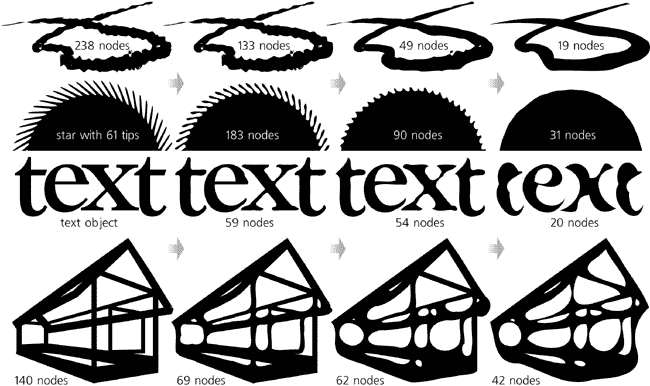

图 12-13. 简化路径

图 12-13 展示了简化如何影响路径的一些示例（参见图 12-2，该图是通过逐渐简化最节点丰富的玫瑰轮廓产生的）。正如你所见，除了减少节点数量和消除小细节外，此操作还会使尖锐的角和曲线变得直线，产生一种自然且常具有艺术吸引力的扭曲。

# 12.4 偏移

**偏移**路径意味着以这种方式扩展或收缩它，使得每个点都沿着该点的路径垂直移动。向内偏移称为**内嵌**，向外偏移称为**外嵌**。想象一下你的路径是一个岛屿；那么，外嵌意味着通过将海岸线的每个点向外移动相同的步数来扩大它，而内嵌则通过允许海水在各个地方向外侵吞相同的步数来缩小它：

图 12-14. 偏移路径

要内嵌选定的路径或路径，请按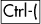（内嵌 2 个像素），或（在当前缩放下内嵌 1 个屏幕像素），或（内嵌 10 个屏幕像素）。要外偏移路径，请使用带有相同修饰符的键。在大多数键盘上，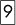和与和相同，因此数字将像括号一样工作。

偏移量用于那些你想在不改变路径整体形状的情况下，使路径“更粗”或“更细”的情况。这对于阴影、轮廓、光环、斜边等非常有用。（有时，你可以在路径上简单地设置一个足够宽的描边，颜色与填充相同，而不必使用外偏移。）

如果你多次对外偏移和内嵌路径，它将以一种特征性的方式变形，类似于简化变形（**12.3 简化**），但又有区别。这种变形将路径的一部分焊接在一起，圆滑角落，平滑交叉点，并在路径内融合接近的笔触。例如，尝试将一幅画的所有笔触合并在一起，并对它进行几次内嵌/外偏移循环，使其看起来更自然、更磨损，如图图 12-15 所示。

偏移量，就像简化一样，是一种破坏性操作：除非撤销，否则你不能恢复原始路径的精确形状。（例如，偏移一个开放路径总是将其关闭。）然而，Inkscape 还有两种动态对象类型，**链接偏移**和**动态偏移**，它们存储了原始路径的精确形状，并允许你调整偏移量而不累积变形（**13.2 动态和链接偏移**）。

图 12-15. 使用重复偏移熔化复杂路径

此外，虽然**内嵌**和**外偏移**命令将相同的偏移距离应用到整个路径上，但也可以使用调整工具的**增长和缩小模式**（例如，**12.6.4 缩放/增长模式**）来仅对路径的一部分（例如，书法笔触的一端）进行内嵌或外偏移。

# 12.5 节点工具

就像 Inkscape 的所有工具一样，节点工具——主工具栏中从上数第二个按钮，也可以通过按或访问——旨在使简单的事情变得容易，使困难的事情成为可能。这可能是所有 Inkscape 工具中最复杂的；无论如何，节点工具中可用的键盘和鼠标快捷键数量比任何其他工具都多。你当然不必知道它的所有技巧才能有效地使用 Inkscape，但你确实需要了解基础知识。

## 12.5.1 路径显示

切换到节点工具后，任何单个选定的路径都会显示其*节点*为小灰色方块、菱形或圆形（取决于每个节点的类型，**12.5.5 节点类型**）。

### 注意

*截至版本 0.47，节点工具最大的限制是它一次只能编辑一个选定的路径。如果你选择两个或更多路径，它们不会显示其节点且不可编辑。然而，你可以同时编辑路径的多个子路径。*

可以选择一些或所有节点，在这种情况下，它们会变成蓝色并略微增大。*手柄*仅对选定的节点及其相邻节点可见。即使如此，当不需要时，可以通过控制栏上的按钮来抑制这些手柄，如图 12-16 所示（图 12-16）。

在节点工具中，默认情况下，选定的路径本身不会被以任何特殊方式可视化。通常，你只需观察路径的描边和/或填充，这些会实时更新以响应节点的编辑。然而，有时你的路径可能过于透明，或者模糊，或者应用了某些路径效果；在这种情况下，你可以通过在控制栏上切换另一个按钮来要求 Inkscape 用红线突出显示实际路径（图 12-17）。

图 12-16. 节点和贝塞尔手柄在节点工具中

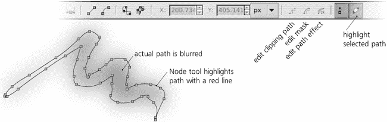

图 12-17. 节点工具中的路径突出显示

除了路径本身之外，一些对象可能还与其他路径相关联，这些路径虽然不可见但会影响路径的外观。您也可以使用节点工具编辑它们。有三个切换按钮可以将工具切换到编辑剪切路径（绿色，**18.4 剪切和蒙版**）、蒙版路径（蓝色，**18.4 剪切和蒙版**）以及与路径效果相关的路径（深绿色，**13.1.2 路径效果编辑器对话框**）。

虽然节点工具专门用于编辑路径，但每个具有某种编辑手柄的对象在选中此工具时都会显示它们。这意味着您可以使用节点工具，例如，使矩形**11.2.2 圆角**、重塑星形**11.5.2 手柄**、编辑渐变**10.4 手柄**或更改流动文本的尺寸**15.2.2 流动文本**。

## 12.5.2 选择节点

就像 Inkscape 中的许多其他事物一样，路径的节点在节点工具中可以被*选择*。不出所料，大多数节点选择方法都与对象选择方法非常相似（第五章）。

### 注意

与选定的梯度手柄（**10.4.2 绘画**）不同，选定的路径节点不能被样式化。只有整个路径可以拥有样式，而不是它的节点。

在我们探讨在路径中选择节点之前，值得注意的是，该工具还可以选择*对象*（记住，对象选择是 Inkscape 中所有工具和命令的共同点）。因此，在节点工具中，您可以使用从选择工具中了解的一些快捷键：点击选择一个对象（忽略分组），-点击添加到选择，-点击选择与选择工具相同的方式选择（**5.9 从下方选择对象**）。

要选择一个*单个节点*，只需点击它。节点变为蓝色，并且比灰色未选择节点略大。-点击*添加*节点到节点选择；选定的节点不需要相邻，也不需要都在同一路径上。*橡皮筋*选择（拖动一个矩形围绕节点，比较**5.7 使用橡皮筋选择**）也有效；拖动时将橡皮筋内的节点添加到选择中。

如果你点击两个节点之间的路径段，两个节点都会被选中。点击路径外的空白区域会取消选择任何节点，按下  键也会取消选择。

方便的  和  键，在选择工具中用于跳转到下一个或上一个对象，在这里用于跳转到路径上的下一个或上一个节点。当达到最后一个节点时，按下  键会跳转到第一个节点；当达到第一个节点时，按下  键会跳转到最后一个节点。（例如，按下  键几次是一种快速确定（子）路径方向的方法，而无需以任何方式更改文档。）

同样，在选择工具中， 会选择路径上的所有节点。然而，如果你已经在某个子路径中选择了一些节点，那么  只会选择该子路径中的所有节点（类似于选择器，其中  只选择当前图层内的对象）。要始终选择所有子路径中的所有节点，请使用 。 键在具有选择节点的子路径中*反转*选择（选择未选择的，反之亦然）； 在整个路径上执行相同的操作。

选择节点的另一种方法仅适用于节点工具。当你将鼠标悬停在节点上时，你可以通过旋转鼠标滚轮或按下  和  键来*展开*或*收缩*选择。将滚轮向上旋转一格或按下  键会将最近的未选择节点添加到选择中；将滚轮向下旋转一格或按下  键会取消选择最远的已选择节点。

为了确定“最近”和“最远”的节点，Inkscape 会测量每个节点到鼠标指针的直接空间距离。然而，如果你在旋转滚轮或按下  键、 或  键时，距离将沿着路径计算，并且选择将限制在你悬停的子路径上。

## 12.5.3 删除和创建节点

删除任意数量的选定节点就像按下  或  或点击控制栏上的“减号”按钮一样简单。

删除子路径的端节点会使子路径变短，但你不能通过删除节点来打开闭合的子路径；你需要像在 **12.5.4 连接和断开** 中描述的那样将其断开。

当删除中间节点（位于其他节点之间的节点）时，Inkscape 会将正在删除的相邻节点组替换为单个贝塞尔曲线段。在大多数情况下，这样做而不产生扭曲是不可能的，尽管 Inkscape 会尽量减少这种扭曲：它会调整剩余节点上的手柄，以便新的贝塞尔段尽可能接近它所替换的路径部分。因此，在路径中删除一些节点通常就像执行一个局部的 **简化** 命令（**12.3 简化**）。

有时，你可能不想让新的贝塞尔曲线完全凸出以替换你正在删除的节点，或者你想要避免改变剩余节点的手柄。在这种情况下，只需按下 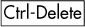 或 :

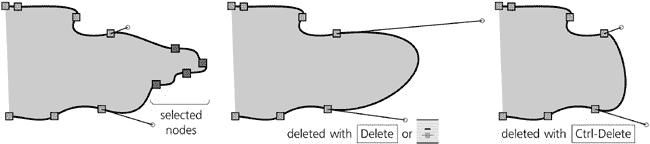

图 12-18. 删除节点

与删除不同，*插入* 新节点在任何路径的任何位置都是可能的，而不会改变其形状。只需在路径上（即笔触的中心线或填充的边缘）双击或  点击你想要新节点出现的位置。新节点将被插入，并且其相邻节点的手柄会自动调整，以保持路径的形状不变：

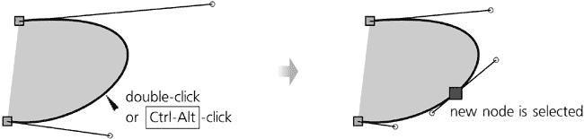

图 12-19. 通过点击创建节点

另一种节点创建方法不需要鼠标点击。只需选择两个或多个相邻节点，然后按（或在控制栏上点击“加号”按钮）以在每个相邻对中间插入一个新节点（参见图 9-11）。由于新节点随后被添加到选择中，这是一种快速增加路径上节点数量的方法；例如，如果您从两个节点开始并按 8 次，您的路径将有 257 个节点（2⁸ + 1）。这与通过按创建新的渐变停止非常相似（10.5.1 创建中间停止）。

另一种方法是**复制**节点。选择任意数量的节点，按；对于每个选定的节点，这将在相同的位置创建并选择一个副本节点。如果您现在通过按将复制的节点移开，它将看起来像这样：

图 12-20. 复制节点

特别适用于通过复制并移动其端节点来继续开放子路径。例如，如果您选择一个与直线段相邻的端节点（即没有贝塞尔手柄），您可以通过多次后跟箭头键来轻松地使用线段“绘制”。

## 12.5.4 连接和断开

通常，您会切换到节点工具以连接或断开子路径，或将开放子路径变为闭合或反之亦然。（由于节点工具还不能编辑多个路径，除非您首先将它们组合，否则您不能使用它来连接不同的路径。12.1.1 子路径。）

要**连接**两个端节点，首先选择它们。这些可以是同一开放子路径的端节点，在这种情况下，连接它们将关闭该子路径；或者，它们可以属于不同的子路径，在这种情况下，您将把这些子路径连接成一个单一的子路径。

有两种连接方式，对应于节点控制栏上的两个连接按钮。第一种方法，通过**连接节点**按钮或按实现，实际上将两个端节点移动并连接到它们原始位置中间的单个节点。第二种方法——**用段连接**按钮——将端节点留在原位，但在它们之间添加一个新的路径段。如果你想使用第一种方法，但不想移动其中一个端节点，将鼠标悬停在其上，在按的同时锁定其位置：

图 12-21. 连接节点和插入段

类似地，有两种方法可以*打断*路径。对于第一种方法，选择一个或多个非端节点，然后点击**打断节点**按钮或按。这将复制每个选定的节点，但不会将其连接到原始节点，因此路径将在每个选定的节点点上被打断。对于第二种方法，选择两个相邻的非端节点，然后点击**删除段**按钮以删除它们之间的段：

图 12-22. 打断节点和删除段

## 12.5.5 节点类型

中间节点可能有一个或两个手柄附着在其上，每个侧面一个。Inkscape 支持几种*节点类型*，当你拖动这些手柄或节点本身时，它们的行为会有所不同。

图 12-23. 节点类型：尖点、平滑、半平滑、对称和自动

+   如果一个节点没有手柄（它们都是*缩回的*），或者一个手柄与对面的段不共线，或者当你拖动另一个手柄时，一个手柄保持不动，这样的节点被称为*尖点节点*，因为当它的两个控制点成角度时，节点表示路径中的尖锐转折（尖点）。尖点节点以小菱形形状表示。

+   如果另一个手柄旋转，以便始终与移动的控制点共线（在相同的直线上），则这样的节点被称为*平滑节点*，因为它使路径流畅。平滑节点以方形表示。

+   节点可能只有一个手柄——也就是说，它可能在一侧有一个贝塞尔曲线，而在另一侧是直线段——并且节点唯一的手柄可能被锁定，始终与线段共线。这样的节点被称为*半平滑节点*，也以方形表示。如果你拖动一个半平滑节点，其手柄会自动旋转，以便始终与线段共线。

+   另一个手柄可以旋转和缩放，以便始终与移动的控制线共线，并且长度与移动的控制线相同。这样的节点被称为*对称*，因为其手柄总是围绕它对称。对称节点也以正方形表示。

+   自动节点，以圆形表示，是特殊的：当你移动它们时，它们会自动移动其手柄。你不应该尝试手动调整自动节点的手柄；如果你这样做，节点会立即从自动转换为平滑。因此，如果你使用自动节点，最好使用控制栏按钮隐藏手柄，以免妨碍（参见图 12-16）。

    自动节点调整其手柄的角度和长度，以便使相邻的路径段尽可能平滑。如果相邻的节点也是自动的，它们的手柄也会相应地调整。例如，当你将自动节点 A 移动到自动节点 B 更近的位置时，两者都会使它们的手柄逐渐变短并旋转，以便使它们之间的曲线尽可能低，同时保持节点平滑性。这种行为的结果让人联想到**斯皮罗样条**路径效果（**13.1.7 斯皮罗样条**）。

要在循环中更改节点类型（尖角到平滑到对称到自动再回到尖角），-点击它。选择一个或多个节点后，你可以点击控制栏上的节点类型按钮，或使用键盘快捷键：

+   按下以将选定的节点转换为尖角。第一次只是更改节点类型，但不会更改手柄；第二次将收回选定节点的所有手柄。

+   按下以将选定的节点转换为平滑。如果一个节点与直线段相邻，第一次将使其半平滑，将单个手柄锁定到线段的方向；另一次将延伸第二个手柄，使节点完全平滑。

+   按下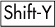以将选定的节点转换为对称。

+   按下以将选定的节点转换为自动。

将路径上的所有节点从尖角变为平滑或自动，会以特有的方式扭曲路径，移除直线和尖锐的拐角：

图 12-24. 在整个路径中转换节点类型

## 12.5.6 移动句柄

修改贝塞尔曲线段形状的最简单方法不是拖动任何节点或句柄，而是直接拖动曲线本身。这不需要选择任何节点，也不会移动任何节点。Inkscape 会简单地调整两个相邻节点的贝塞尔句柄，以便曲线始终跟随你的鼠标：

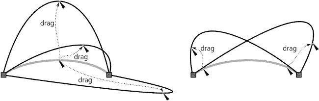

图 12-25. 曲线拖动

### 注意

*如果一个节点是平滑或对称的，拖动该节点一侧的曲线也会改变其另一侧的曲线，因为其中一个节点句柄的移动会被其另一个句柄镜像。在自动节点旁边进行曲线拖动会将节点转换为平滑节点。*

当然，你也可以简单地拖动任何选定节点（如果看不到句柄，请检查是否在控制栏上按下了**显示句柄**按钮，图 12-16). 注意，与节点不同，句柄*不能被选择*，尽管它们只显示在选定节点及其路径上的相邻节点。

当按下  时，你正在旋转的句柄会跳到 15 度的增量。当按下  时，同一节点的另一个句柄会以相同的角度旋转（即使是平滑节点，即使没有按下  也是如此）。最后，使用  锁定句柄的长度，只改变其角度。这些修饰符可以以任何组合方式工作。

### 注意

*当你拖动句柄时，Inkscape 的状态栏会报告该句柄的当前长度和角度。*

你也可以使用键盘快捷键来移动节点句柄。在**12.5.7.3 节点变换**中，我们将看到  和  键可以缩放，而  和  键可以旋转多个选定的节点，就像它们是一个对象一样。非常自然地，当你有一个*单个*节点被选中时，这些相同的键会旋转和缩放（即改变长度）该节点的贝塞尔句柄，而不会移动节点本身：

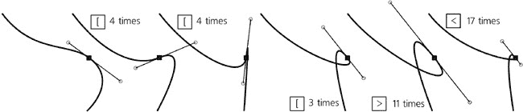

图 12-26. 使用键盘快捷键调整节点句柄

如果你有一个贝塞尔曲线但需要直线段，或者反过来呢？实际上，一条直线只是具有两个手柄都**缩回**的贝塞尔曲线的特殊情况，即与相应的节点重合。要缩回一个手柄，-点击它；要从节点中拉出一个缩回的手柄，-将其从该节点拖动出来。

另一种将贝塞尔曲线转换为直线并反之亦然的方法是使用控制栏上的两个段类型按钮。这些按钮要求至少选择两个相邻的节点，但它们也可以在所选节点之间的任何数量的段上工作。**将段转换为直线**按钮（或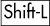）会缩回任何拉出的手柄；**将段转换为曲线**按钮（或）本身不会使段曲线化，但它会拉出手柄并将它们沿着段放置，之后你可以将它们转换为平滑：

图 12-27. 更改段落的类型

## 12.5.7 移动节点

重新塑造路径的最简单方法是通过选择其一些节点并移动它们。属于这些节点的贝塞尔手柄将与它们平行移动（除了半平滑和自动节点，它们在拖动时可能会旋转手柄）。

与选择器类似，简单的点击并拖动可以移动单个**未选择**的节点；如果你拖动一个已选择的节点，你将拖动**所有**已选择的节点。当按下时，鼠标拖动被限制在水平和垂直方向上。如果你在拖动时按下，你正在编辑的路径将被复制（与选择器的复制功能进行比较，**4.4 复制、剪切、粘贴和复制**）。

箭头键以与选择器工具相同的方式和距离移动所选节点（**6.5.1 移动**）：没有修饰符时为 2 px（默认值），按时为该距离的 10 倍，按时为 1 个屏幕像素，按时为 10 个屏幕像素。

一个更有趣的技术是在按下  的同时用鼠标拖动节点。这限制了移动到拖动节点贝塞尔手柄的方向及其垂直方向。如果一个节点在一侧有直线段，那么该段的方向将代替手柄。因此，如果节点的两个手柄或相邻段是共线的，你可以使用 -拖动它在四个方向之一；否则，在八个方向之一：

图 12-28. 按下  时拖动节点的方向

你可以使用 -拖动多个选定的节点；在这种情况下，移动将仅限于你用鼠标实际拖动的节点的手柄和段。

根据文档设置，鼠标拖动的节点可能会吸附到参考线、网格以及其他对象或节点上（默认情况下，吸附到参考线和网格是启用的，但吸附到对象上则不是）。然而，你可以通过按下  来临时禁用吸附。

### 12.5.7.1 对齐节点

单个选定节点的坐标在节点工具的控制栏中的 **X** 和 **Y** 字段中显示；编辑这些值将选定节点移动到新坐标：

图 12-29. 使用 X 和 Y 可编辑字段对齐节点

如果你选择了多个节点，这些字段显示它们的 *平均* 坐标——或者换句话说，就是选定节点的几何中心坐标。在这种情况下，在这些字段之一中输入一个值将此坐标分配给所有选定的节点，这相当于 *对齐* 所有选定的节点水平（如果你编辑 **Y**）或垂直（如果你编辑 **X**）。

另一种对齐节点的方法是使用你可能已经用于对象的工具：**对齐和分布**对话框（**7.4 对齐**）。当你切换到节点工具时，此对话框隐藏了所有对象对齐和分布按钮，并显示四个按钮，允许你水平和垂直对齐和分布选定的节点。

### 12.5.7.2 节点雕刻

我们迄今为止看到的所有方法都使所有选定节点移动相同的距离。通常，这正是你所需要的。例如，在左侧的简单面部轮廓图图 12-30 中，你可以通过选择两个节点并将它们向右拉动来轻松地使鼻子变长；对于这种绘图风格，结果是可接受的。然而，如果你有一个更复杂、更逼真的带有许多节点的绘图，如右侧所示，你该怎么办？无论你选择多少个节点，拖动它们都会引入不连续性并破坏面部的自然轮廓。

图 12-30. 拉动两个鼻子

在这种情况下，能够以不同的距离移动不同的节点，使得鼻尖移动得最远，而随着你沿着路径远离尖端，其他节点移动得越来越少，那将是非常好的。这正是 Inkscape 在你选择鼻子的所有节点并使用拖动其中一个节点时所做的。这种技术被称为*节点雕刻*。

在最简单的情况下，当所有选定的节点都在同一直线上时，-拖动中间选定的节点会将路径弯曲成平滑的钟形曲线。最远的选定节点保持不动；被拖动的节点移动到最远；其他所有选定节点以某种中间距离移动。现在，如果你的选定节点形成了一条波浪线、文本转换为路径或一个逼真的鼻子，-拖动将平滑地弯曲它们，同时保留其特征：

图 12-31. 使用雕刻节点

### 注意

*在通过拖动确定要移动哪些节点以及移动多少距离时*  *，被拖动节点的距离是沿着一条直线（空间上）计算的，而不是沿着路径。*

如果你有一个压感笔，你会注意到在拖动时节点雕刻受笔压的影响。弯曲的轮廓始终是钟形的，但低笔压时这个钟形很窄且尖锐；大多数选定节点保持在其初始位置附近。随着你增加压力，钟形变宽且更钝，因为更多的节点在拖动方向上移动得更远。为了避免在抬起笔时失去压力，首先释放，然后才抬起笔。

图 12-32. 笔压对节点雕刻的影响

如果你想要雕塑的路径部分节点不足，只需选择那里的节点，然后按  几次，以填充路径的这一部分节点。当使用许多密集节点雕塑复杂形状时，例如位图追踪(**18.8 追踪**)，隐藏它们的贝塞尔手柄（通过在控制栏上取消按下切换按钮），以免妨碍操作，并从节点扩展选择(**12.5.2 选择节点**)。

节点雕塑与调整工具(**12.6 路径调整**)类似，因为它使路径编辑更加自然，并允许你从简单形状中发展出复杂形状。然而，与调整工具不同，这种技术不会创建或删除节点，整体上更确定。因此，重复应用调整工具到复杂路径最终会简化并降低其所有内容，即使你不使用工具触摸它们，也会消失小细节。使用节点雕塑，只有选定的节点受到影响，无论你多少次按 -拖动选定的节点，都不会发生退化。

### 12.5.7.3 节点转换

“节点转换”是什么意思？我们已经知道许多移动节点的方法，甚至可以雕塑它们。这有什么不同？

记住，使用选择工具时，第六章不仅包括移动，还包括缩放和旋转(第六章). 这些转换对于路径中的一组节点来说也很有意义——如果你将这样的组视为一个“对象”。目前，此功能仅通过键盘快捷键可用。

就像在选择工具中一样， 和  键缩放选定的节点，而  和  键整体旋转它们(图 12-33). 没有修饰符时，旋转以 15 度增量进行，缩放以 2 px 进行；按下  的相同键以当前缩放旋转和缩放 1 屏幕像素。用于水平翻转（反射）的  和  键也有效。

默认情况下，缩放、旋转和翻转是在选定节点的几何中心进行的。然而，如果你将鼠标光标悬停在其中一个节点上，它将保持固定，而所有其他选定的节点将围绕它进行缩放或旋转。例如，你可以通过按选择一个对象的全部节点，然后使用和旋转整个对象围绕其任一节点。

图 12-33. 变换选定的节点

# 12.6 路径调整

我们已经在**8.7 颜色调整**中看到 Tweak 工具(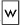, 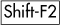)可以用来在对象上绘画和抖动颜色，在**6.9 使用 Tweak 工具变换**中，我们看到它可以用来移动和变换对象。这个多才多艺的工具的其他几种模式——*推*，*缩小/放大*，*吸引/排斥*和*粗糙化*——用于编辑路径的形状。

### AI

*Tweak 工具的路径编辑模式在 Adobe Illustrator 最新版本中与 Pucker 和 Bloat 工具有些相似。*

Tweak 工具对路径的编辑方法与 Node 工具的方法根本不同。Node 工具如其名，允许你编辑节点，你需要对节点如何定义路径形状有良好的工作知识。使用 Tweak 工具时，你可以忘记你曾经知道的关于节点的一切；只需将你的路径作为一个可塑体，就像一团建模粘土，在任何点和任何方向上弯曲和塑造它。虽然对于技术绘图几乎无用，但调整路径对于创建如卡通等艺术图像却极为方便。

Tweak 工具可以在任意数量的选定对象上工作。例如，你可以选择所有 () 并在推模式下“涂抹”你的整个绘图。你还可以将调整应用于对象组；该工具会进入组内并作用于组内的单个路径。如果你尝试在不选择任何对象的情况下使用它，它将通过状态栏消息提醒你先选择一些对象。

### 备注

*截至版本 0.47，Tweak 工具在开放路径上无法正确工作——如果你对其进行调整，开放路径会变成闭合路径。*

## 12.6.1 宽度和力度

在 Tweak 工具的任何模式下，您都可以使用一个圆形的*笔刷*（以光标为中心的橙色边缘圆圈）来“绘画”覆盖选定的对象以改变它们。笔刷的大小由**宽度**参数控制，它施加的动作量取决于**力量**参数（如果您有压力敏感的平板电脑，还包括笔压）。有关这些参数的更多详细信息，请参阅**6.9 使用 Tweak 工具进行变换**。

学习在正确的位置施加适当的拖动力（包括笔压），并使用正确的笔刷大小以获得所需的结果需要实践。然而，这项技能非常值得——使用 Tweak 工具，你可以完全控制绘图中的路径；过去使用节点工具时尴尬且耗时的工作现在变得快速而自然。

## 12.6.2 保真度

对路径的任何微调都会略微扭曲——更准确地说，*简化*——整个路径，包括您甚至没有用笔刷触及的部分。

**保真度**值允许您控制这种寄生虫简化的程度。这里的权衡是结果路径中的节点数量；低保真度会导致结果路径节点较少，但可能比您能接受的扭曲程度更大，而高保真度最小化扭曲，但路径可能最终会有很多节点，这会增加 SVG 的大小并减慢 Inkscape 的速度。

最佳的保真度值取决于您艺术品的性质。如果您正在雕塑一个无定形的块状物，您可以使用大约 20 的低保真度。然而，如果您正在推动或扩展已转换为路径的文本字符串，并希望扭曲区域外的字母尽可能干净和可读，您需要将保真度提高到 80 或更高。

### 注意

*Tweak 工具通过将路径重新塑造成一个具有数千条微小直线边的“逼近多边形”，调整该多边形的顶点，然后将其重新塑造成具有贝塞尔段的逼近路径。保真度控制这种转换的精度以及结果中的节点数量，但没有任何保真度设置会给出原始路径的确切节点——它们总是会移动一些，就像在**简化**之后一样。*

## 12.6.3 推模式

Push 是 Tweak 工具的默认模式。要从任何其他模式切换到推模式，请按，或单击控制栏上的按钮。

Push 是一种通用雕塑模式。当您在此模式下拖动时，被笔刷覆盖的选定路径部分会沿着您的拖动方向移动，直到鼠标按钮或笔被按下：

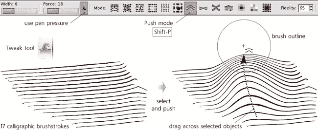

图 12-34. Tweak 工具的推模式

根据需要调整笔刷宽度，你可以将任何路径推入几乎任何其他路径——但你也可以用它进行小的调整，例如将凸起压平、弯曲附属物或弯曲雕刻网格。多亏了笔刷的钟形轮廓，你推动的路径会相应地柔和、平滑地弯曲：

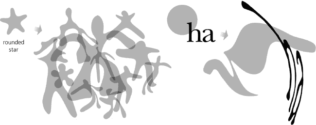

图 12-35. 在 Push 模式下绘制路径

## 12.6.4 Shrink/Grow 模式

Shrink/Grow 模式（）将路径的每个点移动到该点路径边缘的垂直方向，要么向内（收缩，普通拖动）要么向外（生长，拖动）。要从工具的任何其他模式快速访问此模式，-拖动以收缩，-拖动以生长。

Shrink/Grow 模式与**Inset**和**Outset**命令（**12.4 Offsetting**）非常相似，但 Tweak 工具始终对路径的一部分而不是整个路径进行柔和的处理。通常，此模式用于照亮或加深由许多细节组成的绘图的部分，如雕刻、自由手绘草图，甚至文本（转换为路径）：

图 12-36. Tweak 工具的 Shrink/Grow 模式

与 Push 模式不同，Shrink/Grow 模式不需要你实际*拖动*；你只需点击并保持，路径就会在你的笔刷下膨胀或收缩。然而，你也可以拖动来追逐路径的移动边缘；这样，使用小尺寸的笔刷，你可以从路径中生长出任何长度的附属物和分支。（这种生长也可以在 Push 模式下完成，但 Grow 在这个任务上要容易一些。）此外，Shrink 模式也可以作为快速橡皮擦使用。在这个模式下，切割路径、蒸发小块和碎片、修剪长笔刷非常容易：

图 12-37. 将 Shrink 模式用作橡皮擦

## 12.6.5 Attract/Repel 模式

Attract/Repel 模式（）通过将路径上受影响的每个点移动到（吸引，普通拖动）或从（排斥，拖动）光标点，挤压和爆炸任何落在笔刷下的路径。在某些情况下，这看起来可能类似于 Shrink/Grow，但区别在于 Attract/Repel 不关心被调整的路径的方向。此模式相对于笔刷的中心对称地移动所有内容：

图 12-38. Tweak 工具的 Attract/Repel 模式

## 12.6.6 粗糙模式

粗糙模式()随机扭曲了你用画笔应用路径的边缘，而不改变路径的整体形状，如图图 12-39 所示。轻微的粗糙化只是使边缘变得弯曲和不规则，而强烈的粗糙化则会撕裂边缘并将其爆炸成随机的块状和斑驳。

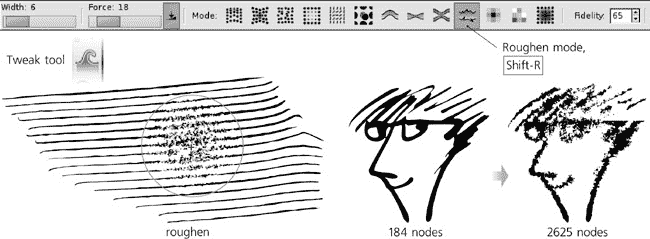

图 12-39. Tweak 工具的粗糙模式

### 注意

*这种操作，尤其是高保真度的情况下，会添加很多节点。这样的粗糙路径总是很难编辑——使用节点工具处理起来很笨拙，使用 Tweak 工具可能非常缓慢。因此，你应该首先通过推、生长和缩小来最终确定路径的整体形状，如果需要的话，再进行粗糙化作为最后一步。*
