# 第十三章。路径效果和扩展

尽管上一章内容详尽，但它并没有涵盖 Inkscape 中关于路径的所有知识。这一章篇幅较小，但随着 Inkscape 的持续发展，在未来的版本中它有可能变得更大。路径效果(**13.1 路径效果**)首次出现在 0.46 版本中；它们在 0.47 版本中真正开始流行，并且在未来版本中可能会进一步增长。处理路径的扩展(**13.3 路径扩展**)是另一个持续增长的领域；在未来，其中一些可能会被转换为路径效果，以提高交互性和与程序其他部分的集成。

# 13.1 路径效果

*路径效果* 是一个易于使用（对于最终用户）且功能强大的（对于开发者）机制，用于实现路径可见形状的修改——例如，将所有角落圆滑，使其粗糙，膨胀或挤压。无论将哪种路径效果应用于路径，效果应用前的 *原始* 路径仍然可以查看和编辑——在你编辑原始路径之后，*可见* 的路径会自动从原始路径和效果参数中重新计算。

因此，Inkscape 中的路径效果是矢量图形基本原理的另一个例子：而不是做出一些永久性和破坏性的改变，保持原始对象不变，只是记录这种改变应该如何应用。之后，原始对象及其应用到的改变参数可以在任何时候分别进行编辑。

## 13.1.1 路径效果如何工作

尽管名为路径效果，但它们不仅适用于路径，也适用于形状(第十一章)，这些形状仍然保持形状，并且可以使用形状工具中的手柄或数值参数进行编辑。然而，路径效果不适用于文本对象、克隆或位图。路径效果可以应用于组，这会产生与将效果应用于组中所有路径和形状 *组合*（即，成为单个路径的子路径）相同的结果。

图 13-1. 将 Sketch 效果(13.1.6 Sketch)应用于路径（左）和 3D 盒子（右）

当路径效果应用于对象时，唯一改变的是对象的 *可见形状*；如果你想以非破坏性的方式改变其 *样式*，尝试使用过滤器而不是(第十七章)。路径效果可以堆叠在一起，使得一个效果的输出成为下一个效果的输入。

### SVG

*实时路径效果是 Inkscape 独有的功能；与例如过滤器不同，路径效果不是 SVG 标准的一部分。然而，它们以 SVG 兼容的方式实现：如果你使用带有路径效果的 SVG 文件加载到 SVG 查看器（或加载到不支持此效果的老版本 Inkscape），你将看到与 Inkscape 中相同的*可见*路径，但无法访问*原始*路径和效果参数。有一个注意事项：如果你尝试在不支持此效果的老版本 Inkscape 中编辑该可见路径，然后重新加载更改后的文件到支持此效果的新版本中，你的更改将会丢失，因为新的可见路径将基于未更改的原始路径和效果参数生成。*

*在一个应用了路径效果的`path`元素中，原始路径数据存储在`inkscape:original-d`属性中。路径的效果在`inkscape:path-effect`属性中指定，该属性引用一个元素，该元素与文档中的`defs`一起存储，并包含其参数（**A.4 Defs, View, and Metadata**）。效果的结果将自动重新计算并存储在路径对象的标准的`d`属性中。所有 Inkscape 工具和命令都知道，在应用了路径效果的路径中，它们不应该编辑或更改`d`，而是应该操作或显示`inkscape:original-d`。*

要将一个对象的路径效果分配给任意数量的其他路径或形状，复制源对象（），选择目标对象，并使用“粘贴路径效果”命令（）。Inkscape 附带了一些示例 SVG 文件（在 Linux 上的*/usr/share/inkscape/examples*，在 Windows 上的*<inkscape-dir>\share\examples*），其中一些展示了各种路径效果；你可以使用这个复制/粘贴技巧，在文档中重复使用这些示例文件中的任何效果。

当你组合（**12.1.1 子路径**）形状或路径时，结果将具有最顶层对象的路径效果，如果有。将带有路径效果的路径拆分会导致效果应用于所有生成的新路径。

要清除路径效果并返回到原始路径，请使用“路径”菜单中的“移除路径效果”命令。然而，如果你想要保留效果的结果并忘记原始路径，请使用“对象到路径”命令（）；这不会改变路径的外观，但效果将消失。

### SVG

*“对象到路径”命令也是确保你的文件不仅在 Inkscape 的老版本中正确渲染，而且在除 Inkscape 之外的 SVG 编辑器中可编辑的最佳方式。*

使用节点工具时，你正在编辑原始路径，而不是效果后的可见路径。由于你正在编辑的路径本身不可见，使用相应的工具栏按钮（图 12-17）来突出显示它很方便；大多数效果会自动为你启用此高亮显示。

## 13.1.2 路径效果编辑器对话框

**路径效果编辑器** 对话框（，见 图 13-2) 是路径效果的主要控制中心。它列出了 Inkscape 支持的所有路径效果（此列表随着每个新的 Inkscape 版本而扩展），并允许你选择应用于所选路径、形状或组的那些效果。当选择了一个具有一个或多个路径效果的对象时，你可以使用此对话框查看其效果堆栈，添加或删除效果，并调整所选效果的参数。

### 注意

*如果你对一个组应用了一些路径效果，你只能在选择该组时编辑这些效果的参数，而不能在选择组中的任何路径时编辑。*

对话框中的 **效果列表** 列出了应用于所选对象的所有效果。它们按从上到下的顺序列出；也就是说，应用在源路径上的第一个效果是最上面的一个，其输出传递到第二个效果，依此类推，直到最后一个列出且其输出被显示的效果。

你添加的新效果被放置在堆栈的末尾。你可以通过列表下方的箭头按钮将堆栈中的任何效果向上或向下移动。每个效果名称前的眼睛图标允许你禁用效果，迫使 Inkscape 绕过它（效果参数中的 **可见？** 复选框具有相同的功能）。要从堆栈中删除效果，请使用带有减号按钮。

效果的参数可能属于几种类型：

+   *数字* 可以是整数或分数，具体取决于参数的性质。当一个数字表示距离时，它通常以 `px` 单位表示（**A.6 坐标和单位**）。

    

    图 13-2. 路径效果编辑器对话框；选中的路径具有 Spiro 样条、Stitch Sub-Paths 和 Sketch 效果。

+   在 *随机数参数* 中，可编辑的数字指定随机值必须落在的范围，而骰子按钮重新洗牌由该参数控制的随机值：

    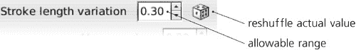

    图 13-3. 路径效果的随机数参数

+   *链接参数*用于当一个路径的效果使用其他路径作为其参数之一时。那个*链接路径*可以是一个位于画布上某个位置的独立对象（在同一文档中），或者它可以是完全存储在路径效果中且在文档中不可见的路径。

    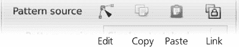

    图 13-4. 路径效果的链接参数

链接参数显示一行四个按钮：

**编辑按钮**

+   将 Inkscape 切换到节点工具，并允许您编辑该链接路径，无论它是一个独立对象还是存储在效果内部的路径（图 13-5). 在后一种情况下，该路径显示为绿色轮廓。

    这与您手动切换到节点工具并点击控件栏上的**编辑路径效果参数**按钮相同。

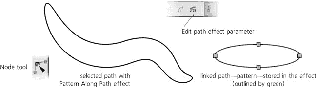

图 13-5. 编辑路径效果的链接路径

**复制按钮**

+   将链接路径复制到剪贴板。

**粘贴按钮**

+   将剪贴板中的路径粘贴到效果中，复制剪贴板路径并将其存储在效果中。

**链接按钮**

+   将复制到剪贴板的路径链接到文档中的原始效果。现在，编辑您复制的对象将更改此路径的效果。

除了对话框中的数字控件外，一些路径效果允许您通过在节点或形状工具中可访问的画布上的手柄来直观地编辑它们的参数。当我们讨论特定效果时，我们将看到这方面的示例。

## 13.1.3 沿路径图案和弯曲

**沿路径图案**和**弯曲**效果非常相似。它们都取一个路径（称为*图案*）并将其弯曲和/或拉伸到另一个路径（称为*骨骼*）上。这与 Microsoft Expression 等软件中的“骨骼路径”非常相似，通常用于自由手绘（参见图 14-11）。

与路径效果通常一样，骨骼路径和图案在任何时候都保持可编辑状态，结果实时更新。这是一种创建易于编辑矢量画笔的好方法——例如，您可以从使用钢笔或铅笔工具创建一个绘图开始，然后尝试将其所有路径应用各种图案，调整宽度以获得最佳效果。

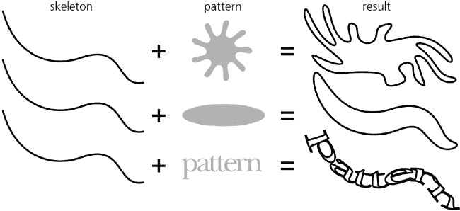

图 13-6. 沿骨骼弯曲图案

除了重复图案的能力之外，**沿路径图案**和**弯曲**效果之间的主要区别在于哪个路径是骨骼，哪个是图案：

+   在**路径上的图案**中，您应用效果的路径变成骨骼，图案是通过链接参数连接起来的。这种效果非常适合简单、可能重复的图案，应用于任意骨骼。链接的图案路径可以是文档中的独立路径对象，或者存储在效果内部的路径。结果是获得骨骼的样式。这是笔和铅笔工具中的**形状**选项所使用的效果（**14.1.5 描边形状**）。

    一旦您将**路径上的图案**应用到骨骼路径上，您需要使用**图案源**链接参数提供图案。除非您首先粘贴或链接一些图案路径，否则**编辑**按钮不起作用，因此通常的操作顺序是：选择一个图案路径，复制它 ()，选择一个骨骼路径，将其分配为**路径上的图案**，然后粘贴或链接图案到它。或者，如果您在笔或铅笔工具的**形状**列表中选择**从剪贴板**，您还可以快速绘制应用了复制图案的骨骼。

    

    图 13-7. **路径上的图案**效果

+   在**弯曲**模式下，您应用效果到的路径变成图案，而骨骼是通过链接参数连接起来的。当您有一个复杂的图案，希望沿着一个简单、可能共享的骨骼路径轻微弯曲时，这会更加方便。同样，链接的骨骼路径可以是文档中的独立路径，或者存储在效果内部的路径。结果是获得图案的样式。

    对于这个效果，您从图案开始，使用**弯曲**链接参数将其链接到骨骼。然而，与**路径上的图案**不同，**弯曲**提供了一个默认的两个节点骨骼路径，它沿着您图案的水平轴延伸——因此您可以立即使用**编辑**按钮来编辑该骨骼。如果您愿意，您仍然可以从剪贴板粘贴骨骼或链接到复制的路径。

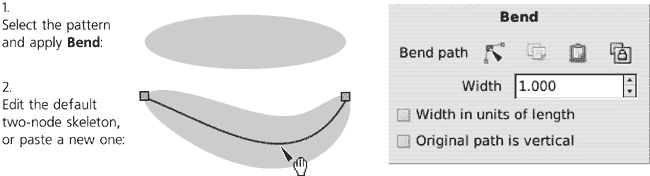

图 13-8. **弯曲**效果

### 注意

*您可以使用任何路径作为**弯曲**的外部链接骨骼，包括应用了其他路径效果的路径。*

这两种效果都允许您更改图案的**宽度**。这个宽度可以用图案原始宽度的单位或骨骼长度的单位来衡量：

图 13-9. 调整图案的宽度

**路径上的图案**效果可以使用以下**重复模式**之一：

**单重**

+   在路径上放置单个图案副本，从起点开始，不拉伸它。因此，如果图案比骨骼短，它将只覆盖骨骼长度的一部分；如果图案更长（即甚至一次都不适合），则不会应用。

**单个，拉伸**（默认）

+   也放置单个图案副本沿骨骼，但始终拉伸或挤压它，使其正好适合骨骼长度。**弯曲**效果始终使用此模式；与**沿路径图案**不同，在**弯曲**中，重复模式不可更改。

**重复**

+   在骨骼路径上放置尽可能多的图案副本，但不会拉伸它们，因此骨骼长度超过一个图案长度的剩余部分保持未填充。（然而，这并不意味着图案的副本是相同的；骨骼的曲率可能会明显扭曲它们，如 图 13-10 所示。）

**重复，拉伸**

+   在骨骼上放置尽可能多的图案副本，并均匀拉伸它们，使它们正好填充整个骨骼长度。

    

    图 13-10. 沿路径图案的重复模式

    图案始终从路径的起点开始；如果您想让它朝相反方向走，请使用 **路径** ▸ **反转**。

    此外，**沿路径图案**效果还允许您调整一些 **距离参数**：

**间距**（仅适用于重复模式）

+   设置路径上图案副本之间的间距。

**正常偏移**

+   在每个点上将图案的所有副本沿骨骼路径垂直移动。

**切向偏移**

+   将图案的所有副本沿骨骼路径移动，第一个图案不是从骨骼的起点开始，而是从这个指定的距离开始。

这些偏移和间距参数默认情况下以绝对 `px` 单位表示。通过勾选 **以图案大小为单位偏移** 复选框，您可以将其表示为图案大小的倍数——例如，切向偏移 0.5 将将图案沿骨骼移动到图案宽度的一半。

图 13-11. 沿路径图案的间距和偏移

默认情况下，图案的原始位置被认为是水平的——也就是说，图案通过图案的水平轴与骨骼对齐。通过勾选 **图案是垂直的**（对于 **沿路径图案**）或 **原始路径是垂直的**（对于 **弯曲**）复选框，您可以旋转图案 90 度，使其垂直轴对齐，如图 图 13-12 所示。

图 13-12. 沿路径图案的图案方向

## 13.1.4 缝合子路径

非常有用的**缝合子路径**效果仅适用于具有两个或更多子路径的路径（**12.1.1 子路径**）。它用连接子路径上等距点的路径网格替换源路径；您可以通过参数设置连接路径的数量。使用此效果，您可以创建各种毛发、毛发、网格、莫尔图案或“力量场”：

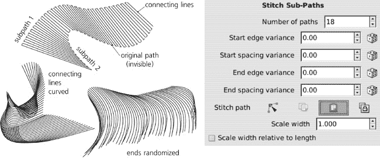

图 13-13. 缝合子路径

### 注意

*如果路径有三个或更多子路径，每对子路径都有自己的连接网格。这意味着随着原始子路径数量的增加，连接线的数量实际上会爆炸——所以不要在具有多个子路径的路径上尝试此效果，否则您将很容易使 Inkscape 陷入停滞！*

图 13-14. 缝合三个或更多子路径

连接线不必是直的，尽管这是默认设置。您可以使用**缝合路径**链接参数粘贴或链接任何现有的开放路径作为缝合线，或者您可以使用节点工具编辑这些线条。**缩放宽度**参数按垂直于其起始-结束方向的方向缩放缝合路径（值为 1 给它其自然宽度）。**相对于长度的缩放宽度**使每条缝合线的宽度取决于该缝合线的长度，如图图 13-15 所示。

图 13-15. 调整曲线缝合路径的宽度

最后，一组随机化（**方差**）参数允许您分别对每条缝合线的开始和结束处的缝合点进行打乱，沿着路径（**间距**）和垂直于路径（**边缘**）：

图 13-16. 随机化缝合的子路径

## 13.1.5 结

这种效果将路径分解为子路径，在它们之间创建间隙，路径（或一组路径）在这些间隙处自我交叉。它可以将具有自我交叉的描边路径转变为凯尔特结：

图 13-17. 在具有自我交叉的路径上的结效果

此效果的唯一数值参数指定了每个间隙的宽度（以`px`为单位）。在画布上，您可以单独控制每个交叉点。选择带有**节点**效果的路劲，切换到节点工具，并注意其中一个自交叉点有一个菱形手柄和一个绿色圆形指示器，该指示器在一侧是打开的。点击该手柄；指示器翻转至另一侧，此时间隙现在影响交叉点的另一条线。再次点击它，您将关闭交叉点并移除任何间隙；指示器现在是一个实心圆。您可以通过点击手柄来循环交叉点的这三种状态。要控制路径上的另一个交叉点，只需拖动手柄并将其放置在所需交叉点附近。

## 13.1.6 草图

**草图**是一种复杂的艺术效果，它将路径转换成带有多个笔触的草图样式的绘图，就像是一位试图找到最佳形状的艺术家手工绘制：

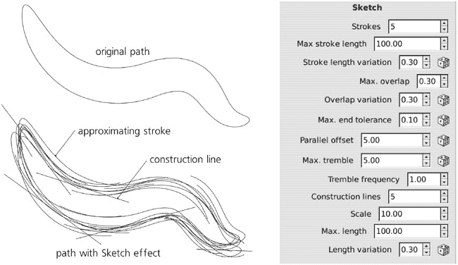

图 13-18. 草图效果

为了理解这个复杂效果的众多参数，请记住，草图由两种类型的痕迹组成：近似笔触和构造线。**近似笔触**覆盖整个路径；它们通常是曲线形的，或多或少与原始路径平行（带有一定的颤动），并且距离原始路径一定距离。另一方面，**构造线**通过绘制延伸到两侧的直线来标识和强调路径的直线或几乎直的部分。

对于近似笔触，您可以更改：

+   路径上每个点的平行笔触的平均**数量**（默认为五个）。将此参数设置为 0 以隐藏近似笔触（仅保留构造线）；低值使草图显得轻盈和试探性，增加数量则使其更粗犷和嘈杂：

    

    图 13-19. 更改近似笔触的数量（构造线已关闭）

+   笔触的最大**长度**（以`px`为单位）以及随机长度**变化**的范围（相对于最大长度）。

+   后续笔触的最大**重叠**（以`px`为单位）以及此参数随机**变化**的范围（相对于最大重叠值）。

+   影响近似笔触跟随原始路径的**末端容差**。

+   近似笔触与原始路径的平均**偏移**；通过改变此参数，可以使草图显得整洁紧凑或宽大皱褶。

+   最大**颤动**及其**频率**；这些控制笔触围绕原始路径的振荡方式。增加最大颤动会使草图显得凌乱，类似于增加偏移但更随机；增加频率会使草图线条看起来更粗糙，因为它们在更小的尺度上颤动。

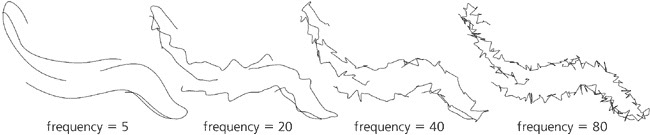

图 13-20. 改变近似线的颤动频率

对于构造线，您可以更改：

+   总数（非平均值）的**行数**在草图中的数量（默认为五行）。将此设置为 0 以抑制构造线，只留下近似线。

+   **缩放**参数告诉构造线的末端可以延伸多远超过路径的直线（或近似直线）部分的末端。

+   最大**长度**及其随机**变化**设定了构造线长度的上限：

    

    图 13-21. 玩构造线（近似线已关闭）

## 13.1.7 斯皮罗样条

使用贝塞尔曲线构建路径（**12.1.4 贝塞尔曲线**)有着多年的传统。所有值得信赖的现代图形软件都以相同的方式支持它，数百万用户都熟悉它。贝塞尔范式无疑非常灵活和强大。我认为大多数曾经使用过它的人都会发现很难列出任何特定的主要缺点。 

然而，一旦您尝试更好的东西，这些缺点就会变得痛苦明显。

*斯皮罗样条*是定义曲线路径的一种新颖方法，由 Raph Levien 开发。它们需要一些时间来适应，但对于某些任务（如字母形状设计）斯皮罗曲线相对于贝塞尔曲线具有明显的优势。从版本 0.47 开始，斯皮罗样条在 Inkscape 中作为路径效果提供，这意味着您可以在斯皮罗路径上使用所有方便的 Inkscape 路径工具（如移动和变换节点组、节点雕刻等）。钢笔和铅笔工具可以直接生成斯皮罗路径（**14.1.4 模式**）。

斯皮罗路径由一系列节点定义。然而，与由贝塞尔曲线组成的常规路径不同，所有斯皮罗节点都位于路径上，没有路径外的手柄。路径的曲率完全由节点的位置和类型定义。路径的行为非常类似于被强迫通过给定点的弹性杆，它使用最小的曲率来满足要求：

图 13-22. 将常规路径转换为斯皮罗路径并返回

一旦你掌握了基本概念，随着你对斯皮罗路径的熟悉，它的行为会变得越来越自然。更重要的是，生成的路径总是非常平滑——不仅仅是表面上平滑，即没有尖角，而且在更深层次上平滑，这是你需要经过大量繁琐调整才能用贝塞尔曲线实现的。

经历过斯皮罗路径后，很明显，贝塞尔曲线的主要问题在于每个节点不仅有一个位置，还有它自己的内在“方向”和“曲率”，这是由其手柄定义的。因此，每次你移动贝塞尔节点时，你还需要仔细调整其手柄，以确保曲线看起来仍然平滑自然。使用斯皮罗，你不需要满足这一要求；只需将节点移动到你想让曲线经过的位置，曲线的平滑性会自动处理。

### 注意

*将斯皮罗路径转换为常规路径后，它会有两到三个倍的节点；现在，考虑到这些贝塞尔节点实际上是三个点（节点本身及其手柄）与斯皮罗节点的单个点相比——你就会明白斯皮罗路径编辑可以多么快和容易。*

图 13-23. 使用斯皮罗路径创建的字母形状

要创建一个斯皮罗路径，选择任意路径并将其分配给**斯皮罗样条**路径效果。没有参数。你的路径的每个节点都成为斯皮罗路径的一个点，具体取决于节点的类型（**12.5.5 节点类型**）：

+   **平滑节点**（那些有两个共线贝塞尔手柄的节点）是斯皮罗路径上的平滑点。请注意，源路径上贝塞尔手柄的长度和方向被忽略；唯一重要的是它们的共线性（即平滑性）。按 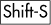 线性排列所选节点的手柄，使其平滑。

+   **半平滑节点**（那些有一个贝塞尔手柄与另一侧的直线段共线的节点）在斯皮罗路径上的行为完全相同：它们位于直线和曲线之间，并强制这两个段平滑连接，没有尖角。如果你在节点的一侧有直线段，第一个  将使其半平滑。

+   源路径上的**尖角节点**成为斯皮罗路径的角点。它们像弹簧杆上的自由铰链一样工作，允许它在任何角度弯曲。在两个角点之间，斯皮罗路径始终是直线。要使节点成为尖角，按 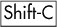 两下（第一次  只改变节点的类型，第二次实际上收回了手柄）。

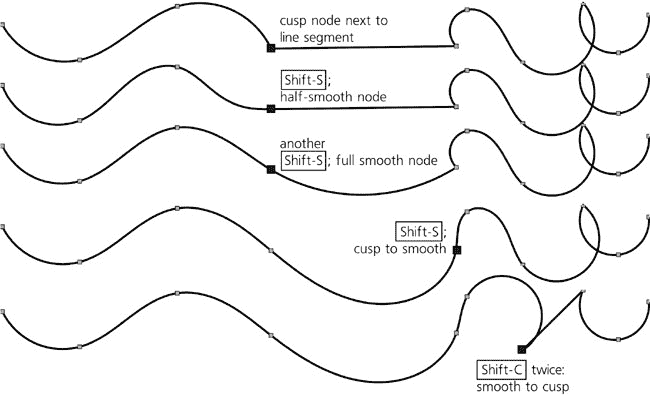

图 13-24. 在 Spiro 路径中玩节点类型

### 注意

对于 Spiro 来说，重要的是节点手柄的实际共线性，而不管节点在节点工具中具有哪种节点类型。例如，如果一个被指定为尖点（菱形）的节点具有共线的手柄，它仍然会在 Spiro 路径上是一个平滑曲线点。

Spiro 样条线可能最大的问题是某些点配置不稳定，会产生狂野的环和螺旋而不是平滑曲线。尽管如此，合理的点序列通常工作良好；你只需避免点之间方向上的急剧变化，以防止这种不稳定性。希望算法的鲁棒性将在未来的版本中得到改进。

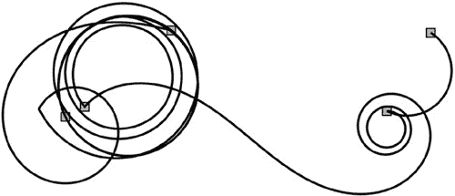

图 13-25. 具有五个节点的发散 Spiro 路径

当使用节点工具编辑 Spiro 路径时，源路径的红色高亮可能会分散注意力；您可以通过控制栏中的切换按钮将其关闭。

## 13.1.8 包络变形

此效果通过将路径或一组路径拟合到曲线包络中来扭曲路径。应用此效果后，包络是矩形的，你可以通过节点工具逐个弯曲其侧面。该效果将所有四边视为独立的辅助路径（“弯曲路径”），这稍微有些不便：你需要依次单击每个侧面的**编辑**按钮来弯曲所有四边。**复制**和**粘贴**按钮允许您将包络的确切形状从一个对象转移到另一个对象。

图 13-26. 一组路径的包络畸变

## 13.1.9 VonKoch

这种类似分形的递归效果将原始路径重复两次（作为子路径）进行平移、缩放和旋转；然后对这些副本执行相同的操作，依此类推，直到指定的*代数*。副本的变换由三个辅助路径的配置决定：一个*参考段*（最初，水平穿过源路径）和两个*生成*路径（最初，水平穿过前两代副本）。这些辅助路径是两个节点的直线段（即，它们的曲率不予考虑）；要编辑它们，您可以使用节点工具并单击其控制栏上的**编辑路径效果参数**按钮一次或两次；或者，您可以单击效果参数中的**编辑**按钮，以编辑相应的辅助路径。以下是一些示例：

图 13-27. 相同源路径和不同辅助段的不同 VonKoch 分形

# 13.2 动态和链接偏移

我们已经看到了常规偏移命令(**12.4 偏移**)，这些命令在每个点上垂直于路径方向扩展(*外扩*)或收缩(*内缩*)路径。这些命令是破坏性的——一旦偏移路径，您就会失去原始路径。然而，存在相同命令的非破坏性版本：**动态偏移**和**链接偏移**。

### 注意

**动态偏移和链接偏移在概念上与路径效果非常相似——它们也有一个不可见的原始路径、可见的偏移路径以及指定偏移多少的参数。然而，由于历史原因，偏移并没有作为路径效果实现，因此它们在**路径效果编辑器**对话框中不可用。然而，似乎在未来的版本中，偏移将被重新实现为路径效果。**

使用**动态偏移**时，原始路径在画布上的任何地方都不可见——它被**存储**在动态偏移对象内部，该对象仅显示偏移路径。要创建此类对象，请选择一个路径并按或选择**路径** ▸ **动态偏移**。**链接偏移**的不同之处在于它**链接**到现有路径作为其源。通过这种方式，您可以从单个源路径创建多个偏移，并且当源路径被编辑时，它们都会更新。要创建链接偏移，请选择源路径并按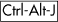，选择**路径** ▸ **链接偏移**，或者简单地复制()现有相同原始的链接偏移。

这两种偏移都在偏移路径上显示一个单独的、菱形的手柄。您可以将其拖动到任何位置；它距离原始路径的距离决定了路径的内缩或外扩程度，但您也可以将其沿着路径移动到最方便的位置：

图 13-28. 使用手柄进行动态和链接偏移

与路径效果一样，要将动态或链接偏移转换为常规路径，请选择**路径** ▸ **对象到路径** ()。

# 13.3 路径扩展

**扩展**是简单的外部程序，它们在文档中选定的对象上执行一些操作。它们由**扩展**菜单子菜单中的命令表示。然而，它们不应与路径效果混淆；它们是一次性、破坏性的操作，在改变对象时不会保留原始对象。撤销扩展命令效果的唯一方法是使用**编辑** ▸ **撤销**。

典型的扩展在运行扩展之前，你可以在对话框中设置一些*参数*。大多数扩展对话框都有**实时预览**复选框，当勾选时，允许你在不撤销并再次调用扩展的情况下预览文档中各种参数的效果。请注意，当**实时预览**关闭时，扩展对话框不是模态的，这意味着你可以平移画布并选择不同的对象；一旦你打开**实时预览**，对话框就会锁定 Inkscape 的其余部分，这样你只能更改对话框中的参数并看到它们对当前选择的影响。（在更改参数和用**实时预览**更新画布之间通常会有一个暂停。）要应用更改作为最终结果，请点击**应用**按钮；要取消而不应用，请点击**关闭**。

并非所有扩展都处理路径；一些扩展在相关的地方已经提到，其他扩展将在整本书中介绍。在本章中，我们将仅关注修改或创建路径对象的扩展。

在**从路径生成**子菜单中，有几个扩展可以从选定的路径生成一些新的路径或路径：

**内嵌/外延光环**

+   向选定的路径添加指定数量的内嵌或外延路径，这些路径以给定的距离间隔排列，每个进一步的偏移都具有越来越低的透明度。如果你想要模糊对象的边缘但又不想使用**高斯模糊**滤镜（**17.1 模糊**）：

    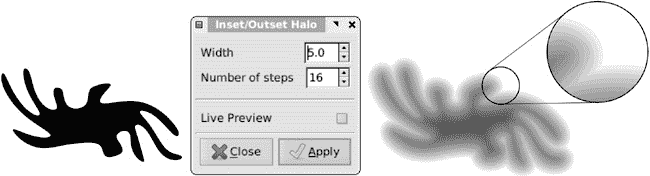

    图 13-29。光环扩展创建了一个“穷人版的高斯模糊”。

**拉伸**

+   通过将选定的路径在给定的角度拉伸到给定的距离来创建原始路径和其拉伸裙边的一组对象，从而创建一个原始的 3D 效果。效果的结果是一个包含两个对象的组，一个是原始路径，另一个是其拉伸裙边，你可以根据图 13-30 所示的不同方式来样式化。

    

    图 13-30。拉伸创建了一个简单的 3D 效果。

**插值**

+   在两个路径之间创建一个插值，或*混合*，这是一个中间路径的序列，这些路径在两个路径之间平滑过渡。你可以指定**插值步骤数**和**指数**，如果与默认值 0 不同，则将混合向一个端点移动：

    

    图 13-31。插值路径

    **插值样式**选项虽然在测试中标记为“实验性”，但效果足够好。两种插值 **方法** 在生成中间步骤的方式上略有不同。扩展将所有中间步骤作为一个路径组生成；**Duplicate endpaths** 选项还将原始路径的副本添加到该组中。由于插值始终连接两条路径的开始和结束，您可能需要反转其中一条路径（**路径** ▸ **反转**），以获得您想要的结果。

**沿路径图案**

+   这与同名的路径效果（**13.1.3 沿路径和弯曲的图案**) 类似，实际上，这是此功能的第一个版本，在路径效果成为可能之前就已经引入。目前，与路径效果相比，该扩展有一个优点：它可以使用一组对象（每个对象都有自己的样式）作为图案，而在路径效果中，你被限制为使用单图案路径。要使用此扩展，请选择图案路径或组以及骨架路径（图案必须在 z 轴顺序上位于骨架之上），然后从菜单中选择扩展。其选项与相应的路径效果类似。

**修改路径**子菜单包含直接更改所选路径的扩展：

**添加节点**

+   此有用的扩展在路径中创建更多节点，而不改变其形状。您可以指定相邻节点之间的最大允许距离或每个段将被分割成多少段。我们已经在 图 9-11 中看到了此扩展的实际应用。

**包络**和**透视**

+   这两个扩展都需要您选择两条路径，第二条路径正好有四个节点。第二条路径被视为变形包络，第一条路径被嵌入其中（只有角落的坐标很重要；如果有的话，忽略侧面的曲率）。这两个扩展没有参数。两个扩展之间的唯一区别是，**透视**与**包络**不同，它将四个节点的包络解释为透视平面，执行透视缩短，使“更远”的部分变得更小：

    

    图 13-32. 包络和透视

**Flatten Béziers** 和 **Straighten Segments**

+   **Flatten Béziers** 扩展将所选路径中的每条贝塞尔曲线近似为一系列直线段（**Flatness** 越高，近似越粗糙），而 **Straighten Segments** 则简单地按给定百分比缩短所有贝塞尔手柄，因此将此设置为 100% 将每个贝塞尔曲线转换为直线段：

    

    图 13-33. 将贝塞尔曲线展平和段直化

**抖动节点**

+   此扩展通过将所有节点随机方向和随机距离进行位移来随机化选定的路径，位移量受 **最大位移** 参数限制，这些参数可以分别设置 X 和 Y（例如，如果您只想在垂直方向上抖动节点，可以将 X 的最大位移设置为 0）。此外，您还可以分别启用节点本身及其贝塞尔手柄的抖动。开启 **使用正态分布** 以使较小的位移比大的位移更可能；如果不开启，则 **最大位移** 范围内的任何位移都是等可能的。

    

    图 13-34. 节点抖动

**分形化**

+   这是随机化路径的另一种方法。与 **抖动节点** 不同，它会在现有节点之间创建新的节点，然后移动这些新节点（原始路径中的任何贝塞尔手柄都将被丢弃），同时保留所有原始节点。**细分** 参数确定每个段将被细分多少次（注意：增加此值会使节点数量呈指数增长——例如，10 次细分将两个节点的路径变成一个包含 1,025 个节点的路径），而 **平滑度** 则改变新节点可以移动的距离（较低的 **平滑度** 产生更粗糙的路径）。此效果非常适合在幻想地图中创建海岸线：

    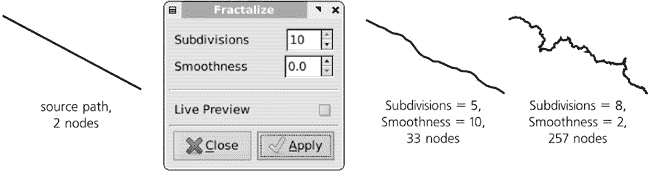

    图 13-35. 分形化路径

**橡皮拉伸**

+   此扩展在垂直方向上拉伸对象（在应用扩展前后旋转对象以获得不同的拉伸方向），同时在两侧水平吹气，使其以非线性方式表现，就像由橡皮制成：

    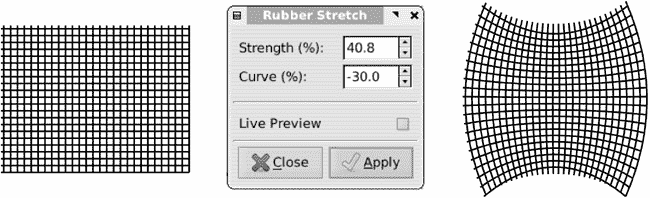

    图 13-36. 橡皮拉伸垂直拉动路径。

**漩涡**

+   这会将选定的路径扭曲成一个漩涡，其中心位于启动扩展时 Inkscape 视图的中心。您可以通过按  或选择 **视图** ▸ **缩放** ▸ **选择** (**3.9 缩放工具**) 来将视图中心放置在选择的几何中心。如果您在源路径中添加更多节点，此扩展将提供更好的结果，可以通过在节点工具中 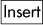 或通过 **添加节点** 扩展：

    

    图 13-37. 漩涡路径

**渲染**子菜单包含一些扩展程序，它们可以生成完全基于您文档内容之外的新对象：

**网格**

+   此扩展程序以单一路径生成矩形网格，每行都是一个子路径（例如，图 13-36`、`log(x)`或`sqrt(x)`；有关完整列表，请参阅**函数**选项卡。

    每次对函数的采样都会创建一个平滑的贝塞尔节点；该点处函数的**一阶导数**决定了该节点手柄的角度。您可以要求扩展程序**数值计算一阶导数**，或者您可以选择取消勾选该复选框，并使用与函数本身相同的 Python 语法和内置函数来提供导数函数（例如，`sin(x)`的一阶导数是`cos(x)`）。

    

    图 13-38. 函数绘图器示例

**L 系统**

+   此扩展程序实现了**林德曼系统**——一种具有递归的简单图形语言，可以生成复杂的顺序或树状结构：

    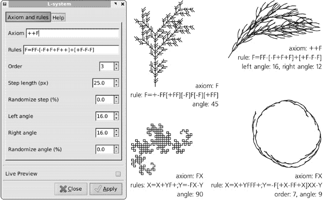

    图 13-39. L 系统示例

    此语言中的“程序”，由像“向前走一步”或“向左转”这样的简单命令组成，包含两部分：**公理**和替换的**规则**。规则应用于公理，次数由**顺序**指定。其余参数确定公理和规则中原始命令产生的长度和角度，并允许您随机化这些值以使结果更自然。有关公理和规则中识别的命令的完整列表，请参阅**帮助**标签。

**随机树**

+   这与**L 系统**扩展类似，但更为原始；它所做的只是绘制一个随机分支的树，树的主干第一段长度为**初始大小**，每个后续分支逐渐变短，直到达到**最小大小**并终止绘图。因此，初始大小和最小大小之间的差异越大，树就越复杂。

**曲线轮**

+   这是同名流行玩具的实现，其中一个小圆在较大的圆形洞的边缘滚动。在扩展中，您可以改变这两个圆的直径以及一些其他参数。

最后，**可视化路径**子菜单收集了以某种方式可视化所选路径的扩展：

**节点编号**

+   这将路径替换为一组点，每个点对应于原始路径的节点，按顺序编号。您可以更改点的尺寸和表示数字的文本对象的字体大小。

**绘制手柄**

+   此扩展添加与所选路径的贝塞尔手柄相对应的行，作为一个具有单独子路径的新路径。

**尺寸**

+   这在所选对象（不一定是路径）周围创建一个框架和尺寸线，例如在平面图或技术草图中使用的那些。创建尺寸线后，您可以使用**测量路径**扩展添加实际长度测量值。

**测量路径**

+   此扩展计算路径的长度，从起点到终点，并将此值作为文本路径对象添加到源路径上（**15.7 将文本转换为路径**）。您可以指定值的**精度**和**长度单位**，并调整**字体大小**和路径的距离（**偏移量**）。

    

    图 13-40. 尺寸和测量路径的综合效果
