# 第十四章. 绘图

从历史上看，矢量编辑器的一个名称是*矢量绘图*——或者甚至简单地称为*绘图*——应用程序。另一方面，位图编辑器有时被称为*绘画程序*。在传统媒体（如纸张和画布）中确立的绘画与绘画之间的区别因此延续到了数字领域。尽管矢量程序现在被用于——也许甚至更倾向于用于更高级的任务，如构图和布局——“简单地绘图”仍然是这类工具最基本的应用。

确实，矢量绘图永远无法像位图那样自然和“绘画般”；即使是最好的矢量艺术也带有那种可识别的平滑、计算机生成的外观。然而，这种外观往往并不是问题；它甚至可能是一个优势。此外，矢量编辑器拥有位图编辑器无法比拟的某些功能：将每笔划视为一个独立的对象，这些对象永远不会合并或“扁平化”到其他对象中（除非你告诉它这样做）。事实证明，这种无限的调整能力有时对于制作好的自由手绘比模仿蜡笔笔触或湿画水彩的能力更重要。

Inkscape 提供了三种主要的绘图工具供您选择，具体取决于您想要创建的艺术类型。如果您需要严格几何或贝塞尔形状的路径，节点放置精确，请使用钢笔工具（**14.1 钢笔工具**）。对于自由手绘路径，经过一定程度的平滑处理，请使用铅笔工具（**14.2 铅笔工具**）。最后，对于复杂、自然、压力敏感的填充笔触，模仿各种物理效果，如颤抖或惯性，请使用书法笔（**14.3 书法笔工具**）。我们还将讨论油漆桶工具（**14.4 油漆桶工具**），用于填充封闭区域，通常用于卡通和自由手绘。

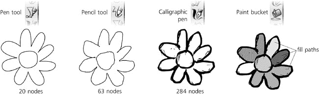

图 14-1. Inkscape 的绘图工具

# 14.1 钢笔工具

钢笔工具适用于那些你知道大致想要放置路径节点位置的情况。它可以被视为节点工具（**12.5 节点工具**）的兄弟，但它优化了创建和连接节点而不是编辑节点的功能。

切换到笔工具（或），在画布上点击并拖动。新路径的第一个*节点*出现在你点击的位置；从该点到你的当前鼠标位置的灰色直线是该节点的*手柄*（**12.1.4 贝塞尔曲线**）。一旦你释放鼠标按钮，手柄就固定了——但路径尚未完成；现在它期望你点击或点击并拖动以创建第二个节点。在此模式下，只需移动鼠标（不点击）就会显示一个红色的贝塞尔段，这显示了如果你在此点创建下一个节点，路径将如何看起来。

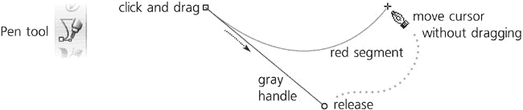

图 14-2. 笔：第一个节点集，准备进行第二个节点设置

现在，点击并拖动以设置第二个节点（图 14-3）。释放鼠标后，两个定义节点之间的路径部分变为绿色，并且你再次在最后一个创建的节点和当前鼠标点之间有一个红色段。这可以无限重复——只需继续点击并拖动（用于平滑对称节点）或仅点击（用于尖点节点）；在每一步，你已创建的路径部分是绿色的，你即将创建的部分是红色的。


图 14-3. 笔：两个节点设置，准备进行第三个节点设置

要完成路径，请双击或右键单击（这添加一个节点并完成路径）或按（这取消红色段而不添加更多节点并完成路径）。只有在这一点上，整个路径才实际上作为一个对象创建；你之前看到的是只是一个虚拟的支架。完成路径的另一种方法是*闭合*它；如果你在路径的第一个节点（由一个小方形锚点标记）正上方创建下一个节点，路径将被闭合并最终完成。

要在任何时候取消创建路径，请按或简单地切换到另一个工具。

### 注意

*大多数用于缩放、滚动和滚动的键和鼠标快捷键（第三章)在笔工具中工作，而不会干扰路径创建。例如，你可以中间拖动画布并中间单击以放大，以便更好地定位你的下一个节点。*

## 14.1.1 节点类型

正如你所看到的，点击并拖动创建了一个具有两个对称手柄的平滑节点（除非这是路径的第一个节点，它只有一个手柄）。简单的点击创建了一个没有手柄的尖点节点。你还可以使用非共线手柄创建尖点节点；为此，点击并拖动，但在拖动时按。这固定了相反的手柄，并允许你独立移动近端手柄：

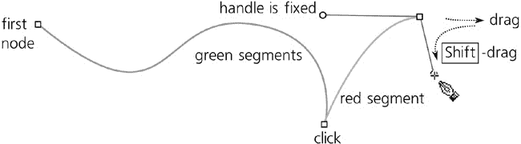

图 14-4. 使用笔工具创建尖点节点

你也可以在拖动手柄时按来将其吸附到 15 度的增量（比较**6.3 选择器：旋转和倾斜**；你可以在**Inkscape 首选项**中选择另一个吸附值）。在创建节点时在鼠标之间移动并按，类似地，可以将方向吸附到最后一个创建的节点和鼠标点之间；这是一种创建严格水平或垂直线的简单方法：


图 14-5. 笔：使用吸附

## 14.1.2 返回

你可以在路径创建过程中随时回退；要取消最后添加的绿色段，请按。你可以重复按来移除多个段；移除最后一个剩余的节点将取消整个路径。

并非总是容易在一次尝试中就精确地点击你想节点出现的位置。Inkscape 允许你在不最终确定路径的情况下移动最后一个创建的节点（即，绿色段的末端）；只需使用与其他工具相同的方便修饰符使用箭头键：来移动，来移动（**6.5.1 移动**）。

## 14.1.3 继续路径

使用笔工具，任何选定的路径都会显示其端节点，如果有的话（即，是开放的），称为*锚点*。（这适用于你刚刚使用此工具创建的任何路径——在最终确定后，它仍然被选中。）这些锚点允许你继续向选定的路径添加（通过在锚点处放置第一个节点）或关闭它（通过从一个锚点到另一个锚点绘制）。

您还可以向选定的路径添加新的子路径（**12.1.1 子路径**）。为此，只需在点击以创建第一个节点时按住  *同时* 点击。之后，像往常一样创建并完成路径；您的路径将作为子路径添加到选定的路径中。所有打开的子路径都显示锚点，这意味着您可以关闭它们或将它们连接在一起：


图 14-6. 钢笔：添加或关闭子路径

## 14.1.4 模式

现在，让我们看看钢笔工具的控制栏（在画布上方）。注意四个**模式**按钮：


图 14-7. 钢笔工具模式

这些按钮控制 Inkscape 创建路径的类型。到目前为止，我们一直在第一种（默认）模式下工作，该模式使用直线和贝塞尔曲线创建常规路径。

第二种模式创建斯皮罗路径（**13.1.7 斯皮罗样条**），即应用了**斯皮罗样条**路径效果的路径。在斯皮罗路径中，节点的手柄的确切位置并不重要；唯一重要的是节点是否平滑（具有共线手柄）或尖点（没有手柄或具有非共线手柄）。因此，在这种模式下，您拖动创建的节点手柄的位置或距离都没有关系；唯一重要的是您是否拖动它（这创建了一个平滑的斯皮罗节点）或只是点击（这创建了一个尖点的斯皮罗节点）。

### 注意

*不幸的是，在斯皮罗模式下，您在创建路径时看到的绿色和红色段并不对应最终路径的外观——它们显示给您的是没有应用**斯皮罗样条**效果的路径。*

其他两种模式是常规模式的限制。直线模式禁用创建平滑节点（即，确保即使是拖动也像点击一样工作，创建一个没有手柄的尖点节点）。准直模式进一步限制段为水平和垂直，确保每个段与前一个段垂直。

此外，在直线和准直模式下，-点击创建一个单个*点*（一个小圆圈），而不是开始一个路径。这对于创建几何和技术绘图很方便。-点击点的尺寸可以在钢笔工具的首选项中设置为笔触宽度的单位（在工具箱中双击工具图标以访问**Inkscape 首选项**对话框中的选项卡）。如果您使用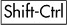，点的大小是两倍。

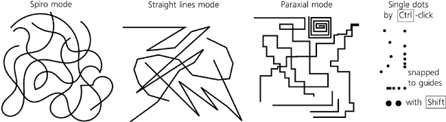

图 14-8. 钢笔：螺旋线、直线、抛物线线和单点

## 14.1.5 笔画形状

钢笔工具控制栏上的**形状**下拉菜单允许您为创建的路径选择**笔画形状**。

SVG 本身不支持形状笔画；在 SVG 中，笔画始终是恒定宽度的条带（第九章**）。选择任何其他**形状**选项时，工具将应用**路径沿路径**效果到您的路径（**13.1.3 路径沿路径和弯曲**），以便通过路径的填充来模仿形状笔画。因此，当使用这些选项时，路径内部不能有任何其他填充，并且工具会自动将笔画样式应用于填充，并丢弃原始笔画样式，以便结果看起来符合预期（参见图 14-9）。


图 14-9. 使用钢笔工具的形状笔画

可用的笔画形状包括**椭圆**、两个三角形（**Triangle in**表示路径的宽度从开始到结束*减小*，**Triangle out**表示路径的宽度从开始到结束*增加*），以及如果您选择**从剪贴板**选项，任何您放置在剪贴板上的其他形状。

要调整形状笔画的宽度，请打开**路径效果编辑器**对话框（**13.1.2 路径效果编辑器对话框**）并使用**路径沿路径**效果的**宽度**控件。此参数可以设置为形状自然宽度的倍数（对于所有三种标准形状，这是 10 像素）或路径长度的倍数。

在节点工具中，通常可编辑的是原始骨架路径，而不是应用到的形状，但您也可以使用**编辑路径效果参数**按钮来编辑应用的形状（图 13-5）。

路径形状与钢笔工具的任何模式都兼容，包括斯皮罗模式。例如，您可以使用椭圆形状绘制斯皮罗路径，然后切换到节点工具并调整斯皮罗节点——整个椭圆形状将弯曲和卷曲，就像斯皮罗一样。在这个路径的**路径效果编辑器**对话框中，您将找到堆叠在一起的**斯皮罗样条**和**沿路径图案**效果。

要将应用了形状和/或**斯皮罗样条**的路径转换为常规路径，请使用**对象到路径**命令（）。

## 14.1.6 样式

与所有创建对象的工具一样，钢笔和画笔工具可以使用最后设置的样式或它们自己的工具样式（**11.1.2 新形状的样式**）。默认情况下，它们使用自己的样式，最初设置为无填充，1 像素黑色描边。这是因为大多数情况下，最后设置的样式有填充但没有描边，而使用这些工具绘制时，您可能期望结果有描边但不一定有填充。有关如何更改工具样式的信息，请参阅图 11-2。通常，将在控制栏的右端显示将用于创建下一个路径的样式（图 11-1）。

### 注意

*当使用**形状**而非**无**时，Inkscape 会执行您预期的操作：将工具样式的描边属性应用到填充上。因此，如果**无**创建一个没有填充的黑色描边，**三角形内**将创建一个有黑色填充但没有描边的形状描边（图 14-9)。然而，如果没有设置描边，它将使用填充属性，如果有，用于形状路径。

# 14.2 画笔工具

画笔工具（ 或 ）与钢笔工具非常相似，并且共享大多数相同的控件。它的主要区别在于，使用画笔时，您不必担心节点或手柄；您只需绘制一条自由手绘线条，Inkscape 就会使用路径来近似它。

画笔工具控制栏中最重要的设置是**平滑度**，它指定了从 1 到 100 的范围，以确定这种近似有多精确。平滑度值较小时，Inkscape 会尝试精确追踪鼠标的每一个微小移动；生成的路径将相当不均匀，包含许多节点。相反，较大的平滑度会产生具有少量节点的通用、近似路径——在 100 的最大值时，大多数鼠标拖动将在两个节点之间创建仅一个贝塞尔段：


图 14-10. 不同平滑级别的铅笔线条

### 注意

***平滑**控件仅影响铅笔工具中新建的路径。如果你想要改变现有路径的均匀性和节点数量，你只能通过使用**路径** ▸ **简化**命令（**12.3 简化**）来使路径更加宽松。*

与钢笔工具类似，在铅笔工具中，任何选定的路径都会在其所有子路径的开放端节点上显示锚点。你可以通过从一个锚点到另一个锚点绘制来继续、闭合和连接子路径，并且你可以通过按住开始绘制来向选定的形状添加新的子路径。

类似于钢笔工具，铅笔工具也有一个**模式**开关，但它只有两个选项：常规路径和斯皮罗路径。**形状**菜单与钢笔工具的菜单完全类似，允许你绘制手绘形状的线条。以下是一些使用斯皮罗和/或线条形状创建的铅笔路径示例：


图 14-11. 使用铅笔工具的形状线条

使用绘图可以启用铅笔工具的“草图模式”。在这个模式下，当你按住进行拖动时，任何数量的拖动都会被*平均*；实际的路径只有在释放后才会创建。这允许你在绘图时“感觉”路径，并提炼出最佳的轮廓，而不会留下大量试探性的线条。在铅笔工具的**Inkscape 首选项**页面，**平均所有草图**设置（默认开启）会以相等的权重平均你在按住时制作的*所有*草图；如果你将其关闭，它将在最新的一笔和之前的平均值之间进行平均，从而给予最新的一笔更多的权重。

# 14.3 书法笔工具

“Inkscape”这个名字非常贴切：程序中最复杂的绘图工具，即书法笔，确实感觉非常像墨水。这个工具，正如其名所示，最初是为了书法——即精美的手工书写。但随着时间的推移，它变得足够灵活，可以用于一般的艺术草图、绘图和上墨。

切换到书法笔（ 或 ）并在画布上拖动。您会看到在绘制时创建的填充路径，其宽度和形状取决于笔触的角度、拖动速度和笔的压力（如果您使用的是平板电脑）。结果是类似于铅笔工具的笔触形状（图 14-11)，但书法笔触看起来更加自然。此工具的结果始终是普通、填充的路径，没有任何路径效果。

## 14.3.1 宽度

让我们看看我们如何改变书法笔的输出。工具控制栏上最重要的设置是**宽度**，指定笔触的宽度（或者更准确地说，是其*最大*宽度；许多其他因素也可能影响宽度，但它永远不会超过您在此设置的值）。此宽度值可以在使用书法笔工具时通过  和  键随时进行调整。

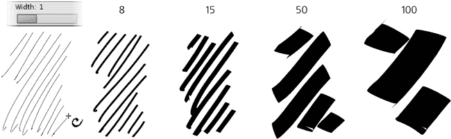

图 14-12. 宽度变化（压力感应关闭）

默认情况下，宽度是以相对单位从 1 到 100 测量的。这意味着这个宽度值是相对于您的文档窗口的大小，而不是文档中的任何对象或测量。换句话说，如果您缩小视图，您的笔触在绝对单位上会更宽，但您看起来会完全相同。值 1 总是给出细线，值 100 总是给出大约 2 厘米宽的笔触，这是在您的屏幕上测量的。

这使得您无论当前缩放级别如何，都能始终感受到工具的相同感觉，并提供了直观的工作流程：首先，在缩小视图时，勾勒出大致轮廓；然后，放大视图以添加越来越精细的修补——所有这些都不需要来回调整**宽度**。如果您不喜欢这种方法，请转到工具的**Inkscape 首选项**（与任何工具一样，您可以通过在工具栏上双击工具图标来访问它）并勾选**绝对单位中的宽度**复选框；现在，**宽度**控制将设置笔触的绝对宽度，以`px`为单位。

### 14.3.1.1 压力感应

如果您使用的是压力感应平板作为输入设备，Inkscape 允许您使用压力信息来改变笔触的宽度——轻轻按下以获得细线，用力按下以获得更宽的画笔：

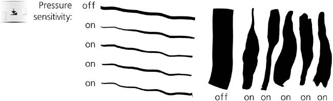

图 14-13. 带有或没有压力感应的绘图在同一宽度下

要启用压力感应，请点击**宽度**控制右侧的切换按钮。没有压力感应时，工具会像应用最大压力一样绘制。

### 注意

*在使用压力感应之前，您可能需要将您的平板电脑配置为输入设备。通常，您只需从**文件**菜单中选择**输入设备**，然后为每个可用的**设备**选择**屏幕**模式。此对话框中的其余控件可以保留在默认状态。*

### 14.3.1.2 跟踪背景

另一个可能影响书法笔触宽度（如果您启用了此功能）的因素是您绘制在其上的背景对象的颜色深度。也就是说，当您在白色上绘制时，您的画笔最细；当您在黑色上绘制时，您的画笔最宽。这在您使用*引导跟踪*（**14.3.7 跟踪引导路径**）在背景绘制或位图中创建交叉线并希望使用宽度平滑变化的笔触达到阴影效果时最有用：


图 14-14. 通过宽度跟踪背景

要启用跟踪背景，请点击**宽度**控制右侧的第二个切换按钮。此设置可以与压力感应结合使用，尽管在跟踪时通常更合理地关闭压力感应。

### 14.3.1.3 通过速度变细

最后，您的绘图速度——您拖动鼠标或笔的速度——也可能影响笔触的宽度。这由**变细**值控制，该值从-100 到 100（图 14-15")). 正值会使您在加快速度时笔触变宽；负值会使笔触变细。如果您将此参数设置为 0，则禁用通过速度变细。

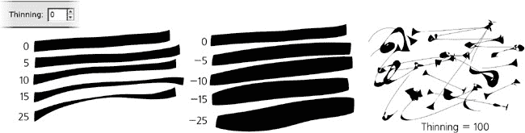

图 14-15. 通过速度变细（压力感应已关闭）

由于拖动过程中的笔触通常速度较快，因此结果是两端宽度固定，中间“呼吸”的形状，此参数的正值会使中间变细。压力感应通常具有相反的效果，因为笔触中间的压力通常高于两端。这两个因素的相互作用使得笔触感觉非常自然。

在实际应用中，当您快速移动真实的毛笔或铅笔时，通常会留下较细的痕迹；此参数的默认值设置为 10 以模拟此行为。然而，您也可以将其推至-100 或 100，这将产生非常奇特的“爆炸”或“收缩”画笔效果，这与现实世界中的任何事物都大不相同！

## 14.3.2 角度

**角度**和**固定**参数按照其名称对待书法笔——也就是说，作为一个可以以不同角度持握的平头书法笔。**角度**设置笔尖的角度为水平：0 表示笔尖水平，+90 表示笔尖逆时针旋转到垂直，-90 表示笔尖顺时针旋转。这个值也可以通过按（增加）或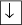（减少）箭头键来改变。


图 14-16. 笔画的倾斜角度和固定

使用非零固定值设置角度对于产生书法字母最有用。对于大多数书法风格，角度应该在 30 到 60 度之间。

### 注意

*如果你的平板支持笔尖角度检测，你可以通过额外的真实感，将工具的**角度**参数绑定到笔的实际物理角度。为此，只需按**角度**滑块旁边的切换按钮即可。*

**固定**（范围在 0 到 100 之间）控制了这个角度被强制执行的严格程度。当固定值达到最大时，笔尖总是以设定的角度旋转，无论你以什么方向绘制，因此平行于笔尖角度的绘制总是给出细线笔触，而垂直于它的绘制则产生最大宽度。当固定值为零时，笔的方向始终垂直于运动方向，这使得角度变得无关紧要，并给你类似圆珠笔或圆刷的效果。固定值的中间值会产生受角度和运动方向影响的笔触，比例各不相同。

## 14.3.3 笔帽

默认情况下，书法笔触在两端被截断。这对于书法作品来说是合适的，但在其他时候你可能想要更圆润的外观。将**笔帽**参数增加到大约 0.5 以在两端产生轻微的膨胀，增加到 1.3 以获得大约圆形的笔帽，或者增加到 5 以获得长而突出的笔帽：


图 14-17. 书法笔触的笔帽

## 14.3.4 颤动、摆动和质量

我们到目前为止所看到的书法笔工具很有用，即使可能有点无聊。现在该添加一些乐趣了！最后三个参数——**颤动**、**摆动**和**质量**（所有参数的范围都是 0 到 100）——以一些非常规的方式修改了工具的行为。

即使使用具有压力感应的绘图板，书法笔的笔触也常常看起来过于平滑和计算机化。增加颤动会给笔触添加小规模的干扰，使其看起来更自然——粗糙、颤抖，甚至斑驳。颤动的频率是时间性的，而不是空间性的，这意味着如果你画得更快，粗糙度会沿着笔触拉伸，因此看起来更平滑。

**Wiggle** 参数也会干扰笔触，但范围更大，使其在波浪形或环状图案中摇摆，有时会偏离光标实际位置很远，尤其是在尖锐转弯处：


图 14-18. 颤动（左）和摇摆（右）的效果

**Mass** 使笔触落后于光标，就像被惯性拖慢一样，导致尖锐角落的平滑和笔快速移动的缩短。颤动和摇摆的默认设置是 0，但质量有一个小的非零默认值（0.02），这样书法笔感觉轻盈且响应迅速，但并非完全无重量。

## 14.3.5 书法预设

书法笔是 Inkscape 中最设置丰富的工具——有时，它可能会让人感到不知所措。即使你记住了所有的控制方式，每次从平滑的记号笔切换到摇摆的刷子时，调整几个滑块和按钮也是耗时的工作。预设是解决这个问题的一个方法：通过在工具栏左侧的下拉菜单中选择一个预设，你可以一次性设置多个参数。程序中包含几个预设：

+   **Dip pen** 是一种模仿软书法笔的笔：平滑（无颤动或摇摆），压力感应，角度固定在 30 度，无帽圆滑。

+   **Marker** 是一种普通、恒定宽度的毡尖笔：平滑，无压力感应，无速度细纹，无角度固定，圆帽。

+   **Brush** 与 **Marker** 相比，增加了压力感应、负细纹（即，当你移动得更快时，笔触会更宽）和一些摇摆。

+   **Wiggly**，正如其名所示，具有高摇摆和一定程度的颤动，以产生特有的“脏污”外观。

+   **Splotchy** 是一种非常宽的刷子，具有高颤动和高负细纹，可以产生一系列由细条纹连接的“斑驳”效果（参见图 14-15，右）。

+   **Tracing** 与 **Marker** 类似，但开启了背景追踪功能（**14.3.1.2 跟踪背景**）。

### 注意

*不幸的是，截至版本 0.47，无法通过 GUI 添加更多预设到列表中——但如果你真的需要，你可以通过编辑你的* preferences.xml *文件**（3.1.1 Inkscape 预设**）来添加它们。在具有* `id="preset"`*的* `group`*元素中，添加如下内容：*

```
<group name="My style" width="50" mass="0" wiggle="25" angle="30"
  thinning="-40" tremor="10" flatness="50" cap_rounding="1"
  tracebackground="1" usepressure="1"/>
```

## 14.3.6 添加和减去

如果在开始绘制之前选择了单一路径，并且在释放鼠标按钮或抬起笔时按下了 ，您创建的新对象将自动通过**联合**路径操作**（12.2 布尔运算**）被**添加**到所选路径中，形成一个新单一路径。

类似地，如果您按下 ，新对象将通过**差集**操作从所选路径中**减去**。（如果想要使用此功能作为单独的工具而不需要按住 ，橡皮擦工具的裁剪模式工作方式相同。）这使得快速“修补”或“雕刻”任何路径变得容易。

## 14.3.7 跟踪引导路径

按下  使用书法笔绘制会激活**引导跟踪**功能，这会使您的笔在离所选“引导”路径边缘的某个恒定距离处“滑动”，并让您沿着该引导路径绘制。

这个功能的灵感来源于传统的线条雕刻技术，这些技术在很长时间内是复制黑白印刷中逼真图像的唯一实用方法；大约一个世纪前，线条雕刻几乎完全被自动半色调网屏所取代。*交叉线*——用许多平行的直线或各种曲线的线条填充空间，以表示渐变的阴影——是一个非常费力的过程。Inkscape 的引导跟踪，以及背景追踪**（14.3.1.2 跟踪背景**）和调整工具**（12.6 路径调整**），从这种古老艺术中消除了痛苦和无聊。虽然您仍然需要敏锐的眼睛和勤奋，但使用 Inkscape 至少可以在合理的时间内创建看起来真实的线条雕刻，完全使用矢量图形。

一种近似填充网格的方法是通过使用路径插值（混合，**17.2 混合模式**），但这种方法不够灵活，并且在没有“人文触感”的情况下会产生过于明显的计算机生成输出。另一方面，手动绘制填充线既繁琐又几乎不可能均匀完成。然而，引导跟踪功能允许你快速且均匀地填充，同时让你在过程中有足够的手动控制。

下面是操作方法。首先，选择你将要跟踪的*引导路径*。它可能是一条其他的书法笔触，任何路径或形状，甚至是一个文本对象的字母。然后切换到书法笔工具（如果你还没有切换的话），在开始绘制之前，按下。你将看到一个以鼠标指针为中心、接触所选引导路径最近点的灰色*轨迹圆*。（如果你没有选择引导路径，状态栏消息会告诉你去选择它。）

现在将你的鼠标移近引导路径，使得轨迹圆的半径等于你想要的填充图案的间距，并开始沿着引导路径绘制。一旦开始绘制，圆的半径就会锁定，圆变成绿色；现在圆沿着引导路径滑动——实际的笔触是由跟踪圆的中心绘制的，*而不是*你的鼠标点。因此，你得到的是一条平滑的笔触，始终与引导路径保持相同的距离。


图 14-19. 跟踪引导路径

当笔触准备好后，释放你的鼠标按钮（或抬起你的平板电脑笔）。然而，不要放开，因为只要按下它，工具就会记住你开始绘制时设置的填充间距。由于你刚刚创建了一个新的笔触，所以这个笔触对象被选中，而不是之前选中的对象——这意味着它现在变成了新的引导路径。接下来，沿着第一个笔触绘制第二个笔触，然后沿着第二个笔触绘制第三个，依此类推。最终，你可以填充任何想要的区域，得到漂亮的均匀填充，如图图 14-20 所示。

与引导路径的附着并不是绝对的。如果你将鼠标指针从引导路径上移开足够远，你将能够将其撕掉（轨道圆圈将从绿色变为红色）并移动开（但并不完全自由：笔将具有来自引导追踪的重惯性）。这是故意的；例如，这样你可以继续绘制超过引导路径末端的笔触，以便覆盖比初始引导路径允许的更宽的区域。由于惯性，这种撕掉通常相当平滑，但无法完全抑制抖动。如果你仍然对抖动和意外的撕掉感到烦恼，请尝试增加**质量**参数。

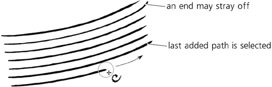

图 14-20. 创建均匀的阴影线

### 注意

*由于追踪功能是为平滑的雕刻图案设计的，因此它不适用于带有过于尖锐的转弯或过于不均匀的引导轨道（例如，带有高震颤的书法笔触）。*

跟踪引导还可以通过根据你的绘图行为逐渐改变跟踪距离来提供一些反馈。如果你一直在尝试比当前跟踪距离更近或更远地绘制引导，距离会稍微减小或增加，这样你将得到稍微更近或更宽的间距的阴影线。此外，请注意，由于跟踪遵循笔触的*边缘*，宽度变化的笔触（如追踪背景的笔触，见下文）将导致随着你继续进行，阴影线图案逐渐弯曲。

如果你意外地取消选择了你最后创建的笔触（例如，通过执行一个糟糕的笔触的撤销操作），你可以通过按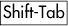（**5.11 使用键盘快捷键选择**）而不离开书法笔工具来重新选择它。引导追踪可以与添加或减去（即，你可以按将新笔触添加到选定的引导路径或按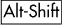从中减去）相结合。

将引导追踪与调整工具结合使用在书法笔工具中是很自然的。阴影线很少能完美呈现；松散的偏离末端、错误的倾斜或曲率以及不正确的笔触宽度（即，太深或太浅的阴影线）是最常见的问题。调整工具可以修复所有这些问题，这样你就不必重新绘制阴影线。使用缩小/放大模式清除松散的末端，就像使用橡皮擦一样，并调整笔触宽度，使用推拉模式弯曲或塑造阴影线。有了这些强大的工具，通过追踪位图原始图像，可以创建复杂且逼真的阴影线：

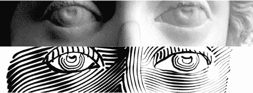

图 14-21. 使用位图（顶部），用书法笔工具在其上绘制阴影，然后用调整工具（底部）调整生成的阴影。

# 14.4 油漆桶工具

“油漆桶”或“洪水填充”工具的概念可能你从位图编辑器中很熟悉。在 Inkscape 中，油漆桶工具的工作方式与你预期的一样：在任意一个四周被限定区域点击，它就会用颜色填充该区域。然而，作为一个矢量工具，Inkscape 的油漆桶只是创建一个新的**路径**，该路径“填充”了你点击的区域：


图 14-22. 油漆桶填充限定区域

重要的是要记住，油漆桶工具是**感知的**，而不是**几何的**。也就是说，当寻找你点击的点周围的边界时，它会将任何**可见**的颜色不均匀性识别为边界。因此，填充会在位图对象中的渐变、模糊和颜色边界处停止，但它会忽略任何完全（或几乎）透明或因其他原因与背景不突出的路径或其他对象。

例如，你可以扫描铅笔草图，将位图导入 Inkscape，并通过用颜色填充所有单元格来快速“追踪”它。这是一种非常方便和交互式的方式，可以将你的纸张绘图数字化，并且在许多情况下使传统的位图追踪（**追踪位图**对话框，**18.8.2 追踪位图对话框**）变得不再必要。

### 注意

*内部，该工具通过在可见画布的屏幕分辨率版本上执行基于位图的洪水填充，然后将生成的填充追踪到矢量路径中来实现。用于执行追踪的渲染分辨率由你当前的缩放定义；你缩放得越近，洪水填充的分辨率就越高。所以，如果油漆桶填充的结果不够精确，有圆角，或者没有进入它应该进入的小角落和缝隙——只需撤销，放大更近（但要确保整个要填充的区域仍然可见），然后从相同的位置重新填充。相反，如果填充从一个小缝隙中泄漏出来，缩小以使缝隙不那么明显，然后再次填充（或使用自动缝隙闭合参数，**14.4.5 关闭缝隙**）。*

## 14.4.1 填充技术

填充有界区域与切换到油漆桶工具（或）并在区域内点击一样简单。如果您使用点击，结果路径将与所选路径合并（**12.2 布尔运算**)；这样，如果您的第一次尝试没有填充所有所需区域，只需-点击剩余的角落来完成它，如图图 14-23 所示。

如果您点击并拖动，您将填充您在拖动过程中经过的所有点（您将通过红色线可视化您的路径）。从每个点开始，填充会扩散到颜色与该点相似的所有相邻点——换句话说，就像在每个拖动路径的点处使用此工具点击并将结果组合起来。这允许您轻松填充由渐变或模糊占据的区域——只需从您想要填充的区域中最暗的点拖动到最亮的点：


图 14-23. 向现有路径添加油漆桶填充

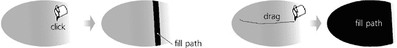

图 14-24. 点击一次，只填充渐变的一小部分；拖动覆盖区域以填充整个渐变。

-拖动通过所有其他区域来填充一系列颜色相似但分离的区域（例如，卡通中的多个单元格）。

## 14.4.2 通过通道填充

当寻找要停止的颜色边界时，默认情况下，油漆桶工具会查看画布上看到的颜色。然而，您也可以限制其视野到特定的颜色通道。**填充方式**下拉菜单，除了默认的**可见颜色**外，允许您选择 RGB 通道中的任意一个（**红色**、**绿色**、**蓝色**），HSL 通道中的任意一个（**色调**、**饱和度**、**亮度**），或者**Alpha**通道（不透明度）。

例如，如果您选择**红色**通道，即使是最尖锐的绿色/蓝色颜色边界也不会阻止填充。选择**Alpha**通道会使工具忽略任何颜色，只查看不透明度变化的地方；例如，如果您有一个复杂的多色但完全不透明的对象在透明背景上，在**Alpha**模式下单击此对象将填充到整个对象的轮廓。

## 14.4.3 阈值

**阈值**参数，其范围从 0 到 100，控制了点颜色与初始点击点相比必须有多大的不同，才能停止填充的传播。零容忍度意味着只有严格相同颜色的区域将被填充；容忍度越大，填充区域越大，填充向相邻颜色区域泄漏的可能性也越大。默认值为 10。

## 14.4.4 增长和缩小

使用**增长/缩小量**参数，您可以控制应用于创建的填充路径的嵌入或外扩量（12.4 外扩）。它的工作方式与**外扩**和**内缩**路径命令非常相似，只是在每次填充后自动执行。

正的**增长/缩小**值会使填充路径大于它所代表的填充位图区域；这通常有助于消除填充与其边界之间的反走样间隙。负值会使路径更小，确保填充与边界之间有恒定的宽度间隙。

## 14.4.5 关闭间隙

使用**关闭间隙**参数，您可以使得油漆桶工具忽略区域边界中通常会导致填充溢出到所需区域的所有间隙。有四种自动关闭间隙的级别：

+   **None**

+   **小**（关闭大小达 2 个屏幕像素的间隙）

+   **中**（关闭大小达 4 个屏幕像素的间隙）

+   **大**（关闭大小达 6 个屏幕像素的间隙）

### 注意

*将此参数设置为**None**以外的任何值可能会在填充大面积时明显减慢 Inkscape 的速度。*

## 14.4.6 样式

与所有创建对象的工具一样，油漆桶可以使用它创建的对象的最后一个设置样式（这是默认值），或者它可以使用自己的固定样式。您可以在工具的**Inkscape 首选项**（双击工具图标以访问）之间切换这些模式。与其他工具一样，控制栏最右侧的样式样本显示将用于您创建的下一个填充对象的样式。要更改最后设置的颜色而不影响任何对象，只需取消选择（）并在调色板上单击颜色。

点击  将画桶工具转换为“单次点击样式”工具：不再是填充一个区域， 点击一个对象只需将该对象的填充颜色更改为工具的当前填充颜色，而  点击则将描边颜色更改为工具的当前描边颜色。如果没有设置描边，则  点击的行为与  点击相同。
