# 第十五章。文本

在矢量编辑器中，你可以预料到，你添加到 Inkscape 绘图中的任何文本，无论你对其应用了任何样式、过滤器或转换，都可以在任何时候完全以文本形式进行编辑。创建和编辑文本对象是文本工具的领域，你可以输入或删除单词，手动或自动重新包装文本列，对文本的部分应用样式，调整字距和间距，等等。

当然，Inkscape 与专门为文本设计的程序（如文本编辑器或文字处理器）相比，竞争力几乎可以忽略不计。它处理大量文本不太方便；由于它更注重视觉导向，Inkscape 没有诸如自动标题、脚注等结构化格式化工具——所有这些都需要通过手动样式和格式来模拟。

# 15.1 基本编辑

要开始编辑现有的文本对象，选择它并切换到文本工具（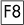）；这将文本编辑光标（一个闪烁的垂直线）放置在对象的末尾。你现在可以点击文本内的任何位置来定位你想要编辑的地方，或者使用箭头键移动光标。或者，在选择工具中，你可以直接双击一个文本对象——这将切换工具，选择对象，并将光标放置在点击的位置，所有这些同时完成。

### 注意

*只有在你的光标在字符体上时，才能点击或双击文本对象。例如，如果你的文本字符间距较宽，你需要精确地点击一个字符，而不是在字符之间的空白空间中（在空白空间中点击将创建一个新的文本对象）。注意鼠标光标会变成一个* I *形状，并且文本周围会出现一个蓝色框架——这些是表明你在一个可点击的文本对象上的指示。*

图 15-1. 通过点击放置文本编辑光标

在 Inkscape 中输入和编辑文本的方式与任何文字处理应用程序相同。按开始新行，并使用或删除字符，包括换行符。可以使用箭头键移动文本光标（使用按单词跳转），使用和键（使用移动到文本对象的开始或结束），以及和键。如果需要，画布会自动滚动，以确保文本光标始终可见。

### 注意

如果出于某种原因，在画布上编辑文本不方便，你可以打开**文本和字体**对话框（**15.4.2 字体和变体**），然后在**文本**选项卡中，在一个标准文本区域中编辑所选的文本对象。不幸的是，点击**应用**会丢失你可能已经应用到文本内跨度上的格式（**15.4.1 非文本样式属性**）；然而，如果你只是打开窗口来阅读文本或将其复制到剪贴板而不做任何更改，这是完全安全的。

## 15.1.1 选择

你可以通过拖动*覆盖*一些字符（就像点击一样，你必须从一个字符体开始，而不是空白空间）或使用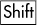-箭头键移动文本编辑光标来在文本对象内选择。这种*文本选择*，通过一个绿色蓝色的矩形覆盖来可视化，不要与程序范围内的*对象选择*（第五章，而不是选择所有对象，会选择此文本对象内的所有文本。

图 15-2. 使用文本工具进行文本选择

使用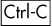（或使用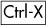剪切）复制文本选择，并在光标位置使用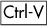粘贴，这是一种移动文本片段的简单方法——无论是同一文本对象内、同一文档中的文本对象之间、跨文档，甚至是 Inkscape 与其他应用程序之间。例如，你可以在文字处理程序中复制一段文本并将其插入到 Inkscape 的文本对象中。复制/粘贴不会传输格式，只有文本内容。

# 15.2 文本对象类型

你如何创建一个新的文本对象？这取决于你想要创建哪种类型的文本，我们将在接下来的章节中讨论。

## 15.2.1 正常文本

要创建一个常规文本对象，切换到文本工具()，点击画布（不是现有文本对象！）以放置文本光标，并开始输入。（如果你拖动而不是点击，你将创建一个流动文本对象，它将在几个重要方面有所不同，我们将在稍后看到。）

一旦你输入了至少一个字符，新的文本对象就会被添加到文档中。在那个时刻，你可以切换到任何其他工具来处理新创建的对象（只要它保持选中状态），就像处理任何其他对象一样——例如，使用选择工具变换它，通过点击调色板颜色来绘制它（这可以在任何工具中完成），或者使用渐变工具在其上绘制渐变。

图 15-3. 文本和选择工具中文本对象的状态栏描述

在常规文本中，没有自动换行；你需要按  键进入下一行。如果你不这样做，而只是继续在同一行中输入，它可以达到任何长度。

### SVG

*文本对象是 SVG 的标准* `text` *元素类型。多行对象中的每一行都是一个带有* `sodipodi:role="line"` *属性和显式* `x` *和* `y` *属性的* `span` *元素，Inkscape 会根据根文本对象的坐标和行间距自动计算这些属性（**15.3.4 字符间距和行间距**）。

## 15.2.2 流式文本

流式文本与常规文本的不同之处在于它有自己的固有宽度（或更普遍地，*框架*），并且它会自动*换行*以填充这个宽度（或框架）。换句话说，在流式文本中输入时，你不需要按  键进入下一行（但你可以按它来开始新段落）。

### 15.2.2.1 内部框架

创建流式文本最简单的方法是使用文本工具在画布上*拖动*，而不是点击。这会创建一个矩形框架，就像使用矩形工具拖动创建矩形一样。释放鼠标后，你可以输入或粘贴文本，文本会在达到框架边缘时自动换行。你还可以拖动右下角的把手来调整框架大小，并看到文本会自动重新排版以适应新的宽度。

图 15-4. 带有内部框架的流式文本

文本在单词边界处换行；不支持自动连字符。如果文本多于框架能容纳的量，超出部分的文本（从单词边界开始）将被隐藏（但它仍然存在；如果你在开头删除一些文本，末尾会移动进来并变得可见）。这种具有内部框架的流式文本被称为具有*内部框架*，因为它的矩形框架是对象本身的一部分，而不是一个单独的对象；例如，当你变换文本时，文本及其框架作为一个整体被变换。

### 注意

*流式文本对象的边界框（**4.2 边界框**)仅覆盖文本本身的可见字符，而不管其框架的大小如何。*

### 15.2.2.2 外部框架

流式文本的另一种变体是，它不是使用自己的内部矩形框架，而是可以链接到任何外部路径来塑造其文本。要创建此类对象，选择两个对象——任何文本（常规或流式）和路径——然后选择**文本** ▸ **流进框架**：

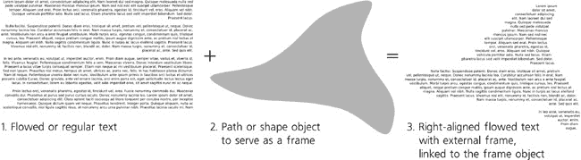

图 15-5. 具有外部框架的流式文本

此命令不会移除或隐藏框架对象；文本和框架仍然是独立的对象，文本被称为*链接*到其框架，就像克隆体与其原始对象一样（第十六章). 编辑框架对象的形状会迫使链接的流式文本重新排版到更改后的形状，但调整框架的样式（例如，通过使其完全透明来隐藏）不会影响文本。

您可以单独移动或变换链接的流式文本，但移动或变换框架也会影响文本（比较**根据变换移动**克隆补偿模式，**16.2 变换克隆体**）。选择链接的流式文本并按  将选择其框架，就像选择克隆体及其原始对象一样（**16.4 链接克隆体**）。

### 15.2.2.3 SVG 兼容性

流式文本最大的问题是它不是一个标准的 SVG 功能，而是 Inkscape 的扩展，由于历史原因，其实现方式与其他 SVG 查看器不兼容。因此，如果您的文件可能在除 Inkscape 以外的程序中查看，则文件中不得包含任何流式文本。

如何去除流式文本？一种方法是在**文本**菜单中使用**取消流式化**命令，该命令删除流式文本的内部框架（或与其外部框架断开连接）并将其转换为单行常规文本，然后您可以手动重新包装。

通常，使用**转换为文本**命令（**文本** ▸ **转换为文本**）会更加方便，这个命令还能将流式文本转换为常规文本，但会完全保留其多行外观，仅移除自动换行功能。当然，您也可以使用**路径** ▸ **对象转换为路径**命令（**15.7 将文本转换为路径**)来获取一组路径；您将无法再编辑文本，但它会保留外观。

图 15-6. 去除流式文本的三种方法

## 15.2.3 路径上的文本

Inkscape 中的单行文本对象可以链接到路径，将路径用作文本基线的引导，而不是作为框架。只需选择文本和路径，然后选择**文本** ▸ **放置于路径**：

图 15-7. 将文本放置在路径上

此连接是动态的：文本和路径都保持完全可编辑，修改路径会相应地弯曲文本。如果文本比路径长，其末端会被隐藏（但它仍然存在；如果你在开头删除一些文本，末端会移动并变得可见）。如果路径由多个子路径组成（**12.1.1 子路径**），文本将在字符边界处从一条子路径继续到下一条子路径（但不是单词边界）。

路径是否有描边或填充无关紧要；对文本来说，唯一重要的是其几何形状。路径方向也很重要；如果您想在路径的另一侧放置文本并反向排列，只需在路径上选择**路径** ▸ **反转**：

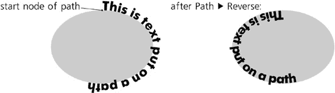

图 15-8. 路径方向影响路径上的文本。

您可以通过使其完全透明或移除其填充和描边来轻松隐藏引导路径。此外，与流文本一样，您可以移动文本对象远离其路径或对其进行变换，而不会断开链接，而变换路径会相应地移动或调整文本。

可以将多个文本对象链接到同一路径。使用**文本** ▸ **从路径移除**将路径上的文本转换为常规线性文本，切断其与路径的链接。

### SVG

*路径上的文本是 SVG 的一个标准特性。在 SVG 中，它有一个* `textPath` *子元素，包含实际文本，并通过* `xlink:href` *属性链接到路径对象（比较**16.1 创建克隆**）。*

# 15.3 文本布局

## 15.3.1 方向

文本工具控制栏上的两个按钮允许您设置文本流的方向——水平（默认）或垂直。此功能主要用于适合垂直方向的文字（如日语），但在必要时也可以用于任何语言的文本对象：

图 15-9. 文本方向

### 注意

*Inkscape 的垂直文本模式在用于书写日语的 tategaki 时存在一些缺陷；例如，连字符没有旋转，标点符号经常位置奇怪。*

## 15.3.2 对齐

每个文本对象都有一定的对齐方式：*左对齐*（默认）、*右对齐*或*居中对齐*，您可以通过文本工具控制栏上的按钮进行选择。例如，当编辑左对齐文本时，按下  将光标水平移动到下一行的*开头*，并且您输入的文本会向右扩展，随着对齐边界的移动而移动光标。相比之下，在右对齐文本中， 将光标移动到上一行的*末尾*下方，并且您输入的文本会向左移动，而光标保持在原位。

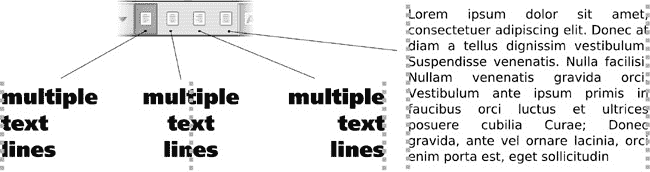

图 15-10. 文本对齐和两端对齐

对于流式文本，还有一个额外的对齐选项：*两端对齐*，它会在每一行中扩展空格，使文本列的两端对齐。

## 15.3.3 字距调整

使 Inkscape 与其他大多数具有文本功能的软件区分开来的是，它可以自由移动每个单独的字符并调整字母之间的间距。不幸的是，大多数此功能都是“隐藏”的，因为它们只能通过键盘快捷键访问。

将光标置于字符之前，然后按下 。光标右侧的其余行将略微向右移动（在当前缩放下为 1 个屏幕像素；按箭头键与  结合使用时，移动距离是  的 10 倍；比较**6.5.1 移动**）。您所做的是调整两个字符之间的*字距间隔*；很容易将任何一对字符的字距调整得更近或更远，以达到文本行中最佳的整体平衡和视觉节奏。空格也可以进行字距调整，以根据需要将*单词*移动得更近或更远。

要可视化您添加的字距调整，只需选择文本（例如，通过 ）。每当手动将两个字母的字距调整得更近时，它们的选取矩形将重叠，您将看到一个较暗的带状区域；相反，字距调整后的字符对将在选取覆盖层之间有一个间隙（图 15-11）。较暗的带状区域和间隙的宽度与您在该点添加的字距调整量完全对应。

通过放大查看，您可以进行更精细的字距调整。然而，不要过分沉迷；始终缩小查看，以了解整个文本行的上下文中您的间隔看起来如何。

水平字距调整对于路径上的文本特别有用。正如您在图 15-7 中可以看到的，字母在凹弯处往往太靠近，而在凸弧上则太远。通过手动字距调整，很容易抵消这种效果，并使字符沿曲线均匀分布。

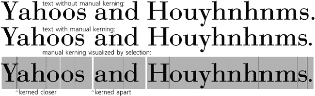

图 15-11. 调整字符串中的字距间隔

### 注意

*许多字体包含内置的字距调整指令；例如，一个字体可能指定当* Y *和* a *相邻时，它们通过字体的 0.03 倍的字距调整在一起。Inkscape 尊重这些自动字体字距调整指令。然而，如果您尝试手动调整这样一对字符的字距，您将禁用自动字距调整。这就是为什么第一个* 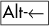 *来调整* Y *和* a *使其更靠近时，这两个字母可能会意外地跳得更远。别担心；只需继续按*  *以实现所需的字距间隔。*

您也可以通过按  和  来垂直调整字符字距。水平和垂直字距调整的组合使您在文本字符串中定位单个字母时拥有绝对自由：

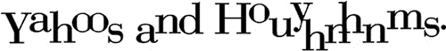

图 15-12. 结合水平和垂直字距调整

如果您通过鼠标拖动或按 -箭头选择一个或多个字符，应用字距调整快捷键将有效地通过在其前后插入两个相反的字距来相对于文本的其余部分移动所选片段：

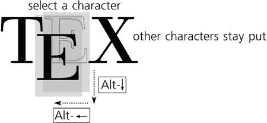

图 15-13. 通过字距调整快捷键移动选择

最后，当光标在该字符之前时，您可以按 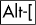 或  来旋转文本对象中的任何字符：

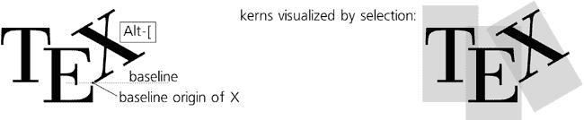

图 15-14. 旋转字符

这种旋转是围绕字符的*基线原点*进行的——它在*基线*（大多数没有延伸字母的底部所在的线，如*i*或*m*）的最左侧点。 (顺便说一下，当您使用选择工具选择每个文本对象的第一个字符时，基线原点在画布上显示为一个小的正方形。)

### 注意

*由于历史原因，在流式文本中，水平和垂直字距调整以及旋转不可用，但仅在常规文本和路径上的文本中可用。*

### SVG

*在 SVG 中，字距信息存储在`text`元素的`dx`（水平）、`dy`（垂直）和`rot`（旋转）属性中。每个属性包含一个由空格分隔的数字列表，每个数字对应于相同位置的字符。例如，`dx="0 0 -2"`表示这段文本中的第三个字符向左移动了 2 像素。*

## 15.3.4 字母间距和行间距

如果您想将文本中的所有字符间距调整得更近或更远，而不仅仅是某些特定的字符对，这种调整称为*字母间距*（在其他软件中，有时也称为*追踪*）；选择文本的全部或部分，然后按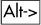来增加字符间距或按来缩小字符间距（这些是 Selector 工具中缩放对象的相同快捷键）。

字母间距的理想量取决于文本的最终观看大小。通常，较小的字体大小需要更多的空间感，而较大的文本应该更紧凑：

图 15-15. 间距更宽（顶部）或更紧（底部）的字母

类似地，您可以通过按和![httpatomoreillycomsourcenostarchimages1736214.png.jpg]来调整常规或流动文本对象之间的间距。这种调整会影响整个文本对象，而不管是否选择了任何文本。在**文本和字体**对话框（）中，也提供了一个可测量的**行间距**控制，它以该字体大小自然行高的百分比来衡量。

图 15-16. 调整行间距

与其他快捷键一致，字母间距和行间距快捷键可以与配合使用，效果增加 10 倍。

# 15.4 文本样式

从大多数观点来看，文本对象与其他任何对象类型没有区别；您不仅可以变换，还可以整体样式（选择填充或描边，调整不透明度，应用滤镜等），而无需进入文本工具（当然，也不会失去编辑文本的能力）。然而，只有文本工具允许您更改特定于文本的样式属性（如字体家族和字体大小），以及将样式应用于对象中的文本的*span*（片段）。

### SVG

*要有一个不同的样式，必须将文本片段包含在一个`span`元素中。当然，您不需要考虑它；对于您创建或删除的任何重叠或嵌套的 span，Inkscape 会自动管理`span`元素。*

您可以更改文本样式的两个地方是文本工具的控制栏（在画布上方）和**文本和字体**对话框。前者更快更方便，而后者提供了更多选项。

## 15.4.1 非文本样式属性

当您在文本工具中选择一个文本范围时，大多数（但不是全部）的样式更改命令和样式报告 UI 元素应用于该文本范围，而不是整个文本对象。例如，您可以通过选择它并点击调色板中的颜色样本，使用**填充和描边**对话框 (**8.1.1 绘画**)，或颜色手势 (**8.5 选定样式指示器：颜色手势**)来轻松更改文本范围的颜色。同样，您可以分配或删除描边或调整范围的透明度。但是，不能将模糊或其他滤镜应用于范围；如果您尝试这样做，整个文本对象将被模糊或过滤。

将渐变或图案填充分配给范围是可能的，尽管这有点棘手。您需要创建一个具有所需渐变或图案的单独对象，复制它 ()，然后使用文本工具选择一个文本范围，并将样式 (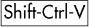)粘贴到它上面。不幸的是，您不能通过在渐变工具中拖动手柄来编辑这样的渐变。

图 15-17. 设置文本范围样式

通常，在设置文本范围样式时，粘贴样式技巧非常实用——它允许您快速在不同对象和文本的各个部分之间转移样式（包括颜色、字体、大小、字母间距等）。要从文本范围复制样式，您甚至不需要选择它；只需将文本编辑光标放置在范围内部任何位置并按 。

## 15.4.2 字体和变体

关于字体，Inkscape 的行为与一个现代图形应用程序的预期相符：它允许您使用在您的操作系统中安装的任何轮廓字体（TrueType、OpenType、Type 1）。

所有字体家族（不是单个字体）的列表，以及每个家族的图形样本，都可以从文本工具的控制栏中打开。您可以通过滚动列表来选择一个家族；如果您知道您需要的字体的名称，您可以点击将光标放置在编辑字段中并开始输入；将出现一个可能的完成下拉列表。

图 15-18. 在文本工具中选择字体

**文本和字体**对话框（）中也提供了相同的字体系列列表，如图 15-19 所示。在这里，你不仅可以看到一个通用的小型样本，还可以看到所选文本对象在所选字体和字体大小下的预览。

许多字体在同一系列中包含变体。在控制栏中，你可以使用两个切换按钮设置所选文本范围的粗体、斜体（倾斜）或粗体斜体变体；预期地，和快捷键与这两个按钮的工作方式相同。在**文本和字体**对话框中，你可以看到该系列中所有可用的变体的完整列表，除了斜体和各种粗细（轻、中、粗、重等）之外，还可能包括宽度轴上的变化（紧缩、拉伸等）。一旦你在对话框中选择了一个需要的样式，点击**应用**以使更改生效。

### 注意

*当你选中一个文本对象时，你选择的字体将应用于该对象；如果你选中该文本中的某个范围，只有那个范围将被格式化。如果没有选择任何内容，在控制栏中选择字体样式将更改文本工具的默认样式，该样式将应用于新创建的文本对象；在**文本和字体**对话框中，点击**设置为默认**按钮，使对话框中选择的样式成为默认样式。*

图 15-19. 文本和字体对话框

## 15.4.3 字体大小

在控制栏和对话框中，字体大小只能以`px`单位设置（**A.6 坐标和单位**）。然而，在许多情况下，你甚至不需要使用这个数字控制；你可以简单地缩放整个文本对象，例如，使用选择工具（**6.2 选择器：缩放**)或键盘快捷键。然后，字体大小控制将考虑这种缩放来显示字体大小；例如，如果你将文本对象的字体大小设置为 12 px，然后将其放大两倍，你将看到其字体大小报告为 24 px。

# 15.5 文本扩展

**扩展** ▸ **文本**中的许多扩展对于处理文本对象很有用。它们包括：

+   一组大小写转换扩展：将文本转换为**大写**、**小写**、**句子大小写**（每个句子的第一个字母大写）、**标题大小写**（每个单词的第一个字母大写）、**翻转大小写**（将小写转换为大写，反之亦然）和**随机大小写**。所有这些扩展仅在所选对象上工作。

+   一个简单的**替换文本**扩展，你可以使用它在一个或多个文本对象中（必须被选中）搜索和替换文本子串。

+   **Lorem ipsum**：一个生成伪拉丁语无意义文本的生成器，传统上用于在设计样图中填充文本。您可以选择段落数量、它们的长度和它们的变体；此扩展会将选定的流动文本对象填充为文本，如果没有文本对象，它将创建一个新的对象以填充整个页面（有关示例输出，请参阅图 15-10）。

# 15.6 拼写检查

Inkscape 的内置拼写检查器可以同时使用多达三个字典。要设置它，请打开**Inkscape 预设**对话框，并选择**拼写检查**选项卡。例如，您可以使用法语作为主要语言，但添加英语和俄语作为第二和第三语言。这样，您可以检查这些语言中的任何一种或这些语言的组合，只有在这三种语言中都缺失的单词才会被标记为拼写错误。如果您只需要一种语言，请将第二和第三选项设置为**无**。

图 15-20. 在 Inkscape 预设中设置 Inkscape 拼写检查器

### 备注

*在 Linux 上，您需要为要检查的语言安装 Aspell 字典；使用您发行版的标准软件安装程序进行此操作。在 Windows 上，Inkscape 预装了多种语言的字典（英语、法语、德语、俄语、西班牙语等）。*

### 备注

*许多语言有多种字典。例如，英语（en）有美国（en_US）、英国（en_GB）、加拿大（en_CA）和澳大利亚（en_AU）的变体；英国变体还根据首选动词后缀（en_GB-ise 或 en_GB-ize）进一步细分为子变体，等等。*

一旦您使用 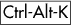（或**文本** ▸ **检查拼写**）调用拼写检查器，它将依次检查文档中所有可见的文本对象（它们不需要被选中），从上到下、从左到右进行检查。找到拼写错误的单词后，它会在单词周围显示一个红色框架，并弹出一个对话框：

图 15-21. 检查文档的拼写

带有拼写错误的对象被选中；如果您正在使用文本工具，则编辑光标放置在拼写错误的单词的开始处。在对话框中，您可以执行以下任何操作：

+   从列出的建议中选择一个（它们来自所有活动字典）并**接受**它；除非您在列表中选择某项，否则此按钮将禁用。

+   **忽略一次**；下次遇到这个单词时，拼写检查器会再次标记它。

+   **忽略**该单词*在此会话的其余部分*；它将在此检查期间忽略该单词的任何其他实例，但下次您运行拼写检查器时，它将再次标记它。

+   **添加**该单词到活动字典中的一个，这样它就永远不会在这个或后续会话中被标记为拼写错误。

此外，由于对话框不会锁定 Inkscape 窗口，您可以使用文本工具简单地编辑单词，就像您通常做的那样。一旦您将其编辑为可接受的格式，拼写检查器将自动关闭红色边框并继续检查文档。

您可以随时通过点击**停止**或简单地关闭**拼写检查**对话框来停止拼写检查。当它停止时，您可以在任何时间点击**开始**来重新启动检查。

## 15.6.1 特殊字符

要输入键盘上没有的字符，您需要知道其 Unicode 编号。*Unicode* 是一个全球标准，涵盖了所有现有的和历史字母，以及大量其他特殊字符；查找字符的 Unicode 编号的最佳位置是 *[`unicode.org`](http://unicode.org)*。

一旦您知道了所需字符的十六进制 Unicode 编号，在编辑文本对象时按 ，输入数字（注意状态栏以获取反馈），然后按 。该字符将被插入到文本光标处。以下是一些常用特殊字符：

| 名称 | 字符 | 十六进制数 |
| --- | --- | --- |
| 破折号 | — | 2014 |
| 连字符 | – | 2013 |
| 右双引号 | ” | 201C |
| 右双引号 | ” | 201D |
| 右单引号 | ‘ | 2018 |
| 右单引号 | ’ | 2019 |
| 左双引号 | « | 00AB |
| 右双引号 | » | 00BB |
| 省略号 | ... | 2026 |
| 乘号 | × | 00D7 |
| 版权 | © | 00A9 |
| 注册商标 | ® | 00AE |
| 商标 | ™ | 2122 |
| 圆形项目符号 | • | 2022 |

如果您请求的字符在当前字体中存在，它将被使用；否则，Inkscape 将尝试找到系统上具有该字符的任何字体。如果失败，您将看到插入一个空格。

# 15.7 将文本转换为路径

尽管 Inkscape 具有强大的文本编辑功能，但有时您仍然可能希望将文本转换为路径——例如，编辑字母的轮廓，使用文本剪切某些内容（这需要路径），或者能够将您的 SVG 文档发送给可能没有您使用的字体的人。**路径** ▸ **对象转换为路径** (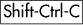) 命令将对文本对象起作用，就像它对形状起作用一样（**13.1.1 路径效果如何工作**）。

与形状不同，文本对象不再是单一路径，而是由原始文本中的每个字符（符号）组成的一组路径。这使得 Inkscape 能够完全保留文本的外观，包括对其内部任何样式应用的任何样式。现在，您可以使用选择工具中的 -单击或节点工具中的简单单击来选择任何单个字母。如果您希望有一个与整个文本对象对应的单个路径，请选择 **路径** ▸ **对象到路径** 如上，然后使用 **路径** ▸ **合并** () 将所有字符合并成一个具有统一样式的单个路径对象。
