# 第十六章 克隆

克隆的概念——一个对象链接副本，当原始对象发生变化时它会自动更新——自然来源于矢量图形的思考方式。你可以说克隆不是一个真实存在的对象——而仅仅是一个命令：“在这里显示对象的副本。”文档存储的是这个命令，而不是对象的实际副本。实际的克隆对象仅存在于 SVG 应用程序（如 Inkscape）加载文档时的内存中。

使用克隆既有艺术上的原因也有技术上的原因。当你只编辑一个对象时，观察几个对象实时变化本身就是一种令人兴奋的体验，开辟了许多创意可能性。另一方面，使用克隆而不是副本可以使 SVG 文档更小，显示更快。地图符号、重复的设计元素（如项目符号或图标）、各种对称设计或图案——所有这些都可以通过克隆轻松完成。很少有其他矢量编辑器能像 Inkscape 那样直接、轻松地创建对象的实时链接副本。

# 16.1 创建克隆

要克隆一个或多个对象，只需选择它们并按  (或使用**编辑** ▸ **克隆** ▸ **创建克隆**)。这个可见的结果与复制()的结果完全相同：为每个选定的对象创建一个副本并将其放置在原始对象上方。如果你需要克隆多个对象作为一个整体，只需将它们组合在一起并克隆这个组合。

克隆是对象的*链接*副本。这个链接由什么构成？

最重要的是，克隆复制了原始对象的*内容*。如果它是路径(第十二章)或形状(第十一章)的克隆，那么它将精确地复制原始对象的形式，并在你使用节点工具或形状工具编辑原始对象时自动更新。如果它是文本的克隆，它具有相同的文本内容，并且当你使用文本工具编辑原始文本时也会实时更新。最后，如果你克隆了一个组合，你可以进入该组合(**5.10 组内选择**)来添加、删除或编辑组合内的对象——组合的克隆将立即更新。另一方面，由于克隆没有自己的内容，你不能编辑其内容——在克隆保持为克隆的情况下，无法进行节点编辑、文本编辑或取消组合。

图 16-1. 克隆是对象的链接副本。

那么，关于 **变换** 呢？如果你缩放、旋转或倾斜原始对象，所有其克隆都会做同样的事情。然而，如果你只是移动原始对象，默认情况下克隆将 **不会** 受到影响（尽管这可以改变，见下文）。当然，如果你同时选择原始及其克隆，你可以通过移动或其他方式以任何方式一起变换它们。

图 16-2. 克隆对原始的变换做出响应，除了移动。

你也可以完全独立于其原始对象移动、缩放、旋转或倾斜克隆。克隆自身的变换应用于从原始继承的变换之上。例如，如果你垂直挤压一个克隆，然后旋转其原始对象，克隆将同时旋转和挤压——但垂直挤压将在旋转之后应用于形状，导致倾斜，如图 16-3 所示。

原文风格也会传递给其克隆。如果你给原始对象涂上不同的填充或描边颜色，所有其克隆将同时采用相同的颜色。

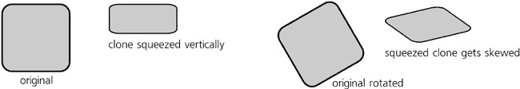

图 16-3. 克隆自身的变换应用于从原始继承的变换之上。

相反，如果你尝试给克隆上色，它将简单地拒绝改变其颜色，保持与原始对象的一致。（同样，这个规则也有例外，我们将在下面看到。）

总结一下，以下是一个表格，列出了你可以在克隆及其原始对象上执行的操作以及这些更改如何相互影响：

|   | 移动 | 缩放、旋转、倾斜 | 节点或形状编辑 | 风格 |
| --- | --- | --- | --- | --- |
| 应用到 **原始** | 默认情况下不影响克隆 | 影响克隆 | 影响克隆 | 影响克隆 |
| 应用到 **克隆** | 是可能的 | 是可能的（在原始变换之上） | 是不可能的 | 是不可能的（除非在原始中取消设置） |

### SVG

*在 SVG 源中，克隆由一个`svg:use`元素表示。其`xlink:href`属性包含一个指向此克隆原始对象的 URL。根据 SVG 标准，此 URL 可以指向任何元素，无论是同一文档内的还是互联网上任何其他文档中的。然而，Inkscape 目前不支持跨文档引用，因此 Inkscape 中创建的任何克隆都必须在其原始对象所在的同一文档中。*

# 16.2 克隆的变换

通常，正如我们所见，克隆可以被以任何你想要的方式变换；这个变换是在它从原始克隆继承的变换之上应用的。你可以使用任何变换方法：通过鼠标拖动、通过键盘变换（**6.5 使用键盘快捷键变换**）、对齐、分布和吸附，所有这些方法在克隆上工作得和在常规对象上一样精确。

另一方面，原始变换根据它们如何影响该原始的克隆被分为两组：简单的移动和其他所有操作。对于“其他所有操作”（缩放、旋转和倾斜）的变换直接传递给所有克隆。然而，简单的移动被处理得不同。

默认情况下，Inkscape 试图将克隆与原始克隆的移动隔离开来，以便在原始克隆移动时它们保持原位。在底层，这是通过将克隆向相反方向移动来实现的，以抵消移动。这种方法非常直观且通常方便；这样，例如，你可以移动一个大型克隆图案的原始克隆并将其移开，而不会打扰到图案。你也可以同时抓住原始克隆及其克隆并将它们移动到任何地方；它们会按照预期行为，即平行移动，即使克隆有自己的变换。

这种补偿行为可以通过用户进行调整。**克隆**选项卡位于**Inkscape 首选项**对话框中（图 16-4)，包含以下选项：

+   第一个选项，**平行移动**，强制所有克隆，包括旋转或缩放的克隆，始终与原始克隆平行移动，就像它们总是与它一起被选中一样（即使实际上并非如此）。

+   第二个选项，**保持不动**（这是默认设置），强制那些未被选中的克隆保持不动（但那些被*选中*的克隆会像往常一样移动）。

+   最后一个选项，**根据变换移动**，关闭任何克隆运动补偿；现在每个克隆，无论是否被选中，都根据其原始克隆继承的变换进行移动，没有任何补偿。当存在复杂的变换时，产生的行为可能看起来令人惊讶且不可预测，但从 SVG 的角度来看，这是最不干扰的，因为继承的克隆变换没有被以任何方式篡改。

图 16-4. 设置克隆的运动补偿

还需要记住，变换克隆不会尊重选择器控制栏上的**影响**按钮（**6.10 变换影响的内容**）；它总是表现得好像所有这些按钮都被按下。你不能以这种方式缩放克隆，以保持其描边宽度不变或其渐变不受影响——因为你实际上是在变换原始图像，而这个图像不能与原始图像有不同的描边宽度或渐变位置。

# 16.3 克隆的样式

在本章的开头，我提到克隆会继承其原始图像的样式。这是真的：红色矩形的克隆将是红色的。然而，对于这种限制，还有一些重要的例外和解决方案。

首先，不透明度（**8.1.2 不透明度**)和模糊度（**17.1 模糊度**)根本不受这种限制：你可以轻松地模糊一个克隆或使其半透明。这是因为这些属性会**累积**——也就是说，如果你先模糊某个对象，然后再模糊其父对象，这些模糊效果会相加，结果会比单独应用任何一个模糊效果都要模糊。这也意味着，如果你的原始图像已经模糊或透明度低于 100%，你可以使它的克隆更加模糊或更加透明，但不能更少。

这同样适用于滤镜效果（第十七章；实际上，模糊只是滤镜之一）。你可以将任何滤镜应用到克隆上，并且它会在原始克隆的任何滤镜之上应用。例如，你可以通过应用**颜色矩阵**滤镜原语（**8.8 颜色扩展和滤镜**）将红色矩形的克隆变成绿色或灰色。

但对于纯填充或描边颜色呢？即使它们在克隆中也可以被改变，但前提是原始图像必须配合。也就是说，你想要在克隆中更改的任何样式属性必须在原始图像中**未设置**。未设置（**8.1.1 绘画**）与设置为`none`不同；当一个属性没有为对象指定时，它就是未设置的，这允许克隆的属性生效。

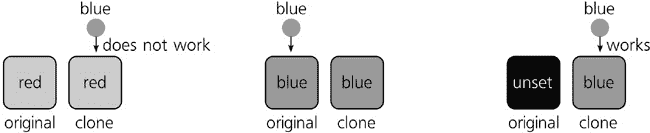

图 16-5。如果原始图像没有设置绘画，克隆可以被上色。

Inkscape 在 **填充和描边** 对话框中有一个特殊的按钮，以及在所选样式指示器中的命令（**8.4 选定样式指示器：绘图命令**），用于取消对象的填充或描边属性。一个取消描边的对象简单地没有可见的描边，但如果你取消其填充，对象将显示为黑色。如果你想取消其他样式属性，你需要使用 XML 编辑器（**4.7 XML 编辑器**)并手动编辑对象的 `style` 属性，从克隆中移除你想要覆盖的属性。

如果你有一个组作为原始对象，那么你只能取消该组中某些成员的填充或描边，而让其他成员着色。然后，如果你克隆该组并绘制克隆，只有具有取消属性的对象才会采用该颜色，而其他一切都将保持与原始对象一致。

# 16.4 克隆链

复制（**4.4 复制、剪切、粘贴和复制**)或复制并粘贴一个克隆会给你另一个*相同原始对象*的克隆。（你可以复制然后粘贴一个克隆到不同的文档中，但只能与其原始对象一起；如果你尝试单独粘贴一个克隆，它最终会变成*孤儿*并不可见。）复制现有的克隆通常很方便，因为这个副本也会获得第一个克隆的变换和样式，如果它有的话。当然，你也可以简单地通过再次克隆原始对象来获得另一个克隆。

此外，没有任何东西阻止你克隆一个克隆对象本身。结果的对象——一个*克隆的克隆*——仍然会显示其最终原始对象的内容，但与其的链接不再是直接的；它现在成为了原始对象的孙子，而孩子（第一级克隆）则站在它们之间。这意味着孙子克隆首先从原始对象继承变换和样式，然后从其父克隆继承，最后，它在其之上有自己的变换和样式。这样的克隆-克隆链（可以是任何长度）很少有用，也不推荐，仅仅因为克隆的长链可能会对渲染性能产生不利影响；在几乎所有情况下，可以使用相同原始对象的多克隆，如图图 16-6 所示。

要确定你选择的对象是否是克隆，以及如果是克隆，它是什么的克隆，请查看状态栏。状态栏将描述你选择的对象，例如，为“克隆：组”或“克隆：克隆：路径”。如果你想确切知道所选克隆的父对象是哪个，请按：Inkscape 将从克隆到其原始对象绘制一条虚线（该线条将在一秒后消失）并选择原始对象（图 16-7）。

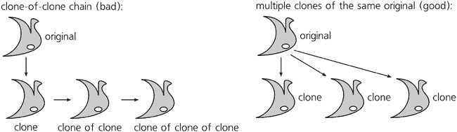

图 16-6. 而不是克隆的克隆，使用相同对象的多个克隆。

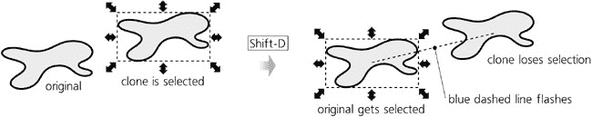

图 16-7. 通过按查找克隆的原始对象。

# 16.5 解除和重新链接克隆

克隆与其原始对象之间的链接是其主要特征；毕竟，这也是我们使用克隆的原因。这个链接在复杂设计中简化了许多任务——例如，你可以在网站原型中使用相同的克隆按钮或项目符号，通过更改它们的共同原始对象，一次更改所有这些元素。然而，有时这个链接会成为一个障碍，你想要独立于其原始对象编辑你的对象。为此，你需要**解除**克隆的链接。

选择一个克隆并按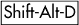（或选择**编辑** ▸ **克隆** ▸ **解除克隆链接**）。从外观上看，没有任何变化；但克隆不再被视为克隆，而变成了一个常规对象——原始对象的一个完整副本，保留了所有额外的变换和样式，现在完全独立并可独立编辑。你可以一次性解除多个克隆的链接。

如果你删除了克隆的原始对象会发生什么？默认情况下，其克隆会自动解除链接——也就是说，它们变成了被杀死的对象的完整副本。然而，在**Inkscape 首选项**对话框的**克隆**选项卡中，你可以选择不同的行为，并强制所有克隆在其原始对象消失时集体自杀：

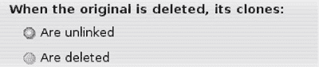

图 16-8. 设置克隆孤儿行为的设置

当你*重新链接*一个克隆时，它仍然是一个克隆，但其原始对象会改变。手动重新链接的操作如下：假设你有一个对象 A 的克隆 C，但想让它成为 B 的克隆。选择 B 并将其复制到剪贴板（），然后选择克隆 C 并执行**编辑** ▸ **克隆** ▸ **重新链接到复制的**。之后，C 就变成了 B 的克隆——这取决于 B 是什么，可能会导致 C 改变形状、样式、位置、变换或这些的组合（图 16-9）。

图 16-9. 将克隆重新链接到不同的原始对象

手动重新链接是一个很少需要的操作。更有用的是*复制时的自动重新链接*。想象一下，你有一个复杂的对象组，其中一些是其他对象的克隆——例如，一个类似 3D 的图形按钮，其阴影是主形状的模糊克隆。现在，你选择这个整个组并复制它。会发生什么？

在组内，每个常规对象将复制为常规对象，每个克隆将复制为克隆。然而，克隆仍然会与源组中的原始对象链接——这很可能不是你想要的！对于复制的组中的阴影来说，更自然的是它是同一组中形状的克隆，而不是远处的其他组的形状。为了确保这一点，请转到相同的**克隆**选项卡并检查**当复制原始+克隆时：重新链接复制的克隆**。现在，在复制后，你将有两个独立的按钮，每个按钮都有一个可以独立编辑的形状和与其自身形状链接的阴影：

图 16-10. 复制时自动重新链接克隆

# 16.6 平铺克隆

巨大且强大的**创建平铺克隆**对话框（**编辑** ▸ **克隆** ▸ **创建平铺克隆**）基本上是一个一次创建许多克隆的工具。这些创建的克隆可以放置到许多种空间和颜色模式中，从绝对规则到完全随机化。此外，你还可以让这些克隆追踪其下方的图像。

## 16.6.1 大小和边界框

在你可以创建平铺克隆图案之前，首先要做的是选择你将要克隆的对象。我建议使用一个组来做这件事；即使你只有一个对象，也将其分组（）。这样，你以后将能够向原始组添加更多对象，克隆将反映这一点。将原始对象放置在你想要填充图案的区域左上角。

在**创建平铺克隆**对话框中，首先指定平铺的尺寸（图 16-11）。你可以指定图案中的行数和列数，或者如果你有一些特定的区域要填充，你可以键入或粘贴其宽度和高度。请注意，太大的图案（克隆数量超过几千个）可能会显著减慢 Inkscape 的速度。

图 16-11. 设置图案的大小

要创建瓷砖（在你设置所有其他参数（如以下所述）或如果你只是信任默认值之后），点击**创建**按钮。图案出现在画布上，但你仍然选中了原始对象。**删除**按钮删除所选对象的所有先前平铺克隆。请注意，**创建**意味着**删除**——也就是说，一旦你点击**创建**，任何现有的平铺克隆（但不是由创建的常规克隆）将被删除并替换为一个新的图案。

**Unclump**按钮的功能与**对齐和分布**对话框中同名的按钮完全相同（**7.5.1 随机化、解簇和去除重叠**），区别在于它只移动所选对象的所有平铺克隆，而不是所有选定的对象。解簇对于使随机图案更加均匀特别有用，而无需进行规范化。**重置**按钮将对话框的所有参数重置为默认值。

图 16-12. 解簇随机图案

当你第一次创建图案时，**使用保存的平铺大小和位置**复选框没有任何效果。然而，如果你修改了你要平铺的对象并再次创建图案，通常 Inkscape 将使用对象更改后的尺寸，这可能会导致图案的整体尺寸和瓷砖的对齐方式发生变化。为了使 Inkscape 使用你上次从该对象创建图案时相同的瓷砖尺寸，即使对象的尺寸已更改，请选中此复选框。例如，你可以从一个矩形创建图案，精细调整所有参数，然后删除图案，放大原始矩形，并使用此复选框重新创建图案。现在你将拥有与上次完全相同的图案，但瓷砖更大，相互重叠。（当然，你也可以简单地编辑原始图案，而不删除和重新生成图案。）因此，每个对象都可能记住其最后的“平铺尺寸”。

### 注意

*请注意，所有图案都包含一个与原始对象完全重叠的克隆（除非随机化）。这意味着如果你丢失了原始对象的选择，只需单击原始对象的位置即可选择覆盖的克隆而不是原始对象。使用*  *-点击（**5.9 从下方选择对象**）或选择任何克隆并按*  *跳转到原始对象。*

## 16.6.2 对称性

对话框的第一个选项卡标题为**对称性**。它只有一个列表，其中包含你可以从中选择一个用于图案的**对称群**。每个对称群都是将克隆转换以形成图案的特定方式。这不是 Inkscape 程序员的随意选择，数学家已经证明任何可能的平面上的规则图案都可以归类为这 17 种类型之一。有关每种对称性的完整描述，请参阅维基百科上的“壁纸群”文章。以下是类型的概述：

**P1**

+   这是最简单的对称性：图案砖块简单地重复在矩形网格中，没有任何旋转或翻转。

    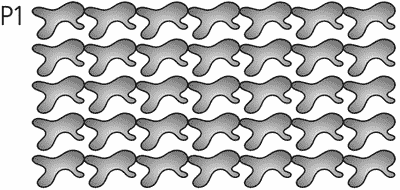

    图 16-13. 基本对称性：P1

**P2, PM, PG, CM, PMM, PMG, PGG 和 CMM**

+   这些对称性使用 180 度的旋转以及垂直和水平翻转的各种组合。然而，所有这些对称性都使用与 P1 相同的矩形网格放置，网格单元的宽度和高度与原始对象的宽度和高度相同。

    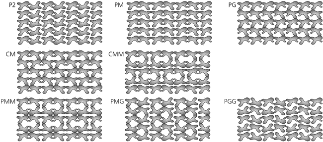

    图 16-14. 带翻转和 180 度旋转的对称性

**P4, P4M 和 P4G**

+   这些对称性涉及 90 度的旋转，因此产生基于正方形的图案。P4M 对称性导致矩形砖块部分重叠；使用它时，使用三角形砖块以避免重叠并填充平面（图 16-15）。

    

    图 16-15. 带 90 度旋转的对称性

**P3, P31M 和 P3M1**

+   这些对称性涉及 120 度的旋转，因此外观大致呈三角形。再次强调，P31M 通过部分重叠的砖块创建了一个更密集的图案，因此你可以使用“饼片”形状来填充这种对称性而不重叠。

    

    图 16-16. 带 120 度旋转的对称性

**P6 和 P6M**

+   这些对称性将瓦片旋转 60 度，形成类似雪花的多边形图案。其中，P6M 再次重叠瓦片，需要“饼片”形状来填充平面而不重叠。

    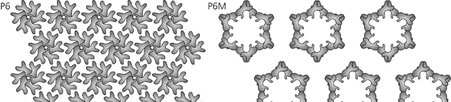

    图 16-17. 具有 60 度旋转的对称性

对于“密集”模式（P4M、P31M、P6M），这些模式重叠瓦片，以下技巧可能很有用：创建模式，然后缩小原始图像。这将使模式更加稀疏，其特征逻辑更容易理解。

当处理镶嵌（一种完全填充平面且无间隙或重叠的图案）时，即使您很好地理解了所选对称性如何工作，单独创建适当形状的瓦片也会非常困难。相反，只需从任何随机形状开始，使用所需的对称性从它创建模式，然后节点编辑原始路径，观察模式克隆如何重复其变化。这样，可以非常快速地产生令人惊讶的复杂镶嵌（参见**24.2 处理 2：镶嵌**）。

## 16.6.3 平移、缩放和旋转

对话框中的下一个三个选项卡允许您指定应用于图案瓦片的**附加**变换——即，在所选对称群暗示的平移、旋转和翻转之上进行的变换。

所有这些附加变换组件都可以分别按行和按列指定，每个值都可以包含一定程度的随机性。例如，您可以指定“使下一行的瓦片高 20%，使下一列的瓦片旋转 5 度，并使旋转角度随机变化 50%”。所有平移、缩放和随机化值均以原始对象尺寸的百分比来衡量。

图 16-18. 平移、缩放和旋转选项卡

下面是如何进行平移的说明：

图 16-19. 指定每行和每列的平移（PG 对称性）

也可能存在负平移。自然地，为了使所有克隆重叠原始图像，您需要指定**Shift X:** 每列-100%和**Shift Y:** 每行-100%。与每行的旋转结合，这使得轻松创建花朵或时钟面成为可能：

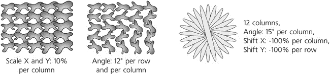

图 16-20. 指定每行和每列的缩放和旋转

您可以使值**交替**（例如，每行缩放克隆）。勾选**累积**复选框将使位移或缩放值累积；例如，通常每列位移 10 像素意味着每列相对于前一列位移 10 像素。如果您勾选**累积**，相同的值意味着每列相对于其前驱位移 10 像素更远——也就是说，第二列距离第一列 10 像素，第三列距离第二列 20 像素，以此类推。

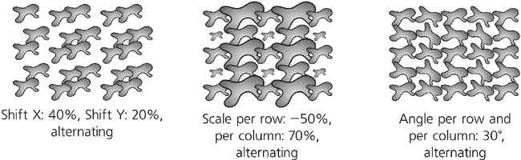

图 16-21. 交替变换

对于复杂的对称性，一个自然的问题是：在计算变换值时，“行”和“列”应该是什么？Inkscape 通过对称簇（3、4、6 或 12 个克隆，取决于对称性）绘制复杂图案，在行内水平地从簇到簇。换句话说，属于同一簇的克隆被认为是同一行但不同列。这意味着**按行**位移值通过位移簇的行或均匀缩放每个簇中的克隆来工作，而**按列**值独立影响每个克隆，因此簇失去了对称性。如果您想在两个维度上均匀分布对称簇，只需创建一个具有所选对称性的单个簇，然后将其分组，并用简单的 P1 对称性平铺该组，可能还有交替位移。

图 16-22. 变换复杂对称性

## 16.6.4 模糊度和不透明度

此对话框标签看起来和操作方式与变换标签非常相似；在这里，您可以按行或按列调整图案中克隆的模糊度和不透明度（即**淡出**值），可选交替或随机化。请记住，您只能使克隆比其原始图像更模糊或更透明，但不能更模糊或更透明。

图 16-23. 图案中变化的模糊度和不透明度

## 16.6.5 颜色

如我们在**16.3 克隆样式**中看到的，如果您想用克隆自己的颜色进行绘制，您需要取消原始中相应的属性。一旦您为要更改的绘制（填充、描边或两者）完成了这一步，**创建平铺克隆**对话框允许您创建各种颜色图案。

对话框中的**颜色**选项卡看起来与我们已知的所有选项卡非常相似。在这里，您可以按行或按列改变克隆颜色在 HSL 模型中的三个组件——色调、饱和度和亮度（**8.2.3 HSL**）——以及交替或随机化这些变化。您还需要指定所有这些变化将开始的**初始颜色**；只需单击颜色样本并使用颜色选择对话框。请记住，原始颜色必须没有设置填充或描边，否则此选项卡将没有任何效果！

图 16-24. 为颜色选项卡设置初始颜色

例如，从红色开始，每行和每列色调变化 5%，您将得到一个倾斜的彩虹，如图色插页中的图 10 所示。

## 16.6.6 跟踪

**Create Tiled Clones**对话框的最后一个选项卡（图 16-25

    图 16-25. 跟踪选项卡

+   处理值的可能方式包括：

    **伽玛校正**

    +   正向伽玛将选择的值向上移动，负向伽玛将其向下移动。

    **按给定百分比随机化**

    +   值将具有给定大小的随机成分；0%随机化意味着值与选择的值完全相同，100%随机化意味着它是完全随机的，并且完全不依赖于选择的值。

    **反转**

    +   将高值转换为低值，反之亦然。

    如果选择了颜色，此处理将独立应用于其每个组件，如图色插页中的图 11 所示。

+   最后，得到的值可以应用于克隆的存在概率（0 表示在此位置克隆不存在，1 表示存在，中间值使其以给定概率出现）；颜色（如果已选择背景颜色，则可以直接重用；否则，将单个值转换为灰色阴影），大小（从 0 的消失到 1 的完整大小），以及不透明度（较小的值使克隆更加透明）。可以同时启用任意数量的这些选项；例如，你可以选择亮度，将其反转，并将其应用于克隆的不透明度和大小（参见彩色插页中的图 12）。
