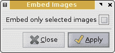
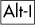
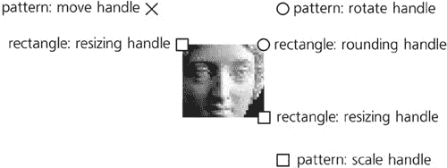
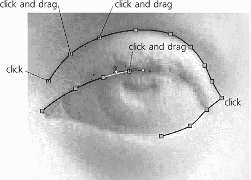
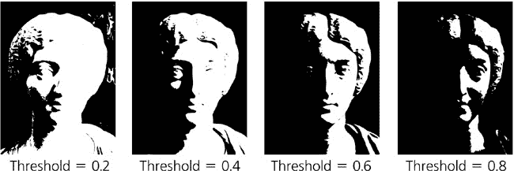
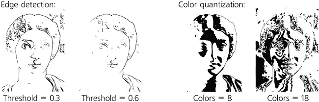
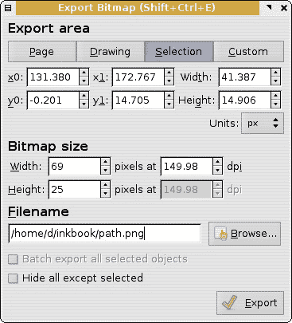

# 第十八章：位图

大多数矢量图像开始或结束（有时两者都是）它们的生命周期作为位图（**1.1 矢量图形是什么以及为什么它很重要**），Inkscape 的 SVG 文档也不例外。许多矢量绘图，无论是艺术性的还是技术性的，都是从照片、扫描或其他位图绘图中发展而来的；在其生命周期的另一端，几乎所有矢量艺术最终都导出为位图格式，以便在无法直接处理矢量的软件中查看。位图是 Inkscape 中的重要对象类型，处理它们的技巧足够灵活，足以用整整一章来介绍。

# 18.1 导入

如果您有一个位图图像文件，您可以通过使用**文件** ▸ **导入**命令将其作为位图对象插入到 Inkscape 文档中。Inkscape 可以处理大量位图格式，包括所有主要格式（PNG、JPG、TIFF、GIF 和 BMP）。在**导入**对话框中，选择**所有位图**作为文件类型，以便只有支持的位图格式出现在列表中。

此外，您还可以使用**文件** ▸ **打开**来将任何位图文件作为独立文档显示。在这种情况下，Inkscape 会自动创建一个新的 SVG 文档，其页面大小（**3.4.3 页面大小**）与位图的像素大小相匹配，并将位图放置在画布上（即文档根目录，而不是任何图层中）。现在您可以向该文档添加矢量对象并将其保存为 SVG（如果您想得到带有结果的位图，您需要将其导出，**18.9 位图导出**），或者您可以将该文档中的位图对象复制并粘贴到任何其他文档中。

在任何情况下，您现在文档中拥有的都是一个显示位图内容的**位图对象**。在大多数方面，这是一个常规对象，您可以对其进行变换、复制、克隆、应用滤镜等。在状态栏中，它被描述为带有其像素大小的**图像**，例如**640 × 480**。


图 18-1. 文档中的位图对象和选中对象的状态栏显示

位图由像素组成（**1.1 矢量图形是什么以及为什么它很重要**），Inkscape 并不试图隐藏这一事实。只需足够接近地放大，您就会很容易地看到位图对象中的单独像素作为单色方块。默认情况下，所有位图都以每英寸 90 像素的分辨率导入，这意味着每个像素方块的大小正好是 1×1 px（**A.6 坐标和单位**）。如果您挤压、倾斜或旋转位图，其像素将相应地变换。

# 18.2 链接与嵌入的区别

默认情况下，你导入到 Inkscape 中的任何位图都*链接*到文档。这意味着位图的实际内容是从原始位图文件中获取的；SVG 文档中包含的只是对该文件的引用——包括路径的文件名。这样，SVG 文件的大小保持最小，多个 SVG 文档可以重用相同的位图文件。链接的位图对象的任务栏描述报告了其文件名（图 18-1）。

这也意味着，你对该链接位图文件进行的任何更改（例如，颜色校正或裁剪）都将立即反映在 Inkscape 文档中。此外，你可以通过在 Inkscape 内部右键单击位图对象并选择**外部编辑**来在链接的图片上运行外部编辑器（例如 GIMP 或 Photoshop）。在**Inkscape 首选项**的**位图**页面（**3.1.1 Inkscape 首选项**）中，你可以禁用更改位图的自动重新加载，以及选择你想要使用的哪个外部编辑器。

链接位图的最大缺点是破坏这个链接是多么容易。如果位图文件被删除或移动到相对于 SVG 文档的不同位置，结果将不会很美观，正如图 18-2 所示。


图 18-2. 当 Inkscape 找不到链接的位图文件时，它显示的内容。

这是在你将你的艺术作品发送给某人但忘记包括链接的图片时常见的问题。

### SVG

*对于 Inkscape 来说，重要的是位图的相对位置，因为在*`svg:image`*对象的*`xlink:href`*属性中，它存储了从 SVG 文档位置到图片文件的*相对路径*。例如，如果位图位于你的 SVG 文档所在的文件夹的*images*子文件夹中，你可以将这个文件夹及其*images*子文件夹移动到电脑上的任何位置而不会出现问题。*

*此外，Inkscape 在一定程度上保护你免受这种情况的影响：你将 SVG 文档移动到同一台电脑上的另一个位置，但留下了链接的图片。Inkscape 还存储了图片的*绝对路径*在*`sodipodi:absref`*属性中，并在*`xlink:href`*中的相对链接失败时尝试使用它。然而，如果你将 SVG 移动到没有相关图片的不同电脑上，这并不会有所帮助。*

有一种方法可以一次性防止这些链接问题，那就是将图像*嵌入*到你的 SVG 文档中。嵌入的图像存储在 SVG 文件内部，永远不会丢失。然而，这会增加 SVG 文件的文件大小（大约是位图文件大小的 1.4 倍，这可能是显著的）；此外，嵌入的图像不能在外部位图编辑器中编辑。

要将一个或多个图像嵌入到文档中，请使用**Extensions** ▸ **Images** ▸ **Embed Images**。你可以选择仅嵌入选定的位图对象（保留其他所有对象不变）或嵌入文档中的所有位图对象：



图 18-3. **Extensions** ▸ **Images** ▸ **Embed Images** 将所有或仅选定的图像嵌入到 SVG 中。

嵌入的图像在状态栏中描述为，例如，*Image 64 × 64: embedded*。使用**Extensions** ▸ **Images** ▸ **Extract Image**，你可以反转位图的嵌入——也就是说，将嵌入的图像提取到单独的链接文件中；你需要指定保存提取文件的路径。

# 18.3 位图作为图案

通常，你首先想要对导入的位图进行的是*裁剪*，移除不必要的边框，只留下图像的一部分。在 Inkscape 中，有几种方法可以实现这一点。

如果你希望位图保持矩形形状，并且只想去除一些边框，通过按  可以方便地将它转换为*图案**（**10.8 图案**）。这不会改变可见的显示，但将矩形位图（必须未旋转或倾斜才能正确工作）转换为具有图案填充的矩形对象（**11.2 矩形**）。

现在，你可以使用其两个角手柄来调整矩形的大小，例如使用节点工具或矩形工具（**11.2.1 尺寸调整**）。这不会影响填充，这意味着你可以通过移动矩形手柄向内来裁剪它。同时，你还可以使用图案的三个手柄来移动、缩放和旋转图案，如**10.8.2 编辑图案**中所述。（最初，图案手柄与矩形手柄重合；将左上角的 X 形手柄拖动以分离它们。）



图 18-4. 矩形中的位图作为图案

在将您的位图转换为图案矩形后，您可以将矩形转换为任何其他路径——例如，通过将其转换为路径（）并编辑结果，或者通过将矩形与路径相交（**12.2 逻辑运算**）。这种方法很方便，因为您可以同时编辑形状/路径及其位图填充。默认情况下，变换会影响形状/路径及其图案填充；有关如何更改此设置的详细信息，请参阅**6.10 受哪些变换影响**。

# 18.4 裁剪和遮罩

另一种裁剪图像的方法是使用**裁剪**或**遮罩**。尽管在这里，这些技术是通过位图对象来展示的，但实际上您可以对任何类型的对象进行裁剪或遮罩，包括组。

Inkscape 允许任何对象通过路径进行裁剪，这样只有路径内部的对象部分才会可见。从位图对象开始，使用任何方便的工具（例如，书法笔或铅笔）在其上绘制裁剪路径或形状。然后，选择位图和路径，并选择**对象** ▸ **裁剪** ▸ **设置**。裁剪路径消失（现在它位于`defs`中，**A.4 Defs, View, and Metadata**），但底部对象现在被它裁剪。要在不取消裁剪的情况下编辑裁剪路径，请点击节点工具控制栏中的相应按钮，如图图 18-5 所示。


图 18-5. 应用裁剪到位图对象

在任何时候，您都可以通过**对象** ▸ **裁剪** ▸ **释放**来移除裁剪，并将对象及其裁剪路径再次作为两个单独的对象获得。

### 注意

*裁剪路径不一定是单个路径；它也可以是一组路径。*

遮罩与裁剪非常相似：您选择对象和遮罩，然后选择**对象** ▸ **遮罩** ▸ **设置**来应用遮罩，或者选择**对象** ▸ **遮罩** ▸ **释放**来移除遮罩。裁剪和遮罩之间的主要区别在于，裁剪将对象限制在裁剪路径的内部，忽略任何装饰，如填充颜色、描边样式、渐变或模糊。裁剪是**二进制**的；在任何时刻，裁剪的对象要么可见，要么不可见。然而，遮罩是**渐变**的——它可以使对象**部分**透明。

要记住的规则是：在遮罩中，*黑色*使被遮罩的对象*透明*（不可见）和*白色*使它们*不透明*（可见）。更重要的是，遮罩中的“无颜色”填充或完全透明被认为是“透明黑色”——也就是说，没有被遮罩覆盖的区域或落在遮罩缝隙或孔中的区域消失。要使对象的一部分可见，该部分的遮罩必须是非黑色的；纯不透明白色在遮罩对象中给出 100%的不透明度，而任何更暗或更透明的颜色都会产生低于 100%的不透明度。

显然，当使用渐变或模糊时，遮罩最有用。例如，你可以轻松地将照片条带与背景融合（使用线性渐变遮罩）或使照片剪贴的不规则边缘羽化（使用模糊遮罩）：


图 18-6. 对位图对象应用遮罩

就像剪裁路径一样，遮罩可以是一组对象而不是单个对象。节点工具还有一个按钮用于编辑所选对象的遮罩。不幸的是，此按钮仅允许你节点编辑遮罩的单一路径或形状——你不能改变其颜色、渐变或模糊；为此，你需要释放遮罩，在更改后再次设置。

# 18.5 修图和修补

在 Inkscape 中使用矢量工具，可以完全实现简单的位图编辑任务，例如去除缺陷或抑制不必要的细节，无需求助于外部位图编辑器。虽然这种方法有限，但它往往出人意料地有用且快速。

假设我们需要从照片中移除一个小瑕疵。首先，放大照片并在其上方绘制一个书法笔触；然后，切换到滴管工具并从照片附近的颜色中选取颜色。在某些情况下，这可能是你真正需要的——即使这样的原始修补也可能足够融合，以至于在缩小视图时不会引起注意。然而，修补的边缘在至少一个侧面可能会非常明显。在这种情况下，渐变可能会有帮助；切换到渐变工具（**10.1 渐变工具**），绘制一个线性或椭圆形渐变，尝试匹配背景中颜色变化的主要方向，并再次使用滴管工具（**8.6 滴管工具**)来选取渐变停止点的颜色。如果渐变未能使修补完全融入背景，可以尝试稍微模糊一下：


图 18-7. 用矢量修补路径覆盖脸颊上的小瑕疵，通过渐变和模糊使其“隐形”

完成修图后，别忘了将位图对象及其所有矢量修补组合在一起，这样组合就可以作为一个单独的对象移动。

# 18.6 位图滤镜

一些预设的过滤器（**17.3 预设过滤器**），收集在**过滤器** ▸ **图像效果**中，是专门为位图设计的（图 17-12）。当然，你可以将这些过滤器应用于任何其他对象或将任何其他过滤器应用于位图；此子菜单仅收集那些主要适用于位图的过滤器，因为它们作用于对象的内部颜色或纹理，而不是其整体形状。

# 18.7 位图效果

到目前为止描述的所有技术，虽然对于处理位图是必不可少的，但同样适用于任何类型的对象。然而，Inkscape 还有一系列“真正”的位图扩展效果，收集在**扩展** ▸ **栅格**子菜单中。（有关使用扩展效果的通用提示，请参阅**13.3 路径扩展**。）

与我们刚才看到的 SVG 过滤器不同，所有这些效果都会永久性地更改位图；它们可以被撤销——但例如，在应用后你不能重新调整这种效果的相关参数。而且与过滤器不同，这些效果只能作用于位图对象；例如，你不能将位图效果应用于位图的副本。如果位图是链接的，这些效果将嵌入它并在嵌入的副本上工作，而不是在外部链接的原始位图上。

有超过 30 种栅格效果；这里只列出了最有用（且不通过过滤器容易实现）的那些：


图 18-8. 从扩展 ▸ 栅格中扩展效果的示例

+   **添加噪声**为你提供了在图像上叠加各种类型噪声的选择；大多数类型看起来或多或少像散落的沙子。

+   **通道**从位图中提取一个通道（R/G/B、C/M/Y/K、不透明度或哑光中的一个）。

+   **炭笔**将你的图像变成炭笔画的模仿。增加**半径**会使笔触更粗糙，而提高**Sigma**会使整体绘制更暗。

+   **对比度**增加对比度（明暗之间的差异）。你可以多次应用它以获得更明显的效果。

+   **循环色图**循环位图的色图。

+   **去斑**、**增强**和**减少噪声**实现了各种噪声减少算法。

+   **均衡**将直方图均衡应用于图像。

+   **级别**将比**黑点**暗的像素变黑，将比**白点**亮的像素变白，并将处于此范围内的像素缩放到全色范围。**伽玛校正**指定额外的亮度校正（1 表示无变化）。

+   **级别（带通道）**与**级别**相同，但仅适用于单个通道。

+   **中值**用其圆形邻域的中值颜色绘制每个像素，产生类似于模糊的效果。

+   **HSB 调整**调整色调（在-360 到 360 的范围内），饱和度（-200 到 200），和亮度（-200 到 200）。

+   **归一化**通过将像素的颜色范围扩展到完整的颜色范围（例如，如果图像没有红色，所有颜色都会在红色的方向上拉伸以补偿这一点）来增加对比度。

+   **重采样**可能是所有图像效果中最实用的：它允许你改变位图的像素大小而不进行缩放。向上重采样（即，使位图大于其当前像素大小）不会改变图像的外观，但如果你计划应用其他效果并希望它以更高分辨率工作，这可能是有用的。向下重采样（到小于当前大小）会使图像失去细节，而不会改变文档中的尺寸；这是减少嵌入位图的 SVG 文档文件大小的好方法。

+   **抖动**在位图中随机散布像素，**数量**指定散布的半径。

+   **漩涡**将位图在其中心以螺旋状旋转。

+   **锐化蒙版**使用流行的“锐化蒙版”算法来锐化图像。

+   **波浪**沿给定振幅和波长的水平正弦波扭曲图像。

# 18.8 追踪

对于矢量编辑器来说，最重要的位图相关功能之一是将位图对象转换为矢量（*追踪*）以及相反的（*位图导出*）。Inkscape 提供了丰富的强大工具来进行这些转换，本章的其余部分将详细介绍这些工具。

## 18.8.1 手动追踪

从位图图像创建矢量艺术的最直接方法不涉及任何除了我们已知的工具以外的工具。只需切换到钢笔工具（**14.1 钢笔工具**），放大你的位图，然后在你想要转换为矢量路径的区域周围或沿线进行一系列点击，然后双击或按  完成路径。在尖锐的角落使用点击并释放来创建尖点节点；对于平滑的曲线边缘，在关键节点使用一系列点击并拖动：



图 18-9. 位图手动追踪

你可以根据你想要追踪特定区域的精确程度来调整点击的密度。如果你想形状更加平滑，切换到斯皮罗模式（**13.1.7 斯皮罗样条**）；在此模式下，点击后拖动的方向无关紧要，只要你在某个地方稍微拖动一下以创建平滑节点即可。如果你正在追踪没有任何曲线的多边形，使用直线模式会更方便，这样意外的拖动就不会创建不想要的平滑节点。

虽然这种技术在最初可能看起来很耗时，但一旦您掌握了技巧，您将能够非常快速地跟踪复杂的艺术作品。像任何手动技术一样，它的主要优势是完全的创意控制——您决定跟踪哪些部分、忽略哪些部分，如何简化复杂形状，在哪里偏离位图蓝图，以及在哪里放置每个节点。根据您的技能，结果可能会比自动跟踪或完全手动绘图更令人满意。

## 18.8.2 跟踪位图对话框

Inkscape 的自动位图跟踪工具非常强大；基于独立的 Potrace 开源跟踪器（*[`potrace.sourceforge.net`](http://potrace.sourceforge.net)*），它被认为是现代矢量编辑器中同类工具中最好的之一。使用它，您可以跟踪从只需要几个节点的简单黑白标志到产生数十个彩色路径和数千个节点的复杂照片。


图 18-10. 跟踪位图对话框

**跟踪位图**对话框（）有两个主要区域：左侧的选项面板和右侧的预览面板。请注意，然而，预览面板不会显示您正在跟踪的矢量路径（这可能很耗时来创建）；相反，您看到的是根据选项面板中指定的所有颜色减少和过滤步骤进行跟踪的位图。要更新选项更改后的预览，请点击**更新**。

要执行所选位图对象的实际跟踪，请点击**确定**。对于大位图，这可能很慢；请查看状态栏以获取进度消息。您可以在任何时候通过点击**停止**按钮来中断跟踪。

对话框的**模式**选项卡选择跟踪工具的主要操作模式。可用的模式分为两组：**单扫描模式**创建单个路径，而**多扫描模式**创建多个路径（分组在一起）。

### 18.8.2.1 亮度截止

**亮度截止**是跟踪路径最简单也是最常见的方法：生成的路径覆盖了所有比您设置的阈值更暗的部分。这个跟踪路径，虽然是一个单一的对象，但可以由多个非重叠的子路径组成（**12.1.1 子路径**）。**阈值**是以图像整个亮度范围的一部分来设置的；例如，当设置为 0.6 时，跟踪路径覆盖了图像最暗的 60%的所有区域。如果您点击**反转**，**阈值**的含义将被反转（即，路径将覆盖图像最亮的 40%）。



图 18-11. 不同阈值值的亮度截止跟踪

通常，这是追踪简单单色形状（如标志、文本、剪影等）的最佳追踪模式。

### 18.8.2.2 追踪质量

即使您正在追踪的位图是矢量路径的版本，追踪也不会精确地重现原始路径。将矢量渲染为位图总会造成一些信息丢失，Inkscape 的追踪器无法通过猜测来恢复这些丢失的信息。尽管它通常做得相当不错，但仍然会有一些情况让您对其未能识别您在位图中容易“看到”的一些特征（弧线、直线、角落）感到失望。这在追踪低分辨率位图或包含文本的位图时尤其明显。


图 18-12. 位图追踪的一些常见质量问题

在这种情况下，最好的建议可能是获取尽可能高的分辨率位图。从一些关键特征跨越几个像素的位图中获取合理的追踪几乎是不可能的；追踪图像的高分辨率版本通常会有很大的不同。此外，您可以尝试调整**阈值**并实验对话框的**选项**页面（它适用于所有模式，无论是单扫描还是多扫描）的内容：

+   **抑制杂点**选项移除任何小于指定像素数的颜色块。这可以抑制在追踪脏或“抖动”位图时创建小的多余子路径。

+   增加平滑角落参数会使追踪算法不太倾向于识别图像中的尖锐角落。当您从高度像素化、低分辨率的位图追踪自然平滑的形状，且不希望意外的像素尖角成为追踪路径中的尖锐角落时，这可能很有用。相反，当您正在追踪没有曲线的几何形状时，降低此参数是合适的；当**平滑角落**为零时，生成的路径几乎完全由直线段组成，它们之间有尖角节点。

+   **优化路径**参数试图减少追踪路径中的节点数，就像**简化**命令所做的那样（**12.3 简化**）。提高此值会减少您获得的节点数，但也会增加引入可见扭曲或丢失形状的一些重要细节的机会。

### 18.8.2.3 其他单扫描模式

**边缘检测**模式在追踪位图之前将其应用于边缘检测过滤器。因此，追踪路径将包含窄条，这些窄条遵循源位图中的颜色边界。**阈值**越低，检测和追踪到的边缘就越多。

**颜色量化**模式首先将图像量化（分割）为给定数量的区域（**颜色**），每个区域都有其主导颜色，就像使用位图编辑器将全色图像减少到固定调色板时一样。然后它追踪**每个**这样的区域，这导致颜色渐变呈现出剥离的外观。



图 18-13. 边缘检测和颜色量化模式

### 18.8.2.4 多扫描模式

就像我们刚刚看到的**颜色量化**模式一样，每种多扫描模式首先将图像量化为给定数量的区域（由**扫描数**指定）。然后它分别追踪每个区域，为追踪路径分配适当的颜色或灰度级别，并将所有这些路径组合在一起。在足够多的量化步骤下，结果可能看起来非常接近原始位图，忠实地再现其颜色渐变、模糊、自然纹理等。

三种多扫描模式在图像量化方式上有所不同。**亮度级别**选项是灰度图像的最佳选择；它忽略任何色调或饱和度差异，并根据亮度将像素分组到区域中（图 18-14

图 18-14. 多扫描：10 个亮度级别

**平滑**选项在量化图像之前应用一定量的模糊；这在复杂摄影图像中可能会产生更好的结果。**堆叠扫描**选项最好保持开启状态；它确保每个区域的路径不仅覆盖该区域，还覆盖 z 顺序中所有位于其下方的区域，这意味着扫描之间不会有间隙：


图 18-15. 扫描堆叠与相邻

**移除背景**选项简单地从组中移除最底层的扫描路径，这在您正在追踪一个在单色背景上的照片，并且希望结果只包含对象本身，而不包含背景时非常有用。

# 18.9 位图导出

在位图主导的世界里，没有良好光栅化和位图导出功能的矢量编辑器是无用的。Inkscape 的位图导出功能方便，可以通过多种方式自动化。然而，Inkscape 缺乏导出预览，并且只支持一种位图格式：PNG。此外，你只能创建每个通道 8 位（没有索引颜色，没有每个通道 16 位），并且无法抑制抗锯齿。

不支持 PNG 之外的位图格式并不像听起来那么糟糕。PNG 格式忠实地保留了 Inkscape 能够达到的最大渲染质量，包括 alpha 透明度、抗锯齿、滤镜等。从 PNG 文件中，你可以轻松地使用位图编辑器或任何图像转换工具（如 ImageMagick）创建任何其他格式（如 JPG 或 TIFF）（你可以在 *[`imagemagick.org`](http://imagemagick.org)* 下载它）。在此转换过程中，你可以以各种方式优化你的图像（例如，最小化文件大小或调色板）。

### 注意

*如果你认为你的 PNG 导出丢失了原始 SVG 的透明度，最可能的问题来源不是 Inkscape，而是你用来检查 PNG 的图像文件查看器。并非所有图像查看器都能处理 PNG 中的 alpha 透明度；一个能保证正确显示你的 PNG 的程序是 Firefox 浏览器。*

## 18.9.1 导出位图对话框

使用 **导出位图** 对话框 ()，你可以将你的绘图或其任何部分导出为 PNG 文件，任何分辨率。该对话框由三个主要区域组成，其中你配置以下内容：

+   你想要导出的画布区域

+   位图的像素大小

+   导出文件的文件名



图 18-16. 导出位图对话框

对于 **导出区域**，你可以选择你的 SVG 文档的 *页面*（页面边缘之外的内容不会被导出），*绘图* 的边界框（这可以比页面小或大；页面矩形在导出的位图中在任何方式下都是不可见的），或者 *选择* 的边界框（再次，它可以在页面矩形内部或外部——这并不重要）。这些选项对应于对话框顶部的第一个三个切换按钮。

或者，你可以点击 **自定义** 切换按钮，并输入导出区域左上角坐标（**x0**，**y0**）、右下角坐标（**x1**，**y1**）或宽度和高度的值。你还可以选择这些值的测量单位（默认为 `px`，**A.6 坐标和单位**）。

**导出位图**对话框不是模态的——也就是说，当它打开时，您可以像平时一样继续在画布上工作。除非您选择**自定义**，否则对话框会根据画布上的选择变化而切换到**选择**模式，并更新坐标以匹配新选择的边界框。如果没有选择任何内容并且您不在**自定义**模式下，对话框默认为**绘图**模式。

对于**位图大小**，您可以输入宽度和高度，以像素为单位，或者调整分辨率值（*dpi*，代表*每英寸点数*——即像素），默认分辨率为 90 dpi，使得一个 SVG `px` 单位正好对应渲染位图的像素。水平和垂直的 dpi 值不能不同；更改三个可编辑值中的任何一个（**宽度**、**高度**、**dpi**）都会使其他两个值相应改变。

### 注意

*如果您的绘图包含一些`px`大小的对象（例如宽度为整数的`px`的线条）并且您希望它们精确地导出到位图的像素中，选择 90 dpi 分辨率可能不足以做到这一点。例如，SVG 中的 1×1 px 正方形可能会落在导出位图中像素之间的边界上，这最终会导致“扩散”到四个相邻像素而不是一个。防止这种错位并确保您的导出尽可能清晰的最简单方法是使用网格（**7.2 网格**）。将对象吸附到默认的 1 px 大小的网格上，并确保在`px`测量时导出区域具有整数**x0**和**y0**坐标——也就是说，它本身对齐到`px`网格。之后，在 90 dpi 下导出将为您提供一张完美清晰的图像。*

对于**文件名**，您可以输入文件的完整路径（将自动添加*.png*扩展名）或点击**浏览**按钮访问您的文件系统并选择一个文件夹和一个文件。

### 18.9.1.1 导出提示

当导出单个选定的对象时，导出文件名和分辨率会被记住并存储在 SVG 文档中（因此您可能需要在导出后保存它），并在您再次选择此对象进行导出时恢复到**导出位图**对话框中。这些*导出提示*是使用 Inkscape 导出多个对象到多个位图文件时节省时间的一大方法——例如，网页图形的切片。正如您在打开**导出位图**对话框时选择各种对象一样，您可以在**文件名**字段中看到它们保存的导出文件名弹出。出于同样的原因——为了更容易逐个导出多个对象——对话框在您点击**导出**按钮后仍然保持打开状态。

如果你选择所有你想要导出的对象，每个对象到一个单独的文件，并勾选**批量导出所有选定的对象**复选框，你可以进一步加快这个过程。现在，点击**导出**将为每个选定的对象创建一个位图文件。如果一个对象之前已经被导出——也就是说，已经保存了文件名和分辨率提示——这些值将被使用；否则，将从对象的 ID（例如，*text2402.png*，见**A.9 链接**）构造位图文件的名称，并将文件放置在保存你的 SVG 文档的最后目录中。

默认情况下，即使你正在导出选择项，实际上你导出的是一个区域——选择项的边界框，它可能包含许多其他对象，所有这些对象都将可见。勾选**隐藏除所选之外的所有内容**复选框可以确保导出的位图只包含导出的对象，而所有其他对象，即使它们与导出区域重叠，也不会被渲染。

## 18.9.2 通过命令行导出

当你通过使用各种开关和参数从命令行运行 Inkscape 时，**导出位图**对话框的所有功能也都可用。这样，Inkscape 可以作为无 GUI 的实用工具从脚本或程序中用于自动化各种 SVG 渲染任务。例如，这是如何以 600 dpi 导出`id="text2402"`的对象的：

```
$ inkscape document.svg --export-png=img/text.png --export-id=text2402 \
    --export-dpi=600
```

对于 Inkscape 的完整命令行开关列表，请参阅附录 C。

## 18.9.3 图标预览

虽然目前**导出位图**对话框中没有预览窗格，但如果你使用 Inkscape 创建图标，一种预览你的工作在不同图标尺寸上的渲染效果的方法是通过**图标预览**对话框，你可以从**视图**菜单中调用它：


图 18-17. 图标预览对话框

此对话框包含你的文档以几种典型的图标尺寸进行光栅化的预览，从 16x16 像素到 128x128 像素；在对话框的左侧，这些渲染之一会额外显示并放大，以便你可以看到你的矢量对象如何转换为实际像素。点击**选择**切换按钮可以在整个文档的预览和当前选择之间切换。**刷新**按钮更新预览（目前还没有自动更新预览的功能）。

## 18.9.4 制作位图副本

你可以立即将你导出的位图文件导入文档中，以查看光栅化是如何工作的。然而，如果你只需要在文档中使用该位图，而不是作为单独的文件，你可以使用 Inkscape 的快捷方式：**编辑** ▸ **制作位图副本**命令。

这个命令导出选定的对象，并立即将生成的位图导入文档中，将其叠加在选区上方。新的位图对象没有嵌入（它被放置在文档的最后保存目录中）；使用嵌入效果（**18.2 链接与嵌入**)来嵌入它。导出的分辨率可以在 **Inkscape 预设** 的 **位图** 页上设置；默认值为 90 dpi，对于这个值，命令还将导出区域吸附到 1 px 网格上，确保创建的位图像素与 `px` 方格的边界对齐。


图 18-18. 路径的 90-dpi 位图副本，对齐到网格

这个命令可以用来快速预览你的艺术作品如何光栅化（之后，位图对象可以被删除）。当你有一些渲染速度非常慢的过滤器（**17.5 过滤器渲染选项**)，但又不想在无过滤器或轮廓模式下工作；在这种情况下，只需创建一个过滤对象的位图副本，然后删除或隐藏渲染速度慢的原始对象。此外，你可以创建一个低分辨率位图副本来追踪对象，以实现其形状的特征性扭曲，这可能具有艺术价值。

# 18.10 色彩管理

色彩管理工具的目标是确保你的艺术作品中的颜色在不同输出设备之间正确转换，最常见的是从屏幕到打印。不同设备可以重现的颜色范围不同，一些颜色失真是不可避免的。色彩管理允许你预览、控制和因此最小化这些失真。

在 Inkscape 中，色彩管理是一个正在发展的领域，目前还处于相当原始的状态。你可以使用屏幕校样来预览输出颜色；然而，仅使用 Inkscape，你无法正确地为打印准备文件（即，分离颜色并保存带有嵌入色彩配置文件的文件）。然而，在大多数情况下，你可以通过使用一些技巧和采用一些额外的软件，如本节所述，来获得所需的结果。

然而，在深入之前，考虑一下你是否真的*需要*色彩管理。如果你打算在台式彩色打印机上打印你的艺术作品，那么其质量可能根本不足以让色彩管理产生显著差异。典型的台式打印机将接受并打印与屏幕上显示相同的 RGB 数据，执行自己的颜色转换，而不打扰用户。

当您打算使用专业打印机打印文档时，例如通过将它们发送到打印服务提供商，就需要进行颜色管理。即使在这种情况下，一些提供商如果被要求，也会为您管理文档中的颜色。如果您对这一过程有足够的控制（例如，可以审查打印校样），这通常是最佳选择，因为打印服务人员知道什么最适合他们的设备。

## 18.10.1 ICC 颜色配置文件

ICC 颜色配置文件是一个完全描述输出设备颜色能力的文件。如果您想为在特定设备上输出文档做准备，您必须首先获取与该设备及输出介质（例如，用于打印的纸张类型）完全对应的 ICC 配置文件。有时，您可以在互联网上找到合适的配置文件（例如，在打印机硬件制造商的网站上）；有时，您可以从您将要使用的打印服务提供商那里请求它们。您可以从 Adobe 获取一个有用的通用配置文件包，网址为*[`www.adobe.com/downloads`](http://www.adobe.com/downloads)*。

一旦您获得了目标配置文件，将其放入 Linux 上的*~/.local/share/color/icc*或 Windows 文件夹中的*system32\spool\drivers\color*。

## 18.10.2 屏幕校样

由于典型打印机的颜色范围比计算机显示器的颜色范围窄，Inkscape 可以通过在您的显示器上模拟打印机颜色来在屏幕上*预览*打印输出。为此，您需要有两个 ICC 颜色配置文件：一个用于您将要使用的打印机，另一个用于您的屏幕。

理想情况下，您应该使用一种称为*色度计*的特殊硬件设备来校准您的显示器；这种校准会创建一个定制的 ICC 配置文件。如果您无法进行校准，可以使用一个通用的 RGB 配置文件，例如上面提到的 Adobe 的配置文件包中的“Adobe RGB”，除非您的质量要求真正严格。

在**Inkscape 首选项**中，转到**颜色管理**选项卡。在**显示调整**部分选择显示配置文件。然后，在**校样**部分，勾选**在屏幕上模拟输出**并选择目标设备的**设备配置文件**（即打印机）。

对于屏幕和目标设备配置文件，您还可以选择**设备渲染意图**。默认的**感知**在大多数情况下是最好的选择；如果您希望输出看起来尽可能色彩丰富（例如，在打印简单的商业图形时），尝试**饱和度**。

如果屏幕颜色“超出色域”——也就是说，根本无法在输出设备上渲染——可以通过将其转换为特别指定的颜色来立即使其可见。例如，如果你的设计中没有红色，请检查**标记超出色域颜色**，并选择红色作为**超出色域警告颜色**。然后，无论你在绘图中发现红色，你都知道你需要更改该对象的实际颜色（当然，它在状态栏或**填充和描边**对话框中显示正确，红色标记仅在绘图上），如果你想让它打印而不出现明显的扭曲。

## 18.10.3 分色和嵌入

屏幕校对很有帮助，但有时可能不够——你可能需要生成一个已经转换为目标色彩系统的文件。这样的文件通常被称为*分色文件*，因为它们包含了对应输出设备油墨的单独色彩通道（通常是 CMYK，**8.2.2 CMYK**）。这样的文件也可能嵌入目标色彩配置文件。最常用的格式是 PDF（矢量）和 TIFF（位图）；两者都可以包含分色数据并嵌入 ICC 配置文件。

尽管它可以导出 PDF 和渲染位图，但截至版本 0.47，Inkscape 无法进行分色或配置文件嵌入。你需要其他软件来完成这项工作，例如 Adobe Photoshop（用于 TIFF）或 Illustrator（用于 PDF）；两者都可以直接导入 Inkscape 的 SVG 格式。你也可以使用开源软件；Scribus 页面布局程序（*[`scribus.net`](http://scribus.net)*）可以导入 SVG 并创建分色 PDF，而 GIMP 的 Separate+插件（*[`registry.gimp.org/node/471`](http://registry.gimp.org/node/471)*）可以将 Inkscape 导出的 PNG 位图转换为带有屏幕校对的分色 TIFF，以实现完全控制。
