# 第十九章。教程：设计名片

即使在这个所谓的“电子”时代，名片（或拜访卡、或地址卡——如果你不想听起来太商业化）仍然很受欢迎。这张小纸片是你或你组织的个性的反映，是你认为对你最重要的内容的简要展示。因此，不出所料，这件小办公用品的设计方面非常重要。就像三行俳句一样，你有一个非常有限的空间来做出清晰、原创和难忘的陈述。

由于同样的原因——简洁、空间有限以及设计需要突出——名片是测试这种基本设计师工具（矢量编辑器）的完美项目。Inkscape 的工具集使其成为这项工作的优秀工具；它唯一的真正弱点是创建带有设备颜色的打印输出文件的相对难度。

本教程的步骤展示了两个相当不同的示例设计，但我并不是邀请你完全按照它们来做（除非你只是想学习技术）。如果你计划设计真正的名片，尝试找到并分析比这两个更多的例子，并使用 Inkscape 来创造出结合了你所看到的最佳功能和完全原创的东西。创造力不能被教授，但可以被激发。我的例子都在艺术方面；也许你心中的名片会更传统——但总体方法将是相同的。

# 19.1 设计 1：模板和文本

第一步很简单。通过从 **文件** ▸ **新建** 子菜单中选择名为 **business_card_90x50mm** 的模板来创建一个新文档。（如果你需要不同的大小，你可以在 **文档属性** 中随时更改它，。）然后切换到文本工具，为你在卡片上要显示的所有文本行创建文本对象——姓名、职位、地址、电话等。将它们都做成独立对象（分别点击并输入每个对象），因为你将需要移动它们很多次，尝试不同的布局。如果你将在卡片上显示标志，导入标志文件（附录 B）以将其转换为路径。

图 19-1. 准备工作空间和添加文本对象

下一步是为你的文本对象选择字体。你喜欢的字体将大大有助于你喜欢的设计。如果你对设计很认真，你很可能有一个你最喜欢的字体的大库；否则，操作系统通常会附带一些基本（但很好）的字体。许多高质量且免费（或价格低廉）的字体可以在网上找到。

我一直很喜欢名为 Gentium 的免费字体；^([7]) 它的主要特点是良好的 Unicode 支持，但我还发现它从美学上也很吸引人，所以我决定用它来设计这个。在将字体分配给所有文本字符串后，通过在选择器中调整大小（图 19-2**）。支持的字体格式包括 TrueType、Type 1 和 OpenType。

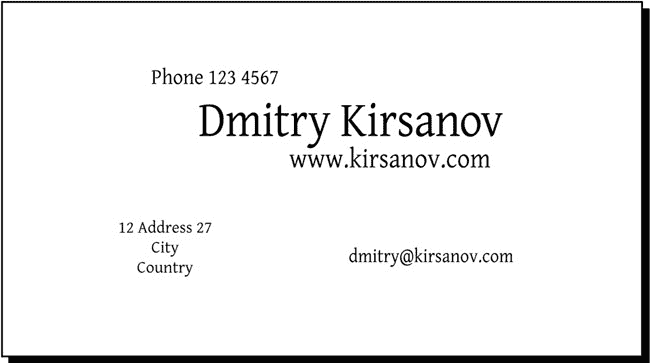

图 19-2. 字体和大小

* * *

^([7]) 可在 *[`sil.org/~gaultney/gentium`](http://sil.org/~gaultney/gentium)* 获取

# 19.2 设计 1：布局

为单个人设计名片（而不是创建一个用于具有不同名称的多个名片的模板）有一个重要的优点：您可以精确地定位和排列您的文本对象，而无需为可变长度的名称和地址留下额外空间。在这种情况下，我能够将所有地址部分紧密地推到名称旁边，创建了一个由其对齐方式紧密连接的不对称构图（地址与最后一个名字的开始对齐，电子邮件与名字的顶部对齐等）。

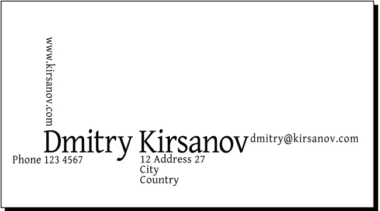

图 19-3. 布局文本

这已经看起来很有趣——但可能有点太矩形了。一个明显的尝试方法是选择所有 () 并稍微旋转一下（按 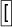 一次）。好多了！现在设计有了结构主义的风格——20 世纪 20 年代一个短暂但影响深远的运动，其支持者喜欢大胆的对比和倾斜的文本（尽管他们可能不会批准 Gentium 字体）。让我们发展这种风格；在边缘向构图插入三个黑色角落，并在构图的中心放置一个大红色圆圈，如图 图 19-4， 来更改字母间距，以及 -箭头来更改文本光标处的字距（**15.3.3 字距调整**）。一般来说，大文本对象使用更紧密的字母间距看起来更好，而小字体需要增加字母间距以提高可读性。

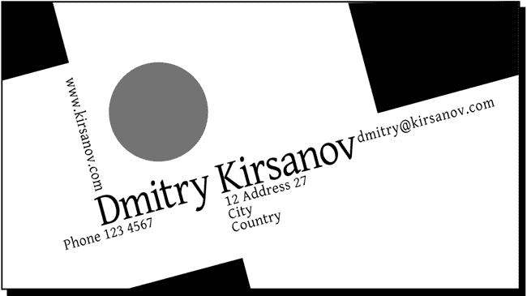

图 19-4. 旋转和添加形状

# 19.3 设计 2：图形

我们第一次名片尝试主要受到文本行布局的启发，图形元素只是作为支持和加强该布局的辅助。我们能否反过来，从一个图形元素开始，围绕它构建设计？

当然，如果你在做公司的名片，显然的起点是公司的标志。如果你只是为自己设计一张卡片，并希望它更加个性化，你可以尝试追踪你导入的照片（**18.8 追踪**）。最后，你也可以使用一些剪贴画，例如来自 *http://openclipart.org* （**1.3 Inkscape 艺术来源**），那里有许多装饰和抽象作品，可能成为你卡片的中心。

然而，对于我的第二个演示名片，我选择了另一种方法：艺术首字母。我切换到书法笔，将**角度**设置为 90 度，将**固定**设置为 100，并画了几对交织的字母。在我最终将字母形状调整得差不多之后，结果略显有趣，但远非激动人心。然后我尝试通过创建路径对象的联合，然后多次简化、嵌入和外凸来改进它：

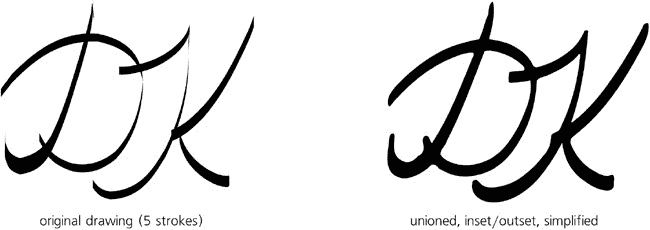

图 19-5. 创建首字母

现在字母看起来更自然了——但它们还可以变得更加有趣。现代设计的通用规则似乎是这样的：不要太过整洁！如果你能以创造性的方式弄脏、扭曲或损坏你的艺术作品，那就去做吧。所以我选择了一支稍微窄一点的笔尖，将**震颤**设置为 100，并用我的平板电脑笔在字母周围疯狂地舞动（尽管这也可以用鼠标来完成）。起初，结果可能看起来相当不吸引人，但这是因为我忘记了对它进行通常的简化/嵌入/外凸魔法：

图 19-6. 创造性地损坏字母形状

# 19.4 设计 2：布局

自然地，这样一件扭曲艺术作品值得放在卡片的中心位置，其余的东西对称地放置在其周围。我使用了一种普通、斜体、非常轻的无衬线字体（Helvetica Condensed Light），它不会分散中心艺术作品的注意力。水平布局可能在这里不是最好的——卡片看起来有点拥挤。将所有东西旋转到侧面（按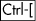）为艺术作品提供了充足的空间，并允许文本漂浮到边缘，这样就不会干扰：

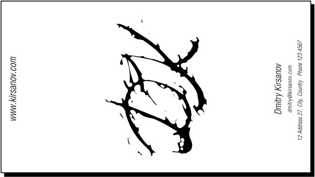

图 19-7. 在首字母周围布局卡片

# 19.5 设计 2：纹理和颜色

这里开始出现了一些东西，但它还远未准备好。卡片看起来太空，太平，对其中心不规则的墨迹太敌对。我们能做些什么吗？让我们尝试添加一些背景渐变。正如在**10.7 渐变技巧和示例**中解释的那样，从某种颜色（例如蓝色）的不透明度 1 到不透明度 0 的默认渐变看起来粗糙且不自然，即使它使用非常浅的颜色，其边界仍然清晰可见。为了改善白色背景上渐变的外观，将渐变的透明端涂成白色，而不是与另一端相同的颜色。

在这里，我在卡片的边缘添加了四个带有不规则斜向蓝绿色的渐变矩形，以实现自然卷曲、柔和融合的不对称外观。虚线是带有渐变的四个矩形的边界框，渐变线显示了每个渐变的范围和方向。我将首字母涂成深蓝色，并为字母添加了一个模糊的、50%不透明的阴影（**滤镜** ▸ **阴影和发光** ▸ **阴影**）。

图 19-8. 添加渐变和阴影

能否进一步改进？给卡片添加纹理的一个好方法是通过叠加半透明的线条网格。在整个卡片上画一个矩形，打开**填充和描边**(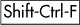)，将填充切换到图案，并选择**条纹 1:1 白色**库存图案。现在，使用节点工具中的图案调整手柄(**10.8.1 创建图案**)，根据喜好旋转条纹并缩小它们。最后，将矩形移动到渐变和首字母上方，但在文本的 z 轴顺序之下，并将其不透明度降低到 20%。

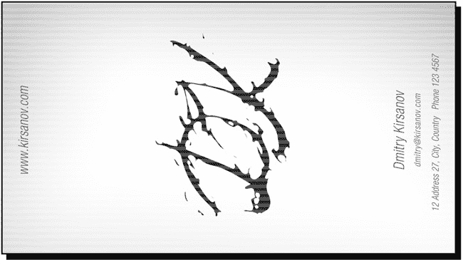

图 19-9. 添加条纹纹理：卡片已准备就绪。

# 19.6 导出和打印

我们现在有两个相当不错的名片设计——但我们实际上如何将它们打印出来？最佳的行动方案取决于设计的性质，你必须了解 Inkscape 的当前限制和各种输出格式的功能（附录 B），以确定最佳方法。

## 19.6.1 PostScript

第一个（“建构主义”）的设计没有任何透明度或渐变；它是一系列完全不透明的形状。这意味着它可以无损地保存为 PostScript 或 EPS，大多数印刷服务提供商都会接受。为了安全起见，使用 Ghostscript 预览你的 PS 或 EPS 输出文件^([8])。或者，你可以通过**文件** ▸ **打印**命令直接将此类文件打印到本地打印机设备，该命令将文档的 PostScript 版本发送到打印机。

## 19.6.2 PDF

对于更复杂的设计，最佳输出格式是 PDF（**B.3 PDF (导入/导出)")**）。如今，几乎所有印刷服务提供商都接受 PDF，通常优先于 PostScript。PDF 是一种更强大的格式，并且 Inkscape 对其支持更好；使用它，你不必担心渐变或透明度。如果你在 PDF 导出选项对话框中启用此选项，带有阴影的初始字母等过滤对象在导出为 PDF 时将自动转换为位图。

通常，为打印准备你的设计最安全的策略是将必须的矢量元素与可以渲染为位图的元素分开。例如，文本（尤其是使用小号字体）、标志和清晰的背景形状必须保持矢量；避免对它们使用过滤器，但将它们分离到前景层，并将所有文本转换为路径，这样它们就不依赖于字体。其他任何东西（带有或不带有透明度的背景形状、过滤对象、导入的位图等）都可以通过**制作位图副本**：在**Inkscape 首选项**（**位图**页面）中设置所需的分辨率，选择要转换为位图的全部对象，然后按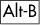，之后你可以删除或隐藏矢量原始文件。因此，一个“导出硬化”的文件——有最大可能被导出为 PDF、导入到其他程序或打印而不损失质量——通常只有两层：一层是作为单个大位图渲染的类似位图的艺术作品，另一层是所有类似矢量艺术作品都在路径中。

## 19.6.3 位图输出

作为最后的手段，如果 PDF 也不行，你总是可以将整个设计导出为位图。Inkscape 只能导出为 PNG，但任何数量的其他程序，从昂贵的 Photoshop 到免费的 GIMP 或命令行 ImageMagick，都可以将 PNG 转换为其他位图格式，如旧的（但仍在印刷界流行）TIFF。

## 19.6.4 使用设备颜色

然而，通常您需要发送给打印服务提供商的不仅仅是忠实再现您设计在屏幕上外观的 PDF 或 TIFF 文件。相反，您需要您的输出使用特定设备的 CMYK 或专色。虽然对使用色彩管理的显示有一些有限的支持，但您无法将任何内容导出为任何输出格式，除了 sRGB 屏幕色彩空间。直到这个区域得到改善，您将需要使用其他软件来纠正这个问题。

我已经成功地将 Inkscape 生成的 SVG 或 PDF 文件导入到 Adobe Illustrator 中，以便为某些对象设置专色，之后我将文件重新保存为 PDF 格式。使用位图输出，仅使用开源工具就可以创建特定设备的 CMYK 文件；首先，将 Inkscape 导出的 PNG 转换为常规 RGB TIFF，然后使用来自 LittleCMS 库的 tifficc 命令行工具将其转换为 CMYK。您需要目标输出设备的 ICC 配置文件来完成此转换。

## 19.6.5 平铺输出

如果您在办公室或家用打印机上打印卡片，您很可能会使用 A4 或 Letter 纸张格式而不是名片格式。在这种情况下，每张纸打印多份然后裁剪成单独的卡片是有意义的。为了准备可打印的文件，将您的卡片中的所有对象分组，然后使用 **创建平铺克隆** 对话框创建一个 2×5 的克隆网格，该网格将正好适合您的可打印页面。

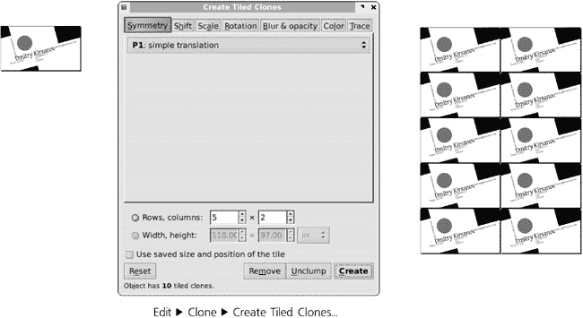

图 19-10. 平铺卡片以填充输出页面

* * *

^([8]) *[`ghostscript.com`](http://ghostscript.com)*

^([9]) *[`littlecms.com`](http://littlecms.com)*
