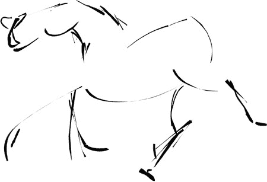
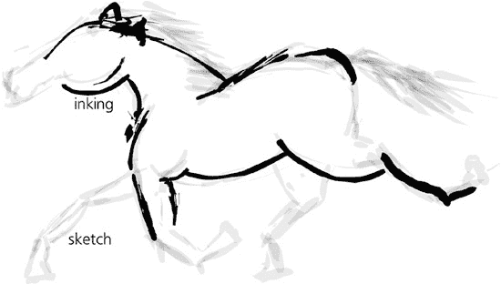
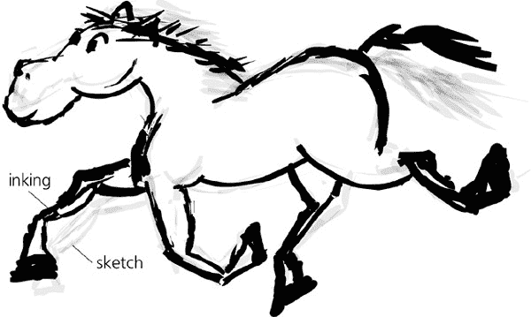
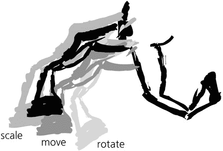
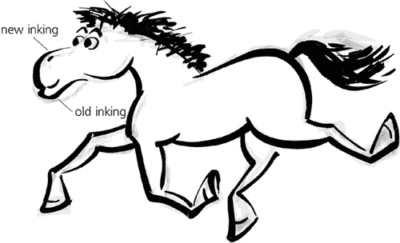
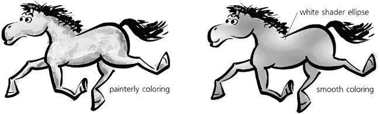
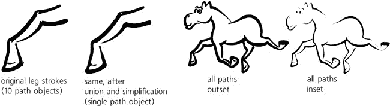
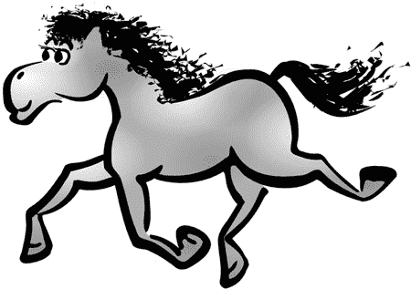
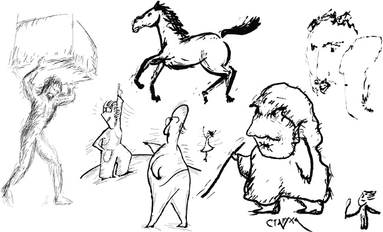

# 第二十二章. 教程：艺术绘画

在矢量编辑器中，Inkscape 是最好的草图和自由手绘选择之一，这得益于其功能强大的书法笔工具（**14.3 书法笔工具**）。与其它矢量工具相比，书法笔不仅几何上不完美（且无聊），而且具有个性——并且它产生的是始终可编辑的矢量对象。

在这个教程中，我们将通过在 Inkscape 中创建一个简单的绘图过程来了解——让我们尝试绘制一个有趣的卡通奔跑的马，这可能是一个吉祥物或漫画角色。我一直觉得从零开始绘制任何东西都是一项挑战（并且我想许多读者会表示同情）。然而，有了 Inkscape，我能够制作出我真正喜欢的画作。

# 22.1 第一幅草图

让我们从切换到书法笔工具并设置工具控制栏中的**宽度**为 0.05 和**细度**为 0.2 开始（**14.3 书法笔工具**）。如果你有绘图板，请启用笔压以改变笔触宽度（**14.3.1.1 压力感应**）。**角度**和**固定**参数仅对书法有意义，对自由手绘没有意义，因此我们将**固定**设置为 0，这实际上将固定角度的笔转换成了一个没有方向的圆形画笔（**14.3.2 角度**）。

我以前从未画过马，我的前几笔就明显地暴露了这一点。以这样的开始，我想很多人都会像我一样，当时就想放弃。但耐心和努力会得到回报，尤其是在 Inkscape 中。只需不断地在画布上画笔触，撤销，调整，然后再画。迟早，一些不那么糟糕的东西会从混乱的线条中闪现出来。

图 22-1. 第一笔

对于大多数人来说，绘制物体需要视觉辅助；你可能发现自己很难独立想象一匹马的体态曲线或腿部的弯曲方向。我发现真实马匹的照片对我帮助不大。更有启发性的是风格化的**绘画**，其中其他更有能力的艺术家已经完成了抽象和放大核心骑马视觉特征的工作。通过谷歌图片搜索，你可以找到大量的参考资料。经过多次草图绘制、撤销和强调（通过增加笔压），我得到了这张草图：

图 22-2. 第一幅草图

# 22.2 着色

漫画或卡通艺术家的工作流程包括两个主要阶段：*草图*（通常用铅笔）和*墨迹*（用笔）在草图上。你可以在 Inkscape 中遵循同样的过程。现在绘图看起来或多或少像一匹马，是时候开始在其上墨迹以进一步发展它了。这样，你可以看到原始草图中的优点，并尝试在此基础上构建，而不用担心因为过多的调整而破坏它。选择所有线条（）并将它们的透明度设置为 0.05，这样它们就几乎看不见了；这有效地隐藏了细线条，使得集中精力在粗线条上更容易。然后，锁定这一层（使用状态栏中的锁定切换按钮），创建一个新的层（**图层** ▸ **添加图层**），并再次绘制同一匹马，使用草图作为指南：

图 22-3. 在新层上绘制草图

这是不是同一匹马？并不完全一样。第一幅草图中的马试图看起来像一匹真正的马——可能太真实了。记住，我们想要的是卡通，而不是现实的东西。这通常是通过放大你的生物的头部（尤其是眼睛）和腿部（或手，或爪子）来实现的。在第一层墨迹中，让我们就这样做：保持身体不变，但放大蹄子和头部，添加一对超大的卡通眼睛：

图 22-4. 变得卡通化

# 22.3 调整

向量编辑器的独特优势在于所有线条都保持为独立对象。这使得调整绘图的部分变得容易，比如推动、缩放或旋转。使用选择工具，拖动腿部或头部以选择所有对象，并使用鼠标手柄或方便的键盘快捷键：来移动，或来缩放，或或来旋转。在错误的缩放或位置上产生一条好的线条，然后将其转换以适应，这相当容易。即使它已经看起来可以接受，玩弄你角色的肢体或面部特征也可以使其比你想的更富有表现力：

图 22-5. 调整绘图元素

与纸张不同，你不仅限于只有一个墨水层。任何时候，你都可以隐藏之前的草图层，淡化，锁定当前层以使其成为新的草图，并在其上方创建一个新的墨水层。通常，每次这样的过渡，你的画作看起来会越来越不像铅笔草图，而更像是一幅真正的墨水画，线条更平滑，细节更丰富。这是我基于之前的草图层的第三次墨水尝试（头部特别难雕刻——我的马最初看起来更像一只河马）：

图 22-6. 另一个墨水层

# 22.4 着色和平滑

现在轮廓几乎完成，是时候开始考虑给画作上色了。Inkscape 可以模仿许多不同的着色风格。例如，你可以通过叠加许多随机的书法笔触并使用不同的颜色和透明度（你可以使用调整工具来完成，**8.7.1 颜色绘制**)来模仿一幅画。让我们尝试一种更传统的、平滑的着色，由平色填充和一些光影（白色和黑色的椭圆以及椭圆透明度渐变，**10.1.2 椭圆渐变**)组成。使用油漆桶工具（**14.4 油漆桶工具**)创建内部形状；你可以给它应用一点模糊（大约 2%）以增加平滑度（图 22-7）。

图 22-7. 着色选项

让我们回到我们的轮廓图（现在先隐藏着色层）。如果你选择图形的一部分的所有线条（例如一条腿或头部），将它们合并（)，并通过按几次来简化结果，它可以变得更加平滑和吸引人。这将使尖锐的角变得柔和，并焊接接缝，使外观更加自然和完整。另一个非常实用的技巧是通过外扩（)使所有线条变粗，或者通过内缩（, **12.4 外扩**)使线条变细。路径上的多次内缩和外扩会产生类似于简化的效果。过多的内缩可能会导致某些线条部分完全消失，但这并不一定不好——相信整体印象和你的艺术感。当然，节点工具（**12.5 节点工具**)也可以用于手动编辑线条。

图 22-8. 焊接和熔化

# 22.5 绘制头发

对于许多初学艺术家来说，绘制看起来逼真的头发尤其困难。在规律性和混乱、整洁与杂乱之间找到合适的平衡，对于你角色的印象至关重要。在这个阶段，我的马的尾巴和鬃毛并不令人印象深刻——我反复地画了很多次，但所有的尝试看起来要么太粗糙，要么太浓密（或者两者兼而有之）。我最终通过在书法笔中使用高值**颤动**（**14.3.4 颤动、摆动和密度**）来制作出令人满意的波浪状头发，如图图 22-9 所示。最大化这个参数使得书法笔的笔触变得很斑驳，比我能手动制作的更加均匀。

图 22-9. 绘制头发

# 22.6 完成绘制

最后一步是尝试缩放、旋转和倾斜整个绘制——这有时可以在不费太多功夫的情况下显著改善效果。总的来说，结果比我预期的要好得多，我非常确信我绝对无法通过在纸上绘画达到这种质量水平。当然，这并不是在 Inkscape 中可以做的唯一绘图风格；尝试找到最适合你的技术。我特别喜欢使用高**颤动**值的书法笔，它几乎提供了“自然媒介”的绘图工具。

图 22-10. 其他自由手绘示例

### 注意

*虽然电脑绘图的最佳设备是绘图板（**14.3.1.1 压力感应**），但*仅使用鼠标也可以做出不错的 Inkscape 绘制。用鼠标操作的手不能在任何方向上快速或自然地移动；水平线条通常比垂直线条容易，比斜线更容易。因此，你可能需要画几条水平的线条，然后根据需要旋转它们，甚至旋转整个绘制，以便你正在工作的部分更容易绘制。*
