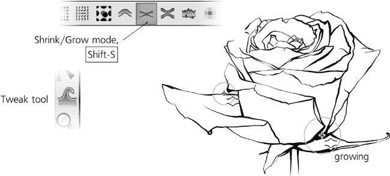
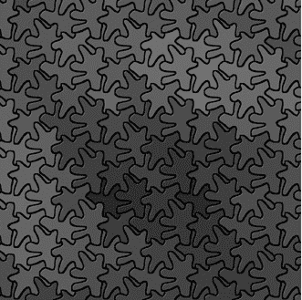
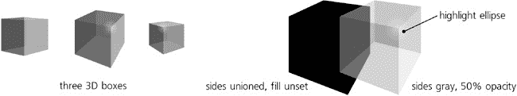
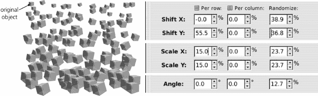
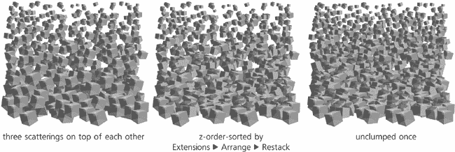
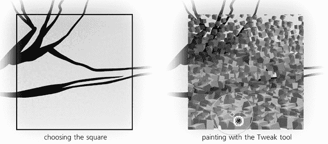
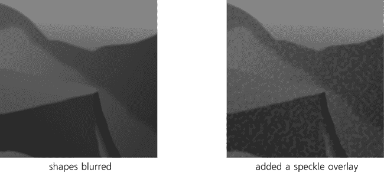
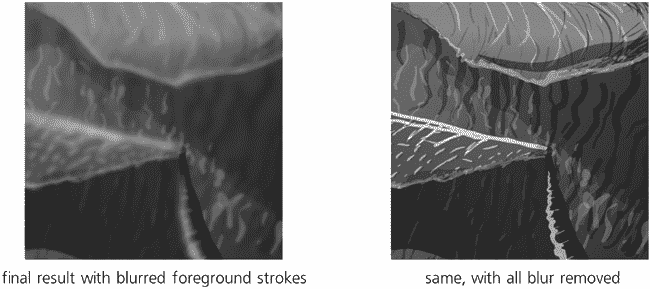
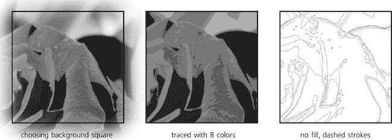

# 第二十四章。教程：玫瑰

这张复杂图像（见封面）是为了展示 Inkscape 的强大功能和多功能性。一朵玫瑰的单独绘制在每个五平方窗口中以及背景中以不同的方式呈现。因此，一个展示创建此图像所有阶段的教程相当于至少六个不同的教程，教你六种不同的方法绘制玫瑰——或者任何其他东西。

我们将从一张照片开始。当然，您不必这样做；如果您比我画得更好，您可以直接在空白画布上绘制任何您喜欢的图案。然而，追踪照片本身是一种有用的技术。

**文件** ▸ **导入** () 照片，按方便的比例和位置调整。将图像所在的图层重命名为`背景`，创建一个新的图层`墨迹`；我们需要经常隐藏和显示照片，当它在自己的图层中时这样做会更容易。降低照片的不透明度并锁定其图层，这样你就不会意外地移动它。之后，只需开始追踪照片的轮廓和颜色之间的边界(图 24-1)。

图 24-1. 导入图像并使用书法笔设置追踪

用于追踪图像的工具取决于图像的性质和您想要得到的结果。如果您正在追踪可以用直线和 Bézier 线段轻松表示的几何形状，请使用钢笔工具。如果您需要更多自由形式和艺术形状，同时尽量减少路径和节点的数量，铅笔工具是更好的选择。最后，如果您追求的是特别有表现力，甚至可能是“杂乱无章”的风格，请使用书法笔。我想我的绘画简洁但富有艺术性和自然，我没有理由在节点数量上节省，所以我使用了书法笔：

图 24-2. 追踪完成：墨迹中的 106 个路径对象

我使用了一支压力感应笔，它允许我根据笔的压力大小调整笔触宽度。然而，您只需使用普通鼠标就可以达到类似的效果。为什么？因为用笔的压力控制笔触厚度，虽然在理论上很容易，但很少在第一次尝试时就完全符合预期。一个更有效的方法是使用书法笔在有限范围内绘制宽度，然后使用调整工具的收缩/膨胀模式(**12.6.4 收缩/膨胀模式**)在适当的位置加粗或变细您的笔触：

图 24-3. 使用调整工具调整绘图

黑白轮廓已经准备好了——现在我们需要给它添加颜色。有了清晰的墨水轮廓，尝试一种更柔和的着色方法是有意义的。首先，隐藏`背景`层。然后，创建一个新的层，`水彩`，并将其放在你的`墨水`层下方。之后，用宽书法笔触，画几笔随意的笔触：在玫瑰下画红色，在茎和叶下画绿色，以及围绕这些区域的多种蓝色阴影。最后，通过足够大的半径模糊这些笔触，使它们开始融合在一起：

图 24-4. 添加模糊背景

这已经看起来不错了——但还不够好。平滑模糊的斑驳太平滑了——太无聊了。为了使它们看起来更自然，我尝试通过添加更多原始元素来扩展我已应用于背景的简单**高斯模糊**滤镜。首先，我添加了一个**扰动**原始元素，与模糊效果复合，以模仿纸张纹理。这看起来更好，但仍然太均匀，太明显是计算机生成的。然后，我又添加了一个具有更大周期的**扰动**组件，我使用了两次：一次是通过**位移图**，使整体水彩更加斑驳；然后，通过**合成**操作，调节小尺度纸张纹理，模仿更真实的纸张，其中一些区域更平滑，而其他区域则更粗糙和有颗粒感：

图 24-5. 建立背景的“现实主义水彩”滤镜

我称之为*Sandy Blur*的最终合成滤镜（更多内容请参阅**17.4.2 原始堆栈**），看起来更加逼真——尽管渲染速度慢得多。在这个阶段，我不得不切换到主要在轮廓(**3.11 渲染模式**)或无滤镜模式(**17.4.4 过滤区域**)下工作。

作为最终步骤（见封面以查看最终结果），根据个人喜好，你可以复制`墨水`层的内 容并模糊它以形成阴影，或者（像我一样）通过外扩（加粗）复制的墨水路径并使它们半透明来稍微软化墨水线条。

# 24.1 处理 1：雕刻

在完成`墨水`和`水彩`层之后，我继续创建了一系列其他绘图处理——同一基本主题的变体。我的目标是演示一张图像中的几个特征处理，所以我将玫瑰与五个随机散布的正方形重叠，并将每个处理限制在其自己的正方形内。

首先是一个类似雕刻的版本，由弯曲的变量宽度笔触网格组成。对于这种处理，我选择了一朵玫瑰的部位，那里的花瓣弯曲和阴影特别深且突出。雕刻是一门复杂的艺术；我并不声称我对它的模拟有多好——但令我惊讶的是，使用 Inkscape 的工具来做这件事竟然如此简单。

一旦你有一个轮廓图，并想将其转换为雕刻，第一步是规划：考虑在绘图的每个部分中引导雕刻线条的最佳和最自然的方式。创建一个新图层，并使用书法笔绘制几个宽间距的测试笔触，寻找捕捉每个区域变化曲率的最佳方式，同时保持不同曲率区域边界处的最佳方向对比：

图 24-6. 选择雕刻方框并进行测试笔触

一旦你对雕刻笔触的走向有了想法，就将测试笔触移开（但保留它们以供参考），并使用书法笔的引导跟踪功能（**14.3.7 跟踪引导路径**）将每个区域填充以均匀间隔的均匀宽度笔触，如图图 24-7 所示。如果你笔触的方向或曲率有些偏离，不用担心；你稍后可以修正它。在这个阶段，更重要的是间隔的均匀性。你可以临时旋转整个绘图，使其更适合绘制。尽量在你要填充的区域边缘之外绘制；修剪过长的线条比延长不足的线条要容易得多。

图 24-7. 使用书法笔创建均匀间隔的网格

其余的工作都在 Tweak 工具中完成——没有它，实际上，制作一个看起来不错的雕刻任务将是不可能的。使用 Shrink 模式来修剪线条末端并使其变细，使用 Grow 模式来使其变粗，使用 Push 模式来移动和弯曲整个网格（你必须选择网格的所有笔触才能一次性影响它们）。不要担心修剪后的线条末端看起来不美观——在最终结果中，它们将被`ink`层的宽边界线条所覆盖：

图 24-8. 使用 Tweak 工具完成雕刻

在实际的物理雕刻中，你通常切割掉要呈现白色的区域，而不是直接绘制要呈现黑色的区域。这就是为什么示例看起来不像真正的雕刻那么真实的原因之一。

# 24.2 处理方法 2：镶嵌

这种处理方法比其他方法更容易，因为它主要是自动的。唯一棘手的部分是创建镶嵌本身——即一种复杂的互锁瓷砖图案，它覆盖整个平面而没有孔或重叠。

画一个形状——任何形状！——然后从它创建一个瓷砖克隆的图案（**编辑** ▸ **克隆** ▸ **创建瓷砖克隆**，**16.6 瓦片克隆**）和任何非平凡对称群；在这个例子中我使用了 P3。一开始，克隆不会形成任何类型的镶嵌；你的任务是重新塑造源形状——克隆已经就位——直到克隆相遇并平滑地互锁。这比看起来容易得多；克隆立即反映源形状的任何变化的事实使得它几乎微不足道。只需添加节点并将它们移动以在形状中生长出附属物。每个克隆都会生长出类似的附属物。只需简单地调整它们，直到形状完全相遇并覆盖平面：

图 24-9. 创建镶嵌

接下来，我们希望图案反映背景的颜色——这样玫瑰图案就能显示出来。一旦设置好，这个过程就主要是自动的。确保**使用瓷砖的保存大小和位置**复选框已勾选，删除现有的镶嵌（**删除**按钮），并设置**宽度**和**高度**，使图案覆盖所有需要覆盖的区域。取消设置原始形状的填充颜色（在状态栏中右键单击**填充**色块并选择**取消设置**）。然后，转到**追踪**选项卡，启用**追踪瓷砖下的绘图**，选择**颜色**，并将所选值应用到克隆的**颜色**上：

图 24-10. 使用镶嵌进行彩色追踪

最后一步是使用过滤器添加轻微的磨砂高光到瓷砖上（第十七章）组合起来，并从**过滤器** ▸ **斜面**应用到组上，如图 图 24-11 所示。

图 24-11. 添加高光

# 24.3 处理方法 3：立方体场

这种处理方法与颜色追踪镶嵌类似，因为它也是通过**创建平铺克隆**对话框创建的。然而，在大多数其他方面它有所不同：它是随机的而不是规则的，是伪 3D 而不是平面的，并且使用三个不同的原始对象——因此有三个交织的图案——而不是一个。

让我们先使用 3D 盒子工具绘制这三个原始对象。将每个对象转换为路径组()并复制()。在盒子的底部副本中，将其作为组输入，选择所有六个面并将它们合并()，然后取消组合。这会将一个盒子转换成一个单一的盒子形状路径；取消其填充——在克隆中，这个将取背景色的颜色。对于盒子的第二个副本，使用 50%的不透明度和白色或黑色；这将提供阴影，使得每个盒子即使在改变整体颜色的情况下也能看起来像一个盒子。最后，将背景形状和阴影组合成一个单独的组。

图 24-12. 立方体散布的原始对象

现在，对于每个准备好的立方体，在**创建平铺克隆**对话框中使用颜色到颜色的追踪，在该区域创建一个 P1 对称散布(**16.6.6 追踪**)。随机化它们的旋转（轻微，以免破坏所有盒子处于共同视角的感知），大小和位置。为了模仿 3D 场的效果，设置缩放和行间距从上到下增加（即每行），如图图 24-13 所示。

图 24-13. 散布的立方体

现在，对另外两个我们准备的立方体重复此过程，覆盖相同的区域。这个立方体组合场看起来还不像是一个**场**，因为 z 排序是错误的：靠近底部且较大的立方体应该离我们更近，因此应该在其他立方体之上，但它们并不是。为了解决这个问题，使用**重排**扩展（从**扩展** ▸ **排列**）重新排列盒子的 z 排序，以便它们从上到下堆叠。然后，从**对齐和分布**对话框执行单个**分散**操作，以便在立方体的排列中有更少的间隙。

图 24-14. Z 排序和分散立方体

记住，我们的最终目标是追踪玫瑰背景层的正方形区域。选择你想要追踪的区域，将所有立方体分组，并将组剪切（**18.4 剪切和蒙版**)到所选的正方形。现在，你可能已经或没有为所有三种图案启用自动颜色到颜色的背景追踪（正如我们在 **16.6.6 追踪** 中所做的那样）；然而，即使你做了，从那里得到的颜色可能相当单调。这是不可避免的，因为盒子相对较大，从大面积采样颜色，平均它，因此使其不如原始背景图像饱和。

因此，看起来我们需要手动绘画立方体。只需选择所有立方体克隆，选择调整工具的着色模式（**8.7 颜色调整**），选择鲜艳的红色（或使用吸管从背景图像中选取，**8.6 吸管工具**)，并在图像的红色区域上绘画。然后，对其他颜色做同样的事情，包括黑色墨水线条。（如果不起作用，这意味着你忘记了在每个立方体的底部路径中取消填充，参见 图 24-12）。这种平滑、类似位图的绘画方式是编辑矢量绘图的一种有趣方式！

图 24-15. 在立方体上绘画颜色

# 24.4 处理方法 4：逼真渲染

这种渲染方式是最耗时的：我们希望在这个绘图部分尽可能忠实地重新创建原始照片。当然，绝对的真实感既不可能也不可取，但我们可以尝试达到具有独特吸引力的“矢量逼真”外观。关键在于正确使用形状、渐变和模糊。

在定位我们将要工作的正方形之后，显示包含源照片的图层。然后，首先将你的绘图分为区域，每个区域由单色或单一渐变近似。使用铅笔工具（**14.2 铅笔工具**)来创建这些区域，使用渐变工具（**10.1 渐变工具**)在它们上绘画和拉伸渐变。使用吸管工具（**8.6 吸管工具**)从照片图层中选取精确的颜色。总的来说，尝试减少明暗区域之间的对比度，因为照片通常比人类感知更强调这种对比度。

图 24-16. 使用渐变路径近似图像区域

为了软化边缘，使用**填充和描边**对话框对形状进行一点模糊处理（不超过 2%）。为了添加一些自然纹理，在形状上绘制一个 40%灰色、10%不透明的矩形，并对其应用**滤镜** ▸ **叠加** ▸ **斑驳**；在**滤镜编辑器**对话框中，增加随机纹理的频率（**扰动**中的**基本频率**）。即使只使用这些简单的滤镜，绘图也开始呈现出轻微的摄影效果。

图 24-17. 模糊和纹理化背景

然而，我们的工作还远未完成。我们创建的只是一个粗糙的背景图层，精细的细节将叠加其上，以重现玫瑰花瓣的特征皱纹和纹理。你现在的主要工具将是具有相对较小**宽度**、零**固定**和一定**颤动**效果的钢笔工具(**14.3 钢笔工具**)。通常，你会用半透明的黑色或白色进行阴影和亮部的绘制，相应地；你也可以尝试使用饱和度较低的互补色版本（例如，浅绿色用于红色背景），这通常会产生更“自然”的效果。

当然，这些层叠的半透明笔触也需要进行模糊处理。然而，不要单独对每一笔进行模糊处理；这样做会很繁琐（与不透明度不同，模糊效果不会保留在工具的样式设置中，因此不会自动应用于下一个创建的对象）并且渲染速度会变慢。相反，先画出一笔，将其组合起来()，然后对组合进行模糊处理，接着进入该组合()。现在，你使用钢笔工具或任何其他工具创建的每个新对象都会被添加到模糊组中，因此会与它的兄弟对象一起模糊。当你完成组合内的绘制后，使用离开组合。

图 24-18. 添加手绘前景笔触

特别注意你“照片”中物体的边缘——通过适当强调这些边缘的密集高光和阴影是绘制具有吸引力的绘画效果的要点。特别是，在亮部的边缘使用稍微强烈一些的高光，在阴影的边缘使用稍微强烈一些的阴影，通常是一个好主意。

# 24.5 处理方法 5：地图

这种最后的处理与其说是一个实际有用的技术示例，不如说是对非常直接的东西的一种创造性重新诠释。当我注意到，当我丢弃填充颜色并给最终形状分配虚线轮廓时，这个原始照片区域的八色 Potrace 追踪（**路径** ▸ **追踪位图**，**18.8.2 追踪位图对话框**)获得了有趣的地图般外观时，我只是在玩这个追踪：

图 24-19. 追踪源照片

剩下的工作就是创建一个带有黄色调、略微粗糙的（**过滤器** ▸ **ABCs** ▸ **粗糙化**），半透明的背景矩形（这样背景绘画可以稍微透出来），以模仿旧地图的表面，并添加一些神秘的文字标签来完善画面。

作为最后的修饰，我在包含各种处理的五个正方形上添加了点状边框。最终的图像就在这本书的封面上。
