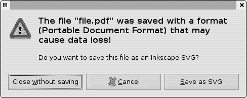
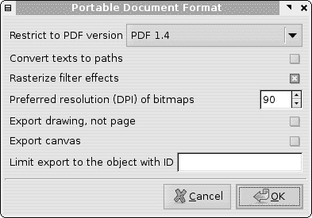
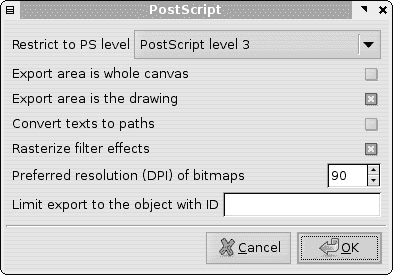

# 附录 B. 导入和导出

本附录是关于 Inkscape 支持的各个主要导入和导出格式的功能、限制和先决条件的笔记集合。

### 注意

*对于导入某些格式，Inkscape 使用外部软件组件，如果你想要使用此格式，则需要下载并安装这些软件。一般来说，如果你没有安装此外部软件（或者它不在*PATH*中），Inkscape 将简单地从**打开**或**导入**对话框中支持的格式列表中省略此格式。*

# B.1 保存与导出

虽然这主要是一个术语约定，但 Inkscape 仅在**导出位图**对话框中使用“导出”（**18.9.1 导出位图对话框**）中，而支持的矢量格式，包括默认的 Inkscape SVG 格式，都在**保存**、**另存为**和**保存副本**对话框中的**另存为类型**列表中列出。由于除 Inkscape SVG 之外的所有矢量格式都会丢失一些可编辑功能，甚至丢弃某些对象类别，因此以这种格式保存并尝试关闭文档将显示警告，如图 B-1 所示。



图 B-1. 数据格式警告：你正在尝试关闭一个非 SVG 文档。

如果你保存了非 SVG 文件后进行了任何更改，你可能需要再次**另存为**原始 SVG 文件。为了避免这种烦恼，请使用**保存副本**命令（），该命令将文档以你指定的格式和文件名保存副本。该文档仍然被认为是 Inkscape SVG，如果它在最后一次 SVG 保存后没有更改，则在关闭时不会显示警告。

# B.2 SVG 变体

Inkscape 使用的首选矢量格式称为*Inkscape SVG*；如**1.4 SVG 简史**中所述，它是一种（几乎）符合标准的 SVG 格式，包含一些仅影响 Inkscape 中各种对象类型可编辑性的 Inkscape 特定扩展，但不会改变它们的外观。除非你试图实现文件大小的适度增加或遇到一些与 Inkscape SVG 存在问题的有缺陷的软件，否则将其保存为*纯 SVG*没有太多意义。两种 SVG 版本都有*压缩*版本（使用*.svgz*文件扩展名），这些版本生成的文件更小，但在其他方面相同，并且应该被大多数 SVG 软件理解。

从 Adobe Illustrator 导出的 SVG 文件可以像通常一样在 Inkscape 中打开。然而，这些文件通常包含大量的 AI 特定内容，对于 Inkscape 来说是无用的，并且只会增加 SVG 文件的大小。建议使用扩展名 *.ai.svg* 而不是简单的 *.svg* 来保存从 AI 导出的 SVG 文件。当你用 Inkscape 打开这样的 *.ai.svg* 文件时，它会通过一个特殊的过滤器，该过滤器会移除 AI 特定的二进制块，并将 AI 图层转换为 Inkscape 图层。

# B.3 PDF（导入、导出）

在 SVG 之后，PDF 是最强大、Inkscape 支持最好的，并且是最广泛认可的矢量格式（**1.5.1.1 Adobe 的矢量格式**）。由于字体支持的限制（见下一节），Inkscape 目前还不能推荐用于往返 PDF 编辑（即打开 PDF，编辑其内容，然后保存为 PDF），但 PDF 无疑是连接 Inkscape 与不支持 SVG 的软件的最佳选择。

Inkscape 的 *PDF 导入* 是内置的（不需要安装外部软件）并且支持最新版本的 PDF 的大多数静态功能（形状、文本、图像、渐变、不透明度等）。交互式 PDF 功能（如表单）不受支持。由于 Inkscape 无法在一个文档中包含多个页面，因此你需要指定从 PDF 文件中导入的单个页面。这个选择是当你尝试导入或打开 PDF 文件时看到的“PDF 导入设置”对话框的主要目的（图 B-2）。


图 B-2. PDF 导入选项

在对话框中，你可以浏览 PDF 文档的页面，并根据预览图像（右侧面板）选择所需的页面，该图像显示了左上角计数器中选定的页面。

此外，你可以选择性地将导入的艺术作品裁剪到 PDF 中可能定义的各种框中；例如，裁剪到媒体框（即页面大小）会隐藏 PDF 可能包含在页面区域外的任何对象（大多数 PDF 查看器根本不会显示它们，但 Inkscape 允许你发现它们）。

## B.3.1 PDF 文本

当前 PDF 导入支持的最大的限制是其对字体的处理。大多数 PDF 文件都包含了嵌入的字体，Inkscape 无法使用这些嵌入的字体，也无法在导入时将文本转换为路径（在“PDF 导入设置”对话框中的“文本处理”选项只有一项，即“导入文本为文本”）。实际上，这意味着只有当导入的 PDF 文件中使用的字体安装在你的系统上时，文本才会看起来正确；否则，将使用默认字体，这不仅外观不同，而且在大多数情况下，会严重破坏文本列的间距和对齐。

另一个复杂的问题是，大多数 PDF 使用它们的*PostScript 名称*来引用它们使用的字体，这些名称与操作系统显示的字体名称略有不同。例如，PDF 可能引用一个名为`AlbertusMT-Light`的字体，而 Inkscape 列表中的相同字体被称为`Albertus MT Lt`。Inkscape 会尽力将 PostScript 名称转换为常规名称，但它只能为已安装的字体这样做，而且有时会失败并选择错误的已安装字体。

### 注意

*无论字体名称转换是否成功，您都可以通过查看 XML 编辑器（**4.7 XML 编辑器**）中任何文本对象的* `style` *属性来查找导入的 PDF 中字体对象的原始 PostScript 名称。您需要的属性是* `-inkscape-font-specification`*，例如：*

```
-inkscape-font-specification:AlbertusMT-Light
```

## B.3.2 PDF 导出

如前所述，Inkscape 没有针对矢量格式的单独“导出”命令；相反，您只需转到**文件** ▸ **保存**或**文件** ▸ **另存为**，然后在**保存类型**列表中选择 PDF 格式。在输入文件名并点击**确定**后，您将看到一个用于设置 PDF 导出选项的对话框：



图 B-3. PDF 导出选项

您可以导出的 PDF 版本限制为 1.4。至于字体，Inkscape 的导出比其导入更智能：在您的 SVG 文档中使用的任何字体都将作为子集（即，仅包含文档中实际使用的字符）嵌入到它产生的 PDF 中。此外，您还有选择在导出时将所有文本对象转换为路径的选项，在这种情况下，甚至 Inkscape 本身也能导入 PDF，保留文本对象的外观。

过滤器（第十七章**）的对象将被导出，而其他所有对象将被忽略。例如，在一个包含多个标志的文件中，您可以使用此选项将每个标志导出到自己的 PDF 文件中；请确保还启用 **导出绘图，而不是页面**，在这种情况下，“绘图”被解释为“那些将被导出的对象”。

### 注意

*Inkscape 导入 PDF 使用 Poppler 库* ([`poppler.freedesktop.org`](http://poppler.freedesktop.org))。*导出 PDF 以及 PS 和 EPS 格式时，它使用 Cairo 库* ([`cairographics.org`](http://cairographics.org))。*这些库正在积极开发中，Inkscape 的未来版本很可能会通过包括这些库的新版本来提高 PDF 支持。*

# B.4 PostScript 和 EPS（导入、导出）

曾经，PostScript 是矢量数据的交换格式。然而，现在它已经很大程度上让位给了 PDF，PDF 支持了 PostScript 的所有实用功能，同时更加丰富（最重要的是，它支持透明度）并且在软件中更容易支持。因此，每次你有选择的时候，请使用 PDF 而不是 PostScript；然而，许多旧项目和剪贴画是以 PostScript 文件的形式存在的，并且仍然存在大量过时的软件，这些软件要么根本不支持 PDF，要么在尽力理解 PostScript 的同时支持得不好。

### 注意

*EPS 是带有一些额外限制的 PostScript，这使得它更适合导入和插入到其他文档中。EPS 文件始终是单页，始终包含所有字体和位图图像（常规 PS 文件没有嵌入内容的义务，尽管嵌入是首选的）并且其页面大小始终精确地裁剪到其内容中。*

Inkscape 支持原生 PS 和 EPS 导出。对话框中的选项与 PDF 导出对话框非常相似：



图 B-4. PS 或 EPS 导出选项

您可以选择 PostScript 的级别（即版本）；大多数现代软件和打印机支持 Level 3。字体始终嵌入到 PS 或 EPS 导出中（除非您选择将它们转换为路径），并且过滤器可以像在 PDF 导出中一样可选地光栅化。不透明度为零的对象也会自动光栅化（您无法抑制它），因为与 PDF 不同，PostScript 不支持矢量透明度。

对于 PS 和 EPS 导入，您必须安装额外的软件，即 Ghostscript 解释器，它将自动运行以将 PS 或 EPS 文件转换为 PDF 格式，然后将其提供给 Inkscape。您可以在*[`pages.cs.wisc.edu/~ghost`](http://pages.cs.wisc.edu/~ghost)*上找到适用于所有主要操作系统的版本。请确保 Ghostscript 的*gs*或（在 Windows 上）*gs.exe*可执行文件在您的`PATH`中；如果不是这样，Inkscape 甚至不会在**打开**或**导入**对话框中的文件格式列表中列出 PS 和 EPS。

由于从 Inkscape 的角度来看，PS/EPS 导入最终成为 PDF 导入，因此您将看到相同的 PDF 导入对话框（图 B-2**）。因此，Inkscape 将丢失 AI 特定的元数据（如图层），但至少您将获得矢量对象。

在复杂的 AI 文件中使用的功能之一是*梯度网格*（**1.5.4 . . . 和 Inkscape**）。Inkscape 可以导入它们，但由于 SVG 中没有类似的构造，它必须使用小平面色路径“瓦片”的网格来近似它们。在**PDF 导入设置**对话框中，您可以设置这种近似的精度；提高此参数将使导入的网格看起来更平滑，但代价是增加 SVG 文件的大小并减慢 Inkscape 的速度。

### 注意

*导入的梯度网格，以及它们的小彩色路径网格，是 Tweak 工具中移动、绘画和重塑的便利对象（**6.9 使用 Tweak 工具进行变换**、**8.7 颜色调整**、**12.6 路径调整**）。*

Inkscape 不支持 AI 导出，因为所有最新的 Adobe Illustrator 版本都可以无问题导入 SVG 和 PDF 文件。

# B.7 CorelDRAW（导入）

对于导入 CorelDRAW 矢量编辑器生成的矢量文件（**1.5.2 CorelDRAW**），Inkscape 可以使用基于 Python 的开源 UniConvertor 实用程序。在 Linux 上，只需从您的发行版仓库安装包*python-uniconvertor*，它将获取所有必要的依赖项。在 Windows 上，UniConvertor 的副本与 Inkscape 捆绑在一起，并使用 Inkscape 自己的 Python 副本，因此您不需要安装任何东西。有关更多信息和新版本的 UniConvertor，请访问*[`sk1project.org`](http://sk1project.org)*。

目前，UniConvertor 可以处理 CorelDRAW 文件的大部分方面，但文本对象除外。它支持的特定 Corel 格式包括：CDR（CorelDRAW 版本 7 到 X4）、CDT（CorelDRAW 模板文件）、CCX（CorelDRAW 压缩交换文件）和 CMX（CorelDRAW 演示交换文件）。

# B.8 EMF（导入/导出）、WMF 和 CGM（导入）

WMF (Windows 元文件) 和 EMF (增强元文件) 是 Windows 特定的矢量格式，由一些仅限 Windows 的软件（如 Microsoft Office）用于数据交换或存储矢量剪贴画。在这些格式中，EMF 更现代，通常更可取（如果可以选择的话）。Inkscape 在 Windows 上原生支持 EMF 的导入和导出（因为它使用操作系统对该格式的支持）。

如果您拥有 UniConvertor 工具，可以在任何平台上导入 WMF 以及另一种非微软矢量“元文件”格式 CGM，该工具可以将 WMF 或 CGM 直接转换为 SVG。

# B.9 XAML (导入/导出)

Inkscape 可以导入和导出 Microsoft 在其 .NET 和 Silverlight 技术中使用的 XAML (可扩展应用程序标记语言) 格式。无需额外的软件。

# B.10 WPG (导入)

WPG (WordPerfect Graphics) 是一种旧的矢量格式，曾由 WordPerfect 文本处理器使用。该格式下仍存在一些剪贴画集合，因此对于矢量艺术家来说非常有用。Inkscape 可以原生导入 WPG（无需外部软件）。

# B.11 DXF 和 HPGL (导出)

DXF (绘图交换格式) 是一种常用的 CAD (计算机辅助设计) 格式，用于在 AutoCAD 等软件中的计划和工程图纸。HPGL 是一种原始的矢量格式，由一些惠普绘图仪使用。Inkscape 对这些格式的导出有一些原生支持，仅限于路径和形状；导出的 DXF 或 HPGL 文件可以发送到绘图仪或乙烯基切割设备。

# B.12 JavaFX (导出)

JavaFX 是来自 Sun 的一种基于 Java 的新技术，旨在为移动和桌面系统构建交互式应用程序。Inkscape 对 JavaFX 的导出有一些原生支持（仅限于路径和形状）。

# B.13 ODG (导出)

OpenDocument Graphics (ODF) 是 OpenOffice 套件及其 OpenOffice Draw 应用程序等使用的格式。Inkscape 对 ODG 导出的原生支持有限，但仍然适用于与 OpenOffice 交换数据——截至本文撰写时，OpenOffice 仍然缺乏对 SVG 的适当支持。

# B.14 POV (导出)

POVRay (*[`povray.org`](http://povray.org)*) 是一种流行的开源 3D 光线追踪器，不是一个矢量应用程序。然而，Inkscape 可以将其绘图中的路径和形状导出为 3D 场景，然后由 POVRay 渲染；你可以手动编辑基于文本的 *.pov* 文件来调整角度、相机、照明等。

# B.15 LATEX (导出)

旧版且功能强大的 LATEX 文档格式系统的用户会发现，Inkscape 可以使用 PSTricks 包 (*[`tug.org/PSTricks`](http://tug.org/PSTricks)*) 直接将绘图输出到 LATEX 文档中，用于渲染图形。

# B.16 位图格式 (导入/导出)

如我们在 **18.9 位图导出** 中所见，Inkscape 可以导出的唯一位图格式是 PNG。然而，它内置了对更多位图格式的导入支持，包括所有主要格式（PNG、JPG、TIFF、GIF 等）。

# B.17 缺失了什么？

在最常请求但仍然未得到 Inkscape 支持的文件格式中，Flash (SWF) 和 Adobe Freehand 格式最为常见。为了与 Adobe Flash 或 Adobe Freehand 进行数据交换，您可以使用 SVG 或 PDF 格式，但直接支持这些重要的格式将更为理想。幸运的是，将新格式插入 Inkscape 非常简单；一旦有开源工具可以将已知格式（理想情况下是 SVG，但 PDF 也同样适用）转换为未知格式，将其集成到 Inkscape 中就变得容易了。
