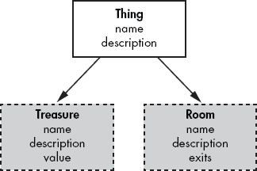
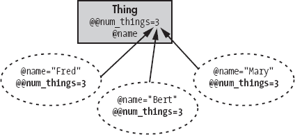

# 第二章：类层次结构、属性和类变量


我们在上一章结束时创建了两个新的类：一个名为 Thing 和一个名为 Treasure 的类。尽管这两个类有一些共同的特征（特别是它们都有“名称”这一特征），但它们之间并没有任何联系。

这两个类非常简单，这种微小的重复实际上并不重要。然而，当你开始编写一些复杂程度的真实程序时，你的类将经常包含许多变量和方法，你真的不希望一遍又一遍地重复编写相同的内容。

在创建一个类层次结构中，一个类可能是一个其他（祖先）类的“特殊类型”，在这种情况下，它将自动继承其祖先的特征是有意义的。例如，在我们的简单冒险游戏中，Treasure 是 Thing 的一个特殊类型，因此 Treasure 类应该继承 Thing 类的特征。

### 注意

在这本书中，我经常会提到子类从它们的父类继承特征。这些术语故意暗示了“相关”类之间的一种家族关系。在 Ruby 中，每个类只有一个父类。然而，它可能从一条漫长而显赫的家族树中衍生出来，拥有许多代父母、祖父母、曾祖父母等等。

事物的普遍行为将在 Thing 类中编码。Treasure 类将自动“继承” Thing 类的所有特征，因此我们不需要再次编写它们；然后它将添加一些针对 Treasure 的特定功能。

作为一般规则，在创建类层次结构时，具有最通用行为的类位于层次结构的较高位置，而具有更多专业行为的类位于较低位置。因此，只有一个名称和描述的 Thing 类将是具有名称、描述和额外价值（value）的 Treasure 类的祖先；Thing 类也可能是具有名称、描述和出口（exits）等特征的某些其他专业类（如 Room）的祖先。

一个父类，多个子类



此图显示了一个具有 *name* 和 *description*（在 Ruby 程序中，这些可能是内部变量，如 `@name` 和 `@description`，以及一些访问它们的方法）的 Thing 类。Treasure 和 Room 类都从 Thing 类派生出来，因此它们自动“继承”了 *name* 和 *description*。Treasure 类添加了一个新项目 *value*，因此现在它具有 *name*、*description* 和 *value*。Room 类添加了 *exits*——因此它具有 *name*、*description* 和 *exits*。

让我们看看如何在 Ruby 中创建一个子类。加载 *1adventure.rb* 程序。它从定义一个具有两个实例变量 `@name` 和 `@description` 的 Thing 类开始。

*1adventure.rb*

```
class Thing
    def initialize( aName, aDescription )
      @name         = aName
      @description  = aDescription
    end

    def get_name
        return @name
    end

    def set_name( aName )
        @name = aName
    end

    def get_description
        return @description
    end

    def set_description( aDescription )
        @description = aDescription
    end
end
```

当创建一个新的 Thing 对象时，`@name` 和 `@description` 变量在 `initialize` 方法中被赋值。实例变量通常不能（也不应该）从类本身之外直接访问，这是封装原则（如前一章所述）的结果。要获取每个变量的值，你需要一个 *get* 访问器方法，如 `get_name`；要分配新值，你需要一个 *set* 访问器方法，如 `set_name`。

# 超类和子类

现在看看 Treasure 类，它也在下面的程序中定义：

*1adventure.rb*

```
class Treasure < Thing
    def initialize( aName, aDescription, aValue )
        super( aName, aDescription )
        @value = aValue
    end

    def get_value
        return @value
    end

    def set_value( aValue )
        @value = aValue
    end
end
```

注意 Treasure 类是如何声明的：

```
class Treasure < Thing
```

左尖括号 (`<`) 表示 Treasure 是 Thing 的 *子类* 或后代，因此它继承了数据（变量）和行为（方法）。由于 `get_name`、`set_name`、`get_description` 和 `set_description` 这些方法已经在祖先类（Thing）中存在，因此这些方法不需要在后代类（Treasure）中重新编码。

Treasure 类有一项额外的数据，即它的价值 (`@value`)，我为它编写了 *get* 和 *set* 访问器。当创建一个新的 Treasure 对象时，它的 `initialize` 方法会自动被调用。Treasure 有三个变量需要初始化 (`@name`，`@description` 和 `@value`)，因此它的 `initialize` 方法接受三个参数。前两个参数使用 `super` 关键字传递给超类（Thing）的 `initialize` 方法，这样 Thing 类的 `initialize` 方法就可以处理它们：

```
super( aName, aDescription )
```

当在方法内部使用时，`super` 关键字调用与当前方法同名的祖先或*超*类中的方法。如果单独使用 `super` 关键字，没有指定任何参数，则将发送到当前方法的全部参数传递给祖先方法。如果在当前情况下，提供了一个特定的参数列表（这里为 `aName` 和 `aDescription`），则只有这些参数会被传递给祖先类的该方法。

# 向超类传递参数

在调用超类时括号很重要！如果参数列表为空且没有使用括号，*所有*参数都会传递给超类。但如果参数列表为空且使用了括号，则*不会*向超类传递任何参数：

*super_args.rb*

```
# This passes a, b, c to the superclass
def initialize( a, b, c, d, e, f )
   super( a, b, c )
end

# This passes a, b, c to the superclass
def initialize( a, b, c )
   super
end

# This passes no arguments to the superclass
def initialize( a, b, c)
   super()
end
```

### 注意

要更好地理解 `super` 的使用，请参阅 深入挖掘 中的 深入挖掘。

# 访问器方法

尽管在这个假想冒险游戏中的类工作得足够好，但由于所有那些 *get* 和 *set* 访问器，它们仍然相当冗长。让我们看看你能做些什么来解决这个问题。

而不是使用两个不同的方法，`get_description` 和 `set_description`，像这样访问 `@description` 实例变量的值：

```
puts( t1.get_description )
t1.set_description("Some description" )
```

这样检索和分配值会方便得多，就像从简单变量中检索和分配值一样，如下所示：

```
puts( t1.description )
t1.description = "Some description"
```

要能够这样做，你需要修改 Treasure 类的定义。实现这一目标的一种方法是将 `@description` 的访问器方法重写如下：

*accessors1.rb*

```
def description
    return @description
end

def description=( aDescription )
    @description = aDescription
end
```

我已经在 *accessors1.rb* 程序中添加了类似的访问器。在这里，*get* 访问器被命名为 `description`，而 *set* 访问器被命名为 `description=`（即，在对应 *get* 访问器使用的名称后附加一个等号）。现在可以像这样分配一个新的字符串：

```
t.description = "a bit faded and worn around the edges"
```

你可以这样检索值：

```
puts( t.description )
```

注意，当你以这种方式编写 *set* 访问器时，你必须将 `=` 字符附加到方法名上，而不仅仅是将其放在方法名和参数之间。换句话说，这是正确的：

```
def name=( aName )
```

但这会导致错误：

```
def name   =  ( aName )
```

# 属性读取器和写入器

事实上，有一种更简单、更短的方法可以同时创建一对 *get* 和 *set* 访问器。你只需要使用两个特殊方法，`attr_reader` 和 `attr_writer`，后面跟着一个 *symbol*（一个以冒号开头的名称）：

```
attr_reader :description
attr_writer :description
```

你应该像这样在你的类定义中添加此代码：

```
class Thing
   attr_reader :description
   attr_writer :description
    # maybe some more methods here...
end
```

使用符号调用 `attr_reader` 会创建一个 *get* 访问器（这里命名为 `description`），用于与符号匹配的实例变量（`@description`）。

类似地调用 `attr_writer` 会为实例变量创建一个 *set* 访问器。实例变量被认为是对象的“属性”，这就是为什么 `attr_reader` 和 `attr_writer` 方法被这样命名的原因。

什么是符号？

在 Ruby 中，一个 *symbol* 是一个以冒号开头的名称（例如，`:description`）。Symbol 类在 Ruby 类库中定义，用于在 Ruby 解释器内部表示名称。当你将一个或多个符号作为参数传递给 `attr_reader`（这是 Module 类的一个方法）时，Ruby 会创建一个实例变量和一个 *get* 访问器方法。这个访问器方法返回相应变量的值；实例变量和访问器方法都将采用符号指定的名称。符号将在 第十一章 中详细讨论。

*accessors2.rb* 程序包含了一些属性读取器和写入器在实际操作中的示例。这是它的 Thing 类版本：

*accessors2.rb*

```
class Thing

     attr_reader :description
      attr_writer :description
     attr_writer :name

      def initialize( aName, aDescription )
          @name         = aName
          @description  = aDescription
      end

         # get accessor for @name
     def name
          return @name.capitalize
      end

end
```

在这里，`Thing`类明确地为`@name`属性定义了一个*get*方法访问器。编写这样一个完整方法的优点是，它给你提供了做一些额外处理的机会，而不仅仅是读取和写入属性值。*get*访问器`name` ![http://atomoreilly.com/source/nostarch/images/860154.png] 使用`String.capitalize`方法将`@name`的字符串值的首字母转换为大写。

当为`@name`属性赋值时，我不需要做任何特殊处理，因此我给它提供了一个属性写入器而不是`set`访问器方法 ![http://atomoreilly.com/source/nostarch/images/860150.png]。

`@description`属性根本不需要任何特殊处理，所以我使用`attr_reader`和`attr_writer`而不是访问器方法来获取和设置`@description`变量的值 ![http://atomoreilly.com/source/nostarch/images/860146.png]。

### 注意

它们是属性还是属性？不要被术语搞混。在 Ruby 中，*属性*相当于许多编程语言中称为*属性*的东西。

当你想同时读取和写入一个变量时，`attr_accessor`方法比同时使用`attr_reader`和`attr_writer`提供更简短的替代方案。我就是这样在`Treasure`类中访问值属性的：

```
attr_accessor :value
```

这相当于以下内容：

```
attr_reader :value
attr_writer :value
```

我之前说过，使用符号调用`attr_reader`实际上创建了一个与符号同名变量。`attr_accessor`方法也这样做。

在`Thing`类的代码中，这种行为并不明显，因为该类有一个`initialize`方法，它明确创建了变量。然而，`Treasure`类在其`initialize`方法中并没有引用`@value`变量：

```
class Treasure < Thing
    attr_accessor :value

    def initialize( aName, aDescription )
        super( aName, aDescription )
    end
end
```

`@value`存在唯一的指示是此访问器定义：

```
attr_accessor :value
```

我在`accessors2.rb`源文件底部的代码将每个`Treasure`对象的值设置为单独的操作，在创建对象本身之后进行，如下所示：

```
t1.value = 800
```

即使它从未被正式声明，`@value`变量确实存在，你可以使用*get*访问器`t1.value`来检索其数值。为了确保属性访问器确实创建了`@value`，你总是可以使用`inspect`方法查看对象内部。我在这个程序的最后两行代码中就是这样做的：

```
puts "This is treasure1: #{t1.inspect}"
puts "This is treasure2: #{t2.inspect}"
```

这显示了`t1`和`t2`对象内部的数据，包括`@value`变量：

```
This is treasure1: #<Treasure:0x33a6c88 @value=100, @name="sword",
 @description="an Elvish weapon forged of gold (now somewhat tarnished)">
This is treasure2: #<Treasure:0x33a6c4c @value=500, @name="dragon horde",
 @description="a huge pile of jewels">
```

如果你向属性访问器发送一个由逗号分隔的符号列表，它可以同时初始化多个属性，如下所示：

*accessors3.rb*

```
attr_reader :name, :description
attr_writer(:name, :description)
attr_accessor(:value, :id, :owner)
```

如往常一样，括号内的参数是可选的，但在我看来（出于清晰度的原因），最好是使用括号。

现在我们来看看如何在冒险游戏中使用属性读取器和写入器。加载*2adventure.rb*程序。你会看到我在`Thing`类中创建了两个可读属性：`name`和`description`。我还使`description`可写；然而，因为我没有计划更改任何`Thing`对象的名称，所以`name`属性是不可写的：

*2adventure.rb*

```
attr_reader( :name, :description )
attr_writer( :description )
```

我创建了一个名为`to_s`的方法，它返回一个描述`Treasure`对象的字符串。回想一下，所有 Ruby 类都有一个标准`to_s`方法。`Thing.to_s`方法覆盖（并替换）了默认的方法。

```
def to_s # override default to_s method
    return "(Thing.to_s):: The #{@name} Thing is #{@description}"
end
```

当你想实现适合特定类类型的新行为时，你可以覆盖现有方法。

# 调用超类的方法

在*2adventure.rb*中的游戏将有两个从`Thing`派生的类：`Treasure`类和`Room`类。`Treasure`类添加了一个`value`属性，它可以被读取和写入。注意，它的`initialize`方法在初始化新的`@value`变量之前调用了其超类，以初始化`name`和`description`属性：

```
super( aName, aDescription )
@value = aValue
```

如果我省略了对超类的调用，`name`和`description`属性将永远不会被初始化。这是因为`Treasure.initialize`覆盖了`Thing.initialize`，所以当创建一个`Treasure`对象时，`Thing.initialize`中的代码将*不会*自动执行。

另一方面，也继承自`Thing`的`Room`类目前没有`initialize`方法，所以当创建一个新的`Room`对象时，Ruby 会向上搜索类层次结构以找到它。它找到的第一个`initialize`方法是在`Thing`中，因此`Room`对象的`name`和`description`属性在那里被初始化。

# 类变量

在这个程序中还有一些其他有趣的事情正在发生。在`Thing`类的最顶部，你会看到这个：

```
@@num_things = 0
```

这个变量名`@@num_things`开头的两个`@`字符定义了这个变量为*类变量*。我们到目前为止在类内部使用的变量都是实例变量，前面有一个`@`，比如`@name`。而每个新对象（或实例）都会为其自己的实例变量分配自己的值，而所有从特定类派生的对象都共享相同的类变量。我已经将`@@num_things`变量赋值为 0，以确保它有一个有意义的初始值。

这里，`@@num_things`类变量被用来跟踪游戏中`Thing`对象的总数。它通过在每次创建新对象时在其`initialize`方法中增加类变量（通过给它加 1：`+= 1`）来实现这一点：

```
@@num_things += 1
```

如果你稍后查看代码，你会看到我创建了一个 Map 类来包含一个房间数组。这包括一个`to_s`方法的版本，它会打印数组中每个房间的信息。现在不必担心 Map 类的实现；我们将在第四章中查看数组和它们的方法。

```
class Map

    def initialize( someRooms )
        @rooms = someRooms
    end

    def to_s
        @rooms.each {
            |a_room|
            puts(a_room)
        }
    end

end
```

滚动到文件底部的代码，并运行程序以查看我是如何创建和初始化所有对象以及使用类变量`@@num_things`来记录已创建的所有 Thing 对象的数量。

类变量和实例变量



此图显示了包含一个类变量`@@num_things`和一个实例变量`@name`的 Thing 类（矩形）。三个椭圆形代表“Thing 对象”——即 Thing 类的实例。当这些对象中的任何一个将其实例变量`@name`赋值时，该值只会影响对象本身的`@name`变量。所以在这里，每个对象的`@name`值都不同。但是，当一个对象将值赋给类变量`@@num_things`时，该值“存在于”Thing 类中，并且被该类的所有实例共享。在这里，`@@num_things`等于 3，这对于所有 Thing 对象都是正确的。

深入挖掘

你创建的每个类都将从一个或多个其他类继承。在这里，我解释了 Ruby 类层次结构的基本原理。

超类

要了解`super`关键字的工作原理，请查看示例程序*super.rb*。这个程序包含五个相关的类。Thing 类是所有其他类的祖先，从 Thing 派生出 Thing2，从 Thing2 派生出 Thing3，从 Thing3 派生出 Thing4，从 Thing4 派生出 Thing5。

*super.rb*

```
class Thing
    def initialize( aName, aDescription )
        @name = aName
        @description = aDescription
        puts("Thing.initialize: #{self.inspect}\n\n")
    end

    def aMethod( aNewName )
        @name = aNewName
        puts("Thing.aMethod: #{self.inspect}\n\n")
    end
end

class Thing2 < Thing
    def initialize( aName, aDescription )
        super
        @fulldescription = "This is #{@name}, which is #{@description}"
        puts("Thing2.initialize: #{self.inspect}\n\n")
    end

    def aMethod( aNewName, aNewDescription )
        super( aNewName )
        puts("Thing2.aMethod: #{self.inspect}\n\n")
    end
end

class Thing3 < Thing2
    def initialize( aName, aDescription, aValue )
        super( aName, aDescription )
        @value = aValue
        puts("Thing3.initialize: #{self.inspect}\n\n")
    end

    def aMethod( aNewName, aNewDescription, aNewValue )
        super( aNewName, aNewDescription )
        @value = aNewValue
        puts("Thing3.aMethod: #{self.inspect}\n\n")
    end
end

class Thing4 < Thing3
    def aMethod
        puts("Thing4.aMethod: #{self.inspect}\n\n")
    end
end

class Thing5 < Thing4
end
```

让我们更仔细地看看这个层次结构中的前三个类：Thing 类有两个实例变量，`@name`和`@description`。Thing2 还定义了`@fulldescription`（一个包含`@name`和`@description`的字符串）；Thing3 又添加了一个变量`@value`。

这三个类各自包含一个`initialize`方法，用于在创建新对象时设置变量的值；它们各自还有一个名为`aMethod`的方法，该方法会更改一个或多个变量的值。派生类 Thing2 和 Thing3 在其方法中都使用了`super`关键字。

在这个代码单元的底部，我编写了一个“主循环”，当你运行程序时它会执行。不用担心这个循环的语法；你将在第五章 中学习关于循环的内容。我添加这个循环是为了让你能够轻松运行方法中包含的不同代码片段，从 `test1` 到 `test5`。你可以在命令窗口中运行程序，当提示时输入一个数字，1 到 5，或者输入 Q 退出。当你第一次运行时，在提示符下输入 **`1`** 并按回车键。这将运行包含这两行代码的 `test1` 方法：

```
t = Thing.new( "A Thing", "a lovely thing full of thinginess" )
t.aMethod( "A New Thing" )
```

这里第一行创建并初始化了一个 Thing 对象，第二行调用它的 `aMethod` 方法。因为 Thing 类没有从特殊的东西继承，所以这里没有发生什么非常新或有趣的事情。事实上，与所有 Ruby 类一样，Thing 从 Object 类继承，Object 类是所有其他类的祖先（唯一的例外是 Ruby 1.9 中的 BasicObject 类，如本章后面所述）。输出使用 `inspect` 方法在调用 `Thing.initialize` 和 `Thing.aMethod` 方法时显示对象的内部结构。这是结果：

```
Thing.initialize: #<Thing:0x28e0290 @name="A Thing",
 @description="a lovely thing full of thinginess">
Thing.aMethod: #<Thing:0x28e0290 @name="A New Thing", @description="a
 lovely thing full of thinginess">
```

`inspect` 方法可以与所有对象一起使用，并且是一个非常有价值的调试辅助工具。在这里，它显示一个十六进制数，该数标识了特定的对象，后面跟着 `@name` 和 `@description` 变量的字符串值。

现在在提示符下输入 **`2`** 来运行 `test2`，它包含以下代码：

```
t2 = Thing2.new( "A Thing2", "a Thing2 thing of great beauty" )
t2.aMethod( "A New Thing2", "a new Thing2 description" )
```

这创建了一个 Thing2 对象 t2，并调用 `t2.aMethod`。仔细观察输出。你会看到，尽管 t2 是一个 Thing2 对象，但首先调用的是 Thing 类的 `initialize` 方法。然后才是 Thing2 类的 `initialize` 被调用。

```
Thing.initialize: #<Thing2:0x2a410a0 @name="A Thing2",
 @description="a Thing2 thing of great beauty">

Thing2.initialize: #<Thing2:0x2a410a0 @name="A Thing2", @description="a Thing2
 thing of great beauty", @fulldescription="This is A Thing2, which is a Thing2
 thing of great beauty">
```

要理解为什么是这样，请查看 Thing2 类的 `initialize` 方法的代码：

```
def initialize( aName, aDescription )
   super
   @fulldescription = "This is #{@name}, which is #{@description}"
   puts("Thing2.initialize: #{self.inspect}\n\n")
end
```

这使用 `super` 关键字来调用 Thing2 的祖先或超类的 `initialize` 方法。如你所见，Thing2 的超类是 Thing：

```
class Thing2 < Thing
```

在 Ruby 中，当单独使用 `super` 关键字（即不带任何参数）时，它会将当前方法（此处为 `Thing2.initialize`）的所有参数传递给其超类中具有相同名称的方法（此处为 `Thing.initialize`）。或者，你可以在 `super` 后面显式指定一个参数列表。因此，在这种情况下，以下代码会产生相同的效果：

```
super( aName, aDescription )
```

虽然单独使用 `super` 关键字是允许的，但为了清晰起见，通常最好明确指定传递给超类的参数列表。如果你只想传递当前方法收到的有限数量的参数，则需要一个显式的参数列表。例如，Thing2 的 `aMethod` 方法只将 `aName` 参数传递给其超类 Thing1 的 `initialize` 方法：

```
super( aNewName )
```

这解释了为什么在调用 `Thing2.aMethod` 时，`@description` 变量不会被改变。

现在如果你查看 Thing3，你会看到这增加了一个变量，`@value`。在其 `initialize` 方法的实现中，它将两个参数，`aName` 和 `aDescription`，传递给其超类 Thing2。然后，正如你已经看到的，Thing2 的 `initialize` 方法将这些相同的参数传递给其超类的 `initialize` 方法，即 Thing。

当程序运行时，在提示符处输入 **`3`** 以查看输出。以下代码将被执行：

```
t3 = Thing3.new("A Thing3", "a Thing3 full of Thing and Thing2iness",500)
t3.aMethod( "A New Thing3", "and a new Thing3 description",1000)
```

注意执行流程是如何直接沿着层次结构向上，使得 Thing 的 `initialize` 和 `aMethod` 方法中的代码在 Thing2 和 Thing3 中匹配的方法之前执行。

没有必要像我在前面的例子中所做的那样覆盖超类的方法。这只有在你想添加一些新行为时才是必需的。Thing4 省略了 `initialize` 方法，但实现了 `aMethod` 方法。

在提示符处输入 **`4`** 以执行以下代码：

```
t4 = Thing4.new( "A Thing4", "the nicest Thing4 you will ever see", 10 )
t4.aMethod
```

当你运行它时，请注意，当创建 Thing4 对象时，将调用第一个可用的 `initialize` 方法。这恰好是 `Thing3.initialize`，它再次调用其祖先类 Thing2 和 Thing 的 `initialize` 方法。然而，Thing4 实现的 `aMethod` 方法没有调用其超类，所以它立即执行，并且忽略祖先类中任何其他 `aMethod` 方法中的代码：

```
def aMethod
    puts("Thing4.aMethod: #{self.inspect}\n\n")
end
```

最后，Thing5 从 Thing4 继承而来，没有引入任何新的数据或方法。在提示符处输入 **`5`** 以执行以下操作：

```
t5 = Thing5.new( "A Thing5", "a very simple Thing5", 40 )
t5.aMethod
```

这次，你会看到对 `new` 的调用导致 Ruby 回溯到类层次结构，直到找到第一个 `initialize` 方法。这个方法恰好属于 Thing3（它也调用了 Thing2 和 Thing 的 `initialize` 方法）。然而，`aMethod` 的第一个实现发生在 Thing4 中，并且没有调用 `super`，所以追踪就结束了。

所有类的根源

如我之前提到的，我们所有的 Ruby 类最终都将从 Object 类派生。你可以把 Object 视为 Ruby 层次结构的“根”或“基础”类。在 Ruby 1.8 中，这确实是真实的——没有类是从 Object 本身派生的。然而，在 Ruby 1.9 中，Object 是从一个新的类 BasicObject 派生的。这个新类是为了给程序员提供一个非常轻量级的类——它只提供创建对象、测试相等性和操作称为 *单例* 的特殊方法所需的最基本的方法。（我将在第七章第七章中更多地讨论单例。）

Ruby 1.9 的 Object 类从 BasicObject 继承方法，并添加了一些自己的新方法。BasicObject 在 Ruby 1.8 中不存在，Object 类提供了 Ruby 1.9 中 BasicObject 和 Object 组合提供的所有方法。由于所有正常的 Ruby 类（包括 Ruby 1.8 和 Ruby 1.9）都从 Object 继承，您通常可以将 Object 视为所有其他类的“根”。只需记住，在 Ruby 1.9 中，所有类的最终祖先都是 BasicObject。

根类本身没有超类，任何尝试定位其超类的操作都将返回 `nil`。您可以通过运行 *superclasses.rb* 来亲自查看这一点。这个脚本调用 `superclass` 方法从 Three 类向上遍历到 Object 或 BasicObject 类。在循环的每次迭代中，变量 `x` 被分配给 `x` 的直接父类的类，直到 `x` 等于 `nil`。在这里，`class` 和 `superclass` 是返回 Ruby 类引用的方法，而不是从这些类创建的对象。`begin..until` 块是 Ruby 的循环结构之一，您将在第五章中更详细地了解它。第五章。

*superclasses.rb*

```
class One
end

class Two < One
end

class Three < Two
end

# Create ob as instance of class Three
# and display the class name
ob = Three.new
x = ob.class
puts( x )

# now climb back through the hierarchy to
# display all ancestor classes of ob
begin
    x = x.superclass
    puts(x.inspect)
end until x == nil
```

之前的代码显示了以下输出：

```
Three
Two
One
Object
BasicObject    # Ruby 1.9 only!
nil
```

类内部的常量

有时候，您可能需要访问在类内部声明的常量（以大写字母开头的标识符，用于存储不变的值）。假设您有这个类：

*classconsts.rb*

```
class X
   A = 10

   class Y
   end
end
```

要访问常量 `A`，您需要使用特殊的范围解析运算符 `::`，如下所示：

```
X::A
```

类名是常量，因此这个运算符同样可以让你访问其他类内部的类。这使得从“嵌套”类（如类 `Y` 在类 `X` 内部）创建对象成为可能：

```
ob = X::Y.new
```

部分类

在 Ruby 中，定义一个类并不一定要在一个地方完成。如果您愿意，可以在程序的各个部分定义单个类。当一个类从特定的超类继承时，每个后续的部分（或 *开放*）类定义可以可选地使用 `<` 运算符在其定义中重复超类。

在这里，我创建了一个类 A，以及从它继承的另一个类 B：

*partial_classes.rb*

```
class A
   def a
      puts( "a" )
   end
end

class B < A
   def ba1
      puts( "ba1" )
   end
end

class A
   def b
      puts( "b" )
   end
end

class B < A
   def ba2
      puts( "ba2" )
   end
end
```

现在，如果创建一个 B 对象，它将可以使用 A 和 B 的所有方法：

```
ob = B.new
ob.a
ob.b
ob.ba1
ob.ba2
```

您还可以使用部分类定义来向 Ruby 的标准类（如 Array）添加功能：

```
class Array
   def gribbit
      puts( "gribbit" )
   end
end
```

这将 `gribbit` 方法添加到 Array 类中，因此现在可以执行以下代码：

```
[1,2,3].gribbit
```
