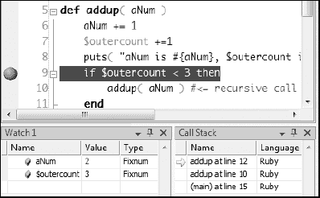

# 第十三章。文件和 IO


Ruby 提供了专门用于处理输入和输出的类（IO）。其中最重要的是一个名为 IO 的类。IO 类允许你打开和关闭 IO 流（字节的序列），并从它们读取和写入数据。

例如，假设你有一个名为*textfile.txt*的文件，其中包含一些文本行，这是你打开文件并在屏幕上显示每一行的方法：

*io_test.rb*

```
IO.foreach("testfile.txt") {|line| print( line ) }
```

在这里，`foreach`是 IO 的一个类方法，因此你不需要创建一个新的 IO 对象来使用它；相反，你只需指定文件名作为参数。`foreach`方法接受一个块，其中每个从文件中读取的行作为参数传递。当你完成读取后，你不需要打开文件进行读取并关闭它（正如你可能从其他语言的经验中预期的那样），因为 Ruby 的`IO.foreach`方法会为你完成这些操作。

IO 类有其他一些有用的方法。例如，你可以使用`readlines`方法将文件内容读取到数组中，以便进行进一步处理。以下是一个简单的示例，它再次将行打印到屏幕上：

```
lines = IO.readlines("testfile.txt")
lines.each{|line| print( line )}
```

File 类是 IO 的子类，前面的示例可以使用 File 类重写：

*file_test.rb*

```
File.foreach("testfile.txt") {|line| print( line ) }

lines = File.readlines("testfile.txt")
lines.each{|line| print( line )}
```

# 打开和关闭文件

尽管一些标准方法可以自动打开和关闭文件，但在处理文件内容时，通常需要显式地打开和关闭文件。你可以使用`new`或`open`方法打开一个文件。你必须向这些方法之一传递两个参数——文件名和文件“模式”，它将返回一个新的 File 对象。文件模式可以是操作系统特定的常量定义的整数，也可以是字符串。模式通常表示文件是用于读取（`"r"`）、写入（`"w"`）还是读写（`"rw"`）表 13-1 显示了可用的字符串模式列表。

表 13-1. 文件模式字符串

| 模式 | 含义 |
| --- | --- |
| `"r"` | 只读，从文件开头开始（默认模式） |
| `"r+"` | 读写，从文件开头开始 |
| `"w"` | 只写，截断现有文件到零长度或创建一个新文件用于写入 |
| `"w+"` | 读写，截断现有文件到零长度或创建一个新文件用于读写 |
| `"a"` | 只写，如果文件存在，从文件末尾开始；否则，创建一个新文件用于写入 |
| `"a+"` | 读写，如果文件存在，从文件末尾开始；否则，创建一个新文件用于读写 |
| `"b"` | （仅限 DOS/Windows）二进制文件模式（可以与前面列出的任何关键字一起出现） |

让我们看看一个打开、处理和关闭文件的实际示例。在 *open_close.rb* 中，我首先以写入模式（`"w"`）打开一个文件，*myfile.txt*。当一个文件以写入模式打开时，如果它不存在，将会创建一个新文件。我使用 `puts()` 将六个字符串写入文件，每个字符串占一行。最后，我关闭文件：

```
f = File.new("myfile.txt", "w")
f.puts( "I", "wandered", "lonely", "as", "a", "cloud" )
f.close
```

关闭文件不仅释放了*文件句柄*（指向文件数据的指针），还将任何数据从内存中“刷新”出来，以确保所有数据都保存到磁盘上的文件中。

将文本写入文件后，让我们看看如何打开该文件并读取数据。这次我将逐个字符读取数据，直到文件末尾（`eof`）。在这个过程中，我会记录已读取的字符数。我还会记录行数，每当读取到换行符（ASCII 码 10）时，行数会增加。为了清晰起见，我会在每行读取的末尾添加一个字符串，显示其行号。我将在屏幕上显示字符以及我的行结束字符串，当从文件中读取完所有内容后，我将关闭文件并显示我计算出的统计数据。以下是完整的代码：

*open_close.rb*

```
f = File.new("myfile.txt", "w")
f.puts( "I", "wandered", "lonely", "as", "a", "cloud" )
f.close                          # Try commenting this out!

charcount = 0
linecount = 0
f = File.new("myfile.txt", "r")
while !( f.eof ) do              # while not at end of file...
    c = f.getc()                 # get a single character
    if ( c.ord == 10 ) then      # test ASCII code (Ruby 1.9)
        linecount += 1
        puts( " <End Of Line #{linecount}>" )
    else
        putc( c )                # put the char to screen
        charcount += 1
    end
end
if f.eof then
    puts( "<End Of File>" )
end
f.close
puts("This file contains #{linecount} lines and #{charcount} characters." )
```

### 注意

此代码是为 Ruby 1.9 编写的，不能在 Ruby 1.8 中运行。有关更多详细信息，请参阅以下部分。

以这种方式操作文件时，程序员有责任确保在向文件写入或从中读取数据后关闭文件。未能关闭文件可能会导致不可预测的副作用。例如，尝试注释掉前面的第一个 `f.close`（在上一段代码的第三行）看看会发生什么！你会发现当程序随后尝试读取文件内容时，找不到数据，并且返回零行和字符数！

# 字符和兼容性

*open_close.rb* 程序是为 Ruby 1.9 编写的，不能在 Ruby 1.8 中运行。这是因为当 Ruby 1.8 返回单个字符时，它被视为一个整数 ASCII 值，而在 Ruby 1.9 中，它被视为一个单字符字符串。因此，当 `getc()` 返回字符 `c` 时，Ruby 1.8 能够测试其 ASCII 值（`c == 10`），而 Ruby 1.9 必须将其作为字符串测试（`c == "\n"`）或使用 `ord` 方法将字符转换为整数：（`c.ord == 10`）。`ord` 方法在 Ruby 1.8 中不存在。

作为一条基本原则，如果你想编写能在不同版本的 Ruby 中运行的程序，你可以通过测试 `RUBY_VERSION` 常量的值来绕过不兼容性问题。这个常量返回一个表示版本号的字符串，例如 1.9.2。你可以简单地使用 `to_f` 方法将字符串转换为浮点数，然后根据值是否大于 1.8 来采取不同的行动：

```
if (RUBY_VERSION.to_f > 1.8) then
    c = c.ord
end
```

或者，你也可以分析字符串以确定次要和主要版本号。例如，这里有一个非常简单的方法，它通过索引到`RUBY_VERSION`字符串来获取第一个字符作为主要版本（1 或 2）和第二个字符作为次要版本（例如，8 或 9）。如果 Ruby 版本是 1.9 或更高，则返回`true`，否则返回`false`：

`*open_close2.rb*`

```
def isNewRuby
    newR = false # is this > Ruby version 1.8?
    majorNum = RUBY_VERSION[0,1]
    minorNum = RUBY_VERSION[2,1]
    if ( majorNum == "2" ) || (minorNum  == "9" ) then
        newR = true
    else
        newR == false
    end
    return newR
end
```

你可以在你的代码中使用这个测试来处理兼容性问题。在这里，`ord`方法仅当 Ruby 版本为 1.9 或更高时才应用于字符`c`：

```
if (isNewRuby) then
    c = c.ord
end
```

# 文件和目录

你也可以使用`File`类来操作磁盘上的文件和目录。在尝试对文件执行某些操作之前，你必须确保文件存在。毕竟，文件可能在程序开始后已被重命名或删除——或者用户可能错误地输入了文件或目录名称。

你可以使用`File.exist?`方法来验证文件的存在。这是`FileTest`模块提供给`File`类的一些测试方法之一。就`File.exist?`方法而言，目录被视为文件，因此你可以使用以下代码来测试`*C:\*`驱动器的存在（注意，在字符串中必须使用双文件分隔符`"\\"`字符，因为单个`"\"`将被视为转义字符）：

`*file_ops.rb*`

```
if File.exist?( "C:\\" ) then
    puts( "Yup, you have a C:\\ directory" )
else
    puts( "Eeek! Can't find the C:\\ drive!" )
end
```

如果你想要区分目录和数据文件，可以使用`directory?`方法：

```
def dirOrFile( aName )
    if File.directory?( aName ) then
        puts( "#{aName} is a directory" )
    else
        puts( "#{aName} is a file" )
    end
end
```

# 复制文件

让我们通过编写一个简单的文件备份程序来让`File`类发挥实际作用。当你运行`*copy_files.rb*`时，系统会要求你选择一个要复制的目录（源目录）以及另一个要复制的目录（目标目录）。假设这两个目录都存在，程序随后会将源目录中的所有文件复制到目标目录。如果目标目录不存在，程序会询问你是否希望创建它，在这种情况下你应该输入`*Y*`来接受。我已经为你提供了一个源目录；当提示时，只需输入名称`*srcdir*`。当询问目标目录时，输入`*targetdir*`以在当前目录下创建一个同名子目录。

程序使用源目录的路径初始化变量`sourcedir`，并使用目标目录的名称初始化`targetdir`。这是执行文件复制的代码：

`*copy_files.rb*`

```
Dir.foreach( sourcedir ){
    |f|
    filepath = "#{sourcedir}\\#{f}"
       if !(File.directory?(filepath) ) then
          if File.exist?("#{targetdir}\\#{f}") then
              puts("#{f} already exists in target directory" )
          else
              FileUtils.cp( filepath, targetdir )
              puts("Copying... #{filepath}" )
        end
    end
}
```

在这里，我使用了`Dir`类的`foreach`方法，它将指定目录中每个文件的文件名`f`传递给一个块。我将在稍后详细介绍`Dir`类。代码通过将文件名附加到由`sourcedir`变量给出的目录名称来构造文件的合格路径`filepath`。我只想要复制数据文件，而不是目录，所以我测试`filepath`是否是文件而不是目录：

```
if !(File.directory?(filepath) )
```

我不希望这个程序复制已经存在的文件，因此它首先检查目标目录`targetdir`中是否已经存在名为`f`的文件：

```
if File.exist?("#{targetdir}\\#{f}")
```

最后，假设所有指定的条件都满足，源文件`filepath`将被复制到`targetdir`：

```
FileUtils.cp( filepath, targetdir )
```

在这里，`cp`是`FileUtils`模块中找到的一个文件复制方法。此模块还包含许多其他有用的文件处理例程，例如`mv(source, target)`将文件从`source`移动到`target`，`rm(files)`删除`files`参数中列出的一个或多个文件，以及`mkdir`创建目录，就像我在当前程序中创建`targetdir`时做的那样：

```
FileUtils.mkdir( targetdir )
```

# 目录查询

我的备份程序一次只处理一个目录级别，这就是为什么它在尝试复制文件`f`之前会检查它不是一个目录。然而，有很多时候你可能想要遍历子目录。作为一个例子，让我们编写一个程序，计算指定根目录下所有子目录的大小。如果你想要定位最大的文件和目录，以便通过存档或删除它们来释放磁盘空间，这可能很有用。

在子目录中导航创建了一个有趣的编程问题。当你开始搜索子目录的存在时，你不知道你会找到多少个，一个也没有，或者很多。此外，你找到的任何子目录可能还包含另一个级别的子目录，每个子目录可能还包含其他子目录，以此类推，可能有很多层级。

# 对递归的探讨

此程序需要能够导航到整个子目录树中的任何数量的层级。为了能够做到这一点，你必须使用*递归*。简单来说，递归方法是一种调用自身的方法。如果你不熟悉递归编程，请参阅深入挖掘中的深入挖掘。

在程序*file_info.rb*中，`processfiles`方法是递归的：

*file_info.rb*

```
def processfiles( aDir )
    totalbytes = 0
    Dir.foreach( aDir ){
    |f|
    mypath = "#{aDir}\\#{f}"
    s = ""
    if File.directory?(mypath) then
        if f != '.' and f != '..' then
        bytes_in_dir = processfiles(mypath)     # <==== recurse!
        puts( "<DIR> --->
            #{mypath} contains [#{bytes_in_dir/1024}] KB" )
    end
    else
       filesize = File.size(mypath)
       totalbytes += filesize
       puts ( "#{mypath} : #{filesize/1024}K" )
    end
    }
    $dirsize += totalbytes
    return totalbytes
end
```

你会看到，当方法首次被调用时，在源代码的底部，它通过变量`dirname`传递了目录的名称：

```
processfiles( dirname )
```

我已经分配了当前目录的父目录，由两个点表示：

```
dirname = ".."
```

如果你在这个程序的原位置（即从本书的源代码存档中提取的位置）运行此程序，这将引用包含所有示例代码文件子目录的目录。或者，你也可以将硬盘上某个目录的名称分配给变量`dirname`。如果你这样做，不要指定包含大量文件和目录的目录（在 Windows 上，*C:\Program Files*不是一个好选择，而*C:\*会更糟！）因为程序执行将花费相当长的时间。

让我们更仔细地看看 `processfiles` 方法中的代码。再次使用 `Dir.foreach` 来找到当前目录中的所有文件，并将每个文件 `f` 逐个传递给花括号之间的代码块进行处理。如果 `f` 是一个目录并且不是当前目录 (`'.'`) 或其父目录 (`'..'`)，那么我将目录的完整路径传递回 `processfiles` 方法：

```
if File.directory?(mypath) then
    if f != '.' and f != '..' then
       bytes_in_dir = processfiles(mypath)
```

如果 `f` 不是一个目录而是一个普通的数据文件，我会用 `File.size` 来找到它的字节数，并将这个值赋给变量 `filesize`：

```
filesize = File.size(mypath)
```

随着每个连续的文件 `f` 被代码块处理，其大小被计算，并将这个值添加到变量 `totalbytes`：

```
totalbytes += filesize
```

当当前目录中的所有文件都已传递到块中时，`totalbytes` 将等于目录中所有文件的总大小。

然而，我还需要计算所有子目录中的字节数。因为方法是递归的，所以这会自动完成。记住，当 `processfiles` 方法中的花括号之间的代码确定当前文件 `f` 是一个目录时，它会将这个目录名传递回 *自身*——即 `processfiles` 方法。

让我们想象你首先用 *C:\test* 目录调用 `processfiles`。在某个时刻，变量 `f` 被分配了其子目录之一的名称，比如说，*C:\test\dir_a*。现在这个子目录被传递回 `processfiles`。在 *C:\test\dir_a* 中没有找到更多的目录，所以 `processfiles` 只计算这个子目录中所有文件的大小。当它完成这些文件的计算后，`processfiles` 方法结束并返回当前目录 `totalbytes` 中的字节数，这是最初调用该方法的代码部分：

```
return totalbytes
```

在这种情况下，这是 `processfiles` 方法内部递归调用 `processfiles` 方法的代码：

```
bytes_in_dir = processfiles(mypath)
```

因此，当 `processfiles` 完成处理子目录 `C:\test\dir_a` 中的文件时，它返回那里找到的所有文件的总大小，并将这个值赋给 `bytes_in_dir` 变量。`processfiles` 方法现在继续从它离开的地方（即，从它调用自身来处理子目录的点）处理原始目录 `C:\test` 中的文件。

无论这个方法遇到多少层子目录，它每次找到目录时都调用自身的事实确保了它自动遍历它找到的每个目录路径，计算每个目录的总字节数。

最后要注意的一点是，分配给在 `processfiles` 方法内部声明的变量的值，在每次递归级别完成时将恢复到它们的“之前”值。因此，`totalbytes` 变量最初将包含 *C:\test\test_a\test_b* 的大小，然后是 *C:\test\test_a* 的大小，最后是 *C:\test* 的大小。为了保持所有目录组合大小的累计总和，你需要将值分配给在方法外声明的变量。在这里，我使用全局变量 `$dirsize` 来实现这个目的，为每个处理的子目录添加 `totalbytes` 的值：

```
$dirsize += totalbytes
```

顺便提一下，尽管字节可能是一个方便的测量单位，用于非常小的文件，但通常最好用千字节来描述较大的文件，用兆字节来描述非常大的文件或目录。要将字节转换为千字节或千字节转换为兆字节，需要除以 1,024。要将字节转换为兆字节，需要除以 1,048,576。我程序中的最后一行代码执行这些计算，并使用 Ruby 的 `printf` 方法以格式化的字符串显示结果：

```
printf( "Size of this directory and subdirectories is
    #{$dirsize} bytes,
    #{$dirsize/1024}K, %0.02fMB",
    "#{$dirsize/1048576.0}" )
```

注意，我在第一个字符串中嵌入了格式化占位符 `"%0.02fMB"`，并且添加了一个逗号后的第二个字符串：`"#{$dirsize/1048576.0}"`。第二个字符串计算目录大小以兆字节为单位，然后这个值被替换为第一个字符串中的占位符。占位符的格式化选项 `"%0.02f"` 确保兆字节值以带有两位小数的浮点数 `"f"` 显示。

# 按大小排序

目前这个程序按字母顺序打印文件和目录的名称及其大小。但我更感兴趣的是它们的 *相对* 大小。因此，如果文件按大小而不是按名称排序，将更有用。

要能够对文件进行排序，你需要一种方式来存储所有文件大小的完整列表。一个明显的方法是将文件大小添加到一个数组中。在 *file_info2.rb* 中，我创建了一个空数组 `$files`，每次处理一个文件时，我都会将其大小追加到数组中：

*file_info2.rb*

```
$files << fsize
```

然后，我可以对文件大小进行排序，以显示从低到高的值，或者（通过排序然后反转数组）以显示从高到低的值：

```
$files.sort                   # sort low to high
$files.sort.reverse           # sort high to low
```

这个问题的唯一麻烦是，我现在得到了一个没有关联文件名的文件大小数组。一个更好的解决方案是使用哈希而不是数组。我在 *file_info3.rb* 中实现了这一点。首先，我创建了两个空哈希：

*file_info3.rb*

```
$dirs = {}
$files = {}
```

现在，当 `processfiles` 方法遇到目录时，它会使用完整的目录路径 `mypath` 作为键，使用目录大小 `dsize` 作为值，在 `$dirs` 哈希中添加一个新的条目：

```
$dirs[mypath] = dsize
```

类似地，键值对被添加到 `$files` 哈希中。当子目录和文件的整个结构通过递归调用 `processfiles` 方法处理后，`$dirs` 哈希变量将包含目录名称和大小之间的键值对，而 `$files` 哈希将包含文件名称和大小之间的键值对。

现在剩下的只是对这些哈希进行排序并显示。对于哈希的标准 `sort` 方法是按照键排序，而不是值。我想按值（大小）排序，而不是按键（名称）。为此，我定义了一个自定义排序方法（参考第四章和第五章，了解如何使用 `<=>` 定义自定义比较）：

```
$files.sort{|a,b| a[1]<=>b[1]}
```

在这里，`sort` 方法将 `$files` 哈希转换为嵌套的 `[key,value]` 对数组，并将其中两个，`a` 和 `b`，传递到花括号之间的块中。每个 `[key,value]` 对的第二个项目（索引 `[1]`）提供了值。排序本身是通过 Ruby 的 `<=>` 比较方法在值上进行的。最终结果是，这个程序现在首先显示一个按大小升序排列的文件列表，然后是一个类似排序的目录列表。这是其输出的一个示例：

```
..\ch19\blog\app\models\post.rb : 36 bytes
..\ch19\say_hello.html.erb : 41 bytes
..\ch13\testfile.txt : 57 bytes
..\ch01\2helloname.rb : 67 bytes
..\ch9\div_by_zero.rb : 71 bytes
..\ch12\test.rb : 79 bytes
..\ch4\dir_array.rb : 81 bytes
..\ch3\for_to.rb : 89 bytes
```

深入挖掘

递归是一种重要的编程技术，然而，它可能相当难以理解。在这里，我将一步一步地解释递归。

简化递归

如果你以前从未使用过递归，本章中递归的“目录遍历”方法可能需要一些解释。为了阐明递归是如何工作的，让我们看看一个更简单的例子。加载 *recursion.rb* 程序：

*recursion.rb*

```
$outercount = 0

def addup( aNum )
    aNum += 1
    $outercount +=1
    puts( "aNum is #{aNum}, $outercount is #{$outercount}" )
    if $outercount < 3 then
        addup( aNum )         #<= recursive call to addup method
    end
    puts("At END: aNum is #{aNum},outercount is #{$outercount}")
end

addup( 0 )                    #<= This is where it all begins
```

这包含了一个递归方法 `addup`，它一生的唯一目的就是从 1 数到 3。`addup` 方法接收一个整数作为输入参数，`aNum`。

```
addup( aNum )
```

此外，还有一个全局变量 `$outercount`，它“存在于”`addup` 方法之外。每当 `addup` 方法执行时，`aNum` 增加 1，`$outercount` 也增加 1。只要 `$outercount` 小于 3，`addup` 方法内部的代码就会再次调用相同的方法（`addup`），并将新的 `aNum` 值传递给它：

```
if $outercount < 3 then
    addup( aNum )
end
```

让我们跟随这个过程。这个过程是从调用 `addup` 并传递值 0 开始的：

```
addup( 0 )
```

`addup` 方法将 1 添加到 `aNum` 和 `$outercount`，因此这两个变量现在都有值 1。测试（`$outercount < 3`）评估为真，所以 `aNum` 作为参数传递给 `addup`。再次，两个变量都增加了 1，所以 `aNum` 现在是 2，而 `$outercount` 也是 2。现在再次将 `aNum` 传递给 `addup`。再次将 1 添加到两个变量中，使每个变量都变为 3。然而，这次测试条件失败，因为 `$outercount` 不再小于 3。因此，调用 `addup` 的代码被跳过，你到达了方法中的最后一行：

```
puts( "At END: aNum is #{aNum}, outercount is #{$outercount}" )
```

这将打印出`aNum`和`$outercount`的值，正如你所预期的那样，这两个值都是 3。到达这个方法的末尾后，“控制流”会返回到最初调用该方法的代码之后的下一行。在这里，调用`addup`方法的代码恰好位于方法内部。这里是它：

```
addup( aNum )
```

接下来的第一个可执行行（再次）是方法的最后一行，它打印出两个变量的值：

```
puts( "At END: aNum is #{aNum}, outercount is #{$outercount}" )
```

因此，你回到了一个更早的“执行点”——你递归调用`addup`方法的那一刻。当时，`aNum`的值是 2，现在它仍然是这个值。如果这看起来很困惑，只需尝试想象如果`aNum`的值是 2，然后你调用其他一些无关的方法会发生什么。从那个其他方法返回时，`aNum`当然仍然会有 2 的值。这就是这里发生的一切。唯一的区别是，这个方法恰好调用的是它自己而不是其他方法。

再次，方法执行结束，控制权返回到调用该方法的代码之后的下一个可执行行，`aNum`的值又向前迈出一步回到其历史中——现在它的值是 1。然而，`$outercount`变量是存在于方法之外的，并且不受递归的影响，所以它仍然是 3。

如果你能够访问一个可视化的调试器，整个过程将变得更加清晰：你可以在第 9 行（`if $outercount < 3 then`）设置一个断点，将`aNum`和`$outercount`添加到监视窗口中，并在触碰到断点后反复进入代码。



这张截图显示了在 IDE Ruby In Steel 中可视化的递归程序调试。我可以逐行通过源代码，使用调用栈来跟踪当前的“递归级别”（`addup`方法被调用的次数），并使用监视窗口来监控变量的当前值。
