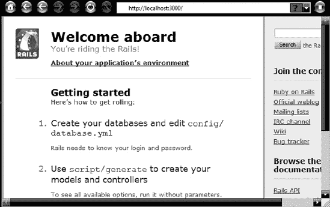
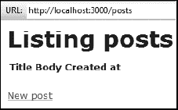
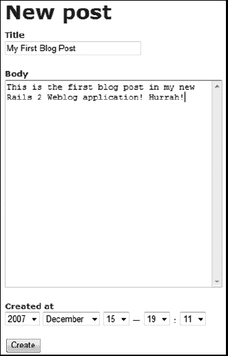
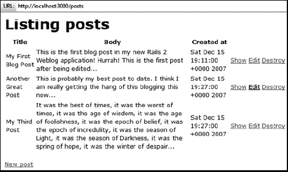

# 第十九章。Ruby on Rails


Rails 已经与 Ruby 结合得如此紧密，以至于现在人们谈论编程“在” Ruby on Rails 时，好像“Ruby on Rails”就是编程语言的名字。

实际上，Rails 是一个框架——一组工具和代码库，可以与 Ruby 一起使用。它使您能够开发响应用户交互的数据库驱动型网站。例如，用户可以在一个页面上输入和保存数据，在其他页面上搜索数据。这使得 Rails 适合创建动态网站，这些网站可以“即时”生成网页，而不是加载静态、预先设计的页面。典型应用包括协作网站，如在线社区、多作者书籍或维基百科、购物网站、讨论论坛和博客。

我将很快提供创建博客的实战指南。首先，让我们更详细地了解一下 Rails 框架的细节。

### 注意

本章将为您展示在 Ruby on Rails 中开发的感觉。然而，请注意，Rails 是一个庞大且复杂的框架，我只会介绍其基本功能。在撰写本文时，Rails 3 是最新版本，但 Rails 2 仍然被广泛使用；因此，本章将涵盖这两个版本。

# 安装 Rails

Rails 不是 Ruby 的标准部分，因此您可能需要将其作为单独的操作安装。请注意，Ruby 和 Rails 在某些操作系统（如 Mac OS X）中作为标准软件提供，但无法保证这些是最新版本，您可能需要手动更新默认安装。

## DIY ...

安装 Rails 有多种方式。最简单的方法是使用一站式安装程序（本章中描述了一些替代方案）。然而，您也可以逐个安装 Rails 和它所需的工具。Rails 可以使用 Ruby Gems “软件包管理器”进行安装。只要您连接到互联网，Ruby Gems 就会在线查找并安装 Rails 的最新版本。

### 注意

要获取 Ruby Gems 文档，请访问 [`docs.rubygems.org/`](http://docs.rubygems.org/)。

在命令提示符下，输入以下内容：

```
gem install rails
```

如果您不想安装最新版本，而是想安装特定版本的 Rails，您应该在输入上一条命令时附加 `--version=` 后跟适当的版本号。例如，要安装 Rails 2.3.8，请输入以下内容：

```
gem install rails --version=2.3.8
```

或者，你可以从 Ruby on Rails 网站 [`www.rubyonrails.org/`](http://www.rubyonrails.org/) 下载并安装 Rails。大多数 Rails 应用程序都需要一个数据库，你将需要单独安装它。许多人使用 SQLite 或免费的 MySQL 数据库服务器。MySQL 是这两个系统中功能更强大的一个，被许多专业网站使用。然而，许多人发现 SQLite 对于 Ruby 应用的本地开发来说更容易使用。SQLite 的安装根据所使用的操作系统而有所不同。SQLite3 预安装在 Mac OS X Leopard 上。

在 Windows 上安装 SQLite3 可能相当棘手。你应该首先在命令行中运行以下命令：

```
gem install sqlite3-ruby
```

仔细注意执行时显示的消息。这会告诉你需要安装哪个版本的 SQLite3 DLL 以及你可以从中下载它的网址。这个 DLL 是必需的。如果没有安装它，SQLite3 将无法与 Rails 一起使用。此消息将类似于以下内容：

```
You've installed the binary version of sqlite3-ruby.
 It was built using SQLite3 version 3.7.3.
 It's recommended to use the exact same version to avoid potential issues.

 At the time of building this gem, the necessary DLL files where available
 in the following download:

 http://www.sqlite.org/sqlitedll-3_7_3.zip

 You can put the sqlite3.dll available in this package in your Ruby bin
 directory, for example C:\Ruby\bin
```

一定要按照说明操作，下载正确的 DLL，并将其复制到 Ruby 安装下的 *\bin* 目录中。

请参考 SQLite 网站，获取有关 SQLite 的更多信息：[`www.sqlite.org/docs.html`](http://www.sqlite.org/docs.html). 你可以在本书的附录 B（apb.html "附录 B. 为 Ruby on Rails 安装 MySQL"）中找到有关 MySQL 安装的说明。还可以使用许多其他数据库服务器，包括 Microsoft SQL Server、PostgreSQL 和 Oracle。

### 注意

如果你计划从头开始安装或更新 Rails，或者如果你需要更新操作系统预先安装的版本，你应该参考 Rails 指南网站：[`guides.rubyonrails.org/getting_started.html`](http://guides.rubyonrails.org/getting_started.html). 这些指南提供了有关 Rails 3 的详细操作系统特定信息。几个 Rails 维基也提供了有关支持旧版 Rails 的信息——例如，[`en.wikibooks.org/wiki/Ruby_on_Rails`](http://en.wikibooks.org/wiki/Ruby_on_Rails)。

## 或者使用“一体化”安装程序

可用的各种 Ruby 和 Rails 一体化设置程序包括针对 Windows、Linux 和 Mac 的 Bitnami RubyStack 安装程序：[`www.bitnami.org/stack/rubystack/`](http://www.bitnami.org/stack/rubystack/). Windows 用户还可以使用来自 RubyForge 的 Rails 安装程序：[`www.rubyforge.org/frs/?group_id=167`](http://www.rubyforge.org/frs/?group_id=167). 这些安装程序提供了它们自己的安装指南。

# 模型-视图-控制器

Rails 应用分为三个主要区域：模型、视图和控制器。简单来说，模型是数据部分——数据库以及在该数据上执行的所有程序性操作（如计算）。视图是最终用户看到的内容；在 Rails 术语中，这通常意味着浏览器中出现的网页。控制器是编程逻辑——将模型与视图连接在一起的“胶水”。

模型-视图-控制器（MVC）方法被各种编程语言和框架以各种形式使用。它在深入挖掘中的深入挖掘部分有更详细的描述。为了简洁起见，我将从此称其为 MVC。

# 第一个 Ruby on Rails 应用

不再赘述，让我们开始用 Rails 编程。我将假设你已经安装了 Rails，以及一个网络服务器。我恰好使用的是 WEBrick 服务器，它是随 Rails 标准安装的，但你也可以使用其他服务器，如 Apache、LightTPD 或 Mongrel。你可以在附录 D 中找到有关网络服务器的更多信息。

### 注意

一个网络服务器是一个使用超文本传输协议（HTTP）提供数据（如网页）的程序。你不需要理解它是如何工作的。你只需要知道，你需要一个网络服务器来与 Rails 一起使用。

本章假设你只使用“原始”Rails 开发工具——从命令行执行的程序——以及至少一个文本编辑器和网络浏览器；因此，你会发现你经常需要在系统提示符下输入命令。如果你使用的是 Rails 的集成开发环境，你可能会发现使用 IDE 提供的工具可以更容易地完成这些任务。

与本书其他章节提供的源代码示例不同，本章中 Ruby on Rails 应用的示例代码并不完整，也不是“可直接运行”的。这有三个原因：

+   每个 Rails 应用都包含大量文件和文件夹，其中大部分是由 Rails 自动生成的，因此分别分发它们是没有意义的。

+   我还必须为每个数据库提供数据，你必须在使用之前导入它。导入数据库通常比创建自己的数据库更困难。

+   不仅自己创建 Rails 应用更简单，而且这样做也有助于你理解 Rails 是如何工作的。然而，我已经提供了一些示例文件——一个完整应用的组成部分——你可以用它们来比较你的代码，以防你遇到问题。

# 创建一个 Rails 应用

为了简化，这个第一个应用将完全不使用数据库。这将让你在不必担心模型复杂性的情况下探索视图和控制器。

首先，打开系统提示符（在 Windows 中，选择开始菜单，并在运行或搜索框中输入 **`cmd`**）。导航到你打算放置 Rails 应用程序的目录。让我们假设这是 *C:\railsapps*。检查 Rails 是否已安装，并且其主目录是否在系统路径上。为此，请输入以下内容：

```
rails
```

如果一切顺利，你现在应该能看到关于使用 `rails` 命令的帮助信息的一屏内容。如果你没有看到这个，那么你的 Rails 安装可能存在问题，你需要修复它才能继续。请参考安装 Rails 中的安装 Rails。

### 注意

当 Rails 2 和 Rails 3 的命令或代码存在差异时，文本中会在示例旁边用 Rails 版本号（Rails 2 或 Rails 3）来指明。

假设 Rails 正在运行，你现在可以创建一个应用程序。输入以下命令：

*Rails 3*

```
rails new helloworld
```

*Rails 2*

```
rails helloworld
```

在你的硬盘嗡嗡作响了一段时间后，你应该会看到 Rails 刚刚创建的文件列表（实际的列表相当长，并且 Rails 2 和 Rails 3 中创建的一些项是不同的）：

```
create  app
create  app/controllers/application_controller.rb
create  app/helpers/application_helper.rb
create  app/mailers
create  app/models
create  app/views/layouts/application.html.erb
create  config
*`(etcetera)`*
```

使用你的计算机文件管理器查看这些文件。在运行 Rails 命令的目录（*\helloworld*）下，你会看到已经创建了几个新的目录：*\app*，*\config*，*\db* 等等。其中一些有子目录。例如，*\app* 目录包含 *\controllers*，*\helpers*，*\models* 和 *\views*。*\views* 目录本身还包含一个子目录，*\layouts*。

Rails 应用程序的目录结构远非随机；目录（或*文件夹*）以及它们包含的文件名称定义了应用程序各个部分之间的关系。背后的想法是，通过采用一个定义良好的文件和文件夹结构，你可以避免编写大量的配置文件来连接应用程序的各个部分。Rails 默认目录结构的简化指南可以在深入挖掘中的深入挖掘找到。

现在，在系统提示符下，将目录更改为新创建的 Rails 应用程序的最高级文件夹（*\helloworld*）。假设你仍然在 *C:\railsapps* 目录中，并且你将 Rails 应用程序命名为 *helloworld*，如之前建议的，你会在 Windows 中输入以下命令来切换到该目录：

```
cd helloworld
```

现在运行服务器。如果你（像我一样）使用 WEBrick，你应该输入以下命令：

*Rails 3*

```
rails server
```

*Rails 2*

```
ruby script/server
```

注意，除了 WEBrick 之外的服务器可能以不同的方式启动，如果前面的方法不起作用，你需要查阅服务器的文档。你现在应该看到以下类似的内容：

```
=> Booting WEBrick...
=> Rails application started on http://0.0.0.0:3000
=> Ctrl-C to shutdown server; call with --help for options
[2006-11-20 13:46:01] INFO  WEBrick 1.3.1
[2006-11-20 13:46:01] INFO  ruby 1.8.4 (2005-12-24) [i386-mswin32]
[2006-11-20 13:46:01] INFO  WEBrick::HTTPServer#start: pid=4568 port=3000
```

问题？

如果您没有看到确认服务器已启动的消息，而是看到错误消息，请检查您是否已按照所使用的 Rails 版本准确输入了服务器命令，并检查它是否在适当的目录中运行：*\helloworld*。

如果您仍然有问题，可能是默认端口（3000）已经被占用——例如，如果您在同一台 PC 上已经安装了 Apache 服务器。在这种情况下，尝试使用其他值，例如 `3003`，在运行脚本时将此数字放在 `-p` 之后：

```
rails server -p3003
```

```
ruby script/server -p3003
```

如果您看到包含文本 `no such file to load -- sqlite3` 的错误消息，请确保您已正确安装 SQLite3，如 安装 Rails 中所述。如果您正在尝试使用 MySQL，并且错误消息包含文本 `no such file to load–mysql`，请参阅 附录 B。

*Rails 3*

*Rails 2*

现在，打开一个网页浏览器。将主机名和冒号以及端口号输入其地址栏中。主机名应该是（通常）*localhost*，端口号应该与启动服务器时使用的端口号匹配，否则默认为 3000。以下是一个示例：

```
http://localhost:3000/
```

浏览器现在应该显示一个欢迎您加入 Rails 的页面。如果没有，请确认您的服务器正在运行在 URL 中指定的端口上。



# 创建控制器

如前所述，控制器是您大部分 Ruby 代码存放的地方。它是应用程序中位于视图（浏览器中显示的内容）和模型（数据发生的事情）之间的部分。因为这是一个“Hello world”应用程序，让我们创建一个控制器来显示“hello”。本着原创精神，我将称之为 *SayHello* 控制器。再次提醒，您可以通过在系统提示符下运行脚本来创建它。您需要打开另一个命令窗口，该窗口位于您之前运行服务器脚本的目录中（例如，*C:\railsapps\helloworld*）。您不能重复使用现有的命令窗口，因为服务器正在该窗口中运行，您需要关闭它才能回到提示符——这将停止您的 Rails 应用程序工作！

在提示符下，输入以下内容（请确保使用与 `SayHello` 显示的相同的大小写）：

*Rails 3*

```
rails generate controller SayHello
```

*Rails 2*

```
ruby script/generate controller SayHello
```

几分钟后，您将被告知已创建各种文件和目录，包括以下内容：

```
app/views/say_hello
app/controllers/say_hello_controller.rb
test/functional/say_hello_controller_test.rb
app/helpers/say_hello_helper.rb
```

### 注意

`generate controller` 脚本还在 Rails 3 中创建了 *application_controller.rb* 文件，或在 Rails 2 中创建了 *application.rb* 文件，这是整个应用程序的控制器，还有一个文件夹，*/views/say_hello*，您将很快使用到它。

注意 Rails 如何将名称 `SayHello` 解析为两个由下划线分隔的小写单词 `say` 和 `hello`，并使用此名称作为生成 Ruby 文件（如 `say_hello_controller.rb`）的第一部分。这只是 Rails 使用“约定配置”方法的一个例子。

定位控制器文件 *say_hello_controller.rb*，该文件已创建在 *\helloworld\app\controllers* 中。在文本编辑器中打开此文件。此空方法已被自动生成：

```
class SayHelloController < ApplicationController
end
```

在这个类中，你可以编写一些代码，当显示某个页面时执行。编辑类定义以匹配以下内容：

```
class SayHelloController < ApplicationController
    def index
        render :text => "Hello world"
    end

    def bye
        render :text => "Bye bye"
    end
end
```

现在包含两个方法，`index` 和 `bye`。每个方法包含一行代码。尽管我省略了括号（许多 Rails 开发者喜欢轻量级的括号风格），但你可能推断出 `render` 是一个接受哈希作为参数的方法；该哈希本身包含一个由符号和字符串组成的键值对。对于喜欢括号的开发者，`index` 方法可以重写如下：

```
def index
   render( { :text => "Hello world" } )
end
```

有了你的第一个真正的 Rails 应用程序。要尝试它，你需要回到网页浏览器并输入你刚刚编写的两个函数的完整“地址”。但在做之前，你可能需要重新启动服务器。只需在运行服务器的命令窗口中按 ctrl-C。当服务器退出后，通过输入以下内容重新启动：

*Rails 3*

```
rails server
```

*Rails 2*

```
ruby script/server
```

在 Rails 3 中，你还需要做一件事。你需要告诉 Rails 如何通过在网页浏览器中输入的地址找到“路由”。这一步在 Rails 2 中不是必需的。在 Rails 3 中，打开 *helloworld\config\* 文件夹中的 *routes.rb* 文件。现在编辑它以匹配以下内容（或者简单地取消注释文件底部的代码行）：

```
match ':controller(/:action(/:id(.:format)))'
```

你现在可以测试应用程序了。为此，你只需输入一个地址来访问控制器方法。地址的格式为主机和端口（与之前输入的相同——例如，*http://localhost:3000*），然后是控制器的名称（*/say_hello*），最后是特定方法的名称（*/index* 或 */bye*）。尝试将这些内容，如以下所示，输入到浏览器的地址栏中，同时确保如果你不是使用 3000 端口，请使用正确的端口号：

```
http://localhost:3000/say_hello/index
http://localhost:3000/say_hello/bye
```

你的浏览器应该分别显示“Hello world”和“Bye bye”对应于每个地址。如果到目前为止一切正常，你可以沉浸在你创建了第一个 Ruby on Rails 应用程序的温暖光辉中。然而，如果你看到 MySQL 数据库错误，请阅读 找不到数据库？ 在 配置 MySQL 中，并在继续之前修复问题。

顺便提一下，Rails 使用 `index` 方法作为默认值，因此你可以使用 index 视图作为你的主页，并在将地址输入到浏览器时省略该部分：

```
http://localhost:3000/say_hello
```

# 简单 Rails 应用的解剖

在继续之前，让我们仔细看看你在本应用中创建的类。Rails 通过在运行控制器生成脚本时指定的名称后添加`*Controller*`来命名这个类（`HelloWorld`），并且使其成为`ApplicationController`类的后代：

```
class SayHelloController < ApplicationController
```

但`ApplicationController`类究竟是什么呢？你可能还记得，我提到你之前运行的`generate controller`脚本默默地创建了一个名为`*application_controller.rb*`（Rails 3）或`*application.rb*`（Rails 2）的文件，位于`/app/controllers`文件夹内。这个文件就是应用控制器，如果你打开它，你会看到它包含一个名为以下内容的类：

```
ApplicationController < ActionController::Base
```

因此，`SayHelloController`类继承自`ApplicationController`类，而`ApplicationController`类本身又是`ActionController`模块中`Base`类的后代。你可以通过回溯层次结构并要求每个类显示自己来证明这一点。顺便说一句，这也给你提供了一个机会，在`SayHelloController`类中尝试做一些真正的 Ruby 编程。

只需编辑`say_hello_controller.rb`文件的内容，使其与以下内容匹配（或者从本章代码存档中的`*sayhello1.rb*`文件复制粘贴代码）：

`*sayhello1.rb*`

```
class SayHelloController < ApplicationController
    def showFamily( aClass, msg )
       if (aClass != nil) then
            msg += "<br />#{aClass}"
            showFamily( aClass.superclass, msg )
       else
           render :text => msg
       end
    end

    def index
        showFamily( self.class, "Class Hierarchy of self..." )
    end
end
```

要查看结果，请将以下地址输入到你的浏览器中（再次提醒，如果需要，请更改端口号）：

```
http://localhost:3000/say_hello
```

你的网络浏览器现在应该显示以下内容（在 Rails 3 中）：

```
Class Hierarchy of self...
SayHelloController
ApplicationController
ActionController::Base
ActionController::Metal
AbstractController::Base
Object
BasicObject
```

在 Rails 2 中，它将显示以下内容：

```
Class Hierarchy of self...
SayHelloController
ApplicationController
ActionController::Base
Object
```

不要担心实际的类继承关系；Rails 框架的内部实现细节并不立即引起兴趣。重要的是要理解，控制器是一个真正的 Ruby 对象，它从`ApplicationController`类及其祖先那里继承行为。你编写的任何 Rails 控制器类，或者通过运行脚本自动生成的控制器类，都可以包含正常的 Ruby 代码，就像你在前几章中编写的所有其他类一样。在控制器内部，你可以使用所有常见的 Ruby 类，如字符串和散列。

但请记住，最终结果需要在网页上显示。这带来了一些后果。例如，不要在字符串中放入换行符（`"\n"`），而应使用 HTML 段落（`<P>`）或换行（`<br />`）标签，并且每次页面显示时只能调用一次`render`方法，这也解释了为什么我在递归调用方法的过程中构建了一个字符串，然后在最后直接将这个字符串传递给`render`方法：

```
def showFamily( aClass, msg )
    if (aClass != nil) then
        msg += "<br />#{aClass}"
        showFamily( aClass.superclass, msg )
    else
       render :text => msg
    end
end
```

# 生成控制器脚本的总结

在继续之前，让我们总结一下运行 Rails `generate controller` 脚本的基本细节，并学习一些在创建视图时可以使用的额外技巧。每次生成新的控制器时，它都会在 *app/controllers* 目录中创建一个 Ruby 代码文件，文件名与输入的名称匹配，但全部小写，任何非首字母大写的名称前面都带有下划线，并且附加了 *_controller*。所以，如果你输入了 *SayHello*，控制器文件将被命名为 *say_hello_controller.rb*。控制器将包含一个类定义，例如 `SayHelloController`。你可以随后向这个类添加一些“视图方法”，例如 `index` 和 `bye`。或者，你可以使用 `generate` 脚本在执行脚本时通过包含那些视图名称来自动创建一个或多个空的视图方法。

例如，你可以运行以下脚本：

*Rails 3*

```
rails generate controller SayHello index bye
```

*Rails 2*

```
ruby script/generate controller SayHello index bye
```

Rails 现在将创建名为 *say_hello_controller.rb* 的文件，其中包含以下代码：

```
class SayHelloController < ApplicationController
    def index
    end

    def bye
    end
end
```

无论你是否指定了视图，都会在 */views* 目录下创建一个与控制器名称匹配的文件夹（*views/say_hello*）。实际上，脚本还会创建一些其他文件，包括 */helpers* 文件夹中的更多 Ruby 文件，但在我们的简单应用程序中，你可以忽略这些文件。

如果你在运行控制器脚本时指定了视图名称，将添加一些与名称匹配且扩展名为 *.html.erb* 的文件到相应的视图文件夹中。例如，如果你输入了以下命令：

```
ruby script/generate controller SayHello xxx
```

*/views/say_hello* 目录现在应该包含一个名为 *xxx.html.erb* 的文件。另一方面，如果你输入了以下命令：

```
ruby script/generate controller Blather xxx bye snibbit
```

*/views/blather* 目录现在应该包含三个文件：*xxx.html.erb*、*bye.html.erb* 和 *snibbit.html.erb*。

# 创建视图

你完全可以在控制器内部编写所有代码，并在视图方法内部进行所有格式化来创建整个应用程序。然而，你很快就会得到一些相当丑陋的网页。要应用更多格式化，你需要创建一个更精确定义网页布局的视图。

你可以将视图想象成一个当有人登录到特定网址时将显示的 HTML 页面——在这种情况下，视图的名称构成了地址的最后一部分，就像之前的例子中 */index* 和 */bye* 部分将你带到显示控制器中 `index` 和 `bye` 方法提供的数据的视图一样。

你可以创建与这些网页地址和相应方法名称匹配的 HTML 视图“模板”。使用 HTML（或纯文本）编辑器，在 *\app\views\say_hello* 目录中创建一个名为 *index.html.erb* 的文件，如果该模板尚未存在。记住，如前所述（在 The Generate Controller Script Summarized 中），在最初生成控制器时，你可以选择自动创建一个或多个视图模板。

现在你有了视图模板，你可以编辑它来控制网页中数据的显示方式。这意味着你将不再需要使用控制器中的 `render` 方法来显示未经格式化的文本。但是，由于视图不再受控制器控制（或者说，是这样），控制器如何将数据传递给视图呢？结果是，它可以通过将数据分配给实例变量来实现这一点。

编辑 *say_hello_controller.rb* 中的代码（或者删除它，并将源代码存档中提供的 *sayhello2.rb* 文件中的代码粘贴进来）以确保它符合以下要求：

*sayhello2.rb*

```
class SayHelloController < ApplicationController
    def showFamily( aClass, msg )
       if (aClass != nil) then
            msg += "<li>#{aClass}</li>"
            showFamily( aClass.superclass, msg )
       else
           return msg
       end
    end

    def index
        @class_hierarchy = "<ul>#{showFamily( self.class, "" )}</ul>"
    end
end
```

这个版本调用 `showFamily()` 方法，以便在两个 HTML “无序列表” 标签 `<ul>` 和 `</ul>` 内部构建一个字符串。每次找到一个类名时，它就被放置在两个 HTML “列表项” 标签 `<li>` 和 `</li>` 之间。完整的字符串形成一个有效的 HTML 片段，而 `index` 方法只是将这个字符串分配给一个名为 `@class_hierarchy` 的变量。

控制器中的 HTML 标签？

一些 Ruby on Rails 开发者反对在控制器代码中包含任何 HTML 标签，无论它们多么 - 微不足道。在我看来，如果你打算在网页中显示最终结果，你放置的 `<p>`、`<ul>` 或 `<li>` 标签的位置几乎无关紧要。尽管 MVC 范式鼓励控制器程序代码和视图布局定义之间有很强的分离，但你不可避免地必须做出一些妥协——至少是将一些程序代码放入视图。避免在控制器中使用 HTML 标签在很大程度上是一种审美上的反对，而不是实际的反对。尽管如此（警告！），其他人对此有很强的看法。

现在你需要做的就是找到一种方法将这个 HTML 片段放入一个完整的 HTML 页面中。这就是视图的作用所在。打开你刚刚创建的视图文件，*index.html.erb*，在 *app\views\say_hello* 文件夹中。根据 Rails 的命名约定，这是与 *say_hello_controller.rb* 文件配对的默认视图（“index”页面）。由于 Rails 根据文件、文件夹、类和方法名称来确定关系，因此你不需要按名称加载或要求任何文件，也不需要编写任何配置细节。

在 *index.html.erb* 文件中，添加以下内容：

```
<h1>This is the Controller's Class Hierarchy</h1>
<%= @class_hierarchy %>
```

第一行仅仅是普通的 HTML 格式化，它将 `<h1></h1>` 标签内的文本定义为标题。下一行更有趣。它包含变量 `@class_hierarchy`。回顾一下 *say_hello_controller.rb* 中的 `index` 方法，你会看到这是你分配字符串的变量。在这里的视图中，`@class_hierarchy` 被放置在两个看起来奇怪的定界符 `<%=` 和 `%>` 之间。这些是特殊的 Rails 标签。它们用于嵌入在浏览器显示网页之前将执行的 Ruby 代码片段。最终显示的页面将是一个完整的 HTML 页面，包括视图模板中的任何 HTML 片段以及嵌入的 Ruby 代码执行后的结果。现在尝试一下，通过在浏览器中输入页面地址来试试：

```
http://localhost:3000/say_hello/
```

这应该现在以大号粗体字母显示标题“这是控制器的类层次结构”，后面跟着一个类列表，每个元素前面都有一个点。在 Rails 2 中，你会看到如下内容：

```
• SayHelloController
• ApplicationController
• ActionController::Base
• Object
```

然而，在 Rails 3 中，你似乎遇到了一个问题。不是列表，HTML 标签被直接渲染，如下所示：

```
<ul><li>SayHelloController</li><li>ApplicationController</
li><li>ActionController::Base</li><li>ActionController::Metal</
li><li>AbstractController::Base</li><li>Object</li><li>BasicObject</li></ul>
```

这绝对不是你想要的。这种解释的原因是，Rails 2 和 Rails 3 之间字符串中嵌入的 HTML 标签的默认处理方式已经发生了变化。在 Rails 2 中，标签被未经修改地传递到视图中。在 Rails 3 中，进行了替换以确保 HTML 标签在屏幕上显示，而不是由浏览器渲染。例如，`<li>` 标签被更改为 `&lt;li&gt;`，其中 `&lt;` 和 `&gt;` 是 HTML 代码中的尖括号 (`<` 和 `>`)。为了确保 HTML 标签不以这种方式替换，你需要使用 `raw` 方法，并传递一个字符串参数。这是为 Rails 3 重写的 *index.html.erb*：

```
<h1>This is the Controller's Class Hierarchy</h1>
<%= raw( @class_hierarchy ) %>
```

现在当你登录到 Rails 3 的地址 [`localhost:3000/say_hello`](http://localhost:3000/say_hello) 时，你应该看到以无 HTML 标签显示的列表形式显示的类名。

如果你想的话，可以通过在控制器中创建标题并将结果字符串分配给另一个变量来从视图文件中移除所有 HTML。你可以通过编辑 *say_hello_controller.rb* 中的 `index` 方法来实现这一点：

```
def index
    @heading = "<h1>This is the Controller's Class Hierarchy</h1>"
    @class_hierarchy = "<ul>#{showFamily( self.class, "" )}</ul>"
end
```

然后编辑视图文件 *(/app/views/say_hello/index.html.erb*) 以匹配下面的代码（或者将代码从示例文件复制粘贴到 *index.html.erb*）以用于 Rails 3：

*say_hello_rails3.html.erb*

```
<%= raw( @heading ) %>
<%= raw( @class_hierarchy ) %>
```

对于 Rails 2，使用此代码：

*say_hello.html.erb*

```
<%= @heading %>
<%= @class_hierarchy %>
```

如果你这样做，网页上显示的最终结果将保持不变。所发生的一切只是将一些格式化从视图模板移动到了控制器中。

# Rails 标签

你可以在 Rails HTML 嵌入式 Ruby (ERb) 模板文件中放置两种 Rails 标签的变体。你迄今为止使用的那些包括在开标签中的等号：`<%=`.

这些标签不仅使 Rails 评估 Ruby 表达式，还将结果显示在网页上。如果你从开头的分隔符中省略等号，那么代码将被评估，但结果将不会显示：`<%>`。

### 注意

ERb 文件包含 HTML 标记和 Ruby 代码的混合，这些代码位于`<%=`和`%>`等标签之间。Rails 在最终页面在浏览器中显示之前处理这些文件，执行嵌入式 Ruby 并构建 HTML 页面。

如果你想，你可以在`<%`和`%>`标签之间放置相当长的代码块——甚至是你整个 Ruby 程序！——然后当你想在网页中显示某些内容时，使用`<%=`和`%>`。实际上，你可以通过完全省略控制器并将所有内容放入视图来重写你的应用程序。尝试通过编辑`*app/views/say_hello/index.html.erb*`来匹配以下内容（或者根据所使用的 Rails 版本，从文件`*embed_ruby_rails2.html.erb*`或`*embed_ruby_rails3.html.erb*`中复制并粘贴代码）：

*embed_ruby_rails3.rhtml*

```
<% def showFamily( aClass, msg )
     if (aClass != nil) then
        msg += "<li>#{aClass}</li>"
        showFamily( aClass.superclass, msg )
     else
       return msg
     end
   end %>

<%= raw( "<ul>#{showFamily( self.class, "" )}</ul>" ) %>
```

在这个特定的情况下，网页上显示的文本将与之前略有不同，因为它现在显示的是视图类的类层次结构，而不是控制器类的类层次结构。正如你将看到的，视图是从 ActionView::Base 类派生出来的。

你也可以通过将单独的行放在`<%`和`%>`标签之间来分割连续的代码块，而不是将整个块放在单个标签对中。这样做的好处是，它允许你将标准 HTML 标签放在 Ruby 代码的单独分隔行之外。例如，你可以将其放入一个视图中：

```
<% arr = ['h','e','l','l','o',' ','w','o','r','l','d'] %>

<% # sort descending from upper value down to nil
reverse_sorted_arr = arr.sort{
    |a,b|
        b.to_s <=> a.to_s
    } %>

<% i = 1 %>
<ul>
<% reverse_sorted_arr.each{ |item| %>
<li><%= "Item [#{i}] = #{item}" %></li>
<% i += 1 %>
<% } %>
</ul>
```

在这里，我已经将一个字符数组分配给变量`arr`，并在一组标签之间编写了一个块来逆序排序数组，并将结果分配给另一组标签之间的另一个变量。然后我将 1 分配给变量`i`；最后，我编写了这个方法：

```
reverse_sorted_arr.each{ |item|
    "Item [#{i}] = #{item}"
    i += 1
}
```

但是，我并没有将方法包含在单个`<% %>`标签对中，而是将每行代码分别包含在其自己的标签对中。我为什么要这样做呢？好吧，有两个原因。首先，我想在块中间显示字符串，所以我在那里需要使用`<%=`标签：

```
<%= "Item [#{i}] = #{item}" %>
```

其次，我想将整个字符串集显示为一个 HTML 列表。因此，我在 Ruby 代码块前后放置了`<ul>`和`</ul>`标签，并将显示每个数组项的代码行放在`<li>`和`</li>`标签内。请注意，这些标签在 Ruby 代码块内部，但在特定行的嵌入式 Ruby 标签外部：

```
<li><%= "Item [#{i}] = #{item}" %></li>
```

因此，通过将连续的 Ruby 代码块分割成单独分隔的行，我就不再被迫构建包含 HTML 标签的字符串。相反，我能够做到将 HTML 混合到 Ruby 代码本身中的有用技巧。说实话，我并没有真正混合它们——Ruby 代码仍然封闭在标签内；我所做的是告诉 Rails 在网页浏览器显示页面之前在特定点混合 HTML。

顺便说一句，你可能觉得将所有嵌入的 Ruby 代码放入视图（*index.html.erb*）的应用程序版本与之前版本进行比较很有趣，在之前的版本中，所有的代码都放入了控制器（在示例文件*sayhello2.rb*中提供的*say_hello_controller.rb*版本）中，只有一小部分嵌入的 Ruby（几个变量）被放入了视图：

```
<%= @heading %>
<%= @class_hierarchy %>
```

你可能会同意，第一个版本，其中编程逻辑被放入控制器而不是嵌入到视图中，更为整洁。总的来说，Ruby 代码属于 Ruby 代码文件，HTML 格式化属于 HTML 文件。尽管嵌入的 Ruby 提供了一种让视图和控制器通信的简单方法，但通常最好将嵌入的 Ruby 代码保持简短和简单，并将更复杂的 Ruby 代码放入 Ruby 代码文件中。

# 让我们创建一个博客吧！

对于许多人来说，真正让他们对 Ruby on Rails 产生兴趣的是 Rails 的创造者 David Heinemeier Hansson 提供的 20 分钟演示，他展示了如何创建一个简单的博客。这个演示最初是用 Rails 1 完成的，后来已经更新（并且有所改变）以适应 Rails 2 和 Rails 3。你可以在[`www.rubyonrails.com/screencasts/`](http://www.rubyonrails.com/screencasts/)上观看最新的演示。

博客是一个很好的方式来展示使用 Rails 创建一个相当复杂的应用程序是多么容易。在本章的剩余部分，我将解释如何创建一个非常简单的博客应用程序。我将使用一个名为*migrations*的功能，这将减少创建模型数据库结构的许多繁琐工作。

请记住，我已经尽量使这个应用程序的创建尽可能简单。它并不是 David Heinemeier Hansson 的教程的精确复制，它只包含了一个功能齐全的博客的子集功能（例如，没有用户评论和没有管理界面）。一旦你完成了我的博客应用程序，你可能想研究前面提到的屏幕录像教程。这些教程将展示如何以不同的方式产生类似的结果，并且它们也会帮助你进一步学习如何创建一个更复杂的博客。

### 注意

您可以将您的博客应用程序的代码与我创建的代码进行比较。我的代码包含在本章代码的 *\blog* 子目录中。然而，这个博客应用程序并不是“可直接运行”的，因为它需要一个您必须创建的数据库。您应按照章节中给出的说明创建自己的博客应用程序。您可以使用提供的代码作为参考，以检查您创建的文件是否与我创建的文件匹配。

在您保存 Rails 应用程序的目录中打开一个命令提示符（例如，*C:\railsapps*），并执行一个创建名为 Blog 的应用程序的命令：

*Rails 3*

```
rails new blog
```

*Rails 2*

```
rails blog
```

## 创建数据库

现在让我们创建一个数据库。这里我假设您正在使用 SQLite3 或 MySQL 数据库。如前所述，SQLite3 被认为是 Rails 3 本地开发的标准化数据库系统，它更容易设置和使用。另一方面，MySQL 是一个行业标准数据库，更可能用于在网站上部署。如果您使用 SQLite3，您不需要采取任何特殊行动来创建数据库——Rails 会为您完成。您可以直接跳转到 Scaffolding 在 创建 MySQL 数据库。如果您使用 MySQL，您应遵循下一节中概述的步骤。

## 创建 MySQL 数据库

如果您正在使用 MySQL，通过从 MySQL 程序组中运行 MySQL 命令行客户端来打开一个 MySQL 提示符。当提示输入时，输入您的 MySQL 密码。现在您应该看到以下提示：

```
mysql>
```

在提示符下输入以下内容（确保在末尾放置分号）：

```
create database blog_development;
```

MySQL 应该回复“Query OK”以确认数据库已创建。现在请确保您的 Rails 应用程序的数据库配置文件包含开发数据库的适当条目。如果您使用其他数据库（不是 MySQL），您的配置条目必须引用该数据库。

前往 Rails 创建的新博客应用程序所在的文件夹，并在 *\config\* 子目录中打开 *database.yml* 文件。假设您正在使用 MySQL，将 *mysql* 作为适配器，*localhost* 作为主机，您的 MySQL 用户名（例如，*root*），以及如果您有的话，您的密码。数据库名称应与您刚刚创建的数据库相匹配。以下是一个示例（您将输入实际的密码而不是 *`mypassword`*）：

```
development:
  adapter: mysql
  host: localhost
  username: root
  database: blog_development
  password: *`mypassword`*
```

### 注意

如果在您修改 *database.yml* 时服务器正在运行，您应该在之后重新启动服务器！

通常会有多个配置——例如，用于开发、测试和生产。为了简单起见，这里您将只创建一个开发配置；您可以在 *database.yml* 中注释掉任何其他条目。

## 框架

你将使用一个名为*脚手架*的功能来一次性创建模型、视图和控制器。脚手架是一种快速将简单应用程序搭建起来的便捷方式。进入新的*\blog*目录，并在系统提示符下输入以下内容：

*Rails 3*

```
rails generate scaffold post title:string body:text created_at:datetime
```

*Rails 2*

```
ruby script/generate scaffold post title:string body:text created_at:datetime
```

这告诉脚手架生成器创建一个由 Ruby 代码组成的模型，以访问名为*post*的数据库表，该表有三个列，*title*、*body*和*created_at*，每个列后面都指定了数据类型（*string*、*text*和*datetime*）。为了根据此模型创建数据库结构，你需要运行一个“迁移”来更新数据库表本身。

## 迁移

脚本已经为你创建了一个数据库迁移文件。导航到*\db\migrate*目录。你会看到这个目录包含一个以*_create_posts.rb*结尾的编号迁移文件。如果你打开这个文件，你可以看到表结构是如何用 Ruby 代码表示的：

```
def self.up
    create_table :posts do |t|
        t.string :title
        t.text :body
        t.datetime :created_at

        t.timestamps
    end
end
```

一个应用程序可能会随着时间的推移而获得许多迁移，每个迁移都包含有关模型特定迭代的详细信息——对数据库表结构的更改和添加。经验丰富的 Rails 开发者可以使用迁移来选择性地激活模型的不同的版本。然而，在这里，你将使用这个迁移来创建数据库的初始结构。

在你的应用程序主目录的系统提示符下（例如，*/blog*），你可以使用`rake`工具来运行迁移。输入以下命令：

```
rake db:migrate
```

几分钟后，你应该会看到一个消息，说明`rake`任务已完成，并且 CreatePosts 已迁移。

## 部分内容

现在，让我们创建一个新的部分视图模板。一个*部分*是网页模板的一个片段，Rails 可以在运行时将其插入一个或多个完整的网页中。例如，如果你计划在你的网站上多个页面上使用相同的数据输入表单，你可以在部分模板中创建该表单。部分模板的名称以下划线开头。

MySQL 错误？

如果你使用 MySQL，并且在运行`rake`时看到错误，首先验证 MySQL 是否已安装，如附录 B 中所述。还要注意任何以类似以下内容开始的错误消息：

```
rake aborted!
!!! Missing the mysql gem. Add it to your Gemfile: gem 'mysql', '2.8.1'
```

如果你看到这个，你需要将指定的条目添加到一个名为*Gemfile*的文件中，该文件位于你的应用程序顶级目录中（例如，*\blog*）。例如，根据前面的消息，你需要将以下文本添加到*G*emfile*中：

```
gem 'mysql', '2.8.1'
```

在你的*\app\views\posts\*目录下创建一个名为*_post.html.erb*的新文件。打开这个文件，并编辑其内容以匹配以下内容（或者你也可以从源代码存档中的示例项目中复制*_post.html.erb*）：

*_post.html.erb*

```
<div>
<h2><%= link_to post.title, :action => 'show', :id => post %></h2>
<p><%= post.body %></p>
<p><small>
<%= post.created_at.to_s %>
</small></p>
</div>
```

保存你的更改。然后打开名为*show.html.erb*的文件。此文件是由 scaffold 脚本自动创建的。从文件中删除以下“样板”代码：

```
<b>Title:</b>
 <%=h @post.title %>
</p>

<p>
 <b>Body:</b>
 <%=h @post.body %>
</p>

<p>
 <b>Created at:</b>
 <%=h @post.created_at %>
</p>
```

并将其替换为以下内容：

```
<%= render :partial => "post", :object => @post %>
```

这告诉 Rails 在此处渲染`_post`部分模板。现在*show.html.erb*中的代码应该看起来像这样：

```
<%= render :partial => "post", :object => @post %>

<%= link_to 'Edit', edit_post_path(@post) %> |
<%= link_to 'Back', posts_path %>
```

## 测试它！

就这样！现在你已经准备好测试你的应用程序了。首先，运行服务器。在*\blog*目录的提示符下，输入以下内容：

*Rails 3*

```
rails server
```

*Rails 2*

```
ruby script/server
```

### 注意

回想一下，如果你没有使用默认端口 3000，你将需要在`-p`之后指定实际的端口号，如本章前面所述，例如：`rails server -p3003`。

进入你的网络浏览器，并输入以下地址（如果这不是 3000 端口，请使用实际的端口号）：

```
http://localhost:3000/posts
```

你应该看到你的页面，其索引页面处于激活状态。这应该是这样的：



现在点击“新建帖子”链接。在新帖子页面，输入标题和一些正文内容。然后点击**创建**。



下一个显示的页面是显示页面。这是由*show.html.erb*视图和*_post.html.erb*部分组合定义的。现在继续输入帖子并点击链接在定义的各个视图中导航。



### 注意

如前所述，本章假设你正在使用 Rails“原生”方式，通过在系统提示符中输入所有必要的命令。一些 IDE 提供了更集成的环境，允许你使用内置的工具和实用程序生成和编写应用程序。你将在附录 D 中找到一些 Ruby 和 Rails IDE 的概述。

深入挖掘

“MVC”这三个字母对于理解 Rails 的工作原理至关重要。在这里，我将解释其基本概念。你还将了解 Rails 的目录结构和替代的 Ruby 框架。

MVC

如前所述，Rails 采用模型-视图-控制器（MVC）范式。简单来说，这些可以被认为是数据库（模型）、显示（视图）和编程逻辑（控制器）。

虽然这三个组成部分在理论上可以是独立的实体，但在实践中不可避免地会有一定程度的重叠。例如，一些计算可能在模型中完成，而其他计算可能在控制器中完成；影响数据格式化的操作可能发生在控制器或视图中。没有硬性规定——只有一条基本原则，即尽可能让“接近数据”的操作发生在模型中，让“接近显示”的操作发生在视图中，其余的都放入控制器中。

这就是理论上的 MVC。现在让我们看看 Rails 是如何实现的。

**模型**

Ruby on Rails 中的模型是数据库中的表（由 MySQL 等数据库服务器处理）和匹配的 Ruby 类的组合，用于操作这些表。例如，在一个博客中，你可能有一个包含名为 Posts 的表的数据库。在这种情况下，Rails 模型也会包含一个名为 Post 的 Ruby 类（注意 Rails 使用复数——Posts 表可以包含多个 Post 对象）。Ruby Post 类通常会包含查找、保存或从 Posts 数据库加载单个 Post 记录的方法。数据库表和相应的 Ruby 类的组合构成了一个 Rails 模型。

**视图**

视图基本上就是它的名字——Ruby on Rails 应用程序的视觉表示。它通常是（但不一定是）以 HTML 模板的形式创建的，其中混合了一些 Ruby 代码。实际上，其他视图类型（例如，使用 Adobe 的 Flex 或 Microsoft 的 Silverlight 制作的图形视图）也是可能的，但 Rails 的默认值是 HTML。这些模板通常具有 *.html.erb* 扩展名（但也可以使用 Rails 1 的默认扩展名 *.rhtml*），它们不是直接加载到网页浏览器中的——毕竟，网页浏览器没有运行 Ruby 代码的方法。相反，它们由一个单独的工具预处理，该工具执行 Ruby 代码以与模型交互（根据需要查找或编辑数据）；然后，作为最终结果，它创建一个新的 HTML 页面，其基本布局由 ERb 模板定义，但其实际数据（即博客帖子、购物车项目或 whatever）由模型提供。这使得创建高度动态的网页成为可能，这些网页会随着用户与之交互而改变。

**控制器**

控制器以 Ruby 代码文件的形式存在，充当连接模型和视图的中介。例如，在网页（视图）中，用户可能会点击一个按钮来向博客添加一篇新帖子；使用普通的 HTML，这个按钮会提交一个名为 `Create` 的值。这会导致一个名为 `create` 的方法在 `post` “控制器”（Ruby 代码文件）中保存已输入网页（视图）中的新博客条目（一些文本）到数据库（模型的数据库存储库）中。

Rails 文件夹

这是对 Rails 生成的顶级文件夹的简化指南，包括它们包含的文件和文件夹的简要描述：

| *app* | 这包含特定于该应用程序的代码。子文件夹可能包括 *app\controllers*、*app\models*、*app\views*、*app\helpers* 和 *app\mailers*。 |
| --- | --- |
| *config* | 这包含 Rails 环境的配置文件、路由图、数据库和其他依赖项；数据库配置放入 *database.yml* 文件中。 |
| *db* | 这包含 *schema.rb* 中的数据库模式以及可能包含在数据库中工作的代码。如果已应用迁移，它还将包含在 *\migrate* 子目录中的迁移文件。 |
| *doc* | 这可能包含 RDOC 文档（有关 RDOC 的更多信息，请参阅附录 A）。 |
| *lib* | 这可能包含应用程序的代码库（即不属于*\controllers*、*\models*或*\helpers*的逻辑代码）。 |
| *log* | 这可能包含错误日志。 |
| *public* | 此目录包含可能由 Web 服务器使用的“静态”文件。它包含用于*图像*、*样式表*和*JavaScript*的子目录。 |
| *script* | 这包含 Rails 用于执行各种任务的脚本，例如生成特定类型的文件和运行 Web 服务器。 |
| *test* | 这可能包含 Rails 生成的或用户指定的测试。 |
| *tmp* | 这包含 Rails 使用的临时文件。 |
| *vendor* | 这可能包含不属于默认 Rails 安装的第三方库。 |

其他 Ruby 框架

Rails 可能是最著名的 Ruby 框架，但绝对不是唯一的一个。其他如 Ramaze 和 Sinatra 也有专门的追随者。一个名为 Merb 的框架曾被看作是 Rails 的最接近的竞争对手。然而，在 2008 年 12 月，Rails 和 Merb 团队宣布他们将合作开发 Rails 的下一个版本，正是这次合作导致了 Rails 3 的诞生。

如果你对探索其他 Ruby 框架感兴趣，请遵循以下链接：

+   Ramaze：[`www.ramaze.net/`](http://www.ramaze.net/)

+   Sinatra：[`www.sinatrarb.com/`](http://www.sinatrarb.com/)

+   波浪：[`www.rocket.ly/waves`](http://www.rocket.ly/waves)

请记住，开源 Ruby 框架有来有去，兴衰取决于核心开发者的热情或其他承诺。Ramaze 团队在其主页维基上维护了一个 Ruby 框架列表：[`wiki.ramaze.net/Home#other-frameworks`](http://wiki.ramaze.net/Home#other-frameworks)。
