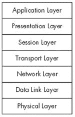

# 第一章。网络简介

宽带无线网络是互联网最终实现连接已知宇宙中所有事物的终极目标的一步。

无线网络结合了两种通信技术：数据网络使得两台或多台计算机之间共享信息成为可能，以及使用电磁辐射将信息从一个地方移动到另一个地方的无线电（或无线）通信。

最早的 Wi-Fi 系统提供了一种方便的方法，可以将笔记本电脑连接到办公室网络，以及将计算机连接到家庭网络，而无需在房间之间拉线。如今，Wi-Fi 和其他宽带服务允许数百万用户在远离家或办公室时连接到互联网，因为无线信号覆盖了整个大都市地区。

各种产品和服务的不同方法都是为了实现一个基本目标：使用无线电信号无线交换网络数据。每种服务都有其独特的一套功能，并且每种服务都使用略微不同的技术。最广泛使用的三种系统是 Wi-Fi、WiMAX 和 3G 蜂窝服务。

下一章将解释这三种宽带无线网络是如何工作的。但在我们深入探讨具体的无线数据网络服务之前，了解网络的一般概念将是有益的。

# 数据传输

首先，让我们回顾一下计算机数据的一般结构和网络用来将数据从一个地方移动到另一个地方的方法。这可能是一些你已经熟悉的基本内容，但请耐心地跟我读几页。这真的会帮助你理解无线网络是如何运作的。

## 比特和字节

如你所知，计算机的处理单元只能识别两种信息状态：信号是否存在于处理器的输入端。这两种条件通常描述为 1 和 0，开和关，或标记和空白。每个 1 或 0 的实例都是一个*比特*。

每个二进制位（1 或 0）在通信渠道的不同类型中表现形式各不相同。它可能是一个光信号、一个声音或一个开/关的电气电荷，一系列长声和短声或光闪，两种不同的音频音调，或两种不同的无线电频率。

单个比特并不特别有用，但当你将 8 个比特串联在一起形成一个**字节**时，你可以有 256 种不同的组合。这足以分配给字母表中的所有字母（大小写），从 0 到 9 的 10 个数字，单词之间的空格，以及其他符号，如标点符号和用于外语的字母。现代计算机可以同时识别和处理多个 8 位字节。处理完成后，计算机在其输出端传输相同的比特流。输出可能连接到打印机、视频显示器或数据通信通道。或者可能是其他完全不同的东西，比如一系列闪烁的灯光。图 1-1 是一个比特序列的例子。

**图 1-1. 这些比特形成了 A（01000001）和 n（01101110）的序列。**

我们在这里关注的输入和输出是构成通信电路的那些。就像计算机处理器一样，数据通道一次只能识别一个比特。要么在线路上有信号，要么没有。

然而，在短距离内，可以通过一根电缆发送数据，这根电缆通过八根（或八的倍数）单独的电线并行传输八个信号。显然，并行连接可以比通过单根电线发送一个比特快八倍，但那八根电线成本是单根电线的八倍。当电线只有一英尺或两英尺长时，这种额外成本微不足道，但当你试图在长距离发送数据时，这种额外成本可能会变得难以承受。而且当你使用现有电路，如电话线时，你没有任何选择；你必须找到一种方法，通过现有的两对电线（或其他媒体）发送所有八个比特。解决方案是每次传输一个比特，并使用一些额外的比特和暂停来标识每个新字节的开始。这是一个**串行**数据通信通道，这意味着你是一比特接一比特地发送。在这个阶段，你使用什么介质来传输这些比特并不重要——它可能是电线上的电脉冲、两种不同的音频音调、一系列闪烁的灯光，甚至是一系列附着在信鸽腿上的音符——但你必须有一种方法，将计算机的输出转换为传输介质使用的信号，并在另一端将其转换回来。

## 错误检查

在一个完美的传输电路中，从一端进入的信号将完全与从另一端出来的信号相同。但在现实世界中，几乎总是存在某种噪声，可能会干扰我们的原始纯净信号。*噪声*被定义为添加到原始信号中的任何东西；它可能是由闪电击中、来自另一个通信通道的干扰，或者电路中某个地方的电气接触上的污垢（或者在那些信鸽的例子中，是一只掠夺性的鹰的攻击）。无论来源如何，通道中的噪声都可能中断数据的流动。在现代通信系统中，这些比特以极快的速度穿过电路——每秒数百万个——因此即使是短短一秒钟的噪声冲击也可能摧毁足够的比特，将你的数据变成数字垃圾。

因此，你必须在数据流中包含一个称为*错误检查*的过程。错误检查是通过向每个字节添加某种标准信息来完成的。在简单的计算机数据网络中，握手信息（在下一节中描述）被称为*奇偶校验位*，它告诉接收每个字节的设备字节内 1 和 0 的总和是奇数还是偶数。如果接收设备发现奇偶校验位不是它预期的，它将指示发送器再次发送相同的字节。这个值被称为*校验和*。更复杂的网络，包括无线系统，在每个数据字符串中包含额外的错误检查握手数据。 

## 握手

当然，发起消息或数据流的计算机不能直接上网开始发送字节。首先，它必须警告另一端的设备它已准备好发送数据，并确保预期的接收者已准备好接收数据。为了完成这项任务，一系列的*握手*请求和回答必须围绕实际数据。

请求的顺序大致如下：

| 来源: "嘿，目的地！我有一些数据要给你。" |
| --- |
| 目的地: "好的，来源，请继续。我准备好了。" |
| 来源: "数据来了。" |
| 来源: 数据 数据 数据 数据 … 校验和 |
| 来源: "这是信息。你收到了吗？" |
| 目的地: "我收到了一些东西，但看起来好像损坏了。" |
| 来源: "它又来了。" |
| 来源: 数据 数据 数据 数据 … 校验和 |
| 来源: "这次你收到了吗？" |
| 目的地: "是的，我收到了。我准备好接收更多数据了。" |

我们可以将握手信息的具体内容留给网络设计者和工程师，但重要的是要理解，通过计算机数据网络传输的每一个比特都不是原始信息的一部分，这些信息到达了输入计算机。在一个复杂的网络中，例如无线数据通道，多达 40%或更多的传输数据是握手和其他开销。这些都是必不可少的，但每一个比特都会增加消息通过网络所需的时间。

## 寻找目的地

在起点和目的地之间通过直接物理连接（例如，有线连接）进行通信时，不需要在消息中包含任何类型的地址或路由信息。你可能需要首先设置连接（通过打电话或把电缆插入交换机），但一旦连接，该链路就会保持直到你指示系统断开连接。这种类型的连接非常适合语音和简单的数据链路，但对于服务于许多起点和目的地的复杂网络上的数字数据来说并不高效，因为单个连接会一直占用电路，即使没有数据通过该通道。

另一种选择是将你的消息发送到一个交换中心，该交换中心将保留它，直到到达目的地的链路变得可用。这被称为*存储转发*系统。如果网络已经根据系统中的数据类型和流量量进行了适当设计，等待时间将微不足道。如果通信网络覆盖了大量的领土，你可以在消息到达最终目的地之前将其转发到一个或多个中间交换中心。这种方法的一个巨大优势是许多消息可以在可用基础上共享相同的电路。

为了使网络更加高效，你可以将超过某个任意限制的消息分成单独的部分，称为*数据包*。来自多个消息的数据包可以在同一电路中一起传输，在目的地重新组装成原始消息，并在它们在交换中心之间传输时与其他包含其他消息的数据包结合。每个数据包还必须包含另一组信息：数据包目的地的地址，数据包相对于原始传输中其他数据包的序列，等等。其中一些信息指示交换中心将每个数据包转发到何处，而其他信息告诉目的地设备如何将数据包中的数据重新组装成原始消息。

每当你向通信系统添加另一层活动时，这种相同的模式都会重复。每一层都可以向原始消息附加更多信息，并在完成附加信息指示的任务后移除该信息。当一条消息从无线网络上的笔记本电脑通过局域网（LAN）和互联网网关传送到连接到另一个 LAN 的远程计算机时，在收件人阅读原始文本之前，可能会添加和移除十几个或更多信息附件。在包含消息内容的比特之前包含地址和控制信息，之后是错误检查序列的数据包称为*帧*。有线和无线网络都将数据流划分为包含各种握手信息和原始数据的帧。

有助于将这些比特、字节、数据包和帧想象成你通过复杂的邮件投递系统发送的信件的数字版本：

1.  你写一封信并将其放入信封。收件人的姓名和地址印在信封的外面。

1.  你将信件带到邮政室，那里的职员将你的信封放入更大的快递信封中。大信封上印有收件人工作的办公室的名称和地址。

1.  邮政室职员将大信封带到邮局，另一位职员将其放入邮袋。邮局在邮袋上贴上标签，标明为服务收件人办公室的邮局位置。

1.  邮袋乘坐卡车前往机场，在那里与其他前往同一目的城市的邮袋一起装入货运集装箱。货运集装箱上有一个标签，告知货运操作员集装箱内有邮件。

1.  货运操作员将容器放入飞机内。

1.  在这个阶段，你的信件已经放在信封里，信封又放在快递信封里，快递信封又放在邮袋里，邮袋又放在容器里，容器又放在飞机里。飞机飞往目的地城市附近的另一个机场。

1.  在目的地机场，地面工作人员将集装箱从飞机上卸下。

1.  货运操作员将邮袋从货运集装箱中取出，并将其放在另一辆卡车上。

1.  卡车将邮袋运送到收件人办公室附近的邮局。

1.  在邮局，另一位邮局职员从邮袋中取出大信封，并将其交给邮递员。

1.  邮递员将大快递信封送到收件人的办公室。

1.  办公室接待员从快递信封中取出你的信封，并将其交给收件人。

1.  收件人打开你的信封并阅读信件。

在每个步骤中，包装外部的信息告诉某人如何处理它，但那个人并不关心里面是什么。你或最终阅读你信件的人从未见过那个大快递信封、邮件袋、卡车、集装箱或飞机，但每一个这样的容器都在将你的信件从这里运到那里的重要部分中扮演着角色。

与信封、邮件袋、集装箱和飞机不同，一个电子消息使用每个数据包的开始或结束处的数据字符串来告诉系统如何以及在哪里处理你的消息，但最终结果几乎是一样的。在 OSI 网络模型（下一节将描述）中，每一种运输方式都是一个独立的层。

幸运的是，网络软件会自动添加和删除所有前缀、地址、校验和以及其他信息，所以你和接收你消息的人永远不会看到它们。

然而，添加到原始数据中的每一项都会增加数据包、帧或其他包装的大小，因此增加了通过网络传输数据所需的时间。因为名义上的数据传输速度包括了原始消息中的数据以及所有开销信息，所以通过无线网络的实际数据传输速度要慢得多。换句话说，即使你的网络连接速度为 11Mbps，你的实际文件传输速度可能只有大约 6 或 7Mbps，甚至更少。这听起来像是一个巨大的减速，但在通过 1.5Mbps DSL 线路或甚至 5Mbps 电缆调制解调器连接到互联网的 Wi-Fi 网络中，这实际上并不重要；你的无线链路仍然能够比 DSL 或电缆调制解调器提供的数据传输得更快。另一方面，如果你使用的是通过超快光纤连接到互联网的 Wi-Fi，或者如果你想在本地网络中移动非常大的音频、视频或 CAD 文件，你将想要使用更快的 Wi-Fi 版本，即 802.11g 或（当它可用时）802.11n。

# ISO OSI 模型

正如包裹递送示例所证明的，信息本身只是过程的一部分。当信息通过网络传输时，所有涉及的各方——发起者、最终接收者以及中间的一切——都必须同意他们将使用相同的格式、时序和路由规则和规范。这些规则（也称为*协议*）定义了网络的内部“管道”以及通过它的信息的形式。

随着网络通信变得更加复杂，网络设计师的社区已经接受了国际标准化组织（ISO）的开放系统互联（OSI）模型来识别网络链路的各个元素。OSI 模型适用于几乎任何类型的数据通信系统，包括本书后面将要描述的宽带无线网络。

由于通信行业的每个人都使用 OSI 模型，它鼓励硬件和软件设计人员创建能够与其他制造商的类似产品交换信息的系统和服务。如果没有 OSI 模型或类似的东西，就不可能期望来自多个来源的设备能够协同工作。

OSI 模型还允许设计人员只需更改网络的一个元素，而无需从头开始设计其他所有内容。例如，无线网络在物理层使用无线电信号而不是电缆，并在数据链路层添加路由信息，但保持其他所有内容的现有协议和规范。复杂的网络（如互联网）可以使用有线连接的一部分信号路径，而另一部分使用无线连接。

OSI 模型通常被描绘为七层的堆叠，每一层都作为直接位于其上层的层的基石，如图图 1-2 所示。

**图 1-2. OSI 网络模型有七层。**

从底层开始，以下各节描述了 OSI 模型的七层。

## 物理层

正如其名所示，*物理层*定义了携带网络连接端点之间信号的物理媒体或硬件。物理层可能是一根同轴电缆、一对电话线、闪烁的灯光或无线电波。

网络物理层的规范可能包括外壳的形状和电缆连接器中的引脚编号，定义 0 和 1（开和关）值的电压，单个数据位的持续时间，以及无线电发射机和接收器使用的无线电频率和调制方法。

## 数据链路层

*数据链路层*处理通过物理层定义的链路上的数据传输。它指定了通过网络传输的每个数据包的格式，包括每个数据包的目的地、网络的物理结构、数据包的顺序（以确保数据包按正确顺序到达），以及流量控制类型（以确保发送者不会发送比接收者能处理得快的数据）。每个数据包还包括一个校验和，接收者使用它来确认数据在传输过程中没有被损坏，以及包含数据包内部实际数据的位和字节序列。因此，它包含创建和解释通过物理层移动的信号的软件。

在有线和无线以太网中，连接到网络的每个物理设备都有一个独特的 48 位媒体访问控制（MAC）地址，该地址标识了它对网络的身份。数据包的头部（数据字符串中的第一部分）包括该数据包的源和目的地的 MAC 地址。

## 网络层

网络层指定了信号从源到目的地移动的路径，独立于物理媒体。在网络层，数据是通过电缆、无线电波，还是两者结合使用，这都不重要，因为这一切都在较低层次处理。

在互联网内部，局域网（LAN）、广域网（WAN）和核心互联网主干电路之间的数据交换发生在网络层。

## 传输层

从传输层开始，OSI 模型关注的是两台不同计算机上程序之间的通信，而不是数据从 A 点到 B 点的移动过程。例如，当你在网上查看网页时，你的计算机上的浏览器（如 Internet Explorer 或 Firefox）与包含该网页的 web 服务器之间的连接发生在传输层（但发送给服务器的命令发生在应用层）。

## 会话层

会话层定义了通过传输层连接的程序用于交换数据的格式。如果程序使用密码或其他认证来确保连接远端的程序被允许使用本地程序，这种认证发生在会话层。

## 表示层

表示层控制每台计算机处理文本、音频、视频和其他数据格式的方式。例如，如果远程计算机发送一个 JPEG 格式的图片，将数据字符串转换为显示器或打印机上的图片的软件运行在表示层。

## 应用层

应用层处理通过网络移动的命令和数据。例如，当你发送一封电子邮件时，你的消息内容（但不包括地址或格式化信息）位于应用层。你通过网络发送的大多数单词、图片、声音和其他形式的信息都是通过应用层进入系统的。

# 概述

通常，数据网络在过去 100 年中已经从非常简单（且相对较慢）的电报服务发展到今天复杂的高速通信系统。网络中最重要的改进之一是用无线电信号替换连接单个用户到全球网络网格（也称为互联网）的许多电线和电缆。第二章解释了如何将传统网络服务与无线信号相结合。
