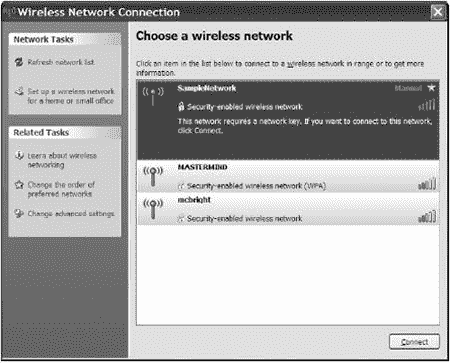
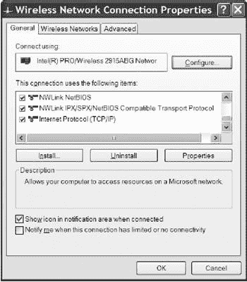
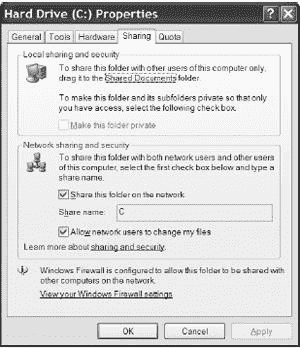

# 第六章. Windows 下的 Wi-Fi

在理想的世界里，将无线网络适配器插入计算机，启动它，立即连接到网络是可能的。无需烦恼（也不需要像这本书这样的指南）。Windows 应该就是这样工作的；当 Windows 在启动时识别到网络适配器时，它应该自动在桌面上放置一个网络图标，并配置计算机需要连接的所有设置。

但事情永远不会那么简单。在您开始通过无线网络传输数据之前，您可能需要告诉 Windows 如何以及在哪里找到网络，以及如何通过无线局域网连接到互联网。本章解释了使 Windows 与无线局域网协同工作的一般原则，以及您将需要配置不同版本的 Windows 中的网络工具和功能的特定程序。这是一件繁琐、挑剔的事情，但您的网络连接不正常时，这将消除很多麻烦。

在 Windows XP 和 Windows Vista 中，如果您的网络适配器包含与 Microsoft 的自动配置工具兼容的固件，所有这些配置活动都应自动完成。大多数最新的 Wi-Fi 适配器都配备了与 Windows XP 工具兼容的驱动程序，但您可能需要下载更新版本才能在 Vista 中使用您的适配器。如果您的计算机无法自动识别适配器，请在制造商的网站上寻找设备驱动程序软件。

### 注意

*不幸的是，许多较旧的 Wi-Fi 适配器的 Windows Vista 设备驱动程序不可用，尤其是那些仅使用 802.11b 标准的适配器。制造商可能将这些称为*生命终结*或*遗留*产品，但归根结底是同一件事：他们已经停止了支持。如果您想使用这些适配器与 Vista 一起使用，您就无计可施；您的唯一选择是购买一个新的适配器*。

如果您有设置 Windows 网络的经验，您在无线网络方面不应该遇到太多麻烦。就 Windows 而言，无线适配器只是另一种与应用程序和操作系统交换数据的网络接口。在 Windows 2000 之前，“无线”功能发生在其他地方；在 XP 中，有一个专门的标签页用于无线特定设置，如图图 6-1 所示。为 Windows 配置无线网络就是让这台特定的计算机意识到它已连接到网络，并设置网络服务器和服务的地址。

**图 6-1. 无线网络连接窗口包括无线网络标签页**

# 通常的 Windows 网络配置

不同的 Windows 版本使用不同的配置工具，但它们都完成相同的事情：计算机的 IP 地址、子网掩码和网关地址设置必须与网络其他部分所需的值相匹配。完全有可能在不理解它们含义的情况下设置这些值，但了解网络实际工作原理总是有帮助的。

您局域网路由器上的无线接入点安装手册应告知您在配置网络时应使用哪些 IP 地址或其他设置。如果您无法在随硬件提供的印刷材料中找到这些信息，请向您的网络管理员或互联网技术支持中心寻求帮助。

## IP 地址

网络客户端的数字互联网协议（IP）地址是同一网络中的其他计算机用来访问该设备的正式标识。网络上的每台计算机都必须有不同的地址。

管理互联网的机构已经建立了一个复杂的编号系统，为连接到互联网的每个设备分配一个唯一的地址。数字 IP 地址总是以 0 到 255 之间的四组数字的形式出现，因此 IP 地址的总范围从 0.0.0.0 到 255.255.255.255。这些数字有时被称为*八位字节*，因为它们使用八个二进制位（二进制 11111111 等于十进制 255）。

一个数字 IP 地址可以标识一台计算机，也可以是连接到路由器（或更大的网络）的 LAN（或更大网络）的网关。在某些网络中，LAN 上的所有计算机（以及其他设备，如打印机）可以通过网络地址转换（NAT）机制共享一个公共接口。

每台本地计算机也必须在局域网（内部地址）内拥有一个唯一的数字 IP 地址。在采用 NAT 的网络中，连接局域网与互联网的路由器或其他网关会在内部和外部 IP 地址之间进行转换。

为了防止本地 IP 地址与互联网地址之间的冲突，已经预留了几个数字范围，供本地网络作为内部 IP 地址使用。这些地址永远不会出现在互联网上，并且可以在多个本地网络同时使用（只要网络之间不需要直接通信），但如果你维护多个网络，使用不同的范围可能有助于你保持理智。私有网络地址如下：

| 10.0.0.0 到 10.255.255.255 |
| --- |
| 172.16.0.0 到 172.31.255.255 |
| 192.168.0.0 到 192.168.255.255 |

### 分配地址

在某些网络中，动态主机配置协议（DHCP）服务器为网络上的每个客户端设备分配不同的 IP 地址。服务器在客户端加入网络时为每个客户端设备分配地址，因此同一个客户端可能在不同会话中具有不同的本地地址；这就是为什么它被称为*动态主机配置*。

DHCP 服务器通常位于控制网络中所有设备的路由器中。在纯无线网络中，这可能在接入点中；在同时具有无线和有线链路的混合网络中，DHCP 服务器可能位于互联网网关中。图 6-2 显示了典型网络中的服务器。

**图 6-2。一个 DHCP 服务器为局域网中的所有设备提供本地 IP 地址。**

当 DHCP 服务器处于活动状态时，局域网上的所有网络客户端计算机应指示 Windows（和其他网络操作系统）自动获取 IP 地址。如果网络不使用 DHCP 服务器，网络管理员必须为每个客户端分配一个永久地址。如果您的网络管理员手动分配地址，请将地址的副本保存在文本文件中，并保留纸质的备份。如果您是网络管理员，在分配地址时，保留您自己的地址列表的两个或多个副本。

您的接入点手册应指定客户端设备的正确地址范围，并解释如何分配它们。如果您使用 DHCP，服务器将自动分配它们。如果您不使用 DHCP，您必须在指定的地址范围内为网络中的每个设备使用不同的地址（换句话说，您必须确保两个或更多设备不使用相同的 IP 地址）。

在大多数 DHCP 服务器中，也可以每次为每个客户端分配相同的地址，这可能会非常有帮助。如何配置这取决于您的 DHCP 服务器，但通常需要知道以下之一：

+   客户端的名称（由大多数操作系统在 DHCP 请求中发送），这是一个任意的人可读名称，通常与 Windows 配置用于文件共享的系统名称相同。

+   客户端的 MAC 地址，这是一个 12 字符的地址，每个网络卡都是唯一的。获取此地址的最简单方法是在客户端系统的网络设备属性中查看，或者在接入点或 DHCP 服务器上的连接日志中查看。

## 子网掩码

*子网掩码*是一串由四个数字组成的字符串，它指定了 IP 地址的哪些部分标识网络或本地子网（子网），哪些部分标识网络上的单个计算机和其他设备。这四个数字通常是 255 或 0。例如，如果子网掩码是 255.255.255.0（最常见的值），那么网络中的所有数字 IP 地址都必须是*XXX.XXX.XXX.ZZZ*的形式，其中*XXX.XXX.XXX*对所有地址都相同，而*ZZZ*在每个地址中都是不同的。

子网掩码必须对所有由这些接入点服务的接入点和无线客户端相同。在小型和中等规模的网络中，子网掩码几乎总是 255.255.255.0。

## 网关

*网关*是无线接入点、路由器或其他充当局域网上的计算机与其他非本地网络中的设备或网络之间的接口的设备。任何不属于本地网络的计算机试图与网络上的设备通信时，都必须通过网关传输数据。

网关地址（有时称为*默认网关*）是网关服务器的数字 IP 地址。在无线网络中，每个网络客户端的网关地址设置必须与接入点使用的 IP 地址相同。如果一个无线网络有多个接入点，网络中的所有接入点都必须使用相同的网关地址。

如果一个接入点同时充当集线器或路由器，该接入点用于有线和无线客户端的网关地址与其用于与局域网或互联网服务器通信的网关地址不同。当您配置网络客户端时，请记住使用接入点的局域网 IP 地址作为默认网关，而不是广域网网关的地址。

## 域名服务器

*域名服务器*是一台计算机，它将诸如[nostarch.com](http://nostarch.com)或[hard-cider.com](http://hard-cider.com)之类的域名转换为使用这些地址的计算机或其他设备的数字 IP 地址。一些 DHCP 服务器会自动提供 DNS 地址，但其他服务器则需要手动输入。如果您不使用 DHCP，您必须指定至少一个 DNS 地址。

大多数网络和互联网服务提供商使用两个或更多的 DNS 服务器，以便在主服务器离线时提供自动备份。您的网络管理员或您的互联网服务提供商应向您提供您网络 DNS 服务器的地址。作为最后的手段，如果您找不到您自己网络 DNS 服务器的地址，您可以使用[`www.tech-faq.com/public-dns-servers.shtml`](http://www.tech-faq.com/public-dns-servers.shtml)上列出的公共 DNS 服务器或[`www.opennic.unrated.net/public_servers.html`](http://www.opennic.unrated.net/public_servers.html)上列出的 OpenDNS Tier 2 服务器。为了获得最佳性能，请选择离您最近的服务器。

一些接入点和网络网关也要求提供 DNS 地址。接入点或网关中的列表应与每个客户端上的 DNS 服务器列表相同。

## 文件和打印机共享

当文件共享处于活动状态时，其他网络用户可以读取和写入到您的计算机的文件。打印机共享允许其他用户将文件和文档发送到连接到共享打印机的打印机。在 Microsoft 网络中，包含可供其他用户使用的文件的文件夹称为*共享*。

共享文件或文件夹的访问级别指定了其他用户是否可以读取文件但不能更改它，或者他们是否有权限添加、删除或更改文件的内容。

## 网络接口适配器选项

如果您在配置实用程序中找不到设置或选项，请查看无线适配器的属性窗口。每种类型的网络接口适配器的驱动程序都包含一组控制该适配器特定功能的选项，例如客户端将在网络上使用的名称、数据传输速度、操作模式以及省电模式。图 6-3 显示了适配器属性的典型列表。

要在 Windows XP 中打开属性窗口，请转到“控制面板”，选择“系统”图标，选择**硬件**选项卡，然后单击**设备管理器**选项卡。在 Windows Vista 中，打开控制面板，选择**系统**，然后在系统窗口左侧的任务列表中单击**设备管理器**。打开网络适配器列表，双击您的无线适配器条目。选项列表位于**高级**选项卡下。

许多相同的适配器选项也出现在适配器提供的配置实用程序中，以及 Windows XP 中的无线配置实用程序中。当您在一个地方更改一个选项时，下次打开它时，该更改也应出现在另一个位置。

## 为您的计算机命名

网络使用数字 IP 地址来查找和识别您的计算机，但网络的人类用户会希望有一个比那些数字和点更容易识别和记住的名字。大多数用户不会知道或关心 192.168.0.34 是办公室中的计算机，而 192.168.0.37 是厨房中的笔记本电脑。因此，您（或网络管理员）必须为网络中的每台计算机分配一个名字。这个名字将出现在您通过网络可以访问的所有目录和计算机列表中，如图图 6-4 所示。每台计算机必须有一个唯一的名称，最大长度为 15 个字符和空格。

**图 6-3. 高级网络连接选项卡控制许多配置设置。**

计算机描述字段不是必需的，但它可以提供比 15 个字符的计算机名称限制更多的详细信息，供其他用户了解网络客户端。

**图 6-4. 网络窗口中显示每个计算机的名称和描述。**

Windows 还提供了一个空间，用于将网络上的每个计算机分配到工作组。在小型局域网中，您可能希望将所有计算机分配到单个工作组。因此，工作组名称设置必须在网络中的每台计算机上相同。

至少有两种不同的方式可以为您的计算机命名并加入工作组。当您在 Windows XP 或 Vista 中设置网络时，网络设置向导包括可以分配名称和描述以及识别工作组的屏幕；不幸的是，工作组名称会恢复到默认值（例如家庭网络中的 MSHOME），因此每次运行向导时，都必须将其更改为您自己的工作组名称。

在网络设置完成后，您可以通过打开控制面板  系统 计算机名称来更改计算机的名称或将它分配到不同的工作组中。在 Vista 中，使用控制面板  系统和维护  系统  查看此计算机的名称  更改设置。

在某些无线网络中，工作组的名称必须与接入点使用的 SSID 相同，尤其是在网络配置工具不显示附近网络列表的情况下。如果您连接有问题，请尝试将工作组名称更改为您想要加入的网络 SSID。

# 配置 Windows

微软在 Windows XP 和 Windows Vista 中包含了针对无线网络的具体支持，旨在将无线配置与其他 Windows 配置设置集成。理论上，这应该使设置和使用无线网络更容易，但仍然不是一个简单的即插即用过程。

目标是自动无线配置：Windows 应该自动检测您的无线网络适配器并搜索可访问的无线网络信号。当它检测到附近的网络时，Windows 应该允许用户只需几点击就能加入网络。如果您更换了不同的品牌适配器，您也不必学习一套新的命令和控制。

那是目标，但仍然有一些不太明显的配置设置隐藏在设备管理器中而不是无线配置工具中，因此可能需要使用网络适配器提供的配置工具来处理不太明显的网络配置设置和选项。

## 您有最新的固件吗？

几乎每个网络适配器制造商都在其网站上提供最新的升级，作为免费下载。在此过程中，使用 Internet Explorer 工具菜单中的 Windows 更新链接，确保您拥有最新的 Windows 版本，包括所有可用的更新、补丁和服务包。

## 使用 Windows 无线工具

一些厂商已经将 Windows 无线属性控制与自己的程序集成，而另一些则将整个过程委托给了 Windows 工具。例如，Intel PROSet/Wireless 控制屏幕中的适配器设置命令（如图 6-5 所示）链接到 Windows 网络连接属性窗口（如图 6-3 所示的窗口）。

**图 6-5. Intel 控制窗口中的适配器设置命令链接到 Windows 无线网络属性窗口。**

其他适配器允许您在他们自己的控制程序和 Windows 工具之间进行选择。此外，一些流行的笔记本电脑制造商将另一个 Wi-Fi 控制程序作为其专有软件包的一部分。所有这些程序可能都做同样的事情，所以正确的选择是您最喜欢的一个。尝试每一个，并使用看起来最容易理解和使用的那个。

以下部分解释了如何使用 Windows 无线配置工具。

### 建立连接

要将计算机连接到 Wi-Fi 网络，请双击时钟旁边的系统托盘中的网络图标。在某些系统（如图 6-6

**图 6-6. 点击无线网络图标以设置 Wi-Fi 连接。**

### 注意

*本节中的所有图像均来自 Windows XP。Windows Vista 中的窗口和对话框与 Windows XP 类似，但并不完全相同*。

图 6-7 中显示的无线网络连接窗口将打开。

**图 6-7. 无线网络连接窗口列出了计算机网络适配器范围内的所有 Wi-Fi 信号**

选择您想要加入的网络，并单击窗口底部的**连接**按钮。在本例中，SampleNetwork 是最近的信号最强（五个条）。

无线网络连接状态窗口显示了您的无线链路当前状态，包括连接状态、当前链路活跃的时间、数据传输速度、信号质量和自适配器连接到网络以来适配器发送和接收的字节数。要查看状态窗口，右键单击无线图标，并在弹出菜单中选择**状态**。图 6-8 显示了状态窗口。

**图 6-8. Windows XP 中的无线网络连接状态窗口**

在大多数情况下，连接工具将自动配置您的计算机以与网络交换数据。如果它没有这样做，您可能需要更改一个或多个设置。如果您正在尝试连接到自己的网络，请查阅随 Wi-Fi 接入点提供的说明书。如果您正在连接到公共网络，请查找由 Wi-Fi 服务提供商提供的印刷或在线配置或设置说明。

要更改最常用的网络设置，请单击无线网络连接状态窗口底部的**属性**按钮。要关闭无线电链路，请单击**禁用**按钮。

### 网络配置设置

无线网络连接属性窗口与有线网络连接的属性窗口类似，增加了一个无线网络选项卡，如图图 6-9 所示。

**图 6-9. 选择互联网协议（TCP/IP）以设置网络选项。**

要配置您的无线连接，请按照以下步骤操作：

1.  在已安装的项目列表中，选择**互联网协议（TCP/IP**）并点击**属性**按钮。将出现一个类似于图 6-10 的互联网协议（TCP/IP）属性窗口。

1.  如果您的接入点或其他网络设备中的 DHCP 服务器处于活动状态，请选择自动获取 IP 地址和自动获取 DNS 服务器地址选项。如果您不使用 DHCP 服务器，请选择使用以下 IP 地址选项，并在 IP 地址字段中输入分配给此计算机的 IP 地址。公共网络几乎总是使用 DHCP 服务器，以便尽可能简化用户的连接；首先尝试自动获取 IP 地址选项。

1.  子网掩码字段位于控制 IP 地址的同一互联网协议（TCP/IP）属性选项卡中。如果您在网络中不使用 DHCP 服务器，请输入与接入点使用的相同子网掩码。如果您不知道子网掩码值，请尝试 255.255.255.0。

1.  如果您不使用 DHCP 服务器，请在默认网关字段中输入无线接入点的 LAN IP 地址。您可以从网络管理员或接入点手册中获取该地址。

    

    **图 6-10. 互联网协议（TCP/IP）属性窗口控制网络连接选项。**

1.  如果 DHCP 服务器将 DNS 地址分配给网络客户端，请选择自动获取 DNS 服务器地址选项。如果网络使用静态域名服务器，请选择使用以下 DNS 服务器地址选项，并输入网络管理员或互联网服务提供商提供的 DNS 地址。

1.  点击**确定**按钮以保存您的设置并关闭此窗口。

### 文件和打印机共享

要使文件夹或整个驱动器的内容可供其他网络用户访问，右键单击文件夹或驱动器的图标，并从下拉菜单中选择**共享和安全**选项（在 Windows XP 中）或**共享**选项（在 Windows Vista 中），以查看图 6-11 中显示的对话框。

要允许 XP 中的计算机上的用户访问此文件夹或驱动器，请选择**在网络上共享此文件夹**选项。在 Vista 中，点击**高级共享**按钮并选择**共享此文件夹**。要允许网络上的其他用户编辑或删除文件，请选择**允许网络用户更改我的文件**选项。

当你在 Windows XP 中允许共享时，共享项目的图标会发生变化。共享文件夹或驱动器有一个图标，显示一只手“服务”网络中的项目。

**图 6-11. 点击共享选项卡以更改文件夹或驱动器的文件和文件夹共享特性。**

## 网络接口适配器选项

要更改网络接口适配器选项，请按照以下步骤操作：

1.  双击系统托盘中的 Windows Wi-Fi 图标以打开无线网络连接窗口。

1.  在连接窗口左侧的相关任务列表中选择**更改高级设置**项。将打开无线网络连接属性窗口。

1.  从连接属性窗口中，点击**配置**按钮。将出现适配器属性窗口。

1.  点击**高级**选项卡。将出现一个类似于图 6-12 中的属性列表。对于每个网络适配器的品牌和型号，具体细节和措辞可能有所不同。

1.  高亮显示属性列表中的每个项目，以在值字段中查看当前设置。一些值是文本字段，而另一些是下拉菜单。要更改文本字段中的当前值，请选择当前文本并输入新值。要更改菜单中的值，打开下拉菜单并选择您想要使用的新值。

1.  点击**确定**按钮以保存更改并关闭窗口。在网络窗口中点击**确定**按钮返回桌面。

**图 6-12. 在适配器属性窗口中点击高级选项卡以配置网络适配器。**

一些无线网络适配器不接受通过 Windows 的任何选项设置。如果您在适配器属性窗口中看不到高级选项卡，请使用适配器提供的配置实用程序来更改适配器设置。

## 为您的计算机命名

要在 Windows XP 中设置或更改分配给计算机的名称，请点击系统属性窗口中的**计算机名称**选项卡。按照以下步骤更改设置：

1.  在控制面板中双击系统图标。在 Windows XP 中，将出现系统属性窗口。在 Vista 中，将打开“查看您的计算机基本信息”窗口；在“计算机名称、域和工作组设置”标题下，点击**更改设置**。

1.  点击**计算机名称**选项卡。将出现图 6-13 中显示的对话框。

1.  在计算机描述字段中输入标识此计算机的网络名称。

1.  点击**更改**按钮。将打开图 6-14 中的计算机名称更改窗口。

1.  点击**确定**按钮保存您的更改并关闭窗口。

**图 6-13. 打开计算机名称选项卡以更改计算机的名称和网络 SSID。**

### 选择网络

如果您的计算机在多个网络的范围内，您必须选择您想要使用的网络。无线网络属性实用程序包括首选网络列表，但它不会限制您只能使用该列表上的网络。

无线网络连接窗口中的网络列表显示了所有将接受您的无线适配器连接的网络 SSID。如果适配器只检测到一个网络，Windows 将自动尝试连接到该网络。当网络适配器检测到多个网络时，它会将每个网络的 SSID 与首选网络列表中的名称进行比较，并自动连接到优先级最高的网络。您可以通过在连接窗口中点击**更改首选网络顺序**，并使用属性窗口中的向上和向下按钮来改变 Windows 搜索网络的顺序。

如果您的适配器检测到一个不在首选列表中的网络，它将设置一个连接，前提是高级窗口中的非首选选项是激活的。在属性窗口中点击**高级**按钮以打开该窗口。

当然，计算机可能会做出错误的选择；如果它检测到两个或更多网络，它可能不会自动连接到您想要连接的网络。在这种情况下，在可用网络列表中选择正确网络的名称，然后点击**配置**按钮。这将打开一个包含该网络更多信息的新窗口，并设置与该网络的连接。

**图 6-14. 使用计算机名称更改窗口设置计算机的名称和 SSID。**

### 连接到加密网络

在无线网络连接窗口中，每个 Wi-Fi 网络的列表会告诉你该网络是否使用加密，如果是，它使用的是哪种加密类型。第一次尝试连接到加密网络时，Windows 会要求输入该网络的网络密钥。建立连接后，Windows 将存储该密钥，并在你连接到同一网络时尝试使用它。

# 连接故障排除

无论您使用的是 Windows XP 还是更早版本的操作系统，都应该能够设置无线网络的连接。如果自动连接功能不起作用，不要假设您做错了什么——更有可能的是，您是某人不良设计的受害者。以下是一些需要检查的事项：

+   您计算机使用的 SSID 是否与您想要加入的网络 SSID 完全相同？

+   加密是开启还是关闭？如果是开启的，您是否使用了正确的加密密钥？加密是否设置为 64 位或 128 位？

+   接入点是否使用 MAC 地址过滤？您的无线适配器是否在合格用户列表中？

+   工作组名称是否与 SSID 匹配？

+   您的接入点是否使用 DHCP 服务器？如果不是，IP 地址、子网掩码和默认网关设置是否正确？

+   预设长度设置是否正确？要更改预设长度，打开适配器的属性窗口（如图 6-12 所示[Figure 6-12](ch06s02.html#click_the_advanced_tab_in_the_adapters_p "图 6-12. 在适配器的属性窗口中点击高级选项卡以配置您的网络适配器。"））并从属性菜单中选择**预设模式**或**预设长度**。
