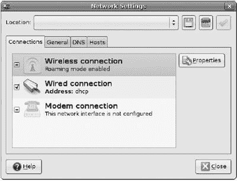
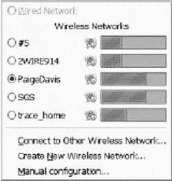
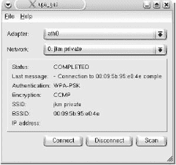
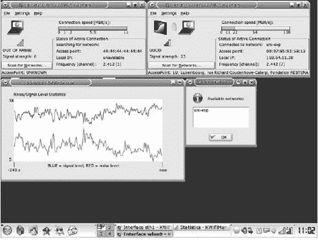
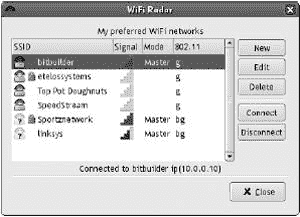

# 第七章。为 Linux 和 Unix 的 WI-FI


Wi-Fi 网络不仅限于使用 Windows 操作系统的计算机。如果您能找到您的网络适配器的驱动软件，运行 Linux、Unix 和 Mac OS X 的计算机都可以支持 Wi-Fi。TCP/IP 网络不在乎连接到网络的计算机使用什么类型的操作系统。它只是从计算机端口接收位和字节，并将它们移动。Linux 和 Unix（包括 Mac OS X）的所有最流行版本和发行版都包括无线网络配置和控制工具，这些工具执行与第六章中描述的 Windows 实用程序相同的功能。本章包含有关将基于 Unix 和 Linux 的计算机连接到 Wi-Fi 网络的信息，并描述了一些可以使事情变得更容易的实用程序和其他工具。

如果您还没有使用 Unix 或 Linux，连接到无线网络并不是开始使用它们的充分理由。有一些 Linux 和 Unix 工具可以测量 Wi-Fi 网络性能和破解无线加密，但这些工具在 Windows 上不可用，除非您是网络管理员，否则您可能对这些工具没有真正的需求。

本章是为已经具备足够经验在笔记本电脑或台式计算机上设置和使用 Unix 或 Linux 操作系统的用户编写的。如果您在使用 Unix 或 Linux 客户端时需要更多帮助，您应该向您所在地区的专家求助，或者寻找一本更通用的 Linux 或 Unix 使用指南，例如 Rickford Grant 所著的*《非极客的 Ubuntu，第 2 版》（2007，No Starch Press）*或 Michael W. Lucas 所著的*《绝对 FreeBSD，第 2 版》（2008，No Starch Press）*。

许多用于桌面和笔记本电脑的 Linux 和 Unix 发行版（而不是服务器），包括 Ubuntu、openSUSE 和 PC-BSD（以及其他），都包括支持许多常见 Wi-Fi 适配器的驱动程序和控制软件，因此运行这些发行版的计算机可能会自动检测并连接到附近的无线信号。如果您使用的是这些支持适配器的发行版，您只需打开计算机，插入适配器，就可以使用了。但如果您的发行版不包括 Wi-Fi 驱动程序和实用程序，或者您有一个不太常见的适配器，您将不得不单独找到驱动程序和控制软件。您可以在本章后面找到这些驱动程序的许多来源。

如果您对随 Linux 或 Unix 发行版提供的 Wi-Fi 控制程序不满意，或者您的发行版不包括 Wi-Fi 程序，您可以选择其他几个执行与内置控制程序相同操作但呈现方式不同的 Wi-Fi 控制程序。这些程序在本章后面有列表。

### 注意

*如果你正在运行 Unix 或 Linux 网络服务器，最好将服务器放置在同一房间内，并使用以太网线将服务器连接到网络路由器，而不是无线连接。一般来说，Wi-Fi 并不是将服务器连接到局域网的最佳方式，因为 Wi-Fi 链路的数据传输速度几乎总是比有线连接慢，并且更容易受到干扰*。

# 驱动程序，无论前后座

在我们深入探讨将设备连接到无线网络之前，让我们花些时间来回顾一下驱动程序的具体作用以及为什么驱动程序很重要。在本章的后面部分，你可以找到关于如何为不同类型的无线网络适配器找到正确的驱动程序以及如何使用它们将 Unix 和 Linux 计算机连接到无线网络的建议。

设备驱动程序是计算机操作系统与连接到计算机的外围设备的输入和输出之间的软件接口。驱动程序包含将设备传入的命令和数据转换为操作系统可以理解的形式的指令，并将操作系统传出的指令转换为特定的设备控制。它处理内存管理和定时，并指定设备将用于与操作系统通信的输入/输出（I/O）端口和中断。图 7-1 显示了计算机和非常通用的设备驱动程序之间的关系。


**图 7-1. 设备驱动程序是计算机和外围设备之间的数据和控制接口。**

每个外围设备，包括无线网络适配器，都需要一个驱动程序，该驱动程序将计算机的标准指令转换为处理该设备特定功能和特性的控制指令。没有驱动程序，设备将无法运行。没有正确驱动程序的设备仅能作为镇纸或门档使用。

例如，键盘的驱动程序会告诉计算机哪个 I/O 端口携带数据到和从键盘，将按键转换为输入数据，并控制 Caps Lock、Num Lock 和 Scroll Lock 灯的开关。打印机驱动程序包括使冲击式打印机和激光打印机之间产生差异的特定控制。输入或输出设备的驱动程序将指定设备使用串行或并行端口、USB 端口、PCMCIA 插槽或计算机主板上的内部扩展插槽之一。无线网络适配器的驱动程序将指定诸如无线电将用于发送和接收数据的频道号、无线电将传输的功率以及适配器将用于传输数据的传输速度等事项。

无线适配器的驱动程序处理 TCP/IP 通信的物理层——仅适配器设置和使用无线电链路连接到网络所需的信息，而其他层处理数据格式化和内容。这确保了适配器可以处理多种数据格式，并且数据可以通过多种不同的适配器类型传输。

驾驶员还使得同一块硬件能够与不同的操作系统协同工作。驱动程序将操作系统产生的输入和输出信号转换为设备“本地语言”中的命令。为不同操作系统编写的控制同一设备的驱动程序以不同形式的指令开始，并将这些指令转换为相同的设备控制集。因此，您的计算机需要为该操作系统专门编写的设备驱动程序。

可以将驱动程序视为设备的说明书。用英语、荷兰语和马来语编写的说明书都包含相同的指令集，但它们以不同用户能理解的语言提供。计算机设备驱动程序类似，只是语言是操作系统而不是人类语言。

设备驱动程序是独立于配置实用程序的程序，但许多软件设计人员将两者合并为单个安装。配置实用程序提供一组命令和显示，通过驱动程序在两个方向上发送和接收数据到网络适配器。

## 如何找到驱动程序

在您可以使用无线网络适配器之前，需要为您的计算机操作系统安装驱动程序。如果您很幸运，或者如果您已经做了仔细的购物，正确的驱动程序可能包含在适配器提供的 CD 中，或者它捆绑在操作系统中。对于 Linux 和 Unix 系统，大多数驱动程序已经集成在操作系统的核心或内核中。

许多无线适配器实际上是私人标签产品，由某个人的名字在包装或设备本身上都没有出现的人制造的。因此，通常需要做一些侦探工作来识别特定适配器的正确驱动程序。Proxim 和 Atheros 在私人标签适配器业务中特别活跃。适配器制造商可能不想告诉你他们盒子里的硬件是谁的，但开发第三方 Linux 驱动程序的人通常已经弄清楚哪些品牌与哪些驱动程序兼容。

寻找 Linux 或 Unix 适配器的第一个地方是在操作系统核心本身。一般来说，最稳定和受支持的驱动程序已经被合并到内核开发过程中。大多数发行版默认会开启所有稳定驱动程序，但在某些情况下可能需要重新编译你的内核。

如果你有选择，最好选择一个已经被你的操作系统支持的适配器。一些制造商提供了编写完整驱动程序所需的必要规范，或者他们自己编写并贡献了驱动程序。其他制造商对 Linux 和 BSD 没有提供官方支持，但一些有奉献精神的人通过仔细逆向工程其他平台上的官方驱动程序来编写驱动程序。对于试图让适配器正常工作的用户来说，最后一个选择是使用一个*包装器*框架，它将 Windows 设备驱动程序包裹在代码中，使其表现得像 Linux 或 Unix 的驱动程序。

生产了自己 Linux 和 Unix 驱动程序或与开源社区合作提供官方规范的适配器制造商，通常在支持设备和向用户提供驱动程序方面做得很好。然而，一些主要供应商却提供不了这样的支持或帮助。如果你已经有一个不支持 Linux 或 Unix 的适配器，你可能不得不从相对理性的商业软件世界转移到用户组、电子邮件列表和社区网站这个广阔的开放宇宙。用户社区中，有数十个开源开发者创建了设备驱动程序和无线配置工具。

## Linux 驱动程序

超过一百种不同品牌的无线网络适配器带有 Wi-Fi 认证标签，但几乎所有的它们都使用少数几个内部芯片组。如果你找不到特定卡的 Linux 或 Unix 驱动程序，你通常可以使用适配器芯片组的通用驱动程序。

随着 Linux 的普及，越来越多的公司将为它们的无线网卡提供自己的 Linux 驱动程序。如果您无法从网卡制造商那里找到 Linux 驱动程序，您可能可以使用 Linux 发行版包中提供的驱动程序之一，或者您可以从芯片组供应商或第三方开发者那里下载一个单独的驱动程序。

要找到 Linux 驱动程序的一个非常好的地方是 Linux 无线局域网支持网站，网址为 [`linux-wless.passys.nl`](http://linux-wless.passys.nl)。如图 7-2 所示，该网站提供了一个搜索工具，您可以使用它来识别网卡中的芯片组，并找到指向驱动程序的直接链接。


**图 7-2. Linux 无线局域网支持网站提供了关于 Wi-Fi 网卡和驱动程序的大量有用信息。**

要找到适配器的驱动程序，请使用 Linux 无线局域网支持网站首页上的搜索菜单之一，打开每个制造商制造的适配器列表或按适配器连接到计算机所使用的接口类型（通常是 PCMCIA 或 USB）排序的接口列表。每个制造商和型号或每个芯片组的列表都包括指向该设备的驱动程序的直接链接。

如果您无法在那些列表中找到适配器的驱动程序，您最好的选择是寻求帮助。Linux 社区以其协助新用户而闻名。可能有人知道哪个驱动程序与您的 Whoopie-Matic Lightning Bolt 无线适配器兼容，并可能已经在 Linux 新闻组中发布了指向您所需信息的指针。关于寻找无线网络适配器驱动程序的问题，comp.os.linux.networking 新闻组是提问的最佳地点。在发布您自己的问题之前，总是先扫描新闻组的存档，寻找以前能解决您问题的答案。在 [groups.google.com](http://groups.google.com) 的 comp.os.linux 部分查找旧问题的可搜索存档。

如果上述任何来源都无法告诉您在哪里可以找到特定制造商和型号的适配器的 Linux 驱动程序，下一步就是识别适配器内部的芯片组，并找到该芯片组的驱动程序。一些适配器附带数据表或手册，其中标识了芯片组，但如果您的适配器没有，请打开控制台并尝试以下命令之一：

+   如果网卡通过 USB 端口连接到计算机，请使用 `lsusb`。

+   如果适配器是 32 位 PC 卡（CardBus 卡），请使用 `lspci`。

+   如果适配器是较旧的 16 位 PC 卡，请使用 `pccardctl ident`。

+   如果网卡安装在台式计算机的 PCI 卡上，请使用 `lspci`。

连接适配器后，通过`dmesg`查看内核消息，以查看是否有更多信息可用。

作为最后的手段，你几乎总是可以通过将适配器标签上的 FCC ID 代码输入到联邦通信委员会的 FCC 设备授权系统通用搜索表单[`gullfoss2.fcc.gov/oetcf/eas/reports/GenericSearch.cfm`](https://gullfoss2.fcc.gov/oetcf/eas/reports/GenericSearch.cfm)来识别芯片组。这个网页提供了链接到一个数据库，其中包含制造商提交给型号批准申请的文件副本，通常包括技术描述和一个或多个电路图。阅读这些文件几分钟应该就能告诉你适配器芯片组的制造商，这应该足以让你在 Linux 无线局域网支持网站上找到相应的驱动程序。

如果你无法在 Linux 无线局域网支持列表或其他来源中找到适配器的驱动程序，还有两种最后的手段可以将 Windows 驱动程序转换为 Linux。第一种是一个名为 NDISwrapper 的免费程序，它将 Linux 支持包裹在制造商的 Windows 驱动程序周围。有关更多信息及免费下载，请访问项目的首页[`ndiswrapper.sourceforge.net`](http://ndiswrapper.sourceforge.net)。另一种选择是 Linuxant 创建的类似商业程序 DriverLoader。有关 DriverLoader 的更多信息以及免费 30 天试用下载，请访问[`www.linuxant.com/driverloader`](http://www.linuxant.com/driverloader)。

### 注意

*在你花费大量时间尝试寻找和安装适用于你旧或罕见的 Wi-Fi 适配器的兼容第三方驱动程序之前，考虑更换一个价格低廉的新适配器，这个适配器可以直接与你的 Linux 版本配合使用。你可能会发现性能更好，并且比使用旧适配器时更少感到烦恼*。

## Unix 驱动程序

Unix 系统的 Wi-Fi 驱动程序和网络软件比 Linux 系统的要少，但已经有足够多的支持来连接运行许多主要版本的 Unix 的计算机到无线网络。主要的 BSD 版本——FreeBSD、NetBSD 和 OpenBSD——都包括对最广泛使用的 Wi-Fi 芯片组的集成驱动程序。Solaris 和其他 Unix 版本支持的芯片组没有 BSD 版本那么多，但它们在其发行版软件包中包含了一些驱动程序，或者通过各自的用户社区分发。

在 Unix 中比在 Linux 中更重要的，是在购买适配器之前找到驱动程序，因为某些芯片组的驱动程序并不是为 Unix 的每个版本都存在的。使用最常见芯片组的适配器通常得到支持，但你可能不会在更罕见的适配器上遇到好运。

一些 Unix 发行版（尤其是那些针对桌面和笔记本电脑而不是服务器的，如 PC-BSD，可在[`www.pcbsd.org`](http://www.pcbsd.org)找到）包括对许多常见 Wi-Fi 适配器和芯片组的即插即用支持。如果您的 Unix 发行版不支持您的适配器，您将必须找到并安装一个单独的驱动程序。要识别正确的 Unix 驱动程序，请按照以下步骤操作：

1.  使用[`linux-wless.passys.nl`](http://linux-wless.passys.nl)上的列表来识别您的 Wi-Fi 适配器中的芯片组。

1.  在[`en.wikipedia.org/wiki/Comparison_of_open_source_wireless_drivers`](http://en.wikipedia.org/wiki/Comparison_of_open_source_wireless_drivers)的列表中查找适用于您的 Unix 版本和芯片组的正确驱动程序的链接。

如果您找不到适配器和 Unix 版本的驱动程序，尝试使用*<Unix 类型名称> <芯片组名称> 驱动程序*进行网络搜索，或者在您的 Unix 版本的用户论坛上提问。有关使用 Solaris Wi-Fi 的信息，请从[`www.opensolaris.org/os/community/laptop/wireless`](http://www.opensolaris.org/os/community/laptop/wireless)开始。

# Wi-Fi 控制程序

Ubuntu、SUSE、PC-BSD 和其他发行版提供的 Wi-Fi 配置和控制程序是您设置计算机进行 Wi-Fi 连接所需的所有内容。连接到您的计算机的适配器会检测附近的无线网络，要么自动连接，要么提供一个列表并允许您选择要使用的网络。无需麻烦，最小化麻烦。

但某些其他发行版不包括捆绑的 Wi-Fi 软件，因此您必须找到并安装一个附加程序。其中一些是为 GNOME 或 KDE 桌面设计的，而其他则更为通用。

## 使用内置软件

许多 Unix 和 Linux 发行版包含的无线网络软件易于使用：如果系统没有自动设置链接，只需打开网络或网络设备工具，并选择无线选项。例如，按照以下步骤在 Ubuntu Linux 中设置无线连接：

1.  如果它还没有开启，请开启 Wi-Fi 适配器或将其连接到您的计算机。

1.  选择**系统  管理器  网络**以打开显示在图 7-3 中的网络设置窗口。

    

    **图 7-3. 网络设置窗口显示有线和无线网络连接。**

1.  在**连接**选项卡中选择**无线连接**项，然后点击**属性**按钮。如图图 7-4 所示的设置窗口将出现。

    

    **图 7-4. 无线设置窗口控制 Wi-Fi 连接。**

1.  取消勾选**启用漫游模式**选项。

1.  打开网络名称下拉菜单以查看您的网络适配器检测到的 Wi-Fi 网络列表。

1.  选择您想要使用的网络。

1.  如果网络是加密的，请选择加密类型并输入密码。

1.  从下拉配置菜单中选择连接类型（静态或 DHCP）。

1.  如果网络不使用 DHCP 分配 IP 地址，请在相应的字段中输入 IP 地址、子网掩码和网关地址。

1.  点击**确定**按钮以保存您的设置并关闭窗口。

其他发行版使用略微不同的程序，但它们都非常相似。在您的桌面网络设置或控制中心菜单中查找无线网络部分，您可以在其中打开或关闭无线适配器，选择网络，并输入 WEP 或 WPA 密码。

## 添加 Wi-Fi 程序

如果您的发行版（无论是 Linux 还是 Unix）没有包含 Wi-Fi 控制程序，或者如果您想要不同的功能和控件排列，您有多种选择，如图图 7-5")至图 7-10")所示。其中一些程序仅适用于 Linux，但像许多这些程序使用的 GNOME 和 KDE 桌面一样，许多程序也将与 Linux 和几个版本的 Unix 兼容。



**图 7-5. NetworkManager 是包括 Ubuntu 在内的多个发行版的默认 Wi-Fi 控制程序。该程序的 KDE 版本——KNetworkManager——也可用([`gnome.org/projects/NetworkManager`](http://gnome.org/projects/NetworkManager), [`en.opensuse.org/Projects/KNetworkManager`](http://en.opensuse.org/Projects/KNetworkManager)).**



**图 7-6. wpa-supplicant 的 GUI 提供 WPA 客户端支持([`hostap.epitest.fi/wpa_supplicant`](http://hostap.epitest.fi/wpa_supplicant)).**



**图 7-7. KDE 桌面上的 KWiFi Manager 程序([`kwifimanager.sourceforge.net`](http://kwifimanager.sourceforge.net))**



**图 7-8. WiFi Radar 程序窗口([`wifi-radar.systemimager.org`](http://wifi-radar.systemimager.org))**


**图 7-9. 无线助手显示窗口([`wlassistant.sourceforge.net`](http://wlassistant.sourceforge.net))**


**图 7-10. GTKWifi 无线连接管理器([`sourceforge.net/projects/gtkwifi`](http://sourceforge.net/projects/gtkwifi))**

## 查看内部结构

许多这些软件包基于 Linux API 中的无线扩展，这些扩展包含在大多数最新的 Linux 发行版中，以及使用无线扩展的无线工具程序。无线扩展和无线工具的综合文档可在[`www.hpl.hp.com/personal/Jean_Tourrilhes/Linux/Linux.Wireless.Extensions.html`](http://www.hpl.hp.com/personal/Jean_Tourrilhes/Linux/Linux.Wireless.Extensions.html)在线找到。

随着 Linux 的无线软件出现，*Linux 无线工具文档([`www.hpl.hp.com/personal/Jean_Tourrilhes/Linux/Tools.html`](http://www.hpl.hp.com/personal/Jean_Tourrilhes/Linux/Tools.html))可能是了解这些软件的最佳地方之一。

如果驱动程序支持无线扩展（所有 Linux 驱动程序都支持），用户可以使用提供无线扩展 API 界面的任何工具更改网络配置，或者使用命令行工具 iwconfig、iwlist 和 iwpriv。

## 无线工具

无线工具是一组操作无线扩展的程序。您可以从[`www.hpl.hp.com/personal/Jean_Tourrilhes/Linux/Tools.html`](http://www.hpl.hp.com/personal/Jean_Tourrilhes/Linux/Tools.html)找到下载最新版本的说明。无线工具是命令行程序，但它们也为其他程序提供了基础，这些程序通过无线扩展 API 提供界面，并为它们的控制和统计信息添加了图形用户界面（GUI）。

无线工具包含一个*/proc*条目和三个程序：iwconfig、iwspy 和 iwpriv。

### /proc/net/wireless

*/proc*条目是*/proc*伪文件系统中的一个列表，显示了有关无线接口的一些统计信息。*/proc*条目作为文件存在，因此命令`cat /proc/net/wireless`将显示无线统计信息：

```
>cat /proc/net/wireless
Inter-|sta|  Quality       |Discarded packets
face  |tus|link level noise| nwid crypt  misc
 eth2:  f0   15\.  24\.   4     181     0     0
```

状态列表显示了网络设备的当前状态。质量值显示了链路的信号质量、接收器的信号水平以及无信号时的噪声量。丢弃的数据包值显示了由于无效的网络 ID（nwid）而丢弃的数据包数量，因为适配器无法解密数据包的内容。

### iwconfig

iwconfig 程序控制无线适配器的配置选项。在 802.11b 网络中，它包括以下参数：

| **channel** 适配器将使用的信道号。 |
| --- |
| **nwid** 网络标识。在 802.11b 网络中，nwid 与 SSID 相同。 |
| **name** 在此网络中使用的无线网络或协议的类型名称。这可能是指适配器类型或如*802.11b*之类的通用名称。 |
| **enc** 当前正在使用的加密密钥。 |

没有参数的命令`iwconfig`会产生当前 iwconfig 和/proc/net/wireless 值的列表。

### iwspy

iwspy 程序设置并显示本地计算机的 IP 地址和 MAC 地址。

### iwpriv

iwpriv 程序为设备特定的扩展提供了额外的支持。

## 基于无线工具的程序

显然，无线工具程序更多地是为软件开发者提供一个框架，而不是为最终用户提供的易于使用的资源。它们为下一节中描述的程序执行实际工作，因此了解它们的存在和功能是有用的。在实际操作中，像 NetworkManager 这样的程序对于除了最核心的命令行极客之外的所有人来说都要容易得多。

### netcfg

netcfg 是 GNOME 环境的网络配置工具。它允许用户创建和管理连接配置文件，并实时更改网络设置。netcfg 的主页位于[`netcfg.sourceforge.net`](http://netcfg.sourceforge.net)。

### wavemon

wavemon 使用 ncurses 来监控和配置无线适配器设置。它包括一个概述屏幕，以图形形式显示无线工具的所有重要信息，一个*级别警报*，当信号强度低于预设水平时触发，以及一个全屏历史显示，显示信号水平、噪声水平和信号质量随时间的变化。还有一个配置工具，使用菜单进行简单的设置。

有关 wavemon 的更多信息以及程序最新版本的链接，请参阅[`www.janmorgenstern.de/projects-software.html`](http://www.janmorgenstern.de/projects-software.html)。

## 状态显示程序

几个程序将/proc/net/wireless 列表中的信息导入图形显示。这些程序之间的主要区别似乎在于显示格式。

### WMWave

WMWave (图 7-11)是一个 dockapp，它在一个小的屏幕窗口中显示链路质量、信号水平和噪声水平。它可在[`wmwave.sourceforge.net`](http://wmwave.sourceforge.net)找到。


**图 7-11. WMWave 显示活动 Wi-Fi 连接的特性。**

### GKrellMwireless

Gkrellm 监控堆栈是一种系统信息的图形显示，可以使用主题来匹配许多窗口管理器的外观。Gkrellm 插件将有关无线网络连接的信息添加到监控堆栈中。有关 GKrellMwireless 的一般信息，请访问主网站[`gkrellm.luon.net/index.phtml`](http://gkrellm.luon.net/index.phtml)。有关无线插件的详细信息，请访问[`gkrellm.luon.net/gkrellmwireless.phtml`](http://gkrellm.luon.net/gkrellmwireless.phtml)。

### xwipower

`xwipower`实用程序在屏幕图标中显示无线信号强度，并包括一个条形图，该图跟踪信号强度随时间的变化（图 7-12

**图 7-12. xwipower 以屏幕图标的形式显示无线信号的强度。**

同样的图标也显示了当前的电池电量。当图标中的小电池是实心时，电池已完全充电或计算机正在使用外部电源。当电池电量低于 10%时，电池图标会以轮廓形式出现。

`xwipower`在 Linux、FreeBSD 和 NetBSD 上运行。您可以在[`www.freebsd.org/cgi/cvsweb.cgi/ports/sysutils/xwipower`](http://www.freebsd.org/cgi/cvsweb.cgi/ports/sysutils/xwipower)下载。

### 远程监控

`/proc/net/wireless`条目看起来像文件，因此可以通过网络检索远程网络客户端的状态信息。Steven Hanley 的信号水平服务器和客户端程序以图形显示的方式呈现这些信息。有关详细信息及下载，请访问[`svana.org/sjh/wireless`](http://svana.org/sjh/wireless)。

# 配置接入点

大多数无线接入点的配置实用程序使用基于 Web 的界面、从远程终端的内部命令行界面，或者两者兼而有之。因此，连接到接入点的宿主计算机上使用的操作系统应该不会造成任何差异。接入点的命令、控制和状态显示在任何系统上都将相同。

例外的是 Apple AirPort 基站接入点，它带来了一组不同的问题。AirPort 基站提供的内部软件假定您正在使用 AirPort 设置助手和 AirPort 实用程序从 Macintosh 配置它。在实践中，这通常是一个安全的赌注，因为几乎每个使用 AirPort 基站的人也在使用至少一台 Macintosh 计算机。

实际上没有太多理由不使用 Mac 来配置您的 AirPort 基站，但这是可以做到的。要从 Linux 主机设置 AirPort 基站，您需要一个 Linux 配置程序。目前，只有一款程序，即 AirPort 基站配置程序，似乎符合这一描述。可以从[`wireless.ictp.trieste.it/school_2003/soft/java_configurator/APconfigurator.html`](http://wireless.ictp.trieste.it/school_2003/soft/java_configurator/APconfigurator.html)获取针对 AirPort 基站两个版本（*Snow*和*Graphite*）的独立版本。

由于它是一个 Java 应用程序，AirPort Configurator 程序可以在任何安装了 Java 运行时环境（JRE）的计算机上运行。这包括 Windows、Solaris 和 Linux 平台。您可以从[`java.sun.com/javase/downloads/index.jsp`](http://java.sun.com/javase/downloads/index.jsp)获取 JRE 的副本。

# Unix 的 Wi-Fi

对于使用各种 Unix 变种的无线选项数量有限，但它们确实存在。

## 配置工具

每个 BSD Unix 版本也包含控制使用 an 和 wi 驱动程序的适配器设置和选项的配置程序。一些命令的名称略有不同，但功能本质上相同。表 7-1 列出了不同版本 BSD Unix 的配置命令。

**表 7-1. Unix 配置程序**

| Unix 类型 | wi 配置 | an 配置 |
| --- | --- | --- |
| FreeBSD | wiconfig | 驱动未使用 |
| NetBSD | wiconfig | ifconfig and ifmedia |
| OpenBSD | wicontrol | ancontrol |
| Solaris | Wiconfig | 驱动未使用 |

随着 Wi-Fi 网络的日益普及，越来越多的 Unix 版本将支持无线服务。一如既往，每个版本的官方和非官方邮件列表、新闻组和专门针对每个版本的网站将尽快发布有关新驱动程序和网络支持的消息，一旦它们可用并且人们开始讨论它们。

## wiconfig 和 wicontrol

wi 驱动程序的配置程序可以设置所有网络和适配器选项。`wiconfig`和`wicontrol`命令的语法在包含它们的三个 Unix 版本中都是相同的。

`wiconfig`和`wicontrol`在 802.11 网络中的语法是：

```
wicontrol `OR` wiconfig [interface] [-o] [-e 0|1] [-k key [-v 1|2|3|4]]
[-t tx rate] [-n network name] [-s station name] [-p port type]
[-m MAC address] [-d max datalength] [-r RTS threshold]
[-f frequency] [-A 0|1] [-M 0|1] [-P 0|1] [-T 1|2|3|4]
```

`interface`参数标识网络适配器的逻辑接口名称。名称通常是`wi0, wi1`等等。假设您在计算机中只有一个无线适配器，它将显示为`wi0`。

要查看网络适配器的当前设置，请输入命令（`wiconfig`或`wicontrol`）和接口名称，无需其他标志。如果系统具有 root 权限，WEP 加密密钥将显示出来。

+   `-o`选项显示此接口的统计计数器。

+   `-e`选项启用或禁用 WEP 加密。输入`-e 0`以关闭加密或`-e 1`以启用它。默认情况下，加密是禁用的。

+   `-k key [-v 1/2/3/4]`选项设置 WEP 加密密钥。如果命令省略了`-v`设置，则命令将设置第一个密钥。

+   `-T 1/2/3/4`选项标识适配器将用于加密出站数据包的 WEP 密钥。

+   `-t tx rate`选项设置传输速率。`tx rate`的值是：

    | 1 | 1Mbps |
    | --- | --- |
    | 2 | 2Mbps |
    | 3 | 自动速率选择（默认值） |
    | 4 | 4Mbps |
    | 5 | 6Mbps |
    | 11 | 11Mbps |

+   `-n network name`选项设置此客户端将加入的网络名称（SSID）。默认设置是一个空字符串，这将指示客户端与它找到的第一个接入点关联。此选项要生效，`-p`选项必须设置为 BSS 模式。

+   `-s station name`选项设置将标识此客户端在网络上的名称。

+   `-p port type`选项标识此网络客户端将使用的操作模式。使用`-p 1`进行基础设施模式或`-p 2`进行临时操作。

+   `-m MAC address`选项更改网络适配器的 MAC 地址。很少有一个很好的理由去更改出厂分配的 MAC 地址。

+   `-d max_data_length`选项更改了以字节为单位的最大帧大小。默认值为 2304。

+   `-r RTS threshold`选项设置 RTS/CTS 阈值（以字节为单位）。默认值为 2347。

+   `-f frequency`选项设置适配器的操作频道号。在基础设施模式下，大多数网络适配器会自动扫描所有可用频道以搜索接入点，因此除非您想在存在多个信号的环境中指定特定频道，否则应省略此选项。

+   `-M option`启用或禁用减少微波炉干扰的选项。使用 0 禁用此选项或使用 1 启用它。

+   `-P 0/1`选项启用或禁用电源管理。

这看起来比实际情况要复杂得多。实际上，如果内核识别了该卡，并且适配器设置与同一网络中的接入点和其他适配器的设置相匹配，你应该能够无任何问题地连接。如果内核找不到该卡，则需要重新构建内核。

当你设置一个新的连接时，逐个输入每个选项作为单独的命令比一次性运行整个字符串要容易。以下是你最常使用的命令：

| **`wiconfig -p 1`** 将网络客户端设置为在基础设施模式下使用一个或多个接入点操作 |
| --- |
| **`wiconfig -s Sally's Laptop`** 将网络节点标识为“Sally 的笔记本电脑” |
| **`wiconfig -e 1`** 启用 WEP 加密 |
| **`wiconfig -k [WEP key]`** 设置 WEP 加密密钥 |

除了无线设置外，还需要设置适用于任何 TCP/IP 连接的标准网络配置选项。在大多数 Unix 版本中，`ifconfig`命令处理这些设置。

在你配置好无线网络适配器和网络连接后，它们将像任何其他网络连接一样运行。你可以运行网络工具，如 ping、网页浏览器、电子邮件客户端和其他应用程序，并且你可以像有线连接一样连接到网络资源。
