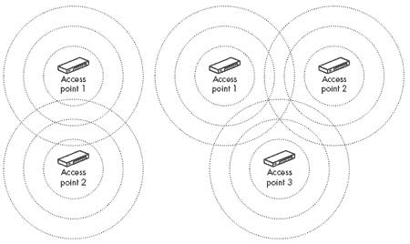
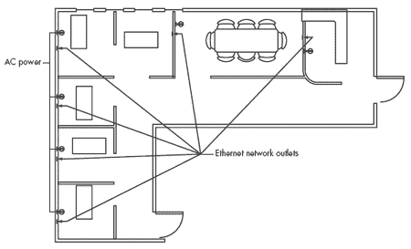

# 第九章。安装和配置 Wi-Fi 接入点

许多 Wi-Fi 用户从未安装或维护过接入点——他们在咖啡馆、图书馆和可能在工作场所连接到公共热点，那里有网络管理员负责向他们的电脑提供信号。但如果你想在你的小型商业或家庭网络中使用 Wi-Fi，你必须了解一些关于接入点的知识。

在无线网络中，一个*接入点*或*基站*是中央发射器和接收器，通过无线电与单个电脑和其他网络客户端交换数据。多个接入点可以增加网络服务的区域大小，并支持更多的网络客户端，但每个 Wi-Fi 网络都必须至少包含一个接入点。你网络接入点的数量和位置定义了其覆盖范围和容量。

当你决定安装无线网络时，你至少有两个选择：你可以打开所有盒子，将无线电连接到你的电脑上，并尝试让它全部工作，或者你可以在开始玩硬件之前做一些提前规划，并考虑每个组件的最佳位置。这一章节是为那些先计划后安装的认真和有条理的人准备的。它也是为那些试图在没有计划的情况下启动网络的人准备的，现在我们想学习如何正确地完成这项工作。

当你开始规划你的无线局域网——或者更确切地说，任何局域网——的第一件事是花些时间思考你确切地期望如何使用网络。你的网络中的所有电脑是否都位于固定位置，并且容易连接到电缆？你是想因为它是向你的网络添加电脑和用户的最优方式，还是仅仅因为它是最新的潮流？

例如，我住在一栋一层的房子里，地下室还未完工。我可以用无线网络将我的家庭网络从客厅扩展到厨房（我在为这本书测试设备时就是这样做的），但使用网关路由器和电脑内置的以太网接口适配器，并通过地下室的天花板梁拉线几乎一样容易。另一方面，如果我想在我的前门廊或后院以及厨房使用我的笔记本电脑，或者如果我住在两层楼或公寓里，无法进入天花板或地板下面，那么在前室安装一个接入点并在笔记本电脑上安装无线网络卡，以便我可以将它从一个地方带到另一个地方，这可能是有意义的。

您可以将同样的分析方法应用于商业网络。只要所有计算机都是固定的，并且您有方便布线的途径（例如假天花板或墙壁和地板中的电缆管道），有线网络通常是更好的选择。但如果销售人员拜访客户时都携带便携式设备，或者工程师想在会议或午餐时使用他们的笔记本电脑，或者有其他很好的理由将网络扩展到电缆的覆盖范围之外，那么可能是时候添加无线接入点了。

在大多数情况下，无线网络应该是有线连接的补充，而不是完全无线操作。至少有一台计算机可能需要通过电缆连接到网络；当您更改接入点的无线配置设置时，有线连接通常更容易使用。

# 安装接入点

如第三章所述，许多接入点都与其他设备结合使用，例如网络路由器、宽带互联网路由器和传统的以太网集线器。至少，每个接入点都必须包括一个无线电发射器和接收器、一个或两个固定天线或外部天线连接器，以及（通常是）一个以太网端口，用于将接入点连接到有线网络。接入点还应包含某种内部配置软件，用于显示当前设置并接受更改命令。

由于每个接入点品牌和型号的包装、输入、输出和控制都不同，您将需要遵循设备提供的具体安装和配置说明。不幸的是，制造商的手册并不总是提供您所需的所有信息。本节提供了一种通用的接入点安装程序，偶尔会关于某些产品不存在的功能和功能的旁白。它旨在补充您自己接入点手册中提供的安装程序。

安装接入点的一般步骤如下：

1.  如果需要，组装接入点。您接入点的用户手册应包含您所使用的品牌和型号的具体说明。

1.  根据您现场调查的信息，将接入点放置在您计划运行它的位置。

1.  如果接入点有一个可旋转或其他允许您移动的天线，请将天线调整到尽可能接近垂直的位置。如果您将天线放置在天花板或天花板附近，如果可能的话，请将天线指向直下。如果天线更靠近地板，请将其指向直上。如果您无法调整天线位置，请不要担心；接入点在其固定位置几乎可以正常工作。

1.  如果访问点有一个用于外部天线的连接器，请安装天线并从天线到访问点拉一根电缆。尽量使这根电缆尽可能短，不要拉得太紧或转任何锐角。

1.  将电源连接到访问点。大多数访问点都配备了“墙式”直流电源适配器，但有些则配备了交流电源线。无论哪种方式，首先将电源线连接到访问点，然后将电缆或电源插入交流插座。花点时间标记电源适配器或插头，以表明它连接到访问点——很多时候没有品牌标识来识别它属于哪个设备。

1.  访问点不需要消耗太多电力，因此不需要使用专用的交流电源，但如果您使用不间断电源或浪涌保护器来保护您的电脑，也应该保护您的访问点。

1.  如果您使用以太网供电（PoE）系统为访问点供电，请按照访问点提供的 PoE 说明进行连接。大多数 PoE 系统使用 802.3af 电源标准；然而，还有其他电源标准。确保访问点与您的电源设备相匹配。

1.  将以太网线连接到您的访问点的局域网连接器和最近的网络路由器、集线器、交换机或其他网络接入点。

1.  咨询说明书以了解如何将控制电缆连接到访问点。一些访问点使用从附近计算机来的串行电缆，而另一些则通过网络连接。您将使用此连接来设置访问点的配置。

1.  如果访问点使用串行连接，可能更容易将笔记本电脑带到访问点附近的临时位置，在那里您可以观察到 LED 指示灯在运行配置程序时亮起和熄灭，而不是将较长的电缆拉到现有的计算机上。

1.  打开访问点的电源开关。您可能会看到一个 LED 指示灯亮起。访问点的内部处理器可能需要几分钟才能准备好运行。访问点的说明书应该解释 LED 指示灯的功能。

物理安装完成后，下一步是配置访问点。如果您使用的是同一品牌的访问点和无线接口适配器，默认设置可能相同，因此您可能能够将适配器安装到附近的计算机上并立即测试网络。

## 通过浏览器配置访问点

大多数访问点通过专用的本地数字 IP 地址接受配置命令。换句话说，您可以通过在您的网页浏览器中输入访问点的数字地址来访问配置程序。您可以在硬件提供的说明书或制造商的技术支持网页中找到访问点的默认 IP 地址。

您通常可以使用 Microsoft Internet Explorer、Firefox、Safari 或任何其他图形网页浏览器来查看和更改接入点设置。因此，配置程序可以在运行任何操作系统的计算机上运行。很少，接入点可能需要特定的配置工具或特定的浏览器。

第一次开启接入点时，它将使用在出厂时设置的默认设置。除非您更改其中的一些设置，否则未经授权的用户可能访问您的网络，网络用户（无论是否授权）可能进行应由网络管理员进行的更改。至少，您应该更改配置程序的密码。

再次强调，每种类型的接入点的具体配置程序不同，但基本原则相似。将此程序作为接入点手册中信息的补充：

1.  确认接入点已连接到局域网。

1.  从连接到局域网的电脑上，打开您选择的网页浏览器。

1.  在浏览器的地址栏中，输入接入点的默认数字 IP 地址，该地址在接入点手册中有说明，然后按回车键。

1.  如果软件需要密码，浏览器应找到并打开接入点的密码窗口。输入登录名和密码。

1.  您应该看到顶级配置页面。图 9-1 显示了一个典型的配置页面，这是由 Qwest 为其 DSL 用户提供的 Actiontec 组合 Wi-Fi 接入点和 DSL 调制解调器的配置页面。

**图 9-1. Actiontec 接入点的配置菜单屏幕。其他接入点的配置屏幕显示类似信息，但布局不同。**

当你尝试打开配置实用程序时，如果没有登录窗口或顶级菜单，而是收到“无法连接”的消息，请向接入点发送 ping 请求。在 Windows 中，输入**开始  运行  cmd**以打开命令窗口，并输入**``ping *`IP 地址`*``**，使用接入点的数字 IP 地址。如果网络识别该地址，你应该会看到类似于图 9-2 中的响应。如果程序报告“主机不可达”，则可能是你的局域网中的动态主机配置协议（DHCP）服务器与接入点的默认地址之间存在冲突。下一节将解释如何处理这个问题。

**图 9-2. 成功的 ping 请求从目标设备返回一系列定时回声。**

## DHCP 及其他干扰

DHCP 会自动为网络上的每台计算机分配一个 IP 地址。由于 DHCP 消除了手动为每台计算机分配单独地址的需要，它可以节省大量时间和麻烦，但当网络集线器或交换机以及无线接入点都试图充当 DHCP 服务器，或者当客户端设备期望一个特定的地址但 DHCP 服务器动态分配地址时，设置网络可能会变得复杂。

当你在局域网中添加接入点时，冲突的 DHCP 服务器可能会引起问题。一些独立接入点期望在特定的数字 IP 地址上接收访问基于 Web 的配置屏幕的请求。然而，当该接入点连接到充当 DHCP 服务器的集线器时，服务器会为接入点分配不同的 IP 地址。因此，当用户尝试连接到接入点手册中列出的 IP 地址时，什么也不会发生（或者浏览器报告“无法找到此地址”，这几乎是同一回事）。

记住这一点很重要，局域网只能有一个 DHCP 服务器。如果局域网包括另一个 DHCP 服务器（通常在路由器中）分配数字地址，最好禁用接入点的 DHCP 功能，并允许主服务器处理整个网络（包括有线和无线节点）的地址分配。一般来说，活动 DHCP 服务器应位于离你的互联网连接最近的设备上——通常是 DSL 调制解调器、电缆调制解调器或其他互联网接入设备。

这是一个例子，其中对问题的通用描述不如你特定接入点提供的具体程序有用。硬件手册应包含设置说明，涵盖接入点的配置实用程序以及适用于每个客户端计算机的 Windows 网络设置。找到手册，并尽可能紧密地遵循这些说明。当你找到一组接入点配置设置和 Windows 网络设置的组合，实际上可以工作（并且可以肯定的是，这样的组合确实存在），将这些设置记在纸上，并与手册一起保存。你稍后需要它们来添加更多计算机和接入点到同一网络。

## DNS 地址

互联网使用域名系统（DNS）在数字 IP 地址和平常语言地址之间进行转换。如果你的计算机找不到活动 DNS 服务器，你的网络浏览器、电子邮件程序和其他工具将无法工作，因为它们不知道在互联网上找到其他计算机的位置。当 DHCP 处于活动状态时，大多数接入点为从 DHCP 服务器接收 IP 地址的计算机提供 DNS 服务。因此，在配置接入点时，你必须指定一个或多个 DNS 服务器地址。你可以从你的网络管理员或 ISP 那里获取 DNS 地址，或者从公共名称服务器列表中获取，例如[`www.opennic.unrated.net/public_servers.html`](http://www.opennic.unrated.net/public_servers.html)（使用二级服务器）或[`www.resolvingnameserver.com/freerns.html`](http://www.resolvingnameserver.com/freerns.html)。

## 配置命令和设置

每个制造商的配置实用程序处理方式不同，但每个接入点都应该包括相同的基本选项集。当你设置无线网络时，你可能想将其中一些选项从默认值更改为其他值。

许多基于 Web 的配置实用程序使用标签或菜单将选项列表分成几个屏幕。如果特定命令的位置从顶级屏幕的布局中不明显，要么尝试打开较低级别的屏幕直到找到你想要的，要么查看接入点手册中的具体导航说明。通常，配置实用程序应包括以下选项。

### 密码

设置程序还会要求您输入密码或通行短语。这是用户将输入以连接到加密接入点的代码。

每个接入点的配置软件在允许您进行更改之前都需要密码。当您打开包装并安装接入点时，它使用制造商的通用密码。因为这些密码众所周知，黑客和破解者可能会更改密码并将您锁定在自己的网络之外，您*必须*在安装网络后立即重置密码。

### 注意

*如果你忘记了或丢失了接入点的密码，你可以通过接入点上的物理重置控制将其恢复到默认密码。请查阅接入点的手册以获取具体信息（如果您没有手册，可以在制造商的网站上查找可下载的副本）。如果您重置了接入点，您将不得不重新配置其所有设置和选项*。

### 局域网 IP 地址

本地网络中的接入点当前使用的数值 IP 地址显示在局域网 IP 地址字段。这可能是一个工厂分配的默认地址，一个由局域网 DHCP 服务器自动分配的地址，或者一个由网络管理员手动分配的地址。如果你的无线网络有两个或更多接入点，每个接入点都应该有不同的 IP 地址。

### 子网掩码

子网掩码字段标识了包括接入点和通过接入点连接到局域网的无线客户端的子网。子网的地址由网络管理员分配。如果你的局域网不包含子网，请使用默认值 255.255.255.0。

### 无线网络 ID（SSID）

*服务集标识符（SSID）*是包含此接入点的无线网络名称。当无线客户端尝试连接到网络时，它会搜索与自身配置设置中相同的 SSID 的接入点。如果它找到一个不同 SSID 的信号，它会拒绝关联并继续扫描正确的 SSID。

因此，SSID 有两个作用：它作为防止未经授权访问无线网络的第一道防线，在多个无线局域网运行的环境中，它将每个客户端与正确的网络关联起来。然而，SSID 本身并不是一个特别有效的安全工具，因为一些网络适配器会接受*任何*SSID，这将允许客户端与它找到的第一个接入点关联，而不管接入点的 SSID 是什么。此外，每次用户连接到接入点时，它都会传输 SSID，即使接入点被配置为隐藏或伪装 SSID。

网络适配器将假设所有具有相同 SSID 的接入点都是同一网络的一部分。当您设置包含多个接入点的网络时（为它们都使用相同的 SSID），这可能会对您有利，但也意味着必须更改接入点提供的默认 SSID 为唯一名称，以确保用户不会错误地连接到错误的接入点。

### 信道

信道设置是接入点将用于与无线局域网中的客户端设备交换数据的无线电信道号码。每个接入点在一个信道上运行，但大多数网络适配器都会扫描所有信道以找到具有相同 SSID 的最佳可用信号。您可以假设，只要两个设备使用相同的操作模式，附近的客户端设备就会找到您的接入点，无论信道设置如何。然而，如果您的用户尝试使用预设信道的网络适配器，接入点和客户端的信道设置必须匹配。

在嘈杂的环境中，某些信道可能比其他信道表现更好，因为其他网络和其他 2.4 GHz 设备可能在某些频率上产生干扰，而在其他频率上则不会。如果附近有其他无线网络正在运行，您通常可以通过使用不重叠的信道号码来减少干扰并提高性能。如果这不可能实现，请使用尽可能远的信道。

如果您的网络包含多个接入点，您应该将相邻的接入点设置为不同的信道。为了避免信号重叠，请记住使用至少相隔五个信道号码的信道，例如信道 1、6 和 11。

### 模式

大多数新的接入点支持几种不同的 Wi-Fi 规范（或模式），包括 802.11b、802.11g，以及通常的 802.11a。在 802.11n 标准批准之后的接入点也将包括该模式以及其他模式。当接入点检测到来自网络适配器的信号时，它会自动使用从适配器接收到的操作模式。这种多模式操作允许只有一种模式识别的网络适配器的计算机连接，而无需更换适配器。

您的接入点的配置程序可能包括一个选项，用于指定接入点可以使用的操作模式。除非您想限制对网络的访问仅限于一组有限的网络适配器，否则最好使用最灵活的模式设置，即识别所有可用操作模式的设置。

### 安全性

Wi-Fi 网络可以使用两种不同的加密方案来阻止没有适当电子密钥代码的人进入网络：WEP（有线等效隐私）和 WPA（Wi-Fi 保护接入）。正如本书第十二章（第十二章. 无线网络安全），接入点可以作为 DHCP 服务器，自动为网络中的无线客户端分配数字 IP 地址。

请记住，任何时候只能有一个 DHCP 服务器处于活动状态。因此，如果网络已经有一个活动的 DHCP，请禁用接入点的 DHCP 功能。如果您的网络包含多个接入点，DHCP 服务器应只在其中一个中处于活动状态——并且只有当没有其他服务器已经处于活动状态时。

当接入点的 DHCP 服务器处于活动状态时，配置实用程序可能会在同一屏幕上显示当前活动 DHCP 客户端的列表，其中包含启用/禁用选项。或者，实用程序可能会提供打开另一个窗口或显示另一个屏幕，其中包含 DHCP 客户端的列表。

### 其他设置

除了上述设置外，您可能在接入点的配置实用程序中找到几个其他选项。其中一些可以控制同一设备中内置的其他非无线功能，而另一些可能允许用户指定一些在其他情况下会在客户端设备中更改的任意值。

接入点手册应提供您设置这些选项所需的信息。当设置的目的是不清楚的，或者看起来它不会对您的网络产生任何影响时，最安全的做法是接受默认值。换句话说，当您不确定时，就让它保持原样！

# 需要多少接入点？

除了临时网络外，最简单的无线网络只需要一个接入点和少量网络节点。但当你试图覆盖一个大型空间、不规则空间或预计将有大量无线用户时，你可能需要至少添加一个额外的接入点，并且在一个不同的频道上。

如果您室内网络的预期覆盖范围从接入点延伸超过大约 150 英尺，请考虑使用具有多个接入点的网络。在户外，如果有一个清晰的视线，您应该能够在至少 200 英尺远的接入点获得可靠的信号。

作为实际限制，如果超过大约六台计算机同时尝试连接到同一接入点，每个无线节点的数据传输速度将开始下降。但请记住，大多数用户不会在确切同一时刻尝试移动数据或使用互联网，除非他们正在流式传输音频或视频或移动大文件，因此“六台”可能在整个一天内对应于 20 或 30 个用户。

如果您网络上的用户数量随时间增加，您可能会发现性能变得缓慢，因为您的接入点正在以或接近满负荷运行。当这种情况发生时，您应该考虑向您的网络添加更多接入点。您可以将新的接入点放置在现有接入点之间，或者使用不同的信道号并将它们放置在现有接入点旁边。如果可能，请选择其他附近网络未使用的信道号。

假设您的网络在基础设施模式下运行，它类似于一个中心和一个辐条的设计，其中每台计算机或其他设备都通过接入点与网络通信。因此，您的无线网络上的所有设备不需要使用相同的信道号。如果您可以将您的网络计算机分配到两个或三个不干扰的信道，这将减少每个信道的链接数量，从而提高整个网络的性能。

有几种方法可以将多个接入点连接到网络。如果将以太网数据电缆拉到每个接入点的位置是可行的，您可以将所有接入点连接到路由器，或者为第一个位置使用组合路由器和接入点，并从那里运行数据电缆到其他位置。

另一方面，如果接入点位置之间存在墙壁或其他障碍物，或者由于某些其他原因难以或不可能布线，您可以使用一种特殊类型的接入点，称为*范围扩展器*或*范围扩展器*，它使用无线电信号连接到网络的主要接入点。

### 注意

*在设置户外网络时，不要忘记考虑接入点和客户端计算机之间的植被影响——如果您在树木光秃的冬季安装网络，那么在树木茂盛的夏季，您可能会收到较差的信号。放置多个接入点并不是一门精确的科学。如果您的网络覆盖了一个开阔的大空间，您可以在规则间隔处放置它们。但找到覆盖不规则空间的最佳方法可能更困难*。

可能最好的方法是先从建筑物中心的一个接入点开始，并确认它能在 50 到 100 英尺或直到第一个主要障碍物范围内提供良好的覆盖。您可以通过携带运行您的 Wi-Fi 控制程序或现场调查程序的计算机在周围走动来确认这一点。当信号开始减弱时，回到信号良好的地方并测量从接入点的距离。尽量将第二个接入点放置在您当前位置大约相同距离的地方，但方向相反。如果第二个接入点不能为您提供剩余空间的必要覆盖，您可能不得不添加更多的接入点。您的目标应该是任何一对接入点之间覆盖重叠的最大约为 30%。

作为一条经验法则，用户应该能够无障碍地使用控制程序中显示四到五个信道的信号。对于大多数用户来说，三个信道的信号可能就足够了，但当信号强度下降到一或两个信道时，你应该计划添加另一个接入点。

定位三个或更多接入点可能更困难。记住，你添加更多接入点的目标是尽可能多地填补空间。在开阔空间中放置两个接入点时，你可能会将它们都放在侧墙的中点，每个大约在前后的三分之一处。如果你添加另一个单元，你可能想要将第三个放在中间，并将其他两个移近前后，或者你可以将它们以某种三角形的模式排列。图 9-3 显示了具有两个接入点和三个接入点的典型布局。

**图 9-3. 为了增加覆盖范围，使用两个或更多接入点。**

网络中的每个接入点应使用与相邻接入点不同的频道。如果可能，使用不会相互干扰的频道号，例如频道 1、6 和 11。在非常大的空间中，尝试通过在整个区域内交错频道号来保持频道号广泛分离，就像图 9-4 中的安排一样。

## 使用多个接入点

当同一网络上的两个或多个接入点检测到来自同一客户端设备的信号时，信号最好的接入点处理该连接。如果客户端设备从当前活动接入点移动到另一个接入点附近，或者由于其他无线电信号的干扰导致信号质量下降，原始接入点将连接转交给从客户端接收最佳信号的接入点。这正是允许移动电话在通话中断的情况下漫游的技术。

**图 9-4. 在多个基站的网络中，确保重叠的接入点彼此分离。**

早期的 Wi-Fi 规范允许网络适配器和其它客户端设备将连接从一处接入点移动到另一处接入点，但它们并没有解释如何进行关联的切换。在没有标准的情况下，每个接入点制造商都提出了自己的方法，这可能与每个其他制造商的系统不兼容。在 802.11g 和 802.11n 网络中，这并不是一个大问题，但最好在你的网络中只使用一种类型的接入点。你可以期望 Wi-Fi 兼容的网络适配器与任何品牌的接入点一起工作，但并不是总是安全地期望两种不同类型的接入点能够协同工作。

**哪种操作模式？**

对于新的 Wi-Fi 网络，最佳接入点可以使用所有可用的操作模式（目前是 802.11b、802.11a 和 802.11g，以及在规范成为标准之后的 802.11n），因此它们可以与任何类型的网络适配器的用户交换数据。然而，缺点是当使用较旧卡片的用户加入支持较新、更快标准的网络（例如，802.11b 用户加入 802.11g 网络）时，网络必须为了兼容性将所有用户切换到较慢的标准。如果你预计所有用户都将拥有较新的卡片，将模式设置为仅接受更快标准可能会提供更好的性能。

# 进行现场调查

理解一般的网络原理是好的，但你是在一个真实的位置安装无线网络，那里有真实的墙壁和家具（以及很可能是真实的干扰源）。无线电波会穿过某些材料，并从其他材料上反射，因此在理想环境中的无线电波的范围和信号强度的估计，不如你打算使用它的实际性能重要。因此，你应该进行现场调查，以了解你的无线电设备在你的空间中将如何运行。

现场调查的第一步是确定你希望网络覆盖的区域。在大多数情况下，这将是你的办公室、家庭或校园的整个区域，但还有其他可能性。例如，你可能只想在公共区域提供网络访问，如会议室、接待区或图书馆。或者你可能想在邻居之间共享单个宽带网络连接。记住，Wi-Fi 频率的无线电信号可以穿过许多墙壁、天花板和地板，因此即使你没有针对这些空间，它们也可能到达相邻的空间。

对于一个简单的家庭或小型办公室网络，你的现场调查可以非常简单。如果整个建筑从前到后只有 50 英尺，宽度为 30 英尺，你可以在几乎任何地方放置接入点。只需将接入点连接到现有的互联网连接，启动一台笔记本电脑或其他便携式计算机作为无线网络客户端，在保持网络连接活跃的同时携带客户端设备。如果你能在房屋或办公室的任何地方保持连接，你就可以开始了。

单个网络覆盖的空间不必是连续的（或连续的），尽管大多数网络都是这样构建的。例如，如果你的业务占据了一栋建筑的第三、四和九层，但中间的楼层没有，你可以在自己的办公室放置接入点，用以太网电缆（或连接到现有的有线局域网）将它们连接起来，并忽略其他楼层。只要所有接入点使用相同的名称（SSID），你的计算机就会使用相同的网络配置文件来建立连接。如果你的局域网扩展到多个建筑，你可以在每个建筑中放置接入点，并通过租用线路、通过互联网的虚拟专用网络（VPN）连接或点对点无线电链路和桥接路由器（下一章中描述）将它们连接起来（如果尚未建立连接）。

## 制定现场平面图…

当你对网络需要覆盖的空间有一个大致的概念时，是时候创建一个更详细的楼层平面图了。如果你的网络将覆盖一栋建筑的多层，或者当网络将包括多个建筑的空间时，你需要为每一层制定一个计划，为每一栋建筑绘制一个垂直图，还需要另一个显示网络整个覆盖范围的图。

你的楼层平面图应包括每堵墙和隔断的位置，以及每个现有的网络连接和电源插座。如果你了解潜在的干扰源，例如 2.4 GHz 的无绳电话、蓝牙网络或微波炉，请在计划上标明它们的位置。图 9-5 显示了一个小型办公室的楼层平面图。

**图 9-5. 办公室楼层平面图**

通常情况下，如果你能找到一个可以清晰看到每个人可能放置计算机或其他网络客户端的地点，你只需要一个接入点。当因为无线电信号的障碍而无法做到这一点时，你需要额外的接入点。但不要自动假设清晰的无线电路径与视线相同。唯一确定的方法是启动一个接入点并运行自己的测试。

在这种情况下，从办公室的任何地方都能看到的最理想位置可能是在 L 形空间的角上。如果这还不够好，下一个尝试的方法是在每个端点放置一个接入点。如图 9-5 图所示的办公室有大量的网络插孔和电源插座，因此连接有线网络应该不会是问题。但这并不总是如此。在许多地方，接入点的理想位置可能是在吊顶内部，但如果那里没有电源插座，你可能不得不寻找不同的位置或使用支持以太网供电选项的接入点。

当首选的接入点位置靠近电源插座但远离网络连接点时，问题会小一些。你通常可以用更长的数据线解决这个问题，但不要从吊顶中拉一根线到房间的中间或跨越一个无法触及天花板的隔断；这看起来很乱，而且几乎可以肯定有人最终会把它扯出来。如果你的安装看起来更好，可以将数据线延长到实墙上，要么将线缆穿过墙内，要么将其与两面墙的角落对齐。记住要避免尖锐地弯曲或压扁网络线缆；一定要留出足够的空间形成大弯。当你想用一个接入点为建筑物的相邻两层服务时，最佳位置是尽可能靠近共享的天花板和地板。在大多数房屋中，位置不太关键，因为无线电信号比混凝土和钢更容易穿过木材和灰泥。

大多数接入点和网络接口内置的天线是非定向或全向的，这意味着它们向所有方向辐射。换句话说，有效信号的范围类似于以天线为中心的球体或甜甜圈。因此，你可能会希望将接入点放置在你想要覆盖的空间的中间。如果你使用带有外部天线连接器的接入点，你可以更加灵活。在某些环境中，建筑物一端的方向性天线可能比中心的全向天线更有效。

许多接入点内置的天线是安装在可旋转支架上的鞭状天线，这允许你改变它们相对于包含电路的盒子的位置。这可能不会带来很大的差异，但通常的做法是在接入点放置在靠近天花板时将天线向下对准，当它们靠近地板时将天线向上对准。一般来说，当天线垂直而不是水平时，你可能获得略微更好的覆盖范围。

信号丢失的一个潜在原因是*多径干扰*。当相同的信号直接从发射器到达接收天线，并在几秒钟后再次从反射表面反弹回来时，就会发生多径损耗。在广播电视信号中，多径干扰会在屏幕上表现为幽灵或阴影图像。在分组数据网络中，接收器将多径干扰视为噪声，这可能会降低传输速度。许多接入点和网络适配器使用两个独立的天线在“分集”接收配置中，以减少或消除多径干扰的影响。接收器比较来自每个天线的信号强度，并自动选择更好的一个。即使两个天线可能只相隔一英寸或两英寸，分集系统通常也能提供比单个天线更干净的输出。如果接入点的内置天线位于形状奇特的包装内，例如*U*形条，或者如果它有两个独立的天线，那么该设备可能正在使用分集接收系统。要确定您的硬件是否使用分集，最好的方法是阅读规格说明。

如果您的接入点确实有两个固定天线，您可能想尝试不同的相对天线位置。如果天线南北对齐时覆盖范围不足，请尝试逐渐旋转接入点，将天线对准东西方向，同时观察网络客户端计算机上的信号强度显示。如果天线可以旋转，请尝试移动它们，而不是保持它们绝对平行。

户外，一般来说，高度越高越好，但要在合理范围内（例如，不要将天线放在 100 英尺高的塔顶上）。如果可能，请使用带有外部天线连接器的接入点，这样您可以将盒子放在遮蔽处，并通过同轴电缆将天线连接到天线。屋顶上的防水垂直天线或安装在建筑物侧面高处的平板天线应提供足够的视线覆盖范围，可达 300 英尺。当您将天线安装在屋顶上时，尽量将其安装得足够高，以便从地面看到，以防止建筑物本身的衰减，如图图 9-6 所示。如果您看不到接入点的天线，信号质量可能会受到影响，但足够的信号应该穿过结构，以提供可接受的信号。

**图 9-6. 屋顶天线可能无法触及靠近建筑物的用户**

当你在室外安装全向天线时，更高的增益并不总是意味着更好的覆盖。随着全向天线增益的增加，垂直范围会减小；天线的覆盖范围呈球形或甜甜圈形状，变得更加平坦。安装一个高增益（大于 8 dB）的全向天线可能使其对上方或下方的用户不可见，而一个 5 dB 或更低增益的天线可能提供完美的覆盖。始终确保在外部安装上安装适当的接地和防雷保护；屋顶或其附近的雷击可以轻易通过天线、接入点和网络电缆传播，并损坏你整个建筑的网络。

结构造成的信号衰减量会因建筑材料的不同而不同。在 2.4 GHz 频段，无线电波比通过混凝土或钢结构更容易穿过木材和玻璃。作为一个实际问题，如果你不是试图用你的无线网络覆盖大型大学校园或工业园区，你可能会从室内的接入点产生一个完全可用的室外信号，特别是如果它们位于外墙附近。在你进行现场调查时，尝试在连接活跃时将便携式设备远离建筑物；你可能会惊讶地发现信号可以传播多远。

记住，我们正在讨论数字信号。当你达到提供干净、高速数据链路所需的最低信号质量时，更强的信号不会带来任何区别，除非你遇到干扰问题。换句话说，三格信号通常就足够建立连接，如果你已经看到五格信号，更强的信号也不会提高性能。如果你可以从现有的室内接入点为室外的野餐长椅提供服务，那么不要浪费你的时间或金钱去添加一个室外接入点。信号可能从室外接入点更强，但它不会使你的数据传输更快。

在接入点和网络客户端之间移动的车辆或其他大型金属物体（如建筑起重机）可能会阻碍原本干净的信号并产生暂时中断。如果你试图为货运装卸场或其他有卡车或其他大型物体移动的空间提供网络覆盖，你将希望尽可能高地安装你的天线，或者在你想要用网络覆盖的区域另一侧放置第二个接入点。

## 测试，测试……

在进行所有理论规划之后，你无法避免使用实际硬件进行实际测试。楼层平面图可能会给你一个很好的想法，了解你的网络*应该如何*工作，但唯一找到那些无线电波实际上如何在你想要用网络覆盖的区域移动的方法是设置一个临时安装并执行一些实际测试。

关于现场调查有两种观点：一组人认为这是找到 Wi-Fi 网络中接入点最佳位置的最佳和最有效的方法；另一组人说，添加接入点比雇佣顾问或购买昂贵的软件便宜，所以你不妨多安装一些（接入点，而不是顾问），直到你的网络覆盖到你想要覆盖的整个区域。

当你需要执行现场调查时，你有几个选择：

+   让别人为你做——无论是付费顾问还是打算向你销售网络硬件的供应商

+   使用现场调查软件

+   使用网络接口提供的配置程序或状态程序

正式现场调查的替代方法是老式的试错法：安装一个或多个接入点，并将它们移动到最佳性能的位置。

允许顾问或销售技术人员为你执行调查有几个优点。首先，你可以让那个人做这项工作，而你只需要阅读报告，而不是自己带着测试设备（或爬行）在整个建筑中跑来跑去。更重要的是，经常进行这种现场调查的人都有自己的测量设备，这些设备可以自动存储个别读数并生成详细的报告。不幸的是，这些测量单元很昂贵，并且需要一些特殊培训，因此对于一次性用户来说并不实用。

如果你找不到其他人来做这项工作，你将不得不自己来做。包括思科在内的几个硬件供应商为他们的接口适配器和接入点提供现场调查软件工具。如果你正在安装复杂的 Wi-Fi 网络，请查看 Ekahau（[`www.ekahau.com`](http://www.ekahau.com)）和 Covera（[`www.coverazone.com`](http://www.coverazone.com)）提供的现场调查软件。这些程序与许多（但不是所有）网络适配器兼容，并提供长长的有用功能列表。这两个程序都提供免费评估版本，因此你可以在购买之前尝试它们。还有其他几个免费程序也提供现场调查信息。

如果你的测试硬件不包括这些工具之一，你可以从每个无线接口的标准状态和配置程序中提取足够的信息来执行现场调查。使用调查工具会稍微容易一些，但配置程序会告诉你你需要知道的信息。

很可能，您测试的第一个接入点位置将为您提供完全足够的网络覆盖，尤其是在小型办公室、住宅或公寓中。但是，当您设置更复杂的网络时，说服您的硬件供应商让您测试来自多个制造商的网络接口和接入点可能非常有用。因为不同的制造商使用不同的天线设计和不同的配置软件，您可能会发现某些品牌的网络适配器或接入点在您的网络中比其他品牌表现更好。

完成现场调查时应执行以下操作：

1.  选择接入点的位置。您可能需要在初始现场调查完成后更改位置，但作为开始，选择尽可能多覆盖区域可视范围内的位置。

1.  如果您已经安装了有线局域网，请将您的样本接入点连接到局域网并插入电源。如果您的现场没有现有的局域网，只需连接电源单元。打开接入点。

1.  配置接入点：为每个操作模式分配一个 SSID 并选择一个信道号。

1.  如果您的笔记本电脑没有内置 Wi-Fi 接收器，请将其插入电脑的 PC 卡插槽。对于这些测试，请关闭 WEP 或 WPA 加密。

1.  使用您的楼层平面图作为指南，准备一个现场调查表，例如 表 9-1 中的表格。在覆盖区域内的每个房间中填写位置列；在大空间的各个部分填写两到三个条目。

    **表 9-1. 无线网络现场调查表**

    | 位置 | 信号强度 | 操作模式 |
    | --- | --- | --- |
    | 北端会议室 |  |  |
    | 南端会议室 |  |  |
    | 接待区 |  |  |
    | 迈克的办公室 |  |  |
    | 萨拉的办公室 |  |  |

1.  将便携式电脑带到调查表上的第一个位置。

1.  在您的笔记本电脑上运行 Wi-Fi 连接程序。程序应报告网络节点与接入点之间的信号关联，并显示信号强度（通常为零到五格）。检查接入点支持的每个操作模式（802.11b、802.11a、802.11g）的信号强度。

1.  将当前位置的信号强度复制到您的调查表中。

1.  在运行连接程序的情况下，将便携式电脑带到您列表上的下一个位置。如果需要，使用刷新命令获取新的读数。在您的调查表中记录信号强度。

1.  对您列表上的每个位置重复此过程。

您还可能需要在建筑物内四处走动，记录信号质量的变化。您可能会发现，随着您远离接入点，信号强度会下降。

如果可能，使用几个不同品牌的无线网卡进行测试。不同的无线网卡性能不同，因此在为混合硬件的用户规划网络时，测试一系列客户端网卡的信号质量非常重要。

如果您发现一个或多个意外的盲点，信号强度降至不可用水平以下，请不要感到惊讶。这可能是因为接入点和便携式单元之间有某种障碍物（如金属文件柜）或因为附近有某种本地干扰源（如微波炉、蓝牙设备或无绳电话）。找到这些盲点是您进行现场调查的原因之一。在某些情况下，将测试单元仅移动一英尺或两英尺远离原始位置可能就足以解决问题。务必在调查表上注明任何盲点。

如果您在建筑物内移动时发现很多盲点，或者如果任何盲点位于关键位置，尝试移动接入点。请记住，一些 Wi-Fi 用户可能会在从一个房间走到另一个房间时使用口袋大小的个人数字助理（PDA）和配备 Wi-Fi 的手机，因此您不应忘记测试走廊和浴室的信号质量。

在您已经测试了列表上每个位置的信号质量后，在平面图上标记接入点的位置，并复制每个房间或其他位置的测试值。如果您在一个相对较小的空间内工作，您可能会看到大多数位置的数值一致。在一个更大的区域内，接入点可用信号的极限可能适合某种不规则曲线。不要对信号强度随着您远离接入点而减弱感到惊讶。

如果您想要覆盖的大部分区域的信号质量不可接受，尝试将接入点移动到不同的位置，或者如果接入点有外部天线，尝试移动天线。再次寻找一个干净、无障碍物视线尽可能覆盖大部分区域的位置。在新位置重复调查。

如果找不到一个可以覆盖您想要达到的整个区域的位置，请在信号开始衰减的地方大约三分之二的位置放置一个或多个额外的接入点，并将每个接入点连接到您的有线局域网。为每个接入点使用不同的信道号。

**总结：现场调查的步骤**

1.  确定您希望网络覆盖的空间。

1.  准备平面图和垂直图。

1.  选择接入点和天线的理想位置。

1.  与附近的无线网络协调。

1.  安装接入点。

1.  从许多位置测试无线连接。

1.  尝试移动接入点或天线。

1.  根据需要安装额外的接入点。

# 干扰问题

如果在半英里左右范围内没有人使用 Wi-Fi 网络或其他任何 2.4 GHz 设备，你就不必担心你的网络受到干扰，但这种情况每天都在变得越来越不可能。其他网络服务，包括无绳电话、微波炉、户外照明系统和遥控玩具，都使用相同的频率集。此外，附近的家庭或办公网络可能正在使用它们自己的 Wi-Fi 网络。那里经常是一片无线电丛林。

无线以太网网络使用的无线电调制类型本应克服所有这些其他服务的干扰。这是理论。与各种 2.4 GHz 无线电服务合作的工程师们正在尝试合作，以便我们都能同时使用我们的网络、电话、微波炉和玩具。然而，在实践中，你接入点和网络适配器中的接收器可能会监听本应包含干净、清晰的 Wi-Fi 信号的信道，并执行数字上的举手和喊叫“啊哈！”

或者，更准确地说，它们什么也没做：当这种情况发生时，发送信号的无线电等待一个永远不会到来的确认，然后再次发送相同的包，直到接收器确认它已经接收到了一个干净的副本。这意味着信道不仅必须足够清晰，以便原始包到达客户端，而且必须足够清晰，以便确认能够到达原始发送者。同样的事情会在下一个包、再下一个包以及再下一个包上发生。这就像试图在嘈杂的电话线或对讲机上进行语音对话一样，在那里……你……必须……说……非常……慢……并且……非常……仔细地……听。换句话说，你那美好的、快速的网速会感觉像是通过一个满是糖浆的管道接收数据位。

如果你周围有很多无线电干扰，你可能会在场地调查期间发现它。当你无法在清晰的视线范围内建立 11Mbps 的链路时，寻找附近的另一个无线电信号。这可能是一些明显的东西，比如午餐室的微波炉或厨房的无绳电话，但这也可能是一些更难找到的东西，比如隔壁的另一个网络，或者一个穿过你屋顶的点对点无线电链路。

你可以尝试一些方法来减少或消除干扰：要么移除干扰源，要么将你的网络移动到不同的信道。改变信道通常更容易，但并不总是有效，因为你的干扰源可能是一个跳频无线电，它在整个 2.4 GHz 频段跳来跳去，或者一个新的干扰源可能在新的频率上运行。

尝试一下是值得的。为了尝试消除干扰，请按照以下步骤进行，顺序如下：

1.  使用网络连接工具来识别附近的 Wi-Fi 网络以及每个网络使用的信道。

1.  尽可能地将 Wi-Fi 信道移动到遇到问题的信道尽可能远的地方。例如，如果你不能使用信道 6，尝试降低到信道 1 或跳到信道 11。如果相邻的网络使用多个信道，寻找一个未被使用的信道号码。

1.  寻找一部无绳电话、一台微波炉或一些其他在 2.4 GHz 频率下辐射的设备。如果可能，用不同频率的设备（如 900 MHz 无绳电话）替换有问题的设备。

1.  如果你可以更改接入点和接口适配器的无线电输出功率，请确保它们设置为高（100 毫瓦）设置。大多数适配器使用网络连接属性窗口中的选项来控制电源管理。

1.  尝试移动你的接入点天线或连接到你的计算机的网络接口上的天线。有时只需移动几英寸就能在网络性能上产生很大的差异。

1.  询问你的邻居他们是否在使用无线网络。你通常可以通过网络名称来识别家庭网络的位置，例如 *史密斯家族*。因为他们可能会经历与你从他们的网络中接收到的相同类型的干扰，所以他们可能会同意合作制定一个“信道分配计划”，其中每个网络使用不同的信道。记住，如果你能将网络至少保持五个信道号码的距离，你将把跨信道干扰降到最低。如果你试图协调超过三个信道，尽可能在频带上广泛且均匀地分配信道号码。

    因为唯一一组不会相互干扰的三个信道是 1、6 和 11，而且因为其中三个信道之一是许多接入点的默认设置，你可能会发现它们比中间信道包含来自相邻网络的更多干扰。你可能会在中间信道中的一到两个信道上取得更好的效果。

1.  尝试将你的接入点、网络适配器或两者的全向天线替换为定向天线，以增加信号强度和接收器的灵敏度。你可能需要将接入点移动到不同的位置或添加更多接入点以覆盖相同区域。如果你能说服你的邻居使用定向天线，尝试将覆盖模式对齐以实现最小重叠覆盖。

如果这些技术中的任何一种都无法解决你的干扰问题，你除了接受缓慢的性能或用 802.11a 无线网络（在 5.2 GHz 频率下运行）替换你的 2.4 GHz Wi-Fi 网络之外，别无他法。

您可能会遇到另一个干扰源，尤其是在商业或机构环境中，但这个问题可能不会在您的网络运行一段时间后出现。随着无线网络在您的用户中变得越来越受欢迎，越来越多的用户可能会同时尝试使用它，整体网络性能将下降。为了解决这个问题，您可以添加更多在不同频道上运行的接入点。

# 混合网络的优势

虽然您已经决定安装和使用 Wi-Fi 网络，但您不必为每台计算机都使用无线连接；通常，通过以太网电缆连接一些计算机会更好。所有主要的接入点制造商都提供组合单元，该单元在一个包装中提供 Wi-Fi 接入点和一个或多个有线以太网连接点。

有线局域网连接比 Wi-Fi 链路具有几个优势：

+   有线连接可以更快地传输数据，并且握手开销更少。

+   当您减少网络中活跃的 Wi-Fi 节点数量时，您也减少了活跃信号之间发生冲突的潜在可能性。

+   有线连接比 Wi-Fi 连接更安全，因为未经授权的用户拦截信号更困难。

+   当您运行接入点的配置和设置程序时，通常通过有线连接建立初始连接会更简单。确实，一些路由器和接入点只接受通过有线连接的配置命令。

当您的局域网中的一台或多台台式计算机、打印机或服务器与网络路由器在同一房间内，或者可以通过简单的有线连接访问时，计划在路由器或交换机与每台计算机之间安装 CAT5e 或 CAT6 以太网电缆。将 Wi-Fi 连接留给笔记本电脑和其他便携式设备，以及位于远离路由器（如楼上卧室）的房间中的计算机。如果您的局域网需要比路由器/接入点提供的更多有线端口，请寻找支持至少 100Base-T（100Mbps）连接的多端口以太网交换机，并将其插入路由器的一个以太网端口。请参阅路由器的手册，以获取有关堆叠或链式连接交换机的具体说明。

如果您的网络包括一个或多个文件服务器、打印服务器以及其他由网络用户共享的设备，最好使用有线连接而不是无线链路将这些设备连接到网络，以减少无线流量。然而，对于像网络摄像头和其他远离路由器的远程传感器这样的设备，使用 Wi-Fi 连接到网络是可以接受的。

## 结合集线器和网关路由器的接入点

许多制造商提供将无线接入点功能与网络集线器、交换机或路由器功能结合在一起的产品。其他组合产品包括网络打印服务器或宽带（电缆或 DSL）互联网调制解调器，以及接入点。组合单元可以是新建小型网络的绝佳起点，或者是在现有网络中添加有线和无线客户端的好方法。由于组合设备不需要为每个功能单独提供电源供应、机柜和互连电缆，因此其成本可能比执行相同任务的单独组件的成本低得多。减少连接所有设备的电缆数量所带来的便利性可能是一个巨大的优势，尤其是对于不需要将所有设备都连接回布线间的小型网络来说。

要决定这些组合单元中哪一个最适合您的特定需求，首先确定这些需求，然后查看各种制造商的产品目录和网站，以找到尽可能接近您需求的设备。例如，D-Link、Linksys、Netsys、Belkin 和 Buffalo 都提供各种接入点与其他功能的组合。

安装组合单元的接入点部分与安装独立接入点没有太大区别。每个设备都使用专有的配置实用程序，该实用程序提供了一个设置接入点操作频道、SSID 和其他设置的界面，以及适用于设备附加功能的其他配置选项。再次强调，每个产品附带的手册和制造商的网站是找到完成配置和设置程序所需的具体信息的唯一地方。

在大多数 Wi-Fi 网络中，接入点在日常操作中几乎看不见。它们放在架子上，或者放在桌子后面的地板上，在那里它们在客户端计算机和有线网络之间传输数据。一旦接入点启动并运行，您几乎可以忘记它，直到您需要更改配置。

# 扩展网络

Wi-Fi 规范背后的原始想法是为有限区域（如企业、家庭和公共机构）内的 LAN 提供无线连接。Wi-Fi 原本应该是一种简单的传统以太网扩展，用于连接到笔记本电脑和其他无法通过电缆方便连接的计算机。其他无线电服务将为公共场所提供无线互联网接入。

那是计划。但 Wi-Fi 设备价格低廉，不需要许可证，而且相对容易设置和使用。因此，一个名为“游击网络员”的文化应运而生，以开发该技术的替代用途，将无线网络的覆盖范围扩展到他们自己的办公室、教室和家中。业余爱好者和社区组织者在屋顶和山坡上安装天线，以便用公共或私有的无线接入为整个社区提供互联网访问，并在几英里的距离上创建点对点数据链路。许多大学和学院已经将户外无线接入点添加到他们的校园网络中。一些城市已经开始建设可能最终覆盖整个市中心地区的公共 Wi-Fi 网络。

这些广域无线网络有可能对价值数十亿美元的 3G（第三代蜂窝）无线网络造成严重竞争，而这些 3G 无线网络本应成为下一波移动连接的浪潮。如果这些用胶带和咖啡罐中的天线临时拼凑的非商业网络能够接近提供 6Mbps 的广泛可靠且廉价的无线网络接入，那么 3G 蜂窝网络运营商将很难说服人们购买他们昂贵的 384Kbps 服务。因此，商业蜂窝和无线网络运营商正在密切关注社区网络运动。

安装和使用 Wi-Fi 网络以在建筑物之间传输数据或为您的后院、停车场或其他开阔空间提供网络接入相对容易。户外天线广泛可用，或者如果您愿意，您也可以自己制作。

本章包含有关在您自己的财产之外运营和使用无线网络的法律和实际问题，以及有关户外接入点和天线的技术信息。在第十章中，您可以了解如何使用 Wi-Fi 设备构建和使用长距离、点对点的网络链路。

## 法律问题

无线网络不需要许可证，但联邦通信委员会（FCC）和其他监管机构已经制定了一些关于无线电传输的规则，这些规则使得这些网络成为可能。大多数这些规则都是为了最小化无线网络、无绳电话和其他共享相同无线电频率的服务之间的干扰可能性，这样就没有人能在附近用户中拥有不公平的优势。

当您试图创建具有最大可能覆盖范围的 Wi-Fi 网络时，而不仅仅是覆盖您自己建筑中的所有计算机时，您的接入点和网络适配器的无线电信号强度就变得非常重要。您的信号强度与其能传播的距离之间存在直接关系，因此了解法规允许的精确内容至关重要。

无线电设备的具体规定出现在 FCC 法规的第十五部分，第 15.247 节。以下是规定的内容：

| (b) 有意辐射器的最大峰值输出功率不得超过以下规定： |
| --- |
| (1) 对于在 2400-2483.5 MHz 频段内跳频操作的系统和 5725-5850 MHz 频段内的所有跳频系统：1 瓦特。 |
| (3) 对于在 902-928 MHz、2400-2483.5 MHz 和 5725-5850 MHz 频段使用数字调制的系统：1 瓦特。 |
| (4) 除非本节第(c)段所示，如果使用方向增益大于 6 dBi 的发射天线，则有意辐射器的峰值输出功率应降低至本节第(b)(1)或第(b)(2)段中所述的值以下，降低的量以 dB 为单位，即方向增益超过 6 dBi 的量。 |
| (i) 在 2400-2483.5 MHz 频段内仅用于固定、点对点操作的系统，如果发射天线具有大于 6 dBi 的方向增益，则可以采用发射天线，但必须将有意辐射器的最大峰值输出功率降低 1 dB，每超过 6 dBi 的方向增益 3 dB。 |
| 来源：[`www.fcc.gov/Bureaus/Engineering_Technology/Documents/cfr/1998/47cfr15.pdf`](http://www.fcc.gov/Bureaus/Engineering_Technology/Documents/cfr/1998/47cfr15.pdf)，第 15.247 节 |

这一切意味着什么？首先，规则允许接入点和网络适配器中的无线电发射器具有最大 1 瓦特的功率。其次，除非降低发射功率以增加增益，否则最大天线增益为 6 dBi。高度定向的点对点系统可以使用比点对多点系统更多的天线增益。天线接收到的最大功率不能超过 1 瓦特，但可以使用定向天线将有效辐射功率增加到 4 瓦特。

其他国家的规定可能有所不同，因此你应该咨询你自己的国家监管机构，特别是关于允许的频道和最大功率，但美国的规则应该为计算设备的功率输出和天线增益提供一些有用的指导。

当你计算无线电的输出功率时，还必须考虑无线电和天线之间电缆的信号损耗。例如，接入点的输出可能是 20 dBm（相当于不到半瓦），但特定天线电缆在 2.4 GHz 时可能会损失 6 dB。

因此，天线从无线电接收到的将是 14 dBm。这比瓦特少得多，因此在天线中还有一定的增益空间。

大多数 Wi-Fi 接入点和适配器内置的无线电发射功率不到半瓦，因此它们完全在合法限制范围内，除非你将其连接到一个具有巨大增益的天线。在无线电和天线之间的射频放大器可以将功率提升超过 1 瓦的限制，但当然，这将违反 FCC 的规定。

两种不同的 Wi-Fi 信号可能从更多的发射功率中受益：点对点信号，增加的功率可以增加两个站点之间的距离；以及点对多点，增加接入点的功率可以扩大客户端设备成功加入网络的区域。点对点链接通常在两端使用高增益定向天线；在点对多点系统中，接入点上的天线通常覆盖一个广泛的区域，但客户端适配器可能使用定向天线。

如果有任何问题，FCC 对 2.4 GHz 频段无线电发射机的功率限制可能过于保守。能够将 5 瓦的功率推入一个高增益天线，以在 5 或 10 英里或更远的距离上创建一个干净可靠的数据链路，或者使用单个接入点覆盖更大的区域，那将是件好事。但提供数据服务的电话公司和通信公共运营商对监管机构有足够的影响力，以保持低功率规则不变，更强的信号将造成更多的干扰。所以，一瓦的限制可能将长期存在。

作为一名负责任、遵纪守法的公民，你应该始终非常重视那些联邦法规。并且作为一名负责任、遵纪守法的作者和出版商，我们绝不会鼓励你做任何其他的事情。然而，一个假设的个体或小型企业使用一个假设的高增益天线来增强其假设的无线路由器信号强度，几乎不可能引起联邦通信委员会（FCC）或其他执法机构的注意，除非那个假设的信号对其他人的网络或其他无线电服务造成了显著的干扰，或者如果它引起了当地电话公司或主要互联网服务提供商的注意。在 FCC 的功率限制范围内运行你的 Wi-Fi 网络是正确的事情，但这也太糟糕了，因为增强信号强度并不困难。

通常情况下，FCC 不乐意花费其时间和资源处理未经授权频率上的干扰投诉，例如 Wi-Fi 网络使用的 2.4 GHz ISM 频段。但法律就是法律，所以，一个明智地购买并阅读这本书的人绝不会考虑公然增加其接入点和网络适配器的功率，或者使用高增益天线。当然不会。

记住，联邦通信委员会（FCC）的规定仅适用于美国。其他国家的监管机构已经设定了自己的限制，这些限制有时甚至低于美国的数字。而且他们的执法政策可能更为严厉。所以在你尝试在你的网络中安装高增益天线或射频放大器之前，咨询你自己的国家有经验的技法律专家是很重要的。

## 室外天线和接入点

几个因素会影响 Wi-Fi 网络中接入点和网络客户端之间无线电链路的信号强度（因此是最大距离）：

+   天线增益

+   发射功率

+   天线高度

+   电缆衰减

请记住，Wi-Fi 链路在两个方向上传输数据：从接入点传输到网络适配器，以及从适配器传输到接入点。因此，链路中的天线和无线电必须能够同时发送和接收无线电信号。幸运的是，天线的增益和方向特性在发送和接收时是相同的，所以同一个增强外向信号有效功率的天线也可以增加接收器对弱信号的灵敏度。

室外天线还必须在其工作环境中生存。强风可能会将定向天线从最初指向的方向吹离；积累的冰和雪可能会阻塞信号并增加物理安装硬件必须支持的重量；阳光可能会导致塑料外壳老化。因此，许多天线都密封在雷达罩或其他提供额外保护的封闭结构中。Wi-Fi 发射器的最大输出功率不到一瓦，所以几乎任何足够耐用的室外天线都足够强大，可以轻松处理信号。

2.4 GHz 频段的天线存在许多形状和尺寸。全向天线可以是一个只有几英寸长的单一元件，带或不带外壳。内置 PCMCIA 适配器的天线甚至更短。最常见的定向天线是 Yagi（屋顶电视天线的较小版本），类似烟雾探测器的贴片天线，高达三英尺高的抛物面反射器，以及具有极宽孔径角的大型面板。

请记住，无线数据网络使用数字无线电信号，所以如果你可以用更小、更便宜的设备发送和接收足够的信号，使用更高的功率、更复杂的天线或把天线放在屋顶上，绝对没有任何优势。如果一个具有适度增益的天线可以产生可接受的信号，当你用更大、更昂贵的设备替换它时，你的数据不会变得更好或移动得更快。而且，较小的天线不太显眼，这可以减少邻居和当地规划机构的投诉可能性。

### 天线特性

无线网络设备在发送和接收无线电信号时使用相同的天线。天线在发送时处理的能量比接收时多得多，但性能特性是相同的。增强发射信号有效辐射输出功率的同一天线，也会以相同程度提高接收器的灵敏度；连接到 Wi-Fi 接入点或网络适配器的天线将增强在无线电链路中双向移动的无线电信号的强度。定义天线性能的最重要特性是*波束宽度*和*增益*。

方向性天线的波束宽度是天线在最大功率或灵敏度下辐射或检测能量的角度或弧度。例如，如果天线的波束宽度是 20 度，那么最大信号强度的窗口将向天线前方的两侧延伸 10 度。当无线电链路中的两个天线都不在另一个天线的波束宽度内时，信号强度将下降。图 9-7 显示了将一对方向性天线对准彼此的效果。

**图 9-7. 方向性天线可以增强信号强度。**

非方向性天线（也称为全向天线）的规格不包括波束宽度，但如果包括，波束宽度将是 360 度。全向天线可能列出了垂直波束宽度；随着全向天线增益的增加，垂直范围减小。正如其名所示，点对点链路中的天线应该直接对准彼此，因此它们的波束宽度可以非常窄。

天线的增益是其相对于标准偶极天线的有效输出功率或灵敏度。如果你测量了两个相同发射器的信号强度，或者通过两个不同的接收器接收相同信号，那么通过增益为 3 dBi 的天线的信号将比通过参考偶极天线的信号强 3 dB。天线的增益随着天线尺寸的增加以及信号在狭窄波束内的聚焦而增加。

将天线角度和增益视为类似于聚焦的光是有用的。标准灯泡以相同的光能向所有方向辐射（除了灯泡的底部）。但是，如果你在光源的一侧放置一个反射器，或者将光聚焦在特定方向，目标区域内的光亮度将增加，但当你远离目标区域时，它看起来会更暗。灯泡辐射的总光量是相同的，但其中更多的光集中在某些地方。

无线电天线的工作方式大致相同。非定向天线会向所有方向辐射相等量的能量，而定向天线可以在某些方向上比其他方向集中更多的能量。

狭窄波束宽度的定向天线对点对点链路很有用，但这并不是在无线网络中利用定向天线的唯一方法。当你面临来自其他无线电信号的干扰潜在问题时，将定向天线放置在干扰源偏离波束宽度的轴上通常很有帮助，这样接收天线对干扰源的敏感性就会远低于对所需信号的敏感性。当你试图在自己的财产上提供网络覆盖同时限制向邻居的溢出量时，你可以在你想要覆盖的区域边缘放置一个或多个定向天线并将天线朝向内部对准。

表面积更大的天线比较小的天线更有效，但天线的确切尺寸也非常重要。任何射频的理想天线都切割成与该频率的波长完全相等的长度，或者是一些倍数或分数。因此，使用专门为 2.4 GHz（2,400 MHz）操作设计的天线与你的 802.11b 网络一起使用很重要。正确尺寸的天线将比随机长度的天线更有效地接收 Wi-Fi 信号。

### 功率

无线电发射机的最大功率由无线电的设计决定；通常操作网络的个人无法调整它，或者如果可以，通常也不过是选择高功率和低功率之间的选择。然而，这些无线电中的一种的输出功率通常远低于法定最大值，因此通常可以在不违法的情况下增加到达天线的功率量。

你无法增加发射机的功率，因此增加接入点或网络适配器中无线电信号的功率的唯一方法是在无线电和天线之间放置一个称为射频放大器（*RF*代表*射频*）的设备。你可以将射频放大器想象成一个黑盒子，它在其输入端接收低功率无线电信号，并在输出端提供具有完全相同内容的更强信号。

一些射频放大器是为在接入点、路由器或网络适配器旁边室内使用而设计的。其他放大器可以安装在靠近天线的塔或桅杆上。室内放大器通常更容易安装和维护，并且它们更容易连接到交流电源，但效率较低，因为连接到天线的长馈线会吸收一些从放大器输出的射频功率。天线附近防风雨箱内的放大器将向天线提供更多功率，但当你需要维修或更换它时，将更难以触及。如果你确实使用室外放大器，请寻找一种通过天线馈线获取直流电源的放大器。

HyperLink Technologies 和其他制造商提供用于 2.4 GHz 的射频放大器。这些设备中的许多都放大双向信号。这是一个有用的功能，因为它使得在链路的一端安装放大器仍然可以增加两个方向上的信号强度。当你使用双向放大器时，*务必*确保它是为你实际使用的 802.11 标准设计的。双向放大器必须确定何时有卡片正在传输，并相应地更改放大器模式，因为为 802.11b 设计的放大器可能无法检测到正在传输的 802.11g 卡片，甚至可能损坏设备。

### 天线高度

2.4 GHz 的无线电信号沿视线路径传播，因此你可以通过提高一个或两个天线来增加信号可以传播的距离。这就是为什么在屋顶、山顶和高塔上放置无线电天线是一种常见做法。为了补偿地球的曲率，两个天线的高度必须随着信号路径（天线之间的距离）变长而增加。

无线电视线实际上比两个天线之间的可视路径更宽。无线电波在围绕发射和接收天线之间直接路径的雪茄形区域，称为*菲涅耳区*（发音为*fru-NEL* zone）内传播。为了实现最佳传输，菲涅耳区必须没有山丘、树木、建筑物和其他障碍物。

无线网络信号可以传播的最大距离取决于两个天线的平均高度，考虑到地球的曲率和无障碍的菲涅耳区清除要求。表 9-2 列出了在 2.4 GHz 下各种距离所需的估计最小高度。请记住，这些都是估计值，所以你实际上可能将你的数据移动到更长的距离。

**表 9-2. 天线高度与最大信号路径的关系**

| 距离 | 平均天线高度 |
| --- | --- |
| 1 英里 | 13 英尺 |
| 3 英里 | 27 英尺 |
| 5 英里 | 35 英尺 |
| 8 英里 | 48 英尺 |
| 10 英里 | 57 英尺 |
| 15 miles | 83 feet |
| 20 miles | 115 feet |

注意，两个天线的平均高度是平均地形以上的高度：如果一个天线高于平均高度，另一个天线可以靠近地面。例如，如果五英里链路的一端在山坡上或在八层楼房的屋顶上，如果两个位置之间没有障碍物，链路的另一端可以接近地面水平。如果一个天线在山顶上，最大信号路径可能大几倍。

当你试图为大面积提供 Wi-Fi 网络覆盖时，将接入点天线尽可能放置得高一些比试图提升连接到单个计算机的大量天线更有效率。另一方面，如果你试图将一台或两台计算机连接到远处的接入点，将连接到它们的网络适配器的天线放置在屋顶上可能更好。

对于一个非常长的 Wi-Fi 连接，你可能会希望将两个天线尽可能放置得高一些，但除非你试图为遥远的山顶或其他类似的地方提供接入，否则可能有一种更好、更可靠的创建宽带连接到互联网或你自己的局域网的方法。

### 电缆衰减

从无线电发射器到天线，或从天线到接收器的电缆，并不是一个完美的传输介质；每英尺电缆都会吸收一小部分但可测量的功率。因此，随着电缆长度的增加，到达天线的功率量会下降。

短电缆的电缆衰减效应通常微不足道，但在长距离运行中可能会产生巨大差异。如果天线在塔或屋顶上很高，或者如果你试图估算长距离点对点链路所需的天线增益，你必须在你计算到达天线的信号强度时考虑到电缆损耗。特定类型电缆的损耗量取决于电缆的直径和用于制造电缆的材料。每种类型电缆的规格将包括衰减量，通常以不同工作频率下每 100 英尺的 dB 表示。

如果电缆损耗在 2,500 MHz 时为 6.80 dB，你可以估计在 2.4 GHz（2,400 MHz）时 20 英尺的电缆将损失大约 1.3 dB（20 ft = 100 ft x 0.2；0.2 x 6.80 dB = ~1.3 dB）。如果接入点或网络适配器的输出功率为 20 dBm（100 毫瓦），通过该电缆天线只能接收 18.7 dBm（74.1 毫瓦）。所以当你将信号通过增益为 6 dBi 的天线时，有效辐射功率大约为 24.7 dB（20 – 1.3 + 6 = 24.7），或大约 295 毫瓦。

每英尺的馈线都会增加电缆损耗量，因此你应该将接入点和网络适配器放置在尽可能靠近天线的地方。如果天线安装在屋顶或建筑物的墙上，尽量将无线电设备放置在附近的设备间或其他你可以接入交流电源和以太网电缆的空间。将更长的以太网电缆连接到接入点，而较短的馈线电缆会更有效率。

当你安装天线馈线时，允许每端有一点余量以使连接和断开天线和无线电的电缆更容易是良好的实践。但不要因为预制的电缆比所需的更长而在地板上留下大量多余的电缆盘绕。所有这些电缆都会浪费信号，而没有相应的补偿利益。

电缆运行中的每个耦合器或连接器也是一个损耗点；一个典型的指导原则是每个连接器 0.3 dB 的损耗，因此从无线卡到标准天线连接器的短尾连接器就包括两个连接器，然后长电缆运行的两端各增加两个，天线本身上的连接器将是第五个损耗点。因此，除了电缆本身的损耗外，你还将有额外的 1.5 dB 损耗是由于连接器造成的。尽可能情况下，将你的天线电缆中的连接器数量保持在最低。

## 校园网络

校园网络通常为两座或更多建筑中的用户以及围绕这些建筑的户外空间提供无线互联网接入，有时也提供局域网接入。校园网络可以存在于大学或校园中，但同样的规划和设计也可以应用于其他地点。例如，校园网络也可能在办公园区或工业园区、公共空间如绿地公园或购物娱乐中心、甚至农场或码头运行。一些城市已经安装了类似校园的网络，以在他们的商业区提供公共互联网接入。另一种形式的临时校园网络可能存在于特殊活动如音乐节、童子军或女童子军露营、老车爱好者的聚会等。它们在跳蚤市场和交易会上也很常见，许多人在决定购买之前想使用互联网咨询专业网站。

最简单的校园网络往往是偶然形成的：为建筑内部提供网络服务的接入点的无线电信号不会在建筑墙壁处停止，因此停车场或后院的用户也可以建立无线网络接入。一个更大、更复杂的校园网络可能还会有额外的接入点，这些接入点被特别选择以覆盖大学草坪或街对面的咖啡馆。

校园网络可能是一组无线链路的补充，这些链路将两座或更多建筑物连接到同一网络，但这并不是同一件事；校园网络应提供广泛的覆盖范围，覆盖大量室外空间，而点对点链路只是将单个局域网扩展到几座建筑物内的空间。

### 设置校园网络

通常，校园网络遵循与设计为服务于单个建筑的 Wi-Fi 网络相同的规则。选择接入点的位置，以便尽可能多地覆盖区域，并允许从一个足迹到相邻足迹之间有一些重叠。每对重叠的覆盖区域应使用不同的无线电频道。

当您设置室外网络以提供互联网的 Wi-Fi 接入时，请记住将您的互联网调制解调器和第一个接入点放置在电源附近，并且距离电话线或其他互联网接入点较近的电缆短距离内。如果可能的话，将天线放置在干净的视线范围内，以便用户可以在露营地点、野餐桌和后台区域（根据需要）使用他们的笔记本电脑。

在几乎所有情况下，为室外网络服务的接入点应连接到外部天线，而不是许多专为室内使用设计的接入点内置的捕获天线。根据您的特定需求选择具有最佳特性的天线，并使用防水电缆将其连接到位于室外天气之外的接入点。

# 将接入点连接到局域网和互联网

如果您的接入点都位于已经提供网络服务的建筑物中，您可以将带有室外天线的接入点视为现有网络的简单扩展。但如果没有在接入点处建立网络连接，您将不得不创建一个。

要将您的校园网络连接到局域网或互联网，您必须为每个接入点提供一个网络存在点。连接可以通过以太网电缆、从电话公司租赁的数据电路或点对点无线电链路实现。

每个接入点都需要电源，但并不总是需要从最近的交流电源插座拉一根长长的延长线。许多接入点制造商提供以太网供电选项，该选项通过同一根电缆为接入点提供电源，该电缆同时传输以太网数据。而且不要忘记太阳能作为一种可能的替代方案。

以太网电缆容易连接到接入点，但在特定情况下除外，它们不是建筑之间链接的最佳选择。首先，你必须有一个安全的路径让电缆通过；你不能只是把电缆穿过树木或穿过草坪。在大学校园里，有时可以在蒸汽或其他公用设施隧道中布线，但在大多数其他地方这是不实用的。即使你有从一座建筑到另一座建筑布线的办法，10Base-T 或 100Base-T 双绞线电缆连接的最大实际距离也只有大约 100 米。如果你的接入点距离网络中心超过一百米，你必须在电缆上添加一个或多个中继器，或者用光纤连接替换双绞线电缆。无论哪种方式，成本可能都高于使用无线电链接或连接每个接入点到单独的互联网路由器，并为每个网络分配相同的 SSID。

有时，接入点的理想位置是在一个已有互联网服务的建筑上，但它不是你想要用于校园网络的局域网的一部分。在这种情况下，你可以设置一个 VPN 链接，通过互联网创建一个“隧道”回到自己的网络。接入点将通过 VPN 将数据传递到和从自己的网络，就像它通过一段短电缆连接一样。

第三个选择通常是实际操作中最实用的选择。在网络的中心节点和每个远程接入点之间使用点对点无线链接。Cisco、D-Link 以及许多其他供应商都提供专门为此目的设计的户外路由器和相关硬件软件。

# 邻居间的网络连接

在基于家庭的无线网络相对简单和复杂的校园网络之间，你可能想要考虑扩展自己的家庭或小型企业网络：你可以与一个或多个附近的邻居共享高速互联网连接，或者允许你的员工将笔记本电脑带到隔壁的咖啡馆。如果你或你的孩子喜欢与隔壁的家庭一起玩多人游戏，或者如果你想在年度邻里聚会上与邻居闲聊的同时从你的 Palm 手持设备或 Pocket PC 上上网，那么建立一个邻里网络可能是个不错的选择。

但在你决定在屋顶上架设天线之前，考虑一下你想要通过社区网络实现什么目标，以及你打算如何维护你网络中的安全性。如果你试图将特定位置添加到你的网络中（例如特定邻居的房屋，或者已经成为你事实上的分支办公室的咖啡馆），请使用一个定向天线，将你的信号聚焦到你想要达到的特定位置。另一方面，如果你想要为半块街区或更远范围内的每个人提供互联网热点，你可以在你自己的建筑物的最高点放置一个高增益的非定向天线。如果你正在使用相同的局域网进行家庭和社区使用，确保防火墙将你的计算机与网络的公共部分隔开。

如果你的网络适配器有一个外部天线的连接器，你可能想要购买或制作一个定向天线，将其指向社区网络最近的接入点。完全有可能你会发现适配器内置的低增益全向天线没有检测到的附近信号。

许多社区网络倡议使用一种称为无线分布系统（WDS）或网格的替代分发方法。在网格网络中，每个接入点连接到无线范围内的其他接入点，并为客户端提供接入。网格网络以连接的便捷性为代价换取原始速度——当需要额外的接入或范围时，只需打开另一个接入点即可。但请记住，网格中每个没有专用互联网连接的接入点可能会将带宽减少一半。

几种免费和商业的网格解决方案都存在，以及许多路由器支持的标准化 WDS。通常情况下，WDS 或网格网络中的所有接入点必须使用同一品牌才能正确连接。

## 保持你的 ISP 满意

这似乎是一个完全合理的想法：与你的隔壁邻居分享你的高速电缆调制解调器或 DSL 服务，并分担费用。或者让你的公寓楼或郊区的居民区中的每个人共享一个无线网络。

但要考虑到与你的互联网服务提供商打交道可能带来的潜在烦恼，他们可能会将你慷慨分享电缆或 DSL 账户视为对其（实际或潜在的）收入流的威胁，并违反其服务条款。一些主要的 ISP 有具体政策，不允许客户通过社区网络共享连接。许多其他 ISP 并不在意，甚至有些甚至鼓励这种做法。

ISP 们有合法的担忧，认为社区网络可能会比单个用户连接产生更多的网络带宽需求。当你设计和构建一个通信网络时，你根据预测的峰值需求来计算你网络的最高容量。如果你做得正确，你的网络可以处理需求，并有足够的容量来应对紧急情况，但如果需求超出你的预期，整个系统就会过载，你必须增加容量。

这种规划适用于电话系统、高速公路，甚至电车线路，以及互联网连接。如果你有足够的电车（或带宽）来处理高峰时段的交通，系统就会高效运行，车费箱中的硬币和纸币应该足以支付你的费用。但当一个大型新工厂在一端开业时，500 多名乘客突然想要使用你的系统。除非你增加容量，否则车辆会过于拥挤，每个人都抱怨。

经验可以给你一个相当准确的想法，了解在任何给定时刻将存在多少需求——你可能不知道星期二早上 10:15 谁在线，但你可以预测你需要多少电车或多少带宽来处理需求。

在互联网账户的情况下，ISP 已经建立了足够的带宽来处理峰值需求（在办公室，可能是早上第一件事和午餐时间；在住宅区，是放学后）。但如果需求翻倍，他们就必须购买和安装更多设备，并找到收入来源来支付费用。他们希望防止可能破坏整个系统的意外额外带宽需求，或者更准确地说，他们希望了解这一点并相应地计划（并收费）。

你有三个选择：询问你的互联网服务提供商（ISP）是否有关于共享连接的政策，并遵循其指南（这可能意味着找到不同的 ISP）；继续安装你所在地区的接入点，并希望电话公司、有线电视服务或其他 ISP 不会发现这一点；或者调查商业连接类型，如同步 DSL 甚至 T1 级线路，这可能会更贵，但应该有更宽松的使用条款。

## 网络安全：每个人都是你的邻居

社区网络的最基本配置是一个具有广泛覆盖范围的单一接入点，以及一个未受保护的互联网连接。任何在信号范围内的网络适配器用户都可以使用你的网络通过互联网交换数据。这包括隔壁的家庭，但也包括街上停着的货车里的那个人，他正在使用你的网络下载色情内容。

除非你故意为所有路过的人创建一个公共互联网热点，否则你应该使用 Wi-Fi 规范中内置的一些安全工具。第十二章更详细地介绍了安全措施，但以下是最重要的安全工具：

+   打开 WEP 或 WPA 密钥加密。这一点至关重要。确实，一个专门的入侵者可以在不到一个小时的时间内破解 WEP 密钥，但这足以阻止那些随意路过的用户，并起到“请勿打扰”的标志作用。

+   使用 MAC 地址过滤来限制对网络的访问，只允许特定的网络适配器。再次强调，使用适当的软件伪造 MAC 地址并不困难，但这又是一道阻止未授权访问的障碍。

+   关闭自动分配数字 IP 地址给每个客户端的 DHCP 功能，并为每个授权用户分配一个特定的地址。

+   在你的接入点或路由器上开启防火墙功能。

+   使用外部服务器或防火墙，要求每个用户在连接到互联网之前提供用户名和密码。

+   使用 VPN。

如果你正在使用相同的网络连接两台或多台自己的计算机，请使用防火墙将该网络部分与公共接入点隔离开。鼓励你网络的合法用户密切关注文件共享，以免让外人读取或写入他们计算机上存储的数据。此外，务必更改接入点的管理密码。不要使用*admin*或任何其他广泛使用的默认密码。入侵你的接入点的人可能会对你的网络造成巨大损害。
