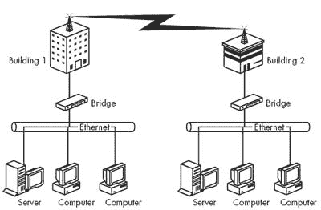
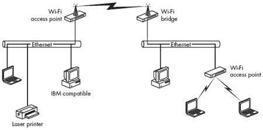
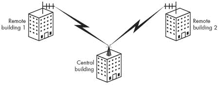
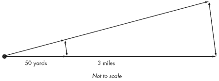
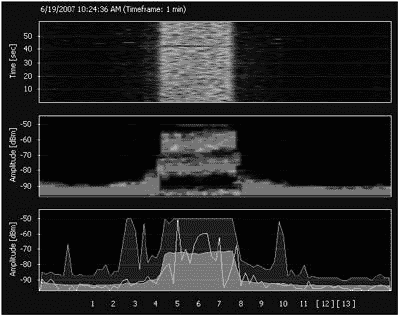

# 第十章。长距离点对点链接

随着低成本 Wi-Fi 设备的广泛可用，许多用户都考虑将天线对准附近建筑或 5 到 10 英里外的山丘，以创建一个便宜、高速的双向数据链接。一些比资金更充裕的实验者和发明家甚至用罐头、薯片罐和地下室工作坊的废料设计了自己的天线。他们通常发现，Wi-Fi 链接可以是一种在大量地面上可靠传输数据的方式。

本章包含有关设计和使用点对点无线网络链接的信息。一个*点对点无线链接*可以是更大 Wi-Fi 网络的一部分，它可以作为一个简单的桥接器连接两个有线局域网，或者它可以将一个单独的远程地点添加到现有的局域网中。点对点服务与其他 Wi-Fi 网络的不同之处在于，它是在两个特定位置之间移动数据，而不是将网络信号广播到无线电信号范围内的任何网络客户端。它还可以使用 Wi-Fi 作为无线网关的一部分，为社区或没有经济实惠的固定电话线的孤立地点提供互联网接入。

为什么扩展无线网络？点对点链接可以服务于几个目的：

+   它可以将单个网络扩展到包括多个建筑中的用户。在一个办公园区或大学校园中，占据多个建筑空间的商业或学术部门可以使用无线网络在所有组织位置之间共享局域网服务。

+   它可以跨越障碍物，如高速公路或河流。如果视线清晰，无线链接可以跳过一个可能使从一座建筑到另一座建筑拉线变得困难或不可能的缺口。

+   它可以为远程地点的用户和无人的计算机提供局域网和高速互联网接入。无线链接可以将宽带连接扩展到没有宽带 DSL 或电缆调制解调器互联网服务，甚至没有普通电话服务的地方。

+   它可以建立无线网络链接，作为租用线路的低成本替代方案。电话公司或其他常见运营商提供的私有数据电路通常涉及一次性安装费和每月的持续支付。租用线路的年费用通常可以比购买和安装无线电链接的一次性成本高出许多倍。

在某种意义上，点对点 Wi-Fi 网络链路与无线局域网是完全不同的类别。两者都使用相同的无线电技术，完全有可能将无线局域网扩展到单个建筑物的限制之外，但点对点链路同样可以采用其他类型的无线电调制和频率，而不是 2.4 GHz 的 DSSS，并执行相同的功能。你可以在本章后面找到一些关于将远程站点连接到网络的替代方法。

# 扩展局域网

点对点无线网络链路可以是连接到单个客户端设备的一端局域网，或者连接两个局域网的桥接器。换句话说，链路的端点可以是单个计算机或其他设备，也可以是整个网络。

如图 10-1 所示的带有远程客户端的无线局域网，其工作方式与单个建筑物内有两个或更多接入点的网络相同。唯一的区别是连接到局域网的接入点使用指向远程位置客户端计算机的室外天线。远程计算机对网络来说，看起来就像同一局域网上的其他任何计算机一样。

**图 10-1. 点对点无线链路可以连接到远程位置的单个设备。**

如图 10-2 所示的无线路由器，是同一局域网两个段之间的连接。这两个段可能相隔仅几百英尺，也可能相隔几英里或更远。

**图 10-2. 无线链路也可以将局域网扩展到两个或更多建筑物。**

如果端点之间的距离太远，无法使用单个无线电链路，或者视线信号路径有障碍，点对点链路可以在起点和终点之间的中继点包含一个或多个中继器。中继点可以位于孤立的位置，如无线电塔或屋顶，或者有额外网络客户端的地方，如两个端点之间的第三座建筑物。

点对点链路可以使用任何带有外部天线连接器的接入点和网络适配器。然而，一些制造商提供了专门为户外桥接应用设计的无线路由器，这通常是一个更好的选择。Plexus、HyperLink Technologies、Cisco 和其他制造商的路由器都将接入点和路由器结合起来，因此它们使得网络的组装变得更容易。

# 桥接路由器

桥接路由器与接入点相反：接入点连接到有线局域网并将网络连接转换为 Wi-Fi 信号；*桥接路由器*通过 Wi-Fi 链路连接到网络并提供一个或多个有线以太网端口。换句话说，桥接路由器为同一局域网的两个部分提供无线连接。许多制造接入点和网络接口的相同制造商也提供桥接路由器作为其产品线的一部分。图 10-3 显示了作为扩展局域网一部分的 Wi-Fi 桥接路由器。

**图 10-3. 使用 Wi-Fi 将远程位置连接到局域网。**

您可以使用桥接路由器在两座或多座建筑之间共享局域网或单个宽带互联网连接。例如，您可以使用桥接路由器将邻居的 DSL 或电缆互联网服务分配到您自己家里的两台或多台电脑上（当然，前提是得到邻居的许可）。或者，如果您的业务在两座或多座附近的建筑中设有办公室，桥接路由器可以扩展建筑之间的局域网。

# 点对点和点对多点

室内接入点使用的是非定向天线，该天线从覆盖区域中间向所有方向辐射相同量的能量，或者使用位于覆盖区域一边（或角落）的宽波束角定向天线。为指定区域（如办公室或住宅）内的任何位置提供无线服务的接入点是一种*点对多点*服务；它可以同时与许多网络客户端交换数据。

点对点链路有不同的目标：它在两个固定位置之间尽可能移动尽可能多的辐射信号。无线电信号在链路中双向移动，因此每个接入点、路由器或网络适配器都使用相同的天线进行发送和接收。目标是使无线电信号聚焦到链路另一端的天线，因此至少一个端点使用定向天线。如果链路覆盖很长的距离，两个天线都应该是定向的，以获得最强的信号。

在校园或类似区域，网络连接多个建筑时，网络链路可以被分割，以便从中心位置以多个方向向远程站点分发网络服务。在这种类型的系统中，中心接入点使用非定向天线，每个远程站点使用定向天线，如图图 10-4 所示。在两个远程站点相对于主基站位于相同大致位置的系统中，最佳选择可能是一个具有更宽工作角度的定向天线。更复杂的系统可能包括定向和全向天线的组合。

**图 10-4. 全向天线可以将信号同时分发到两个或更多远程位置。**

# 安装点对点链路

进行点对点现场调查的第一步是确定可能的信号路径。理论上，应该可以计算出两个天线所需的高度并确定它们之间的路径，但几乎从未按这种方式实现。在你可以启动你的无线电并开始在网络上传输数据之前，几乎总是需要一定的调整。你可以使用一张好地图（例如美国地质调查局的地形图）进行初步调查，但某个时候你将想要爬到屋顶（或向外看）并确认你想要放置链路另一端的地点是否有视线。如果路径超过几百码，带上双筒望远镜。

你通常可以在自己的建筑上安装天线而不需要任何特殊许可，但如果你想使用商业建筑的屋顶，你可能需要获得物业所有者和可能的地方规划委员会或其他土地利用机构的许可。当你安装一个不太显眼的天线时，这可能不会成为问题，但如果你必须使用相对较大的碟形天线或类似设备，请记住这一点。如果你正在使用现有的杆或塔来支撑天线，确保你不会产生或接收与附近其他天线的干扰。

携带工具腰带攀爬电线杆或塔，并在 30 英尺或更高处精确安装一个笨重的天线，这不是一个随意的下午项目。如果没有适当的安全设备，包括为所有人配备的安全帽——掉落的扳手或螺栓可能致命。如果你没有这方面的经验，雇佣别人为你做这项工作并不丢脸。销售点对点天线的人可以告诉你在哪里可以找到你所在地区的合格天线安装工。

## 选择信号路径

安装链接的第一步是决定它确切的位置。如果你只是将网络扩展到停车场或高速公路上，路径将很明显；选择一个避开建筑物前的大树的位置。但如果天线之间的距离超过半英里，你可能首先需要在地图上规划路径。

地形图，无论是纸质还是在线的，都能提供最佳细节水平。参见[美国地图](http://www.topozone.com)以获取整个美国的地图；[加拿大地图](http://toporama.cits.rncan.gc.ca)是加拿大地图的来源。如果地图上两个端点的确切位置不是很明显，GPS 设备可以提供精确的地理坐标。

## 达到偏远地区：长距离链接

大多数点对点无线网络链接覆盖的距离可能用码而不是英里（或者如果你更喜欢，用米而不是千米）来衡量，因此安装链接相对容易。链接的另一端在视线范围内，因此天线很容易对准彼此。在短距离跳跃中，信号强度通常不是问题，尤其是在使用定向天线的情况下。

长距离链接是可能的，但设置起来更困难，因为信号会更弱，而且准确指向天线变得非常重要。图 10-5（以及一些常识）说明了为什么随着你远离发射器，接收器变得难以寻找。

**图 10-5. 天线方向上的微小角度变化，如果接收器在几英里之外，会对连接产生巨大影响。**

当目标建筑或终点位于山腰或数英里外的山谷中，且周围有许多建筑时，仅凭肉眼定位就变得更加困难，因此望远镜或一副双筒望远镜成为你安装工具包中不可或缺的一部分。从网络连接已经就绪的位置开始，从屋顶或上层窗户寻找目标地点。如果你能找到它，你很可能可以在这里安装一条通往那里的网络连接。

然而，在长距离连接中，至少有一个天线必须足够高，以克服由菲涅耳区干扰和地球曲率造成的障碍。对于一英里或两英里的连接来说，这并不是一个严重的问题——两层楼房的屋顶可能已经足够高，除非路上有很多树木，否则可以提供所需的空隙——但如果你试图将信号推送到五英里或更远，天线的高度就成为一个重要问题。这也是为什么你经常在山顶和高楼顶端看到无线电塔的原因。

## 天线对准

为了获得最佳性能，方向性天线必须直接对准连接另一端的天线。如果两端的天线都是方向性的，它们都必须正确对准。在大多数情况下，最佳的天线位置是在屋顶或塔上，或者固定在外墙上，但有时如果室内有通往连接另一端的无遮挡视线，也可以将其放置在窗户旁边。

通过观察 Wi-Fi 配置软件中的信号强度显示，可以完全对准一对天线，但在处理长距离连接和弱信号时，一块名为频谱分析仪的测试设备将提供更精确的信息。频谱分析仪是一种专用无线电接收器，它将一部分无线电频谱以视觉图像的形式显示出来。由于显示界面将检测到的任何无线电信号都显示为图形显示中的尖峰，随着信号强度的增加，尖峰会变得更大。因此，你可以使用显示界面来找到天线最佳的可能位置。

不幸的是，大多数能够显示 2.4 GHz 信号的通用频谱分析仪都是相当昂贵的设备——一台新的可能需要几千美元或更多。然而，MetaGeek（[`www.metageek.net`](http://www.metageek.net)）生产了一种简单且相对经济的 USB 频谱分析仪，名为 Wi-Spy，专为评估 2.4 GHz 频段内的信号而设计。图 10-6 显示了连接到 Wi-Spy 分析仪的笔记本电脑的显示界面。如果你难以找到频谱分析仪，不必担心；Wi-Fi 软件中的信号强度显示也足够好。

**图 10-6. MetaGeek Wi-Spy 频谱分析仪提供了 Wi-Fi 无线电信号的图形显示。**

为点对点链路安装和校准天线不是一项单人工作。至少，您需要在每个端点各有一人调整天线位置以找到最强的信号；如果天线不在计算机或频谱分析仪旁边，您将需要一人观看屏幕，另一人移动天线。如果您可以在链路两端放置一个团队，并通过电话或双向无线电进行沟通，这将节省大量时间和精力。

正确对准天线，请按照以下步骤操作：

1.  选择您想安装每个天线的确切位置，并安全地安装将支撑它的桅杆或杆。

1.  使用每个天线提供的安装硬件将其固定在桅杆、杆或其他支撑结构上。将天线指向链路的另一端点，但不要拧紧固定螺丝；您将需要更精确地调整天线位置。

1.  将馈线从天线连接到您的无线路由器、接入点或网络适配器。如果您可以访问一个可在 2.4 GHz 操作的频谱分析仪，请将其连接到从天线来的馈线。

1.  将路由器或接入点连接到它们各自的网络，并在两端开启无线电。如果您使用频谱分析仪，请将其调谐到接入点或路由器使用的无线电频道频率。如果您没有频谱分析仪，请启动您的网络设备上的配置实用程序。如果网络链路的一端只有一个定向天线，那么就是调整该天线。

1.  缓慢移动连接到路由器或频谱分析仪的天线。当此天线直接对准链路的另一端时，您应该在信号强度显示中看到峰值。首先左右移动天线，然后调整垂直角度。当信号强度显示或频谱分析仪显示最强的信号时，拧紧天线固定硬件以保持该位置。

1.  如果另一天线也是定向的，请重复信号峰值过程。如果您在远程地点有一个第二团队，他们可以在通过无线电或电话与起点的人沟通的同时调整他们的天线。

1.  如果天线尚未连接到网络设备，请将馈线从天线连接到您的路由器、接入点或网络适配器。

到目前为止，你应该能够实现两个端点之间的双向数据交换。如果你通过链路接收到的信号不足以产生可用的网络连接，请确保网络适配器和接入点都设置为全功率运行。如果这还不够提供有用的信号，你可能需要使用射频放大器来增强信号，或者用增益更高的其他天线替换一个或两个天线。

## 障碍物和中继

点对点链路中的每个天线都必须与链路另一端的天线有未被阻挡的视线。如果在起点和目的地之间有建筑物或山脉，你必须找到一种方法将你的信号绕过或绕过它。如果信号路径穿过树林区域，尽量在春季或夏季进行现场调查，因为通常信号可以顺利通过光秃秃的树枝，但叶子和其他植被可能会使其中断。

你不能绕过障碍物弯曲无线电信号，因此唯一绕过它的方法是使用位于可以同时看到两个端点的位置的重复器。一个中继器可以是一个带有两个无线电空间的单个路由器，例如 Proxim 户外路由器，两个通过以太网网络电缆连接的独立路由器，或者一对通过网络集线器连接的接入点。为了减少两个天线之间的干扰影响，多跳网络链路的每个部分应使用不同的无线电频道。

作为一项附带好处，同一台中继网络到第二台无线电的路由器也可以为位于中继点的建筑物提供网络服务，或者它可以分割网络并将信号中继到两个或更多远程端点。例如，Wi-Fi 网络的中心控制点可能位于山谷底部，与附近山顶或屋顶上的中继点相连。从山顶中继器出发，相同的网络可以扩展到两个或更多不同方向的两个或多个位置。

# 点对点 Wi-Fi 的替代方案

长距离 Wi-Fi 链路并不是连接远程客户端到局域网的唯一方法。扩展网络的其他方法通常更容易或更可靠。

在点对点无线链路中使用 Wi-Fi 设备的主要原因包括：设备广泛可用且相对便宜，不需要特殊许可证，并且链路可以是现有无线局域网的一部分。但也可以使用使用不同（授权或非授权）无线电频率或不同类型无线电信号的其它无线电。

IEEE 802.11 规范（不带任何其他后缀字母）涵盖了使用直接序列扩频（DSSS）和跳频扩频（FHSS）调制的无线电。在存在其他无线局域网干扰的无线电环境中，不同的技术通常可以穿透噪音，产生更强、更干净的数据流。

每种类型的无线电都提供不同的数据传输速度和信号范围组合。例如，BreezeCom 的 PRO.11 系列无线网络产品使用 FHSS 无线电，可以在最长 30 英里的距离上以高达 3Mbps 的速度传输数据。BreezeCom 工作组桥直接连接到 10Base-T 以太网局域网。

如果 802.11b 的 11Mbps 数据速度不足以满足你的需求，其他设备可以提供更快的连接，但它们的范围通常比 Wi-Fi 链接短。802.11a 设备在 5 GHz 的最大数据速度约为 54Mbps。C-SPEC 的 OverLAN HS 100 的最高速度约为 100Mbps，但信号范围比 Wi-Fi 链接短得多。

对于视线受限的链接，Ubiquity Networks 的修改版 Atheros 无线电使用 900 MHz 的 802.11g OFDM 编码，这可以更有效地处理来自植被和建筑的干扰。

这是一本关于无线网络的书籍，但有时记住练习的目的是建立网络连接或访问互联网，而不是无线链接。如果在远程位置已经存在互联网的宽带连接，请继续使用它。仅仅因为可能存在点对点无线链接，并不意味着它总是必要的。

例如，虚拟专用网络可以在不设置一对天线的情况下提供点对点无线链接的所有优点。对于使用网络的人来说，一个通过 VPN 隧道连接两个或更多建筑的单个网络看起来就像一个带有无线电链接的网络。另一种通常有效的做法是通过公用设施隧道从一座建筑到另一座建筑布线。

# 网络适配器的天线

如果你正在使用点对点链接来连接单个远程网络客户端，你需要一个可以接受外部天线的网络适配器。你可能找到一个带有天线连接器的 PC 卡适配器，但 Buffalo 和其他制造商提供可以连接外部天线的 USB Wi-Fi 网络适配器。

由于一些适配器使用专有天线连接器，它们需要一个特殊电缆，称为*尾线*，一端带有标准天线电缆连接器，另一端带有与适配器连接器匹配的插头。专有尾线可能比网络适配器更贵，但来自几个其他来源的类似尾线价格也低于适配器制造商价格的三分之一，包括 Fleeman Anderson & Bird ([`www.fab-corp.com`](http://www.fab-corp.com)) 和 HyperLink Technologies ([`www.hyperlinktech.com`](http://www.hyperlinktech.com))。用于尾线的小电缆往往是网络中最差屏蔽的组件；始终尽量缩短尾线以最大化信号强度。

## 建立自己的天线？

许多社区网络爱好者已经设计并使用奇特的硬件、塑料间隔件、铜线和空罐子自己制作天线。根据你垃圾箱和储藏室的内容，自制高增益定向天线的材料可能只需花费三到四美元，不包括一罐咖啡、牛肉炖菜或薯片的费用。如果你必须外出购买项目所需的所有部件和手工工具，你可能需要花费 20 美元或更多。

然而，当你加上组装天线和调整其以获得最佳性能所需的时间价值时，自己制作天线是否比购买价格低廉的商业天线更便宜就不再那么明确了。组装这些“便宜”的家用自制天线通常需要三到六个小时或更长时间。通过几分钟的在线搜索（搜索“2.4 GHz 天线”），应该可以找到一些售价低于 25 美元的商店购买的定向天线，其性能至少与你自己制作的天线相当。记住，你的接入点或网络客户端适配器不需要能够处理高功率的天线，因此你可以使用一个相对轻便的单位。

用于点对点通信的最常见的定向天线被称为*yagi*，或者更准确地说，是 Yagi-Uda 天线系统。它是以两位日本工程师，东北大学 Hidetsugu Yagi 教授和 Shintaro Uda 教授的名字命名的，他们在大约 1926 年设计和构建了第一批这样的天线。典型的 yagi 天线，就像图 10-7 中所示的那样，有一个活性元件，其长度正好是天线将操作的无线电频率（在 2.4 GHz 时，大约是 2.35 英寸）的波长的一半。四分之一波长的元件也可以工作。额外的元件，称为反射器和引导器，位于活性元件平行且非常特定的间隔处，这些间隔由活性元件的大小决定。反射器位于活性元件后面，而引导器位于其前面。在有线电视和卫星出现之前，大多数屋顶电视天线都是 yagi 天线。

**图 10-7. 一个 Yagi 天线有一个活性元件、一个反射器和几个引导器。**

一个 Yagi 天线总是只有一个反射器，其长度大约比有源元件长 5%，并且有几个方向器，其长度大约比有源元件短 5%（每个额外的方向器应该比它后面的那个稍微短一些）。当你向 Yagi 天线添加更多元件时，增益会增加。如果你想考虑自己制作一个 Yagi 天线，可以看看 Rob Flickenger 在[`www.oreillynet.com/cs/weblog/view/wlg/448`](http://www.oreillynet.com/cs/weblog/view/wlg/448)上制作的内置 Pringles 薯片罐天线。

许多家用 2.4 GHz Yagi 天线的方案使用一英寸的垫圈作为反射器、方向器和有源元件。这可以工作，但有两个原因不是最佳选择：首先，在 2.437 GHz（Wi-Fi 通道 6 的中心频率）时，四分之一波长的有源元件应该大约是 1.16 英寸长，所以这些垫圈比理想性能所需的要小 16%；其次，反射器和方向器的尺寸与有源元件相同，这降低了天线的增益（或灵敏度）。但考虑到整个装置仅由约 7 美元的零件制成，已经足够接近了。如果一对这样的天线以高速从这里传到那里再返回，反射器和方向器是否完全正确尺寸就真的不重要了。

Darren Fulton 的更传统的 13 元件设计可在[`www.users.bigpond.com/Darren.fulton/yagi/13_element_yagi_antenna_for_2.htm`](http://www.users.bigpond.com/Darren.fulton/yagi/13_element_yagi_antenna_for_2.htm)找到，如图图 10-8 所示，使用从粗铜线或黄铜线切割到适当长度的天线元件和一个由铝片制成的反射器。

**图 10-8. Darren Fulton 的自制 Yagi 天线总共有 13 个元件。**

Yagi 天线并不是唯一适合自制设计的方向性天线。波导天线，其辐射元件位于反射金属圆柱或圆锥内部，采用另一种极其有效的设计。天线的性能取决于外壳的大小、辐射元件的长度以及其确切位置。Greg Rehm 关于组装锡罐波导天线的说明可在[`www.turnpoint.net/wireless/cantennahowto.html`](http://www.turnpoint.net/wireless/cantennahowto.html)在线找到。

如果你想要在所有方向上增强信号增益，你应该使用全向天线。有关说明可在[`jgomsi.com/obelix/wireless/guerrilla2/`](http://jgomsi.com/obelix/wireless/guerrilla2/)找到。

根据互联网上发布的这些和其他自制天线测试和测量结果，它们似乎既有效又便宜，尤其是当你计算成本时，不包括你自己的时间价值。这完全取决于态度：当你阅读有关构建自制天线的内容时，如果你认为“这听起来像是一个有趣的项目”，那就去做吧。但如果拿着烙铁度过一个下午听起来像是一种残酷且异常的惩罚，请记住，一个价格低廉的商业天线也能同样出色地完成这项工作，而且所需努力要少得多。
