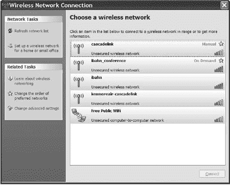
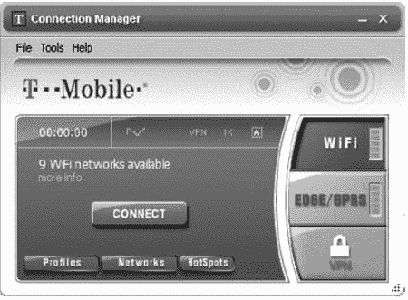
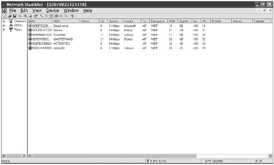
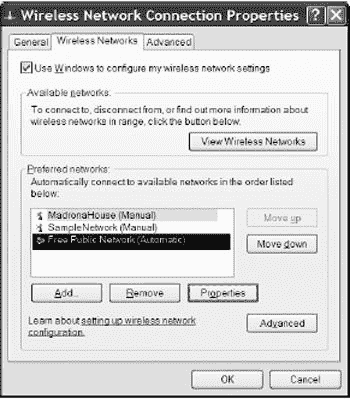
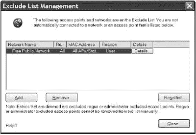

# 第十一章。连接到现有的 Wi-Fi 网络

对于许多人来说，当他们不在家或办公室时连接到互联网比操作或使用自己的网络更重要。学校、图书馆、机场、咖啡馆和会议中心的 Wi-Fi 信号，以及火车和公共汽车上的 Wi-Fi 信号，甚至在城市公园和高速公路休息区，都极大地促进了你的笔记本电脑或其他便携式设备成为随时随地可以上网的设备。在许多城市地区，几乎到处都可以找到 Wi-Fi 网络。当你在一个市中心或住宅区打开电脑的无线网络设置程序时，它通常会检测到六七个或更多的 Wi-Fi 信号。根据你的位置，其中许多信号可能是商业办公室局域网或家庭网络，但许多其他是欢迎外部用户（也就是你）连接的公共网络。其中一些服务按小时（或按月）收费提供互联网接入，但许多其他服务是免费的。

本章解释了如何找到允许你连接的 Wi-Fi 接入点，以及当你的电脑检测到多个附近的网络时如何选择最佳接入点。

# 公共 Wi-Fi 不安全

每次你使用公共 Wi-Fi 热点时，都存在一个非常现实的可能性，即其他人可以阅读从你的电脑传来的所有内容，包括你的登录名和密码、电子邮件、即时消息以及网页上的个人信息。可以捕获和显示 Wi-Fi 数据包在网络中移动的 Wi-Fi 网络监控程序很容易找到和使用。其他程序可以使用捕获的数据来破解你的 WEP 或 WPA 密钥。图 11-1 展示了网络监控程序正在运行。

**图 11-1. Wireshark，一款免费的网络嗅探工具，允许那些不怀好意的咖啡爱好者监听你的在线咖啡屋对话。图中显示了 MSN Messenger 的一个敏感聊天会话——但无论何时你在公共网络上，都要记住，你所有的未加密电子邮件、聊天和网页浏览都可能会受到类似的公开审查。请相应地行事！**

就算 Wi-Fi 热点是由你的酒店或知名的咖啡店或书店连锁经营，也不意味着你的数据是安全的。附近停着的汽车里（或隔壁的酒店房间）的人可能会在你看的时候监视你的按键——甚至修改它们。

因此，记住公共 Wi-Fi 连接是不安全的。不要在酒店、咖啡店、会议中心或任何其他地点使用 Wi-Fi 热点发送或接收你不想与房间内（或隔壁酒店房间）的其他人分享的信息。

另一方面，并非每个酒店大堂和机场候机区的植物后面都隐藏着 Wi-Fi 数据窃贼。如果你能运用一些常识——不要在公共热点上处理在线银行或发送你的信用卡号（或任何其他机密信息）——你应该能够在安全和便利之间找到平衡。

在可能的情况下，使用 VPN 或其他机制加密你的流量（参见第十五章了解如何实现）。这不仅会保护你的数据免受窥探，还能帮助防止有人向你的系统注入恶意数据。

记住，并非所有网站都使用 SSL 加密（URL 中的*https*和大多数浏览器窗口顶部或底部的锁形图标表示，如图图 11-2 连接。"所示)）。通常，只有登录过程被加密以保护用户名和密码，但后续页面没有加密，以节省 CPU 资源，避免加密来自成千上万或数百万用户的请求数据。

**图 11-2. 所有浏览器使用不同的锁形图标来表示安全的(HTTPS)连接。**

# 寻找 Wi-Fi 热点

找到 Wi-Fi 网络最简单、最明显的方法是打开您的计算机并运行其 Wi-Fi 控制程序。网络适配器将扫描附近的信号并显示一个列表，如图 11-3 所示，该列表显示了西雅图湖联酒店大堂中可用的未加密信号。当您在一个不熟悉的街区（或者甚至只是离您常去的地方几条街远）时，您可能不知道哪些网络会欢迎您的连接，哪些是私有的。仅仅因为网络的所有者没有麻烦开启加密，并不意味着它是邀请您使用该网络的公开邀请。

**临时网络**

您还可以在图 11-3 中看到一个虚假的公共网络，它声称提供“免费公共 WiFi”。然而，请注意，免费公共 WiFi 网络旁边的图标显示的是计算机到计算机的链接——一个临时网络。这实际上可能是窃贼直接连接到计算机的链接，试图窃取您的密码和其他私人数据，他可以在以后使用这些数据阅读您的电子邮件或耗尽您的银行账户。更有可能的是，它是本章后面描述的临时网络漏洞的受害者。如果您的计算机将附近的网络识别为免费 Wi-Fi 站点，您不应该相信它。不要费心连接到没有“免费 WiFi”名称的开放临时网络——无论如何，它们都不会让您上网。您唯一应该信任临时网络的时候是您故意与同一房间内的另一台计算机交换数据时。

在图 11-3 中，两个*ibahn*信号是酒店的热点 Wi-Fi；*cascadelink*和*kenmoreair*是肯莫尔航空水上飞机基地街对面的候机室接入点。

**图 11-3. Windows 网络连接窗口提供附近网络列表。**

最佳做法通常是尝试连接之前先做一些研究——要么在你离开家之前咨询一个热点在线目录（例如[`www.wifinder.com`](http://www.wifinder.com)，[`www.netstumbler.com/hotspots`](http://www.netstumbler.com/hotspots)，或[`www.wififreespot.com`](http://www.wififreespot.com)），要么在咖啡店门口或收银台附近寻找某种“这里有 Wi-Fi”的标志，在图书馆的信息台或其他明显位置。如果你能找到一份提供你想要使用的公共网络详细信息的说明书或信息卡，请确保连接到该网络的 SSID，而不是系统附近检测到的其他未知信号。

如果你订阅了特定的公共 Wi-Fi 服务，例如 Boingo 或 T-Mobile，你可以下载并安装一个程序来识别该公司的网站，并自动设置连接。图 11-4 显示了 T-Mobile 连接管理器。

当你在窗口右侧选择 Wi-Fi 选项并选择网络时，连接管理程序会扫描附近的信号，并在图 11-5 所示的窗口中显示一个列表。这张图片是在图 11-1 所示的位置拍摄的。

### 注意

*如果您在付费 Wi-Fi 网络上连接电子邮件服务器或即时消息系统时遇到困难，请首先尝试运行一个网页浏览器，例如 Internet Explorer 或 Firefox。许多订阅服务都使用浏览器来显示登录/密码屏幕*。

**图 11-4. T-Mobile 连接管理器提供 Wi-Fi 和其他宽带无线网络的访问。**

尽管你在家出发前最好检查目录和指南，但你可能会发现自己在一个新的地方，想要找到并使用 Wi-Fi 网络来连接电脑到互联网。你的 Wi-Fi 适配器提供的控制程序、电脑的操作系统以及电脑本身都使得识别和选择最佳附近的网络信号变得容易；像 NetStumbler（也称为网络嗅探器）这样的嗅探程序提供了更多关于每个网络的信息，你可以利用这些信息做出更明智的选择。

**图 11-5. T-Mobile 连接管理器检测附近的 Wi-Fi 网络。**

要找到 Wi-Fi 网络，只需打开你的电脑并运行你喜欢的 Wi-Fi 网络设置程序。一些公共网络对任何想要使用它们的人开放，但许多其他网络需要与网络运营商的账户（付费或其他方式）。当你连接到仅限账户持有者的网络时，每次你尝试使用网络浏览器或其他互联网应用程序程序时，你都会看到一个登录屏幕。

# 保持数据安全

每次你通过公共热点连接到互联网时，确保你的电脑防火墙处于激活状态，以防止其他人在你收集电子邮件、交换即时消息或在你参加的会议中关于当前演讲者的博客时连接到**你的**电脑。

Windows（XP 和 Vista）和 Mac OS X 都包括内置的防火墙，所有标准的 Linux 发行版也是如此。有关防火墙和其他与无线网络相关的网络安全问题，请参阅第十二章。

记住非电子方式窃取数据可能和通过另一台电脑监控你的无线信号一样有效也同样重要。当你发送和接收电子邮件或即时消息，以及在你在一个公共场所（如咖啡馆、图书馆或会议）输入未加密的账户名和密码时，你面临两种风险：附近电脑上的数据监控程序（也称为*窃听*程序）可以在你发送密码时捕获你的密码，而“偷窥者”可以观察你的屏幕和键盘，并记录你输入电脑的登录信息。

保护您的数据免受空中监控的最佳方式是在您的便携式计算机和办公室或家的局域网之间使用虚拟私人网络 (VPN)。第十五章 提供了有关安装和使用 VPN 的详细信息。如果不可能这样做，在您进行财务交易或发送私人电子邮件之前等待建立安全连接。确保您的关键数据绝对安全的方法是永远不要通过 Wi-Fi 网络发送。这可能听起来像是一个极端的说法，可能确实如此，但它却是真的。

### 注意

*不要假设您在酒店房间或办公室独自一人时 Wi-Fi 连接就是安全的。那个 Wi-Fi 信号可以轻易穿过墙壁和地板，到达另一个房间或停在附近街道上的汽车中的数据窃听者*。

防止他人看到您的屏幕需要一种不同的保护方式。如果可能的话，在咖啡馆或其他公共场所找一个桌子，您可以背对着墙坐下，这样别人就不能在您不知情的情况下从您肩膀上看到屏幕。如果这不太实际，当您在礼堂或公共活动的观众席上，或者当您在飞机或火车上时，考虑在您的计算机屏幕上使用隐私过滤器（由 3M 和其他公司制造），这样除非您正直接站在屏幕前，否则无法看到屏幕上的图像。再次强调，保护您的数据免受未经授权的关注最有效的方法是等待您可以在私密环境下使用计算机。

# NetStumbler 和其他嗅探工具

*嗅探工具* 是一种使用无线网络适配器扫描活动网络并显示每个网络特性的程序。NetStumbler 是一个非常出色的 Windows 工具，它将找到网络特性并显示一个列表，就像 图 11-6 中的那样，显示了您需要了解的关于检测到的网络信号的每一项信息，包括 MAC 地址、SSID、信道号以及信号强度和质量。如果您将全球定位系统 (GPS) 设备连接到您的计算机，NetStumbler 还可以确定它从每个接入点检测到的最强信号的精确纬度和经度，并且可以估算您当前位置与接入点之间的距离。NetStumbler 还显示每个网络的信号强度和噪声水平的数值，而不仅仅是几条横线。当您在寻找最佳的接入点位置或调整定向天线以找到最强信号时，这尤其有用。

**图 11-6. NetStumbler 找到并显示它所能找到的每个无线以太网信号的详细信息。**

对于我们大多数人来说，NetStumbler 和其他嗅探工具可以从空气中提取比我们需要的更多的 Wi-Fi 信息，但如果你试图绘制所有信号并比较你自己的复杂 Wi-Fi 网络的信号质量，或者你对附近网络的详细技术信息感兴趣，嗅探工具可以是有用的工具。NetStumbler 是**乞丐软件**，这意味着它是免费的，但认为它有用的用户被邀请向开发者发送未指定的捐款。你可以从[`www.netstumbler.com/downloads`](http://www.netstumbler.com/downloads)下载 NetStumbler。

还有其他一些更复杂的 Wi-Fi 嗅探工具也可供使用，但其中大多数需要运行 Linux 或 Unix 的计算机。TuxMobil 网站([`tuxmobil.org/linux_wireless_sniffer.html`](http://tuxmobil.org/linux_wireless_sniffer.html))是关于 Wi-Fi 嗅探器和扫描器信息的良好信息来源。最受欢迎的是 Kismet（可在[`www.kismetwireless.net`](http://www.kismetwireless.net)获取），它包括嗅探无线数据包、识别网络和检测对你自己计算机的入侵的工具。Kismet 是由本书的技术审稿人 Mike Kershaw 创建的。你可以在你自己的 Unix 或 Linux 发行版的常规软件来源或从[SourceForge.net](http://SourceForge.net) ([`www.sourceforge.net`](http://www.sourceforge.net))找到更多这些程序的描述。

## 公共热点

如果你不知道你等待换乘飞机的机场或你参加会议的会议中心的公共无线服务提供商与哪个网络服务有合同，你将不得不让你的计算机搜索信号。如果你还没有与特定的无线服务提供商建立账户，大多数都允许新用户现场设置新账户。

### 机场和会议中心

为机场航站楼提供公共无线网络服务是一个新兴且不断发展的行业，从消费者的角度来看似乎很简单——只需安装足够的接入点来覆盖所有候机厅和航空公司的休息室，将它们连接到宽带互联网主干，然后等待客户开始为网络接入付费。听起来就像一张印钞许可证。当然，事情并不那么简单。任何涉及政府拥有的机场管理局和为从空中交通管制到租车归还和穿梭巴士等所有不同无线电服务提供支持的设施的事情都不容易。当机场与一家无线服务签订特许经营协议，而每家航空公司都与不同的公司签订合同，为他们的所有 VIP 俱乐部提供无线服务时，事情变得更加复杂。

似乎每个机场的管理层都针对这些问题提出了一套略有不同的答案。因此，你不能假设你在芝加哥 Admirals' Club 设置的账户也能在西雅图 A-14 号登机口附近的候机区使用。唯一能找到答案的方法是打开电脑，看看它检测到哪些信号。如果 Wi-Fi 实用程序告诉你它已经找到了信号，记得查看显示所有范围内网络名称的菜单或窗口。如果你有这些网络中的任何一个账户，就登录进去。如果没有，选择信号质量最好的网络，并设置一个新的账户。为了避免陷入数据盗窃的陷阱，务必避免连接到电脑识别为 ad hoc 网络的所有信号。

如果你经常通过相同的机场，或者如果你是航空公司 VIP 俱乐部的一员，你将希望与为这些地点提供服务的那家公司设立一个预付费账户。当你发现自己在一个使用不同服务的地方时，你可以在现场注册一个按需付费账户。

会议中心的 Wi-Fi 服务类似。你可能需要支付公共 Wi-Fi 服务的付费订阅，但越来越多的会议组织者提供免费的 Wi-Fi 连接。要连接，打开你的笔记本电脑或其他无线设备，寻找强信号。如果需要，向会议官员询问酒店或会议中心提供的热点 SSID。

### 酒店

Wi-Fi 在大多数高档酒店、主要品牌汽车旅馆和豪华度假村都可用。无线互联网接入几乎和每个房间里的电视和免费早餐咖啡一样普遍。一些物业将 Wi-Fi 服务作为无额外费用的标准设施，而许多其他物业则要求客人额外付费使用互联网。

为了避免账单上的不愉快惊喜，在你入住酒店时询问 Wi-Fi 费用总是一个好主意。有些地方可能会自动添加一个过高的网络接入费用，除非你明确拒绝，即使你只连接了几分钟。就像昂贵的长途电话一样，一些旅馆老板将互联网接入视为向客人敲诈的另一个机会。

如果你住在一家对 Wi-Fi 收费过高的酒店或汽车旅馆（每天超过约 10 美元），告诉前台服务员你将不会使用这项服务，因此他们不应该为你收费。你可以带着笔记本电脑去附近的咖啡馆、咖啡厅、公共图书馆或其他附近的免费热点，在那里你可以以较低的成本，甚至免费连接。或者如果你经常旅行，可以考虑使用第十三章中描述的宽带无线数据服务，以完全绕过酒店的 Wi-Fi 网络。

许多酒店和其他商业场所的网络在允许您连接互联网之前，会要求您提供登录名和密码，即使他们不收取服务费，也是为了限制其客户的使用。您在入住时应该会收到一份说明单，或者在您房间的桌子或桌子上找到一份，上面详细说明了如何连接。

### 在飞机、火车、公共汽车和其他移动目标上

全世界的大众交通系统和长途客运铁路也向乘客提供 Wi-Fi 服务；您甚至可以在华盛顿州的普吉特湾和澳大利亚的悉尼港的渡轮上找到 Wi-Fi 网络。商业飞机上的 Wi-Fi 不太常见，但一些国际航空公司确实在长途航班上提供 Wi-Fi 服务。您预计在接下来的几年里，空中无线接入将会更多。

连接到移动热点与连接任何其他 Wi-Fi 网络没有区别，但特别重要的是您要选择车载服务而不是可能来自车辆外部的服务；否则，您几乎会立即超出信号范围。打开您的电脑，运行 Wi-Fi 控制程序，并选择您想要使用的网络。与您一起乘坐公共汽车、船只或火车的移动网络应该从其名称中显而易见。

提供从移动火车、公共汽车或其他移动目标连接的 Wi-Fi 服务通常比其他公共 Wi-Fi 服务收费更高，因为互联网连接更复杂，而且您是一个被动的受众——要么支付费用，要么没有连接。

# 市政无线网络

拥有多个接入点并覆盖整个社区甚至整个城市的公共 Wi-Fi 服务似乎是个体热点的一个合乎逻辑的扩展。这对市政府来说似乎是一笔非常好的交易，因为他们常常认为他们可以收取特许经营费或支付在公用事业杆上放置 Wi-Fi 天线的费用，同时可能为政府机构提供免费的无线互联网服务，同时为他们社区提供高速互联网接入。无论是对笔记本电脑还是其他便携式设备，还是作为电缆和 DSL 连接的替代品，无处不在的 Wi-Fi 似乎是一种合乎逻辑的新公共事业，就像电力和公共供水一样。因此，世界上许多城镇和城市正在考虑要么建立自己的广域 Wi-Fi 网络，要么与私人服务提供商签订合同。

公共 Wi-Fi 并没有像许多供应商和地方政府所期望的那样顺利发展，尤其是在主要城市中心。跟踪此类事件的贸易杂志和网站充满了报告，一个城市接着一个城市推迟了其市政 Wi-Fi 网络的启动，或者为它们建设系统的私人网络公司未能按计划提供服务，甚至取消了合同。那种似乎驱使企业家向任何新技术迈进的金矿心态已经被观望态度所取代：直到有人想出如何在城市范围内系统上真正赚钱的方法，供应商才会犹豫不前。

结果表明，社区 Wi-Fi 网络存在几个可能的问题。户外天线发出的信号并不总是能够在没有额外硬件的情况下为住宅和商业建筑提供可靠的信号；许多已经订阅了有线 DSL 或电缆互联网服务的人不想为另一个重复他们已有服务的订阅付费；而且一些新的宽带无线数据服务，例如我们在第十三章中将要描述的，几乎不需要那么多的接入点，因此建设和维护成本要低得多。没有新用户的基础，网络供应商不愿意在网络上花费资金。

尽管存在这些初步困难，一些城镇和城市已经开始提供市政 Wi-Fi 服务，其他地方也将效仿。如果你居住或工作的地方有公共 Wi-Fi 网络，它可以作为一个方便的替代品，补充你在家中和办公室的网络，用于咖啡店、书店和其他地点。

在 2009 年之后，当美国许多广播电台转移到不同的频道（加拿大在 2011 年），可能会出现更多的无线数据选项。最终，某种类型的广域无线互联网服务可能会在世界各地的许多城市和城镇中提供。该服务使用 Wi-Fi、WiMAX 还是其他技术还有待观察。

与大多数其他付费 Wi-Fi 网络一样，大多数市政网络在连接后会显示登录和密码输入窗口。在少数情况下，网络会免费提供一些访问时间，这样你可以在支付计费开始之前发送和接收电子邮件或进行简短的即时消息会话。

# “免费公共 WiFi”

有一种奇怪的 Wi-Fi 烦恼，声称是一个名为*免费公共 Wi-Fi*或*免费互联网接入*或类似名称的网络，这是由许多 Wi-Fi 控制程序中的错误（包括 Windows 中的那个）引起的。每个人都喜欢免费的东西，所以点击那个网络并尝试连接是非常诱人的，尤其是在替代服务按小时或按天收费的情况下。连接到这些网络可能不会损坏你的电脑或破坏任何数据，但它们是你应该知道并避免的虚假信号。这些信号在机场、酒店和其他许多人在相对较小的区域内同时使用笔记本电脑的地方尤其常见。

如果一个 Wi-Fi 控制程序在其首选网络列表中有一个或多个临时网络，那么每次它搜索连接时都会发送一个信标信号，并且每个附近的 Wi-Fi 适配器都会接收并显示该网络名称（例如，*免费 Wi-Fi 服务*）。当试图连接到“免费”网络的那些电脑的拥有者尝试连接时，控制程序会将该名称添加到其首选列表中，并再次发送一个信标信号。就这样，它悄无声息地不断创建更多无用的新的信标信号。在一个繁忙的机场候机区，你可能会在 Wi-Fi 控制程序中看到多达半打以上的单独*免费 Wi-Fi*临时网络列表。

原始的*免费 Wi-Fi*信号可能是一个想要从毫无戒心的旅客那里窃取密码和其他数据的网络破解者。然而，导致其自我复制的 Wi-Fi 控制程序中的错误已经创建了一个比严重安全威胁更大的麻烦的无线蠕虫。

图 11-7 显示了一个检测到三个单独虚假临时网络的 Windows 无线网络连接程序。在这种情况下，这些信号可能来自酒店大堂上方直接拍摄图像的客房中的笔记本电脑。

如果你仔细查看 Wi-Fi 控制程序，你会注意到每个信号都是从临时（计算机到计算机）链接而不是 Wi-Fi 接入点发出的，因此与该网络列表相关联的是不同类型的图标。如果你的 Wi-Fi 控制程序显示了每个信号的属性，你会发现*免费公共 WiFi*、*免费互联网*和*hpsetup*网络的地址都以*02-XX*开头，这不是一个合法的 MAC 地址号码。

**图 11-7. 屏幕上这三个计算机到计算机的网络并非表面上看起来那样。**

尽管这些名称很诱人，您**不应**尝试连接到这些网络中的任何一个。在大多数情况下，您可能不会连接到任何东西，但您的电脑会将**免费公共 WiFi**（或信标使用的任何名称）添加到您自己的受批准网络列表中，并且它将开始发送另一个具有相同名称的临时信号。更糟糕的是，如果您的电脑在附近创建了一个临时网络，使用另一台电脑的人可能能够打开并读取您的文件。

### 注意

**如果您通过这些虚假热点之一成功连接到互联网并通过阅读电子邮件、使用即时消息或执行任何需要登录和密码的操作，那么有人可能会在网络传输过程中截取您的数据。请务必尽快更改所有账户名称和密码——是的，所有账户**。

如果您的电脑自动连接到这些网站之一，请立即断开连接或关闭您的 Wi-Fi 适配器。为了确保您的电脑不会继续发送**免费 WiFi**信标，请按照以下步骤操作：

1.  打开您通常使用的网络连接控制程序。

1.  如果列表中出现**免费公共 WiFi**或您不常用的任何其他临时网络，请选择它（但不要点击连接按钮）并打开高级设置（在 Windows 中），配置文件窗口（在 Intel PROSet 中），或控制预设连接配置文件的章节。在 Windows 中，打开无线网络选项卡，如图图 11-8 所示。

    

    **图 11-8. 使用无线网络连接属性窗口来删除一个虚假的临时网络配置文件。**

1.  从配置文件列表或首选网络中选择您想要删除的配置文件，然后点击**删除**按钮。

1.  点击**确定**以保存您的操作并关闭窗口。

在 Intel PROSet 程序中，您可以通过在主控制窗口中选择任何网络名称并点击属性来永久排除虚假临时网络名称。当属性窗口打开时，点击管理排除以打开排除列表管理窗口，如图图 11-9 所示，在那里您可以添加虚假信号的名称。

**图 11-9. Intel 的 PROSet Wi-Fi 软件提供了一个排除列表。**

# 未受保护的私有接入点

之前我们还没有讨论过的一个可访问 Wi-Fi 信号的来源：那就是从邻居们懒得保护的无线家庭和办公网络中泄露出来的信号。抓取这些网络中的一个连接可能会非常诱人，但这既不合法也不道德，即使它出奇地容易。在许多市中心办公区、高科技工业园区和住宅区，一个随意参观的人通常可以在几块街区之内找到并登录到五六个或更多的无线网络。

如果你能够检测到网络信号，你可能会通过该网络连接到互联网，但这在法律上被视为“服务盗窃”；网络管理员和执法人员对此表示反对，至少可以说。

当然，任何有理智的人都不会考虑未经允许使用别人的网络或监听别人的无线流量。如果你想尝试，那就自己负责。几分钟的在线搜索就可以通过一个好的搜索引擎提供许多流行网络接入点和 WEP 密码的出厂默认 SSID 列表以及破解 WEP 加密的软件。许多用户，尤其是在家庭网络和小型企业中，没有开启加密，因为它们“太复杂”或“太麻烦”，或者因为没有人告诉他们这是重要的（请考虑自己已经得到了建议：这是重要的）。更多的人甚至懒得更改他们的默认 ID 和密码。

这种无线网络黑客行为有时被称为 *wardriving*，它是老黑客们 wardialing（使用调制解调器拨打随机电话号码以寻找未受保护拨入端口的计算机）实践的扩展。

一些未受保护的无线网络实际上欢迎公众访问，因此 wardriving（或使用 Wi-Fi 功能的 PDA 或智能手机进行 warwalking）有合法的理由。即使你实际上并没有尝试建立与网络的连接，四处逛逛看看有什么，这也可以是有教育意义的（是的，也是有趣的），但当你未经许可点击邻居网络上的连接按钮时，你就是在违法。

通常来说， wardriving（或游击式网络连接），或者你想要怎么称呼它，都是那些有点儿好玩但并不符合礼貌行为准则的活动之一，就像监听邻居的无绳电话通话一样。是的，你可以争论那些愚蠢到运行未受保护无线网络的人应该让其他人使用它，或者带宽就在那里，可以随意取用，但这不太可能说服网络的所有者（或者在你在线时敲你车门的好警察）你的意图完全是高尚的，你并没有对任何人造成伤害。

如果你将 wardriving 视为一个不具侵扰性的爱好，就像那些带着无线电扫描仪去铁路货运场，聆听列车调度员和个别机车工程师之间的对话的人，或者像那些记录下他们所见过的每一个物种的观鸟者一样，那么这可能是相当无害的。但是，当你越过界限，实际上建立了一个未经授权的连接时，你应该清楚地了解你正在做什么——窃取带宽。

虽然不常见，但警方确实逮捕了因窃取 Wi-Fi 连接的人。2006 年，华盛顿州温哥华的一家咖啡店老板抱怨一个男子每周几次从他的停着的卡车中使用她的 Wi-Fi 热点，三个月内从未买过任何东西。警方指控他盗窃服务。一年后，BBC 报道说，英格兰伍斯特郡雷迪奇镇的一名男子因“欺诈性获取通信服务，意图逃避付款”而受到警告。还有一个人在伦敦因“劫持无线宽带连接”被罚款 500 英镑。

即使网络警察不会来逮捕你，指控你盗窃服务（这是可能的，但非常不可能），你也在冒着自己的数据风险；一些未受保护的网络是由那些希望你会使用它们的人运营的，因为他们正在记录你的所有按键和其他数据，包括你的电子邮件密码、信用卡号码和其他个人信息。

当然，当你处于这个围栏的另一边时，防止未经授权的用户通过你的接入点连接对你来说是有利的。至少，你应该明白 Wi-Fi 网络并不绝对安全，每个接入点和网络适配器都会辐射出可以被外界检测到的信号。你可以采取措施限制对网络的访问，但你无法将网络的 existence 保密，不让一个认真的窥探者知道。作为你自己的无线网络的管理员，这应该在你脑海中引发许多问题。比如：我的网络安全吗？有没有人在街上未经我的知晓连接到我的网络？我该如何将这些 #*@&$! 阻挡在我的网络之外？关于无线网络安全的其他问题的答案，请立即翻到这本书的下一章。
