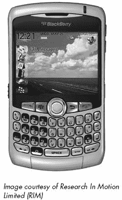
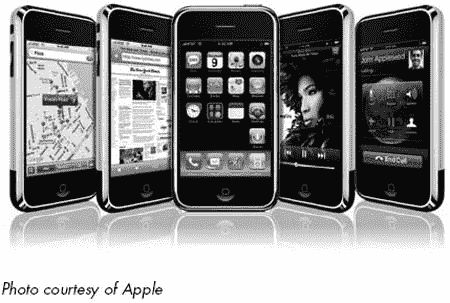
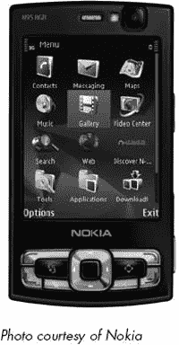
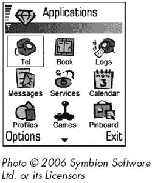

# 第十四章。智能手机和 PDA

Wi-Fi 和其他宽带无线网络不仅限于运行完整操作系统的大型计算机。Palm、BlackBerry、Pocket PC、iPhone 和其他手持个人数字助理（PDA）都可以使用无线链接与其他计算机同步数据，发送和接收电子邮件，以及从互联网下载数据。这一类新的混合设备可以在相对较慢的 EDGE 或 EV-DO 网络（具有广泛的覆盖区域）和 Wi-Fi 网络之间自动切换，只要可能就会这样做。

每款手机都有不同的功能和功能集，从相对简单的手机，提供对基于文本的信息（如天气预报或体育比分）的有限访问，到非常复杂的设备，这些设备使用 Windows Mobile 或 Palm OS 等操作系统来处理电子邮件和网络浏览。许多手机还具有数码相机的功能，允许用户发送和接收图片，多媒体播放器可以存储和播放音乐和视频，以及提供驾驶方向的 GPS 接收器。

随着从第一代蜂窝移动电话服务（仅模拟语音）到第二代和第三代（2G 和 3G）数字服务的每一次进步，语音和数据服务已经越来越接近融合。根据服务提供商使用的无线方法，许多最新的移动电话可以发送和接收一定量的数据（如短信和图片），同时保持现在传统的语音连接。这些无线方法同样支持许多个人数字助理（PDA）和在第十三章中描述的宽带无线适配器第十三章。

### 注意

*几乎任何移动电话都可以通过拨号调制解调器和专用电缆将便携式计算机或 PDA 连接到互联网，但连接将会缓慢且繁琐，因为拨号访问通常限制在 56Kbps 的最大值。其他设备和服务计划也可能提供显著更快的数据连接*。

在本章中，*PDA*是指使用专用个人信息管理器（PIM）操作系统或为移动设备定制的 Linux 版本的便携式计算机。*智能手机*是指可以通过某个蜂窝移动电话网络使用，并具有其他 PIM 功能的 PDA。

# 通过 PDA 和其他手持设备连接到互联网

带有无线网络适配器的 PDA 在你离开自己的家或办公室时特别有用，当你想要发送和接收电子邮件或短信，或者想要查阅在线信息源时。将电话、相机、文本和语音记录器、音乐播放器、互联网设备以及一个小型通用计算机集成在一个方便的口袋大小的包装中，是人们在技术使用方式上的一大进步。五十年前，将所有这些技术放在口袋里是不可想象的；甚至就在 5 或 10 年前，这也需要半打单独的设备（当然，50 年后这一切都将显得无比原始）。

支持笔记本电脑和台式计算机的相同 Wi-Fi 网络服务也可以与手持设备一起工作。一个或多个接入点作为无线网络的中心，同时充当局域网有线部分和互联网的桥梁。一个网络可以包括手持设备和更大的计算机，因此使用无线链接同步 PDA 与另一台计算机是完全实用的。

### 注意

*在网络上搜索紧凑型闪存或 SD Wi-Fi 适配器会产生数千个链接，但其中大部分已经过时几年。仅仅因为一个产品已经停产并不意味着描述它的网页就会消失*。

**升级旧款 PDA**

几年前，智能手机 Wi-Fi 适配器是一个流行的附加产品，但这些小巧的插件卡已经变成了一个鲜为人知的特殊产品，因为内置 Wi-Fi 的新智能手机已经取代了旧型号。一些制造商仍然在 SD、miniSD 和 CompactFlash 卡上制造 Wi-Fi 适配器，但这些可能是你从未听说过的公司，比如 SparkLAN ([`www.sparklan.com`](http://www.sparklan.com)) 和 Spectec ([`www.spectec.com.tw`](http://www.spectec.com.tw))。如果你通过通常的供应商找不到适配器，尝试在 eBay 上搜索*Wi-Fi*紧凑型闪存或*Wi-Fi SD*。

插件适配器没有通用标准，因此每个 PDA 品牌和型号都需要一种特定的类型，可能与其他品牌不兼容。你的 PDA 说明书或用户指南应标识出它需要连接到无线网络的网络适配器类型。

一些较旧的适配器仍然可以通过过剩渠道获得，但在你订购之前，请确保你可以找到适用于你的 PDA 操作系统的驱动程序，无论是适配器附带的 CD 上，还是从制造商的网站上下载。NETGEAR、Linksys 和其他主要适配器制造商仍然提供其已停产的适配器的驱动程序和软件免费下载，但他们可能不会有适用于较新操作系统的驱动程序。

# 选择智能手机

要找到一款具有宽带无线访问功能的新智能手机，最好的地方是你要使用的网络服务提供商。你可以选择你想要的型号，然后寻找支持该型号的服务提供商，或者你可以选择一个服务提供商，并将你的选择限制在其型号列表中。大多数移动电话公司和无线服务提供商都有零售店和网站，你可以比较与他们的网络兼容的特定型号。

由于大多数 PDA 和智能手机都有小屏幕，设计师们已经将大量的程序图标和其他信息压缩到一个小空间里。这使得操作手持设备比带有大屏幕、鼠标和键盘的全尺寸计算机要困难得多。当然，通常会有一个学习曲线，随着时间的推移，任何设备都会变得更容易使用，但在购买之前尝试多个设备仍然很重要。“易于使用”是一个主观的判断，对每个人来说都不尽相同。有些人可能会更喜欢 iPhone 的触摸屏，而其他人可能会更喜欢 BlackBerry 的键盘或 Windows Mobile 或 Symbian 设备上的简单键盘。最好的办法是访问一家或多家零售店，比较具有不同操作系统、不同功能集和不同物理布局的几款手机。

每款智能手机都配备了一套基本程序，还有很多其他程序可供选择。当你试图决定购买哪款手机时，考虑你可能会使用的程序，并确保选择一款既包含这些程序又支持一个或多个满足你需求的售后程序的设备。

比较每台设备支持的特定无线服务也同样重要。它是否使用快速 EV-DO 或 EDGE 连接，还是仅限于较慢的 GPRS 系统？它是否在连接宽带网络之前自动搜索附近的 Wi-Fi 信号？服务提供商在你预期使用设备的地方是否提供有用的信号覆盖？当然，一些智能手机比其他的大。如果你打算将手机放在口袋里而不是钱包或公文包里，那么选择一个较小的型号可能更好。

与移动电话一样，每个无线数据设备都有一个独特的电子序列号（ESN），该序列号将该适配器链接到特定的账户。当你购买具有宽带无线访问功能的智能手机或 PDA 时，你必须为你的新 PDA 设置一个新账户，或者从另一台设备转移一个现有账户。

### 注意

*如果你将你的手机或 PDA 从一个服务提供商转移到另一个服务提供商，新的服务提供商可能需要打开你的 PDA 并安装一个带有不同 ESN 的新电路板*。

## 智能手机操作系统

智能手机是一种小型移动计算机，其操作系统控制着其功能和性能，包括屏幕布局以及它发送和接收数据和电话的方式。最广泛使用的智能手机操作系统包括 Symbian、Windows Mobile、BlackBerry OS、Palm OS 以及苹果的 iPhone 的 OS X。基于 Linux 的手机也存在，但在北美并不常见。每个操作系统都包含略有不同的功能集，每个都有其自身的优势和劣势，但它们都做基本相同的事情：它们提供内部软件，允许 PDA 或智能手机接受、存储和显示文本、音频、图像和其他数据，并通过一个或多个通信渠道进行通信。

2007 年底，谷歌宣布计划推出自己的智能手机开放平台操作系统，名为 Android，并邀请第三方软件开发者为它创建新应用。基于 Android 的手机（谷歌手机？）至少需要一两年时间才能进入现实世界的消费者市场，但一旦它们做到了，谷歌可能会对微软、Symbian 和其他公司构成严重竞争。

Palm、BlackBerry 和 iPhone 操作系统都是为了特定的硬件平台设计的，而 Symbian、Windows Mobile 和 Linux 则更加灵活；使用这些操作系统的硬件制造商可以选择在其产品线中的每个设备上提供他们想要的特定功能集和功能。

一些智能手机还包括一个*连接调制解调器*功能，该功能通过电缆将笔记本电脑或其他便携式计算机连接到互联网，使用智能手机的宽带无线账户。这个功能并非每个型号或每个服务提供商都提供，但它可以是一个方便的替代方案，无需单独的无线网络适配卡和宽带数据账户。许多 BlackBerry 型号都配备了连接调制解调器软件，June Fabrics Technology（[`www.junefabrics.com`](http://www.junefabrics.com)）为 Palm OS 和 Windows Mobile 提供类似程序，名为 PdaNet。根据你的服务提供商，连接可能会每月产生额外费用，并且通常速度不会像专用宽带调制解调器（例如，EV-DO Rev. A 通常仅作为专用设备提供）那样快。

### Windows Mobile

微软的 Windows Mobile 操作系统内置了对 Wi-Fi 网络的支持，以及微软 Internet Explorer 网络浏览器的移动版本、Windows Media Player 和各种办公应用程序。Windows Mobile 拥有许多基于熟悉的 Windows 用户界面的设计功能；从屏幕上的开始按钮到许多程序的布局，外观和感觉对 Windows 用户来说很容易学习和使用。图 14-1 显示了一个使用 Windows Mobile 的 PDA。

Windows Mobile 提供了与 Palm、Symbian 和其他操作系统相同的所有基本功能，但它还提供了对微软的 Mobile Office 程序的支持，包括 Word、Excel 和 PowerPoint 的定制版本，以及一个移动版本的 Internet Explorer（如图 14-1 所示）。如果您使用的是微软的 Exchange Server，您可以使用 Windows Mobile 智能手机轻松发送和接收电子邮件。通过[`www.microsoft.com/windowsmobile/catalog`](http://www.microsoft.com/windowsmobile/catalog)还可以获得许多额外的专业程序。

大多数新的 Windows Mobile 设备都内置了 Wi-Fi 适配器，许多设备还支持一个或多个宽带无线系统，具体取决于服务提供商。您可以在微软的 Windows Mobile 网站上找到目前可用的 Windows Mobile 设备列表，[`www.microsoft.com/windowsmobile/devices/default.mspx`](http://www.microsoft.com/windowsmobile/devices/default.mspx)。

**图 14-1. 微软为 Windows Mobile 操作系统提供了一系列程序。**

### BlackBerry

BlackBerry 是由 Research In Motion 公司制造的一系列智能手机，集成了数据通信软件和服务。除了语音电话服务外，BlackBerry 还提供电子邮件、即时短信和通过 Wi-Fi 和宽带无线数据网络访问互联网的功能。根据 BlackBerry 型号和服务提供商的不同，一些设备仅使用较慢的 GPRS 宽带技术，而其他设备则支持更快的 EV-DO 或 EDGE 网络。如果您计划使用 BlackBerry 访问互联网，最好寻找支持快速数据传输的型号。

电子邮件是使 BlackBerry 成为美国最受欢迎智能手机的应用。屏幕和键盘的设计使得阅读和发送信息变得快速便捷。如果您是经常使用电子邮件的用户，BlackBerry 可能是您的最佳选择。

图 14-2 展示了一款典型的 BlackBerry。注意屏幕右上角显示了 EDGE 连接的信号强度。

BlackBerry 在全球范围内由蜂窝电话公司和宽带无线服务提供商销售和支持。与其他移动设备品牌一样，最好通过当地公司（直接或通过零售商或其他代表）购买 BlackBerry，以确保其已针对本地网络进行了优化。

### Palm

Palm 制造了两系列智能手机：一组使用微软 Windows Mobile 操作系统，另一组使用最初为手持 Palm PDAs 设计的 Palm OS。使用 Palm OS 的智能手机具有许多用户认为合理且易于使用的屏幕布局。核心 Palm OS 包括通常的手机功能，但它还支持比任何其他操作系统更多的第三方开发者的程序。

根据销售每个型号的服务提供商，Palm OS 智能手机支持 EV-DO 或 EDGE 网络。有关 Palm 智能手机的比较，包括支持每个型号的美国服务提供商，请参阅 Palm 的网站[`www.palm.com/us/products/resources/comparison-smartphone.html`](http://www.palm.com/us/products/resources/comparison-smartphone.html)。要在世界其他地区寻找 Palm 智能手机，请访问[`www.palm.com/intl`](http://www.palm.com/intl)。

图 14-3 显示了连接到 Google Maps 的 Palm Treo 智能手机。

**图 14-2. BlackBerry 智能手机结合了电话和数据通信功能。**

**图 14-3. Palm Treo 680 智能手机使用 Palm 操作系统。**

### 苹果 iPhone

苹果的 iPhone 是一款移动电话、iPod 多媒体播放器、相机和宽带无线互联网客户端，所有这些都在一个手持设备中，该设备使用触摸敏感的屏幕图标代替传统的按键键盘。图 14-4 显示了几个 iPhone 屏幕显示。

**图 14-4. iPhone 将多种功能集成在一个紧凑的包装中。**

将 iPhone 作为一个整体来看，它提供了一套令人印象深刻的特性和功能。宽屏（3.5 英寸）触摸屏显示看起来很好，手感舒适，各种命令和显示界面易于使用和理解。然而，无线互联网接入可能是 iPhone 最弱的功能。它限制在每个国家的单个服务提供商，并且当不在可用的 Wi-Fi 接入点范围内时，它使用相对较慢的 EDGE 连接。在没有取消保修和可能损坏手机的情况下，无法解锁指定服务提供商的 iPhone。

如果你认为 iPhone 提供了最佳的功能组合，或者你对那巧妙的触摸屏感到满意，你可以从 AT&T（或你所在国家的受控服务提供商）或直接从苹果公司购买。无论哪种方式，你都需要在美国拥有 AT&T 无线或有线宽带账户，在加拿大是 Rogers，在英国是 O2 网络，在德国是 T-Mobile，在法国是 Orange（或当 iPhone 在你所在国家上市时支持 iPhone 的服务提供商）。

自从 2007 年 iPhone 推出以来，包括诺基亚、惠普和宏达电在内的几家其他制造商也创建了使用类似触摸屏控制功能的手机，如图 14-5 中所示。如果你不介意所有 iPhone 功能（如音乐和视频播放器），或者如果你想有一套不同的捆绑程序，你可能会从其他制造商那里找到更便宜的替代品。然而，苹果已经成功地将 iPhone 营销为*拥有*高地位智能手机。即使你的诺基亚或惠普智能手机能做你想要的一切，包括煮早餐，它可能也不会像 iPhone 那样给你的朋友留下深刻印象。

### Symbian

Symbian 是由包括爱立信、诺基亚、松下、三星、西门子和索尼爱立信在内的几家主要移动电话制造商共同拥有的。世界上大多数智能手机都使用 Symbian 操作系统，但在北美它不如其他操作系统常见。Symbian OS 版本 9.5（2007 年的当前版本）支持 EDGE 宽带连接。图 14-6 显示了使用 Symbian 操作系统的智能手机屏幕。

### Linux

摩托罗拉、NEC 和三星是那些在某些地区提供基于 Linux 智能手机的众多手机制造商之一，但其中只有少数设备在美国获得批准使用。你可以在[`www.linuxdevices.com/articles/AT9423084269.html`](http://www.linuxdevices.com/articles/AT9423084269.html)找到 Linux 智能手机的部分列表。与其他每个都有单一功能集和功能集的手机操作系统不同，有几个不同的团队正在与 Linux 合作。因此，Linux 智能手机的屏幕布局和命令集并不总是从一家硬件制造商到另一家保持一致。

另一个基于 Linux 的设备是诺基亚的互联网平板系列。虽然它们实际上并不是智能手机，因为它们不包含蜂窝电话硬件，但诺基亚平板电脑支持 Wi-Fi 和蓝牙，可以使用热点或连接的电话来访问互联网。

展示了使用 Qtopia 的智能手机，Qtopia 是 Trolltech 开发的 Linux 版本。这款特定的手机由威士敦公司制造，威士敦是一家台湾原始设计制造商（ODM），其产品被许多其他公司重新品牌化。

**图 14-5. 诺基亚的 N95 智能手机提供许多类似的功能，但它不是 iPhone。**

**图 14-6. Symbian 为许多硬件制造商生产的智能手机提供软件。**

**图 14-7. Qtopia 是多个 Linux 智能手机开发商之一。这款 Qtopia 手机由威士敦公司制造。**

# 哪个最好？

选择适合您需求的智能手机可能会令人困惑，因为每个硬件制造商和每个操作系统都在略有不同的包装中提供不同的功能组合。如果您拥有智能手机的一个重要原因是访问互联网，您可以将适用于笔记本电脑和其他便携式计算机适配器的相同标准应用于智能手机：寻找覆盖范围包括您可能使用设备的所有地点的服务提供商，并寻找最快的可能的数据传输速度。

智能手机通常是在一个设备既作为电话和互联网接入设备又执行其他功能，同时保持单用途移动电话或 PDA 的小巧和简单之间的折衷。手机的软件反映了这种折衷。

记住，宽带无线网络不会关心通过它的数据类型或发送和接收数据的客户端设备类型。只要帧、数据包和无线电调制方法符合 Wi-Fi 规范或与 EDGE 或 EV-DO 标准兼容，网络就会将其传递。因此，今天连接您的笔记本电脑到互联网的相同技术明天将出现在执行完全新服务的嵌入式模块中。例如，家用电器、办公机器和汽车将向中央监控中心传输诊断信息，以便在问题对使用这些机器的人可见之前识别问题并派遣维修技术人员。可轮询的水表和电表将允许公用事业公司的远程数据收集器收集计费信息，而无需派遣人工抄表员到每个账户位置。

人们似乎以两种截然不同的方式看待智能手机：要么他们无法想象需要这样一件东西，要么他们将其视为日常生活中不可或缺的一部分。许多使用智能手机的人表示，他们永远不会想要放弃它们。一个单个小巧的设备就能完成所有这些功能，足以让他们终身享受——或者至少直到下一代功能更强大的电子助手出现。

另一方面，正如弗洛伊德可能说的那样，有时一部手机就是一部手机。如果你只需要电话通话和偶尔的短信，那么你不需要智能手机带来的费用和复杂性。
