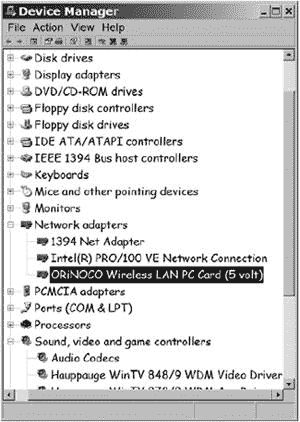
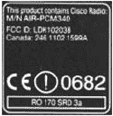

# 第十七章。技巧与故障排除

当你的无线网络连接中的所有东西都正常工作时，你甚至都不会知道它的存在——只需启动无线网络适配器并上网。即插即用，对吧？别抱太大希望。

就像与计算机相关的所有事物一样，无线网络在设置正确的情况下运行得很好。但这个基本设置通常隐藏在三层窗口、屏幕和对话框之下。如果某些晦涩的配置选项设置错误，网络连接可能无法正常工作，甚至根本无法工作。本章包含了常见问题的描述以及解决这些问题的建议。

# 我的计算机无法检测到我的网络适配器。

当你将适配器连接到计算机或打开计算机时，Windows 应自动检测 PCMCIA 或 USB 适配器。如果你使用的是 PC 卡，当 PCMCIA 控制器检测到它时，你应该会听到一个*boo-deep*的声音，系统托盘（时钟旁边）应该显示一个类似于图 17-1 中的 PC 卡图标。

**图 17-1。当计算机 PCMCIA 插槽中的设备处于活动状态时，PC 卡图标会出现。**

如果 Windows 没有检测到 PC 卡或 USB 设备，请尝试移除并更换卡片或拔掉并重新连接 USB 接口。如果是 PC 卡，请确保卡片牢固地插入插槽中。如果是 USB 适配器，请断开连接到同一计算机的任何其他 USB 设备，并再次尝试连接无线适配器。如果适配器工作正常，请逐个连接其他 USB 设备；如果连接另一个 USB 设备导致无线适配器失效，这两个设备正在争夺相同的资源。

尝试将 USB 适配器连接到不同的 USB 接口。问题可能是第一个 USB 接口的内部连接不良。

如果 Windows 没有自动识别你的网络适配器，它可能找不到正确的驱动程序，无论是 PCMCIA 插槽还是适配器本身的驱动程序。设备管理器（如图 17-2 所示 Figure 17-2)将显示一个带有黄色感叹号或红色*X*的图标，表示任何当前工作不正常的设备。右键单击带有感叹号或*X*的列表，从菜单中选择**属性**以恢复设备或重新安装驱动程序。

**图 17-2. 设备管理器识别出未正确工作的设备。在 ORiNOCO 无线局域网卡的列表旁边，图标上有一个红色的 X。**

如果没有列出 PCMCIA 插槽或网络适配器，请从适配器提供的磁盘安装驱动程序，或者从制造商的网站下载新的驱动程序。

在 Linux 中，PC 卡需要 PCMCIA 服务和无线扩展。在 Unix 中，你必须安装你网络适配器的特定驱动程序。连接你的设备后，使用`dmesg`查看内核日志，这将指示设备是否被正确检测。对于 CardBus 卡（但不包括 PCMCIA 卡），`lspci`应显示设备及其所需驱动程序类型的信息。对于 USB 卡，`lsusb`将显示所有检测到的 USB 设备并提供相关信息。

如果你使用的是笔记本电脑，请确认无线操作已开启。检查无线配置和控制程序中的硬件开关和软件控制。

# 即使我不使用我的适配器，无线控制程序也会尝试运行。

一些无线配置和控制程序会自动尝试在每次启动计算机时加载。对于始终使用它们连接到局域网的台式计算机，在启动时运行无线程序是可以的，但对于经常在没有无线网络连接的情况下运行的笔记本电脑来说，这就不太合理了。

要删除自动启动功能，请按照以下步骤操作：

1.  从 Windows 的开始菜单中选择**运行**。

1.  在“打开”字段中键入**`msconfig`**并点击**确定**按钮。

1.  选择**启动**选项卡以显示每次启动 Windows 时自动运行的程序列表。

1.  在列表中找到无线配置程序的条目，并取消选中同一行的复选框。

1.  大多数 Windows 系统都有几个其他不必要的程序会自动启动。当你打开程序时，查找那些你不需要在启动时打开的其他程序并将它们禁用。

1.  当 Windows 提示你时，点击**确定**按钮并重新启动你的计算机。

如果你已经从启动列表中删除了几个程序，你可能会注意到 Windows 启动得比以前快得多。

即使配置程序不再每次运行 Windows 时都运行，你可以在需要时启动程序。你可能会在桌面或程序菜单中看到一个或多个无线程序的快捷方式。

# 我的计算机无法与本地网络建立连接。

如果你找不到网络，请检查以下项目：

+   确认无线网络适配器 PC 卡已牢固地插入 PCMCIA 插槽。

+   确认 USB 适配器和计算机之间的电缆两端都已插入。

+   如果您正在使用接入点，请确认您的网络适配器已配置为基础设施网络；如果您试图直接连接到另一个无线适配器，请确认两个系统都已配置为对等网络。

+   确认您正在使用正确的加密密钥。

+   确认 IP 地址设置正确。如果接入点或其他 DHCP 服务器自动分配 IP 地址，请确认计算机的 TCP/IP 设置设置为自动获取地址。

+   关闭加密和身份验证进行测试，然后 *务必在完成后再次启用它们*。

# 我的计算机连接到了错误的网络。

在一个环境中，如果无线网络信号超过一个网络适配器中无线电的接收范围，适配器将检测到所有这些信号。如果 SSID 选项设置为连接 *任何* 网络，客户端将自动连接到最强的本地信号；如果配置程序包含两个或更多 SSID 的列表，它将按照列表中指定的顺序搜索 SSID。

要将计算机配置为连接到特定网络，请在无线配置程序中更改首选网络列表，并更改工作组名称。SSID 和工作组都应该与您想要使用的接入点的 SSID 匹配。

如果该区域内的另一个网络使用与您相同的 SSID，无线控制软件将假设它是您网络的一部分。将您的 SSID 更改为唯一的名称。

要更改 Windows XP 中的工作组名称，请按照以下步骤操作：

1.  从控制面板打开 **系统** 窗口。

1.  选择 **计算机名称** 选项卡。

1.  点击 **更改** 按钮。

# 我可以看到本地网络，但无法连接到互联网。

大多数局域网使用网关服务器将局域网内部使用的 IP 地址转换为识别此网络的独立 IP 地址。为了建立互联网连接，您的计算机的 TCP/IP 网络配置设置必须指定网关和一台或多台 DNS 服务器的地址。

按照以下步骤检查您的计算机是否已收到地址：

1.  打开命令提示符（运行 **`cmd`**）。

1.  使用 **`ipconfig /all`** 查看网络配置。

1.  使用 **`ipconfig /release`** 和 **`ipconfig /renew`** 重新初始化 DHCP（请求新地址）。

# 我可以看到互联网，但看不到我局域网上的其他计算机。

一些防火墙程序通常阻止查看文件和目录的入站尝试。这防止了对您计算机的未经授权访问，但也阻止了局域网上的其他计算机（除非您明确允许这些计算机访问，使用它们的 IP 地址）。防火墙设置应包括一个功能，让您可以识别受信任的计算机或允许本地访问（每个防火墙程序都不同）；请参阅防火墙程序的文档以获取具体说明。

如果防火墙没有阻止访问，那么可能是因为您试图连接的计算机配置不正确，接入点无法识别该计算机的 MAC 地址，或者另一台计算机已关闭文件共享。

# 信号强度弱或信号质量低。

假设接入点靠近您的计算机，信号弱可能是由于网络适配器和接入点之间有某种障碍物。为了提高信号质量和信号强度，尝试将适配器（如果适配器在 PC 卡上，还包括计算机）移动到不同的位置。2.4 GHz 的无线电信号的波长非常短（它们被称为*微波*是有原因的！），因此即使移动适配器很短的距离也可能足以产生明显的差异。

如果您使用的是 USB 适配器，您对其位置的选择可以更加灵活。尝试将适配器放在书架顶部或其他有清晰射向接入点的位置。并且尝试将适配器（或外部天线）侧放，使其侧放而不是直立；这可能会使适配器天线的极性与接入点天线的极性更接近。

# 我找不到公共网络。

在您的计算机连接到公共无线网络之前，您的网络适配器必须与该网络的接入点关联。如果适配器没有自动加入网络，请检查以下配置设置：

+   确认 TCP/IP 设置已配置为从 DHCP 服务器接受 IP 地址。

+   在尝试使用其他互联网客户端程序（如邮件阅读器）之前，请先运行您的网络浏览器。大多数商业公共网络通过浏览器显示登录屏幕，并且它们不会建立任何其他连接，直到您向它们确认身份（并开始计费计时器）。如果您的默认主页是一个空白屏幕，请从您的收藏夹或书签列表中选择一个网站，或在地址字段中输入 URL。本地登录屏幕将在计算机连接到您请求的网站之前出现。

# 我不知道我是否在网络的范围内。

一些无线实用程序检测并显示附近所有网络信号的 SSID，因此您通常可以通过简单地插入适配器并运行状态程序来检查信号。

要获取有关附近网络的更详细信息，包括它们的 SSID，请尝试使用 NetStumbler（可在[`www.netstumbler.com`](http://www.netstumbler.com)获取）来识别网络适配器可以找到的所有信号。

# 网络速度慢。

任何时候单个网络段变慢，整个网络的性能都会受到影响。缓慢的文件传输或下载可能是由服务器过载或太多人同时尝试使用网络造成的。在网络的无线路段中，性能慢可能是由对网络访问的高需求或其他无线网络和在同一频率上运行的无线电服务造成的干扰。信号衰减和多径干扰也可能导致无线网络数据速度下降。

为了减少干扰，尽量将接入点移至原始频道至少五步之外的不同频道。例如，如果你目前使用频道 2，尝试将接入点移至频道 7。这需要访问接入点的配置软件，因此通常只有网络管理员才能做到。

如果你管理的是一个因为同时在线用户过多而超载的 Wi-Fi 网络，请添加更多使用不同频道的接入点。

# 我的电脑断开了连接。

这种情况不常发生，但无线网络连接有时会无缘无故地消失。这种消失可能是由非常短暂的无线电干扰、基站间歇性故障或其他短暂问题造成的。总有原因，但通常简单地恢复连接比花费数小时寻找原因要容易得多。

Windows 为此类问题提供了一个快速修复方法。要恢复断开的连接，请首先尝试此方法：

1.  从控制面板中打开**网络连接**。

1.  右键点击连接配置文件图标或列表，该配置文件连接失败。对于 Wi-Fi 连接，名称可能是*无线网络连接*。

1.  从弹出菜单中选择**修复**。Windows 将清除失败的连接中剩余的任何内容，关闭无线适配器，并尝试建立新的连接。

1.  尝试连接到网站或其他互联网目的地。

如果修复命令解决了你的问题，你可以回到断开连接之前正在做的事情。如果你仍然无法连接到附近的 Wi-Fi 热点或宽带数据网络，那么你的电脑上可能有一些残留的垃圾程序干扰无线连接。为了清理垃圾，尝试重启电脑：关闭 Windows（或任何其他操作系统），关闭电脑，等待 10 秒，然后重新开机。

**如果所有其他方法都失败了，请重启**

重启计算机通常是清除问题的唯一必要步骤。当你关闭计算机并重新开启时，你会清除占据你计算机内存空间但不起任何作用的旧程序的碎片和碎片。*冷启动*（关闭计算机而不是使用*热启动*，即使用重启命令），可以解决许多表面问题。

# 我的 Wi-Fi 网络崩溃了。

如果你是一名网络管理员，并且有几位用户告诉你他们无法连接到你的 Wi-Fi 网络，那么接入点可能暂时失效（这是技术术语）或者你的互联网有线连接已经断开。查看接入点和互联网网关路由器上的指示灯，以确认电源和 WAN 指示灯是亮的。如果你找不到明显的问题，尝试通过拔掉并重新连接电源插头来重启接入点。

# 我可以使用外部天线来提高性能吗？

根据经验法则，外部天线至少可以提高无线网络信号的强度 15%，因为它可以被放置在信号路径无障碍的位置。外部天线可以连接到接入点（在这种情况下，它将增加每个网络客户端的信号强度）或无线网络适配器。如果你可以在链路的两个端点都放置外部天线，总提升将大约是 32.5%。

这假设捕获天线和外部天线具有完全相同的特性。如果外部天线是定向的，或者如果它的增益比捕获天线高，性能提升可能会更大。另一方面，许多网络适配器和接入点使用一个*多样性*系统，该系统不断比较每个天线的信号并选择更强的一个。在嘈杂的环境中，多样性天线系统可能比单个天线更有效。

# 我还能做些什么来提高性能？

发射天线辐射的能量通常在水平或垂直平面中极化，因此接收天线会从具有相同极性的天线检测到更强的信号。换句话说，如果发射器使用垂直天线，接收天线如果是垂直的，将检测到更强的信号。如果发射天线是水平的，水平接收天线将表现最佳。

在短距离内，极性对 Wi-Fi 链路的性能影响不大。即使两个天线具有不同的极性，它们仍然会交换足够强的信号，以保持数据以全速移动。但是，当你试图从弱或嘈杂的信号中挤出每一个可能的数据位时，如果两个天线以相同的极性极化，你可能会看到一些改进。

大多数 PC 卡适配器中内置的捕获天线很难或无法在不将整个电脑侧翻的情况下移动，但许多接入点都有可旋转的天线，因此很容易将它们从垂直位置移动到水平位置。

如果你使用的是带有内置网络适配器的笔记本电脑，天线可能安装在屏幕旁边的“贝壳”上半部分。有时，通过改变屏幕角度或旋转整个电脑在底座上，你可以提高无线性能。你不需要对屏幕角度进行大幅调整；轻微的改变就能在弱信号和可用信号之间做出区别。

# 当我移动到不同的接入点时，适配器会丢失连接。

在拥有多个基站的热点 Wi-Fi 网络中，无线适配器应该检测所有附近的接入点，并在你从一个地方移动到另一个地方时自动将关联切换到具有干净、强大信号的接入点。然而，这些转换并不总是正常工作。有时，当最近接入点的信号减弱时，适配器会直接断开网络连接。如果发生这种情况，请尝试重新连接。如果不起作用，请尝试重新启动您的电脑。

# 我在哪里可以找到 Wi-Fi 标准的副本？

IEEE 标准是由工程师为其他工程师编写的，因此它们并不特别引人入胜。然而，它们是无线以太网网络的定义性文件，因此你可能想看看它们。它们可在[`standards.ieee.org/reading/ieee/std/lanman`](http://standards.ieee.org/reading/ieee/std/lanman)在线获取。

# 我怎样才能找出谁制造了我的网络适配器？

尽管包装上的标签表明如此，但许多无线网络适配器和接入点是其他公司产品的私有标签版本。对于一家公司来说，通过从其他人那里购买而不是创建和构建自己的设计，通常更容易将无线产品添加到他们的目录中。

一些销售适配器和接入点私有标签版本的公司的产品可能会告诉你它们是谁制造的，但许多销售人员会坚持认为他们自己制造了一切，即使他们没有，他们也会支持保修，那么你为什么要关心呢？

作为用户或网络管理员，原始设备制造商（OEM）的名称对你来说不应有任何影响，只要设备带有 Wi-Fi 认证。如果它通过了 Wi-Fi 测试，你可以假设它将能够与你的网络中的其他设备合理地协同工作，但有时了解密封的 PC 卡包装内部是什么也很有帮助。如果你正在使用与运行 Unix 或 Linux 的计算机兼容的适配器，制造商的技术支持人员可能不知道在哪里找到他们设备的正确驱动程序和配置工具，但当你知道内部是哪些组件时，你可以自己找到驱动程序。作为网络管理员，了解哪些适配器与您已经使用的适配器相同可能很有用，这样您就可以在用户的计算机中保留一些与现有驱动程序兼容的备用适配器。

如何找到原始制造商的名称？你可能需要自己进行侦探工作。在美国销售的任何可以发射无线电能量的电子设备都必须携带联邦通信委员会（FCC）颁发的注册号码。这适用于无线网络设备等无线电发射器，以及大多数其他计算机组件，因为它们在执行其预期功能时会产生无线电能量作为副作用。

几乎每款无线网络设备上都有一个 FCC ID 号码。例如，图 17-3 展示了 Xircom PC 卡适配器上的标签。FCC ID 号码是 LDK102038。

FCC 维护了一个可搜索的数据库，网址为[`gullfoss2.fcc.gov/oetcf/eas/reports/GenericSearch.cfm`](https://gullfoss2.fcc.gov/oetcf/eas/reports/GenericSearch.cfm)，其中列出了每个 ID 号码，并提供链接到制造商随注册申请提供的所有技术展示的副本。（如果你尝试连接到该网站时收到安全警告，请不要担心。只需点击“确定”继续访问此网站。）大部分这些信息都是无聊的技术内容，但如果你浏览展示内容，你通常可以找到一些可以识别原始制造商或适配器内部芯片组制造商的信息。

**图 17-3. 每个无线适配器都有一个唯一的 FCC ID 号码。**

对于像我这样拥有一堆看似重要但未贴标签、无法解释其用途的旧计算机电路卡的收藏家来说，FCC 数据库也是一个极好的工具。数据库将每张卡映射到一个包含卡片描述和可能还有用户手册的列表。有了制造商和型号编号，通常可以找到提供更多详细信息的制造商网站。

如果你已经有了设备，通常在像 Linux 或 BSD 这样的操作系统中，最简单的方法是将它插入并查看会发生什么。通常，`dmesg, lspci`或`lsusb`会提供足够的信息，让你能够将其插入搜索引擎并找到原始制造商以及要使用的驱动程序。

# 我网络适配器或接入点附带的软件是否是最新的？

无线网络适配器提供的软件有两种形式：在连接到适配器的计算机上运行的程序和用于控制适配器本身的内部固件。运行在接入点上的所有软件都是内部固件。

无线网络硬件制造商（以及大多数其他与计算机相关的产品）通常会发布支持其产品的软件的新版本。更新的软件可能包括在产品发货后发现的问题的修复、对新操作系统的支持，以及改进的加密等额外功能和功能。因此，始终查看制造商的网站以查看可能可用的内容是有用的。对于无线宽带数据适配器的更新，请查看服务提供商网站的技术支持部分。

安装新的配置和状态程序很容易；只需加载新软件覆盖旧版本即可。在大多数情况下，制造商以可执行文件的形式提供软件，该文件会自动删除早期版本并运行完整的安装程序。阅读作为下载包一部分提供的 README 文件或其他说明始终是一个好主意。

更新固件更为复杂。制造商或服务提供商通常会提供详细的说明，你应该尽可能严格遵循。在更新接入点的固件之前，记得提醒所有用户，网络将因维护而离线。

# 我在连接宽带网络时遇到了麻烦。

如果你是在尝试第一次连接，请确保你的新账户已被激活。请致电服务提供商的支持中心进行确认。

如果你在使用宽带连接几周或更长时间后它停止工作，请与你的服务提供商联系，以确认你的账户仍然处于活动状态。如果你处于免费试用期的最后阶段，请确保服务提供商没有取消你的账户。

大多数宽带网络使用 DHCP 自动分配 IP 地址和 DNS 地址。请确保宽带网络配置文件已启用 DHCP。

如果你的宽带连接仍然无法工作，请尝试从原始 CD 或从硬盘上的副本中移除并重新安装服务提供商的连接管理器软件。大多数服务提供商都提供从其网站下载的最新软件副本（当你的宽带服务无法工作时，你需要 Wi-Fi 或有线以太网连接才能连接到互联网）。

如果你使用的是非 Windows 操作系统，如 OS X、Linux 或 BSD，许多宽带供应商要求第一次连接使用他们的 Windows 专有软件。第一次连接后，设备通常可以在其他操作系统上工作。向供应商的支持中心寻求帮助，以获取有关替代操作系统的帮助。

# 我在连接 VPN 时遇到了麻烦。

如果你无法通过 VPN 连接到你的局域网，问题可能是你的电脑上的 VPN 设置或 VPN 主机的问题。无论哪种情况，你最好的选择是打电话或发电子邮件给负责网络的网络管理员或帮助台工作人员。他们将拥有使你的连接正常工作的确切代码和设置。

# 我该如何延长电脑电池的使用寿命？

无线发射器在发送和接收无线电信号时会消耗电能，因此带有无线适配器的便携式电脑的电池会比没有适配器的同一电脑更快耗尽。幸运的是，你可以做几件事情来将电力消耗降至最低。

首先，当你不用适配器时，请关闭或断开适配器。如果你在飞机或火车上，或者在任何无线信号范围之外的地方，或者如果你使用电脑进行不需要网络访问的某些目的，请从插槽中取出 PC 卡适配器或拔掉 USB 线。如果你的电脑有内置无线适配器，请将其关闭。

这是对任何 PC 卡上的插件设备都适用的好建议。如果你不使用它，请将其移除。调制解调器、以太网适配器和存储卡在插入电脑时都会消耗电力，所以如果插槽是空的，你的电池会使用得更久。

当你使用无线网络适配器时，你可以通过使用 802.11 规范中的一部分节能协议来减少功耗。在适配器的配置实用程序中某个地方，有一组电源管理选项可以指示适配器进入节能模式：

+   恒定唤醒模式（CAM）消耗的电量最多，提供最快的响应。在 CAM 模式下，适配器始终开启。它会在接入点收到所有传入消息时立即接收它们。

+   节能协议（PSP）模式消耗的电量更少，但响应速度也较慢。在 PSP 模式下，适配器指示接入点将此网络节点的消息保存在缓冲区中，并进入低功耗睡眠模式。在常规的时间间隔（每分钟几次），适配器唤醒并轮询接入点以获取消息。由于接入点接收每条消息的时间与发送消息到睡眠适配器的时间之间存在延迟，因此数据和消息在网络中传输的时间会更长。

# 我能否将我的接入点用作网络桥接器？

接入点是无线网络和有线局域网之间的桥梁。如果一个接入点不足以覆盖整个无线网络服务区域，可以通过将额外的接入点连接到有线局域网来扩展覆盖范围。但*无线桥接器*，其中无线链路将两个局域网连接在一起，是一种更专业的设备。许多接入点提供无线桥接作为选项，但不是作为基本功能集的一部分。如果你计划将接入点用作网络之间的桥梁，请在购买前检查规格。最好的选择是购买一个单独的无线桥接器，而不是尝试使用通用无线适配器进行临时改造。

# 我听说手机发出的无线电信号可能是有害的。那么 Wi-Fi 呢？

有些人认为关于手机安全性的争论尚未结束。其他人则确信它们是严重的健康威胁。科学家和工程师进行了研究并发表了论文，声称证明长时间使用手机可以或不可能导致癌症、使牛奶变酸或产生其他可怕的影响。人体接触手机和无线网络适配器使用的频率的电磁场在大多数研究此问题的组织和监管机构认为的安全水平之内。持不同意见的人认为这些水平太高。

即使你认为手机可能存在潜在的危险，但基于以下几个原因，无线适配器中的无线电可能更安全。首先，当蜂窝电话正在传输时，它通常只离用户的头部一英寸或两英寸远，但无线适配器可能在一英尺或更远的地方（尽管它们被称为*笔记本电脑*，但大多数人将它们放在桌子上而不是放在腿上）。非电离辐射（无线电波的别称）的效应随距离的平方而减少，因此位于你头部两英寸处的发射器对你的身体的影响大约是位于一英尺处的无线电的 36 倍，假设两个无线电信号在天线处的强度相等。

其次，手机中的无线电功率是无线适配器中无线电功率的 20 倍（0.60 瓦特与 0.03 瓦特相比），因此信号的强度超过 700 倍。

最后，射频辐射对有机物质的影响是累积的——身体暴露于辐射的时间越长，影响就越大。大多数手机在通话进行时持续传输数据包流，但无线局域网是突发服务，只有在实际传输数据时才活跃。无线适配器的总传输时间只是手机活跃时间的很小一部分。

因此，您从无线网络适配器接收到的辐射总量只是您从手机接收到的辐射总量的一小部分。还有许多其他更严重的威胁对您的健康和安全构成威胁。
