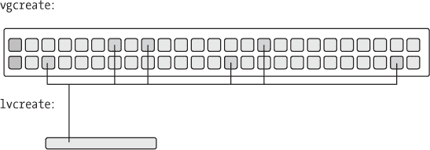

# 第四章。使用 XEN 的存储


在这本书中，到目前为止，我们主要将 Xen 视为一个整体，一个完整的虚拟化**解决方案**，用市场营销的话来说。实际上，情况要复杂得多。Xen 本身只是旨在让用户摆脱与真实硬件打交道的一个平台的一部分。Xen 虚拟机管理程序虚拟化了一个处理器（以及第二章中概述的几个其他基本组件），但它依赖于几种底层技术来提供计算机所需的资源无缝抽象。这种区别在存储领域最为明显，在那里 Xen 必须与虚拟化存储层紧密合作，以提供我们期望的虚拟机的功能。

这意味着 Xen 结合适当的存储机制，几乎提供了完全的硬件独立性。用户可以在任何地方运行 Xen 机器，几乎可以随意移动实例，自由添加存储，干净地保存文件系统状态，并在完成后轻松删除。

听起来不错？让我们开始吧。

# 存储：基础知识

在我们深入 dom0 侧的配置之前，首先要知道的是如何将存储的存在通知给域。DomUs 通过检查 domU 配置文件中的`disk=`行来找到它们的存储。通常它看起来像这样：

```
disk = [
      'phy:/dev/cleopatra/menas,sda,w',
      'phy:/dev/cleopatra/menas_swap,sdb,w'
]
```

这一行定义了两个设备，它们在 domU 中表现为`sda`和`sdb`。两者都是物理的，如`phy:`前缀所示——其他存储后端有自己的前缀，例如`file:`和`tap:`用于文件支持的设备。您可以按需混合和匹配后端设备类型——我们曾经提供了一对`phy:`卷和一个文件支持的只读“救援”镜像。

我们称之为一行，但实际上它更像是一节——如果您认为这样更易读，可以将字符串放在单独的行上，用制表符缩进，并在逗号后留空格。在这种情况下，我们使用 LVM，有一个名为*cleopatra*的卷组，以及两个名为*menas*和*menas_swap*的逻辑卷。

### 注意

*按照惯例，我们倾向于使用与域、其设备和其配置文件相同的名称。因此，在这里，逻辑卷* menas *和* menas_swap *属于域* menas，*它具有配置文件* /etc/xen/menas *和具有类似名称的网络接口。这有助于保持一切井井有条*。

您可以使用`xm block-list`命令来检查连接到域的存储——例如：

```
# xm block-list menas
Vdev  BE handle state evt-ch ring-ref BE-path
2049   0     0     4      6      8     /local/domain/0/backend/vbd/1/2049
2050   0     0     4      7      9     /local/domain/0/backend/vbd/1/2050
```

现在，拥有了这些知识，我们可以继续在 dom0 中创建后备存储。

* * *

^([26]) 如您所料，*物理* 设备是通过块设备语义访问的设备，而不是必然是一块独立的硬件。前缀指示 Xen 将设备视为基本块设备，而不是为基于文件的镜像提供额外的转换。

# 存储类型的不同

在开源的世界里，Xen 支持许多不同的存储选项，每个选项都有其自身的优点、缺点和设计理念。这些选项大致可以分为 *基于文件* 和 *基于设备* 的类别。

Xen 可以使用 *文件* 作为块设备。这有一个优点，就是简单、易于移动、易于从主机操作系统上挂载，并且易于管理。它曾经非常慢，但随着 blktap 驱动程序的出现，这个问题已经基本消失。基于文件的块设备在 Xen 访问它们的方式（基本循环回环与 blktap）和内部格式（AIO、QCOW 等）上有所不同。

Xen 也可以对 *物理* 设备进行 I/O 操作。这显然有一个缺点，就是很难扩展到超出你能够添加物理设备到机器的能力。然而，物理设备可以是内核有驱动程序的任何东西，包括硬件 RAID、光纤通道、MD、网络块设备或 LVM。因为 Xen 通过设备驱动程序和 Xen 实例之间的 DMA（直接内存访问）访问这些设备，直接将 I/O 映射到客户操作系统的内存区域，所以 domU 可以以接近原生速度访问物理设备。

然而，无论什么情况，所有存储后端在 Xen 虚拟域内部看起来都一样。虚拟机管理程序将 Xen VBD（虚拟块设备）导出到 domU，然后将其以管理员定义的映射方式呈现给客户操作系统，通常是 `hdx` 或 `sdx` 形式的设备。虽然许多发行版现在使用 `xvdx` 作为 *xen 虚拟磁盘*。(`hd` 和 `sd` 设备通常也可以工作。)

我们推荐使用 blktap（一种特殊的文件后端）和 LVM 作为存储后端。这两个都工作良好，具有良好的可管理性，可以自由调整大小和移动，并支持一些我们现在期望的文件系统机制。blktap 设置简单，适合测试，而 LVM 可扩展性好，适合生产。

这一切并没有特别针对 Xen。实际上，LVM 在许多发行版（如 Red Hat）的根设备上默认使用（在 Xen 之外），因为抽象存储层带来的管理优势。blktap 简单来说就是 Xen 特定的机制，用于将文件用作块设备，就像传统的块循环驱动程序一样。它比循环机制更优越，因为它允许大幅提高性能和更灵活的文件系统格式，如 QCOW，但从管理员的角度来看，它并没有本质上的不同。

让我们开始吧。

# 基本设置：文件

对于不想处理 LVM 的麻烦和开销的人来说，Xen 通过 blktap 驱动和库支持快速高效的文件支持块设备。

blktap（由于“block”这个词被输入了数百次，所以“blk”是磨损的占位符）包括一个内核驱动和一个用户空间守护进程。内核驱动直接映射由后端文件包含的块，避免了通过循环回环挂载文件时涉及的大部分间接操作。它支持许多用于虚拟块设备的文件格式，包括通过 `dd` 命令从块设备获取的基本“raw”镜像格式。

你可以使用 `dd` 命令创建一个文件：

```
# dd if=/dev/zero of=/opt/xen/anthony.img bs=1M count=1024
```

### 注意

*你的 dd 版本可能需要稍微不同的语法——例如，它可能需要你指定字节的块大小*。

现在 `dd` 命令会持续一段时间，将零复制到文件中。最终它会完成：

```
1024+0 records in
1024+0 records out
1073741824 bytes (1.1 GB) copied, 15.1442 seconds, 70.9 MB/s
```

因此，有了文件系统镜像，你可以使用 tap 驱动程序将其附加，创建一个文件系统，并像通常一样使用 `mount` 命令挂载它。

```
# xm block-attach 0 tap:aio:/opt/xen/anthony.img /dev/xvda1 w 0
# mkfs /dev/xvda1
# mount /dev/xvda1 /mnt/
```

首先，我们使用 `xm(8)` 命令将块设备附加到域 0。在这种情况下，`xm` 命令后面跟着块附加子命令，带有参数 `<要附加设备的域 ID> <后端设备> <前端设备> <模式>` 以及可选的 `[后端域 ID]`。为了分解我们的示例，我们将使用 tap:aio 驱动将 *anthony.img* 以读写方式附加到域 0 中的 */dev/xvda1*，使用域 0 来调解访问（因为我们倾向于避免使用非 dom0 驱动程序域）。当文件作为 */dev/xvda1* 附加时，我们可以在它上面创建一个文件系统，就像任何块设备一样挂载它。

现在它已经挂载，你可以在里面放些东西。（有关详细信息，请参阅第三章)]

QCOW

到目前为止，我们一直在专门讨论“原始”文件格式——但这并非唯一的选择。一个可能的替代方案是 QEMU 项目使用的 QCOW 格式。它有很多值得推荐的地方——一个快速、健壮的格式，支持稀疏分配、加密、压缩和写时复制。我们喜欢它，但支持还不够成熟，所以我们不推荐它作为您的首选存储选项。

尽管如此，尝试一下可能很有趣。要开始使用 QCOW，拥有 QEMU 会很方便。（虽然 Xen 包含一些 QEMU 工具，但完整包包含更多功能。）从[`www.nongnu.org/qemu/download.html`](http://www.nongnu.org/qemu/download.html)下载它。像往常一样，我们推荐源安装，特别是因为 QEMU 团队放弃了标准包管理来提供二进制发行版。

通过标准过程安装 QEMU：

```
# tar zxvf <qemu source package>
# cd <qemu source directory>
# ./configure
# make
# su
# make install
```

QEMU 包括`qemu-img`实用程序，用于创建和操作 QEMU 支持的多种图像文件，包括 QCOW、vmdk、raw 和其他格式。

```
# qemu-img create -f qcow enobarbus.qcow 1024M
```

此命令创建一个大小为 1,024MB 的 QCOW 格式（`-f qcow`）的镜像。当然，您会想用您应用程序的适当值替换文件名和大小。

您还可以使用`img2qcow`实用程序将原始镜像转换为 QCOW 镜像，该实用程序包含在 Xen 发行版中：

```
# img2qcow enobarbus.qcow enobarbus.img
```

您可以直接使用 QCOW 镜像作为具有 tap 驱动器的域的根磁盘。配置客户域使用 QCOW 镜像作为其根文件系统。在*/etc/xen*下的域配置文件中添加一个类似于的`disk=`行：

```
disk = [ 'tap:qcow:/opt/xen/enobarbus/enobarbus.qcow,sda1,w' ]
```

您可以使用另一个磁盘扩展这一行，如下所示：

```
disk = [ 'tap:qcow:/opt/xen/enobarbus/enobarbus.qcow,sda1,w' ,
'tap:qcow:/opt/xen/enobarbus/enobarbus_disk2.qcow,sdb1,w']
```

### 基本设置：LVM

LVM 操作的高级单元是*卷组*或*VG*。每个组将*物理扩展*（可配置大小的磁盘区域）映射到*逻辑扩展*。物理扩展托管在 LVM 所说的*物理卷*或*PV*上。每个 VG 可以包含一个或多个这样的物理卷，而物理卷本身可以是内核支持的任何类型的块设备。合理地讲，逻辑扩展位于*逻辑卷*上，简称*LV*。这些是 LVM 实际向系统呈现为可用块设备的设备。

正如我们常说的那样，经验确实无可替代。这里有一个五分钟的图文教程，介绍如何设置逻辑卷（见图 4-1）。


图 4-1. 此图显示了一个包含两个 PV 的单个 VG。从这个 VG 中，我们划分出了三个逻辑卷，lv1、lv2 和 lv3。lv1 和 lv3 被 domUs 使用，其中一个将整个卷视为单个分区，另一个将 LV 划分为用于/和/var 的子分区。

从一些硬盘开始。在这个例子中，我们将使用两个 SATA 硬盘。

### 注意

*鉴于 Xen 基本上是一种服务器技术，可能最明智的做法是使用 RAID 支持的冗余存储，而不是实际的硬盘驱动器。它们也可以是硬盘上的分区、网络块设备、UFS 格式的光盘媒体……无论您想提及的任何类型的块设备。不过，我们将使用两个硬盘上的分区来提供指令。如果您只使用一个硬盘，这些指令同样适用*。

### 警告

*请注意，我们将重新分区和格式化这些驱动器，这将破坏它们上的所有数据*。

首先，我们分区驱动器并将类型设置为 *Linux LVM*。尽管这不是严格必要的——如果您愿意，可以使用整个驱动器作为 PV——但通常被认为是良好的 Unix 卫生习惯。此外，如果您只想将磁盘的一部分用于 LVM，您将需要分区，这是一个相当常见的场景。（例如，如果您想从您用于 LVM 的物理磁盘之一启动，您将需要一个单独的 */boot* 分区。）

因此，在这个例子中，我们有两个磁盘，sda 和 sdb。我们希望每个驱动器的第一个 4GB 被用作 LVM 物理卷，所以我们将使用 `fdisk` 对它们进行分区，并将类型设置为 8e（Linux LVM）。

如果磁盘上的任何分区正在使用中，您将需要重新启动以使内核重新读取分区表。（顺便说一句，我们认为这是荒谬的。这不是应该属于未来吗？）

接下来，确保您有 LVM，并且它是 LVM2，因为 LVM1 已被弃用。28

```
# vgscan --version
LVM version:        2.02.23 (2007-03-08)
Library version:    1.02.18 (2007-02-13)
Driver version:     4.5.0
```

您可能需要加载驱动程序。如果 `vgscan` 抱怨驱动程序缺失，请运行：

```
# modprobe dm_mod
```

在这个例子中，`dm` 代表 *device mapper*，它是一个低级卷管理器，作为 LVM 的后端。

在确认这三个组件都正常工作后，根据 图 4-2 中的说明创建物理卷。

```
# pvcreate /dev/sda1
# pvcreate /dev/sdb1
```


图 4-2。此图显示了在它上面运行了 `pvcreate` 的单个块设备。它大部分是空的，除了前面有一个小的标识符。

通过运行 `vgcreate` 将这些组件组合成一个卷组。在这里，我们将在设备 sda1 和 sdb1 上创建一个名为 *cleopatra* 的卷组：

```
# vgcreate cleopatra /dev/sda1 /dev/sdb1
```

最后，使用 `lvcreate` 从卷组创建卷，如图 4-3 所示。图 4-3。将其视为一种更强大、更通用的分区形式。

```
# lvcreate -L <length> -m1 --corelog -n menas cleopatra
```

我们已经创建了一个镜像逻辑卷，其日志保存在核心（而不是在单独的物理设备上）。请注意，这一步需要一个组名而不是设备节点。此外，镜像纯粹是为了说明目的——如果你使用某种冗余设备，如硬件 RAID 或 MD，则不是必需的。最后，使用 `-n` 选项给 LVs 赋予人类可读的名称是一种管理上的便利。这不是必需的，但非常推荐。



图 4-3。lvcreate 通过从 LV 中切割一些空间来创建一个逻辑卷，/dev/vg/lvol，这些空间透明地映射到 PV 上的可能不连续的物理扩展。

使用您喜欢的文件系统创建工具创建一个文件系统：

```
# mkfs /dev/cleopatra/menas
```

到目前为止，LV 已经准备好挂载和访问，就像它是一个普通磁盘一样。

```
# mount /dev/cleopatra/menas /mnt/hd
```

为了使新设备成为 Xen 域的合适根目录，将文件系统复制到其中。我们使用了一个来自 [`stacklet.com/`](http://stacklet.com/) 的文件系统——我们只是挂载了他们的根文件系统并将其复制到我们新的卷中。

```
# mount -o loop gentoo.img /mnt/tmp/
# cp -a /mnt/tmp/* /mnt/hd
```

最后，为了与 Xen 一起使用，我们可以将逻辑卷指定给客户域，就像我们指定任何物理设备一样。（注意，在这里我们回到了本章开始时的同一个示例。）

```
disk = ['phy:/dev/cleopatra/menas,sda1,w']
```

到目前为止，开始启动机器。交叉手指，挥舞一只死鸡，进行习惯的仪式。在这种情况下，我们的神通过 `xm create` 来平息。在过去几千年中，标准已经降低。

```
# xm create menas
```

* * *

^([27]) 此示例并非纯粹学术。

^([28]) 除非您使用 Slackware，否则这不太可能成为问题。

# 扩大磁盘

文件系统图像和 LVM 磁盘都可以从 dom0 中透明地扩展。我们假设磁盘空间非常充足，您永远不会需要缩小图像。

在尝试调整其底层文件系统大小之前，请确保停止域。一方面，我们知道的所有的用户空间调整工具都不会尝试调整挂载的文件系统的大小。另一方面，Xen 虚拟机管理程序不会在没有重启域的情况下将更改传递给底层块设备的大小。最重要的是，即使您能够在域运行时调整后端存储，数据损坏几乎肯定会发生。

## 文件系统图像

增强文件系统图像背后的原理很简单：我们在文件中追加更多位，然后扩展文件系统。

首先，确保没有任何东西在使用该文件。停止任何挂载了该文件的 domUs。将其从 dom0 中分离。不这样做可能会导致文件系统损坏。

接下来，使用 `dd` 在末尾添加一些位。在这种情况下，我们将 1GB 从我们的 */dev/zero* 位管路中引导到 *anthony.img*。 （注意，如果不指定输出文件，`dd` 将写入 stdout。）

```
# dd if=/dev/zero bs=1M count=1024 >> /opt/xen/anthony.img
```

使用 `resize2fs` 来扩展文件系统（或您选择的文件系统的等效工具）。

```
# e2fsck -f /opt/xen/anthony.img
# resize2fs /opt/xen/anthony.img
```

如果没有分区表，`resize2fs` 将默认将文件系统的大小设置为底层设备的大小。

如果图像包含分区，您需要在调整文件系统大小之前重新排列这些分区。使用 `fdisk` 删除您希望调整大小的分区，并重新创建它，确保起始柱面保持不变。

## LVM

使用 LVM 扩展存储同样简单，或许甚至更简单。LVM 从一开始就是为了提高存储设备的灵活性而设计的，因此它包括一个简单的机制来扩展卷（以及缩小和移动）。

如果卷组中有空闲空间，只需简单地发出以下命令：

```
# lvextend -L +1G /dev/cleopatra/charmian
```

如果卷组已满，你需要扩展它。只需向机器添加一个磁盘并扩展 vg：

```
# vgextend /dev/cleopatra /dev/sdc1
```

最后，就像之前的例子一样，处理文件系统级别的扩展——我们将使用 ReiserFS 来展示这个过程。

```
# resize_reiserfs -s +1G /dev/cleopatra/charmian
```

# Copy-on-Write 和快照

真实存储选项为你提供的另一个优点是写时复制，这意味着当 domU 更改文件时，后端而不是覆盖文件，而是在其他地方透明地写入一个副本。29] 作为推论，原始文件系统仍然作为一个*快照*存在，所有修改都指向写时复制的克隆。

这个快照提供了保存文件系统状态的能力，在给定时间或设定间隔内对其进行快照。关于快照有两个有用的方面：一方面，它们允许从用户错误中轻松恢复。30] 另一方面，它们提供了一个已知是一致的检查点——你可以方便地将其备份并移动到其他地方。这消除了需要关闭服务器进行备份的需求，就像我们在黑暗时代所做的那样。

CoW 同样有很多用途。其中，对 Xen 最基本的影响是它可以显著减少每个虚拟机在磁盘上的开销——而不是使用一个简单的文件作为块设备或逻辑卷，许多机器可以共享一个单独的基文件系统镜像，只需在文件系统中写入它们的更改即可。

CoW 也有自己的缺点。首先，存在速度惩罚。与直接写入设备相比，CoW 基础设施会显著减慢磁盘访问速度，无论是读取还是写入。

如果你为 CoW 卷使用稀疏分配，由于分配和重新映射块的开销，速度惩罚会更大。这会导致碎片化，并带来自己的一套性能惩罚。CoW 也可能导致过度订阅的管理问题；通过使过度订阅磁盘空间成为可能，如果你不小心用完，这会使生活变得更加困难。你可以通过预先分配空间来避免所有这些问题。

就像大多数有趣的功能一样，在管理复杂性方面也存在权衡。最终，作为 Xen 管理员，你必须决定多少复杂性是值得拥有的。

我们将讨论 LVM 所使用的设备映射器快照，因为我们最熟悉这种实现。对于共享存储，我们将关注 NFS，并在第九章（第九章）中更详细地介绍共享存储系统。我们还在第七章（第七章）中概述了一个使用 UnionFS 的 CoW 解决方案。最后，你可能想尝试 QCOW 块设备——尽管我们在这方面没有太多运气，但你的体验可能会有所不同。

* * *

^([29]) 这通常被缩写为 CoW，部分原因是因为它更短，但主要是因为 "cow" 这个词本身就很幽默。问问维基百科就知道了。

^([30]) 删除你的家目录并不像你想象的那么困难。

# LVM 和快照

LVM 快照设计得更多的是为了 *备份* 和 *检查点* 文件系统，而不是作为长期存储的手段。保持 LVM 快照相对较新很重要——换句话说，确保在备份完成后删除它们。^([[31)]]

快照卷也可以用作域的读写后端存储，尤其是在你只想基于某个现有的磁盘镜像快速生成一个用于测试的 domU 的情况下。LVM 文档指出，你可以创建一个基本镜像，多次快照它，并对每个快照进行轻微修改以用于另一个域。在这种情况下，LVM 快照会像块级 UnionFS 一样工作。然而，请注意，当快照填满时，内核会立即丢弃它。这可能会导致数据丢失。添加 LVM 快照的基本步骤很简单：确保你的卷组中有一些未使用的空间，并为它创建一个快照卷。

Xen LiveCD 重新审视：COPY-ON-WRITE 实际操作

Xen LiveCD 实际上是一个相当不错的发布。它最酷的功能之一是能够在 Xen 域启动时自动创建基于 CD 上只读镜像的 copy-on-write 块设备。

实现使用设备映射器根据平面文件设置块设备和快照，并且出奇地简单。

首先，在域配置文件中，基本存储是通过这样一行定义的：

```
disk=['cow:/mnt/cdrom/rootfs.img 30,sda1,w']
```

注意使用 `cow:` 前缀，我们之前还没有提到过。这实际上是一个自定义前缀，而不是正常 Xen 软件包的一部分。

我们可以添加自定义前缀，如 cow:，因为 */etc/xen/scripts/create_block_device* 如果遇到未知设备类型（在这种情况下是 cow），会跳转到以 *block-[type]* 形式命名的脚本。*block-cow* 脚本期望一个参数，即 `create` 或 `destroy`，这是在调用脚本时域构建器提供的。*block-cow* 然后根据需要调用 *create_cow* 或 *destroy_cow* 脚本。

实际的设置发生在脚本中，`/usr/sbin/create_cow`。此脚本本质上使用设备映射器根据 LVM 快照创建一个基于写时复制的设备，^([32]) 并将其呈现给域。我们在此不重复它，但它是一个很好的例子，说明了标准 Linux 功能如何成为复杂、抽象功能的基础。换句话说，这是一个很好的技巧。

首先，检查您是否有`dm_snapshot`驱动程序。大多数现代发行版都将其作为可加载模块构建。如果未构建，请转到您的 Linux 内核源树并编译它。

```
# locate dm_snapshot.ko
```

如有必要，手动加载它。

```
# modprobe dm_snapshot
```

使用带有`-s`选项的`lvcreate`命令创建快照，以指示“快照”。其他参数指定长度和名称，就像普通逻辑卷一样。最后一个参数指定*源*，或被快照的卷。

```
# lvcreate -s -L 100M -n pompei.snap /dev/cleopatra/pompei
```

此快照看起来像是文件系统的冻结图像——原始卷上的写入将按正常进行，但快照将保留在快照创建时更改的文件，直到达到快照的最大容量。

在创建快照时，长度表示快照能够存储的最大更改数据量。如果快照满了，内核驱动程序会自动将其丢弃，使其变得不可用。

有关使用 LVM 快照备份 Xen 实例的示例脚本，请参阅第七章。

* * *

^([31]) 即使您没有向快照本身添加任何数据，它也可能因为跟上主 LV 的变化而耗尽空间（并损坏自身）。

^([32]) 更确切地说，是一个设备映射器快照，LVM 快照就是基于这个的。LVM 快照是设备映射器快照，但设备映射器快照可以基于任何一对块设备，无论是 LVM 还是其他设备。LVM 工具提供了一个方便的前端，用于`dmsetup`使用的晦涩命令。

# 存储 和 迁移

这两种存储技术——平面文件和 LVM——非常适合于简单和自动化的*冷迁移*，在这种迁移中，管理员会停止域，将域的配置文件和备份存储复制到另一台物理机器上，然后重新启动域。

在基于文件的后端上复制就像在网络中复制任何文件一样简单。只需将其放入文件系统中的相应位置，然后启动机器。

复制 LVM 稍微复杂一些，但仍然简单明了：创建目标设备，挂载它，然后以您关心的任何方式移动文件。

查阅第九章以获取此类迁移的更多详细信息。

## 网络存储

这两种存储方法仅适用于本地可访问的存储。实时迁移，即在不停机的情况下将域从一个机器移动到另一个机器，需要这个谜题的另一部分：文件系统必须通过网络对多台机器可访问。这是一个活跃的开发领域，有几种竞争性解决方案。在这里，我们将讨论基于 NFS 的存储。我们将在第九章中讨论其他解决方案，包括以太网上的 ATA 和 iSCSI。

### NFS

NFS 比我们还要古老，它被各种规模的组织所使用。它易于设置，相对容易管理。大多数操作系统都可以与之交互。因此，它可能是设置具有实时迁移功能的 Xen 域最简单、最便宜、最快的方式。

策略是利用 Xen 的网络隐喻：域（在默认设置中）连接到一个虚拟网络交换机。因为 dom0 也连接到这个交换机，所以它可以作为 domUs 的 NFS 服务器。

在这种情况下，我们导出的是一个目录树——既不是物理设备也不是文件。NFS 服务器设置相当简单，并且它是跨平台的，因此您可以使用您喜欢的任何 NFS 设备。（我们更喜欢基于 FreeBSD 的 NFS 服务器，但 NetApp 和其他几家公司也生产出色的 NFS 设备。正如我们可能提到的，我们使用 Linux 作为 NFS 服务器时运气不佳。）只需导出您的操作系统镜像。在我们的示例中，在 192.0.2.7 的 FreeBSD NFS 服务器上，我们有一个完整的 Slackware 镜像在`*/usr/xen/images/slack*`。我们的`*/etc/exports*`看起来有点像这样：

```
/usr/xen/images/slack   -maproot=0 192.0.2.222
```

我们将服务器端的进一步设置留给您无疑丰富的 NFS 经验。一个简单的改进是使`/`为只读和共享，然后导出只读的 VM 特定`*/var*`和`*/home*`分区——但在最简单的情况下，只需导出一个完整镜像。

### 注意

*尽管 NFS 确实会带来性能损失，但重要的是要记住，Xen 的网络缓冲区和磁盘缓冲区由相同的半虚拟化设备基础设施提供，因此实际的网络硬件并未参与。在穿越网络堆栈时会有增加的开销，但性能通常比千兆以太网要好，所以并没有您想象的那么糟糕*。

现在配置客户端（`CONFIG_IP_PNP=y`）。首先，您需要对 domU 的内核进行一些修改，以启用 NFS 上的 root 访问：

```
networking->
networking options->
ip: kernel level autoconfiguration
```

如果您想通过 DHCP 完成所有操作（尽管您可能仍然需要在您的域配置文件中指定 MAC 地址），在该树中添加 DHCP 支持：`CONFIG_IP_PNP_DHCP`：或者如果您是老派用户，可以使用`CONFIG_IP_PNP_BOOTP`。如果您可以在 domU 配置文件中指定 IP，则可以跳过该步骤。

现在您需要启用 NFS 对 root 的支持。确保 NFS 支持设置为 Y 而不是 M；即，`CONFIG_NFS_FS=Y`。接下来，启用通过 NFS 的 root 访问：`CONFIG_ROOT_NFS=Y`。在*menuconfig*中，您可以在以下位置找到该选项：

```
File systems ->
  Network File Systems ->
    NFS file system support ->
      Root over NFS
```

注意，*menuconfig* 不会给你选择通过 NFS 选择根目录的选项，直到你选择了内核级别的 IP 自动配置。

按正常方式构建内核并将其安装到 Xen 可以加载的地方。很可能是你不想为 dom0 内核这样做，所以请确保不要覆盖启动内核。

现在配置你将要通过 NFS 启动的域。编辑域的配置文件：

```
# Root device for nfs.
root = "/dev/nfs"

# The nfs server.
nfs_server = '38.99.2.7'

# Root directory on the nfs server.
nfs_root   = '/usr/xen/images/slack'

netmask="255.255.255.0"
gateway="38.99.2.1"
ip="38.99.2.222"
```

注意，我们只是在域配置中添加了额外的 Linux 内核配置——Xen 未使用的值将被传递到内核命令行。你还可以明确地将此配置放在“extra”参数中。如果你想通过 DHCP 设置 IP 地址，可以将上面的最后三行替换为：

```
dhcp="dhcp"
```

然后，你可以像往常一样使用 DHCP 来指定 NFS 服务器和 NFS 根。启动域并完成。因为存储对网络上的任何机器都是可访问的，所以 Xen 的实时迁移应该也能正常工作。

# 结束建议

这可能看起来像是一个令人困惑的，甚至过度的存储选项多样性，但所有这些都有其位置——无论是在托管环境中，还是在桌面上，还是在用于效用计算的存储池中。我们在本章中提出的建议是一个起点，但最终我们能给出的最好建议是尝试所有这些，看看哪种最适合。在管理便捷性和可扩展性之间找到合适的平衡。

最后，你可以结合和扩展这些选项中的许多。例如，Xen LiveCD 使用带有 LVM 快照的平面镜像。根据你的应用，最佳解决方案可能是简单的文件系统镜像或软件 RAID 和 LVM 的组合。继续实验，看看哪种最适合。这些都是 Xen 基于标准的架构灵活性的例子，该架构依赖于用户可扩展的脚本来定义易于理解的语义来使用可用存储。在第五章中，我们将探讨这些相同的原则如何应用于 Xen 的网络设置。
