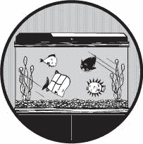
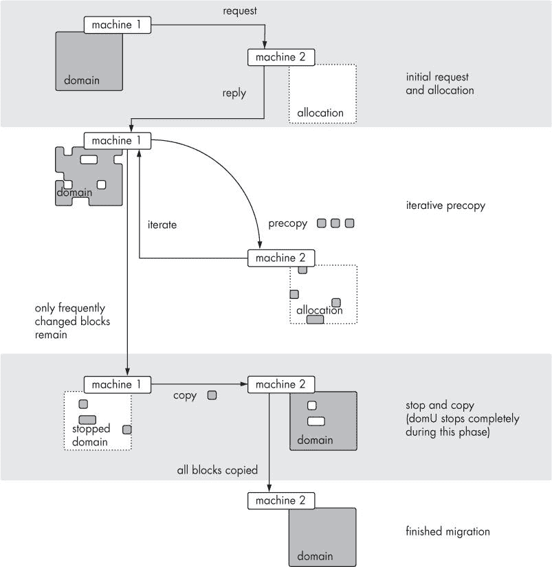

# 第九章。XEN 迁移

*在这些情况下，虚拟化和迁移的结合显著提高了可管理性*。

— 克拉克等人，**《虚拟机的实时迁移》**

因此，让我们回顾一下：用诗意的话说，Xen 是一种抽象，建立在其他抽象之上，围绕更进一步的抽象。所有这些抽象的目标是确保你，在你的舒适和安全 domU 中，甚至不必考虑那些实际上发送电脉冲到网络端口的混乱、嘈杂、易出错硬件。

当然，偶尔硬件会因自身原因无法运行 Xen。可能是因为过载，或者可能需要一些预防性维护。只要你有提前警告，即使这种需求也不必打断你的虚拟机。Xen 提供的这种*完全硬件独立性*的好处之一是将整个虚拟机实例移动到另一台机器上并透明地恢复操作——这个过程被称为*迁移*。

Xen 迁移将整个虚拟机——内核的内存状态、所有进程以及所有应用程序状态——转移到另一个位置。从用户的角度来看，实时迁移甚至不明显——最多只是丢失了几個数据包。这有可能使计划中的停机时间成为过去式。（非计划停机时间，就像死亡和税收一样，似乎是无法避免的。^([51]))

迁移可以是*实时*或*冷迁移*，^([52]) 区别在于实例在迁移时是否正在运行。在实时迁移中，域在传输过程中继续运行，停机时间保持在最低。在冷迁移中，虚拟机被暂停、保存，并发送到另一台物理机器。

在这两种情况下，保存的机器都期望其 IP 地址和 ARP 缓存在新子网上正常工作。考虑到网络堆栈的内存状态保持不变，这并不令人惊讶。尝试在不同层 2 子网之间启动实时迁移将直接失败。在不同子网之间进行冷迁移将工作，因为虚拟机将成功传输，但很可能需要重新配置其网络。我们将在讨论实时迁移时再次提及这些特性。

首先，让我们检查一种将域从一个主机移动到另一个主机的简单、手动方法。

# 迁移适用于穴居人

将 Xen 实例从一台物理机迁移到另一台物理机最基本、最不优雅的方法是完全停止它，移动其备份存储，并在远程主机上重新创建域。这需要虚拟机完全关闭和重启周期。这甚至不是正式 Xen 意义上的“迁移”，但如果你需要更换底层块设备或某些特定于机器的属性发生变化，例如，在将虚拟机在不同 CPU 架构之间迁移或在使用 PAE 的机器和不使用 PAE 的机器之间迁移时，你可能需要这样做.^([53])

首先，正常关闭虚拟机，无论是从操作系统内部还是通过在 dom0 上执行`xm shutdown`。复制其备份存储、内核镜像（如果需要）和配置文件，最后在新的主机上按常规使用`xm create`创建该机器。

这方法很简单，但至少它几乎肯定能行，而且不需要任何复杂的基础设施。我们主要提到它是为了完整性；这是一种将 Xen 域从一台物理机迁移到另一台物理机的方法。

* * *

^([51]) 可能不是；请参阅[`www.osrg.net/kemari/`](http://www.osrg.net/kemari/)和[`dsg.cs.ubc.ca/remus/`](http://dsg.cs.ubc.ca/remus/)上的 Project Kemari 或 Project Remus，了解正在进行的为 Xen 添加硬件冗余的工作。

^([52]) 我们还喜欢使用*hot*和*dead*这两个术语，它们是更常用术语的较少使用的对应词。

^([53]) 例如，从 NetBurst（奔腾 4 及其同类）到 Core（Core 2 等）。Xen 无法将虚拟机从 x86 迁移到 PPC。

# 使用 xm save 和 xm restore 进行迁移

除了这种“牛仔”方法之外，所有形式的迁移都是基于在某一台机器上保存域并在另一台机器上恢复域的基本思想。你可以使用`xm save`和`xm restore`命令手动完成此操作，模拟自动过程。

Xen 文档将`xm save`和`restore`周期比作物理机的休眠。当机器休眠时，它会进入节能模式，将内存镜像保存到磁盘，并物理关闭机器。当机器再次开启时，操作系统从磁盘加载保存的内存镜像，并从上次停止的地方继续。`xm save`的行为完全相同。就像物理休眠一样，保存的域断开网络连接，暂停和恢复需要一些时间，直到恢复之前不消耗 CPU 或内存。

即使你并没有计划进行任何涉及迁移的复杂操作，你也可能会在物理 Xen 服务器重启时保存机器。Xen 包括一个初始化脚本，在系统关闭时自动保存域，并在启动时恢复它们。为了适应这一点，我们建议确保*/var*足够大，可以容纳服务器内存的完整内容（包括日志、DNS 数据库等）。

要保存机器，请执行以下命令：

```
# xm save <domain name or id> <savefile>
```

此命令指示域暂停自身；域将其资源释放回 domain 0，断开其中断处理程序，并将其实际内存映射转换回域虚拟映射（因为当域恢复时，实际内存映射几乎肯定会发生变化）。

### 注意

**那些始终关注实现细节的人会注意到，这意味着 domU 操作系统对 Xen 的支持。HVM 保存和恢复——也就是说，当无法保证客户机是 Xen 感知的——执行方式略有不同。有关详细信息，请参阅第十二章**。

在这一点上，domain 0 接管，停止 domU，并将域状态检查点到一个文件中。在这个过程中，它确保所有内存页面引用都是规范的（也就是说，域虚拟的，因为当域恢复时，对机器内存页面的引用几乎肯定是不有效的）。然后它将页面内容写入磁盘，在写入过程中回收页面。

在此过程完成后，该域已停止运行。其内存的全部内容都保存在一个大小大约等于其内存分配的 savefile 中，您可以随时恢复。在此期间，您可以运行其他域，重启物理机器，备份域的虚拟磁盘，或执行任何其他需要您将域离线的操作。

### 注意

**尽管** **`xm save`** **通常在保存时停止域，但您也可以使用** **`-c`** **选项调用它，用于检查点。这告诉** **`xm`** **保持域运行。尽管如此，设置起来有些复杂，因为您还需要一种方法在保存期间快照域的存储。这通常涉及到一个外部设备迁移脚本**。

当完成这些操作后，恢复域变得简单：

```
# xm restore <savefile>
```

恢复操作与保存相反；虚拟机管理程序为域分配内存，将保存文件中的页面写入到新分配的内存中，并将影子页面表条目转换为指向新物理地址。当完成这些操作后，域恢复执行，重新设置它在暂停时移除的所有内容，并开始像什么都没发生一样运行。

### 注意

**保存文件保持完整；如果重启的机器出现错误，您可以恢复保存文件并再次尝试**。

在本地机器上保存和恢复的能力是 Xen 支持的更复杂迁移形式的基础。

# 冷迁移

在我们深入了解 Xen 的自动迁移之前，我们将概述一个手动**冷迁移**过程，以了解涉及到的步骤，并近似模拟实时迁移的流程。

在这种情况下，迁移开始于保存域。管理员手动移动保存文件和域的底层存储到新机器上，并恢复域状态。由于底层块设备是手动移动的，因此不需要两台机器都可以访问相同的文件系统，就像实时迁移那样。唯一重要的是传输 Xen 虚拟磁盘的内容。

这里有一些将 Xen 域进行冷迁移的步骤：

```
# xm save <domain id> <savefile>
# scp <savefile> <target.domain.tld:/path/>
```

执行适当的步骤将域的存储复制到目标计算机——`rsync, scp, dd` 通过 `ssh` 管道传输，无论您选择哪种方法。无论您选择哪种方法，确保它以位对位相同的方式复制磁盘，并且在两台物理机器上有相同的路径。特别是，不要在机器 A 上挂载 domU 文件系统，并将文件复制到机器 B 上的新 domU 文件系统。这将导致虚拟机在恢复时崩溃。

最后，在新机器上重启域：

```
# xm restore <savefile>
```

没有必要将域名配置文件复制到新机器上；保存文件包含了启动机器所需的所有配置信息。相反，这也意味着您在保存和恢复之间无法更改机器的参数，并期望有任何效果。^([54)]

* * *

^(54)) 为了避免不可避免的问题，我们确实尝试使用十六进制编辑器在保存文件上操作。结果是立即崩溃。

# 实时迁移

冷迁移有其位置，但 Xen 最干净利落的功能之一是能够将域从一个物理机透明地移动到另一个物理机，即对外部世界来说不可察觉。这个特性就是**实时迁移**。

与冷迁移一样，实时迁移将域的配置作为其状态的一部分进行传输；它不需要管理员手动复制配置文件。实际上，根本不需要手动复制。当然，如果您想在新的机器上从头开始重新创建域，您仍然需要配置文件。

实时迁移有一些额外的先决条件。它依赖于域的存储可以从两台机器访问，并且机器位于同一子网中。最后，因为复制阶段是自动通过网络进行的，所以机器必须运行网络服务。

## 它是如何工作的

我们真的很想说是通过魔法来实现实时迁移的。然而，实际上，它是通过应用足够先进的技术来实现的。

实时迁移只是在最一般的意义上基于“保存和恢复”的基本思想。机器直到迁移的最后阶段才休眠，并且几乎立即从虚拟休眠中恢复过来。

如 图 9-1 所示，Xen 实时迁移首先向目标发送一个请求，或称为 *预留*，指定迁移域所需的资源。如果目标接受请求，源开始迁移的 *迭代预复制* 阶段。在此步骤中，Xen 通过 TCP 连接将内存页复制到目标主机。在这个过程中，更改的页面被标记为脏，然后重新复制。机器迭代这个过程，直到只剩下非常频繁更改的页面，此时它开始 *停止和复制* 阶段。现在 Xen 停止虚拟机，并复制那些在先前阶段更改过于频繁的页面，以有效地复制。实际上，我们的测试表明 Xen 通常在四到八次迭代后达到这一点。最后，虚拟机在新机器上开始执行。

默认情况下，Xen 将迭代最多 29 次，如果脏页数低于某个阈值，则停止。您可以在编译时指定此阈值和迭代次数，但默认值应该可以正常工作。



图 9-1. 实时迁移概述

## 使 Xen 迁移工作

首先，请注意，除非域名正在使用某种类型的网络可访问存储，否则迁移将不会工作，这一点在本章后面有描述。如果您没有这样的东西，请先设置好，完成后回来。

其次，`xend` 必须设置成在物理机器上监听迁移请求。请注意，两台机器都需要监听；如果只有目标机器运行了重定位服务器，源机器将无法在正确的时间关闭其 Xen 实例，并且重启的域将像没有干净关闭一样重新启动。

通过在 */etc/xend-config.sxp* 中取消以下注释来启用迁移服务器：

```
(xend-relocation-server yes)
```

这将导致 `xend` 在端口 8002 上监听迁移请求，这可以通过 `(xend-relocation-port)` 指令进行更改。请注意，这有一定的安全风险。您可以通过添加以下类似行在一定程度上减轻这种风险：

```
(xend-relocation-address 192.168.1.1)
(xend-relocation-hosts-allow '^localhost$' '^host.example.org$')
```

`xend-relocation-address` 行将 `xend` 限制在指定地址上监听迁移请求，这样您可以将迁移限制为例如内部子网或 VPN。第二行指定了一个允许迁移的主机列表，作为空格分隔的引号正则表达式列表。虽然从 `localhost` 迁移的想法看起来有些奇怪，但它确实在测试中具有一定的价值。Xen 到 *其他* 主机的迁移在没有 `localhost` 在允许的主机列表中时也能正常工作，所以如果您想的话，可以随意删除它。

在包含防火墙的分发版上，您必须打开端口 8002（或您使用 `xend-relocation-port` 指令指定的另一个端口）。如有必要，请参阅您分发版的文档。

在实时迁移过程中，Xen 可以在迁移的同时保持网络连接，这样客户端就不需要重新连接。迁移后的域名会发送一个未经请求的 ARP（地址请求协议）回复来宣传其新位置。（通常这会成功。在某些网络配置中，这取决于您的交换机配置，可能会非常失败。请先测试。）迁移实例只有在迁移到同一物理子网上的机器时才能保持其网络连接，因为它的 IP 地址保持不变。

命令很简单：

```
# xm migrate --live <domain id> <destination machine>
```

当虚拟机将自己复制到远程主机时，`xm list`中的域名会变为`migrating-[domain]`。此时，它也会出现在目标机器的`xm list`输出中。在我们的配置中，这个复制和运行阶段每 10MB domU 内存大约需要 1 秒钟，然后大约有 6 秒钟的服务中断。

### 注意

*如果您出于任何原因希望迁移的总时间更短（以增加停机时间为代价），您可以通过简单地删除* *`--live`* *选项来消除重复的增量复制*。

```
# xm migrate <domain id> <destination machine>
```

*这会自动停止域名，将其保存为正常状态，发送到目标机器，并恢复。就像* *`--live`* *一样，最终产品是一个迁移后的域名*。

在迁移过程中，以下是目标机器上的域名列表。请注意，随着迁移域名传输更多数据，内存使用量会增加：

```
Name                                      ID Mem(MiB) VCPUs State   Time(s)
Domain-0                                   0     1024     8 r-----    169.2
orlando                                    3      307     0 -bp---      0.0
```

大约 30 秒后，域名迁移了数百 MB：

```
Name                                      ID Mem(MiB) VCPUs State   Time(s)
Domain-0                                   0     1024     8 r-----    184.8
orlando                                    3      615     0 -bp---      0.0
```

再过 30 秒，域名已经完全迁移并运行：

```
Name                                      ID Mem(MiB) VCPUs State   Time(s)
Domain-0                                   0     1024     8 r-----    216.0
orlando                                    3     1023     1 -b----      0.0
```

我们在迁移过程中也对域名进行了 ping 测试。请注意，当域名移动数据时，响应时间会显著增加：

```
PING  (69.12.128.195) 56(84) bytes of data.
64 bytes from 69.12.128.195: icmp_seq=1 ttl=56 time=15.8 ms
64 bytes from 69.12.128.195: icmp_seq=2 ttl=56 time=13.8 ms
64 bytes from 69.12.128.195: icmp_seq=3 ttl=56 time=53.0 ms
64 bytes from 69.12.128.195: icmp_seq=4 ttl=56 time=179 ms
64 bytes from 69.12.128.195: icmp_seq=5 ttl=56 time=155 ms
64 bytes from 69.12.128.195: icmp_seq=6 ttl=56 time=247 ms
64 bytes from 69.12.128.195: icmp_seq=7 ttl=56 time=239 ms
```

在大部分域名内存迁移完成后，域名停止，复制最后几页，然后在目标主机上重新启动，这时会出现短暂的故障：

```
64 bytes from 69.12.128.195: icmp_seq=107 ttl=56 time=14.2 ms
64 bytes from 69.12.128.195: icmp_seq=108 ttl=56 time=13.0 ms
64 bytes from 69.12.128.195: icmp_seq=109 ttl=56 time=98.0 ms
64 bytes from 69.12.128.195: icmp_seq=110 ttl=56 time=15.4 ms
64 bytes from 69.12.128.195: icmp_seq=111 ttl=56 time=14.2 ms
--- 69.12.128.195 ping statistics ---
111 packets transmitted, 110 received, 0% packet loss, time 110197ms
rtt min/avg/max/mdev = 13.081/226.999/382.360/101.826 ms
```

到这一点，域名已经完全迁移。

然而，迁移工具并不能保证迁移后的域名实际上能在目标机器上运行。当从较新的 CPU 迁移到较旧的 CPU 时，会出现一个常见问题。因为指令在启动时被启用，迁移后的内核尝试执行那些根本不存在的指令是完全可能的。

例如，`sfence`指令用于显式序列化乱序内存写入；在`sfence`之前发出的任何写入必须在围栏之后的写入之前完成。这个指令是 SSE 的一部分，因此它并不支持所有支持 Xen 的机器。在一个支持`sfence`的机器上启动的域名在迁移后会尝试继续使用它，并且很快就会崩溃。这可能在 Xen 的后续版本中有所改变，但到目前为止，我们所知的所有生产 Xen 环境都只在同构硬件之间迁移。

# 迁移存储

实时迁移只复制 RAM 和处理器状态；确保迁移的域可以访问其磁盘取决于管理员。因此，存储问题归结为一个能力问题。迁移的域将期望其磁盘在新的机器上与旧的机器上完全一致，并且设备名称相同。在大多数情况下，这意味着 domU 要能够进行迁移，必须通过网络拉取其支持存储。在 Xen 世界中，有两种流行的方法可以实现这一点：通过以太网的 ATA（AoE）和 iSCSI。我们还在第四章中讨论了 NFS。最后，您也可以向 NetApp 投掷一箱钱。

除了这些选项之外，您还可以考虑使用 cLVM（带有某种类型的网络存储封装）和 DRBD。

在所有这些存储方法中，我们将讨论一种使用存储服务器将块设备导出到 dom0 的方法，然后 dom0 将存储提供给 domU。

注意，iSCSI 和 AoE 都限制自己只提供简单的块设备。它们都不允许多个客户端在没有文件系统级别支持的情况下共享同一个文件系统！这是一个重要的观点。尝试导出单个 ext3 文件系统并在该文件系统上运行 domUs，几乎会立即导致损坏。相反，配置您的网络存储技术为每个 domU 导出一个块设备。然而，导出的设备不必与物理设备相对应；我们同样可以导出文件或 LVM 卷。

## 通过以太网的 ATA

通过以太网的 ATA 设置起来很简单，速度合理，并且很受欢迎。它不可路由，但在实时迁移的上下文中这并不重要，因为实时迁移总是在一个 2 层广播域内发生。

人们使用 AoE 来填补与基本 SAN 设置相同的空白：通过网络使集中式存储可用。它导出可以像本地连接的磁盘一样使用的块设备。为了本例的目的，我们将通过 AoE 为每个 domU 导出一个块设备。

让我们先设置 AoE 服务器。这是将磁盘设备导出到 dom0s 的机器，这些 dom0s 反过来托管依赖于这些设备的 domUs。您首先需要做的是确保您有内核 AoE 驱动程序，该驱动程序位于内核配置中：

```
Device drivers --->
  Block Devices --->
    <*> ATA over Ethernet support
```

您也可以将其作为一个模块（*m*）。如果您选择这条路，请加载该模块：

```
# modprobe aoe
```

无论哪种方式，请确保您可以访问 */dev/etherd* 下的设备节点。它们应由 udev 创建。如果不是这样，请尝试安装内核源代码并运行内核源代码树中提供的 *Documentation/aoe/udev-install.sh* 脚本。此脚本将生成规则并将它们放置在适当的位置——在我们的案例中是 */etc/udev/rules.d/50-udev.rules*。您可能需要根据您的 udev 版本调整这些规则。我们在 CentOS 5.3 上使用的配置是：

```
SUBSYSTEM=="aoe", KERNEL=="discover",   NAME="etherd/%k", GROUP="disk", MODE="0220"
SUBSYSTEM=="aoe", KERNEL=="err",        NAME="etherd/%k", GROUP="disk", MODE="0440"
SUBSYSTEM=="aoe", KERNEL=="interfaces", NAME="etherd/%k", GROUP="disk", MODE="0220"
SUBSYSTEM=="aoe", KERNEL=="revalidate", NAME="etherd/%k", GROUP="disk", MODE="0220"

# aoe block devices
KERNEL=="etherd*",       NAME="%k", GROUP="disk"
```

AoE 还需要一些支持软件。服务器包名为 vblade，可以从[`aoetools.sourceforge.net/`](http://aoetools.sourceforge.net/)获取。您还需要在服务器和客户端机器上安装客户端工具 aoetools，所以请确保获取这些工具。

首先，在存储服务器上运行`aoe-interfaces`命令，告诉 vblade 要导出哪些接口：

```
# aoe-interfaces <ifname>
```

vblade 可以导出大多数存储形式，包括 SCSI、MD 或 LVM。尽管名为以太网上的 ATA，但它并不仅限于导出 ATA 设备；它可以导出任何可寻址的设备文件或任何普通文件系统镜像。只需在命令行上指定文件名即可。（这又是 UNIX 的“一切皆文件”哲学派上用场的一个例子。）

虽然 vblade 有一个配置文件，但通过命令行指定选项很简单。语法是：

```
# vblade <shelf id> <slot id> <interface> <file to export>
```

例如，要导出文件：

```
# dd if=/dev/zero of=/path/file.img bs=1024M count=1
# vblade 0 0 <ifname> </path/file.img> &
```

这将*/path/file.img*导出为*/dev/etherd/e0.0*。

### 注意

*无论什么原因，新的导出在服务器上不可见。AoE 维护者指出，这实际上不是一个错误，因为它从未是设计目标*。

AoE 可能期望设备有一个分区表，或者至少有一个有效的分区签名。如果需要，您可以通过创建跨越整个磁盘的分区来本地分区：

```
# losetup /dev/loop0 test.img
# fdisk /dev/loop0
```

完成这些后，创建一个文件系统并断开循环：

```
# mkfs /dev/loop0
# losetup -d /dev/loop0
```

或者，如果您想在设备上创建多个分区，使用`fdisk`对设备进行分区，并创建多个分区，就像通常一样。新的分区将以类似*/dev/etherd/e0.0p1*的名称出现在客户端。要从 AoE 服务器访问设备，在适当配置的循环设备上执行`kpartx -a`应该可以工作。

现在我们已经有一个功能性的服务器，让我们设置客户端。AoE 客户端的大部分功能都是作为内核的一部分实现的，所以您需要确保 dom0 内核中包含了 AoE，就像存储服务器一样。如果是模块，您可能希望确保它在启动时加载。如果您使用 CentOS，您可能还需要修复您的 udev 规则，就像服务器一样。

由于我们使用 dom0 来仲裁网络存储，因此不需要在 domU 内核中包含 AoE 驱动程序。所有 Xen 虚拟磁盘设备都通过 domU 的`xenblk`驱动程序访问，无论它们使用什么技术进行存储.^([55])

从您的发行版的包管理系统中下载 aoetools 或从[`aoetools.sourceforge.net/`](http://aoetools.sourceforge.net/)下载。如果需要，构建并安装该包。

一旦安装了 aoetools 包，您可以通过以下方式在客户端测试导出的 AoE 设备：

```
# aoe-discover
# aoe-stat
     e0.0         1.073GB   eth0 up
# mount /dev/etherd/e0.0 /mnt/aoe
```

在这种情况下，设备大小为 1GB（或类似大小），已作为 0 号架 0 号槽位导出，并在客户端的 eth0 上找到。如果它成功挂载，您就可以开始了。您可以卸载 */mnt/aoe* 并使用 */dev/etherd/e0.0* 作为普通 `phy:` 设备用于 domU 存储。适当的 domU 配置 `disk=` 行可能如下：

```
disk = [ phy:/dev/etherd/e0.0, xvda, w ]
```

如果您遇到任何问题，请检查 */var/log/xen/xend.log*。最常见的问题与机器无法找到设备——块设备或网络设备有关。在这种情况下，错误将显示在日志文件中。确保已正确配置了正确的虚拟磁盘和接口。

## iSCSI

AoE 和 iSCSI 在管理员的角度上有很多相似之处；它们都是通过网络导出存储而不需要特殊硬件的方法。它们都导出块设备，而不是文件系统，这意味着一次只能有一台机器访问一个导出的设备。iSCSI 与 AoE 的不同之处在于它是一个基于 TCP/IP 的可路由协议。这使得它在 CPU 和带宽方面效率较低，但更灵活，因为 iSCSI 导出可以穿越第 2 层网络。

iSCSI 将世界划分为 *目标* 和 *发起者*。您可能更熟悉它们作为 *服务器* 和 *客户端*。服务器作为 SCSI 命令的目标，这些命令由客户端机器发起。在大多数安装中，iSCSI 目标将是专用设备，但如果您需要在通用服务器上为测试设置 iSCSI 服务器，以下是方法。

### 设置 iSCSI 服务器

对于目标，我们推荐使用 *iSCSI 企业目标* 实现 ([`sourceforge.net/projects/iscsitarget/`](http://sourceforge.net/projects/iscsitarget/))。其他软件也存在，但我们对其不太熟悉。

您的发行版供应商很可能提供了一个软件包。在 Debian 上是 iscsitarget。Red Hat 和其他使用相关的 tgt 软件包，其配置略有不同。尽管我们不涵盖设置 tgt 的细节，但在 [`www.cyberciti.biz/tips/howto-setup-linux-iscsi-target-sanwith-tgt.html`](http://www.cyberciti.biz/tips/howto-setup-linux-iscsi-target-sanwith-tgt.html) 有一个信息丰富的页面。在本节的其余部分，我们假设您正在使用 iSCSI 企业目标。

如果需要，您可以手动下载和构建 iSCSI 目标软件。从网站上下载目标软件并将其保存到适当的位置（我们在这个例子中将它拖到了我们的 GNOME 桌面上）。解压它：

```
# tar xzvf Desktop/iscsitarget-0.4.16.tar.gz
# cd iscsitarget-0.4.16
```

很可能您可以通过常规的 `make` 进程构建所有组件——内核模块和用户空间工具。确保您已安装了 openSSL 头文件，可能是作为 openssl-devel 软件包或类似软件包的一部分：

```
# make
# make install
```

`make install` 也会将默认配置文件复制到 */etc* 目录中。我们的下一步是适当地编辑它们。

主要配置文件是 */etc/ietd.conf*。它有大量的注释，并且大多数值可以安全地保留在默认值（目前是这样）。我们主要关心的是目标部分：

```
Target iqn.2001-04.com.prgmr:domU.orlando
       Lun 0 Path=/opt/xen/orlando.img,Type=fileio
```

我们可以在这里调整许多其他变量，但基本的目标定义很简单：单词 **`Target`** 后跟一个符合规范的 *iSCSI 合法名称* 以及一个逻辑单元定义。注意 `Type=fileio`。在这个例子中，我们使用的是普通文件，但你很可能也想将此值用于整个磁盘导出和 LVM 卷。

初始化脚本 *etc/iscsi_target* 也应该被复制到适当的位置。如果你想在启动时启用 iSCSI，还需要创建相应的启动和终止链接。

现在我们可以导出我们的 iSCSI 设备：

```
# /etc/init.d/iscsi_target start
```

为了检查它是否工作：

```
# cat /proc/net/iet/volume
tid:1 name:iqn.2001-04.com.prgmr:domU.orlando
       lun:0 state:0 iotype:fileio iomode:wt path:/opt/xen/orlando
```

你应该能看到你定义的导出（s），以及一些状态信息。

### iSCSI 客户端设置

对于启动器，存在各种客户端。然而，似乎最好的支持包是 Open-iSCSI，可在 [`www.open-iscsi.org/`](http://www.open-iscsi.org/) 找到。Red Hat 和 Debian 都通过它们的包管理器提供版本，分别是 iscsi-initiator-utils 和 open-iscsi。你也可以从网站上下载包，并完成非常简单的安装过程。

当你安装了 iSCSI 启动器，无论你如何安装，下一步就是说出适当的咒语来指示机器在启动时挂载你的 iSCSI 设备。

iSCSI 守护进程 `iscsid` 使用数据库来指定其设备。你可以使用 `iscsiadm` 命令与该数据库交互。`iscsiadm` 还允许你执行目标发现和登录（这里我们使用了长选项形式以提高清晰度）：

```
# iscsiadm --mode discovery --type sendtargets --portal 192.168.1.123
192.168.1.123:3260,1 iqn.2001-04.com.prgmr:domU.orlando
```

注意，在 iSCSI 术语中，*portal* 指的是可以通过它访问资源的 IP 地址。在这种情况下，它是导出主机。`iscsiadm` 告诉我们有一个设备正在导出，*iqn.2001-04.com.prgmr:domU.odin*。现在我们知道了节点，我们可以更新 iSCSI 数据库：

```
# iscsiadm -m node -T iqn.2001-04.com.prgmr:domU.orlando
-p 192.168.1.123:3260 -o update -n node.conn[0].startup -v automatic
```

这里我们使用 `iscsiadm` 来更新 iSCSI 数据库中的一个节点。我们指定一个目标、一个 portal 以及我们想在数据库节点上执行的操作：`update`。我们使用 `-n` 选项指定一个要更新的节点，并使用 `-v` 选项指定一个新值。我们还可以通过 `-o` 选项执行其他操作，如 `new`、`delete` 和 `show`。有关更多详细信息，请参阅 Open-iSCSI 文档。

重新启动 `iscsid` 以传播你的更改。（此步骤可能因你的发行版而异。在 Debian 中脚本为 `open-iscsi`；在 Red Hat 中为 `iscsid`。）

```
# /etc/init.d/open-iscsi restart
```

注意 `dmesg` 中的新设备：

```
iscsi: registered transport (iser)
scsi3 : iSCSI Initiator over TCP/IP
Vendor: IET       Model: VIRTUAL-DISK      Rev: 0
Type:   Direct-Access                      ANSI SCSI revision: 04
SCSI device sda: 8192000 512-byte hdwr sectors (4194 MB)
sda: Write Protect is off
sda: Mode Sense: 77 00 00 08
SCSI device sda: drive cache: write through
SCSI device sda: 8192000 512-byte hdwr sectors (4194 MB)
```

注意，这是 dom0 上的第一个 SCSI 设备，因此成为 */dev/sda*。进一步的 iSCSI 导出变为 *sdb*，依此类推。当然，使用本地 SCSI 设备节点作为网络存储显然存在管理问题。我们建议通过使用 */dev/disk/by-path* 下的设备来减轻这个问题。在这里 */dev/sda* 变为 */dev/disk/by-path/ip-192.168.1.123:3260-iscsi-larry:domU.orlando*。当然，你的设备名称将取决于你设置的特定细节。

现在你已经配备了设备，你可以在其上安装一个 Xen 实例，很可能有一个类似于以下 `disk=` 行：

```
disk = [ 'phy:/dev/disk/by-path/ip-192.168.1.123:3260-iscsi-larry:domU.orlando ,xvda,rw' ]
```

由于域由共享 iSCSI 存储支持，因此你可以将域迁移到任何连接的 Xen dom0。

* * *

^([55]) 一个自然的扩展是让 domU 通过在 initrd 中包含驱动程序和支持软件直接挂载网络存储。在这种情况下，不需要本地磁盘配置。

# Quo Peregrinatur Grex

所以这就是迁移。在本章中，我们描述了：

+   如何手动将域名从一个主机移动到另一个主机

+   主机间域的冷迁移

+   同一子网内主机的实时迁移

+   实时迁移的共享存储

应用这些建议，你会发现你的可管理性显著提高！
