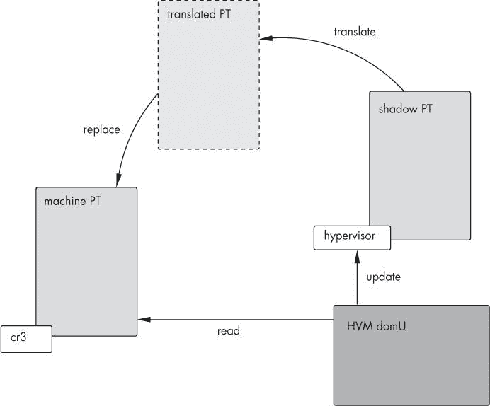

# 第十二章。HVM：超越 Para 虚拟化


在整本书中，我们描述了标准的 Xen 虚拟化技术，*Para 虚拟化*。Para 虚拟化是一件好事——正如我们之前概述的，它允许卓越的性能和强大的隔离，这两个目标很难同时实现。（有关更多关于这个主题的内容，请参阅第一章。）

然而，Para 虚拟化需要修改过的操作系统。尽管将操作系统移植到 Xen 相对容易，但按照这类工作的标准，这并不是一个简单的任务，并且它有一个明显的限制，那就是在封闭源代码的操作系统上无法实现。（虽然 Xen 团队在开发过程中将 Windows 移植到了 Xen 上，但没有任何*发布*版本的 Windows 可以在 Xen 上以 Para 虚拟化模式运行。）

一种解决方法是为处理器添加扩展，使其支持硬件虚拟化，从而允许未经修改的操作系统在“裸机”上运行，但仍然是在虚拟化环境中。英特尔和 AMD 都通过扩展 x86 架构实现了这一点。

英特尔使用*VT-x*这个术语来指代 x86 的虚拟化扩展。^([73)] (*VT-i*是安腾的硬件虚拟化。就我们的目的而言，它与 VT-x 基本相同。我们不会单独讨论 VT-i。^([74)]) AMD 同样有一套虚拟化扩展。^([75)] 你可能找到的大部分与 Xen 相关的文档都提到了这些扩展的内部代码名称*Pacifica*，但你也会看到 AMD 的市场术语*SVM*，代表*安全虚拟机*。

虽然 VT-x 和 Pacifica 的实现略有不同，但我们可以忽略低级实现细节，专注于功能。这两个都由 Xen 支持。这两个都允许你以 domU 的形式运行未经修改的操作系统。这两个在 I/O 上都会遭受重大的性能损失。尽管两者之间有差异，但这些差异被抽象层所隐藏。

正确地说，我们所说的这个抽象层就是 HVM（硬件虚拟机）——一种跨平台的方式，可以隐藏繁琐的实现细节给系统管理员。因此，在本章中，我们将重点关注 HVM 接口及其使用方法，而不是英特尔或 AMD 技术的具体细节。

# HVM 原理

如果你回顾一下我们在第一章中介绍的“同心环”安全模型，你可以将 HVM 扩展描述为在环 0 内部添加了一个*环-1*（即，具有比环 0 更高的权限）。新的处理器操作码，对虚拟机不可见，用于在超级特权模式和正常模式之间切换。未经修改的操作系统在环 0 中运行，并按常规操作，不知道它和硬件之间还有另一层。当它执行特权系统调用时，调用实际上会转到环-1 而不是实际硬件，此时虚拟机管理程序会拦截它，暂停虚拟机，执行调用，并在调用完成后恢复 domU。

Xen 还必须以不同的方式处理内存，以适应未经修改的虚拟机。因为这些未经修改的虚拟机不了解 Xen 的内存结构，虚拟机管理程序需要使用影子页面表，这些页面表呈现从地址 0 开始的连续物理内存的假象，而不是 Xen 感知操作系统支持的离散物理页面表。这些影子是硬件使用的页面表的内存副本，如图图 12-1 所示。尝试读取和写入页面表的尝试会被拦截并重定向到影子。在虚拟机运行期间，它直接读取其影子页面表，而硬件使用虚拟机管理程序提供的预先转换的版本。



图 12-1。所有虚拟机页面表写入都被虚拟机管理程序拦截并转到影子页面表。当执行上下文切换到虚拟机时，虚拟机管理程序将影子页面表中找到的伪物理地址转换为机器物理地址，并更新硬件以使用转换后的页面表，然后虚拟机直接访问这些页面表。

## HVM 设备访问

当然，如果你到目前为止一直很关注，你可能想知道 HVM 域如果没有修改为使用 Xen 虚拟块和网络设备，如何访问设备。这是一个很好的问题！

答案有两个：首先，在引导过程中，Xen 使用模拟的 BIOS 来提供标准 PC 设备的模拟，包括磁盘、网络和帧缓冲区。这个 BIOS 来自开源的 Bochs 模拟器[`bochs.sourceforge.net/`](http://bochs.sourceforge.net/)。其次，在系统引导后，当 domU 期望使用原生驱动程序访问 SCSI、IDE 或以太网设备时，这些设备使用 QEMU 模拟器中找到的代码进行模拟。一个用户空间程序`qemu-dm`处理原生和模拟设备访问模型之间的转换。

## HVM 设备性能

这种类型的转换，其中我们必须通过使用软件设备模拟退出虚拟化模式并重新进入虚拟化操作系统来调解硬件访问，是运行未经修改的操作系统所涉及到的权衡之一。^[[76]) 而不是简单地使用轻量级页面翻转系统查询宿主机的信息，HVM 域访问设备就像它们是物理硬件一样精确。这相当慢。

AMD 和 Intel 都进行了工作，旨在让虚拟机直接使用硬件，使用 IOMMU（I/O 内存管理单元）将域虚拟地址转换为真实的 PCI 地址空间，就像处理器的 MMU 处理虚拟内存的转换一样。^[[77]) 然而，这不太可能在不久的将来取代模拟设备。

## HVM 和 SMP

SMP（对称多处理）与 HVM 一起工作，就像与虚拟化域一样。每个虚拟处理器都有自己的控制结构，这反过来又可以被机器的任何物理处理器服务。在这种情况下，我们所说的*物理处理器*是指机器看到的逻辑处理器，包括由 SMT（同时多线程或超线程）提供的虚拟处理器。

要启用 SMP，请在配置文件中包含以下内容：

```
acpi=1
vcpus=<n>
```

（其中*n*是一个大于 1 的整数。单个 CPU 并不意味着 SMP。事实上，恰恰相反。）

### 注意

*尽管您可以指定比实际存在的 CPU 更多的 CPU，但性能将会…受到影响。我们强烈建议不要这样做*。

就像在虚拟化域中一样，SMP 通过为域中的每个虚拟 CPU 提供 VCPU 抽象来实现，如图图 12-2 所示。每个 VCPU 都可以在机器的任何物理 CPU 上运行。Xen 的 CPU 固定机制也按常规方式工作。

很遗憾，SMP 支持并不完美。特别是，在 HVM 和 SMP 中，时间同步似乎完全未被处理，导致我们的测试系统（CentOS 5，Xen 版本 3.0.3-rc5.el5，内核 2.6.18-8.el5xen）的内核不断抱怨。以下是一个例子：

```
Timer ISR/0: Time went backwards: delta=-118088543 delta_cpu=25911457 shadow=157034917204
off=452853530 processed=157605639580 cpu_processed=157461639580
```


图 12-2。随着每个域的时间分配到来，其 VCPU 的处理器状态被加载到 PCPU 上以进行进一步执行。对 VCPU 控制结构的特权更新由虚拟机管理程序处理。

该问题的另一个症状是*/proc/cpuinfo*报告的 bogomips 值——在一个 2.4GHz 核心 2 Duo 系统上，我们看到了从 13.44 到 73400.32 的范围。在 dom0 中，每个核心显示 5996.61，这是一个预期的值。

别担心，这可能会让人不安，但它也是无害的。

## HVM 和迁移

从 Xen 3.1 开始，HVM 迁移功能可用。HVM 域中的迁移支持基于半虚拟化域的支持，但扩展以考虑它是在没有客户操作系统默许的情况下进行的。相反，Xen 本身暂停 VCPU，而`xc_save`处理内存和 CPU 上下文。`qemu-dm`也扮演了更积极的角色，保存模拟设备的状态。

所有这些的目的是，你可以像处理半虚拟化域一样迁移 HVM 域，使用相同的命令，但也要注意相同的风险。（特别是，记住尝试将 HVM 域迁移到不支持 HVM 的物理机器将不会优雅地失败。）

* * *

^([73]) 英特尔在[`www.intel.com/technology/itj/2006/v10i3/3-xen/1-abstract.htm`](http://www.intel.com/technology/itj/2006/v10i3/3-xen/1-abstract.htm)提供了一个关于他们虚拟化扩展的简介，并在[`www.intel.com/technology/platform-technology/virtualization/index.htm`](http://www.intel.com/technology/platform-technology/virtualization/index.htm)有一个促销概述页面。它们值得一读。

^([74]) 此外，亲爱的读者，我们谦卑的作者们缺少一台最近的 Itanium 来玩耍。请将硬件提供的提议转发到 lsc@prgmr.com。

^([75]) AMD 在[`developer.amd.com/TechnicalArticles/Articles/Pages/630200615.aspx`](http://developer.amd.com/TechnicalArticles/Articles/Pages/630200615.aspx)提供了他们扩展的简要介绍。

^([76]) 正如英特尔所指出的，HVM 驱动程序的实现实际上比这个天真模型要好得多。例如，设备访问是异步的，这意味着虚拟机可以在等待 I/O 完成时做其他事情。

^([77]) 关于这个主题有一篇有趣的论文，可以在[`developer.amd.com/assets/IOMMU-ben-yehuda.pdf`](http://developer.amd.com/assets/IOMMU-ben-yehuda.pdf)找到。

# Xen HVM 与 KVM

当然，如果你的机器支持硬件虚拟化，你可能会想知道 Xen 的意义何在，而不是 KVM 或 lguest。

考虑这个想法有一些很好的理由。KVM 和 lguest 都比 Xen 更容易安装，侵入性也更小。它们支持强大的虚拟化，性能良好。

然而，目前 KVM 比 Xen 不成熟。即使有内核加速器，它也不够快。Xen 还支持全虚拟化，而 KVM 不支持。Xen PV 提供了一种方便的迁移 domUs 的方法，以及一种良好的虚拟机多路复用方法——即扩展到两级虚拟机层次结构。但说实话，我们没有多少 KVM 经验，而 Xen 我们有相当多的经验。

类似地，lguest 比 Xen 更小、更轻，安装也更简单，但它不支持像 SMP 或 PAE 这样的功能（尽管 64 位内核正在开发中）。Lguest 还不支持挂起、恢复或迁移。

尽管如此，目前很难说哪个更好——所有这些技术都在积极开发中。如果你真的很傻，你甚至可能会决定使用一些组合，在 KVM 下运行 Xen 虚拟机管理程序，并在其下运行全虚拟化域。或者你现在可以使用 Xen，但为未来的部署保留选择，比如当具有 HVM 功能的硬件变得更加普遍时。这些技术很有趣，值得关注，但我们将坚持我们通常的“观望”政策。

事实上，Red Hat 已经选择了这样做，将开发努力集中在平台无关的接口层 libvirt 上，希望（我们希望）能够轻松地在虚拟化选项之间迁移。有关 libvirt 及其相关管理工具套件的更多信息，请参阅第六章。

# 与 HVM 一起工作

无论你想使用哪种硬件虚拟化，首先要做的是检查你的机器是否支持 HVM。要找出你是否有一个支持的处理器，检查 */proc/cpuinfo*。支持 VT-x 的处理器将在标志字段中报告 `vmx`，而启用 Pacifica 的处理器将报告 `svm`。

即使你有支持的处理器，许多制造商在 BIOS 中默认关闭了 HVM。检查 `xm dmesg` 以确保虚拟机管理程序已正确找到并启用了 HVM 支持——它应该为机器中的每个 CPU 报告 "(XEN) VMXON is done"。如果没有，请在 BIOS 中寻找一个选项来打开硬件虚拟化。在我们的板上，它位于 *芯片组* *特性* 下，称为 *VT* *技术*。你的机器可能不同。

虚拟机管理程序还会在 */sys* 下报告功能：

```
# cat /sys/hypervisor/properties/capabilities
xen-3.0-x86_32p hvm-3.0-x86_32 hvm-3.0-x86_32p
```

在这种情况下，两个 "hvm" 条目表明 HVM 在 PAE 和非 PAE 模式下都受支持。

### 注意

*HVM 的小优点之一是它绕过了我们一直强调的 PAE 匹配问题。您可以在 HVM 模式下运行任何混合的 PAE 和非 PAE 内核和虚拟机管理程序，尽管虚拟化域仍然需要在 HVM 功能机上匹配 PAE*。

# 创建 HVM 域

当您在具有 HVM 功能的机器上运行虚拟机管理程序和域 0 时，创建 HVM 域与创建任何 Xen 客户端类似。

这里是一个 HVM 配置文件的示例。（它开头有一个 Python 片段，用于设置适当的库目录，这是从与 Xen 一起分发的示例配置中借用的。）

```
import os, re
arch = os.uname()[4]
if re.search('64', arch):
arch_libdir = 'lib64'
else:
arch_libdir = 'lib'

device_model = '/usr/' + arch_libdir + '/xen/bin/qemu-dm'

kernel = "/usr/lib/xen/boot/hvmloader" builder='hvm'
memory = 384
shadow_memory = 16
name = "florizel"
vcpus = 1
vif = [ 'type=ioemu,  bridge=xenbr0' ]
disk = [ 'file:/opt/florizel.img,hda,w', 'file:/root/slackware-12.0-install-dvd.iso,hdc:cdrom,r' ]

boot="cda"

sdl=0
vnc=1
stdvga=0
serial='pty'
```

其中大部分内容相当标准。它从一个 Python 片段开始，选择正确的 `qemu-dm` 版本，然后启动一个标准的 domU 配置。HVM 客户端的配置文件更改大约如下：

```
builder = "HVM"
device_model = "/usr/lib/xen/bin/qemu-dm" kernel = "/usr/lib/xen/boot/hvmloader"
```

### 注意

*您还可以放入其他指令，但这些是您不能省略的指令*。

分解来看，域构建器从默认模式切换到 HVM，同时设备从标准的 Xen 虚拟化设备切换到 QEMU 模拟设备。最后，`kernel` 行指定了一个 HVM 加载器，它从 HVM 域的文件系统中加载内核，而不是在 PV 配置中指定的 Linux 内核。

关于域构建器的插曲

到目前为止，我们避免讨论域构建器，只是简单地指向它并指出它构建域。对于大多数目的来说，将其视为类似于标准引导加载器就足够了。

然而，它比正常的引导加载器具有更困难且复杂得多的任务。当 Xen domU 启动时，它在一个与传统 PC “真实模式”截然不同的环境中启动。因为操作系统已经加载，处理器已经在启用分页的保护模式下。域构建器的任务是使新域达到速度——生成域虚拟内存与物理内存之间的映射，在适当的地址加载 VM 内核，并安装中断处理程序。

默认构建器是 linux，它构建一个基于虚拟化的域。（通常是 Linux，但它适用于大多数基于虚拟化的操作系统。）

由于 HVM 的存在，情况有所变化，因为未经修改的操作系统并不期望在完全启动的机器上运行。为了使操作系统满意，域构建器初始化一个完整的真实模式模拟，在伪物理内存的适当区域插入钩子和安装模拟的 BIOS。

从历史上看，域构建器的实现依赖于具体实现，对于英特尔有“vmx”构建器，对于 AMD 有类似的“svm”构建器。然而，随着 HVM 作为抽象层的出现，管理员可以简单地指定 HVM，让 Xen 解决细节。

当然，我们已经熟悉了`kernel`行。然而，`device_model`行是新的。此选项定义了一个用户空间程序，用于处理真实设备和虚拟设备之间的中介。据我们所知，`qemu-dm`是唯一选项，但并没有理由其他设备模拟器不能被编写。

有些其他指令仅用于 HVM 域。

```
shadow_memory = 16
boot="dca"
```

`shadow_memory`指令指定用于阴影页表要使用的内存量。（阴影页表，当然，是上述将进程虚拟内存映射到物理内存的表的副本。）Xen 建议为每个 MB 的域内存分配至少 2KB，并且每个虚拟 CPU“几个”MB。请注意，此内存是*附加于*在内存行中指定的 domU 分配的。

最后，我们有`boot`指令。当然，引导顺序的整个概念不适用于标准的 Xen para-virtualized 域，因为域配置文件指定了内核或引导加载程序。然而，由于 HVM 模拟了传统的引导功能，包括传统的引导程序，Xen 提供了一个配置引导顺序的机制。

在这个方面，值得注意的是，HVM 的一个优点是它可以有效地复制我们已描述的 QEMU 安装程序，用 Xen 代替 QEMU。为了总结，这允许你在强分区虚拟机中安装，使用发行版的安装工具，并最终得到一个可运行的 VM。当然，我们将细节留给读者作为练习（我们不想把所有的乐趣都夺走）。

现在你已经写好了配置文件，按照常规创建域：

```
# xm create florizel
Using config file "./florizel".
Started domain florizel
# xm list
Name                                      ID Mem(MiB) VCPUs State Time(s)
Domain-0                                   0     3458     2 r----- 5020.8
florizel                                   6      396     1 r----- 14.6
```

## 与 HVM 域交互

你可能会注意到的第一个变化是，使用`xm -c`连接到控制台不起作用。Xen 控制台需要一些基础设施支持才能正常工作，而一个对 PV 无知的标准发行版自然没有这些支持。

因此，当机器正在启动时，让我们聊一聊你如何实际登录到你的闪亮新域。

如你所知，我们可能已经厌倦了提到，HVM 基于一个*完全硬件模拟*的理念。这意味着当机器启动时，它会加载一个模拟的 VGA BIOS，并将其绘制到图形窗口中。

Xen 知道其模拟 VGA 图形的两个目标：VNC 和 SDL。VNC 是来自 AT&T 的熟悉且深受喜爱的网络窗口系统，而*SDL，简单直接媒体层*更知名的是轻量级硬件加速图形选项。

我们选择继续使用 VNC 控制台来为大多数 Linux domU 带来以网络为中心计算的好处。^[[78]

现在域已经创建，使用 VNC 来访问其控制台：

```
# vncviewer 127.0.0.1
```

(或者使用 Xen 机器的 IP 地址。)如果你有多个使用 VNC 控制台的 domU，请附加一个显示编号——例如，要访问第二个 domU 的控制台：

```
# vncviewer 127.0.0.1:1
```

如果配置文件中的 `vncunused=` 选项被设置，域将采用第一个可用的显示编号。如果没有设置，它将采用与其域编号相对应的显示编号。我们倾向于将其设置为默认值，但未设置也是可以的。

令我们有些惊讶的是，X11 使用 `vesa` 驱动程序直接工作得相当好，接管了 VNC 图形缓冲区控制台，并提供了无需进一步配置即可使用的显示。

## 让标准 Xen 控制台工作

现在，通过图形控制台登录是一个令人烦恼的额外开销，我们可能会认为这对于服务器来说有点过度。幸运的是，你可以通过使用标准的 Xen 模拟串行控制台来规避这个问题。首先，确保你的 domU 配置文件（例如，*/etc/xen/leontes*）包含以下内容：

```
serial='pty'
```

这个指令告诉 QEMU（因此也告诉 Xen）将串行输出传递到 Xen 控制台。

现在引导加载程序需要被告知将它的消息传递到 `serial` 线。在 domU 的 */boot/grub.conf* 中添加以下内容：

```
serial --unit=0 --speed=115200 --word=8 --parity=no --stop=1 serial console
```

这两条线为 GRUB 提供了串行端口的设置，并告诉它实际上使用串行端口作为其控制台。

接下来，设置内核通过串行输出其引导信息：

```
title CentOS (2.6.18-8.el5)
root (hd0,0)
kernel  /vmlinuz-2.6.18-8.el5 ro root=/dev/VolGroup00/LogVol00 rhgb quiet console=ttyS0
module /initrd-2.6.18-8.el5.img
```

（如果你在 HVM 模式下加载 Xen 虚拟机管理程序——这是一件完全合理的事情——你的 *menu.lst* 文件当然会有些不同。）

最后，编辑 `inittab` 以通过添加类似以下内容的行在模拟的 `serial` 线上启动 `getty`：

```
s1:12345:respawn:/sbin/agetty -L ttyS0 9600 vt100
```

启动机器，你应该能够通过 `xm console` 和 VNC 看到消息并登录。

* * *

^([78]) 我的意思是，我们不想站起来走到测试机器那里去访问控制台。

# HVM 设备

如果你探索你的新 HVM 域，你会看到像“QEMU 硬盘”或“RealTek 网络控制器”这样的设备。这些取代了相应的 Xen 设备，如 `xenblock` 或 `xennet`。例如，检查这个 `dmesg` 输出：

```
PIIX3: IDE controller at PCI slot 0000:00:01.1 PIIX3: chipset revision 0
PIIX3: not 100% native mode: will probe IRQs later PCI: Setting latency timer
of device 0000:00:01.1 to 64
ide0: BM-DMA at 0xc000-0xc007, BIOS settings: hda:pio, hdb:pio ide0: BM-DMA at 0xc008-0xc00f, BIOS settings: hdc:pio, hdd:pio
Probing IDE interface ide0...
hda: QEMU HARDDISK, ATA DISK drive
```

这显示了 QEMU 模拟的硬盘。进一步看，我们可以看到：

```
eth0: RealTek RTL8139 at 0xc200, 00:16:3e:0b:7c:f0, IRQ 11 eth0: Identified
8139 chip type 'RTL-8139'
```

PV 和 HVM 域之间的区别不仅限于 domU。在 HVM 域中，你会在 dom0 中看到 *tap* 设备。

将 tap 设备视为之前讨论过的 vifs 的 QEMU 类似物——推入它们的位会在 domU 的虚拟网络设备上输出。你可以像管理 vifs 一样管理它们——将它们添加到桥接，配置它们为开启或关闭，等等。

## 虚拟化驱动程序

在 Xen 的背景下，解决慢速模拟 HVM 设备问题的最佳方案是使用与非 HVM 域相同的分割驱动模型工作的虚拟化驱动程序——后端驱动程序在域 0 中，而在 domU 中有一个小的前端驱动程序，它通过事件通道与后端通信，使用环形缓冲区和页面翻转。（有关 Xen 分割驱动模型的枯燥细节，请参阅第一章 中更详细地讨论这些）。

然而，您也可以为 Linux HVM 域构建 PV 驱动程序。这些驱动程序包含在 Xen 源树中的 *unmodified_drivers* 目录中。不幸的是，内核 API 不断变化，因此 PV 驱动程序可能无法与您的内核版本编译（带有 Xen 3.1 的驱动程序拒绝与 2.6.20 及以上版本的内核编译）。

### 编译 HVM Linux 的 PV 驱动程序

尽管如此，确定驱动程序是否可行的最佳方式是尝试。以下是我们从标准 Xen 源树编译驱动程序的方法。

```
# cd unmodified_drivers/linux-2.6 # ./mkbuildtree
# make -C /usr/src/linux M=$PWD modules
```

这将标准 Xen 设备作为模块构建——将它们安装到您的模块树中，并像任何其他驱动程序一样使用 `insmod` 或 `modprobe` 加载它们。您最终将得到四个模块，每个模块对应于块和网络设备，一个用于 xenbus，一个用于 PCI 仿真。首先加载 xen-platform-pci，然后是 xenbus，然后是块和网络。

```
# insmod xen-platform-pci
# insmod xenbus
# insmod xenblk
# insmod xennet
```

由于我们使用 Slackware 作为我们的 domU，因此我们构建了一个最小内核——没有为模拟 IDE 或 Realtek 网络卡提供驱动程序，并构建了一个包含 Xen 设备的 initrd。

我们还需要修改 */etc/fstab* 以引用 Xen 后端设备。

最后（这开始看起来像很多麻烦，不是吗？）我们编辑了域的配置，指定了 netfront 和 blkfront 而不是 ioemu 设备。我们通过更改设备行来完成这项工作：

```
vif = [ 'type=ioemu, bridge=xenbr0' ]
disk = [ 'file:/opt/florizel.img,ioemu:hda,w', 'file:/root/slackware-12.0-
install-dvd.iso,ioemu:hdc:cdrom,r' ]
```

到：

```
vif = [ 'bridge=xenbr0' ]
disk = [ 'file:/opt/florizel.img,hda,w', 'file:/root/slackware-12.0-install-
dvd.iso,hdc:cdrom,r' ]
```

并删除 `device_model=` 行。

当然，修改这些说明以适应您的设置。

# 然后，为了我们的下一个技巧...

总是有些工作正在进行中。英特尔和 AMD 都已宣布了处理虚拟机页表的新技术，即在页表结构中添加一个新级别。AMD 将此概念称为 *嵌套分页*，而英特尔称之为 *扩展页表*。IOMMU 的发展是另一个令人兴奋的研究领域。

HVM 在一般情况下很好，但当然所有这些都只是 第十三章 的序言，我们将应用所有这些内容来在 HVM 模式下启动和运行虚拟 Windows 机器。请保持关注！
